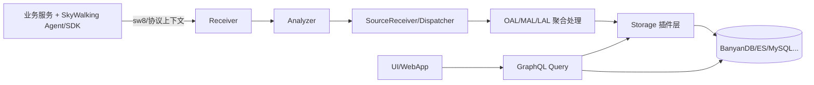

# SkyWalking 全链路源码架构全景（Probe + OAP + Storage + Query/UI）

> 这版按你的要求重写：
>
> 1. 先讲完整架构与组件关系图。
> 2. 再讲功能与实现机理。
> 3. 关键点直接贴“可见源码片段”（不是只给路径）。
> 4. 最后给一个从请求到响应的完整实战链路，按执行顺序串源码。
>
> 说明：当前仓库里没有各语言 Agent 的源码实现（Java/.NET/Go 等探针在独立仓库维护），但有协议与接收端实现，所以本文对 Probe 部分使用“官方协议 + OAP 接收/解析源码”来还原完整链路。

***

## 1. 全局架构认知（先看图）

### 1.1 逻辑架构图



### 1.2 组件分层图（你要的“结构化认知”）

```text
┌─────────────────────────────────────────────────────────────────────┐
│  Probe 层（多语言 Agent / SDK / eBPF）                              │
│  - 自动或手动埋点，生成 Segment/Span                                │
│  - 注入/解析 sw8，跨进程传播上下文                                  │
└──────────────────────────────┬──────────────────────────────────────┘
                               │ gRPC / HTTP / OTLP / Zipkin ...
┌──────────────────────────────▼──────────────────────────────────────┐
│  OAP Receiver 层                                                     │
│  - TraceSegmentReportServiceHandler / REST Handler                  │
│  - 统一转给 ISegmentParserService                                   │
└──────────────────────────────┬──────────────────────────────────────┘
                               │
┌──────────────────────────────▼──────────────────────────────────────┐
│  OAP Analyzer 层                                                     │
│  - TraceAnalyzer 事件分发                                            │
│  - SegmentAnalysisListener / RPCAnalysisListener 等                  │
│  - 产出 Source（Segment、Service、Endpoint、Relation...）            │
└──────────────────────────────┬──────────────────────────────────────┘
                               │
┌──────────────────────────────▼──────────────────────────────────────┐
│  Source 分发与规则引擎                                               │
│  - SourceReceiverImpl + DispatcherManager                            │
│  - OAL 规则驱动指标聚合                                               │
└──────────────────────────────┬──────────────────────────────────────┘
                               │
┌──────────────────────────────▼──────────────────────────────────────┐
│  Storage 插件层                                                      │
│  - BanyanDBStorageProvider 注册 DAO                                  │
│  - SegmentRecord / Metrics / Log / Event / Profile 等模型            │
└──────────────────────────────┬──────────────────────────────────────┘
                               │
┌──────────────────────────────▼──────────────────────────────────────┐
│  Query + UI                                                          │
│  - GraphQLQueryProvider 装载 schema 和 resolver                      │
│  - TraceQueryService 重建 Trace 树                                    │
│  - WebApp 代理 GraphQL / Zipkin API                                  │
└─────────────────────────────────────────────────────────────────────┘
```

***

## 2. Probe（探针）到底在干嘛？和 OAP 怎么接起来？

你提的这个点非常关键。SkyWalking 不是只有 OAP，**探针是数据生产端**。

### 2.1 官方对探针职责的定义（项目内文档）

```md
Server agents in various languages provide auto-instrumentation or/and manual-instrumentation(APIs-based) mechanisms to
integrate with target services. They support collecting traces, logs, metrics, and events ...
```

```md
- Java agent
- LUA agent
- Python Agent
- Node.js agent
- Go agent
- PHP agent
...
```

### 2.2 sw8 上下文传播协议（跨服务链路不断裂的核心）

```C
Header Name: `sw8`.
Header Value: 8 fields split by `-`.
```

```Go
1. Sample
2. Trace ID
3. Parent trace segment ID
4. Parent span ID
5. Parent service
6. Parent service instance
7. Parent endpoint
8. Target address used on client side
```

这意味着：

- 探针负责在出站请求注入 sw8。
- 下游探针解析 sw8，生成 `SegmentReference`，把跨进程父子关系带到 OAP。

### 2.3 OAP 侧如何接收探针上报（对应协议对象）

`Trace Data Protocol` 里的核心对象：

```protobuf
message SegmentObject {
    string traceId = 1;
    string traceSegmentId = 2;
    repeated SpanObject spans = 3;
    string service = 4;
    string serviceInstance = 5;
    bool isSizeLimited = 6;
}
```

```protobuf
message SpanObject {
    int32 spanId = 1;
    int32 parentSpanId = 2;
    int64 startTime = 3;
    int64 endTime = 4;
    repeated SegmentReference refs = 5;
    string operationName = 6;
    string peer = 7;
    SpanType spanType = 8;   // Entry/Exit/Local
    SpanLayer spanLayer = 9; // Http/Database/MQ/...
    bool isError = 11;
    bool skipAnalysis = 14;
}
```

### 2.4 探针埋点第一步（详细版）：从“请求进入”到“可上报 Segment”到底发生了什么？

这一节专门回答你问的“最开始一步怎么做”，我按**实操步骤 + 底层机制 + 输出数据**来拆。

#### 2.4.1 实操步骤（你在业务侧做什么）

1. 给服务挂载 Agent（或接入 SDK）。
2. 配置服务名、实例名、OAP 地址、采样率等基础参数。
3. 启动应用，不改业务代码即可命中自动埋点插件（HTTP、RPC、DB、MQ 等）。
4. 发起一次真实请求（例如 `POST /api/order/create`）。

官方文档对这一步的定义是：

```md
Server agents in various languages provide auto-instrumentation or/and manual-instrumentation(APIs-based) mechanisms...
```

> 自动埋点 = 对框架关键方法做增强；手动埋点 = 你显式调用 SDK API 创建 span。\
> 两种方式最终都要产出同一种上报对象：`SegmentObject`。

#### 2.4.2 底层机制（探针内部在做什么）

虽然各语言实现不同，但核心模型一致，流程如下：

```text
请求进入进程
  -> 创建 EntrySpan（代表服务端入口）
  -> 执行业务代码（可选创建 LocalSpan）
  -> 发生下游调用时创建 ExitSpan
  -> 在出站请求头注入 sw8
  -> 请求结束，关闭 span 并组装 SegmentObject
  -> 批量/流式上报到 OAP
```

#### 2.4.3 sw8 在第一步里的作用（为什么必须做）

`sw8` 不是“可有可无的 header”，而是跨进程父子关系的唯一纽带。协议定义：

```text
Header Name: sw8
Header Value: 8 fields split by '-'
```

8 段字段语义：

1. Sample（采样标记，0/1）
2. Trace ID
3. Parent trace segment ID
4. Parent span ID
5. Parent service
6. Parent service instance
7. Parent endpoint
8. Target address used on client side

这 8 段字段会在下游探针被解析成 `SegmentReference`，字段映射证据如下：

```protobuf
message SegmentReference {
    string traceId = 2;
    string parentTraceSegmentId = 3;
    int32 parentSpanId = 4;
    string parentService = 5;
    string parentServiceInstance = 6;
    string parentEndpoint = 7;
    string networkAddressUsedAtPeer = 8;
}
```

#### 2.4.4 探针最终上报什么（上报对象结构）

“第一步埋点”的直接成果不是日志，而是一段结构化追踪数据：

```protobuf
message SegmentObject {
    string traceId = 1;
    string traceSegmentId = 2;
    repeated SpanObject spans = 3;
    string service = 4;
    string serviceInstance = 5;
    bool isSizeLimited = 6;
}
```

其中 `spans` 里至少会出现三类角色之一：

- `Entry`：服务端入口（Provider / Consumer）
- `Exit`：客户端出站（RPC Client / DB Client / MQ Producer）
- `Local`：进程内本地方法

```protobuf
enum SpanType {
    Entry = 0;
    Exit = 1;
    Local = 2;
}
```

#### 2.4.5 一次真实请求的埋点展开（按时间线）

以 `gateway -> order-service -> inventory-service` 为例：

1. 用户请求到 `gateway`
   - 探针创建 `gateway` 的 `EntrySpan(spanId=0,parent=-1)`。
2. `gateway` 调 `order-service`
   - 创建 `ExitSpan(spanId=1,parent=0)`；注入 `sw8`。
3. `order-service` 收到请求
   - 解析 `sw8`，创建自己的 `EntrySpan`；`refs` 指向 `gateway` 的父 segment/span。
4. `order-service` 调 `inventory-service`
   - 同理创建 `ExitSpan` 并继续传播 `sw8`。
5. 每个服务在请求结束时
   - 关闭所有 span，组装各自 `SegmentObject` 上报 OAP。

你可以把它理解为：\
**Trace 是由多个 Segment 拼接成的，而不是一个进程里一条大对象。**

#### 2.4.6 这一步如何在 OAP 侧被“接住”（闭环验证）

探针上报后，OAP 第一站就是 Receiver，源码逻辑非常直接：

```java
public void onNext(SegmentObject segment) {
    segmentParserService.send(segment);
}
```

这行代码说明：

- Probe 阶段完成后，OAP 不会在 Receiver 做复杂分析；
- 而是立刻把 `SegmentObject` 交给 Analyzer。

Analyzer 入口：

```java
public void send(SegmentObject segment) {
    final TraceAnalyzer traceAnalyzer = new TraceAnalyzer(moduleManager, listenerManager, config);
    traceAnalyzer.doAnalysis(segment);
}
```

这就是“探针埋点第一步”的闭环：\
**业务请求 -> 探针建 Span + 传播 sw8 -> 组装 SegmentObject -> OAP 接收并进入分析流水线。**

#### 2.4.7 你在排查时最该先看的 5 个点（高价值）

1. `service` / `serviceInstance` 是否稳定且命名一致（避免同服务裂变成多个节点）。
2. `EntrySpan` 是否存在且 `spanId=0,parent=-1`（入口识别基础）。
3. `ExitSpan.peer` 是否正确（影响下游拓扑边命中）。
4. `sw8` 是否成功注入与解析（影响跨服务链路连续性）。
5. `isError` / tags 是否按预期上报（影响 SLA、错误率、诊断信息）。

> 一句话：探针埋点第一步决定“有没有数据、数据对不对、链路会不会断”，后面的 OAP 分析再强，也依赖这一步质量。

***

## 3. OAP 启动与模块化：为什么它能支持这么多插件？

### 3.1 启动入口（先启动模块系统）

```java
public static void start() {
    ModuleManager manager = new ModuleManager("Apache SkyWalking OAP");
    ...
    ApplicationConfiguration applicationConfiguration = configLoader.load();
    manager.init(applicationConfiguration);
}
```

### 3.2 ModuleManager 用 SPI 装配模块

```java
public void init(ApplicationConfiguration applicationConfiguration) ... {
    String[] moduleNames = applicationConfiguration.moduleList();
    ServiceLoader<ModuleDefine> moduleServiceLoader = ServiceLoader.load(ModuleDefine.class);
    ServiceLoader<ModuleProvider> moduleProviderLoader = ServiceLoader.load(ModuleProvider.class);
    ...
    module.prepare(this, ..., moduleProviderLoader, ...);
    ...
    BootstrapFlow bootstrapFlow = new BootstrapFlow(loadedModules);
    bootstrapFlow.start(this);
    bootstrapFlow.notifyAfterCompleted();
}
```

核心机理：

- `ModuleDefine` 定义能力接口；`ModuleProvider` 给具体实现。
- 所有 receiver/query/storage 都是模块化插件。

***

## 4. Receiver：Trace 从哪进 OAP？

### 4.1 Trace 模块注册 gRPC + HTTP handler

```java
public void start() {
    GRPCHandlerRegister grpcHandlerRegister = ...
    HTTPHandlerRegister httpHandlerRegister = ...

    TraceSegmentReportServiceHandler traceSegmentReportServiceHandler = new TraceSegmentReportServiceHandler(getManager());
    grpcHandlerRegister.addHandler(traceSegmentReportServiceHandler);
    ...
    httpHandlerRegister.addHandler(new TraceSegmentReportHandler(getManager()), Collections.singletonList(HttpMethod.POST));
}
```

### 4.2 gRPC 接收实现

```java
public StreamObserver<SegmentObject> collect(StreamObserver<Commands> responseObserver) {
    return new StreamObserver<SegmentObject>() {
        @Override
        public void onNext(SegmentObject segment) {
            HistogramMetrics.Timer timer = histogram.createTimer();
            try {
                segmentParserService.send(segment);
            } catch (Exception e) {
                errorCounter.inc();
                log.error(e.getMessage(), e);
            } finally {
                timer.finish();
            }
        }
    };
}
```

### 4.3 HTTP 接收实现（/v3/segment, /v3/segments）

```java
@Post("/v3/segment")
public Commands collectSegment(final SegmentObject segment) {
    try (HistogramMetrics.Timer ignored = histogram.createTimer()) {
        segmentParserService.send(segment);
    } catch (Exception e) {
        errorCounter.inc();
        throw e;
    }
    return Commands.newBuilder().build();
}
```

***

## 5. Analyzer：Segment 怎么变成“可查询 + 可聚合”的数据？

### 5.1 总入口（每个 Segment 创建一个 TraceAnalyzer）

```java
public void send(SegmentObject segment) {
    final TraceAnalyzer traceAnalyzer = new TraceAnalyzer(moduleManager, listenerManager, config);
    traceAnalyzer.doAnalysis(segment);
}
```

### 5.2 TraceAnalyzer 的分发逻辑（按 SpanType 回调）

```java
segmentObject.getSpansList().forEach(spanObject -> {
    if (spanObject.getSpanId() == 0) {
        notifyFirstListener(spanObject, segmentObject);
    }
    if (SpanType.Exit.equals(spanObject.getSpanType())) {
        notifyExitListener(spanObject, segmentObject);
    } else if (SpanType.Entry.equals(spanObject.getSpanType())) {
        notifyEntryListener(spanObject, segmentObject);
    } else if (SpanType.Local.equals(spanObject.getSpanType())) {
        notifyLocalListener(spanObject, segmentObject);
    }
});
notifyListenerToBuild();
```

### 5.3 Listener 注册（你关心的核心实现点）

```java
private SegmentParserListenerManager listenerManager() {
    SegmentParserListenerManager listenerManager = new SegmentParserListenerManager();
    if (moduleConfig.isTraceAnalysis()) {
        listenerManager.add(new RPCAnalysisListener.Factory(getManager()));
        listenerManager.add(new EndpointDepFromCrossThreadAnalysisListener.Factory(getManager()));
        listenerManager.add(new NetworkAddressAliasMappingListener.Factory(getManager()));
    }
    listenerManager.add(new SegmentAnalysisListener.Factory(getManager(), moduleConfig));
    listenerManager.add(new VirtualServiceAnalysisListener.Factory(getManager()));
    return listenerManager;
}
```

***

## 6. 关键 Listener 机制（Trace、拓扑、指标怎么来的）

### 6.1 SegmentAnalysisListener：原始段存储 + 采样 + 可搜索标签

```java
public void parseSegment(SegmentObject segmentObject) {
    segment.setTraceId(segmentObject.getTraceId());
    ...
    duration = accurateDuration > Integer.MAX_VALUE ? Integer.MAX_VALUE : (int) accurateDuration;

    if (sampler.shouldSample(segmentObject, duration)) {
        sampleStatus = SAMPLE_STATUS.SAMPLED;
    } else if (isError && forceSampleErrorSegment) {
        sampleStatus = SAMPLE_STATUS.SAMPLED;
    } else {
        sampleStatus = SAMPLE_STATUS.IGNORE;
    }
}
```

```java
public void parseFirst(SpanObject span, SegmentObject segmentObject) {
    ...
    segment.setDataBinary(segmentObject.toByteArray());
    endpointId = IDManager.EndpointID.buildId(serviceId, endpointName);
}
```

```java
public void build() {
    if (sampleStatus.equals(SAMPLE_STATUS.IGNORE)) {
        return;
    }
    segment.setEndpointId(endpointId);
    sourceReceiver.receive(segment);
    addAutocompleteTags();
}
```

### 6.2 RPCAnalysisListener：构建服务/实例/端点/关系拓扑

```java
public void parseEntry(SpanObject span, SegmentObject segmentObject) {
    if (span.getRefsCount() > 0) {
        ...
        sourceBuilder.setSourceServiceName(reference.getParentService());
        sourceBuilder.setDestServiceName(segmentObject.getService());
        sourceBuilder.setDetectPoint(DetectPoint.SERVER);
        ...
        callingInTraffic.add(sourceBuilder);
    } else {
        sourceBuilder.setSourceServiceName(Const.USER_SERVICE_NAME);
        ...
        callingInTraffic.add(sourceBuilder);
    }
}
```

```java
public void parseExit(SpanObject span, SegmentObject segmentObject) {
    ...
    sourceBuilder.setSourceServiceName(segmentObject.getService());
    ...
    sourceBuilder.setDestServiceName(networkAddress);
    sourceBuilder.setDetectPoint(DetectPoint.CLIENT);
    ...
    callingOutTraffic.add(sourceBuilder);
}
```

```java
public void build() {
    callingInTraffic.forEach(callingIn -> {
        callingIn.prepare();
        sourceReceiver.receive(callingIn.toService());
        sourceReceiver.receive(callingIn.toServiceInstance());
        sourceReceiver.receive(callingIn.toServiceRelation());
        sourceReceiver.receive(callingIn.toServiceInstanceRelation());
        sourceReceiver.receive(callingIn.toEndpoint());
    });
}
```

结论：

- `SegmentAnalysisListener` 保留完整 Trace 原始事实。
- `RPCAnalysisListener` 派生服务拓扑和统计输入。

***

## 7. Source 分发与规则处理：为何扩展性这么强？

### 7.1 SourceReceiver 负责“接收后转发”

```java
public void receive(ISource source) {
    dispatcherManager.forward(source);
}
```

```java
public void scan() throws IOException, InstantiationException, IllegalAccessException {
    ...
    sourceDecoratorManager.addIfAsSourceDecorator(aClass);
    dispatcherManager.addIfAsSourceDispatcher(aClass);
}
```

### 7.2 DispatcherManager 按 scope 路由

```java
public void forward(ISource source) {
    if (source == null) {
        return;
    }
    List<SourceDispatcher<ISource>> dispatchers = dispatcherMap.get(source.scope());
    if (dispatchers != null) {
        source.prepare();
        for (SourceDispatcher<ISource> dispatcher : dispatchers) {
            dispatcher.dispatch(source);
        }
    }
}
```

### 7.3 OAL 规则定义指标（不是手写 if/else）

```oal
service_resp_time = from(Service.latency).longAvg().decorator("ServiceDecorator");
service_sla = from(Service.*).percent(status == true).decorator("ServiceDecorator");
service_cpm = from(Service.*).cpm().decorator("ServiceDecorator");
endpoint_percentile = from(Endpoint.latency).percentile2(10);
service_relation_client_cpm = from(ServiceRelation.*).filter(detectPoint == DetectPoint.CLIENT).cpm();
```

***

## 8. 存储层实现（以 BanyanDB 为例）

### 8.1 存储插件注册 DAO（功能面非常全）

```java
public void prepare() ... {
    config = new BanyanDBConfigLoader(this).loadConfig();
    ...
    this.registerServiceImplementation(ITraceQueryDAO.class, new BanyanDBTraceQueryDAO(...));
    this.registerServiceImplementation(IMetricsQueryDAO.class, new BanyanDBMetricsQueryDAO(client));
    this.registerServiceImplementation(ILogQueryDAO.class, new BanyanDBLogQueryDAO(client));
    this.registerServiceImplementation(IEventQueryDAO.class, new BanyanDBEventQueryDAO(client));
    this.registerServiceImplementation(IAlarmQueryDAO.class, new BanyanDBAlarmQueryDAO(client));
    ...
}
```

### 8.2 Trace 原始记录模型（SegmentRecord）

```java
public class SegmentRecord extends Record implements BanyanDBTrace {
    public static final String SEGMENT_ID = "segment_id";
    public static final String TRACE_ID = "trace_id";
    public static final String SERVICE_ID = "service_id";
    public static final String START_TIME = "start_time";
    public static final String LATENCY = "latency";
    public static final String IS_ERROR = "is_error";
    public static final String DATA_BINARY = "data_binary";
    public static final String TAGS = "tags";
    ...
}
```

```java
public SpanWrapper getSpanWrapper() {
    SpanWrapper.Builder builder = SpanWrapper.newBuilder();
    builder.setSpan(ByteString.copyFrom(dataBinary));
    builder.setSource(Source.SKYWALKING);
    return builder.build();
}
```

### 8.3 BanyanDB Trace 查询（v2）

```java
public List<SpanWrapper> queryByTraceIdV2(final String traceId, @Nullable final Duration duration) throws IOException {
    ...
    query.and(eq(SegmentRecord.TRACE_ID, traceId));
    ...
    for (var span : resp.getTraces().get(0).getSpansList()) {
        trace.add(SpanWrapper.parseFrom(span.getSpan()));
    }
    return trace;
}
```

***

## 9. Query/UI：查询协议如何组织“全功能能力”

### 9.1 GraphQLQueryProvider 一次性装载多类能力

```java
schemaBuilder.file("query-protocol/trace.graphqls")
             .resolvers(new TraceQuery(getManager()))
             .file("query-protocol/trace-v2.graphqls")
             .resolvers(new TraceQueryV2(getManager()))
             .file("query-protocol/topology.graphqls")
             .resolvers(new TopologyQuery(getManager()))
             .file("query-protocol/metrics-v3.graphqls")
             .resolvers(new MetricsExpressionQuery(getManager()))
             .file("query-protocol/log.graphqls")
             .resolvers(new LogQuery(getManager()), new LogTestQuery(getManager(), config))
             .file("query-protocol/alarm.graphqls")
             .resolvers(new AlarmQuery(getManager()))
             .file("query-protocol/event.graphqls")
             .resolvers(new EventQuery(getManager()));
```

### 9.2 TraceQueryService：按 traceId 还原完整 Span 树

```java
public Trace queryTrace(final String traceId, @Nullable final Duration duration) throws IOException {
    getTraceQueryDAO();
    if (supportTraceV2) {
        return invokeQueryTraceV2(traceId, duration);
    } else {
        return invokeQueryTrace(traceId, duration);
    }
}
```

```java
private Trace invokeQueryTraceV2(final String traceId, @Nullable final Duration duration) throws IOException {
    List<SpanWrapper> spanWrappers = ((ITraceQueryV2DAO) getTraceQueryDAO()).queryByTraceIdV2(traceId, duration);
    for (SpanWrapper spanWrapper : spanWrappers) {
        if (spanWrapper.getSource().equals(Source.SKYWALKING)) {
            SegmentObject segmentObject = SegmentObject.parseFrom(spanWrapper.getSpan());
            trace.getSpans().addAll(buildSpanList(segmentObject));
        }
    }
    List<Span> sortedSpans = sortSpans(trace.getSpans());
    ...
    return trace;
}
```

### 9.3 WebApp 代理到 OAP Query

```java
Server.builder()
      .port(port, SessionProtocol.HTTP)
      .service("/graphql", oap)
      .service("/debugging/config/dump", oap)
      .service("/status/config/ttl", oap)
      .service("/status/cluster/nodes", oap)
      ...
      .build()
      .start()
      .join();
```

***

## 10. 核心功能总表（功能 + 实现机理 + 关键代码）

| 功能       | 如何实现                                                               | 关键源码证据                                                            |
| -------- | ------------------------------------------------------------------ | ----------------------------------------------------------------- |
| 分布式追踪    | Agent 生成 Segment/Span，OAP Receiver 接收并 Analyzer 解析                 | `collect(...){ segmentParserService.send(segment); }`             |
| 上下文传播    | sw8 header 8 段字段，跨进程传 trace/parent 信息                              | 协议文档 `Header Name: sw8` + `SegmentReference`                      |
| 拓扑分析     | `RPCAnalysisListener` 将 Entry/Exit span 转成 Service/Relation Source | `sourceReceiver.receive(callingIn.toServiceRelation())`           |
| 指标聚合     | OAL DSL 生成处理逻辑，Dispatcher 将 Source 路由到处理器                          | `service_sla = from(Service.*).percent(...)`                      |
| Trace 查询 | `queryByTraceIdV2` 取 `SpanWrapper`，`TraceQueryService` 反序列化并排序     | `SegmentObject.parseFrom(...)`, `sortSpans(...)`                  |
| 日志/事件/告警 | GraphQL 装载 resolver，Storage 提供对应 DAO                               | `new LogQuery(...)`, `new EventQuery(...)`, `new AlarmQuery(...)` |
| 性能剖析     | Profile/AsyncProfiler/eBPF 对应 Query/Mutation + DAO                 | GraphQL provider 注册 `profile/async-profiler/ebpf`                 |
| 可插拔存储    | StorageModule + Provider 模式，不同后端实现 DAO                             | `registerServiceImplementation(ITraceQueryDAO, ...)`              |

***

## 11. 实战例子（重写版）：下单链路从请求到响应，逐步拆解“你怎么做 + 底层做什么”

场景固定为：`gateway -> order-service -> inventory-service -> mysql`。\
你要验证的目标有三个：

1. 一条完整 Trace 能查出来。
2. 拓扑里有 `gateway -> order-service -> inventory-service`。
3. 指标里有服务 RT/SLA/CPM。

***

### Step 0. 准备认知：这个例子里每层交付什么数据？

1. Probe/SDK 层交付 `SegmentObject`（一段请求上下文）。
2. Receiver 层只做接收与转发，不做复杂业务分析。
3. Analyzer 层把一份 Segment 拆成两类结果：
   - Trace 回放数据（原始段二进制）。
   - 拓扑/指标输入数据（Service、Endpoint、Relation 等 Source）。
4. Query 层把存储中的数据重新组装成 UI 能直接画图的结构。

这一步的意义：先明确每层“职责边界”，后面每个步骤你就知道为什么这么设计。

***

### Step 1. 业务请求发起，探针创建 Span 并传播 sw8

**你在使用过程里做什么**

1. 用户请求 `gateway` 的 `/api/order/create`。
2. `gateway` 调 `order-service`，`order-service` 再调 `inventory-service`。
3. 每次跨进程调用，探针都会在请求头写入 `sw8`。

**底层发生什么**

1. 当前进程内，探针创建 Entry/Exit/Local span。
2. 出站时把当前上下文编码进 `sw8`。
3. 下游收到请求后解析 `sw8`，把父链路信息写入 `SegmentReference`。

协议里的关键结构（父子链路是怎么保存的）：

```protobuf
message SegmentReference {
    string traceId = 2;
    string parentTraceSegmentId = 3;
    int32 parentSpanId = 4;
    string parentService = 5;
    string parentServiceInstance = 6;
    string parentEndpoint = 7;
    string networkAddressUsedAtPeer = 8;
}
```

**这一步的产出**

- 每个服务最终形成自己的 `SegmentObject`，它们通过 `refs` 串成同一条 Trace。

***

### Step 2. 探针把 Segment 上报到 OAP（你能直接模拟）

**你在使用过程里做什么**

1. 可由真实探针自动上报。
2. 或用 HTTP 直接模拟上报（用于排查链路问题）。

模拟请求（官方协议示例风格，`POST /v3/segment`）：

```json
{
  "traceId": "trace-order-001",
  "traceSegmentId": "segment-gateway-001",
  "service": "gateway",
  "serviceInstance": "gateway-instance-1",
  "spans": [
    {
      "spanId": 0,
      "parentSpanId": -1,
      "startTime": 1710000000000,
      "endTime": 1710000000030,
      "operationName": "/api/order/create",
      "spanType": "Entry",
      "spanLayer": "Http",
      "componentId": 6000,
      "isError": false
    },
    {
      "spanId": 1,
      "parentSpanId": 0,
      "startTime": 1710000000005,
      "endTime": 1710000000025,
      "operationName": "POST:/order/create",
      "peer": "order-service:8080",
      "spanType": "Exit",
      "spanLayer": "Http",
      "componentId": 6000,
      "isError": false
    }
  ],
  "isSizeLimited": false
}
```

**底层发生什么**

1. OAP 的 gRPC/HTTP 接收器拿到 `SegmentObject`。
2. 接收器只做轻量操作（计时、异常计数）后立刻转给解析服务。

对应核心代码：

```java
public void onNext(SegmentObject segment) {
    segmentParserService.send(segment);
}
```

```java
public Commands collectSegment(final SegmentObject segment) {
    try (HistogramMetrics.Timer ignored = histogram.createTimer()) {
        segmentParserService.send(segment);
    } catch (Exception e) {
        errorCounter.inc();
        throw e;
    }
    return Commands.newBuilder().build();
}
```

**这一步的产出**

- `SegmentObject` 被可靠交给 Analyzer，Receiver 阶段完成。

***

### Step 3. Analyzer 逐 Span 分派事件（真正开始“理解”数据）

**你在使用过程里做什么**

1. 这一步用户一般无感知。
2. 你在排查时可把关注点放在：Entry/Exit 是否都存在、refs 是否正确。

**底层发生什么**

1. 每个上报 Segment 都创建一个 `TraceAnalyzer`。
2. Analyzer 按 span 类型触发不同 listener。
3. 所有 listener 最后统一执行 `build()` 产出 Source。

对应核心代码：

```java
public void send(SegmentObject segment) {
    final TraceAnalyzer traceAnalyzer = new TraceAnalyzer(moduleManager, listenerManager, config);
    traceAnalyzer.doAnalysis(segment);
}
```

```java
segmentObject.getSpansList().forEach(spanObject -> {
    if (spanObject.getSpanId() == 0) {
        notifyFirstListener(spanObject, segmentObject);
    }
    if (SpanType.Exit.equals(spanObject.getSpanType())) {
        notifyExitListener(spanObject, segmentObject);
    } else if (SpanType.Entry.equals(spanObject.getSpanType())) {
        notifyEntryListener(spanObject, segmentObject);
    } else if (SpanType.Local.equals(spanObject.getSpanType())) {
        notifyLocalListener(spanObject, segmentObject);
    }
});
notifyListenerToBuild();
```

**这一步的产出**

- Listener 已拿到完整上下文，准备分别生成 Trace 数据与拓扑/指标数据。

***

### Step 4. Listener A：落 Trace 原始事实（为“查详情”服务）

**你在使用过程里做什么**

1. 你后续在 UI 点击一条 trace，能看到完整 span 树和 tag/log，本质依赖这里。
2. 如果“有指标但 trace 详情缺失”，先检查这里是否被采样策略忽略。

**底层发生什么**

1. `SegmentAnalysisListener` 先计算 duration/isError。
2. 根据采样策略决定保留或忽略。
3. 保留时写入 `dataBinary = segmentObject.toByteArray()`。

对应核心代码：

```java
if (sampler.shouldSample(segmentObject, duration)) {
    sampleStatus = SAMPLE_STATUS.SAMPLED;
} else if (isError && forceSampleErrorSegment) {
    sampleStatus = SAMPLE_STATUS.SAMPLED;
} else {
    sampleStatus = SAMPLE_STATUS.IGNORE;
}
```

```java
segment.setDataBinary(segmentObject.toByteArray());
```

```java
if (sampleStatus.equals(SAMPLE_STATUS.IGNORE)) {
    return;
}
sourceReceiver.receive(segment);
```

**这一步的产出**

- 存储层拿到可回放的 Trace 原始段（后面 `queryTrace` 会反序列化它）。

***

### Step 5. Listener B：生成服务关系和指标输入（为“拓扑和大盘”服务）

**你在使用过程里做什么**

1. 你期望在拓扑图看到 `gateway -> order-service` 边。
2. 你期望服务级 RT/SLA/CPM 有值。
3. 这两点都依赖 `RPCAnalysisListener` 产出的 Source。

**底层发生什么**

1. `parseEntry` 用 `refs` 判断调用来源（有 refs 为真实上游，无 refs 则标记 USER）。
2. `parseExit` 根据 `peer/networkAddress` 构造出站关系。
3. `build()` 批量输出 Service/Instance/Endpoint/Relation。

对应核心代码：

```java
sourceBuilder.setSourceServiceName(reference.getParentService());
sourceBuilder.setDestServiceName(segmentObject.getService());
sourceBuilder.setDetectPoint(DetectPoint.SERVER);
callingInTraffic.add(sourceBuilder);
```

```java
sourceBuilder.setSourceServiceName(segmentObject.getService());
sourceBuilder.setDestServiceName(networkAddress);
sourceBuilder.setDetectPoint(DetectPoint.CLIENT);
callingOutTraffic.add(sourceBuilder);
```

```java
sourceReceiver.receive(callingIn.toService());
sourceReceiver.receive(callingIn.toServiceInstance());
sourceReceiver.receive(callingIn.toServiceRelation());
sourceReceiver.receive(callingIn.toServiceInstanceRelation());
sourceReceiver.receive(callingIn.toEndpoint());
```

**这一步的产出**

- 拓扑关系边和指标输入事件都准备好，进入统一分发。

***

### Step 6. Source 分发 + OAL 聚合 + 存储（为“可统计查询”服务）

**你在使用过程里做什么**

1. 正常使用时不需要手动介入。
2. 你做性能排查时要看：Source 是否进入 dispatcher，OAL 指标是否定义了对应维度。

**底层发生什么**

1. `SourceReceiverImpl.receive()` 把所有 Source 转交 `DispatcherManager`。
2. `DispatcherManager.forward()` 按 `source.scope()` 找处理器并 dispatch。
3. OAL 规则决定如何聚合（均值、百分位、CPM、SLA 等）。
4. 聚合结果和记录结果分别落到存储 DAO。

对应核心代码：

```java
public void receive(ISource source) {
    dispatcherManager.forward(source);
}
```

```java
List<SourceDispatcher<ISource>> dispatchers = dispatcherMap.get(source.scope());
if (dispatchers != null) {
    source.prepare();
    for (SourceDispatcher<ISource> dispatcher : dispatchers) {
        dispatcher.dispatch(source);
    }
}
```

```oal
service_resp_time = from(Service.latency).longAvg();
service_sla = from(Service.*).percent(status == true);
service_cpm = from(Service.*).cpm();
```

**这一步的产出**

- 一部分数据形成 Trace 原始记录（可还原细节），一部分形成可聚合指标（可画图可告警）。

***

### Step 7. 先查列表，再查详情（Query 层两段式读取）

**你在使用过程里做什么**

1. UI 先查“符合条件的 trace 列表”（时间范围、服务、状态、标签）。
2. 点中某个 traceId 后，再查“完整 trace 详情”。

**底层发生什么**

1. GraphQL resolver `queryBasicTraces` 调 `TraceQueryService.queryBasicTraces(...)` 返回 `TraceBrief`。
2. GraphQL resolver `queryTrace` 调 `TraceQueryService.queryTrace(traceId, duration)` 返回 `Trace`。
3. 若存储支持 v2，走 `queryByTraceIdV2`，取 `SpanWrapper` 后反序列化 `SegmentObject`。

对应核心代码：

```java
public CompletableFuture<TraceBrief> queryBasicTraces(final TraceQueryCondition condition, boolean debug) {
    ...
    TraceBrief traceBrief = invokeQueryBasicTraces(condition);
    ...
}
```

```java
public CompletableFuture<Trace> queryTrace(final String traceId, @Nullable Duration duration, boolean debug) {
    ...
    Trace trace = getQueryService().queryTrace(traceId, duration);
    ...
}
```

```java
List<SpanWrapper> spanWrappers = ((ITraceQueryV2DAO) getTraceQueryDAO()).queryByTraceIdV2(traceId, duration);
SegmentObject segmentObject = SegmentObject.parseFrom(spanWrapper.getSpan());
trace.getSpans().addAll(buildSpanList(segmentObject));
List<Span> sortedSpans = sortSpans(trace.getSpans());
```

**这一步的产出**

- UI 拿到按时间线排序、父子关系完整、带 tag/log/ref 的 Trace 树。

***

### Step 8. 最终响应怎么映射到页面（你看到的每个区域对应哪里）

1. Trace 瀑布图：来自 `SegmentRecord.dataBinary -> SegmentObject.parseFrom -> buildSpanList -> sortSpans`。
2. 服务拓扑：来自 `ServiceRelation/EndpointRelation` 聚合结果。
3. 服务大盘 RT/SLA/CPM：来自 OAL 规则产物（`service_resp_time/service_sla/service_cpm`）。
4. 调试信息（可选）：`queryTrace(..., debug=true)` 会附带执行追踪上下文。

***

### Step 9. 用这个流程排查问题时怎么落地（实用检查单）

1. 看不到 trace 详情：先查 `SegmentAnalysisListener` 是否采样忽略。
2. 有 trace 无拓扑：重点看 `RPCAnalysisListener.parseEntry/parseExit` 是否拿到 refs/peer。
3. 有拓扑无指标：检查 OAL 是否定义对应 scope 指标，dispatcher 是否命中。
4. 列表有数据但点开为空：检查 `queryByTraceIdV2 -> parseFrom(span)` 链路是否异常。
5. 跨服务断链：优先检查 sw8 注入/解析和 `SegmentReference` 字段完整性。

***

## 12. 你这次关心点逐条对应（防漏清单）

1. 不是只有 OAP，还要讲探针：已补 Probe 层、sw8 协议、SegmentReference 语义。
2. 先讲架构和组件关系图：已给 Mermaid + 分层结构图。
3. 不是只给文件位置，要有可见源码：全文已用大量 Java/protobuf/oal 真实片段。
4. 要讲所有核心功能及实现：已覆盖 trace/metrics/log/event/alarm/profile/topology/query/storage。
5. 要按请求到响应顺序串细节：已给 7 步实战链路，逐步贴代码。
6. 整理到原 md：本文件已直接重写为全链路版本。

***

## 13. 一句话总结

SkyWalking 的核心是：**Probe 采集 + sw8 传播形成跨服务上下文，OAP 通过 Listener/Dispatcher/规则引擎把同一份 trace 事实数据同时转化为 Trace 查询、拓扑关系、指标聚合、告警与可视化能力**。
