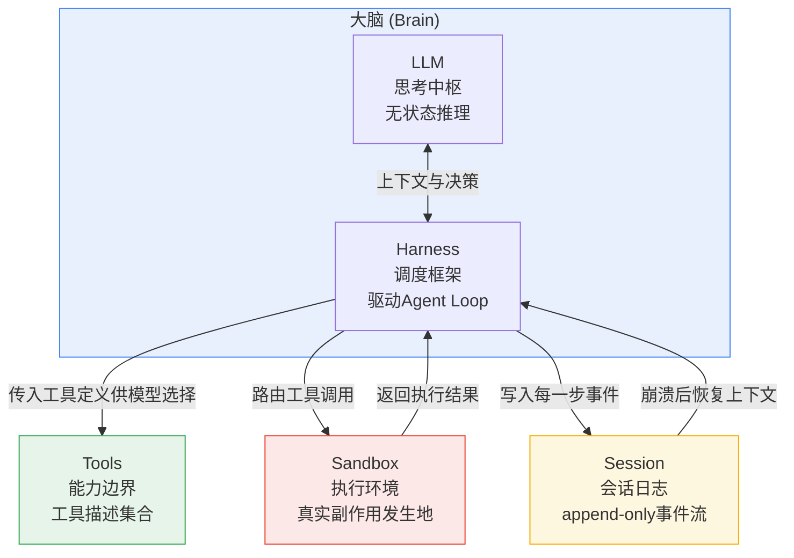
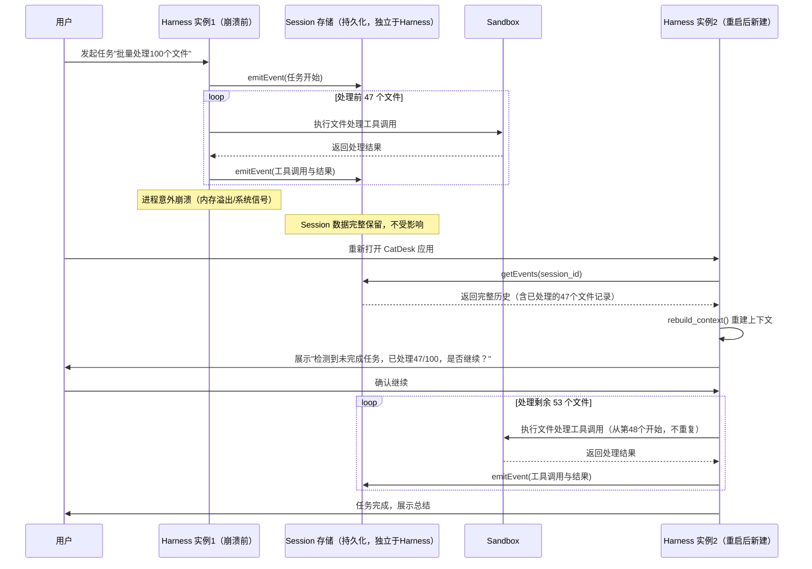

# CatDesk 整体架构设计：桌面端 AI Agent 应用的工程实践

> 本文档系统性梳理桌面端 AI 协作工作台 CatDesk 的整体架构设计，涵盖 Agent 运行时组成、本地模式与云端模式的架构对比、分层设计、容错恢复、安全模型与性能优化等核心议题。文档面向的读者是希望深入理解"桌面端 Agent 应用应该怎么搭"的工程师与架构师。

---

## 目录

1. 引言：为什么需要桌面端 Agent 架构
2. 核心问题：让 Agent 长时间稳定运行的工程挑战
3. Agent 运行组成：五大组件详解
4. 本地模式架构：CatDesk 的架构选择
5. 云端模式架构对比
6. 统一架构原则：Session 作为真相之源
7. 分层架构设计
8. 产品功能架构
9. 容错与恢复机制
10. 安全模型设计
11. 性能优化策略
12. 与行业方案对比
13. 架构演进路线
14. 总结与展望

---

## 第一章 引言：为什么需要桌面端 Agent 架构

### 1.1 从聊天机器人到协作工作台

在过去几年里，"AI 助手"这个产品形态经历了三次明显的跃迁：

第一代产品是纯粹的对话框——用户输入一句话，模型回复一段文字，中间没有任何持久化的执行环境，也没有真正意义上的"动手做事"能力。这一代产品的架构极其简单：一个 HTTP 请求，一个模型推理，一个文本响应，状态几乎全部保存在对话历史里，多轮对话就是把历史拼接后重新丢给模型。

第二代产品引入了工具调用（Tool Use / Function Calling）。模型不再只是"说话"，而是可以"调用函数"——查天气、查资料、执行一段代码。但这一代产品的工具调用大多是短平快的、无副作用的、一次性的：调用一个 API，拿到结果，继续对话。工具执行环境要么是云端一个无状态的沙箱，要么根本不存在持久化的执行上下文。

第三代产品，也就是本文要讨论的对象——桌面端 AI Agent 应用——把"动手做事"这件事情做到了操作系统级别的深度。用户不再只是"问问题"，而是把一整个工作流托付给 Agent：读一份 200 页的 PDF 并总结要点、把一份 Excel 报表转换成图表、批量重命名文件夹里的 300 个文件、监控一个网页并在内容变化时发送通知、定时执行一套数据分析脚本。这些任务的共同特点是：**长时间运行、多步骤、有状态、需要真实的系统访问权限**。

这就是桌面端 Agent 架构诞生的根本原因——当任务的复杂度、时长和对系统资源的依赖程度超过了"一次性工具调用"能够覆盖的范围，就必须有一套专门的运行时架构来支撑 Agent 的"持续存在"和"持续行动"。

### 1.2 桌面端场景的独特性

与纯云端 Agent 服务相比，桌面端 Agent 应用面临一组独特的架构约束，这些约束直接决定了后续所有的设计选择：

**约束一：执行环境就是用户的真实电脑。** 云端 Agent 可以在一个一次性的、隔离的容器里为所欲为，容器销毁了大不了重建。但桌面端 Agent 操作的是用户唯一的、真实的、有持久状态的个人电脑——文件系统里有用户十年积累的文档，浏览器里登录着银行账号，终端里可能正跑着一个不能中断的进程。这意味着安全边界的设计不能照搬云端沙箱的思路，必须考虑"这是用户唯一的电脑，出了问题没有后悔药"这个现实。

**约束二：客户端进程的生命周期不可控。** 云端服务的进程由运维团队管理，可以做到 7x24 小时高可用。但桌面客户端进程会被用户关闭电脑、系统休眠、意外崩溃、被系统资源回收（尤其是笔记本电脑在低电量模式下），这些事件在云端服务里是"故障"，但在桌面客户端里是"日常"。架构必须把"进程随时可能消失"当作一等公民的设计前提，而不是异常情况。

**约束三：本地资源是稀缺且共享的。** 云端可以按需扩容 CPU 和内存，但用户的笔记本电脑内存是固定的 16GB 或 32GB，而且这些资源还要跟用户正在使用的 IDE、浏览器、视频会议软件共享。Agent 如果毫无节制地消耗资源，会直接影响用户的日常工作体验，这是桌面端场景特有的"资源礼貌性"要求。

**约束四：网络连接不稳定但计算需要延续性。** 用户可能在地铁上、在会议室的弱网环境下、在飞机模式切换的间隙使用 Agent。云端推理依赖网络，但本地执行不应该因为网络抖动而丢失状态。这就要求架构必须把"网络中断"和"网络恢复"作为常规状态转换来处理，而不是简单粗暴地报错终止。

**约束五：多面板协作而非单一对话流。** 桌面应用有更大的可视化空间和更丰富的交互范式，用户期望的不再是一个单一的聊天窗口，而是一个类似 IDE 的多面板工作台——侧边栏管理任务、对话区交流意图、预览面板查看产物、终端面板观察底层执行细节。这种产品形态要求架构层面暴露更细粒度的状态和事件流，以驱动多个面板的实时同步渲染。

### 1.3 桌面端 Agent 架构要回答的核心问题

综合以上约束，一个成熟的桌面端 Agent 架构必须清晰地回答以下几个问题：

1. Agent 的"思考"（LLM 推理）和"行动"（工具执行）应该分别跑在哪里？是本地驱动还是云端驱动？
2. 当客户端进程崩溃、电脑重启、网络中断时，Agent 的执行状态如何恢复到崩溃前的现场？
3. 如何在赋予 Agent 完整系统访问能力的同时，防止误操作对用户系统造成不可逆的破坏？
4. 多个面板（对话、预览、终端、产物）如何从同一个执行状态中派生出一致的视图？
5. 当用户需要扩展 Agent 的能力边界（新增工具、新增专业知识）时，架构上如何做到不侵入核心引擎？
6. 长时间运行的任务（可能持续数小时甚至跨越系统重启）如何被可靠地调度和监控？

本文档接下来的所有章节，都是在围绕这六个问题层层展开：先建立 Agent 运行时的通用理论模型（第三章），再落地到本地模式和云端模式两种具体的架构选择（第四、五章），然后提炼出跨模式的统一设计原则（第六章），最后深入到分层设计、产品功能映射、容错恢复、安全模型、性能优化等工程细节（第七章至第十一章）。

### 1.5 目标读者与阅读指南

本文档面向不同的读者群体提供不同的阅读价值，为了让每一类读者都能高效获取所需信息，这里给出建议的阅读路径。

**对于负责架构决策的技术负责人**，建议按顺序通读第一章至第六章，重点关注第三章的五大组件划分、第四五章的本地/云端对比、以及第六章的统一原则，这部分内容回答的是"为什么这样设计"，是理解全局取舍的关键。第十二章的行业方案对比与第十三章的演进路线也值得重点关注，用于评估当前架构在更长时间尺度上的适应性。

**对于负责具体模块开发的工程师**，可以直接跳转到与自己负责模块相关的章节：负责 Harness 核心调度逻辑的工程师应重点阅读第 3.3 节、第 3.8 节状态机模型、第七章分层设计中的 Layer 4；负责沙箱与安全屋的工程师应重点阅读第 3.4 节、第八章 8.3 节、整个第十章安全模型设计；负责各类面板 UI 的工程师应重点阅读第六章 6.5 节的多视图投影原则和第十一章的 UI 渲染性能优化。

**对于负责测试与质量保障的工程师**，建议重点阅读第九章容错与恢复机制（尤其是 9.6 节的混沌工程实践）以及第十章安全模型中关于路径穿越、权限绕过的具体案例，这些内容直接映射为可执行的测试用例设计依据。

**对于新加入团队、需要快速建立整体认知的新人**，建议先读第一章和第二章建立问题意识，再读第三章建立组件模型，然后直接跳到第十四章总结与展望回顾核心要点，最后根据自己的具体工作方向再回头精读对应章节，而不必严格按章节顺序线性阅读全文。

下表进一步汇总了各章节的核心产出物，方便读者按需定位：

```
┌────────┬──────────────────────────┬────────────────────────────┐
│   章节     │          核心问题                │           核心产出物                │
├────────┼──────────────────────────┼────────────────────────────┤
│ 第一章    │ 为什么需要桌面端 Agent 架构      │ 问题域的清晰界定                    │
│ 第二章    │ 长时间稳定运行的工程挑战是什么     │ 五个具体工程挑战的分类框架            │
│ 第三章    │ Agent 运行时由哪些部分组成       │ 五大组件模型（LLM/Harness/            │
│         │                              │ Sandbox/Session/Tools）             │
│ 第四章    │ CatDesk 为什么选择本地模式        │ 本地模式架构图与设计取舍分析          │
│ 第五章    │ 云端模式与本地模式如何权衡         │ 系统性对比表与混合调度场景            │
│ 第六章    │ 如何保证长任务的容错能力           │ Session 真相之源原则与恢复算法        │
│ 第七章    │ 代码应该如何分层组织              │ 五层架构模型与依赖方向规则             │
│ 第八章    │ 产品功能如何映射到架构组件         │ 功能特性到组件的映射表                │
│ 第九章    │ 具体故障场景如何应对              │ 状态机、检查点、混沌测试方法论          │
│ 第十章    │ 安全边界如何设计                 │ 纵深防御模型、安全屋权限设计            │
│ 第十一章  │ 如何保证性能与跨平台体验           │ 各层性能优化策略与跨平台适配方案        │
│ 第十二章  │ 与业界方案相比处于什么位置          │ 与 Anthropic、pi 等方案的对比分析      │
│ 第十三章  │ 未来架构如何演进                 │ 混合调度、跨设备同步等演进方向          │
│ 第十四章  │ 全文核心结论是什么                │ 原则总结与展望                       │
└────────┴──────────────────────────┴────────────────────────────┘
```

---

## 第二章 核心问题：让 Agent 长时间稳定运行的工程挑战

### 2.1 为什么"让 LLM 调用工具"和"构建一个稳定运行的 Agent"是两件完全不同的事

很多人对 Agent 的理解停留在"给大模型加上函数调用能力"这个层面，认为只要模型支持 Tool Use，Agent 就自然而然地成立了。这是一个常见的误解。让我们用一个具体的类比来说明差距在哪里。

假设 LLM 是一个非常聪明的顾问，他可以根据你提供的信息给出决策建议。但这个顾问有一个特殊的限制——他没有记忆，每次咨询完之后就会忘记这次谈话的全部内容。如果你想让这个顾问帮你完成一个需要持续几十轮决策的复杂项目，你不能指望"顾问自己记得项目进展"，你需要一整套配套的机制：

- 有人要把顾问上一次说的话、这一次的最新情况整理好，再喂给顾问（上下文组装）；
- 有人要把顾问做出的决策转化成具体的执行动作，比如联系某个供应商、修改某份合同（工具调用路由）；
- 有人要记录清楚顾问每一次说了什么、做了什么、结果如何，这样即使中途换了一个新顾问接手，新顾问看了记录也能无缝衔接（会话记录）；
- 有人要划定顾问的权限边界，比如他能不能直接花钱、能不能签字、能不能对外发布消息（工具与权限边界）；
- 有人要在这个决策—执行—记录的循环里不断推进，直到项目完成或者中止（驱动循环）。

这一整套配套机制，就是我们说的 Harness（调度框架）。LLM 只是这套系统里"思考"的那一部分，真正让 Agent 变成一个可以长时间稳定运行的系统的，是 Harness 及其背后的运行时架构设计。

### 2.2 长时间运行带来的工程挑战清单

具体拆解下来，让 Agent 长时间稳定运行需要解决以下一系列工程问题，这些问题在原型阶段（一次性对话演示）往往被忽略，但在生产级产品中是决定成败的关键：

**挑战一：上下文窗口的有限性与任务时长的无限性之间的矛盾。** LLM 的上下文窗口是有限的（无论是 128K 还是 1M token），但一个真实的 Agent 任务可能产生远超这个限度的事件流——成百上千次工具调用、大量的中间结果、冗长的文件内容。如果不做任何处理，上下文迟早会溢出。这要求架构必须设计一套上下文压缩、摘要、检索的机制，而这套机制必须构建在一个完整的、不受压缩影响的底层记录之上（这正是 Session 存在的意义之一）。

**挑战二：进程崩溃与恢复的连续性。** 一个可能持续数小时的任务，中途遇到客户端崩溃、系统重启、网络中断的概率并不低。如果每次崩溃都意味着任务从头开始，用户体验和实际可用性都会大打折扣。架构必须支持"从任意断点恢复"，而不是"要么完整成功，要么彻底失败"的二元结局。

**挑战三：工具执行的副作用管理。** 与纯文本生成不同，工具调用往往有真实的副作用——删除文件、发送邮件、执行终端命令、修改系统设置。这些副作用一旦发生就难以撤销。架构需要在"赋予 Agent 足够的行动能力"与"控制副作用的爆炸半径"之间找到平衡，这就引出了沙箱、权限分级、操作确认等一系列安全机制。

**挑战四：多组件之间的状态一致性。** 一个成熟的 Agent 应用不是单一进程、单一状态机，而是由多个协作组件构成——UI 渲染进程、后台任务调度器、工具执行沙箱、云端推理服务。这些组件必须对"Agent 现在处于什么状态、下一步该做什么"有一致的认知，否则会出现 UI 显示"已完成"但后台仍在执行、或者用户已经取消任务但工具调用还在继续执行这类状态错乱问题。

**挑战五：可观测性与可调试性。** 当 Agent 的行为不符合预期时（比如陷入死循环、反复调用同一个工具、生成了错误的文件），工程师和用户都需要能够回溯"Agent 到底经历了什么"。这要求整个执行过程必须是可记录、可重放、可审计的，而不是一个黑盒。

**挑战六：能力边界的可扩展性。** 用户的需求是长尾的——有人需要处理法律文档，有人需要做数据分析，有人需要自动化浏览器操作。如果每一种新能力都需要修改 Agent 核心引擎的代码，扩展速度会远远跟不上需求增长。架构必须支持能力的热插拔式扩展（这正是 Skill 生态和 MCP 协议存在的意义）。

### 2.3 问题的本质：从"一次性推理"到"持续状态机"的范式转变

把以上挑战归纳到一起，可以看到一个共同的主题：**Agent 系统的工程本质，是把一个无状态的、单次调用的推理能力（LLM），改造成一个有状态的、可持续运行的、可恢复的分布式状态机。**

这个改造过程需要引入的核心抽象包括：

```
┌──────────────────────────────────────────────────────────────────┐
│                     从"推理"到"系统"的能力升级                       │
├──────────────────────────────────────────────────────────────────┤
│                                                                    │
│   单次推理能力                          持续运行系统                │
│   ┌───────────────┐                    ┌────────────────────┐    │
│   │  输入 -> LLM   │                    │  事件流 (Session)    │    │
│   │      -> 输出   │        ═══>        │  驱动循环 (Harness)  │    │
│   │  (无状态)      │                    │  执行环境 (Sandbox)  │    │
│   │                │                    │  能力描述 (Tools)    │    │
│   └───────────────┘                    │  恢复机制 (Recovery)  │    │
│                                         └────────────────────┘    │
│                                                                    │
│   缺少：状态持久化                       具备：状态持久化           │
│   缺少：崩溃恢复                         具备：崩溃恢复             │
│   缺少：并发控制                         具备：并发控制             │
│   缺少：权限边界                         具备：权限边界             │
│   缺少：可观测性                         具备：可观测性             │
│                                                                    │
└──────────────────────────────────────────────────────────────────┘
```

理解了这个范式转变之后，我们就可以进入下一章，系统性地拆解构成这个"持续运行系统"的五大组件。

---

## 第三章 Agent 运行组成：五大组件详解

### 3.1 从经典公式到运行时架构

学术界和产品界常用一个简洁的公式来描述 Agent：

```
Agent = LLM + Planning + Memory + Tool Use
```

这个公式抓住了 Agent 在"能力"层面的四个要素，但它是一个功能视角的描述，没有回答"这些能力是怎么被组织和驱动起来的"这个运行时问题。如果我们把视角切换到"如何构建一个可以在生产环境里稳定运行的 Agent 系统"，就需要一套更接近工程实现的分解方式。经过对多种 Agent 实现（包括云端托管 Agent、终端编码 Agent、桌面协作 Agent）的架构梳理，可以提炼出以下五大运行时组件：

```
                         ┌─────────────────────────────────┐
                         │         Agent 运行时全景          │
                         └─────────────────────────────────┘

        ┌───────────────────────────────────────────────────────────┐
        │                        Brain（大脑）                        │
        │  ┌─────────────────┐        ┌──────────────────────────┐  │
        │  │   LLM 思考中枢    │ <────> │    Harness 调度框架        │  │
        │  │  (无状态推理引擎)  │        │   (驱动 Agent Loop 运转)   │  │
        │  └─────────────────┘        └──────────────────────────┘  │
        └───────────────────────────────────────────────────────────┘
                    │                              │
                    │ 决策 (下一步做什么)             │ 读写事件
                    ▼                              ▼
        ┌──────────────────────┐      ┌──────────────────────────┐
        │   Tools 能力边界        │      │    Session 会话日志         │
        │  (工具描述与schema)     │      │  (append-only 事件流)      │
        └──────────────────────┘      └──────────────────────────┘
                    │                              ▲
                    │ 路由调用                       │ 记录结果
                    ▼                              │
        ┌───────────────────────────────────────────────────────────┐
        │                    Sandbox 执行环境（双手）                   │
        │     文件系统 / 终端 / 浏览器 / 外部 API / MCP 服务             │
        └───────────────────────────────────────────────────────────┘
```

这五个组件——LLM、Harness、Sandbox、Session、Tools——彼此之间职责清晰、边界分明，任何一个组件都可以被单独替换而不影响其他组件的正常工作。这种"高内聚、低耦合"的分解方式，正是让 Agent 系统具备工程可维护性的关键。接下来逐一深入拆解。

### 3.2 组件一：LLM——思考中枢

#### 3.2.1 职责定位

LLM 在整个系统里扮演的角色是"思考中枢"：给定当前的上下文（用户意图、历史对话、工具执行结果），LLM 负责推理出下一步应该做什么——是继续对话、调用某个工具、还是宣布任务完成。

这里必须强调一个经常被忽视的本质特征：**LLM 本身是完全无状态的**。每一次调用，模型接收到的输入仅仅是这一次请求所携带的上下文；调用结束、返回结果之后，模型不会记得任何东西。下一次调用如果不重新传入历史上下文，模型对之前发生的一切一无所知。

这个无状态特性意味着，LLM 无法独立驱动一个持续运转的 Agent。它就像一个每次都失忆的专家——非常聪明，但没有人反复去"唤醒"它、给它简报最新情况、并把它的建议转化为行动，它自己什么都做不了。这正是为什么我们需要 Harness 这个组件的根本原因。

#### 3.2.2 接口定义

从架构角度看，LLM 组件对外暴露的接口非常简单，本质上是一个函数：

```typescript
interface LLMInvocation {
  // 输入：完整的上下文（系统提示 + 历史消息 + 工具定义）
  invoke(request: {
    systemPrompt: string;
    messages: Message[];
    tools: ToolDefinition[];
    modelConfig: {
      model: string;
      temperature?: number;
      maxTokens?: number;
      thinkingBudget?: number; // 推理预算，用于支持"扩展思考"模式
    };
  }): Promise<LLMResponse>;
}

interface LLMResponse {
  // 输出：可能是纯文本，也可能包含一个或多个工具调用请求
  content: Array<
    | { type: "text"; text: string }
    | { type: "tool_call"; id: string; name: string; input: object }
    | { type: "thinking"; text: string } // 思维链内容（可选择性展示）
  >;
  stopReason: "end_turn" | "tool_use" | "max_tokens" | "stop_sequence";
  usage: { inputTokens: number; outputTokens: number };
}
```

需要特别注意的是流式传输（Streaming）在真实产品中的重要性。桌面端应用要求 Agent 的输出能够逐字符地实时渲染在对话区，这就要求 LLM 组件的接口必须支持流式响应而不是一次性返回完整结果：

```typescript
interface StreamingLLMInvocation {
  invokeStream(request: LLMInvocationRequest): AsyncIterable<StreamEvent>;
}

type StreamEvent =
  | { type: "text_delta"; text: string }
  | { type: "thinking_delta"; text: string }
  | { type: "tool_call_start"; id: string; name: string }
  | { type: "tool_call_input_delta"; id: string; partialJson: string }
  | { type: "tool_call_end"; id: string }
  | { type: "message_stop"; stopReason: string; usage: TokenUsage };
```

#### 3.2.3 设计原理：为什么把 LLM 抽象为可插拔组件

在 CatDesk 这样的产品中，LLM 组件必须被设计为可插拔的，原因有三：

第一，模型供应商和模型版本会持续演进，产品不能与某一个特定模型强绑定。架构上需要一层 Provider 适配层，把不同模型厂商的 API 差异（消息格式、工具调用协议、流式协议）统一抽象成上面定义的标准接口。

第二，不同任务场景对模型能力的要求不同——有些任务需要强推理能力（比如复杂的多步骤规划），有些任务只需要基础的文本处理能力（比如格式转换）。可插拔设计允许系统根据任务特征动态路由到合适的模型，在效果和成本之间取得平衡。

第三，也是最重要的一点，把 LLM 抽象为独立组件，是为了保证 Harness 层的逻辑不会被特定模型的实现细节污染。Harness 只需要理解"标准化的决策输出"，不需要关心这个决策是由哪个模型、通过什么样的内部机制产生的。

#### 3.2.4 LLM 与 Harness 共同构成"大脑"

值得强调的是，单独的 LLM 并不能被称为"Agent 的大脑"，只有 LLM 与 Harness 结合在一起，才构成一个具备持续思考和决策能力的整体：

```
┌────────────────────────────────────────────────────────────┐
│                         Brain = LLM + Harness                │
│                                                                │
│   LLM 提供：       瞬时的推理能力（给定上下文，做出一次决策）      │
│   Harness 提供：   持续性（不断地调用 LLM、组装上下文、循环推进） │
│                                                                │
│   类比：LLM 像是 CPU 的一次时钟周期计算，                        │
│         Harness 像是驱动 CPU 不断执行指令的时钟信号和总线系统       │
└────────────────────────────────────────────────────────────┘
```

理解这一点非常关键，因为后续讨论"本地模式 vs 云端模式"的架构差异时，两种模式的根本区别恰恰就在于：这个"大脑"（LLM + Harness 的组合）里，Harness 到底跑在本地还是跑在云端。

### 3.3 组件二：Harness——驱动循环

#### 3.3.1 职责定位

如果说 LLM 是思考者，那么 Harness 就是让思考持续发生的那个"心跳"。Harness 的核心职责是运行 Agent 的主循环，业界通常称之为 Agent Loop：

```
                        ┌─────────────────────────┐
                        │       Agent Loop          │
                        │                            │
        ┌───────────────▼──────────────┐             │
        │  1. 组装上下文                  │             │
        │  (系统提示 + 历史 + 工具定义)     │             │
        └───────────────┬──────────────┘             │
                        │                            │
        ┌───────────────▼──────────────┐             │
        │  2. 调用 LLM 获取决策           │             │
        └───────────────┬──────────────┘             │
                        │                            │
        ┌───────────────▼──────────────┐             │
        │  3. 解析输出                    │             │
        │  (是文本？工具调用？任务结束？)   │             │
        └───────────────┬──────────────┘             │
                        │                            │
                ┌───────┴────────┐                   │
                │ 是工具调用       │ 是任务结束/纯文本    │
                ▼                └──────────────────►│ 退出循环
        ┌───────────────────────┐                    等待用户输入
        │  4. 路由到执行环境       │
        │  (Sandbox / MCP / API) │
        └───────────────┬───────┘
                        │
        ┌───────────────▼──────────────┐
        │  5. 收集执行结果                │
        └───────────────┬──────────────┘
                        │
        ┌───────────────▼──────────────┐
        │  6. 把结果写入 Session          │
        └───────────────┬──────────────┘
                        │
                        └──────────► 回到步骤 1，继续下一轮循环
```

这个循环——组装上下文、调用模型、解析决策、路由执行、收集结果、写入记录、再次组装上下文——就是所有 Agent 系统的心脏。不管是终端里的编码助手，还是桌面端的协作工作台，还是云端托管的自动化 Agent，底层都是这同一个循环在转动，区别只在于循环跑在哪里、循环里的每一步具体怎么实现。

#### 3.3.2 两种运行模式的分野点

前文提到的"本地模式"与"云端模式"的核心区别，正是这个 Agent Loop 物理上运行的位置：

```
┌───────────────────────────────────┬───────────────────────────────────┐
│           本地模式                   │            云端模式                  │
├───────────────────────────────────┼───────────────────────────────────┤
│                                     │                                     │
│   用户电脑                           │   用户电脑              云端服务器      │
│   ┌───────────────────┐            │   ┌──────────┐         ┌─────────┐  │
│   │  Harness (Loop)    │            │   │  轻量客户端 │ <─────> │ Harness  │  │
│   │  Agent Loop 跑在这里 │            │   │ (仅展示UI) │         │  (Loop)  │  │
│   └──────────┬─────────┘            │   └──────────┘         └────┬────┘  │
│              │ 本地调用               │                              │      │
│   ┌──────────▼─────────┐            │                        ┌────▼────┐  │
│   │  Sandbox (本地)      │            │                        │ Sandbox  │  │
│   │  文件系统/终端/浏览器  │            │                        │ (云端容器)│  │
│   └────────────────────┘            │                        └─────────┘  │
│                                     │                                     │
│   LLM 调用穿越网络到云端               │   Harness 和 Sandbox 都在云端        │
│                                     │   用户仅通过网络收发 UI 更新事件        │
└───────────────────────────────────┴───────────────────────────────────┘
```

这一点非常关键，值得再强调一次：**无论哪种模式，LLM 推理本身几乎总是在云端完成**（因为大模型的推理需要的算力远超普通消费级设备）。两种模式真正的区别在于——驱动这个循环运转的 Harness，以及循环里执行工具调用的 Sandbox，到底部署在用户本地还是部署在云端服务器。CatDesk 选择的是本地模式，这个选择的具体考量将在第四章详细展开。

#### 3.3.3 Harness 的内部子职责

把 Harness 的职责进一步拆解，可以看到它实际上承担了多个子系统的协调工作：

**上下文管理（Context Management）**：决定每一轮调用时，应该把哪些历史信息传给 LLM。由于上下文窗口有限，Harness 需要实现滚动窗口、摘要压缩、相关性检索等策略，在"保留足够信息让模型做出正确决策"和"不超出上下文限制"之间做权衡。

**工具调用路由（Tool Call Routing）**：当 LLM 决定调用某个工具时，Harness 需要知道这个工具具体应该在哪个执行环境里跑——是本地文件系统操作，还是通过 MCP 协议转发给外部服务，还是调用某个内置的浏览器自动化模块。

**并发与排队控制（Concurrency Control）**：一次 LLM 响应里可能包含多个并行的工具调用请求，Harness 需要决定这些调用是可以并发执行还是必须串行执行（比如两个文件写操作如果修改同一个文件，就必须串行）。

**中断与恢复（Interruption & Resumption）**：用户可能在任务执行到一半时喊停，或者要求修改方向。Harness 需要能够优雅地中断当前的工具执行，把已完成的部分记录下来，并根据新的用户输入调整后续的执行路径。

**错误处理与重试（Error Handling & Retry）**：工具执行可能失败（网络超时、权限不足、文件不存在），Harness 需要决定这次失败是应该重试、应该把错误信息反馈给 LLM 让它调整策略、还是应该直接终止任务并通知用户。

**扩展点管理（Extension Hooks）**：为了支持 Skill、MCP、自定义工具等扩展机制，Harness 通常会在循环的关键节点（调用前、调用后、工具执行前、工具执行后）暴露钩子（Hook），允许外部代码介入、修改甚至阻断某个步骤。这一点会在第七章分层架构设计中详细展开。

#### 3.3.4 伪代码：Agent Loop 的核心实现

下面用伪代码展示 Harness 驱动的 Agent Loop 的核心结构，帮助理解各个子职责是如何在一次循环迭代中协同工作的：

```python
class Harness:
    def __init__(self, llm_client, sandbox, session, tool_registry):
        self.llm = llm_client
        self.sandbox = sandbox
        self.session = session          # append-only 事件日志
        self.tools = tool_registry
        self.hooks = HookManager()      # 扩展点管理器
        self.state = "idle"             # idle | running | paused | stopped

    async def run(self, session_id: str, user_input: str):
        """Agent Loop 的入口，支持从任意断点恢复"""
        # 1. 尝试从已有 Session 恢复上下文，而不是从零开始
        events = self.session.get_events(session_id)
        context = self.rebuild_context(events)
        context.append(UserMessage(user_input))
        self.session.emit_event(session_id, UserMessageEvent(user_input))

        self.state = "running"
        while self.state == "running":
            # 2. 触发前置钩子，允许扩展修改上下文（例如注入 Skill 说明）
            context = await self.hooks.run("before_inference", context)

            # 3. 组装当前可用工具集合（可能因扩展动态变化）
            available_tools = self.tools.resolve(context)

            # 4. 调用 LLM 获取决策（流式）
            response_stream = self.llm.invoke_stream(
                system_prompt=self.build_system_prompt(context),
                messages=context.compress_if_needed(),
                tools=available_tools,
            )

            decision = await self.consume_stream(response_stream, session_id)

            # 5. 判断决策类型：结束轮次 或 需要执行工具
            if decision.stop_reason == "end_turn":
                self.session.emit_event(session_id, AssistantMessageEvent(decision))
                self.state = "idle"
                break

            if decision.stop_reason == "tool_use":
                # 6. 触发工具调用前钩子（可被扩展拦截、修改参数、甚至阻断）
                tool_calls = await self.hooks.run("before_tool_call", decision.tool_calls)

                # 7. 并发/串行调度，路由到 Sandbox 执行
                results = await self.dispatch_tool_calls(tool_calls, session_id)

                # 8. 触发工具调用后钩子
                results = await self.hooks.run("after_tool_call", results)

                # 9. 把结果写回 Session，并加入下一轮上下文
                for r in results:
                    self.session.emit_event(session_id, ToolResultEvent(r))
                context.append_tool_results(results)

            # 10. 检查是否被用户中断
            if self.check_interrupt_flag(session_id):
                self.state = "paused"
                self.session.emit_event(session_id, PausedEvent())
                break

    async def dispatch_tool_calls(self, tool_calls, session_id):
        """区分可并发与需串行的工具调用，路由到正确的执行环境"""
        groups = self.partition_by_side_effect(tool_calls)
        results = []
        for group in groups:
            if group.can_run_concurrently:
                group_results = await asyncio.gather(
                    *[self.sandbox.execute(tc, session_id) for tc in group.calls]
                )
            else:
                group_results = []
                for tc in group.calls:
                    group_results.append(await self.sandbox.execute(tc, session_id))
            results.extend(group_results)
        return results
```

这段伪代码虽然简化，但已经体现出 Harness 承担的关键职责：从 Session 恢复状态而不是从零开始（第 1 步）、可扩展的钩子机制（第 2、6、8 步）、流式消费与实时记录（第 4、5 步）、工具调用的编排调度（第 6-9 步）、以及对中断信号的响应（第 10 步）。这些细节共同构成了一个健壮的驱动循环，而不仅仅是一个"调用模型—执行工具"的简单 for 循环。

### 3.4 组件三：Sandbox——执行环境（双手）

#### 3.4.1 职责定位

Sandbox 是 Agent 真正"动手"的地方——运行代码、编辑文件、执行终端命令、调用外部 API、操作浏览器。这是五大组件中唯一会对外部世界产生真实副作用的组件。

一个非常重要的架构原则是：**Sandbox 严格来说不属于 Agent 本身，而是 Agent 操作的外部环境**。这句话的含义需要仔细体会——LLM、Harness、Session、Tools 这几个组件共同构成了"Agent 是谁、Agent 记得什么、Agent 能做什么"，而 Sandbox 只是"Agent 当前正在使用的一双手"。这双手可以被替换、被销毁、被重建，只要 Session 里记录的历史和状态还在，Agent 换一双新的手继续干活，并不会丢失自己的身份和记忆。

这个设计原则的价值在容错场景下体现得尤为明显：如果本地沙箱进程崩溃（比如终端子进程异常退出），只需要重启一个新的 Sandbox 实例，Harness 依然可以凭借 Session 里的记录知道"上一步做到哪里了"，从而无缝衔接，而不需要把整个 Agent 状态推倒重来。

#### 3.4.2 Sandbox 内部的能力矩阵

在 CatDesk 这样的桌面应用里，Sandbox 并不是一个单一的执行环境，而是一组按能力域划分的执行子系统的集合：

```
┌───────────────────────────────────────────────────────────────┐
│                      Sandbox 能力矩阵                             │
├───────────────────┬───────────────────────────────────────────┤
│  文件系统子系统       │  读/写/移动/删除文件，目录遍历，权限受安全屋约束   │
├───────────────────┼───────────────────────────────────────────┤
│  终端子系统           │  执行 shell 命令，管理长时间运行的子进程          │
├───────────────────┼───────────────────────────────────────────┤
│  浏览器自动化子系统    │  页面导航、元素点击、截图、数据提取               │
├───────────────────┼───────────────────────────────────────────┤
│  MCP 客户端子系统     │  转发工具调用到外部 MCP Server                 │
├───────────────────┼───────────────────────────────────────────┤
│  Skill 加载子系统     │  按需读取 Skill 定义文件，注入到上下文             │
├───────────────────┼───────────────────────────────────────────┤
│  外部 API 网关子系统   │  统一管理需要网络凭证的外部服务调用（如邮件、日历） │
└───────────────────┴───────────────────────────────────────────┘
```

#### 3.4.3 接口定义

```typescript
interface Sandbox {
  // 统一的工具执行入口，屏蔽底层是文件系统调用还是子进程调用
  execute(toolCall: ToolCall, context: ExecutionContext): Promise<ToolResult>;

  // 安全边界检查，在真正执行前进行权限校验
  checkPermission(toolCall: ToolCall, safeHouseLevel: SafeHouseLevel): PermissionDecision;

  // 长时间运行的子进程管理（如终端会话）
  spawnProcess(command: string, options: ProcessOptions): ProcessHandle;

  // 资源清理，进程退出或任务结束时释放句柄
  dispose(): Promise<void>;
}

type PermissionDecision =
  | { allow: true }
  | { allow: false; reason: string }
  | { allow: "ask_user"; confirmationPrompt: string }; // 需要用户二次确认的中间态
```

#### 3.4.4 设计原理：为什么 Sandbox 要与 Harness 解耦

把 Sandbox 设计成一个可插拔、可替换的独立组件，而不是把执行逻辑硬编码进 Harness 内部，有以下几个关键理由：

第一，**支持渐进式的安全策略调整**。CatDesk 的"安全屋"机制（详见第八、十章）需要在"工作区写入模式"和"完全访问模式"之间切换，如果 Sandbox 是一个独立组件，切换安全策略只需要替换 Sandbox 的权限校验实现，而不需要改动 Harness 的循环逻辑。

第二，**支持本地模式与云端模式的无缝切换**。理论上，同一套 Harness 逻辑，如果把本地 Sandbox 替换成一个远程容器化的云端 Sandbox（通过 RPC 转发工具调用），整个系统就从本地模式切换成了云端模式，而 Harness 本身的循环逻辑完全不需要修改。这正是"Harness 与 Sandbox 解耦"带来的架构灵活性。

第三，**故障隔离**。终端子进程崩溃、浏览器自动化驱动异常退出，这些故障都应该被限制在 Sandbox 内部，不应该导致整个 Harness 进程崩溃。清晰的组件边界使得故障隔离和局部重启成为可能。

### 3.5 组件四：Session——会话日志（记忆）

#### 3.5.1 职责定位

Session 记录了 Agent 在单次运行过程中发生的所有事情——每一次 LLM 调用的输入和输出、每一次工具执行的调用参数和返回结果、每一次状态转换。它是整个系统里最重要的、决定架构韧性的组件。

这里需要澄清一个极易混淆的概念：**Session 不是 LLM 的上下文窗口**。上下文窗口是 LLM 推理时实际"看到"的那部分历史，它是有限的、经过压缩和裁剪的、随时可能因为超出 token 限制而丢弃早期内容。Session 则是完整的、持久化的、永不裁剪的原始记录，可以被任意回溯查询。

```
┌──────────────────────────────────────────────────────────────┐
│              Session（完整记录） vs 上下文窗口（工作记忆）           │
├──────────────────────────────────────────────────────────────┤
│                                                                  │
│  Session（磁盘/数据库持久化，append-only）                          │
│  [事件1][事件2][事件3][事件4]...[事件997][事件998][事件999][事件1000] │
│   完整保留，永不丢失，可任意回溯查询                                  │
│                                                                  │
│                          ┌──────────────────────────┐           │
│                          │        上下文窗口            │           │
│                          │  (仅取最近或摘要后的一部分)    │           │
│                          │  [摘要][事件950]...[事件1000] │           │
│                          │  受 token 限制，会被压缩裁剪    │           │
│                          └──────────────────────────┘           │
│                                                                  │
└──────────────────────────────────────────────────────────────┘
```

Session 之所以被称为整个系统的"真相之源"（source of truth），是因为无论上下文窗口如何被压缩、无论 Harness 进程是否崩溃重启、无论 Sandbox 是否被销毁重建，Session 里记录的事件流始终是唯一可信的、完整的历史真相。任何组件想要知道"现在到底发生了什么、之前发生了什么"，都应该去查询 Session，而不是依赖某个组件内存中的临时状态。这个原则将在第六章展开详述。

#### 3.5.2 接口定义

参考行业内对 Session 组件的标准定义，其核心接口极其精简，只有两个关键方法：

```typescript
interface Session {
  // 写入一个新事件，事件一旦写入不可修改（append-only）
  emitEvent(sessionId: string, event: SessionEvent): Promise<EventId>;

  // 读取某个会话的事件切片，支持按范围、按类型过滤
  getEvents(sessionId: string, options?: {
    fromEventId?: EventId;
    toEventId?: EventId;
    types?: EventType[];
  }): Promise<SessionEvent[]>;
}

type SessionEvent =
  | { type: "user_message"; content: string; timestamp: number }
  | { type: "assistant_message"; content: MessageContent[]; timestamp: number }
  | { type: "tool_call_requested"; toolName: string; input: object; callId: string }
  | { type: "tool_call_result"; callId: string; output: object; isError: boolean }
  | { type: "state_transition"; from: AgentState; to: AgentState }
  | { type: "checkpoint"; summary: string }          // 用于压缩的摘要检查点
  | { type: "user_interrupt"; reason: string }
  | { type: "error"; message: string; recoverable: boolean };
```

#### 3.5.3 Session 的物理存储设计

在桌面端场景下，Session 的物理存储需要同时满足几个看似矛盾的要求：写入要足够快（不能拖慢 Agent Loop 的实时性）、要能够支持结构化查询（用于 UI 渲染历史记录、用于恢复逻辑按类型过滤事件）、还要在客户端资源受限的情况下保持轻量。

CatDesk 采用的存储策略是本地嵌入式数据库（如 SQLite）配合追加写入日志文件的混合方案：

```
┌────────────────────────────────────────────────────────────┐
│                   Session 物理存储架构                          │
├────────────────────────────────────────────────────────────┤
│                                                                │
│   写入路径（Write Path）                                         │
│   emitEvent() ──> 内存缓冲队列 ──> 批量刷盘到 SQLite 事件表        │
│                          │                                    │
│                          └──> 同步追加到 .jsonl 日志文件（容灾冗余）│
│                                                                │
│   读取路径（Read Path）                                          │
│   getEvents() ──> 优先查询 SQLite（索引化，支持按类型/时间过滤）    │
│                    │                                          │
│                    └──> SQLite 损坏时降级为重放 .jsonl 日志文件重建 │
│                                                                │
└────────────────────────────────────────────────────────────┘
```

这种设计的考量是：SQLite 提供高效的结构化查询能力，支撑 UI 层"跳转到某条历史消息""按工具类型过滤执行记录"等交互需求；而并行维护的 JSONL 追加日志则提供了一层额外的容灾能力——即便数据库文件因为异常关机等原因损坏，依然可以通过重放日志文件重建出完整的事件序列，这是 append-only 日志结构天然具备的可靠性优势。

#### 3.5.4 Session 与上下文压缩的关系

正因为 Session 是完整无损的，上下文压缩才可以做得足够激进而不用担心信息永久丢失。Harness 在组装每一轮调用的上下文时，可以对 Session 中的历史事件做摘要、做检索式召回、甚至做大幅度截断，因为原始信息始终完好地保存在 Session 里，一旦后续需要，随时可以重新从 Session 中读取补充。

```python
def rebuild_context(self, session_id: str) -> Context:
    """从 Session 重建上下文，演示摘要压缩策略"""
    all_events = self.session.get_events(session_id)

    # 策略：最近 N 轮完整保留，更早的历史用 checkpoint 摘要替代
    recent_window = all_events[-RECENT_EVENT_COUNT:]
    older_events = all_events[:-RECENT_EVENT_COUNT]

    if older_events:
        # 检查是否已存在缓存的摘要 checkpoint，避免重复计算
        cached_checkpoint = self.find_latest_checkpoint(older_events)
        if cached_checkpoint is None:
            summary_text = self.summarize(older_events)  # 调用轻量模型做摘要
            self.session.emit_event(
                session_id, CheckpointEvent(summary=summary_text)
            )
            cached_checkpoint = summary_text
        context = Context(prefix_summary=cached_checkpoint)
    else:
        context = Context()

    context.append_events(recent_window)
    return context
```

这段伪代码体现的核心思想是：压缩发生在"读取时"（构建当前上下文的那一刻），而不是"写入时"（Session 落盘的那一刻）。写入 Session 永远是完整无损的，压缩只是读取路径上的一个视图变换，这保证了压缩策略未来可以随时调整、重新计算，而不会因为过去的压缩决策而丢失原始信息。

### 3.6 组件五：Tools——工具集合（能力边界）

#### 3.6.1 职责定位

Tools 定义了 Agent 能做什么的工具描述集合。每个工具有名字、参数的 JSON Schema 描述、以及返回值格式的约定。Harness 在调用 LLM 时，把这些工具定义作为上下文的一部分传递给模型，模型据此决定在当前情境下应该调用哪个工具、传入什么参数。

工具本身只是"描述"，真正的执行逻辑归属于 Sandbox。这是一个经常被混淆的边界：Tools 组件回答的是"Agent 知道自己能做什么"，Sandbox 回答的是"这个能力具体怎么被执行"。

#### 3.6.2 工具描述的标准结构

```typescript
interface ToolDefinition {
  name: string;                       // 工具唯一标识，如 "read_file"
  description: string;                // 自然语言描述，供 LLM 理解何时使用
  inputSchema: JSONSchema;            // 参数结构定义
  outputSchema?: JSONSchema;          // 返回值结构定义（可选，用于校验）
  metadata: {
    category: "filesystem" | "terminal" | "browser" | "mcp" | "custom";
    sideEffect: "none" | "read_only" | "mutating" | "destructive";
    requiresConfirmation: boolean;     // 是否需要用户二次确认
    concurrencySafe: boolean;          // 是否可与其他工具调用并发执行
  };
}
```

其中 `metadata` 字段是工程实践中容易被忽视但极其重要的部分——它不是给 LLM 看的，而是给 Harness 的调度逻辑和 Sandbox 的权限校验逻辑使用的。例如 `sideEffect: "destructive"` 标记的工具（如删除文件），Harness 在路由执行前会强制触发确认流程；`concurrencySafe: false` 标记的工具，Harness 的并发调度器会将其与其他调用强制串行化，避免竞态条件。

#### 3.6.3 工具集合的动态可扩展性

在 CatDesk 中，工具集合不是一个静态编译时确定的列表，而是运行时可动态扩展的。这是支撑 Skill 生态和 MCP 集成的架构基础：

```
┌─────────────────────────────────────────────────────────────┐
│                    工具集合的分层来源                             │
├─────────────────────────────────────────────────────────────┤
│                                                                 │
│  Layer 1: 核心内置工具（编译时固化）                                │
│    read_file / write_file / bash / edit / glob_search 等         │
│                                                                 │
│  Layer 2: 内置 MCP 提供的工具（应用启动时注册）                       │
│    浏览器自动化 MCP / 图片处理 MCP / 记忆系统 MCP                    │
│                                                                 │
│  Layer 3: 用户配置的外部 MCP Server（运行时动态连接）                 │
│    第三方数据库 MCP / 企业内部系统 MCP                              │
│                                                                 │
│  Layer 4: Skill 引入的"知识型工具用法"（按需加载，非新增工具）          │
│    Skill 本身不新增工具能力，而是指导已有工具如何被更专业地组合使用      │
│                                                                 │
└─────────────────────────────────────────────────────────────┘
```

这个分层设计带来的好处是：核心工具集合保持精简稳定（Harness 的循环逻辑不需要关心 Layer 2/3/4 的存在），而扩展能力通过标准化协议（MCP）或知识注入（Skill）的方式接入，二者互不干扰。这一点将在第七章"分层架构设计"和第八章"产品功能架构"中进一步展开。

### 3.7 五大组件的协作关系总结

到此为止，我们已经详细拆解了 LLM、Harness、Sandbox、Session、Tools 这五个组件各自的职责边界。用一张关系图总结它们之间的协作方式：



这五个组件之间有一条隐含的"稳定性梯度"值得指出：LLM 是无状态的、Sandbox 是易失的（可随时销毁重建）、Harness 进程本身也可能崩溃重启，唯独 Session 是持久化的、append-only 的、永不丢失的。这条稳定性梯度决定了一个核心架构原则——**系统的韧性建立在 Session 之上，而不是建立在任何一个"运行时"组件之上**。这正是第六章要深入讨论的"统一架构原则"。

### 3.8 Agent 的状态机模型

理解了五大组件各自的职责之后，有必要把整个 Agent 运行时抽象成一个显式的状态机，这样才能精确地描述"当前 Agent 处于什么状态、允许从这个状态转换到哪些其他状态"，避免实现中出现模糊地带导致的竞态问题。

#### 3.8.1 状态定义

```
┌──────────────────────────────────────────────────────────────┐
│                     Agent 状态机全景图                             │
└──────────────────────────────────────────────────────────────┘

              ┌─────────┐
   创建会话 ──►│  idle   │◄──────────────────────┐
              └────┬────┘                        │
                   │ 用户输入/调度器触发              │ 任务完成
                   ▼                             │
              ┌─────────┐      工具调用发起中        │
        ┌────►│ running │──────────┐             │
        │     └────┬────┘          ▼             │
        │          │         ┌───────────┐        │
        │          │         │ executing │        │
        │          │         └─────┬─────┘        │
        │          │               │ 结果返回        │
        │  用户恢复   │               └──────────────┘
        │          │ 用户中断/网络中断
        │          ▼
        │     ┌─────────┐
        └─────│ paused  │
              └────┬────┘
                   │ 用户取消/超时未恢复
                   ▼
              ┌─────────┐
              │cancelled│ (终态)
              └─────────┘

              ┌─────────┐
              │completed│ (终态，从 running 直接到达)
              └─────────┘

              ┌─────────┐
              │  failed │ (终态，不可恢复错误)
              └─────────┘
```

#### 3.8.2 状态转换表

严格定义每一种状态转换的触发条件和允许的目标状态，是防止实现中出现"非法状态跳转"的关键手段：

```python
class AgentStateMachine:
    # 定义合法的状态转换表：{ 当前状态: { 触发事件: 目标状态 } }
    TRANSITIONS = {
        "idle": {
            "user_input_received": "running",
            "scheduled_trigger": "running",
        },
        "running": {
            "tool_call_dispatched": "executing",
            "turn_completed_no_tool": "idle",
            "task_completed": "completed",
            "unrecoverable_error": "failed",
            "user_interrupt": "paused",
            "network_lost": "paused",
        },
        "executing": {
            "tool_result_received": "running",
            "tool_crashed_unrecoverable": "failed",
        },
        "paused": {
            "user_resume": "running",
            "user_cancel": "cancelled",
            "resume_timeout_exceeded": "cancelled",
        },
        # completed / cancelled / failed 均为终态，无出边
    }

    def transition(self, current_state: str, event: str) -> str:
        allowed = self.TRANSITIONS.get(current_state, {})
        if event not in allowed:
            raise IllegalStateTransition(
                f"非法状态转换：无法在状态 {current_state} 下响应事件 {event}"
            )
        next_state = allowed[event]
        # 每一次合法的状态转换都必须记录到 Session，
        # 这是第六章"真相之源"原则在状态机层面的具体应用
        return next_state
```

这张状态转换表的价值在于，它把"哪些状态跳转是允许的"这件事从分散在代码各处的隐式判断，收敛成一份集中的、可以被审查和测试的显式声明。例如，`executing` 状态不能直接跳转到 `paused`——用户中断请求必须等当前工具调用返回结果后才能生效，这个约束通过状态表可以被一目了然地看到，而不需要去阅读大段的条件分支代码才能发现。

#### 3.8.3 状态机与五大组件的映射关系

这个状态机并不是一个孤立的抽象，它与前面介绍的五大组件存在明确的映射：

```
┌────────────────┬──────────────────────────────────────────┐
│      状态         │              对应的组件行为                     │
├────────────────┼──────────────────────────────────────────┤
│  idle          │  Harness 空闲，等待新的用户输入或调度触发          │
│  running       │  Harness 正在调用 LLM，等待推理决策               │
│  executing     │  Sandbox 正在执行工具调用，Harness 等待结果       │
│  paused        │  Harness 挂起，Session 已记录暂停原因，          │
│                │  等待外部事件（用户/网络）唤醒                     │
│  completed     │  Session 标记任务完成，供 UI 展示最终态           │
│  cancelled     │  Session 标记任务取消，区别于失败，                │
│                │  语义上是"用户主动放弃"而非"系统无法完成"           │
│  failed        │  Session 标记不可恢复错误，需要人工介入排查         │
└────────────────┴──────────────────────────────────────────┘
```

值得特别说明 `cancelled` 与 `failed` 的语义区分——这两者都是"任务没有正常完成"的终态，但对用户呈现的信息和后续可采取的行动完全不同：`cancelled` 意味着用户主动决定停止，产品上应该允许用户随时"重新发起类似任务"；`failed` 意味着系统遇到了自己无法处理的问题，产品上应该展示具体的错误原因，并可能引导用户联系支持或调整任务描述后重试。这种精细的状态区分能力，是状态机模型相比于简单的布尔标志位（如 `isRunning`）所具备的显著优势。

---

## 第四章 本地模式架构：CatDesk 的架构选择

### 4.1 CatDesk 为什么选择本地模式

CatDesk 作为一款桌面端 AI 协作工作台，在 Harness 和 Sandbox 的部署位置上，选择了"本地模式"——即 Harness（Agent Loop 的驱动逻辑）和 Sandbox（工具执行环境）都运行在用户的本地电脑上，只有 LLM 推理这一环节发生在云端。

```
┌───────────────────────────────────────────────────────────────┐
│                     CatDesk 本地模式架构总览                       │
├───────────────────────────────────────────────────────────────┤
│                                                                   │
│   用户本地电脑（macOS / Windows）                                   │
│  ┌─────────────────────────────────────────────────────────┐    │
│  │                    CatDesk 客户端进程                        │    │
│  │                                                             │    │
│  │  ┌────────────┐   ┌──────────────┐   ┌─────────────────┐ │    │
│  │  │  UI 渲染层   │<->│  Harness 核心  │<->│  Session 存储层    │ │    │
│  │  │ (多面板视图) │   │ (Agent Loop)  │   │ (本地 SQLite)    │ │    │
│  │  └────────────┘   └──────┬───────┘   └─────────────────┘ │    │
│  │                          │                                 │    │
│  │                   ┌──────▼───────────────────────────┐    │    │
│  │                   │         Sandbox 执行层              │    │    │
│  │                   │  文件系统 | 终端 | 浏览器 | MCP 客户端 │    │    │
│  │                   └───────────────────────────────────┘    │    │
│  └─────────────────────────────────┬───────────────────────┘    │
│                                     │ 仅传输推理请求/响应               │
│                                     │ （上下文 + 工具定义 <-> 决策）      │
└─────────────────────────────────────┼───────────────────────────┘
                                       │  网络（HTTPS/流式）
                                       ▼
                        ┌─────────────────────────────┐
                        │        云端 LLM 推理服务          │
                        │   （模型本身部署在云端GPU集群）     │
                        └─────────────────────────────┘
```

这个架构选择直接源于第一章分析的桌面端场景约束——用户需要 Agent 直接、无损耗地操作自己电脑上的真实资源（本地文件、已登录的浏览器会话、本地开发环境、本地安装的各类工具链）。如果把 Harness 和 Sandbox 都放在云端，用户想要"帮我整理桌面上的文件"这类最基础的需求都需要绕一大圈：本地文件先上传到云端、云端处理完再下载回本地，这既增加了延迟，也带来了不必要的数据出境风险。

### 4.2 Agent Loop 跑在本地意味着什么

"Agent Loop 跑在用户的电脑上"这句话背后有具体的工程含义，值得逐层拆解。

#### 4.2.1 驱动循环的物理位置

Harness 的完整驱动循环（组装上下文、调用 LLM、解析决策、路由工具调用、收集结果、写入 Session、再次组装上下文）是在 CatDesk 客户端进程的主线程 / 工作线程中执行的。循环中唯一需要跨越网络边界的步骤，是"调用 LLM 获取决策"这一步——这一步会向云端推理服务发起一次 HTTPS 流式请求，其余所有步骤都是纯粹的本地函数调用。

```
本地模式下 Agent Loop 单次迭代的时间线：

  t0 ──> 组装上下文（本地内存操作，<1ms）
  t1 ──> 调用云端 LLM（网络往返，通常 500ms ~ 数秒，取决于生成长度）
  t2 ──> 解析流式响应（本地，边接收边解析，<1ms/chunk）
  t3 ──> 路由工具调用到 Sandbox（本地函数调用，<1ms）
  t4 ──> Sandbox 执行工具（本地系统调用，耗时取决于操作本身：
         文件读写通常 <10ms，终端命令执行时间不定，浏览器操作可能数百ms到数秒）
  t5 ──> 写入 Session（本地磁盘写入，<5ms，异步批量刷盘）
  t6 ──> 回到 t0，组装下一轮上下文

  ── 可以看到，除了 t1（云端推理）这一步存在网络延迟，
     其余所有步骤都是本地操作，延迟量级在毫秒级别 ──
```

#### 4.2.2 工具执行路径：从决策到落地的完整链路

以"帮我把这个 PDF 转换成 Word 文档"这样一个典型任务为例，完整展示本地模式下工具执行的路径：

```
用户输入 "把 report.pdf 转换成 Word"
        │
        ▼
┌───────────────────────────────────────────────────────┐
│ 1. Harness 组装上下文，附带 Tools 定义                        │
│    （其中 pdf 处理相关的 Skill 说明也被注入，见第八章）           │
└──────────────────────┬──────────────────────────────┘
                        │ 网络请求
                        ▼
┌───────────────────────────────────────────────────────┐
│ 2. 云端 LLM 推理，决定调用 bash 工具执行转换脚本                │
│    返回: { tool: "bash", input: { command: "python ..." } } │
└──────────────────────┬──────────────────────────────┘
                        │ 网络响应流式返回
                        ▼
┌───────────────────────────────────────────────────────┐
│ 3. Harness 解析出工具调用请求，触发 before_tool_call 钩子     │
│    → 安全屋权限校验：当前是"工作区写入"模式，                    │
│      操作目标在工作区内 → 放行                                │
└──────────────────────┬──────────────────────────────┘
                        │ 本地路由
                        ▼
┌───────────────────────────────────────────────────────┐
│ 4. Sandbox 的终端子系统在本地 fork 一个子进程执行命令           │
│    直接读写本地磁盘上的 report.pdf 文件                       │
│    ── 没有任何数据离开用户电脑 ──                              │
└──────────────────────┬──────────────────────────────┘
                        │ 本地结果
                        ▼
┌───────────────────────────────────────────────────────┐
│ 5. 执行结果（成功/失败、输出的文件路径）写入 Session             │
│    UI 的"产物面板"实时订阅 Session 事件，展示新生成的 Word 文件   │
└──────────────────────┬──────────────────────────────┘
                        │ 网络请求（仅文本结果，不含文件本体）
                        ▼
┌───────────────────────────────────────────────────────┐
│ 6. 结果反馈给云端 LLM，模型决定任务完成，返回自然语言总结           │
└───────────────────────────────────────────────────────┘
```

这条链路清晰地展示了本地模式的一个核心特征：**真正的文件内容永远不需要经过网络传输**。传输的只是"决策所需的上下文摘要"和"决策本身"，而具体的文件读写发生在本地。这既是性能优势的来源，也是隐私安全优势的来源。

### 4.3 本地模式的优势

#### 4.3.1 零延迟的工具执行

文件读写、终端命令执行这类操作，在本地模式下就是直接的系统调用，没有任何网络往返开销。相比之下，如果工具执行发生在云端容器里，即便容器本身响应飞快，用户发起操作到看到本地文件系统发生实际变化之间，仍然存在"本地→云端→本地"的数据同步延迟。

对于桌面场景里高频出现的批量文件操作（比如"把这个文件夹里所有截图重命名为日期格式"），零延迟的本地执行意味着处理几百个文件也可以在秒级完成，而不会因为逐个文件的网络往返而拖慢到分钟级。

#### 4.3.2 完整的系统权限

本地模式下，Sandbox 运行在用户的操作系统上，理论上可以访问用户账号权限范围内的一切资源——任意路径的文件、已经登录的浏览器会话（可以直接复用用户的登录态做自动化操作，而不需要重新走一遍登录流程）、本地安装的任意命令行工具、本地运行的开发服务器。

这种完整的系统权限使得 CatDesk 能够支撑非常"接地气"的真实工作流，比如"用我本地安装的 ffmpeg 处理这个视频""连接到我本机启动的开发服务器调试这个 API"，这些能力在纯云端沙箱里几乎不可能实现，因为云端容器根本不知道用户本地装了什么软件、跑着什么服务。

#### 4.3.3 无需网络传输中间结果，降低数据泄露风险

对于处理本地敏感文件（比如公司内部文档、包含个人信息的表格）的场景，本地模式意味着这些文件的完整内容永远不会被上传到任何第三方服务器——真正离开用户电脑、发往云端的，只有 Agent 决策所需要的上下文片段（通常是文本摘要、文件的部分内容片段，而不是整份文件的原始二进制）。这大幅降低了敏感数据在传输链路上被截获或滥用的风险面。

### 4.4 本地模式的挑战

#### 4.4.1 客户端稳定性问题

本地模式最大的软肋在于：如果 CatDesk 客户端进程本身崩溃（可能是内存溢出、依赖库异常、操作系统强制回收资源），正在运行的 Agent Loop 会随之中断。与云端服务不同，本地客户端进程没有"自动重启"的运维保障机制——它依赖操作系统的进程管理，也依赖用户主动重新打开应用。

这个问题的应对策略主要依靠 Session 持久化机制（见第三章 3.5 节和第九章"容错与恢复机制"）：只要每一步事件都被实时写入本地持久化存储，即便客户端进程意外崩溃，用户重新打开应用后，Harness 可以从 Session 中读取最后的状态，向用户展示"上次任务执行到哪一步"，并提供"继续执行"的选项。

#### 4.4.2 用户电脑的资源限制

云端服务可以按需水平扩容，但用户的笔记本电脑的 CPU、内存、磁盘空间是固定的，而且这些资源要与用户正在使用的其他应用（IDE、浏览器多标签页、视频会议软件）共享。如果 CatDesk 的 Sandbox 层不加节制地消耗资源（比如同时打开几十个浏览器自动化实例、缓存了过量的历史文件内容在内存中），会直接拖累用户整机的使用体验。

这要求 CatDesk 的架构必须内置资源治理机制，比如限制并发子进程数量、对长时间运行的浏览器实例做超时回收、对内存中缓存的上下文数据做主动压缩（详见第十一章"性能优化策略"）。

#### 4.4.3 安全边界管理

赋予 Agent 完整的本地系统权限是一把双刃剑——它带来了强大的能力，同时也意味着一次误操作（比如 Agent 错误理解了用户意图，执行了一个删除范围过大的命令）可能对用户的真实数据造成不可逆的破坏。这与云端沙箱"最坏情况下销毁容器重来"的安全模型完全不同。

CatDesk 应对这个挑战的核心机制是"安全屋"——通过分级的权限模式（工作区写入 / 完全访问）和关键操作的二次确认机制，在保留 Agent 行动能力的同时，把误操作的爆炸半径控制在可接受范围内。这个机制将在第八章和第十章详细展开。

### 4.5 本地模式下的多进程架构细化

进一步深入 CatDesk 客户端内部，本地模式并不意味着所有逻辑都挤在单一进程里。为了保证 UI 响应流畅性与工具执行的隔离性，CatDesk 采用了主进程 + 渲染进程 + 沙箱子进程的多进程架构（这也是典型跨平台桌面应用框架的常见模式）：

```
┌────────────────────────────────────────────────────────────────┐
│                    CatDesk 本地多进程架构                            │
├────────────────────────────────────────────────────────────────┤
│                                                                    │
│   ┌──────────────────┐        进程间通信 (IPC)                       │
│   │   主进程 (Main)     │◄─────────────────────┐                     │
│   │  - Harness 核心逻辑  │                       │                     │
│   │  - Session 存储管理  │                       │                     │
│   │  - 权限与安全屋校验   │                       │                     │
│   │  - 生命周期管理       │                       │                     │
│   └────────┬─────────┘                       │                     │
│            │ IPC (事件流推送)                    │                     │
│            ▼                                  │                     │
│   ┌──────────────────┐                ┌──────┴───────────┐        │
│   │  渲染进程 (Renderer)│                │  沙箱工作进程池       │        │
│   │  - 多面板 UI         │                │  - 终端子进程        │        │
│   │  - 实时订阅Session事件│                │  - 浏览器自动化实例   │        │
│   │  - 用户交互采集       │                │  - MCP 客户端连接池   │        │
│   └──────────────────┘                └──────────────────┘        │
│                                                                    │
└────────────────────────────────────────────────────────────────┘
```

这种分离带来的好处是显而易见的：即便某一个终端子进程因为用户执行的命令异常（比如死循环、大量输出）而占满了 CPU，也不会阻塞渲染进程的 UI 响应，用户依然可以正常查看其他面板、取消当前任务；即便某个浏览器自动化实例崩溃，主进程的 Harness 逻辑不受影响，可以捕获这个异常并作为工具执行失败的结果反馈给 LLM，让 Agent 决定下一步是重试还是切换策略。

### 4.6 本地模式下的网络中断处理

由于 LLM 推理必须依赖网络，本地模式还必须妥善处理网络不稳定的情况。CatDesk 的处理策略遵循"本地操作不因网络问题而丢失，网络恢复后可无缝续接"的原则：

```python
class LocalHarness(Harness):
    async def call_llm_with_resilience(self, request, session_id):
        max_retries = 5
        backoff = 1.0
        for attempt in range(max_retries):
            try:
                return await self.llm.invoke_stream(request)
            except NetworkError as e:
                self.session.emit_event(
                    session_id,
                    NetworkRetryEvent(attempt=attempt, error=str(e))
                )
                # 通知 UI 展示"网络连接中，正在重试"的状态，
                # 而不是直接把任务标记为失败
                self.notify_ui_state(session_id, "reconnecting")
                await asyncio.sleep(backoff)
                backoff = min(backoff * 2, 30)  # 指数退避，上限 30 秒
        # 多次重试仍失败：保存现场，转为"已暂停"状态而非"已失败"
        self.session.emit_event(session_id, PausedEvent(reason="network_unavailable"))
        self.notify_ui_state(session_id, "paused_network")
        raise RecoverableInterruption("network_unavailable", session_id)
```

这个设计的关键点在于——网络中断被建模为"可恢复的暂停状态"，而不是"任务失败"。已经完成的工具执行结果都已经写入本地 Session，不会因为网络问题而丢失；一旦网络恢复，用户可以直接点击"继续"，Harness 从 Session 中恢复上下文并继续推进 Agent Loop。

---

## 第五章 云端模式架构对比

### 5.1 云端模式的架构形态

与本地模式相对的是云端模式——Harness 运行在云端服务器上，Sandbox 也部署在云端的隔离容器中，用户通过一个轻量级的 Web 界面或客户端与远端的 Agent 系统交互，本地设备几乎不承担任何计算或执行职责。

```
┌───────────────────────────────────────────────────────────────┐
│                        云端模式架构总览                             │
├───────────────────────────────────────────────────────────────┤
│                                                                   │
│   用户设备（可以是任意能上网的设备：笔记本/平板/手机）                    │
│  ┌─────────────────────┐                                        │
│  │   轻量 Web/客户端 UI    │                                        │
│  │  仅负责渲染与交互采集     │                                        │
│  └──────────┬───────────┘                                        │
│             │ WebSocket / HTTPS（事件流订阅 + 用户输入上传）             │
└─────────────┼─────────────────────────────────────────────────┘
              ▼
┌───────────────────────────────────────────────────────────────┐
│                       云端基础设施                                  │
│                                                                   │
│  ┌───────────────────┐    ┌──────────────────────────────────┐  │
│  │   Harness 服务集群   │<-->│         Sandbox 容器编排层            │  │
│  │  (多租户，弹性伸缩)    │    │  每个会话对应一个隔离的容器/微虚拟机     │  │
│  │  - Agent Loop 逻辑   │    │  - 文件系统在容器内，与宿主机隔离       │  │
│  │  - 上下文管理         │    │  - 网络出口受策略控制                 │  │
│  │  - 与 LLM 推理服务通信 │    │  - 容器销毁 = 环境重置                │  │
│  └─────────┬─────────┘    └──────────────────────────────────┘  │
│            │                                                     │
│  ┌─────────▼─────────────────────────────────────────────────┐  │
│  │              Session 存储（集中式数据库/对象存储）                │  │
│  │           多个 Harness 实例可共享读写同一份会话记录                │  │
│  └───────────────────────────────────────────────────────────┘  │
│                                                                   │
└───────────────────────────────────────────────────────────────┘
```

### 5.2 云端模式的优势

**无限的计算资源。** 云端可以按需水平扩展 Sandbox 容器的规格——需要跑一个消耗大量内存的数据处理任务，随时可以调度到更大规格的容器实例，这是用户本地一台固定配置的笔记本电脑无法比拟的弹性。

**更好的隔离性。** 每个会话运行在独立的容器或微虚拟机里，即便 Agent 执行了某个有风险的操作（比如运行了一段有 bug 的代码导致资源耗尽），影响范围严格限制在这个一次性容器内，销毁重建即可恢复，完全不会波及宿主机或其他用户的会话。这种隔离性是本地模式难以企及的，因为本地模式下 Sandbox 直接操作的是用户唯一的真实系统。

**跨设备访问。** 由于计算完全在远端完成，用户可以从任意设备（办公室的台式机、家里的笔记本、甚至平板）接入同一个正在运行的 Agent 会话，实时看到执行进度，这对于需要长时间运行、用户希望"发起后可以离开，之后随时查看进展"的任务场景非常有价值。

### 5.3 云端模式的挑战

**网络延迟。** 云端模式下，几乎每一次用户交互、每一次工具执行的中间反馈都需要经过网络传输才能呈现给用户，这引入了本地模式所没有的延迟层。对于强交互性的任务（比如需要频繁查看中间结果并调整方向的探索性数据分析），这种延迟会显著影响体验的流畅度。

**无法直接操作本地环境。** 这是云端模式最根本的局限——云端容器里没有用户本地安装的软件、没有用户本地的开发环境配置、无法直接读取用户桌面上的文件、无法复用用户浏览器里已经登录的会话状态。任何需要跟用户本地环境交互的任务，云端模式都必须依赖额外的桥接机制（比如让用户手动上传文件、或者部署一个本地代理程序做数据同步），这些桥接机制本身又引入了新的复杂度和潜在的安全隐患。

### 5.4 两种模式的系统性对比

```
┌─────────────────────┬──────────────────────────┬──────────────────────────┐
│      对比维度          │         本地模式             │          云端模式             │
├─────────────────────┼──────────────────────────┼──────────────────────────┤
│ Harness 运行位置       │ 用户本地电脑                 │ 云端服务器                    │
│ Sandbox 运行位置       │ 用户本地电脑                 │ 云端隔离容器                   │
│ 工具执行延迟            │ 毫秒级（本地系统调用）          │ 受网络往返影响                  │
│ 本地文件/环境访问        │ 原生支持，零成本               │ 需要额外的同步/桥接机制           │
│ 已登录会话复用（浏览器等）│ 原生支持                     │ 困难，通常需要重新认证            │
│ 计算资源弹性            │ 受限于用户设备                 │ 可弹性扩展                      │
│ 隔离性/爆炸半径控制      │ 依赖软件层面的安全屋机制          │ 容器级别的天然隔离               │
│ 崩溃恢复依赖             │ 本地 Session 持久化 + 应用重启   │ 服务端高可用 + Session 集中存储   │
│ 数据出境风险             │ 低（原始文件不离开本地）          │ 相对更高（文件需上传到云端处理）    │
│ 跨设备访问能力           │ 弱（绑定安装应用的设备）           │ 强（任意设备均可接入）           │
│ 离线可用性              │ 部分可用（本地操作可离线，推理不可）  │ 完全依赖网络连接                 │
│ 典型适用场景            │ 本地文件处理、开发环境交互、隐私敏感任务│ 长时间批处理任务、多设备协作、重计算任务│
└─────────────────────┴──────────────────────────┴──────────────────────────┘
```

### 5.5 CatDesk 的选择逻辑与混合可能性

CatDesk 定位为桌面端 AI 协作工作台，其核心使用场景——文档处理、本地文件整理、开发环境辅助、浏览器自动化——高度依赖对用户本地环境的直接访问能力，这决定了本地模式是更契合产品定位的架构选择。

但这并不意味着云端模式的能力在 CatDesk 的架构中完全缺席。实际上，CatDesk 内置的"自动化任务"能力（定时执行 AI 任务）在概念上就带有一定的云端模式特征——当用户设定一个定时任务后，即便本地客户端没有主动打开，理想的架构演进方向是让这类任务能够被云端的调度基础设施接管执行，执行结果通过 Session 同步回本地供用户查看。这种"核心交互在本地、部分长周期任务可下沉到云端"的混合架构，将在第十三章"架构演进路线"中详细讨论。

### 5.6 两种模式共享的核心原则

尽管本地模式与云端模式在物理部署位置上截然不同，两者面临的容错挑战——组件崩溃后如何恢复、如何保证长时间运行任务的连续性——本质上是同构的。这是因为，不管 Harness 跑在哪里，它都可能因为各种原因中断（本地模式下是客户端进程崩溃，云端模式下是服务实例被重新调度或者升级发布）；不管 Sandbox 跑在哪里，它都是易失的、可被销毁重建的执行环境。

正因为存在这种同构性，业界总结出了一条适用于任何部署模式的统一架构原则：**Session 是"真相之源"，任何组件崩溃后都能从 Session 恢复。** 这条原则是下一章要深入展开的核心内容。

### 5.7 云端沙箱隔离技术选型

如果未来 CatDesk 真的走向第 5.5 节所述的混合架构，云端一侧的 Sandbox 隔离技术选型将直接决定安全边界与成本结构，这里做一个系统性的技术选型分析，为未来的架构演进预留决策依据。

#### 5.7.1 三种主流隔离技术的取舍

```
┌─────────────────┬───────────────────┬───────────────────┬───────────────────┐
│      隔离技术         │       容器（如 Docker）  │    微虚拟机（如 Firecracker）│     进程级沙箱（如 gVisor）│
├─────────────────┼───────────────────┼───────────────────┼───────────────────┤
│ 隔离强度            │ 共享内核，隔离性弱        │ 独立内核，接近物理隔离       │ 拦截系统调用，中等隔离       │
│ 启动速度            │ 百毫秒级                │ 约 125ms（专为快启动优化）  │ 百毫秒级                │
│ 内存开销            │ 低（共享内核）            │ 中（每个实例独立内核）      │ 低到中                  │
│ 逃逸风险            │ 相对较高（内核漏洞会          │ 极低（虚拟化硬件级隔离）      │ 较低（用户态拦截系统调用）    │
│                    │ 影响所有容器）             │                          │                          │
│ 适合场景            │ 可信度较高、性能敏感的任务    │ 执行不可信代码、多租户场景   │ 需要精细系统调用审计的场景    │
│ 典型使用者           │ 通用 CI/CD 流水线         │ AWS Lambda、代码执行平台   │ Google Cloud Run       │
└─────────────────┴───────────────────┴───────────────────┴───────────────────┘
```

对于一个需要执行"用户提出的、内容不可预测的 Agent 任务"的平台来说，任务本质上等同于执行不可信代码——Agent 可能会被诱导执行恶意脚本，也可能因为自身推理错误而执行破坏性操作。因此，微虚拟机或至少是加了系统调用过滤的容器方案，是更负责任的选择，纯容器方案的隔离强度不足以应对多租户场景下的安全要求。

#### 5.7.2 一个具体的混合调度场景走查

假设用户在本地 CatDesk 客户端里设置了一个"每天早上八点自动生成前一天的销售数据周报"的自动化任务。走查一下这个任务在混合架构下完整的生命周期，可以更具体地理解本地模式与云端模式如何协作：

```
时间线：一个自动化任务的混合调度生命周期
──────────────────────────────────────────────────────────────
T0  用户在本地客户端配置任务：
    - 定义任务内容（自然语言描述 + 引用的数据源）
    - 定义触发条件（每天 08:00）
    - 客户端将任务定义写入本地 Session，同时上传一份
      任务描述的"云端可执行副本"到云端调度服务

T1  客户端应用被用户关闭（这在本地模式下是完全正常的操作）

T2（第二天 08:00）
    云端调度服务的定时触发器命中，此时本地客户端并未运行：
    - 云端调度服务创建一个云端 Harness 实例
    - 该实例创建一个云端 Sandbox 容器（微虚拟机级隔离）
    - Sandbox 内预置了执行该任务所需的最小权限：
      只读访问指定的数据源 API，无法访问用户本地文件系统
    - Harness 驱动 Agent Loop 执行任务，所有事件写入
      云端 Session 存储（而非本地 Session 文件）

T3  任务执行完成，生成周报文档：
    - 执行结果（周报内容 + 执行过程摘要）被写入云端 Session
    - 云端调度服务向本地客户端发送一条"任务完成"通知
      （通过消息推送服务，不依赖客户端在线）

T4  用户次日打开本地 CatDesk 客户端：
    - 客户端检测到有云端 Session 更新未同步
    - 拉取云端 Session 的增量事件，合并展示到本地界面
    - 用户像查看本地任务记录一样，无缝看到这次云端执行的
      完整过程和最终产出的周报文档
──────────────────────────────────────────────────────────────
```

这个走查揭示了混合架构下几个关键的设计约束：

**约束一：任务定义必须是"可移植"的。** 本地模式下 Agent 可以直接引用用户本地文件路径、本地已登录的浏览器会话，但一旦任务可能被下沉到云端执行，任务定义就不能依赖这些本地特有的上下文，必须通过标准化的数据源引用（API、云端存储路径等）来描述任务需要访问的资源。

**约束二：云端 Session 与本地 Session 需要一致的事件模型。** 正如第六章即将展开的，如果 Session 的事件格式在本地模式和云端模式下不一致，第 T4 步的"合并展示"就需要额外的格式转换层，这会显著增加维护成本。统一的事件模型是让 Session 真正成为"跨部署形态的真相之源"的前提。

**约束三：权限模型必须能够在云端场景下进一步收紧。** 云端执行的任务默认不应该拥有和本地交互式会话同等的权限范围——本地模式下用户实时在场监督，可以随时中断异常行为；云端异步执行时用户不在场，因此云端 Sandbox 的默认权限应该比本地"安全屋"的默认权限更严格，通常只授予任务明确声明所需的最小数据访问范围。

#### 5.7.3 成本模型的额外考量

云端模式还引入了本地模式不存在的显式成本结构，这也是架构选型时不能回避的因素：

```
┌───────────────────────┬─────────────────────────────────────┐
│         成本项              │                  说明                        │
├───────────────────────┼─────────────────────────────────────┤
│ 容器/微虚拟机运行时长费用    │ 按秒或按分钟计费，长时间挂起的会话会持续产生成本   │
│ LLM 推理调用费用            │ 与本地模式相同，但云端场景更容易产生"无人值守      │
│                          │ 情况下的失控循环调用"，需要额外的用量熔断机制      │
│ 存储成本                   │ Session 数据、任务产出文件的云端存储费用          │
│ 出网流量费用                │ Sandbox 访问外部 API、下载文件产生的流量费用      │
│ 冷启动优化的隐性成本         │ 为了降低启动延迟而预热的容器池本身会持续消耗资源   │
└───────────────────────┴─────────────────────────────────────┘
```

这些成本项意味着云端模式的引入不仅是技术架构问题，也是产品成本模型问题——需要为云端下沉的任务设置合理的执行时长上限、调用频率上限，并建立类似第 10.6 节"资源治理"的机制，防止异常任务消耗过多云端资源。

---

## 第六章 统一架构原则：Session 作为真相之源

### 6.1 为什么需要一个"真相之源"

在一个由多个可能独立失效的组件（LLM 调用可能超时、Harness 进程可能崩溃、Sandbox 容器可能被销毁）构成的系统里，如果没有一个明确的、权威的状态来源，系统很容易陷入"各组件对当前状态的认知互相矛盾"的困境。

设想一个反面案例：如果 Agent 的执行状态仅仅保存在 Harness 进程的内存变量里，一旦这个进程崩溃重启，新启动的 Harness 实例对"之前发生了什么"一无所知，只能要求用户重新描述一遍需求、任务从头开始。这不仅是用户体验的灾难，在一些已经产生了部分真实副作用的场景下（比如已经修改了一半的文件），甚至可能导致数据不一致或重复操作的严重后果。

"真相之源"原则的核心主张是：**系统中必须存在一个独立于所有运行时组件（Harness、Sandbox、甚至 LLM 调用本身）的持久化记录，这个记录是唯一被信任的、完整的历史真相，任何组件想要知道当前状态，都应该通过查询这个记录来获得，而不是依赖自己或其他组件的内存状态。** 在 Agent 系统里，扮演这个角色的正是 Session。

### 6.2 Session 独立性的架构意义

回顾第三章介绍的分层关系，Anthropic 提出的参考架构把 Agent 抽象为三个独立组件——Session、Harness、Sandbox——其中特别强调 Session 是一个独立于 Harness 和 Sandbox 存在的实体。这里"独立存在"具有具体的工程含义：

```
┌─────────────────────────────────────────────────────────────┐
│              Session 独立性的三层含义                            │
├─────────────────────────────────────────────────────────────┤
│                                                                 │
│  1. 生命周期独立                                                 │
│     Session 的生命周期不依附于任何一次 Harness 进程的运行，          │
│     Harness 实例可以反复重启、销毁、被新实例替代，                    │
│     只要 Session 还在，Agent 的"记忆"就还在。                       │
│                                                                 │
│  2. 存储位置独立                                                 │
│     Session 的持久化存储（本地 SQLite / 云端数据库）                 │
│     与 Harness 运行所在的进程/容器物理隔离，                        │
│     Harness 进程崩溃不会连带损坏 Session 数据。                     │
│                                                                 │
│  3. 访问接口独立                                                 │
│     Session 只暴露 emitEvent() 和 getEvents() 两个精简接口，        │
│     任何组件（甚至未来replace掉的新Harness实现）                    │
│     都可以通过这套标准接口访问历史，而不需要理解                     │
│     旧 Harness 内部的私有数据结构。                                 │
│                                                                 │
└─────────────────────────────────────────────────────────────┘
```

### 6.3 从崩溃到恢复：一次完整的状态重建流程

以本地模式下 CatDesk 客户端进程意外崩溃为例，展示"Session 是真相之源"这条原则在实际容错流程中是如何发挥作用的：



这个时序图展示的核心价值在于：新启动的 Harness 实例 2 完全不需要知道 Harness 实例 1 崩溃前内部发生了什么具体的实现细节，它只需要通过标准化的 `getEvents()` 接口读取 Session，就能重建出足够的上下文来判断"当前进度是 47/100，接下来应该从第 48 个文件继续处理"，从而实现无缝的断点续传，而不是让用户从头再来一遍。

### 6.4 基于 Session 的幂等性设计

要真正做到"从任意断点恢复且不产生副作用重复"，仅仅记录"发生过什么"还不够，还需要在工具调用层面设计幂等性保障，否则恢复逻辑可能会导致同一个操作被执行两次（比如文件已经被处理过，恢复后又重新处理了一遍）。

CatDesk 采用的策略是为每一个工具调用分配一个全局唯一的 `callId`，并在 Session 中记录"调用请求"与"调用结果"的配对关系：

```python
class IdempotentToolDispatcher:
    def __init__(self, session, sandbox):
        self.session = session
        self.sandbox = sandbox

    async def dispatch(self, tool_call: ToolCall, session_id: str):
        # 恢复场景下，先检查这个 callId 是否已经有对应的结果记录
        existing_result = self.session.find_result_by_call_id(
            session_id, tool_call.call_id
        )
        if existing_result is not None:
            # 已经执行过，直接复用历史结果，不重复执行副作用操作
            return existing_result

        # 未执行过，正常路由到 Sandbox 执行
        self.session.emit_event(
            session_id, ToolCallRequestedEvent(tool_call)
        )
        result = await self.sandbox.execute(tool_call)
        self.session.emit_event(
            session_id, ToolCallResultEvent(tool_call.call_id, result)
        )
        return result
```

这套"请求-结果配对 + 幂等检查"的机制，确保了即便 Harness 因为崩溃在"已经调用了工具但还没来得及记录结果"这样一个极窄的时间窗口内中断，重启后重放这一步时也能通过检查 Sandbox 侧的实际执行痕迹（比如检查目标文件是否已经被修改）来判断是否需要真正重新执行，而不是盲目重复。

### 6.5 Session 之上的多重视图投影

"真相之源"的另一层价值在于：一份完整的 Session 事件流，可以被投影成多种不同的视图，服务于不同的消费方，而不需要为每一种视图单独维护一份状态。

```
┌───────────────────────────────────────────────────────────┐
│                 Session 事件流的多重投影                        │
├───────────────────────────────────────────────────────────┤
│                                                               │
│                    ┌───────────────────┐                     │
│                    │   Session 事件流     │                     │
│                    │  (唯一真相来源)       │                     │
│                    └─────────┬─────────┘                     │
│                              │                                │
│        ┌─────────────────────┼─────────────────────┐          │
│        ▼                     ▼                     ▼          │
│  ┌───────────┐      ┌────────────────┐    ┌───────────────┐  │
│  │ 对话面板视图 │      │  终端面板视图     │    │  产物面板视图    │  │
│  │ 过滤出        │      │  过滤出           │    │  过滤出         │  │
│  │ user_message │      │  bash 类型工具    │    │  文件创建/修改   │  │
│  │ assistant_msg│      │  调用及其原始输出  │    │  类工具调用结果  │  │
│  └───────────┘      └────────────────┘    └───────────────┘  │
│        │                     │                     │          │
│        ▼                     ▼                     ▼          │
│  ┌───────────┐      ┌────────────────┐    ┌───────────────┐  │
│  │  LLM上下文   │      │  调试/审计日志    │    │  任务进度统计    │  │
│  │  重建视图     │      │  用于问题排查     │    │  用于自动化任务  │  │
│  └───────────┘      └────────────────┘    └───────────────┘  │
│                                                               │
└───────────────────────────────────────────────────────────┘
```

这正是 CatDesk"多面板协作布局"背后的架构支撑——侧边栏、对话区、预览面板、产物面板、终端面板这五大区域，本质上都是对同一份 Session 事件流的不同过滤和渲染视图，而不是各自独立维护状态的孤立模块。这样设计的好处是：任何一个面板的显示逻辑发生变化，都不会影响 Session 底层数据结构的稳定性；同时，由于所有视图共享同一个数据源，各面板之间天然保持状态一致，不会出现"对话区显示任务已完成，但产物面板还没更新"这类不一致的问题（只要各面板都正确订阅了 Session 的实时事件流）。

### 6.6 真相之源原则与其他架构模式的关系

值得指出，"Session 作为真相之源"这一原则与分布式系统领域的事件溯源（Event Sourcing）模式高度同构。事件溯源的核心思想是：不直接存储系统的"当前状态"，而是存储导致状态变化的一系列事件，当前状态永远可以通过重放这些事件来推导得出。

Agent 系统采用这一思路是非常自然的选择，因为 Agent 的运行过程本身就是一个高度顺序化的事件序列（一次 LLM 决策、一次工具调用、一次结果反馈），这与事件溯源模式的适用场景高度吻合。表格对比这一原则与传统"状态快照"方式的差异：

```
┌───────────────────┬─────────────────────────┬──────────────────────────┐
│      对比维度        │    状态快照方式（反例）        │   事件溯源方式（Session采用）│
├───────────────────┼─────────────────────────┼──────────────────────────┤
│ 存储内容              │ 当前状态的一份快照            │ 导致状态变化的完整事件序列     │
│ 崩溃恢复能力            │ 只能恢复到最近一次快照点        │ 可恢复到任意历史时间点         │
│ 调试与审计能力          │ 无法知道"如何走到当前状态"       │ 完整的因果链条可回溯          │
│ 支持多视图投影          │ 困难，需要为每种视图单独存储      │ 天然支持，任意过滤即可生成新视图 │
│ 上下文压缩灵活性         │ 压缩即丢失，无法回退           │ 压缩只影响读取视图，原始数据保留 │
└───────────────────┴─────────────────────────┴──────────────────────────┘
```

### 6.7 一个真实故障场景的完整走查

抽象的原则容易理解，但真正检验一个架构设计是否扎实，要看它在具体的、混乱的故障现场能否给出确定性的答案。这里走查一个在本地模式下相当常见的故障场景：**用户正在执行一个多步骤的文件批量处理任务时，操作系统因为内存压力强制杀死了 CatDesk 主进程。**

#### 6.7.1 故障发生前的状态

假设任务是"把文件夹里的 200 张图片依次压缩并重命名"，Agent 已经处理了第 137 张图片时，进程被杀死。在被杀死的一瞬间，系统中真正存在的状态包括：

```
故障发生时刻的状态快照
──────────────────────────────────────────────────────────
Harness 内存状态（随进程一起消失）：
  - 当前 Agent Loop 正在等待第 138 张图片的工具调用结果
  - 上下文窗口中缓存的对话历史（未持久化的部分）
  - 各种运行时计数器、临时变量

Sandbox 状态（部分持久、部分易失）：
  - 已经完成压缩重命名的 137 个文件（持久，写在磁盘上）
  - 第 138 张图片可能处于"正在写入但未完成"的中间状态
  - 子进程（如果调用了外部压缩工具）可能成为孤儿进程

Session 存储状态（持久化，是恢复的唯一依据）：
  - 事件 1～137：每个文件对应一对"工具调用请求"事件与
    "工具调用结果"事件，均已成功写入磁盘
  - 事件 138：工具调用请求事件已写入（发起处理前记录），
    但对应的结果事件缺失（因为进程在完成前被杀死）
  - 事件 139～200：不存在，尚未被 Agent Loop 处理到
──────────────────────────────────────────────────────────
```

#### 6.7.2 恢复流程的关键判断点

CatDesk 重新启动后，恢复逻辑需要依次回答三个问题，而这三个问题的答案完全来自于对 Session 事件序列的分析，不依赖任何进程内存中已经丢失的状态：

**判断点一：任务是否需要恢复？** 通过扫描 Session 的最后若干条事件，判断该会话是否存在一个"已发起但未标记为完成/取消"的任务。如果最后一个任务级事件是"完成"或"取消"，则不需要触发恢复流程，正常展示历史记录即可。

**判断点二：哪些工具调用是"悬空"的？** 遍历 Session 事件，对每一个"工具调用请求"事件寻找是否存在匹配的"工具调用结果"事件（通过 `callId` 配对，这正是第 6.4 节幂等性设计的用武之地）。事件 138 的请求找不到匹配结果，被判定为悬空调用。

**判断点三：悬空调用应该重放还是标记失败？** 这是恢复逻辑中最考验设计的一步，不能一概而论：

```python
def resolve_dangling_call(dangling_event, sandbox):
    """
    对悬空的工具调用做出恢复决策。
    关键在于区分工具操作的幂等性和副作用可逆性。
    """
    tool_name = dangling_event.tool_name

    if tool_name in IDEMPOTENT_TOOLS:
        # 幂等工具（如"压缩并重命名单张图片"，如果实现为
        # "先写入临时文件、成功后原子性 rename"，那么重放是安全的：
        # 要么该图片从未真正生成，重放会正常完成；
        # 要么已经生成，重放会覆盖为完全相同的结果
        return RecoveryAction.REPLAY

    elif tool_name in NON_IDEMPOTENT_IRREVERSIBLE_TOOLS:
        # 非幂等且不可逆的工具（如"向外部 API 发起一次扣款请求"），
        # 绝对不能自动重放，必须先向用户核实该操作是否已经生效
        return RecoveryAction.ASK_USER_TO_CONFIRM_STATE

    else:
        # 无法判断幂等性的未知工具，保守起见标记为失败，
        # 交由 Agent 在下一轮决策中重新评估是否需要重试
        return RecoveryAction.MARK_AS_FAILED_AND_REEVALUATE
```

在这个具体案例中，"压缩重命名单张图片"如果被实现为"先写临时文件、完成后原子 rename 到目标文件名"，就属于天然幂等的操作——不管重放多少次，最终结果都是同一张处理好的图片，绝不会因为重复执行而产生"图片被压缩了两次导致画质进一步劣化"这样的错误结果。这也反过来说明，工具的**幂等性不是恢复机制单方面能保证的，而需要工具实现本身配合设计**，这是第 3.6 节和第 6.4 节反复强调的协作关系在这里的具体体现。

#### 6.7.3 恢复完成后的用户体验

从 Session 的视角完成上述判断后，UI 层面向用户呈现的应该是一个连贯的、几乎无感的恢复过程：

```
用户重新打开 CatDesk 后看到的界面变化时间线
──────────────────────────────────────────────
0.0s  应用启动，读取本地 Session 存储
0.3s  检测到未完成任务，界面显示
      "检测到上次任务意外中断，正在恢复…"
0.5s  完成悬空调用判定，确认第 138 张图片的
      处理操作可安全重放
0.6s  界面更新为"正在从第 138 张图片继续处理"，
      进度条显示 137/200，而不是从 0 重新开始
1.2s  重放执行完成，Agent Loop 自动继续处理
      第 139 张及后续图片，用户几乎感知不到
      中间发生过一次进程崩溃
──────────────────────────────────────────────
```

这个走查完整地验证了本章的核心论点：只要 Session 完整记录了任务过程中的每一次关键决策与结果，即便驱动这一切的 Harness 进程在任意时刻崩溃，系统依然能够基于这份记录做出确定性的、正确的恢复决策，而不需要用户从头重新发起任务。这正是"Session 作为真相之源"这一架构原则在工程实践中所要交付的核心价值。

---

## 第七章 分层架构设计

### 7.1 为什么需要分层：从耦合系统到可替换组件

第三章介绍五大组件时提到的"高内聚、低耦合"，在实际工程落地时需要一套具体的分层规则来保证。如果不加约束，很容易在开发迭代过程中让工具的具体实现细节渗透进 Agent Loop 的核心逻辑，或者让 UI 渲染逻辑直接依赖底层沙箱的实现细节，最终导致整个系统变成一个牵一发而动全身的巨石应用。

业界一个值得借鉴的分层设计思路，是把编码类 Agent 系统拆分成四个独立的、职责边界清晰的分包，每一层只依赖它下面的层，不感知上面的层的存在：

```
┌────────────────────────────────────────────────────────────┐
│               参考分层设计（四层分包思路）                          │
├────────────────────────────────────────────────────────────┤
│                                                                │
│   Layer 4:  harness 胶水层                                     │
│             把 agent-core 接上文件工具、session、                 │
│             多种运行模式、扩展系统                                │
│             （知道"这是一个编码助手"，知道 UI、知道具体工具）        │
│                                                                │
│   Layer 3:  UI 组件原语层                                       │
│             终端/图形界面的渲染原语，与 Agent 逻辑无关              │
│                                                                │
│   Layer 2:  纯 Agent Loop 核心层                                │
│             消息 -> 模型 -> 工具 -> 消息，与 UI/IO 无关            │
│             （不知道有 read/bash/edit 工具，不知道有界面）          │
│                                                                │
│   Layer 1:  LLM 工具层                                         │
│             provider 适配、流式处理、鉴权、embedding              │
│                                                                │
└────────────────────────────────────────────────────────────┘
```

这个分层设计里最关键的洞察是：**Agent Loop 本身（第二层）与"这是一个编码助手/文档助手/其他任何具体形态的 Agent"（第四层）是完全解耦的**。第二层只理解抽象的"消息-模型-工具-消息"循环，它甚至不知道有 `read_file`、`bash` 这些具体工具的存在，更不知道有终端 UI 或图形界面的存在。真正把这些具体能力组装起来、变成一个"看起来像编码助手"的产品，是第四层胶水层的职责。

### 7.2 CatDesk 的分层架构映射

借鉴上述四层分包的思路，CatDesk 作为一个更加复杂的桌面协作应用（不仅仅是编码助手，还包含多面板 UI、Skills 生态、自动化任务、浏览器自动化等丰富功能），其分层设计在此基础上做了针对性的扩展：

```
┌──────────────────────────────────────────────────────────────────┐
│                     CatDesk 完整分层架构                              │
├──────────────────────────────────────────────────────────────────┤
│                                                                      │
│  ┌────────────────────────────────────────────────────────────┐   │
│  │  Layer 5: 产品胶水层 (Product Harness)                          │   │
│  │  - 多面板 UI 状态管理与事件订阅                                   │   │
│  │  - Skills 生态加载与知识注入                                     │   │
│  │  - 安全屋策略配置与执行                                          │   │
│  │  - 自动化任务调度器                                              │   │
│  │  - 记忆系统（长期记忆/每日记忆）集成                                │   │
│  └────────────────────────────┬───────────────────────────────┘   │
│                                │                                    │
│  ┌────────────────────────────▼───────────────────────────────┐   │
│  │  Layer 4: 核心编排层 (Agent Harness Core)                        │   │
│  │  - Agent Loop 主循环驱动                                          │   │
│  │  - 上下文组装与压缩策略                                            │   │
│  │  - 工具调用路由与结果收集                                          │   │
│  └────────────────────────────┬───────────────────────────────┘   │
│                                │                                    │
│  ┌────────────────────────────▼───────────────────────────────┐   │
│  │  Layer 3: Session 持久化层                                     │   │
│  │  - 本地 SQLite / JSONL 事件存储                                  │   │
│  │  - 事件读写标准接口 emitEvent / getEvents                        │   │
│  └────────────────────────────┬───────────────────────────────┘   │
│                                │                                    │
│  ┌────────────────────────────▼───────────────────────────────┐   │
│  │  Layer 2: Sandbox 执行层                                       │   │
│  │  - 文件系统 / 终端 / 浏览器自动化 / MCP 客户端                     │   │
│  └────────────────────────────┬───────────────────────────────┘   │
│                                │                                    │
│  ┌────────────────────────────▼───────────────────────────────┐   │
│  │  Layer 1: LLM 接入层                                           │   │
│  │  - Provider 适配、流式处理、鉴权、SSO 集成                          │   │
│  └────────────────────────────────────────────────────────────┘   │
│                                                                      │
└──────────────────────────────────────────────────────────────────┘
```

这五层的依赖方向是严格单向的——上层可以调用下层暴露的接口，下层绝不感知上层的存在。例如 Layer 2 的 Sandbox 执行层完全不知道 Layer 5 里"Skills 生态"这个概念的存在，它只知道自己收到了一个标准化的工具调用请求，需要返回一个标准化的执行结果；至于这个工具调用是不是由某个 Skill 引导 LLM 发起的，与 Sandbox 毫无关系。这种严格的单向依赖，是保证系统可维护、可测试、可局部替换的架构基石。

### 7.3 Layer 1：LLM 接入层

这一层的职责是把不同模型厂商千差万别的 API 协议，统一封装成第三章定义的标准化 `LLMInvocation` 接口。除了协议适配，这一层还承担着与身份认证体系集成的职责——CatDesk 作为面向组织内部用户的桌面应用，其 LLM 调用凭证的获取需要与 SSO 认证体系打通，用户通过桌面客户端登录后，凭证会被安全地缓存并用于后续所有的推理请求鉴权。

```typescript
class LLMAccessLayer implements LLMInvocation {
  private providerAdapters: Map<string, ProviderAdapter>;
  private authTokenProvider: SSOTokenProvider;

  async invoke(request: LLMRequest): Promise<LLMResponse> {
    // 1. 从 SSO 集成模块获取当前有效的身份凭证，过期则自动刷新
    const token = await this.authTokenProvider.getValidToken();

    // 2. 根据当前选定的模型路由到对应的 Provider 适配器
    const adapter = this.providerAdapters.get(request.modelConfig.model);

    // 3. 转换为该 Provider 的原生请求格式并发起调用
    const rawResponse = await adapter.call(request, token);

    // 4. 统一转换回标准化的 LLMResponse 结构
    return adapter.normalizeResponse(rawResponse);
  }
}
```

这一层的稳定性直接决定了整个 Agent 系统的可用性，因此在工程实践中通常会内置多重防护：请求级别的超时控制、指数退避重试（如第四章 4.6 节所示）、以及在多模型可用时的自动降级路由（主力模型不可用时切换到备用模型，保证核心功能不中断）。

### 7.4 Layer 2：Sandbox 执行层

这一层对应第三章介绍的 Sandbox 组件，是所有具体执行能力的聚合点。分层设计要求这一层对上层（核心编排层）暴露的接口必须是与"具体工具是什么"无关的统一契约——不管是文件读写、终端命令、还是浏览器点击，从核心编排层的视角看，都是"传入一个标准化的工具调用描述，返回一个标准化的执行结果"。

这一层内部按能力域进一步划分为独立的子模块（文件系统子系统、终端子系统、浏览器自动化子系统、MCP 客户端子系统），每个子模块可以独立开发、独立测试、独立发布，只要它们遵守统一的 `execute()` 契约，就可以被核心编排层无差别地调度。

### 7.5 Layer 3：Session 持久化层

这一层对应第三章介绍的 Session 组件，实现上必须做到对上层完全透明——核心编排层不需要知道 Session 底层用的是 SQLite 还是其他存储引擎，只需要调用标准化的 `emitEvent()` 和 `getEvents()`。这种透明性保证了未来如果需要把本地 SQLite 升级为更高性能的嵌入式数据库，或者需要支持 Session 数据的云端同步备份，改造范围可以被严格限制在这一层内部，不需要牵动上层任何逻辑。

### 7.6 Layer 4：核心编排层（Agent Harness Core）

这是整个分层体系里最核心、也最应该保持"纯粹"的一层。参考行业实践中"agent loop 与 coding agent 解耦"的设计理念，这一层只理解抽象的"消息-模型-工具-消息"循环逻辑，它不应该包含任何与具体产品形态相关的假设。

具体而言，这一层不应该出现类似"如果是 PDF 处理任务就怎样"这样的业务分支判断，也不应该硬编码"多面板 UI 需要哪些事件类型"这样的产品细节。它只需要稳定地驱动 Agent Loop 运转，把工具定义交给 LLM、把 LLM 的决策路由给 Sandbox、把结果记录进 Session。所有具体的产品化逻辑（Skills 如何被加载、安全屋规则如何生效、多面板如何渲染）都被推到了更上层的 Layer 5。

这种设计带来的直接好处是：核心编排层可以被高度复用和充分测试——它的正确性验证不需要依赖任何具体的 UI 或者具体的业务工具，只需要构造标准化的 mock 工具和 mock LLM 响应，就可以对 Agent Loop 的调度逻辑做完备的单元测试。

### 7.7 Layer 5：产品胶水层（Product Harness）

这一层是 CatDesk 区别于一个通用 Agent Loop 库、真正成为一个完整产品的关键所在。它把下层提供的通用能力，与具体的产品功能（多面板协作、Skills 生态、安全屋、自动化任务、记忆系统）粘合在一起。

以 Skills 生态的加载为例，展示这一层是如何在不侵入核心编排层的前提下，实现能力扩展的：

```python
class ProductHarness:
    def __init__(self, core_harness: AgentHarnessCore, skill_registry, safe_house):
        self.core = core_harness
        self.skills = skill_registry
        self.safe_house = safe_house
        # 通过核心编排层暴露的钩子机制注册扩展逻辑，
        # 而不是修改核心编排层的代码
        self.core.hooks.register("before_inference", self.inject_relevant_skills)
        self.core.hooks.register("before_tool_call", self.safe_house.check_permission)

    async def inject_relevant_skills(self, context):
        """在每一轮推理前，根据当前上下文动态判断是否需要注入某个 Skill 的说明"""
        candidate_skills = self.skills.match_by_intent(context.latest_user_message)
        for skill in candidate_skills:
            context.append_system_note(skill.load_definition())
        return context
```

可以看到，Skills 生态的接入完全是通过 Layer 4 暴露的钩子机制（`before_inference`）实现的，Layer 4 本身的代码不需要感知"Skill"这个概念的存在。这正是分层架构追求的理想状态——功能的横向扩展不需要侵入纵向的核心逻辑。

### 7.8 分层架构与可测试性、可替换性的关系

分层设计带来的工程价值，最终体现在两个可衡量的指标上：可测试性与可替换性。

**可测试性方面**，由于每一层都通过标准化接口与相邻层交互，测试某一层的逻辑时，可以用轻量级的桩实现（stub）替代上下相邻层的真实实现。比如测试 Layer 4 核心编排层的工具调用调度逻辑时，完全不需要启动真实的 Sandbox（不需要真的去操作文件系统），只需要提供一个返回预设结果的桩 Sandbox 即可。

**可替换性方面**，前文提到的"本地模式与云端模式共享同一套 Layer 4 核心编排层，只是 Layer 2 的 Sandbox 实现不同"就是这一优势最直接的体现。理论上，如果要把 CatDesk 的本地 Sandbox 替换成一个远程容器化的执行环境，只需要重新实现一个遵循相同 `execute()` 契约的 RemoteSandbox 类，Layer 4 及以上的所有代码都不需要改动。

```
┌───────────────────────────────────────────────────────────┐
│              分层架构支撑的可替换性示例                            │
├───────────────────────────────────────────────────────────┤
│                                                               │
│   同一套 Layer 3/4/5                                          │
│         │                                                    │
│         ├──── 搭配 LocalSandbox  ────> 构成"本地模式" CatDesk    │
│         │                                                    │
│         └──── 搭配 RemoteSandbox ────> 构成"云端模式" 变体        │
│               (通过 RPC 转发到云端容器执行)                        │
│                                                               │
└───────────────────────────────────────────────────────────┘
```

---

## 第八章 产品功能架构

本章把第一章提到的六大产品功能——多面板协作布局、Skills 生态、安全屋机制、自动化任务、浏览器自动化、MCP 支持、记忆系统——逐一映射回第三章和第七章建立的组件与分层模型，说明每个产品功能具体是靠哪些架构组件支撑起来的。

### 8.1 多面板协作布局

CatDesk 的界面由侧边栏、对话区、预览面板、产物面板、终端面板五大区域组成，且这些区域可以被用户自由调整布局。从架构角度看，这个功能的本质是第六章 6.5 节介绍的"Session 之上的多重视图投影"。

```
┌────────────────────────────────────────────────────────────┐
│                  多面板布局的架构支撑                              │
├────────────────────────────────────────────────────────────┤
│                                                                │
│   ┌──────────┬─────────────────┬──────────────┐              │
│   │          │                 │  预览面板       │              │
│   │  侧边栏    │    对话区         ├──────────────┤              │
│   │ (任务列表) │  (用户-Agent交互) │  产物面板       │              │
│   │          │                 ├──────────────┤              │
│   │          │                 │  终端面板       │              │
│   └──────────┴─────────────────┴──────────────┘              │
│         │              │               │                     │
│         └──────────────┼───────────────┘                     │
│                        ▼                                     │
│           每个面板订阅 Session 事件流的不同过滤视图                 │
│           (侧边栏订阅任务级 state_transition 事件；               │
│            对话区订阅 user_message/assistant_message；           │
│            预览/产物面板订阅文件类工具的调用结果；                    │
│            终端面板订阅 bash 类工具的原始输入输出)                   │
│                                                                │
└────────────────────────────────────────────────────────────┘
```

各面板之间"可自由调整布局"这个交互特性，在架构上要求 UI 状态管理层与业务数据（Session 事件）彻底解耦——面板的位置、大小、显示与否属于纯粹的 UI 偏好状态，应该独立于 Session 单独持久化（比如存储在本地的用户配置文件中），而不应该与 Agent 的执行历史混在一起。这种解耦保证了用户调整界面布局这个操作，不会对 Agent 的运行状态产生任何副作用，反之亦然。

### 8.2 Skills 生态

Skills 生态——内置文档处理 Skill、市场提供的 30+ 扩展 Skill、用户自建 Skill——在架构上对应的是第三章 3.6.3 节介绍的"工具集合的分层来源"里的 Layer 4（Skill 引入的知识型工具用法），以及第七章 7.7 节展示的 Product Harness 钩子注入机制。

需要再次强调一个容易被误解的关键点：**Skill 本身不是新的工具，而是关于"如何更专业地使用已有工具"的知识**。一个 PDF 处理 Skill，不会给 Agent 新增一个叫 `process_pdf` 的工具，而是提供一份说明文档，指导 Agent 在处理 PDF 相关任务时，应该优先调用哪些命令行工具、遵循什么样的处理流程、规避哪些常见的坑。这份说明文档在 Agent Loop 触发相关意图时被动态注入到上下文里，对模型的决策产生影响，但底层实际执行的仍然是 `bash`、`read_file` 这些核心工具。

```
┌──────────────────────────────────────────────────────────────┐
│                  Skill 触发与加载流程                              │
├──────────────────────────────────────────────────────────────┤
│                                                                  │
│  用户输入 "帮我把这份PDF合同的关键条款提取出来"                          │
│              │                                                  │
│              ▼                                                  │
│  ┌────────────────────────────────────┐                         │
│  │  Skill 匹配器（Layer 5 产品胶水层）      │                         │
│  │  基于关键词/意图匹配已安装的 Skill 列表    │                         │
│  │  匹配到 "pdf" Skill                    │                         │
│  └──────────────┬─────────────────────┘                         │
│                 │                                                │
│                 ▼                                                │
│  ┌────────────────────────────────────┐                         │
│  │  读取 SKILL.md 文件内容                  │                         │
│  │  作为 before_inference 钩子的产物         │                         │
│  │  追加到本轮上下文的 system 说明中           │                         │
│  └──────────────┬─────────────────────┘                         │
│                 │                                                │
│                 ▼                                                │
│  ┌────────────────────────────────────┐                         │
│  │  LLM 收到增强后的上下文，决定调用 bash        │                         │
│  │  执行 Skill 中建议的 pdf 处理命令行工具链      │                         │
│  └────────────────────────────────────┘                         │
│                                                                  │
└──────────────────────────────────────────────────────────────┘
```

用户自建 Skill 这一能力，架构上要求 Skill 的加载机制必须支持从用户本地文件系统动态发现和读取（而不是像内置 Skill 那样编译时固化），这进一步印证了 Sandbox 层的文件系统子系统与 Layer 5 的 Skill 匹配器之间存在明确的依赖关系——Skill 匹配器需要通过 Sandbox 提供的文件读取能力，扫描用户配置的 Skill 目录。

### 8.3 安全屋机制

安全屋是 CatDesk 面向本地模式挑战（第四章 4.4.3 节提到的安全边界管理问题）给出的核心解决方案，提供"工作区写入"和"完全访问"两级沙箱模式。

从架构角度看，安全屋机制精确对应第三章 3.4.3 节 `Sandbox.checkPermission()` 接口，以及第七章 7.7 节展示的 `before_tool_call` 钩子挂载点。每一次工具调用在真正被路由到 Sandbox 执行之前，都必须先经过安全屋的权限校验：

```python
class SafeHouse:
    def __init__(self, mode: str, workspace_root: str):
        self.mode = mode  # "workspace_write" | "full_access"
        self.workspace_root = workspace_root

    def check_permission(self, tool_call: ToolCall) -> PermissionDecision:
        if tool_call.metadata.side_effect == "none":
            return PermissionDecision(allow=True)

        target_path = self.extract_target_path(tool_call)

        if self.mode == "workspace_write":
            # 工作区写入模式：仅允许在指定工作目录范围内进行写操作
            if target_path and not self.is_within_workspace(target_path):
                if tool_call.metadata.side_effect == "read_only":
                    # 读操作可以放宽到工作区外，只限制写操作
                    return PermissionDecision(allow=True)
                return PermissionDecision(
                    allow=False,
                    reason=f"工作区写入模式下，不允许修改工作区外的路径: {target_path}"
                )

        if tool_call.metadata.side_effect == "destructive":
            # 无论哪种模式，破坏性操作（如删除）都需要用户二次确认
            return PermissionDecision(
                allow="ask_user",
                confirmation_prompt=f"即将执行破坏性操作: {tool_call.name}，是否继续？"
            )

        # 完全访问模式下的非破坏性操作直接放行
        return PermissionDecision(allow=True)
```

两级沙箱模式的设计哲学是"默认收紧、按需放开"——工作区写入模式作为默认级别，把 Agent 的写操作能力限制在一个明确的目录范围内，大幅降低误操作波及无关文件的风险；当用户明确知晓自己需要 Agent 处理工作区之外的任务（比如清理系统临时文件、修改系统级配置）时，可以主动切换到完全访问模式，此时 Agent 才被允许触达更广泛的系统资源。这种分级机制会在第十章"安全模型设计"中做更深入的原理分析。

### 8.4 自动化任务

自动化任务功能——支持定时执行 AI 任务，配合办公场景模板——在架构上引入了一个第三章尚未详细讨论的新组件：任务调度器（Scheduler）。这个组件位于 Layer 5 产品胶水层，职责是在预定的时间点，以编程方式触发一次新的 Agent Loop 运行，而不需要用户手动在对话区输入指令。

```
┌────────────────────────────────────────────────────────────┐
│                    自动化任务的架构流程                            │
├────────────────────────────────────────────────────────────┤
│                                                                │
│  用户配置定时任务："每天早上9点，汇总昨天的邮件生成日报"                  │
│              │                                                │
│              ▼                                                │
│  ┌───────────────────────────┐                                │
│  │  任务调度器 (Scheduler)       │                                │
│  │  持久化任务定义（cron表达式+模板）│                                │
│  │  本地系统级定时唤醒机制触发       │                                │
│  └──────────────┬────────────┘                                │
│                 │ 到达触发时间点                                  │
│                 ▼                                                │
│  ┌───────────────────────────┐                                │
│  │  创建一个新的 Session          │                                │
│  │  以"系统触发"而非"用户输入"       │                                │
│  │  作为任务的初始事件               │                                │
│  └──────────────┬────────────┘                                │
│                 │                                                │
│                 ▼                                                │
│  ┌───────────────────────────┐                                │
│  │  启动 Agent Loop（同用户手动发起的│                                │
│  │  任务复用完全相同的 Harness 逻辑） │                                │
│  └──────────────┬────────────┘                                │
│                 │                                                │
│                 ▼                                                │
│  ┌───────────────────────────┐                                │
│  │  任务完成，结果写入 Session，       │                                │
│  │  UI 侧边栏展示新完成的自动化任务记录  │                                │
│  │  （可选：通过系统通知提醒用户）        │                                │
│  └───────────────────────────┘                                │
│                                                                │
└────────────────────────────────────────────────────────────┘
```

这里最值得强调的架构洞察是：自动化任务并没有引入一套全新的、独立的执行逻辑，而是复用了完全相同的 Agent Loop（Layer 4 核心编排层）。调度器唯一的职责是"在正确的时间点，用正确的初始上下文，触发一次标准的 Agent Loop 运行"，这再次印证了分层架构的价值——新的产品功能可以通过在上层新增一个触发源来实现，而不需要重新发明一套执行机制。

同时，自动化任务也是第四章 4.4.1 节提到的"客户端稳定性"挑战最敏感的场景之一——如果定时任务触发的时刻，用户的电脑处于关机或休眠状态，任务就无法按时执行。这也是第五章 5.5 节提到的"部分长周期任务可下沉到云端"这一架构演进方向的直接动因，将在第十三章详细展开。

### 8.5 浏览器自动化

浏览器自动化——网页导航、截图、数据提取——在架构上对应 Sandbox 层（Layer 2）内的浏览器自动化子系统。这个子系统的独特之处在于，它需要管理一个相对重量级的、有状态的执行资源：一个真实的浏览器实例（或者是复用用户已经打开的浏览器会话）。

```python
class BrowserAutomationSubsystem:
    def __init__(self, max_concurrent_instances=3):
        self.instance_pool = BrowserInstancePool(max_size=max_concurrent_instances)

    async def execute(self, tool_call: ToolCall, context: ExecutionContext):
        instance = await self.instance_pool.acquire(context.session_id)
        try:
            if tool_call.name == "navigate":
                await instance.goto(tool_call.input["url"])
            elif tool_call.name == "screenshot":
                return await instance.screenshot()
            elif tool_call.name == "extract_data":
                return await instance.extract(tool_call.input["selector"])
            # ...
        finally:
            # 长时间空闲的实例应被回收，而非无限占用系统资源
            self.instance_pool.mark_idle(instance)
```

由于浏览器实例是资源消耗较高的执行环境（每个实例都会占用相当可观的内存），架构上必须引入实例池（Instance Pool）和空闲回收机制，这是第十一章"性能优化策略"中会详细讨论的资源治理话题的一个具体案例。

### 8.6 MCP 支持

内置三个 MCP（Model Context Protocol）服务，在架构上对应第三章 3.6.3 节"工具集合的分层来源"中的 Layer 2（内置 MCP 提供的工具）与 Layer 3（用户配置的外部 MCP Server）。MCP 协议的引入，本质上是给 Tools 组件增加了一种标准化的、跨进程的能力注册机制。

```
┌──────────────────────────────────────────────────────────────┐
│                     MCP 集成架构                                  │
├──────────────────────────────────────────────────────────────┤
│                                                                  │
│   Layer 4 核心编排层                                              │
│         │                                                       │
│         │  统一的工具调用接口（不区分是内置工具还是MCP工具）              │
│         ▼                                                       │
│   ┌─────────────────────────────────┐                          │
│   │      MCP 客户端子系统（Sandbox内）    │                          │
│   │  - 维护与各 MCP Server 的连接         │                          │
│   │  - 启动时执行工具发现（list_tools）     │                          │
│   │  - 将 MCP 工具描述转换为标准 Tools 格式 │                          │
│   └───────┬─────────────┬─────────────┘                        │
│           │             │                                       │
│           ▼             ▼                                       │
│   ┌──────────────┐  ┌──────────────────┐                       │
│   │ 内置 MCP Server│  │ 用户配置的外部 MCP  │                       │
│   │ (进程内/子进程) │  │ (独立进程，用户指定) │                       │
│   └──────────────┘  └──────────────────┘                       │
│                                                                  │
└──────────────────────────────────────────────────────────────┘
```

从 Layer 4 核心编排层的视角看，一个来自 MCP Server 的工具，与一个内置的 `read_file` 工具没有任何本质区别——它们都遵循相同的 `ToolDefinition` 描述格式，都通过相同的 `execute()` 契约被调用。这种一致性正是分层架构中"接口标准化"原则的直接体现，使得 MCP 生态的引入不需要对核心编排层做任何特殊适配。

### 8.7 记忆系统

支持长期记忆和每日记忆的记忆系统，在架构上是对 Session 组件的一种"跨会话"扩展。前文讨论的 Session 都是"单次任务运行"范围内的事件记录，而记忆系统解决的是"如何让 Agent 在不同的、独立的任务会话之间，依然能够记住一些跨越时间的关键信息"这个问题。

```
┌────────────────────────────────────────────────────────────┐
│                记忆系统与 Session 的关系                           │
├────────────────────────────────────────────────────────────┤
│                                                                │
│   Session A（周一的任务：整理季度报告）                              │
│   Session B（周二的任务：安排下周会议）        ──不同的独立会话──        │
│   Session C（周三的任务：回复重要邮件）                              │
│         │              │              │                       │
│         └──────────────┼──────────────┘                       │
│                        ▼                                      │
│         ┌─────────────────────────────┐                       │
│         │        记忆系统                  │                       │
│         │  ┌───────────────────────┐    │                       │
│         │  │  每日记忆                  │    │                       │
│         │  │  (当天所有Session的摘要提炼) │    │                       │
│         │  └───────────────────────┘    │                       │
│         │  ┌───────────────────────┐    │                       │
│         │  │  长期记忆                  │    │                       │
│         │  │  (跨越多天沉淀的稳定性偏好、  │    │                       │
│         │  │   常用工作流、用户习惯)       │    │                       │
│         │  └───────────────────────┘    │                       │
│         └─────────────────────────────┘                       │
│                        │                                      │
│                        ▼ 作为 before_inference 钩子的输入之一        │
│              注入到新 Session D 的初始上下文中                       │
│                                                                │
└────────────────────────────────────────────────────────────┘
```

每日记忆是对当天所有 Session 的一次批量摘要提炼过程，通常在系统相对空闲的时段（比如每天特定时间）后台执行；长期记忆则是在每日记忆的基础上做更长时间跨度的沉淀，识别出跨越多天反复出现的用户偏好和工作模式。这两类记忆最终都会作为新任务开始时 `before_inference` 钩子的输入之一，被注入到全新 Session 的初始上下文中，让 Agent 在开始一个全新任务时，依然能够"记得"用户过去的偏好，而不需要用户每次都重新说明。

---

## 第九章 容错与恢复机制

### 9.1 容错设计的分层视角

结合第七章的分层架构，容错机制也应该按层设计，每一层对上一层提供的"稳定性承诺"逐层递进：

```
┌──────────────────────────────────────────────────────────────┐
│                   分层容错设计                                     │
├──────────────────────────────────────────────────────────────┤
│                                                                  │
│  Layer 5 产品胶水层    ── 承诺：任务级别的可恢复（用户可见的续传体验）    │
│  Layer 4 核心编排层    ── 承诺：Agent Loop 崩溃后可从 Session 重建    │
│  Layer 3 Session层    ── 承诺：数据永不丢失（write-ahead 落盘策略）   │
│  Layer 2 Sandbox层    ── 承诺：单个工具执行失败不影响其他工具/整体循环  │
│  Layer 1 LLM接入层    ── 承诺：网络抖动通过重试/降级自动恢复           │
│                                                                  │
└──────────────────────────────────────────────────────────────┘
```

### 9.2 故障分类与对应恢复策略

首先需要对可能发生的故障做系统性分类，不同类型的故障需要不同的恢复策略：

```
┌───────────────────┬────────────────────────┬──────────────────────────┐
│      故障类型         │          典型场景           │         恢复策略             │
├───────────────────┼────────────────────────┼──────────────────────────┤
│ 网络瞬时抖动           │ LLM 请求超时/连接重置        │ 指数退避重试（第4.6节）        │
│ 网络长时间中断          │ 用户处于离线环境             │ 转为暂停状态，保留现场，          │
│                     │                        │ 网络恢复后用户手动/自动续传        │
│ 单次工具执行失败         │ 文件不存在/权限不足           │ 结果作为错误反馈给LLM，          │
│                     │                        │ 由模型决定重试或调整策略           │
│ 工具执行环境崩溃         │ 浏览器实例异常退出/子进程崩溃    │ 局部重建该执行环境，               │
│                     │                        │ Harness主循环不受影响             │
│ Harness进程崩溃        │ 客户端应用整体崩溃/被系统强杀     │ 应用重启后从Session恢复完整上下文   │
│ Session存储损坏        │ 磁盘异常/数据库文件损坏         │ 从冗余的JSONL日志重放重建           │
│ 用户主动中断           │ 点击"停止"按钮               │ 优雅终止当前工具调用，              │
│                     │                        │ 记录中断点，允许后续续接             │
└───────────────────┴────────────────────────┴──────────────────────────┘
```

### 9.3 Harness 进程崩溃恢复的完整实现

在第六章 6.3 节已经展示了这个恢复流程的时序图，这里补充具体的工程实现细节，说明"应用重启后如何自动发现并提示用户有未完成的任务"：

```python
class ApplicationBootstrap:
    def __init__(self, session_store, harness_factory):
        self.session_store = session_store
        self.harness_factory = harness_factory

    async def on_app_start(self):
        # 1. 应用启动时扫描所有未标记为"已完成"或"已取消"的 Session
        unfinished_sessions = self.session_store.find_sessions_by_state(
            states=["running", "paused"]
        )

        for session in unfinished_sessions:
            last_event = self.session_store.get_last_event(session.id)

            # 2. 根据最后一个事件的时间戳判断是否需要恢复提示
            #    如果距今时间过长（如超过7天），可能不再需要恢复，
            #    降级为普通历史记录展示，而不主动打扰用户
            if self.is_recent(last_event.timestamp):
                self.notify_ui_recoverable_task(session)
            else:
                self.session_store.mark_stale(session.id)

    async def resume_session(self, session_id: str):
        # 3. 用户确认继续后，创建新的 Harness 实例接管
        harness = self.harness_factory.create()
        events = self.session_store.get_events(session_id)
        context = harness.rebuild_context(events)

        # 4. 检查最后一个事件类型，决定恢复的具体切入点
        last_event = events[-1]
        if last_event.type == "tool_call_requested":
            # 崩溃发生在"已发起工具调用但未记录结果"的窗口内
            # 需要检查该工具调用的实际执行痕迹（幂等性检查，见6.4节）
            await harness.verify_and_resume_pending_call(last_event, session_id)
        else:
            await harness.continue_loop(session_id, context)
```

这段实现里第 4 步体现了一个容易被忽视但至关重要的细节：**恢复逻辑不能简单地假定"最后一个事件之后就应该继续正常的下一轮循环"，而必须区分崩溃发生的具体时间窗口**。如果崩溃恰好发生在"工具调用已发出但结果尚未落盘"这个极窄的窗口内，直接进入下一轮会导致这次工具调用的结果永久丢失（如果是只读操作问题不大，但如果是有副作用的写操作，可能导致这个操作被静默跳过，或者被不小心重复执行）。因此恢复逻辑必须针对这种边界情况做专门处理。

### 9.4 Sandbox 局部故障隔离

第四章 4.5 节介绍的多进程架构，是 Sandbox 局部故障隔离的物理基础。这里进一步展示当某个具体的子系统（比如浏览器自动化子系统）发生崩溃时，容错逻辑如何保证不影响其他正在运行的能力：

```python
class ResilientSandbox:
    def __init__(self):
        self.subsystems = {
            "filesystem": FilesystemSubsystem(),
            "terminal": TerminalSubsystem(),
            "browser": BrowserAutomationSubsystem(),
            "mcp": MCPClientSubsystem(),
        }
        self.health_status = {name: "healthy" for name in self.subsystems}

    async def execute(self, tool_call: ToolCall, context: ExecutionContext):
        subsystem_name = self.route_to_subsystem(tool_call)
        subsystem = self.subsystems[subsystem_name]

        if self.health_status[subsystem_name] == "unhealthy":
            # 该子系统此前已被标记为异常，尝试重建后再执行
            await self.restart_subsystem(subsystem_name)

        try:
            return await asyncio.wait_for(
                subsystem.execute(tool_call, context),
                timeout=self.get_timeout_for(tool_call)
            )
        except SubsystemCrashError:
            self.health_status[subsystem_name] = "unhealthy"
            await self.restart_subsystem(subsystem_name)
            # 明确地把这次失败作为工具执行结果返回给 Harness，
            # 而不是让异常向上传播打断整个 Agent Loop
            return ToolResult(
                success=False,
                error=f"{subsystem_name} 子系统异常，已自动重启，请重试该操作"
            )

    async def restart_subsystem(self, name: str):
        await self.subsystems[name].dispose()
        self.subsystems[name] = self.create_fresh_instance(name)
        self.health_status[name] = "healthy"
```

这里的关键设计原则是：**子系统级别的崩溃，其影响范围被严格限制在"这一次工具调用失败"，而不会传播成"整个 Agent Loop 中断"**。Harness 收到的是一个明确的、结构化的失败结果，它可以据此决定是让 LLM 重新尝试、切换到备用方案，还是终止当前步骤但保留整个任务的其余进度。

### 9.5 检查点机制：降低恢复成本

对于特别长时间运行的任务（比如批量处理上千个文件），即便有完整的 Session 事件记录，如果每次恢复都要重放全部历史事件来重建上下文，也会带来不小的计算开销。为此，CatDesk 在 Session 机制之上引入了检查点（Checkpoint）优化：

```python
class CheckpointManager:
    def __init__(self, session, checkpoint_interval=50):
        self.session = session
        self.checkpoint_interval = checkpoint_interval  # 每处理50个事件打一次检查点

    async def maybe_create_checkpoint(self, session_id: str, event_count: int):
        if event_count % self.checkpoint_interval == 0:
            events_since_last_checkpoint = self.session.get_events_since_last_checkpoint(
                session_id
            )
            snapshot = {
                "processed_items": self.extract_progress_state(events_since_last_checkpoint),
                "context_summary": await self.summarize(events_since_last_checkpoint),
            }
            self.session.emit_event(session_id, CheckpointEvent(snapshot=snapshot))

    def fast_resume(self, session_id: str) -> Context:
        """恢复时优先从最近的检查点开始，而非重放全部历史"""
        latest_checkpoint = self.session.get_latest_checkpoint(session_id)
        events_after_checkpoint = self.session.get_events(
            session_id, from_event_id=latest_checkpoint.event_id
        )
        context = Context.from_checkpoint(latest_checkpoint.snapshot)
        context.append_events(events_after_checkpoint)
        return context
```

检查点机制与第三章 3.5.4 节介绍的上下文压缩策略在实现上高度相似，二者的区别在于目的不同：上下文压缩解决的是"如何在有限的模型上下文窗口内容纳尽可能多的有效信息"，而检查点解决的是"如何在应用重启后尽快恢复到可用状态，而不需要重新计算全部历史"。在工程实现上，二者往往可以复用同一套摘要生成逻辑。

### 9.6 容错能力的验证：混沌工程实践

前面几节介绍的容错机制，如果只停留在设计文档层面而没有被系统性地验证过，很容易在真正的故障发生时才发现设计存在盲区。因此，容错设计必须配合一套主动注入故障、验证恢复行为是否符合预期的测试方法，这就是混沌工程（Chaos Engineering）思路在桌面端 Agent 场景下的应用。

#### 9.6.1 故障注入点的设计

在 CatDesk 的分层架构中，每一层的边界都是一个天然的故障注入点，测试时可以在这些边界上人为制造异常，观察系统的应对行为：

```python
class ChaosInjector:
    """仅用于测试环境的故障注入器，通过依赖注入替换正常组件"""

    def __init__(self, fault_config: dict):
        self.fault_config = fault_config

    def wrap_sandbox(self, real_sandbox: Sandbox) -> Sandbox:
        if self.fault_config.get("sandbox_crash_rate"):
            return CrashInjectingSandboxProxy(
                real_sandbox, crash_rate=self.fault_config["sandbox_crash_rate"]
            )
        return real_sandbox

    def wrap_llm_client(self, real_client) -> "LLMInvocation":
        if self.fault_config.get("network_failure_rate"):
            return NetworkFaultInjectingProxy(
                real_client, failure_rate=self.fault_config["network_failure_rate"]
            )
        return real_client

    def wrap_session_store(self, real_store):
        if self.fault_config.get("simulate_disk_corruption"):
            return CorruptingSessionStoreProxy(real_store)
        return real_store


class CrashInjectingSandboxProxy:
    """按配置的概率随机让工具执行抛出异常，模拟子系统崩溃"""

    def __init__(self, inner: Sandbox, crash_rate: float):
        self.inner = inner
        self.crash_rate = crash_rate

    async def execute(self, tool_call, context):
        if random.random() < self.crash_rate:
            raise SubsystemCrashError("chaos-injected crash")
        return await self.inner.execute(tool_call, context)
```

#### 9.6.2 典型混沌测试场景清单

基于上述故障注入能力，CatDesk 的容错测试套件需要覆盖以下典型场景，每个场景都对应第 9.2 节故障分类表中的一行：

```
┌────────────────────────────────────────────────────────────┐
│                  混沌测试场景与验证目标                             │
├────────────────────────────────────────────────────────────┤
│                                                                │
│  场景1：任意时刻强制杀死 Harness 进程                                │
│  验证目标：重启后能否恢复到崩溃前的准确进度，不多不少地继续              │
│                                                                │
│  场景2：在工具调用发出但结果未落盘的窗口内注入进程终止                    │
│  验证目标：幂等性机制能否正确判断该操作是否已经产生真实副作用             │
│                                                                │
│  场景3：随机让终端子进程返回非零退出码或超时                            │
│  验证目标：Harness 能否正确将失败反馈给 LLM 而不是直接崩溃              │
│                                                                │
│  场景4：模拟网络在流式响应中途断开                                     │
│  验证目标：已生成的部分内容是否被正确保存，重试后是否会产生重复内容        │
│                                                                │
│  场景5：并发写入同一个 Session（模拟极端边界情况）                      │
│  验证目标：Session 存储层的写入序列化机制是否保证事件顺序不错乱           │
│                                                                │
│  场景6：模拟磁盘写满导致 Session 落盘失败                              │
│  验证目标：系统能否降级为只读模式并明确提示用户，而非静默丢失数据          │
│                                                                │
└────────────────────────────────────────────────────────────┘
```

#### 9.6.3 断言恢复正确性的方法

混沌测试最容易流于形式的地方在于——只验证了"系统没有直接崩溃"，而没有验证"恢复后的状态在语义上是正确的"。真正严谨的验证需要对比"故障注入前记录的预期状态"与"恢复完成后的实际状态"：

```python
async def test_harness_crash_recovery_correctness():
    session_id = "test-session-001"
    harness = build_harness_with_chaos(crash_after_n_tool_calls=3)

    # 运行任务，预期会在第3次工具调用后被混沌注入器强制中断
    with pytest.raises(SimulatedCrash):
        await harness.run(session_id, "批量处理10个文件")

    # 记录中断时刻 Session 中已确认完成的工具调用数量
    events_before_recovery = real_session_store.get_events(session_id)
    completed_before = count_completed_tool_calls(events_before_recovery)

    # 用全新的 Harness 实例模拟应用重启后的恢复
    new_harness = build_harness_without_chaos()
    await new_harness.resume_session(session_id)

    # 核心断言：恢复后总的已完成数量应该单调递增到10，
    # 且不应该出现同一个文件被处理两次的记录
    events_after_recovery = real_session_store.get_events(session_id)
    processed_files = extract_processed_file_list(events_after_recovery)
    assert len(processed_files) == 10
    assert len(set(processed_files)) == 10  # 无重复处理
```

这类测试的核心价值在于，它把第六章 6.4 节讨论的"幂等性设计"从一个理论上的设计原则，转化为了一条可以在持续集成流水线中自动运行、自动验证的可执行断言。任何未来的代码改动如果破坏了幂等性保障，这类测试能够在早期就捕获问题，而不是等到用户在生产环境中遇到重复执行的异常现象才被发现。

---

## 第十章 安全模型设计

### 10.1 安全模型的设计目标

桌面端 Agent 应用的安全模型需要同时满足两个看似矛盾的目标：一方面要给予 Agent 足够的行动能力，使其能够真正完成用户托付的复杂任务；另一方面要严格控制误操作或恶意利用可能造成的破坏范围。这个矛盾在第四章 4.4.3 节已经初步提及，本章做系统性的展开。

### 10.2 安全边界的多层防御体系

CatDesk 的安全设计遵循纵深防御（Defense in Depth）原则，在多个层次上设置独立的防护措施，即便某一层被绕过或失效，后续层次依然能够兜底：

```
┌───────────────────────────────────────────────────────────────┐
│                     纵深防御体系                                    │
├───────────────────────────────────────────────────────────────┤
│                                                                    │
│  第一层：身份认证与授权（SSO集成）                                     │
│    确保只有经过身份验证的用户才能启动 Agent 会话                        │
│                            │                                       │
│  第二层：安全屋权限分级                                                │
│    工作区写入模式 / 完全访问模式，限制文件系统操作的可达范围              │
│                            │                                       │
│  第三层：操作分类与二次确认                                            │
│    按 side_effect 元数据区分只读/一般写入/破坏性操作，                  │
│    破坏性操作强制要求用户显式确认                                       │
│                            │                                       │
│  第四层：工具级别的输入校验                                            │
│    每个工具在真正执行前对输入参数做合法性校验                            │
│    （如路径穿越攻击防护、命令注入防护）                                  │
│                            │                                       │
│  第五层：执行时资源限制                                                │
│    对终端子进程施加超时、输出长度上限、CPU/内存配额                      │
│                            │                                       │
│  第六层：完整的审计追踪（依托Session）                                  │
│    所有操作留痕，可事后追溯问题根源                                     │
│                                                                    │
└───────────────────────────────────────────────────────────────┘
```

### 10.3 身份认证与 SSO 集成

CatDesk 作为组织内部使用的桌面应用，其安全模型的第一道防线是与统一的 SSO 认证体系集成。用户启动应用时，需要完成身份认证，认证成功后获得的凭证不仅用于确认"这是谁在使用应用"，也作为后续调用云端 LLM 推理服务、访问需要身份鉴权的外部数据源（如邮件、日历等办公系统）时的身份凭据。

```
┌──────────────────────────────────────────────────────────────┐
│                  SSO 集成的认证流程                                 │
├──────────────────────────────────────────────────────────────┤
│                                                                  │
│  CatDesk 客户端启动                                                │
│        │                                                        │
│        ▼                                                        │
│  检测本地是否存在有效的登录态缓存                                        │
│        │                                                        │
│    ┌───┴────┐                                                   │
│   否│        │是                                                 │
│    ▼        ▼                                                   │
│  跳转SSO   直接使用缓存凭证                                          │
│  登录页面   (检查是否临近过期，                                        │
│    │        提前静默刷新)                                          │
│    ▼            │                                                │
│  用户完成认证      │                                                │
│    │            │                                                │
│    └─────┬──────┘                                                │
│          ▼                                                       │
│  获得身份票据，安全存储于本地                                           │
│  (操作系统级别的安全存储机制，而非明文配置文件)                            │
│          │                                                       │
│          ▼                                                       │
│  后续所有云端请求（LLM推理/办公系统集成）                                │
│  均携带该身份票据完成鉴权                                              │
│                                                                  │
└──────────────────────────────────────────────────────────────┘
```

身份票据的本地存储必须使用操作系统提供的安全存储机制（如 macOS 的 Keychain、Windows 的 Credential Manager），而不能以明文形式写入普通配置文件，这是桌面应用安全设计中的基本要求，能够防止其他本地进程或恶意软件轻易窃取用户凭证。

### 10.4 安全屋权限分级的深层原理

第八章 8.3 节已经介绍了安全屋的两级模式和基本的权限校验逻辑，这里进一步分析这套分级设计背后的原理，特别是"为什么按写入范围而不是按工具类型来划分权限"这一设计决策。

一种直观但存在缺陷的权限设计思路是"按工具类型授权"——比如允许使用 `read_file`，禁止使用 `delete_file`。但这种设计在实践中存在明显漏洞：`bash` 工具本身可以执行任意 shell 命令，包括删除文件，如果只是简单地禁用 `delete_file` 这个工具而放行 `bash`，攻击者（或者被误导的 Agent）完全可以通过 `bash rm -rf` 来绕过限制。

CatDesk 采用的"按写入范围划分"的思路，从根本上解决了这个漏洞——不管是通过哪个具体工具发起的操作，只要它的目标路径落在工作区之外，就会被拦截，这是一种基于操作最终产生的**效果**而非操作**手段**的权限模型，具有更强的鲁棒性：

```python
class PathBasedPermissionModel:
    """基于路径效果而非工具类型的权限校验，防止工具层面的绕过攻击"""

    def check(self, tool_call: ToolCall, safe_house_mode: str, workspace_root: str):
        # 无论是 write_file、bash 里的重定向、还是 MCP 工具发起的文件操作，
        # 都必须先解析出这次操作实际会影响到的文件系统路径
        affected_paths = self.resolve_affected_paths(tool_call)

        if safe_house_mode == "workspace_write":
            for path in affected_paths:
                normalized = os.path.realpath(path)  # 解析符号链接和相对路径，
                                                       # 防止通过 ../ 或软链接绕过检查
                if not normalized.startswith(os.path.realpath(workspace_root)):
                    return PermissionDecision(
                        allow=False,
                        reason=f"检测到操作目标 {normalized} 超出工作区范围"
                    )
        return PermissionDecision(allow=True)

    def resolve_affected_paths(self, tool_call: ToolCall) -> list[str]:
        """针对不同工具类型，解析出真正会被影响的文件路径"""
        if tool_call.name in ("write_file", "read_file", "delete_file"):
            return [tool_call.input["path"]]
        if tool_call.name == "bash":
            # 对命令字符串做静态分析，尽力提取出可能涉及的路径
            # （无法做到100%精确，因此对bash类工具的破坏性操作
            #   通常会叠加更严格的二次确认策略作为补充防线）
            return self.static_analyze_shell_command(tool_call.input["command"])
        return []
```

这段代码里的注释也诚实地指出了这套模型的局限性——对 `bash` 命令字符串做静态路径分析，本质上是一种启发式的近似，无法做到完全精确（比如命令里可能包含变量替换、管道操作，静态分析难以穷尽所有情况）。因此在实际的纵深防御体系里，路径级别的权限校验并不是唯一防线，还需要叠加"破坏性操作强制二次确认"这一互补机制作为兜底，这正是第 10.2 节防御体系里第三层的意义所在。

### 10.5 破坏性操作的二次确认机制

对于无法通过静态分析完全规避风险的高危操作，CatDesk 引入了运行时的用户二次确认机制，把最终决策权交还给用户：

```python
class ConfirmationGate:
    async def maybe_require_confirmation(self, tool_call, permission_decision, session_id):
        if permission_decision.allow != "ask_user":
            return permission_decision.allow

        # 通过 UI 弹出确认对话框，Agent Loop 在此处挂起等待
        self.session.emit_event(
            session_id,
            ConfirmationRequestedEvent(
                prompt=permission_decision.confirmation_prompt,
                tool_call=tool_call,
            )
        )
        user_decision = await self.wait_for_user_response(session_id, timeout=300)

        self.session.emit_event(
            session_id, ConfirmationRespondedEvent(approved=user_decision)
        )
        return user_decision
```

需要注意的是，这个等待用户响应的过程本身也完整地记录在 Session 中（`ConfirmationRequestedEvent` 与 `ConfirmationRespondedEvent`），这既是审计追踪的需要，也是容错设计的需要——如果客户端在用户看到确认弹窗但还没点击的这段时间内崩溃，重启后 Harness 可以从 Session 中得知"上次有一个待确认的操作尚未得到用户响应"，重新展示确认弹窗，而不是默默地丢弃这次请求或者更危险地默认放行。

### 10.6 执行时资源限制

即便一个操作通过了权限校验，也需要在实际执行阶段施加资源层面的约束，防止意外情况下资源被过度消耗从而影响用户的正常使用体验：

```python
class ResourceGovernor:
    LIMITS = {
        "terminal_command_timeout_seconds": 120,
        "terminal_output_max_bytes": 5 * 1024 * 1024,   # 5MB
        "browser_instance_max_concurrent": 3,
        "browser_instance_idle_timeout_seconds": 600,
        "total_memory_budget_mb": 1024,
    }

    async def execute_with_governance(self, subsystem, tool_call):
        limit = self.LIMITS["terminal_command_timeout_seconds"]
        try:
            output = await asyncio.wait_for(
                subsystem.run(tool_call), timeout=limit
            )
        except asyncio.TimeoutError:
            await subsystem.force_kill(tool_call.process_id)
            return ToolResult(success=False, error=f"命令执行超时（{limit}秒），已强制终止")

        if len(output.encode()) > self.LIMITS["terminal_output_max_bytes"]:
            output = self.truncate_with_notice(output)
        return ToolResult(success=True, output=output)
```

这套资源治理机制，与第四章 4.4.2 节提到的"用户电脑资源限制"这一本地模式挑战直接对应，也是第十一章"性能优化策略"中会进一步展开的话题。

### 10.7 审计追踪：安全模型与 Session 的再次交汇

值得特别指出，前面五层防御体系最终都汇聚到第六层——完整的审计追踪。这再次印证了 Session 作为"真相之源"的架构地位：每一次权限校验的结果、每一次用户确认的决策、每一次资源限制的触发，都作为标准事件写入 Session。这意味着，即便前面的防御措施出现疏漏导致了一次不理想的操作结果，事后依然可以通过完整的 Session 回溯，精确定位问题发生的环节，这对于持续改进安全策略、以及在必要时向用户解释"系统做了什么"都至关重要。

---

## 第十一章 性能优化策略

### 11.1 性能优化的核心矛盾

第四章 4.4.2 节指出的"用户电脑资源受限且与其他应用共享"，是桌面端 Agent 应用性能优化工作的核心矛盾来源。与云端服务可以通过增加机器数量简单粗暴地解决性能问题不同，桌面端的性能优化必须在固定的资源预算内，通过更精细的工程手段来实现流畅的用户体验。

### 11.2 上下文管理的性能优化

#### 11.2.1 增量式上下文组装

第三章 3.5.4 节介绍的上下文重建逻辑，如果每一轮 Agent Loop 迭代都从头扫描全部 Session 事件来重建上下文，会带来不必要的计算开销，尤其是在长任务场景下。优化的做法是维护一份增量式更新的上下文缓存：

```python
class IncrementalContextBuilder:
    def __init__(self):
        self.cached_context: Optional[Context] = None
        self.last_processed_event_id: Optional[str] = None

    def build(self, session_id: str, session: Session) -> Context:
        if self.cached_context is None:
            # 首次构建，走完整的重建路径
            all_events = session.get_events(session_id)
            self.cached_context = self.full_rebuild(all_events)
            self.last_processed_event_id = all_events[-1].id if all_events else None
        else:
            # 后续调用，仅拉取自上次处理之后新增的事件，增量追加
            new_events = session.get_events(
                session_id, from_event_id=self.last_processed_event_id
            )
            if new_events:
                self.cached_context.append_events(new_events)
                self.last_processed_event_id = new_events[-1].id
        return self.cached_context
```

#### 11.2.2 摘要计算的异步化与缓存

第三章 3.5.4 节中提到的历史摘要生成（调用轻量模型对旧事件做摘要），本身是一次额外的 LLM 调用，如果在主 Agent Loop 的关键路径上同步等待这次调用完成，会拖慢整体响应速度。优化策略是把摘要计算异步化，并且做好缓存复用：

```python
class AsyncSummaryCache:
    def __init__(self):
        self.cache: dict[str, str] = {}   # event_range_hash -> summary
        self.pending_tasks: dict[str, asyncio.Task] = {}

    async def get_or_compute(self, event_range: list[SessionEvent]) -> str:
        cache_key = self.hash_event_range(event_range)
        if cache_key in self.cache:
            return self.cache[cache_key]

        if cache_key not in self.pending_tasks:
            # 后台异步触发摘要计算，不阻塞当前主循环
            self.pending_tasks[cache_key] = asyncio.create_task(
                self.compute_summary(event_range)
            )

        # 如果摘要尚未就绪，先用更简单快速的截断策略兜底，
        # 保证 Agent Loop 不会因为等待摘要而卡顿
        if not self.pending_tasks[cache_key].done():
            return self.fallback_truncation(event_range)

        result = await self.pending_tasks[cache_key]
        self.cache[cache_key] = result
        return result
```

### 11.3 Sandbox 层的资源治理

#### 11.3.1 子进程与浏览器实例的池化管理

第八章 8.5 节已经提到浏览器自动化子系统需要实例池管理，这个思路同样适用于终端子进程的管理。频繁地创建和销毁子进程本身就有不可忽视的系统开销（尤其在 Windows 平台上，进程创建的开销相对更高），池化复用可以显著降低这部分损耗：

```python
class ProcessPool:
    def __init__(self, max_idle_processes=5, idle_timeout_seconds=300):
        self.idle_pool: list[ProcessHandle] = []
        self.active_processes: dict[str, ProcessHandle] = {}
        self.max_idle = max_idle_processes
        self.idle_timeout = idle_timeout_seconds

    async def acquire(self, shell_type="bash") -> ProcessHandle:
        # 优先复用空闲池中的进程，而非每次都重新 fork
        for i, proc in enumerate(self.idle_pool):
            if proc.shell_type == shell_type and proc.is_healthy():
                return self.idle_pool.pop(i)
        return await self.spawn_new(shell_type)

    def release(self, proc: ProcessHandle):
        if len(self.idle_pool) < self.max_idle:
            proc.reset_working_directory()  # 清理状态，避免跨调用污染
            self.idle_pool.append(proc)
        else:
            proc.terminate()

    async def periodic_cleanup(self):
        """后台定期任务：清理超过空闲超时时间的进程，释放系统资源"""
        while True:
            await asyncio.sleep(60)
            now = time.time()
            self.idle_pool = [
                p for p in self.idle_pool
                if now - p.last_used_at < self.idle_timeout or p.terminate() is None
            ]
```

#### 11.3.2 内存占用的分级管理

桌面客户端的内存管理需要考虑到 Session 事件数量随任务时长线性增长这一特点。CatDesk 采用分级内存管理策略：热数据（最近若干轮事件）常驻内存，温数据（较早但仍可能被引用的事件）延迟加载，冷数据（已经生成检查点摘要覆盖的历史事件）从内存中释放，仅在磁盘保留：

```
┌─────────────────────────────────────────────────────────┐
│                内存分级管理策略                                 │
├─────────────────────────────────────────────────────────┤
│                                                             │
│   热数据（常驻内存）                                            │
│   最近 N 轮的原始事件，供当前上下文组装直接使用                    │
│                                                             │
│   温数据（延迟加载，LRU缓存）                                    │
│   较早的事件，用户滚动查看历史记录时按需从磁盘加载并缓存             │
│                                                             │
│   冷数据（仅磁盘保留）                                          │
│   已被检查点摘要覆盖的久远事件，内存中不保留原始内容，               │
│   仅在用户主动展开"查看原始记录"时才重新从磁盘读取                  │
│                                                             │
└─────────────────────────────────────────────────────────┘
```

### 11.4 UI 渲染性能优化

多面板协作布局对渲染性能提出了独特的要求——五个面板可能同时订阅高频更新的 Session 事件流（尤其是终端面板，在执行输出密集的命令时，事件产生速率可能达到每秒数十次）。如果每个事件都触发一次完整的 UI 重渲染，很容易造成界面卡顿。

优化手段主要包括事件批处理和虚拟滚动：

```typescript
class EventBatchRenderer {
  private pendingEvents: SessionEvent[] = [];
  private frameScheduled = false;

  onNewEvent(event: SessionEvent) {
    this.pendingEvents.push(event);
    if (!this.frameScheduled) {
      this.frameScheduled = true;
      // 合并到下一个渲染帧统一处理，避免高频事件导致的渲染风暴
      requestAnimationFrame(() => this.flush());
    }
  }

  flush() {
    const batch = this.pendingEvents;
    this.pendingEvents = [];
    this.frameScheduled = false;
    this.applyBatchToUI(batch);
  }
}
```

对于终端面板这类可能产生海量历史行数的场景，虚拟滚动（Virtual Scrolling）是标准做法——只渲染当前视口内可见的行，视口外的内容不创建实际的 DOM 节点，这可以让终端面板即便积累了数万行输出也依然保持流畅的滚动体验。

### 11.5 LLM 调用层面的性能优化

#### 11.5.1 流式响应与渐进式渲染

第三章 3.2.2 节已经提到流式传输对用户体验的重要性——用户能够实时看到 Agent 的思考和生成过程，而不是长时间等待后突然看到完整结果。这不仅是体验优化，也是一种"感知性能"优化——总耗时可能没有变化，但用户的等待焦虑感显著降低。

#### 11.5.2 推测性并发：工具调用与思考的重叠

对于 LLM 在一次响应中给出多个独立、无依赖关系的工具调用请求的情况（例如"分别读取三个不同文件的内容"），Harness 的调度器应当识别出这些调用之间没有数据依赖，从而并发执行而非串行等待：

```python
def partition_by_side_effect(self, tool_calls: list[ToolCall]) -> list[ExecutionGroup]:
    """将工具调用按是否存在依赖/冲突关系分组，同组内可并发执行"""
    groups = []
    current_group = []
    touched_paths = set()

    for call in tool_calls:
        affected = set(self.resolve_affected_paths(call))
        if affected & touched_paths or not call.metadata.concurrency_safe:
            # 存在路径冲突，或该工具本身标记为不可并发，开启新的串行分组
            if current_group:
                groups.append(ExecutionGroup(current_group, can_run_concurrently=True))
            groups.append(ExecutionGroup([call], can_run_concurrently=False))
            current_group = []
        else:
            current_group.append(call)
            touched_paths |= affected

    if current_group:
        groups.append(ExecutionGroup(current_group, can_run_concurrently=True))
    return groups
```

这段逻辑在第三章 3.3.4 节的伪代码中已经出现过雏形（`dispatch_tool_calls`），这里补充了具体的分组算法：核心思想是基于"是否触及相同的文件路径"来判断两个工具调用是否存在潜在冲突，没有冲突且工具本身标记为并发安全的调用，会被归入同一个可并发执行的分组，从而缩短整体的等待时间。

### 11.6 性能指标与监控

一套完整的性能优化体系离不开可衡量的指标体系。CatDesk 在架构层面预留了性能埋点，通过 Session 事件的时间戳差值天然地获得了细粒度的性能数据来源，无需额外侵入式的埋点代码：

```
┌────────────────────────────────────────────────────────┐
│                关键性能指标（从Session时间戳推导）              │
├────────────────────────────────────────────────────────┤
│  首字节时间 (TTFB)     用户发起请求到首个文本token返回的耗时     │
│  单轮循环耗时           一次完整 Agent Loop 迭代的总耗时         │
│  工具执行耗时分布        按工具类型统计的P50/P95/P99执行时长      │
│  上下文重建耗时          rebuild_context() 的调用耗时           │
│  内存占用曲线           客户端进程随任务时长的内存增长趋势         │
│  子进程池命中率          acquire() 命中空闲池 vs 新建进程的比例   │
└────────────────────────────────────────────────────────┘
```

由于所有事件都带有精确时间戳并持久化在 Session 中，性能分析工作可以完全基于历史 Session 数据离线进行，不需要为了性能调优而专门设计额外的埋点上报链路，这是"Session 作为真相之源"这一架构原则在性能工程领域的又一次体现。

### 11.7 跨平台性能与兼容性考量

CatDesk 同时支持 macOS 和 Windows 两大桌面操作系统，这意味着第四章到第十一章讨论的所有架构组件——尤其是 Sandbox 层的文件系统子系统、终端子系统，以及安全模型里依赖操作系统能力的部分——都必须处理两个平台在底层机制上的实质性差异。这一节系统梳理这些差异点以及对应的工程应对策略。

#### 11.7.1 进程与子进程模型的差异

macOS（基于 Unix 系统调用体系）与 Windows 在进程创建、信号处理、子进程管理上存在根本性差异，这直接影响第十一章 11.3.1 节介绍的进程池实现：

```
┌───────────────────────┬─────────────────────────┬─────────────────────────┐
│        能力维度            │          macOS               │          Windows             │
├───────────────────────┼─────────────────────────┼─────────────────────────┤
│ 进程创建方式               │ fork+exec，开销相对较低         │ CreateProcess，开销相对更高      │
│ 优雅终止信号               │ SIGTERM 可被子进程捕获处理       │ 无直接等价物，                    │
│                        │                          │ 通常需要 GenerateConsoleCtrlEvent│
│ 强制终止                  │ SIGKILL，不可被拦截             │ TerminateProcess                 │
│ 默认 Shell               │ zsh / bash                    │ cmd.exe / PowerShell             │
│ 路径分隔符                 │ 正斜杠 /                       │ 反斜杠 \（需统一转换处理）           │
│ 文件名大小写敏感             │ 默认不敏感（APFS区分大小写可配置） │ 不敏感                            │
└───────────────────────┴─────────────────────────┴─────────────────────────┘
```

这些差异要求 Sandbox 层的终端子系统必须实现一层操作系统适配，而不能假定某一种进程管理语义在所有平台上通用：

```python
class CrossPlatformProcessManager:
    def __init__(self):
        self.platform = detect_platform()  # "darwin" | "win32"

    async def graceful_terminate(self, process_handle):
        if self.platform == "darwin":
            process_handle.send_signal(signal.SIGTERM)
            try:
                await asyncio.wait_for(process_handle.wait(), timeout=5)
            except asyncio.TimeoutError:
                process_handle.send_signal(signal.SIGKILL)
        else:  # win32
            # Windows 下没有与 SIGTERM 完全等价的机制，
            # 通常需要先尝试向控制台进程组发送中断事件，
            # 超时后降级为直接调用 TerminateProcess
            try:
                process_handle.send_signal(signal.CTRL_BREAK_EVENT)
                await asyncio.wait_for(process_handle.wait(), timeout=5)
            except (asyncio.TimeoutError, OSError):
                process_handle.terminate()

    def normalize_path(self, path: str) -> str:
        """统一路径分隔符，避免安全屋的路径前缀校验（第10.4节）因分隔符差异而失效"""
        return os.path.normpath(path).replace("\\", "/") if self.platform == "win32" else path
```

第十章 10.4 节介绍的基于路径前缀的安全屋校验逻辑，如果不做路径归一化处理，在 Windows 平台上可能因为盘符表示（如 `C:\`）和反斜杠分隔符与 macOS 的 Unix 风格路径完全不同的书写习惯，导致路径匹配逻辑出现漏判或误判。这是跨平台安全模型实现中最容易被忽视但影响却很大的一个细节。

#### 11.7.2 安全存储机制的差异

第十章 10.3 节提到的身份票据安全存储，在两个平台上依赖完全不同的操作系统原生能力：

```
┌─────────────────────┬───────────────────────────┬──────────────────────────┐
│      能力                │          macOS                   │          Windows                │
├─────────────────────┼───────────────────────────┼──────────────────────────┤
│ 安全凭证存储              │ Keychain Services              │ Credential Manager /          │
│                       │                                 │ DPAPI (Data Protection API)   │
│ 沙箱与权限提示             │ TCC (Transparency, Consent    │ UAC (User Account Control)    │
│                       │  and Control) 弹窗授权            │ 权限提升弹窗                       │
│ 文件系统访问权限            │ 需要用户在系统设置中                │ 相对宽松，                        │
│                       │ 显式授予"完全磁盘访问权限"             │ 但特定目录（如System32）受保护     │
└─────────────────────┴───────────────────────────┴──────────────────────────┘
```

这意味着 Layer 1 LLM 接入层（第七章 7.3 节）里负责身份凭证管理的模块，必须针对两个平台分别实现底层的安全存储适配器，并向上层暴露统一的接口，使得上层的 SSO 集成逻辑（第十章 10.3 节）完全不需要感知底层存储机制的差异：

```typescript
interface SecureCredentialStore {
  save(key: string, value: string): Promise<void>;
  load(key: string): Promise<string | null>;
  delete(key: string): Promise<void>;
}

class MacOSKeychainStore implements SecureCredentialStore {
  // 基于 Keychain Services 的实现
}

class WindowsCredentialManagerStore implements SecureCredentialStore {
  // 基于 Credential Manager / DPAPI 的实现
}

function createSecureStore(): SecureCredentialStore {
  return process.platform === "darwin"
    ? new MacOSKeychainStore()
    : new WindowsCredentialManagerStore();
}
```

macOS 特有的 TCC 授权机制还带来一个第四章未曾提及的挑战——当 Agent 需要访问用户的文档目录、桌面、下载目录等受保护位置时，操作系统会弹出授权提示，要求用户手动确认"允许 CatDesk 访问此文件夹"。这个授权流程是操作系统级别的，无法通过应用内的安全屋权限模型绕过或模拟，因此在安全屋从"工作区写入"切换到"完全访问"模式时，macOS 版本的 CatDesk 需要额外处理"用户尚未在系统层面授权"这一异常情况，并引导用户完成系统设置。

#### 11.7.3 UI 渲染层的平台适配

第十一章 11.4 节讨论的 UI 渲染性能优化，在跨平台场景下还需要考虑两个操作系统在窗口管理、高 DPI 缩放、原生控件观感上的差异。CatDesk 遵循的原则是：多面板布局的核心交互逻辑（面板拖拽、分栏比例调整、事件订阅机制）保持跨平台一致，仅在必要的观感细节（标题栏样式、窗口边框、系统级右键菜单）上做平台特定的适配，避免因为过度追求"原生观感"而导致两个平台的核心交互逻辑产生分叉，增加长期维护成本。

#### 11.7.4 跨平台测试策略

由于两个平台在 Sandbox 层的实现细节差异较大，CatDesk 的测试策略要求任何涉及 Sandbox 层（Layer 2）的改动，都必须在两个平台上分别运行完整的集成测试套件，而不能只依赖单一平台的测试结果来判断代码质量。这个要求直接源自 11.7.1 节和 11.7.2 节列举的差异——一段在 macOS 上运行完全正常的终端子进程管理代码，很可能在 Windows 上因为信号处理机制的不同而出现子进程无法被正常终止、进程池出现僵尸进程堆积等问题，这类问题往往只有在目标平台上实际运行才能被发现。

---

## 第十二章 与行业方案对比

### 12.1 对比框架

为了更清晰地定位 CatDesk 的架构选择在行业坐标系中的位置，本章选取两类具有代表性的参考方案进行对比：一类是 Anthropic 提出的云端托管 Agent 参考架构（Managed Agents），另一类是以 pi 为代表的分层式编码 Harness 设计。

### 12.2 与 Anthropic Managed Agents 架构的对比

#### 12.2.1 共性：三组件抽象与真相之源原则

CatDesk 的五组件模型（LLM、Harness、Sandbox、Session、Tools）与 Anthropic 提出的三组件抽象（Session、Harness、Sandbox）在核心思想上高度一致——都强调 Session 的独立性和权威性，都认为 Harness 承担驱动循环的职责，都把执行环境（Sandbox）视为可替换、可重建的外部资源。CatDesk 的模型可以看作是在这三组件基础上，把"思考"能力（LLM）和"能力描述"（Tools）进一步拆分出来，形成更细粒度的五组件模型，但底层遵循的原则是相通的。

#### 12.2.2 差异：部署模式的根本不同

最核心的差异在于 Harness 和 Sandbox 的部署位置。Anthropic Managed Agents 架构典型地采用云端模式——Harness 运行在云端服务基础设施上，可以支持"崩溃后通过 `wake(sessionId)` 启动新实例"这样面向服务端弹性伸缩场景设计的恢复机制。这种设计非常契合需要长时间无人值守运行、且不依赖用户本地环境的自动化 Agent 场景。

CatDesk 选择的本地模式，则是针对桌面协作场景的特化——`wake(sessionId)` 这个概念在本地场景下演化成了"应用重启后自动扫描未完成的 Session 并提示用户续接"（详见第九章 9.3 节），本质上是同一个"从 Session 恢复"的原则，但触发恢复的机制从"云端调度系统主动唤醒"变成了"客户端应用启动时被动检查"，这个差异根源正是第四、五章反复强调的——本地模式下客户端进程的生命周期依赖用户的操作系统会话，而不是由中心化的服务编排系统统一管理。

```
┌───────────────────────┬───────────────────────────────┬────────────────────────────────┐
│        对比维度            │    Anthropic Managed Agents         │           CatDesk 本地模式             │
├───────────────────────┼───────────────────────────────┼────────────────────────────────┤
│ Harness 部署位置          │ 云端服务基础设施                     │ 用户本地客户端进程                     │
│ 崩溃恢复触发方式            │ 服务端主动 wake(sessionId)          │ 客户端启动时被动扫描未完成Session       │
│ Sandbox 部署位置          │ 云端隔离容器，随时可销毁重建            │ 本地系统，通过安全屋分级而非物理隔离     │
│ 本地环境访问能力            │ 无原生支持，需额外桥接                │ 原生支持                             │
│ 适用场景                  │ 长时间无人值守自动化任务                │ 强交互性桌面协作任务                    │
│ Session 独立性原则         │ 完全遵循                             │ 完全遵循                              │
└───────────────────────┴───────────────────────────────┴────────────────────────────────┘
```

### 12.3 与 pi Harness 分层设计的对比

#### 12.3.1 共性：Agent Loop 与产品形态解耦

pi 的四层分包设计（pi-ai / pi-agent-core / pi-tui / pi-coding-agent）与 CatDesk 第七章的五层架构在设计哲学上高度一致——都坚持"纯粹的 Agent Loop 核心不应该知道具体的产品形态（UI 类型、具体工具集合）"这一原则。pi-agent-core 不知道有 read/bash/edit 工具，也不知道有 TUI；CatDesk 的 Layer 4 核心编排层同样不应该包含任何"这是一个多面板桌面应用"的假设。

这种共性并非偶然，而是反映了一个更普遍的工程规律：**任何试图长期演进、支持多种产品形态复用的 Agent 系统，都必然会收敛到"核心循环与产品胶水层分离"这一架构范式**，因为只有这样才能让核心逻辑在产品需求快速变化时保持稳定，同时让产品层可以灵活地叠加各种差异化功能。

#### 12.3.2 差异：事件总线的设计粒度

pi 的 harness 被描述为"一个贯穿完整生命周期的、可阻塞/可改写的 event bus"，执行被切成一连串事件，每个事件都允许扩展拦截、变换或阻断。这种设计与 CatDesk Layer 5 通过钩子机制（`before_inference`、`before_tool_call`、`after_tool_call`）介入核心循环的做法本质相同，都是"在标准化的关键节点上开放扩展点"这一思路的具体实现。

区别在于扩展点的颗粒度：pi 的描述里"每个事件都允许扩展拦截"意味着扩展点的粒度可能细化到单个流式 token 级别；CatDesk 目前的钩子设计粒度停留在"推理前""工具调用前后"这几个相对宏观的节点。这个差异本质上是设计取舍——更细颗粒度的扩展点提供更强的灵活性，但也带来更高的心智负担和潜在的性能开销（每个细粒度事件都要走一遍钩子链）。CatDesk 当前面向的扩展场景（Skills 生态、安全屋校验、自动化任务触发）用宏观节点的钩子已经足够覆盖，因此没有必要引入更细颗粒度带来的额外复杂度，这是一个典型的"够用即可、避免过度设计"的工程决策。

### 12.4 综合定位

把 CatDesk 放入行业方案的坐标系中，可以用下图概括其定位：

```
                        云端模式 (Managed Agents 类)
                                  ▲
                                  │
                    强隔离性、无限算力、跨设备
                                  │
    强本地集成 ◄──────────────────┼──────────────────► 弱本地集成
    （文件/浏览器/开发环境）          │                 （纯Web交互）
                                  │
                    零延迟工具执行、隐私优先
                                  │
                                  ▼
                          本地模式（CatDesk 所在象限）

    分层解耦维度（另一正交轴）：
    紧耦合单体 ◄───────────────────────────────► 严格分层（pi/CatDesk 所在区域）
```

CatDesk 的架构选择可以精确地描述为："在部署模式的坐标轴上，选择了本地模式一端，以换取强本地集成和隐私优先的能力；在架构解耦的坐标轴上，选择了严格分层的一端，借鉴了 pi 等编码 Harness 的分层解耦经验，以换取长期的可维护性和可扩展性。"

---

## 第十三章 架构演进路线

### 13.1 当前架构的边界与演进动因

前面各章节已经多次提及本地模式面临的固有挑战——客户端稳定性依赖用户操作系统会话（第四章）、自动化任务在设备关机时无法触发（第八章 8.4 节）、纯本地算力无法承载超大规模的批处理任务（第五章）。这些挑战共同指向了同一个演进方向：在保留本地模式核心优势的前提下，为特定场景引入云端能力的补充。

### 13.2 演进阶段一：混合调度——本地优先，云端兜底

第一阶段的演进重点是自动化任务场景。当前架构下，定时任务完全依赖本地客户端在预定时间点处于运行状态。演进方向是引入一个轻量的云端调度兜底层：

```
┌────────────────────────────────────────────────────────────┐
│              演进阶段一：混合调度架构                              │
├────────────────────────────────────────────────────────────┤
│                                                                │
│   用户配置定时任务                                                │
│         │                                                     │
│         ▼                                                     │
│   任务定义同步到云端调度中心（仅同步任务描述，非执行状态）                │
│         │                                                     │
│  ┌──────┴───────┐                                             │
│  │ 触发时间点到达   │                                             │
│  └──────┬───────┘                                             │
│         ▼                                                     │
│   本地客户端在线？                                                │
│    ┌────┴────┐                                                │
│   是│         │否                                              │
│    ▼         ▼                                                │
│  本地执行    云端兜底执行环境接管                                    │
│  (原有路径)   (临时启用云端 Sandbox，                                │
│               完成后将 Session 事件同步回本地)                       │
│                                                                │
└────────────────────────────────────────────────────────────┘
```

这个阶段的关键设计约束是：云端兜底路径复用与本地路径完全相同的 Layer 3（Session）和 Layer 4（核心编排层）协议，只是把 Layer 2（Sandbox）替换为云端实现，这正是第七章 7.8 节展示的"可替换性"优势在实际演进路线中的落地应用。

### 13.3 演进阶段二：跨设备 Session 同步

第二阶段面向的需求是"用户希望在办公室电脑上发起的任务，能够在家里的电脑上查看进度或继续操作"。这要求 Session 的存储从纯本地 SQLite 演进为具备云端同步能力的架构：

```
┌────────────────────────────────────────────────────────────┐
│            演进阶段二：Session 云端同步架构                          │
├────────────────────────────────────────────────────────────┤
│                                                                │
│   设备A（办公室电脑）              设备B（家中电脑）                     │
│  ┌──────────────────┐          ┌──────────────────┐          │
│  │  本地 Session（主）  │          │  本地 Session（副本） │          │
│  └─────────┬──────────┘          └─────────┬──────────┘          │
│            │                              │                      │
│            └──────────┬───────────────────┘                      │
│                       ▼                                          │
│           ┌─────────────────────────┐                             │
│           │   云端 Session 同步服务      │                             │
│           │  基于事件流的增量同步机制       │                             │
│           │  （类似CRDT/操作变换的         │                             │
│           │   冲突解决策略应对并发编辑）     │                             │
│           └─────────────────────────┘                             │
│                                                                │
└────────────────────────────────────────────────────────────┘
```

由于 Session 事件流本身是 append-only 的，天然地比"任意可变状态的同步"更容易设计增量同步协议——只需要同步"自上次同步点之后新增的事件"，几乎不需要处理复杂的合并冲突（唯一需要处理的边界情况是两个设备在断网期间对同一个 Session 各自产生了新事件，这种情况下可以简单地按事件时间戳排序合并，因为 Agent 执行历史的语义决定了这种并发分叉极为罕见）。

### 13.4 演进阶段三：能力生态的开放化

随着 Skills 生态和 MCP 支持的成熟，架构演进的第三个方向是让第三方开发者能够更便捷地为 CatDesk 贡献能力扩展，这需要在 Layer 5 产品胶水层之上，进一步抽象出一套面向外部开发者的标准化扩展 SDK：

```
┌──────────────────────────────────────────────────────────┐
│         演进阶段三：面向生态的扩展 SDK 分层                        │
├──────────────────────────────────────────────────────────┤
│                                                              │
│  Layer 6（新增）：开放扩展 SDK                                  │
│    - 标准化的 Skill 打包与分发协议                                │
│    - 第三方 MCP Server 的安全审核与沙箱隔离规范                    │
│    - 面向企业的私有 Skill/MCP 市场接入能力                        │
│                            │                                 │
│  Layer 5：产品胶水层（现有）                                     │
│  Layer 4：核心编排层（现有）                                     │
│  Layer 3-1：Session/Sandbox/LLM接入层（现有）                    │
│                                                              │
└──────────────────────────────────────────────────────────┘
```

这一层的核心挑战不再是纯技术架构问题，而是"如何在开放第三方扩展能力的同时，维持第十章建立的安全模型不被破坏"——第三方 Skill 和 MCP Server 引入的是不受 CatDesk 团队直接控制的代码和知识内容，必须设计相应的审核机制、运行时隔离机制、以及权限声明机制，确保开放生态不会成为安全边界的薄弱环节。

### 13.5 演进路线的优先级判断原则

在实际推进这几个演进方向时，优先级判断应当遵循一个朴素但重要的原则：**优先解决影响当前核心场景可用性的架构短板，而不是优先追求架构上"更完整"的形态**。例如，如果用户反馈的主要痛点集中在"自动化任务经常因为电脑关机而错过执行"，那么演进阶段一（混合调度）的优先级就应该高于阶段三（生态开放化），即便后者在架构完整度上看起来更有吸引力。架构演进应该是需求驱动的迭代过程，而不是自上而下的完美主义蓝图实现。

---

## 第十四章 总结与展望

### 14.1 核心设计原则回顾

本文档系统性地梳理了 CatDesk 作为一款桌面端 AI 协作工作台的整体架构设计。贯穿全文的核心设计原则可以总结为以下几点：

**第一，Agent 系统是一套持续运行的状态机，而不是一次性的推理调用。** 第二章指出的这一范式转变，是理解后续所有架构决策的前提——正是因为要支撑长时间、多步骤、有状态的复杂任务，才需要引入 Harness、Sandbox、Session、Tools 这一整套配套的运行时基础设施。

**第二，五大组件各司其职、边界清晰。** LLM 负责思考、Harness 负责驱动、Sandbox 负责执行、Session 负责记忆、Tools 负责定义能力边界。这种清晰的职责划分，是系统能够被独立测试、独立演进、局部替换的根本原因。

**第三，本地模式的选择是产品定位驱动的架构决策，而非技术优劣的绝对判断。** 第四、五章的对比清晰地表明，本地模式与云端模式各有其适用场景，CatDesk 选择本地模式，是因为其核心场景——本地文件处理、开发环境交互、隐私敏感任务——高度依赖对用户真实系统环境的直接访问能力，这个选择背后是对目标用户真实工作流的深刻理解，而不是简单的技术路线偏好。

**第四，Session 作为真相之源是贯穿所有容错设计的统一原则。** 无论是本地模式还是云端模式，无论是 Harness 崩溃、Sandbox 局部故障，还是网络中断，所有的恢复逻辑最终都归结为"从 Session 中重建状态"这一条统一路径。这条原则的价值不仅体现在系统的健壮性上，也体现在它为多面板协作布局、性能监控、安全审计等看似无关的产品功能提供了统一的数据基础。

**第五，严格分层是长期可维护性的保障。** 借鉴 pi 等成熟 Harness 设计的分层经验，CatDesk 把核心 Agent Loop 与具体产品形态（多面板 UI、Skills 生态、安全屋策略）解耦，使得核心逻辑可以保持稳定，而产品功能可以在其之上灵活生长。

### 14.2 架构设计对产品体验的支撑

回顾第一章提出的六个核心问题，可以逐一对应到本文档给出的架构答案：

```
┌──────────────────────────────────────┬────────────────────────────────┐
│              核心问题                     │             架构答案                 │
├──────────────────────────────────────┼────────────────────────────────┤
│ Agent 思考与行动分别跑在哪里              │ 本地模式：Harness+Sandbox本地，       │
│                                       │ LLM推理云端（第四章）                 │
├──────────────────────────────────────┼────────────────────────────────┤
│ 崩溃/中断后如何恢复现场                  │ Session作为真相之源，                 │
│                                       │ 幂等性设计支撑无损恢复（第六、九章）      │
├──────────────────────────────────────┼────────────────────────────────┤
│ 如何防止误操作破坏用户系统                │ 安全屋分级+纵深防御体系（第十章）        │
├──────────────────────────────────────┼────────────────────────────────┤
│ 多面板如何保持状态一致                   │ 统一订阅Session事件流的                │
│                                       │ 多重视图投影（第六、八章）              │
├──────────────────────────────────────┼────────────────────────────────┤
│ 如何低成本扩展能力边界                    │ 分层架构+钩子机制支撑                 │
│                                       │ Skills/MCP生态（第七、八章）           │
├──────────────────────────────────────┼────────────────────────────────┤
│ 长时间任务如何可靠调度                    │ 调度器复用标准Agent Loop，            │
│                                       │ 检查点机制降低恢复成本（第八、九章）      │
└──────────────────────────────────────┴────────────────────────────────┘
```

### 14.3 展望

桌面端 AI Agent 应用作为一个仍在快速演进的产品品类，其架构设计必然会随着模型能力的提升（更长的上下文窗口、更强的自主规划能力）、用户需求的演化（从单点任务协助到端到端工作流自动化）、以及基础设施能力的成熟（更完善的云边协同方案）而持续调整。

但可以确信的是，本文档梳理的这些核心原则——Agent 运行时组件的清晰划分、Session 作为真相之源的容错哲学、严格分层带来的可维护性、纵深防御的安全模型——具有相当的跨越时间的稳定性。这些原则并不依赖于某个具体模型的能力水平或者某个具体产品的功能清单，而是源自"如何构建一个可以在真实、复杂、充满不确定性的用户环境中长期稳定运行的智能系统"这一根本工程问题的深层规律。随着 CatDesk 产品能力的持续迭代，这些架构原则将继续作为设计新功能、评估技术选型、排查线上问题的共同语言和基础框架。

---

## 附录

### 附录 A：核心术语表

为便于团队内部沟通与文档持续维护，下表汇总本文档反复使用的核心术语及其精确定义，避免在后续讨论中出现"同一个词、不同理解"的沟通损耗。

```
┌──────────────────┬───────────────────────────────────────────────┐
│       术语             │                    定义                            │
├──────────────────┼───────────────────────────────────────────────┤
│ Agent Loop         │ Harness 驱动的核心循环：组装上下文→调用LLM→解析决策→      │
│                    │ 路由执行→收集结果→写入记录→再次组装上下文                  │
├──────────────────┼───────────────────────────────────────────────┤
│ Harness            │ 驱动 Agent Loop 运转的调度框架，五大组件之一               │
├──────────────────┼───────────────────────────────────────────────┤
│ Sandbox            │ 工具调用真正执行的环境，Agent 的"双手"，可随时销毁重建       │
├──────────────────┼───────────────────────────────────────────────┤
│ Session            │ append-only 的事件日志，系统的"真相之源"，独立于            │
│                    │ Harness 与 Sandbox 的生命周期持久化存在                    │
├──────────────────┼───────────────────────────────────────────────┤
│ Tools              │ 工具描述集合，定义 Agent 的能力边界，与具体执行逻辑解耦      │
├──────────────────┼───────────────────────────────────────────────┤
│ 真相之源             │ Session 作为系统中唯一被信任的完整历史记录，任何组件        │
│ (Source of Truth)  │ 崩溃后都应该从这里恢复状态，而非依赖自身内存状态             │
├──────────────────┼───────────────────────────────────────────────┤
│ 本地模式             │ Harness 与 Sandbox 均运行在用户本地设备的部署形态          │
├──────────────────┼───────────────────────────────────────────────┤
│ 云端模式             │ Harness 与 Sandbox 均运行在云端服务器的部署形态            │
├──────────────────┼───────────────────────────────────────────────┤
│ 安全屋              │ CatDesk 的分级权限沙箱机制，含"工作区写入"与"完全访问"      │
│                    │ 两级模式，限定 Agent 操作对本地系统的影响范围                │
├──────────────────┼───────────────────────────────────────────────┤
│ Skill              │ 关于"如何更专业地使用已有工具"的知识说明文件，              │
│                    │ 不新增工具能力，仅在上下文中注入专家经验                    │
├──────────────────┼───────────────────────────────────────────────┤
│ MCP                │ Model Context Protocol，标准化的工具/能力注册协议，        │
│                    │ 支持内置与用户自定义的外部服务接入                          │
├──────────────────┼───────────────────────────────────────────────┤
│ 检查点              │ 对 Session 历史事件的周期性摘要快照，用于加速上下文重建      │
│ (Checkpoint)       │ 与故障恢复，不影响 Session 原始事件的完整性                 │
├──────────────────┼───────────────────────────────────────────────┤
│ 幂等性设计            │ 通过 callId 配对请求与结果，确保恢复流程不会导致同一个      │
│                    │ 有副作用的工具调用被意外重复执行                            │
├──────────────────┼───────────────────────────────────────────────┤
│ 纵深防御             │ 安全模型中多层独立防护措施叠加的设计思路，                  │
│ (Defense in Depth) │ 任一层被绕过时后续层次仍能兜底                              │
└──────────────────┴───────────────────────────────────────────────┘
```

### 附录 B：关键接口速查表

汇总本文档中出现的各组件核心接口，便于快速定位设计细节所在的章节：

```
┌───────────────────────────────┬──────────────────────────────────┐
│           接口                     │             所在章节                    │
├───────────────────────────────┼──────────────────────────────────┤
│ LLMInvocation.invoke()          │ 第 3.2.2 节                         │
│ StreamingLLMInvocation          │ 第 3.2.2 节                         │
│   .invokeStream()               │                                    │
│ Harness.run()                   │ 第 3.3.4 节                         │
│ Sandbox.execute()               │ 第 3.4.3 节                         │
│ Sandbox.checkPermission()       │ 第 3.4.3 节，第 8.3 节，第 10.4 节     │
│ Session.emitEvent()             │ 第 3.5.2 节                         │
│ Session.getEvents()             │ 第 3.5.2 节                         │
│ ToolDefinition                  │ 第 3.6.2 节                         │
│ IdempotentToolDispatcher        │ 第 6.4 节                          │
│   .dispatch()                   │                                    │
│ SafeHouse.check_permission()    │ 第 8.3 节                          │
│ PathBasedPermissionModel        │ 第 10.4 节                         │
│   .check()                      │                                    │
│ ConfirmationGate                │ 第 10.5 节                         │
│   .maybe_require_confirmation() │                                    │
│ ResourceGovernor                │ 第 10.6 节                         │
│   .execute_with_governance()    │                                    │
│ CheckpointManager               │ 第 9.5 节                          │
│   .fast_resume()                │                                    │
│ AgentStateMachine.transition()  │ 第 3.8.2 节                        │
└───────────────────────────────┴──────────────────────────────────┘
```

### 附录 C：架构设计原则清单（用于新功能评审）

在评审新功能的技术方案时，可以对照以下清单，快速判断该方案是否符合本文档确立的架构原则，这份清单本质上是全文核心结论的一份可操作化提炼：

1. **组件职责是否清晰？** 新增的逻辑应该明确归属于 LLM、Harness、Sandbox、Session、Tools 中的哪一个组件，避免职责混杂导致的耦合。
2. **是否遵守分层依赖方向？** 检查新代码是否存在"下层感知上层概念"的反向依赖，比如 Sandbox 层不应该出现任何与具体 Skill 名称相关的判断逻辑。
3. **状态是否可以从 Session 恢复？** 任何新引入的、需要跨越 Agent Loop 单次迭代持续存在的状态，都应该有对应的 Session 事件类型，而不能只存在于某个组件的内存变量里。
4. **是否具备幂等性？** 如果新功能涉及有副作用的操作，必须设计好 `callId` 与结果的配对机制，防止恢复流程导致重复执行。
5. **权限校验是否覆盖所有触达路径？** 参考第 10.4 节的教训，新工具即便本身看起来"安全"，也要评估它是否可能被组合利用来绕过安全屋的路径限制。
6. **是否考虑了跨平台差异？** 涉及文件系统、进程管理、安全存储的改动，必须明确 macOS 与 Windows 两个平台各自的实现路径（参考第 11.7 节）。
7. **是否有对应的容错测试？** 参考第 9.6 节的混沌测试方法论，新功能应该设计至少一个"故意注入故障，验证恢复行为正确"的测试用例。
8. **性能影响是否可控？** 新增的资源消耗（内存、子进程、网络请求）是否遵循第 11 章的资源治理原则，是否设置了合理的池化、超时与降级策略。

---

*文档完*