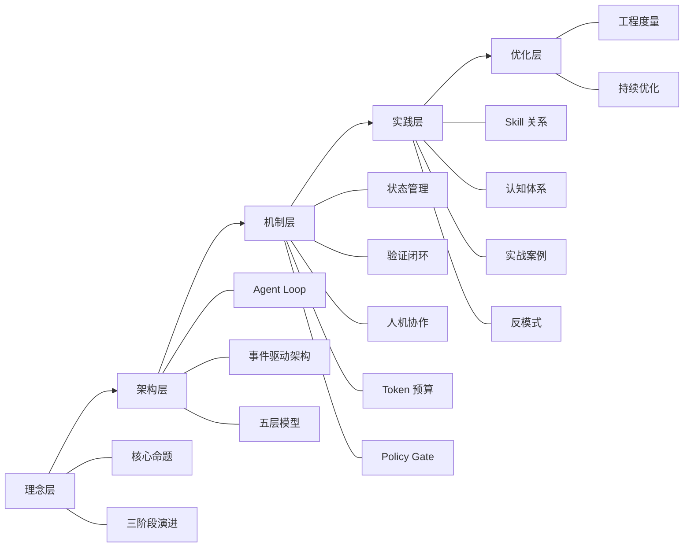
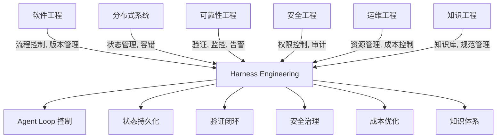
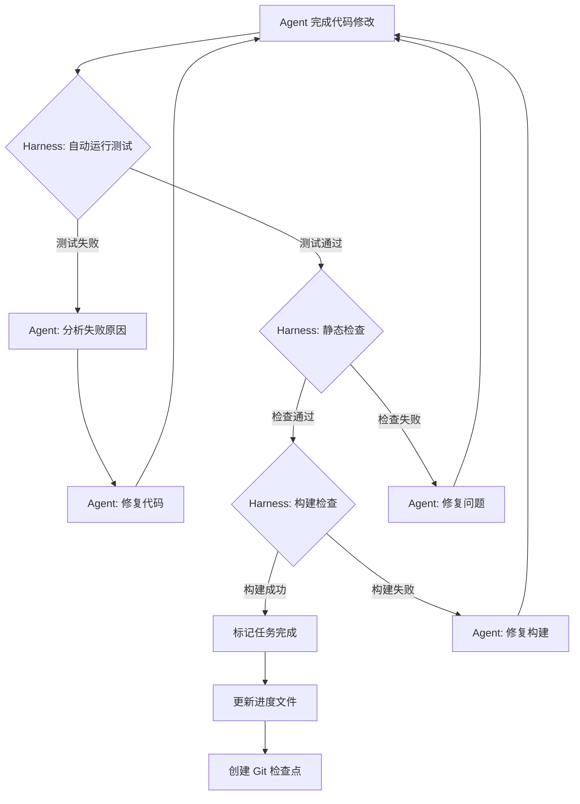
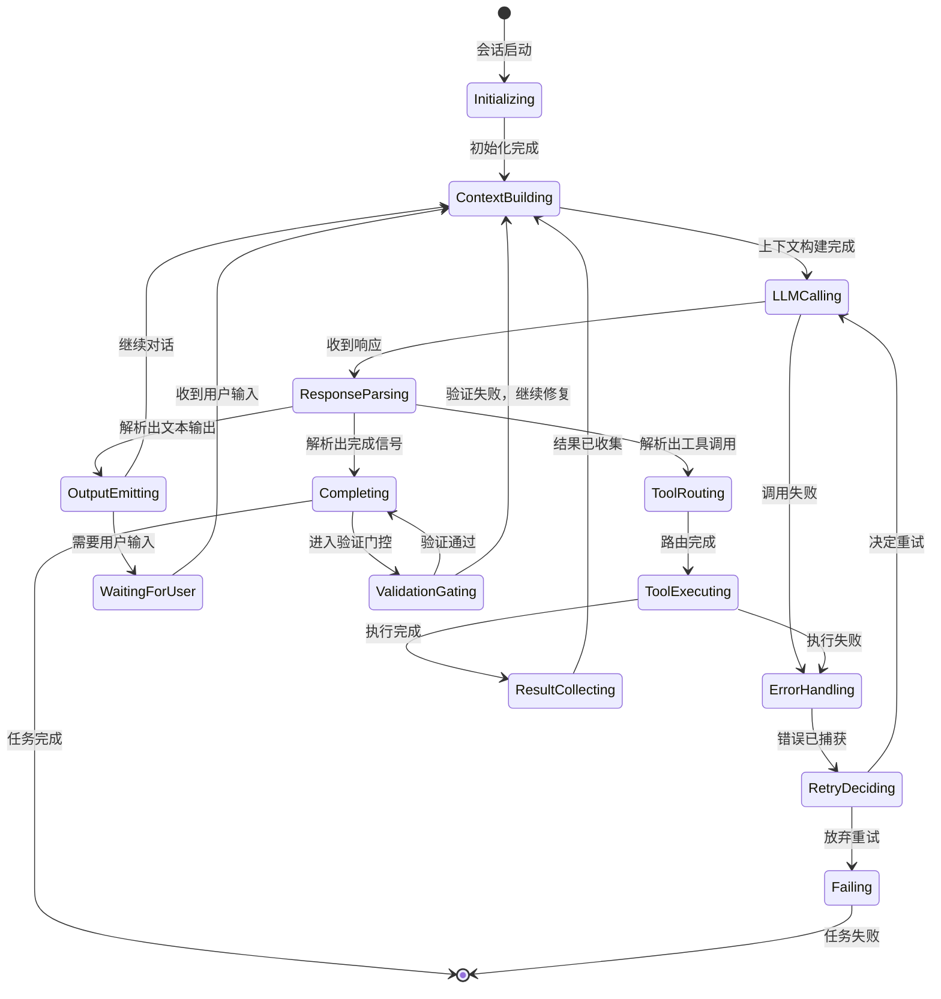
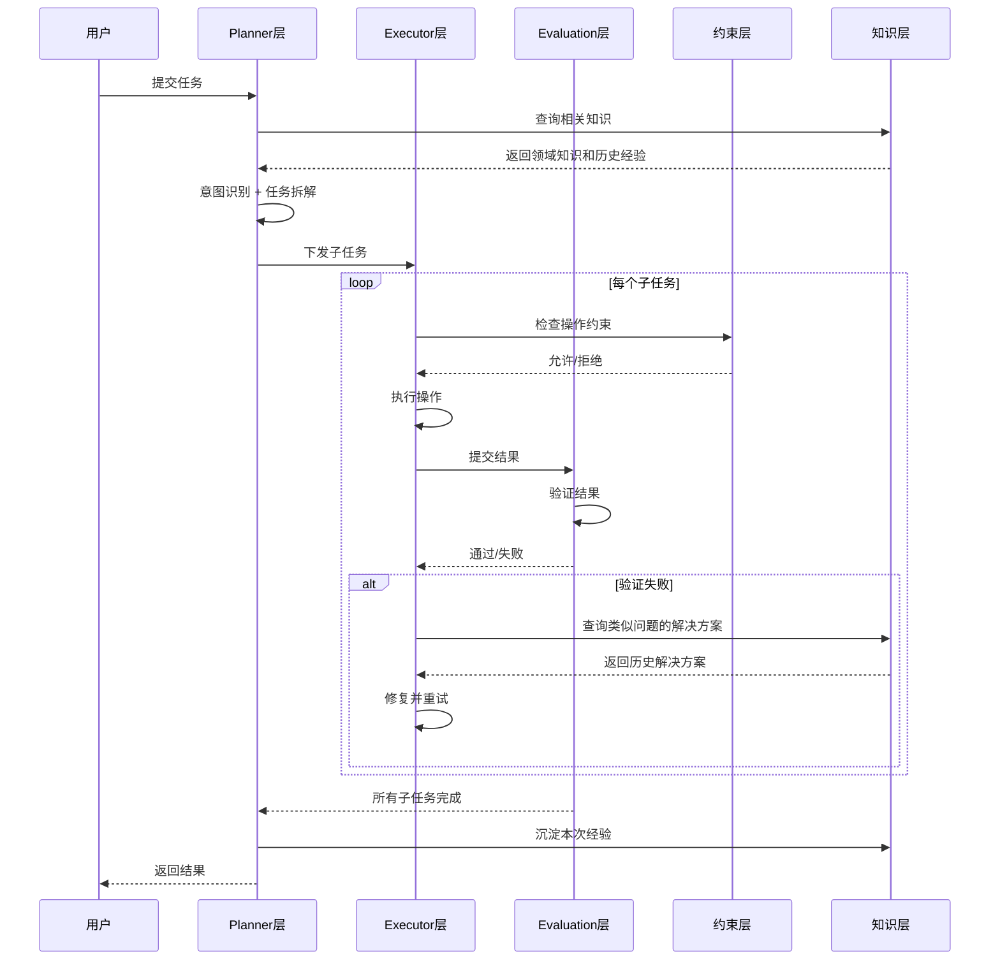
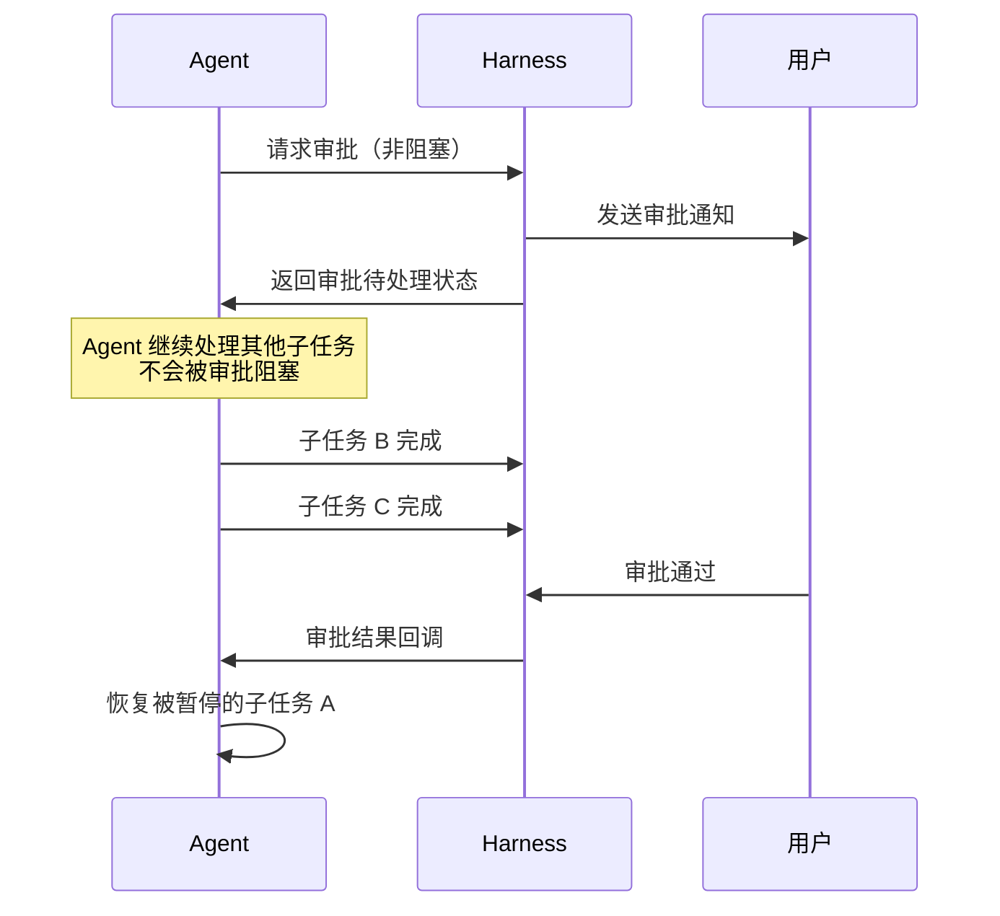
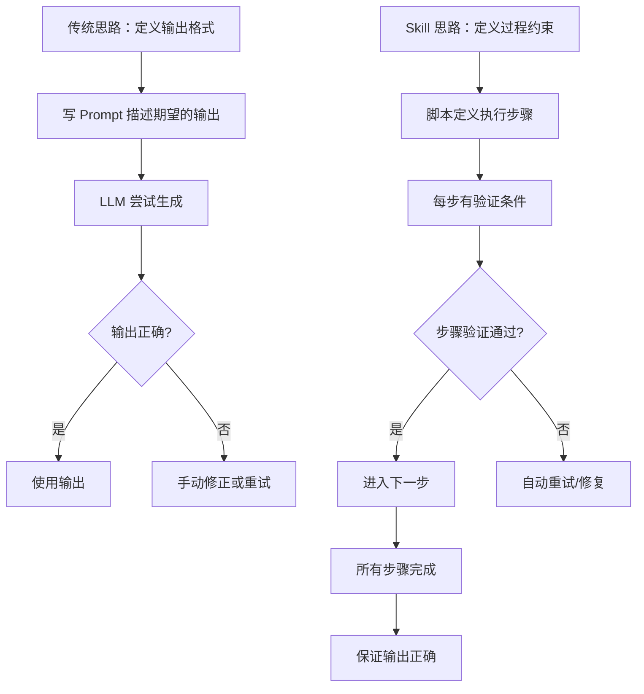
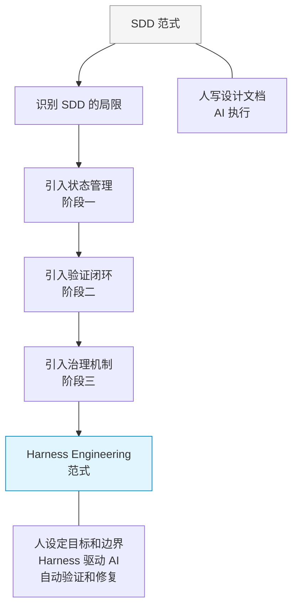
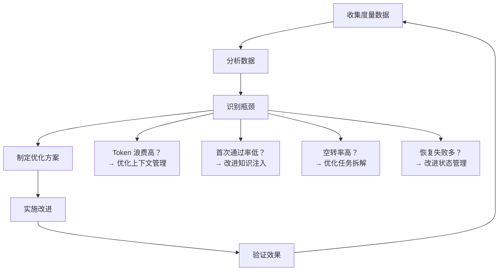

# Harness 调度框架设计：AI Agent 运行系统的工程化实践

> **文档版本**：v1.0
> **最后更新**：2025 年 7 月
> **关键词**：Harness Engineering, Agent Loop, 事件驱动架构, 验证闭环, 状态管理, Policy Gate

---

## 目录

- [1. 引言：什么是 Harness Engineering](#1-引言什么是-harness-engineering)
- [2. 核心命题：从"模型有多聪明"到"运行系统设计得有多好"](#2-核心命题从模型有多聪明到运行系统设计得有多好)
- [3. Harness 三阶段演进模型](#3-harness-三阶段演进模型)
- [4. Agent Loop 深度解析](#4-agent-loop-深度解析)
- [5. 事件驱动架构：中间件化的 Agent Loop](#5-事件驱动架构中间件化的-agent-loop)
- [6. Harness 的五层架构模型](#6-harness-的五层架构模型)
- [7. 状态管理与持久化](#7-状态管理与持久化)
- [8. 验证闭环机制](#8-验证闭环机制)
- [9. 人机协作节点设计](#9-人机协作节点设计)
- [10. Token 预算与成本控制](#10-token-预算与成本控制)
- [11. Policy Gate：工具调用权限控制](#11-policy-gate工具调用权限控制)
- [12. Harness 与 Skill 的关系](#12-harness-与-skill-的关系)
- [13. Harness 的认知体系建设](#13-harness-的认知体系建设)
- [14. 实战案例：从 SDD 到 Harness Engineering 的范式升级](#14-实战案例从-sdd-到-harness-engineering-的范式升级)
- [15. 反模式与陷阱](#15-反模式与陷阱)
- [16. 工程度量与优化](#16-工程度量与优化)
- [17. 总结与展望](#17-总结与展望)

---

## 1. 引言：什么是 Harness Engineering

### 1.1 从一个反直觉的现象说起

2024 年下半年以来，AI Agent 领域出现了一个令人深思的现象：在同一个基准测试中，
使用相同底层模型的不同 Agent 产品，性能差距可以高达数倍。

一个典型的例子是 Terminal Bench 排名：同一个模型更换了一套 Harness 之后，
排名从第 33 位跳到了第 5 位。这不是模型能力的提升——模型完全没有变化——
而是围绕模型的运行系统设计发生了根本性改变。

另一个同样震撼的数据来自 OpenCode 项目：
通过引入 Hashline 机制（一种用于精确定位代码行的辅助标记方案），
代码编辑成功率从 6.7% 飙升到 68.3%——超过 10 倍的提升。

这些数据传递出一个清晰的信号：

> **决定 AI Agent 能否真正交付价值的关键变量，
> 正在从"模型有多聪明"转向"围绕模型的运行系统设计得有多好"。**

我们把这个"围绕模型的运行系统"称为 **Harness**，
把系统性设计和优化 Harness 的工程实践称为 **Harness Engineering**。

### 1.2 Harness 的定义

**Harness**，直译为"马具"或"线束"，在工程语境中意为"控制装置"。
在 AI Agent 系统中，Harness 是指：

> 围绕 LLM 核心构建的、负责运行控制、状态管理、工具路由、
> 验证闭环和安全治理的完整运行时系统。

用一个比喻来说明：

```
LLM = 发动机（提供原始动力）
Harness = 整个传动系统 + 底盘 + 控制系统（让动力变成可控的前进）
```

如果只有发动机，你得到的是一台轰鸣但无法驾驶的机器。
Harness 的作用就是把 LLM 的原始智能转化为可控、可靠、可持续的工程能力。

### 1.3 Harness 的边界

为了准确理解 Harness 的职责范围，我们需要明确它与相关概念的边界：

```
┌─────────────────────────────────────────────────────────────────┐
│                        AI Agent 系统全景                         │
│                                                                 │
│  ┌─────────────┐  ┌──────────────────────────┐  ┌───────────┐  │
│  │             │  │                          │  │           │  │
│  │   LLM 层    │  │      Harness 层          │  │  应用层    │  │
│  │             │  │                          │  │           │  │
│  │  · 语言理解  │  │  · Agent Loop 控制       │  │  · UI/UX  │  │
│  │  · 推理能力  │  │  · 状态管理与持久化       │  │  · 用户交互│  │
│  │  · 代码生成  │  │  · 工具路由与执行         │  │  · 产品逻辑│  │
│  │  · 指令遵循  │  │  · 验证闭环              │  │  · 集成对接│  │
│  │             │  │  · Token 预算管理         │  │           │  │
│  │             │  │  · 安全与权限控制         │  │           │  │
│  │             │  │  · 事件总线与 Hook 系统   │  │           │  │
│  │             │  │  · 知识库与规范管理       │  │           │  │
│  │             │  │  · 错误处理与恢复         │  │           │  │
│  │             │  │                          │  │           │  │
│  └─────────────┘  └──────────────────────────┘  └───────────┘  │
│                                                                 │
│        LLM + Harness = Agent 的"大脑"（Brain）                  │
│                                                                 │
└─────────────────────────────────────────────────────────────────┘
```

**Harness 不负责的事情：**
- 模型的训练和推理加速
- 用户界面的设计和交互
- 业务领域的具体逻辑
- 底层基础设施（GPU、网络、存储）

**Harness 负责的事情：**
- Agent 主循环的运行控制
- 跨会话的状态管理
- 工具调用的路由、执行和结果收集
- 验证和质量门控
- 资源预算（Token、时间、成本）
- 安全策略和权限控制
- 知识和规范的组织管理
- 错误检测、处理和恢复

### 1.4 为什么需要一篇专门的设计文档

Harness Engineering 作为一个新兴的工程领域，面临的核心挑战是：

1. **缺乏系统化框架**：多数团队在"摸着石头过河"，缺少可参考的设计模式
2. **知识碎片化**：最佳实践散落在不同的开源项目和内部实践中
3. **过度关注 Prompt**：业界仍然过度依赖 Prompt Engineering，忽视系统工程
4. **缺少度量体系**：没有成熟的指标来评估 Harness 的质量

本文档的目标是：

- 建立 Harness Engineering 的系统性理论框架
- 总结经过验证的设计模式和最佳实践
- 提供可落地的架构方案和实现参考
- 建立度量和持续优化的方法论

### 1.5 文档结构概览

本文档按照"理念 → 架构 → 机制 → 实践 → 优化"的逻辑组织：



### 1.6 读者指南

| 读者角色 | 建议阅读章节 | 阅读时间 |
|---------|-------------|---------|
| 技术决策者 | 1-3, 14, 17 | 30 分钟 |
| 系统架构师 | 全文 | 2 小时 |
| Agent 开发者 | 4-13 | 1.5 小时 |
| Skill 开发者 | 5, 12, 13 | 45 分钟 |
| 质量工程师 | 8, 15, 16 | 45 分钟 |

---

## 2. 核心命题：从"模型有多聪明"到"运行系统设计得有多好"

### 2.1 两个时代的分界线

AI Agent 的发展可以清晰地划分为两个时代：

**Prompt 时代（2023-2024 上半年）：**

在这个阶段，大家的核心信念是"只要模型足够聪明，Agent 就能工作"。
投入集中在：
- 更好的 System Prompt
- 更精巧的 Few-shot Examples
- 更复杂的 Chain-of-Thought 引导
- 更新更强的模型版本

这个信念在简单任务上是成立的，但在复杂的工程任务上迅速碰壁。

**Harness 时代（2024 下半年至今）：**

转折点出现在人们开始系统性地对比"相同模型 + 不同 Harness"的效果时。
数据表明，Harness 的改进带来的提升，
往往超过升级到下一代模型带来的提升。

### 2.2 数据说话：Harness 的杠杆效应

以下是经过验证的案例数据：

#### 案例 1：Terminal Bench 排名跃迁

```
┌────────────────────────────────────────────────────────┐
│            同一模型，不同 Harness 的排名对比             │
├────────────────────────────────────────────────────────┤
│                                                        │
│  旧 Harness:  #33  ████░░░░░░░░░░░░░░░░░░░░░░░░░░░░  │
│                                                        │
│  新 Harness:  #5   ██████████████████████████████████  │
│                                                        │
│  模型版本：完全相同                                      │
│  改变的变量：Agent Loop 控制 + 工具路由 + 状态管理        │
│                                                        │
└────────────────────────────────────────────────────────┘
```

**分析**：新 Harness 的核心改进包括：
1. 更智能的上下文窗口管理（减少无效 token 消耗）
2. 更精确的工具调用路由（减少错误的工具选择）
3. 更好的错误恢复机制（失败后能自动回退并重试）
4. 结构化的状态追踪（避免重复工作）

#### 案例 2：Hashline 机制的 10 倍提升

```
┌────────────────────────────────────────────────────────┐
│          OpenCode Hashline 机制效果对比                  │
├────────────────────────────────────────────────────────┤
│                                                        │
│  无 Hashline:  6.7%   ██░░░░░░░░░░░░░░░░░░░░░░░░░░░  │
│                       代码编辑成功率                     │
│                                                        │
│  有 Hashline:  68.3%  ██████████████████████░░░░░░░░░  │
│                       代码编辑成功率                     │
│                                                        │
│  提升幅度：10.2x                                        │
│                                                        │
└────────────────────────────────────────────────────────┘
```

**Hashline 机制详解：**

Hashline 的核心思想极其简单：
在向 LLM 展示代码文件时，为每一行添加一个短哈希前缀。

```python
# 传统方式展示代码：
1  def calculate_total(items):
2      total = 0
3      for item in items:
4          total += item.price * item.quantity
5      return total

# Hashline 方式展示代码：
#a3f  def calculate_total(items):
#b7c      total = 0
#d2e      for item in items:
#f1a          total += item.price * item.quantity
#c8b      return total
```

为什么这个看似微小的改动能带来 10 倍的提升？

**根本原因：LLM 的代码编辑失败主要不是"不会改"，而是"定位不准"。**

当 LLM 尝试用 search-and-replace 的方式编辑代码时，
它需要精确地识别要替换的代码片段。
在没有 Hashline 的情况下，LLM 经常：
- 匹配到错误的代码段（相似代码太多）
- 丢失缩进或空白字符
- 在长文件中"迷路"

Hashline 给了 LLM 一个**精确的锚点系统**——
每行的短哈希是唯一的、不可混淆的标识符。

这就是 Harness Engineering 的精髓：
**不是让模型变得更聪明，而是给模型提供更好的工作环境。**

#### 案例 3：验证闭环的 PR 合并率提升

```
┌────────────────────────────────────────────────────────┐
│         验证闭环对 PR 合并率的影响                        │
├────────────────────────────────────────────────────────┤
│                                                        │
│  无验证闭环:  34%  ██████████░░░░░░░░░░░░░░░░░░░░░░░  │
│                    PR 合并率                            │
│                                                        │
│  有验证闭环:  67%  ████████████████████░░░░░░░░░░░░░░  │
│                    PR 合并率                            │
│                                                        │
│  关键改进：                                             │
│  · 任务拆解：大任务自动分解为可验证的子任务                │
│  · 测试门控：代码修改后必须通过测试才能标记完成            │
│  · 自动回归：每次提交自动运行受影响的测试集                │
│                                                        │
└────────────────────────────────────────────────────────┘
```

### 2.3 杠杆点分析：投入产出比最高的改进方向

基于上述案例和更广泛的行业数据，我们可以绘制出一张 Harness 改进的杠杆点地图：

```
投入产出比（从高到低排列）：

━━━━━━━━━━━━━━━━━━━━━━━━━━━━━━━━━━━━━━━━━━━━━━━━━
改进方向              │ 实施成本 │ 效果提升 │ 杠杆比
━━━━━━━━━━━━━━━━━━━━━━━━━━━━━━━━━━━━━━━━━━━━━━━━━
验证闭环              │   中     │   高     │  ★★★★★
上下文窗口管理         │   低     │   中高   │  ★★★★★
状态外部化与持久化     │   中     │   高     │  ★★★★☆
工具调用路由优化       │   中     │   中高   │  ★★★★☆
错误恢复与重试         │   低     │   中     │  ★★★★☆
Token 预算管理        │   低     │   中     │  ★★★☆☆
代码定位辅助(Hashline) │   低     │   高     │  ★★★★★
Policy Gate           │   中     │   中     │  ★★★☆☆
事件总线与 Hook       │   高     │   高     │  ★★★☆☆
知识库建设            │   高     │   中高   │  ★★★☆☆
━━━━━━━━━━━━━━━━━━━━━━━━━━━━━━━━━━━━━━━━━━━━━━━━━
```

**核心洞察**：
Harness 的高回报集中在**基础设施层的改进**上，
而不是在**指令配置层的堆叠**上。

这个结论得到了 ETH Zurich 的研究支持：
他们测试了 138 个 agentfile（一种 Agent 配置文件格式），
发现 LLM 自动生成的配置文件不但没有提升性能，
反而降低了表现，成本增加 20% 以上。

### 2.4 思维模型转换

理解 Harness Engineering 需要完成以下思维模型转换：

```
┌─────────────────────────────────────────────────────────┐
│                    思维模型转换对照表                      │
├──────────────────────┬──────────────────────────────────┤
│      旧思维           │         新思维                    │
├──────────────────────┼──────────────────────────────────┤
│ 模型是瓶颈            │ 运行系统是瓶颈                    │
│ 写更好的 Prompt       │ 建更好的 Harness                 │
│ Agent 失败=模型太笨   │ Agent 失败=Harness 设计不足       │
│ 追求单次完美输出       │ 追求过程可控可恢复                 │
│ 人工检查结果          │ 自动化验证闭环                    │
│ 一次性会话            │ 跨会话持续工作                    │
│ 无限制使用 Token      │ Token 预算管理                   │
│ 信任 LLM 的判断       │ 用系统约束替代 LLM 的判断         │
│ Prompt 是承诺         │ 代码是物理约束                    │
│ 配置越多越好          │ 基础设施改进优先                   │
├──────────────────────┴──────────────────────────────────┤
│  核心公式：                                              │
│  Agent 效能 = f(模型能力) × g(Harness 质量)              │
│  当前阶段：g 的边际收益 >> f 的边际收益                    │
└─────────────────────────────────────────────────────────┘
```

### 2.5 Harness Engineering 的学科定位

Harness Engineering 不是一个全新的学科，
它是多个成熟工程领域在 AI Agent 场景下的融合应用：



从这个视角来看，Harness Engineering 的核心价值在于：
**把过去几十年软件工程积累的最佳实践，
适配到 AI Agent 这个新的运行范式中。**

### 2.6 小结

本章建立了一个核心论点：

1. **Harness 的杠杆效应已被数据证实**
   - 同模型换 Harness：排名从 #33 到 #5
   - Hashline 机制：成功率从 6.7% 到 68.3%
   - 验证闭环：PR 合并率从 34% 到 67%

2. **高回报来自基础设施，而非配置堆叠**
   - ETH Zurich 的 138 个 agentfile 实验证实了这一点
   - 改进 Agent Loop、状态管理、验证闭环的 ROI 最高

3. **Harness Engineering 是多学科融合**
   - 软件工程 + 分布式系统 + 可靠性工程 + 安全工程
   - 核心是把成熟的工程实践适配到 Agent 运行范式

接下来，我们将展开 Harness 的建设路径和技术细节。

---

## 3. Harness 三阶段演进模型

### 3.1 演进模型总览

Harness 的建设不是一蹴而就的。
根据工程实践的反馈，我们总结出一个清晰的三阶段演进模型：

```
┌─────────────────────────────────────────────────────────────┐
│                Harness 三阶段演进模型                         │
│                                                             │
│  阶段一                阶段二                阶段三           │
│  ┌──────────┐         ┌──────────┐         ┌──────────┐    │
│  │          │         │          │         │          │    │
│  │ 持续工作  │  ───▶  │ 可靠交付  │  ───▶  │ 安全扩张  │    │
│  │          │         │          │         │          │    │
│  └──────────┘         └──────────┘         └──────────┘    │
│                                                             │
│  解决问题：            解决问题：            解决问题：       │
│  模型没有记忆          模型没有纪律          实验室→生产      │
│                                                             │
│  核心能力：            核心能力：            核心能力：       │
│  · 状态外部化          · 验证闭环            · Token 预算    │
│  · 会话管理            · 测试门控            · Policy Gate   │
│  · 进度追踪            · 质量检查            · 审批流程      │
│  · 断点恢复            · 自动回归            · 执行追踪      │
│                                                             │
│  衡量标准：            衡量标准：            衡量标准：       │
│  Agent 能不能          Agent 的输出          Agent 能不能    │
│  跨会话工作            能不能直接用          在生产环境跑     │
│                                                             │
└─────────────────────────────────────────────────────────────┘
```

### 3.2 阶段一：让 Agent 能持续工作

#### 3.2.1 核心问题：模型没有记忆

LLM 的一个根本限制是：**它没有持久记忆。**

每次对话开始时，LLM 只知道上下文窗口里的内容。
上一次对话中探索过的代码、做出的决策、遇到的问题——
除非明确地传递给新会话，否则这些信息全部丢失。

对于简单任务，这不是问题——一次对话就能完成。
但对于复杂的工程任务，比如"重构这个模块的 API 设计"，
通常需要跨越多个会话、多天时间才能完成。

如果每次新会话都从零开始，Agent 会：
1. 重复已经做过的探索工作
2. 做出与之前矛盾的决策
3. 丢失之前发现的关键上下文
4. 无法从上次中断的地方继续

#### 3.2.2 解决方案：状态外部化

阶段一的核心策略是**状态外部化**——
把 Agent 的工作状态从"模型脑内"搬到"外部持久存储"。

```
┌─────────────────────────────────────────────────────────┐
│                  状态外部化架构                            │
│                                                         │
│  ┌─────────┐      ┌─────────────────────────────────┐  │
│  │         │      │          外部状态存储             │  │
│  │  LLM    │◀────▶│                                 │  │
│  │         │      │  ┌────────────────────────────┐ │  │
│  └─────────┘      │  │ 进度文件 (progress.json)    │ │  │
│                    │  │ · 当前阶段                  │ │  │
│  每次会话启动时：    │  │ · 已完成步骤               │ │  │
│  1. 读取进度文件    │  │ · 待处理任务               │ │  │
│  2. 恢复上下文      │  │ · 关键决策记录             │ │  │
│  3. 继续工作        │  │ · 发现的问题               │ │  │
│                    │  └────────────────────────────┘ │  │
│  每次会话结束时：    │                                 │  │
│  1. 更新进度文件    │  ┌────────────────────────────┐ │  │
│  2. 保存上下文      │  │ Git 版本化                 │ │  │
│  3. 提交变更        │  │ · 每个检查点自动 commit     │ │  │
│                    │  │ · 可回滚到任意历史状态       │ │  │
│                    │  │ · 分支管理多个探索方向       │ │  │
│                    │  └────────────────────────────┘ │  │
│                    │                                 │  │
│                    └─────────────────────────────────┘  │
│                                                         │
└─────────────────────────────────────────────────────────┘
```

**进度文件的设计：**

```json
{
  "task_id": "refactor-api-v2",
  "created_at": "2025-01-15T10:30:00Z",
  "updated_at": "2025-01-16T14:22:00Z",
  "status": "in_progress",
  "current_phase": "implementation",
  "phases": [
    {
      "name": "analysis",
      "status": "completed",
      "started_at": "2025-01-15T10:30:00Z",
      "completed_at": "2025-01-15T11:45:00Z",
      "summary": "分析了 12 个 API 端点，识别出 5 个需要重构的模式",
      "artifacts": ["analysis-report.md"]
    },
    {
      "name": "design",
      "status": "completed",
      "started_at": "2025-01-15T14:00:00Z",
      "completed_at": "2025-01-15T16:30:00Z",
      "summary": "设计了新的 API 结构，采用 RESTful 命名规范",
      "artifacts": ["api-design.md"],
      "decisions": [
        {
          "topic": "版本策略",
          "decision": "使用 URL 路径版本 (/v2/)",
          "reason": "与现有 /v1/ 保持一致，便于渐进迁移"
        }
      ]
    },
    {
      "name": "implementation",
      "status": "in_progress",
      "started_at": "2025-01-16T09:00:00Z",
      "progress": {
        "total_endpoints": 12,
        "completed_endpoints": 7,
        "current_endpoint": "POST /v2/orders",
        "remaining": [
          "POST /v2/orders",
          "PUT /v2/orders/:id",
          "DELETE /v2/orders/:id",
          "GET /v2/orders/:id/items",
          "POST /v2/orders/:id/items"
        ]
      }
    },
    {
      "name": "testing",
      "status": "pending"
    },
    {
      "name": "documentation",
      "status": "pending"
    }
  ],
  "context": {
    "key_files": [
      "src/api/v2/routes.ts",
      "src/api/v2/controllers/order.ts",
      "src/api/v2/middleware/auth.ts"
    ],
    "discovered_issues": [
      "订单 API 的旧版本有一个未文档化的查询参数 'include_deleted'",
      "认证中间件在处理 webhook 调用时有特殊路径"
    ],
    "important_notes": [
      "不要修改 /v1/ 的任何代码，只做新增",
      "所有新端点必须有 OpenAPI 文档注解"
    ]
  }
}
```

#### 3.2.3 标准化会话启动流程

仅有进度文件是不够的——还需要一个**标准化的会话启动流程**
来确保 Agent 每次开始工作时都能正确恢复上下文。

```python
# 伪代码：标准化会话启动流程

class SessionBootstrap:
    """
    每次 Agent 会话启动时执行的标准流程。
    确保 Agent 能够从上次中断的地方继续工作。
    """

    def start_session(self, task_id: str) -> SessionContext:
        # Step 1: 加载进度文件
        progress = self.load_progress(task_id)

        # Step 2: 检查 Git 状态
        git_status = self.check_git_status()
        if git_status.has_uncommitted_changes:
            self.handle_uncommitted_changes(git_status)

        # Step 3: 构建恢复上下文
        context = self.build_resume_context(progress)

        # Step 4: 生成恢复摘要
        resume_summary = self.generate_resume_summary(progress, context)

        # Step 5: 注入到 System Prompt
        system_prompt = self.build_system_prompt(
            base_prompt=self.base_prompt,
            resume_summary=resume_summary,
            current_phase=progress.current_phase,
            key_files=context.key_files,
            discovered_issues=context.discovered_issues,
            important_notes=context.important_notes
        )

        # Step 6: 启动 Agent Loop
        return SessionContext(
            system_prompt=system_prompt,
            progress=progress,
            git_branch=git_status.current_branch,
            tools=self.get_tools_for_phase(progress.current_phase)
        )

    def build_resume_context(self, progress: Progress) -> ResumeContext:
        """
        根据进度文件构建恢复上下文。
        只包含当前阶段需要的信息，避免浪费 Token。
        """
        context = ResumeContext()

        # 只加载当前阶段相关的文件列表
        context.key_files = progress.context.key_files

        # 加载之前发现的关键信息
        context.discovered_issues = progress.context.discovered_issues
        context.important_notes = progress.context.important_notes

        # 加载上一个阶段的产出摘要（而非完整内容）
        prev_phase = progress.get_previous_phase()
        if prev_phase and prev_phase.summary:
            context.previous_phase_summary = prev_phase.summary

        return context
```

#### 3.2.4 Git 版本化：时间旅行能力

Git 在 Harness 中扮演了一个特殊而重要的角色：
它为 Agent 的工作提供了**时间旅行能力**。

```
┌──────────────────────────────────────────────────────────────┐
│                 Git 版本化在 Harness 中的作用                  │
│                                                              │
│  commit 1        commit 2        commit 3        commit 4    │
│  ┌────────┐     ┌────────┐     ┌────────┐     ┌────────┐   │
│  │分析完成 │────▶│设计完成 │────▶│实现 1-4│────▶│实现 5-7│   │
│  └────────┘     └────────┘     └────────┘     └────────┘   │
│       │                              │                       │
│       │                              ▼                       │
│       │                         发现设计问题                  │
│       │                         需要回退到设计阶段            │
│       ▼                                                      │
│  每个 commit 都包含：                                         │
│  · 代码变更                                                  │
│  · 进度文件更新                                               │
│  · 上下文快照                                                 │
│                                                              │
│  能力：                                                      │
│  · 回滚到任意检查点                                           │
│  · 对比两个阶段的差异                                         │
│  · 分支探索不同方案                                           │
│  · 恢复被错误删除的代码                                       │
│                                                              │
└──────────────────────────────────────────────────────────────┘
```

**检查点策略：**

不是每次 LLM 调用都创建检查点，而是在**语义完整的节点**创建：

| 检查点时机 | 说明 | commit 信息格式 |
|-----------|------|----------------|
| 阶段完成 | 分析/设计/实现等阶段结束 | `[harness] phase:analysis completed` |
| 子任务完成 | 一个具体的端点/模块完成 | `[harness] impl:orders-create done` |
| 关键决策 | 做出了影响后续工作的决策 | `[harness] decision:versioning-strategy` |
| 问题发现 | 发现了需要记录的重要问题 | `[harness] finding:auth-webhook-edge-case` |
| 会话结束 | 每次会话结束时 | `[harness] session-end checkpoint` |

#### 3.2.5 阶段一的验收标准

一个合格的阶段一 Harness 应该满足以下标准：

```
━━━━━━━━━━━━━━━━━━━━━━━━━━━━━━━━━━━━━━━━━━━━━━━━━━━━━━━━
验收项                          │ 标准
━━━━━━━━━━━━━━━━━━━━━━━━━━━━━━━━━━━━━━━━━━━━━━━━━━━━━━━━
跨会话连续性                    │ Agent 能在新会话中准确恢复上次进度
上下文不丢失                    │ 之前的关键决策和发现在新会话中可用
可回滚                         │ 能回退到任意检查点重新开始
进度可视化                     │ 人类能随时查看 Agent 的工作进度
中断安全                       │ 意外中断（crash/超时）不会丢失工作
━━━━━━━━━━━━━━━━━━━━━━━━━━━━━━━━━━━━━━━━━━━━━━━━━━━━━━━━
```

### 3.3 阶段二：让 Agent 能可靠交付

#### 3.3.1 核心问题：模型没有纪律

阶段一解决了"Agent 能持续工作"的问题，
但一个能持续工作的 Agent 并不意味着它能交付可用的成果。

LLM 的另一个根本特性是：**它没有纪律。**

具体表现为：
- 跳过测试：修改了代码但不运行测试就声称"完成"
- 选择性忽略约束：在长对话中逐渐"忘记"最初设定的约束
- 过度自信：对自己的输出质量判断不准确
- 缺乏验证习惯：不会主动检查自己的工作成果

**Demo 和生产系统的分界线，就在于验证闭环。**

在 Prompt 里写"请测试一下"——这是一个**承诺**，LLM 可以违背。
在 Harness 层面强制要求"测试不通过就不能进入完成态"——这是一个**物理约束**，不可能违背。

#### 3.3.2 验证闭环的设计



**关键设计原则：验证是 Harness 层面的强制行为，不是 LLM 层面的可选建议。**

```python
# 伪代码：验证闭环的 Harness 实现

class ValidationGate:
    """
    验证门控：在任务状态转换时强制执行验证。
    这是一个 Harness 层面的约束，LLM 无法绕过。
    """

    def __init__(self, config: ValidationConfig):
        self.validators = []

        if config.require_tests:
            self.validators.append(TestValidator())
        if config.require_lint:
            self.validators.append(LintValidator())
        if config.require_build:
            self.validators.append(BuildValidator())
        if config.require_type_check:
            self.validators.append(TypeCheckValidator())

    def gate_transition(
        self,
        from_state: TaskState,
        to_state: TaskState,
        context: TaskContext
    ) -> GateResult:
        """
        在任务状态转换时执行验证门控。
        只有所有验证通过，状态转换才被允许。
        """
        if to_state not in [TaskState.COMPLETED, TaskState.READY_FOR_REVIEW]:
            # 非终态转换不需要验证
            return GateResult(allowed=True)

        results = []
        for validator in self.validators:
            result = validator.validate(context)
            results.append(result)

            if not result.passed:
                # 验证失败：阻止状态转换，要求 Agent 修复
                return GateResult(
                    allowed=False,
                    blocked_by=validator.name,
                    failure_details=result.details,
                    suggested_action=result.suggested_fix
                )

        # 所有验证通过：允许状态转换
        return GateResult(
            allowed=True,
            validation_results=results
        )
```

#### 3.3.3 测试驱动的任务完成

验证闭环的最核心实践是**测试门控**：

```
┌──────────────────────────────────────────────────────────┐
│                   测试门控工作流                           │
│                                                          │
│  Agent 声称完成                                           │
│       │                                                  │
│       ▼                                                  │
│  ┌─────────────────────────────────────────────────┐     │
│  │ Harness 自动执行以下检查（Agent 无法跳过）：       │     │
│  │                                                 │     │
│  │  1. 查找受影响的测试文件                          │     │
│  │     · 根据修改的源文件，自动定位关联的测试         │     │
│  │     · 如果没有对应的测试 → 标记为"需要补充测试"    │     │
│  │                                                 │     │
│  │  2. 运行受影响的测试                             │     │
│  │     · 只运行与本次修改相关的测试（快速反馈）       │     │
│  │     · 测试失败 → 返回失败信息给 Agent，要求修复   │     │
│  │                                                 │     │
│  │  3. 运行完整测试套件                             │     │
│  │     · 在局部测试通过后运行全量测试               │     │
│  │     · 检测是否引入了回归                         │     │
│  │                                                 │     │
│  │  4. 静态分析                                    │     │
│  │     · Lint 检查                                 │     │
│  │     · 类型检查                                  │     │
│  │     · 安全扫描                                  │     │
│  │                                                 │     │
│  │  全部通过 → 允许标记为"完成"                      │     │
│  │  任何失败 → 返回详细信息，要求 Agent 继续修复     │     │
│  │                                                 │     │
│  └─────────────────────────────────────────────────┘     │
│                                                          │
└──────────────────────────────────────────────────────────┘
```

#### 3.3.4 质量等级定义

为了量化交付质量，定义以下质量等级：

| 等级 | 名称 | 标准 | 适用场景 |
|-----|------|-----|---------|
| L0 | 语法正确 | 代码能通过编译/解析 | 代码片段生成 |
| L1 | 测试通过 | 现有测试全部通过 | 简单修改 |
| L2 | 完整覆盖 | 新功能有对应测试，所有测试通过 | 功能开发 |
| L3 | 审查就绪 | L2 + Lint 通过 + 文档更新 | PR 提交 |
| L4 | 部署就绪 | L3 + 集成测试通过 + 性能基线不退化 | 生产发布 |

**阶段二的目标是：所有 Agent 交付的工作至少达到 L2 级别。**

#### 3.3.5 阶段二的验收标准

```
━━━━━━━━━━━━━━━━━━━━━━━━━━━━━━━━━━━━━━━━━━━━━━━━━━━━━━━━
验收项                          │ 标准
━━━━━━━━━━━━━━━━━━━━━━━━━━━━━━━━━━━━━━━━━━━━━━━━━━━━━━━━
强制测试                        │ Agent 不可能在测试失败时标记完成
自动回归检测                    │ 每次修改自动运行受影响测试
质量门控                        │ 代码修改必须通过 lint + type check
修复闭环                        │ 失败时 Agent 能收到详细信息并修复
质量等级可配置                   │ 不同任务可以设置不同的质量要求
━━━━━━━━━━━━━━━━━━━━━━━━━━━━━━━━━━━━━━━━━━━━━━━━━━━━━━━━
```

### 3.4 阶段三：让 Agent 能安全扩张

#### 3.4.1 核心问题：从实验室到生产的鸿沟

阶段一和阶段二在"一个人 + 一个 Agent"的场景下已经足够好。
但当要把 Agent 推广到整个团队、整个组织时，新的挑战出现了：

- **成本失控**：没有 Token 预算，Agent 可能在一个任务上消耗大量费用
- **安全风险**：Agent 可能执行危险操作（删除生产数据库、推送到 main 分支）
- **可追溯性**：出了问题无法回溯 Agent 做了什么
- **合规要求**：某些操作需要人类审批

#### 3.4.2 治理机制全景

```
┌─────────────────────────────────────────────────────────────┐
│                    阶段三：治理机制全景                        │
│                                                             │
│  ┌──────────────────────────────────────────────────────┐  │
│  │                  Token 预算管理                       │  │
│  │  · 任务级预算：每个任务有 Token 上限                   │  │
│  │  · 会话级预算：每个会话有 Token 上限                   │  │
│  │  · 组织级预算：月度/季度 Token 配额                    │  │
│  │  · 超限策略：暂停 / 降级 / 通知                       │  │
│  └──────────────────────────────────────────────────────┘  │
│                                                             │
│  ┌──────────────────────────────────────────────────────┐  │
│  │                  Policy Gate（策略门）                 │  │
│  │  · 工具调用权限：哪些工具允许、哪些禁止               │  │
│  │  · 参数约束：工具参数的合法范围                        │  │
│  │  · 环境隔离：生产/测试环境的访问控制                   │  │
│  │  · 操作审批：危险操作需要人类确认                      │  │
│  └──────────────────────────────────────────────────────┘  │
│                                                             │
│  ┌──────────────────────────────────────────────────────┐  │
│  │                  结构化执行追踪                       │  │
│  │  · 每个工具调用的完整日志                             │  │
│  │  · LLM 决策过程的记录                                │  │
│  │  · Token 消耗的逐步追踪                              │  │
│  │  · 可导出的审计轨迹                                  │  │
│  └──────────────────────────────────────────────────────┘  │
│                                                             │
│  ┌──────────────────────────────────────────────────────┐  │
│  │                  审批流                               │  │
│  │  · 关键操作的人工审批节点                             │  │
│  │  · 异步审批（不阻塞 Agent 其他工作）                  │  │
│  │  · 自动升级（超时自动升级到更高级审批人）              │  │
│  │  · 审批策略可配置                                    │  │
│  └──────────────────────────────────────────────────────┘  │
│                                                             │
└─────────────────────────────────────────────────────────────┘
```

#### 3.4.3 成本控制的层次化设计

```python
# 伪代码：Token 预算管理器

class TokenBudgetManager:
    """
    层次化的 Token 预算管理。
    从组织级到会话级，层层约束。
    """

    def __init__(self, config: BudgetConfig):
        self.org_budget = config.org_monthly_budget
        self.team_budget = config.team_monthly_budget
        self.task_budget = config.default_task_budget
        self.session_budget = config.default_session_budget

    def check_budget(
        self,
        level: BudgetLevel,
        requested_tokens: int
    ) -> BudgetCheckResult:
        """
        逐级检查 Token 预算。
        任何一级超限都会触发相应的处理策略。
        """
        checks = [
            (BudgetLevel.SESSION, self.session_budget),
            (BudgetLevel.TASK, self.task_budget),
            (BudgetLevel.TEAM, self.team_budget),
            (BudgetLevel.ORGANIZATION, self.org_budget),
        ]

        for check_level, budget in checks:
            remaining = budget.remaining()
            if requested_tokens > remaining:
                return BudgetCheckResult(
                    allowed=False,
                    exceeded_level=check_level,
                    remaining=remaining,
                    action=self.get_exceed_action(check_level)
                )

        return BudgetCheckResult(allowed=True)

    def get_exceed_action(self, level: BudgetLevel) -> ExceedAction:
        """
        不同级别的预算超限，采取不同的处理策略。
        """
        actions = {
            BudgetLevel.SESSION: ExceedAction.PAUSE_AND_NOTIFY,
            BudgetLevel.TASK: ExceedAction.REQUIRE_APPROVAL,
            BudgetLevel.TEAM: ExceedAction.DEGRADE_MODEL,
            BudgetLevel.ORGANIZATION: ExceedAction.HARD_STOP,
        }
        return actions[level]
```

#### 3.4.4 三阶段的渐进实施路径

```
时间线建议：

Week 1-2:   阶段一基础建设
            ├── 设计进度文件格式
            ├── 实现会话启动流程
            ├── 集成 Git 版本化
            └── 测试跨会话恢复

Week 3-4:   阶段二验证闭环
            ├── 实现测试门控
            ├── 集成 Lint/Type Check
            ├── 建设修复闭环
            └── 定义质量等级

Week 5-8:   阶段三治理机制
            ├── Token 预算管理
            ├── Policy Gate
            ├── 执行追踪
            └── 审批流

Week 9+:    持续优化
            ├── 度量体系建设
            ├── 根据数据优化策略
            └── 扩展到更多场景
```

### 3.5 三阶段对比总结

| 维度 | 阶段一：持续工作 | 阶段二：可靠交付 | 阶段三：安全扩张 |
|-----|----------------|----------------|----------------|
| 核心问题 | 模型没有记忆 | 模型没有纪律 | 实验室→生产 |
| 关键技术 | 状态外部化 | 验证闭环 | 治理机制 |
| 复杂度 | 中 | 中高 | 高 |
| 前置条件 | 无 | 阶段一完成 | 阶段二完成 |
| 受益人 | 个人开发者 | 开发团队 | 整个组织 |
| 投入产出比 | 最高 | 高 | 中 |

---

## 4. Agent Loop 深度解析

### 4.1 Agent Loop 的本质

Agent Loop 是 Harness 的核心运行机制。
它定义了 Agent 如何一步一步地推进任务。

**最简形式的 Agent Loop：**

```
调用 LLM 获取决策
  → 解析输出
    → 把工具调用路由到正确的执行环境
      → 收集执行结果
        → 再次调用 LLM
```

LLM 和 Harness 合在一起，构成了 Agent 的"大脑"（Brain）。

但在生产环境中，这个简单的循环需要大量的额外机制来保证可靠运行。

### 4.2 Agent Loop 的完整生命周期



### 4.3 核心组件详解

#### 4.3.1 上下文构建器（Context Builder）

上下文构建器负责在每次 LLM 调用前，组装完整的输入。

```python
# 伪代码：上下文构建器

class ContextBuilder:
    """
    负责构建发送给 LLM 的完整上下文。
    核心挑战：在有限的 token 窗口内，最大化有用信息密度。
    """

    def build(self, state: AgentState) -> LLMInput:
        messages = []

        # 1. System Prompt（固定部分）
        messages.append(SystemMessage(
            content=self.build_system_prompt(state)
        ))

        # 2. 任务描述（如果是首轮）
        if state.is_first_turn:
            messages.append(UserMessage(
                content=state.task_description
            ))

        # 3. 历史消息（需要压缩管理）
        history = self.compress_history(
            state.message_history,
            max_tokens=state.context_budget
        )
        messages.extend(history)

        # 4. 当前工具执行结果
        if state.pending_tool_results:
            for result in state.pending_tool_results:
                messages.append(ToolResultMessage(
                    tool_call_id=result.call_id,
                    content=self.format_tool_result(result)
                ))

        # 5. 计算总 token 数，必要时进一步压缩
        total_tokens = self.count_tokens(messages)
        if total_tokens > state.max_context_tokens:
            messages = self.aggressive_compress(messages, state.max_context_tokens)

        return LLMInput(messages=messages)

    def compress_history(
        self,
        history: List[Message],
        max_tokens: int
    ) -> List[Message]:
        """
        历史消息压缩策略：
        1. 保留最近 N 轮对话
        2. 对早期的长输出做摘要
        3. 删除已经不相关的工具调用细节
        4. 保留所有关键决策和发现
        """
        if self.count_tokens(history) <= max_tokens:
            return history

        compressed = []
        # 策略1：保留最近 N 轮完整对话
        recent = history[-self.recent_window:]
        remaining_budget = max_tokens - self.count_tokens(recent)

        # 策略2：对早期对话做摘要
        early = history[:-self.recent_window]
        if early:
            summary = self.summarize_messages(early, remaining_budget)
            compressed.append(SystemMessage(
                content=f"[之前对话的摘要]\n{summary}"
            ))

        compressed.extend(recent)
        return compressed
```

#### 4.3.2 LLM 调用管理器（LLM Call Manager）

```python
# 伪代码：LLM 调用管理器

class LLMCallManager:
    """
    管理与 LLM 的交互，包括重试、超时、降级等。
    """

    def __init__(self, config: LLMConfig):
        self.primary_provider = config.primary_provider
        self.fallback_provider = config.fallback_provider
        self.max_retries = config.max_retries
        self.timeout = config.timeout
        self.rate_limiter = RateLimiter(config.rate_limit)

    async def call(
        self,
        input: LLMInput,
        budget: TokenBudget
    ) -> LLMResponse:
        """
        调用 LLM，带有完整的错误处理和重试逻辑。
        """
        # 预算检查
        estimated_tokens = self.estimate_usage(input)
        budget_check = budget.check(estimated_tokens)
        if not budget_check.allowed:
            raise BudgetExceededException(budget_check)

        # 速率限制
        await self.rate_limiter.acquire()

        # 重试循环
        last_error = None
        for attempt in range(self.max_retries + 1):
            try:
                response = await self._do_call(
                    self.primary_provider,
                    input,
                    timeout=self.timeout
                )

                # 记录 token 消耗
                budget.record_usage(response.usage)

                return response

            except RateLimitError as e:
                # 速率限制：指数退避重试
                wait_time = self._exponential_backoff(attempt)
                await asyncio.sleep(wait_time)
                last_error = e

            except TimeoutError as e:
                # 超时：尝试降级到更快的模型
                if self.fallback_provider and attempt == self.max_retries - 1:
                    return await self._do_call(
                        self.fallback_provider,
                        input,
                        timeout=self.timeout * 2
                    )
                last_error = e

            except InvalidResponseError as e:
                # 无效响应：直接重试
                last_error = e

        raise LLMCallFailedException(
            f"LLM 调用在 {self.max_retries + 1} 次尝试后失败",
            last_error=last_error
        )

    def _exponential_backoff(self, attempt: int) -> float:
        """指数退避：1s, 2s, 4s, 8s..."""
        base_wait = 1.0
        max_wait = 60.0
        jitter = random.uniform(0, 0.5)
        wait = min(base_wait * (2 ** attempt) + jitter, max_wait)
        return wait
```

#### 4.3.3 工具路由器（Tool Router）

工具路由器负责把 LLM 请求的工具调用映射到正确的执行环境。

```
┌──────────────────────────────────────────────────────────────┐
│                      工具路由架构                              │
│                                                              │
│                    LLM 输出的工具调用                          │
│                         │                                    │
│                         ▼                                    │
│                  ┌─────────────┐                             │
│                  │  Tool Router │                             │
│                  └──────┬──────┘                             │
│                         │                                    │
│           ┌─────────────┼─────────────┐                     │
│           ▼             ▼             ▼                      │
│    ┌────────────┐ ┌──────────┐ ┌────────────┐               │
│    │ 本地工具    │ │ MCP 工具  │ │ 远程工具    │               │
│    │            │ │          │ │            │               │
│    │ · 文件读写  │ │ · 外部    │ │ · API 调用  │               │
│    │ · Shell    │ │   服务    │ │ · 数据库    │               │
│    │ · Git      │ │ · 自定义  │ │ · 云服务    │               │
│    │ · 搜索     │ │   协议    │ │ · 第三方    │               │
│    └────────────┘ └──────────┘ └────────────┘               │
│                                                              │
│    路由规则：                                                 │
│    1. 根据工具名称查找注册表                                   │
│    2. 检查 Policy Gate（权限）                                 │
│    3. 应用参数转换和验证                                       │
│    4. 路由到对应的执行器                                       │
│    5. 收集结果并格式化返回                                     │
│                                                              │
└──────────────────────────────────────────────────────────────┘
```

#### 4.3.4 两种运行模式的对比

根据 Agent Loop 运行的位置不同，分为本地模式和云端模式：

```
┌────────────────────────────────────────────────────────────┐
│                    运行模式对比                              │
│                                                            │
│  本地模式                        云端模式                    │
│  ┌────────────────────┐        ┌────────────────────┐     │
│  │                    │        │                    │     │
│  │   用户本地电脑       │        │    云端服务器       │     │
│  │                    │        │                    │     │
│  │  ┌──────────────┐  │        │  ┌──────────────┐  │     │
│  │  │  Agent Loop   │  │        │  │  Agent Loop   │  │     │
│  │  │              │  │        │  │              │  │     │
│  │  │  LLM ◀──▶    │  │        │  │  LLM ◀──▶    │  │     │
│  │  │  Harness     │  │        │  │  Harness     │  │     │
│  │  └──────┬───────┘  │        │  └──────┬───────┘  │     │
│  │         │          │        │         │          │     │
│  │         ▼          │        │         ▼          │     │
│  │  ┌──────────────┐  │        │  ┌──────────────┐  │     │
│  │  │ 本地文件系统   │  │        │  │ 容器化Sandbox │  │     │
│  │  │ 本地 Shell   │  │        │  │ 隔离执行环境   │  │     │
│  │  └──────────────┘  │        │  └──────────────┘  │     │
│  │                    │        │                    │     │
│  └────────────────────┘        └────────────────────┘     │
│                                                            │
│  优点：                         优点：                      │
│  · 低延迟                       · 可扩展                    │
│  · 直接访问本地资源              · 安全隔离                  │
│  · 无需网络传输文件              · 不占用本地资源             │
│  · 交互体验好                   · 可并行多任务               │
│                                                            │
│  缺点：                         缺点：                      │
│  · 占用本地资源                  · 网络延迟                  │
│  · 难以并行多任务                · 文件同步成本              │
│  · 安全隔离较弱                  · 调试不便                  │
│                                                            │
└────────────────────────────────────────────────────────────┘
```

### 4.4 状态机设计

Agent Loop 的核心是一个状态机。
精确的状态定义和状态转换规则是可靠运行的基础。

```python
# 伪代码：Agent Loop 状态机

from enum import Enum, auto

class LoopState(Enum):
    """Agent Loop 的所有可能状态"""
    INITIALIZING = auto()       # 初始化中
    BUILDING_CONTEXT = auto()   # 构建上下文
    CALLING_LLM = auto()        # 调用 LLM
    PARSING_RESPONSE = auto()   # 解析响应
    ROUTING_TOOL = auto()       # 路由工具调用
    EXECUTING_TOOL = auto()     # 执行工具
    COLLECTING_RESULT = auto()  # 收集结果
    VALIDATING = auto()         # 验证中
    WAITING_FOR_USER = auto()   # 等待用户输入
    WAITING_FOR_APPROVAL = auto()  # 等待审批
    COMPLETING = auto()         # 完成中
    FAILING = auto()            # 失败中
    PAUSED = auto()             # 已暂停


class LoopEvent(Enum):
    """触发状态转换的事件"""
    INIT_DONE = auto()
    CONTEXT_BUILT = auto()
    LLM_RESPONDED = auto()
    LLM_FAILED = auto()
    TOOL_CALL_PARSED = auto()
    TEXT_OUTPUT_PARSED = auto()
    COMPLETION_PARSED = auto()
    TOOL_ROUTED = auto()
    TOOL_SUCCEEDED = auto()
    TOOL_FAILED = auto()
    RESULT_COLLECTED = auto()
    VALIDATION_PASSED = auto()
    VALIDATION_FAILED = auto()
    USER_RESPONDED = auto()
    APPROVAL_GRANTED = auto()
    APPROVAL_DENIED = auto()
    BUDGET_EXCEEDED = auto()
    PAUSE_REQUESTED = auto()
    RESUME_REQUESTED = auto()


class AgentLoopStateMachine:
    """
    Agent Loop 的状态机实现。
    定义所有合法的状态转换。
    """

    TRANSITIONS = {
        (LoopState.INITIALIZING, LoopEvent.INIT_DONE):
            LoopState.BUILDING_CONTEXT,

        (LoopState.BUILDING_CONTEXT, LoopEvent.CONTEXT_BUILT):
            LoopState.CALLING_LLM,

        (LoopState.CALLING_LLM, LoopEvent.LLM_RESPONDED):
            LoopState.PARSING_RESPONSE,
        (LoopState.CALLING_LLM, LoopEvent.LLM_FAILED):
            LoopState.FAILING,
        (LoopState.CALLING_LLM, LoopEvent.BUDGET_EXCEEDED):
            LoopState.PAUSED,

        (LoopState.PARSING_RESPONSE, LoopEvent.TOOL_CALL_PARSED):
            LoopState.ROUTING_TOOL,
        (LoopState.PARSING_RESPONSE, LoopEvent.TEXT_OUTPUT_PARSED):
            LoopState.BUILDING_CONTEXT,
        (LoopState.PARSING_RESPONSE, LoopEvent.COMPLETION_PARSED):
            LoopState.VALIDATING,

        (LoopState.ROUTING_TOOL, LoopEvent.TOOL_ROUTED):
            LoopState.EXECUTING_TOOL,

        (LoopState.EXECUTING_TOOL, LoopEvent.TOOL_SUCCEEDED):
            LoopState.COLLECTING_RESULT,
        (LoopState.EXECUTING_TOOL, LoopEvent.TOOL_FAILED):
            LoopState.COLLECTING_RESULT,  # 失败信息也要收集

        (LoopState.COLLECTING_RESULT, LoopEvent.RESULT_COLLECTED):
            LoopState.BUILDING_CONTEXT,

        (LoopState.VALIDATING, LoopEvent.VALIDATION_PASSED):
            LoopState.COMPLETING,
        (LoopState.VALIDATING, LoopEvent.VALIDATION_FAILED):
            LoopState.BUILDING_CONTEXT,  # 回到循环继续修复

        (LoopState.WAITING_FOR_USER, LoopEvent.USER_RESPONDED):
            LoopState.BUILDING_CONTEXT,

        (LoopState.WAITING_FOR_APPROVAL, LoopEvent.APPROVAL_GRANTED):
            LoopState.EXECUTING_TOOL,
        (LoopState.WAITING_FOR_APPROVAL, LoopEvent.APPROVAL_DENIED):
            LoopState.BUILDING_CONTEXT,

        # 任何状态都可以暂停
        # (any_state, LoopEvent.PAUSE_REQUESTED): LoopState.PAUSED

        (LoopState.PAUSED, LoopEvent.RESUME_REQUESTED):
            None,  # 恢复到暂停前的状态
    }

    def __init__(self):
        self.current_state = LoopState.INITIALIZING
        self.state_history = []
        self.paused_from = None

    def transition(self, event: LoopEvent) -> LoopState:
        """执行状态转换"""
        # 特殊处理：暂停可以从任何状态触发
        if event == LoopEvent.PAUSE_REQUESTED:
            self.paused_from = self.current_state
            self.current_state = LoopState.PAUSED
            return self.current_state

        # 特殊处理：恢复到暂停前的状态
        if event == LoopEvent.RESUME_REQUESTED:
            if self.paused_from:
                self.current_state = self.paused_from
                self.paused_from = None
                return self.current_state

        key = (self.current_state, event)
        if key not in self.TRANSITIONS:
            raise InvalidTransitionError(
                f"非法状态转换：{self.current_state} + {event}"
            )

        new_state = self.TRANSITIONS[key]
        self.state_history.append((
            self.current_state,
            event,
            new_state,
            time.time()
        ))
        self.current_state = new_state
        return new_state
```

### 4.5 错误处理策略

Agent Loop 中会遇到多种类型的错误。
每种错误需要不同的处理策略。

```
┌──────────────────────────────────────────────────────────────┐
│                    错误分类与处理策略                          │
│                                                              │
│  错误类型            │ 示例              │ 处理策略            │
│  ─────────────────────────────────────────────────────────── │
│  LLM 调用错误        │                   │                    │
│    · 速率限制        │ 429 Too Many      │ 指数退避重试         │
│    · 超时           │ 请求超时           │ 重试/降级模型        │
│    · 服务不可用      │ 503               │ 切换备用 Provider   │
│    · 上下文溢出      │ Token 超限        │ 压缩上下文重试       │
│    · 内容过滤       │ 安全策略拦截       │ 改写请求重试         │
│                     │                   │                    │
│  响应解析错误        │                   │                    │
│    · 格式错误       │ JSON 解析失败      │ 要求 LLM 重新生成   │
│    · 工具名无效     │ 不存在的工具       │ 告知 LLM 可用工具   │
│    · 参数无效       │ 类型/范围错误      │ 告知 LLM 正确参数   │
│                     │                   │                    │
│  工具执行错误        │                   │                    │
│    · 工具崩溃       │ 进程异常退出       │ 收集错误信息给LLM   │
│    · 权限不足       │ 文件无权限         │ 告知 LLM 并建议方案  │
│    · 超时          │ 长时间未返回       │ kill 并告知 LLM     │
│    · 资源不存在     │ 文件/路径不存在    │ 告知 LLM 真实状态   │
│                     │                   │                    │
│  预算错误           │                   │                    │
│    · 会话预算耗尽   │ Token 超限        │ 暂停并通知用户       │
│    · 任务预算耗尽   │ 需要审批追加       │ 申请审批            │
│                     │                   │                    │
│  系统错误           │                   │                    │
│    · 内存不足       │ OOM               │ 保存状态后退出       │
│    · 磁盘空间不足   │ 写入失败           │ 清理+通知           │
│    · 网络断开       │ 连接失败           │ 等待恢复+重试       │
│                     │                   │                    │
└──────────────────────────────────────────────────────────────┘
```

**错误处理的核心原则：**

1. **工具执行错误不是系统错误**
   工具执行失败（比如编译错误、测试失败）是 Agent 工作流程中的正常事件。
   这些信息应该完整地传递给 LLM，让它分析并修复。
   不应该在 Harness 层面尝试"修复"这些错误。

2. **LLM 调用错误需要 Harness 层面处理**
   LLM 的速率限制、超时等是基础设施问题。
   这些错误应该在 Harness 层面透明地处理（重试、降级等），
   不需要也不应该让 LLM "知道"这些问题。

3. **预算错误需要人类介入**
   预算耗尽是一个策略决策，需要人类来判断是否追加预算。

### 4.6 重试策略详解

```python
# 伪代码：分层重试策略

class RetryStrategy:
    """
    分层重试策略。
    不同类型的错误采用不同的重试方式。
    """

    def __init__(self, config: RetryConfig):
        self.strategies = {
            ErrorType.RATE_LIMIT: ExponentialBackoff(
                base_delay=1.0,
                max_delay=60.0,
                max_retries=10,
                jitter=True
            ),
            ErrorType.TIMEOUT: LinearBackoff(
                delay=5.0,
                max_retries=3,
                with_model_fallback=True
            ),
            ErrorType.SERVICE_UNAVAILABLE: ExponentialBackoff(
                base_delay=5.0,
                max_delay=120.0,
                max_retries=5,
                with_provider_fallback=True
            ),
            ErrorType.CONTEXT_OVERFLOW: ContextCompression(
                compression_ratio=0.5,
                max_retries=2
            ),
            ErrorType.INVALID_RESPONSE: SimpleRetry(
                max_retries=3
            ),
        }

    async def execute_with_retry(
        self,
        operation: Callable,
        error_type: ErrorType
    ) -> Any:
        strategy = self.strategies.get(error_type)
        if not strategy:
            raise  # 没有重试策略的错误直接抛出

        return await strategy.execute(operation)


class ExponentialBackoff:
    """指数退避重试"""

    async def execute(self, operation: Callable) -> Any:
        for attempt in range(self.max_retries):
            try:
                return await operation()
            except RetryableError:
                if attempt == self.max_retries - 1:
                    raise

                delay = min(
                    self.base_delay * (2 ** attempt),
                    self.max_delay
                )
                if self.jitter:
                    delay += random.uniform(0, delay * 0.1)

                await asyncio.sleep(delay)


class ContextCompression:
    """上下文溢出时的压缩重试"""

    async def execute(self, operation: Callable) -> Any:
        for attempt in range(self.max_retries):
            try:
                return await operation()
            except ContextOverflowError as e:
                if attempt == self.max_retries - 1:
                    raise

                # 压缩上下文
                current_context = e.context
                compressed = self.compress(
                    current_context,
                    ratio=self.compression_ratio
                )
                operation.update_context(compressed)
```

### 4.7 并行工具调用

现代 LLM 支持在一次响应中请求多个工具调用。
Harness 需要能够高效地处理并行工具调用。

```python
# 伪代码：并行工具调用执行器

class ParallelToolExecutor:
    """
    并行执行多个工具调用。
    处理依赖关系和资源竞争。
    """

    async def execute_batch(
        self,
        tool_calls: List[ToolCall],
        context: ExecutionContext
    ) -> List[ToolResult]:
        # 1. 分析依赖关系
        dependency_graph = self.analyze_dependencies(tool_calls)

        # 2. 拓扑排序，确定执行顺序
        execution_layers = self.topological_sort(dependency_graph)

        results = []
        for layer in execution_layers:
            # 同一层内的工具调用可以并行执行
            layer_results = await asyncio.gather(
                *[self.execute_single(call, context) for call in layer],
                return_exceptions=True
            )

            # 处理异常
            for call, result in zip(layer, layer_results):
                if isinstance(result, Exception):
                    results.append(ToolResult(
                        call_id=call.id,
                        success=False,
                        error=str(result)
                    ))
                else:
                    results.append(result)

        return results

    def analyze_dependencies(
        self,
        tool_calls: List[ToolCall]
    ) -> DependencyGraph:
        """
        分析工具调用之间的依赖关系。
        例如：先读文件，再基于内容修改文件，这两者有顺序依赖。
        """
        graph = DependencyGraph()

        for i, call_a in enumerate(tool_calls):
            for j, call_b in enumerate(tool_calls):
                if i >= j:
                    continue

                # 检查是否存在资源竞争
                if self.has_resource_conflict(call_a, call_b):
                    graph.add_dependency(call_b, call_a)  # b 依赖 a

        return graph

    def has_resource_conflict(
        self,
        call_a: ToolCall,
        call_b: ToolCall
    ) -> bool:
        """
        检查两个工具调用是否存在资源竞争。
        规则：
        - 两个写操作到同一文件 → 冲突
        - 一个读一个写到同一文件 → 冲突
        - 两个读操作 → 不冲突
        """
        resources_a = self.get_affected_resources(call_a)
        resources_b = self.get_affected_resources(call_b)

        for resource in resources_a.intersection(resources_b):
            if (resources_a[resource].is_write or
                resources_b[resource].is_write):
                return True

        return False
```

### 4.8 Agent Loop 的度量指标

| 指标 | 计算方式 | 健康范围 | 告警阈值 |
|-----|---------|---------|--------|
| 每轮 Token 消耗 | 单次 LLM 调用的 input + output tokens | 2K-8K | >15K |
| 工具调用成功率 | 成功次数 / 总次数 | >90% | <70% |
| 空转率 | 无实质进展的轮次 / 总轮次 | <10% | >25% |
| 平均轮次到完成 | 任务完成时的总循环次数 | 5-20 | >50 |
| LLM 调用延迟 P95 | 95 分位的 LLM 响应时间 | <10s | >30s |
| 工具执行延迟 P95 | 95 分位的工具执行时间 | <5s | >30s |
| 重试率 | 重试次数 / 总调用次数 | <5% | >15% |
| 上下文利用率 | 有效信息 tokens / 总 input tokens | >60% | <30% |

---

## 5. 事件驱动架构：中间件化的 Agent Loop

### 5.1 从过程式到事件驱动

前一章描述的 Agent Loop 是过程式的：
一个大的主循环按顺序执行各步骤。

这种设计在简单场景下足够用，
但随着 Harness 功能的增长，会遇到严重的可扩展性问题：

- 每次添加新功能都要修改主循环代码
- 不同功能之间互相耦合
- 难以实现插件化和可配置化
- 测试困难——需要 mock 整个循环

**解决方案：把过程式的 Agent Loop 改造为事件驱动的架构。**

### 5.2 事件驱动 Harness 的设计理念

以 pi 的 Harness 设计为参考，
一个成熟的事件驱动 Harness 的核心理念是：

> Harness 本质上是一个贯穿完整生命周期的、
> **可阻塞/可改写的事件总线（Event Bus）**。

整个 Agent 的执行被切分成一连串的事件，
每个事件都允许扩展进行**拦截、变换或阻断**。

### 5.3 完整的事件生命周期

```
┌──────────────────────────────────────────────────────────────────┐
│                     事件驱动 Agent Loop 生命周期                   │
│                                                                  │
│  project_trust                                                   │
│       │          验证项目的信任级别                                │
│       ▼                                                          │
│  session_start                                                   │
│       │          初始化会话（加载配置、恢复状态）                    │
│       ▼                                                          │
│  resources_discover                                              │
│       │          发现可用资源（工具、文件、服务）                    │
│       ▼                                                          │
│  input                                                           │
│       │          接收用户输入（可 transform / handle）              │
│       ▼                                                          │
│  before_agent_start                                              │
│       │          Agent 启动前（可改 system prompt、注入消息）       │
│       ▼                                                          │
│  ┌────────────────────────── turn loop ──────────────────────┐   │
│  │                                                          │   │
│  │  context                                                 │   │
│  │       │    可修改发往 LLM 的 messages（深拷贝）             │   │
│  │       ▼                                                  │   │
│  │  before_provider_headers                                 │   │
│  │       │    可增删改 HTTP 头                                │   │
│  │       ▼                                                  │   │
│  │  before_provider_request                                 │   │
│  │       │    可整体替换 provider payload                     │   │
│  │       ▼                                                  │   │
│  │  [LLM 调用]                                              │   │
│  │       │                                                  │   │
│  │       ▼                                                  │   │
│  │  after_provider_response                                 │   │
│  │       │    可查看 status / headers                        │   │
│  │       ▼                                                  │   │
│  │  tool_execution_start                                    │   │
│  │       │                                                  │   │
│  │       ▼                                                  │   │
│  │  tool_call                                               │   │
│  │       │    可 block、可原地改 input                        │   │
│  │       ▼                                                  │   │
│  │  [工具执行]                                              │   │
│  │       │                                                  │   │
│  │       ▼                                                  │   │
│  │  tool_execution_update                                   │   │
│  │       │                                                  │   │
│  │       ▼                                                  │   │
│  │  tool_result                                             │   │
│  │       │    可 patch content / details / isError           │   │
│  │       ▼                                                  │   │
│  │  tool_execution_end                                      │   │
│  │       │                                                  │   │
│  │       ▼                                                  │   │
│  │  turn_end                                                │   │
│  │       │    判断是否继续下一轮                               │   │
│  │       ▼                                                  │   │
│  │  [如果 Agent 未完成，回到 context]                         │   │
│  │                                                          │   │
│  └──────────────────────────────────────────────────────────┘   │
│       │                                                          │
│       ▼                                                          │
│  agent_end                                                       │
│       │          Agent 执行结束                                   │
│       ▼                                                          │
│  agent_settled                                                   │
│       │          Agent 状态已稳定（所有清理工作完成）               │
│       ▼                                                          │
│  session_shutdown                                                │
│              会话关闭                                             │
│                                                                  │
└──────────────────────────────────────────────────────────────────┘
```

### 5.4 事件的类型与语义

事件可以按照其语义分为四类：

```
┌────────────────────────────────────────────────────────────┐
│                    事件类型分类                              │
│                                                            │
│  1. 生命周期事件（Lifecycle Events）                        │
│     · project_trust, session_start, session_shutdown       │
│     · 标记整个执行过程的关键节点                              │
│     · 通常用于初始化和清理                                   │
│                                                            │
│  2. 数据流事件（Data Flow Events）                          │
│     · input, context, before_provider_request              │
│     · 允许拦截器修改流经的数据                               │
│     · 核心特性：数据可变（mutable）                          │
│                                                            │
│  3. 执行控制事件（Execution Control Events）                │
│     · tool_call, tool_result                               │
│     · 允许拦截器阻断或改写执行                               │
│     · 核心特性：可阻断（blockable）                          │
│                                                            │
│  4. 观察事件（Observation Events）                          │
│     · after_provider_response, tool_execution_update       │
│     · 只读——拦截器可以观察但不能修改                         │
│     · 核心特性：只读（read-only）                            │
│                                                            │
└────────────────────────────────────────────────────────────┘
```

### 5.5 Hook 机制详解

每个事件点都可以注册多个 Hook（钩子函数）。
Hook 的执行遵循中间件模式——链式调用，每个 Hook 可以：

1. **透传**：不做任何修改，传递给下一个 Hook
2. **变换**：修改数据后传递给下一个 Hook
3. **阻断**：中止后续 Hook 和事件的执行
4. **替换**：用全新的数据替换原始数据

```python
# 伪代码：Hook 系统的实现

from typing import Callable, List, Optional, Any
from dataclasses import dataclass


@dataclass
class HookResult:
    """Hook 的返回值，决定后续行为"""
    action: str  # 'continue', 'block', 'replace'
    data: Optional[Any] = None
    reason: Optional[str] = None


class EventBus:
    """
    事件总线：事件驱动 Harness 的核心。
    管理事件的注册、分发和处理。
    """

    def __init__(self):
        self._handlers: Dict[str, List[EventHandler]] = {}
        self._priorities: Dict[str, Dict[str, int]] = {}

    def on(
        self,
        event_name: str,
        handler: Callable,
        priority: int = 100
    ):
        """
        注册事件处理器。
        priority 越小越先执行。
        """
        if event_name not in self._handlers:
            self._handlers[event_name] = []

        self._handlers[event_name].append(EventHandler(
            handler=handler,
            priority=priority
        ))

        # 按优先级排序
        self._handlers[event_name].sort(key=lambda h: h.priority)

    async def emit(
        self,
        event_name: str,
        event: Event
    ) -> EventResult:
        """
        触发事件，按优先级链式调用所有处理器。
        """
        handlers = self._handlers.get(event_name, [])

        for handler in handlers:
            try:
                result = await handler.handle(event)

                if result and result.action == 'block':
                    # 阻断：中止后续处理器
                    return EventResult(
                        blocked=True,
                        blocked_by=handler.name,
                        reason=result.reason
                    )

                if result and result.action == 'replace':
                    # 替换：用新数据替换事件数据
                    event.data = result.data

                # continue：继续传递给下一个处理器

            except Exception as e:
                # Hook 错误不应该中断整个事件循环
                self.log_hook_error(event_name, handler, e)
                if handler.critical:
                    raise  # 关键 Hook 的错误会中断执行

        return EventResult(blocked=False, final_data=event.data)
```

### 5.6 拦截器链的工作方式

以 `tool_call` 事件为例，展示拦截器链的完整工作流程：

```
┌──────────────────────────────────────────────────────────────┐
│              tool_call 事件的拦截器链示例                      │
│                                                              │
│  LLM 请求调用 write_file(path="/etc/passwd", content="...")  │
│                        │                                     │
│                        ▼                                     │
│  ┌──────────────────────────────────────────────────────┐   │
│  │  拦截器 1：Policy Gate（优先级：10）                    │   │
│  │                                                      │   │
│  │  检查：write_file 是否被允许？                          │   │
│  │  检查：目标路径 /etc/passwd 是否在允许范围内？            │   │
│  │                                                      │   │
│  │  结果：{ block: true, reason: "禁止修改系统文件" }      │   │
│  │                                                      │   │
│  │  ──▶ 事件被阻断！后续拦截器不再执行                     │   │
│  │  ──▶ 返回阻断信息给 LLM                               │   │
│  └──────────────────────────────────────────────────────┘   │
│                                                              │
│  --- 如果 Policy Gate 通过的正常流程 ---                       │
│                                                              │
│  LLM 请求调用 write_file(path="src/main.ts", content="...")  │
│                        │                                     │
│                        ▼                                     │
│  ┌──────────────────────────────────────────────────────┐   │
│  │  拦截器 1：Policy Gate（优先级：10）                    │   │
│  │  检查通过 ✓                                           │   │
│  └──────────────────────────┬───────────────────────────┘   │
│                             │                                │
│                             ▼                                │
│  ┌──────────────────────────────────────────────────────┐   │
│  │  拦截器 2：参数规范化（优先级：50）                     │   │
│  │                                                      │   │
│  │  操作：将相对路径转换为绝对路径                          │   │
│  │  event.input.path = resolve("src/main.ts")            │   │
│  │  → "/workspace/project/src/main.ts"                   │   │
│  │                                                      │   │
│  │  结果：继续（参数已原地修改）                            │   │
│  └──────────────────────────┬───────────────────────────┘   │
│                             │                                │
│                             ▼                                │
│  ┌──────────────────────────────────────────────────────┐   │
│  │  拦截器 3：审计日志（优先级：90）                       │   │
│  │                                                      │   │
│  │  记录：时间、工具名、参数、调用者信息                    │   │
│  │                                                      │   │
│  │  结果：继续（只记录，不修改）                            │   │
│  └──────────────────────────┬───────────────────────────┘   │
│                             │                                │
│                             ▼                                │
│                      [执行工具调用]                           │
│                                                              │
└──────────────────────────────────────────────────────────────┘
```

### 5.7 关键事件的 Hook 返回值语义

这套设计的精髓在于**每个 Hook 的返回值语义都是中间件式的**：

```python
# 伪代码：不同事件的 Hook 返回值语义

# === tool_call 事件 ===
# 返回 { block: True, reason: str } → 阻断工具执行
# event.input 可原地 mutate → 修改工具参数
# 返回 None → 继续执行

async def policy_gate_hook(event: ToolCallEvent) -> Optional[HookResult]:
    """Policy Gate：检查工具调用权限"""
    if not self.policy.is_allowed(event.tool_name, event.input):
        return HookResult(
            action='block',
            reason=f"工具 {event.tool_name} 被策略禁止"
        )
    return None  # 通过


# === tool_result 事件 ===
# 链式处理：每个 handler 可 patch content/details/isError
# 后一个 handler 看到的是前一个 handler 修改后的结果

async def result_sanitizer_hook(event: ToolResultEvent) -> None:
    """清理工具执行结果中的敏感信息"""
    event.content = self.sanitize(event.content)
    event.details = self.sanitize(event.details)

async def result_truncator_hook(event: ToolResultEvent) -> None:
    """截断过长的工具执行结果，避免浪费 Token"""
    if len(event.content) > self.max_result_length:
        event.content = event.content[:self.max_result_length]
        event.details = "[结果已截断，原始长度: " + str(len(event.content)) + "]"


# === context 事件 ===
# 接收发往 LLM 的 messages 的**深拷贝**
# 修改不会影响原始历史记录
# 用于动态注入或过滤上下文

async def context_injector_hook(event: ContextEvent) -> None:
    """根据当前任务阶段注入相关知识"""
    relevant_knowledge = self.knowledge_base.query(
        event.current_task,
        event.current_phase
    )
    if relevant_knowledge:
        event.messages.insert(1, SystemMessage(
            content=f"[相关知识]\n{relevant_knowledge}"
        ))


# === before_agent_start 事件 ===
# 可以修改 system prompt
# 可以注入初始消息

async def system_prompt_enhancer_hook(event: BeforeAgentStartEvent) -> None:
    """根据项目类型增强 system prompt"""
    project_type = self.detect_project_type(event.workspace)
    if project_type:
        event.system_prompt += f"\n\n[项目类型: {project_type}]\n"
        event.system_prompt += self.get_project_guidelines(project_type)
```

### 5.8 事件驱动架构的优势

| 维度 | 过程式 Agent Loop | 事件驱动 Agent Loop |
|-----|------------------|--------------------|
| 可扩展性 | 差（修改主循环） | 好（注册新 Hook） |
| 解耦程度 | 低（功能耦合在循环中） | 高（功能隔离在各 Hook 中） |
| 可测试性 | 难（需要 mock 整个循环） | 易（独立测试每个 Hook） |
| 可配置性 | 低（代码层面配置） | 高（启用/禁用 Hook） |
| 插件化 | 不支持 | 天然支持 |
| 调试难度 | 中 | 中高（事件链路追踪） |
| 性能开销 | 低 | 中（事件分发开销） |
| 学习曲线 | 低 | 中 |

### 5.9 事件追踪与调试

事件驱动架构的一个挑战是调试——
当出了问题，需要能追踪事件是如何流经各个 Hook 的。

```python
# 伪代码：事件追踪器

class EventTracer:
    """
    记录每个事件的完整处理链路。
    用于调试和性能分析。
    """

    def __init__(self):
        self.traces: List[EventTrace] = []

    def trace_event(
        self,
        event_name: str,
        event: Event,
        handlers: List[EventHandler]
    ) -> EventTrace:
        trace = EventTrace(
            event_name=event_name,
            timestamp=time.time(),
            input_snapshot=deep_copy(event.data),
            handler_traces=[]
        )

        for handler in handlers:
            handler_trace = HandlerTrace(
                handler_name=handler.name,
                priority=handler.priority,
                start_time=time.time()
            )

            # 记录 handler 执行前的数据快照
            handler_trace.input_snapshot = deep_copy(event.data)

            try:
                result = handler.handle(event)
                handler_trace.result = result
                handler_trace.success = True
            except Exception as e:
                handler_trace.error = str(e)
                handler_trace.success = False

            handler_trace.end_time = time.time()
            handler_trace.duration_ms = (
                handler_trace.end_time - handler_trace.start_time
            ) * 1000

            # 记录 handler 执行后的数据快照
            handler_trace.output_snapshot = deep_copy(event.data)

            # 计算 diff
            handler_trace.data_diff = compute_diff(
                handler_trace.input_snapshot,
                handler_trace.output_snapshot
            )

            trace.handler_traces.append(handler_trace)

            if result and result.action == 'block':
                trace.blocked = True
                trace.blocked_by = handler.name
                break

        trace.output_snapshot = deep_copy(event.data)
        self.traces.append(trace)
        return trace
```

**追踪输出示例：**

```
[EventTrace] tool_call @ 2025-01-16T14:22:33.456Z
├─ Input: { tool: "write_file", path: "src/main.ts", content: "..." }
├─ Handler: PolicyGate (priority: 10)
│  ├─ Duration: 2ms
│  ├─ Result: continue
│  └─ Data changes: none
├─ Handler: PathNormalizer (priority: 50)
│  ├─ Duration: 1ms
│  ├─ Result: continue
│  └─ Data changes: path: "src/main.ts" → "/workspace/project/src/main.ts"
├─ Handler: AuditLogger (priority: 90)
│  ├─ Duration: 3ms
│  ├─ Result: continue
│  └─ Data changes: none
└─ Output: { tool: "write_file", path: "/workspace/project/src/main.ts", content: "..." }
   Status: PASSED (not blocked)
   Total duration: 6ms
```

### 5.10 实际应用：用事件系统实现常见 Harness 功能

以下展示如何用事件驱动架构实现各种 Harness 功能：

```python
# 伪代码：用事件系统实现各种 Harness 功能

def setup_harness(event_bus: EventBus, config: HarnessConfig):
    """
    使用事件系统组装完整的 Harness。
    每个功能都是一个独立的 Hook，按需启用。
    """

    # === 阶段一：持续工作 ===

    # 会话恢复
    event_bus.on('session_start', session_restorer.restore, priority=10)
    event_bus.on('session_shutdown', session_saver.save, priority=90)

    # 进度追踪
    event_bus.on('turn_end', progress_tracker.update, priority=50)
    event_bus.on('agent_end', progress_tracker.finalize, priority=50)

    # Git 检查点
    event_bus.on('turn_end', git_checkpointer.maybe_checkpoint, priority=60)

    # === 阶段二：可靠交付 ===

    # 验证闭环
    event_bus.on('agent_end', validation_gate.check, priority=10)

    # 测试门控
    event_bus.on('tool_result', test_monitor.check_test_result, priority=50)

    # === 阶段三：安全扩张 ===

    # Token 预算
    event_bus.on('before_provider_request', budget_checker.check, priority=5)
    event_bus.on('after_provider_response', budget_tracker.record, priority=5)

    # Policy Gate
    event_bus.on('tool_call', policy_gate.check, priority=10)

    # 审计日志
    event_bus.on('tool_call', audit_logger.log_call, priority=90)
    event_bus.on('tool_result', audit_logger.log_result, priority=90)

    # 审批流
    event_bus.on('tool_call', approval_gate.check, priority=20)

    # === 知识注入 ===
    event_bus.on('context', knowledge_injector.inject, priority=50)
    event_bus.on('before_agent_start', prompt_enhancer.enhance, priority=50)
```

---

## 6. Harness 的五层架构模型

### 6.1 五层架构总览

结合 algo-harness 等实践经验，
我们提炼出一个通用的五层 Harness 架构模型：

```
┌──────────────────────────────────────────────────────────────┐
│                   Harness 五层架构模型                         │
│                                                              │
│  ┌──────────────────────────────────────────────────────┐   │
│  │                  Planner 层                           │   │
│  │           意图识别 · 阶段路由 · 任务拆解               │   │
│  └──────────────────────────┬───────────────────────────┘   │
│                             │                                │
│  ┌──────────────────────────▼───────────────────────────┐   │
│  │                  Executor 层                          │   │
│  │             具体操作执行 · 工具调用                     │   │
│  └──────────────────────────┬───────────────────────────┘   │
│                             │                                │
│  ┌──────────────────────────▼───────────────────────────┐   │
│  │                 Evaluation 层                         │   │
│  │           结果验证 · 质量评估 · 回归检测                │   │
│  └──────────────────────────┬───────────────────────────┘   │
│                             │                                │
│  ┌──────────────────────────▼───────────────────────────┐   │
│  │                   约束层                              │   │
│  │           规则约束 · 边界控制 · 安全策略                │   │
│  └──────────────────────────┬───────────────────────────┘   │
│                             │                                │
│  ┌──────────────────────────▼───────────────────────────┐   │
│  │                   知识层                              │   │
│  │           经验沉淀 · 知识复用 · 规范管理                │   │
│  └──────────────────────────────────────────────────────┘   │
│                                                              │
└──────────────────────────────────────────────────────────────┘
```

### 6.2 Planner 层：意图识别与任务拆解

Planner 层是 Harness 的"前端"——
负责理解用户的意图，并将其拆解为可执行的任务序列。

#### 6.2.1 意图识别

```python
# 伪代码：意图识别器

class IntentRecognizer:
    """
    识别用户意图，确定任务类型和执行策略。
    """

    def recognize(self, user_input: str, context: ProjectContext) -> Intent:
        """
        三级意图识别：
        1. 任务类型（开发/调试/重构/文档/...）
        2. 复杂度评估（简单/中等/复杂）
        3. 涉及的领域和组件
        """
        intent = Intent()

        # Level 1: 任务类型识别
        intent.task_type = self.classify_task_type(user_input)

        # Level 2: 复杂度评估
        intent.complexity = self.assess_complexity(
            user_input,
            context.codebase_size,
            context.affected_components
        )

        # Level 3: 领域识别
        intent.domains = self.identify_domains(
            user_input,
            context.project_structure
        )

        return intent


class TaskType(Enum):
    FEATURE_DEVELOPMENT = "feature"     # 新功能开发
    BUG_FIX = "bugfix"                  # Bug 修复
    REFACTORING = "refactor"            # 代码重构
    TESTING = "testing"                 # 测试编写
    DOCUMENTATION = "docs"              # 文档编写
    INVESTIGATION = "investigate"       # 问题调查
    CODE_REVIEW = "review"              # 代码审查
    DEPLOYMENT = "deploy"               # 部署相关
```

#### 6.2.2 阶段路由

不同类型的任务有不同的执行阶段：

```
┌────────────────────────────────────────────────────────────┐
│                    阶段路由示例                              │
│                                                            │
│  Feature Development:                                      │
│  需求理解 → 方案设计 → 代码实现 → 测试 → 文档 → 提交       │
│                                                            │
│  Bug Fix:                                                  │
│  复现 → 定位 → 分析 → 修复 → 测试 → 回归 → 提交           │
│                                                            │
│  Refactoring:                                              │
│  现状分析 → 影响评估 → 设计方案 → 逐步重构 → 测试 → 提交    │
│                                                            │
│  Investigation:                                            │
│  信息收集 → 假设建立 → 验证假设 → 总结报告                  │
│                                                            │
└────────────────────────────────────────────────────────────┘
```

#### 6.2.3 任务拆解

```python
# 伪代码：任务拆解器

class TaskDecomposer:
    """
    将大任务拆解为可执行的子任务。
    每个子任务都是可验证的、有明确完成标准的。
    """

    def decompose(self, intent: Intent, context: ProjectContext) -> TaskPlan:
        """
        拆解策略：
        1. 按影响的文件/模块拆解
        2. 按功能的逻辑依赖拆解
        3. 确保每个子任务可独立验证
        """
        plan = TaskPlan()

        if intent.complexity == Complexity.SIMPLE:
            # 简单任务：不拆解，直接执行
            plan.add_task(SingleTask(
                description=intent.description,
                validation=intent.default_validation
            ))

        elif intent.complexity == Complexity.MEDIUM:
            # 中等任务：按逻辑步骤拆解
            steps = self.logical_decompose(intent, context)
            for step in steps:
                plan.add_task(step)

        elif intent.complexity == Complexity.COMPLEX:
            # 复杂任务：分阶段拆解，每阶段有检查点
            phases = self.phase_decompose(intent, context)
            for phase in phases:
                subtasks = self.logical_decompose(
                    phase,
                    context,
                    add_checkpoints=True
                )
                plan.add_phase(phase.name, subtasks)

        return plan

    def logical_decompose(
        self,
        intent: Intent,
        context: ProjectContext,
        add_checkpoints: bool = False
    ) -> List[Task]:
        tasks = []

        # 分析涉及的文件
        affected_files = self.analyze_affected_files(intent, context)

        # 分析依赖关系
        dependencies = self.analyze_dependencies(affected_files)

        # 按依赖顺序生成子任务
        for group in self.topological_groups(affected_files, dependencies):
            task = Task(
                description=f"修改 {', '.join(group.file_names)}",
                affected_files=group.files,
                validation=ValidationSpec(
                    tests=self.find_related_tests(group.files),
                    lint=True,
                    type_check=True
                )
            )
            tasks.append(task)

            if add_checkpoints:
                tasks.append(CheckpointTask(
                    description=f"检查点：{group.description}"
                ))

        return tasks
```

### 6.3 Executor 层：具体操作执行

Executor 层是 Harness 的"手脚"——
负责执行 Planner 层分配的具体操作。

```python
# 伪代码：Executor 层

class Executor:
    """
    执行具体操作。
    核心职责：把抽象的任务描述转换为具体的工具调用序列。
    """

    def __init__(self, tool_registry: ToolRegistry):
        self.tools = tool_registry
        self.execution_history = []

    async def execute_task(
        self,
        task: Task,
        agent_loop: AgentLoop
    ) -> TaskResult:
        """
        执行一个任务。
        使用 Agent Loop 来驱动 LLM 做出决策和工具调用。
        """
        # 构建任务特定的上下文
        task_context = self.build_task_context(task)

        # 将任务提交给 Agent Loop
        result = await agent_loop.run(
            task_description=task.description,
            context=task_context,
            available_tools=self.get_tools_for_task(task),
            validation=task.validation
        )

        # 记录执行历史
        self.execution_history.append(ExecutionRecord(
            task=task,
            result=result,
            timestamp=time.time()
        ))

        return result

    def get_tools_for_task(self, task: Task) -> List[Tool]:
        """
        根据任务类型确定可用的工具集。
        不同任务只暴露相关的工具，减少 LLM 的选择空间。
        """
        base_tools = [
            self.tools.get('read_file'),
            self.tools.get('list_dir'),
            self.tools.get('search'),
        ]

        if task.requires_code_modification:
            base_tools.extend([
                self.tools.get('write_file'),
                self.tools.get('string_replace'),
            ])

        if task.requires_shell:
            base_tools.append(self.tools.get('bash'))

        if task.requires_git:
            base_tools.append(self.tools.get('git'))

        return base_tools
```

### 6.4 Evaluation 层：结果验证

Evaluation 层是 Harness 的"质检员"——
负责验证 Executor 层的输出是否满足要求。

```python
# 伪代码：Evaluation 层

class EvaluationLayer:
    """
    多维度结果验证。
    确保 Agent 的输出满足质量标准。
    """

    def __init__(self, config: EvaluationConfig):
        self.evaluators = [
            SyntaxEvaluator(),          # 语法正确性
            TestEvaluator(),            # 测试通过
            LintEvaluator(),            # 代码规范
            TypeCheckEvaluator(),       # 类型安全
            SecurityEvaluator(),        # 安全检查
            PerformanceEvaluator(),     # 性能基线
            CoverageEvaluator(),        # 测试覆盖率
        ]

    async def evaluate(
        self,
        task: Task,
        result: TaskResult
    ) -> EvaluationReport:
        """
        执行全面的质量评估。
        返回详细的评估报告。
        """
        report = EvaluationReport(task=task)

        for evaluator in self.evaluators:
            if not evaluator.is_applicable(task):
                continue

            eval_result = await evaluator.evaluate(task, result)
            report.add_result(evaluator.name, eval_result)

            if eval_result.is_blocking and not eval_result.passed:
                report.overall_status = EvalStatus.FAILED
                report.blocking_failure = eval_result
                break

        if report.overall_status != EvalStatus.FAILED:
            report.overall_status = EvalStatus.PASSED

        return report
```

### 6.5 约束层：规则约束与边界控制

约束层定义了 Agent 的"围栏"——
它能做什么、不能做什么、在什么条件下能做什么。

```python
# 伪代码：约束层

class ConstraintLayer:
    """
    定义 Agent 的行为边界。
    分为硬约束（不可违反）和软约束（可以在审批后放宽）。
    """

    def __init__(self, config: ConstraintConfig):
        self.hard_constraints = [
            FileSystemBoundary(allowed_paths=config.allowed_paths),
            NetworkBoundary(allowed_hosts=config.allowed_hosts),
            ProcessBoundary(forbidden_commands=config.forbidden_commands),
            TokenBudget(max_tokens=config.max_tokens_per_task),
            TimeBudget(max_duration=config.max_duration_per_task),
        ]

        self.soft_constraints = [
            BranchProtection(protected_branches=config.protected_branches),
            DeploymentGuard(require_approval=config.require_deploy_approval),
            DataAccessControl(sensitive_tables=config.sensitive_tables),
        ]

    def check(
        self,
        action: Action,
        context: ExecutionContext
    ) -> ConstraintCheckResult:
        """
        检查操作是否违反约束。
        硬约束：直接拒绝。
        软约束：标记需要审批。
        """
        # 检查硬约束
        for constraint in self.hard_constraints:
            result = constraint.check(action, context)
            if not result.allowed:
                return ConstraintCheckResult(
                    allowed=False,
                    constraint_type='hard',
                    constraint_name=constraint.name,
                    reason=result.reason
                )

        # 检查软约束
        for constraint in self.soft_constraints:
            result = constraint.check(action, context)
            if not result.allowed:
                return ConstraintCheckResult(
                    allowed=False,
                    constraint_type='soft',
                    constraint_name=constraint.name,
                    reason=result.reason,
                    approval_required=True
                )

        return ConstraintCheckResult(allowed=True)
```

### 6.6 知识层：经验沉淀与知识复用

知识层是 Harness 的"记忆"——
不是 LLM 的参数记忆，而是系统化的、可检索的外部知识库。

```
┌──────────────────────────────────────────────────────────┐
│                     知识层架构                             │
│                                                          │
│  ┌─────────────────┐  ┌──────────────────┐              │
│  │   领域知识库     │  │    架构规范库     │              │
│  │                 │  │                  │              │
│  │  · 业务概念     │  │  · 分层结构       │              │
│  │  · 领域术语     │  │  · 模块划分       │              │
│  │  · 业务规则     │  │  · 接口约定       │              │
│  │  · 数据模型     │  │  · 依赖关系       │              │
│  └─────────────────┘  └──────────────────┘              │
│                                                          │
│  ┌─────────────────┐  ┌──────────────────┐              │
│  │   编码规范库     │  │    经验库         │              │
│  │                 │  │                  │              │
│  │  · 命名规则     │  │  · 历史问题记录   │              │
│  │  · 代码风格     │  │  · 解决方案模板   │              │
│  │  · 设计模式     │  │  · 踩坑记录       │              │
│  │  · 最佳实践     │  │  · 性能优化经验   │              │
│  └─────────────────┘  └──────────────────┘              │
│                                                          │
│  核心设计原则：                                           │
│  1. 知识持续积累：每次任务完成后自动触发知识沉淀            │
│  2. 版本隔离管理：所有产出按版本×阶段组织                   │
│  3. 按需检索注入：只在需要时检索相关知识，避免浪费 Token    │
│                                                          │
└──────────────────────────────────────────────────────────┘
```

### 6.7 五层之间的交互关系



---

## 7. 状态管理与持久化

### 7.1 状态管理的核心挑战

AI Agent 的状态管理比传统应用更加复杂，原因在于：

1. **状态来源多样**：LLM 内部状态 + 外部工具状态 + 用户意图状态
2. **状态不确定性**：LLM 的输出是概率性的，同样的输入可能产生不同的输出
3. **状态规模大**：对话历史、工具执行结果、中间产物都可能很大
4. **状态依赖复杂**：不同状态之间有隐含的依赖关系

### 7.2 状态分类

```
┌────────────────────────────────────────────────────────────┐
│                    Agent 状态分类                           │
│                                                            │
│  ┌──────────────────┐  持久状态（Persistent State）         │
│  │                  │  · 任务描述和目标                      │
│  │    必须持久化     │  · 已完成的工作和决策                    │
│  │    跨会话保留     │  · 关键发现和上下文                      │
│  │                  │  · 代码变更（通过 Git）                  │
│  └──────────────────┘  · 进度文件                            │
│                                                            │
│  ┌──────────────────┐  会话状态（Session State）             │
│  │                  │  · 当前对话历史                         │
│  │    会话内保留     │  · LLM 上下文窗口内容                    │
│  │    会话间丢弃     │  · 临时变量和中间计算                     │
│  │                  │  · 当前工具执行上下文                     │
│  └──────────────────┘                                      │
│                                                            │
│  ┌──────────────────┐  瞬态状态（Ephemeral State）          │
│  │                  │  · 工具执行的实时输出                    │
│  │    用完即弃      │  · 流式传输的 LLM token                  │
│  │    不需要保留    │  · 临时文件                              │
│  │                  │  · 缓存数据                             │
│  └──────────────────┘                                      │
│                                                            │
└────────────────────────────────────────────────────────────┘
```

### 7.3 持久化策略

#### 7.3.1 进度文件设计模式

进度文件是 Agent 状态持久化的核心载体。
设计良好的进度文件需要满足以下要求：

```
设计原则：
━━━━━━━━━━━━━━━━━━━━━━━━━━━━━━━━━━━━━━━━━━━━━━━━━━━━━
原则                │ 说明
━━━━━━━━━━━━━━━━━━━━━━━━━━━━━━━━━━━━━━━━━━━━━━━━━━━━━
自描述              │ 文件本身包含足够的上下文，无需其他信息即可理解
增量更新            │ 支持部分更新，不需要每次重写整个文件
版本兼容            │ 格式变更时能向后兼容
人类可读            │ 使用 JSON/YAML 等人类可读格式
原子写入            │ 写入操作是原子的，不会产生半写状态
Token 友好         │ 结构紧凑，读入 LLM 时不浪费 Token
━━━━━━━━━━━━━━━━━━━━━━━━━━━━━━━━━━━━━━━━━━━━━━━━━━━━━
```

#### 7.3.2 断点恢复机制

```python
# 伪代码：断点恢复机制

class CheckpointManager:
    """
    管理 Agent 的执行检查点。
    支持从任意检查点恢复执行。
    """

    def create_checkpoint(
        self,
        state: AgentState,
        reason: str
    ) -> Checkpoint:
        """
        创建一个执行检查点。
        包含恢复执行所需的全部信息。
        """
        checkpoint = Checkpoint(
            id=generate_checkpoint_id(),
            timestamp=time.time(),
            reason=reason,
            state_snapshot=StateSnapshot(
                task_progress=state.progress.to_dict(),
                current_phase=state.current_phase,
                key_decisions=state.decisions,
                discovered_context=state.discovered_context,
                affected_files=state.affected_files,
            ),
            git_ref=self.git.get_current_commit(),
            message_summary=self.summarize_messages(
                state.message_history
            )
        )

        # 保存检查点文件
        self.save_checkpoint(checkpoint)

        # 创建 Git tag
        self.git.create_tag(
            f"checkpoint/{checkpoint.id}",
            message=f"Checkpoint: {reason}"
        )

        return checkpoint

    def restore_from_checkpoint(
        self,
        checkpoint_id: str
    ) -> AgentState:
        """
        从检查点恢复 Agent 状态。
        """
        checkpoint = self.load_checkpoint(checkpoint_id)

        # 恢复 Git 状态
        self.git.checkout(checkpoint.git_ref)

        # 恢复任务状态
        state = AgentState()
        state.progress = Progress.from_dict(
            checkpoint.state_snapshot.task_progress
        )
        state.current_phase = checkpoint.state_snapshot.current_phase
        state.decisions = checkpoint.state_snapshot.key_decisions
        state.discovered_context = (
            checkpoint.state_snapshot.discovered_context
        )

        # 生成恢复摘要
        state.resume_summary = self.generate_resume_summary(checkpoint)

        return state
```

### 7.4 Git 版本化的深入实践

```
┌──────────────────────────────────────────────────────────────┐
│                   Git 版本化最佳实践                          │
│                                                              │
│  分支策略：                                                   │
│                                                              │
│  main ─────────────────────────────────────▶                 │
│       \                                  /                    │
│        \  agent/task-123 ──────────────/                      │
│         \        \                   /                        │
│          \        \  探索分支 A    /                           │
│           \        \─────────×  /   (废弃)                    │
│            \                  /                               │
│             \  探索分支 B   /                                  │
│              \────────────/     (合并)                        │
│                                                              │
│  commit 规范：                                                │
│  [harness] <type>: <description>                             │
│                                                              │
│  类型：                                                      │
│  · checkpoint    - 检查点                                    │
│  · phase-done    - 阶段完成                                  │
│  · task-done     - 子任务完成                                │
│  · decision      - 关键决策                                  │
│  · finding       - 重要发现                                  │
│  · session-end   - 会话结束                                  │
│  · rollback      - 回滚操作                                  │
│                                                              │
│  示例：                                                      │
│  [harness] phase-done: 完成 API 分析，识别 12 个端点          │
│  [harness] decision: 采用 URL 路径版本化策略                  │
│  [harness] checkpoint: 实现进度 7/12                         │
│                                                              │
└──────────────────────────────────────────────────────────────┘
```

### 7.5 状态冲突处理

当 Agent 的内部状态（LLM 认为的状态）与外部状态（文件系统实际状态）不一致时，
需要有明确的冲突处理策略：

```python
# 伪代码：状态冲突检测与处理

class StateConflictResolver:
    """
    检测和处理 Agent 内部状态与外部状态的冲突。
    """

    def check_consistency(
        self,
        internal_state: AgentState,
        external_state: FileSystemState
    ) -> List[Conflict]:
        conflicts = []

        # 检查文件状态一致性
        for file_path in internal_state.known_files:
            internal_hash = internal_state.file_hashes.get(file_path)
            external_hash = external_state.get_file_hash(file_path)

            if internal_hash != external_hash:
                conflicts.append(FileConflict(
                    path=file_path,
                    internal_hash=internal_hash,
                    external_hash=external_hash,
                    type=('modified' if external_hash else 'deleted')
                ))

        # 检查新增的未知文件
        for file_path in external_state.get_new_files(
            since=internal_state.last_sync_time
        ):
            if file_path not in internal_state.known_files:
                conflicts.append(NewFileConflict(
                    path=file_path,
                    type='new_external'
                ))

        return conflicts

    def resolve(
        self,
        conflicts: List[Conflict],
        strategy: ConflictStrategy
    ) -> ResolutionPlan:
        plan = ResolutionPlan()

        for conflict in conflicts:
            if strategy == ConflictStrategy.EXTERNAL_WINS:
                # 外部状态优先：Agent 接受外部变更
                plan.add_action(AcceptExternalChange(conflict))
            elif strategy == ConflictStrategy.INTERNAL_WINS:
                # 内部状态优先：覆盖外部变更
                plan.add_action(OverwriteExternal(conflict))
            elif strategy == ConflictStrategy.INTERACTIVE:
                # 交互模式：询问用户
                plan.add_action(AskUser(conflict))
            elif strategy == ConflictStrategy.MERGE:
                # 合并模式：尝试自动合并
                plan.add_action(AttemptMerge(conflict))

        return plan
```

---

## 8. 验证闭环机制

### 8.1 验证闭环的哲学

> Demo 和生产系统的分界线，就在于验证闭环。

这句话值得反复品味。

在没有验证闭环的情况下，Agent 的工作流程是：
```
接到任务 → 生成代码 → 声称"完成" → 人类检查 → 发现问题 → 手动修复
```

有了验证闭环后，工作流程变成：
```
接到任务 → 生成代码 → 自动验证 → 发现问题 → 自动修复 → 再次验证 → 确认通过
```

关键差别：**质量控制从"事后人工检查"变成了"过程中自动强制"**。

### 8.2 验证闭环的完整架构

```
┌──────────────────────────────────────────────────────────────┐
│                    验证闭环完整架构                            │
│                                                              │
│  ┌─────────────────────────────────────────────────────┐    │
│  │                    验证管道                           │    │
│  │                                                     │    │
│  │  Stage 1        Stage 2        Stage 3        Stage 4│    │
│  │  ┌────────┐    ┌────────┐    ┌────────┐    ┌───────┐│    │
│  │  │语法检查 │───▶│单元测试 │───▶│集成测试 │───▶│构建   ││    │
│  │  │        │    │        │    │        │    │检查   ││    │
│  │  └────┬───┘    └────┬───┘    └────┬───┘    └───┬───┘│    │
│  │       │             │             │             │    │    │
│  │       ▼             ▼             ▼             ▼    │    │
│  │   ┌───────┐    ┌───────┐    ┌───────┐    ┌───────┐  │    │
│  │   │通过/  │    │通过/  │    │通过/  │    │通过/  │  │    │
│  │   │失败   │    │失败   │    │失败   │    │失败   │  │    │
│  │   └───────┘    └───────┘    └───────┘    └───────┘  │    │
│  │                                                     │    │
│  └─────────────────────────────────────────────────────┘    │
│                         │                                    │
│              ┌──────────┴──────────┐                        │
│              │                     │                        │
│              ▼                     ▼                        │
│        ┌──────────┐          ┌──────────┐                   │
│        │ 全部通过  │          │ 任何失败  │                   │
│        │ → 完成   │          │ → 修复   │                   │
│        └──────────┘          └─────┬────┘                   │
│                                    │                        │
│                                    ▼                        │
│                             ┌────────────┐                  │
│                             │ 失败信息    │                  │
│                             │ 传递给 LLM  │                  │
│                             │ 要求修复    │                  │
│                             └──────┬─────┘                  │
│                                    │                        │
│                                    ▼                        │
│                             ┌────────────┐                  │
│                             │ LLM 分析   │                  │
│                             │ 并修复代码  │                  │
│                             └──────┬─────┘                  │
│                                    │                        │
│                                    ▼                        │
│                             回到验证管道开头                  │
│                                                              │
│  修复循环上限：可配置（默认 3 次）                              │
│  超过上限：暂停任务，报告给人类                                 │
│                                                              │
└──────────────────────────────────────────────────────────────┘
```

### 8.3 测试门控的实现

```python
# 伪代码：测试门控实现

class TestGate:
    """
    测试门控：确保代码修改通过所有相关测试。
    这是验证闭环中最核心的组件。
    """

    def __init__(self, config: TestGateConfig):
        self.max_fix_attempts = config.max_fix_attempts  # 默认 3
        self.test_runner = config.test_runner
        self.test_locator = config.test_locator

    async def gate(
        self,
        modified_files: List[str],
        agent_loop: AgentLoop
    ) -> TestGateResult:
        """
        测试门控流程。
        """
        # 1. 定位相关测试
        related_tests = self.test_locator.find_related_tests(
            modified_files
        )

        if not related_tests:
            return TestGateResult(
                status='warning',
                message='未找到相关测试，建议补充测试',
                tests_found=0
            )

        # 2. 运行测试（带修复循环）
        for attempt in range(self.max_fix_attempts):
            test_result = await self.test_runner.run(related_tests)

            if test_result.all_passed:
                # 3a. 测试通过 → 运行全量回归测试
                regression_result = await self.test_runner.run_all()

                if regression_result.all_passed:
                    return TestGateResult(
                        status='passed',
                        message='所有测试通过',
                        attempts=attempt + 1,
                        tests_run=len(related_tests)
                    )
                else:
                    # 回归测试失败
                    test_result = regression_result

            # 3b. 测试失败 → 要求 Agent 修复
            fix_prompt = self.build_fix_prompt(
                test_result=test_result,
                attempt=attempt + 1,
                max_attempts=self.max_fix_attempts
            )

            await agent_loop.inject_message(fix_prompt)
            # Agent Loop 会继续执行修复

        # 超过修复上限
        return TestGateResult(
            status='failed',
            message=f'经过 {self.max_fix_attempts} 次修复尝试仍未通过',
            last_failure=test_result,
            requires_human_intervention=True
        )

    def build_fix_prompt(
        self,
        test_result: TestRunResult,
        attempt: int,
        max_attempts: int
    ) -> str:
        """构建修复提示信息"""
        prompt = f"""
## 测试失败 (尝试 {attempt}/{max_attempts})

以下测试未通过：

"""
        for failure in test_result.failures:
            prompt += f"""
### {failure.test_name}
- 文件: {failure.file_path}
- 错误信息:
```
{failure.error_message}
```
- 堆栈跟踪:
```
{failure.stack_trace[:500]}
```
"""
        prompt += """
请分析失败原因并修复代码。修复后我会自动重新运行测试。
"""
        return prompt
```

### 8.4 代码审查门控

除了自动化测试，代码审查也是验证闭环的重要环节。

```python
# 伪代码：代码审查门控

class CodeReviewGate:
    """
    代码审查门控：对 Agent 产出的代码进行自动审查。
    检查编码规范、设计模式、安全漏洞等。
    """

    def __init__(self, config: ReviewConfig):
        self.reviewers = [
            StyleReviewer(config.style_rules),
            SecurityReviewer(config.security_rules),
            PerformanceReviewer(config.performance_rules),
            ComplexityReviewer(config.complexity_thresholds),
            DocumentationReviewer(config.doc_requirements),
        ]

    async def review(
        self,
        changes: List[FileChange]
    ) -> ReviewReport:
        """
        执行自动代码审查。
        返回详细的审查报告。
        """
        report = ReviewReport()

        for change in changes:
            for reviewer in self.reviewers:
                findings = await reviewer.review(change)
                report.add_findings(change.file_path, findings)

        # 按严重程度分类
        report.categorize()

        # 判断是否阻塞
        report.is_blocking = any(
            f.severity == Severity.ERROR
            for f in report.all_findings
        )

        return report


class SecurityReviewer:
    """安全审查器"""

    PATTERNS = {
        'hardcoded_secret': r'(password|secret|api_key|token)\s*=\s*["\'][^"\']+["\']',
        'sql_injection': r'f".*{.*}.*SELECT|INSERT|UPDATE|DELETE',
        'path_traversal': r'\.\./|\.\.\\'',
        'eval_usage': r'\beval\s*\(',
        'pickle_usage': r'pickle\.loads?\(',
    }

    async def review(self, change: FileChange) -> List[Finding]:
        findings = []

        for pattern_name, pattern in self.PATTERNS.items():
            matches = re.findall(pattern, change.new_content)
            for match in matches:
                findings.append(Finding(
                    severity=Severity.ERROR,
                    category='security',
                    rule=pattern_name,
                    message=f'检测到潜在的安全问题: {pattern_name}',
                    line=self.find_line_number(change.new_content, match),
                    suggestion=self.get_suggestion(pattern_name)
                ))

        return findings
```

### 8.5 构建检查

```
┌──────────────────────────────────────────────────────────────┐
│                    构建检查流水线                              │
│                                                              │
│  Step 1: 依赖检查                                            │
│  ├── 检查新增依赖是否在允许列表中                              │
│  ├── 检查依赖版本是否有已知安全漏洞                            │
│  └── 检查是否有循环依赖                                      │
│                                                              │
│  Step 2: 编译/构建                                           │
│  ├── TypeScript: tsc --noEmit                                │
│  ├── Rust: cargo check                                       │
│  ├── Go: go build ./...                                      │
│  └── Python: mypy / pyright                                  │
│                                                              │
│  Step 3: 静态分析                                            │
│  ├── Lint: ESLint / Pylint / Clippy                          │
│  ├── 格式: Prettier / Black / rustfmt                        │
│  └── 复杂度: 圈复杂度阈值检查                                 │
│                                                              │
│  Step 4: 安全扫描                                            │
│  ├── 依赖漏洞扫描                                            │
│  ├── 代码安全扫描                                            │
│  └── 敏感信息检查                                            │
│                                                              │
│  每个 Step 都有：                                             │
│  · 通过/失败状态                                              │
│  · 详细的问题列表                                            │
│  · 修复建议                                                  │
│                                                              │
└──────────────────────────────────────────────────────────────┘
```

### 8.6 验证闭环的度量

| 指标 | 计算方式 | 目标值 |
|-----|---------|-------|
| 首次通过率 | Agent 首次提交就通过验证的比例 | >60% |
| 平均修复轮数 | 从首次失败到通过的平均轮数 | <2 |
| 超限率 | 超过最大修复次数的任务比例 | <10% |
| 验证延迟 | 验证管道的平均执行时间 | <60s |
| 误报率 | 验证报告的问题中，实际是误报的比例 | <5% |
| 逃逸率 | 通过验证但仍有缺陷的比例 | <5% |

---

## 9. 人机协作节点设计

### 9.1 人机协作的基本原则

完全自动化的 Agent 在理论上很美好，但在实践中存在明确的边界：
有些决策**必须**由人类来做。

人机协作节点的设计原则是：

1. **最小化打扰**：只在真正需要时才中断人类
2. **充分准备**：中断时提供足够的上下文让人类快速决策
3. **非阻塞优先**：尽可能让 Agent 在等待人类反馈时继续其他工作
4. **明确超时**：每个等待都有超时机制和升级路径

### 9.2 何时暂停

```
┌──────────────────────────────────────────────────────────────┐
│              人机协作节点触发条件                              │
│                                                              │
│  必须暂停（硬规则）：                                         │
│  ━━━━━━━━━━━━━━━━━━━━━━━━━━━━━━━━━━━━━━━━━━━━━━━━━━━━━━━  │
│  · 危险操作：删除数据库、修改生产配置、推送到主分支             │
│  · 预算审批：Token 预算超限需要追加                            │
│  · 架构决策：影响系统架构的设计选择                            │
│  · 安全敏感：涉及认证、权限、加密的修改                       │
│  · 修复失败：超过自动修复上限                                  │
│                                                              │
│  建议暂停（软规则）：                                         │
│  ━━━━━━━━━━━━━━━━━━━━━━━━━━━━━━━━━━━━━━━━━━━━━━━━━━━━━━━  │
│  · 方案选择：有多个可行方案，需要人类偏好                     │
│  · 需求澄清：任务描述不够明确                                 │
│  · 大范围修改：影响文件数超过阈值（如 20+ 文件）              │
│  · 异常检测：代码行为与预期不符                               │
│                                                              │
│  不应暂停：                                                  │
│  ━━━━━━━━━━━━━━━━━━━━━━━━━━━━━━━━━━━━━━━━━━━━━━━━━━━━━━━  │
│  · 常规的代码修改和测试                                       │
│  · 文件读取和搜索                                             │
│  · 自动化验证的通过/失败                                      │
│  · 可自动恢复的错误                                           │
│                                                              │
└──────────────────────────────────────────────────────────────┘
```

### 9.3 审批流设计

```python
# 伪代码：审批流系统

class ApprovalFlow:
    """
    人机协作的审批流系统。
    支持同步和异步审批。
    """

    def __init__(self, config: ApprovalConfig):
        self.default_timeout = config.default_timeout  # 默认 30 分钟
        self.escalation_policy = config.escalation_policy
        self.notification_channels = config.notification_channels

    async def request_approval(
        self,
        request: ApprovalRequest
    ) -> ApprovalResult:
        """
        发起审批请求。
        """
        # 1. 准备审批上下文
        context = self.build_approval_context(request)

        # 2. 发送通知
        await self.notify(
            approver=request.approver,
            context=context,
            channels=self.notification_channels
        )

        # 3. 等待审批结果（带超时）
        try:
            result = await asyncio.wait_for(
                self.wait_for_response(request.id),
                timeout=self.get_timeout(request)
            )
            return result

        except asyncio.TimeoutError:
            # 4. 超时处理
            return await self.handle_timeout(request)

    def build_approval_context(
        self,
        request: ApprovalRequest
    ) -> ApprovalContext:
        """
        构建审批所需的上下文信息。
        让审批人能快速理解情况并做出决策。
        """
        return ApprovalContext(
            summary=request.summary,
            reason=request.reason,
            risk_level=request.risk_level,
            affected_resources=request.affected_resources,
            rollback_plan=request.rollback_plan,
            agent_confidence=request.agent_confidence,
            alternative_actions=request.alternatives,
            historical_context=self.get_similar_approvals(request)
        )

    async def handle_timeout(
        self,
        request: ApprovalRequest
    ) -> ApprovalResult:
        """
        审批超时的处理策略。
        """
        policy = self.escalation_policy

        if policy.action == 'escalate':
            # 升级到更高级的审批人
            next_approver = policy.get_next_approver(request.approver)
            if next_approver:
                request.approver = next_approver
                request.escalation_level += 1
                return await self.request_approval(request)

        if policy.action == 'auto_deny':
            return ApprovalResult(
                approved=False,
                reason='审批超时，自动拒绝',
                auto_decision=True
            )

        if policy.action == 'auto_approve':
            # 仅限低风险操作
            if request.risk_level == RiskLevel.LOW:
                return ApprovalResult(
                    approved=True,
                    reason='低风险操作，审批超时自动通过',
                    auto_decision=True
                )

        return ApprovalResult(
            approved=False,
            reason='审批超时',
            requires_manual_followup=True
        )
```

### 9.4 非阻塞协作模式



### 9.5 交互质量设计

人机协作的质量取决于信息呈现的质量。
一个好的暂停请求应该包含：

```
┌──────────────────────────────────────────────────────────────┐
│                 审批请求信息模板                               │
│                                                              │
│  ┌────────────────────────────────────────────────────┐     │
│  │  [需要您的确认]                                      │     │
│  │                                                    │     │
│  │  操作摘要：将用户表的 email 字段从 VARCHAR(100)      │     │
│  │          改为 VARCHAR(255)                          │     │
│  │                                                    │     │
│  │  原因：新的邮箱验证逻辑需要支持更长的邮箱地址          │     │
│  │                                                    │     │
│  │  影响范围：                                          │     │
│  │  · 数据库：users 表（约 500 万行）                   │     │
│  │  · 代码：3 个文件（已修改，待提交）                   │     │
│  │  · 风险等级：中                                      │     │
│  │                                                    │     │
│  │  回滚方案：ALTER TABLE users                        │     │
│  │           MODIFY email VARCHAR(100)                 │     │
│  │                                                    │     │
│  │  选项：                                              │     │
│  │  [A] 同意执行                                        │     │
│  │  [B] 拒绝，我来手动处理                               │     │
│  │  [C] 需要更多信息                                    │     │
│  │                                                    │     │
│  └────────────────────────────────────────────────────┘     │
│                                                              │
└──────────────────────────────────────────────────────────────┘
```

---

## 10. Token 预算与成本控制

### 10.1 为什么需要 Token 预算

Token 是 LLM 调用的直接成本单位。
在没有预算管理的情况下，常见的失控场景包括：

| 场景 | 描述 | 典型浪费 |
|-----|------|---------|
| 无限重试 | Agent 陷入失败-重试死循环 | 10x-100x 正常消耗 |
| 上下文膨胀 | 对话历史无限增长，每轮都携带全部历史 | 5x-20x 正常消耗 |
| 无效探索 | Agent 在错误方向上持续探索 | 3x-10x 正常消耗 |
| 过度输出 | Agent 生成不必要的详细解释 | 2x-5x 正常消耗 |
| 冗余读取 | 反复读取同一个文件 | 2x-5x 正常消耗 |

### 10.2 多层预算模型

```
┌──────────────────────────────────────────────────────────────┐
│                    多层 Token 预算模型                        │
│                                                              │
│  ┌──────────────────────────────────────────────────────┐   │
│  │  Level 1: 组织级预算                                  │   │
│  │  · 月度 Token 配额                                    │   │
│  │  · 跨团队共享的总预算                                  │   │
│  │  · 超限策略：硬性停止                                  │   │
│  │                                                      │   │
│  │  ┌──────────────────────────────────────────────┐    │   │
│  │  │  Level 2: 团队级预算                           │    │   │
│  │  │  · 团队月度配额                                │    │   │
│  │  │  · 超限策略：降级模型                           │    │   │
│  │  │                                              │    │   │
│  │  │  ┌──────────────────────────────────────┐    │    │   │
│  │  │  │  Level 3: 任务级预算                   │    │    │   │
│  │  │  │  · 单个任务的 Token 上限              │    │    │   │
│  │  │  │  · 超限策略：需要审批追加              │    │    │   │
│  │  │  │                                      │    │    │   │
│  │  │  │  ┌──────────────────────────────┐    │    │    │   │
│  │  │  │  │  Level 4: 会话级预算          │    │    │    │   │
│  │  │  │  │  · 单次会话的 Token 上限     │    │    │    │   │
│  │  │  │  │  · 超限策略：暂停并通知      │    │    │    │   │
│  │  │  │  └──────────────────────────────┘    │    │    │   │
│  │  │  │                                      │    │    │   │
│  │  │  └──────────────────────────────────────┘    │    │   │
│  │  │                                              │    │   │
│  │  └──────────────────────────────────────────────┘    │   │
│  │                                                      │   │
│  └──────────────────────────────────────────────────────┘   │
│                                                              │
└──────────────────────────────────────────────────────────────┘
```

### 10.3 Token 预算的估算方法

```python
# 伪代码：Token 预算估算器

class TokenBudgetEstimator:
    """
    根据任务特征估算 Token 预算。
    """

    # 基础消耗系数（每种操作的平均 Token 消耗）
    BASE_COSTS = {
        'file_read': 500,        # 读取一个文件的平均 Token
        'file_write': 1000,      # 写入一个文件的平均 Token
        'search': 300,           # 一次搜索的平均 Token
        'shell_command': 400,    # 一次 shell 命令的平均 Token
        'llm_reasoning': 800,    # 一次 LLM 推理的平均 Token
        'test_run': 600,         # 一次测试运行结果的平均 Token
    }

    def estimate(self, task: Task) -> TokenBudget:
        """估算任务的 Token 预算"""

        # 基础成本
        base = self.estimate_base_cost(task)

        # 复杂度乘数
        complexity_multiplier = {
            Complexity.SIMPLE: 1.0,
            Complexity.MEDIUM: 2.5,
            Complexity.COMPLEX: 5.0,
        }[task.complexity]

        # 验证闭环成本（假设平均 1.5 轮修复）
        validation_cost = base * 0.5

        # 上下文膨胀余量（对话越长，每轮消耗越大）
        context_growth_buffer = base * 0.3

        # 安全余量
        safety_margin = 1.2

        total = int(
            (base * complexity_multiplier + validation_cost
             + context_growth_buffer) * safety_margin
        )

        return TokenBudget(
            estimated=total,
            hard_limit=total * 2,  # 硬限制为估算的 2 倍
            warning_threshold=total * 0.8,  # 80% 时告警
        )
```

### 10.4 Token 优化策略

```
┌──────────────────────────────────────────────────────────────┐
│                    Token 优化策略                              │
│                                                              │
│  1. 上下文窗口管理                                            │
│  ━━━━━━━━━━━━━━━━━━━━━━━━━━━━━━━━━━━━━━━━━━━━━━━━━━━━━━━  │
│  · 早期对话做摘要压缩                                         │
│  · 只保留最近 N 轮完整对话                                     │
│  · 删除已不相关的工具调用细节                                   │
│  · 保留所有关键决策和发现的摘要                                 │
│                                                              │
│  2. 工具结果截断                                              │
│  ━━━━━━━━━━━━━━━━━━━━━━━━━━━━━━━━━━━━━━━━━━━━━━━━━━━━━━━  │
│  · 长文件内容截断，只保留相关部分                               │
│  · 大量搜索结果只返回前 N 条                                   │
│  · Shell 输出超过阈值时做摘要                                  │
│  · 错误信息保留关键部分，去掉冗余堆栈                           │
│                                                              │
│  3. 工具选择优化                                              │
│  ━━━━━━━━━━━━━━━━━━━━━━━━━━━━━━━━━━━━━━━━━━━━━━━━━━━━━━━  │
│  · 根据任务阶段动态调整可用工具集                               │
│  · 减少不必要的工具描述（每个工具描述消耗 Token）               │
│  · 使用工具分组，按需加载                                      │
│                                                              │
│  4. 重复检测                                                  │
│  ━━━━━━━━━━━━━━━━━━━━━━━━━━━━━━━━━━━━━━━━━━━━━━━━━━━━━━━  │
│  · 检测并阻止重复读取同一文件                                  │
│  · 缓存最近读取的文件内容                                      │
│  · 合并相似的搜索请求                                         │
│                                                              │
│  5. 模型降级策略                                              │
│  ━━━━━━━━━━━━━━━━━━━━━━━━━━━━━━━━━━━━━━━━━━━━━━━━━━━━━━━  │
│  · 简单操作使用小模型（文件读取、格式化等）                     │
│  · 复杂推理使用大模型（架构设计、Bug 分析等）                   │
│  · 预算紧张时自动降级                                          │
│                                                              │
└──────────────────────────────────────────────────────────────┘
```

### 10.5 成本监控仪表盘

```
┌──────────────────────────────────────────────────────────────┐
│                Token 消耗监控仪表盘                            │
│                                                              │
│  任务: refactor-api-v2           状态: 进行中                │
│  ─────────────────────────────────────────────────────────── │
│                                                              │
│  Token 消耗进度:                                              │
│  ████████████████████░░░░░░░░░░  68% (34K / 50K)            │
│                                                              │
│  按类型分布:                                                  │
│  LLM Input:   ██████████████  60%  (20.4K)                  │
│  LLM Output:  ████████        28%  (9.5K)                   │
│  System:      ███             12%  (4.1K)                   │
│                                                              │
│  按阶段分布:                                                  │
│  分析:      ████            15%  (5.1K)                      │
│  设计:      ██████          22%  (7.5K)                      │
│  实现:      ████████████    43%  (14.6K)  ← 当前阶段         │
│  测试:      ██████          20%  (6.8K)                      │
│                                                              │
│  趋势（最近 5 轮）:                                           │
│  Turn 15:  1.2K  ▓▓▓▓                                       │
│  Turn 16:  0.8K  ▓▓▓                                        │
│  Turn 17:  2.1K  ▓▓▓▓▓▓▓  ← 修复测试失败，消耗增加          │
│  Turn 18:  1.5K  ▓▓▓▓▓                                      │
│  Turn 19:  0.9K  ▓▓▓                                        │
│                                                              │
│  告警: 预计在 8 轮后达到预算上限                               │
│                                                              │
└──────────────────────────────────────────────────────────────┘
```

---

## 11. Policy Gate：工具调用权限控制

### 11.1 Policy Gate 的必要性

Agent 拥有调用工具的能力——读写文件、执行命令、访问网络。
这些能力如果不加控制，可能导致严重后果：

- **误操作**：删除重要文件、覆盖正确代码
- **安全风险**：读取敏感信息、执行危险命令
- **越界操作**：修改不属于当前任务的代码
- **资源滥用**：发送大量网络请求、占用过多磁盘

Policy Gate 是 Harness 层面的**物理约束**——
不管 LLM 怎么"想"，不被允许的操作就是无法执行。

### 11.2 Policy Gate 架构

```
┌──────────────────────────────────────────────────────────────┐
│                    Policy Gate 架构                           │
│                                                              │
│                    LLM 请求工具调用                           │
│                         │                                    │
│                         ▼                                    │
│              ┌─────────────────────┐                        │
│              │    Policy Engine    │                         │
│              │                     │                         │
│              │  ┌───────────────┐  │                        │
│              │  │ 规则匹配引擎  │  │                        │
│              │  └───────┬───────┘  │                        │
│              │          │          │                        │
│              │  ┌───────▼───────┐  │                        │
│              │  │ 决策引擎      │  │                        │
│              │  └───────┬───────┘  │                        │
│              │          │          │                        │
│              └──────────┼──────────┘                        │
│                         │                                    │
│          ┌──────────────┼──────────────┐                    │
│          │              │              │                    │
│          ▼              ▼              ▼                    │
│    ┌──────────┐  ┌──────────┐  ┌──────────┐               │
│    │  允许    │  │  拒绝    │  │ 需要审批  │               │
│    │  执行    │  │  并告知  │  │ 暂停等待  │               │
│    └──────────┘  └──────────┘  └──────────┘               │
│                                                              │
│  规则来源：                                                   │
│  · 全局策略文件（所有 Agent 共享）                             │
│  · 项目策略文件（项目级别配置）                                │
│  · 任务策略（任务级别约束）                                   │
│  · 动态策略（运行时生成的临时约束）                            │
│                                                              │
└──────────────────────────────────────────────────────────────┘
```

### 11.3 策略规则定义

```yaml
# 策略规则示例（YAML 格式）

version: "1.0"

policies:
  # 文件系统策略
  filesystem:
    # 允许读取的路径（白名单）
    read_allow:
      - "src/**"
      - "tests/**"
      - "docs/**"
      - "package.json"
      - "tsconfig.json"
      - ".eslintrc.*"

    # 允许写入的路径
    write_allow:
      - "src/**"
      - "tests/**"

    # 明确禁止的路径（黑名单，优先级高于白名单）
    deny:
      - ".env"
      - ".env.*"
      - "**/*.key"
      - "**/*.pem"
      - "**/secrets/**"
      - "node_modules/**"

  # Shell 命令策略
  shell:
    # 允许的命令前缀
    allow_prefixes:
      - "npm test"
      - "npm run lint"
      - "npm run build"
      - "npx tsc"
      - "git status"
      - "git diff"
      - "git log"

    # 明确禁止的命令模式
    deny_patterns:
      - "rm -rf /"
      - "rm -rf /*"
      - "sudo *"
      - "chmod 777 *"
      - "curl * | sh"
      - "wget * | sh"
      - "git push * --force"
      - "git push * main"
      - "git push * master"
      - "DROP TABLE"
      - "DROP DATABASE"
      - "TRUNCATE TABLE"

    # 需要审批的命令
    require_approval:
      - "git push *"
      - "npm publish"
      - "docker push *"

  # 网络策略
  network:
    # 允许的出站目标
    allow_hosts:
      - "api.openai.com"
      - "registry.npmjs.org"
      - "pypi.org"

    deny_hosts:
      - "*.internal"
      - "10.*"
      - "192.168.*"

  # Token 策略
  token:
    max_per_session: 50000
    max_per_task: 200000
    warning_threshold: 0.8

  # 操作频率限制
  rate_limits:
    file_writes_per_minute: 30
    shell_commands_per_minute: 20
    llm_calls_per_minute: 10
```

### 11.4 策略引擎实现

```python
# 伪代码：策略引擎

class PolicyEngine:
    """
    策略引擎：评估工具调用是否符合策略规则。
    """

    def __init__(self, policies: List[PolicyFile]):
        self.rules = self.compile_rules(policies)
        self.rate_counters = {}

    def evaluate(
        self,
        tool_call: ToolCall,
        context: ExecutionContext
    ) -> PolicyDecision:
        """
        评估一个工具调用是否符合策略。
        """
        decisions = []

        # 1. 检查工具级别的策略
        tool_policy = self.rules.get_tool_policy(tool_call.tool_name)
        if tool_policy:
            decision = tool_policy.evaluate(tool_call, context)
            decisions.append(decision)

        # 2. 检查参数级别的策略
        for param_name, param_value in tool_call.params.items():
            param_policy = self.rules.get_param_policy(
                tool_call.tool_name, param_name
            )
            if param_policy:
                decision = param_policy.evaluate(param_value, context)
                decisions.append(decision)

        # 3. 检查频率限制
        rate_decision = self.check_rate_limit(tool_call, context)
        decisions.append(rate_decision)

        # 4. 综合决策（最严格的规则优先）
        return self.aggregate_decisions(decisions)

    def aggregate_decisions(
        self,
        decisions: List[PolicyDecision]
    ) -> PolicyDecision:
        """
        综合多个策略决策。
        规则：deny > require_approval > allow
        """
        for decision in decisions:
            if decision.action == PolicyAction.DENY:
                return decision

        for decision in decisions:
            if decision.action == PolicyAction.REQUIRE_APPROVAL:
                return decision

        return PolicyDecision(action=PolicyAction.ALLOW)
```

### 11.5 动态策略调整

某些策略需要根据运行时状态动态调整：

```python
# 伪代码：动态策略生成器

class DynamicPolicyGenerator:
    """
    根据运行时状态动态生成策略约束。
    """

    def generate(self, context: ExecutionContext) -> List[PolicyRule]:
        rules = []

        # 基于任务范围的文件约束
        if context.task and context.task.affected_files:
            rules.append(FileWriteRestriction(
                description="只允许修改任务涉及的文件",
                allowed_files=context.task.affected_files,
                exceptions=["tests/**"]  # 测试文件总是可以修改
            ))

        # 基于 Token 消耗的降级约束
        if context.budget.usage_ratio > 0.8:
            rules.append(ToolRestriction(
                description="预算紧张，限制高消耗操作",
                restricted_tools=["web_search", "large_file_read"],
                reason="Token 预算已使用 80% 以上"
            ))

        # 基于时间的约束
        if context.session_duration > timedelta(hours=2):
            rules.append(ComplexityRestriction(
                description="长时间会话，建议保存进度",
                require_checkpoint_every_n_turns=5
            ))

        return rules
```

---

## 12. Harness 与 Skill 的关系

### 12.1 核心教训

> Skill 解决的不是"能力"问题，是"稳定"问题。

这个教训来自实际的工程经验：

LLM 本来就能看设计稿。给它一张截图，它有时候能识别出组件，有时候不能。
做 10 次，可能对 6 次。问题从来不是"能不能"，而是"每次能不能"。

**Skill 的本质是把 LLM 的概率性输出转变为确定性流程。**

### 12.2 承诺 vs 物理约束

这是理解 Harness 与 Skill 关系的最关键框架：

```
┌──────────────────────────────────────────────────────────────┐
│             承诺 vs 物理约束                                  │
│                                                              │
│  ┌──────────────────────┐  ┌───────────────────────────┐    │
│  │                      │  │                           │    │
│  │   写在 Markdown 里的  │  │   写在脚本/代码里的         │    │
│  │                      │  │                           │    │
│  │   = AI 对自己的承诺   │  │   = 物理约束               │    │
│  │                      │  │                           │    │
│  │   可以违背            │  │   不可能违背               │    │
│  │                      │  │                           │    │
│  └──────────────────────┘  └───────────────────────────┘    │
│                                                              │
│  示例对比：                                                   │
│                                                              │
│  承诺："请在修改代码后运行测试"                                 │
│  → LLM 可能遵守，也可能"忘记"                                 │
│                                                              │
│  物理约束：Harness 在代码修改后自动运行测试，                    │
│           测试不通过则不允许标记完成                             │
│  → LLM 无法绕过这个约束                                       │
│                                                              │
│  ─────────────────────────────────────────────────────────── │
│                                                              │
│  承诺："输出必须是 JSON 格式"                                  │
│  → LLM 可能输出格式错误的 JSON                                │
│                                                              │
│  物理约束：脚本解析输出，如果不是合法 JSON 则重试                │
│  → 保证最终输出一定是合法 JSON                                 │
│                                                              │
└──────────────────────────────────────────────────────────────┘
```

### 12.3 Skill 设计的第一性原理

> 从"输出应该长什么样"到"过程必须怎么走"——
> 这就是 Skill 设计的第一性原理转换。



### 12.4 Skill 在 Harness 中的定位

```
┌──────────────────────────────────────────────────────────────┐
│              Skill 在 Harness 架构中的位置                     │
│                                                              │
│  ┌──────────────────────────────────────────────────────┐   │
│  │                     Harness                           │   │
│  │                                                      │   │
│  │  ┌────────────────┐  ┌────────────────────────────┐ │   │
│  │  │                │  │                            │ │   │
│  │  │   Agent Loop   │  │    Harness 核心机制         │ │   │
│  │  │   控制         │  │                            │ │   │
│  │  │                │  │    · 状态管理              │ │   │
│  │  └────────┬───────┘  │    · 验证闭环              │ │   │
│  │           │          │    · Token 预算            │ │   │
│  │           │          │    · Policy Gate           │ │   │
│  │           ▼          │    · 事件总线              │ │   │
│  │  ┌────────────────┐  │                            │ │   │
│  │  │                │  └────────────────────────────┘ │   │
│  │  │  Skill 执行器   │                                │   │
│  │  │                │  Skill 是 Harness 的"微观实例"  │   │
│  │  │  ┌──────────┐  │  它们共享相同的设计原则：       │   │
│  │  │  │ Skill A  │  │  · 物理约束 > 承诺            │   │
│  │  │  │ Skill B  │  │  · 过程控制 > 输出定义         │   │
│  │  │  │ Skill C  │  │  · 自动验证 > 人工检查         │   │
│  │  │  └──────────┘  │                                │   │
│  │  │                │                                │   │
│  │  └────────────────┘                                │   │
│  │                                                      │   │
│  └──────────────────────────────────────────────────────┘   │
│                                                              │
│  从 Skill 到 Agent 到平台，本质都是在                          │
│  给 AI 的不确定性建围栏。                                      │
│                                                              │
└──────────────────────────────────────────────────────────────┘
```

### 12.5 好的 Skill 设计 vs 差的 Skill 设计

| 维度 | 差的 Skill | 好的 Skill |
|-----|-----------|-----------|
| 约束方式 | 在 Prompt 里写"请确保..." | 在脚本里验证每一步 |
| 输出控制 | "输出应该是 JSON" | 脚本解析+重试+格式化 |
| 错误处理 | "如果出错请重试" | 脚本自动检测错误并重新执行 |
| 一致性 | 依赖 LLM 的自律性 | 依赖代码的确定性 |
| 可测试性 | 只能手动测试 | 可以自动化测试 |
| 可维护性 | 改 Prompt 可能影响其他行为 | 改脚本只影响该步骤 |

### 12.6 Skill 作为 Harness 的缩影

```
缩放关系：

Skill 级别：
  给单个操作的不确定性建围栏
  · 一个 CLI 脚本强制执行步骤
  · 输出格式验证
  · 重试逻辑

Agent 级别：
  给整个任务的不确定性建围栏
  · Agent Loop 控制
  · 测试门控
  · 状态管理

平台级别：
  给组织级使用的不确定性建围栏
  · Token 预算
  · Policy Gate
  · 审批流
  · 审计追踪

每一级都是同样的模式：
物理约束 > 承诺
过程控制 > 输出期望
自动验证 > 人工检查
```

---

## 13. Harness 的认知体系建设

### 13.1 认知体系的三个支柱

Harness 的认知体系由三个支柱构成：

```
┌──────────────────────────────────────────────────────────────┐
│                   认知体系三个支柱                             │
│                                                              │
│  ┌────────────────┐ ┌────────────────┐ ┌────────────────┐  │
│  │                │ │                │ │                │  │
│  │   领域知识库    │ │    规范库       │ │    经验库       │  │
│  │                │ │                │ │                │  │
│  │  回答：        │ │  回答：         │ │  回答：         │  │
│  │  "这是什么？"   │ │  "应该怎么做？" │ │  "以前怎么做的？"│  │
│  │                │ │                │ │                │  │
│  │  · 业务概念    │ │  · 架构规范     │ │  · 解决方案     │  │
│  │  · 领域术语    │ │  · 编码规范     │ │  · 踩坑记录     │  │
│  │  · 数据模型    │ │  · 设计模式     │ │  · 性能数据     │  │
│  │  · 业务规则    │ │  · API 约定     │ │  · 失败案例     │  │
│  │  · 系统架构    │ │  · 测试标准     │ │  · 最佳实践     │  │
│  │                │ │                │ │                │  │
│  └────────────────┘ └────────────────┘ └────────────────┘  │
│                                                              │
│  核心原则：                                                   │
│  1. 知识持续积累：每次任务完成后自动触发知识沉淀               │
│  2. 按需检索注入：只在需要时检索相关知识，避免浪费 Token       │
│  3. 版本隔离管理：所有产出按版本×阶段组织                     │
│                                                              │
└──────────────────────────────────────────────────────────────┘
```

### 13.2 知识的组织结构

```yaml
# 知识库的目录结构示例

knowledge_base/
├── domain/                    # 领域知识
│   ├── concepts.md            # 核心概念定义
│   ├── data_model.md          # 数据模型说明
│   ├── business_rules.md      # 业务规则
│   └── glossary.md            # 术语表
│
├── standards/                 # 规范库
│   ├── architecture/
│   │   ├── layer_rules.md     # 分层规则
│   │   ├── module_boundaries.md  # 模块边界
│   │   └── dependency_rules.md   # 依赖规则
│   ├── coding/
│   │   ├── naming.md          # 命名规范
│   │   ├── error_handling.md  # 错误处理规范
│   │   └── testing.md         # 测试规范
│   └── api/
│       ├── rest_conventions.md    # REST API 约定
│       └── error_responses.md     # 错误响应格式
│
├── experience/                # 经验库
│   ├── solutions/
│   │   ├── pagination.md      # 分页方案
│   │   ├── caching.md         # 缓存方案
│   │   └── auth.md            # 认证方案
│   ├── pitfalls/
│   │   ├── n_plus_one.md      # N+1 查询问题
│   │   ├── race_condition.md  # 竞态条件
│   │   └── memory_leak.md     # 内存泄漏
│   └── performance/
│       ├── query_optimization.md  # 查询优化
│       └── bundle_size.md         # 包大小优化
│
└── index.json                 # 知识索引（用于快速检索）
```

### 13.3 知识注入机制

```python
# 伪代码：知识注入器

class KnowledgeInjector:
    """
    根据当前任务上下文，自动检索并注入相关知识。
    关键：只注入相关的知识，避免浪费 Token。
    """

    def __init__(self, knowledge_base: KnowledgeBase):
        self.kb = knowledge_base
        self.cache = LRUCache(max_size=50)

    async def inject(self, event: ContextEvent) -> None:
        """
        在 context 事件中注入相关知识。
        作为事件驱动架构的一个 Hook 运行。
        """
        # 1. 分析当前上下文，确定需要什么知识
        knowledge_needs = self.analyze_needs(event)

        if not knowledge_needs:
            return  # 不需要知识注入

        # 2. 检索相关知识
        knowledge_items = []
        for need in knowledge_needs:
            cached = self.cache.get(need.key)
            if cached:
                knowledge_items.append(cached)
            else:
                items = await self.kb.search(
                    query=need.query,
                    category=need.category,
                    max_results=need.max_results
                )
                for item in items:
                    self.cache.set(item.key, item)
                knowledge_items.extend(items)

        # 3. 格式化并注入到上下文
        if knowledge_items:
            knowledge_text = self.format_knowledge(knowledge_items)

            # 注入为系统消息
            event.messages.insert(1, SystemMessage(
                content=f"[相关知识参考]\n{knowledge_text}"
            ))

    def analyze_needs(
        self,
        event: ContextEvent
    ) -> List[KnowledgeNeed]:
        """
        分析当前上下文需要什么知识。
        基于：最近的对话内容、当前操作的文件、任务类型。
        """
        needs = []

        # 检查最近消息中提到的领域概念
        recent_text = self.get_recent_text(event.messages, n=3)
        mentioned_concepts = self.kb.match_concepts(recent_text)
        for concept in mentioned_concepts:
            needs.append(KnowledgeNeed(
                query=concept,
                category='domain',
                max_results=2
            ))

        # 检查当前操作的文件所在模块的规范
        current_files = self.get_current_files(event)
        for file_path in current_files:
            module = self.detect_module(file_path)
            if module:
                needs.append(KnowledgeNeed(
                    query=f"{module} 编码规范",
                    category='standards',
                    max_results=1
                ))

        return needs
```

### 13.4 知识沉淀机制

```python
# 伪代码：知识沉淀器

class KnowledgeSedimenter:
    """
    在任务完成后，自动将有价值的经验沉淀到知识库。
    """

    async def sediment(
        self,
        task: CompletedTask,
        execution_history: ExecutionHistory
    ):
        """
        分析执行历史，提取有价值的经验。
        """
        # 1. 提取解决方案模式
        if task.had_failures_then_fixed:
            solution = self.extract_solution_pattern(
                failures=task.failures,
                fixes=task.fixes,
                final_result=task.result
            )
            await self.kb.add_experience(
                category='solutions',
                content=solution,
                tags=task.tags
            )

        # 2. 提取踩坑记录
        pitfalls = self.extract_pitfalls(execution_history)
        for pitfall in pitfalls:
            await self.kb.add_experience(
                category='pitfalls',
                content=pitfall,
                tags=task.tags
            )

        # 3. 记录性能数据
        perf_data = self.extract_performance_data(execution_history)
        if perf_data:
            await self.kb.add_experience(
                category='performance',
                content=perf_data,
                tags=task.tags
            )

        # 4. 更新知识索引
        await self.kb.rebuild_index()
```

---

## 14. 实战案例：从 SDD 到 Harness Engineering 的范式升级

### 14.1 两种范式的本质区别

**SDD（Software Design Document，软件设计文档）** 和 **Harness Engineering** 
代表了两种截然不同的 AI Agent 工程范式：

```
┌──────────────────────────────────────────────────────────────┐
│            SDD vs Harness Engineering 范式对比                │
│                                                              │
│  SDD 范式：                                                  │
│  ─────────────────────────────────────────────────────────── │
│  核心关注：如何把人的意图清楚地交给 AI                         │
│  主导者：人                                                   │
│  AI 角色：执行者                                              │
│  控制方式：文档驱动（写详细的设计文档给 AI）                    │
│  验证方式：人工审查                                           │
│                                                              │
│  工作流：                                                     │
│  人写设计文档 → AI 阅读文档 → AI 生成代码 → 人审查代码         │
│                                                              │
│                                                              │
│  Harness Engineering 范式：                                   │
│  ─────────────────────────────────────────────────────────── │
│  核心关注：如何让 AI 在复杂环境中可控、可验证地完成工作         │
│  主导者：AI（在 Harness 的控制下）                             │
│  人的角色：目标设定、边界定义、验证监督                        │
│  控制方式：系统驱动（Harness 自动控制 AI 的行为）              │
│  验证方式：自动化验证闭环                                      │
│                                                              │
│  工作流：                                                     │
│  人设定目标和边界 → Harness 驱动 AI 执行 →                    │
│  Harness 自动验证 → AI 自动修复 → 人确认最终结果              │
│                                                              │
└──────────────────────────────────────────────────────────────┘
```

### 14.2 范式升级的驱动力

从 SDD 到 Harness Engineering 的范式升级不是技术偏好，
而是由实际的工程痛点驱动的：

| 痛点 | SDD 范式的局限 | Harness Engineering 的解决 |
|-----|--------------|--------------------------|
| 设计文档与代码不同步 | 文档写完就过时 | 知识库动态更新 |
| AI 不遵循设计约束 | 写在文档里的约束是"承诺" | 写在代码里的约束是"物理法则" |
| 质量依赖人工审查 | 人工审查有延迟、有遗漏 | 自动化验证即时、全面 |
| 无法跨会话工作 | 每次从头理解设计文档 | 状态外部化，断点恢复 |
| 成本不可控 | 无 Token 预算管理 | 多层预算控制 |
| 安全风险 | 依赖 AI 的"自律" | Policy Gate 强制约束 |

### 14.3 升级路径



### 14.4 实际升级案例

**场景：API 重构任务**

**SDD 范式下的做法：**
```
1. 人编写详细的 API 设计文档（约 3 小时）
2. 把文档给 AI，让 AI 逐个实现（约 2 小时交互）
3. 人审查 AI 生成的每一行代码（约 2 小时）
4. 发现问题，告诉 AI 修改（约 1 小时交互）
5. 再次审查（约 1 小时）
6. 总计：约 9 小时，其中人的深度参与约 7 小时
```

**Harness Engineering 范式下的做法：**
```
1. 人设定目标："将 /v1/ 的 12 个 API 迁移到 /v2/，遵循 RESTful 规范"
2. 人设定边界："不修改 /v1/，所有新端点需要有测试和 OpenAPI 文档"
3. Harness 驱动 AI 自动执行（约 3 小时自动运行）：
   a. Agent 分析现有 API
   b. Agent 设计新 API（Harness 自动注入项目的 API 规范）
   c. Agent 逐个实现（Harness 自动验证每个端点）
   d. 测试失败时 Agent 自动修复
   e. 所有验证通过后自动生成进度报告
4. 人审查最终结果（约 30 分钟）
5. 总计：约 3.5 小时，其中人的深度参与约 1 小时
```

**效果对比：**

```
━━━━━━━━━━━━━━━━━━━━━━━━━━━━━━━━━━━━━━━━━━━━
维度              │ SDD 范式  │ Harness 范式
━━━━━━━━━━━━━━━━━━━━━━━━━━━━━━━━━━━━━━━━━━━━
总耗时            │ 9 小时    │ 3.5 小时
人工参与时间       │ 7 小时    │ 1 小时
代码质量           │ 依赖审查  │ 自动保证
跨天连续性         │ 困难      │ 自动恢复
过程可追溯性       │ 差        │ 完整日志
━━━━━━━━━━━━━━━━━━━━━━━━━━━━━━━━━━━━━━━━━━━━
```

### 14.5 共存而非替代

需要强调的是，SDD 和 Harness Engineering 不是互斥的：

- SDD 仍然适用于**初始的目标定义和高层设计**
- Harness Engineering 接管**执行过程的控制和验证**
- 两者结合使用效果最佳

理想的工作流是：
```
SDD（What to build）→ Harness Engineering（How to build it reliably）
```

---

## 15. 反模式与陷阱

### 15.1 反模式一览

经过大量实践，我们总结出以下 Harness 设计的反模式：

```
┌──────────────────────────────────────────────────────────────┐
│                    Harness 反模式一览                         │
│                                                              │
│  ┌──────────────────────────────────────────────────────┐   │
│  │  反模式 1：Prompt 堆叠                                │   │
│  │                                                      │   │
│  │  症状：不断向 System Prompt 中添加越来越多的指令       │   │
│  │  原因：试图用 Prompt 解决所有问题                     │   │
│  │  后果：                                              │   │
│  │  · Prompt 过长，消耗大量 Token                       │   │
│  │  · 指令互相矛盾                                      │   │
│  │  · LLM 无法同时遵守所有指令                           │   │
│  │  · 改一条可能影响其他                                 │   │
│  │                                                      │   │
│  │  正确做法：把约束实现在 Harness 代码中                │   │
│  └──────────────────────────────────────────────────────┘   │
│                                                              │
│  ┌──────────────────────────────────────────────────────┐   │
│  │  反模式 2：LLM 自动生成配置                           │   │
│  │                                                      │   │
│  │  症状：让 LLM 自动生成 Agent 的配置文件               │   │
│  │  原因：希望"AI 帮 AI 做配置"                         │   │
│  │  后果：                                              │   │
│  │  · ETH Zurich 实验：138 个 agentfile                │   │
│  │  · LLM 生成的配置不但没有提升性能                     │   │
│  │  · 反而降低了表现                                     │   │
│  │  · 成本增加 20% 以上                                 │   │
│  │                                                      │   │
│  │  正确做法：人工设计 Harness 配置，基于数据优化         │   │
│  └──────────────────────────────────────────────────────┘   │
│                                                              │
│  ┌──────────────────────────────────────────────────────┐   │
│  │  反模式 3：过度信任 LLM 的自我评估                    │   │
│  │                                                      │   │
│  │  症状：让 LLM 自己判断"代码是否正确"                  │   │
│  │  原因：图省事，不建设自动化验证                       │   │
│  │  后果：                                              │   │
│  │  · LLM 倾向于过度自信                                │   │
│  │  · 声称"已完成"但实际有问题                           │   │
│  │  · 质量不稳定                                        │   │
│  │                                                      │   │
│  │  正确做法：用客观的自动化验证替代主观的 LLM 判断      │   │
│  └──────────────────────────────────────────────────────┘   │
│                                                              │
│  ┌──────────────────────────────────────────────────────┐   │
│  │  反模式 4：忽视状态管理                               │   │
│  │                                                      │   │
│  │  症状：每次会话从零开始，不保存进度                    │   │
│  │  原因：只关注单次交互，忽视长任务场景                  │   │
│  │  后果：                                              │   │
│  │  · 复杂任务无法跨会话完成                             │   │
│  │  · 重复工作，浪费 Token                              │   │
│  │  · 决策不一致                                        │   │
│  │                                                      │   │
│  │  正确做法：从第一天就建设状态管理                     │   │
│  └──────────────────────────────────────────────────────┘   │
│                                                              │
│  ┌──────────────────────────────────────────────────────┐   │
│  │  反模式 5：一刀切的安全策略                           │   │
│  │                                                      │   │
│  │  症状：对所有操作使用相同的安全级别                    │   │
│  │  原因：安全设计不够精细                               │   │
│  │  后果：                                              │   │
│  │  · 过于严格：Agent 无法完成正常工作                   │   │
│  │  · 过于宽松：有安全风险                              │   │
│  │                                                      │   │
│  │  正确做法：分级的 Policy Gate，按风险等级配置策略     │   │
│  └──────────────────────────────────────────────────────┘   │
│                                                              │
│  ┌──────────────────────────────────────────────────────┐   │
│  │  反模式 6：无限重试                                   │   │
│  │                                                      │   │
│  │  症状：失败后无限重试，没有退出条件                    │   │
│  │  原因：缺少重试上限和降级策略                         │   │
│  │  后果：                                              │   │
│  │  · Token 消耗失控                                    │   │
│  │  · Agent 陷入死循环                                  │   │
│  │  · 延迟无限增大                                      │   │
│  │                                                      │   │
│  │  正确做法：                                           │   │
│  │  · 设置最大重试次数                                   │   │
│  │  · 实现指数退避                                      │   │
│  │  · 超过上限后降级或转人工                             │   │
│  └──────────────────────────────────────────────────────┘   │
│                                                              │
└──────────────────────────────────────────────────────────────┘
```

### 15.2 深入分析：为什么 LLM 自动生成配置会失败

ETH Zurich 的实验结果值得深入分析：

**实验设计：**
- 测试了 138 个 agentfile（Agent 配置文件）
- 对比了人工编写的配置和 LLM 自动生成的配置
- 在标准化基准上评估性能

**关键发现：**
1. LLM 生成的配置倾向于**过度规范化**——添加大量不必要的指令
2. 过多的指令导致**注意力分散**——LLM 无法同时遵守所有规则
3. 自动生成的配置常常**互相矛盾**——不同指令之间存在冲突
4. 成本增加 20% 以上——更长的 Prompt 消耗更多 Token

**根本原因分析：**

```
LLM 生成配置的失败循环：

1. LLM 不了解自己的弱点
   → 生成的配置无法针对性地补偿弱点

2. LLM 倾向于面面俱到
   → 配置过于冗长，重点被淹没

3. LLM 无法预测自己对配置的响应
   → 配置的效果无法被准确预估

4. 缺乏反馈循环
   → 无法根据实际效果迭代优化
```

**正确的方法：**
- 基于**实际运行数据**设计配置
- 用 **A/B 测试**验证配置变更的效果
- 保持配置**精简**，只包含经过验证的高价值指令
- 将约束从配置层**下沉**到代码层

### 15.3 常见陷阱的检查清单

```
在设计或审查 Harness 时，检查以下项目：

□ 是否在 Prompt 中放了本应在代码中实现的约束？
□ 是否有无限重试的风险？每个重试循环都有上限吗？
□ 是否有 Token 预算管理？超限后的行为是否明确？
□ 是否有状态持久化？意外中断会丢失工作吗？
□ 验证闭环是否是强制的？Agent 能绕过验证吗？
□ Policy Gate 是否覆盖了所有危险操作？
□ 是否依赖 LLM 的自我评估作为质量判断？
□ 安全策略是否有分级？是否过于严格或过于宽松？
□ 错误处理是否充分？每种错误都有对应的策略吗？
□ 是否有度量体系？能否量化 Harness 的效果？
```

---

## 16. 工程度量与优化

### 16.1 为什么需要度量

> 没有度量就没有改进。

Harness Engineering 需要一套系统的度量体系来：
1. 量化 Harness 的效果
2. 发现优化机会
3. 跟踪改进趋势
4. 对比不同方案

### 16.2 核心度量指标

```
┌──────────────────────────────────────────────────────────────┐
│                    Harness 核心度量指标                       │
│                                                              │
│  一、效能指标                                                 │
│  ━━━━━━━━━━━━━━━━━━━━━━━━━━━━━━━━━━━━━━━━━━━━━━━━━━━━━━  │
│                                                              │
│  指标名称            │ 定义                  │ 目标值          │
│  ────────────────────────────────────────────────────────── │
│  任务完成率          │ 自动完成的任务/总任务   │ > 70%          │
│  首次通过率          │ 首次验证通过/总验证     │ > 60%          │
│  平均完成时间        │ 任务提交到完成的时间    │ 持续下降        │
│  人工干预率          │ 需要人工介入/总任务     │ < 30%          │
│                                                              │
│  二、质量指标                                                 │
│  ━━━━━━━━━━━━━━━━━━━━━━━━━━━━━━━━━━━━━━━━━━━━━━━━━━━━━━  │
│                                                              │
│  指标名称            │ 定义                  │ 目标值          │
│  ────────────────────────────────────────────────────────── │
│  代码质量分           │ 自动审查的平均得分     │ > 8/10          │
│  测试覆盖率变化       │ 任务前后的覆盖率差     │ >= 0            │
│  回归率              │ 引入新 Bug 的任务比例   │ < 5%           │
│  PR 合并率           │ 自动提交的 PR 被合并    │ > 60%          │
│                                                              │
│  三、成本指标                                                 │
│  ━━━━━━━━━━━━━━━━━━━━━━━━━━━━━━━━━━━━━━━━━━━━━━━━━━━━━━  │
│                                                              │
│  指标名称            │ 定义                  │ 目标值          │
│  ────────────────────────────────────────────────────────── │
│  每任务 Token 消耗    │ 平均 Token/任务       │ 持续下降        │
│  Token 浪费率        │ 无效 Token/总 Token    │ < 20%          │
│  成本效率比          │ 完成价值/Token 成本     │ 持续上升        │
│  空转率              │ 无实质进展的轮次        │ < 10%          │
│                                                              │
│  四、稳定性指标                                               │
│  ━━━━━━━━━━━━━━━━━━━━━━━━━━━━━━━━━━━━━━━━━━━━━━━━━━━━━━  │
│                                                              │
│  指标名称            │ 定义                  │ 目标值          │
│  ────────────────────────────────────────────────────────── │
│  会话恢复成功率      │ 成功恢复/总恢复尝试    │ > 95%          │
│  工具调用成功率      │ 工具调用成功/总调用     │ > 90%          │
│  Policy Gate 拦截率  │ 被拦截/总调用           │ < 5%           │
│  系统可用性          │ 正常运行时间比          │ > 99%          │
│                                                              │
└──────────────────────────────────────────────────────────────┘
```

### 16.3 度量数据收集

```python
# 伪代码：度量数据收集器

class MetricsCollector:
    """
    在 Agent 运行过程中收集度量数据。
    通过事件总线的 Hook 自动收集，不需要修改业务逻辑。
    """

    def __init__(self, storage: MetricsStorage):
        self.storage = storage
        self.current_task_metrics = None

    # === 事件 Hook 注册 ===

    async def on_session_start(self, event):
        """会话开始时初始化度量"""
        self.current_task_metrics = TaskMetrics(
            task_id=event.task_id,
            start_time=time.time()
        )

    async def on_llm_response(self, event):
        """记录 LLM 调用的 Token 消耗"""
        self.current_task_metrics.record_llm_call(
            input_tokens=event.usage.input_tokens,
            output_tokens=event.usage.output_tokens,
            model=event.model,
            latency_ms=event.latency_ms
        )

    async def on_tool_call(self, event):
        """记录工具调用"""
        self.current_task_metrics.record_tool_call(
            tool_name=event.tool_name,
            success=True,  # 还不知道结果
            start_time=time.time()
        )

    async def on_tool_result(self, event):
        """记录工具执行结果"""
        self.current_task_metrics.update_tool_call(
            call_id=event.call_id,
            success=not event.is_error,
            duration_ms=event.duration_ms
        )

    async def on_validation(self, event):
        """记录验证结果"""
        self.current_task_metrics.record_validation(
            validator=event.validator_name,
            passed=event.passed,
            attempt=event.attempt_number
        )

    async def on_policy_gate(self, event):
        """记录策略门控结果"""
        self.current_task_metrics.record_policy_check(
            tool=event.tool_name,
            action=event.decision.action,
            reason=event.decision.reason
        )

    async def on_session_end(self, event):
        """会话结束时保存度量"""
        self.current_task_metrics.end_time = time.time()
        self.current_task_metrics.final_status = event.status
        await self.storage.save(self.current_task_metrics)
```

### 16.4 持续优化方法论



### 16.5 A/B 测试框架

```python
# 伪代码：Harness A/B 测试框架

class HarnessABTest:
    """
    用于对比两种 Harness 配置的 A/B 测试框架。
    """

    def __init__(
        self,
        control: HarnessConfig,
        treatment: HarnessConfig,
        metric_keys: List[str]
    ):
        self.control = control
        self.treatment = treatment
        self.metric_keys = metric_keys
        self.results = {'control': [], 'treatment': []}

    async def run(
        self,
        test_tasks: List[Task],
        runs_per_task: int = 3
    ) -> ABTestReport:
        """
        对每个测试任务，分别用两种配置运行多次。
        """
        for task in test_tasks:
            for _ in range(runs_per_task):
                # 控制组
                control_result = await self.run_task(
                    task, self.control
                )
                self.results['control'].append(control_result)

                # 实验组
                treatment_result = await self.run_task(
                    task, self.treatment
                )
                self.results['treatment'].append(treatment_result)

        # 统计分析
        return self.analyze()

    def analyze(self) -> ABTestReport:
        """统计分析 A/B 测试结果"""
        report = ABTestReport()

        for metric in self.metric_keys:
            control_values = [r.metrics[metric] for r in self.results['control']]
            treatment_values = [r.metrics[metric] for r in self.results['treatment']]

            report.add_comparison(
                metric=metric,
                control_mean=statistics.mean(control_values),
                control_stdev=statistics.stdev(control_values),
                treatment_mean=statistics.mean(treatment_values),
                treatment_stdev=statistics.stdev(treatment_values),
                p_value=self.t_test(control_values, treatment_values),
                improvement_pct=(
                    (statistics.mean(treatment_values) -
                     statistics.mean(control_values)) /
                    statistics.mean(control_values) * 100
                )
            )

        return report
```

### 16.6 优化案例

**案例：上下文窗口管理优化**

```
问题：Token 消耗的 40% 来自重复的上下文传输

分析：
· 平均每轮对话携带 8K Token 的历史上下文
· 其中约 3.2K Token 是已经不再相关的早期对话
· 每增加一轮对话，上下文增长约 1K Token

优化方案：
1. 实现滑动窗口：只保留最近 5 轮完整对话
2. 对早期对话做摘要：保留关键信息，压缩 60%
3. 缓存文件内容：避免重复读取同一文件

效果：
· Token 消耗降低 35%
· 任务完成质量不变（测试通过率相同）
· 每任务平均节省 12K Token
```

---

## 17. 总结与展望

### 17.1 核心观点回顾

本文档建立了 Harness Engineering 的系统性理论框架。
以下是核心观点的回顾：

```
┌──────────────────────────────────────────────────────────────┐
│                    核心观点总结                                │
│                                                              │
│  1. 关键变量转移                                              │
│     AI Agent 的效能瓶颈正在从"模型能力"转向"运行系统设计"      │
│     数据支撑：同模型换 Harness，排名从 #33 → #5              │
│                                                              │
│  2. 三阶段演进                                                │
│     持续工作（状态管理）→ 可靠交付（验证闭环）→               │
│     安全扩张（治理机制）                                      │
│                                                              │
│  3. 事件驱动架构                                              │
│     将 Agent Loop 改造为可阻塞/可改写的事件总线               │
│     实现功能的解耦和可插拔                                     │
│                                                              │
│  4. 五层架构                                                  │
│     Planner → Executor → Evaluation → 约束 → 知识            │
│     分层治理，各司其职                                        │
│                                                              │
│  5. 物理约束 > 承诺                                           │
│     写在代码里的 = 物理约束（不可违背）                       │
│     写在 Prompt 里的 = 承诺（可以违背）                       │
│     这是 Harness 设计的第一性原理                             │
│                                                              │
│  6. 基础设施 > 配置堆叠                                       │
│     Harness 的高回报来自基础设施层的改进                       │
│     ETH Zurich 验证：LLM 生成的配置反而降低性能               │
│                                                              │
│  7. 验证闭环是分界线                                          │
│     Demo 和生产系统的分界线就在于验证闭环                      │
│     测试门控是最核心的验证机制                                 │
│                                                              │
│  8. 度量驱动优化                                              │
│     没有度量就没有改进                                        │
│     建立完整的指标体系，用数据指导 Harness 优化                │
│                                                              │
└──────────────────────────────────────────────────────────────┘
```

### 17.2 Harness Engineering 的成熟度模型

```
┌──────────────────────────────────────────────────────────────┐
│             Harness Engineering 成熟度模型                    │
│                                                              │
│  Level 0: 无 Harness                                        │
│  ─────────────────                                          │
│  · 直接调用 LLM API                                         │
│  · 无状态管理                                                │
│  · 无验证                                                   │
│  · 适合：快速原型                                            │
│                                                              │
│  Level 1: 基础 Harness                                      │
│  ─────────────────                                          │
│  · 简单的 Agent Loop                                        │
│  · 基本的错误处理                                            │
│  · 对话历史管理                                              │
│  · 适合：内部工具                                            │
│                                                              │
│  Level 2: 可持续 Harness                                    │
│  ─────────────────                                          │
│  · 状态外部化和断点恢复                                      │
│  · Git 版本化                                               │
│  · 基本的验证门控                                            │
│  · 适合：开发团队使用                                        │
│                                                              │
│  Level 3: 可靠 Harness                                      │
│  ─────────────────                                          │
│  · 完整的验证闭环                                            │
│  · 事件驱动架构                                              │
│  · 知识注入系统                                              │
│  · Token 预算管理                                            │
│  · 适合：生产环境                                            │
│                                                              │
│  Level 4: 治理级 Harness                                    │
│  ─────────────────                                          │
│  · Policy Gate                                              │
│  · 审批流                                                   │
│  · 完整的审计追踪                                            │
│  · 组织级预算管理                                            │
│  · 度量和持续优化                                            │
│  · 适合：组织级部署                                          │
│                                                              │
│  Level 5: 自适应 Harness                                    │
│  ─────────────────                                          │
│  · 基于数据的自动优化                                        │
│  · 知识库自动积累和更新                                      │
│  · 策略自动调整                                              │
│  · 跨 Agent 协同                                            │
│  · 适合：大规模 AI 原生组织                                  │
│                                                              │
└──────────────────────────────────────────────────────────────┘
```

### 17.3 技术展望

#### 17.3.1 短期趋势（6-12 个月）

1. **验证闭环的标准化**
   验证闭环将成为所有生产级 Agent 的标配。
   预计会出现开源的验证闭环框架。

2. **事件驱动架构的普及**
   越来越多的 Agent 框架将采用事件驱动架构。
   Hook/Plugin 生态系统将逐步形成。

3. **Token 优化技术成熟**
   上下文压缩、缓存、智能截断等技术将更加成熟。
   预计 Token 消耗可以再降低 30-50%。

#### 17.3.2 中期趋势（1-2 年）

1. **自适应 Harness**
   Harness 将根据运行数据自动调整策略。
   例如：自动调整重试次数、自动优化上下文窗口大小。

2. **多 Agent 协同的 Harness**
   当多个 Agent 协同工作时，需要新的 Harness 机制：
   · 任务分配和负载均衡
   · 共享状态和冲突解决
   · 跨 Agent 的验证闭环

3. **Harness 即服务（HaaS）**
   Harness 能力将被抽象为平台服务。
   Agent 开发者可以专注于业务逻辑，
   Harness 层面的能力通过平台提供。

#### 17.3.3 长期趋势（2-5 年）

1. **自演化 Harness**
   Harness 将具备自我优化的能力。
   通过持续学习和反馈循环，不断提升效能。

2. **标准化和互操作性**
   Harness 的接口和协议将逐步标准化。
   不同 Agent 框架之间将能够互操作。

3. **与传统 DevOps 的深度融合**
   Harness 将成为 DevOps 工具链的一部分。
   CI/CD、监控、告警等能力将与 Harness 无缝集成。

### 17.4 给实践者的建议

```
对于不同角色的实践建议：

技术决策者：
━━━━━━━━━━
1. 把 Harness 投入放到与模型选型同等重要的位置
2. 从阶段一开始，渐进式建设
3. 建立度量体系，用数据驱动决策
4. 不要过度依赖 Prompt Engineering

系统架构师：
━━━━━━━━━━
1. 采用事件驱动架构，为可扩展性做准备
2. 优先建设验证闭环和状态管理
3. 设计清晰的分层架构
4. 预留 Hook 点，方便后续扩展

Agent 开发者：
━━━━━━━━━━━
1. 理解"物理约束 > 承诺"的原则
2. 不要在 Prompt 中放本应在代码中的约束
3. 建设自动化测试，不依赖 LLM 的自我评估
4. 关注 Token 消耗，避免浪费

Skill 开发者：
━━━━━━━━━━━
1. 把关键约束写在脚本中，而非 Markdown 中
2. 设计可验证的执行步骤
3. 处理好错误和重试
4. 保持 Skill 的单一职责

质量工程师：
━━━━━━━━━━
1. 建立验证闭环的标准流程
2. 定义清晰的质量等级
3. 监控关键质量指标
4. 持续优化验证规则，减少误报
```

### 17.5 结语

Harness Engineering 代表了 AI Agent 工程化的一个重要方向。

它的核心洞察很简单：
**不要试图让 AI 变得完美，而要建设一个系统来管理 AI 的不完美。**

这与传统软件工程的理念一脉相承——
我们从不指望程序员不犯错，
而是通过代码审查、自动化测试、CI/CD 等机制来管理和控制错误。

Harness Engineering 做的是同样的事情，
只不过被管理的对象从"人类程序员"变成了"AI Agent"。

在这个领域，我们仍然处于早期阶段。
很多最佳实践还在探索中，很多工具还不成熟。
但方向已经清晰：

> **Agent 的未来不取决于模型有多聪明，
> 而取决于围绕模型的运行系统设计得有多好。**

这就是 Harness Engineering 的核心命题，
也是本文档试图系统性回答的问题。

---

## 附录

### 附录 A：术语表

| 术语 | 英文 | 定义 |
|-----|------|-----|
| Harness | Harness | 围绕 LLM 构建的运行控制系统 |
| Agent Loop | Agent Loop | Agent 的主循环：调用 LLM → 执行工具 → 收集结果 |
| 验证闭环 | Validation Loop | 自动验证 → 失败反馈 → 自动修复的闭环机制 |
| 测试门控 | Test Gate | 强制要求测试通过才能标记任务完成 |
| Policy Gate | Policy Gate | 工具调用的权限控制系统 |
| 状态外部化 | State Externalization | 将 Agent 状态从 LLM 内部搬到外部存储 |
| 事件总线 | Event Bus | 事件驱动架构的核心消息传递组件 |
| Hook | Hook | 在事件点注册的拦截/处理函数 |
| Token 预算 | Token Budget | 控制 LLM 调用成本的预算管理 |
| 检查点 | Checkpoint | Agent 工作的可恢复保存点 |
| Skill | Skill | Agent 可调用的结构化能力单元 |
| 知识注入 | Knowledge Injection | 在上下文中自动注入相关知识 |

### 附录 B：参考资料

1. ETH Zurich agentfile 实验：138 个配置文件的对比分析
2. OpenCode Hashline 机制：代码编辑成功率提升研究
3. Terminal Bench 排名数据：不同 Harness 的性能对比
4. algo-harness 五层架构设计文档
5. pi 事件驱动 Harness 源码分析

### 附录 C：配置模板

```yaml
# Harness 配置模板（最小可用版本）

harness:
  version: "1.0"

  # 阶段一配置
  state_management:
    progress_file: ".harness/progress.json"
    checkpoint_strategy: "on_phase_completion"
    git_integration: true

  # 阶段二配置
  validation:
    test_gate:
      enabled: true
      max_fix_attempts: 3
      test_command: "npm test"
    lint_gate:
      enabled: true
      lint_command: "npm run lint"
    build_gate:
      enabled: true
      build_command: "npm run build"

  # 阶段三配置
  governance:
    token_budget:
      session_limit: 50000
      task_limit: 200000
      warning_threshold: 0.8
    policy:
      config_file: ".harness/policy.yaml"
    audit:
      enabled: true
      log_dir: ".harness/audit/"

  # 知识配置
  knowledge:
    base_dir: ".harness/knowledge/"
    auto_inject: true
    auto_sediment: true

  # 度量配置
  metrics:
    enabled: true
    storage: ".harness/metrics/"
    report_interval: "daily"
```

---

> **文档结束**
>
> 本文档将随着 Harness Engineering 实践的深入持续更新。
> 如有问题或建议，请提交反馈。
