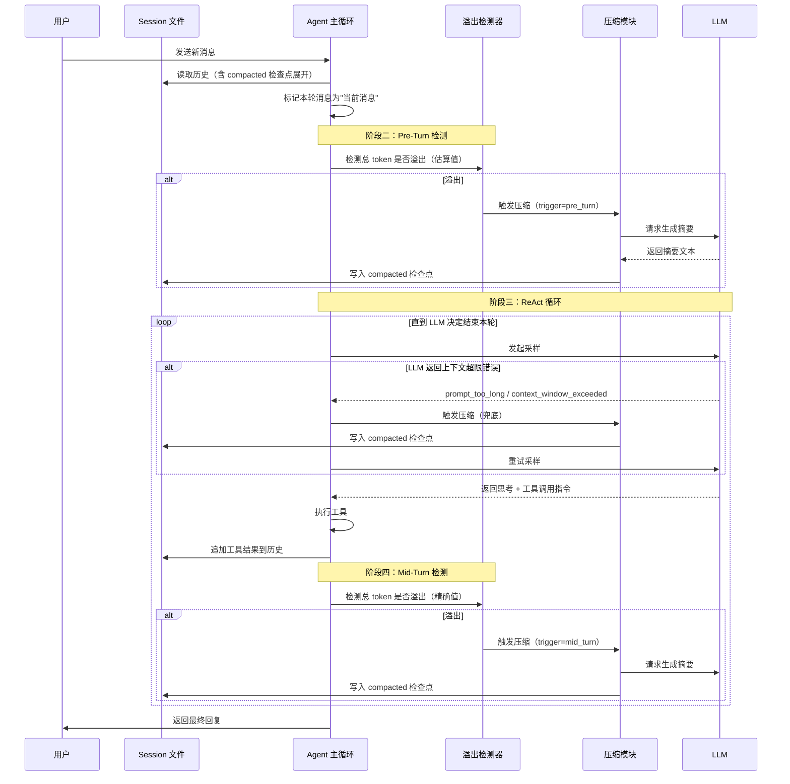
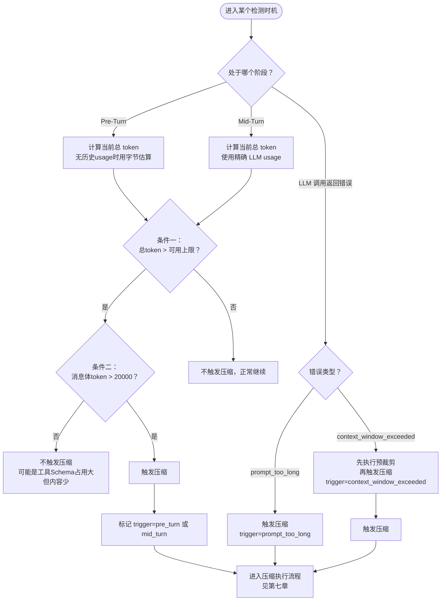
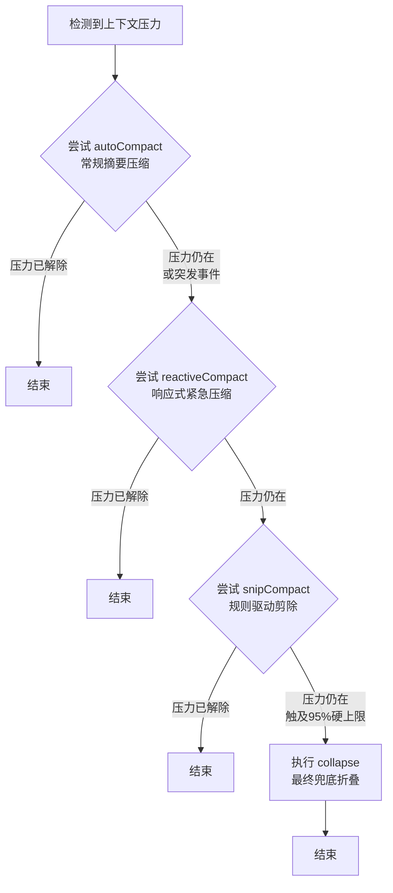
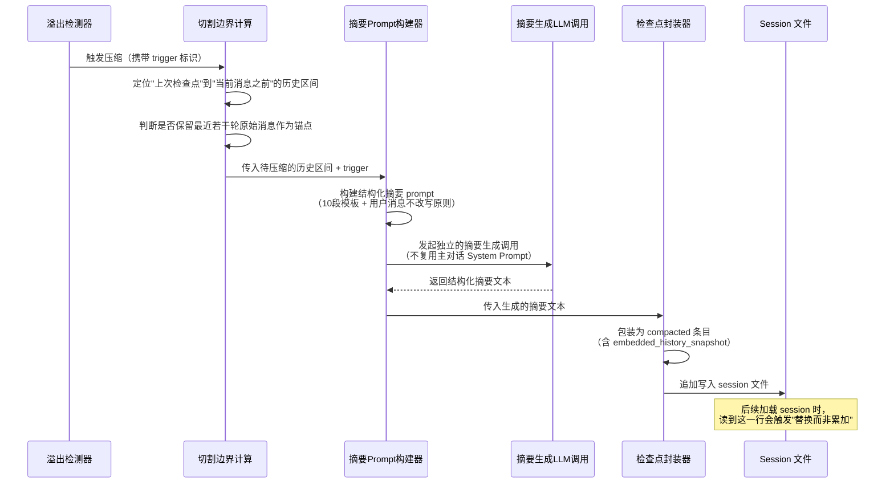
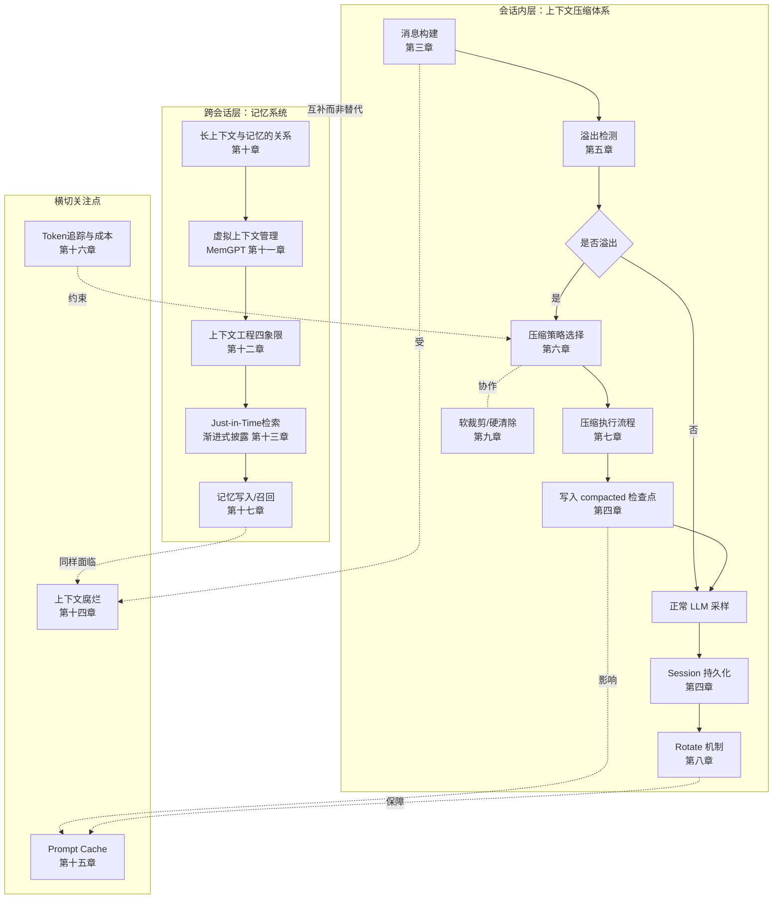
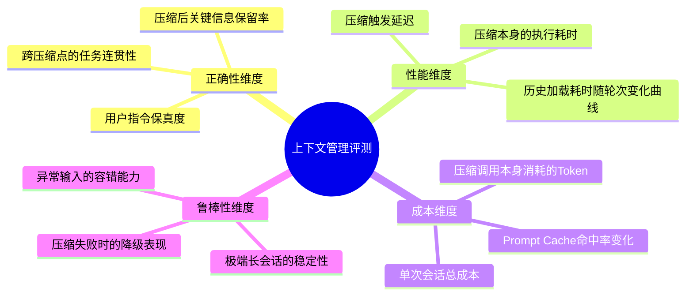

# 上下文管理与压缩机制：AI Agent 长对话工程深度解析

> 本文系统梳理 AI Agent 场景下上下文管理与压缩机制的技术原理、工程实现与前沿趋势。内容基于 CatDesk 实际生产实现、Claude Code 源码分析、MemGPT 论文、Anthropic 官方上下文工程方法论等一手技术资料整理而成，力求做到"技术细节可追溯、设计取舍可推导、行业对比可验证"。
>
> 文档定位：面向构建长时间运行 Agent 系统的工程师，覆盖从消息构建、溢出检测、压缩策略、Session 持久化，到长上下文与记忆系统关系、上下文工程方法论的完整知识体系。

---

## 目录

1. 引言：上下文管理为什么是 Agent 最关键的技术挑战
2. 上下文窗口的本质：有限资源与递减边际收益
3. CatDesk 上下文管理全链路（消息构建 → Pre-Turn → 采样 → Mid-Turn）
4. Session 持久化设计（JSONL 格式、条目类型处理、compacted 检查点机制）
5. 溢出检测机制（双条件判断、四个触发时机、精确 token vs 字节估算）
6. 压缩策略详解（autoCompact / reactiveCompact / snipCompact / collapse 四种策略）
7. 压缩执行流程（摘要生成 prompt 设计、切割边界、检查点写入）
8. Session 文件 Rotate 机制（有摘要时的反向扫描、Prompt Cache 友好性）
9. 软裁剪与硬清除（Pruning vs Compaction 的区别与协作）
10. 长上下文与记忆系统的关系（互补而非替代、Karpathy 的计算机类比）
11. 虚拟上下文管理（MemGPT 的分层记忆设计）
12. 上下文工程四象限（write / select / compress / isolate）
13. Just-in-time 检索与渐进式披露
14. 上下文腐烂（Context Rot）与注意力衰减
15. Prompt Cache 优化策略
16. Token 追踪与成本控制
17. 记忆系统设计（长期记忆 vs 每日记忆、记忆的写入与召回）
18. 与行业方案对比
19. 最佳实践与反模式
20. 总结与展望

附录：
- 附录A 核心术语表
- 附录B 常见问题解答
- 附录C 全文机制速查表
- 附录D 延伸思考：三个尚未完全解决的开放问题
- 附录E 章节内容速览
- 附录F 端到端案例推演：一次长会话的完整生命周期
- 附录G 上下文管理系统的评测与压测方法
- 附录H 落地实施检查清单
- 附录I 相关概念的边界辨析
- 附录J 关键设计参数参考值汇总
- 附录K 文档信息与阅读指引

---

## 第一章 引言：上下文管理为什么是 Agent 最关键的技术挑战

### 1.1 从单轮问答到长时间运行系统

大语言模型（LLM）应用的演进经历了一个清晰的阶段跃迁：从"输入一个问题、输出一个答案"的单轮问答系统，演变为在 ReAct 循环中持续执行、跨越数十甚至数百轮工具调用的自主 Agent 系统。这个跃迁看似只是"多问几次"，但背后隐藏着一个根本性的工程挑战——**上下文（Context）不再是一次性消耗品，而是一种需要被长期管理的、持续增长的状态资源**。

在单轮问答场景下，上下文管理几乎是不存在的问题：用户提问，模型作答，会话结束，所有中间状态归零。但当 Agent 开始在一个会话中连续执行"思考 → 调用工具 → 观察结果 → 再思考"的循环，问题的性质就完全变了：

- 每一次工具调用的返回结果（文件内容、命令输出、搜索结果、API 响应）都会被追加进上下文；
- 每一轮 LLM 的推理过程（包括中间的思考文本）也会被追加进上下文；
- 会话可能持续数小时甚至跨天，累积的历史消息可能达到数十万 token；
- 而模型的上下文窗口，无论是 128K、200K 还是所谓的"百万级"，本质上都是**有限**的。

这就带来了一个无法回避的矛盾：**会话历史的增长是无界的，而上下文窗口的容量是有界的**。任何一个需要长期、持续运行的 Agent 系统，都必须正面回答这个问题：当历史消息即将超出窗口容量时，系统该怎么办？

### 1.2 三种朴素但都不完备的答案

面对这个矛盾，工程实践中最先浮现的三种朴素答案，都各自存在明显缺陷：

**答案一：简单截断（Truncation）**

最直接的做法是——历史消息满了就丢弃最旧的部分，只保留最近 N 轮。这种做法实现成本几乎为零，但代价是**信息永久丢失**。如果被截断的历史中包含关键的任务背景、用户此前的明确指令、或者已经完成的阶段性结论，Agent 会因为"遗忘"而做出前后矛盾的行为——比如用户在第 3 轮说"不要在这个文件里加注释"，历史被截断后，Agent 在第 50 轮又开始加注释。

**答案二：扩大上下文窗口**

既然窗口不够大，那就把窗口做得更大——从 4K 到 128K，再到百万级。这条路径确实缓解了问题的紧迫性，但并没有从根本上解决问题，原因有三（详见第十章展开）：

- 推理成本随上下文长度**非线性**增长（Transformer 自注意力机制的计算复杂度是 O(n²)）；
- 模型对超长上下文中间部分的信息存在明显的注意力衰减，即"中间迷失"（Lost in the Middle）现象；
- 窗口本质上仍是会话级的、易失的（volatile）——会话一旦结束，所有信息归零，无法跨会话持久化。

**答案三：接入 RAG（检索增强生成）**

RAG 擅长解决"模型不知道某个领域知识"的问题，通过向量检索从外部知识库召回相关文档片段注入上下文。但 RAG 本质上解决的是**知识检索**问题，而不是**状态持久化**问题——它并不天然具备"记住这个用户是谁、在这次会话中已经做过什么决策、上一轮工具调用返回了什么"的能力。

### 1.3 真正的答案：压缩 + 分层记忆的工程体系

行业实践收敛到的答案，是一套融合了**上下文压缩（Context Compaction）**与**分层记忆系统（Memory System）**的工程体系：

- 在会话内部，通过检测溢出、生成摘要、替换历史的方式，让对话可以在有限窗口下"理论上无限"地延续下去（这是本文第 3～9 章的核心内容——CatDesk 与 Claude Code 的具体实现）；
- 在会话之上，通过分层记忆（工作记忆 / 情景记忆 / 语义记忆 / 长期记忆）与按需检索机制，让 Agent 能够跨越单次会话的边界，持续积累经验、记住用户偏好、避免重复踩坑（这是本文第 10～17 章的核心内容）。

这两条技术路线并非相互替代，而是分别解决了两个不同层次的问题：压缩机制回答的是"这一轮会话内，如何在窗口耗尽前继续对话"；记忆系统回答的是"跨越多次会话，Agent 应该长期记住什么、遗忘什么"。

### 1.4 为什么说这是"最关键"的技术挑战

之所以将上下文管理称为 Agent 工程中最关键的挑战，原因在于它是一个**横切关注点（cross-cutting concern）**——它几乎影响 Agent 系统的每一个其他维度：

| 影响维度 | 具体表现 |
|---------|---------|
| 正确性 | 上下文管理不当会导致 Agent"遗忘"关键指令、重复犯错、前后矛盾 |
| 成本 | 上下文中的每一个 token 都是要付费的；未经治理的上下文会导致账单线性甚至超线性增长 |
| 延迟 | 输入 token 越多，Prefill 阶段耗时越长，首 Token 时延（TTFT）越差 |
| 可靠性 | 上下文溢出若未被妥善处理，会直接导致 API 报错、会话中断 |
| 用户体验 | 频繁的、生硬的压缩会造成对话"断片感"；设计良好的压缩则对用户完全透明 |
| 工程复杂度 | 上下文管理涉及消息构建、持久化、溢出检测、摘要生成等多个子系统的协同 |

理解了这一点，就能理解为什么几乎所有严肃的 Agent 工程团队（无论是 CatDesk、Claude Code，还是 MemGPT、Manus）都投入了大量精力在这个看似"不起眼"的基础设施问题上——它不是锦上添花的优化项，而是决定 Agent 系统能否可靠地长期运行的地基。

### 1.5 本文的组织方式

本文采用"从实现到原理，从具体到抽象"的组织方式：

- 第 2 章先建立"上下文窗口是有限资源"这一核心认知框架；
- 第 3～9 章深入剖析 CatDesk 的上下文管理全链路——这是一套在生产环境中真实运行、经过验证的工程实现，从消息构建、溢出检测的双条件判断、四个触发时机，到 Session 持久化的 JSONL 格式与 compacted 检查点机制，再到 Rotate 机制与软硬裁剪的协作，力求把"压缩到底是怎么做的"讲透彻；
- 第 6～7 章同时对照 Claude Code 的四层压缩策略（autoCompact → reactiveCompact → snipCompact → collapse），展示同一个问题在不同工程团队手中的不同解法；
- 第 10～17 章从会话内压缩跳出来，讨论一个更大的命题——长上下文与记忆系统的关系，MemGPT 的虚拟上下文管理，Anthropic 提出的上下文工程四象限方法论，以及 Prompt Cache、Token 追踪、记忆系统设计等配套工程能力；
- 第 18～20 章做行业对比、总结最佳实践与反模式，并对未来趋势做出判断。

---

## 第二章 上下文窗口的本质：有限资源与递减边际收益

### 2.1 上下文窗口不是"越大越好"的简单命题

在讨论具体的压缩机制之前，有必要先建立一个正确的认知框架：**上下文窗口是一种有限且宝贵的资源，具有递减边际收益（diminishing marginal returns）**。这是 Anthropic 在其官方工程博客《Effective Context Engineering for AI Agents》中明确提出的核心论断：

> "Context must be treated as a finite resource with diminishing marginal returns. Like humans, who have limited working memory capacity, LLMs have an 'attention budget' that they draw on when parsing large volumes of context. Every new token introduced depletes this budget by some amount, increasing the need to carefully curate the tokens available to the LLM."

翻译过来，这段话传达了三层含义：

1. **上下文是有限资源**——即使窗口容量在数字上很大（32K、128K、200K，乃至百万级），也不代表可以无节制地填充；
2. **模型存在"注意力预算"（attention budget）**——类比人类有限的工作记忆容量，模型在解析海量上下文时，也存在一个隐性的注意力总预算；
3. **每个新增 token 都在消耗这个预算**——这意味着上下文管理的目标不是"塞进尽可能多的信息"，而是"以最小的 token 集合触发最理想的模型行为"。

### 2.2 性能梯度：不是突然崩溃，而是逐渐退化

一个常见的误解是：只要不超过模型的硬性 token 上限，模型的表现就不会受到影响。但实际情况并非如此。Anthropic 的研究揭示了一个更微妙的现象——**性能梯度（Performance Gradient）**：随着上下文中 token 数量的增加，模型对信息的精确召回能力和长程推理能力会**逐渐退化**，而不是在某个阈值处突然崩溃。

这背后有两层技术原因：

**原因一：Transformer 架构的二次方复杂度**

主流 LLM 基于 Transformer 架构，其自注意力机制在处理 n 个 token 时，需要计算 n² 个成对关系（pairwise relationship）。随着上下文长度的增加，这种全连接式的注意力计算天然地会导致模型的"注意力"在更多的 token 之间被稀释——每个 token 能分配到的有效注意力权重相对下降。

**原因二：训练数据分布的先天局限**

更深层的原因来自训练数据本身的分布特性：模型在预训练阶段接触到的绝大多数文本都是相对短序列，只有少数参数、少数训练样本专门用于建模长程依赖关系。这意味着模型处理超长上下文的能力，本质上是一种"分布外泛化"（out-of-distribution generalization）能力，而不是被大规模、针对性训练出来的核心能力。

这两个原因共同导致了一个直接的工程后果：**给模型堆砌过多的、不相关的上下文信息，会让模型在海量信号中"迷失方向"**，这种现象被称为**上下文腐烂（Context Rot）**——我们会在第 14 章详细展开。

### 2.3 "金发姑娘区"：寻找恰到好处的上下文密度

如果上下文既不能太少（信息不足导致模型缺乏必要背景）、也不能太多（信息过载导致注意力稀释与腐烂），那么工程实践的核心问题就变成了：**如何找到那个恰到好处的"金发姑娘区"（Goldilocks Zone）？**

Anthropic 用"高度（Altitude）"这个概念来描述这种平衡——尤其是在系统提示词（System Prompt）的编写上。这个平衡点位于两个失败模式之间：

```
                    系统提示词的"高度"光谱

  过于具体（Brittle Logic）                过于抽象（Vague Guidance）
  ─────────────────────────────────────────────────────────────►
  │                                                            │
  │  用复杂的 if-else 逻辑                      只给出笼统的原则，
  │  锁定 Agent 的每一步行为                    没有可执行的具体指导
  │                                                            │
  │  失败模式：                                 失败模式：
  │  一旦遇到预期外的输入，                      模型缺乏足够的
  │  系统立刻变得脆弱、失效                      上下文来做出正确判断
  │                                                            │
  └────────────────────┬───────────────────────────────────────┘
                        │
                  理想的"高度"：
              足够具体以指导行为，
              又保留足够的灵活性
              让模型运用自身判断力
```

这一原则不仅适用于系统提示词的设计，同样适用于整个上下文的构建策略——包括工具描述的详略、历史消息的取舍、记忆片段的注入粒度。

### 2.4 有效上下文窗口：不等于模型宣称的窗口大小

在工程实现中，"上下文窗口"并不是一个可以被 100% 用满的数字。以 CatDesk 与 Claude Code 的实现为例，系统内部会计算一个**有效上下文窗口（Effective Context Window）**，而不是直接使用模型文档中宣称的窗口容量：

```
有效上下文窗口 = 模型宣称的上下文窗口 − 压缩缓冲区 − 模型最大输出 token 数
```

这个公式包含两个必要的"安全垫"：

- **压缩缓冲区（Compaction Buffer）**：为压缩操作本身预留的空间。压缩过程需要调用 LLM 生成摘要，这个调用本身也需要占用一部分上下文；同时也要为"压缩后又快速累积到临界点"的情况留出缓冲，避免刚压缩完又立刻触发下一次压缩。
- **模型最大输出 token 数**：模型的输出也会占用上下文窗口的"预算"（对于绝大多数商用 LLM API，输入 + 输出的 token 总量不能超过窗口上限），必须提前预留。

这个"有效窗口"的概念，是理解后续所有溢出检测逻辑的基础——系统判断"是否溢出"，从来不是拿总 token 数与模型宣称的窗口大小做比较，而是与这个经过折算的、更保守的有效窗口做比较。

### 2.5 上下文管理的目标函数

综合以上讨论，可以把上下文管理这个工程问题的目标函数概括为：

> 在信息保真度（Fidelity）、API 成本（Cost）、响应延迟（Latency）、缓存命中率（Cache Hit Rate）四个维度之间，找到一个动态平衡点，使 Agent 在任意长度的会话中都能够：
> 1. 不因为历史丢失而做出错误决策；
> 2. 不因为上下文膨胀而产生不可控的成本；
> 3. 不因为 Prefill 时间过长而损害用户体验；
> 4. 不因为压缩操作破坏前缀一致性而丧失缓存收益。

这四个维度往往相互制约：过度压缩（追求成本最低）会损害信息保真度；过度保守（追求信息保真度最高）会推高成本与延迟；而压缩操作本身如果设计不当，又会破坏 Prompt Cache 的前缀匹配，进一步推高成本与延迟。第 3 章开始，我们将看到 CatDesk 是如何在真实生产系统中处理这一系列平衡的。

---

## 第三章 CatDesk 上下文管理全链路

### 3.1 整体设计理念

CatDesk 的上下文管理系统解决的核心问题可以用一句话概括：**在有限的模型上下文窗口下，让对话理论上可以无限轮次地持续进行下去**。

其基本工作模式是：每轮对话开始时，系统将所有历史消息组装为消息列表，连同 System Prompt 一起发送给 LLM。随着对话轮次的增加，历史消息持续累积。当总 token 数逼近模型上下文窗口上限时，系统触发**上下文压缩（Context Checkpoint Compaction）**，将历史消息替换为 LLM 生成的摘要检查点（Checkpoint），从而为新一轮对话腾出空间。

这套机制的精妙之处在于：压缩不是一次性的"事件"，而是一个可以在会话生命周期中反复发生的"例行程序"——每当历史积累到临界点，就再压缩一次，如此循环，实现真正意义上的"无限对话"。

### 3.2 全链路的四个阶段

CatDesk 的上下文管理链路可以分解为四个阶段，它们在一次完整的用户交互（一个"回合"，Turn）中按顺序发生：

```
┌──────────────────────────────────────────────────────────────────┐
│                     CatDesk 上下文管理全链路                        │
└──────────────────────────────────────────────────────────────────┘

阶段一：消息构建（Message Construction）
┌────────────────────────────────────────────────────────────────┐
│  从持久化的 session 文件重建历史                                  │
│  （含压缩检查点展开：遇到 compacted 条目时以快照直接替换历史）        │
│                          ↓                                       │
│  将本轮用户消息标记为"当前消息"（current message）                  │
└────────────────────────────────────────────────────────────────┘
                          ↓
阶段二：Pre-Turn 检测（Pre-Turn Overflow Detection）
┌────────────────────────────────────────────────────────────────┐
│  在第一次 LLM 调用之前，检测是否已经溢出                            │
│  若溢出 → 先执行一次压缩，再进行本轮的 LLM 采样                     │
└────────────────────────────────────────────────────────────────┘
                          ↓
阶段三：LLM 采样与工具执行（Sampling & Tool Execution）
┌────────────────────────────────────────────────────────────────┐
│  正常的 ReAct 循环：LLM 推理 → 工具调用 → 观察结果 → 继续推理        │
│  兜底：若 LLM 返回"上下文超限"错误，作为异常兜底再次触发压缩           │
└────────────────────────────────────────────────────────────────┘
                          ↓
阶段四：Mid-Turn 检测（Mid-Turn Overflow Detection）
┌────────────────────────────────────────────────────────────────┐
│  本轮所有工具执行完毕后，再次检测是否溢出                           │
│  若溢出 → 压缩后继续下一轮采样（下一个 ReAct 迭代）                  │
└────────────────────────────────────────────────────────────────┘
```

下面逐阶段展开说明。

### 3.3 阶段一：消息构建

每一次用户发起对话（或系统自动触发一次新的处理），Agent 都不是从内存里的一个长期存活的对象中读取历史，而是**从持久化的 session 文件重建**整个历史消息列表。这是一个关键的架构选择——它意味着 Agent 进程本身可以是无状态的、可以随时重启，因为真正的状态权威（source of truth）在磁盘上的 session 文件里。

重建过程中有一个关键的优化：**如果历史中存在压缩检查点（compacted 条目），系统不会从头开始逐条重放所有历史消息，而是直接从最近一次检查点的快照开始，再补上检查点之后新增的消息**。这个设计将在第 4 章详细展开，它使得"加载历史"这一操作的时间复杂度只与最近一次压缩后新增的消息数量成正比，而与历史的总体积（total volume）完全无关——这是支撑"理论上无限对话"这一承诺的关键工程细节之一。

重建完成后，系统会将**本轮用户新发送的消息标记为"当前消息"（current message）**。这个标记看似简单，却承担着两个核心职责：

**职责一：Pre-Turn 压缩的切割边界**

当 Pre-Turn 检测判断需要压缩时，压缩操作只会作用于"当前消息"**之前**的历史——本轮用户刚发出的消息会原样保留，不会被压缩摘要覆盖。这保证了压缩永远不会影响到用户"正在说的这句话"，避免出现摘要生成过程中丢失当前意图的情况。

**职责二：持久化路由定位**

在将本轮的处理结果（助手回复、工具调用记录等）写回 session 文件时，系统需要知道"本轮从哪里开始"，这个标记提供了精确的定位依据，确保新写入的内容能够正确地追加在正确的位置。

### 3.4 阶段二：Pre-Turn 检测

在消息构建完成、即将发起第一次 LLM 调用之前，系统会执行一次溢出检测（详细的判断逻辑见第 5 章）。这一步被称为 **Pre-Turn 检测**，其设计意图是"防患于未然"——与其等到 LLM 调用因为上下文过长而报错，不如在调用发起之前就主动判断是否已经逼近极限。

如果 Pre-Turn 检测判定当前历史已经溢出（或即将溢出），系统会先执行一次压缩操作，将"当前消息"之前的历史压缩为一个摘要检查点，然后才带着"压缩后的历史 + 当前消息"发起本轮的第一次 LLM 采样。

这一步之所以重要，是因为它是整个链路中**成本最低、时机最从容**的压缩时机——此时还没有产生任何本轮的工具调用结果，压缩所需处理的消息量是相对固定和可预测的，不会有"压缩过程中历史又继续增长"的竞态问题。

### 3.5 阶段三：LLM 采样与工具执行（标准 ReAct 循环）

通过 Pre-Turn 检测之后，Agent 进入标准的 ReAct（Reasoning + Acting）循环：

```
   ┌─────────────────────────────────────────────┐
   │                                               │
   ▼                                               │
LLM 推理（生成思考 + 决定下一步行动）                    │
   │                                               │
   ├─→ 若决定调用工具 ──→ 执行工具 ──→ 观察工具返回结果 ──┘
   │
   └─→ 若决定直接回复用户 ──→ 结束本轮
```

在这个循环内部，存在一个**兜底型的溢出触发机制**：如果 LLM 服务在处理本次请求时，因为输入过长而直接在 API 层返回"上下文超限"类型的错误（例如 HTTP 层的 `prompt too long` 异常，或者携带 `context_window_exceeded` 这类 finish reason 的响应），系统会将这一异常识别为"事后确认的溢出信号"，并触发一次紧急压缩，然后重试本次采样。

这个兜底机制的价值在于**双重保险**：即便 Pre-Turn 检测和 Mid-Turn 检测（下面即将介绍）由于某些估算误差（例如使用了字节估算而非精确 token 计数）而漏判，只要 LLM 服务端明确报告"确实超限了"，系统依然有能力恢复，而不是让整个会话直接失败并中断在用户面前。

### 3.6 阶段四：Mid-Turn 检测

一轮完整的 Agent 处理，可能包含多次工具调用——LLM 可能先读一个文件，再执行一次搜索，再调用另一个工具，每一次工具返回的结果都会被追加进上下文。这意味着，**即便本轮开始时（Pre-Turn）历史大小是安全的，经过若干次工具调用之后，上下文体积也可能迅速膨胀到接近甚至超过安全阈值**。

因此，在本轮所有工具执行完毕、即将进入下一次 LLM 采样之前，系统会再执行一次溢出检测——这就是 **Mid-Turn 检测**。与 Pre-Turn 检测不同的是，此时系统已经完成了至少一次 LLM 调用，因此可以拿到 LLM 返回的**精确 token 使用量（usage）**，而不必再依赖估算，这使得 Mid-Turn 检测的判断精度显著高于 Pre-Turn 检测。

如果 Mid-Turn 检测判定溢出，系统会立即执行一次压缩，然后带着压缩后的历史继续发起下一轮采样，ReAct 循环得以继续，直到 LLM 决定结束本轮回复。

### 3.7 四个阶段的时序图



### 3.8 为什么要设计四个而非一个检测点

一个自然的疑问是：为什么不在"消息即将发给 LLM 之前"统一做一次检测就够了，而要分出 Pre-Turn、Mid-Turn 以及两个兜底触发点，一共四个时机？

这个设计选择背后的工程考量是**检测成本与检测精度之间的权衡**，以及**故障容错的层次化设计**：

1. **Pre-Turn 检测**成本最低（此时历史相对静态），但精度受限于估算方式（可能还没有精确 token 数可用）；
2. **Mid-Turn 检测**发生在工具调用之后，此时已经有精确的 LLM usage 数据，精度更高，但发生时机较晚——如果不做这一步，历史可能会在本轮内部持续膨胀而不被察觉；
3. 两个**兜底触发点**（`prompt_too_long` 与 `context_window_exceeded`）是最后一道防线——即便前两个主动检测点都因为某种估算误差而漏判，系统依然能够从 LLM 服务端返回的错误信号中"亡羊补牢"，避免会话彻底失败。

这种"多层检测 + 层层兜底"的设计哲学，贯穿于整个 CatDesk 的上下文管理体系，也是本文后续第 5 章将要详细展开的核心内容。

### 3.9 与消息持久化的关系

值得强调的是，四个阶段中的每一次压缩操作，最终都会体现为对 session 文件的一次写入——压缩不是纯内存操作，而是会立即持久化为一个新的 `compacted` 条目（见第 4 章）。这意味着，即使 Agent 进程在压缩后的下一秒崩溃重启，重新加载 session 文件时依然能够正确地从最新的压缩检查点开始重建历史，不会丢失压缩产生的收益，也不会因为重复压缩同一段历史而浪费 LLM 调用。

---

## 第四章 Session 持久化设计

### 4.1 为什么选择 JSONL 而不是单一 JSON 文件

CatDesk 的历史消息以 **JSONL（JSON Lines）** 格式持久化在 session 文件中，个人维度与群维度分开存储（例如个人单聊场景与群聊场景使用不同的 session 文件命名空间，避免上下文串扰）。

选择 JSONL 而非单一大 JSON 对象，是一个经过深思熟虑的工程决策，原因包括：

| 维度 | JSONL（每行一条 JSON） | 单一 JSON 大对象 |
|------|----------------------|-----------------|
| 追加写入 | 天然支持 append-only，只需在文件末尾追加一行 | 需要反序列化整个文件、修改、再全量序列化写回 |
| 部分读取 | 可以按行流式读取，支持从文件尾部反向扫描 | 必须完整解析才能访问任意部分 |
| 故障恢复 | 单行损坏只影响这一条记录，其余行不受影响 | 任何字符损坏都可能导致整个文件解析失败 |
| 并发写入安全性 | 追加写在大多数文件系统上是相对安全的原子操作 | 全量重写窗口期内容易被并发写入破坏 |
| 历史演进 | 新增字段/新增条目类型不影响旧行的解析 | 大对象的 schema 变更影响面更大 |

这几个特性共同决定了 JSONL 是"持续增长的、需要频繁追加写入的会话历史"这一场景下的自然选择——事实上，包括 Claude Code、大多数主流 Agent 框架的会话持久化机制，都采用了类似的 append-only 日志式设计。

### 4.2 条目类型与处理方式

Session 文件中的每一行（每一个 JSONL 条目）都有一个类型标记，加载时系统会根据条目类型做不同的处理，将其"翻译"为最终喂给 LLM 的标准消息格式：

| 条目类型 | 处理方式 |
|---------|---------|
| `user` | 转换为用户消息（user message） |
| `assistant`（含工具调用） | 展开为一条助手消息 + 若干条工具结果消息 |
| `assistant`（无工具调用） | 转换为普通的助手消息 |
| `tool` | 转换为工具消息（tool message） |
| `compacted` | 展开其内嵌的历史快照，直接**替换**当前的历史列表 |

前四种类型的处理逻辑相对直观，基本是"格式转换"层面的映射——把持久化时的存储格式还原为 LLM API 所期望的消息结构。真正体现设计精巧之处的，是第五种类型：`compacted`。

### 4.3 compacted 条目：压缩检查点的核心

`compacted` 条目是整个上下文管理体系中最关键的数据结构，它代表着一次压缩操作的"快照"（Checkpoint）。当加载器（loader）在顺序扫描 session 文件的过程中读取到一行 `compacted` 类型的条目时，行为与前四种类型截然不同：

**系统不会将这个 compacted 条目"追加"到已经累积的历史列表中，而是用这个条目内嵌的历史快照，直接替换整个已经构建的历史列表。**

用伪代码表达这个加载逻辑：

```python
def load_session_history(session_file_path):
    """
    从 session 文件重建历史消息列表。
    关键设计：遇到 compacted 条目时，直接替换而非累加。
    """
    history = []  # 最终要返回的消息列表

    for line in read_jsonl_lines(session_file_path):
        entry = parse_json(line)

        if entry.type == "user":
            history.append(to_user_message(entry))

        elif entry.type == "assistant":
            if entry.has_tool_calls:
                history.append(to_assistant_message(entry))
                for tool_result in entry.tool_results:
                    history.append(to_tool_message(tool_result))
            else:
                history.append(to_assistant_message(entry))

        elif entry.type == "tool":
            history.append(to_tool_message(entry))

        elif entry.type == "compacted":
            # 核心逻辑：不是 append，而是 replace！
            # 用检查点内嵌的快照，直接覆盖此前累积的全部历史
            history = entry.embedded_history_snapshot.copy()
            # 快照本身就已经包含了"摘要消息"作为历史的起点，
            # 后续行会在这个新的起点基础上继续正常累加

    return history
```

这个"替换而非累加"的语义，正是整套压缩机制得以摊销历史读取成本的核心原理。

### 4.4 为什么"替换"而非"追加"是关键设计

设想一个反例：如果 `compacted` 条目的处理方式是"追加一条摘要消息到历史列表末尾"，而不是"替换整个历史列表"，会发生什么？

答案是：**历史列表会无限增长，压缩将失去意义**。因为即便生成了摘要，原始的、冗长的历史消息依然停留在 session 文件里，加载器每次重建历史时，仍然需要把这些原始消息全部解析、全部转换、全部塞进内存中的消息列表——只是列表末尾多了一条摘要而已。这样一来，"加载历史"这个操作的时间复杂度依然与会话的总生命周期长度成正比，压缩带来的唯一收益就只剩下"减少了发给 LLM 的 token 数"，而"减少了加载与处理历史所需的工程开销"这部分收益则完全落空。

而"替换"语义则从根本上解决了这个问题：一旦某一行是 `compacted` 类型，加载器就可以安全地**丢弃这一行之前的所有累积状态**，直接以这个检查点的快照作为新的起点。这意味着：

> **加载历史的代价，只与"最近一次压缩之后新增的消息数量"成正比，与"历史的总体积"完全无关。**

这是一个典型的"检查点（Checkpoint）+ 增量重放（Incremental Replay）"模式，在分布式系统、数据库 WAL（Write-Ahead Log）、状态机复制等领域都有成熟的对应设计——本质上都是通过"定期打快照 + 只重放快照之后的增量"来避免"重放整个历史"的线性甚至更差的开销。

### 4.5 加载效率的形式化描述

用更形式化的方式描述这个优化的价值：

设一个会话总共产生了 N 条历史消息，其中最近一次压缩发生在第 K 条消息之后（K < N）。

- **不做压缩、或压缩后仍需累加**的加载复杂度：O(N)，且 N 随会话时长线性增长，理论上无上界；
- **压缩后采用替换语义**的加载复杂度：O(N − K)，即只需处理最近一次压缩点之后的增量消息。

由于压缩会周期性地发生（每当历史逼近溢出阈值就会触发一次新的压缩），(N − K) 这个差值实际上有一个**近似恒定的上界**——大致等于"从一次压缩到下一次压缩之间，会话通常能容纳的新增消息量"。这正是"理论上无限轮次对话"这一承诺在工程上的真正含义：不是说历史消息不会丢失（摘要必然是有损压缩），而是说**加载与处理历史的成本不会随会话总时长的增长而增长**。

### 4.6 快照的内容：不只是摘要文本

需要澄清一个容易产生的误解：`compacted` 条目内嵌的"历史快照"，并不仅仅是一段摘要文字，而是一个**可以直接作为消息列表使用的结构化数据**。这个快照通常至少包含：

1. 一条（或若干条）由 LLM 生成的摘要消息，通常以特定的角色（例如系统消息或助手消息）呈现，内容是对被压缩的历史片段的结构化总结；
2. 必要时，还会保留一些不适合被摘要掉的"硬信息"，例如：最近若干轮的原始工具调用记录、当前任务的关键状态标记等（不同实现在这一点上取舍不同，第 6～7 章会展开讨论 Claude Code 在这方面更精细的分层策略）。

这个快照结构，本质上就是"压缩后的新历史起点"——加载器读到 `compacted` 条目后，直接把这个快照当作"仿佛会话就是从这里开始的"新历史基线，然后在这个基线之上继续正常地叠加后续消息。

### 4.7 当前消息标记与持久化路由的协同

回顾第 3 章提到的"当前消息"标记机制，它与 session 持久化设计存在紧密的协同关系。当一轮对话处理完成、需要把这一轮产生的新消息（用户消息、助手回复、工具调用记录）追加写入 session 文件时，系统需要精确知道"应该从哪里开始追加"。

"当前消息"标记提供的正是这个定位依据——它标示了"本轮从这里开始"，因此持久化写入操作只需要把这个标记之后新产生的所有消息，依次以 JSONL 的形式追加到文件末尾即可，不需要重写文件中已经存在的历史内容。这与前面讨论的"追加写优于全量重写"的 JSONL 设计哲学是完全一致的。

### 4.8 Session 文件结构示意

将以上讨论整合起来，一个真实的 session 文件在磁盘上大致呈现如下结构（示意，字段做了简化）：

```jsonl
{"type": "user", "content": "帮我看一下这个项目的目录结构", "ts": 1700000001}
{"type": "assistant", "content": "好的，我先列出目录", "tool_calls": [{"id": "t1", "name": "list_dir", "args": {...}}], "ts": 1700000002}
{"type": "tool", "tool_call_id": "t1", "content": "src/\n  main.py\n  utils.py\n...", "ts": 1700000003}
{"type": "assistant", "content": "项目包含 src 目录，下有 main.py 和 utils.py", "ts": 1700000004}
{"type": "user", "content": "把 utils.py 里的日志函数改成异步的", "ts": 1700000010}
...（数十轮工具调用与对话往复，历史持续增长）...
{"type": "compacted", "trigger": "mid_turn", "summary": "用户请求...", "embedded_history_snapshot": [
    {"role": "system", "content": "【历史摘要】用户此前已确认项目结构，正在对 utils.py 的日志函数做异步化改造，已完成..."}
], "ts": 1700003000}
{"type": "user", "content": "改完之后帮我跑一下单测", "ts": 1700003010}
{"type": "assistant", "content": "好的，正在执行测试", "tool_calls": [...], "ts": 1700003011}
...（后续消息在压缩检查点基础上继续正常累加）...
```

加载器读取这个文件时，遇到 `compacted` 那一行，会立刻丢弃此前重建的所有历史（前面那一长串 user/assistant/tool 交替的记录），转而使用 `embedded_history_snapshot` 作为新的历史基线，再继续叠加后面的 `user`/`assistant` 行。

### 4.9 个人维度与群维度分离存储的意义

前文提到，历史消息按"个人维度与群维度分开存储"。这个设计不仅仅是数据隔离的需要，也直接服务于上下文管理的正确性：

- **个人单聊场景**：Agent 与单一用户之间的对话，上下文可以安全地包含用户的个性化信息（偏好、历史行为、私有数据）；
- **群聊场景**：多个用户共享同一个 Agent 会话，上下文的构建必须更谨慎，避免将某个用户的私有信息（例如个人记忆文件）泄露给群内其他成员。

将两种场景的 session 文件在存储层面就彻底分开，从架构上杜绝了"个人上下文被错误地加载进群聊上下文"这类安全隐患，这也是本文第 17 章会进一步讨论的、记忆系统安全策略（例如 MEMORY.md 仅在个人单聊主会话中注入，不在群聊等共享上下文中加载）的存储层基础。


---

## 第五章 溢出检测机制

### 5.1 溢出判断的双条件设计

CatDesk 的溢出检测并不是简单地判断"总 token 数是否超过某个阈值"这样单一维度的逻辑，而是采用了**双条件（AND 逻辑）**的判断方式——只有同时满足以下两个条件，系统才会判定为"溢出"并触发压缩：

```
是否触发压缩 = 条件一（总 token 超限） AND 条件二（消息体 token 超过有效压缩阈值）
```

这个双条件设计背后有着明确的工程动机，下面分别展开。

### 5.2 条件一：总 token 超过可用上限

第一个条件判断的是"整体输入是否即将撑爆有效上下文窗口"。其计算公式为：

```
可用上限 = 模型上下文窗口 − 压缩缓冲区（默认 20000） − 模型最大输出 token 数
```

这与第 2.4 节讨论的"有效上下文窗口"概念完全一致——**压缩缓冲区默认取 20000 token**，这个数字并非随意选择，而是需要覆盖两类开销：

1. 压缩操作本身调用 LLM 生成摘要所需的额外 token 空间；
2. 从"检测到溢出"到"压缩真正完成并生效"这段时间窗口内，会话可能继续产生的新增内容（尤其是 Mid-Turn 场景下，一次工具调用可能返回相当大的输出）。

"当前总 token 数"这个输入值本身的获取方式，也体现出一种"精度优先、估算兜底"的层次化设计：

- **如果本轮或历史上已经发生过至少一次 LLM 调用**，系统直接使用 LLM 返回结果中携带的精确 usage 数值（即模型服务端告知的准确 token 计数）；
- **如果是会话的第一轮、或者当前还没有任何历史 usage 数据可用**（典型场景就是 Pre-Turn 检测——此时可能连第一次 LLM 调用都还没发生），系统会**降级（fallback）为基于消息内容的字节数估算**。

### 5.3 精确 Token 计数 vs 字节估算：两种精度的取舍

这个"精确值优先、估算值兜底"的设计，反映了一个现实的工程约束：**精确的 token 计数，原则上只有在实际调用了 tokenizer（分词器）或者拿到了 LLM 服务端返回的 usage 字段之后才能获得**。而在 Pre-Turn 检测这个时间点上，恰恰还没有发起本轮的 LLM 调用，自然也就没有精确的 usage 数据可用。

面对这种情况，系统采用的解决方案是"字节数估算"——一种基于经验规则、快速但不完全精确的近似计算方法（例如按照"平均每 N 个字节约等于 1 个 token"的经验比例进行折算，中文与英文的折算系数通常还需要分别校准，因为中文字符的 token 密度显著高于英文单词）。

两种方式的对比：

| 维度 | 精确 Token 计数（LLM usage） | 字节数估算 |
|------|---------------------------|-----------|
| 精度 | 完全准确，与计费口径一致 | 近似值，存在一定误差（通常在 10%～30% 区间浮动，具体取决于内容的语言构成） |
| 获取时机 | 只有在已经发生过 LLM 调用之后才能拿到 | 任意时刻都可以立即计算，无需额外调用 |
| 计算成本 | 零成本（复用 API 返回结果） | 需要遍历消息内容做统计，但本身计算量很小 |
| 使用场景 | Mid-Turn 检测（本轮已发生过至少一次 LLM 调用） | Pre-Turn 检测（首轮或无历史 usage 时的兜底） |

这种设计体现了一种务实的工程哲学：**不追求处处精确，而是在能精确的地方精确，在无法精确的地方保守估算，并通过后续的兜底触发机制（见 5.5 节）来弥补估算误差可能带来的漏判风险**。

### 5.4 条件二：消息体 token 超过有效压缩阈值

第二个条件与第一个条件的关注点完全不同——它单独判断**消息体本身**（不包含 System Prompt 和工具 Schema 定义）的 token 估算值，是否超过一个独立的阈值（默认同样是 **20000**）。

这个条件存在的目的，是为了过滤掉一类特殊但并不罕见的"无效压缩场景"：**工具 Schema（各类工具的参数定义、描述文本）本身占用了大量 token，但真正的对话消息内容（历史对话、工具调用结果等）却很少**。

设想这样一个场景：某个 Agent 配置了大量的工具（MCP 工具、内置工具等），仅仅是工具的 JSON Schema 定义部分就占用了 15000 token，加上 System Prompt 另占 5000 token，两者相加已经逼近甚至超过了模型窗口的相当一部分。但此时对话才刚刚开始，用户只发了一两条消息，真正的"消息体"部分可能只有几百个 token。

在这种场景下，如果只依赖条件一（总 token 是否超限）来判断，系统很可能会误判为"需要压缩"——但压缩的本质是"总结历史对话、腾出空间"，如果历史对话本身内容极少，压缩操作根本无法带来任何实质性的空间节省（因为占用空间的大头是工具 Schema 和 System Prompt，这两部分是压缩机制**无法触碰**的固定开销）。在这种情况下强行触发压缩，不仅浪费了一次 LLM 调用的成本和延迟，产生的摘要也几乎没有信息量可言。

因此，条件二的存在，本质上是一个"压缩是否有意义"的前置校验：只有当消息体本身已经积累了足够多的内容（默认阈值 20000 token），压缩才被认为是"划算"的操作。

### 5.5 双条件组合判断的完整逻辑

将两个条件组合起来，完整的溢出判断伪代码如下：

```python
def is_context_overflow(
    current_total_tokens: int,       # 当前总 token 数（精确值或估算值）
    message_body_tokens: int,        # 消息体本身的 token 估算值（不含 System Prompt 与工具 Schema）
    model_context_window: int,       # 模型宣称的上下文窗口
    compaction_buffer: int = 20000,  # 压缩缓冲区，默认 20000
    max_output_tokens: int,          # 模型最大输出 token 数
    min_effective_compaction_threshold: int = 20000,  # 有效压缩阈值，默认 20000
) -> bool:
    """
    双条件判断：只有两个条件同时满足，才判定为需要压缩。
    """
    # 条件一：总 token 是否超过可用上限
    available_limit = model_context_window - compaction_buffer - max_output_tokens
    condition_1 = current_total_tokens > available_limit

    # 条件二：消息体本身是否超过有效压缩阈值
    # 目的：过滤"工具 Schema 占用大但消息内容极少"的无效压缩场景
    condition_2 = message_body_tokens > min_effective_compaction_threshold

    return condition_1 and condition_2
```

### 5.6 四个触发时机的完整梳理

结合第 3 章介绍的四个阶段，溢出检测在 CatDesk 系统中一共存在四个明确的触发时机，每个时机都携带一个 `trigger` 标识，用于在日志、监控和后续的摘要生成 prompt 中标注"这次压缩是因为什么原因被触发的"：

| 触发点 | 触发条件 | trigger 标识 | 检测精度 |
|--------|---------|-------------|---------|
| Pre-Turn 预压缩 | 首次 LLM 调用前，总 token 溢出（双条件判断） | `pre_turn` | 依赖字节估算（无历史 usage 时） |
| Mid-Turn 工具后压缩 | 本轮所有工具执行完毕后，使用精确 token 判断 | `mid_turn` | 精确（有 LLM usage 可用） |
| 兜底：prompt 过长异常 | LLM 请求在 HTTP 层直接抛出"prompt 过长"错误 | `prompt_too_long` | 由服务端权威判定，最高精度 |
| 兜底：上下文已打满 | LLM 返回 `model_context_window_exceeded` 这一 finish reason | `context_window_exceeded` | 由服务端权威判定，最高精度 |

前两个是**主动检测**——系统在发起 LLM 调用之前，基于自身掌握的信息主动判断是否需要压缩；后两个是**被动兜底**——系统被动地接收 LLM 服务端返回的明确信号，确认"确实已经溢出了"。

### 5.7 两种兜底触发的差异

虽然 `prompt_too_long` 和 `context_window_exceeded` 都属于"事后确认溢出"的兜底机制，但两者在语义上存在细微但重要的差异：

- **`prompt_too_long`**：这是在请求**发出之后、模型尚未真正开始生成**的阶段就被拒绝的错误——通常发生在 HTTP 层或 API 网关层，服务端在做基本的输入校验时就发现请求体的 token 数超过了硬性上限，直接拒绝整个请求，不会产生任何有效输出。
- **`context_window_exceeded`**：这是模型在推理过程中，作为一种 **finish reason**（结束原因）返回的信号，语义是"模型确认自己的上下文窗口已经被实际打满"——这种情况可能发生在输入本身没有超过硬性上限，但加上模型试图生成的输出内容后，总长度触碰到了窗口边界。

对于第二种情况（`context_window_exceeded`），系统的处理方式有一个特别的设计：**执行预裁剪（Pre-Pruning）**。

### 5.8 当上下文已真正打满：预裁剪的必要性

当模型确认上下文已经真正打满（`context_window_exceeded`）时，仅仅"生成一份摘要"是不够的——因为压缩操作本身（尤其是调用 LLM 生成摘要）需要把"待压缩的历史"作为输入发送给模型，而此时上下文已经处于打满状态，**如果不先做一次快速的、低成本的预裁剪来腾出哪怕一点点空间，压缩请求本身也可能因为输入过长而失败，形成"想压缩但压缩不了"的死锁**。

因此，系统的处理策略是：在这种极端情况下，先执行一次代价极低的**预裁剪**——例如直接砍掉最旧的一部分消息（这是一种简单粗暴但立竿见影的操作），为后续正式的、基于 LLM 摘要的压缩操作腾出必要的操作空间，然后再走正常的压缩流程。

这个设计思路，与本文第 9 章即将展开的"软裁剪（Pruning）与硬压缩（Compaction）的协作关系"是一致的——预裁剪属于"软裁剪"范畴的一种应急手段，用于打破"上下文已满、无法再容纳压缩请求本身"的僵局。

### 5.9 溢出检测的整体决策树

综合本章内容，将四个触发时机与双条件判断整合为一张完整的决策树：



### 5.10 设计启示：为什么不能只依赖一种检测方式

回顾整个第五章的设计，可以提炼出几条具有普遍意义的工程原则：

1. **主动检测 + 被动兜底的组合，比单纯依赖任何一种方式都更健壮。** 纯粹依赖主动检测（自己估算 token 数）存在估算误差导致漏判的风险；纯粹依赖被动兜底（等 LLM 报错再处理）则会导致用户能感知到明显的请求失败与重试延迟。两者结合，才能既保证大多数情况下"润物细无声"地提前压缩，又能在估算失准时"亡羊补牢"。
2. **双条件判断避免了"为了压缩而压缩"的资源浪费。** 单一维度的阈值判断容易在"工具多、对话少"这类边界场景下产生误判，浪费不必要的 LLM 调用。
3. **精度与时机的权衡是普遍存在的。** 越早检测（Pre-Turn），可用信息越少、精度越低；越晚检测（Mid-Turn、兜底），信息越充分、精度越高，但可操作的时间窗口也越紧迫。好的系统设计会在链路的多个节点上都布置检测点，而不是赌一个"完美时机"。


---

## 第六章 压缩策略详解：四种策略的分层设计

### 6.1 从单一压缩到分层压缩的演进

CatDesk 的核心压缩机制（Context Checkpoint Compaction）解决的是"何时压缩、如何持久化压缩结果"的问题。而在 Claude Code 的工程实现中，压缩这件事被进一步拆解为**四种粒度递增的策略**，构成一个级联式的压缩体系。理解这套四层策略，有助于我们看到"压缩"这个看似单一的操作，在成熟的工程实践中是如何被精细化分层的。

Claude Code 的 Token 管理系统可以概括为：**4 种压缩策略 + 3 维度 Token 追踪 + 成本控制**。其核心矛盾在开篇即被明确指出：

> 简单截断（删除旧消息）实现代价低但会导致信息丢失，AI 可能因为"遗忘"前期决策而做出前后矛盾的行为；AI 生成的摘要保留信息密度高但需要额外 API 调用（时间和成本开销）。

系统的设计目标是：**在 API 可用时选择高质量的 AI 摘要，在 API 不可用时优雅降级到简单截断，同时通过结构化记忆提取将关键信息持久化到会话之外**。

### 6.2 四层架构总览

Token 管理系统按照"决策链"组织为四层结构：

```
┌─────────────────────────────────────────────────────────────────┐
│                    Token 管理系统架构                            │
├─────────────────────────────────────────────────────────────────┤
│                                                                  │
│  ┌──────────────────────────────────────────────────────────┐   │
│  │              追踪层（Tracking Layer）                       │   │
│  │  input_tokens / output_tokens / cache_tokens              │   │
│  │  USD 成本实时计算                                          │   │
│  │  职责：提供原始数据（当前 token 数）                          │   │
│  └──────────────────────────────────────────────────────────┘   │
│                           ↓                                      │
│  ┌──────────────────────────────────────────────────────────┐   │
│  │              触发层（Trigger Layer）                        │   │
│  │  85% 警告 → 95% 强制触发                                    │   │
│  │  Feature Flags: REACTIVE_COMPACT, HISTORY_SNIP,           │   │
│  │                 CONTEXT_COLLAPSE                           │   │
│  │  职责：做出策略决策（是否需要压缩）                            │   │
│  └──────────────────────────────────────────────────────────┘   │
│                           ↓                                      │
│  ┌──────────────────────────────────────────────────────────┐   │
│  │              策略层（Strategy Layer，四种策略）               │   │
│  │  autoCompact → reactiveCompact → snipCompact → collapse   │   │
│  │  职责：执行具体压缩                                          │   │
│  └──────────────────────────────────────────────────────────┘   │
│                           ↓                                      │
│  ┌──────────────────────────────────────────────────────────┐   │
│  │              记忆层（Memory Layer）                         │   │
│  │  持久化压缩时提取的知识                                       │   │
│  │  职责：将压缩过程中提炼的信息沉淀为跨会话记忆                    │   │
│  └──────────────────────────────────────────────────────────┘   │
└─────────────────────────────────────────────────────────────────┘
```

四层分离带来的架构收益是显而易见的：**每一层可以独立演化**。例如可以替换策略层中某一种压缩算法的具体实现，而完全不影响触发层的阈值逻辑；也可以调整触发层的阈值参数（比如把"85% 警告"改成"80% 警告"），而不需要改动任何一种压缩策略的代码。这种关注点分离（Separation of Concerns）是大型 Agent 系统能够长期维护和迭代的关键。

### 6.3 触发层：85% 警告，95% 强制触发

在正式进入四种压缩策略之前，先看触发层的判断逻辑。触发层采用的是**基于上下文窗口使用率而非绝对 token 数**的阈值设计——这一点与 CatDesk 在第五章介绍的"绝对 token 数 + 缓冲区"设计思路略有不同，各有其合理性：

- 使用率（百分比）阈值的优势在于**天然地跨模型版本自适应**——无论模型窗口是 100K 还是 1M，"85%"这个比例含义是一致的，不需要针对每个新模型单独校准绝对数值；
- 绝对 token 数阈值（如 CatDesk 采用的方式）的优势在于**更精细地控制压缩缓冲区的绝对预留量**，因为压缩操作本身的开销（生成摘要所需的 token）往往是一个相对固定的绝对量，而不是随窗口大小等比例缩放的量。

两级阈值的具体含义：

- **85% 警告**：达到这个使用率时，系统开始提示用户（或在内部日志中标记）"上下文使用率已经较高"，但此时不一定立即执行最重的压缩策略，更可能先尝试成本最低的清理动作；
- **95% 强制触发**：达到这个使用率时，无论如何都必须执行压缩，不再有任何延迟的空间。

这两级阈值通过 Feature Flags（特性开关）控制具体启用哪些策略，包括 `REACTIVE_COMPACT`、`HISTORY_SNIP`、`CONTEXT_COLLAPSE` 等开关位——这种基于 Feature Flag 的灰度控制设计，使得团队可以在生产环境中逐步验证新的压缩策略，而不必"全量切换、一次到位"，降低了新压缩逻辑上线的风险。

### 6.4 策略一：autoCompact（自动压缩）

`autoCompact` 是四种策略中**最基础、最常规**的一种，也是级联链条的起点。它对应的场景是"上下文使用率达到警戒线的常规触发"，其核心行为是：

1. 判断上下文使用率是否达到预设阈值；
2. 若达到，向用户展示压缩提示（部分实现会先征询用户确认，部分实现会静默自动执行——这取决于产品的交互设计选择）；
3. 调用 LLM 生成一份对历史对话的结构化摘要；
4. 用摘要替换被压缩的历史部分，保留最近的若干轮原始对话。

`autoCompact` 与 CatDesk 的核心压缩机制（Context Checkpoint Compaction）在本质思路上是高度一致的——都是"检测到接近上限 → 调用 LLM 生成摘要 → 用摘要替换旧历史"。可以认为 `autoCompact` 是这套思路里"够用就好"的默认实现。

### 6.5 策略二：reactiveCompact（响应式压缩）

`reactiveCompact` 是在 `autoCompact` 不足以应对某些场景时的**升级策略**。从命名可以推断，它是"响应式"的——即针对某个具体的、突发的压力信号做出反应，而不是按部就班的常规检查。

典型的触发场景是：`autoCompact` 判断"距离下次常规检查点还有一段时间"，但会话在这段时间内因为一次异常庞大的工具调用返回（例如一次性读取了一个巨大的文件，或者一次搜索返回了海量结果）而**突然**逼近甚至越过阈值。这种情况下，系统不能等到下一个常规检查点才处理，而需要立即"响应"这个突发状况，执行一次紧急压缩。

`reactiveCompact` 与 CatDesk 的兜底触发机制（`prompt_too_long`、`context_window_exceeded`）在设计意图上是相通的——都是"事件驱动"而非"周期性巡检驱动"的压缩触发方式，用于处理常规检测节奏无法及时覆盖的突发情况。

### 6.6 策略三：snipCompact（剪除式压缩）

`snipCompact`（对应 Feature Flag 中的 `HISTORY_SNIP`）代表着一种**更激进、成本更低**的压缩手段——它不追求生成高质量的语义摘要，而是直接对历史中某些"低价值、高体积"的片段做**外科手术式的剪除（snip）**。

典型的剪除对象包括：

- 已经不再需要引用的、体积庞大的工具调用原始返回结果（例如很早之前读取的一个文件的完整内容，如果后续对话已经不再涉及这个文件，其原始内容的保留价值就很低）；
- 中间过程中产生的、纯粹用于展示进度但不承载决策信息的日志型输出；
- 图片等多模态内容——一旦模型已经"看过"并基于其内容做出了回应，图片本身的二进制/base64 数据往往可以被替换为一个占位符（例如 `[image]` 标记），因为图片数据本身极度消耗 token，而其信息价值在后续对话中通常已经被模型的文字回应"提炼"过一遍。

`snipCompact` 与 `autoCompact`/`reactiveCompact` 的本质区别在于：**后两者依赖 LLM 调用生成摘要（有 API 成本和延迟），而 `snipCompact` 通常是纯规则驱动的、零 LLM 调用成本的清理操作**。这使得它可以被更频繁、更轻量地触发，作为"重型压缩"之前的一道预处理关卡——很多时候，仅靠剪除几个体积庞大但价值已经耗尽的工具结果，就足以让上下文使用率回落到安全区间，根本不需要动用成本更高的语义摘要生成。

### 6.7 策略四：collapse（折叠 / 坍缩式压缩）

`collapse`（对应 Feature Flag 中的 `CONTEXT_COLLAPSE`）是四种策略中**力度最大、最后手段**的一种。当前三种策略都已经尝试过、但上下文使用率依然逼近或达到硬性上限（对应触发层的"95% 强制触发"这一档），系统会执行 `collapse`——将大段的历史，包括那些原本可能还想保留更多细节的部分，**折叠**为极度精简的摘要，甚至不惜牺牲一部分本来希望保留的信息粒度，以换取上下文使用率的大幅回落。

`collapse` 的存在体现了一种"生存优先于优雅"的工程哲学——当所有更精细的手段都无法及时化解压力时，系统必须有一个"哪怕信息损失更大也要保证会话不中断"的最终兜底方案。

### 6.8 四种策略的级联关系

四种策略并非孤立并列的选项，而是构成一个**级联（Cascading）**关系——按照力度从轻到重依次尝试，前一种策略执行后如果压力仍未解除，才会升级到下一种：



这种级联设计与 Claude Code 另一处披露的"四层递进压缩策略"（MicroCompact → SessionMemoryCompact → Full Compact → PTL Retry）在思想上是相通的——都遵循"先尝试代价最小的手段，逐级升级到代价更大但更彻底的手段"这一基本原则：

```
上下文压力检测
    ↓
Layer 1: MicroCompact（轻量清理）
    ├── 缓存已过期 → 直接清空旧 tool_result
    └── 缓存仍有效 → cache_edits 增量删除（详见第 15 章 Prompt Cache 部分）
    ↓ 不足？
Layer 2: SessionMemoryCompact（会话记忆压缩）
    ├── 保留最近 10K～40K Token
    └── 用 Session Memory（结构化摘要）替代旧对话
    ↓ 仍不足？
Layer 3: Full Compact（全量压缩）
    ├── Fork 摘要 Agent（复用主对话缓存，降低额外成本）
    └── 图片替换为 [image] 标记
    ↓ 仍不足？
Layer 4: PTL Retry（终极兜底）
    └── 从头部砍掉最旧消息组（最多 20%）
```

值得注意的是，这个"四层递进"的具体命名（MicroCompact/SessionMemoryCompact/Full Compact/PTL Retry）与前文的"四种策略"（autoCompact/reactiveCompact/snipCompact/collapse）命名并不完全一一对应，这提示我们：**不同的分析视角、不同版本的实现细节，可能会用不同的术语描述相似的分层压缩思想**，但其共同的核心工程原则是高度一致的——即"分层级联、由轻到重、优先复用缓存、最后兜底截断"。

### 6.9 Layer 1 MicroCompact 的精妙之处：Cache Edits

在四层递进压缩中，Layer 1（MicroCompact）里提到的 "cache_edits 增量删除"机制，是一个特别值得展开的工程细节，因为它直接解决了"压缩操作与 Prompt Cache 之间的矛盾"这一核心难题（这个矛盾会在第 8 章、第 15 章反复出现）。

**问题场景**：长对话中，某些旧的工具调用返回结果（`tool_result`）可能累积占用 100K+ token。如果采用传统的"直接从消息列表中删除这些内容"的删除方式，会导致一个严重的副作用——**整个 Prompt Cache 的前缀一致性被破坏**，下一轮请求将无法命中缓存，需要全部重新计算（Prefill），带来显著的成本上升（可能高达每轮 1 美元以上）与延迟上升（5～10 秒级别）。

**解法原理**：不修改本地保存的消息内容，而是在 API 请求层面发送一条"删除指令"：

```json
{
  "type": "cache_edits",
  "edits": [
    { "type": "delete", "cache_reference": "tool_use_id_A" }
  ]
}
```

其工作机制可以拆解为三步：

1. **贴标签**：每一个 `tool_result` 在发送时都携带一个唯一的 `cache_reference` 标识；
2. **标记跳过**：通过 `cache_edits` 指令告知服务端"这些标记出来的块，在这次请求中不可见"——但请注意，这不是真的从缓存里删除数据，而只是打上一个"跳过"标记；
3. **持续生效**：每一轮后续请求都会自动附带同样的 `cache_edits` 指令，确保这些被标记的块持续被跳过。

这个设计带来的效果是三方共赢：

- **缓存前缀本身没有发生任何变化** → 下一轮请求依然可以命中缓存；
- **模型实际"看到"的有效上下文变短了** → 达到了压缩省 Token 的目的；
- **原始数据仍然完整保留在服务端的缓存中，只是被标记为"跳过"** → 如果未来某个时刻又需要恢复这部分上下文（例如用户突然又问起了那个旧文件的内容），理论上有恢复的可能性，而不是像物理删除那样彻底不可逆。

这是一个典型的"逻辑删除优于物理删除"的设计思路在 LLM 上下文管理领域的巧妙应用，值得所有做类似系统的工程团队借鉴。


---

## 第七章 压缩执行流程：摘要生成、切割边界与检查点写入

### 7.1 压缩执行的三个核心步骤

无论是 CatDesk 的 Context Checkpoint Compaction，还是 Claude Code 的四种分层策略，只要涉及"调用 LLM 生成摘要"这条路径，其执行流程都可以归纳为三个核心步骤：

```
步骤一：确定切割边界（哪些历史需要被压缩，哪些保留原样）
        ↓
步骤二：调用 LLM，携带精心设计的摘要生成 prompt，生成结构化摘要
        ↓
步骤三：将摘要包装为检查点（compacted 条目），写入 session 文件
```

下面逐步展开。

### 7.2 步骤一：确定切割边界

切割边界（Cut Boundary）回答的问题是：**这一次压缩，具体压缩哪一段历史？**

在 CatDesk 的实现中，这个边界由"当前消息"标记天然确定——压缩只作用于"当前消息"**之前**的全部历史，"当前消息"本身以及之后新产生的内容，永远保持原样、不会被摘要覆盖。这个设计的合理性在第 3.3 节已经讨论过：它保证了压缩不会污染或丢失"用户此刻正在表达的意图"。

进一步细化，切割边界的确定还需要考虑：

- **是否存在此前已经生成过的压缩检查点**：如果历史中已经有一个 `compacted` 条目，那么这一次压缩的"待压缩范围"，起点应该是上一个检查点，终点是"当前消息"之前的最后一条消息——也就是说，**每次压缩压缩的是"上次压缩之后新增的这一段历史"，而不是重新压缩整个会话的全部历史**。这与第 4.4～4.5 节讨论的"加载效率只与增量成正比"是同一个设计思想在压缩执行阶段的体现。
- **是否需要保留少量最近的原始消息作为"锚点"**：部分实现（例如 Claude Code 的 SessionMemoryCompact 层）会在压缩时刻意保留最近一小段（例如 10K～40K token）的原始对话不参与摘要，而是原样保留在摘要之后——这样可以避免"摘要 + 紧接着的下一条消息"之间出现语义上的突兀跳跃，让模型在阅读摘要后能立刻"无缝衔接"最近发生的具体细节。

### 7.3 步骤二：摘要生成 Prompt 的设计原则

调用 LLM 生成摘要，绝不是简单地把"请总结一下上面的对话"这样一句话发给模型就能得到高质量结果的。一个精心设计的摘要生成 prompt，通常需要满足以下几项原则：

**原则一：明确要求结构化输出，而非自由行文的摘要**

自由行文的摘要（一段没有明确结构的文字）在后续被重新注入上下文、被模型阅读理解时，效率和准确性都不如结构化的摘要。业界的普遍做法（例如前文提到的"9 段结构化摘要模板"以及"SessionMemory 的 10 段结构化摘要"）是把摘要拆分为固定的信息段落，例如：

1. 用户的原始目标与任务背景
2. 已经达成的关键决策
3. 已经完成的具体操作/已确认的事实
4. 当前的任务进度与所处阶段
5. 尚未解决的问题或待办事项
6. 用户明确提出的约束条件与偏好（例如"不要在这个文件里加注释"）
7. 重要的文件路径、代码位置等结构化引用信息
8. 曾经尝试但失败的方案（避免未来重复踩坑）
9. 环境信息与工具使用的约定
10. 其他值得保留的上下文线索

**原则二：用户消息永不改写**

这是一条在多个技术分析中被反复强调、极其重要的设计原则——**摘要过程中，用户明确说过的原话，不应该被 LLM 用自己的语言重新转述、改写**，而应该尽可能保留原始表述或者原样引用。

这条原则背后的理由是：**用户意图在"被摘要、被转述"的过程中极易发生漂移（drift）**。举一个具体的例子：用户原话是"这个接口暂时不要加缓存，我们还在验证数据一致性"，如果摘要把这句话概括为"用户对缓存策略有顾虑"，语义强度和具体约束都被削弱了——"暂时不要加缓存"是一个明确的、可执行的禁止性指令，而"对缓存策略有顾虑"则模糊化成了一个软性的态度描述，模型读到后者之后，未来完全有可能重新加上缓存，因为它已经不再"记得"这是一条硬性约束。

**原则三：携带触发原因（trigger）作为摘要生成的上下文**

回顾第 5.6 节介绍的四种 trigger 标识（`pre_turn`、`mid_turn`、`prompt_too_long`、`context_window_exceeded`），这个标识本身也会被传递给摘要生成的 prompt，作为一种"元信息"帮助模型判断摘要生成的紧迫程度与详略取舍。例如，如果 trigger 是 `context_window_exceeded`（已经在第 5.8 节讨论过的最紧急场景），摘要生成本身应该被要求尽可能简短、抓大放小，因为此时留给这次 LLM 调用本身的可用上下文空间也是极其有限的（这是一种"压缩摘要本身也要考虑压缩摘要所需的空间开销"的自指约束）。

**原则四：避免摘要 prompt 本身反过来污染缓存前缀**

摘要生成通常是一次独立的 LLM 调用（不使用主对话的 System Prompt，而是使用一个专门为"摘要任务"设计的、更短小精悍的指令），这样设计的原因，一方面是摘要任务与主任务的性质不同，不需要携带主任务的完整工具定义等信息；另一方面也是为了不让这次"内部管理性质"的调用干扰主对话的 Prompt Cache 前缀布局（这一点会在第 8 章、第 15 章进一步展开）。

### 7.4 摘要生成 Prompt 的示意模板

结合上述原则，一个典型的摘要生成 prompt 大致呈现如下结构（示意）：

```text
【系统指令】
你是一个对话历史压缩助手。请阅读以下对话历史，生成一份结构化摘要，
用于替换这段历史、作为后续对话的上下文基础。

【压缩触发原因】
trigger: mid_turn（本轮工具调用后历史体积超限）

【硬性要求】
1. 摘要必须按以下 10 个维度组织：任务目标、关键决策、已完成操作、
   当前进度、待办事项、用户明确的约束与偏好、关键文件路径与引用、
   失败过的方案、环境与工具约定、其他线索。
2. 对于用户明确表达的指令、约束、偏好，必须原样引用或保留原始措辞，
   禁止用你自己的语言转述改写这些内容。
3. 摘要应尽可能精简，聚焦于"后续对话仍然需要用到"的信息，
   舍弃纯过程性的、不影响后续决策的中间细节。
4. 不要遗漏任何已经明确达成的决策或已经确认的事实。

【待压缩的对话历史】
{{ history_segment }}

【输出格式】
以 Markdown 分级标题的形式输出上述 10 个维度，
每个维度下用简洁的要点罗列。
```

### 7.5 步骤三：检查点写入

摘要生成完成后，系统会将其包装为一个完整的 `compacted` 条目，其内容结构（回顾第 4.6 节）至少包含：

- 元信息：本次压缩的 `trigger` 标识、时间戳；
- 摘要正文：由上一步生成的结构化摘要文本，通常以某个特定角色（系统消息或助手消息）包裹；
- 嵌入式历史快照（`embedded_history_snapshot`）：这是加载器在第 4.3 节讨论的替换逻辑中真正会使用到的字段，通常就是"以摘要消息作为唯一或主要内容的一个极简消息列表"。

写入操作本身是一次对 session 文件的**追加写（append）**——将这个新生成的 `compacted` 条目作为新的一行，追加到 session 文件的末尾。这次写入完成之后，未来任何一次重新加载该 session 文件的操作，都会在扫描到这一行时触发第 4.3 节介绍的"替换而非累加"语义。

### 7.6 压缩执行流程的完整时序



### 7.7 压缩过程中的失败处理

调用 LLM 生成摘要，本身也是一次网络请求，存在失败的可能性（超时、服务端错误、甚至这次摘要请求本身又因为某种原因触发了"输入过长"错误——虽然概率很低，但理论上是可能的，尤其是在切割边界计算不当、待压缩历史区间本身依然过大的情况下）。

针对这种失败情况，一个健壮的实现通常需要考虑：

1. **重试机制**：对瞬时性错误（网络抖动、服务端限流）进行有限次数的重试；
2. **降级到规则驱动的简单截断**：如果多次重试仍然失败，且此时上下文确实已经处于危急状态（例如已经触发了 `context_window_exceeded` 兜底信号），系统应该有能力降级为"不追求语义质量，直接砍掉最旧的一部分消息"这种简单粗暴但保证不会让会话彻底失败的兜底方案——这正好呼应了第 6.7 节讨论的 `collapse` 策略以及"PTL Retry"层（从头部砍掉最旧消息组）的设计意图；
3. **失败也要留痕**：即便压缩失败降级为简单截断，这个事件本身也应该被记录（日志、监控指标），因为频繁的压缩失败往往意味着摘要生成的 prompt 设计、切割边界的计算逻辑存在需要优化的空间。

这再次印证了第 6.1 节提到的核心设计目标：**在 API 可用时选择高质量的 AI 摘要，在 API 不可用时优雅降级到简单截断**——"优雅降级"这四个字背后，需要一整套失败处理逻辑作为支撑，而不是一句口号。


---

## 第八章 Session 文件 Rotate 机制

### 8.1 为什么压缩之外还需要 Rotate

前面几章讨论的压缩机制（Context Checkpoint Compaction），解决的是"发给 LLM 的上下文体积"这个问题——通过 compacted 检查点的"替换语义"，使得每次加载历史、每次发给 LLM 的实际内容都被控制在一个可控的范围内。

但这只解决了"内存中的消息列表"这一层面的问题。**session 文件本身作为一个持续追加写入的磁盘文件，其物理体积依然会随着会话的持续进行而无限增长**——即便加载器每次读取时会"跳过"被压缩检查点覆盖的历史行，这些历史行本身依然实实在在地占据着磁盘空间，文件本身依然需要被完整地从磁盘读入、逐行扫描一遍（哪怕大部分行最终都会被一个 compacted 条目"作废"）。

当一个会话持续足够长的时间（例如横跨数周甚至数月的长期项目协作场景），session 文件本身可能积累出大量已经"过时"（被压缩检查点覆盖）的历史行。这时候，即便压缩机制运行良好，**扫描 session 文件本身的 I/O 开销**也会逐渐变成一个不可忽视的成本项。

Session 文件 Rotate（轮转）机制正是为了解决这个问题：**定期对 session 文件本身做物理层面的"瘦身"，丢弃那些已经被检查点覆盖、不再需要的历史行**。

### 8.2 有压缩摘要时的 Rotate 逻辑：反向扫描

当 session 文件中已经存在至少一个压缩检查点（`compacted` 条目）时，Rotate 操作的逻辑是：

> **从文件末尾开始反向扫描，找到最新的一个 `compacted` 条目所在的行，以这一行为起点，保留从这一行开始直到文件末尾的所有内容；这一行之前的历史行，全部丢弃。**

用伪代码表达：

```python
def rotate_session_file(session_file_path):
    """
    Session 文件 Rotate：物理层面清理已经过时的历史行。
    """
    all_lines = read_all_lines(session_file_path)

    # 从末尾开始反向扫描，寻找最新的 compacted 条目
    latest_compacted_index = None
    for i in range(len(all_lines) - 1, -1, -1):
        entry = parse_json(all_lines[i])
        if entry.type == "compacted":
            latest_compacted_index = i
            break  # 找到最新的一个就立刻停止，不需要继续往前扫

    if latest_compacted_index is not None:
        # 保留：从最新 compacted 条目开始，到文件末尾
        retained_lines = all_lines[latest_compacted_index:]
    else:
        # 没有找到任何 compacted 条目，走"无压缩摘要"分支（见 8.3 节）
        retained_lines = truncate_by_recent_turns(all_lines)

    write_lines_atomically(session_file_path, retained_lines)
```

这个逻辑与第 4.3 节介绍的"加载时遇到 compacted 条目就替换历史"的语义是完全对称的——**加载器在内存里做的"逻辑替换"，Rotate 操作在磁盘上做的是"物理替换"**。两者共同保证了：无论是从内存状态的角度，还是从磁盘文件体积的角度，"最新一次压缩检查点之前的历史"都被认为是可以安全丢弃的冗余数据。

### 8.3 无压缩摘要时的 Rotate 逻辑：按最近轮次截断

如果一个 session 文件从未触发过压缩（例如是一个刚开始不久、历史体积还很小的会话，或者是一个从未积累到溢出阈值的短会话），此时文件中不存在任何 `compacted` 条目，Rotate 操作退化为一个更简单的策略：**按照"最近若干轮"对话进行截断**，丢弃更早的部分。

这是一种没有摘要保留、纯粹按位置截断的降级策略——因为既然从未触发过正式的压缩流程，也就意味着这部分历史此前从未经过任何"提炼"，直接截断意味着这部分信息将被彻底丢弃，不会像正式压缩那样留下一份摘要作为补偿。这种情况下的 Rotate 更多是一种"文件体积的应急管理手段"，而不是"上下文质量管理手段"——通常只在文件体积异常增长、但又长期没有触发正式压缩的边缘场景下才会被使用到。

### 8.4 Rotate 后新文件与 Prompt Cache 的关系

Session Rotate 机制中一个非常值得强调的设计考量是：**Rotate 之后产生的新文件，依然以摘要作为稳定的前缀**，这一点对 Prompt Cache 的命中率有直接的正面帮助。

回顾第 2.5 节提到的"上下文管理的目标函数"——信息保真度、成本、延迟、缓存命中率这四个维度需要被同时权衡。Prompt Cache 的工作原理（详见第 15 章）依赖于**前缀完全匹配（Prefix Matching）**——只要请求的前面一部分内容与此前缓存过的内容逐字节完全一致，这部分就可以复用缓存，跳过重复的 Prefill 计算。

这意味着：**如果每次 Rotate 之后，新文件的"开头"内容都不稳定（例如每次都从不同的历史位置截断），那么每一次 Rotate 都会导致 Prompt Cache 的前缀失效，下一轮请求需要重新做全量 Prefill**。而如果 Rotate 之后的新文件，其起点始终是一个稳定的摘要检查点（即前面讨论的"从最新 compacted 条目开始保留"），那么：

- 只要没有发生新的 Rotate 或新的压缩，这个摘要检查点作为"新文件的开头"会保持不变；
- 只要开头不变，基于这个开头构建的请求前缀就有机会持续命中缓存；
- 缓存命中率的提升，直接带来成本降低与 TTFT（首 Token 时延）缩短的双重收益。

这是一个"看似只是磁盘文件管理的细节，实际上直接影响线上成本与性能"的典型例子——好的系统设计会在做出任何底层的数据管理决策时，都主动考虑其对上层性能特性（尤其是缓存命中率）的连锁影响。

### 8.5 Rotate 触发时机

Rotate 操作本身通常不会像压缩那样"随时可能触发"，而是采用相对独立的触发节奏，常见的触发方式包括：

- **文件体积阈值触发**：当 session 文件的物理大小超过某个预设阈值（例如若干 MB），触发一次 Rotate；
- **周期性触发**：例如在会话空闲期间（用户没有发送新消息的间隙），系统在后台执行一次 Rotate 清理，避免在用户正在交互的关键路径上引入额外的 I/O 延迟；
- **与压缩联动触发**：每次成功完成一次正式压缩（写入新的 `compacted` 条目）之后，顺带检查一下是否也满足 Rotate 的条件——因为压缩本身就是产生新的、可以作为 Rotate 起点的检查点的唯一来源。

将 Rotate 操作安排在"非关键路径"（例如后台异步、会话空闲期）执行，是一个常见的工程实践——因为 Rotate 涉及对磁盘文件的读取、截断、重写，这类 I/O 密集型操作如果放在用户等待响应的同步路径上，会直接拖慢用户的交互体验，而 Rotate 本身在语义上又不需要"立即生效"（哪怕晚几秒钟、晚几轮对话才执行，也不会影响正确性）。

### 8.6 Rotate 与压缩的关系总结

用一张表格总结 Rotate 机制与压缩机制的分工：

| 维度 | 压缩（Compaction） | Rotate（轮转） |
|------|-------------------|---------------|
| 作用对象 | 内存中重建出来的消息列表（发给 LLM 的内容） | 磁盘上的 session 文件本身（物理存储体积） |
| 触发条件 | Token 数溢出（双条件判断，见第五章） | 文件体积阈值 / 周期性 / 与压缩联动 |
| 是否调用 LLM | 是（生成摘要，除非降级为简单截断） | 否（纯粹的文件读写操作，不涉及 LLM 调用） |
| 核心收益 | 控制发给 LLM 的 token 数，避免超限报错 | 控制磁盘文件体积，避免加载器扫描开销无限增长 |
| 对 Prompt Cache 的影响 | 直接影响（新增检查点会成为新的缓存前缀基准） | 间接影响（保证 Rotate 后的新文件前缀稳定，从而不破坏缓存） |
| 执行时机 | 四个触发时机（Pre-Turn/Mid-Turn/两种兜底），关键路径同步执行 | 相对独立的节奏，通常异步/非关键路径执行 |

两者共同构成了 Session 持久化层面的完整治理体系：**压缩管理"给 LLM 看什么"，Rotate 管理"磁盘上存什么"**，二者通过"以摘要检查点为共同的锚点"这一设计紧密耦合，形成协同效应而非各自为政。


---

## 第九章 软裁剪与硬清除：Pruning 与 Compaction 的区别与协作

### 9.1 两种不同性质的"减少上下文"操作

到目前为止，本文已经反复出现两类看似相似、但性质完全不同的"减少上下文体积"的操作，有必要在这一章专门做一次系统性的辨析：

- **压缩（Compaction）**：通过 LLM 生成语义摘要，用"信息密度更高、体积更小"的摘要**替换**原始的、冗长的历史内容。这是一种"有损但保留语义"的操作——原始细节丢失，但关键信息被结构化地保留下来。
- **裁剪（Pruning，也常称为"软裁剪"或"预裁剪"）**：不涉及任何 LLM 调用，通过规则直接**删除或标记跳过**某些内容，不生成任何替代性的摘要。这是一种"更直接、更快速，但信息保留能力更弱"的操作。

本文在第 5.8 节讨论 `context_window_exceeded` 兜底触发时提到的"预裁剪"，以及第 6.6～6.9 节讨论的 `snipCompact`（剪除式压缩）和 Cache Edits 机制，本质上都属于"裁剪"这一范畴，而非严格意义上的"压缩"。虽然在日常表述中，人们常常笼统地把这些操作都叫做"压缩"，但从工程设计的角度看，清晰地区分两者的性质、触发时机与适用场景，对于设计一套健壮的上下文管理系统至关重要。

### 9.2 裁剪的三种典型形式

裁剪操作在实践中通常表现为以下三种典型形式：

**形式一：物理删除（Hard Delete）**

直接从消息列表中移除某些消息，例如第 6.8 节提到的"PTL Retry"层——"从头部砍掉最旧消息组（最多 20%）"。这是最激进的裁剪方式，一旦执行，这部分信息就彻底从上下文中消失，没有任何补偿性的摘要。

**形式二：标记跳过（Soft Skip / Cache Edits）**

如第 6.9 节详细介绍的 Cache Edits 机制——不真正删除数据，而是通过 API 层的指令告知服务端"这些内容在本次请求中不可见"，原始数据仍然完整保留在缓存或存储中。这是一种"逻辑删除"，具备一定的可逆性。

**形式三：占位符替换（Placeholder Substitution）**

例如把图片的原始二进制/base64 内容替换为一个简单的文本占位符 `[image]`，或者把一个体积庞大的工具调用返回结果替换为一句"（此处省略了一次文件读取的完整输出，文件路径为 xxx）"。这种方式介于"完全删除"与"完整保留"之间——它保留了"这里曾经发生过什么"的元信息线索，但不保留具体内容本身。

### 9.3 压缩与裁剪的对比

| 维度 | 压缩（Compaction） | 裁剪（Pruning） |
|------|-------------------|-----------------|
| 是否调用 LLM | 是 | 否 |
| 信息保留方式 | 生成结构化摘要，语义信息被保留 | 直接删除、标记跳过或占位符替换，语义信息基本丢失 |
| 执行成本 | 较高（一次额外的 LLM API 调用，有金钱成本和延迟） | 极低（纯规则驱动的本地操作，近乎零成本） |
| 执行速度 | 较慢（需要等待 LLM 响应） | 极快（同步、瞬时完成） |
| 典型触发场景 | 常规的、周期性的历史体积管理（Pre-Turn/Mid-Turn 检测） | 突发的紧急情况（上下文已被打满、需要立即腾出空间才能继续处理） |
| 对后续对话质量的影响 | 影响较小（摘要保留了关键信息，模型仍能"记得"大部分决策与约束） | 影响较大（被删除的内容彻底消失，模型可能因此"遗忘"重要信息） |
| 典型代表 | CatDesk 的 Context Checkpoint Compaction；Claude Code 的 autoCompact / reactiveCompact | CatDesk 的预裁剪（context_window_exceeded 兜底）；Claude Code 的 snipCompact、Cache Edits、PTL Retry |

### 9.4 为什么两者必须协作而非二选一

一个自然的问题是：既然压缩（保留语义）明显优于裁剪（丢失语义），为什么系统设计中还需要保留裁剪这种"更差"的手段？答案在于**两者服务于不同的时间尺度与紧迫程度**，纯粹依赖压缩会在某些极端场景下陷入困境：

**困境一：压缩本身需要"操作空间"**

如第 5.8 节所讨论的，压缩操作调用 LLM 生成摘要，这个调用请求本身也需要占用一定的上下文空间（至少要把"待压缩的历史"作为输入发给 LLM）。如果当前上下文已经被彻底打满（`context_window_exceeded`），意味着**已经没有任何余量可以用来发起这次"生成摘要"的请求本身**——这是一种死锁状态。此时唯一的出路是先执行一次快速的、不需要额外上下文空间的裁剪操作，腾出哪怕一点点空间，才能让压缩请求本身得以发出。

**困境二：压缩存在延迟，无法应对"零延迟"的紧急场景**

压缩调用 LLM 通常需要数百毫秒到数秒的响应时间。而在某些场景下（例如 Cache Edits 试图应对的"旧 tool_result 占用巨量 token 但压缩会破坏缓存"场景），裁剪的即时性、零成本的特性，使其成为一种明显更优的选择——既然目标只是"让模型看到的有效上下文变短"，而不需要"保留这部分历史的语义摘要"（因为这部分历史本身可能已经不再对后续对话有实质价值），那么直接标记跳过显然比"先花钱花时间生成一份没人会看的摘要"更加合理。

**困境三：不是所有内容都值得被摘要**

图片、大段的原始日志、体积庞大但结构高度重复的工具输出（如冗长的编译日志）——这类内容即便被 LLM 摘要，摘要本身的信息增量往往也很有限（模型很难从一堆重复的日志行中"提炼"出比"编译过程中出现了若干条警告，最终成功"更多的有效信息）。对于这类内容，裁剪（尤其是占位符替换）反而是一种更契合其信息价值特性的处理方式。

### 9.5 协作模式：分层递进中的角色分工

回顾第 6.8 节展示的四层递进压缩策略，可以清晰地看到压缩与裁剪是如何在一个统一的级联体系中协作、各司其职的：

```
Layer 1: MicroCompact  ← 裁剪为主（cache_edits 标记跳过，零成本）
    ↓ 不足？
Layer 2: SessionMemoryCompact  ← 压缩为主（结构化摘要生成，保留语义）
    ↓ 仍不足？
Layer 3: Full Compact  ← 压缩为主（更彻底的全量摘要，含占位符替换裁剪辅助手段）
    ↓ 仍不足？
Layer 4: PTL Retry  ← 裁剪为主（最终兜底，直接物理删除最旧消息组）
```

从这个级联结构中可以提炼出一条清晰的设计原则：**裁剪出现在级联的两端——最轻量的第一道防线，以及最沉重的最终兜底；压缩占据中间地带——在有充裕的时间和空间做"精细活"的时候，优先选择质量更高的语义摘要**。

这背后的逻辑是：

- 第一层（轻量裁剪）追求"用最低成本先尝试解决问题"，如果奏效，根本不需要动用成本更高的 LLM 摘要调用；
- 中间层（压缩）是系统运行的"常态"——大多数情况下，压力是渐进式积累的，有充分的时间和空间从容地生成高质量摘要；
- 最后一层（终极裁剪）是"生存优先"的兜底——当前面所有精细化的手段都未能奏效、上下文即将（或已经）真正溢出时，系统必须有一个不计代价、保证会话不彻底崩溃的最终手段，此时"信息保真度"已经不再是第一优先级，"会话能否继续下去"才是。

### 9.6 一个统一的心智模型：紧急程度决定手段选择

将本章的讨论浓缩为一个简单的心智模型：

```
紧急程度   →   低 ─────────────────────────────────────→ 高
可用手段   →   常规压缩（高质量摘要） → 响应式压缩（紧急摘要） → 规则裁剪（零成本快速） → 终极截断（不计代价）
信息保真度 →   高 ─────────────────────────────────────→ 低
执行成本   →   高 ─────────────────────────────────────→ 低（裁剪几乎零成本，但对信息保真度的代价更大）
```

一个成熟的上下文管理系统，不应该只实现"压缩"或者只实现"裁剪"中的一种，而应该像 CatDesk 与 Claude Code 的实践所展示的那样，**根据紧急程度、可用的操作空间、内容本身的信息价值特性，动态地在压缩与裁剪之间做出选择，并允许两者在同一个级联体系内协同工作**。这正是"分层压缩体系"相比"单一压缩策略"具备显著优势的根本原因。


---

## 第十章 长上下文与记忆系统的关系

### 10.1 从"会话内压缩"到"会话间记忆"的视角跃迁

前九章的讨论，聚焦于**单次会话内部**的上下文管理——如何在一次持续进行的对话中，通过压缩与裁剪机制，让对话理论上可以无限延续。但这只回答了问题的一半。另一半问题是：**当一次会话结束之后，Agent 是否应该、以及应该如何，把这次会话中积累的重要信息，带到下一次会话中去？**

这就是"记忆系统"要解决的问题域，也是本文从这一章开始要展开的第二个核心主题。

一个常见的、需要被明确纠正的认知误区是：**认为只要模型的上下文窗口足够大（比如做到百万级 token），记忆系统就变得不再必要**。这个观点看似有道理——如果窗口足够大，是不是可以把用户所有的历史交互记录全部塞进去，不需要任何"压缩"或"记忆管理"？

答案是否定的。这一章将系统性地论证：**扩大上下文窗口不能替代记忆系统**，两者是互补关系，而非替代关系。

### 10.2 核心判断：长上下文解决"一次能看多少"，记忆解决"长期该记什么"

即使模型的上下文窗口达到百万级，长时间运行的 Agent 依然会面临四个无法被"窗口大小"这一单一维度所解决的问题：

**问题一：成本随长度线性甚至超线性上升**

无论窗口多大，每一个被塞进上下文的 token 都是要付费的。如果试图把用户过去一年的所有交互记录全部塞进每一次请求的上下文中，即便模型技术上能够处理这么长的输入，其成本也会变得完全不可承受——而且由于 Transformer 自注意力机制的 O(n²) 复杂度（详见第 2.2 节），这种成本增长往往不是线性的，而是随着长度增加变得越来越昂贵。

**问题二：注意力随长度衰减（Context Rot / Lost in the Middle）**

第 2.2 节已经讨论过"性能梯度"现象——即便窗口容量在数字上够用，模型对超长上下文中信息的精确召回能力和长程推理能力也会逐渐退化。这种现象在学术界被称为"中间迷失"（Lost in the Middle）：模型对处于上下文开头和结尾位置的信息，注意力明显强于处于中间位置的信息。第 14 章会对此做更详细的展开。

**问题三：信息缺乏优先级治理**

即便把所有历史记录都塞进窗口，也不代表模型能够"知道"哪些信息是当前任务真正需要的、哪些是无关的噪声。海量但未经治理、未经排序、未经筛选的信息，反而会稀释模型对真正关键信息的关注度——这本质上是一个"信噪比"问题，而不是单纯的"容量"问题。

**问题四：跨会话状态丢失与事实漂移**

上下文窗口天然是**会话级**的——一旦一次会话结束（无论是用户主动关闭，还是系统因为超时等原因终止了这次会话），窗口内的所有信息都会归零。如果没有一套独立于"当前会话窗口"之外的持久化记忆机制，Agent 在下一次会话开始时，将完全不记得此前发生过的任何事情。同时，如果没有主动的记忆更新与校验机制，即便某些信息被记住了，也可能随着时间推移变得过时、失真（"事实漂移"），而系统本身却毫无察觉。

### 10.3 长上下文与记忆系统的分工

基于上述四个问题的分析，可以给出一个清晰的分工原则：

> **长上下文解决的是"一次能看多少"（capacity）；记忆系统解决的是"长期应该记什么、丢什么、何时更新、如何召回"（curation & lifecycle）。二者是互补关系，而非替代关系。**

这个分工可以用一个简单的类比来理解：长上下文窗口的扩大，好比是把一个人的"工作台面"从课桌大小扩大到会议桌大小——面积更大，一次能摊开的资料更多；但无论台面多大，一个人也不可能把一辈子积累的所有书籍、笔记、文件全部同时摊开在台面上——他需要一套图书馆式的分类、检索、归档系统，在需要的时候，快速找到并取用真正相关的那几本书、那几份文件，摊放到台面上来。

### 10.4 Andrej Karpathy 的计算机类比

在这个领域被广泛引用的一个类比，来自 Andrej Karpathy——他将 Agent 类比为一台计算机：

> **Agent 就像一台计算机，LLM 是 CPU，上下文窗口是宝贵的内存（RAM），需要从"硬盘"等外部存储中读取最重要的信息交给 LLM 处理。**

这个类比精确地点明了长上下文与记忆系统各自在整个系统架构中的位置：

```
┌─────────────────────────────────────────────────────────────┐
│                     Agent = 计算机 的类比                       │
├─────────────────────────────────────────────────────────────┤
│                                                                │
│   LLM  ═══════════════════════════ CPU（运算核心）              │
│                                                                │
│   上下文窗口 ═════════════════════ RAM（内存）                   │
│     - 容量有限，但访问速度快                                     │
│     - 断电（会话结束）后内容丢失（易失性）                          │
│     - 长上下文技术 = 把 RAM 条做得更大、更快、更稳定                │
│                                                                │
│   外部存储（记忆系统的持久化层）  ═══ 硬盘 / SSD（外部存储）        │
│     - 容量理论上无限，但访问需要"检索"这一额外步骤                  │
│     - 断电（会话结束）后内容依然保留（持久性）                      │
│     - 记忆系统 = 设计一套"虚拟内存 + 文件系统"，                   │
│       在有限的 RAM 与海量的硬盘之间智能地"换入换出"                │
│                                                                │
└─────────────────────────────────────────────────────────────┘
```

这个类比的深层价值在于，它揭示了一个操作系统设计中的经典问题——**虚拟内存管理（Virtual Memory Management）**——与 Agent 上下文管理问题之间的同构性。在传统操作系统中，当程序需要访问的数据量超过物理内存容量时，操作系统通过"页面置换算法"（如 LRU、LFU 等）决定哪些数据应该被换出到磁盘、哪些数据应该被换入到内存。这与 Agent 系统中"哪些历史信息应该保留在当前上下文窗口中、哪些应该被归档到外部记忆存储、需要时再检索回来"，是完全同构的问题。

第 11 章即将介绍的 MemGPT，正是直接借鉴了这一操作系统设计理念，将其系统化地应用到 LLM Agent 领域。

### 10.5 长上下文技术路线简述

尽管本文的核心内容聚焦于上下文管理（压缩）与记忆系统，但为了让分工关系更加清晰，这里简要提及"长上下文"这条技术路线本身所涉及的几个关键技术方向（这些技术工作在模型与推理基础设施层面，与本文讨论的应用层压缩机制处于不同的技术层次）：

- **位置编码外推**：如 RoPE（旋转位置编码）、YaRN、ALiBi 等技术，解决的是"模型在训练时只见过较短序列，如何在推理时泛化到更长序列"的问题；
- **高效注意力机制与 KV-Cache 优化**：解决的是"如何在不显著增加计算和显存开销的前提下，支撑更长的输入序列"的问题；
- **长上下文评测基准**：如 RULER、LongBench、∞Bench、LoCoMo 等，用于系统性地评估模型在长上下文场景下的真实能力（而不仅仅是"技术上能否接受这么长的输入"）。

这些技术共同回答的是"模型一次能看多少、看得准不准"这个问题，是长上下文能力的地基。但正如本章反复强调的，无论这些技术如何演进、窗口容量如何扩大，第 10.2 节列举的四个问题依然存在，记忆系统的价值不会因此被削弱。

### 10.6 一个具体的失败案例：为什么"塞满上下文"不是答案

为了让这个论断更加具象，设想一个真实场景：一个长期陪伴用户工作的 Agent，运行了三个月，积累了数千轮对话历史。如果采用"依赖超长窗口、把所有历史都塞进上下文"的朴素方案，会出现什么问题？

1. **每一次请求的成本都极其高昂**——即便绝大部分历史内容与当前这次具体请求完全无关（比如三个月前讨论过的一个已经解决的技术问题），依然需要为这些 token 付费；
2. **响应延迟急剧上升**——Prefill 阶段需要处理的 token 数越大，TTFT 越长，用户体验明显下降；
3. **模型可能"注意力涣散"**——三个月积累的海量细节中，真正与当前问题相关的可能只有寥寥几条，其余绝大部分是噪声，模型需要在这些噪声中"大海捞针"，召回准确率明显下降；
4. **旧信息可能已经过时**——三个月前用户提到的某个偏好，可能早已发生变化，但如果只是简单地"全部塞进去"，模型无法区分哪些信息是"当前仍然有效"的，哪些是"已经过时"的。

相对地，一套设计良好的记忆系统会：只在需要时（而非每次都全量）从外部存储中检索出真正相关的少量记忆片段，注入到当前请求的上下文中；同时对记忆本身进行定期的更新、合并、遗忘处理，确保注入的信息始终是"当前有效"的。这正是第 13 章即将展开的"just-in-time 检索"思想的价值所在。


---

## 第十一章 虚拟上下文管理：MemGPT 的分层记忆设计

### 11.1 MemGPT 的核心命题

MemGPT（论文标题：*MemGPT: Towards LLMs as Operating Systems*，UC Berkeley 团队提出，后来独立发展为开源项目 Letta）是记忆系统领域最具影响力的架构设计之一。它的核心命题直接继承自上一章讨论的"计算机类比"：**既然 LLM 的上下文窗口在功能上类似于操作系统中的物理内存（RAM），那么可以借鉴操作系统中成熟的虚拟内存管理技术，为 LLM 设计一套"虚拟上下文管理"机制。**

MemGPT 提出的核心概念是**虚拟上下文管理（Virtual Context Management）**：在物理上固定不变的上下文窗口容量之下，通过智能的换入换出机制，为 Agent 提供一种"看起来上下文无限大"的假象（illusion of infinite context）。

### 11.2 分层记忆架构：主上下文与外部上下文

MemGPT 将 Agent 可访问的全部信息空间，划分为两大层次：

```
┌───────────────────────────────────────────────────────────────┐
│                      MemGPT 分层记忆架构                          │
├───────────────────────────────────────────────────────────────┤
│                                                                  │
│  Main Context（主上下文，类比操作系统的"主内存"）                    │
│  ┌────────────────────────────────────────────────────────┐     │
│  │  - System Instructions（系统指令，固定不变）                │     │
│  │  - Working Context / Core Memory（工作上下文/核心记忆）      │     │
│  │  - FIFO Queue（对话历史队列，先进先出）                      │     │
│  └────────────────────────────────────────────────────────┘     │
│                          ↕ Agent 主动读写（通过函数调用）           │
│  External Context（外部上下文，类比操作系统的"外部存储"）            │
│  ┌────────────────────────────────────────────────────────┐     │
│  │  Recall Storage（会话历史归档存储）                          │
│  │  - 存储已经被移出主上下文的历史对话                            │
│  │  - 支持按需检索召回                                         │
│  ├────────────────────────────────────────────────────────┤     │
│  │  Archival Storage（长期知识归档存储）                        │
│  │  - 存储经过提炼的长期知识、事实、用户偏好                       │
│  │  - 通常以向量化的形式支持语义检索                              │
│  └────────────────────────────────────────────────────────┘     │
│                                                                  │
└───────────────────────────────────────────────────────────────┘
```

### 11.3 与本文前半部分讨论的对照

这个分层结构，与本文前九章讨论的 CatDesk/Claude Code 压缩机制存在清晰的对应关系，可以帮助读者更好地建立整体认知：

| MemGPT 概念 | 本文前述对应概念 |
|------------|-----------------|
| Main Context 中的 FIFO Queue | 当前会话中尚未被压缩的、原始的历史消息列表 |
| 从 Main Context 移出内容到 External Context | 触发压缩（Compaction），生成摘要检查点 |
| Recall Storage | 被压缩掉的原始历史（在 CatDesk 的实现中，原始历史行虽然在"加载语义"上被替换，但物理上仍保留在未 Rotate 的 session 文件中，某种意义上承担了 Recall Storage 的角色） |
| Archival Storage | 跨会话的长期记忆（本文第 17 章将详细讨论的 MEMORY.md 等长期记忆载体） |
| Agent 主动读写外部上下文 | 这是 MemGPT 与 CatDesk/Claude Code 压缩机制的**关键差异点**（见 11.4 节） |

### 11.4 关键差异：谁来决定"换入换出"

MemGPT 与本文前面讨论的压缩机制之间，存在一个值得特别强调的设计哲学差异：**"换入换出"的决策权归属不同**。

- 在 CatDesk / Claude Code 的压缩机制中，"何时压缩、压缩哪一段"这个决策，是由**系统层面的规则**（双条件判断、四种触发时机、使用率阈值）来做出的——Agent 本身（即 LLM）并不直接参与这个决策过程，它只是被动地"发现"自己的历史被替换成了一份摘要。
- 在 MemGPT 的原始设计中，Agent（LLM 本身）被赋予了**主动**读写外部存储的能力——通过特定的函数调用（function calling），LLM 可以自主决定"我现在要把这段不再需要的历史归档到 Recall Storage"，或者"我需要从 Archival Storage 中检索一下用户此前提到的某个偏好"。

这种"系统被动触发 vs Agent 主动决策"的差异，各有其优劣：

| 维度 | 系统被动触发（CatDesk / Claude Code 模式） | Agent 主动决策（MemGPT 原始模式） |
|------|------------------------------------------|-----------------------------------|
| 可预测性 | 高——触发条件明确、行为可预期，便于监控和调优 | 较低——依赖模型的自主判断，存在不确定性 |
| 灵活性 | 较低——系统按固定规则执行，无法根据语义灵活调整 | 高——模型可以根据对话的实际语义内容，灵活决定什么该记、什么该忘 |
| 工程复杂度 | 相对可控——压缩逻辑是确定性代码，容易测试和验证 | 较高——需要设计额外的工具/函数供模型调用，且需要处理模型"决策失误"的情况（比如模型该记的没记，不该忘的忘了） |
| 一致性 | 好——同样的输入总是产生同样的压缩行为 | 存在波动性——同样的场景，模型不同批次的判断可能不完全一致 |

实践中，越来越多的生产系统采取的是一种**混合模式**——系统层面的规则驱动压缩（保证底线的可靠性与可预测性）+ Agent 层面的主动记忆工具调用（提供额外的灵活性，让 Agent 能够根据语义主动决定"这条信息值得被记住到长期记忆里"）。第 17 章讨论的记忆写入机制，正是这种混合模式的体现——记忆系统的持久化容量管理是规则驱动的（例如容量上限、超限触发整合），但具体"写什么、怎么写"的内容判断，则交由模型自主完成。

### 11.5 中断机制（Interrupt Mechanism）

MemGPT 论文中提出的另一个重要设计，是借鉴操作系统"中断（Interrupt）"概念的**事件驱动记忆管理**机制。在操作系统中，中断是一种硬件或软件发出的信号，用于打断当前正在执行的程序，转而处理更紧急的事务。MemGPT 将这一概念引入到 LLM Agent 的记忆管理中：

- 当主上下文的 FIFO Queue（对话历史队列）即将达到容量上限时，系统会向 LLM 发出一个"中断"信号（在实现上通常表现为一条特殊的系统消息，提示模型"你的上下文即将溢出，请决定需要归档哪些内容"）；
- LLM 接收到这个中断信号后，会主动执行相应的函数调用，将它认为不再需要立即保留在主上下文中的内容，归档到外部存储；
- 归档完成后，主上下文腾出空间，对话得以继续。

这个机制本质上是把"压缩触发"这件事，从纯粹的系统规则判断，转变为一种"系统检测信号 + Agent 自主响应"的协作模式——触发时机依然由系统规则决定（这与 CatDesk 的四个触发时机在思想上是一致的），但"具体怎么压缩、压缩什么"这个执行细节，则更多地交由 LLM 自主完成。

### 11.6 虚拟上下文管理带来的"无限上下文"假象

MemGPT 论文的标题《Towards LLMs as Operating Systems》以及其核心贡献，都指向同一个目标：**在物理上下文窗口固定不变的前提下，通过分层存储与智能的换入换出机制，让 Agent 表现得仿佛拥有无限大的上下文**。

这与本文第 3.1 节介绍的 CatDesk 设计理念——"从而为新轮次腾出空间，实现理论上无限轮次的持续对话"——在目标层面是完全一致的：两者都不是通过"让窗口变得无限大"来实现无限对话，而是通过"让窗口内容可以被持续、动态地置换"来实现无限对话的假象。这再次印证了第 10 章的核心论断：**无限对话能力的来源，从来不是无限大的窗口，而是精巧的记忆管理机制**。

### 11.7 MemGPT 架构对后续工程实践的影响

MemGPT 提出的分层记忆思想，对后续整个行业的记忆系统设计产生了深远影响。可以看到，本文第 6 章介绍的 Claude Code 三层记忆体系（短期记忆/会话记忆/长期记忆），以及第 17 章即将详细展开的记忆分类框架，都能在 MemGPT 的 Main Context / External Context 二分结构中找到清晰的思想源头——只是不同的工程实现，在"层次划分的粒度"以及"换入换出的决策权归属"上做出了不同的取舍。


---

## 第十二章 上下文工程四象限：write / select / compress / isolate

### 12.1 从"提示工程"到"上下文工程"的范式转变

近年来，业界逐渐形成了一个共识性的范式转变——从"提示工程（Prompt Engineering）"转向"上下文工程（Context Engineering）"。Anthropic 在其官方工程博客中，对这两个概念做出了明确的边界划分：

> "Prompt engineering refers to methods for writing and organizing LLM instructions for optimal outcomes. Context engineering refers to the set of strategies for curating and maintaining the optimal set of tokens (information) during LLM inference, including all the other information that may land there outside of the prompts."

这段话的核心区分在于：

- **提示工程关注的是静态的、预先编写的指令文本**——如何措辞、如何组织一段固定的 prompt，让模型产生更好的输出；
- **上下文工程关注的是动态的、运行时持续优化的完整信息状态**——不仅仅是 prompt 本身，还包括所有在推理时可能进入模型视野的其他信息（历史对话、工具返回结果、检索到的文档、记忆片段等）。

当 Agent 在一个循环中持续运行时，会不断产生越来越多"可能相关"的数据，这些数据必须被**循环式地精炼（cyclically refined）**——这正是上下文工程要解决的核心问题：**从一个不断演化的、庞大的"可能信息宇宙"中，为有限的上下文窗口策划出最优的内容组合**，这既是一门艺术，也是一门科学。

### 12.2 四象限方法论总览

LangChain 等业界实践者，将上下文工程的具体方法论归纳为四个基本类别，本文称之为"四象限"：

```
┌─────────────────────────────────────────────────────────────┐
│                    上下文工程四象限                              │
├──────────────────────┬──────────────────────────────────────┤
│  Write（写入）         │  Select（选择）                        │
│  把信息保存在上下文之外，  │  从可用的信息池中，                     │
│  留待未来按需取用         │  挑选出真正与当前任务相关的部分            │
├──────────────────────┼──────────────────────────────────────┤
│  Compress（压缩）      │  Isolate（隔离）                       │
│  对上下文内容做裁剪，      │  将不同性质的上下文分隔到                 │
│  只保留完成任务所需的      │  不同的执行环境或子 Agent 中，            │
│  token                │  避免相互污染                           │
└──────────────────────┴──────────────────────────────────────┘
```

下面逐一展开这四个象限，并与本文前面章节讨论的具体机制建立映射关系。

### 12.3 Write：把信息写到上下文之外

"Write"策略的核心思想是：**不是所有信息都需要一直停留在上下文窗口内，很多信息可以被写入到窗口之外的某种持久化存储中，需要时再取回**。这与本文第 10～11 章讨论的"记忆系统"思想高度重合，具体的落地形式包括：

- **文件系统作为外部记忆**：让模型学会按需写入和读取文件——不仅仅把文件系统当作纯粹的存储介质，更把它当作一种"结构化的外部记忆"。这一思想在实践中体现得非常直接：例如 Agent 在执行一个长期任务过程中，可以把中间产出的计划、笔记、待办清单写入本地文件，而不是全部依赖在上下文窗口中"记住"这些内容；后续任何时候需要回顾，只需要重新读取这个文件即可，不占用持续的上下文空间。
- **压缩检查点（Checkpoint）**：本文第 4 章介绍的 `compacted` 条目，本质上就是一种"Write"策略的体现——把已经处理过的历史，"写"成一份摘要，从活跃的上下文窗口中移出，但依然可以在需要时（虽然实际实现中通常不会主动"读回"原始细节，但摘要本身作为一种压缩后的"写入结果"，持续影响着后续对话）。
- **草稿本 / Scratchpad**：Agent 在执行复杂的多步骤任务时，把中间的推理过程、临时结论写入一个专用的草稿区域，与主对话历史区分开来管理。

### 12.4 Select：从信息池中挑选相关内容

"Select"策略解决的问题是：**当存在一个庞大的信息来源（可能是外部知识库、历史记忆库、工具集合）时，如何在每一次具体的推理请求中，只挑选出真正相关的那一小部分，注入到当前的上下文窗口中**，而不是不分青红皂白地把整个信息来源都塞进去。

这正是本文第 13 章即将详细展开的"just-in-time 检索"和"渐进式披露"两大机制的核心思想来源。典型的落地场景包括：

- 从长期记忆库中，只检索与当前对话主题相关的记忆条目，而不是把所有历史记忆全部注入；
- 从庞大的工具集合中，只向模型暴露与当前任务相关的一小部分工具定义，而不是把系统支持的全部工具 Schema 一次性全部塞进 System Prompt（这也是第 13.5 节将要讨论的 Skills 渐进式披露机制的核心动机）；
- 从代码仓库中，只加载与当前任务相关的几个文件，而不是尝试把整个代码库都塞进上下文。

### 12.5 Compress：对上下文内容做裁剪

"Compress"策略正是本文第 3～9 章的核心内容——**通过各种手段裁剪上下文的内容，只保留完成任务所必须的 token**。这里的"裁剪"是一个广义概念，既包括本文第 6～7 章讨论的"生成语义摘要"（有损但保留结构化信息），也包括第 9 章讨论的"规则驱动的直接删除/标记跳过"（信息损失更大但成本更低）。

从四象限的视角回望前九章的内容，可以更清晰地理解：CatDesk 的 Context Checkpoint Compaction 机制、Claude Code 的四层递进压缩策略，本质上都是"Compress"这一象限在具体工程场景下的落地实现。

### 12.6 Isolate：隔离不同性质的上下文

"Isolate"策略解决的是一个容易被忽视但影响重大的问题：**不同性质、不同来源的上下文信息，如果被混杂在同一个上下文窗口中，可能会相互干扰、相互污染**。典型的落地形式包括：

- **多 Agent 架构中的上下文隔离**：让不同的子 Agent（Sub-Agent）各自拥有独立的、聚焦于自身子任务的上下文，而不是让所有子任务的中间过程都堆积在同一个巨大的共享上下文中。例如一个"研究型子任务"产生的大量中间检索结果，不应该原样污染"负责最终整合输出"的主 Agent 的上下文——子 Agent 应该只把提炼后的结论返回给主 Agent，而不是把自己完整的工作过程也一并暴露出去。
- **工具遮蔽（Tool Masking）**：当某个任务阶段明确不需要某些工具时，遮蔽（而非物理移除）这些工具，保持上下文结构的稳定性（这一点与本文第 8.4 节讨论的"Rotate 后保持前缀稳定以利用 Prompt Cache"的思路是相通的——遮蔽比移除更能保持整体结构的一致性，从而降低对缓存的破坏）。
- **Fork 模式下的上下文隔离**：本文第 6.9 节和后续章节多次提到的"Fork 摘要 Agent"，就是一种典型的隔离设计——摘要生成任务被派发给一个独立的、临时的执行上下文（可以复用主对话的 Prompt Cache，但不会把摘要生成过程本身的中间产物污染回主对话历史）。

### 12.7 四象限与本文内容的整体映射

将四象限与本文已经讨论过的具体机制做一次完整的映射梳理：

| 象限 | 本文对应章节 / 机制 |
|------|---------------------|
| Write | 第 4 章 compacted 检查点写入；第 17 章记忆写入机制；文件系统作为外部记忆 |
| Select | 第 13 章 just-in-time 检索；第 17 章记忆召回；工具/Skill 的按需加载 |
| Compress | 第 3～9 章 CatDesk 压缩机制全链路；第 6 章 Claude Code 四种压缩策略 |
| Isolate | 第 12.6 节讨论的多 Agent 隔离；第 6.9 节 Cache Edits 的"跳过而非删除" |

这个映射关系提示我们：**本文前半部分讨论的"压缩"，只是上下文工程这个更大方法论体系中的一个象限**。一个真正完整的、成熟的上下文工程实践，需要同时在四个象限上都投入设计精力，而不能只把注意力集中在"压缩"这一个维度上——即便压缩机制做得再精巧，如果 Select（信息筛选）和 Isolate（上下文隔离）环节做得很差，Agent 依然会因为"上下文里塞满了不相关的噪声"而表现不佳。

### 12.8 上下文工程的七个组成部分

除了四象限方法论，还有一种更细粒度的拆解方式，将一个完整的上下文工程系统归纳为七个核心组成部分，可以作为四象限方法论的补充视角：

1. **指令 / 系统提示词**：定义模型整体行为的初始指令；
2. **用户提示词**：用户提出的即时任务或问题；
3. **当前状态或对话历史（短期记忆）**：本文第 3～9 章讨论的核心内容；
4. **长期记忆**：跨多次对话积累的持久性知识库，本文第 17 章的核心内容；
5. **检索的信息（RAG）**：外部的、最新的信息，从文档、数据库或 API 获取；
6. **可用工具**：模型可以调用的所有函数或内置工具定义；
7. **结构化输出**：明确定义模型输出的格式。

这七个组成部分中的每一项，理论上都可能占用上下文窗口的一部分空间，都需要被纳入"上下文预算"的统筹考虑范围——这进一步印证了第 2 章提出的核心论断："上下文是一种带有递减边际收益的有限资源"，管理好这份有限资源，需要对全部七个组成部分做统一的、系统性的权衡，而不能孤立地只优化其中一项。


---

## 第十三章 Just-in-time 检索与渐进式披露

### 13.1 两种加载策略的根本区别：预加载 vs 按需加载

在设计"如何将外部信息（记忆、文档、工具定义）引入 Agent 上下文"这一问题时，存在两种根本不同的策略：

- **预加载（Pre-loading）**：在会话开始之前，或者在任务执行之前，就把所有"可能相关"的信息一次性全部加载进上下文。这种方式的优点是速度快（不需要在执行过程中额外发起检索请求，没有推理延迟），但缺点是：如果预加载的信息中包含大量实际上并不相关的内容，会直接导致上下文膨胀、注意力稀释（Context Rot）。
- **即时检索（Just-in-Time, JIT）**：Agent 只维护一些轻量级的标识符（例如文件路径、数据库查询语句、外部链接），在真正需要的那一刻，才运行时动态加载具体的数据内容。这种方式的优点是上下文始终保持精简，只包含当前任务真正需要的信息；缺点是存在额外的检索延迟，且需要 Agent 自身具备"判断何时需要检索"以及"如何组织检索"的能力。

Anthropic 明确提倡的是**"即时（Just-in-Time）检索"**这一更智能的策略，而非简单粗暴的预加载。

### 13.2 Just-in-Time 检索的具体机制

Just-in-Time 检索的核心工作方式，是让 Agent **维护轻量级的标识符**（如文件路径、存储查询语句、外部资源的链接），而不是维护这些标识符所指向的完整内容本身。只有当 Agent 在推理过程中确认，某个具体的标识符所指向的内容与当前正在处理的子任务强相关时，才会触发一次真正的加载/检索操作，将具体内容动态地拉取进当前上下文。

这种设计模式与传统软件工程中的"惰性求值（Lazy Evaluation）"或"按需加载（Lazy Loading）"思想是同源的——都是"只在真正需要的时候才付出成本"这一基本工程原则的具体应用。

一个典型的场景对比可以帮助理解这个机制的价值：

**预加载模式**：一个代码分析类 Agent 在任务开始时，直接把整个代码仓库的全部文件内容加载进上下文——即便当前任务只涉及其中一两个文件。这会导致上下文迅速膨胀到不合理的规模，且绝大部分被加载的内容与当前任务完全无关。

**Just-in-Time 模式**：Agent 首先只获得一份轻量的目录结构清单（文件路径列表，不含具体内容），当推理过程判断"当前任务需要查看 `utils.py` 这个文件的具体实现"时，才发起一次针对这个具体文件的读取操作，将其内容动态注入上下文。任务完成后，如果这个文件的具体内容不再被需要，理论上还可以通过第 6～9 章讨论的裁剪/压缩机制将其移出上下文。

### 13.3 两种模式的权衡：速度优先 vs 灵活性优先

需要指出的是，Just-in-Time 检索并非在所有场景下都绝对优于预加载，两者之间存在明确的权衡取舍：

| 维度 | 预加载（速度优先） | Just-in-Time 检索（灵活性优先） |
|------|-------------------|--------------------------------|
| 推理延迟 | 无额外延迟（信息已经就位） | 存在额外的推理延迟（需要等待检索/加载完成） |
| 上下文利用效率 | 较低（可能加载大量不相关内容） | 较高（只加载真正相关的内容） |
| 适用场景 | 已经明确知道需要用到哪些信息、且信息体积可控的场景 | 信息来源庞大、无法提前预判具体需要哪些内容的场景 |
| 实现复杂度 | 较低（一次性加载，逻辑简单） | 较高（需要设计判断"何时检索"的机制，以及检索本身的可靠性保障） |

在实践中，很多系统采用的是一种**混合策略**：对于体积小、命中率高、几乎每次任务都会用到的信息（例如用户的核心偏好、项目的基本约定），采用预加载方式，直接放入 System Prompt 或对话的初始位置；对于体积大、命中率不确定、高度依赖具体任务上下文的信息（例如某个具体文件的完整内容、某段历史对话的细节），采用 Just-in-Time 检索方式，按需动态拉取。

### 13.4 渐进式披露：分层信息架构

与 Just-in-Time 检索紧密相关的另一个方法论，是**渐进式披露（Progressive Disclosure）**——这个概念最初源自用户体验设计（UX Design）领域，核心思想是"只展示刚好足够的信息，帮助用户（或 Agent）决定下一步，然后根据需要逐步展示更多细节"，其类比是一本书的组织方式：先有封面和目录（高度概括），读者感兴趣时再翻到具体章节（详细内容），最后有附录和参考文献（补充细节）。

**渐进式披露：让 Agent 通过探索逐层发现相关上下文**——Agent 并不是一开始就拿到所有信息的完整细节，而是先获得一个"轻量级的地图"，然后通过自主探索（调用工具、发起检索），逐层深入到真正需要的具体细节层面。

### 13.5 渐进式披露的一个具体实例：三层信息架构

一个具体的、在实践中被验证有效的渐进式披露架构，是将一个可复用的"能力包"（例如工具的使用说明文档）组织为三层结构：

```
第 1 层：元数据（Frontmatter）
├── 内容：名称、简介、版本、允许调用的工具、适用模型
├── 大小：约 30～50 tokens
├── 加载时机：会话启动时即加载
└── 作用：让模型知道"存在这样一种能力"，以及它大致的用途

第 2 层：主体详细指令
├── 内容：完整的工作流程指令、步骤、示例、准则
├── 大小：约 500～5,000 tokens
├── 加载时机：这项能力被判定为"当前任务需要用到"之后才加载
└── 作用：提供详细的执行指导

第 3 层：额外资源
├── 内容：可执行脚本、参考文档、模板文件
├── 大小：视具体内容而定，可能较大
├── 加载时机：执行过程中，确实需要用到某个具体资源时才加载
└── 作用：提供更深层的文档、自动化脚本、模板，作为"按需展开"的补充
```

这种三层架构，正是"渐进式披露"思想的一个典型工程实现：**第 1 层始终常驻，成本极低（几十个 token）；第 2 层按需触发，成本适中；第 3 层深度按需，成本可能较高但触发频率最低**。

这种分层设计带来的成本收益是显著的——在处理复杂任务时，相比"把所有能力包的完整指令一次性全部塞进上下文"的朴素方案，通过分层加载可以显著降低上下文占用（在实践中，这类分层加载机制可以为复杂任务节省相当比例的上下文空间，具体节省幅度取决于实际启用的能力包数量与其内容体积）。

### 13.6 渐进式披露与压缩机制的呼应

值得指出的是，"渐进式披露"这一思想，与本文第 3～9 章讨论的压缩机制之间，存在一种有趣的"对称性"：

- **压缩机制**处理的是"信息已经进入上下文之后，如何从中'瘦身'、移出不再需要的部分"——是一种**事后收缩**的策略；
- **渐进式披露**处理的是"信息在进入上下文之前，如何有节制地、分层地引入"——是一种**事前节流**的策略。

两者共同构成了上下文管理的"进"与"出"两端的治理：渐进式披露控制"进"的速度与粒度，压缩机制控制"出"的时机与方式。一个只做好压缩、却在信息引入端毫无节制的系统，会陷入"边引入边压缩"的低效循环——刚被引入的大量信息很快又需要被压缩掉，浪费了引入和压缩两端的双重成本。反之，一个只做好渐进式披露、却缺乏压缩机制的系统，则完全无法应对本文第一章开篇提出的核心矛盾——会话历史的无界增长。因此，**渐进式披露与压缩机制应当被视为同一个上下文治理体系的一体两面，而非相互独立的两种技术**。

### 13.7 速度与灵活性的再平衡：一个实践建议

综合本章的讨论，给出一个在实践中具有普遍参考价值的建议：

> 对于**几乎每次任务都会用到、体积小、性质稳定**的信息（比如核心系统指令、用户的高优先级偏好），优先采用预加载 + 渐进式披露的"第 1 层"策略，接受其带来的固定成本，换取零延迟与高确定性；
>
> 对于**体积大、相关性依赖具体任务、命中率不确定**的信息（比如完整的历史记忆库、庞大的知识文档、具体文件的完整内容），优先采用 Just-in-Time 检索策略，接受其带来的额外检索延迟，换取上下文利用效率的最大化；
>
> 对于**已经引入但确认不再需要**的信息，及时通过压缩或裁剪机制移出，避免其持续占用宝贵的上下文预算。

这三条建议，本质上是本章"Just-in-Time 检索/渐进式披露"与前面章节"压缩/裁剪机制"两大主题在实践层面的统一落地方式。


---

## 第十四章 上下文腐烂（Context Rot）与注意力衰减

### 14.1 什么是上下文腐烂

"上下文腐烂（Context Rot）"是 Anthropic 在讨论上下文工程时提出的一个核心概念，用来描述第 2.2 节已经提及的"性能梯度"现象的另一种表述——**当模型被给予过多的、包含大量无关信息的上下文时，模型的表现会在海量信号中"迷失方向"，逐渐退化**。

这个命名本身很有画面感：就像食物会随着时间推移而腐坏变质一样，上下文中的"有效信息密度"也会随着无关内容的不断堆积而"腐烏"——表面上看，上下文中的信息总量在增加，但其中真正对当前任务有帮助的"有效信号"占比却在持续下降。

### 14.2 与"Lost in the Middle"现象的关系

"上下文腐烂"这一较新的表述，与学术界更早提出的"中间迷失（Lost in the Middle）"现象是紧密相关的两个概念，可以视为同一底层现象在不同角度下的两种描述：

- **Lost in the Middle** 更侧重于描述一个**位置性**的现象：模型对处于上下文**开头**和**结尾**位置的信息，表现出明显强于处于**中间**位置信息的注意力与召回能力。这意味着，即便一份关键信息确实被包含在了上下文中，如果它恰好处于一份很长文档的中间部分，模型正确利用这份信息的概率也会显著低于它处于文档开头或结尾时的情况。
- **Context Rot** 更侧重于描述一个**总量性**的现象：无论具体位置在哪里，随着上下文总长度的增加，模型整体的精确召回能力和长程推理能力都会呈现出渐进式的退化趋势，这种退化不是单一位置因素能完全解释的，而是与"总的注意力预算被更多 token 瓜分"这一更根本的机制有关。

两者共同的实践启示是一致的：**不能假设"只要信息被塞进了上下文，模型就一定能准确利用它"**。上下文的"存在"与上下文的"被有效利用"之间，存在一道现实的鸿沟，这道鸿沟会随着上下文长度的增加而变得更宽。

### 14.3 两个技术成因回顾

结合第 2.2 节的讨论，上下文腐烂现象的两个核心技术成因可以总结为：

**成因一：Transformer 自注意力机制的 n² 复杂度**

处理 n 个 token 时，模型需要计算 n² 个成对关系，这意味着随着 n 的增加，每一对 token 之间能够分配到的"注意力权重份额"在理论上会被更多的竞争者所稀释。

**成因二：训练数据的短序列分布偏差**

模型在预训练阶段接触到的数据，绝大多数是相对较短的序列，只有少数参数、少数训练样本专门针对长程依赖关系进行了训练和优化，这使得模型处理超长上下文的能力，天然带有一定的"分布外泛化"局限性。

### 14.4 上下文腐烂对 Agent 长时间运行的具体危害

将这一现象与 Agent 的实际工作场景结合，上下文腐烂会带来以下几类具体的危害：

**危害一：关键指令被"淹没"**

如果用户在会话早期给出了一条明确的约束性指令（例如"这个模块不要用第三方依赖"），随着后续对话的持续累积，这条指令逐渐被淹没在大量后续的、与之无关的对话细节中，模型对这条指令的"注意力权重"会随着上下文长度的增加而相对下降，导致模型在后续任务中越来越容易"忘记"这条约束。

**危害二：错误的"过度自信"**

模型在处理超长上下文时，即便实际上已经"迷失"，也往往不会主动表达出"我不确定"或"我可能遗漏了一些信息"，而是依然给出一个看似自信、但实际上可能已经偏离了关键约束的回答——这种"沉默的失败"比"明确报错"更加危险，因为它不容易被及时察觉。

**危害三：多轮工具调用结果的相互干扰**

在一个包含多次工具调用的长会话中，越靠后的工具调用返回结果，理论上应该结合前面所有工具调用的结果做综合判断。但如果前面的工具调用结果已经因为上下文腐烂而被"淡化"，模型可能会做出仅基于最近一两次工具调用结果的、缺乏全局视野的决策。

### 14.5 应对上下文腐烂的工程手段

本文前面章节介绍的诸多机制，都可以被理解为应对上下文腐烂的具体工程手段，这里做一次系统性的梳理：

| 应对手段 | 对应章节 | 作用机制 |
|---------|---------|---------|
| 压缩（Compaction） | 第 3～9 章 | 主动降低上下文总长度，从根源上减少"注意力被稀释"的程度 |
| 用户消息不改写原则 | 第 7.3 节 | 保证关键约束信息不因摘要转述而丢失强度，降低"被淹没"的风险 |
| Just-in-Time 检索 | 第 13 章 | 只引入真正相关的信息，避免无关内容拉长上下文、稀释注意力 |
| 渐进式披露 | 第 13.4～13.5 节 | 从源头上控制进入上下文的信息量，而不是依赖压缩来"事后补救" |
| 上下文隔离（Isolate） | 第 12.6 节 | 避免不同性质的信息相互干扰，保持每个执行上下文的信息聚焦度 |
| 结构化摘要（10 段模板） | 第 7.3～7.4 节 | 通过结构化组织，让压缩后的摘要信息更容易被模型准确解析和利用，而不是变成一段需要"大海捞针"式阅读的自由行文 |

### 14.6 一个重要的认知纠偏：窗口大小不是上下文腐烂的解药

这一章的讨论进一步强化了第 10 章的核心论断：**扩大上下文窗口，并不能解决上下文腐烂问题，反而可能加剧它**。

一个常见的误解是："如果模型出现了'遗忘'关键信息的问题，那一定是因为上下文窗口不够大，只要换一个窗口更大的模型，就能解决问题。"但根据本章的分析，这个逻辑存在明显的漏洞：**如果解决方案只是简单地把更多的、未经筛选的信息塞进更大的窗口，上下文腐烂现象依然会发生，甚至可能因为总长度的进一步增加而变得更加严重**。

真正有效的解药，不是"让窗口变得更大"，而是"让进入窗口的信息更精炼、更聚焦"——这正是本文反复强调的、压缩机制与记忆系统（Select/Compress/Isolate 三象限的协同作用）存在的根本价值所在。

### 14.7 性能梯度视角下的"金发姑娘区"再讨论

回到第 2.3 节提出的"金发姑娘区"概念，结合本章对上下文腐烂的深入分析，可以给出一个更精确的表述：**理想的上下文构建策略，追求的不是"信息总量的最大化"，而是"有效信息密度的最大化"**。

用一个简化的公式来表达这个理念：

```
有效信息密度 = 与当前任务真正相关的 token 数 / 上下文总 token 数
```

上下文工程的四象限方法论（第 12 章）、Just-in-Time 检索与渐进式披露（第 13 章）、以及本文前半部分详细展开的压缩与裁剪机制（第 3～9 章），归根结底都是在为提高这个"有效信息密度"服务——它们分别从"控制分母增长"（压缩、裁剪、渐进式披露）和"提高分子占比"（Select 精准筛选、结构化摘要）两个方向发力，共同对抗上下文腐烂这一 Agent 长时间运行时难以回避的根本挑战。


---

## 第十五章 Prompt Cache 优化策略

### 15.1 为什么 Prompt Cache 对 Agent 场景如此关键

在传统的 LLM API 调用场景中（例如简单的单轮问答），输入和输出的 token 量大致是 1:1 的关系，prompt 通常较短，即便存在缓存机制，其收益也相对有限。但在 Agent 场景下，请求结构与传统场景完全不同——**单次请求的输入 token 远远大于输出 token**。

以一个典型的"修一个 bug"类型的 Agent 任务为例，其单次请求的 token 分布大致如下：

```
单次请求的 token 分布：
├─ System Prompt（系统提示 + 工具定义）    ≈ 3,200 tokens
├─ 项目级指令 / Skill 信息                ≈   800 tokens
├─ 历史消息（5 轮对话累积）                ≈ 8,500 tokens
├─ 当前文件内容                          ≈ 2,000 tokens
└─ 用户新消息                            ≈    50 tokens
─────────────────────────────────────────────
输入总计：14,550 tokens
输出：≈ 400 tokens
输入/输出比：约 36:1
```

而在真实的生产数据中，这个比例往往更加极端。以某类 Agent 场景为例，实测数据显示：一类场景平均输入达到 56.9K tokens，平均输出仅 252 tokens（输入/输出比约 226:1）；另一类场景平均输入 71.1K tokens，平均输出 443 tokens（输入/输出比约 160:1）。

这意味着，在 Agent 场景下，**每一个输入 token 的实际单价，直接决定了整体账单的规模**。而 Prompt Cache 提供的核心优惠是：缓存命中的部分，只按基础输入价格的 **10%** 计费——这不是一个"锦上添花"式的小幅优化，而是**数量级**的成本差异。

### 15.2 三重收益：不仅仅是省钱

提升 Prompt Cache 命中率带来的收益，实际上远不止"成本节约"这一项，还包括另外两个同样关键的工程收益：

**收益一：降低首 Token 时延（TTFT, Time To First Token）**

模型在生成第一个输出 token 之前，需要对整个输入序列执行一次完整的 Prefill 计算。缓存命中意味着命中的那部分内容对应的 KV Cache 可以被直接复用，从而**跳过 Prefill 阶段的重复计算**，TTFT 因此显著缩短。以前述 56.9K 平均输入的场景为例，如果缓存命中率达到 85%，实际需要重新 Prefill 的 token 量会从 56.9K 降到约 8.5K，用户能明显感知到响应启动速度的提升。

**收益二：提升模型有效吞吐**

模型服务的 TPM（Tokens Per Minute，每分钟处理 token 数）容量是有限的，而缓存命中的输入 token 通常不占用（或极少占用）输入吞吐配额。这意味着，缓存命中率越高，同一套模型资源实际能够服务的请求量就越大——这直接关系到账号级别的容量规划：在同样的 TPM 配额下，缓存命中率从 50% 提升到 85%，等效可服务的并发用户数几乎可以翻倍。

### 15.3 Anthropic 官方对 Prompt Cache 重要性的定位

Anthropic 在其官方博客《Lessons from Building Claude Code: Prompt Caching is Everything》中，明确表示 Claude Code **从第一天起就围绕 Prompt Caching 构建**。团队对缓存命中率设置了专门的监控告警，命中率过低时甚至会按照 SEV（严重性）事件的级别来处理——这足以说明 Prompt Cache 在 Agent 类产品的工程体系中所占据的核心地位，绝非一个可有可无的"性能优化项"。

### 15.4 技术原理：前缀完全匹配

理解 Prompt Cache，首先需要理解一个常见的认知误区：**很多人把 Prompt Cache 理解为"系统检测到重复内容就打折"，这个理解是错误的**。Prompt Cache 的真实工作机制是**前缀完全匹配（Prefix Matching）**——缓存服务端保存的是"最近发送的 prompt 前缀"，下一次请求发起时，服务端会从请求内容的第一个 token 开始，逐字节与已缓存的前缀做比对，只要中间某个位置出现不一致，从那个位置开始（包括那个位置本身）的所有后续内容，都无法命中缓存，必须重新计算。

```
请求1: [token1][token2][token3][token4][token5]...
缓存中: [token1][token2][token3][tokenX][token5]... ← 第 4 个 token 不同
结果：  前 3 个命中 ✅    第 4 个开始，全部未命中 ❌
```

这个"前缀完全匹配、一旦不一致后续全部失效"的特性，直接决定了整个上下文管理系统在设计任何"修改历史内容"的操作时，都必须格外谨慎——因为哪怕只改动了历史中间的一个字符，都会导致这个改动位置之后的全部内容缓存失效。这正是第 8.4 节讨论"Rotate 后需要保持前缀稳定"、第 6.9 节讨论"Cache Edits 采用标记跳过而非物理删除"这两个设计决策的根本动因。

### 15.5 从 Transformer 推理原理理解缓存

要理解 Prompt Cache 为什么能带来如此显著的收益，需要回到 Transformer 推理的两阶段过程：

```
阶段一：Prefill（预填充）
──────────────────────────────────────────────────
输入序列：[token1, token2, ... tokenN]
                 ↓
    对每个 token，计算它的 Key 和 Value 向量
    并保存在 KV Cache 中（GPU 显存）
                 ↓
    计算量：O(N²)  ← 输入越长，越慢越贵
    结果：生成第一个输出 token（TTFT）

阶段二：Decode（解码）
──────────────────────────────────────────────────
利用 KV Cache 逐步生成后续 token
每次只计算新 token，复用之前缓存的 K/V
计算量：O(N)  ← 相对轻量
```

**KV Cache（Key-Value Cache）** 就是 Prefill 阶段计算并存下来的中间结果。如果下一次请求的前缀与本次完全一致，这些 K/V 向量理论上可以被**直接复用**，跳过重新计算的过程。

普通意义上的 KV Cache，只在**同一次请求内部**的 Decode 阶段发挥复用作用——生成第 2 个 token 时复用第 1 个 token 计算出的 K/V，以此类推。而 **Prompt Caching** 做的是更激进的事情：把 Prefill 阶段计算出的 KV Cache **持久化到服务端**，供**跨请求**复用：

```
没有 Prompt Caching：
──────────────────────────────────────────────────
请求1: [System Prompt][历史对话][用户消息A]
                ↓ 全部重新 Prefill 计算，用完丢弃

请求2: [System Prompt][历史对话][用户消息B]  ← 前面部分完全一样！
                ↓ 依然全部重新 Prefill 计算 —— 浪费

有 Prompt Caching：
──────────────────────────────────────────────────
请求1: [System Prompt][历史对话][用户消息A]
                ↓ 全部 Prefill 计算，KV Cache 持久化保存到服务端

请求2: [System Prompt][历史对话][用户消息B]
                ↓ 前缀部分直接复用已保存的 KV Cache，跳过 Prefill
                ↓ 只需要对新增的 [用户消息B] 部分做 Prefill 计算
```

### 15.6 两个硬性约束

Prompt Cache 的实际工作存在两个具体的硬性约束（以业界主流实现为例）：

- **每个请求最多可以设置 4 个缓存断点（cache breakpoints）**；
- **每个缓存断点最多能够回溯 20 个缓存块（block）**。

这些约束意味着，在设计一个请求的 prompt 结构时，需要有意识地规划"在哪些位置放置缓存断点"，而不能指望系统自动、无限制地对整个 prompt 做智能缓存切分。

### 15.7 断点布局最佳实践："2 固定 + 2 滑动"

结合双 TTL（Time To Live，缓存生存时间）机制，业界总结出的一种断点布局最佳实践是**"2 固定 + 2 滑动"**：

| TTL | 写入价格倍率 | 读取价格倍率 | 适用场景 |
| --- | --- | --- | --- |
| 5 分钟 | 1.25× | 0.1× | 动态内容（例如对话消息，变化较频繁） |
| 1 小时 | 2.0× | 0.1× | 稳定内容（例如 System Prompt、工具定义，几乎不变） |

具体的断点布局方式：

```
[Tools ◆ 1h][System ◆ 1h][对话N-1 ◆ 5min][对话N ◆ 5min][新消息]
    固定断点     固定断点        滑动断点         滑动断点
```

- **固定断点（1 小时 TTL）**用于那些**跨多轮对话几乎不变**的内容，例如工具定义（Tools）和系统提示词（System），这部分内容一旦被缓存，可以在长达 1 小时的窗口内持续被复用，即便用户在这段时间内进行了多轮不同的对话；
- **滑动断点（5 分钟 TTL）**用于那些**随对话进行而持续变化**的内容，例如具体的历史对话轮次。这里采用了"两个滑动断点"而非"一个"的设计，是为了在对话持续增长的过程中，始终保留"上一轮"和"当前轮"两个层次的缓存锚点，最大化连续对话场景下的命中概率。

### 15.8 一个精巧的设计细节：项目级指令的放置位置

一个在实践中被验证有效、值得特别提及的设计细节是：**项目级的配置指令（例如项目说明文件）不应该被拼接进 System Prompt，而应该通过特定的标签机制，注入到 messages 数组的第一条用户消息中**。

这个设计选择背后的原因，与 Prompt Cache 的分层布局思路是一致的：System Prompt 被期望是"跨会话、跨用户高度稳定"的内容（对应上面的 1 小时固定断点），而项目级指令虽然在单个项目内部相对稳定，但其"稳定性范围"是项目级而非全局级的——如果把它硬塞进 System Prompt，会导致 System Prompt 本身的"稳定性等级"被拉低（因为不同项目会有不同的项目级指令内容），从而影响那个原本应该被更广泛复用的、真正全局稳定的缓存层。将其放置在消息数组的开头（而不是 System Prompt 中），可以更精细地控制缓存层次的划分粒度。

### 15.9 静态前缀与动态部分的两层缓存设计

将上述断点布局思路进一步系统化，可以归纳出一种"静态前缀 + 动态部分"的两层缓存架构：

**静态前缀（跨用户、跨组织共享）**
- 内容：身份定义、系统规则、任务规范、操作安全指引、工具使用指南、风格要求；
- 特点：几乎不变，可以被大规模、跨用户复用同一份缓存；
- 典型体积：约 5～8K token。

**动态部分（会话独立）**
- 内容：会话指引、记忆片段、环境信息、MCP（工具协议）指令、语言偏好、草稿本内容、Token 预算信息；
- 特点：会话独立，仅在触发 `/clear`（清空会话）或 `/compact`（手动触发压缩）等操作时失效；
- 典型体积：约 5～10K token，因会话而异。

**关键设计：分界线标记（Boundary Marker）**

在静态前缀与动态部分之间，设置一个明确的分界线标记，确保动态部分的内容变化（例如不同用户、不同会话的记忆片段不同）**不会影响到静态前缀部分的缓存有效性**。这两部分被设计为完全解耦——即便动态部分频繁变化，静态前缀依然可以持续命中缓存。这种解耦所节省的成本，具有"跨用户共享的乘数效应"——因为静态前缀是被数以百万计的用户请求所共享的，哪怕只是把它的缓存命中率提高几个百分点，在整体规模效应下也会带来非常可观的成本节省。

### 15.10 Prompt Cache 与本文前述压缩机制的相互作用

到这里，可以将本章内容与本文前面章节反复提及的"压缩操作可能破坏 Prompt Cache"这一矛盾做一次系统性的总结：

任何会修改历史消息内容、改变消息顺序、或者在历史中间插入/删除内容的操作（包括压缩生成的摘要检查点、Rotate 操作、裁剪操作），都存在破坏 Prompt Cache 前缀一致性的风险。本文已经讨论过的、专门为缓解这一矛盾而设计的机制包括：

1. **压缩检查点作为新的稳定前缀**（第 8.4 节）：压缩之后，新的历史起点（摘要检查点）本身会成为一个新的、相对稳定的前缀基准，只要不发生新的压缩，这个前缀就可以持续被后续请求复用；
2. **Cache Edits 的标记跳过机制**（第 6.9 节）：通过逻辑删除（标记跳过）而非物理删除，在"缩短模型实际看到的有效上下文"与"保持缓存前缀不变"之间取得平衡；
3. **Rotate 操作保持前缀稳定**（第 8.4 节）：确保磁盘层面的文件轮转操作，不会导致内存中重建出来的消息前缀发生变化。

这三个机制共同说明了一个重要的工程原则：**任何上下文管理机制的设计，都不能只从"信息治理"的单一视角出发，而必须同时考虑其对 Prompt Cache 命中率这一关键性能与成本指标的连锁影响**。一个只优化了"上下文体积"但严重破坏了"缓存命中率"的压缩方案，很可能在综合的成本与延迟指标上，反而不如一个"体积优化得不够激进但缓存友好"的方案。


---

## 第十六章 Token 追踪与成本控制

### 16.1 三维度 Token 追踪

一个完整的上下文管理体系，离不开对 Token 使用情况的精确追踪。回顾第 6.2 节介绍的四层架构，最底层的"追踪层"承担的正是这个职责，其核心追踪维度包括：

- **input_tokens**：本次请求实际消耗的输入 token 数；
- **output_tokens**：本次请求实际产生的输出 token 数；
- **cache_tokens**：进一步细分为缓存写入 token 数（cache write）与缓存读取/命中 token 数（cache read），用于精确核算 Prompt Cache 带来的成本节省。

这三个维度的追踪数据，是本文第 5 章"精确 token 计数"这一判断依据的直接数据来源——回顾第 5.2～5.3 节的讨论，Mid-Turn 检测之所以能够使用"精确值"而非估算值，正是因为在此之前已经发生过至少一次 LLM 调用，从而获得了这些精确的 usage 数据。

### 16.2 USD 成本实时计算

在追踪原始 token 数量的基础上，系统通常还会实时计算对应的美元成本（USD Cost），这个计算需要综合考虑：

- 输入 token 的基础单价；
- 输出 token 的单价（通常显著高于输入 token 单价）；
- 缓存写入 token 的单价（通常存在一定的溢价，例如第 15.7 节提到的 1.25× 或 2.0× 倍率）；
- 缓存命中 token 的单价（通常有大幅折扣，例如第 15.1 节提到的仅为基础价格的 10%）。

将这几项综合起来，才能得出一次请求的真实成本。这个实时成本计算能力，不仅用于账单核算，更重要的是可以作为**预算约束（Token Budget / USD Budget）**机制的输入信号。

### 16.3 Token 预算与 USD 预算：两种不同的失控防护

在长时间运行的 Agent 系统中，除了被动的成本核算之外，还需要一套主动的预算约束机制，防止 Agent 在某些异常情况下（例如陷入死循环、反复调用某个昂贵的工具）无限制地消耗资源。这里存在两种不同粒度的预算控制，分别针对不同层面的失控场景：

- **Token 预算（Token Budget）**：控制的是**技术层面**的资源消耗，核心目的是防止上下文溢出——如果一个任务预计需要消耗的 token 总量超过了预设的预算上限，系统可以提前介入（例如强制结束任务、提示用户、或者更积极地触发压缩）；
- **USD 预算（USD Budget）**：控制的是**商业层面**的资源消耗，核心目的是防止账单失控——即便某个任务的 token 消耗在技术上是"正常"的，如果因为反复调用高单价的模型或工具，导致实际花费超出了预设的美元预算，系统也需要能够及时熔断。

这两种预算控制虽然目标不同，但在实现层面高度依赖第 16.1～16.2 节介绍的 Token 追踪与 USD 成本计算能力——没有精确的实时追踪数据，任何预算约束机制都无从谈起。

### 16.4 预算检查在 Agent 循环中的位置

在一个典型的 Agent 主循环（ReAct 循环）实现中，预算检查通常与本文第 3 章介绍的溢出检测处于同一决策链条上，但检查的优先级顺序存在讲究——通常是**上下文恢复（压缩/裁剪）优先于 token 升级（预算耗尽后的降级处理）**，这个优先级顺序背后的逻辑是：防止在上下文问题（例如即将溢出）尚未被解决之前，就贸然触发更严重的预算耗尽处理逻辑（比如直接终止任务），因为很多时候，上下文溢出问题一旦通过压缩得到解决，任务本身完全可以在预算范围内继续正常完成，不需要被提前终止。

用伪代码表达这种优先级关系：

```python
async def query_loop_iteration():
    # 优先级 1-2：上下文相关的检查与恢复（对应本文第五章的溢出检测）
    if is_context_overflow(...):
        await trigger_compaction(...)

    if llm_returned_prompt_too_long_error(...):
        await trigger_compaction(trigger="prompt_too_long")
        retry_sampling()

    if llm_returned_context_window_exceeded(...):
        await pre_prune(...)
        await trigger_compaction(trigger="context_window_exceeded")
        retry_sampling()

    # 优先级 3-4：预算相关的检查（token 升级 / 熔断）
    if current_token_usage > token_budget:
        handle_token_budget_exceeded(...)  # 例如：提示用户、强制结束

    if current_usd_cost > usd_budget:
        handle_usd_budget_exceeded(...)    # 例如：熔断任务、告警通知
```

这种"数字顺序即优先级"的设计惯例（先处理编号靠前的上下文问题，再处理编号靠后的预算问题），体现了一种朴素但有效的工程纪律：**先解决"能不能继续跑下去"的问题，再解决"跑下去划不划算"的问题**。

### 16.5 成本可视化：从个体请求到组织级别的归因

在多租户、多 Agent 并存的平台化场景下，Token 追踪与成本控制的价值不仅体现在单次请求或单个会话的层面，还需要向上聚合，支撑更宏观的成本治理需求，典型的诉求包括：

- **按维度（组织/工作空间/具体 Agent）可视化消耗**：帮助平台运营方了解不同业务方、不同 Agent 应用各自的资源消耗情况，为成本分摊、预算规划提供依据；
- **平台级流控**：防止单个用户或单个 Agent 应用"打爆"整个平台的共享资源配额，这是一种比单个会话内的 Token/USD 预算更高层次的资源保护机制。

这些能力的实现，本质上都建立在本章介绍的三维度 Token 追踪这一基础能力之上——没有精确、实时、细粒度的追踪数据，任何上层的成本治理、可视化、流控机制都会缺乏可靠的数据支撑。

### 16.6 成本控制与压缩策略选择的联动

将本章内容与第 6 章介绍的四种压缩策略联系起来，可以发现成本控制机制实际上也在影响着压缩策略的选择：

- 如果一个会话的 USD 预算已经比较紧张，系统在触发压缩时，可能会更倾向于选择成本更低的裁剪型策略（如第 6.6～6.9 节讨论的 `snipCompact`、Cache Edits），而非需要额外调用 LLM 的语义摘要生成（`autoCompact`、`reactiveCompact`）——因为语义摘要生成本身也会消耗一定的 token 和费用；
- 反过来，如果一个任务的信息保真度要求极高（例如涉及重要的业务决策，不能容忍关键信息丢失），即便会带来一定的额外成本，系统也应该优先选择质量更高的语义摘要压缩，而不是为了省钱而采用信息损失更大的裁剪方式。

这再次印证了第 2.5 节提出的"上下文管理目标函数"——信息保真度、成本、延迟、缓存命中率四个维度需要被动态地综合权衡，而不存在一个"放之四海而皆准"的最优策略，具体的取舍取决于任务本身的性质与优先级。


---

## 第十七章 记忆系统设计：长期记忆 vs 每日记忆，写入与召回

### 17.1 记忆的分类框架

在深入具体的记忆系统设计之前，有必要先建立一套清晰的记忆分类框架。业界常见的分类方式主要有两种视角。

**视角一：按存储位置分类（CoALA 框架）**

| 类型 | 描述 | 容量 | 速度 | 持久性 |
| --- | --- | --- | --- | --- |
| In-context Storage（上下文记忆） | 当前上下文窗口内的信息，即"工作记忆" | 受模型上下文长度限制（4K～200K token 甚至更高） | 最快 | 会话结束即失效 |
| External Storage（外部存储） | 向量数据库、关系数据库、知识图谱 | 理论无限 | 需要检索延迟 | 持久化 |
| In-parameters Storage（参数内存） | 通过微调将知识注入模型权重 | 受模型参数规模限制 | 推理时无额外开销 | 永久但更新困难 |
| In-cache Storage（KV 缓存） | KV Cache 复用（对应第 15 章讨论的 Prompt Cache） | 有限 | 快 | 会话级 |

**视角二：按认知功能分类（仿人类心理学）**

| 记忆类型 | 人类类比 | Agent 实现 |
| --- | --- | --- |
| 感知记忆 | 短暂的感官暂存 | 最近几轮对话 |
| 情节记忆（Episodic） | 个人经历、日记 | 对话历史流、事件记录 |
| 语义记忆（Semantic） | 知识、概念、常识 | RAG 知识库、实体记忆 |
| 程序性记忆（Procedural） | 技能、习惯、肌肉记忆 | 工具调用策略、Workflow |
| 工作记忆（Working） | 当前任务的临时缓冲区 | 当前上下文窗口 |

这两种分类视角并不冲突，而是从不同的切面观察同一个记忆体系——前者关注"数据存在物理上的哪里"，后者关注"数据在功能上扮演什么角色"。

### 17.2 History、Memory、Context、RAG 的边界

在实践中，"历史（History）"、"记忆（Memory）"、"上下文（Context）"、"检索增强生成（RAG）"这四个术语经常被混用，但它们实际指代的概念存在清晰的边界，厘清这些边界对理解整个记忆系统的设计至关重要：

- **History（历史）**：原始对话记录的流水账，按时间顺序排列的完整交互序列。它是未经加工的原材料，忠实记录了曾经发生过的一切，不做任何取舍或提炼。
- **Memory（记忆）**：对历史信息进行**压缩和提炼**后的结果。它不是原始对话的简单堆砌，而是经过抽取、归纳、结构化处理之后得到的知识。
- **Context（上下文）**：某一次具体的 LLM 推理请求中，实际被送入模型的全部信息集合——它可能同时包含部分历史、部分记忆、检索到的文档等多种来源的内容。
- **RAG（检索增强生成）**：一种具体的技术手段，用于从外部知识库中，按需检索出与当前查询相关的内容，注入到上下文中。RAG 擅长解决的是"模型不知道某个领域知识"的问题，而记忆系统解决的是"记住这个用户是谁、有什么偏好、做过什么事"的问题——两者是不同维度的问题，RAG 更偏向知识检索，记忆系统更偏向状态持久化。

### 17.3 记忆的生命周期：四个阶段

一条记忆从产生到最终消亡（或长期存续），要经历四个阶段：

**阶段一：写入（Write）**

从对话中抽取值得记忆的信息。这里的核心挑战是"什么值得记"——并不是所有对话内容都需要被持久化，过度写入会导致记忆膨胀、检索噪声增加，反而降低记忆系统的实际效用。写入的触发方式通常有两种：

- **用户显式指令**：用户明确说出类似"请记住我……"这样的指令；
- **模型自动抽取**：模型在对话过程中自主识别出偏好、事实、状态等关键信息，主动决定将其写入记忆。

**阶段二：存储（Store）**

将记忆以合适的形式持久化。不同类型的记忆适合不同的存储介质——语义化的偏好信息适合向量数据库（便于语义相似度检索），实体关系适合图数据库（便于关系推理），结构化事实适合 KV 存储（便于精确查找）。

**阶段三：检索（Retrieve）**

在需要时，找到相关记忆并注入上下文。检索质量直接决定记忆系统的实际效果，召回率（不遗漏真正相关的记忆）与精确率（不引入无关的噪声记忆）的平衡，是这一阶段的核心挑战。

**阶段四：更新与遗忘（Update & Forget）**

记忆不是静态不变的。用户的偏好会随时间变化，旧信息可能与新信息产生冲突，过时的记忆需要被更新或删除。**"遗忘"机制与"记忆"机制同等重要**——一个只会不断积累、从不遗忘的记忆系统，最终会被噪声淹没，检索质量随时间推移持续下降。

### 17.4 一个具体的写入方式实例：静态注入 + 容量管理

一个在生产环境中经过验证的、具体的记忆写入实现，可以归纳为以下要点：

**存储路径与安全策略**：记忆文件（例如以 `MEMORY.md` 命名）分别存放在个人工作区与群组共享工作区两个独立命名空间下：

```
# 个人工作区
{数据根目录}/users/{用户标识}/MEMORY.md

# 群组共享工作区
{数据根目录}/groups/{群组标识}/MEMORY.md
```

安全策略上有一条明确的红线：**个人记忆文件仅在个人单聊主会话中注入，不在群聊等共享上下文中加载**，避免个人的私密信息被泄露给群内的其他成员。这个设计与本文第 4.9 节讨论的"个人维度与群维度分开存储"是同一安全理念在不同层面的体现。

**注入方式**：会话开始时，记忆文件的内容会以特定标签（例如 `<user_memory>`）封装，作为 System Prompt 的一部分注入到 LLM 的上下文中——这是一种典型的"预加载"策略（回顾第 13.3 节的讨论），因为记忆文件本身体积可控、且几乎每次会话都需要用到，预加载在这里是合理的选择。

**维护方式**：记忆文件的写入没有设计专用的写入接口，而是让模型通过通用的文件编辑工具直接自主维护：

| 操作 | 使用的工具 |
| --- | --- |
| 新增条目 | 文件编辑工具（在文件末尾追加） |
| 更新条目 | 文件编辑工具（精确定位并替换） |
| 删除条目 | 文件编辑工具（删除对应行） |
| 检查容量 | 命令行工具（统计文件字符数） |

**写入优先级**：模型在决定"这条信息是否值得写入长期记忆"时，遵循一个明确的优先级顺序：

> 用户对模型的纠正 > 用户偏好与习惯 > 环境信息与技术约定 > 稳定的工具技巧

而以下内容明确应该被**跳过**，不写入长期记忆：任务进度、临时调试内容——这类信息生命周期短、时效性强，更适合通过按需的历史检索（例如第 17.7 节讨论的会话检索工具）来获取，而不是固化进长期记忆。

**容量管理**：设定一个明确的字符上限（例如 2200 字符，约合 8～15 条记忆），当容量使用超过某个比例阈值（例如 80%，约 1760 字符）时，模型应该主动执行一次"整合"操作：先读取全部已有条目，将语义相关的条目合并为信息密度更高的少量条目，从而腾出空间，再写入新内容。这个"容量接近上限时主动整合"的机制，本质上是记忆系统层面的一种"压缩"操作，与本文第 3～9 章讨论的会话级上下文压缩，在设计思想上是完全同构的——都遵循"检测到接近容量上限 → 生成更精简但保留关键信息的替代内容 → 用新内容替换旧内容"这一基本模式。

**记忆条目质量的对比示例**：

```
好的条目示例（紧凑、信息密度高）：
用户使用 macOS，Shell: zsh，Java 项目用 Maven，4 空格缩进，UTF-8 编码。
禁止在循环中访问 DB；禁止写单元测试；接口返回统一用 Result<T> 封装。

差的条目示例：
用户有一个 Java 项目。                                      ← 太模糊，缺乏具体信息
某月某日，用户让我看了他的项目，位于某目录，我发现它使用了…      ← 太冗长，混杂了不必要的过程细节
```

这个对比再次印证了第 7.3 节讨论的摘要生成原则——**记忆条目同样应该追求结构化、高信息密度，而不是自由行文的流水账**。

### 17.5 长期记忆 vs 每日/会话记忆：两种时间尺度

结合本文第 6.2 节介绍的 Claude Code 三层记忆体系，以及本章前述的记忆写入实践，可以将记忆按照时间尺度进一步细分为多个层次，其中特别值得区分的是"长期记忆"与"每日/会话记忆"这两种截然不同时间尺度的记忆：

**长期记忆（Long-term Memory）**

- 特点：跨越多次会话持续存在，生命周期以"月"甚至"年"为单位；
- 典型内容：用户的稳定偏好（编码风格、沟通习惯）、项目的长期约定、曾经踩过的重要的坑；
- 更新频率：低频，只有当信息发生实质性变化时才需要更新；
- 对应本章 17.4 节介绍的 MEMORY.md 机制。

**每日/会话记忆（Daily / Session Memory）**

- 特点：生命周期较短，通常以"天"甚至"次会话"为单位，是一种"操作白板"性质的记忆；
- 典型内容：今天正在处理的具体任务、当前执行到哪一步、下一步计划做什么；
- 更新频率：高频，随着任务推进持续被覆盖更新；
- 常见失败模式：如果早上确定了任务 A 的处理计划，下午临时切换处理任务 B，但一个定时触发的、缺乏最新状态感知的 Agent 依然可能按照旧的白板内容继续为任务 A 拉取资料——这提示我们，"白板本就是用来覆盖的"，一条带有更新时间戳的最新指令应该让此前的状态"退役"。

这两种记忆的核心差异不在于存储技术（两者都可以用类似的文件或结构化存储实现），而在于**更新策略与生命周期管理策略的不同**：长期记忆追求"稳定积累、谨慎更新"，每日记忆追求"及时覆盖、快速失效"。将这两种性质不同的记忆混为一谈、用同一套更新策略去管理，是记忆系统设计中一个常见的反模式（第 19 章会进一步展开）。

### 17.6 更细粒度的记忆分层：六层模型

一个更细粒度的记忆分层视角，将 Agent 实践中用到的记忆划分为六个层次，每一层有不同的生命周期、不同的权威范围、以及不同的典型失败模式：

| 层次 | 内容 | 生命周期 | 典型失败模式 |
| --- | --- | --- | --- |
| 热会话（工作记忆） | 用户刚说了什么、上一次工具输出、本轮中间结论 | 任务结束即清除 | 上下文压缩时丢掉了关键的临时指令（例如"不要用 emoji"），压缩后又开始违反 |
| 日状态（操作白板） | 今天做了什么、当前进度、下一步计划 | 按天/按会话覆盖 | 任务优先级临时切换后，旧的白板状态没有被及时覆盖，导致执行了过时的计划 |
| 项目记忆（长期经验） | 项目踩过的坑、有效的模式、已敲定的决策 | 按项目周期，可被更新覆盖 | 旧的偏好记录已经过时，但仍在持续影响当前决策 |
| 检索/索引 | 向量存储、RAG 结果、图谱搜索结果 | 依赖底层索引的更新频率 | 检索召回了过时的旧方案，被误当作当前最佳答案 |
| 规范策略（长期规则层） | 团队规则、产品边界，类似"宪法" | 长期稳定，仅能手动修改 | （规则层本身通常不易出错，更多是被下层记忆错误地"覆盖"其权威性） |
| 直接指令（即时任务命令） | 用户刚说的话 | 当前任务范围内最高优先级 | 摘要转述稀释了原始指令的强度（呼应第 7.3 节"用户消息永不改写"原则） |

这个六层模型进一步强调了一个此前已多次提及的核心原则：**记忆系统的价值，不仅在于"记住了多少"，更在于"当不同层次的记忆出现冲突时，能否正确判断谁的权威性更高"**。

### 17.7 记忆的召回：从静态注入到主动检索

第 17.4 节介绍的"静态注入"，只是记忆召回的一种方式——即在每次会话开始时，无条件地把长期记忆全文注入上下文。这种方式简单可靠，但存在一个明显的局限：**随着长期记忆的内容不断积累，即便有第 17.4 节讨论的容量管理机制在控制其体积，也终究只能覆盖"最核心、最高频"的一小部分信息**，无法覆盖所有曾经发生过的、可能在某个特定情境下才会用到的历史细节。

因此，除了静态注入之外，一套完整的记忆召回体系通常还需要具备**主动检索**能力——让 Agent 可以在推理过程中，根据当前对话的具体情境，主动发起一次针对历史会话记录的检索，找到相关的历史内容，作为对静态注入的长期记忆的补充。

一种具体的实现方式是：Agent 可以调用一个内置的会话检索工具，对全部历史会话消息执行**全文检索**（例如基于 BM25 这类经典的信息检索算法），找到语义或关键词层面相关的历史对话片段，并生成一份检索摘要返回给当前的推理上下文。这个检索的触发完全由 Agent 自身的推理逻辑决定，不需要对每一条新消息都自动执行——这正是第 13.1～13.2 节讨论的 **Just-in-Time 检索**思想在记忆召回场景下的具体应用。

这种"主动检索"能力的数据基础，来自一套异步的、不阻塞主对话路径的双写机制：

```
用户发消息 → Agent 推理 → 本轮结束
                              │
              ┌───────────────┴──────────────────────┐
              │ 同步写入结构化存储                       │ 异步写入归档存储
              │（例如关系型数据库中的消息日志表）          │（例如按会话组织的 JSONL 归档文件）
              └───────────────┬──────────────────────┘
                              │ 异步（不阻塞主路径）
                              ▼
                     建立检索索引（供后续全文检索使用）
```

这里"同步写结构化存储 + 异步写归档存储 + 异步建立检索索引"的三段式设计，与本文第 4 章讨论的 session 持久化设计（JSONL 追加写入）在思想上是相通的——都追求"关键路径尽可能轻量、耗时的辅助操作放到异步链路中处理"，从而不拖慢用户在主对话中感知到的响应速度。

### 17.8 记忆系统的三种能力状态：一个真实案例的启示

值得指出的是，在真实的工程实践中，"记忆系统"往往不是一步到位建成的完整体系，而是分阶段、按能力成熟度逐步演进的。一个具有代表性的真实案例展示了三种记忆能力的不同实现状态：

1. **静态注入（Static Injection）**：默认开启，实现相对简单，收益立竿见影——这通常是记忆系统建设的第一步；
2. **主动检索（Active Retrieval）**：默认开启但采用白名单灰度控制，说明这一能力已经具备了生产可用性，但团队依然采取谨慎的、逐步放量的策略来验证其效果和稳定性；
3. **自动预取（Automatic Prefetch）**：暂不支持，规划中考虑通过接入外部专业记忆插件来实现，且明确设计为"无需修改核心推理链路即可按需开启"——这体现了一种务实的架构原则：**对于尚未成熟、需要持续演进的能力，优先通过可插拔的方式预留扩展点，而不是仓促地自行实现一套不够成熟的方案**。

这个案例给出的实践启示是：记忆系统的建设应当遵循"先做能带来确定性收益、实现相对简单的静态注入，再逐步引入更复杂但潜在收益更大的主动检索与自动预取"这样一条循序渐进的路径，而不必追求一步到位实现所有理论上"完美"的记忆能力。


---

## 第十八章 与行业方案对比

### 18.1 对比维度的选取

为了更客观地评估本文前述各类上下文管理与记忆系统方案的相对优劣，本章从以下几个维度，对几种具有代表性的行业方案做横向对比：

- **压缩/记忆决策权归属**：系统规则驱动，还是 Agent 自主决策；
- **架构复杂度**：部署与维护成本；
- **信息保真度**：压缩/召回过程中信息损失的程度；
- **适用场景**：最适合解决的问题类型。

### 18.2 CatDesk / Claude Code 压缩机制 vs MemGPT/Letta

| 维度 | CatDesk / Claude Code 压缩机制 | MemGPT / Letta |
| --- | --- | --- |
| 决策权归属 | 系统规则驱动（双条件判断、使用率阈值） | Agent 主动决策（通过函数调用自主管理换入换出） |
| 触发机制 | 多层检测点（Pre-Turn/Mid-Turn/兜底），确定性强 | 中断机制（Interrupt），Agent 响应中断信号 |
| 架构复杂度 | 相对可控，压缩逻辑是确定性代码 | 较高，需要设计额外的函数调用接口，处理决策不确定性 |
| 信息保真度 | 依赖摘要生成质量，遵循结构化模板与"用户消息不改写"原则 | 依赖模型自主判断的准确性，存在一定波动性 |
| 一致性 | 好，同样输入产生同样压缩行为 | 存在波动，模型判断可能因批次而异 |
| 适用场景 | 已经在生产环境验证、追求高可靠性和可预测性的场景 | 需要 Agent 具备高度自主性、能够灵活适应多样化记忆管理需求的场景 |

这个对比并非要评判孰优孰劣，而是要说明：**两种设计哲学分别对应"工程可靠性优先"与"智能灵活性优先"两种不同的价值取向**，实际生产系统的选择应当基于自身对可靠性与灵活性的相对优先级排序。

### 18.3 开源记忆框架对比：Mem0 / Letta / Zep / LangGraph Memory

除了会话内压缩机制之外，跨会话的记忆系统在开源生态中已经出现了若干代表性框架，简要对比如下：

**Mem0**

- 核心定位：轻量级、易于集成的记忆层，API 设计追求极简（"5 行代码即可集成"是其宣传的核心卖点）；
- 核心机制：自动处理记忆写入时与已有记忆的冲突和更新（对应第 17.3 节"更新与遗忘"阶段），降低了使用者手动管理记忆版本冲突的复杂度；
- 适用场景：希望快速为已有的 Agent/应用接入记忆能力，不希望承担过高的架构改造成本的场景。

**Letta（前身 MemGPT）**

- 核心定位：仿操作系统设计的完整记忆管理框架，是第 11 章详细介绍的 MemGPT 架构的工程化延续；
- 优势：Agent 主动管理记忆而非被动接受注入，分层架构理论上支持无限长对话，开源且社区活跃；
- 劣势：架构复杂，部署成本较高；Agent 自主决策读写记忆带来一定的不确定性；记忆压缩/归档策略需要仔细调优；
- 技术挑战：如何判断"何时"把信息从主上下文写入归档存储；归档后的检索精度问题（向量相似度不完全等价于语义准确性）；多轮反射（Reflection）机制带来的额外计算成本。

**Zep**

- 核心定位：面向情节记忆（Episodic Memory）与语义记忆（Semantic Memory）场景的记忆框架，在时间维度的记忆组织（例如"什么时候发生了什么"）上有专门的设计考量；
- 与本文的关联：Zep 的情节记忆概念，与本文第 17.1 节"按认知功能分类"表格中的"情节记忆"一栏直接对应。

**LangGraph Memory**

- 核心定位：与 LangGraph 这一 Agent 编排框架深度集成的记忆能力，更强调与整体 Agent 工作流（图结构的状态机）的一体化设计；
- 分层理念：与本文第 17.6 节介绍的"六层记忆模型"中提到的分层思想相通——"主流框架如 LangGraph 和 Mem0 也将记忆分层，名称不同，原理相同"。

### 18.4 记忆框架的选型考量

综合以上对比，给出一个粗略的选型参考框架：

| 需求特征 | 推荐方向 |
| --- | --- |
| 希望快速接入、架构改造成本最小化 | Mem0 类轻量级记忆层 |
| 需要 Agent 具备高度自主的记忆管理能力，能接受一定的架构复杂度 | Letta/MemGPT 类分层记忆架构 |
| 需要精细的时间维度记忆组织（情节记忆） | Zep 类专精情节记忆的框架 |
| 已经采用图结构 Agent 编排框架，希望记忆与工作流一体化 | LangGraph Memory 类深度集成方案 |
| 追求极致的生产可靠性，愿意投入定制化工程能力 | 参考本文第 3～9 章 CatDesk/Claude Code 的自研压缩机制思路 |

需要强调的是，这些方向并非互斥关系——一个成熟的生产系统，完全可以在"会话内压缩"这一层采用自研的、追求可靠性的压缩机制（如本文第 3～9 章的思路），同时在"跨会话长期记忆"这一层引入成熟的开源记忆框架（如 Mem0），两者分别解决不同时间尺度的问题，并不冲突。

### 18.5 Claude Code 的独特之处：三支柱协同设计

在众多行业方案中，Claude Code 的实现有一个特别值得单独强调的特点——它并非把"缓存"、"记忆"、"多 Agent 协作"视为三个孤立的子系统分别优化，而是将三者作为**协同设计的三大支柱**：

| 支柱 | 核心能力 | 解决的问题 |
| --- | --- | --- |
| 缓存架构 | 两层缓存 + 四层压缩 | 无限上下文对话的商业可行性 |
| 自我进化记忆 | 三层记忆 + 后台记忆整合机制 | 从"记录对话"到"学习知识" |
| 多模式编排 | 主动模式 + 多 Agent 协作 | 从"被动响应"到"主动执行" |

这种"三支柱协同"的设计视角提示我们：**上下文管理与记忆系统，不应该被视为一个孤立的、纯粹的"性能优化"子系统，而应该被视为支撑整个 Agent 系统从"被动工具"向"主动智能体"演进的基础设施**——没有可靠的压缩机制，Agent 无法长时间自主运行；没有跨会话的记忆能力，Agent 无法真正实现"自我进化"；没有对上下文进行有效隔离的多 Agent 协作机制，复杂任务的分解与并行处理就无从谈起。

### 18.6 后台记忆整合机制：一种更前沿的探索

在部分前沿实践中，还出现了一种更进一步的记忆整合机制——在会话空闲期间，系统在后台自动对近期的对话历史进行"反思"和整理，主动提炼出值得长期保留的知识，写入长期记忆库，而不需要等待用户显式地要求"记住这件事"，也不完全依赖压缩触发这一被动时机。

这种机制代表了记忆系统设计的一个前沿方向：**从"压缩驱动的被动记忆沉淀"（即记忆的产生依附于压缩这一为了解决上下文容量问题而触发的操作），逐步演进为"独立的、主动的记忆整合过程"（记忆的产生是一个专门设计的、以"提炼长期价值信息"为唯一目的的独立后台任务）**。这一演进方向与人类认知科学中"睡眠巩固记忆"（在非活跃状态下对白天经历进行整理和长期化）的类比高度契合，也预示着记忆系统未来可能进一步从"上下文管理的副产品"独立发展为一套自成体系的、拥有独立生命周期的智能基础设施。


---

## 第十九章 最佳实践与反模式

本章对全文讨论的内容做一次面向实践的提炼，分别从"最佳实践"与"反模式"两个角度，给出可以直接指导工程决策的具体建议。

### 19.1 最佳实践一：多层检测优于单一检测

回顾第 5 章的溢出检测设计，"主动检测（Pre-Turn/Mid-Turn）+ 被动兜底（prompt_too_long/context_window_exceeded）"的组合方式，比任何单一检测手段都更加健壮。

**实践建议**：在设计任何资源溢出/耗尽检测机制时（不仅限于上下文管理，也适用于内存管理、连接池管理等更广泛的工程场景），应当同时布置"主动预判"和"被动确认"两类检测点，二者互为补充，而非相互替代。仅依赖主动预判的系统，会在估算失准时陷入被动；仅依赖被动确认的系统，会让用户直接感知到失败和重试延迟。

### 19.2 最佳实践二：压缩操作必须考虑对缓存的影响

回顾第 8 章、第 15 章反复强调的内容：任何修改历史消息的操作（压缩、裁剪、Rotate），都必须评估其对 Prompt Cache 前缀一致性的影响。

**实践建议**：在设计压缩/裁剪机制时，应当默认假设"这个系统之后一定会引入或已经在使用 Prompt Cache"，并按照"前缀完全匹配"这一约束来设计数据结构——例如优先考虑"标记跳过"而非"物理删除"（第 6.9 节 Cache Edits），优先保证"压缩后的新起点足够稳定"（第 8.4 节 Rotate 机制），而不是等到缓存命中率下降、成本报警之后才回头改造。

### 19.3 最佳实践三：区分"压缩"与"裁剪"，按紧急程度分层使用

回顾第 9 章的核心论断：压缩（生成语义摘要）与裁剪（规则驱动删除）是性质不同的两种操作，应当按照紧急程度、可用操作空间、内容信息价值特性，在一个统一的级联体系内协同使用，而非只实现其中一种。

**实践建议**：不要试图用一种"万能"的压缩策略解决所有场景。应当设计一个分层级联的体系（参考第 6.8 节的四层递进架构），从"零成本的规则裁剪"到"高质量的语义摘要"再到"最终兜底的暴力截断"，按照压力程度逐级升级。

### 19.4 最佳实践四：用户的原始指令不应被摘要转述稀释

回顾第 7.3 节"用户消息永不改写"这一原则，以及第 14 章讨论的上下文腐烂现象——关键约束信息被淹没，是长会话中最常见、也最危险的失败模式之一。

**实践建议**：在设计摘要生成的 prompt 时，应当明确要求模型对用户明确表达的指令、约束、偏好，保留原始措辞或者原样引用，而不是允许模型用自己的语言"概括"这些内容。可以考虑在结构化摘要模板中，专门辟出一个独立的段落（如第 7.3 节 10 段模板中的"用户明确的约束与偏好"一项），与其他更适合被概括提炼的段落（如"已完成操作"）区分对待。

### 19.5 最佳实践五：按紧急程度选择"预加载"或"即时检索"

回顾第 13.3 节、第 13.7 节的讨论：不存在一种放之四海而皆准的信息加载策略，预加载（速度优先）与 Just-in-Time 检索（灵活性优先）各有其适用边界。

**实践建议**：对体积小、命中率高、几乎每次都会用到的信息（核心系统指令、高频用户偏好）采用预加载；对体积大、命中率不确定、高度依赖具体任务上下文的信息，采用按需检索。避免"要么全量塞入、要么完全不加载"这种非黑即白的极端设计。

### 19.6 最佳实践六：记忆写入要有明确的优先级与容量治理

回顾第 17.4 节讨论的记忆写入优先级（用户纠正 > 用户偏好 > 环境约定 > 工具技巧）以及容量管理机制（接近上限时主动整合）。

**实践建议**：不应该让记忆系统"来者不拒"地无限制积累信息。应当为记忆写入设计明确的优先级判断标准（哪些信息值得长期记住，哪些应该被跳过、留给按需检索去解决），并为记忆的物理容量设置硬性上限，配合"接近上限时主动整合/压缩"的机制，防止记忆本身也陷入"无限膨胀导致检索质量下降"的困境——这本质上是"记忆系统内部也需要一套自己的压缩机制"这一朴素但重要的道理。

### 19.7 最佳实践七：区分不同时间尺度的记忆，采用不同的更新策略

回顾第 17.5 节讨论的"长期记忆 vs 每日/会话记忆"的区分，以及第 17.6 节的六层记忆模型。

**实践建议**：不要用同一套更新策略管理所有记忆。长期记忆应当"谨慎写入、低频更新"；每日/会话记忆应当"及时覆盖、快速失效"。混淆两者的更新策略（例如让每日任务状态长期驻留在长期记忆中，或者让长期偏好被临时性的会话状态频繁覆盖），是记忆系统中一类常见且危险的错误。

### 19.8 反模式一：简单截断作为唯一的上下文管理手段

如第 1.2 节所述，"历史满了就丢弃最旧部分"这种最朴素的方案，虽然实现成本几乎为零，但会导致关键信息的永久性丢失，让 Agent 因为"遗忘"而产生前后矛盾的行为。

**反模式的危害**：这不是一个"能不能用"的问题，而是一个"用到什么场景下会出问题"的问题——对于极短的、任务性质简单的会话，简单截断或许勉强够用；但对于任何需要长期保持一致性、需要记住早期明确约束的场景，纯粹依赖简单截断几乎必然会在某个时刻暴露出"遗忘关键指令"的问题。**建议将简单截断限定为分层压缩体系中的"最后兜底手段"（如第 6.8 节 PTL Retry），而非默认的、唯一的处理方式**。

### 反模式二：把压缩当作"一次性事件"而非"周期性例行程序"

一些不成熟的实现，可能会把"上下文压缩"设计成一个只在会话生命周期的某个特定时刻（例如会话即将结束、或者用户显式触发）才发生一次的"事件"，而没有把它设计为一个可以在整个会话生命周期中反复发生的"例行程序"。

**反模式的危害**：这种设计无法真正支撑"理论上无限轮次的持续对话"这一目标——一旦会话超过了设计者预想的"通常长度"，系统就会因为缺乏持续的压缩能力而彻底失效。**建议将压缩设计为一个可以被反复触发的循环机制**（正如本文第 3 章展示的 CatDesk 设计——四个触发时机贯穿整个会话生命周期，理论上可以无限次地反复发生）。

### 19.10 反模式三：忽视压缩摘要生成本身也需要"上下文预算"

一些实现可能天真地认为"只要触发了压缩，问题就解决了"，而忽视了第 5.8 节、第 7.7 节讨论的边界情况——**压缩操作本身（调用 LLM 生成摘要）也需要占用一定的上下文空间作为输入**，如果触发压缩的时机太晚（例如等到上下文已经被彻底打满才触发），压缩请求本身可能因为输入过长而无法成功发出，形成"想压缩但压缩不了"的死锁。

**反模式的危害**：这种设计会在极端场景下（会话在很短时间内被大量突发内容迅速填满）彻底失效。**建议为压缩预留充分的缓冲空间**（如第 5.2 节介绍的默认 20000 token 压缩缓冲区），并为"上下文已经真正打满"这一极端情况设计专门的预裁剪兜底逻辑（第 5.8 节）。

### 19.11 反模式四：为了压缩而压缩，忽视"是否值得压缩"的判断

如第 5.4 节讨论的"工具 Schema 占用大但消息内容极少"场景所示，如果溢出检测只依赖单一维度（总 token 是否超限），容易在这类边界场景下产生误判，触发一次没有实际收益的压缩操作。

**反模式的危害**：不必要的压缩浪费了 LLM 调用的成本和延迟，产生的摘要也缺乏实际信息量。**建议引入类似第 5.4～5.5 节的双条件判断机制**，确保压缩操作只在"确实有价值"的场景下被触发。

### 19.12 反模式五：让 Prompt 缓存的收益"意外"地被压缩机制破坏

一些团队可能在设计压缩/裁剪机制的初期，完全没有考虔与 Prompt Cache 的相互作用，事后才发现"每次压缩之后，缓存命中率断崖式下跌"，导致成本不降反升（因为虽然上下文体积减小了，但缓存失效带来的重新 Prefill 成本，可能反而超过了压缩本身节省的成本）。

**反模式的危害**：这是一类隐蔽性很强的性能反模式——因为压缩机制本身"看起来"确实达到了目标（上下文体积确实变小了），但整体的成本和延迟指标却可能不升反降，如果监控体系没有专门针对缓存命中率设置告警（如第 15.3 节提到的、Anthropic 对缓存命中率按 SEV 事件级别处理的实践），这类问题很容易被长期忽视。**建议从设计之初就将 Prompt Cache 的前缀一致性作为压缩机制的一项硬性约束，而不是事后的补丁**。

### 19.13 反模式六：记忆系统"只增不减"

如第 17.3 节强调的，"遗忘"机制与"记忆"机制同等重要。一个只会不断写入、从不清理和整合的记忆系统，最终会因为记忆内容的持续膨胀，而导致检索质量下降、噪声增多、成本上升。

**反模式的危害**：记忆系统的价值会随着时间推移而不升反降——这与直觉相反，很多团队会默认"记得越多越好"，但实际上信噪比的下降会抵消乃至超过信息总量增加带来的收益。**建议为记忆系统设计明确的容量上限与主动整合机制**（如第 17.4 节讨论的、接近容量上限时主动合并条目的做法），并定期评审记忆内容的时效性，及时清理过时或已被新信息覆盖的旧记忆。

### 19.14 反模式七：混淆不同权威级别的记忆来源

如第 17.6 节讨论的六层记忆模型所揭示的，不同层次的记忆具有不同的权威范围——直接指令的权威性应当高于压缩摘要，规范策略的权威性应当高于检索到的历史片段。如果系统在实现上没有明确区分这些权威级别，简单地把所有记忆来源"一视同仁"地拼接进上下文，一旦不同来源之间出现信息冲突，模型很可能会做出错误的取舍。

**反模式的危害**：这类问题往往在关键、高风险的场景中才会暴露出真正的代价——例如涉及安全策略、合规要求、明确授权范围等场景，一旦模型采信了权威性较低的、过时的或摘要转述而弱化过的信息，可能带来实质性的业务或合规风险。**建议为不同来源的记忆明确标注其权威级别，并在 prompt 设计中显式声明冲突时的优先级顺序**（例如第 17.6 节给出的"原始直接指令 > 规范策略 > 最近的项目决策 > 带来源归属的长期记忆 > 检索摘要 > 压缩摘要"这一具体顺序，可以作为设计参考）。


---

## 第二十章 总结与展望

### 20.1 全文核心论断回顾

本文从"AI Agent 长对话工程"这一具体而现实的问题出发，系统梳理了上下文管理与压缩机制的完整技术体系。回顾全文，可以将核心论断提炼为以下几条：

**论断一：上下文窗口是有限且具有递减边际收益的资源**

无论模型宣称的窗口容量有多大，都不应该被当作"可以无节制填充"的资源。模型存在隐性的"注意力预算"，每一个新增的 token 都在消耗这个预算。真正的工程目标，不是"塞入尽可能多的信息"，而是"以最小的 token 集合触发最理想的模型行为"。

**论断二：会话内的"理论无限对话"能力，来自压缩机制而非窗口大小**

CatDesk 与 Claude Code 的实践共同证明，让对话可以持续无限轮次进行下去的关键，不是模型窗口做得多大，而是一套精巧的"检测溢出 → 生成摘要 → 替换历史 → 持久化检查点"的压缩体系。这套体系的核心工程技巧，是通过 `compacted` 检查点的"替换而非累加"语义，让加载历史的代价只与"最近一次压缩后新增的消息量"成正比，与会话总时长完全脱钩。

**论断三：压缩与裁剪是性质不同的两种手段，需要分层协作**

压缩（调用 LLM 生成语义摘要）与裁剪（规则驱动的直接删除/标记跳过）分别对应"高质量但有成本"与"零成本但信息损失更大"两种取向。健壮的系统需要将两者组织为一个分层级联体系，按压力程度从轻到重逐级升级，而不是依赖任何单一手段。

**论断四：压缩机制的设计必须同时考虑对 Prompt Cache 的影响**

任何修改历史消息的操作都存在破坏 Prompt Cache 前缀一致性的风险，而 Prompt Cache 在 Agent 场景下带来的成本节省和延迟优化收益是数量级的。将"缓存友好性"作为压缩机制设计的一等公民约束（而非事后补丁），是从"能用"到"好用"的关键分水岭。

**论断五：扩大上下文窗口不能替代记忆系统**

即使窗口达到百万级，成本随长度的非线性上升、注意力随长度的衰减（上下文腐烂）、信息缺乏优先级治理、跨会话状态丢失这四个问题依然存在。长上下文解决"一次能看多少"，记忆系统解决"长期应该记什么、丢什么、何时更新、如何召回"，二者是互补而非替代关系。

**论断六：记忆系统需要分层管理，且"遗忘"与"记忆"同等重要**

不同时间尺度（会话内工作记忆、每日操作白板、项目长期经验、规范策略、直接指令）的记忆，需要不同的更新策略与权威级别判断。一个只会不断积累、从不遗忘和整合的记忆系统，最终会被自身积累的噪声拖垮。

### 20.2 一张贯穿全文的技术地图

为了帮助读者建立全局认知，将本文讨论的所有核心机制，按照"会话内（Intra-session）"与"跨会话（Cross-session）"两个层次，绘制成一张完整的技术地图：



这张地图直观地呈现了本文的整体逻辑架构：**会话内的压缩体系**（第 3～9 章）解决"单次会话中如何持续下去"的问题；**跨会话的记忆系统**（第 10～13 章、第 17 章）解决"多次会话之间如何积累经验"的问题；而**上下文腐烂、Prompt Cache、Token 追踪**（第 14～16 章）则是贯穿两个层次的横切关注点，任何具体的压缩策略或记忆策略设计，都需要将这些横切关注点纳入统一的考量。

### 20.3 一个综合的决策框架

将全文的核心机制整合为一个可以直接指导工程决策的综合框架，回答"当上下文出现压力时，应该怎么做"这个核心问题：

```python
def handle_context_pressure(session_state, trigger_source):
    """
    综合决策框架：根据压力来源和紧急程度，选择合适的处理手段。
    """
    # 第一步：判断紧急程度
    urgency = classify_urgency(trigger_source)
    # urgency ∈ {routine, elevated, critical, emergency}

    if urgency == "routine":
        # 常规检测周期内发现使用率接近但未达到阈值
        # 优先尝试零成本的规则裁剪（第六章 snipCompact / Cache Edits）
        if try_rule_based_pruning(session_state):
            return "resolved_by_pruning"

    if urgency in ("routine", "elevated"):
        # 常规压缩：有充裕的时间和空间生成高质量摘要
        # 遵循结构化摘要模板 + 用户消息不改写原则（第七章）
        summary = generate_structured_summary(
            session_state.history_before_current_message,
            trigger=trigger_source,
            preserve_user_instructions_verbatim=True,
        )
        write_compacted_checkpoint(session_state, summary, trigger_source)
        return "resolved_by_compaction"

    if urgency == "critical":
        # 响应式压缩：突发情况，需要立即处理
        # 可能来自 Mid-Turn 检测发现工具调用后体积骤增
        emergency_summary = generate_structured_summary(
            session_state.history_before_current_message,
            trigger=trigger_source,
            fast_mode=True,  # 更简短的摘要，牺牲部分细节换取速度
        )
        write_compacted_checkpoint(session_state, emergency_summary, trigger_source)
        return "resolved_by_reactive_compaction"

    if urgency == "emergency":
        # 上下文已被真正打满：先预裁剪腾出空间，再尝试压缩
        # 若压缩本身也失败，降级为直接截断（第六章 collapse / PTL Retry）
        pre_prune(session_state, aggressive=True)
        try:
            summary = generate_structured_summary(
                session_state.history_before_current_message,
                trigger=trigger_source,
            )
            write_compacted_checkpoint(session_state, summary, trigger_source)
            return "resolved_by_compaction_after_pre_prune"
        except CompactionFailedError:
            # 优雅降级：不追求语义质量，保证会话不彻底失败
            truncate_oldest_messages(session_state, ratio=0.2)
            return "resolved_by_emergency_truncation"
```

这个决策框架体现了本文反复强调的核心设计哲学：**在 API 可用、时间充裕时选择高质量的语义压缩；在情况紧急、资源受限时逐级降级到成本更低但信息保真度也更低的手段；无论如何都要保证会话本身不会因为上下文管理失败而彻底中断**。

### 20.4 行业趋势展望一：从"压缩驱动"到"独立的记忆生命周期"

第 18.6 节已经提到的"后台记忆整合机制"，代表了一个值得持续关注的趋势方向：记忆的产生逻辑，正在从"依附于压缩这一为解决容量问题而触发的操作"，逐步演化为"一个拥有独立生命周期、独立触发时机的专门任务"。

这个趋势的深层动因在于：**压缩的首要目标是"控制上下文体积"，而记忆沉淀的首要目标是"提炼长期价值"，两个目标虽然有重合（都涉及"从冗长信息中提炼精华"这一动作），但优化方向并不完全一致**。压缩驱动的摘要，往往会因为"当前体积压力有多大"这一外部约束，而在详略程度上做出妥协；而独立触发的记忆整合任务，可以完全从"这条信息对未来是否有长期价值"这一单一标准出发，做出更纯粹的判断。

可以预见，未来的记忆系统设计会进一步将"会话内压缩"与"跨会话记忆沉淀"这两个目前仍然存在一定耦合的过程，解耦为两条完全独立的处理链路——压缩链路继续专注于"控制体积、保证会话可以继续"，记忆沉淀链路则专注于"在合适的时机（可能是会话空闲期，甚至是专门的、周期性调度的后台任务），从近期的交互历史中提炼真正值得长期保留的知识"。

### 20.5 行业趋势展望二：记忆权威性与来源治理将成为核心议题

第 17.6 节、第 19.14 节讨论的"不同权威级别的记忆来源"问题，随着 Agent 被赋予越来越高的自主权、越来越多地代表用户或组织执行具有实际业务影响的操作，其重要性会进一步凸显。

一个现实的警示案例是：某航空公司的客服机器人曾经告诉客户可以申请追溯性的丧亲票价退款，但这与官方政策页面的规定恰恰相反，最终该公司被判令承担相应的赔偿责任，仲裁方明确指出"信息来自静态页面还是聊天机器人，责任没有区别"。这个案例揭示的核心问题正是"记忆/信息来源的权威性治理缺失"——当 AI 系统开始代表组织对外发言、执行具有约束力的操作时，"这条信息我是从哪里学到的、这个来源的权威性有多高"这个问题，不再只是一个提升回答质量的锦上添花项，而是一个关乎合规与风险控制的底线问题。

可以预见，未来的记忆系统与上下文工程实践，会越来越重视为不同来源的信息标注明确的权威等级、时效性标记、来源可追溯性，并在 prompt 设计与系统架构层面，显式地定义"当不同权威级别的信息发生冲突时，应该以谁为准"这样的规则，而不是简单地把所有信息来源"拉平"地拼接进上下文，寄希望于模型自己去"猜"哪个更可信。

### 20.6 行业趋势展望三：上下文工程作为独立工程学科的成熟

回顾第 12 章讨论的"上下文工程四象限"方法论，以及第 18.5 节提到的"缓存架构、自我进化记忆、多模式编排"三支柱协同设计理念，可以观察到一个更宏观的行业趋势：**上下文管理正在从"某个具体产品的内部实现细节"，逐步发展为一门具有独立方法论、独立评测基准、独立最佳实践积累的工程学科**。

这个趋势的具体表现包括：

- 学术界开始出现专门系统性定义"上下文工程"这一学科边界的综述性研究，将其定位为"超越简单的提示设计，涵盖对 LLM 信息载荷的系统性优化"的正式学科；
- 长上下文能力的评测基准（如 RULER、LongBench、∞Bench、LoCoMo）不断涌现，说明业界已经不满足于"窗口容量数字"这一单一指标，而是需要更细致地评估"模型在长上下文场景下的真实有效能力"；
- 越来越多的头部 AI 产品团队（无论是本文详细分析的 CatDesk、Claude Code，还是其他行业实践）都在公开分享各自在上下文压缩、记忆管理、Prompt Cache 优化方面的具体工程细节——这种"从内部机密到公开分享"的转变，本身就是一个学科走向成熟的标志性信号。

### 20.7 对工程实践者的建议

基于全文的分析，给出面向实际工程实践者的几条总结性建议：

**建议一：不要把上下文管理当作事后补丁，而应作为架构设计的一等公民**

从系统设计的第一天起，就应该预设"这个 Agent 系统一定会遇到长会话、上下文溢出的问题"，并将压缩、裁剪、Session 持久化、Prompt Cache 友好性作为架构设计的核心考量，而不是等到线上出现"会话经常报错中断"或者"账单突然暴涨"之后才回头补救。

**建议二：优先复用成熟的分层压缩思想，而非从零设计单一压缩策略**

本文详细展开的"多层检测点 + 分层级联压缩策略（裁剪与压缩协作）+ 检查点持久化"这一整套设计模式，已经在 CatDesk、Claude Code 等生产系统中得到充分验证。工程实践者在设计自己的上下文管理系统时，应当优先参考和复用这套已经被验证的设计模式，而不必重新摸索一遍相同的坑。

**建议三：把"记忆系统"与"压缩机制"视为两个独立但协同的子系统**

不要指望单一的压缩机制能同时解决"会话内如何持续下去"与"跨会话如何积累经验"这两个不同时间尺度的问题。应当为两者分别设计合理的架构，并像本文第 17.4～17.7 节所展示的那样，让两者在必要处相互协同（例如压缩产生的检查点可以作为记忆沉淀的信息来源之一），但保持各自独立的生命周期管理逻辑。

**建议四：把 Prompt Cache 命中率作为与"上下文体积"同等重要的核心监控指标**

正如 Anthropic 对 Prompt Cache 命中率按 SEV 事件级别处理这一实践所揭示的，缓存命中率不应该只是一个"锦上添花"的性能优化指标，而应该被提升到与"服务可用性"同等重要的监控优先级，因为它直接决定了 Agent 产品的成本结构与用户体验上限。

**建议五：为记忆系统设计明确的容量治理与权威分级机制，而不仅仅追求"记得越多越好"**

牢记第 17.3 节的核心原则——"遗忘"机制与"记忆"机制同等重要。在设计记忆系统时，应当从一开始就规划好容量上限、整合触发机制、以及不同来源信息的权威级别判断规则，避免陷入"记忆越积累越多、但可用性越来越差"的困境。

### 20.8 结语

上下文管理与压缩机制，表面上看是一个相对"底层"、"不起眼"的基础设施问题——它不像模型的推理能力、工具调用的准确性那样直接、直观地体现在 Agent 的"智能程度"上。但正如本文第一章开篇所论证的：**它是一个横切关注点，几乎影响 Agent 系统的每一个其他维度——正确性、成本、延迟、可靠性、用户体验**。

一个在推理能力上足够强大的模型，如果被部署在一个上下文管理粗糙、频繁"遗忘"关键信息、成本随会话长度失控增长的系统里，最终呈现给用户的体验依然会是"不可靠、不值得信任"的。反过来，即便使用同样的底层模型，一套精心设计的上下文管理与记忆系统，可以让 Agent 表现得更加连贯、更加"懂用户"、更加经济高效——这正是本文所详细拆解的 CatDesk 全链路压缩体系、Claude Code 四层递进压缩策略、MemGPT 虚拟上下文管理、以及 Anthropic 上下文工程方法论，共同想要传达的核心价值：**在 AI Agent 从"单轮问答工具"迈向"长期可靠的自主智能体"的道路上，上下文管理不是一个可以被忽视的技术细节，而是决定这条道路能否走得通的地基工程**。


---

## 附录A 核心术语表

为便于读者查阅，将全文出现的核心术语及其定义整理如下，按照概念所属的层次分组排列。

### A.1 上下文窗口相关术语

| 术语 | 英文 | 定义 |
|---|---|---|
| 上下文窗口 | Context Window | 模型单次推理调用中能够接收和处理的 token 总量上限 |
| 有效上下文窗口 | Effective Context Window | 模型窗口减去压缩缓冲区、减去最大输出预留后，实际可用于历史消息的容量 |
| 压缩缓冲区 | Compaction Buffer | 为保证压缩后仍有余量而预留的安全边界（如默认 20000 token） |
| 注意力预算 | Attention Budget | 模型在处理长上下文时，注意力资源随长度增长而被稀释的隐性约束 |
| 上下文腐烂 | Context Rot | 随着输入长度增加，模型准确回忆和利用信息的能力下降的现象 |
| 大海捞针 | Needle in a Haystack | 在长文本中检索单一孤立事实的评测范式，衡量基础检索能力 |
| 迷失在中间 | Lost in the Middle | 位于上下文首尾的信息更容易被模型关注，中间部分信息容易被忽视的现象 |
| 性能梯度 | Performance Gradient | 模型性能随上下文长度增加而呈现的渐进式下降曲线 |

### A.2 压缩与裁剪相关术语

| 术语 | 英文 | 定义 |
|---|---|---|
| 溢出检测 | Overflow Detection | 判断当前会话历史是否超出可用上下文容量的机制 |
| 压缩 | Compaction | 调用 LLM 对历史消息生成语义摘要，并替换原始消息的过程 |
| 裁剪 | Pruning | 基于规则直接删除或标记跳过部分历史内容，不经过 LLM 处理 |
| 软裁剪 | Soft Pruning | 保留消息但标记为跳过状态，不参与后续推理但物理上仍然存在 |
| 硬清除 | Hard Deletion | 从物理存储中彻底删除消息内容 |
| 微压缩 | Micro Compact | 轻量级、局部范围的压缩操作，通常处理单个或少量工具结果 |
| 会话记忆压缩 | Session Memory Compact | 中等粒度的压缩，处理一个逻辑任务单元内的历史 |
| 全量压缩 | Full Compact | 对整个会话历史进行的完整摘要重写 |
| 响应式压缩 | Reactive Compact | 由突发触发条件（而非常规周期检测）驱动的紧急压缩 |
| 折叠 | Collapse | 将大段历史直接折叠为占位符，牺牲细节换取空间 |
| 预裁剪 | Pre-pruning | 在压缩之前先执行的裁剪操作，用于应对压缩本身也需要占用上下文空间的死锁场景 |
| 检查点 | Checkpoint | 记录压缩结果的持久化条目，作为后续加载历史的起点 |
| 会话轮转 | Session Rotate | 从最新的压缩检查点开始重建可用历史，避免全量重放的机制 |

### A.3 记忆系统相关术语

| 术语 | 英文 | 定义 |
|---|---|---|
| 主上下文 | Main Context | MemGPT 架构中直接暴露给模型的、类似内存的存储区域 |
| 外部上下文 | External Context | MemGPT 架构中存放在窗口之外、需要主动召回的存储区域 |
| 召回存储 | Recall Storage | 存放对话历史事件的外部存储，支持基于时间或语义的检索 |
| 归档存储 | Archival Storage | 存放长期知识和结构化数据的外部存储，容量更大 |
| 虚拟上下文管理 | Virtual Context Management | 通过分页机制在有限窗口内模拟近乎无限存储的技术 |
| 中断机制 | Interrupt Mechanism | 模型主动发起函数调用以维护自身记忆的能力 |
| 情景记忆 | Episodic Memory | 记录具体事件和交互历史的记忆类型 |
| 语义记忆 | Semantic Memory | 记录抽象知识和事实的记忆类型 |
| 程序记忆 | Procedural Memory | 记录如何执行任务的方法和流程的记忆类型 |
| 工作记忆 | Working Memory | 当前任务执行过程中临时使用的短期记忆 |
| 记忆巩固 | Memory Consolidation | 将短期或临时记忆转化为长期稳定记忆的过程 |
| 记忆权威性 | Memory Authority | 不同来源记忆在冲突时应该被优先采信的等级划分 |

### A.4 上下文工程相关术语

| 术语 | 英文 | 定义 |
|---|---|---|
| 上下文工程 | Context Engineering | 系统性优化提供给语言模型的信息载荷的工程学科 |
| 写入 | Write | 上下文工程四象限之一，指将信息保存到上下文窗口之外 |
| 选择 | Select | 上下文工程四象限之一，指将相关信息拉入上下文窗口 |
| 压缩 | Compress | 上下文工程四象限之一，指保留必要信息同时减少 token 占用 |
| 隔离 | Isolate | 上下文工程四象限之一，指将上下文分割以帮助任务执行 |
| 即时检索 | Just-in-Time Retrieval | 在需要时动态加载信息，而非提前一次性载入的策略 |
| 渐进式披露 | Progressive Disclosure | 分层组织信息，仅在必要时逐层展开细节的设计模式 |
| 前置加载 | Preloading | 提前将所有可能用到的信息载入上下文的策略 |

### A.5 Prompt Cache 相关术语

| 术语 | 英文 | 定义 |
|---|---|---|
| 前缀匹配 | Prefix Matching | 缓存系统判断新请求与已缓存内容共享前缀长度的过程 |
| 键值缓存 | KV Cache | 存储注意力机制中间计算结果以避免重复计算的缓存 |
| 预填充阶段 | Prefill Phase | 处理输入提示、计算复杂度为平方级的推理阶段 |
| 解码阶段 | Decode Phase | 逐 token 生成输出、复杂度为线性级的推理阶段 |
| 缓存断点 | Cache Breakpoint | 显式标记的、允许缓存复用的边界位置 |
| 缓存命中率 | Cache Hit Rate | 请求中命中已有缓存内容的比例 |

---

## 附录B 常见问题解答

### B.1 压缩机制会不会导致重要信息永久丢失？

会有一定的信息损失风险，但可以通过多重机制来控制风险：其一，本文第七章介绍的结构化摘要模板明确要求在生成摘要时逐项覆盖任务目标、已完成步骤、关键决策、待办事项等结构化字段，尽量确保关键信息被结构化保留而非随意压缩；其二，第七章反复强调的"用户消息不改写"原则，保证了用户最原始的意图表达不会因为压缩而失真；其三，即使压缩摘要遗漏了某些细节，只要相关的工具调用结果本身是可以重新获取的（例如重新读取文件、重新执行查询），实践中往往可以通过重新执行操作来补救,而不完全依赖于摘要的完整性。

### B.2 为什么不直接使用超大上下文窗口来规避压缩的复杂性？

第十章已经详细论证过这个问题的四个层面：成本会随着长度的增加而非线性上升；模型的实际利用效率会随着长度增加而衰减（上下文腐烂）；单纯扩大窗口并不能自动解决"应该记住什么、应该在什么时候提取什么"这一优先级治理问题；窗口容量与记忆的持久性是两个独立的维度，扩大窗口并不能让信息跨越单次会话的边界保留下来。因此即使窗口容量达到百万级别，依然需要压缩机制和记忆系统的协同配合。

### B.3 裁剪和压缩应该如何权衡使用？

第九章已经系统对比过两者的差异，核心权衡在于"信息保真度"与"处理成本"之间的取舍。裁剪成本几乎为零但信息损失更彻底、更缺乏语义层面的取舍判断；压缩需要额外调用一次 LLM 推理，有延迟和 token 成本，但可以保留结构化的语义要点。工程实践中的通行做法是分层级联：优先尝试低成本的裁剪手段应对轻度压力，只有在裁剪不足以缓解压力，或者裁剪会破坏关键语义连贯性时，才升级到调用 LLM 进行压缩。

### B.4 Prompt Cache 与压缩机制之间是否存在根本性的冲突？

两者之间确实存在天然的张力：压缩的本质是"修改历史消息"，而 Prompt Cache 的前提是"历史消息保持字节级不变"，任何对已缓存前缀的修改都会导致缓存失效。但这种张力可以通过恰当的架构设计来缓解而非彻底避免，具体手段包括：将压缩后的检查点作为新的、更短的缓存前缀起点（一次性的缓存失效换取后续更长时间的缓存复用）；通过第十五章介绍的"2 固定 + 2 滑动"断点布局，尽量减少压缩操作对断点位置的扰动；采用第六章提到的 Cache Edits 逻辑删除机制，通过标记而非物理删除来保留缓存前缀的连续性。

### B.5 记忆系统的容量应该如何确定？

没有一个放之四海而皆准的固定数值，需要结合具体场景的信息密度和模型的实际利用效率来确定。第十七章介绍的 MEMORY.md 实践给出的参考数值（约 2200 字符触发整合），是在特定文件格式和使用场景下摸索出的经验值，其背后的核心设计原则——"设定一个明确的容量上限，并在接近上限时触发主动的整合与瘦身，而不是无限制增长"——比具体数值本身更值得借鉴。在实际落地时，建议先从一个相对保守的容量上限开始，通过观察模型在不同记忆负载下的实际表现，逐步调优到合适的数值。

### B.6 多个不同来源的记忆发生冲突时应该如何处理？

第十七章介绍的六层记忆模型给出了一种可行的解决思路：为不同来源的记忆预先定义清晰的权威等级次序（例如直接指令高于规范策略，规范策略高于项目长期记忆，项目长期记忆高于日常状态记录），当发生冲突时按照权威等级择优采信；同时结合信息的时效性标记，确保新近的、更贴近当前上下文的信息在同等权威级别下优先于陈旧信息。第 20.5 节讨论的行业案例也提醒我们，对于可能涉及实际业务承诺或合规风险的信息，还需要额外的、更谨慎的来源核验机制，而不能完全依赖模型自主判断。

### B.7 溢出检测的双重条件（总量与消息体阈值）为什么缺一不可？

第五章已经详细解释过这个设计的动机：仅依赖"总 token 是否超过可用窗口"这一个条件，无法区分"整体压力较大但单条消息都很小"与"整体压力可控但某条消息体积异常膨胀（例如一次性读取了超大文件）"这两种截然不同的场景；而后一种场景如果不单独设置消息体阈值加以限制，可能会导致单条消息本身就占据了绝大部分可用空间，使得后续正常对话难以为继。因此需要总量条件和消息体阈值条件同时满足或者分别触发对应的处理逻辑，才能覆盖这两类不同性质的压力来源。

### B.8 四种触发时机（pre_turn/mid_turn/prompt_too_long/context_window_exceeded）之间是什么关系？

第五章介绍的四种触发时机，本质上对应着"防患于未然"和"亡羊补牢"两种不同的响应姿态。`pre_turn` 是在每一轮对话正式开始之前的常规检查，属于最从容、代价最低的检测点；`mid_turn` 是在 ReAct 循环执行过程中（例如工具调用返回了一个体积异常大的结果之后）触发的检测，需要更快地响应；`prompt_too_long` 和 `context_window_exceeded` 则是已经在实际调用模型 API 时遭遇了硬性拒绝之后的被动兜底处理，属于最后一道防线，往往需要配合预裁剪等更激进的手段才能真正解决问题。四者共同构成了一个从主动预防到被动兜底的完整覆盖网络。

---

## 附录C 全文机制速查表

为便于在实际工程决策中快速定位相关章节，将全文涉及的所有关键机制整理为一张速查表，按照"我遇到了什么问题"来索引"应该参考哪个章节"。

| 遇到的问题场景 | 对应机制 | 参考章节 |
|---|---|---|
| 不清楚 token 是如何被消耗的 | 上下文窗口本质、Token 计数方式 | 第二章 |
| 需要了解一次完整请求的处理流程 | CatDesk 全链路四阶段流水线 | 第三章 |
| 会话历史需要持久化保存 | Session.jsonl 格式、entry 类型设计 | 第四章 |
| 不确定何时应该触发压缩 | 双条件溢出检测、四种触发时机 | 第五章 |
| 需要选择合适的压缩策略 | 四种压缩策略对比、四层递进架构 | 第六章 |
| 需要实现压缩的具体执行逻辑 | 压缩执行流程、结构化摘要模板 | 第七章 |
| 长会话加载历史耗时过长 | Session Rotate、反向扫描机制 | 第八章 |
| 需要区分裁剪和压缩的适用场景 | 软裁剪与硬清除对比 | 第九章 |
| 想知道为什么不能只靠扩大窗口解决问题 | 长上下文与记忆系统的关系、计算机类比 | 第十章 |
| 需要设计跨会话的持久化记忆架构 | MemGPT 虚拟上下文管理、分页机制 | 第十一章 |
| 需要一套系统性的信息组织方法论 | 上下文工程四象限（写入/选择/压缩/隔离） | 第十二章 |
| 需要决定信息应该提前加载还是按需检索 | Just-in-Time 检索、渐进式披露 | 第十三章 |
| 发现模型在长上下文下表现变差 | 上下文腐烂、迷失在中间现象 | 第十四章 |
| 需要降低 API 调用成本和延迟 | Prompt Cache 机制、缓存断点布局 | 第十五章 |
| 需要监控和控制 Token 消耗成本 | Token 追踪、成本计算、预算管理 | 第十六章 |
| 需要设计长期记忆的写入与召回逻辑 | 记忆系统设计、六层记忆模型 | 第十七章 |
| 想了解业界其他产品的具体做法 | 行业方案对比（Mem0/Letta/Zep/LangGraph 等） | 第十八章 |
| 需要规避常见的设计陷阱 | 最佳实践与反模式清单 | 第十九章 |
| 需要一个整体的决策框架 | 综合决策框架、行业趋势展望 | 第二十章 |

---

## 附录D 延伸思考：三个尚未完全解决的开放问题

在系统梳理完上述全部技术体系之后，有必要诚实地指出，当前的上下文管理与记忆系统设计，仍然存在若干尚未获得公认最优解的开放性问题。将这些问题列出，既是对全文内容的必要补充，也是留给读者进一步思考和实践探索的方向。

### D.1 压缩摘要的质量应该如何客观评估？

本文第七章介绍的结构化摘要模板，本质上是一种"尽力而为"的工程实践，但目前业界并不存在一个被广泛认可的、能够客观衡量"某次压缩摘要质量好坏"的标准化评测方法。一个压缩摘要究竟是"恰到好处地保留了关键信息"还是"遗漏了后续会被证明至关重要的细节"，往往只有在后续对话中出现问题（例如模型开始重复询问已经讨论过的问题，或者做出与早先约定相矛盾的决策）时才能被追溯性地发现。

一些可能的探索方向包括：构建专门针对"压缩后信息保真度"的评测数据集，通过对比压缩前后模型在特定下游任务上的表现差异来间接衡量摘要质量；或者引入"压缩自检"机制，即在生成摘要后，额外用模型自身或另一个校验模型来判断摘要是否遗漏了原始对话中的关键约束条件。但这些方向目前都还处于早期探索阶段，尚未形成业界公认的标准实践。

### D.2 记忆系统的"遗忘"决策应该由谁来做？

第十七章讨论的记忆容量治理机制，本质上依赖于某种"决定哪些记忆应该被保留、哪些应该被淘汰"的判断逻辑。但这个判断本身的可靠性存在天然的局限：如果完全依赖模型自主判断"这条记忆是否还有价值"，模型可能会因为缺乏对未来任务需求的预见性，而误删了看似不重要、但实际上在未来某个场景下至关重要的信息；如果依赖纯规则驱动的淘汰机制（例如按时间先后顺序淘汰最旧的记忆），又可能缺乏足够的语义敏感性，误删掉虽然久远但依然高频被引用的核心知识。

这个问题与传统计算机系统中的缓存淘汰策略问题（LRU、LFU 等）有一定的相似性，但语义层面的"重要性"判断远比访问频率、访问时间这些客观指标复杂得多，目前业界尚未形成成熟的、可以直接套用的最优解。

### D.3 跨会话记忆的隐私与安全边界应该如何界定？

随着记忆系统能够跨会话、甚至跨用户地积累和复用信息，一个日益凸显的问题是：哪些信息应该被记住并在未来的交互中复用，哪些信息应该在会话结束后被严格清除，这个边界目前更多依赖于具体产品的临时性规则约定，而缺乏一套系统性的、被广泛认可的设计原则。

例如，用户在某次会话中透露的临时性、情境性的个人信息（可能只是为了解释当前问题的背景），是否应该被记忆系统长期保留并在未来的会话中被重新提及？如果一个记忆系统被设计为"默认全部记住"，可能会带来隐私层面的风险；但如果被设计为"默认全部不记住"，又会牺牲掉记忆系统本应带来的连续性和个性化价值。这个权衡目前更多依赖具体产品在合规要求和用户体验之间做出的取舍，而非一个有普遍适用性的技术标准。

上述三个开放问题的存在，恰恰说明了上下文管理与记忆系统这一技术领域，虽然已经积累了本文详细梳理的大量成熟工程实践，但依然处于快速演进、尚未完全定型的阶段。这也正是第二十章所展望的——上下文工程正在走向成熟，但距离形成一套完全闭环、被普遍接受的方法论体系，依然还有需要持续探索的空间。

---

## 附录E 章节内容速览

为方便读者快速回顾全文脉络，将二十个章节的核心内容各用一段话概括如下：

**第一章 引言**：从"为什么需要关注上下文管理"这一问题出发，指出上下文窗口是有限且具有隐性成本的资源，引出全文将要系统探讨的核心议题。

**第二章 上下文窗口本质**：剖析上下文窗口的技术本质，包括 Token 化机制、窗口容量与实际可用容量的区别、注意力资源的隐性预算等基础概念。

**第三章 CatDesk全链路**：详细拆解一次完整请求从消息构建、Pre-Turn 检测、LLM 采样与工具执行的 ReAct 循环、到 Mid-Turn 检测的四阶段处理流水线。

**第四章 Session持久化**：介绍 session.jsonl 的存储格式设计，包括各类 entry 类型的语义，以及 `compacted` 检查点"替换而非累加"这一关键设计带来的性能收益。

**第五章 溢出检测**：讲解双条件判断逻辑（总量超限与消息体阈值）以及四种触发时机（pre_turn/mid_turn/prompt_too_long/context_window_exceeded）各自的适用场景。

**第六章 压缩策略详解**：对比 autoCompact、reactiveCompact、snipCompact、collapse 四种压缩策略，以及四层递进的压缩架构设计。

**第七章 压缩执行流程**：呈现压缩操作从触发到生成摘要、再到写入检查点的完整执行链路，重点介绍结构化摘要模板与用户消息不改写原则。

**第八章 Session Rotate机制**：说明如何通过反向扫描定位最新压缩检查点，实现历史加载效率与会话总时长解耦的核心工程技巧。

**第九章 软裁剪与硬清除**：系统对比裁剪与压缩两种手段的成本、信息保真度差异，以及两者协同工作的分层级联设计。

**第十章 长上下文与记忆系统关系**：借助计算机体系结构类比，论证长上下文窗口扩大不能替代记忆系统，二者是互补而非替代关系。

**第十一章 虚拟上下文管理**：详解 MemGPT/Letta 的主上下文与外部上下文划分、召回存储与归档存储设计、以及中断机制的工作原理。

**第十二章 上下文工程四象限**：介绍写入、选择、压缩、隔离四个维度构成的上下文工程方法论框架。

**第十三章 Just-in-time检索与渐进式披露**：对比按需检索与提前加载两种信息获取策略的取舍，以及三层渐进式披露架构的设计模式。

**第十四章 上下文腐烂**：剖析上下文腐烂与迷失在中间现象的成因，以及性能梯度概念对工程实践的指导意义。

**第十五章 Prompt Cache优化**：讲解前缀匹配、键值缓存、预填充与解码阶段的性能特征，以及缓存断点布局的最佳实践。

**第十六章 Token追踪与成本控制**：介绍输入输出与缓存 Token 的追踪方法、成本核算逻辑、以及 Token 预算与美元预算的双重管控。

**第十七章 记忆系统设计**：系统梳理记忆的分类框架、生命周期管理、六层记忆模型，以及权威性冲突处理机制。

**第十八章 行业方案对比**：横向比较 Mem0、Letta/MemGPT、Zep、LangGraph Memory 等主流开源记忆框架的设计取舍。

**第十九章 最佳实践与反模式**：归纳七条经过验证的最佳实践，以及七种应当避免的常见设计陷阱。

**第二十章 总结与展望**：回顾全文核心论断，绘制贯穿全文的技术地图，给出综合决策框架，并对行业未来趋势做出展望。

---

## 全文完

本文系统梳理了 AI Agent 场景下上下文管理与压缩机制的完整技术体系，从会话内的压缩流水线，到跨会话的记忆系统设计，再到贯穿两者的上下文工程方法论、Prompt Cache 优化与成本控制实践，力求为读者提供一份既有理论深度、又有实际工程参考价值的技术文档。上下文管理是一个仍在快速演进的领域，本文所梳理的机制与实践，代表的是当前阶段较为成熟的工程共识，而非固定不变的终极答案。随着模型能力与工程实践的持续演进，相信这一领域还会涌现出更多值得关注的新思路与新方案。

---

## 附录F 端到端案例推演：一次长会话的完整生命周期

为了将全文分散在各章节中的机制串联为一个具体可感的整体，本附录通过一个虚构但具有代表性的长会话场景，逐步推演从会话开始到多次压缩、再到跨会话记忆沉淀的完整生命周期，帮助读者建立"这些机制在真实场景下是如何协同工作的"这一直观认识。

### F.1 场景设定

假设用户与一个代码助手类 Agent 展开一次会话，任务目标是"排查并修复一个大型代码仓库中的性能问题"。这个任务的特点是：需要多轮工具调用（读取文件、执行测试、查看日志）、单次工具调用可能返回体积较大的结果（例如完整的日志文件内容）、任务持续时间较长（预计需要几十轮交互才能完成）。以下按照时间顺序推演该会话的完整生命周期。

### F.2 阶段一：会话起始与前几轮的正常处理

会话开始时，第一条消息是用户描述的问题："我们的订单查询接口最近响应变慢了，帮我排查一下原因"。这条消息经过第三章介绍的消息构建阶段，被组装为标准的对话格式，写入 session.jsonl 文件的第一条 `user` 类型 entry。

Agent 决定先读取相关的接口实现代码，调用文件读取工具。工具返回结果后，触发 Mid-Turn 检测（第五章），此时历史总量远未达到阈值，检测判定"未溢出"，处理继续正常进行。这个过程中产生的 `assistant`（包含工具调用指令）和 `tool`（工具执行结果）两类 entry，依次追加写入 session.jsonl。

接下来的十几轮交互中，Agent 陆续读取了多个相关文件、执行了几次性能分析命令，每一轮都经过相同的 Pre-Turn 检测、LLM 采样、Mid-Turn 检测流程。由于此阶段单条工具结果体积适中，且累计 token 总量增长平稳，第九章介绍的软裁剪机制暂未被触发，压缩机制也暂未介入，历史处于自然增长状态。

### F.3 阶段二：日志文件读取触发消息体阈值告警

在第二十轮左右，Agent 决定读取完整的接口调用日志文件以定位具体的慢查询语句。这个日志文件体积较大，单次工具调用返回的结果本身就接近第五章介绍的消息体 token 阈值（如 20000 token）。

Mid-Turn 检测捕获到这一异常，判定触发条件为"消息体阈值超限"这一子条件（即使总量尚未超过整体窗口限制）。系统根据第九章介绍的软裁剪优先原则，首先尝试对这条超大的工具结果进行局部裁剪——例如只保留日志中标记为 ERROR 或 WARN 级别的行，过滤掉大量正常的 INFO 级别日志，从而将这条消息的体积压缩到可接受范围，而不必立即触发昂贵的全量语义压缩。

### F.4 阶段三：累计压力触发常规压缩

会话继续推进到第四十轮左右，尽管单条消息都已经过裁剪处理，但历史消息的总量随着轮次增加持续累积，最终在一次 Pre-Turn 检测中，触发了第五章介绍的"总量超过可用窗口"这一条件。

系统按照第六章介绍的分层压缩架构，判断当前压力级别为"常规"（并非紧急响应式压缩），选择调用 `autoCompact` 策略。压缩流程按照第七章描述的执行顺序展开：

1. 确定"当前消息"边界——本次触发是在 Pre-Turn 阶段，因此当前正在处理的用户最新一轮请求之前的全部历史，都被纳入待压缩范围；
2. 调用 LLM 对这部分历史生成结构化摘要，摘要内容按照模板逐项覆盖："用户最初报告的问题现象"、"已经排查并排除的可能原因（例如已确认不是数据库索引缺失问题）"、"已经确认的关键线索（例如日志显示某个具体的慢查询语句）"、"下一步计划要做的事情（深入分析该慢查询语句的执行计划）";
3. 摘要生成完毕后，写入一条 `compacted` 类型的 entry，其中记录了本次压缩覆盖的原始 entry 范围、摘要正文、以及触发原因（`pre_turn`）；
4. 后续加载该会话历史时，第八章介绍的 Session Rotate 机制会自动从这条最新的 `compacted` entry 开始重建可用上下文，之前被压缩掉的原始细节不再重复加载，从而保持了历史加载效率不随会话总轮次线性增长。

### F.5 阶段四：紧急场景下的响应式压缩

会话继续推进，Agent 在尝试复现问题时，一次工具调用意外返回了一个异常庞大的堆栈跟踪信息（可能是因为触发了一次未预期的异常）。这条消息的体积远超正常预期，Mid-Turn 检测发现即使叠加常规裁剪手段也难以将其控制在合理范围内，触发条件被判定为更紧急的级别。

此时系统按照第二十章介绍的综合决策框架，选择升级到 `reactiveCompact` 策略——不同于常规压缩追求摘要的详尽程度，响应式压缩以"快速止损、保证会话能够继续"为首要目标，生成一份更简短、但依然覆盖关键要点的摘要，并立即写入检查点，避免会话因为这一条异常消息而彻底中断。

### F.6 阶段五：Prompt Cache 状态的连带影响

值得注意的是，上述阶段三和阶段五的两次压缩操作，都对 Prompt Cache 的复用状态产生了连带影响。按照第十五章介绍的机制，每一次压缩写入新的 `compacted` entry 之后，此前基于旧历史建立起来的缓存前缀都会失效——因为新的历史序列（旧历史的一部分被替换为摘要）在字节层面已经与之前不同。

不过，由于 Rotate 机制保证了新的历史序列是从最新压缩点开始的一段相对简短、稳定的内容，接下来的若干轮交互中，只要没有新的压缩发生，这段新历史依然可以持续享受缓存复用的收益，直到下一次压缩再次触发缓存失效。这个"压缩导致一次性缓存失效，但换来后续更长一段时间的稳定复用"的取舍，正是第十五章和第二十章反复强调的、压缩机制设计中需要纳入考量的缓存友好性问题的具体体现。

### F.7 阶段六：会话结束时的记忆沉淀

经过几十轮的排查，Agent 最终定位到问题根因（例如某个新上线的功能引入了一个未加索引的查询字段），并给出了修复方案。会话即将自然结束时，第十七章介绍的记忆系统开始发挥作用——不同于会话内的压缩机制（其目标是控制当前会话的上下文体积），记忆沉淀的目标是"提炼这次排查经验中，哪些内容对未来类似任务有长期参考价值"。

例如，可能被沉淀为长期记忆的内容包括："该代码仓库的订单查询接口存在性能敏感点，新增查询字段时需要额外注意索引设计"，这类经验性的知识会被写入项目级别的长期记忆存储（对应第十七章介绍的六层记忆模型中的"项目记忆"层），供未来同一项目的其他会话检索复用。而诸如"这次具体是在哪一行代码、哪一次工具调用中发现的问题"这类具体到本次会话的过程性细节，则不必进入长期记忆，会随着会话的自然结束而不再被主动保留（虽然仍然完整保存在 session.jsonl 历史文件中，理论上可以被追溯查阅，但不会被主动召回进入未来会话的上下文）。

### F.8 案例总结

通过上述推演可以看到，一次真实的长会话生命周期中，第三章到第十九章介绍的几乎所有核心机制都会在不同阶段被依次调用、协同工作：消息构建与四阶段流水线贯穿始终；溢出检测在多个时间点持续监控；裁剪与压缩根据压力级别分层响应；Session 持久化与 Rotate 机制保证长会话依然可以高效加载；Prompt Cache 的状态随着每次压缩发生变化，需要在设计压缩策略时一并考量；而会话结束后的记忆沉淀，则将这次会话中提炼出的长期价值知识，跨越单次会话的边界继续发挥作用。这正是本文希望传达的核心工程图景——上下文管理不是某个单一技术点的孤立应用，而是一整套机制在时间维度上的持续协同。


---

## 附录G 上下文管理系统的评测与压测方法

前文各章节主要聚焦于机制本身的设计原理，本附录补充一个在实际工程落地中同样重要但容易被忽视的维度：如何评测和验证一套上下文管理系统是否真正有效。脱离评测手段的机制设计，很容易陷入"看起来合理但实际效果未知"的困境。

### G.1 评测维度的划分

一套完整的上下文管理系统评测体系，至少应该覆盖以下几个相互独立的维度，任何单一维度的评测都不足以全面反映系统质量：



### G.2 正确性维度的评测方法

正确性维度关注的核心问题是"压缩之后，模型是否依然记得那些真正重要的信息"。常见的评测方法包括：

**关键信息保留率测试**：预先在会话中埋入若干个明确的、可验证的关键事实（例如"用户要求所有回复都使用某种特定格式"、"用户在第五轮提到了一个特定的项目代号"），然后人为触发压缩，再在压缩之后的后续轮次中，通过提问的方式检验模型是否依然能够正确回忆这些被埋入的关键事实。这种方法类似于第十四章提到的"大海捞针"测试范式，但专门针对"压缩前后"这一特定场景设计。

**用户指令保真度审计**：由于第七章反复强调"用户消息不应被改写"这一原则，可以通过对比压缩前后用户原始消息的字节级差异，来验证这一原则在实际实现中是否被严格遵守，而不仅仅停留在设计文档层面。

**跨压缩点任务连贯性测试**：构造一个需要跨越多次压缩点才能完成的复杂任务（例如一个需要几十轮才能完成的多步骤代码重构任务），观察在经历多次压缩之后，Agent 是否依然能够保持对任务整体目标的正确理解，而不会出现"压缩几次之后就忘记了最初的任务目标是什么"这类退化现象。

### G.3 性能维度的评测方法

性能维度关注压缩机制本身带来的额外开销是否处于可接受范围。核心指标包括：

| 指标名称 | 含义 | 期望表现 |
|---|---|---|
| 压缩触发延迟 | 从检测到溢出条件到实际开始执行压缩之间的时间差 | 越短越好，避免用户感知到额外等待 |
| 压缩执行耗时 | 生成摘要这一次额外 LLM 调用本身消耗的时间 | 应控制在用户可接受的等待范围内 |
| 历史加载耗时曲线 | 随着会话轮次增加，加载历史所需时间的变化趋势 | 理想状态下应保持平稳，不随轮次线性增长（第八章 Rotate 机制的核心验证目标） |
| 压缩频率 | 单位时间或单位轮次内触发压缩的次数 | 过于频繁的压缩说明阈值设置或裁剪策略需要调优 |

其中"历史加载耗时曲线"是验证第八章 Session Rotate 机制是否真正生效的关键指标——如果观察到加载耗时随着会话总轮次的增加而持续攀升，说明 Rotate 机制可能存在实现缺陷（例如未能正确识别最新的压缩检查点，退化为了全量扫描）。

### G.4 成本维度的评测方法

成本维度需要综合考量压缩本身带来的额外成本，与压缩节省下来的成本之间的净收益对比：

```python
def evaluate_compaction_net_benefit(session_metrics):
    """
    评估压缩机制带来的净成本收益。
    正值表示压缩机制整体上是划算的，负值表示压缩本身的开销
    超过了它节省下来的成本。
    """
    # 压缩带来的额外成本
    compaction_overhead = (
        session_metrics.compaction_call_count
        * session_metrics.avg_compaction_input_tokens
        * session_metrics.token_price
    )

    # 压缩节省下来的成本：如果不压缩，后续每一轮都需要
    # 携带更长的历史，这里估算被压缩掉的历史在后续N轮中
    # 本应重复消耗的 token 成本
    saved_cost = estimate_avoided_repeated_token_cost(
        compressed_history_size=session_metrics.compressed_token_count,
        subsequent_turn_count=session_metrics.turns_after_compaction,
        token_price=session_metrics.token_price,
    )

    # 还需要额外考虑压缩对 Prompt Cache 命中率造成的负面影响
    cache_penalty = estimate_cache_invalidation_cost(
        session_metrics.cache_hit_rate_before,
        session_metrics.cache_hit_rate_after,
        session_metrics.token_price,
    )

    net_benefit = saved_cost - compaction_overhead - cache_penalty
    return net_benefit
```

这个评估逻辑呼应了第十九章反主动模式中提到的"压缩前不评估是否值得"这一问题——理想情况下，系统应当具备类似上述净收益估算的能力，只在预期收益为正时才真正执行压缩，而不是机械地"只要达到阈值就无条件压缩"。

### G.5 鲁棒性维度的评测方法

鲁棒性维度关注的是极端场景下系统的稳定表现，这是最容易在常规测试中被忽视、却在生产环境中最容易暴露问题的维度。建议覆盖的极端场景包括：

**超长会话压力测试**：构造一个持续数百甚至上千轮的超长会话，观察系统在经历几十次乃至上百次压缩之后，是否依然能够正常工作，摘要质量是否会随着"压缩之上再压缩"的多次嵌套而逐渐劣化（即摘要的摘要的摘要，是否会导致信息损失的复合效应）。

**异常输入容错测试**：构造异常输入场景，例如单次工具调用返回极端超大的结果（远超正常预期的量级）、或者返回格式异常导致无法被正常裁剪或摘要的内容，观察系统是否能够优雅降级而不是直接崩溃或陷入死循环。

**压缩失败的降级表现测试**：人为模拟压缩调用本身失败的场景（例如生成摘要所依赖的 LLM 调用超时或返回错误），验证系统是否具备第六章、第二十章提到的降级机制（例如退化为直接截断），而不会因为压缩这一环节的失败导致整个会话彻底不可用。

### G.6 评测体系与工程迭代的闭环

将上述四个维度的评测方法固化为可以持续运行的自动化测试集，并纳入日常的工程迭代流程，是确保上下文管理系统质量能够持续演进而不退化的关键实践。具体的闭环建议如下：

1. 在每次调整压缩策略的关键参数（如阈值大小、摘要模板内容、触发时机判断逻辑）之后，自动运行完整的四维度评测集，对比调整前后的指标变化；
2. 将正确性维度的关键信息保留率、成本维度的净收益估算，作为发布前的强制检查项，避免"看似优化了成本但牺牲了关键信息保真度"这类隐性回退在未被察觉的情况下上线；
3. 将鲁棒性维度的极端场景测试，作为定期（而非仅在功能变更时）执行的回归测试，因为随着底层模型版本的更新迭代，即使压缩机制本身代码未变，其在极端场景下的实际表现也可能发生变化。


---

## 附录H 落地实施检查清单

为帮助工程团队将本文讨论的机制真正落地到具体项目中，本附录提供一份可直接使用的实施检查清单，按照从基础到进阶的顺序排列，团队可以根据自身项目所处的阶段，选择合适的起点逐步推进。

### H.1 基础层检查清单（会话可持续性）

- [ ] 是否已经实现会话历史的持久化存储（无论采用何种具体格式），保证进程重启或会话恢复时历史不丢失
- [ ] 是否已经实现最基本的溢出检测逻辑，至少覆盖"总 token 是否接近或超过模型窗口上限"这一条件
- [ ] 是否已经实现至少一种压缩或裁剪兜底手段，避免会话在达到窗口上限后直接报错中断
- [ ] 是否对压缩/裁剪的触发条件设置了合理的安全边界（缓冲区），而不是卡在窗口上限的临界值才开始处理
- [ ] 是否已经区分"用户消息"与"其他类型消息"（如工具调用结果），并明确用户消息不应被随意改写或丢弃的原则

### H.2 进阶层检查清单（分层压缩与性能优化）

- [ ] 是否已经实现除"总量超限"之外的第二种检测条件（如单条消息体积异常）
- [ ] 是否已经区分了"常规压缩"与"紧急响应式压缩"两种不同紧急程度的处理路径
- [ ] 是否已经实现裁剪（低成本规则手段）与压缩（LLM 生成摘要）的分层协作，而非只依赖单一手段
- [ ] 压缩摘要是否遵循结构化模板，覆盖任务目标、已完成事项、关键决策、待办事项等必要字段
- [ ] 是否已经实现类似 Session Rotate 的机制，保证历史加载耗时不随会话总轮次线性增长
- [ ] 是否已经评估过压缩操作对 Prompt Cache 命中率的影响，并在设计压缩边界时纳入这一考量
- [ ] 是否已经建立 Token 消耗与成本的追踪机制，能够按会话、按用户、按功能模块进行成本归因

### H.3 高级层检查清单（记忆系统与长期演进）

- [ ] 是否已经区分"会话内压缩"与"跨会话记忆沉淀"两个不同目标的处理链路
- [ ] 是否已经为记忆系统设计了明确的容量上限与触发整合的机制，避免记忆无限增长
- [ ] 是否已经为不同来源、不同时间尺度的记忆定义了权威等级，并明确冲突时的优先级判断规则
- [ ] 是否已经考虑了记忆系统的隐私与安全边界，明确哪些信息应当被跨会话保留、哪些不应该
- [ ] 是否已经建立本文附录G介绍的四维度评测体系（正确性、性能、成本、鲁棒性），并将其纳入日常工程迭代流程
- [ ] 是否已经针对极端场景（超长会话、异常输入、压缩失败）建立了自动化的回归测试

### H.4 常见反模式自查清单

对照第十九章介绍的反模式，进行以下自查：

- [ ] 检查是否存在"只有简单截断、没有语义压缩"这一单一兜底手段的情况
- [ ] 检查压缩逻辑是否被当作一次性事件处理，而非可以反复触发的常态化机制
- [ ] 检查压缩操作本身所需的额外上下文空间，是否被纳入了整体的容量规划
- [ ] 检查是否存在"不评估收益、只要达到阈值就无条件压缩"的机械化处理逻辑
- [ ] 检查压缩机制的实现细节，是否在不经意间频繁破坏 Prompt Cache 的前缀一致性
- [ ] 检查记忆系统是否存在只增不减、缺乏遗忘和整合机制的设计缺陷
- [ ] 检查是否存在将不同权威级别的信息来源不加区分地混合处理的情况

### H.5 团队协作建议

除了上述技术层面的检查清单之外，还建议团队在组织协作层面注意以下几点：

**建立跨职能的评审机制**：上下文管理系统的设计涉及产品体验（会话是否流畅、是否会突然"失忆"）、成本控制（Token 消耗是否可控）、工程稳定性（极端场景下是否会崩溃）等多个维度，建议在关键设计决策上组织产品、工程、成本相关方的联合评审，而不是让单一工程师团队孤立地做出决策。

**建立线上监控与告警**：将附录G提到的性能与成本指标，接入线上实时监控体系，对异常的压缩频率、异常的成本增长趋势、异常的 Prompt Cache 命中率下降等信号设置告警，以便在问题影响扩大之前及时发现和响应。

**保留可回溯的完整历史**：即使压缩机制会在正常对话流程中呈现摘要后的精简历史，也建议在底层存储中完整保留原始的、未压缩的历史记录（正如第四章介绍的 session.jsonl 设计所体现的——压缩只是"追加"新的检查点 entry，而不删除此前的原始 entry），以便在出现问题需要排查根因时，能够回溯查看压缩发生之前的完整上下文，而不会因为压缩操作本身而丢失可追溯性。


---

## 附录I 相关概念的边界辨析

为避免读者在实践中混淆几组容易混淆的相近概念，本附录做一组集中的边界辨析。

### I.1 "History（历史记录）"、"Memory（记忆）"、"Context（上下文）"、"RAG（检索增强生成）"的边界

这四个术语在日常讨论中经常被混用，但它们各自指代的范畴并不完全相同：

| 概念 | 指代范畴 | 与其他概念的关系 |
|---|---|---|
| History | 完整的、按时间顺序记录的原始交互记录 | 是 Context 和 Memory 的原始素材来源，本身通常并不直接等于喂给模型的内容 |
| Context | 实际传递给模型进行推理的信息集合 | 可能是 History 的全部、部分、压缩后的摘要，也可能包含 History 之外的额外信息（如检索到的外部知识） |
| Memory | 经过筛选、提炼、跨越单次交互边界持久保留的知识 | 是从 History 中提炼出来的、具有长期价值的子集，是构成 Context 的来源之一 |
| RAG | 一种具体的技术手段，通过检索外部知识库来增强生成内容 | 可以看作是"从 Memory（或其他外部知识源）中检索信息并注入 Context"这一过程的一种具体实现方式 |

简言之，四者的关系可以概括为：History 是原始素材，Memory 是从 History 中提炼的长期知识，RAG 是将 Memory（或其他外部知识）检索并注入的技术手段，而 Context 则是这一切最终汇聚、呈现给模型的实际输入。

### I.2 "压缩（Compaction）"与"总结（Summarization）"的边界

这两个概念在语义上高度重叠，但在本文语境下有细微但重要的区别。"总结"是一个更宽泯的通用概念，泛指"将长文本浓缩为短文本"这一任务本身；而"压缩"（Compaction）在本文语境下特指发生在 Agent 会话管理场景中，与容量控制、检查点持久化、切割边界判断紧密绑定的一整套工程机制——它不仅仅是调用一次摘要生成，还包含了触发时机判断、切割边界确定、检查点写入、后续加载路由等一整套配套逻辑。可以说"总结"是"压缩"这一工程机制中的核心步骤之一，但"压缩"所涵盖的范畴要比单纯的"总结"更广。

### I.3 "长上下文（Long Context）"与"记忆（Memory）"的边界

第十章已经详细论证过两者的关系，此处做一个简明的边界总结：长上下文回答的是"模型单次能够处理多长的输入"这一容量问题，其作用范围局限在单次推理调用之内；记忆回答的是"哪些信息应该被保留、以什么方式保留、在什么时机被重新提取"这一治理问题，其作用范围可以跨越单次调用、单次会话乃至更长的时间尺度。两者是解决不同层面问题的正交技术手段，不存在相互替代关系。

### I.4 "上下文工程（Context Engineering）"与"提示工程（Prompt Engineering）"的边界

提示工程通常聚焦于"如何措辞、如何组织单次提示内容以获得更好的模型输出"这一相对局部的问题；上下文工程则是一个范畴更广的工程学科，涵盖了本文讨论的压缩、记忆、检索策略、多轮会话状态管理等一系列超越单次提示措辞层面的系统性问题。可以认为提示工程是上下文工程所涵盖范畴中的一个子集，专注于"最后呈现给模型的具体文字应该如何组织"这一环节，而上下文工程还要往前追溯到"这些文字背后的信息应该从哪里来、如何筛选、如何压缩、如何持久化"等更上游的系统设计问题。

### I.5 小结

准确辨析这些相近概念的边界，不仅有助于团队内部沟通时减少歧义，也有助于在设计具体系统时明确"我现在要解决的究竟是哪个层面的问题"——是需要优化单次提示的措辞（提示工程），还是需要设计信息的检索与注入策略（上下文工程的选择维度），还是需要设计跨会话的知识沉淀机制（记忆系统），亦或是需要控制单次会话的历史体积（压缩机制）。这些问题虽然相互关联，但对应的技术手段和设计考量各不相同，混淆处理往往是许多工程实践踩坑的根源。


---

## 附录J 关键设计参数参考值汇总

本文正文各章节中散落提及了若干具体的数值型设计参数，为便于查阅，统一汇总如下。需要说明的是，这些数值均来自具体产品在特定场景下的工程实践，读者在自己的项目中落地时应结合实际的模型窗口大小、任务特点、成本预算进行调优，而非机械照搬。

| 参数名称 | 参考数值 | 出处章节 | 备注 |
|---|---|---|---|
| 压缩缓冲区（Compaction Buffer） | 20000 token | 第五章 | 用于在有效窗口计算中预留安全边界 |
| 消息体阈值 | 20000 token | 第五章 | 单条消息体积超过此值即触发消息体维度的溢出判断 |
| 常规压缩触发比例 | 85% | 第六章 | 达到窗口容量的这一比例时触发常规压缩 |
| 紧急压缩触发比例 | 95% | 第六章 | 达到窗口容量的这一比例时触发更紧急的响应式压缩 |
| MEMORY.md 容量上限 | 约 2200 字符 | 第十七章 | 触发记忆整合与瘦身的参考容量线 |
| 记忆整合触发阈值 | 80% | 第十七章 | 达到容量上限的这一比例时主动触发整合 |
| 缓存断点数量上限 | 4 个 | 第十五章 | 单次请求中允许设置的显式缓存断点数量约束 |
| 缓存回溯窗口 | 20 个块 | 第十五章 | 缓存前缀匹配时向前回溯查找的块数量 |
| 缓存短期存活时间 | 5 分钟 | 第十五章 | 短期缓存条目的默认过期时间 |
| 缓存长期存活时间 | 1 小时 | 第十五章 | 长期缓存条目的默认过期时间 |

### J.1 参数调优的一般性原则

在结合自身项目实际情况调优上述参数时，建议遵循以下一般性原则：

**容量类参数（缓冲区、阈值）宜适度保守**：过于激进（数值设置过大、逼近窗口上限）的容量参数，虽然能够让单次会话在压缩之前容纳更多历史，但会显著增加"压缩本身也因为空间不足而失败"这类死锁场景的发生概率，第五章介绍的预裁剪机制正是为应对这种极端情况而设计的兜底手段，但更稳妥的做法是从源头上避免让系统频繁逼近这种极端场景。

**比例类参数（触发比例）宜结合任务特点差异化设置**：对于工具调用频繁、单次结果体积波动较大的任务场景（如本文附录F案例中的代码排查任务），建议将常规压缩触发比例设置得相对保守一些，为可能出现的体积骤增预留更多缓冲空间；而对于纯文本对话、体积增长相对平稳可预测的场景，可以适当将触发比例设置得更贴近上限，以减少不必要的过早压缩。

**时效类参数（缓存存活时间）宜结合实际会话节奏设置**：如果目标场景下用户交互间隔通常较短（例如高频的连续追问），较短的缓存存活时间可能导致缓存过早失效、复用收益打折扣；反之如果场景下用户交互间隔本身就比较长，过长的缓存存活时间则可能带来不必要的存储成本。第十五章介绍的"短期 + 长期"双重时效层级设计，正是为了在这种权衡中提供更灵活的调节空间。

---

至此，本文关于 AI Agent 上下文管理与压缩机制的完整技术体系梳理全部完成，涵盖从会话内压缩流水线的具体实现细节，到跨会话记忆系统的架构设计，再到贯穿始终的上下文工程方法论、成本控制实践与工程落地检查清单。希望这份文档能够为读者在实际项目中设计和优化自己的上下文管理系统时，提供切实可用的参考。


---

## 附录K 文档信息与阅读指引

### K.1 文档定位再说明

本文的写作目标并非提供一份可以直接照抄的实现代码库，而是希望系统性地梳理"上下文管理与压缩机制"这一技术领域内，从底层原理到具体工程实践、再到未来发展趋势的完整知识图谱。文中出现的伪代码、架构图、参数数值，其价值在于揭示设计背后的思考逻辑与权衡取舍，读者在自己的项目中落地时，仍需结合具体的技术栈、模型能力、业务场景做出适配调整。

### K.2 建议的阅读路径

对于不同背景的读者，建议采用不同的阅读路径：

**初次接触该领域的读者**：建议按照第一章到第二十章的顺序线性阅读，跟随文档的叙事逻辑，从基础概念逐步深入到具体机制，再到跨会话记忆系统与行业趋势。

**已经对某个具体子领域有一定了解、希望快速定位特定内容的读者**：建议直接使用附录C的全文机制速查表，根据自己当前遇到的具体问题场景，跳转到对应章节。

**希望将本文内容直接用于指导工程落地的读者**：建议重点参考附录H的落地实施检查清单，按照基础层、进阶层、高级层的顺序，逐步对照自身项目的现状查漏补缺。

**希望进一步深入某个具体主题、寻找延伸阅读方向的读者**：建议关注附录D提出的三个尚未完全解决的开放问题，以及第十八章行业方案对比部分提及的具体开源项目（Mem0、Letta、Zep、LangGraph 等），作为进一步研究和实践的起点。

### K.3 术语与译名说明

本文在术语翻译上，优先保留业界已经形成共识的英文原文（如 Prompt Cache、Context Rot、Just-in-Time Retrieval 等），仅在存在广泛认可的中文译法时才使用中文表达（如"上下文窗口"对应 Context Window）。这样处理的目的是避免因为翻译差异导致读者在查阅其他英文技术资料时产生对应关系上的困惑。

### K.4 全文结构总览

本文最终包含二十个正式章节与十一个附录，从会话内的压缩流水线到跨会话的记忆系统，从底层技术原理到落地检查清单，力求构成一个逻辑自洽、层次分明、可供反复查阅的完整技术参考体系。文档所引用的核心概念与设计模式，均来自对真实生产系统实现细节、公开技术论文与行业方法论的系统性梳理，希望能够为读者在设计和优化自己的 AI Agent 上下文管理系统时，提供扎实且可操作的参考依据。

### K.5 结束语

上下文管理与压缩机制看似是工程实现中的一个"配角"技术点，但正如全文反复论证的那样，它实际上是决定一个 AI Agent 系统能否长期稳定运行、能否控制成本、能否给用户带来连贯可靠体验的关键地基。希望本文的系统梳理，能够为正在设计或优化类似系统的工程团队，提供一份有实际参考价值的技术地图。

无论是本文详细拆解的会话内压缩流水线，还是跨会话的记忆系统架构，其背后共同的工程哲学都是同一句话：**在有限的资源约束下，做出让长期价值最大化的取舍**。这句话既适用于上下文窗口的字节级管理，也适用于记忆系统的知识沉淀决策，或许也是这一整套技术体系留给读者最值得记住的核心启示。

感谢阅读本文。愿这份技术梳理能够对你的工程实践有所助益。

---


**（全文完）**
