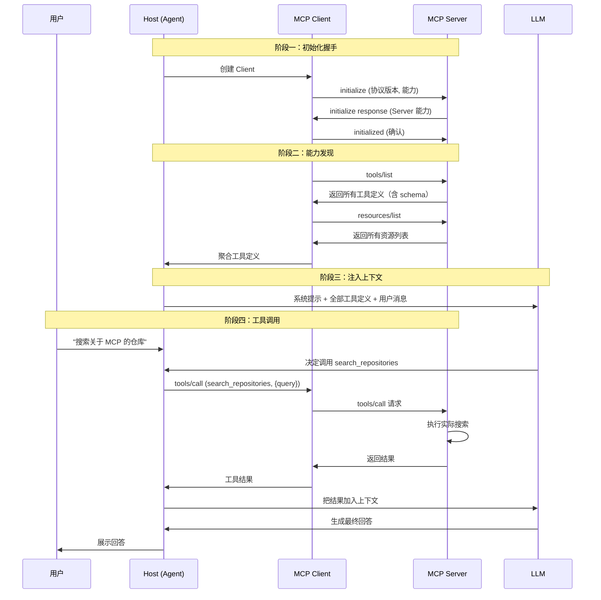
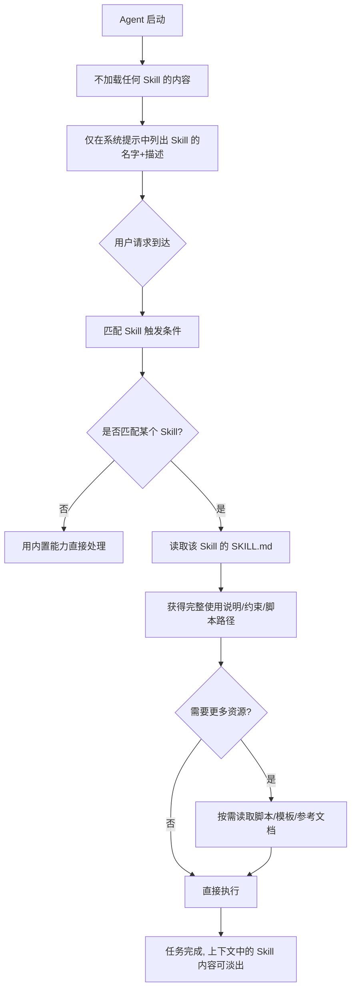
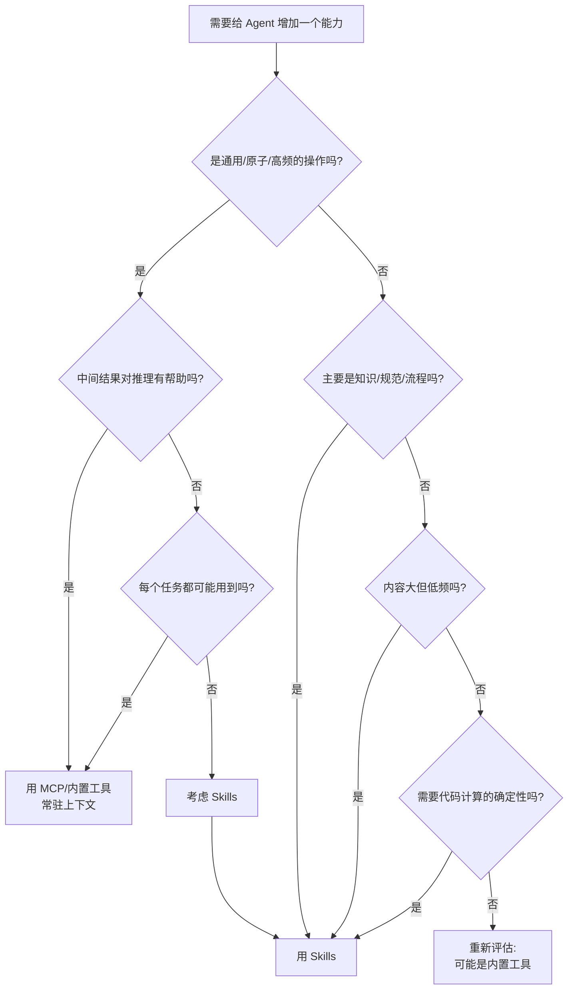
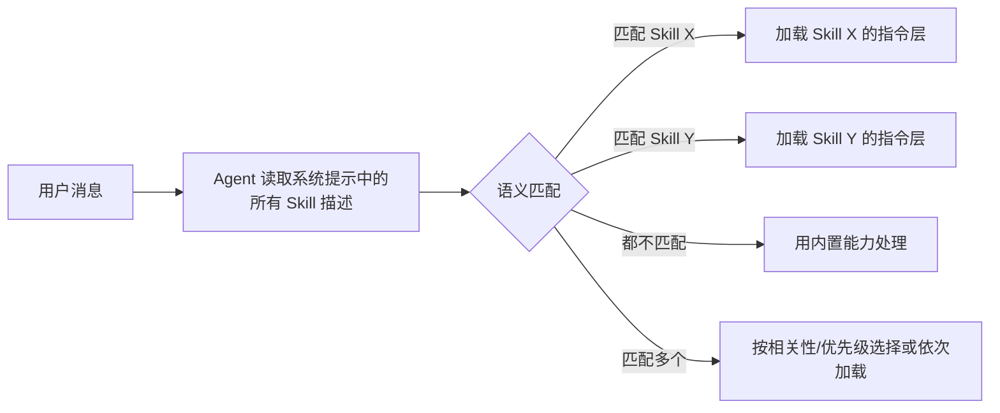
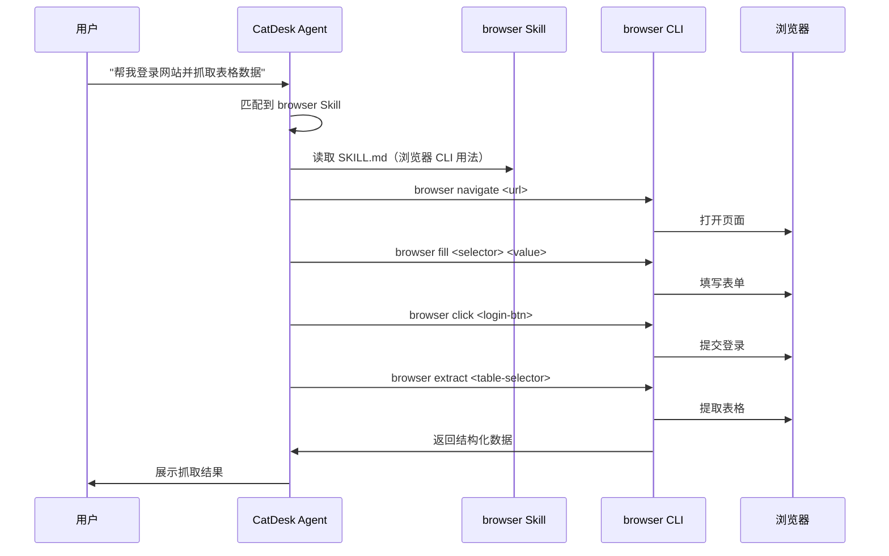
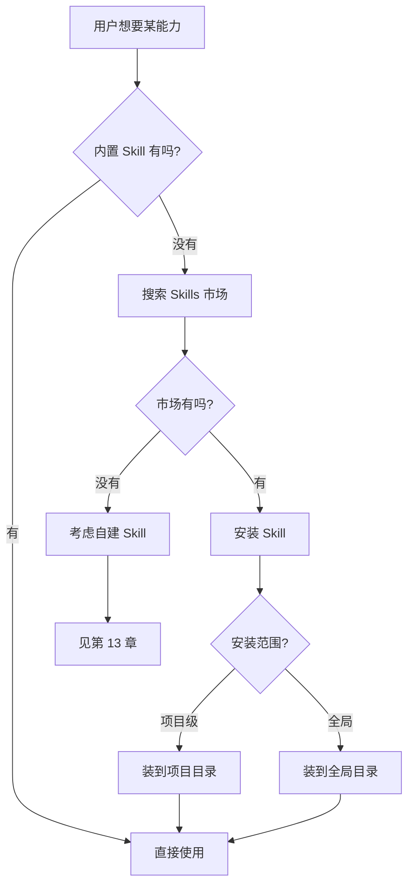
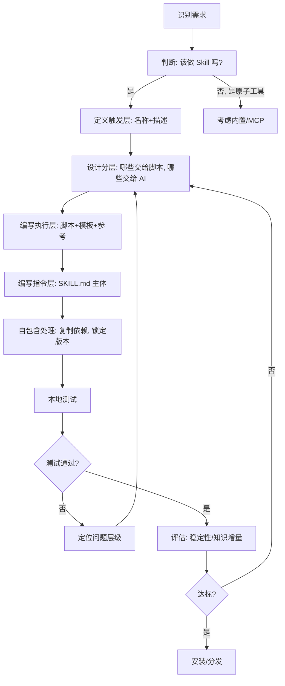
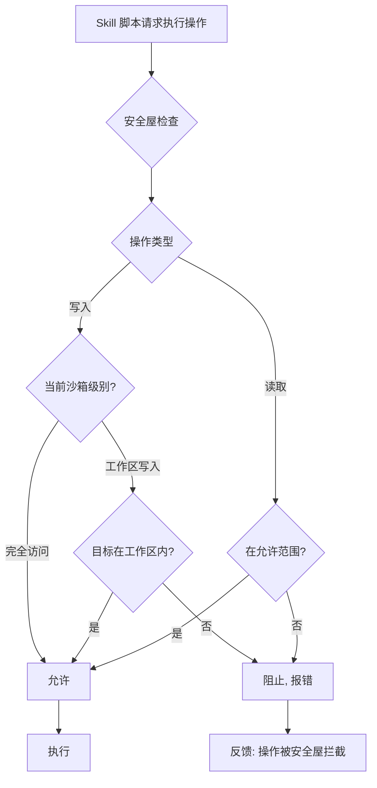
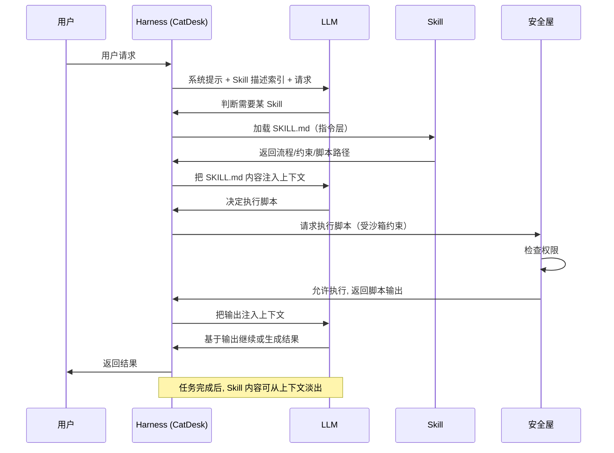

# Skills 与工具生态设计

> 本文档是关于 AI Agent 工具生态的深度技术文档，聚焦于 MCP 协议、CLI + Skills 范式，以及 CatDesk 的 Skills 生态设计。文档从工具范式之争出发，深入剖析 MCP 的架构原理与致命缺陷，阐述 Skills 的第一性原理设计，并给出场景化的选择指南与工程实践。

---

## 目录

1. [引言：AI Agent 的工具范式之争](#1-引言ai-agent-的工具范式之争)
2. [MCP 协议深度解析](#2-mcp-协议深度解析)
3. [MCP 的致命问题：Token 黑洞](#3-mcp-的致命问题token-黑洞)
4. [CLI + Skills 范式：为什么是更好的选择](#4-cli--skills-范式为什么是更好的选择)
5. [Skills 的核心设计理念：渐进式披露](#5-skills-的核心设计理念渐进式披露)
6. [Skills vs MCP：场景化选择指南](#6-skills-vs-mcp场景化选择指南)
7. [Skill 设计的第一性原理：从承诺到物理约束](#7-skill-设计的第一性原理从承诺到物理约束)
8. [Skill 的分层架构](#8-skill-的分层架构)
9. [自包含原则与版本锁定](#9-自包含原则与版本锁定)
10. [CatDesk 的 Skills 生态全景](#10-catdesk-的-skills-生态全景)
11. [内置 Skill 详解](#11-内置-skill-详解)
12. [Skills 市场与分发机制](#12-skills-市场与分发机制)
13. [用户自建 Skill 的开发流程](#13-用户自建-skill-的开发流程)
14. [Skill 的 SKILL.md 规范详解](#14-skill-的-skillmd-规范详解)
15. [安全屋机制：Skill 的安全边界](#15-安全屋机制skill-的安全边界)
16. [Skill 与 Harness 的协作模式](#16-skill-与-harness-的协作模式)
17. [Skill 的测试与评估](#17-skill-的测试与评估)
18. [反模式与最佳实践](#18-反模式与最佳实践)
19. [与行业方案对比](#19-与行业方案对比)
20. [总结与展望](#20-总结与展望)

---

## 1. 引言：AI Agent 的工具范式之争

### 1.1 一场迟到的论战

2026 年 3 月，AI Agent 领域爆发了一场关于工具范式的公开论战。这场论战的导火索非常直接：一家知名 AI 搜索公司的联合创始人兼 CTO 公开宣布，团队将放弃 MCP（Model Context Protocol），全面转向 API 和 CLI 的工具集成方式。

紧接着，一位业界知名的创业加速器掌门人给出了更加尖锐的评价——"MCP 就是垃圾"。他甚至现场演示：花 30 分钟让 AI 写了一个 100 行的 Playwright CLI 封装，效果比折腾半天的 MCP 接入方案好 100 倍。

这场论战之所以重要，不是因为它的火药味，而是因为它触及了 AI Agent 工程中最根本的一个问题：

> **Agent 如何与外部世界交互？工具应该以什么形态存在？**

这个问题的答案，直接决定了 Agent 的：
- 上下文效率（能用多少 token 干真正的活）
- 可扩展性（能接入多少工具而不崩溃）
- 稳定性（每次执行是否可复现）
- 可维护性（工具升级、调试、版本管理的成本）

### 1.2 三种工具范式的历史演进

要理解这场论战，需要先梳理 Agent 工具集成的三个历史阶段。

```
阶段一：硬编码 Function Calling（2023）
    ┌─────────────────────────────────────┐
    │  LLM  ──►  预定义函数 schema         │
    │            (JSON Schema 写死在代码里) │
    │  每接一个工具，改一次代码            │
    └─────────────────────────────────────┘
                    │
                    ▼
阶段二：MCP 标准化协议（2024-2025）
    ┌─────────────────────────────────────┐
    │  LLM  ──►  MCP Client                │
    │            ──►  MCP Server A         │
    │            ──►  MCP Server B         │
    │            ──►  MCP Server C         │
    │  协议统一，运行时动态发现工具        │
    └─────────────────────────────────────┘
                    │
                    ▼
阶段三：CLI + Skills 渐进式加载（2025-2026）
    ┌─────────────────────────────────────┐
    │  LLM  ──►  内置 shell / 代码执行     │
    │            ──►  按需读取 Skill       │
    │            ──►  Skill 调用 CLI 工具  │
    │  上下文精简，用完即走                │
    └─────────────────────────────────────┘
```

**阶段一：硬编码 Function Calling。** 这是 Agent 工具集成的起点。开发者把每个工具的 JSON Schema 直接写在代码里，通过 LLM 的 function calling 能力调用。它的问题很明显：每接入一个新工具就要改一次代码，工具无法在运行时动态发现，也无法跨应用复用。

**阶段二：MCP 标准化协议。** 为了解决硬编码的问题，一套标准化的协议被提出——MCP。它的设计理念是"USB-C 接口式的通用连接标准"：一套协议，所有 LLM 和所有工具都能通用。任何人都可以构建一个 MCP Server 暴露工具，任何 Agent 都可以作为 MCP Client 连接并动态发现这些工具。

**阶段三：CLI + Skills 渐进式加载。** 当 MCP 在生产环境大规模落地后，一个结构性问题暴露出来——Token 黑洞。于是新的范式出现了：Agent 内置执行 shell 指令和代码的能力，把工具封装为 CLI，把知识与流程封装为 Skills，并通过渐进式加载（Progressive Disclosure）按需引入，避免上下文被工具定义永久占用。

### 1.3 论战的本质：不是"谁对谁错"，而是"用在哪里"

需要强调的是，这场论战的正确解读不是"MCP 已死"，也不是"Skills 万能"。MCP 的设计理念本身是对的——标准化、生态丰富、动态发现、模型无关，这些都是实实在在的价值。问题在于，MCP 被过度使用在了它并不擅长的场景里。

本文的核心论点是：

> **MCP 与 Skills 不是替代关系，而是互补关系。理解它们各自的适用边界，是设计一个高效 Agent 工具生态的前提。**

| 维度 | 硬编码 Function Calling | MCP | CLI + Skills |
|------|------------------------|-----|--------------|
| 工具接入成本 | 高（改代码） | 中（接 Server） | 低（写脚本/md） |
| 运行时动态发现 | 不支持 | 支持 | 部分支持 |
| 上下文占用 | 中 | 高（永久占用） | 低（按需加载） |
| 跨应用复用 | 差 | 好 | 好 |
| 执行确定性 | 中 | 中 | 高（脚本约束） |
| 调试难度 | 中 | 高 | 低 |
| 版本管理 | 差 | 中 | 好（自包含） |

### 1.4 本文的组织逻辑

本文将沿着以下逻辑展开：

1. **先讲清 MCP 是什么**（第 2 章）——不理解 MCP 的架构，就无法理解它的问题
2. **再剖析 MCP 的致命问题**（第 3 章）——Token 黑洞的具体数字与结构性诊断
3. **然后引出 CLI + Skills 范式**（第 4-5 章）——为什么它更好，核心理念是什么
4. **给出场景化选择指南**（第 6 章）——什么时候用 MCP，什么时候用 Skills
5. **深入 Skill 的设计哲学**（第 7-9 章）——第一性原理、分层架构、自包含
6. **落地到 CatDesk 生态**（第 10-16 章）——生态全景、内置 Skill、市场、开发、安全
7. **工程实践与展望**（第 17-20 章）——测试、反模式、行业对比、未来

---

## 2. MCP 协议深度解析

要批判一个东西，先要理解它。本章深入剖析 MCP 的架构原理、核心原语与工作流程。

### 2.1 MCP 是什么

MCP（Model Context Protocol，模型上下文协议）是一套开放协议，用于标准化 AI 应用（尤其是 LLM 驱动的 Agent）与外部数据源、工具之间的连接方式。它常被类比为"AI 世界的 USB-C 接口"——一个统一的物理接口，插上任何设备都能工作。

在 MCP 出现之前，每个 Agent 接入每个工具，都需要一套专门的适配代码。假设有 M 个 Agent 和 N 个工具，理论上需要 M×N 套集成代码。MCP 的目标是把它变成 M+N：每个 Agent 实现一次 MCP Client，每个工具实现一次 MCP Server，两两之间通过统一协议对话。

```
没有 MCP：M×N 的集成地狱
    Agent1 ─┬─► 工具A（专用适配）
            ├─► 工具B（专用适配）
            └─► 工具C（专用适配）
    Agent2 ─┬─► 工具A（又一套适配）
            ├─► 工具B（又一套适配）
            └─► 工具C（又一套适配）

有 MCP：M+N 的标准化连接
    Agent1(Client) ─┐
    Agent2(Client) ─┼─► [MCP 协议] ─┬─► 工具A(Server)
    Agent3(Client) ─┘               ├─► 工具B(Server)
                                    └─► 工具C(Server)
```

### 2.2 MCP 的架构：Client-Server 模型

MCP 采用经典的 Client-Server 架构，包含三个角色：

```
┌──────────────────────────────────────────────────────┐
│                    Host（宿主应用）                     │
│   例如：Agent CLI、IDE 插件、桌面 AI 助手              │
│                                                        │
│   ┌──────────────┐   ┌──────────────┐  ┌────────────┐│
│   │  MCP Client  │   │  MCP Client  │  │ MCP Client ││
│   │      1       │   │      2       │  │     3      ││
│   └──────┬───────┘   └──────┬───────┘  └─────┬──────┘│
└──────────┼──────────────────┼────────────────┼───────┘
           │                  │                │
    JSON-RPC 2.0        JSON-RPC 2.0     JSON-RPC 2.0
           │                  │                │
           ▼                  ▼                ▼
    ┌────────────┐     ┌────────────┐   ┌────────────┐
    │ MCP Server │     │ MCP Server │   │ MCP Server │
    │  (文件系统) │     │  (数据库)   │   │  (GitHub)  │
    └────────────┘     └────────────┘   └────────────┘
```

**三个角色的职责：**

| 角色 | 职责 | 类比 |
|------|------|------|
| Host | 承载 LLM，管理多个 Client 连接，聚合工具，编排调用 | 操作系统 |
| Client | 与单个 Server 建立一对一连接，转发请求与响应 | 设备驱动 |
| Server | 暴露具体能力（工具/资源/提示），执行实际操作 | 外设设备 |

一个关键设计：**每个 Client 与一个 Server 是一对一连接。** 一个 Host 可以创建多个 Client，分别连接多个 Server。这个设计带来了隔离性（一个 Server 崩溃不影响其他），但也是后文 Token 黑洞问题的结构性根源之一——所有 Server 的工具定义都要聚合到同一个 LLM 上下文中。

### 2.3 MCP 的三大原语（Primitives）

MCP Server 可以向 Client 暴露三类能力，称为"原语"。

#### 2.3.1 Tools（工具）

Tools 是 Server 暴露的可执行函数，由 LLM 决定何时调用。这是最常用的原语。

```json
{
  "name": "search_repositories",
  "description": "Search for GitHub repositories matching a query. Returns repository name, owner, description, stars, and URL.",
  "inputSchema": {
    "type": "object",
    "properties": {
      "query": {
        "type": "string",
        "description": "Search keywords, supports GitHub search syntax"
      },
      "sort": {
        "type": "string",
        "enum": ["stars", "forks", "updated"],
        "description": "Sort field"
      },
      "per_page": {
        "type": "integer",
        "description": "Results per page, max 100"
      }
    },
    "required": ["query"]
  }
}
```

注意这个工具定义本身的体积。一个工具的 `name` + `description` + `inputSchema` 加起来可能就是几百个 token。当一个 Server 暴露几十个工具时，仅工具定义就是巨大的开销。这是我们在第 3 章将详细展开的问题。

**Tools 的特征：**
- 由模型控制（model-controlled）：LLM 自主决定调用
- 有副作用：可能修改外部状态（写数据库、发消息）
- 需要用户审批：出于安全考虑，通常需要人工确认

#### 2.3.2 Resources（资源）

Resources 是 Server 暴露的只读数据，由应用决定何时读取。它类似于 REST API 中的 GET 端点。

```json
{
  "uri": "file:///project/src/main.py",
  "name": "main.py",
  "description": "Application entry point",
  "mimeType": "text/x-python"
}
```

**Resources 的特征：**
- 由应用控制（application-controlled）：Host 决定何时加载
- 无副作用：只读
- 通过 URI 标识：每个资源有唯一的 URI

#### 2.3.3 Prompts（提示模板）

Prompts 是 Server 提供的可复用提示模板，由用户主动选择触发。

```json
{
  "name": "code_review",
  "description": "Generate a structured code review for a given file",
  "arguments": [
    {
      "name": "file_path",
      "description": "Path to the file to review",
      "required": true
    },
    {
      "name": "focus",
      "description": "Review focus: security | performance | style",
      "required": false
    }
  ]
}
```

**Prompts 的特征：**
- 由用户控制（user-controlled）：用户显式选择
- 参数化：接受参数生成定制提示
- 常用于斜杠命令（slash command）等交互入口

**三大原语的控制权对比：**

| 原语 | 控制方 | 是否有副作用 | 典型用途 |
|------|--------|-------------|----------|
| Tools | 模型 | 有 | 执行操作、调用 API |
| Resources | 应用 | 无 | 提供上下文数据 |
| Prompts | 用户 | 无 | 预置工作流模板 |

### 2.4 MCP 的传输层（Transport）

MCP 基于 JSON-RPC 2.0 进行消息传递，支持两种主要传输方式：

```
传输方式一：stdio（标准输入输出）
    ┌──────────┐    stdin/stdout    ┌──────────┐
    │  Client  │◄──────────────────►│  Server  │
    │          │  (同一台机器)       │ (子进程)  │
    └──────────┘                    └──────────┘
    适用：本地工具、文件系统、本地数据库

传输方式二：Streamable HTTP / SSE
    ┌──────────┐   HTTP + SSE       ┌──────────┐
    │  Client  │◄──────────────────►│  Server  │
    │          │  (跨网络)           │ (远程服务)│
    └──────────┘                    └──────────┘
    适用：远程服务、云端 API、多用户共享
```

**stdio 传输：** Server 作为 Host 的子进程运行，通过标准输入输出交换 JSON-RPC 消息。延迟低，适合本地工具。

**Streamable HTTP 传输：** Server 作为独立的 HTTP 服务运行，Client 通过 HTTP POST 发送请求，通过 SSE（Server-Sent Events）接收流式响应。适合远程、多用户场景。

### 2.5 MCP 的完整工作流程

下面用一个时序图展示 MCP 从连接建立到工具调用的完整流程。



注意**阶段三**——这是 Token 黑洞的核心。在任何用户消息到达之前，Host 就已经把**全部工具定义**注入了 LLM 的上下文。工具越多，注入越大，而这一切都发生在 Agent"真正开始干活"之前。

### 2.6 MCP 的设计优势

必须公正地承认，MCP 的设计理念是对的，它解决了真实的问题：

1. **标准化。** 一套协议，所有 LLM 和工具都能通用。开发者不再需要为每个 Agent-工具组合写专门的适配代码。

2. **生态丰富。** MCP 推出后迅速形成生态，已有数千个社区构建的 MCP Server，覆盖文件系统、数据库、代码托管、通信工具、云服务等各个领域。

3. **动态发现。** Agent 可以在运行时通过 `tools/list` 发现新工具，而不需要重新编译或重启。这为构建可扩展的 Agent 提供了基础。

4. **模型无关。** MCP 不绑定特定的 LLM。无论底层是哪家的模型，只要实现了 MCP Client，就能连接任意 MCP Server。

这些优势是真实的。问题在于，这套设计有一个致命的结构性缺陷，而这个缺陷在工具数量增长时会指数级放大。

---

## 3. MCP 的致命问题：Token 黑洞

### 3.1 问题的直观感受

先看一组来自真实生产环境的数字，它们足以说明问题的严重性：

- **GitHub 官方 MCP Server** 单独暴露的工具定义，就要消耗约 **30,000 个** context tokens。
- 连接一套典型的开发环境：Slack MCP + 数据库 MCP + CI/CD MCP + 文件系统 MCP，在 Agent **真正开始干活之前**，已经烧掉了约 **100,000 个** tokens。
- 以一个 128K tokens 上下文窗口的主流模型为例，用 MCP 组装完工具，窗口就用了接近 **80%**。

换句话说：**你还什么都没干，上下文就快满了。**

```
┌────────────────────────────────────────────────────────┐
│           128K 上下文窗口（主流模型）                     │
├────────────────────────────────────────────────────────┤
│ ████████████████████████████████████████░░░░░░░░░░░░░░  │
│ ↑                                        ↑              │
│ MCP 工具定义 ~100K (78%)                 剩余 ~28K (22%) │
│                                                          │
│ 真正能用来放：系统提示 + 对话历史 + 中间推理 + 结果       │
│ 的空间，只剩下不到四分之一                                │
└────────────────────────────────────────────────────────┘
```

### 3.2 Token 消耗的构成分析

为什么工具定义这么"重"？我们来拆解一个 MCP 工具定义的 token 构成。

一个工具定义包含：
- **name**：工具名，几个到十几个 token
- **description**：工具描述，为了让 LLM 准确理解用途，通常写得很详细，几十到几百 token
- **inputSchema**：输入参数的 JSON Schema，每个参数都有 name、type、description、约束，一个复杂工具可能有几十个参数

以 GitHub MCP Server 为例，它暴露的工具包括（部分）：

```
create_or_update_file    push_files          search_repositories
create_repository        get_file_contents   create_issue
list_issues              update_issue        add_issue_comment
create_pull_request      list_pull_requests  get_pull_request
merge_pull_request       create_branch       list_commits
search_code              search_issues       search_users
fork_repository          create_review       ... (数十个)
```

每个工具的定义都要完整地放进上下文。假设平均每个工具定义 600 tokens，50 个工具就是 30,000 tokens——这正好对应了前面提到的数字。

**关键洞察：** 这些 token 消耗是**恒定的、前置的、无差别的**。无论用户的任务是否需要 GitHub 操作，只要连接了 GitHub MCP Server，这 30,000 tokens 就一定会被占用。

### 3.3 Token 黑洞的三个维度

Token 黑洞不只是"占空间"这么简单，它在三个维度上都造成了损害。

#### 3.3.1 维度一：空间占用

最直接的问题——工具定义挤占了本该用于任务的上下文空间。

```任务实际需要的上下文预算：
    - 系统提示            ~2K
    - 用户任务描述        ~1K
    - 相关代码/文档       ~20K
    - 中间推理过程        ~15K
    - 工具调用结果        ~30K
    - 最终答案生成        ~5K
    ───────────────────────────
    合计需求             ~73K

    但 MCP 工具定义已占  ~100K
    窗口总量             128K
    ───────────────────────────
    实际可用            ~28K  ◄── 严重不足！
```

当可用空间不足时，Agent 被迫做出妥协：截断历史、丢弃中间推理、减少检索的上下文——这些都会直接损害任务质量。

#### 3.3.2 维度二：注意力稀释

即使空间够用，把大量工具定义放进上下文也会带来"注意力稀释"问题。

LLM 的注意力机制在长上下文中会衰减。研究表明，模型对上下文中间部分的信息利用率显著低于开头和结尾（"迷失在中间"，Lost in the Middle 现象）。当上下文中塞满几十个工具的定义时：

- 模型需要在几十个相似工具中做选择，选错的概率上升
- 真正重要的任务信息被淹没在工具定义的海洋里
- 模型可能"忘记"某些工具的存在，或混淆功能相似的工具

```
注意力分布示意（上下文越长，中间越"模糊"）：

  注意力强度
    │
  高 ┤██                              ██
    │██                              ██
    │████                          ████
  中 ┤██████                      ██████
    │████████░░░░░░░░░░░░░░░░░░░░████████
  低 ┤██████████░░░░░░░░░░░░░░██████████
    └──────────────────────────────────► 上下文位置
     开头        中间(工具定义堆积)      结尾
                 ↑
            注意力洼地：
            工具定义堆在这里，
            既占空间又被"半遗忘"
```

#### 3.3.3 维度三：成本与延迟

Token 是有价格的。每次 LLM 调用，输入的 100K tokens 工具定义都要被计费和处理。

```
成本影响（假设每次对话 5 轮，每轮都带完整工具定义）：

  每轮输入 token = 100K(工具) + 20K(其他) = 120K
  5 轮对话       = 5 × 120K = 600K input tokens
  其中工具定义   = 5 × 100K = 500K tokens（83% 是重复的工具定义！）

  延迟影响：
  - 输入 token 越多，首 token 延迟（TTFT）越高
  - 100K 额外输入 → 显著增加每轮响应时间
```

工具定义在每一轮对话中都被重复传输和处理，这是巨大的浪费。用户为了"可能用到"的工具，在"实际没用到"的每一轮里持续付费。

### 3.4 结构性问题诊断：为什么这是设计缺陷而非实现缺陷

有人会说："那我少连几个 Server 不就行了？"或者"未来上下文窗口更大了不就解决了？"这些都是治标不治本的想法。Token 黑洞是 MCP 的**结构性缺陷**，根源在于它的设计假设。

**MCP 的核心假设：工具定义必须前置注入上下文，LLM 才能发现和调用工具。**

这个假设在工具数量少时没问题，但它有两个致命的隐含前提：

1. **全量加载前提。** MCP 通过 `tools/list` 一次性返回所有工具，Host 把它们全部注入上下文。没有"按需加载单个工具"的机制。

2. **静态存在前提。** 工具定义在整个会话期间持续占用上下文，即使某个工具从头到尾都没被用到。它是"常驻"的。

```
问题的因果链：

  标准化协议
      │ 要求
      ▼
  运行时动态发现工具
      │ 依赖
      ▼
  工具定义前置注入上下文  ◄── 这一步是黑洞的根源
      │ 导致
      ▼
  工具越多，上下文占用越大
      │ 且
      ▼
  无论是否使用，都恒定占用
      │ 最终
      ▼
  Token 黑洞（空间+注意力+成本三重损害）
```

**为什么"扩大上下文窗口"解决不了？** 因为工具数量的增长速度可能超过窗口增长速度，而且注意力稀释和成本问题不会因为窗口变大而消失——反而，更大的窗口意味着更严重的注意力稀释和更高的成本。

**为什么"少连 Server"是倒退？** 因为这等于放弃了 MCP 的核心价值（生态丰富、动态发现）。如果只能连两三个 Server，那 MCP 相比硬编码的优势就所剩无几了。

### 3.5 一个真实的对比实验

回到引言中提到的那个 30 分钟实验。业界那位创业加速器掌门人做的事情很简单：

```
方案 A：接入 Playwright MCP Server
  - 需要配置 MCP Server
  - 工具定义占用大量上下文（浏览器操作工具很多）
  - 每个操作都要经过 MCP 协议往返
  - 调试困难：出问题不知道是协议、Server 还是脚本的问题

方案 B：让 AI 写一个 100 行的 Playwright CLI 封装
  - 30 分钟完成
  - 一个 CLI 命令，比如 `browser navigate <url>`、`browser click <selector>`
  - 工具定义 = 一行 CLI 的用法说明，几乎不占上下文
  - 调试简单：直接在终端跑 CLI，看输出
  - 结论："效果比折腾半天的 MCP 接入方案好 100 倍"
```

这个实验的深刻之处在于：它揭示了一个反直觉的事实——**很多时候，Agent 不需要"标准化的工具协议"，它只需要"能执行命令的能力"加上"命令的用法说明"。** 而后者，正是 CLI + Skills 范式的核心。

### 3.6 MCP 问题总结

| 问题 | 表现 | 根源 |
|------|------|------|
| 空间黑洞 | 工具定义占 80% 窗口 | 全量前置注入 |
| 注意力稀释 | 工具选择出错率上升 | 长上下文注意力衰减 |
| 成本浪费 | 工具定义每轮重复计费 | 静态常驻上下文 |
| 调试困难 | 协议/Server/逻辑三层排查 | 多层抽象 |
| 恒定开销 | 没用到的工具也占空间 | 无按需加载机制 |

MCP 的问题不是"它不好"，而是"它被用错了地方"。它适合的场景是通用、原子、高频复用的工具。而对于业务流程、风格指导、复杂计算这类场景，有更好的方案——这就是下一章要讲的 CLI + Skills。

---

## 4. CLI + Skills 范式：为什么是更好的选择

### 4.1 范式的核心转变

CLI + Skills 范式的核心思想可以用一句话概括：

> **MCP 会永久占用 Context；通过 CLI 工具转为 Skills，Agent 内置执行 shell 指令和代码的能力，渐进式加载，使 Agent 更聚焦、更高效。**

关键区别在于：**Skills 不会往上下文里塞任何工具定义。**

```
MCP 范式：工具定义常驻上下文
    启动
      │
      ▼
    [注入全部工具定义]  ◄── 100K tokens，永久占用
      │
      ▼
    用户提问 → 干活（可用空间已被压缩）

CLI + Skills 范式：按需加载
    启动
      │
      ▼
    [仅内置 shell/代码执行能力]  ◄── 几乎不占上下文
      │
      ▼
    用户提问
      │
      ▼
    [匹配到相关 Skill？]
      │ 是
      ▼
    [读取该 Skill 的 SKILL.md]  ◄── 只加载需要的那一个
      │
      ▼
    [Skill 调用 CLI 工具干活]
      │
      ▼
    用完即走，上下文回归精简
```

### 4.2 三个基础能力的重新分工

CLI + Skills 范式重新划分了 Agent 的能力边界：

```
┌─────────────────────────────────────────────────────┐
│                   Agent 核心                          │
│                                                       │
│   ┌───────────────────────────────────────────┐     │
│   │  内置能力（常驻，但极轻量）                 │     │
│   │  - 执行 shell 命令（bash）                  │     │
│   │  - 读写文件                                 │     │
│   │  - 执行代码                                 │     │
│   │  - 搜索（grep/glob）                        │     │
│   └───────────────────────────────────────────┘     │
│                        │                              │
│                        │ 按需加载                     │
│                        ▼                              │
│   ┌───────────────────────────────────────────┐     │
│   │  Skills（按需，用完即走）                   │     │
│   │  - 业务流程知识                             │     │
│   │  - CLI 工具的用法说明                       │     │
│   │  - 脚本、模板、参考资料                     │     │
│   └───────────────────────────────────────────┘     │
└─────────────────────────────────────────────────────┘
```

这个分工的精妙之处：**通用能力常驻（但轻量），专用知识按需（且丰富）。** 这样既保证了 Agent 随时能干活的基础能力，又避免了专用知识对上下文的永久占用。

### 4.3 为什么 CLI 是更好的工具形态

CLI（命令行接口）作为 Agent 的工具形态，有几个天然优势：

#### 4.3.1 优势一：LLM 本来就精通 CLI

现代 LLM 在训练时见过海量的 shell 命令、脚本、终端交互。CLI 是 LLM 的"母语"之一。相比之下，MCP 是一个相对新的协议，模型对它的熟悉程度远不如 CLI。

```
让 LLM 完成"列出当前目录下所有 Python 文件并统计行数"：

CLI 方式（LLM 一次就能写对）：
    find . -name "*.py" | xargs wc -l

MCP 方式：
    需要有一个专门的 MCP Server 暴露 list_files 和 count_lines 工具
    LLM 要理解这两个工具的 schema，组合调用
    还可能没有现成的 Server
```

#### 4.3.2 优势二：工具定义几乎零占用

一个 CLI 工具的"定义"，就是它的用法说明（`--help`）。这可以写在 Skill 里，只在需要时加载。而且，CLI 的用法通常很简洁：

```
# CLI 工具的"定义"就是这么一行说明：
browser navigate <url>       # 打开网页
browser click <selector>     # 点击元素
browser screenshot <path>    # 截图

# 对比 MCP 一个工具的 JSON Schema，动辄几百 token
```

#### 4.3.3 优势三：可组合、可调试

CLI 工具遵循 Unix 哲学——每个工具做好一件事，通过管道组合。这种可组合性让 Agent 能灵活拼装复杂操作。同时，CLI 天然可调试：Agent 可以直接在终端运行命令看输出，人也可以复现同样的命令排查问题。

```
可组合示例：
    cat data.csv | grep "2026" | awk -F, '{sum+=$3} END {print sum}'
    一行命令完成"过滤 + 求和"，无需三个 MCP 工具往返

可调试示例：
    Agent 运行了 `mytool process --input a.json` 出错
    → 人可以在自己终端跑同样的命令
    → 立刻看到完整报错，无需排查协议层
```

#### 4.3.4 优势四：渐进式加载

CLI 工具的用法可以封装在 Skill 里，Skill 采用渐进式披露——只在用户任务匹配时才加载。这从根本上避免了 Token 黑洞。

### 4.4 CLI + Skills 如何解决 MCP 的三重损害

回顾第 3 章 MCP 的三个维度损害，看 CLI + Skills 如何逐一化解：

| MCP 损害 | CLI + Skills 的解法 |
|----------|---------------------|
| 空间黑洞 | Skill 按需加载，不用不占；用完即走 |
| 注意力稀释 | 上下文只有当前任务相关的一个 Skill，无干扰 |
| 成本浪费 | 不重复传输全量工具定义，只在需要时加载一次 |
| 调试困难 | CLI 可直接在终端复现，无协议层黑盒 |
| 恒定开销 | 零常驻工具定义，开销随任务动态变化 |

### 4.5 一个端到端的对比场景

假设任务是："帮我把这份 PDF 报告转成 Word 文档，并生成一份摘要发到团队群里。"

```
MCP 方案：
  启动时已注入的工具定义：
    - PDF MCP Server:    ~15K tokens
    - Office MCP Server: ~20K tokens
    - 通信 MCP Server:   ~10K tokens
    - 其他常连 Server:   ~55K tokens
  ───────────────────────────────────
  干活前已占用：~100K tokens
  然后才开始处理任务，可用空间紧张

CLI + Skills 方案：
  启动时：几乎零占用
  用户提问 → 匹配到 pdf skill、docx skill、办公自动化 skill
  按顺序加载：
    1. 读 pdf skill 的 SKILL.md（提取 PDF 文本的脚本用法）
       → 调用 CLI 提取文本
       → 用完，这部分知识可以从后续上下文中淡出
    2. 读 docx skill 的 SKILL.md（生成 Word 的脚本用法）
       → 调用 CLI 生成 Word
    3. 读办公自动化 skill（发消息的 CLI 用法）
       → 调用 CLI 发送到群
  ───────────────────────────────────
  全程上下文只保留"当前正在用"的知识，精简高效
```

### 4.6 范式选择不是非此即彼

再次强调，CLI + Skills 不是要完全取代 MCP。正确的心智模型是：

> **通用原子能力用 MCP（或内置工具），业务流程与专用知识用 Skills。**

下一章我们深入 Skills 的核心设计理念——渐进式披露，理解它为什么能做到"按需加载、用完即走"。

---

## 5. Skills 的核心设计理念：渐进式披露（Progressive Disclosure）

### 5.1 什么是渐进式披露

渐进式披露（Progressive Disclosure）是一个源自交互设计的概念：**只在用户需要时才展示相关信息，避免一次性把所有信息倾泻给用户。** 把这个理念应用到 Agent 工具设计上，就得到了 Skills 的核心机制。

```
一次性披露（MCP 的方式）：
    ┌──────────────────────────────────────┐
    │  启动即展示：全部工具、全部说明、       │
    │  全部参数、全部资源...                  │
    │  → 用户/Agent 被信息淹没               │
    │  → 上下文被撑满                         │
    └──────────────────────────────────────┘

渐进式披露（Skills 的方式）：
    第一层：只看到 Skill 的名字和一句话描述
              ↓ (匹配到需求)
    第二层：读取 Skill 的详细说明
              ↓ (需要执行)
    第三层：调用 Skill 引用的脚本和工具
```

### 5.2 渐进式披露的工作机制

Skills 采用渐进式披露模式，具体的加载流程如下：



**三个关键时刻：**

1. **Agent 启动时：不加载任何 Skill 的内容。** 上下文里只有极少量的元信息（每个 Skill 的名字和一句话描述），用于后续匹配。

2. **用户请求匹配某个 Skill 的触发条件时：Agent 才读取该 Skill 的 SKILL.md 文件。** 这是渐进式披露的核心——只有真正需要时，详细内容才进入上下文。

3. **SKILL.md 中包含该 Skill 的完整使用说明、约束、脚本路径等。** 更进一步的资源（大型参考文档、脚本源码）也是按需加载，甚至可能根本不进入上下文（脚本可以直接执行而不需要读进来）。

### 5.3 渐进式披露如何解决 Token 黑洞

这是 Skills 相比 MCP 的根本优势所在，用一个对比表说清楚：

| 维度 | MCP | Skills（渐进式披露） |
|------|-----|---------------------|
| 启动时加载 | 所有工具定义全部加载 | 仅加载名字+描述（极轻量） |
| 加载时机 | 前置、一次性 | 按需、多次、精准 |
| 上下文占用 | 恒定高占用 | 动态低占用 |
| 未使用的工具 | 仍然占用上下文 | 完全不占用 |
| 结果 | Token 黑洞 | 上下文始终精简 |

```
MCP 的加载曲线：           Skills 的加载曲线：
  上下文占用                 上下文占用
    │                          │
100K┤████████████████       10K┤  ╭─╮   ╭─╮
    │(工具定义常驻)             │  │ │   │ │  ╭─╮
    │                          │──╯ ╰───╯ ╰──╯ ╰──
  0 └──────────────► 时间    0 └──────────────► 时间
    启动就满，不释放           按需峰值，用完回落
```

**核心结论：**
- MCP：所有工具定义在启动时全部加载到上下文 → 浪费大量 token
- Skills：按需加载，用完即走 → 上下文始终精简

### 5.4 元信息的设计：如何让 Agent 知道该加载哪个 Skill

有个自然的疑问：如果启动时不加载 Skill 内容，Agent 怎么知道该在什么时候加载哪个 Skill？

答案是：**每个 Skill 有一段精心设计的"描述"（description），这段描述在启动时就注入到系统提示中。** 描述的作用是"触发匹配"——它告诉 Agent"当用户想做 X、Y、Z 时，应该加载我"。

```
系统提示中的 Skill 索引（轻量，仅描述）：

  可用 Skills：
  - pdf: 处理 PDF 文件。读取/提取文本、合并/拆分、
         旋转页面、加水印、填表、加密解密、OCR。
         当用户提到 .pdf 文件时触发。
  - docx: 创建/读取/编辑 Word 文档。含格式化、
          目录、页眉页脚、图片、查找替换、修订。
          当用户想要报告/备忘录/信函/模板时触发。
  - browser: 浏览器自动化。导航、填表、点击、
             截图、提取数据、测试 Web 应用。
  - ...（更多 Skill 的描述）

  → 这些描述总共可能只占几千 token
  → 相比 MCP 的几十万 token 工具定义，轻量得多
  → 且描述是"意图匹配"用的，不是"参数说明"用的
```

**描述的设计原则：**
- 说清"什么场景用我"（触发条件），而不是"我怎么用"（用法留给 SKILL.md）
- 包含足够的触发关键词，让 Agent 能准确匹配用户意图
- 简洁，因为它是常驻的

### 5.5 渐进式披露的分层深度

渐进式披露不止两层（描述 → SKILL.md），而是可以有更深的层次：

```
层级 0：Skill 描述（常驻系统提示）
        "处理 PDF 文件..."
          │ 匹配后加载
          ▼
层级 1：SKILL.md（按需加载到上下文）
        完整使用说明、约束、脚本路径、决策树
          │ 需要时加载
          ▼
层级 2：参考文档（按需加载，可能是大文件）
        REFERENCE.md、API 详细说明、边界情况手册
          │ 需要时
          ▼
层级 3：脚本与工具（按需执行，可能不进上下文）
        extract.py、convert.sh、template.docx
        → Agent 直接执行，输出结果进上下文
        → 脚本源码本身不需要读进上下文
```

这个分层是 Skills 高效的关键。层级越深，加载越晚、越少，甚至不加载（脚本直接执行）。这确保了即使一个 Skill 有大量的参考资料和脚本，也不会一股脑冲进上下文。

### 5.6 渐进式披露的设计收益总结

```
┌────────────────────────────────────────────────┐
│  渐进式披露带来的四大收益                        │
├────────────────────────────────────────────────┤
│  1. 上下文精简                                   │
│     只有当前任务相关的知识在场                    │
│                                                  │
│  2. 无限可扩展                                   │
│     再多 Skill 也只增加一点描述开销               │
│     不像 MCP 每加一个 Server 就多几万 token      │
│                                                  │
│  3. 注意力聚焦                                   │
│     Agent 面对的是精准信息，不是信息海洋          │
│                                                  │
│  4. 成本可控                                     │
│     不重复传输未使用的工具定义                    │
└────────────────────────────────────────────────┘
```

理解了渐进式披露，我们就能回答一个更实际的问题：到底什么时候该用 MCP，什么时候该用 Skills？这是下一章的主题。

---

## 6. Skills vs MCP：场景化选择指南

### 6.1 选择的第一性问题

选择 MCP 还是 Skills，本质上是在回答一个问题：

> **这个能力，是"要跟系统提示词一起常驻上下文的原子工具"，还是"按需加载的知识与流程"？**

如果是前者，用 MCP（或内置工具）；如果是后者，用 Skills。

### 6.2 适合使用 MCP 的场景

MCP 适合**通用的、原子的**工具，尤其是那些**需要跟系统提示词一起加载到上下文**、贯穿整个会话都可能用到的能力。

**典型场景：**

1. **搜索。** 全局搜索、语义搜索、代码搜索——这类能力几乎每个任务都可能用到，值得常驻。

2. **读取文档。** 读文件、读网页、读文档——高频、通用、原子。

3. **执行 shell 命令。** 这是 Agent 最基础的能力，必须随时可用。

4. **执行 SQL。** 对于数据类 Agent，查询数据库是核心原子操作。

5. **保留中间结果辅助 CoT（思维链）。** MCP 的一个独特价值是它能保留中间推理过程和决策。当一个工具的中间结果对后续推理有帮助时（比如查询结果需要参与后续判断），把它作为常驻工具、让结果进入上下文，是合理的。

```
适合 MCP 的能力画像：
  ┌─────────────────────────────────────┐
  │ ✓ 通用（跨任务复用）                 │
  │ ✓ 原子（一个动作，不是一套流程）     │
  │ ✓ 高频（几乎每个任务都可能用）       │
  │ ✓ 中间结果对推理有帮助               │
  │ ✓ 需要跟系统提示一起常驻             │
  └─────────────────────────────────────┘
  例子：搜索、读文档、执行 shell、执行 SQL
```

### 6.3 适合使用 Skills 的场景

Skills 适合以下四类场景：

#### 6.3.1 风格指导类

不需要调用工具，只是让 Agent 按某种格式或规范产出内容。

```
例子：
  - 按公司格式写周报
  - 生成符合团队规范的代码
  - 按品牌风格设计 UI

特征：核心价值是"知识/规范"，不是"工具调用"
      如果做成 MCP，等于把一堆规范文字常驻上下文，浪费
      做成 Skill，只在写周报时加载规范
```

#### 6.3.2 业务流程类

有一堆说明书和特定业务流程，可以按需、按复杂程度分步骤拆分，渐进式按需加载。

```
例子：
  - 一个多步骤的审批流程
  - 一套复杂的部署 checklist
  - 特定领域的操作 SOP（标准作业程序）

特征：流程长、步骤多、有分支
      做成 Skill，可以分层：主流程在 SKILL.md，
      细节流程在子文档，用到哪步加载哪步
```

#### 6.3.3 污染 Context 类

会大幅占用 context 但对推理过程没帮助的内容。

```
例子：
  - 大型 API 文档（几百个端点的详细说明）
  - 冗长的配置说明
  - 大量的枚举值/常量表

特征：内容大，但大部分时候用不到
      做成 MCP 或常驻，就是纯粹的上下文污染
      做成 Skill 的参考文档，用到时才查
```

#### 6.3.4 计算类

LLM 不擅长计算，需要 Agent 写代码解决问题的场景。

```
例子：
  - 精确的数值计算、统计分析
  - 数据转换、格式解析
  - 需要确定性结果的逻辑处理

特征：LLM 直接算容易出错，应该写代码算
      Skill 可以封装"遇到这类问题，写脚本用代码算"
      的流程和现成脚本
```

```
适合 Skills 的能力画像：
  ┌─────────────────────────────────────┐
  │ ✓ 知识/规范驱动（风格指导）          │
  │ ✓ 多步骤流程（业务流程）             │
  │ ✓ 内容大但低频（避免污染 Context）   │
  │ ✓ 需要代码确定性（计算类）           │
  │ ✓ 领域专用（不是每个任务都用）       │
  └─────────────────────────────────────┘
```

### 6.4 决策树

把上述规则整合成一个可操作的决策树：



### 6.5 场景对照速查表

| 需求 | 推荐方案 | 理由 |
|------|----------|------|
| 全局代码搜索 | MCP/内置 | 通用、原子、高频 |
| 读取任意文件 | MCP/内置 | 通用、原子、高频 |
| 执行 shell 命令 | 内置 | 最基础能力 |
| 查询数据库 | MCP/内置 | 原子、中间结果辅助推理 |
| 按格式写周报 | Skills | 风格指导类 |
| 生成规范代码 | Skills | 风格指导类 |
| 多步审批流程 | Skills | 业务流程类 |
| 处理 PDF/Word | Skills | 流程 + 脚本 |
| 大型 API 文档参考 | Skills | 避免污染 Context |
| 精确数值计算 | Skills | 计算类，写代码 |
| 浏览器自动化 | Skills（封装 CLI） | 流程 + 工具封装 |
| 发送团队消息 | Skills（封装 CLI） | 业务流程 + 工具 |

### 6.6 常见误区

**误区一：什么都做成 MCP。** 这是 Token 黑洞的直接原因。把风格指导、业务流程、大文档都做成 MCP，上下文会迅速被撑满。

**误区二：什么都做成 Skills。** 也不对。搜索、读文件这类高频原子操作，如果每次都要"加载 Skill 才能用"，会增加不必要的往返和延迟。它们应该是常驻的内置能力。

**误区三：忽略中间结果的价值。** 有些工具的中间结果对后续推理很重要（比如查询结果要参与判断），这类适合常驻。而有些工具的中间过程对推理没帮助（比如一个纯粹的格式转换），把过程塞进上下文就是污染。

**正确的心态：** 为每一个能力单独判断，而不是一刀切。一个成熟的 Agent 生态往往是 MCP/内置工具 + 大量 Skills 的混合体。


---

## 7. Skill 设计的第一性原理：从承诺到物理约束

### 7.1 核心教训：Skill 解决的不是"能力"问题，是"稳定"问题

这是整个 Skill 设计哲学中最重要的一句话，值得反复咀嚼：

> **Skill 解决的不是"能力"问题，是"稳定"问题。**

LLM 有时候能做到，有时候不能。做 10 次，可能对 6 次。问题从来不是"能不能"，而是"每次能不能"。

```
新手对 Skill 的理解（错误）：
    "写个 Skill 教 AI 怎么做这件事，
     它就学会了这个能力。"

资深工程师对 Skill 的理解（正确）：
    "AI 本来就'会'做这件事，
     但它做得不稳定——10 次对 6 次。
     Skill 的价值是把成功率从 60% 拉到 99%。"
```

**为什么这个区别至关重要？** 因为它决定了你怎么写 Skill。

- 如果你以为在解决"能力"问题，你会写一堆"应该怎么做"的说明，然后祈祷 AI 每次都照做。
- 如果你意识到在解决"稳定"问题，你会去找那些"AI 会飘"的地方，用不可违背的约束把它钉死。

### 7.2 承诺 vs 物理约束

这里是第一性原理的核心转换。理解两种"规则"的本质区别：

```
┌────────────────────────────────────────────────────┐
│  写在 md 里的  =  AI 对自己的承诺（可以违背）        │
│  写在脚本里的  =  物理约束（不可能违背）             │
└────────────────────────────────────────────────────┘
```

**写在 Markdown 里的规则，是 AI 对自己的承诺。** 承诺是可以违背的。你在 SKILL.md 里写"必须先验证再提交"，AI 大部分时候会照做，但总有那么几次，它会"忘记"、"跳过"、"自作主张"。因为对 LLM 来说，md 里的文字是"建议"，不是"铁律"。

**写在脚本里的规则，是物理约束。** 物理约束是不可能违背的。如果验证这一步被写进了脚本，而下一步的输入依赖验证脚本的输出——那么 AI 不可能跳过验证，因为跳过了下一步物理上就跑不了。

```
用一个类比理解：

  md 规则像"请不要闯红灯"的标语
    → 大部分人会遵守
    → 但总有人闯

  脚本约束像"红灯时道路中间升起路障"
    → 你想闯也闯不过去
    → 物理上不可能
```

### 7.3 第一性原理的转换：从"输出应该长什么样"到"过程必须怎么走"

这是 Skill 设计的第一性原理转换：

> **从"输出应该长什么样"到"过程必须怎么走"。**

**"输出应该长什么样"是描述结果。** 比如"生成的报告应该包含标题、摘要、正文三部分，摘要不超过 200 字"。这是在描述你想要的结果长什么样。问题是——描述结果，控制不了过程。AI 可能生成一个"看起来像"但实际内容错误的报告。

**"过程必须怎么走"是控制过程。** 比如"第一步用脚本提取数据（输出结构化 JSON），第二步用脚本按模板填充（输入是上一步的 JSON），第三步 AI 只做语义润色"。这是在规定过程的每一步必须怎么走。当过程被钉死，结果自然稳定。

```
关键洞察：
    关键不是"描述输出"，而是控制过程。
```

### 7.4 案例演进：一个 Skill 的四个版本

用一个 Skill 从 v1 到 v4 的演进，具体展示第一性原理是怎么落地的。假设任务是"从截图中提取信息并生成结构化报告"。

#### 7.4.1 v1：纯 md 描述（承诺模式）

```markdown
# 报告生成 Skill (v1)

从截图中提取信息，生成报告。

要求：
- 报告必须包含：标题、时间、关键指标、结论
- 关键指标要准确
- 结论要基于数据
```

**问题：** 全是"承诺"。AI 看着截图，凭"感觉"提取信息、组织报告。做 10 次，可能有 4 次提取错数字，或漏掉某个字段。因为整个过程都在 AI 的"自由发挥"里，没有任何物理约束。

#### 7.4.2 v2：加详细步骤（更详细的承诺）

```markdown
# 报告生成 Skill (v2)

## 步骤
1. 仔细观察截图，识别所有数据字段
2. 提取标题、时间、每一个指标的数值
3. 核对提取的数值与截图是否一致
4. 按模板组织成报告
5. 检查结论是否基于数据
```

**问题：** 步骤更详细了，但本质还是"承诺"。"仔细观察"、"核对"、"检查"这些词，AI 会点头说"好的我会仔细核对"，然后……还是可能飘。因为这些步骤没有任何一步是物理强制的。它依然是 10 次对 6 次。

#### 7.4.3 v3：引入脚本，但分层不清

```markdown
# 报告生成 Skill (v3)

运行 extract.py 从截图提取数据，然后 AI 生成报告。
```

**进步：** 引入了脚本做提取，比纯 AI 提取稳定。**问题：** 分层不清晰。脚本提取完，AI 拿到数据后还是"自由发挥"地生成整个报告，包括数值的重新组织——这里 AI 可能又把脚本提取对的数字"改错"。

#### 7.4.4 v4：分层，每一步依赖上一步的产出（物理约束模式）

这是关键改进——**分层。**

```markdown
# 报告生成 Skill (v4)

## 严格三步，每步依赖上一步的输出

### 第一步：脚本做数据提取（100% 确定）
运行：
    python extract.py --image {screenshot} --out data.json
产出：结构化的 data.json，包含所有字段的精确值。
【这一步 AI 不参与，纯脚本，提取结果 100% 确定】

### 第二步：脚本做流程编排（高确定性）
运行：
    python build_report.py --data data.json --template tpl.md --out draft.md
产出：draft.md，数据已按模板填充到正确位置。
【数值来自 data.json，AI 无法篡改；模板结构固定】

### 第三步：AI 只做语义判断（最后一层）
读取 draft.md，只做：
- 语言润色（不改任何数值）
- 补充一句基于数据的结论
【AI 的输入是结构化的 draft.md，不是原始截图】
```

**v4 的精妙之处：**

```
v4 的分层：

  ┌─────────────────────────────────────┐
  │ 第一层：脚本做数据提取（100% 确定）  │
  │   extract.py → data.json             │
  └───────────────┬─────────────────────┘
                  │ data.json（结构化）
                  ▼
  ┌─────────────────────────────────────┐
  │ 第二层：脚本做流程编排（高确定性）    │
  │   build_report.py → draft.md         │
  └───────────────┬─────────────────────┘
                  │ draft.md（结构化）
                  ▼
  ┌─────────────────────────────────────┐
  │ 第三层：AI 只做语义判断（最后一层）  │
  │   润色 + 结论                        │
  └─────────────────────────────────────┘

  关键：AI 只在最后一层做语义判断——
       而且判断的输入是经过前两层处理的
       结构化 JSON/Markdown，不是原始截图。
```

### 7.5 为什么 v4 稳定：物理约束的链条

v4 稳定的根本原因：

> **v4 的每一步都依赖上一步的产出——没有上一步的输出，下一步物理上跑不了。**

```
物理约束的链条：

  没有 data.json  ──►  build_report.py 报错，跑不了
        │
  没有 draft.md   ──►  AI 没东西可润色，第三步无法开始

  这意味着：
  - AI 想跳过"提取"这一步？不行，第二步没输入。
  - AI 想直接看截图写报告？不行，流程强制它走脚本。
  - AI 想篡改数值？不行，数值在 data.json 里，
    第三步明确规定"不改任何数值"，且润色的输入是
    已填好数值的 draft.md。
```

这就是"物理约束"取代"承诺"的力量。v1/v2 靠 AI 自觉（承诺），v4 靠流程强制（物理约束）。前者 10 次对 6 次，后者 10 次对 10 次。

### 7.6 分层原则：确定性从下往上递减

v4 揭示了一个通用的分层原则：

```
     确定性
      高 │ ┌──────────────────────┐
        │ │ 脚本：数据提取         │ 100% 确定
        │ ├──────────────────────┤
        │ │ 脚本：流程编排         │ 高确定性
        │ ├──────────────────────┤
      低 │ │ AI：语义判断           │ 有波动，但输入已受控
        │ └──────────────────────┘
        └────────────────────────────

  原则：
  1. 能用脚本做的，绝不交给 AI（提取、计算、编排）
  2. AI 只做真正需要"理解/判断"的部分（语义、润色、决策）
  3. AI 的输入必须是前面脚本处理过的结构化数据，
     而不是原始的、模糊的、易出错的输入
```

### 7.7 第一性原理的实践清单

把第一性原理转化为可操作的检查清单：

```
写 Skill 前，问自己：

  □ 这个任务里，哪些步骤 AI 会"飘"？
      → 把这些步骤用脚本钉死

  □ 哪些是纯提取/计算/转换？
      → 一定用脚本，别让 AI 做

  □ 哪些是真正需要理解和判断的？
      → 才交给 AI，且给它结构化的输入

  □ 步骤之间有依赖吗？
      → 让下一步的输入依赖上一步的输出，
        形成物理约束链条

  □ 我写的规则是"承诺"还是"约束"？
      → 关键规则要变成脚本里的物理约束，
        而不是 md 里的文字承诺
```

理解了第一性原理，我们自然会问：Skill 到底应该分成哪几层？这就是下一章的分层架构。

---

## 8. Skill 的分层架构（触发层 → 指令层 → 执行层）

### 8.1 三层架构总览

Skill 采用三层架构，这三层与渐进式披露的机制完美对应。这是开放的 Agent Skills 标准所定义的分层模型。

```
┌──────────────────────────────────────────────────────┐
│  层级 1：触发层（Trigger Layer）                        │
│  内容：Skill 的名称 + 描述                              │
│  作用：匹配用户意图，决定是否加载                       │
│  加载时机：常驻系统提示                                 │
│  体积：极小（一句话）                                   │
├──────────────────────────────────────────────────────┤
│  层级 2：指令层（Instruction Layer）                    │
│  内容：Skill 的详细使用说明（SKILL.md 主体）            │
│  作用：告诉 Agent 具体怎么做、有什么约束                │
│  加载时机：触发匹配后按需加载                           │
│  体积：中等（一个 md 文件）                             │
├──────────────────────────────────────────────────────┤
│  层级 3：执行层（Execution Layer）                      │
│  内容：Skill 调用的具体脚本和工具                       │
│  作用：实际执行操作（提取、转换、计算等）               │
│  加载时机：执行时调用（脚本可不进上下文）               │
│  体积：可以很大（脚本、模板、参考文档）                 │
└──────────────────────────────────────────────────────┘
```

### 8.2 层级 1：触发层

#### 8.2.1 触发层的职责

触发层是 Skill 的"门面"，由名称和描述组成。它唯一的职责是：**让 Agent 在正确的时机想起这个 Skill。**

触发层的内容常驻系统提示，所以它必须极其精简，但又要足够精准。这是一个微妙的平衡。

#### 8.2.2 名称设计

名称应该简短、清晰、可辨识：

```
好的名称：
  pdf              （处理 PDF）
  docx             （处理 Word）
  browser          （浏览器自动化）
  frontend-design  （前端设计）

不好的名称：
  helper           （太泛，不知道干什么）
  my-tool-v2       （版本号、无语义）
  process_data_and_generate_report  （太长）
```

#### 8.2.3 描述设计：触发匹配的艺术

描述是触发层的核心。它决定了 Agent 能否在正确的时机加载 Skill。

**描述的黄金结构：** 做什么 + 什么时候用（触发条件）。

```
优秀描述的结构：

  [能力概述]：这个 Skill 能做什么
  [触发场景]：当用户想做 X、Y、Z 时使用
  [触发关键词]：包含用户可能说的词

示例（PDF Skill 的描述）：
  "处理 PDF 文件。包括读取或提取文本/表格、合并或
   拆分 PDF、旋转页面、加水印、创建新 PDF、填表、
   加密解密、提取图片，以及对扫描件做 OCR。
   当用户提到 .pdf 文件或要求生成 PDF 时触发。"

  ↑ 注意：既说清了能力，又列了触发条件和场景词
```

**描述设计的三个原则：**

1. **面向意图，不面向实现。** 描述用户会怎么表达需求，而不是内部怎么实现。用户说"帮我把这几个 PDF 合并"，而不会说"调用 pypdf 的 merge 方法"。

2. **覆盖多种表达。** 同一个需求，用户有多种说法。描述要尽量覆盖，包括同义词、口语化表达。

3. **明确边界。** 说清楚什么时候用，也隐含什么时候不用，避免误触发。

#### 8.2.4 触发层的匹配机制



### 8.3 层级 2：指令层

#### 8.3.1 指令层的职责

指令层是 SKILL.md 的主体，它是 Skill 的"操作手册"。当触发层匹配成功后，Agent 读取指令层，获得完成任务所需的全部指导。

指令层通常包含：
- 详细的使用说明
- 关键约束（NEVER/ALWAYS 规则）
- 分步骤流程
- 脚本的调用方式（路径、参数）
- 决策树（遇到 X 情况怎么办）
- 边界情况处理

#### 8.3.2 指令层的写作要点

结合第 7 章的第一性原理，指令层的写作要点是：

```
指令层应该：
  ✓ 描述"过程必须怎么走"，而非只描述"输出长什么样"
  ✓ 把关键约束尽可能下沉到执行层的脚本里
  ✓ 明确每一步调用哪个脚本、传什么参数、产出什么
  ✓ 用决策树处理分支情况
  ✓ 标注边界情况和已知陷阱

指令层不应该：
  ✗ 解释模型已知的基础知识（浪费 token）
  ✗ 只写"应该做 X"却不提供物理约束
  ✗ 把所有细节都堆在一个文件里（该拆分到参考文档）
```

#### 8.3.3 指令层与执行层的衔接

指令层的一个核心作用是**衔接**——它告诉 Agent 如何调用执行层的脚本。

```markdown
## 提取 PDF 文本

运行本 Skill 目录下的提取脚本：

    python scripts/extract_text.py --input {pdf_path} --output text.json

参数说明：
  --input   PDF 文件路径
  --output  输出 JSON 路径（结构：{"pages": [{"num": 1, "text": "..."}]}）

产出的 text.json 将用于后续步骤，不要手动重写其中的文本。
```

注意最后一句——"不要手动重写其中的文本"，这正是第一性原理的体现：脚本产出的结果是可信的，AI 不应该篡改。

### 8.4 层级 3：执行层

#### 8.4.1 执行层的职责

执行层是真正"干活"的地方，由脚本和工具组成。它承担了确定性最高的工作：数据提取、格式转换、精确计算、流程编排。

执行层的关键特性：**脚本可以不进入上下文。** Agent 直接执行脚本，只把脚本的输出（通常是结构化的、精简的）纳入上下文。脚本源码本身可能有几百行，但它不占用上下文——这是 Skills 高效的又一个关键。

```
执行层与上下文的关系：

  ┌────────────────────────────────┐
  │  上下文（宝贵）                 │
  │                                 │
  │  指令层内容（已加载）           │
  │  脚本的输出结果（进上下文）     │◄──┐
  └────────────────────────────────┘   │
                                        │ 只有输出进来
  ┌────────────────────────────────┐   │
  │  文件系统（不占上下文）         │   │
  │                                 │   │
  │  extract_text.py（300 行）──────┼───┘ 执行，但不读进上下文
  │  convert.sh                     │
  │  template.docx                  │
  │  REFERENCE.md（大文档）         │
  └────────────────────────────────┘
```

#### 8.4.2 执行层的组成

执行层可以包含多种类型的资源：

| 类型 | 作用 | 是否进上下文 |
|------|------|-------------|
| 脚本（.py/.sh/.js） | 执行确定性操作 | 否（执行，取输出） |
| 模板（.docx/.md/.html） | 提供结构骨架 | 通常否（脚本使用） |
| 参考文档（REFERENCE.md） | 详细说明、API 手册 | 按需部分加载 |
| 数据文件（.json/.csv） | 配置、映射表、常量 | 通常否（脚本读取） |
| 二进制资源（字体、图片） | 生成产物所需 | 否 |

#### 8.4.3 执行层的设计原则

```
执行层设计原则：

  1. 承担一切可确定化的工作
     提取、计算、转换、编排——能脚本化就脚本化

  2. 输出结构化、精简
     脚本输出应该是干净的 JSON/结构化数据，
     便于 AI 消费，且尽量精简以节省上下文

  3. 失败要显式报错
     脚本失败时要清晰报错，让 AI（和人）知道
     哪一步、为什么失败，便于调试

  4. 幂等与可复现
     同样的输入，脚本产出同样的输出
     这是"物理约束"稳定性的基础
```

### 8.5 三层架构与渐进式披露的对应

三层架构与第 5 章的渐进式披露是同一枚硬币的两面：

```
渐进式披露的加载顺序    ←→    三层架构

  层级 0：Skill 描述     ←→    触发层（名称+描述）
       │ 匹配后
       ▼
  层级 1：SKILL.md       ←→    指令层
       │ 需要时
       ▼
  层级 2：参考文档       ←→    执行层（参考文档部分）
       │ 执行时
       ▼
  层级 3：脚本执行       ←→    执行层（脚本部分）
```

**这种对应关系的意义：** 分层架构不只是组织代码的方式，它直接服务于"上下文效率"这个核心目标。每一层的加载都是懒加载的，越靠后的层加载越晚、越少，甚至不加载（脚本直接执行）。

### 8.6 一个完整的三层架构示例

以一个"生成数据分析报告"的 Skill 为例，展示三层如何协同：

```
data-report/
├── SKILL.md              ← 指令层（含触发层的 frontmatter）
├── scripts/              ← 执行层：脚本
│   ├── load_data.py      （加载并校验数据 → clean.json）
│   ├── analyze.py        （统计分析 → stats.json）
│   └── render.py         （渲染报告 → report.md）
├── templates/            ← 执行层：模板
│   └── report_tpl.md
└── reference/            ← 执行层：参考
    └── metrics_guide.md  （指标定义参考，按需查）
```

```
触发层（SKILL.md 顶部的 frontmatter）：
  name: data-report
  description: 生成数据分析报告。加载 CSV/JSON 数据，
    做统计分析，渲染成结构化报告。当用户要求分析数据、
    生成数据报告、做数据统计时使用。

指令层（SKILL.md 主体）：
  ## 三步流程
  1. python scripts/load_data.py --in {file} --out clean.json
  2. python scripts/analyze.py --in clean.json --out stats.json
  3. python scripts/render.py --stats stats.json \
       --tpl templates/report_tpl.md --out report.md
  ## 指标定义不清时
  查阅 reference/metrics_guide.md

执行层（scripts/ + templates/ + reference/）：
  真正干活，AI 不参与提取和计算，只在最后确认和补充洞察
```

这个示例完整体现了：触发层负责匹配，指令层负责编排，执行层负责确定性执行，而 AI 只在最需要判断的地方介入。

---

## 9. 自包含原则与版本锁定

### 9.1 什么是自包含原则

自包含原则（Self-Contained Principle）是 Skill 工程化的一条重要准则：

> **把所有依赖的脚本复制到自己目录下。不引用外部路径，不依赖别人的版本。**

```
违反自包含（脆弱）：
    my-skill/
    └── SKILL.md
         引用 → /shared/utils/extract.py（别人的目录）
         引用 → ../common/helpers.py（相对外部路径）
         依赖 → 系统里某个全局安装的 v2.3 工具

    问题：
    - 别人改了 /shared/utils/extract.py → 你的 Skill 挂了
    - 全局工具升级到 v3.0 → 行为变了，你的 Skill 出错
    - 换台机器，路径不存在 → 完全跑不了

自包含（健壮）：
    my-skill/
    ├── SKILL.md
    ├── scripts/
    │   ├── extract.py    ← 复制进来的
    │   └── helpers.py    ← 复制进来的
    └── vendor/
        └── tool-v2.3/    ← 锁定的版本

    好处：
    - 一切依赖在自己目录下，别人改不到
    - 版本锁定，行为稳定
    - 换机器直接能跑，无隐藏依赖
```

### 9.2 自包含的两层价值

自包含原则有两层价值，很多人只看到第一层，忽略了更重要的第二层。

#### 9.2.1 第一层价值：方便安装

这是显而易见的价值——**自包含让 Skill 便于分发和安装。**

一个自包含的 Skill 就是一个完整的目录，拷贝到哪里都能用。不需要额外安装依赖、不需要配置外部路径、不需要担心环境差异。用户拿到就能用。

```
自包含 Skill 的安装：
    cp -r my-skill ~/.agent/skills/
    完成。它自带一切。

非自包含 Skill 的安装：
    cp -r my-skill ~/.agent/skills/
    然后：安装依赖 A（版本要对）
    然后：配置外部路径 B
    然后：确保全局工具 C 存在
    然后：祈祷环境一致
    ……容易出错
```

#### 9.2.2 第二层价值：锁定版本（更重要）

这是自包含更深层、更容易被忽视的价值：

> **自包含不只是方便安装，更是锁定版本。**

当你把脚本、工具、依赖都复制进自己的目录，你就锁定了它们的版本。外部世界怎么变，你的 Skill 依赖的东西都不变。

```
版本锁定的意义：

  场景：你的 Skill 依赖一个数据处理脚本
       它的 v2.3 行为是"空值填 0"
       它的 v3.0 行为改成"空值报错"

  如果引用外部（不自包含）：
       某天外部升级到 v3.0
       → 你的 Skill 突然开始报错
       → 而你什么都没改，一脸懵

  如果复制进来锁定 v2.3（自包含）：
       外部升级到 v3.0，与你无关
       → 你的 Skill 依然用锁定的 v2.3
       → 行为永远一致
```

**为什么版本锁定对 Skill 尤其重要？** 回顾第 7 章——Skill 解决的是"稳定"问题。而稳定的前提是"可复现"。如果 Skill 依赖的脚本版本会漂移，那么"物理约束"也就不再可靠了。今天脚本这么跑，明天升级后那么跑，稳定性无从谈起。**版本锁定是稳定性的地基。**

### 9.3 自包含的实施方式

```
自包含实施 checklist：

  □ 所有脚本复制到 Skill 目录下的 scripts/
      不引用 ../ 或绝对路径外部脚本

  □ 依赖的第三方库/工具，锁定版本
      要么 vendor 进来，要么在 Skill 里声明精确版本
      （如 requirements.txt 写死版本号，不用 >=）

  □ 模板、数据文件、字体等资源，放在 Skill 目录下
      不引用系统共享资源

  □ 脚本内部用相对于 Skill 目录的路径
      通过 __file__ 或环境变量定位自身目录，
      而不是硬编码绝对路径

  □ 声明运行时依赖（如需要 python3、某个 CLI）
      并在文档中说明最低版本
```

### 9.4 自包含与代码复用的张力

有人会质疑：自包含意味着重复复制代码，这不是违背 DRY（Don't Repeat Yourself）原则吗？

这是一个真实的张力，需要权衡：

```
DRY（不重复）             vs    自包含（复制锁定）
  ─────────────────           ──────────────────
  优点：改一处，处处生效         优点：稳定、可复现、易分发
  缺点：一处改错，处处出错        缺点：代码重复，更新麻烦
  适合：紧密协作的单体系统        适合：独立分发的 Skill
```

**结论：** 对于**独立分发、追求稳定**的 Skill，自包含优先于 DRY。因为 Skill 的核心价值是稳定和可复现，而 DRY 带来的"一改全改"恰恰是稳定性的敌人——你不希望别人改了共享代码就悄悄改变了你 Skill 的行为。

当然，这不是说完全不能复用。合理的做法是：
- 稳定的、核心的依赖 → 复制进来锁定
- 需要跨 Skill 统一演进的基础能力 → 可以作为共享库，但要有严格的版本管理

### 9.5 版本锁定的进阶：Skill 自身的版本管理

自包含解决了"依赖不漂移"，但 Skill 自身也需要版本管理。

```
Skill 版本管理建议：

  在 SKILL.md 的 frontmatter 中标注版本：
    name: data-report
    version: 1.2.0
    description: ...

  版本号语义（参考语义化版本）：
    主版本：不兼容的流程/接口变更
    次版本：向后兼容的能力增强
    修订版本：修 bug、优化，行为不变

  分发时：
    - 用户可以选择固定在某个版本
    - 升级前可以看 CHANGELOG 了解变化
    - 出问题可以回滚到已知稳定版本
```

### 9.6 自包含原则总结

```
┌─────────────────────────────────────────────┐
│  自包含原则的核心                             │
├─────────────────────────────────────────────┤
│  做法：把所有依赖复制进 Skill 目录            │
│                                               │
│  价值 1（表层）：方便安装分发                 │
│    拿来即用，无隐藏依赖                        │
│                                               │
│  价值 2（深层）：锁定版本                     │
│    外部怎么变，Skill 行为不变                  │
│    → 这是"稳定性"的地基                        │
│                                               │
│  取舍：为了稳定，容忍代码重复                 │
│    独立分发的 Skill，自包含 > DRY             │
└─────────────────────────────────────────────┘
```

至此，我们讲完了 Skill 设计的核心哲学（第 7-9 章）：第一性原理（承诺 vs 约束）、分层架构（触发-指令-执行）、自包含（稳定的地基）。接下来，我们把这些原则落地到一个真实的生态——CatDesk。


---

## 10. CatDesk 的 Skills 生态全景

### 10.1 CatDesk 的定位

CatDesk 是一个面向办公与开发场景的 AI Agent 桌面应用。它把前面几章讨论的设计理念落地成了一个完整的产品：以 Skills 为核心的工具生态、渐进式加载的上下文管理、内置的安全沙箱。

CatDesk 的核心能力可以概括为三大支柱：

```
┌──────────────────────────────────────────────────────┐
│                     CatDesk                            │
├──────────────────────────────────────────────────────┤
│  支柱一：Skills 生态                                    │
│    - 内置多个文档处理 Skill                            │
│    - 市场提供 30+ 扩展 Skill                           │
│    - 支持用户自建 Skill                                │
├──────────────────────────────────────────────────────┤
│  支柱二：内置 MCP                                       │
│    - 内置三个 MCP，提供通用原子能力                    │
├──────────────────────────────────────────────────────┤
│  支柱三：安全屋机制                                     │
│    - 双级沙箱模式（工作区写入 / 完全访问）             │
└──────────────────────────────────────────────────────┘
```

这三大支柱恰好对应了前面的设计理念：
- Skills 生态 = 渐进式披露、分层架构、自包含（第 5、8、9 章）
- 内置 MCP = 通用原子工具常驻（第 6 章的 MCP 适用场景）
- 安全屋 = Skill 执行的安全边界（后文第 15 章详述）

### 10.2 生态的整体架构

```
┌────────────────────────────────────────────────────────────┐
│                    CatDesk Agent 核心                        │
│                                                              │
│  ┌────────────────────────────────────────────────────┐   │
│  │  内置能力（常驻，轻量）                              │   │
│  │  - shell 执行  - 文件读写  - 搜索  - 代码执行        │   │
│  └────────────────────────────────────────────────────┘   │
│  ┌────────────────────────────────────────────────────┐   │
│  │  内置 MCP（三个，通用原子工具）                      │   │
│  └────────────────────────────────────────────────────┘   │
│                          │                                   │
│         渐进式加载（按需读取 SKILL.md）                      │
│                          ▼                                   │
│  ┌────────────────────────────────────────────────────┐   │
│  │  Skills 层                                           │   │
│  │  ┌──────────────┐  ┌──────────────┐  ┌───────────┐ │   │
│  │  │ 内置 Skills   │  │ 市场 Skills   │  │ 自建 Skills│ │   │
│  │  │ pdf/docx/... │  │ 30+ 扩展      │  │ 用户创建   │ │   │
│  │  └──────────────┘  └──────────────┘  └───────────┘ │   │
│  └────────────────────────────────────────────────────┘   │
│                          │                                   │
│                          ▼                                   │
│  ┌────────────────────────────────────────────────────┐   │
│  │  安全屋（沙箱执行边界）                              │   │
│  │  双级：工作区写入 / 完全访问                         │   │
│  └────────────────────────────────────────────────────┘   │
└────────────────────────────────────────────────────────────┘
```

### 10.3 Skills 的三个来源

CatDesk 的 Skill 有三个来源，构成了一个完整的分发与扩展体系：

```
来源一：内置 Skills
    随 CatDesk 一起分发，开箱即用
    覆盖最高频的场景：文档处理、浏览器、办公自动化等

来源二：市场 Skills
    Skills 市场提供 30+ 扩展 Skill
    用户按需安装，覆盖更垂直的场景

来源三：自建 Skills
    用户根据自己的业务，创建专属 Skill
    支持全流程自建（见第 13 章）
```

### 10.4 Skill 分类体系

CatDesk 的 Skill 按功能可以分为以下几类：

| 分类 | 代表 Skill | 用途 |
|------|-----------|------|
| 文档处理类 | pdf、docx、pptx、xlsx | 处理各类办公文档 |
| 浏览器自动化 | catdesk-browser | 网页交互、数据提取、Web 测试 |
| 办公自动化 | catdesk-office | 消息发送、群成员查询、邮件发送、会议室预订 |
| 设置管理 | catdesk-settings | 管理应用设置、自定义命令、MCP 服务、通知等 |
| 数据工具 | mt-data-tools | 数据平台访问：找表、查血缘、执行 SQL 等 |
| 环境配置 | env-setup | 安装 Node.js/Python/PowerShell 开发环境 |
| 前端设计 | frontend-design | 创建高质量前端界面 |
| 后端开发 | backend-development | API 设计、数据库架构、微服务模式 |

### 10.5 内置 MCP 的角色

CatDesk 内置了三个 MCP，它们承担的正是第 6 章所说的"通用原子工具"角色。

```
内置 MCP 的定位：

  为什么是"内置"而不是"市场提供"？
  → 因为它们是通用、原子、高频的能力
  → 几乎每个任务都可能用到
  → 符合"要跟系统提示词一起加载"的 MCP 适用画像

  为什么只有三个？
  → 克制。只有真正通用、原子、高频的才做成常驻 MCP
  → 避免 Token 黑洞：内置 MCP 越多，常驻占用越大
  → 其余能力交给 Skills 按需加载
```

这个设计恰恰印证了本文的核心论点：**MCP 用在通用原子能力上（少而精，内置三个），Skills 用在业务流程与专用知识上（多而广，生态化扩展）。** 两者互补，各安其位。

### 10.6 生态的可扩展性

CatDesk 生态的可扩展性来自 Skills 的渐进式披露特性：

```
可扩展性分析：

  假设用户装了 100 个 Skill：

  如果是 MCP 模式（假想）：
    100 个 Server × 平均几万 token
    = 几百万 token 的工具定义
    → 上下文根本装不下，完全不可行

  实际的 Skills 模式：
    100 个 Skill × 一句话描述（约几十 token）
    = 几千 token 的描述索引
    → 完全可以接受
    → 实际使用时，每次只加载用到的那 1-2 个 Skill 的详细内容

  结论：Skills 模式下，装再多 Skill 都不会撑爆上下文
        这是"无限可扩展"的根本原因
```

---

## 11. 内置 Skill 详解

本章逐一详解 CatDesk 的核心内置 Skill，展示它们如何体现前面讨论的设计原则。

### 11.1 文档处理类 Skill

文档处理是办公场景最高频的需求。CatDesk 内置了四个文档处理 Skill：pdf、docx、pptx、xlsx。

#### 11.1.1 pdf Skill

**触发场景：** 用户想对 PDF 文件做任何操作时。

**能力覆盖：**
- 读取或提取文本、表格
- 合并或拆分 PDF
- 旋转页面
- 添加水印
- 创建新 PDF
- 填写表单
- 加密解密
- 提取图片
- 对扫描件做 OCR

```
pdf Skill 的分层设计：

  触发层：
    "处理 PDF 文件。读取/提取文本表格、合并拆分、
     旋转、加水印、创建、填表、加解密、提图、OCR。
     当用户提到 .pdf 文件或要求生成 PDF 时触发。"

  指令层（SKILL.md）：
    针对不同操作，给出对应的脚本调用方式
    比如提取文本用脚本 A，合并用脚本 B

  执行层：
    封装了 PDF 处理库的脚本
    → 确定性的操作（提取、合并）交给脚本
    → AI 只做判断（比如判断哪些页要合并）
```

**设计要点：** PDF 处理是典型的"计算类 + 流程类"场景。文本提取、页面操作这些都是确定性操作，必须用脚本（第 7 章第一性原理）。而 OCR 后的内容理解、表格结构判断，才交给 AI。

#### 11.1.2 docx Skill

**触发场景：** 用户想创建、读取、编辑、操作 Word 文档，或要求生成报告、备忘录、信函、模板时。

**能力覆盖：**
- 创建带格式的专业文档（目录、标题、页码、信头）
- 提取或重组内容
- 插入或替换图片
- 查找替换
- 处理修订（tracked changes）与批注
- 把内容转成规范的 Word 文档

```
docx Skill 体现的原则：

  这是"风格指导 + 流程 + 计算"的混合体：
  - 风格指导：生成符合规范的专业文档
  - 流程：目录生成、格式化的多步流程
  - 计算：文档结构的精确操作（OOXML 处理）
    → OOXML 是模型不一定熟悉的领域流程
    → 属于高价值的"领域特定流程"知识
```

#### 11.1.3 pptx Skill

**触发场景：** 涉及 .pptx 文件的任何操作——创建、读取、解析、提取文本、编辑、合并拆分、处理模板/布局/演讲者备注/批注。

**能力覆盖：**
- 从零创建演示文稿
- 读取解析已有幻灯片
- 编辑更新幻灯片
- 合并或拆分幻灯片文件
- 处理模板、布局、演讲者备注、批注

#### 11.1.4 xlsx Skill

**触发场景：** 涉及电子表格文件（.xlsx、.xlsm、.csv、.tsv）的输入或输出。

**能力覆盖：**
- 打开、读取、编辑、修复已有表格（加列、算公式、格式化、制图、清洗数据）
- 从零或从其他来源创建表格
- 表格格式间转换
- 重构杂乱的表格数据

```
xlsx Skill 的关键约束（体现第一性原理）：

  "交付物必须是电子表格文件，不能是 Word 文档或 HTML 报告。"

  这是一条重要的"物理约束式"规则——
  明确规定输出的形态，防止 AI"自作主张"
  把表格需求做成了别的格式。

  更进一步：公式计算这类，绝不能让 AI"心算"，
  必须写进表格用真实公式，或用脚本计算。
  （LLM 不擅长计算 → 计算类场景，见第 6 章）
```

**文档处理类小结：**

| Skill | 文件类型 | 核心确定性操作（脚本） | AI 判断部分 |
|-------|---------|----------------------|------------|
| pdf | .pdf | 提取、合并、加密、OCR | 内容理解、结构判断 |
| docx | .docx | OOXML 操作、格式化 | 内容组织、语言 |
| pptx | .pptx | 幻灯片增删改、模板应用 | 内容设计、布局判断 |
| xlsx | .xlsx/.csv | 公式计算、数据清洗 | 数据洞察、结构设计 |

### 11.2 浏览器自动化：catdesk-browser

**触发场景：** 用户需要与网站交互——导航页面、填表、点击按钮、截图、提取数据、测试 Web 应用、自动化任何浏览器任务。

**设计意义：** 还记得引言里那个"30 分钟写 100 行 Playwright CLI 封装"的故事吗？catdesk-browser 正是这个思路的产品化实现——**把浏览器自动化封装成 CLI，通过 Skill 提供用法说明，而不是做成庞大的 MCP Server。**

```
catdesk-browser 的设计哲学：

  不做成：
    一个暴露几十个浏览器操作工具的 MCP Server
    （navigate/click/type/screenshot/extract... 
     每个都是一个 MCP 工具定义，占满上下文）

  而是做成：
    一个浏览器自动化 CLI + 一个 Skill
    - CLI 提供操作命令
    - Skill 的 SKILL.md 说明怎么用这些命令
    - 只在需要浏览器操作时加载
    - 用完即走，不常驻上下文

  收益：
    - 不占用启动上下文（对比 MCP 的 Token 黑洞）
    - 可组合（CLI 命令可以脚本化串联）
    - 可调试（直接在终端跑命令看结果）
```

**典型工作流：**



### 11.3 办公自动化：catdesk-office

**触发场景：** 发送消息（含 @ 人、超链接）、查询群成员、发送/搜索邮件、查询/预订/取消会议室、监测空闲会议室、查看已有日程。

**能力覆盖：**
- 消息发送（支持 @ 某人、发送超链接）
- 群成员查询
- 邮件发送、联系人搜索
- 会议室查询、预订、取消、监测
- 查看已有日程

**动态命令生成的设计：**

```
catdesk-office 的一个精妙设计：
  "命令由 services.json 动态生成，
   运行 `catdesk --help` 查看最新命令列表。"

  这意味着：
  - Skill 不把所有命令的详情硬编码在 SKILL.md 里
  - 而是引导 Agent 运行 --help 获取最新命令
  - 好处：命令变化时无需改 Skill，运行时动态获取
  - 这也是渐进式披露的体现——命令详情按需获取
```

**办公自动化的多步流程示例（预订会议室）：**

```
"帮我订个明天下午 2 点的会议室，2 小时，10 人"

流程（业务流程类 Skill）：
  1. 查询：catdesk 查空闲会议室 --时间 明天14:00-16:00 --人数 10
     → 返回可用会议室列表
  2. AI 判断：从列表中选一个合适的（位置、容量匹配）
  3. 预订：catdesk 预订会议室 --room <id> --时间 ...
     → 返回预订结果
  4. 确认：把预订结果反馈给用户
```

### 11.4 设置管理：catdesk-settings

**触发场景：** 管理 CatDesk 设置、自定义命令、MCP 服务、应用生命周期、日志、会话、认证，以及显示系统通知。

**能力覆盖：**
- 修改偏好设置（功能开关、字体、快捷键等）
- 切换沙箱或删除确认策略
- 创建/编辑/删除自定义（斜杠）命令
- 添加/移除/启用/禁用 MCP 服务
- 显示通知
- 检查/更新版本、重启应用
- 查看应用或会话日志
- 列出会话、获取当前会话 ID
- 检查会话或安全屋状态
- 认证相关操作

**元能力的意义：** catdesk-settings 是一个"元 Skill"——它管理 CatDesk 自身。特别值得注意的是它能"添加/移除/启用/禁用 MCP 服务"和"切换沙箱策略"，这让 Agent 能够动态调整自己的工具生态和安全边界。

### 11.5 数据工具：mt-data-tools

**触发场景：** 访问数据平台——找表、查 DDL、字段搜索、数据地图、血缘查询、执行 SQL、任务管理等大量数据资产操作。

**能力覆盖（部分）：**
- 表搜索与 DDL 查询
- 数据地图全平台搜索
- 字段搜索
- 上下游血缘（表级 + 字段级）
- 指标与维度搜索
- 业务知识库查询
- 数据质量规则查询
- SQL 执行
- 任务管理与上线

**设计要点：** 数据工具是典型的"内容大但低频 + 计算/查询"的混合场景。数据平台的元信息（表结构、血缘、指标定义）体量巨大，绝不能全部塞进上下文（会是严重的 Context 污染，见第 6 章）。做成 Skill，按需查询，正是正解。

### 11.6 环境配置：env-setup

**触发场景：** 用户要求安装/配置开发工具——安装 Node.js、Python、PowerShell，配置 npm/pip 源等，或命令因 "command not found" 失败时。

**能力覆盖：**
- 在 macOS 和 Windows 上安装 Node.js、Python、PowerShell 开发环境
- 零 sudo、零管理员权限（用户级安装）
- 配置软件源

**设计要点：** env-setup 是"业务流程类"的典型——安装环境是一套有明确步骤、有平台分支的流程。做成 Skill，可以按操作系统、按工具分步骤渐进式加载对应的安装流程。

### 11.7 前端设计：frontend-design

**触发场景：** 用户要求构建 Web 组件、页面、海报、应用（网站、落地页、仪表盘、React 组件、HTML/CSS 布局），或美化任何 Web UI 时。

**设计要点：** frontend-design 是"风格指导类"Skill 的典范。它不主要是调用工具，而是**注入设计品味**——如何创建有辨识度、生产级质量的界面，避免千篇一律的"AI 感"美学。

```
frontend-design 体现的价值：

  这正是第 8 章讲的"D1 知识增量"最高的那类 Skill：
  - 它提供的不是"什么是 CSS"（模型已知）
  - 而是"如何做出不平庸的设计"（专家品味）
  - 是模型"会做但做不好"的地方 → Skill 拉高下限

  这也印证第 7 章：Skill 解决的是"稳定"问题
  → 模型有时能做出好设计，有时做出平庸设计
  → Skill 把"好设计"变成稳定输出
```

### 11.8 后端开发：backend-development

**触发场景：** 设计 API、数据库 schema、后端系统架构时。

**能力覆盖：**
- 后端 API 设计
- 数据库架构
- 微服务模式
- 测试驱动开发（TDD）

**设计要点：** 同样是"风格指导 + 领域流程"类。它提供的是架构设计的思维模式和领域最佳实践，而不是"什么是 REST"这类基础知识。

### 11.9 内置 Skill 的设计原则总结

回顾这些内置 Skill，可以提炼出 CatDesk Skill 设计的几个共性原则：

```
┌──────────────────────────────────────────────────┐
│  CatDesk 内置 Skill 的共性设计原则                 │
├──────────────────────────────────────────────────┤
│  1. 确定性操作交给脚本/CLI                         │
│     文档处理、数据查询、浏览器操作都封装成脚本      │
│                                                    │
│  2. AI 只做真正需要判断的部分                      │
│     内容理解、设计品味、流程决策                    │
│                                                    │
│  3. 大体量内容不进上下文                           │
│     数据元信息、API 文档，按需查询                  │
│                                                    │
│  4. 按需加载，用完即走                             │
│     每个 Skill 只在匹配时加载                       │
│                                                    │
│  5. 覆盖高频场景，克制常驻能力                     │
│     内置 Skill 覆盖高频，内置 MCP 只有三个          │
└──────────────────────────────────────────────────┘
```

---

## 12. Skills 市场与分发机制

### 12.1 市场的定位

除了内置 Skill，CatDesk 还有一个 Skills 市场，提供 30+ 扩展 Skill。市场是生态繁荣的关键——它让 Skill 的供给不限于官方内置，而是可以由整个社区/团队贡献。

```
Skills 供给的三个层次：

  内置（官方，开箱即用）
      ↓ 覆盖最高频通用场景
  市场（官方 + 社区，按需安装）
      ↓ 覆盖垂直、专业场景
  自建（用户，专属定制）
      ↓ 覆盖个性化、业务特定场景
```

### 12.2 市场 Skill 的分类

CatDesk 市场中的 30+ Skill 覆盖了广泛的场景，按大类可以分为：

| 大类 | 示例场景 |
|------|----------|
| 文档协作类 | 知识库文档读写、文档评审、内容检索 |
| 数据分析类 | BI 看板取数、数据诊断、报表生成 |
| 设计创作类 | AI 设计（文生图、海报、LOGO、视频） |
| 研发工具类 | 代码审查、环境安装、任务诊断 |
| 办公协作类 | 日历日程管理、会议室预订、消息通信 |
| 平台集成类 | 零代码平台操作、测试平台控制 |
| 元能力类 | 技能创建、技能评估、技能安装 |

### 12.3 分发机制：安装与发现



**安装范围的两种选择：**

```
项目级安装：
    装到当前项目的目录下
    → 只在这个项目里可用
    → 适合项目特定的 Skill

全局安装：
    装到全局目录下
    → 所有项目都可用
    → 适合通用能力
```

### 12.4 市场与生态飞轮

```
Skills 市场的生态飞轮：

  更多用户 ──► 更多需求 ──► 更多 Skill 贡献
      ▲                              │
      │                              ▼
  更好体验 ◄── 更丰富生态 ◄── 更多可用 Skill

  这个飞轮的转动，依赖于：
  1. 低门槛的 Skill 创建（自建流程，第 13 章）
  2. 标准化的 Skill 格式（SKILL.md 规范，第 14 章）
  3. 便捷的分发安装（本章）
  4. 可靠的质量与安全（评估 + 安全屋，第 15、17 章）
```


---

## 13. 用户自建 Skill 的开发流程

### 13.1 为什么要自建 Skill

内置和市场 Skill 覆盖了通用场景，但每个团队、每个人都有自己独特的：
- 业务流程（公司特有的审批、部署流程）
- 内部规范（团队的代码风格、文档格式）
- 私有工具（内部 CLI、专有 API）

这些无法靠通用 Skill 满足，必须自建。CatDesk 支持用户自建 Skill，把个人/团队的专家知识外化为可复用的能力。

### 13.2 自建 Skill 的完整流程



### 13.3 第一步：识别需求与判断

在动手前，先用第 6 章的决策树判断：这个需求该做成 Skill 吗？

```
自问清单：
  □ 这是通用原子操作吗？ → 是则考虑内置/MCP，不做 Skill
  □ 这是知识/规范/流程吗？ → 是则适合 Skill
  □ 这个能力 AI 会飘吗（稳定性问题）？ → 是则 Skill 有价值
  □ 内置/市场已经有了吗？ → 有则直接用，别重复造
```

### 13.4 第二步：定义触发层

写好名称和描述。回顾第 8.2 节，描述要说清"做什么 + 什么时候用"，覆盖用户的多种表达。

```
以自建"周报生成"Skill 为例：

  name: weekly-report
  description: 按公司规范生成周报。汇总本周工作、
    整理进展和风险、按固定模板输出。当用户说"写周报"、
    "生成本周汇报"、"周报"、"周总结"时使用。
```

### 13.5 第三步：设计分层

用第 7 章的第一性原理，划清"脚本干什么、AI 干什么"。

```
周报 Skill 的分层设计：

  确定性部分（脚本）：
    - 从代码提交记录/任务系统拉取本周数据 → 脚本
    - 按周报模板组织结构 → 脚本
    - 统计工作量、完成率等数字 → 脚本（LLM 不擅长算）

  判断部分（AI）：
    - 提炼本周亮点 → AI
    - 识别风险和阻塞 → AI
    - 语言润色 → AI

  → 脚本先产出结构化的 data.json 和填好数据的草稿
  → AI 只在草稿基础上做语义层面的提炼和润色
```

### 13.6 第四步：编写执行层

编写脚本、准备模板和参考文档。执行层的脚本要遵循第 8.4 节的原则：承担确定性工作、输出结构化、失败显式报错、幂等可复现。

```
周报 Skill 的执行层结构：

  weekly-report/
  ├── scripts/
  │   ├── fetch_data.py      拉取本周数据 → data.json
  │   └── build_draft.py     按模板填充 → draft.md
  ├── templates/
  │   └── report_template.md 周报模板
  └── reference/
      └── writing_guide.md   周报写作规范（按需查）
```

### 13.7 第五步：编写指令层（SKILL.md）

编写 SKILL.md 主体，衔接触发层和执行层。（详细规范见第 14 章）

```markdown
# 周报生成 Skill

## 流程（严格三步）

### 第一步：拉取数据
    python scripts/fetch_data.py --week current --out data.json
产出 data.json（含本周提交、任务、工时统计）。

### 第二步：生成草稿
    python scripts/build_draft.py --data data.json \
        --tpl templates/report_template.md --out draft.md
产出 draft.md（数据已填入模板对应位置）。

### 第三步：AI 提炼与润色
读取 draft.md，只做：
- 提炼本周 3 个亮点（基于 data.json 的事实）
- 识别风险/阻塞
- 润色语言
不要修改任何统计数字（它们来自脚本，是准确的）。

## 写作规范
如需了解格式细节，查阅 reference/writing_guide.md。
```

### 13.8 第六步：自包含处理

按第 9 章，把所有依赖复制进 Skill 目录，锁定版本。

```
自包含检查：
  □ fetch_data.py 依赖的库 → requirements.txt 锁定版本
  □ 不引用项目外的共享脚本 → 需要的都复制进来
  □ 脚本内路径 → 相对 Skill 目录定位，不硬编码绝对路径
```

### 13.9 第七步：本地测试

在真实场景下反复测试，重点验证"稳定性"——不是"能不能做对一次"，而是"每次都能做对"。

```
测试重点（呼应第 7 章"稳定"问题）：

  不要只测一次就通过：
    单次测试可能是运气好（10 次对 6 次里的那 6 次）

  要多次测试，验证稳定性：
    跑 10 次，看是否 10 次都对
    如果有几次飘了 → 定位是哪一层出问题
    → 把飘的地方用脚本钉死（物理约束）
```

### 13.10 第八步：评估与迭代

用第 17 章的评估方法检查 Skill 质量：知识增量是否足够、流程是否稳定、有没有反模式。达标后安装分发。

### 13.11 自建 Skill 的常见陷阱

```
陷阱一：把承诺当约束
  在 md 里写"必须先验证"，却没有物理约束
  → AI 会跳过。要把关键步骤下沉到脚本

陷阱二：AI 干了本该脚本干的活
  让 AI"心算"统计、"手动"提取
  → 不稳定。确定性操作一律脚本化

陷阱三：不自包含
  引用外部脚本/全局工具
  → 环境一变就挂。复制进来锁定

陷阱四：描述写不好
  触发层描述太泛或太窄
  → 该触发时不触发，不该触发时乱触发

陷阱五：只测一次就上线
  → 稳定性没验证。要多次测试
```

---

## 14. Skill 的 SKILL.md 规范详解

### 14.1 SKILL.md 的地位

SKILL.md 是一个 Skill 的核心文件，它同时承载了触发层（frontmatter）和指令层（正文），并引用执行层（脚本/资源）。可以说，**SKILL.md 是 Skill 的入口和大脑。**

```
SKILL.md 的结构：

  ┌────────────────────────────┐
  │  frontmatter（YAML 元信息）│ ← 触发层
  │  - name                    │   常驻系统提示
  │  - description             │
  │  - version（可选）         │
  ├────────────────────────────┤
  │  正文（Markdown）          │ ← 指令层
  │  - 使用说明                │   匹配后加载
  │  - 流程步骤                │
  │  - 约束规则                │
  │  - 脚本调用方式            │ ← 衔接执行层
  │  - 决策树/边界情况         │
  └────────────────────────────┘
```

### 14.2 frontmatter 规范

frontmatter 是文件顶部的 YAML 块，定义 Skill 的元信息。

```yaml
---
name: weekly-report
description: 按公司规范生成周报。汇总本周工作、整理进展和风险、
  按固定模板输出。当用户说"写周报"、"生成本周汇报"、"周报"、
  "周总结"时使用。
version: 1.0.0
---
```

**字段说明：**

| 字段 | 必填 | 作用 | 要点 |
|------|------|------|------|
| name | 是 | Skill 标识 | 简短、清晰、可辨识 |
| description | 是 | 触发匹配 | 说清做什么+何时用，覆盖多种表达 |
| version | 建议 | 版本管理 | 语义化版本，便于回滚 |

**description 的重要性再强调：** 它是唯一常驻系统提示的内容，是 Agent 决定是否加载 Skill 的唯一依据。写好 description 是 Skill 能被正确使用的前提。

### 14.3 正文规范

正文是指令层，用 Markdown 编写。虽然没有强制的固定结构，但优秀的 SKILL.md 通常包含以下部分：

```markdown
# [Skill 名称]

## 概述
一句话说明这个 Skill 做什么（可选，description 已有）

## 流程 / 步骤
核心：过程必须怎么走（呼应第一性原理）
明确每一步调用什么脚本、传什么参数、产出什么

## 约束规则
NEVER / ALWAYS 类的关键规则
优先把关键约束下沉到脚本

## 决策树
遇到 X 情况怎么办，遇到 Y 情况怎么办

## 边界情况
已知的陷阱、特殊情况的处理

## 参考资料
指向执行层的参考文档（按需查阅）
```

### 14.4 正文写作的核心原则

结合前面几章，SKILL.md 正文的写作应遵循：

```
原则一：控制过程，而非只描述输出（第 7 章）
  ✓ "第一步跑脚本 A 产出 X，第二步用 X 跑脚本 B"
  ✗ "输出应该包含标题和摘要"（只描述结果）

原则二：知识增量优先（呼应 D8 原则）
  ✓ 写专家才知道的决策、权衡、陷阱
  ✗ 写"什么是 PDF"这类模型已知的基础知识

原则三：把承诺变约束（第 7 章）
  ✓ 关键步骤下沉到脚本，形成物理约束链条
  ✗ 只在 md 里写"必须做 X"却无强制

原则四：精简，别啰嗦
  正文会进上下文，每一段都要值得它的 token
  大体量内容拆到参考文档，按需加载
```

### 14.5 脚本调用的规范写法

指令层衔接执行层的关键是"如何调用脚本"。规范的写法：

```markdown
## 提取数据

运行本 Skill 目录下的脚本：

    python scripts/extract.py --input {input_path} --output data.json

参数：
  --input   输入文件路径
  --output  输出 JSON 路径

产出结构：
  {"records": [{"id": 1, "value": "..."}], "count": N}

注意：产出的数据是准确的，后续步骤不要重写其中的值。
```

**要点：**
- 用相对 Skill 目录的脚本路径（配合自包含）
- 明确参数含义
- 说明产出的结构（便于 AI 消费）
- 加上"不要篡改"这类约束（呼应第一性原理）

### 14.6 参考文档的组织

大体量的内容应该拆到独立的参考文档，SKILL.md 只在需要时指向它们。

```
组织方式：

  SKILL.md（精简，主流程）
      │ 需要时指向
      ├──► reference/api_details.md（大型 API 说明）
      ├──► reference/edge_cases.md（边界情况手册）
      └──► reference/style_guide.md（详细规范）

  在 SKILL.md 中这样引用：
    "处理复杂表格结构时，查阅 reference/edge_cases.md 
     中的'合并单元格'章节。"

  好处：
    - SKILL.md 保持精简，不撑爆上下文
    - 详细内容按需加载（渐进式披露的深层应用）
```

### 14.7 一个完整的 SKILL.md 范例

```markdown
---
name: invoice-processor
description: 处理发票 PDF，提取金额/日期/开票方等信息，
  汇总成结构化表格并做合规校验。当用户提到发票处理、
  发票提取、报销、发票汇总时使用。
version: 1.1.0
---

# 发票处理 Skill

## 流程（严格四步，每步依赖上一步）

### 第一步：提取发票信息（脚本，100% 确定）
    python scripts/extract_invoice.py --pdf {pdf_path} --out invoice.json
产出 invoice.json：{金额, 日期, 开票方, 税号, 项目}
【AI 不参与，纯脚本提取，防止数字识别错误】

### 第二步：合规校验（脚本）
    python scripts/validate.py --in invoice.json --out validated.json
校验税号格式、金额一致性、日期有效性。
产出 validated.json（含 valid 字段和错误列表）。

### 第三步：汇总成表（脚本）
    python scripts/aggregate.py --in validated.json --out summary.xlsx
【交付物必须是 .xlsx，不能是其他格式】

### 第四步：AI 生成说明
读取 validated.json，用自然语言说明：
- 处理了几张发票
- 有哪些校验不通过的（列出原因）
不要重新计算金额（金额来自脚本，是准确的）。

## 边界情况
- 扫描件（图片型 PDF）：extract_invoice.py 会自动走 OCR 分支
- 多张发票在一个 PDF：脚本会逐页提取
- 详细的税号规则见 reference/tax_rules.md

## 约束
- NEVER 让 AI 手动读取或重算金额
- ALWAYS 以脚本产出的 validated.json 为准
```

这个范例综合体现了：清晰的触发层、控制过程的指令层、物理约束的分层、明确的输出形态、按需的参考文档。

---

## 15. 安全屋机制：Skill 的安全边界

### 15.1 为什么需要安全边界

Skill 的执行层包含脚本，脚本可以执行 shell 命令、读写文件、访问网络。这带来了强大的能力，也带来了安全风险：

```
Skill 执行的风险面：

  - 脚本可能删除/覆盖重要文件
  - 脚本可能读取敏感数据
  - 脚本可能访问网络、外泄信息
  - 恶意 Skill（来自不可信来源）可能有害

  → 必须有安全边界来约束 Skill 的执行范围
```

CatDesk 通过**安全屋机制**来提供这个边界。

### 15.2 安全屋：双级沙箱模式

CatDesk 的安全屋采用双级沙箱模式：

```
┌──────────────────────────────────────────────────┐
│  安全屋（Safe House）：双级沙箱                     │
├──────────────────────────────────────────────────┤
│  级别一：工作区写入（Workspace Write）             │
│    - 只能在工作区目录内写入                        │
│    - 工作区外只读或禁止访问                        │
│    - 更安全，适合处理不完全可信的任务              │
├──────────────────────────────────────────────────┤
│  级别二：完全访问（Full Access）                   │
│    - 可访问和修改更大范围                          │
│    - 能力更强，但风险更高                          │
│    - 适合可信任务、需要更多权限的场景              │
└──────────────────────────────────────────────────┘
```

### 15.3 两级模式的对比

| 维度 | 工作区写入 | 完全访问 |
|------|-----------|----------|
| 写入范围 | 仅工作区目录内 | 更大范围 |
| 安全性 | 高 | 较低 |
| 能力 | 受限 | 完整 |
| 适用场景 | 不完全可信任务、日常处理 | 可信任务、需扩展权限 |
| 风险 | 低（越界写入被阻止） | 高（需谨慎使用） |

### 15.4 安全屋如何保护 Skill 执行



### 15.5 安全屋与删除确认策略

除了双级沙箱，CatDesk 还提供删除确认等细粒度策略（可通过 catdesk-settings 管理，见第 11.4 节）。

```
删除确认策略：
  - 开启时：删除文件前需要用户确认
  - 关闭时：Skill 可直接删除（更流畅但风险高）

  这是一个正交于沙箱级别的额外保护层：
  即使在工作区内，删除这类破坏性操作也可以再加一道确认
```

### 15.6 安全屋与 Skill 设计的关系

安全屋机制对 Skill 设计有直接影响：

```
Skill 设计要考虑安全边界：

  1. 脚本应该在工作区内工作
     产出文件写到工作区，而不是系统各处
     → 在"工作区写入"模式下也能正常运行

  2. 破坏性操作要谨慎
     删除、覆盖类操作，配合确认策略

  3. 网络访问要克制
     只访问必要的、可信的端点

  4. 敏感数据要小心
     不把敏感信息写到日志或外泄
```

### 15.7 安全屋对不可信 Skill 的意义

安全屋对于市场 Skill 和第三方 Skill 尤其重要：

```
信任分级与沙箱选择：

  官方内置 Skill：
    高度可信 → 可在完全访问下运行

  市场 Skill（官方审核）：
    较可信 → 视情况选择级别

  第三方/来源不明 Skill：
    低可信 → 应在"工作区写入"级别下运行
    → 即使 Skill 有恶意行为，破坏范围也被限制在工作区内
```

这体现了纵深防御的思想：Skill 的能力越强、来源越不可信，就应该用越严格的沙箱级别来约束它。

---

## 16. Skill 与 Harness 的协作模式

### 16.1 什么是 Harness

Harness（脚手架/框架）是承载和运行 Agent 的运行时环境。它管理 Agent 的上下文、工具调用、Skill 加载、执行沙箱等。CatDesk 本身就是一个 Harness。

```
Harness 的职责：
  - 管理 LLM 的上下文（组装系统提示、对话历史）
  - 提供内置能力（shell、文件、搜索、代码执行）
  - 加载和调度 Skill（渐进式披露的执行者）
  - 执行安全沙箱（安全屋）
  - 编排工具调用循环
```

### 16.2 Skill 与 Harness 的分工

Skill 和 Harness 是清晰分工的两个层次：

```
┌────────────────────────────────────────────────┐
│  Harness（框架层）                               │
│  - 定义能力边界（有哪些内置工具）                │
│  - 管理上下文（加载/淡出 Skill 内容）            │
│  - 执行安全策略                                  │
│  - 运行工具调用循环                              │
│         ▲                                        │
│         │ 加载/调用                              │
│         ▼                                        │
│  Skill（知识层）                                 │
│  - 注入领域知识（怎么做）                        │
│  - 提供流程编排（步骤）                          │
│  - 引用执行脚本（干活）                          │
└────────────────────────────────────────────────┘

  类比第 8 章 D8 原则里的说法：
  Harness/工具 = 模型能做什么（能力边界）
  Skill        = 模型知道怎么做（引导决策）
```

### 16.3 协作的完整生命周期



### 16.4 Harness 对渐进式披露的支撑

渐进式披露（第 5 章）不是 Skill 单方面能实现的，它需要 Harness 的配合：

```
渐进式披露需要 Harness 做什么：

  1. 启动时：只把 Skill 描述注入系统提示
     → Harness 负责收集所有 Skill 的 frontmatter，
       组装成轻量的描述索引

  2. 匹配时：识别用户意图匹配了哪个 Skill
     → Harness 提供机制让 LLM 触发 Skill 加载

  3. 加载时：读取并注入 SKILL.md
     → Harness 负责文件读取和上下文注入

  4. 执行时：运行脚本，只把输出纳入上下文
     → Harness 负责在沙箱内执行脚本，捕获输出

  5. 完成后：Skill 内容淡出
     → Harness 的上下文管理机制负责回收空间
```

**关键洞察：** Skill 是"声明式"的——它声明"该做什么、怎么做"；Harness 是"执行式"的——它负责"真正加载、真正执行、真正管理上下文"。两者配合，才实现了高效的按需加载。

### 16.5 跨 Harness 的 Skill 可移植性

一个理想的 Skill 应该能在不同的 Harness 上运行，只要它们遵循同一套 Skills 标准。

```
可移植性的前提：

  1. 标准化的 SKILL.md 格式（frontmatter + 正文）
  2. 标准化的分层约定（触发/指令/执行）
  3. 自包含（第 9 章）——不依赖特定 Harness 的外部资源

  如果 Skill 遵循这些，那么：
  - 在 Harness A 上能跑
  - 在 Harness B 上也能跑（只要 B 支持同一标准）
  → Skill 成为可跨平台复用的资产
```

这正是开放 Agent Skills 标准的价值所在（第 19 章会展开）。自包含原则（第 9 章）在这里再次发挥作用——一个自包含的 Skill 才是真正可移植的。

### 16.6 Harness 提供的内置能力如何被 Skill 使用

Skill 的执行层脚本，最终是通过 Harness 的内置能力（shell 执行）来运行的。

```
调用链：

  SKILL.md 指令层
    "运行 python scripts/extract.py ..."
        │
        ▼
  Harness 的内置 shell 执行能力
    在安全屋沙箱内执行这条命令
        │
        ▼
  脚本运行，产出结果
        │
        ▼
  Harness 捕获输出，注入上下文
        │
        ▼
  LLM 消费输出，继续任务
```

这说明：**Skill 不需要自己实现"执行"能力，它复用 Harness 的内置 shell 能力。** Skill 只负责"知道该跑什么命令"，Harness 负责"真正跑起来"。这也是为什么 CLI + Skills 范式如此优雅——Agent 内置的 shell 执行能力，成为了所有 Skill 的通用执行底座。


---

## 17. Skill 的测试与评估

### 17.1 测试的核心目标：稳定性

回顾第 7 章的核心教训——Skill 解决的是"稳定"问题。因此 Skill 测试的核心目标不是"能不能做对一次"，而是：

> **每次都能做对吗？**

```
错误的测试心态：
  跑一次，成功了 → "通过！上线"
  → 危险。这可能是 10 次里对 6 次中的那 6 次之一

正确的测试心态：
  跑 N 次（N ≥ 10），统计成功率
  → 只有稳定成功（接近 100%）才算通过
  → 有波动的地方，就是要用脚本钉死的地方
```

### 17.2 测试的层级

对应第 8 章的三层架构，测试也分层进行：

```
执行层测试（脚本）：
  - 单元测试每个脚本
  - 给定输入，验证输出正确且稳定
  - 边界情况：空输入、异常输入、大输入
  - 目标：脚本 100% 确定（这是物理约束的基础）

指令层测试（流程）：
  - 端到端跑完整流程
  - 验证步骤之间的衔接（上一步输出是否满足下一步输入）
  - 验证约束是否生效（AI 有没有跳步、篡改）

触发层测试（匹配）：
  - 用各种表达方式描述需求
  - 验证该触发时触发、不该触发时不触发
  - 检查误触发和漏触发
```

### 17.3 稳定性评估方法

```
稳定性评估流程：

  1. 准备测试用例集
     覆盖典型场景 + 边界场景

  2. 每个用例重复运行 N 次（N ≥ 10）

  3. 统计成功率
     成功率 = 正确次数 / 总次数

  4. 分析失败案例
     哪一步出错？是脚本问题还是 AI 飘了？

  5. 针对性改进
     - 脚本问题 → 修脚本
     - AI 飘 → 把该步骤下沉为脚本约束（第 7 章）

  6. 重新评估，直到稳定
```

```
稳定性评估记录示例：

  用例          v1 成功率   v4 成功率
  ─────────────────────────────────
  标准发票       6/10        10/10
  扫描件发票     4/10        10/10
  多张发票       5/10         9/10
  异常金额       3/10        10/10
  ─────────────────────────────────
  平均           45%          98%

  v1（纯 md 承诺） → v4（脚本物理约束）
  稳定性的巨大提升，正是第一性原理的价值
```

### 17.4 知识增量评估

除了稳定性，还要评估 Skill 的知识增量（呼应 D8 原则中的 D1）——这个 Skill 是否提供了模型不知道的专家知识？

```
知识增量自检：

  对 SKILL.md 的每一段问：
    □ 模型已经知道这个吗？（知道 → 删掉，是冗余）
    □ 这是在向模型解释，还是帮模型解释？
    □ 这一段配得上它消耗的 token 吗？

  理想比例：
    专家知识 > 70%
    激活知识 < 20%（模型知道但需提醒）
    冗余知识 < 10%（应删除）
```

### 17.5 评估维度综合

一个成熟的 Skill 评估应该覆盖多个维度：

| 维度 | 评估问题 | 不达标的表现 |
|------|----------|-------------|
| 稳定性 | 每次都能做对吗？ | 成功率 < 95% |
| 知识增量 | 提供了专家知识吗？ | 大量解释基础概念 |
| 触发准确 | 该触发时触发吗？ | 误触发/漏触发 |
| 过程控制 | 关键步骤有物理约束吗？ | 关键步骤只是 md 承诺 |
| 自包含 | 依赖都锁定了吗？ | 引用外部/全局资源 |
| 精简度 | 上下文占用合理吗？ | 正文冗长、大文档不拆分 |
| 安全 | 在沙箱内正常工作吗？ | 需要越权、破坏性操作无保护 |

### 17.6 用 Skill 评估 Skill

一个有趣的实践：可以用专门的"评估 Skill"来评估其他 Skill。CatDesk 生态中就有这类元 Skill（技能评估、技能创建）。

```
评估 Skill 的工作方式：

  输入：待评估的 SKILL.md 及其目录
  过程：
    - 分析 frontmatter 的触发描述质量
    - 分析正文的知识增量、过程控制
    - 检查是否自包含
    - 检查是否有反模式
  输出：多维度评分 + 改进建议

  → 这本身就是"元能力类"Skill 的价值：
    把"如何评估 Skill"这一专家知识外化
```

---

## 18. 反模式与最佳实践

### 18.1 反模式清单

以下是 Skill 设计中常见的反模式，每一个都对应前面章节的教训。

#### 18.1.1 反模式一：把承诺当约束

```
症状：
  SKILL.md 里写满"必须"、"务必"、"一定要"，
  但没有任何物理约束，全靠 AI 自觉。

后果：
  AI 大部分时候遵守，但总有几次飘 → 不稳定

正解（第 7 章）：
  把关键约束下沉到脚本，形成物理约束链条。
  下一步的输入依赖上一步的输出。
```

#### 18.1.2 反模式二：AI 做了脚本该做的活

```
症状：
  让 AI"心算"统计、"目测"提取、"手动"转换。

后果：
  这些确定性操作交给 AI，结果不稳定、易出错。

正解（第 7 章）：
  提取、计算、转换一律脚本化。
  AI 只做真正需要理解和判断的部分。
```

#### 18.1.3 反模式三：什么都做成 MCP

```
症状：
  风格指导、业务流程、大文档全做成 MCP Server。

后果：
  Token 黑洞——启动就占满上下文（第 3 章）。

正解（第 6 章）：
  只有通用原子高频工具用 MCP。
  业务流程、知识、大文档用 Skill 按需加载。
```

#### 18.1.4 反模式四：解释模型已知的基础知识

```
症状：
  SKILL.md 里写"什么是 PDF"、"如何写 for 循环"、
  "REST API 的基本概念"。

后果：
  浪费 token，知识增量为零。

正解（D8 原则 / 第 17.4 节）：
  只写模型不知道的专家知识：决策树、权衡、
  边界情况、反模式、领域特定流程。
```

#### 18.1.5 反模式五：不自包含

```
症状：
  引用外部脚本路径、依赖全局安装的工具版本。

后果：
  外部一变，Skill 就挂；换机器跑不了（第 9 章）。

正解（第 9 章）：
  所有依赖复制进 Skill 目录，锁定版本。
```

#### 18.1.6 反模式六：触发描述写得差

```
症状：
  description 太泛（"helper，处理各种任务"）
  或太窄（只覆盖一种表达）。

后果：
  该触发时不触发，不该触发时乱触发。

正解（第 8.2、14.2 节）：
  说清做什么+何时用，覆盖用户的多种表达，
  包含触发关键词。
```

#### 18.1.7 反模式七：正文冗长、大文档不拆分

```
症状：
  把所有细节、所有 API 说明都堆在 SKILL.md 里。

后果：
  SKILL.md 一加载就占大量上下文，
  违背渐进式披露初衷（第 5 章）。

正解（第 14.6 节）：
  SKILL.md 保持精简（主流程），
  大体量内容拆到参考文档，按需加载。
```

#### 18.1.8 反模式八：只测一次就上线

```
症状：
  跑一次成功就认为通过。

后果：
  稳定性未验证，上线后频繁飘（第 17 章）。

正解（第 17 章）：
  多次测试（N ≥ 10），统计成功率，
  接近 100% 才算通过。
```

### 18.2 最佳实践清单

把前面所有章节的正面经验汇总成一份可操作的最佳实践清单：

```
┌────────────────────────────────────────────────────┐
│  Skill 设计最佳实践                                  │
├────────────────────────────────────────────────────┤
│  【定位】                                            │
│  ✓ 先判断该不该做 Skill（第 6 章决策树）             │
│  ✓ 通用原子工具用 MCP，业务/知识/流程用 Skill        │
│                                                      │
│  【触发层】                                          │
│  ✓ 名称简短清晰                                      │
│  ✓ 描述说清"做什么+何时用"，覆盖多种表达             │
│                                                      │
│  【指令层】                                          │
│  ✓ 控制过程，而非只描述输出                          │
│  ✓ 知识增量优先，删除冗余基础知识                    │
│  ✓ 明确脚本调用方式和产出结构                        │
│  ✓ 精简正文，大文档拆分按需加载                      │
│                                                      │
│  【执行层】                                          │
│  ✓ 确定性操作全部脚本化                              │
│  ✓ 脚本输出结构化、精简、幂等、显式报错              │
│  ✓ AI 只做需要判断的部分，且输入是结构化数据         │
│                                                      │
│  【物理约束】                                        │
│  ✓ 关键约束下沉到脚本                                │
│  ✓ 步骤间形成依赖链条（上一步产出=下一步输入）       │
│                                                      │
│  【自包含】                                          │
│  ✓ 所有依赖复制进目录                                │
│  ✓ 锁定版本，不引用外部/全局资源                     │
│                                                      │
│  【安全】                                            │
│  ✓ 脚本在工作区内工作                                │
│  ✓ 破坏性操作配合确认                                │
│                                                      │
│  【测试】                                            │
│  ✓ 多次测试验证稳定性                                │
│  ✓ 分层测试（脚本/流程/触发）                        │
│  ✓ 达标后再分发                                      │
└────────────────────────────────────────────────────┘
```

### 18.3 一个反模式到最佳实践的完整改造案例

假设有一个"数据清洗报告"Skill，初始版本充满反模式，我们逐步改造它。

```
改造前（v0，多个反模式）：
  ─────────────────────────────
  SKILL.md 内容：
    "# 数据清洗报告
     什么是数据清洗：数据清洗是指...（解释基础概念）
     请仔细读取 CSV 文件，去除重复行，
     计算每列的统计值，然后生成一份报告。
     报告要包含标题、数据概览、统计结果。
     统计要准确。"

  反模式诊断：
    ✗ 反模式四：解释"什么是数据清洗"
    ✗ 反模式二：让 AI"读取/计算统计值"（该脚本化）
    ✗ 反模式一："统计要准确"是承诺，不是约束
    ✗ 反模式七：（如果有大量规则）没拆分

改造后（v1，应用最佳实践）：
  ─────────────────────────────
  frontmatter：
    name: data-clean-report
    description: 清洗 CSV 数据并生成统计报告。去重、
      计算列统计、输出结构化报告。当用户要求清洗数据、
      数据质量报告、数据统计时使用。
    version: 1.0.0

  正文：
    ## 流程（严格三步）
    ### 第一步：清洗（脚本，确定）
        python scripts/clean.py --in {csv} --out clean.json
        去重、处理空值。产出 clean.json。
    ### 第二步：统计（脚本，确定）
        python scripts/stats.py --in clean.json --out stats.json
        计算各列 count/mean/std/min/max。产出 stats.json。
    ### 第三步：AI 生成报告
        读取 stats.json，用自然语言撰写：
        - 数据概览、关键发现
        - 不要重算任何统计值（来自脚本，准确）
    ## 复杂清洗规则见 reference/clean_rules.md

  改进点：
    ✓ 删除"什么是数据清洗"（去冗余）
    ✓ 清洗和统计脚本化（确定性）
    ✓ 步骤依赖链条（物理约束）
    ✓ 规则拆到参考文档（精简）
    ✓ 明确"不要重算"（约束 AI）
```

---

## 19. 与行业方案对比

### 19.1 三种方案的定位

Skills 并非孤立存在，它是一个正在形成的行业趋势的一部分。本章对比几种代表性方案。

```
┌──────────────────────────────────────────────────────┐
│  行业方案的谱系                                        │
├──────────────────────────────────────────────────────┤
│  MCP：标准化工具协议                                   │
│    定位：通用工具的标准连接层                          │
│    优势：标准化、生态、动态发现、模型无关              │
│    问题：Token 黑洞（用错场景时）                      │
│                                                        │
│  Agent Skills（业界提出的开放标准）：                  │
│    定位：知识与流程的渐进式披露                        │
│    优势：按需加载、上下文精简、可移植                  │
│                                                        │
│  跨 Harness 的 Skills 标准（如 pi 的实现）：           │
│    定位：开放、跨平台的 Skills 规范                     │
│    优势：三层渐进式披露、Harness 无关                  │
└──────────────────────────────────────────────────────┘
```

### 19.2 MCP vs Skills 全面对比

| 对比维度 | MCP | Skills |
|----------|-----|--------|
| 核心机制 | 工具定义前置注入 | 渐进式披露按需加载 |
| 上下文占用 | 高（恒定常驻） | 低（动态按需） |
| 可扩展性 | 差（越多越占） | 好（描述极轻量） |
| 适用能力 | 通用原子工具 | 业务流程/知识/计算 |
| 执行确定性 | 依赖工具实现 | 可用脚本强约束 |
| 动态发现 | 强 | 中（描述匹配） |
| 标准化 | 强（统一协议） | 中（格式约定） |
| 调试难度 | 高（多层抽象） | 低（CLI 可复现） |
| 中间结果辅助推理 | 支持 | 需显式设计 |
| 分发 | Server 部署 | 目录拷贝（自包含） |

### 19.3 Anthropic Agent Skills 的理念对照

业界提出的 Agent Skills 理念，与本文讨论的设计原则高度一致：

```
Agent Skills 的核心理念（与本文对照）：

  1. 渐进式披露
     → 本文第 5 章，核心一致

  2. 知识外化，无需训练
     → 编辑 md 即改变行为，类比可热插拔的适配器
     → 本文第 13、17 章的知识增量思想

  3. 分层组织（描述 → 说明 → 脚本）
     → 本文第 8 章的三层架构

  4. 脚本承担确定性工作
     → 本文第 7 章的第一性原理
```

**共识：** 无论是哪家的实现，Agent Skills 的核心都指向同一个方向——**用渐进式披露解决上下文效率问题，用分层和脚本解决稳定性问题。** 这不是某一家的私有设计，而是行业在实践中收敛出的共识。

### 19.4 跨 Harness 的 Skills 标准：pi 的实现

一个值得关注的方向是"开放的、跨 Harness 的 Skills 标准"。以 pi 的实现为例：

```
pi 实现的 Agent Skills 标准：

  它实现的是一个开放的 Agent Skills 标准。
  Skills 采用渐进式披露（progressive disclosure），
  分三个层级：

  1. 触发层：Skill 的名称和描述，用于匹配用户意图
  2. 指令层：Skill 的详细使用说明
  3. 执行层：Skill 调用的具体脚本和工具
```

**这三层与本文第 8 章的三层架构完全对应：**

| pi 的分层 | 本文第 8 章 | 作用 |
|-----------|------------|------|
| 触发层 | 触发层 | 名称+描述，匹配意图 |
| 指令层 | 指令层 | 详细使用说明 |
| 执行层 | 执行层 | 脚本和工具 |

**"跨 Harness"的意义：** pi 强调的是"开放"和"跨 Harness"——一个遵循标准的 Skill，可以在不同的 Agent 框架上运行。这与本文第 16.5 节讨论的可移植性一致，也再次印证了自包含原则（第 9 章）的价值——只有自包含的 Skill 才能真正跨平台。

### 19.5 CatDesk 生态在谱系中的位置

CatDesk 的生态设计综合了这些方案的优点：

```
CatDesk 的方案选择：

  通用原子能力  → 内置 MCP（三个，克制）
       ↑ 借鉴 MCP 的标准化优势，但克制使用避免黑洞

  业务/知识/流程 → Skills（内置 + 市场 + 自建）
       ↑ 采用渐进式披露的三层架构

  安全边界      → 安全屋（双级沙箱）
       ↑ 为 Skill 执行提供纵深防御

  → CatDesk 不是"选边站"，而是"各取所长"：
    MCP 用在它擅长的（通用原子），
    Skills 用在它擅长的（业务知识流程），
    两者互补，构成完整生态。
```

### 19.6 行业趋势判断

```
行业趋势（基于本文的分析）：

  1. MCP 不会消失，但会回归本位
     → 用在通用原子工具，不再被滥用于一切场景

  2. Skills 成为业务能力的主要载体
     → 渐进式披露解决了上下文效率的根本问题

  3. CLI 复兴
     → Agent 内置 shell 能力 + CLI 工具封装，
       成为轻量、可组合、可调试的工具形态

  4. 标准化与开放
     → 跨 Harness 的 Skills 标准让能力可移植、可复用

  5. 混合生态成为常态
     → 成熟 Agent = 少量内置 MCP + 大量 Skills
```

---

## 20. 总结与展望

### 20.1 全文核心论点回顾

本文从一场行业论战出发，系统梳理了 AI Agent 的工具生态设计。核心论点可以浓缩为几句话：

```
┌────────────────────────────────────────────────────┐
│  全文核心论点                                        │
├────────────────────────────────────────────────────┤
│  1. MCP 的设计理念是对的，但有结构性缺陷——           │
│     Token 黑洞。工具定义前置注入、恒定常驻，          │
│     导致上下文被撑满、注意力稀释、成本浪费。          │
│                                                      │
│  2. CLI + Skills 范式通过渐进式披露解决黑洞——         │
│     按需加载、用完即走，上下文始终精简。              │
│                                                      │
│  3. MCP 与 Skills 是互补而非替代——                    │
│     通用原子工具用 MCP，业务/知识/流程用 Skills。      │
│                                                      │
│  4. Skill 解决的是"稳定"问题，不是"能力"问题——        │
│     从承诺到物理约束，是设计的第一性原理。            │
│                                                      │
│  5. 分层架构 + 自包含 = 高效、稳定、可移植的 Skill。   │
└────────────────────────────────────────────────────┘
```

### 20.2 关键概念索引

| 概念 | 一句话定义 | 章节 |
|------|-----------|------|
| Token 黑洞 | MCP 工具定义前置注入撑满上下文 | 第 3 章 |
| 渐进式披露 | 只在需要时才加载 Skill 内容 | 第 5 章 |
| 三层架构 | 触发层 → 指令层 → 执行层 | 第 8 章 |
| 第一性原理 | 从"描述输出"到"控制过程" | 第 7 章 |
| 承诺 vs 约束 | md 是承诺（可违背），脚本是物理约束 | 第 7 章 |
| 分层确定性 | 脚本确定，AI 只在最后做语义判断 | 第 7 章 |
| 自包含 | 复制依赖、锁定版本，稳定的地基 | 第 9 章 |
| 安全屋 | 双级沙箱，Skill 执行的安全边界 | 第 15 章 |
| Harness 协作 | Skill 声明知识，Harness 执行管理 | 第 16 章 |

### 20.3 设计原则的一图总览

```
        AI Agent 工具生态设计的完整心智模型

  ┌─────────────────────────────────────────────────┐
  │  能力分类                                         │
  │  通用原子高频 ──► MCP/内置（常驻，克制）          │
  │  业务知识流程 ──► Skills（按需，渐进式披露）      │
  └─────────────────────────────────────────────────┘
                      │
                      ▼
  ┌─────────────────────────────────────────────────┐
  │  Skill 三层架构                                   │
  │  触发层（描述，常驻，匹配意图）                   │
  │  指令层（SKILL.md，按需，控制过程）               │
  │  执行层（脚本，执行，确定性）                     │
  └─────────────────────────────────────────────────┘
                      │
                      ▼
  ┌─────────────────────────────────────────────────┐
  │  第一性原理                                       │
  │  从承诺到物理约束                                 │
  │  脚本钉死确定性，AI 只做语义判断                  │
  │  步骤依赖链条 = 物理约束                          │
  └─────────────────────────────────────────────────┘
                      │
                      ▼
  ┌─────────────────────────────────────────────────┐
  │  工程保障                                         │
  │  自包含（锁版本）+ 安全屋（沙箱）+ 多次测试       │
  └─────────────────────────────────────────────────┘
```

### 20.4 给不同角色的行动建议

```
给 Skill 开发者：
  - 先判断该不该做 Skill（决策树）
  - 把确定性操作脚本化，AI 只做语义判断
  - 关键约束下沉到脚本，形成物理约束链条
  - 自包含，锁定版本
  - 多次测试验证稳定性

给 Agent 架构师：
  - 克制使用常驻工具，避免 Token 黑洞
  - 通用原子用 MCP，业务知识用 Skills
  - 支持渐进式披露的上下文管理
  - 提供安全沙箱边界

给生态运营者：
  - 建设 Skills 市场，降低创建门槛
  - 标准化 SKILL.md 格式，保证可移植
  - 用评估 Skill 保证质量
  - 用分级信任+沙箱保证安全
```

### 20.5 未解决的问题与未来方向

```
仍待探索的方向：

  1. Skill 的自动发现与推荐
     → 当 Skill 数量到成百上千，如何精准匹配？
     → 更智能的触发层匹配机制

  2. Skill 之间的组合与编排
     → 复杂任务需要多个 Skill 协作
     → 如何编排、如何传递中间结果

  3. Skill 的自动生成与优化
     → 用元 Skill 自动创建/改进 Skill
     → 从失败案例自动学习物理约束

  4. 跨 Harness 标准的进一步统一
     → 让 Skill 真正成为可自由流通的能力资产

  5. 更细粒度的安全模型
     → 超越双级沙箱，实现能力级的精细授权

  6. 上下文管理与 Skill 淡出的智能化
     → 何时该把用完的 Skill 内容从上下文回收
     → 平衡"精简"与"保留可能复用的知识"
```

### 20.6 结语

2026 年那场工具范式论战，表面上是"MCP 是不是垃圾"的争吵，本质上是 AI Agent 工程走向成熟的一个标志——从"能不能连上工具"，走向"如何高效、稳定、可扩展地组织工具生态"。

本文给出的答案不是简单的"选 A 弃 B"，而是一套完整的心智模型：

> **理解每种方案的适用边界，用 MCP 处理通用原子能力，用 Skills 承载业务知识与流程，用渐进式披露解决上下文效率，用第一性原理（从承诺到物理约束）解决稳定性，用分层与自包含保证工程质量，用安全屋守住安全边界。**

工具，是 Agent 与世界交互的手。手的形态决定了 Agent 能做多少事、做得多稳、走得多远。当我们把工具生态设计好，Agent 才能真正从"能干活"走向"每次都干好活"——而这，正是从玩具到生产力工具的分水岭。

> 好的工具生态 = 克制的常驻能力 + 丰富的按需 Skills + 物理约束的稳定性 + 自包含的可移植性 + 沙箱化的安全性

愿每一个 Agent，都有一双好用、可靠、可成长的手。

