# 多 Agent 协作与 Subagent 设计

> 一篇关于 AI Agent 多智能体协作（Multi-Agent Collaboration）与子代理（Subagent）设计的深度技术文档。
>
> 本文系统性地梳理从单体 Agent 到 Agent Swarms 的演进路径，深入剖析 CatDesk 中 Subagent 的设计架构、生命周期管理、通信模型、上下文隔离、Worktree 隔离机制、并行执行与冲突解决、类型体系、强化学习驱动的调度优化、能力空间设计、沙箱机制、Pipeline 声明式 DAG 编排、双层架构、人机协作节点、知识沉淀与跨 Agent 经验复用，最后落地到研发全生命周期自动化的实战案例，并展望挑战与未来方向。

---

## 目录

1. [引言：从单体 Agent 到 Agent Swarms](#一引言从单体-agent-到-agent-swarms)
2. [多 Agent 协作的理论基础](#二多-agent-协作的理论基础)
3. [Orchestrator-Worker 模型详解](#三orchestrator-worker-模型详解)
4. [CatDesk Subagent 的设计架构](#四catdesk-subagent-的设计架构)
5. [Subagent 的生命周期管理](#五subagent-的生命周期管理)
6. [通信模型设计](#六通信模型设计)
7. [上下文隔离策略](#七上下文隔离策略)
8. [Worktree 隔离机制](#八worktree-隔离机制)
9. [并行执行与冲突解决](#九并行执行与冲突解决)
10. [Subagent 类型体系](#十subagent-类型体系)
11. [强化学习驱动的 Subagent 调度优化](#十一强化学习驱动的-subagent-调度优化)
12. [子代理的能力空间](#十二子代理的能力空间subagent-as-first-class-agent-citizen)
13. [沙箱机制与安全边界](#十三沙箱机制与安全边界)
14. [Pipeline 编排：声明式 DAG 的多 Agent 工作流](#十四pipeline-编排声明式-dag-的多-agent-工作流)
15. [双层架构：脚本层与 AI 层的协作](#十五双层架构脚本层与-ai-层的协作)
16. [人机协作节点设计](#十六人机协作节点设计)
17. [知识沉淀与跨 Agent 经验复用](#十七知识沉淀与跨-agent-经验复用)
18. [五层架构在多 Agent 场景的应用](#十八五层架构在多-agent-场景的应用)
19. [实战案例：研发全生命周期自动化](#十九实战案例研发全生命周期自动化)
20. [挑战与未来方向](#二十挑战与未来方向)
21. [总结与展望](#二十一总结与展望)

---

## 一、引言：从单体 Agent 到 Agent Swarms

### 1.1 单体 Agent 的能力天花板

在大语言模型驱动的智能体（Agent）发展初期，绝大多数实现都遵循一种朴素的"单体 Agent"范式：一个模型实例，绑定一组工具，在一个连续的上下文窗口中，通过"思考—行动—观察"（Reason-Act-Observe）的循环去完成任务。这种范式在处理短程、边界清晰的任务时表现出色，比如"读取某个文件并总结要点""执行一条命令并解释输出"。

然而，随着人们试图把 Agent 推向更复杂、更长程、更接近真实生产环境的任务，单体 Agent 范式的天花板迅速显现出来。这些天花板主要体现在以下几个维度：

**（1）上下文窗口的物理限制。**

一个单体 Agent 的全部"记忆"都集中在单一的上下文窗口中。当任务需要探索一个庞大的代码库、阅读大量文档、执行几十上百个步骤时，上下文很快就会被填满。即便模型支持超长上下文，实践中也会出现"上下文腐化"（context rot）现象：随着上下文变长，模型对早期信息的注意力衰减，对中间信息的召回能力下降，最终导致推理质量劣化。

**（2）任务串行化带来的时间成本。**

单体 Agent 只有一条执行流。如果一个任务天然包含多个相互独立的子任务（例如"同时调研三个候选技术方案"），单体 Agent 只能一个接一个地串行处理。这不仅浪费了本可以并行的机会，也让每个子任务的中间产物互相污染同一上下文。

**（3）关注点耦合导致的推理干扰。**

在单体范式中，"高层规划"和"底层执行"共用同一个推理链路。模型一边要考虑"我整体的策略是什么"，一边又要处理"这个文件第 42 行的语法细节"。这两种抽象层级的频繁切换，会稀释模型对全局目标的把控力，容易陷入局部细节而丢失主线。

**（4）失败传播与缺乏隔离。**

单体 Agent 没有故障边界。一个子任务的探索性尝试（可能污染上下文、可能产生错误的中间结论）会直接影响主任务的后续所有推理。缺乏"沙盒式"的隔离，使得系统整体的鲁棒性很差。

我们可以用一张对比表来概括单体 Agent 的局限：

| 维度 | 单体 Agent 的表现 | 根本原因 |
|------|------------------|---------|
| 上下文容量 | 容易饱和、腐化 | 所有信息挤在单一窗口 |
| 并行能力 | 无，只能串行 | 单一执行流 |
| 关注点分离 | 差，规划与执行耦合 | 共用推理链路 |
| 故障隔离 | 无边界 | 缺乏沙盒机制 |
| 可扩展性 | 难以横向扩展 | 无组织架构抽象 |
| 长时运行稳定性 | 随步数增加急剧下降 | 累积误差无处消化 |

### 1.2 Agent Swarms 的登场

正是为了突破上述天花板，业界开始把目光投向"多 Agent 协作"，也就是 **Agent Swarms（智能体集群）**。

在 2026 年 GTC 大会上，一位大模型公司的 CEO 分享了新一代模型的 Scaling 范式：大模型的下一步发展核心，不再是单纯扩大参数规模，而是转向三个关键方向——**token efficiency（token 效率）、long context（长上下文）与 agent swarms（智能体集群）**。这一判断标志着整个行业对"如何让 Agent 更强"这个问题的答案，从"更大的模型"转向了"更好的组织"。

Agent Swarms 描绘的理想场景是这样的：

> Orchestrator（协调者）就像一条业务线的大老板，负责上层的抽象决策和整体组织架构的设计；在其之下，各个子代理有序协作，各自承担不同职责。有的 Agent 专注 Research（调研），有的负责 Engineering（工程），有的处理 Marketing（市场）。与之前"写死"的工作流不同，这套系统完全由 Agent 自主决策，将人类介入降至最低。

这个愿景的关键词是"自主决策"和"组织架构"。它把 Agent 从"一个会用工具的模型"提升为"一个能够组织和调度其他 Agent 的智能组织体"。

我们可以把单体 Agent 与 Agent Swarms 的差异画成一张演进图：

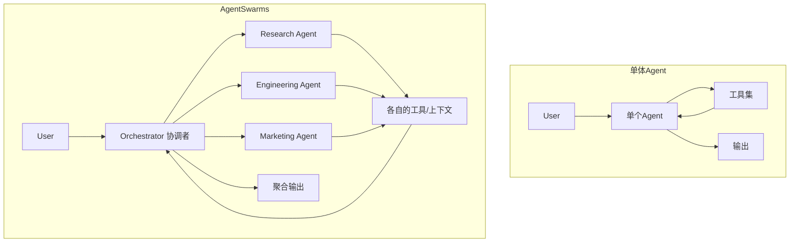

### 1.3 从"工作流"到"自主编排"

要理解 Agent Swarms 的革命性，必须把它和传统的"AI 工作流"（AI Workflow）区分开来。

传统 AI 工作流是"写死"的：开发者预先定义好一张流程图，规定"第一步调用 A，第二步调用 B，如果满足条件 C 就走 D 分支"。在这种模式下，模型只是流程节点里的"填空者"，真正的决策权掌握在开发者手写的编排逻辑里。这种模式的优点是可控、可预测，缺点是僵硬——一旦遇到预设分支之外的情况，系统就会束手无策。

Agent Swarms 的理想形态则是"自主编排"：Orchestrator 拿到一个高层目标后，**自己决定**需要拆解成哪些子任务、需要 spawn（孵化）哪些类型的子代理、如何分配它们的职责、如何汇总它们的产出。整个流转决策由 Agent 的推理驱动，而非由预置的流程图驱动。

不过，需要强调的是，"完全自主编排"是一个理想终态。在当前的工程实践中，更务实的做法往往是二者的**混合**：用确定性的脚本/DAG 来保证流程的稳定性和可预测性，同时在每个节点内部让 Agent 自主发挥其推理和执行能力。本文后续章节（尤其是第十四、十五章）会详细展开这种"双层架构"的设计。

下表对比了三种范式：

| 特性 | 写死的工作流 | 自主编排的 Agent Swarms | 混合架构（务实形态） |
|------|-------------|------------------------|---------------------|
| 决策主体 | 开发者手写逻辑 | Orchestrator 自主推理 | 脚本控流转 + Agent 控执行 |
| 灵活性 | 低 | 高 | 中高 |
| 可预测性 | 高 | 低 | 高 |
| 处理意外情况 | 差 | 好 | 较好 |
| 调试难度 | 低 | 高 | 中 |
| 生产可靠性 | 高 | 待验证 | 高 |

### 1.4 本文的视角与结构

本文将从"理论"和"工程"两条主线，系统地剖析多 Agent 协作与 Subagent 设计。

- **理论主线**关注：为什么多 Agent 是大模型 Scaling 的必然方向？Orchestrator-Worker 模型的本质是什么？上下文隔离为什么如此重要？强化学习如何驱动子代理调度进化？

- **工程主线**关注：CatDesk 中 Subagent 是如何设计的？它的生命周期如何管理？通信模型怎么实现？Worktree 隔离如何解决并发冲突？沙箱机制如何保障安全？声明式 DAG 如何编排多 Agent 流水线？

两条主线交织推进，最终汇聚到"研发全生命周期自动化"这一实战案例，展示多 Agent 协作在真实生产场景中的落地形态。

---

## 二、多 Agent 协作的理论基础

### 2.1 Scaling 范式的转向

长期以来，"Scaling Law"（规模定律）被视为大模型进步的第一驱动力：更多的参数、更多的数据、更多的算力，就能换来更强的能力。这条定律在过去几年里被反复验证，也塑造了整个行业"堆规模"的路径依赖。

然而，进入新的发展阶段后，行业逐渐意识到：单纯堆参数的边际收益在递减，而真正决定 Agent 能否胜任复杂长程任务的，是另外三个维度。在 2026 年 GTC 大会上，这三个维度被明确提出为下一代模型的 Scaling 核心方向：

1. **token efficiency（token 效率）**
2. **long context（长上下文）**
3. **agent swarms（智能体集群）**

这三个方向并非彼此孤立，而是相互支撑、构成一个自洽的体系。下面我们逐一展开。

#### 2.1.1 token efficiency：用更少的 token 做更多的事

token efficiency 指的是模型在完成同等任务时消耗更少 token 的能力。它包含两个层面：

- **推理层面的效率**：模型能否用更简洁、更精准的推理链得出正确结论，而不是冗长啰嗦地兜圈子。
- **信息组织层面的效率**：系统能否让每一个 token 都承载尽可能高的信息密度，避免上下文里充斥无关噪声。

token efficiency 与多 Agent 协作直接相关。因为多 Agent 的一个核心价值，正是**通过上下文隔离，让主 Agent 的上下文里只保留高价值信息**——探索性的、低价值的、临时的 token 消耗被"外包"给子代理，子代理在自己的独立上下文中燃烧这些 token，最后只把提炼后的结论回传给主 Agent。这本质上是一种"token 预算的分层管理"。

```
单体 Agent 的 token 消耗                多 Agent 的 token 消耗
┌────────────────────────┐            ┌────────────────────────┐
│ 主上下文（全部混杂）    │            │ 主上下文（仅高价值结论）│
│  - 高层规划             │            │  - 高层规划             │
│  - 探索代码库的原始输出 │  外包 →    │  - 子代理回传的结论     │
│  - 大量临时中间产物     │            └────────────────────────┘
│  - 失败的尝试           │            ┌────────────────────────┐
│  - 最终结论             │            │ 子代理上下文（可丢弃）  │
└────────────────────────┘            │  - 探索代码库原始输出   │
   容易饱和、腐化                       │  - 临时中间产物         │
                                       │  - 失败的尝试           │
                                       └────────────────────────┘
                                          用完即弃，不污染主线
```

#### 2.1.2 long context：更长、更可用的上下文

long context 不仅是"上下文窗口更大"，更强调"上下文更可用"——即模型在长上下文中依然保持稳定的召回能力和推理质量，不会出现前面提到的"上下文腐化"。

long context 与多 Agent 是一对辩证关系：

- 一方面，long context 让每个 Agent（无论主还是子）能承载更复杂的任务，减少了因上下文不足而被迫拆分的压力。
- 另一方面，即便有了 long context，把所有信息都塞进一个上下文仍然不是最优解。多 Agent 的隔离机制，让 long context 被更"聪明"地使用：把独立的关注点分配到独立的上下文中，各自享受长上下文的红利，同时避免彼此干扰。

#### 2.1.3 agent swarms：从个体智能到组织智能

agent swarms 是三个方向中最具"架构革命"意味的一个。它把 Scaling 的对象从"单个模型的能力"扩展到"多个 Agent 的协作结构"。

这里的核心洞察是：**智能不仅可以通过"让单个模型更强"来提升，也可以通过"让多个模型更好地组织协作"来提升。** 一个由若干中等能力 Agent 组成的、组织良好的集群，在复杂任务上的表现，可能超过一个孤立的超强单体 Agent。这与人类社会的运作逻辑高度一致：一家优秀公司的产出，从来不是靠一个全能的天才，而是靠一套良好的组织架构和分工协作。

### 2.2 多 Agent 协作的三个理论支柱

在 Scaling 新范式的指引下，多 Agent 协作的理论基础可以归纳为三个支柱。

#### 支柱一：分治（Divide and Conquer）

分治是计算机科学中最古老也最有效的思想之一。多 Agent 协作把它应用到智能体层面：将一个复杂的大任务，递归地拆解为若干个更小、更独立、更易处理的子任务，分配给不同的子代理并行或串行处理，最后合并结果。

分治的有效性依赖于两个前提：

1. **子任务的可分解性**：任务能够被拆解为相对独立的部分。
2. **合并的可行性**：子任务的结果能够被有意义地聚合成整体解答。

并非所有任务都适合分治。高度耦合、每一步都强依赖前一步中间状态的任务，就不适合拆分给独立子代理（因为拆分后子代理之间需要频繁通信，通信成本可能超过分治收益）。

#### 支柱二：关注点分离（Separation of Concerns）

关注点分离要求把不同抽象层级、不同职责的工作分配给不同的 Agent。最典型的就是"规划"与"执行"的分离：

- **Orchestrator（协调者）** 专注于高层规划：理解目标、拆解任务、分配职责、汇总结果。它不亲自动手做底层的文件操作、命令执行。
- **Worker（工作者/子代理）** 专注于底层执行：在自己的领域内完成具体的操作。

这种分离带来的直接好处是：Orchestrator 的上下文里只保留"战略层面"的信息，不会被"战术层面"的琐碎细节淹没，从而保持对全局目标的清晰把控。

#### 支柱三：隔离（Isolation）

隔离是多 Agent 相对于单体 Agent 最本质的优势之一。它包含两个层面：

- **上下文隔离**：每个子代理有自己独立的上下文窗口。子代理的探索过程、中间产物、失败尝试都封闭在自己的上下文里，不会污染主上下文。
- **执行隔离**：每个子代理可以在独立的沙盒/工作副本中执行操作。例如后文详述的 Worktree 隔离，让多个子代理并发修改代码时互不冲突。

隔离让整个系统具备了"故障边界"：一个子代理的失败或误入歧途，被限制在它自己的边界内，不会拖垮整个系统。

### 2.3 多 Agent 系统的形态谱系

从组织结构的角度，多 Agent 系统可以呈现出多种形态，构成一个连续的谱系：

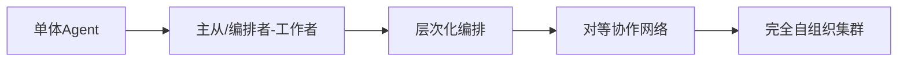

- **主从/编排者-工作者（Orchestrator-Worker）**：一个主 Agent 统一调度多个子代理。这是当前工程实践中最主流、最成熟的形态，也是本文的重点。
- **层次化编排（Hierarchical）**：编排者之下还可以有次级编排者，形成多层组织树。适合超大规模、多领域的任务。
- **对等协作网络（Peer-to-Peer）**：多个 Agent 地位平等，通过消息传递协商完成任务，没有中心化的编排者。
- **完全自组织集群（Self-organizing Swarm）**：Agent 动态地形成和解散组织关系，最接近生物界"蚁群/蜂群"的形态。这是 Agent Swarms 愿景中最激进的终态。

本文主要聚焦于当前最具工程可行性的 **Orchestrator-Worker 模型** 及其层次化扩展，同时兼顾对未来自组织形态的展望。

### 2.4 理论到工程的鸿沟

需要清醒地认识到：Agent Swarms 是一个宏大的愿景，但从愿景到落地存在巨大的工程鸿沟。理想中"完全由 Agent 自主决策、人类介入降至最低"的图景，在当前的模型能力和工程基础设施下，尚不能完全实现。

主要的鸿沟包括：

| 鸿沟 | 理想愿景 | 工程现实 |
|------|---------|---------|
| 决策可靠性 | Agent 自主决策不出错 | 长链决策易累积误差 |
| 调度稳定性 | 子代理稳定长时运行 | 需要专门的稳定性工程 |
| 能力对等 | 子代理能力 = 主代理 | 子代理常受限于工具子集 |
| 安全边界 | 自由使用工具与网络 | 需要细粒度沙箱与权限 |
| 冲突处理 | 并发修改自动协调 | 需要 Worktree 等隔离机制 |

弥合这些鸿沟，正是 CatDesk Subagent 设计要解决的核心工程问题。接下来的章节将逐一展开。

---

## 三、Orchestrator-Worker 模型详解

### 3.1 模型的本质：从"业务线大老板"说起

Orchestrator-Worker 模型可以用一个非常贴切的比喻来理解：**Orchestrator 就像一条业务线的大老板。**

一个优秀的业务线负责人，日常工作的核心不是亲自写代码、亲自做设计、亲自跑市场，而是：

1. 理解上级/客户交代的整体目标；
2. 把目标拆解为若干个可交付的工作块；
3. 判断每个工作块需要什么样的专业人才；
4. 把工作块分配给合适的下属，并给出清晰的任务说明；
5. 跟进进展、协调冲突、汇总产出；
6. 对最终结果负责。

Orchestrator 在多 Agent 系统中扮演的正是这个角色。它做的是"抽象决策和整体组织架构的设计"，而把具体的、领域性的、高 token 成本的执行工作，分配给专门的 Worker（子代理）。

```
                    ┌─────────────────────────────┐
                    │       Orchestrator          │
                    │      （业务线大老板）        │
                    │                             │
                    │  职责：                     │
                    │   · 理解整体目标            │
                    │   · 拆解任务                │
                    │   · 设计组织架构            │
                    │   · 分配职责                │
                    │   · 汇总产出                │
                    └──────────────┬──────────────┘
                                   │ spawn & brief
              ┌────────────────────┼────────────────────┐
              ▼                    ▼                    ▼
    ┌──────────────────┐ ┌──────────────────┐ ┌──────────────────┐
    │  Research Agent  │ │ Engineering Agent│ │ Marketing Agent  │
    │  （调研专员）    │ │  （工程专员）    │ │  （市场专员）    │
    │                  │ │                  │ │                  │
    │ 独立上下文       │ │ 独立上下文       │ │ 独立上下文       │
    │ 独立工具子集     │ │ 独立工具子集     │ │ 独立工具子集     │
    └────────┬─────────┘ └────────┬─────────┘ └────────┬─────────┘
             │ 回传结论           │ 回传结论           │ 回传结论
             └─────────────────────┴────────────────────┘
                                   │ 汇总
                                   ▼
                         ┌──────────────────┐
                         │   聚合后的产出    │
                         └──────────────────┘
```

### 3.2 Orchestrator 的核心职责拆解

Orchestrator 的职责可以细分为五项，每一项都对应着特定的能力要求。

#### 3.2.1 目标理解（Goal Understanding）

Orchestrator 拿到的往往是一个模糊、高层、甚至带歧义的目标。它的第一项工作就是把这个目标"想清楚"：

- 目标的真正意图是什么？
- 成功的标准是什么（验收条件）？
- 有哪些隐含的约束（时间、资源、权限）？
- 有哪些不确定性需要先行澄清？

如果目标本身不清晰，好的 Orchestrator 会选择先澄清，而不是盲目地把模糊目标传递给下游子代理——因为模糊会在传递链条中被放大。

#### 3.2.2 任务拆解（Task Decomposition）

任务拆解是 Orchestrator 最核心的能力。拆解的质量直接决定了整个多 Agent 系统的效率和成败。好的拆解应满足几个原则：

- **独立性**：拆出的子任务尽可能互相独立，减少子代理之间的依赖和通信。
- **完备性**：所有子任务合起来能完整覆盖原始目标，不遗漏。
- **粒度适中**：子任务既不能太大（超出单个子代理的能力），也不能太小（增加编排开销）。
- **可验证性**：每个子任务都有明确的完成标准，便于验证。

#### 3.2.3 组织架构设计（Organization Design）

拆解出子任务后，Orchestrator 需要决定用什么样的"组织架构"去承载它们：

- 哪些子任务可以并行？哪些必须串行（存在依赖）？
- 每个子任务应该分配什么类型的子代理（通用型？探索型？规划型？）？
- 是否需要多层编排（某个子任务本身很复杂，其子代理内部还要再 spawn 更下级的子代理）？

#### 3.2.4 职责分配与简报（Delegation & Briefing）

分配职责不只是"把任务丢给子代理"，更重要的是给子代理一份高质量的"简报"（briefing）。因为每个子代理都是"全新开始"的，它没有主 Agent 的上下文，不知道任务的背景。简报的质量决定了子代理能否正确理解并完成任务。关于简报的详细原则，将在第六章"通信模型设计"中深入展开。

#### 3.2.5 结果汇总（Aggregation）

子代理完成任务后，会把结论回传给 Orchestrator。Orchestrator 需要：

- 审视每个子代理的产出是否符合预期；
- 判断是否需要追加任务、修正或重做；
- 把多个子代理的产出聚合成一个连贯的整体解答；
- 对最终结果的质量负责。

### 3.3 Worker（子代理）的职责边界

与 Orchestrator 的"抽象决策"相对，Worker 专注于"具体执行"。一个 Worker 的职责边界应当是清晰的：

- **专注**：只完成分配给它的那个子任务，不越界干预其他子任务。
- **自足**：在自己的独立上下文和工具子集内完成任务，尽量不依赖与其他 Worker 的频繁通信。
- **回传**：完成后把提炼过的结论（而非全部原始过程）回传给 Orchestrator。

一个反模式是：Worker 试图"越权"去做全局决策，或者 Worker 之间私下建立复杂的横向通信，绕过了 Orchestrator 的编排。这会破坏关注点分离，让系统重新滑向失控。

### 3.4 Orchestrator-Worker 的交互时序

下面用一张时序图展示一次典型的 Orchestrator-Worker 协作全过程：

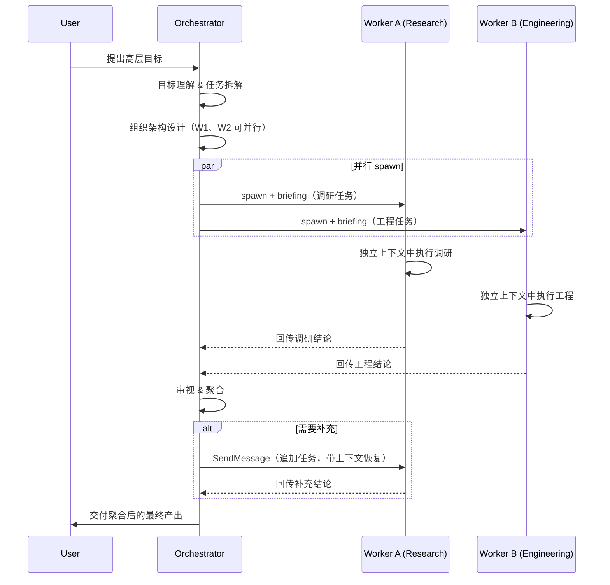

### 3.5 与传统分布式系统的类比

Orchestrator-Worker 模型对熟悉分布式系统的工程师来说并不陌生。它与经典的"主从架构"（Master-Worker）、"MapReduce"、"任务调度系统"有着深刻的相似性：

| 分布式系统概念 | 多 Agent 对应 | 说明 |
|---------------|--------------|------|
| Master 节点 | Orchestrator | 负责调度与协调 |
| Worker 节点 | Subagent | 负责实际计算/执行 |
| Map 阶段 | 任务拆解 + 并行 spawn | 把任务分发给多个 Worker |
| Reduce 阶段 | 结果汇总 | 把 Worker 产出聚合 |
| 心跳/健康检查 | 子代理完成率监控 | 监控 Worker 状态 |
| 任务重试 | SendMessage 追加/重做 | 失败后的补偿 |
| 资源隔离 | 沙箱 + Worktree | 防止 Worker 互相干扰 |

但也有本质区别：传统分布式系统的 Worker 执行的是**确定性**的计算逻辑，而多 Agent 系统的 Worker 执行的是**概率性**的智能推理。这意味着多 Agent 系统必须额外处理"推理可能出错""产出质量不稳定"等传统分布式系统不会遇到的问题——这也是为什么后文要引入强化学习优化调度、引入人机协作节点做关键决策把控。

### 3.6 何时该用 Orchestrator-Worker，何时不该用

Orchestrator-Worker 并非万能。引入多 Agent 会带来额外的编排开销（简报成本、通信成本、聚合成本）。因此需要判断任务是否"值得"多 Agent 化。

**适合的场景：**

- 任务可以拆解为多个相对独立的子任务；
- 存在天然的并行机会；
- 某些子任务是高 token 成本的探索，适合隔离；
- 任务需要不同"专业领域"的能力组合。

**不适合的场景：**

- 任务简单、短程，单体 Agent 足以胜任；
- 任务高度耦合，拆分后子代理需频繁通信；
- 对延迟极度敏感，无法承受编排开销；
- 任务的每一步都强依赖前一步的即时中间状态。

一个实用的判断准则是：**先问"这个任务如果交给一个人做会怎么做？如果交给一个团队做会怎么做？"** 如果答案是"一个人顺手就做了"，那就用单体 Agent；如果答案是"需要一个团队分工协作"，那就考虑 Orchestrator-Worker。


---

## 四、CatDesk Subagent 的设计架构

### 4.1 设计理念：模型侧与工程侧的双轮驱动

CatDesk 的 Subagent 设计遵循一个核心理念：**模型能力的进化与工程架构的进化必须双轮驱动、协同演进。** 单靠模型变聪明不够，单靠工程堆基础设施也不够，二者缺一不可。

- **模型侧**关注：如何让大模型学会"主动、聪明地调度和协作多个子代理"，而不是被动地生成内容。
- **工程侧**关注：如何构建稳定、安全、能力对等的子代理运行基础设施。

这一节先给出整体架构的鸟瞰，后续章节再逐一深入。

### 4.2 整体架构鸟瞰

CatDesk Subagent 的整体架构可以分为四层：

```
┌──────────────────────────────────────────────────────────────────────┐
│                         用户 / 上层调用方                              │
└────────────────────────────────┬───────────────────────────────────────┘
                                 │
┌────────────────────────────────▼───────────────────────────────────────┐
│                       主 Agent（Orchestrator）                          │
│  ┌────────────────┐  ┌────────────────┐  ┌──────────────────────────┐ │
│  │  任务拆解引擎  │  │  Subagent 调度 │  │  结果聚合与决策           │ │
│  └────────────────┘  └───────┬────────┘  └──────────────────────────┘ │
└──────────────────────────────┼─────────────────────────────────────────┘
                               │ spawn / SendMessage
┌──────────────────────────────▼─────────────────────────────────────────┐
│                       Subagent 调度层                                    │
│  ┌────────────────┐  ┌────────────────┐  ┌──────────────────────────┐ │
│  │  生命周期管理  │  │  通信路由      │  │  稳定性/长时运行保障      │ │
│  └────────────────┘  └────────────────┘  └──────────────────────────┘ │
└──────────────────────────────┬─────────────────────────────────────────┘
                               │
┌──────────────────────────────▼─────────────────────────────────────────┐
│                    Subagent 运行时（能力对等）                           │
│  ┌────────────┐ ┌────────────┐ ┌────────────┐ ┌──────────────────────┐│
│  │ BrowserUse │ │  Skills    │ │  MCP       │ │  文件/命令/搜索工具  ││
│  └────────────┘ └────────────┘ └────────────┘ └──────────────────────┘│
│         subagent as a first class agent citizen                         │
└──────────────────────────────┬─────────────────────────────────────────┘
                               │
┌──────────────────────────────▼─────────────────────────────────────────┐
│                       沙箱与隔离层                                       │
│  ┌────────────────┐ ┌──────────────────┐ ┌───────────────────────────┐│
│  │ 工具网络权限   │ │  Worktree 隔离   │ │  资源与文件系统边界        ││
│  │ （细粒度）     │ │  （Git 副本）    │ │                            ││
│  └────────────────┘ └──────────────────┘ └───────────────────────────┘│
└──────────────────────────────────────────────────────────────────────┘
```

四层各司其职：

1. **主 Agent（Orchestrator）层**：承担第三章所述的编排职责。
2. **Subagent 调度层**：负责子代理的生命周期管理、通信路由，以及"支持长时间稳定运行的工程架构"。这是工程侧三个重点之一。
3. **Subagent 运行时层**：让子代理拥有与主代理同样的能力空间（BrowserUse、Skills、MCP 等），即"subagent as a first class agent citizen"。这是工程侧的第二个重点。
4. **沙箱与隔离层**：提供细颗粒度的工具网络权限设置、Worktree 能力等完整的运行沙箱机制。这是工程侧的第三个重点。

### 4.3 模型侧设计方向

CatDesk 在模型侧的设计方向非常明确：**Subagent 的调用将被正式纳入强化学习（RL）流程，成为模型能力进化的核心组成部分。**

这句话的分量很重。它意味着"调度子代理"不再是一个由 prompt 工程临时拼凑的能力，而是被当作模型的一项**核心可训练能力**，通过 RL 去系统性地优化。

训练过程中重点优化三个关键指标：

| 指标 | 英文 | 含义 |
|------|------|------|
| 子代理调用奖励 | instantiation reward | 奖励模型在合适的时机、以合适的方式实例化（调用）子代理 |
| 子代理任务完成率 | sub-agent finish rate | 衡量被调用的子代理是否成功完成了分配的任务 |
| 任务整体完成水平 | task-level outcome | 衡量整个任务（主 + 子代理协作）最终的完成质量 |

这三个指标构成了一个从"微观调用"到"宏观结果"的完整奖励信号链条。关于它们的详细设计和作用机制，将在第十一章"强化学习驱动的 Subagent 调度优化"中深入展开。

模型侧设计的终极目标是：**大模型不再只是被动生成内容，而是学会主动、聪明地调度和协作多个子代理。** 这标志着模型从"内容生成器"到"智能组织者"的角色跃迁。

### 4.4 工程侧设计方向

CatDesk 在工程侧确立了三个重点：

**重点一：子代理调度层面的稳定性和支持长时间稳定运行的工程架构。**

多 Agent 任务往往是长程的——一个复杂的研发流程可能持续数十分钟甚至更久，期间会 spawn 大量子代理。调度层必须保证：

- 子代理的创建、执行、回收全流程稳定，不会出现资源泄漏；
- 单个子代理的崩溃不会拖垮整个调度层；
- 长时运行过程中，状态可追踪、可恢复；
- 具备背压（backpressure）机制，防止子代理无限膨胀耗尽资源。

**重点二：让子代理和主代理拥有同样的能力空间（subagent as a first class agent citizen）。**

这是一个非常重要的设计取向。在很多早期实现中，子代理是"二等公民"——它们只能使用主代理工具集的一个受限子集，无法调用浏览器、无法加载 Skills、无法接入 MCP。这严重限制了子代理的能力，也限制了任务拆分的自由度。

CatDesk 的取向是让子代理成为"一等公民"（first class agent citizen），即子代理拥有与主代理**同等的能力空间**，包括 BrowserUse、Skills、MCP 等。这样一来，任何可以交给主代理做的事，理论上都可以交给子代理做，任务拆分不再受能力差异的约束。

**重点三：建立完整的子代理运行沙箱机制。**

沙箱机制包括：

- 细颗粒度的工具网络权限设置（哪些子代理能访问哪些网络资源）；
- Worktree 能力（让子代理在隔离的 Git 工作副本中操作代码）；
- 资源与文件系统边界（限制子代理的资源占用和文件访问范围）。

### 4.5 设计原则总览

综合模型侧与工程侧，CatDesk Subagent 的设计原则可以总结为以下几条：

1. **隔离优先**：默认给子代理独立上下文，探索性任务不污染主线。
2. **能力对等**：子代理是一等公民，能力空间与主代理对齐。
3. **稳定为本**：调度层保障长时运行的稳定性。
4. **安全兜底**：沙箱机制提供细粒度权限与执行边界。
5. **可训练**：调度能力纳入 RL 流程，持续进化。
6. **简报清晰**：每次调用提供完整的任务描述（详见第六章）。

这六条原则贯穿本文后续所有章节。下面我们从 Subagent 的生命周期管理开始，逐一深入。


---

## 五、Subagent 的生命周期管理

### 5.1 生命周期五阶段总览

一个 Subagent 从诞生到消亡，经历五个阶段：**创建（Spawn）→ 执行（Execute）→ 通信（Communicate）→ 恢复（Resume）→ 终止（Terminate）**。

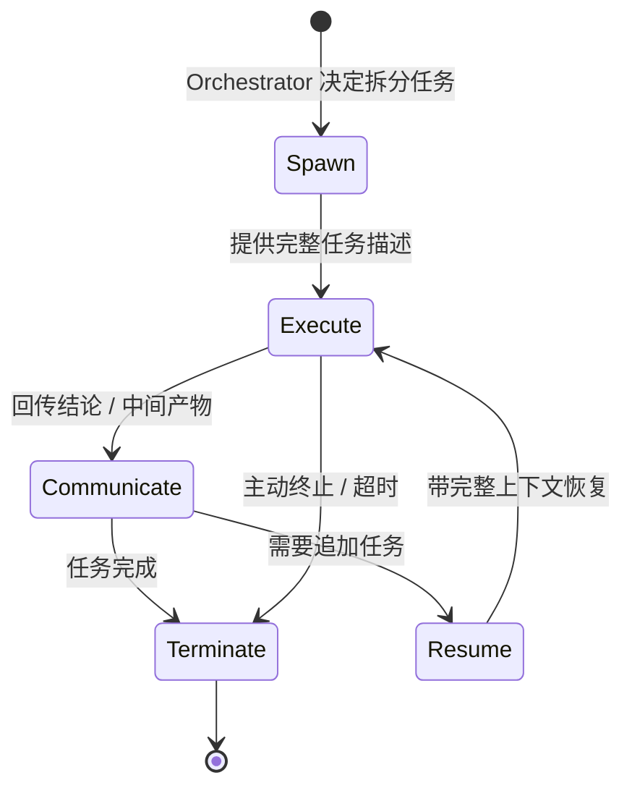

需要注意，这五个阶段并非严格线性。一个 Subagent 可能在"执行"和"通信"之间往返多次，也可能在"终止"后又被"恢复"。生命周期管理的核心，就是稳定、可靠地驱动这些状态转换。

### 5.2 阶段一：创建（Spawn）

#### 5.2.1 创建的触发条件

Orchestrator 在什么情况下决定 spawn 一个 Subagent？根据 CatDesk 的设计，有两类**必须** spawn 子代理的场景：

1. **并行化（Parallelization）**：有两个或更多**独立的**工作项，每项可能涉及多步操作。此时应该为每个工作项 spawn 一个子代理并行处理。

2. **上下文隔离（Context Isolation）**：希望完成一个**高 token 成本**的子任务，而不污染主任务的上下文。典型例子包括用子代理探索代码库、验证早期的工作成果等。

这两类场景直接对应第二章讲的两大理论支柱——"分治"和"隔离"。

#### 5.2.2 创建时的关键参数

spawn 一个 Subagent 时，需要指定几个关键参数：

```yaml
spawn_subagent:
  subagent_type: "general-purpose"   # 子代理类型（详见第十章）
  description: "3-5 字的简短描述"      # 用于追踪与展示
  prompt: |                          # 完整的任务简报（详见第六章）
    <完整的任务描述，包括背景、目标、已知信息、期望产出>
  isolation: "worktree"              # 可选：是否在隔离的 Git 工作副本中运行
```

其中：

- `subagent_type` 决定了子代理的类型和能力配置。
- `description` 是一个 3-5 字的简短描述，用于在监控界面上追踪这个子代理在做什么。
- `prompt` 是最关键的参数——它是给子代理的完整任务简报。因为每个 Agent 调用都是"全新开始"，prompt 必须自包含（self-contained），提供子代理完成任务所需的一切上下文。
- `isolation` 是可选参数，设为 `"worktree"` 时，子代理会在一个临时的 Git 工作副本中运行（详见第八章）。

#### 5.2.3 并行创建

当需要并行化时，Orchestrator 应当在**同一批次**中 spawn 多个子代理，而不是一个接一个地串行 spawn。这是充分利用并行能力的关键。

```
串行 spawn（低效）:
   spawn A → 等待 A 完成 → spawn B → 等待 B 完成 → spawn C ...
   总耗时 = T(A) + T(B) + T(C)

并行 spawn（高效）:
   同一批次 spawn { A, B, C }
   总耗时 = max( T(A), T(B), T(C) )
```

### 5.3 阶段二：执行（Execute）

Subagent 被创建后，进入独立执行阶段。这个阶段的特点是：

- **上下文独立**：子代理在自己的上下文窗口中运行，不与主 Agent 共享上下文。
- **工具自主**：子代理在其能力空间内自主选择和调用工具。
- **过程封闭**：子代理的思考过程、中间产物、失败尝试都封闭在自己的边界内。

执行阶段是子代理"燃烧 token"的阶段。它可能读大量文件、执行大量命令、访问网络资源——所有这些高成本操作，都在子代理的隔离上下文中进行，主 Agent 的上下文保持清爽。

从调度层的角度，执行阶段需要监控：

- 子代理是否还"活着"（心跳/进度）；
- 是否超出了时间/资源预算；
- 是否需要背压（当并发子代理过多时）。

### 5.4 阶段三：通信（Communicate）

执行完成后（或执行过程中需要交互时），子代理与主 Agent 通信。

一个关键的设计原则是：**子代理回传给主 Agent 的，应当是"提炼过的结论"，而非"全部原始过程"。**

- 子代理内部可能读了 50 个文件、执行了 100 条命令。
- 但它回传给主 Agent 的，应该是一段精炼的结论摘要，比如"经调研，方案 A 在性能上优于方案 B，主要因为……，相关关键文件是 X、Y、Z"。

这正是上下文隔离的价值所在：低价值的原始过程被子代理消化掉，只有高价值的结论进入主上下文。通信模型的详细设计将在第六章展开。

### 5.5 阶段四：恢复（Resume）

Subagent 完成一轮任务后，可能还需要追加工作。这时不必重新 spawn 一个全新的子代理，而是可以**恢复**之前的那个子代理，让它带着完整的上下文继续。

恢复的机制是：使用 SendMessage，以子代理的 ID 或名称作为 `to` 字段，向它发送新的消息。子代理会带着**完整的上下文**恢复执行。

```yaml
# 恢复一个之前 spawn 的子代理
send_message:
  to: "research-agent-a1b2c3"   # 子代理的 ID 或名称
  message: |
    很好，你的调研结论我收到了。现在请补充一点：
    方案 A 在高并发场景下的表现如何？请重点关注……
```

恢复与重新创建的关键区别：

| 维度 | 重新创建（Spawn） | 恢复（Resume via SendMessage） |
|------|-------------------|-------------------------------|
| 上下文 | 全新，空白 | 保留之前的完整上下文 |
| 简报要求 | 必须提供完整任务描述 | 只需补充增量信息 |
| 适用场景 | 新的独立任务 | 对已有任务的追加/修正 |
| token 成本 | 需重新建立上下文 | 复用已有上下文 |

选择"恢复"还是"重新创建"，取决于新任务与旧任务的关联度。如果新任务是旧任务的自然延续，恢复更高效；如果是完全无关的新任务，重新创建更清晰。

### 5.6 阶段五：终止（Terminate）

Subagent 的终止有几种情形：

1. **正常完成**：子代理完成任务并回传结论后，自然终止。
2. **主动终止**：Orchestrator 判断某个子代理不再需要（例如任务已被其他子代理完成、或方向已经改变），主动终止它。
3. **超时/超预算终止**：调度层监测到子代理超出了时间或资源预算，强制终止。
4. **异常终止**：子代理执行中崩溃或不可恢复地卡住。

终止阶段的关键工程动作是**资源回收**：

- 释放子代理占用的上下文/内存资源；
- 清理临时文件；
- 如果使用了 Worktree 隔离，按规则处理工作副本（无修改则自动清理，有修改则保留并返回路径与分支名，详见第八章）；
- 更新调度层的状态记录。

良好的终止管理是"长时间稳定运行"的基础——如果终止阶段资源回收不彻底，长程任务中不断 spawn 的子代理会逐渐耗尽系统资源。

### 5.7 生命周期的状态机实现（伪代码）

下面用伪代码描述 Subagent 生命周期状态机的核心逻辑：

```python
class SubagentLifecycle:
    def __init__(self, subagent_type, description, prompt, isolation=None):
        self.id = generate_subagent_id(subagent_type)
        self.type = subagent_type
        self.description = description
        self.prompt = prompt
        self.isolation = isolation
        self.status = "created"
        self.context = None          # 独立上下文
        self.worktree_path = None    # 若启用 worktree 隔离

    def spawn(self):
        """阶段一：创建"""
        self.context = new_isolated_context()
        if self.isolation == "worktree":
            self.worktree_path, self.branch = create_git_worktree()
        self.status = "running"
        self.start_time = now()

    def execute(self):
        """阶段二：执行"""
        while not self.is_done():
            action = self.reason_and_act(self.context)
            observation = self.invoke_tool(action)  # 在能力空间内
            self.context.append(observation)
            if self.exceeds_budget():
                return self.terminate(reason="budget_exceeded")
        return self.emit_result()

    def communicate(self, result):
        """阶段三：通信 —— 回传提炼后的结论"""
        distilled = self.distill(result)  # 只回传高价值结论
        return distilled

    def resume(self, new_message):
        """阶段四：恢复 —— 带完整上下文继续"""
        assert self.context is not None, "上下文必须保留"
        self.context.append(new_message)
        self.status = "running"
        return self.execute()

    def terminate(self, reason="completed"):
        """阶段五：终止 —— 资源回收"""
        self.status = "terminated"
        self.end_time = now()
        if self.worktree_path:
            if self.has_changes():
                keep_worktree(self.worktree_path, self.branch)
            else:
                cleanup_worktree(self.worktree_path)  # 无修改自动清理
        release_context(self.context)
        return {"reason": reason, "duration": self.end_time - self.start_time}
```

### 5.8 生命周期管理与稳定性

回到第四章提到的工程侧重点一——"子代理调度层面的稳定性和支持长时间稳定运行的工程架构"。生命周期管理是实现这一目标的核心手段。稳定的生命周期管理需要保证：

- **创建的幂等性**：重复的创建请求不会产生重复的子代理。
- **执行的可观测性**：任意时刻都能查询到子代理的状态和进度。
- **恢复的一致性**：恢复时上下文完整、状态正确。
- **终止的彻底性**：资源被完全回收，不留泄漏。
- **异常的隔离性**：单个子代理的异常不会传播到调度层或其他子代理。


---

## 六、通信模型设计

### 6.1 通信模型的两个基本命题

多 Agent 系统的通信模型建立在两个基本命题之上：

**命题一：每个 Agent 调用都是全新开始——需要提供完整的任务描述。**

当 Orchestrator spawn 一个新的子代理时，这个子代理是"一张白纸"。它没有参与过之前的对话，不知道任务的来龙去脉，不了解已经尝试过什么、排除过什么。因此，spawn 时提供的任务描述（prompt）必须是**自包含**的——它必须携带子代理完成任务所需的全部上下文。

**命题二：要继续之前 spawn 的 agent，使用 SendMessage 和 agent 的 ID 或名称作为 to 字段，agent 会带着完整上下文恢复。**

与"全新开始"相对，如果我们想让一个已经存在的子代理继续工作，则不需要重新提供完整上下文——通过 SendMessage 定向发送消息，子代理会带着它已有的完整上下文恢复。

这两个命题构成了通信模型的基础，决定了何时该"完整简报"、何时该"增量沟通"。

### 6.2 briefing 原则：像给刚进门的聪明同事做简报

CatDesk 对任务简报（briefing）提出了一个极具画面感的原则：

> **像对一个刚走进房间的聪明同事做简报——他没看过这个对话，不知道你试过什么，不理解为什么这个任务重要。**

这个比喻的三个要点，恰好对应简报要覆盖的三类信息：

1. **"他没看过这个对话"** → 你必须提供任务的背景上下文。
2. **"不知道你试过什么"** → 你必须说明已经了解到什么、排除了什么。
3. **"不理解为什么这个任务重要"** → 你必须解释任务的意图和目标。

基于这个比喻，briefing 应当包含以下要素：

- **解释你想完成什么以及为什么**：让子代理理解任务的意图和价值，而不只是机械的指令。
- **描述你已经了解到的或排除的内容**：让子代理不重复你已经走过的弯路，也不重复你已经确认过的结论。
- **给出足够的上下文让 agent 能做判断而非机械执行**：好的子代理应该能根据上下文做出合理的判断，而不是死板地执行一条指令。这就要求简报提供足够的判断依据。

### 6.3 好简报与坏简报的对比

理解 briefing 原则最好的方式是对比。下面是同一个任务的"坏简报"和"好简报"。

**坏简报（terse command-style，产生浅薄、泛化的工作）：**

```
帮我看看这个 bug 怎么修。
```

这个简报几乎没有信息量。子代理不知道 bug 在哪、什么现象、之前查过什么、期望怎样的修复。它只能盲目地从头探索，大概率产出泛化、无关痛痒的结果。

**好简报（提供完整上下文、意图和判断依据）：**

```
我们在排查一个用户登录偶发失败的问题。现象是：约 5% 的登录请求返回 401，
但用户的凭证是正确的。

我已经确认的：
- 不是密码校验逻辑的问题（我单独测试过校验函数，正确率 100%）。
- 失败请求集中在多实例部署环境，单实例环境没有复现。

我怀疑但还没验证的：
- 可能与会话状态在多实例间不同步有关，重点看 session 存储的实现。

请你做的事：
- 探索 src/auth/ 和 src/session/ 目录，定位会话状态管理的实现。
- 判断在多实例场景下，会话状态是否存在一致性问题。
- 如果找到根因，给出具体的文件路径、行号，以及你判断的依据。

不需要你直接修复，先给我分析结论。报告控制在 300 字以内。
```

这个简报做到了：解释了任务背景和意图（排查登录失败）、说明了已确认和已排除的内容（不是密码校验、集中在多实例）、给出了判断方向（怀疑会话同步），并明确了期望产出（分析结论、文件路径行号、判断依据）和约束（不直接修复、300 字以内）。

### 6.4 briefing 的反模式：不要委托"理解"

CatDesk 特别强调一个 briefing 的反模式：**永远不要委托"理解"（Never delegate understanding）。**

具体来说，不要写这样的简报：

- "根据你的发现，修复这个 bug。"（based on your findings, fix the bug）
- "根据调研结果，实现它。"（based on the research, implement it）

这类简报的问题在于：它们把"综合判断"（synthesis）这个本该由 Orchestrator 自己完成的核心工作，推给了子代理。Orchestrator 作为"业务线大老板"，理应自己先理解清楚、做出判断，然后给子代理下达**明确的、体现出理解的**指令。

体现出"理解"的简报，应该包含：

- 具体的文件路径；
- 具体的行号；
- 具体要改什么。

也就是说，Orchestrator 不能用"你自己看着办"来掩盖自己没想清楚的事实。真正想清楚了，才能给出精准的简报。

### 6.5 查找型任务 vs 调查型任务的简报差异

briefing 还需要区分任务的性质：

- **查找型任务（Lookups）**：目标明确，就是去取一个确定的东西。这类任务应当**直接给出确切的命令或路径**。例如"执行 `git log --oneline -20` 并把输出给我"。

- **调查型任务（Investigations）**：目标是回答一个开放性问题，路径不确定。这类任务应当**交出问题本身，而不是规定步骤**。因为一旦前提被推翻，预先规定的步骤就变成了累赘（prescribed steps become dead weight when the premise is wrong）。

这个区分很关键：对于调查型任务，如果 Orchestrator 硬性规定了"第一步做 A，第二步做 B"，而子代理在第一步就发现前提错了，那么后续步骤全部作废。正确的做法是把开放性问题交给子代理，让它根据实际发现自主调整路径。

| 任务性质 | 简报策略 | 示例 |
|---------|---------|------|
| 查找型 | 给出确切命令/路径 | "读取 config/app.yaml 并返回 database 段" |
| 调查型 | 交出问题，不规定步骤 | "为什么这个服务在高峰期偶发超时？请调查并给出根因" |

### 6.6 SendMessage 机制详解

SendMessage 是多 Agent 通信的核心原语。它的作用有两个：

1. **恢复子代理**：向一个已存在的子代理发送消息，让它带着完整上下文继续工作。
2. **定向通信**：通过 `to` 字段精确指定消息的接收者（子代理的 ID 或名称）。

SendMessage 与初次 spawn 的本质区别在于**上下文的连续性**：

```
spawn（全新）:
   ┌─────────────────────────────┐
   │ 子代理上下文（空）           │
   │ ← 注入完整简报              │
   └─────────────────────────────┘

SendMessage（恢复）:
   ┌─────────────────────────────┐
   │ 子代理上下文（已有历史）     │
   │ ← 追加增量消息              │
   └─────────────────────────────┘
```

因此，使用 SendMessage 时，消息内容只需要提供**增量信息**，而不必重复已经在子代理上下文中的内容。这既省 token，也更符合"对话延续"的自然语义。

### 6.7 通信模型的伪代码

```python
def orchestrator_communication_flow(task):
    # 1. 判断任务性质，决定简报策略
    if is_parallel_decomposable(task):
        subtasks = decompose(task)
        agents = []
        for st in subtasks:
            # 每个子代理全新开始，提供完整自包含简报
            brief = build_self_contained_brief(
                intent=st.why,               # 为什么做
                known=st.what_we_know,        # 已了解/已排除
                context=st.judgment_context,  # 判断依据
                expected=st.expected_output,  # 期望产出
                constraints=st.constraints,   # 约束（如字数）
            )
            agent = spawn_subagent(type=st.best_type, prompt=brief)
            agents.append(agent)

        # 2. 收集回传的提炼结论
        results = [a.await_result() for a in agents]

        # 3. Orchestrator 自己完成综合判断（不委托 understanding）
        synthesis = orchestrator_synthesize(results)

        # 4. 若需追加，用 SendMessage 恢复具体子代理（增量沟通）
        if needs_followup(synthesis):
            target = pick_agent(agents, synthesis)
            follow = build_incremental_message(synthesis)
            extra = send_message(to=target.id, message=follow)
            synthesis = orchestrator_synthesize([synthesis, extra])

        return synthesis
    else:
        return single_agent_handle(task)
```

### 6.8 通信中的信息瘦身

最后，通信模型还要强调"信息瘦身"的重要性。多 Agent 系统的价值之一就是控制主上下文的信息密度，因此在通信的每个环节都要做减法：

- **下行（Orchestrator → Subagent）**：简报要完整但不冗余，只给必要的上下文。
- **上行（Subagent → Orchestrator）**：只回传提炼后的高价值结论，把低价值的原始过程留在子代理里。
- **横向（Subagent ↔ Subagent）**：尽量避免。子代理之间的直接通信会绕过 Orchestrator 的编排，破坏关注点分离。如确需协调，应通过 Orchestrator 中转。


---

## 七、上下文隔离策略

### 7.1 为什么需要上下文隔离

上下文隔离是多 Agent 相较单体 Agent 最本质的优势之一。要理解它的价值，先要理解不隔离时会发生什么。

在单体 Agent 中，所有的信息——高层规划、探索代码库的原始输出、大量临时中间产物、失败的尝试、最终结论——都堆积在同一个上下文窗口里。这会导致三个严重问题：

**问题一：上下文饱和（Context Saturation）。**

上下文窗口是有限的。当一个任务需要探索大量文件、执行大量命令时，原始输出会迅速填满上下文。一旦饱和，Agent 要么被迫遗忘早期信息，要么无法继续接收新信息。

**问题二：上下文腐化（Context Rot）。**

即便上下文窗口足够大，随着上下文变长，模型的注意力会被稀释。它对早期信息的召回能力下降，对中间信息容易"迷失"，推理质量随之劣化。这就是所谓的"上下文腐化"。

**问题三：噪声污染（Noise Pollution）。**

探索过程中产生的大量低价值信息（比如读了一个无关文件、执行了一条最终证明是错误方向的命令）会作为"噪声"永久留在上下文里，干扰后续的推理。

上下文隔离通过给子代理独立的上下文窗口，从根本上解决了这三个问题。

### 7.2 隔离的核心思想：token 预算的分层管理

上下文隔离的核心思想，可以概括为"token 预算的分层管理"：

- **主 Agent 的上下文**是稀缺、宝贵的资源，应当只保留高价值信息（高层规划 + 提炼后的结论）。
- **子代理的上下文**是可以"挥霍"的资源，用来承载高 token 成本的探索过程，用完即弃。

```
       主 Agent 上下文（稀缺，只放精华）
       ┌──────────────────────────────────┐
       │ · 用户目标                        │
       │ · 高层规划                        │
       │ · 子代理 A 回传的结论（3 行）     │
       │ · 子代理 B 回传的结论（5 行）     │
       │ · 综合判断与决策                  │
       └──────────────────────────────────┘
              ▲                    ▲
              │ 回传 3 行          │ 回传 5 行
     ┌────────┴────────┐  ┌────────┴────────┐
     │ 子代理 A 上下文 │  │ 子代理 B 上下文 │
     │（可挥霍，用完弃）│  │（可挥霍，用完弃）│
     │ · 读了 40 个文件│  │ · 执行 60 条命令│
     │ · 3 次失败尝试  │  │ · 2 个错误方向  │
     │ · 大量原始输出  │  │ · 大量日志      │
     └─────────────────┘  └─────────────────┘
```

在这个例子中，子代理 A 消耗了大量 token 去读 40 个文件、经历了 3 次失败尝试，但它只把 3 行结论回传给主 Agent。主 Agent 的上下文因此保持极高的信息密度。

### 7.3 典型的隔离场景

CatDesk 明确指出两个典型的上下文隔离场景：

**场景一：用子代理探索代码库。**

探索一个陌生的、庞大的代码库是极其消耗上下文的操作——需要读大量文件、追踪调用链、理解模块关系。如果在主 Agent 里直接做，会迅速污染主上下文。正确的做法是 spawn 一个探索型子代理，让它在独立上下文中完成探索，只回传"这个代码库的架构是……，关键文件是……"这样的结论。

**场景二：验证早期的工作成果。**

假设主 Agent 早前做了一段工作，现在想验证它是否正确。验证过程可能需要跑测试、读日志、对比预期——同样是高 token 成本操作。用子代理来做验证，可以避免验证过程的原始输出污染主上下文，主 Agent 只需要接收"验证通过"或"验证失败，原因是……"的结论。

| 隔离场景 | 高 token 成本来源 | 子代理回传的精华 |
|---------|------------------|-----------------|
| 探索代码库 | 读大量文件、追踪调用链 | 架构总结 + 关键文件清单 |
| 验证早期工作 | 跑测试、读日志、对比 | 通过/失败 + 原因 |
| 大规模搜索 | 遍历、匹配、过滤 | 命中结果的精简列表 |
| 多方案调研 | 逐一深入研究每个方案 | 对比结论 + 推荐 |

### 7.4 如何实现上下文隔离

从工程实现的角度，上下文隔离的关键在于：**每个子代理拥有物理上独立的上下文存储，主 Agent 与子代理之间只通过明确定义的接口（简报下行、结论上行）交换信息。**

实现要点：

1. **独立的上下文对象**：每个子代理在创建时分配一个全新的、独立的上下文对象，与主 Agent 的上下文互不引用。

2. **明确的信息边界**：主 Agent 只能通过 spawn 时的 prompt 向子代理注入信息，子代理只能通过回传的结论向主 Agent 输出信息。没有隐式的上下文共享。

3. **结论的提炼层**：在子代理回传结论前，有一个"提炼"（distill）环节，把子代理的完整上下文压缩成高价值的摘要。

```python
class IsolatedContext:
    """每个子代理的独立上下文"""
    def __init__(self, initial_brief):
        self.messages = [initial_brief]   # 只从简报开始，无主上下文引用
        self.token_count = count_tokens(initial_brief)

    def append(self, item):
        self.messages.append(item)
        self.token_count += count_tokens(item)

    def distill(self):
        """回传前的提炼：把完整上下文压缩成高价值结论"""
        return summarize_to_high_value(self.messages)


def spawn_with_isolation(subagent_type, brief):
    ctx = IsolatedContext(initial_brief=brief)   # 全新独立上下文
    agent = Subagent(subagent_type, context=ctx)
    return agent

# 主 Agent 只拿到 distilled 结果，子代理的原始上下文被丢弃
result = agent.run()
main_context.append(agent.context.distill())     # 只进精华
discard(agent.context)                            # 原始上下文丢弃
```

### 7.5 隔离的粒度权衡

上下文隔离的粒度需要权衡。隔离粒度越细（子任务拆得越小、子代理越多），主上下文越干净，但编排开销越大；隔离粒度越粗（子任务拆得越大、子代理越少），编排越简单，但隔离收益越小。

```
隔离过细                              隔离过粗
├─ 主上下文极干净                     ├─ 主上下文仍可能被污染
├─ 编排开销大（简报/聚合成本高）      ├─ 编排开销小
├─ 子代理间可能有冗余探索            ├─ 单个子代理任务过重
└─ 适合高度独立的子任务              └─ 适合关联紧密的子任务
                    ↕ 最优粒度在中间 ↕
```

寻找最优粒度没有万能公式，但一个有用的启发是：**当一个子任务的 token 成本高到会明显污染主上下文，或者一个子任务足够独立可以并行时，就值得为它做一次隔离。**

### 7.6 隔离与恢复的关系

上下文隔离并不意味着"用完就永久丢弃"。如第五章所述，通过 SendMessage 恢复子代理时，子代理会带着它**完整的隔离上下文**恢复。也就是说，隔离上下文在子代理终止前是被保留的，随时可以被恢复利用。

这形成了一个优雅的设计：

- 对主 Agent 而言，子代理的上下文是"隐藏"的，主 Agent 只看到精华。
- 对子代理自身而言，它的上下文是"完整"的，恢复时能延续之前的所有工作。

这种"对主隐藏、对己完整"的双重视角，正是上下文隔离设计的精妙之处。

---

## 八、Worktree 隔离机制

### 8.1 从上下文隔离到执行隔离

第七章讨论的是"上下文隔离"——解决的是**信息层面**的干扰。但多 Agent 系统还面临另一类干扰：**执行层面**的干扰，尤其是多个子代理并发修改同一份代码时的冲突。

设想一个场景：Orchestrator 拆解出三个子任务，每个子任务都需要修改代码库的某些文件。如果三个子代理都直接在同一份代码工作区上操作，它们的修改会互相覆盖、互相干扰，产生难以调试的混乱。

Worktree 隔离机制正是为了解决这个"执行层面"的冲突而生。它的核心思想是：**给每个需要修改代码的子代理，一份独立的代码库工作副本。**

### 8.2 Git Worktree 的原理

Worktree 隔离建立在 Git 的一项原生能力——`git worktree` 之上。

在传统的 Git 使用中，一个仓库只有一个工作区（working tree），你在这个工作区里 checkout 分支、修改文件、提交。同一时刻只能 checkout 一个分支。

`git worktree` 打破了这个限制。它允许一个仓库同时拥有**多个**工作区，每个工作区可以 checkout 不同的分支，彼此独立。所有工作区共享同一个底层的 `.git` 对象数据库（因此不会重复存储仓库历史，非常轻量），但各自的文件状态、暂存区、checkout 的分支都是独立的。

```
传统单工作区:
   repo/
   ├── .git/            (对象数据库)
   └── <工作区文件>      (只能 checkout 一个分支)

git worktree 多工作区:
   repo/
   ├── .git/            (共享的对象数据库)
   └── <主工作区文件>    (分支 main)

   /tmp/wt-agent-A/     (worktree 1，分支 feature-A)
   /tmp/wt-agent-B/     (worktree 2，分支 feature-B)
   /tmp/wt-agent-C/     (worktree 3，分支 feature-C)
        ↑ 三个独立工作区，共享 repo/.git 的对象数据库
```

这个特性天然契合多 Agent 的需求：给每个子代理分配一个独立的 worktree，它们就能在各自的工作副本上并发修改代码，互不干扰。

### 8.3 在多 Agent 中的应用

CatDesk 把 Git Worktree 能力集成到 Subagent 的隔离机制中。使用方式很简洁：spawn 子代理时设置 `isolation: "worktree"`。

> 可以设置 `isolation: "worktree"` 让 agent 在临时 git worktree 中运行，给它一个仓库的隔离副本。如果 agent 没有做任何修改，worktree 会被自动清理；如果有修改，会返回 worktree 路径和分支名。

这段描述包含了 Worktree 隔离的完整生命周期逻辑：

1. **创建**：子代理启动时，在临时位置创建一个 Git worktree，作为仓库的隔离副本。
2. **执行**：子代理在这个隔离副本中自由地修改代码，不影响主工作区和其他子代理。
3. **清理判定**：子代理结束时，检查它是否做了修改：
   - **无修改** → 自动清理这个 worktree（因为它没有产生任何价值，保留只会浪费空间）。
   - **有修改** → 保留 worktree，并返回它的路径和分支名，供 Orchestrator 后续处理（review、合并等）。

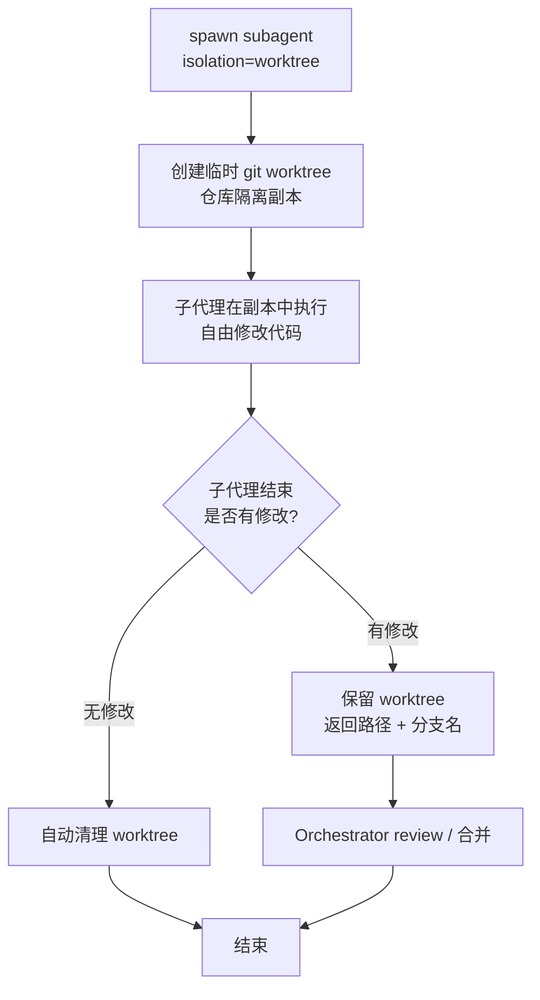

### 8.4 Worktree 隔离解决的核心问题

Worktree 隔离直接解决了**多 agent 并发修改同一代码库的冲突问题**。

没有 Worktree 隔离时，三个子代理并发改代码：

```
   ┌──────────────────────────────────────────┐
   │           共享工作区（冲突！）             │
   │   Agent A 改 file1.js ─┐                  │
   │   Agent B 改 file1.js ─┼→ 互相覆盖         │
   │   Agent C 改 file2.js ─┘   状态混乱         │
   └──────────────────────────────────────────┘
```

有了 Worktree 隔离，三个子代理在各自副本改代码：

```
   ┌───────────────┐ ┌───────────────┐ ┌───────────────┐
   │ worktree A     │ │ worktree B     │ │ worktree C     │
   │ 分支 feat-A    │ │ 分支 feat-B    │ │ 分支 feat-C    │
   │ Agent A 改代码 │ │ Agent B 改代码 │ │ Agent C 改代码 │
   └───────┬───────┘ └───────┬───────┘ └───────┬───────┘
           └─────────────────┼─────────────────┘
                             ▼
                   Orchestrator 逐个 review 分支
                   按需合并（可控地解决冲突）
```

隔离之后，冲突从"执行时的混乱覆盖"转变为"合并时的可控处理"。Git 的分支合并机制成熟可靠，Orchestrator 可以逐个 review 每个子代理的分支，有序地合并，冲突在合并阶段被显式地暴露和解决，而不是在执行阶段被隐式地掩盖。

### 8.5 Worktree 生命周期的伪代码

```python
def spawn_with_worktree(subagent_type, brief, repo_path):
    # 1. 创建临时 worktree（仓库隔离副本）
    branch = f"agent/{generate_id()}"
    worktree_path = f"/tmp/wt-{generate_id()}"
    git(f"worktree add -b {branch} {worktree_path}", cwd=repo_path)

    # 2. 子代理在隔离副本中执行
    agent = Subagent(subagent_type, prompt=brief, cwd=worktree_path)
    result = agent.run()

    # 3. 结束时判定是否有修改
    has_changes = git_has_uncommitted_or_committed_changes(worktree_path, branch)

    if not has_changes:
        # 无修改 → 自动清理
        git(f"worktree remove {worktree_path}", cwd=repo_path)
        git(f"branch -D {branch}", cwd=repo_path)
        return {"result": result, "worktree": None}
    else:
        # 有修改 → 保留并返回路径与分支名
        return {
            "result": result,
            "worktree_path": worktree_path,
            "branch": branch,
        }
```

### 8.6 Worktree 隔离的适用与不适用

**适用场景：**

- 多个子代理需要并发修改同一代码库；
- 想让某个子代理的代码改动"可试错"——如果它改错了或没改，能干净地丢弃；
- 需要对每个子代理的改动做独立的 review 和合并。

**不适用/需谨慎的场景：**

- 子代理只做读取、不做修改（此时 worktree 隔离的开销大于收益，纯读探索可以只用上下文隔离）；
- 子任务之间有强顺序依赖，后一个必须基于前一个的改动（此时并行 worktree 反而带来合并复杂度）；
- 仓库极其巨大且 worktree 创建成本高（虽然 worktree 共享对象数据库，但 checkout 大量文件仍有 I/O 成本）。

### 8.7 上下文隔离与执行隔离的组合

在实践中，"上下文隔离"和"执行隔离（Worktree）"是两个正交的维度，可以自由组合：

| 上下文隔离 | 执行隔离（Worktree） | 适用场景 |
|-----------|---------------------|---------|
| 有 | 无 | 纯探索/调研任务（读代码、查资料） |
| 有 | 有 | 并发修改代码的工程任务 |
| 无 | 无 | 简单任务，主 Agent 直接处理 |
| 无 | 有 | 较少见（一般修改代码也希望隔离上下文） |

最常见的组合是前两种：**探索型任务用"上下文隔离 + 无 Worktree"，工程型任务用"上下文隔离 + Worktree"。** 这两种隔离机制协同工作，分别守护了信息层面和执行层面的边界。


---

## 九、并行执行与冲突解决

### 9.1 并行执行的价值与前提

并行执行是多 Agent 系统相较单体 Agent 最直观的性能优势。当一个任务包含多个相互独立的工作项时，把它们分配给多个子代理并行处理，可以把总耗时从"各工作项耗时之和"压缩到"各工作项耗时的最大值"。

并行执行的前提是"独立性"。CatDesk 明确指出，必须 spawn 子代理做并行化的场景是：**有两个或更多独立的工作项，每项可能涉及多步操作。** 这里的关键词是"独立"——只有真正独立的工作项才适合并行，否则并行反而会引入协调成本。

### 9.2 判断工作项是否独立

判断工作项是否独立，可以从三个维度考察：

1. **数据独立性**：工作项 A 是否需要工作项 B 的产出作为输入？如果需要，它们之间存在数据依赖，不能完全并行。

2. **资源独立性**：工作项是否会争抢同一资源（同一文件、同一数据库、同一端口）？如果会，需要资源隔离（如 Worktree）或串行化。

3. **逻辑独立性**：工作项的成败是否会影响其他工作项的意义？例如"先验证方案可行性，再实现方案"——如果验证失败，实现就没有意义，二者逻辑上有依赖。

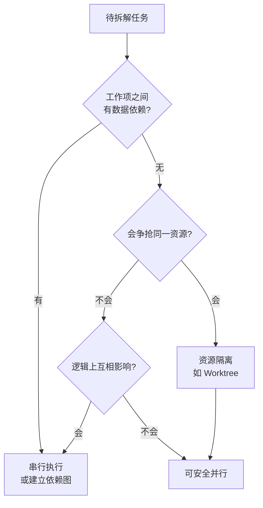

### 9.3 并行执行的调度模式

并行执行有几种典型的调度模式：

**模式一：纯并行（Fan-out / Fan-in）。**

所有子任务完全独立，同时 spawn，各自执行，全部完成后统一聚合。这是最简单也最高效的模式。

```
              ┌─→ Agent A ─┐
Orchestrator ─┼─→ Agent B ─┼─→ 聚合 → 结果
              └─→ Agent C ─┘
```

**模式二：分批并行（Batched Parallel）。**

当子任务数量很多、或存在资源约束时，不能一次性 spawn 所有子代理，而是分批进行。这需要背压机制控制并发度。

```
批次 1: [A, B, C] 并行 → 完成
批次 2: [D, E, F] 并行 → 完成
批次 3: [G, H]    并行 → 完成
```

**模式三：带依赖的并行（DAG 调度）。**

子任务之间存在部分依赖，形成一个有向无环图（DAG）。调度器按拓扑顺序执行：没有依赖的可以并行，有依赖的等待前置完成。这种模式将在第十四章 Pipeline 编排中详细展开。

```
      A ──→ C
            ↑
      B ────┘ ──→ D
   A、B 无依赖可并行；C 等 A、B；D 等 C
```

### 9.4 冲突的类型

多 Agent 并行执行时，可能产生几类冲突：

| 冲突类型 | 描述 | 典型场景 |
|---------|------|---------|
| 写-写冲突 | 多个子代理修改同一资源 | 并发改同一文件 |
| 读-写冲突 | 一个子代理读，另一个写同一资源 | 读配置时被另一 agent 改写 |
| 资源争抢 | 多个子代理争夺有限资源 | 争同一端口、同一锁 |
| 逻辑冲突 | 产出互相矛盾 | 两个 agent 对同一问题给出相反结论 |

### 9.5 冲突解决策略

针对不同冲突，有不同的解决策略：

**策略一：隔离（避免冲突）。**

这是最优先的策略——通过隔离从根本上避免冲突。对于代码修改，用 Worktree 隔离，让每个子代理在独立副本上工作，写-写冲突和读-写冲突都不会在执行阶段发生，只在合并阶段以可控方式处理。

**策略二：资源分区（Partition）。**

把资源按子代理分区，每个子代理只操作自己分区内的资源。例如让子代理 A 只负责 `module_a/` 目录，子代理 B 只负责 `module_b/` 目录，从任务拆解阶段就避免了资源重叠。

**策略三：串行化关键区（Serialize Critical Section）。**

对于无法隔离、无法分区的共享资源，退回到串行化——用锁或队列保证同一时刻只有一个子代理操作它。这会牺牲部分并行度，但保证正确性。

**策略四：Orchestrator 仲裁（Arbitration）。**

对于逻辑冲突（子代理产出矛盾），由 Orchestrator 作为仲裁者判断。Orchestrator 审视矛盾的产出，可能选择其一、综合二者、或 spawn 新的子代理进一步调查。这体现了 Orchestrator "业务线大老板"的决策职责。

### 9.6 并行执行的伪代码

```python
def parallel_execute_with_conflict_handling(task, repo_path):
    subtasks = decompose(task)

    # 1. 依赖分析，构建 DAG
    dag = build_dependency_dag(subtasks)

    # 2. 冲突预防：为需要改代码的子任务分配隔离 worktree
    for st in subtasks:
        if st.modifies_code:
            st.isolation = "worktree"
        # 资源分区：确保各子任务操作的路径不重叠
        assert_no_path_overlap(subtasks)

    # 3. 按拓扑批次并行执行
    results = {}
    for batch in topological_batches(dag):
        # 同一批次内的子任务无依赖，可并行 spawn
        agents = [spawn_subagent(st.type, st.brief, isolation=st.isolation)
                  for st in batch]
        batch_results = await_all(agents)  # Fan-in
        for st, r in zip(batch, batch_results):
            results[st.id] = r

    # 4. 逻辑冲突仲裁
    if has_logical_conflicts(results):
        results = orchestrator_arbitrate(results)

    # 5. 合并 worktree 分支（可控解决写冲突）
    for st in subtasks:
        if st.isolation == "worktree" and results[st.id].has_changes:
            merge_branch(results[st.id].branch, repo_path)  # review + merge

    return aggregate(results)
```

### 9.7 并行度的权衡

并行度不是越高越好。过高的并行度会带来几个问题：

- **资源耗尽**：过多子代理同时运行，可能耗尽内存、CPU、API 配额。
- **协调开销激增**：子代理越多，简报、监控、聚合的开销越大。
- **收益递减**：如果子任务本身很短，spawn 和聚合的固定开销可能超过并行节省的时间。

因此，调度层需要背压机制，动态控制并发度。一个合理的策略是：设置最大并发子代理数，超过阈值时新的子任务排队等待，直到有子代理完成释放资源。

```
最大并发数 = 3 的背压示例:

时刻 t0:  [A running] [B running] [C running]  | 队列: D, E
时刻 t1:  A 完成 → [B running] [C running] [D running]  | 队列: E
时刻 t2:  C 完成 → [B running] [D running] [E running]  | 队列: 空
```

### 9.8 并行执行的可观测性

并行执行了多个子代理后，Orchestrator 需要清晰地掌握每个子代理的状态。这要求调度层提供良好的可观测性：

- 每个子代理有一个简短的 `description`（3-5 字），便于在监控界面识别它在做什么；
- 每个子代理有明确的状态（running / completed / failed / terminated）；
- 每个子代理有 ID，便于通过 SendMessage 定向恢复；
- 聚合时能追溯每个结论来自哪个子代理。

良好的可观测性是并行执行"可控"的前提——只有看得清，才能管得住。


---

## 十、Subagent 类型体系

### 10.1 为什么需要类型体系

在多 Agent 系统中，并非所有子代理都一样。不同的任务需要不同"专长"的子代理——就像一个团队里有调研员、工程师、架构师，各有所长。Subagent 类型体系就是把这种"专长"制度化：预定义若干种类型，每种类型有其擅长的任务、配置好的工具集和行为倾向。

类型体系带来的好处：

- **调度更精准**：Orchestrator 可以根据子任务性质选择最合适的类型。
- **能力更聚焦**：每种类型的子代理专注于其擅长的领域，行为更可预测。
- **配置可复用**：类型封装了工具集、prompt 模板等配置，避免重复定义。

### 10.2 三种核心类型

CatDesk 提供三种核心的 Subagent 类型：

#### 10.2.1 general-purpose（通用型）

**定位**：通用代理，用于研究复杂问题、搜索代码、执行多步任务。

general-purpose 是最"全能"的类型。当任务复杂、涉及多个步骤、或者不确定该用哪种专门类型时，general-purpose 是安全的默认选择。它能够：

- 研究复杂的、开放性的问题；
- 搜索代码；
- 执行多步骤的任务。

**典型场景**：一个需要"先搜索、再分析、再验证、再总结"的复合型任务，交给 general-purpose 子代理，让它在独立上下文中把整个链条走完，只回传最终结论。

#### 10.2.2 Explore（探索型）

**定位**：快速探索代码库，按 pattern 搜索文件、搜索关键词。

Explore 是为"代码库探索"高度优化的类型。它的特点是**快**——专注于快速定位，而不做深入的推理和修改。它擅长：

- 按文件名 pattern 搜索文件（如 `src/components/**/*.tsx`）；
- 按关键词搜索代码内容（如查找所有 API 端点）；
- 回答关于代码库结构的问题（如"API 端点是如何工作的？"）。

**探索的彻底程度**：Explore 类型通常支持指定探索的"彻底程度"，例如：

- `quick`：基础搜索，快速给出初步结果；
- `medium`：适度探索，覆盖多个相关位置；
- `very thorough`：全面分析，跨多个位置和命名约定进行彻底搜索。

**典型场景**：Orchestrator 想快速了解"这个项目的鉴权逻辑在哪里"，spawn 一个 Explore 子代理，指定 `medium` 彻底程度，让它快速定位并回传相关文件路径，而不消耗主上下文。

#### 10.2.3 Plan（规划型）

**定位**：软件架构师代理，用于设计实现计划。

Plan 是扮演"软件架构师"角色的类型。当任务需要**先设计、后实现**时，Plan 子代理负责产出实现计划。它擅长：

- 为一个任务设计分步骤的实现计划；
- 识别关键文件；
- 权衡架构上的取舍（trade-offs）。

**典型场景**：面对一个较大的功能开发需求，Orchestrator 先 spawn 一个 Plan 子代理，让它产出"这个功能应该怎么实现、涉及哪些文件、有哪些架构决策"的计划，然后再据此拆解出若干工程型子任务并行实现。

### 10.3 三种类型的对比

| 维度 | general-purpose | Explore | Plan |
|------|-----------------|---------|------|
| 定位 | 通用多步任务 | 快速代码库探索 | 架构设计/规划 |
| 是否修改代码 | 可能 | 通常不修改（只读探索） | 不修改（只产计划） |
| 输出形态 | 任务结果 | 文件/关键词定位结果 | 实现计划 + 关键文件 + 取舍 |
| 速度取向 | 均衡 | 快 | 深思 |
| 典型用途 | 复合型任务 | "这个东西在哪" | "这个东西该怎么做" |

### 10.4 类型选择的决策流程

Orchestrator 在拆解出子任务后，需要为每个子任务选择合适的类型。决策流程可以用一张流程图表示：

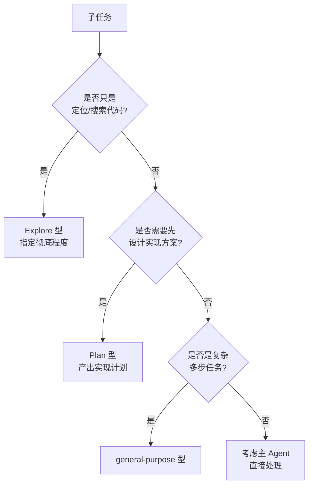

### 10.5 自定义类型

除了三种核心类型，多 Agent 系统还支持**自定义类型**——针对特定领域或特定工作流，定义专门的子代理类型。

回到第一章 Agent Swarms 的愿景：有的 Agent 专注 Research，有的负责 Engineering，有的处理 Marketing。这些"角色化"的 Agent，本质上就是自定义类型。在研发全生命周期自动化中（详见第十四、十九章），我们会看到大量高度专门化的自定义类型，例如：

- `requirements-analyst`：需求分析师，将模糊需求转化为结构化 PRD；
- `evaluate-requirements`：技术可行性评估师；
- `pipeline-services-analyst`：服务仓库判定师，判断需求涉及哪些服务仓库；
- `technology-plan-reviewer`：技术方案架构评审师；
- `using-git-worktrees`：Worktree 管理师，基于 feature 分支创建隔离工作副本。

自定义类型的定义通常包括：

```yaml
custom_subagent_type:
  name: "requirements-analyst"
  description: "将模糊需求转化为结构化 PRD"
  system_prompt: |
    你是一名资深需求分析师。你的职责是把用户提供的模糊、口语化的需求，
    转化为结构化的产品需求文档（PRD），包括：背景、目标、功能点、
    验收标准、边界与约束……
  tools:                       # 该类型可用的工具集
    - read_file
    - grep
    - km_search               # 知识库搜索
  output_schema: PRD           # 结构化产出的 schema
```

### 10.6 类型体系与能力空间的关系

需要注意，"类型"决定的是子代理的**行为倾向和默认工具集**，而"能力空间"（详见第十二章）决定的是子代理**理论上能使用的工具边界**。二者是不同层面的概念：

- 类型是"角色设定"——它建议子代理该怎么行动、默认给它哪些工具。
- 能力空间是"权限边界"——它决定子代理最多能触碰哪些能力（BrowserUse、Skills、MCP 等）。

在"subagent as a first class agent citizen"的设计下，即便是专门化的自定义类型，理论上也能获得与主代理对等的完整能力空间——类型只是在这个完整空间中，为特定任务选取了合适的默认配置。

---

## 十一、强化学习驱动的 Subagent 调度优化

### 11.1 从"prompt 拼凑"到"可训练能力"

在多 Agent 系统的早期实践中，"调度子代理"这件事主要靠 prompt 工程：在系统提示里写一大段"什么时候该 spawn 子代理""该怎么写简报"的规则，寄希望于模型能照做。这种方式的问题是脆弱、不稳定、难以持续改进。

CatDesk 的模型侧设计方向明确提出了一个更根本的思路：**Subagent 的调用将被正式纳入强化学习（RL）流程，成为模型能力进化的核心组成部分。**

这意味着"调度子代理"从一项靠 prompt 临时约束的行为，升级为一项被系统性训练和优化的**核心能力**。模型通过大量的训练样本和奖励信号，学会在合适的时机、以合适的方式调度子代理，而不是靠外部规则去约束。

### 11.2 三个关键指标

RL 训练过程中，重点优化三个关键指标。这三个指标构成了一个从"微观调用"到"宏观结果"的完整奖励信号链条。

```
   微观 ─────────────────────────────────────→ 宏观
   ┌─────────────────────┐ ┌──────────────────┐ ┌──────────────────┐
   │ instantiation reward │ │ sub-agent        │ │ task-level        │
   │ 子代理调用奖励       │ │ finish rate      │ │ outcome           │
   │                      │ │ 子代理完成率     │ │ 任务整体完成水平  │
   │ "调用得对不对"       │ │ "子任务做没做成" │ │ "整体好不好"      │
   └─────────────────────┘ └──────────────────┘ └──────────────────┘
```

#### 11.2.1 instantiation reward（子代理调用奖励）

这个指标关注的是**调用行为本身**——模型是否在**合适的时机**、以**合适的方式**实例化（instantiate）了子代理。

它奖励的行为包括：

- 在真正需要并行化或上下文隔离时才 spawn 子代理（而不是滥用或漏用）；
- 为子代理选择了正确的类型；
- 给子代理写了高质量、自包含的简报；
- 合理地设置了隔离（如该用 Worktree 时用了 Worktree）。

它惩罚的行为包括：

- 在不该 spawn 时 spawn（增加了无谓的编排开销）；
- 在该 spawn 时不 spawn（错失了并行/隔离的收益）；
- 简报质量差，导致子代理无法正确理解任务；
- 类型选择错误。

instantiation reward 本质上是在训练模型的"调度判断力"——什么时候该动用子代理这个工具，以及怎么用好它。

#### 11.2.2 sub-agent finish rate（子代理任务完成率）

这个指标关注**子任务层面的成败**——被调用的子代理是否成功完成了分配给它的任务。

它是一个更"结果导向"的指标。即便 Orchestrator 的调用时机和简报都很好（instantiation reward 高），如果子代理最终没能完成任务（finish rate 低），整个协作依然是失败的。

sub-agent finish rate 的反馈会同时作用于两端：

- **对 Orchestrator**：如果某种简报方式总是导致子代理完不成任务，模型会学会调整简报策略。
- **对子代理自身**：子代理也会通过这个信号学会更可靠地完成任务。

#### 11.2.3 task-level outcome（任务整体完成水平）

这个指标关注**最顶层的结果**——整个任务（主 Agent + 所有子代理协作）最终的完成质量。

这是最重要、也最"宏观"的指标。它回答的问题是："不管中间过程如何，用户交代的整体目标，最终有没有高质量地达成？"

task-level outcome 是最终的"北极星指标"。前两个指标（instantiation reward、sub-agent finish rate）都是过程性、局部性的，它们服务于 task-level outcome。有可能出现这种情况：单个子代理的调用很完美、完成率也高，但由于任务拆解本身有问题，最终整体结果并不好。task-level outcome 就是用来捕捉这种"局部最优但全局不优"的情况。

### 11.3 三个指标的协同关系

三个指标不是孤立的，而是层层递进、相互制衡的：

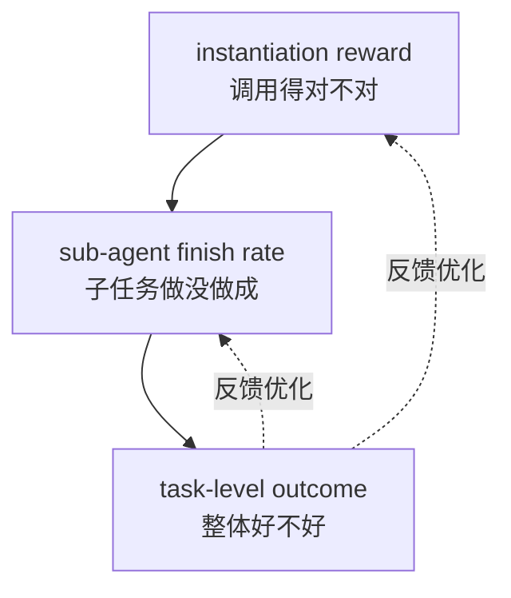

- instantiation reward 是**前提**：调用得对，才有可能做成。
- sub-agent finish rate 是**中间结果**：子任务都做成了，整体才有可能好。
- task-level outcome 是**最终目标**：一切优化都服务于它。

同时，task-level outcome 会反向校准前两个指标——如果发现"调用很规范、子任务也都完成了，但整体结果不好"，说明模型在更高层的任务拆解上有问题，需要调整。

### 11.4 RL 训练的概念性流程

下面用伪代码勾勒 RL 驱动子代理调度优化的概念性流程（仅示意，非真实训练代码）：

```python
def rl_training_step(task_sample):
    # 1. 模型执行一次完整的多 Agent 协作
    trajectory = model.run_with_subagents(task_sample)

    # 2. 计算三个层面的奖励
    r_instantiation = eval_instantiation_quality(trajectory)
    #   评估：调用时机、类型选择、简报质量、隔离设置

    r_finish = eval_subagent_finish_rate(trajectory)
    #   评估：各子代理是否完成分配的任务

    r_outcome = eval_task_level_outcome(trajectory, task_sample.goal)
    #   评估：整体目标是否高质量达成

    # 3. 组合奖励（task-level 权重最高，作为北极星）
    reward = (
        w1 * r_instantiation +
        w2 * r_finish +
        w3 * r_outcome        # w3 最大
    )

    # 4. 用组合奖励更新模型策略
    model.update_policy(trajectory, reward)
```

### 11.5 RL 优化的目标：从被动生成到主动调度

CatDesk 对模型侧 RL 优化的终极目标有一句精辟的概括：

> **大模型不再只是被动生成内容，而是学会主动、聪明地调度和协作多个子代理。**

这句话点出了 RL 优化带来的**角色跃迁**：

| 阶段 | 模型的角色 | 核心能力 |
|------|-----------|---------|
| 传统 LLM | 内容生成器 | 根据 prompt 生成文本 |
| 工具调用 LLM | 工具使用者 | 调用工具完成任务 |
| RL 优化后 | 智能组织者 | 主动、聪明地调度协作子代理 |

"主动"意味着模型不是被动等待外部规则告诉它何时 spawn 子代理，而是自己判断；"聪明"意味着它的调度决策是经过 RL 优化的、高质量的。这正是 Agent Swarms 愿景中"完全由 Agent 自主决策"的技术基础。

### 11.6 RL 优化与工程稳定性的互补

需要强调，RL 优化（模型侧）与工程稳定性（工程侧）是互补的，缺一不可：

- RL 让模型"想得对"——知道何时、如何调度子代理。
- 工程让系统"跑得稳"——保证被调度的子代理能稳定、安全地运行。

如果只有 RL 而没有稳定的工程架构，模型再聪明也会被不稳定的基础设施拖垮；如果只有稳定的工程而没有 RL 优化，系统就只能靠脆弱的 prompt 规则来驱动调度。二者结合，才能实现"双轮驱动"的进化。


---

## 十二、子代理的能力空间（Subagent as First Class Agent Citizen）

### 12.1 "一等公民"的设计取向

CatDesk 工程侧的第二个重点，是一个极具分量的设计取向：**让子代理和主代理拥有同样的能力空间——subagent as a first class agent citizen（子代理作为一等公民）。**

要理解这个取向的意义，先看它要解决的问题。

在很多早期的多 Agent 实现中，子代理是"二等公民"：它们被限制在主代理工具集的一个**受限子集**里。典型的限制包括：

- 子代理不能使用浏览器（无法上网查资料、无法操作 Web 应用）；
- 子代理不能加载 Skills（无法复用封装好的领域能力）；
- 子代理不能接入 MCP（无法调用外部服务和工具）；
- 子代理甚至不能再 spawn 下一级子代理。

这些限制带来的后果是：**任务拆分受制于能力差异。** Orchestrator 想把一个"需要上网查资料 + 操作 Web 应用"的子任务交给子代理，却发现子代理没有浏览器能力，只好自己做——于是上下文隔离的好处就丧失了。

### 12.2 一等公民意味着什么

"subagent as a first class agent citizen"意味着子代理拥有与主代理**同等的能力空间**。具体包括：

- **BrowserUse**：子代理可以像主代理一样使用浏览器，进行网页导航、表单填写、数据提取、Web 应用测试等。
- **Skills**：子代理可以加载和使用与主代理相同的 Skills（封装好的领域能力）。
- **MCP**：子代理可以接入 MCP（Model Context Protocol）服务，调用外部工具和服务。
- 以及主代理拥有的其他能力（文件操作、命令执行、代码搜索等）。

```
       主代理能力空间                     子代理能力空间
   ┌──────────────────────┐          ┌──────────────────────┐
   │ · 文件/命令/搜索      │          │ · 文件/命令/搜索      │
   │ · BrowserUse         │   ===    │ · BrowserUse         │
   │ · Skills             │  对等    │ · Skills             │
   │ · MCP                │          │ · MCP                │
   │ · spawn 子代理        │          │ · spawn 子代理        │
   └──────────────────────┘          └──────────────────────┘
        first class citizen               first class citizen
```

### 12.3 能力对等带来的自由度

能力对等最大的价值，是**解放了任务拆分的自由度**。当子代理拥有与主代理相同的能力时，Orchestrator 在拆解任务时不再需要考虑"这个子任务子代理能不能做"——答案永远是"能"。这带来几个直接好处：

1. **任意任务都可外包**：任何主代理能做的事，都能交给子代理做，从而享受上下文隔离和并行的好处。

2. **递归组织成为可能**：既然子代理能 spawn 下一级子代理，就可以构建多层的层次化编排（第二章提到的 Hierarchical 形态）。一个子代理在处理复杂子任务时，可以进一步拆解，扮演"次级 Orchestrator"。

3. **专门化不牺牲能力**：即便定义了高度专门化的自定义类型（如需求分析师），它底层仍拥有完整的能力空间，只是被配置为专注于特定任务。

### 12.4 能力空间与类型的分层

第十章末尾提到，"类型"与"能力空间"是不同层面的概念。这里进一步阐明它们的分层关系：

```
┌─────────────────────────────────────────────────────┐
│  Layer 3: 类型配置层（角色设定）                       │
│  例：requirements-analyst 默认只用 read/grep/km_search │
└──────────────────────────┬──────────────────────────┘
                           │ 在下层能力空间中选取默认配置
┌──────────────────────────▼──────────────────────────┐
│  Layer 2: 能力空间层（一等公民，与主代理对等）          │
│  BrowserUse | Skills | MCP | 文件/命令/搜索 | spawn    │
└──────────────────────────┬──────────────────────────┘
                           │ 受下层沙箱约束
┌──────────────────────────▼──────────────────────────┐
│  Layer 1: 沙箱权限层（安全边界，详见第十三章）          │
│  工具网络权限 | 文件系统边界 | 资源限制                │
└─────────────────────────────────────────────────────┘
```

- **能力空间层**决定了子代理"理论上能用什么"——一等公民享有完整能力。
- **类型配置层**在能力空间中为特定角色"选取默认用什么"。
- **沙箱权限层**则对能力空间施加"实际允许用到什么程度"的安全约束。

三层协同：能力空间保证"可以做"，类型保证"倾向于做对的事"，沙箱保证"不会做危险的事"。

### 12.5 能力对等的工程挑战

让子代理成为一等公民，在工程上并不轻松。主要挑战包括：

1. **资源放大**：如果每个子代理都拥有完整能力（包括浏览器实例、MCP 连接等），大量并发子代理会带来巨大的资源消耗。这要求调度层有精细的资源管理和背压。

2. **能力初始化成本**：完整能力空间的初始化（启动浏览器、建立 MCP 连接、加载 Skills）有固定开销。对于短生命周期的子代理，这个开销可能不划算，需要按需懒加载。

3. **安全放大**：子代理拥有的能力越强（尤其是网络和 spawn 能力），潜在的安全风险越大。这正是为什么能力对等**必须**与沙箱机制配套（详见第十三章）。

4. **递归失控**：子代理能 spawn 子代理，若无限制可能导致递归爆炸。需要限制递归深度和总子代理数。

### 12.6 能力对等的伪代码示意

```python
class Subagent:
    def __init__(self, subagent_type, prompt, sandbox_policy):
        self.type = subagent_type
        self.prompt = prompt
        # 一等公民：默认拥有与主代理对等的完整能力空间
        self.capabilities = FullCapabilitySpace(
            browser_use=True,
            skills=load_all_skills(),
            mcp=connect_mcp_servers(),
            file_ops=True,
            shell=True,
            can_spawn_subagents=True,   # 支持递归组织
        )
        # 类型配置：在完整能力中选取默认工具集
        self.default_tools = subagent_type.default_tools
        # 沙箱约束：实际使用受权限边界限制
        self.sandbox = sandbox_policy

    def invoke_capability(self, capability, args):
        # 1. 能力空间检查（理论上是否具备）
        if not self.capabilities.has(capability):
            raise CapabilityNotAvailable(capability)
        # 2. 沙箱检查（实际是否允许）
        if not self.sandbox.allows(capability, args):
            raise SandboxDenied(capability, args)
        # 3. 递归深度检查
        if capability == "spawn" and self.depth >= MAX_DEPTH:
            raise RecursionLimitExceeded()
        return self.capabilities.execute(capability, args)
```

---

## 十三、沙箱机制与安全边界

### 13.1 为什么沙箱是能力对等的前提

第十二章反复强调：能力对等**必须**与沙箱机制配套。这是因为，当子代理拥有强大的能力（网络访问、代码修改、命令执行、spawn 子代理）时，如果没有安全边界，一个失控或被误导的子代理可能造成严重后果——删除重要文件、泄露敏感数据、发起危险的网络请求、无限 spawn 耗尽资源。

因此，CatDesk 工程侧的第三个重点是：**建立完整的子代理运行沙箱机制，支持细颗粒度的工具网络权限设置、Worktree 能力等。**

沙箱机制的核心理念是"能力对等，但受控"——子代理可以拥有完整的能力空间，但每一次实际的能力使用都要经过沙箱的审查和约束。

### 13.2 沙箱的三个维度

CatDesk 的沙箱机制包含三个维度：

```
┌──────────────────────────────────────────────────────────┐
│                      Subagent 沙箱                          │
│                                                            │
│  ┌──────────────────┐  ┌──────────────────┐              │
│  │ 维度一：           │  │ 维度二：          │              │
│  │ 细颗粒度工具       │  │ Worktree 能力     │              │
│  │ 网络权限设置       │  │ （代码隔离副本）  │              │
│  └──────────────────┘  └──────────────────┘              │
│  ┌──────────────────────────────────────────┐            │
│  │ 维度三：资源与文件系统边界                 │            │
│  └──────────────────────────────────────────┘            │
└──────────────────────────────────────────────────────────┘
```

#### 13.2.1 维度一：细颗粒度的工具网络权限设置

这个维度控制子代理**能访问哪些网络资源、能使用哪些工具**。"细颗粒度"意味着权限不是"全开或全关"的粗暴二选一，而是可以精确到：

- 哪些子代理可以访问网络，哪些不能；
- 允许访问哪些域名/端点，禁止访问哪些；
- 允许使用哪些工具（读、写、执行、浏览器、MCP……），禁止哪些。

例如，一个"纯调研"的子代理，可能只被允许访问特定的文档站点，禁止执行任何写操作和命令；而一个"工程实现"的子代理，可能被允许修改代码（在 Worktree 里）和执行测试命令，但禁止访问外部网络。

```yaml
# 细颗粒度工具网络权限示例
sandbox_policy:
  subagent_type: "research"
  network:
    allow_domains: ["docs.internal.example", "api.reference.example"]
    deny_all_others: true
  tools:
    allow: ["read_file", "grep", "web_fetch"]
    deny: ["write", "shell", "delete_file"]
---
sandbox_policy:
  subagent_type: "engineering"
  network:
    deny_all: true                # 工程子代理禁止外部网络
  tools:
    allow: ["read_file", "write", "shell", "grep"]
    deny: ["delete_file"]
  filesystem:
    scope: "worktree_only"        # 只能在自己的 worktree 内操作
```

#### 13.2.2 维度二：Worktree 能力

Worktree 能力（第八章已详述）是沙箱机制的重要组成部分。它为子代理的**代码修改**提供了执行隔离——子代理在一个独立的 Git 工作副本中修改代码，无法影响主工作区和其他子代理的工作区。

从沙箱的视角看，Worktree 的意义在于：

- **限定写入范围**：子代理的所有文件修改都被限制在它的 worktree 内。
- **可回滚**：如果子代理改错了，直接丢弃它的 worktree 即可，主工作区毫发无损。
- **可审计**：子代理的所有改动都体现在它的分支上，Orchestrator 可以完整 review。

#### 13.2.3 维度三：资源与文件系统边界

第三个维度限制子代理的**资源占用和文件访问范围**：

- **文件系统边界**：限制子代理能读写的目录范围（如上例中的 `scope: worktree_only`）。
- **资源限制**：限制子代理的 CPU、内存、执行时间、API 调用配额等。
- **递归限制**：限制子代理 spawn 下级子代理的深度和总数，防止递归爆炸。

### 13.3 沙箱的权限检查流程

每一次子代理的能力使用，都要经过沙箱的检查。检查流程如下：

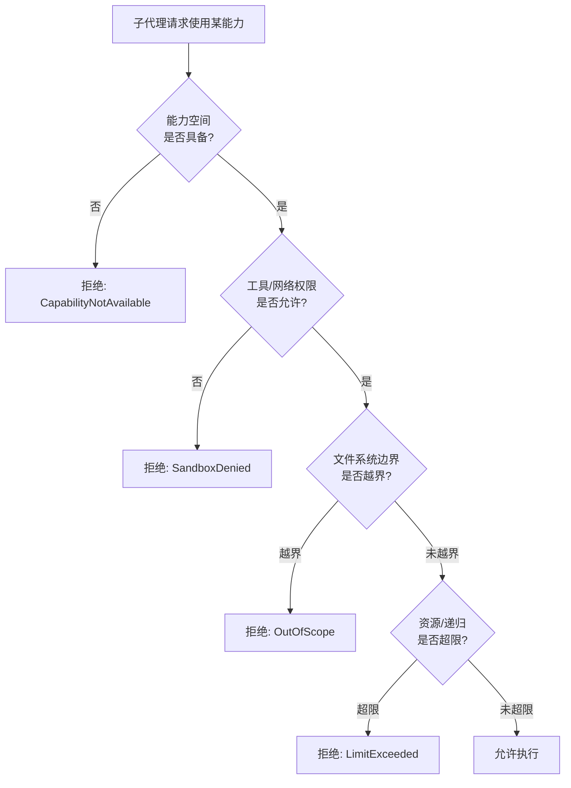

这个多层检查确保了：即便子代理"想"做某件危险的事，沙箱也会在实际执行前拦截。

### 13.4 沙箱策略的分级

沙箱策略通常按"信任级别"分级，不同信任级别的子代理适用不同的策略：

| 信任级别 | 网络 | 文件写入 | 命令执行 | 典型用途 |
|---------|------|---------|---------|---------|
| 只读探索 | 受限白名单 | 禁止 | 禁止 | Explore 类型、调研 |
| 受限工程 | 禁止外网 | 限 worktree | 白名单命令 | 代码实现 |
| 标准 | 白名单 | 限 worktree | 白名单命令 | general-purpose |
| 高信任 | 较宽松 | 较宽松 | 较宽松 | 特定受信任流程 |

分级的好处是：既能给需要强能力的子代理放权，又能对高风险操作严格约束，在"能力"和"安全"之间取得平衡。

### 13.5 沙箱与"最小权限原则"

沙箱设计应遵循经典的"最小权限原则"（Principle of Least Privilege）：**每个子代理只被授予完成其任务所必需的最小权限，不多给一分。**

这与"能力对等（一等公民）"看似矛盾，实则统一：

- **能力对等**说的是子代理"理论上具备"完整能力空间——这是能力的**上界**。
- **最小权限**说的是子代理"实际被授予"完成任务所需的最小权限——这是安全的**约束**。

二者的关系是：能力空间划定了可能性的边界，沙箱在这个边界内按最小权限原则收紧实际授权。一个调研子代理理论上"能"执行命令（能力对等），但沙箱按最小权限原则不给它命令执行权限（因为调研不需要），从而既保留了架构上的一致性，又保障了安全。

### 13.6 沙箱机制的伪代码

```python
class SandboxPolicy:
    def __init__(self, trust_level, task_needs):
        # 最小权限原则：从任务需求推导所需权限
        self.network_allow = derive_network_allowlist(task_needs)
        self.tools_allow = derive_tool_allowlist(task_needs)
        self.fs_scope = derive_fs_scope(task_needs)   # e.g. worktree_only
        self.resource_limits = derive_limits(trust_level)
        self.max_spawn_depth = derive_spawn_depth(trust_level)

    def allows(self, capability, args):
        if capability == "network":
            return self._check_network(args.url)
        if capability in ("write", "delete_file", "read_file"):
            return self._check_fs_scope(args.path)
        if capability == "shell":
            return args.command_head in self.tools_allow
        if capability == "spawn":
            return args.depth < self.max_spawn_depth
        return capability in self.tools_allow

    def _check_network(self, url):
        domain = extract_domain(url)
        return domain in self.network_allow

    def _check_fs_scope(self, path):
        return is_within(path, self.fs_scope)
```


---

## 十四、Pipeline 编排：声明式 DAG 的多 Agent 工作流

### 14.1 从自由编排到声明式编排

前面章节讨论的 Orchestrator-Worker 模型，是一种"自由编排"——Orchestrator 根据推理动态地决定 spawn 哪些子代理。这种模式灵活，但在生产环境中，我们往往需要更强的**可预测性和可靠性**，尤其是对于那些流程相对固定、需要反复执行的任务。

Pipeline AI Workflow 就是为此而生的一种编排范式。它是一个**研发全生命周期工作流自动化框架**。核心理念是：**把研发交付流程的每个阶段都变成可执行的自动化节点，通过声明式 DAG 串联成端到端的流水线。**

### 14.2 声明式 DAG 的核心概念

"声明式 DAG"包含两个关键词：

- **声明式（Declarative）**：开发者**声明**"要做什么"（有哪些阶段、阶段之间的依赖关系），而不是**命令式**地写"怎么一步步做"。流程的结构被显式地声明出来，而非隐含在代码逻辑里。

- **DAG（有向无环图，Directed Acyclic Graph）**：阶段之间的依赖关系构成一张有向无环图。有向表示"A 依赖 B"这样的方向性；无环表示不存在循环依赖（否则会死锁）。

DAG 的价值在于：它显式地表达了阶段之间的依赖，调度器可以据此自动决定哪些阶段可以并行、哪些必须串行，同时保证执行顺序的正确性。

```
声明式 DAG 示意（研发流水线）:

初始化 → 需求分析 → 技术方案 → 分支管理 → 编码实现 → 提交PR
                                                        │
                                                        ▼
交付报告 ← 自动化测试 ← 提测 ← 生成测试用例 ←────────────┘
```

### 14.3 研发全生命周期的十个阶段

Pipeline AI Workflow 把研发交付流程拆解为**十个阶段**，串联成一条端到端的流水线：


每个阶段的职责：

| 序号 | 阶段 | 核心职责 |
|------|------|---------|
| 1 | 初始化 | 准备流水线运行环境、加载配置 |
| 2 | 需求分析 | 将模糊需求转化为结构化 PRD |
| 3 | 技术方案 | 设计技术实现方案并评审 |
| 4 | 分支管理 | 创建隔离的开发分支/工作副本 |
| 5 | 编码实现 | 完成具体的代码开发 |
| 6 | 提交 PR | 提交代码变更、发起合并请求 |
| 7 | 生成测试用例 | 根据需求和实现生成测试用例 |
| 8 | 提测 | 触发测试流程 |
| 9 | 自动化测试 | 执行自动化测试 |
| 10 | 交付报告 | 汇总整个流程，生成交付报告 |

### 14.4 每个阶段由不同的 Sub-agent 执行

Pipeline 编排最关键的设计是：**每个阶段由不同的、专门化的 sub-agent 执行。** 这正是第十章讲的"自定义类型"的落地。

CatDesk 提供了一系列专门化的 sub-agent：

| Sub-agent | 所属阶段 | 职责 |
|-----------|---------|------|
| `requirements-analyst` | 需求分析 | 将模糊需求转化为结构化 PRD |
| `evaluate-requirements` | 需求分析 | 评估技术可行性 |
| `pipeline-services-analyst` | 需求分析/技术方案 | 判定需求涉及哪些服务仓库 |
| `technology-plan-reviewer` | 技术方案 | 对技术方案进行架构评审 |
| `using-git-worktrees` | 分支管理 | 基于 feature 分支创建隔离 Git Worktree |

我们逐一看看这些专门化子代理：

**`requirements-analyst`（需求分析师）**：接收用户提供的模糊、口语化需求，产出结构化的 PRD。它相当于把"用户想要什么"翻译成"工程上要做什么"。

**`evaluate-requirements`（可行性评估师）**：拿到 PRD 后，评估技术上是否可行、有哪些风险、需要多少工作量。它是流水线的"守门员"，避免不可行的需求进入后续昂贵的开发阶段。

**`pipeline-services-analyst`（服务仓库判定师）**：判定这个需求会涉及哪些服务仓库。在微服务架构下，一个需求往往横跨多个服务/仓库，准确判定影响范围是后续分支管理和编码的前提。

**`technology-plan-reviewer`（技术方案评审师）**：对技术方案进行架构层面的评审，检查方案是否合理、是否符合架构规范、有没有更优选择。这相当于第十章讲的 Plan 型子代理在流水线中的专门化应用。

**`using-git-worktrees`（Worktree 管理师）**：基于 feature 分支创建隔离的 Git Worktree。这正是第八章 Worktree 隔离机制在流水线中的落地——为编码阶段准备隔离的工作副本。

### 14.5 声明式 DAG 的配置示意

一个声明式的 Pipeline DAG 配置大致长这样（示意）：

```yaml
pipeline: dev-lifecycle
stages:
  - id: init
    agent: pipeline-init
    depends_on: []

  - id: requirements
    agent: requirements-analyst
    depends_on: [init]

  - id: feasibility
    agent: evaluate-requirements
    depends_on: [requirements]

  - id: services-scope
    agent: pipeline-services-analyst
    depends_on: [requirements]      # 与 feasibility 并行

  - id: tech-plan
    agent: technology-plan-reviewer
    depends_on: [feasibility, services-scope]  # 等两者都完成

  - id: branch
    agent: using-git-worktrees
    depends_on: [tech-plan]

  - id: coding
    agent: engineering
    isolation: worktree             # 编码在隔离副本中进行
    depends_on: [branch]

  - id: pr
    agent: pr-submitter
    depends_on: [coding]

  - id: testcases
    agent: testcase-generator
    depends_on: [pr]

  - id: submit-test
    agent: test-submitter
    depends_on: [testcases]

  - id: auto-test
    agent: auto-tester
    depends_on: [submit-test]

  - id: report
    agent: delivery-reporter
    depends_on: [auto-test]
```

在这个配置里，`feasibility` 和 `services-scope` 都只依赖 `requirements`，因此调度器会让它们**并行**执行；而 `tech-plan` 依赖二者，会等它们都完成后再执行。这就是声明式 DAG 的威力——依赖关系一旦声明，并行/串行的调度由框架自动完成。

### 14.6 声明式编排 vs 自由编排

Pipeline 的声明式编排，与前面章节的自由编排，各有适用场景：

| 维度 | 自由编排（Orchestrator 动态决策） | 声明式 DAG 编排 |
|------|----------------------------------|-----------------|
| 流程 | 动态、由推理驱动 | 固定、预先声明 |
| 灵活性 | 高 | 中（结构固定） |
| 可预测性 | 低 | 高 |
| 可靠性 | 依赖模型判断 | 由框架保障 |
| 适用任务 | 开放性、探索性任务 | 流程固定、反复执行的任务 |
| 调试 | 难 | 易（结构清晰） |

在实践中，二者常常结合：**用声明式 DAG 固定整体流程骨架，在每个阶段节点内部让专门化的子代理自由发挥。** 这就引出了下一章的"双层架构"。

### 14.7 DAG 调度的伪代码

```python
def run_pipeline(pipeline_config, inputs):
    dag = parse_dag(pipeline_config)
    results = {}
    completed = set()

    while len(completed) < len(dag.stages):
        # 找出所有依赖已满足、尚未执行的阶段
        ready = [s for s in dag.stages
                 if s.id not in completed
                 and all(dep in completed for dep in s.depends_on)]

        # 同一批 ready 的阶段可并行执行
        agents = []
        for stage in ready:
            stage_input = gather_inputs(stage, results)
            agent = spawn_subagent(
                subagent_type=stage.agent,
                prompt=build_stage_brief(stage, stage_input),
                isolation=stage.get("isolation"),
            )
            agents.append((stage, agent))

        # Fan-in：等待本批全部完成
        for stage, agent in agents:
            results[stage.id] = agent.await_result()
            completed.add(stage.id)

    return results["report"]   # 最终交付报告
```


---

## 十五、双层架构：脚本层与 AI 层的协作

### 15.1 双层架构的核心思想

上一章末尾提到，声明式 DAG 编排与自由编排常常结合使用。这种结合的具体实现，就是 Pipeline AI Workflow 的**双层架构**。

双层架构的核心思想是：**脚本层负责所有确定性逻辑，AI 层负责业务执行。两层通过结构化 JSON 通信。**

最关键的一条设计原则是：**AI 不自行判断流程走向，一切流转决策由脚本返回值驱动。**

这条原则解决了自由编排最大的痛点——不可预测性。在纯自由编排中，流程走向完全由 AI 的推理决定，一旦推理出错，流程就可能失控。双层架构把"流程走向"这个关乎可靠性的决策，从 AI 手中收回，交给确定性的脚本；而把"业务执行"这个需要智能的工作，交给 AI。各司其职，取长补短。

### 15.2 两层的职责划分

```
┌─────────────────────────────────────────────────────────────┐
│                        脚本层（确定性）                        │
│                                                               │
│  职责：                                                       │
│   · 定义并解析 DAG                                            │
│   · 决定下一步走哪个阶段（流转决策）                          │
│   · 校验 AI 层的产出（结构、完整性）                          │
│   · 管理状态、重试、错误处理                                   │
│   · 决定何时暂停等待人工确认                                   │
│                                                               │
│  特点：可预测、可测试、可靠                                   │
└────────────────────────────┬────────────────────────────────┘
                             │ 结构化 JSON 通信
                             │ （下发任务 / 回收产出）
                             ▼
┌─────────────────────────────────────────────────────────────┐
│                        AI 层（智能性）                         │
│                                                               │
│  职责：                                                       │
│   · 执行具体的业务任务（分析需求、写代码、评审……）           │
│   · 在单个阶段内自由发挥推理和工具调用能力                    │
│   · 产出结构化结果                                             │
│                                                               │
│  特点：灵活、智能，但不决定流程走向                           │
└─────────────────────────────────────────────────────────────┘
```

### 15.3 结构化 JSON 通信

两层之间通过**结构化 JSON** 通信。这是双层架构能够协作的关键接口。

**脚本层 → AI 层（下发任务）**：脚本层把当前阶段的任务、输入、约束打包成结构化 JSON，下发给 AI 层：

```json
{
  "stage": "requirements",
  "agent": "requirements-analyst",
  "input": {
    "raw_requirement": "用户希望能导出报表",
    "context": { "product": "报表系统", "existing_features": ["查看", "筛选"] }
  },
  "output_schema": {
    "type": "PRD",
    "required_fields": ["background", "goals", "features", "acceptance_criteria"]
  },
  "constraints": { "max_features": 10 }
}
```

**AI 层 → 脚本层（回收产出）**：AI 层执行完任务后，把结果也以结构化 JSON 返回：

```json
{
  "stage": "requirements",
  "status": "success",
  "output": {
    "type": "PRD",
    "background": "……",
    "goals": ["……"],
    "features": ["导出为 Excel", "导出为 PDF", "……"],
    "acceptance_criteria": ["……"]
  },
  "signals": { "needs_human_review": true, "confidence": 0.82 }
}
```

注意 AI 层返回的 `status` 和 `signals`——它们是 AI 层向脚本层报告"执行情况"的方式，但**最终怎么走，由脚本层根据这些信息决定**，AI 层不能自己跳到下一阶段。

### 15.4 流转决策由脚本返回值驱动

这一节详细阐释"AI 不自行判断流程走向，一切流转决策由脚本返回值驱动"这条核心原则。

在双层架构中，流程的每一次流转，都遵循这样的循环：

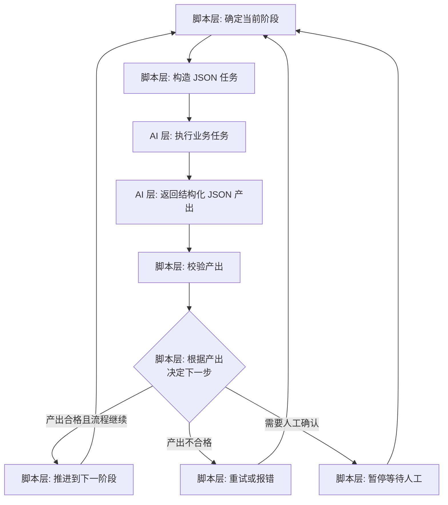

关键在于图中的节点 F——**决定下一步的是脚本层，不是 AI 层**。AI 层只是提供了"产出"和"信号"，脚本层根据这些信息和预定义的 DAG，做出确定性的流转决策。

这样设计的好处：

1. **流程可预测**：无论 AI 层如何发挥，流程骨架始终受脚本层控制，不会跑偏。
2. **可测试**：脚本层的流转逻辑是确定性的，可以用单元测试覆盖。
3. **可靠**：即便 AI 层某次产出异常，脚本层可以检测到并触发重试或报错，而不是让异常传播下去。
4. **职责清晰**：AI 专注于"把这个阶段的活干好"，不需要操心"下一步该干什么"。

### 15.5 双层架构的伪代码

```python
def dual_layer_pipeline(dag, initial_input):
    # 脚本层：主控循环
    state = PipelineState(dag, initial_input)

    while not state.is_complete():
        # 1. 脚本层确定当前阶段（确定性流转决策）
        stage = state.current_stage()

        # 2. 脚本层构造结构化 JSON 任务
        task_json = build_task_json(stage, state.gather_inputs(stage))

        # 3. 调用 AI 层执行（AI 只负责业务执行）
        result_json = ai_layer_execute(stage.agent, task_json)

        # 4. 脚本层校验产出（结构、完整性）
        if not validate_output(result_json, stage.output_schema):
            state.handle_retry_or_fail(stage)      # 脚本决定重试/报错
            continue

        # 5. 脚本层根据产出与信号，决定流转（AI 不参与）
        state.record(stage, result_json)
        if result_json["signals"].get("needs_human_review"):
            wait_for_human_confirmation(stage, result_json)  # 见第十六章
        state.advance()                            # 脚本推进到下一阶段

    return state.final_report()
```

### 15.6 双层架构与前述机制的关系

双层架构是一个"统筹性"的设计，它把前面章节的多个机制统一到一个框架下：

- **DAG 编排**（第十四章）由脚本层承载——DAG 就是脚本层"流转决策"的依据。
- **专门化子代理**（第十、十四章）由 AI 层承载——每个阶段的 sub-agent 就是 AI 层的执行者。
- **Worktree 隔离**（第八章）在需要的阶段（如编码）由脚本层触发、AI 层在隔离副本中执行。
- **人机协作节点**（第十六章）由脚本层在关键点插入。

可以说，双层架构是把"确定性的工程可靠性"与"智能性的业务灵活性"融合的最佳工程实践。

---

## 十六、人机协作节点设计

### 16.1 为什么需要人在回路

尽管 Agent Swarms 的愿景是"将人类介入降至最低"，但在当前阶段，**完全无人化并不现实，也不明智**。原因在于：

1. **决策的不可逆性**：某些决策（如合并代码到主干、发布上线、删除数据）一旦执行就难以撤销，风险极高。
2. **模型的不可靠性**：长链推理会累积误差，AI 在关键决策上仍可能出错。
3. **责任的归属**：在生产环境中，关键决策需要有人为其负责。
4. **上下文的局限**：某些决策需要 AI 无法获取的外部信息（业务判断、政治因素、临时情况）。

因此，一个成熟的多 Agent 系统需要精心设计**人机协作节点（Human-in-the-Loop）**——在关键处让人介入，其余处让 AI 自主。

### 16.2 关键验证节点的设计

在研发全生命周期自动化的实践中，系统在**16 个关键验证节点**暂停等待人工确认，关键决策由人把控。

"16 个关键验证节点"这个数字本身不是重点，重点是这个设计理念：**不是在每一步都让人确认（那样人机协作的效率还不如纯手工），而是精准地识别出流程中真正关键、高风险、不可逆的节点，只在这些节点上暂停。**

关键验证节点的典型分布（示意）：

```
初始化 ──[节点1: 确认需求范围]── 需求分析
   ──[节点2: 确认 PRD]── 技术方案
   ──[节点3: 确认技术方案]──[节点4: 确认服务影响范围]── 分支管理
   ──[节点5: 确认分支策略]── 编码实现
   ──[节点6~10: 确认关键代码改动]── 提交PR
   ──[节点11: 确认 PR 内容]── 生成测试用例
   ──[节点12: 确认测试用例]── 提测
   ──[节点13: 确认提测]── 自动化测试
   ──[节点14~15: 确认测试结果/异常处理]── 交付报告
   ──[节点16: 确认交付]── 完成
```

### 16.3 何处该设人工节点

判断一个节点是否应该设为人工确认节点，可以用几个标准：

| 标准 | 说明 | 示例 |
|------|------|------|
| 不可逆性 | 决策一旦执行难以撤销 | 合并主干、发布上线 |
| 高影响 | 决策影响范围大 | 确认服务影响范围 |
| 高不确定性 | AI 置信度低 | AI 报告 confidence < 阈值 |
| 需外部信息 | 决策需 AI 无法获取的信息 | 业务优先级判断 |
| 关键里程碑 | 阶段性成果的验收点 | 确认 PRD、确认技术方案 |

反过来，那些可逆的、低影响的、AI 高置信度的、纯技术性的操作（如在 worktree 里试改代码、执行只读的探索），则不需要人工节点，让 AI 自主进行。

### 16.4 人机协作节点的交互模式

人机协作节点的交互，通常由脚本层（第十五章）在流转决策时触发。当 AI 层返回的信号中包含 `needs_human_review`，或脚本层判断当前到达了预设的关键节点时，流程暂停：

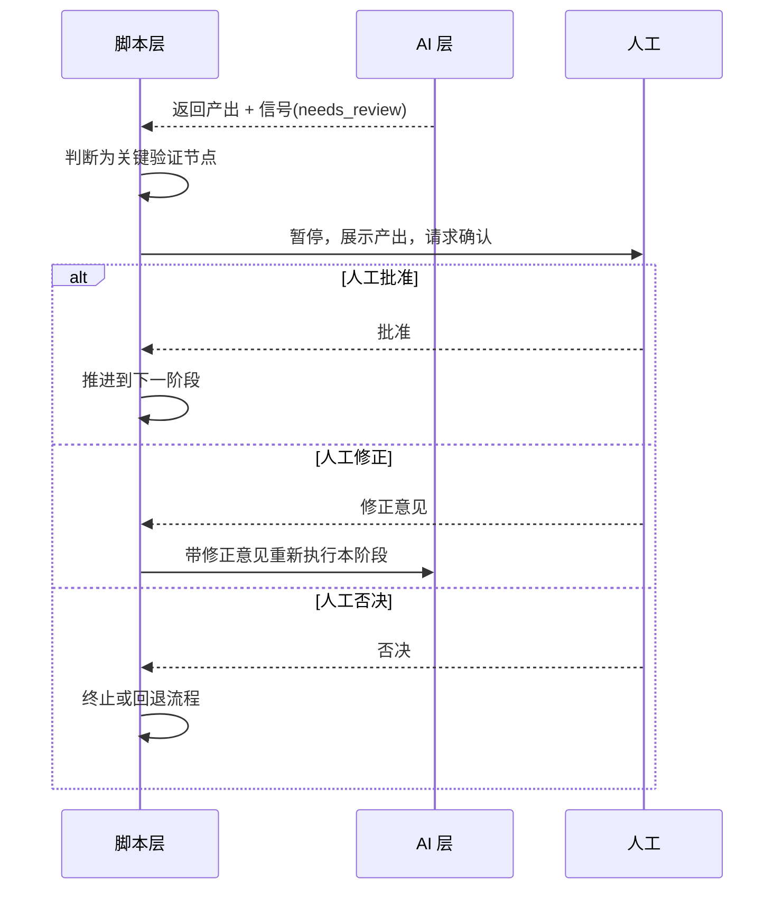

人工在节点上有三种可能的操作：

- **批准（Approve）**：确认产出合格，流程继续。
- **修正（Revise）**：提供修正意见，脚本层带着意见让 AI 层重做本阶段。
- **否决（Reject）**：判断产出不可接受，终止或回退流程。

### 16.5 人机协作的效率平衡

人机协作节点的设计，本质是在"自动化效率"和"风险可控"之间寻找平衡：

```
人工节点过多                          人工节点过少
├─ 风险可控                          ├─ 自动化效率高
├─ 但人工负担重                      ├─ 但风险失控
├─ 自动化收益被稀释                  ├─ 关键决策无人把关
└─ 退化为"人工为主，AI 为辅"         └─ 退化为"放任 AI 自由发挥"
                  ↕ 最优在中间 ↕
        精准识别关键节点，只在关键处设人工
```

"16 个关键验证节点"正是这种平衡的体现——它不是随意设定的，而是在覆盖了研发流程所有关键风险点的前提下，尽可能减少人工介入频次的结果。

### 16.6 人机协作与知识沉淀的联动

人机协作节点还有一个隐性的价值：**人工的每一次修正和否决，都是宝贵的训练/知识信号。** 当人工在某个节点频繁修正 AI 的产出时，说明 AI 在这个环节存在系统性偏差，这个信息可以被沉淀下来，用于改进（详见第十七章的知识沉淀，以及第十一章的 RL 优化——task-level outcome 和 finish rate 都可以从人工反馈中获得信号）。


---

## 十七、知识沉淀与跨 Agent 经验复用

### 17.1 为什么多 Agent 系统需要知识沉淀

单次任务完成后，如果系统对本次任务中积累的经验一无所知，那么下一次遇到类似任务时，所有 Agent 都要从零开始重新探索。这是巨大的浪费，也让系统无法"越用越聪明"。

知识沉淀（Knowledge Precipitation）就是要解决这个问题：**把每次任务中积累的经验、模式、教训固化下来，供后续的 Agent 复用。** 这让多 Agent 系统从一个"每次都从零开始"的执行器，进化为一个"持续学习、经验累积"的智能体系。

CatDesk 在这方面的实践是：**每次实验结束后自动触发知识沉淀和 skill 自适应更新。**

### 17.2 知识沉淀的触发时机

知识沉淀的触发时机是"每次实验结束后"——也就是一个完整的任务/流程执行完毕时，系统自动触发一次知识沉淀，而不需要人工手动整理。

自动触发的好处：

- **无遗漏**：每次任务都沉淀，不会因为人工遗忘而丢失经验。
- **即时性**：任务刚结束时，相关的经验和上下文最鲜活，此时沉淀质量最高。
- **无负担**：不增加使用者的额外负担。

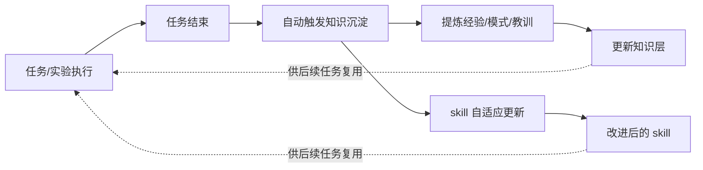

### 17.3 沉淀什么样的知识

知识沉淀应当提炼哪些内容？主要包括：

| 知识类型 | 说明 | 示例 |
|---------|------|------|
| 成功模式 | 哪种拆解/调度方式效果好 | "这类需求适合先 Plan 再并行实现" |
| 失败教训 | 哪种做法导致了失败 | "这个仓库不能并发改 X 文件" |
| 领域事实 | 关于代码库/业务的具体事实 | "鉴权逻辑在 src/auth/ 下" |
| 工具经验 | 某工具的使用技巧/坑 | "这个 API 有速率限制" |
| 简报模板 | 有效的 briefing 写法 | 某类任务的高质量简报范式 |

### 17.4 Skill 自适应更新

除了沉淀"知识"，CatDesk 还会做 **skill 自适应更新**。

Skill 是封装好的领域能力（在能力空间中作为一等公民被子代理使用，见第十二章）。"自适应更新"意味着：系统根据任务执行的反馈，自动地改进和更新这些 skill——让 skill 本身也"越用越好"。

skill 自适应更新与知识沉淀的区别：

- **知识沉淀**沉淀的是"信息/经验"，供 Agent 在推理时参考。
- **skill 自适应更新**改进的是"能力/工具"本身，让 Agent 执行时用上更好的工具。

二者相辅相成：知识让 Agent"知道该怎么做"，skill 让 Agent"有更好的手段去做"。

### 17.5 跨 Agent 经验复用

知识沉淀的最终目的是**跨 Agent 复用**。沉淀下来的知识和更新后的 skill，被存入一个共享的知识层，所有 Agent（无论主代理还是各类子代理）都可以访问。

这带来了"经验的横向流动"：

```
        ┌──────────────────────────────────────┐
        │            共享知识层                  │
        │  · 成功模式  · 失败教训  · 领域事实    │
        │  · 工具经验  · 简报模板  · 更新的skill │
        └───────┬──────────┬──────────┬─────────┘
                │          │          │
       ┌────────▼──┐ ┌─────▼─────┐ ┌──▼────────┐
       │ Research  │ │Engineering│ │  Plan     │
       │ Agent     │ │ Agent     │ │  Agent    │
       └───────────┘ └───────────┘ └───────────┘
         都能读取知识层，也都能向知识层贡献经验
```

- 一个 Explore 子代理在某次任务中摸清了"鉴权逻辑在哪"，这个知识被沉淀。
- 下一次，另一个 Engineering 子代理接到相关任务时，可以直接从知识层获取这个事实，无需重新探索。

这种跨 Agent 的经验复用，让整个 Agent 集群形成了一种"集体记忆"——单个 Agent 的经验会成为整个集群的财富。

### 17.6 知识沉淀的伪代码

```python
def on_experiment_finish(experiment):
    # 每次实验结束后自动触发
    trajectory = experiment.trajectory
    outcome = experiment.outcome

    # 1. 提炼知识
    knowledge = {
        "success_patterns": extract_success_patterns(trajectory, outcome),
        "failure_lessons": extract_failures(trajectory, outcome),
        "domain_facts": extract_domain_facts(trajectory),
        "tool_experience": extract_tool_notes(trajectory),
        "brief_templates": extract_effective_briefs(trajectory, outcome),
    }
    knowledge_layer.merge(knowledge)   # 更新共享知识层

    # 2. skill 自适应更新
    for skill in experiment.used_skills:
        feedback = evaluate_skill_performance(skill, trajectory, outcome)
        if feedback.should_update:
            updated = adapt_skill(skill, feedback)   # 自适应改进
            skill_registry.update(updated)

# 后续任务的 Agent 在开始前，从知识层加载相关经验
def before_task(agent, task):
    relevant = knowledge_layer.retrieve(task)   # 检索相关经验
    agent.context.prepend(relevant)             # 注入到上下文
```

### 17.7 知识沉淀与"越用越聪明"的飞轮

知识沉淀构建了一个正向飞轮：

```
   执行任务 ──→ 沉淀经验 ──→ 更新知识/skill
      ▲                          │
      │                          ▼
   下次任务更聪明 ←── Agent 复用经验
```

每转动一圈，系统就变得更聪明一点。这个飞轮与第十一章的 RL 优化飞轮相互呼应——RL 从大规模训练中优化模型的调度能力，知识沉淀从每次实际任务中积累具体经验，二者共同驱动多 Agent 系统的持续进化。

---

## 十八、五层架构在多 Agent 场景的应用

### 18.1 五层结构总览

在多阶段自动化的实践中，一种被称为"五层结构"的架构被用来驱动多 Agent 协作。这五层是：**Planner（规划层）、Executor（执行层）、Evaluation（评估层）、约束层、知识层。**

```
┌───────────────────────────────────────────────────────────┐
│  Planner（规划层）                                          │
│   意图识别 · 阶段路由 · 任务拆解                             │
└──────────────────────────┬────────────────────────────────┘
                           │ 下发拆解后的任务
┌──────────────────────────▼────────────────────────────────┐
│  Executor（执行层）                                         │
│   具体操作执行（由各子代理承担）                            │
└──────────────────────────┬────────────────────────────────┘
                           │ 产出结果
┌──────────────────────────▼────────────────────────────────┐
│  Evaluation（评估层）                                       │
│   结果验证                                                  │
└──────────────────────────┬────────────────────────────────┘
                           │
        ┌──────────────────┴──────────────────┐
        │                                      │
┌───────▼────────┐                    ┌────────▼────────┐
│  约束层         │                    │  知识层          │
│  规则约束       │  ← 贯穿全流程 →     │  经验沉淀        │
│  边界控制       │                    │  知识复用        │
└────────────────┘                    └─────────────────┘
```

### 18.2 逐层解析

#### 18.2.1 Planner（规划层）：意图识别、阶段路由、任务拆解

Planner 是五层架构的"大脑"，对应 Orchestrator 的规划职责。它做三件事：

- **意图识别**：理解用户/上游真正想要什么。
- **阶段路由**：决定当前应该进入哪个阶段（这与第十五章"脚本层决定流转"相呼应）。
- **任务拆解**：把任务拆解为可分配给子代理的子任务（第三章的核心职责）。

#### 18.2.2 Executor（执行层）：具体操作执行

Executor 对应 Worker/子代理的执行职责。它承担"具体操作执行"——把 Planner 拆解出的子任务真正落地。在多 Agent 场景下，Executor 层就是由一个个专门化的子代理组成的。

#### 18.2.3 Evaluation（评估层）：结果验证

Evaluation 层负责"结果验证"——检查 Executor 的产出是否正确、是否符合预期。这对应第十六章人机协作节点中的"验证"环节，也对应第十一章 RL 指标中的 finish rate 和 task-level outcome 的评估。

Evaluation 层的存在，让系统具备了"自我检查"的能力——不是盲目地相信执行结果，而是主动验证。

#### 18.2.4 约束层：规则约束和边界控制

约束层负责"规则约束和边界控制"。它对应第十三章的沙箱机制——为整个系统施加规则和边界，防止 Agent 越界或做出危险操作。约束层贯穿全流程，无论 Planner 规划、Executor 执行还是 Evaluation 验证，都在约束层设定的边界内进行。

#### 18.2.5 知识层：经验沉淀和知识复用

知识层负责"经验沉淀和知识复用"，对应第十七章的知识沉淀机制。它是系统的"记忆"，让每次任务的经验得以积累和复用。知识层同样贯穿全流程——Planner 规划时参考知识层的经验，Executor 执行时复用知识层的领域事实，Evaluation 评估后向知识层贡献新经验。

### 18.3 五层架构的运转流程

五层架构如何驱动多阶段自动化？下面是一个完整的运转流程：

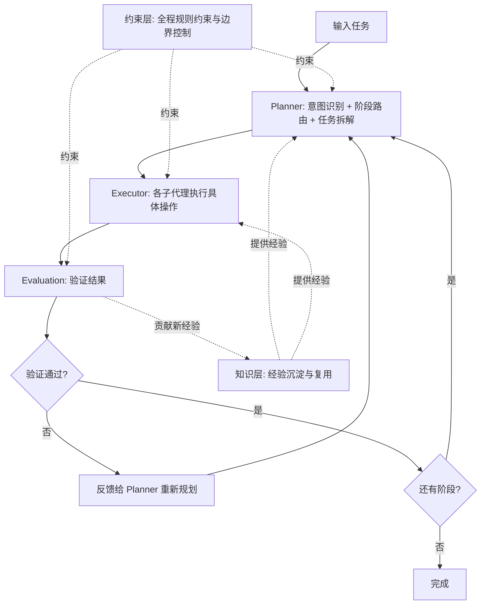

流程的核心是一个"规划—执行—评估"的循环，被"约束层"和"知识层"包裹和支撑。这个循环通过"阶段路由"驱动多阶段自动化——每完成一个阶段的验证，Planner 就路由到下一个阶段，直到所有阶段完成。

### 18.4 五层架构与其他机制的映射

五层架构是一个高度抽象的框架，前面章节讨论的各种机制都可以映射到这五层：

| 五层结构 | 对应的前述机制 | 章节 |
|---------|--------------|------|
| Planner | Orchestrator 的规划职责、脚本层的流转决策 | 三、十五 |
| Executor | Worker/专门化子代理 | 三、十、十四 |
| Evaluation | 人机协作验证、RL 评估指标 | 十一、十六 |
| 约束层 | 沙箱机制、安全边界 | 十三 |
| 知识层 | 知识沉淀、skill 自适应更新 | 十七 |

这个映射表说明：五层架构不是一个孤立的设计，而是对整个多 Agent 协作体系的一种"抽象归纳"。它把散落在各处的机制，归纳为五个清晰的职责层。

### 18.5 人机协作节点在五层架构中的位置

第十六章提到的"16 个关键验证节点"，在五层架构中主要位于 **Evaluation 层**。当 Evaluation 层判断某个结果处于关键、高风险、不可逆的节点时，就触发人工确认，把关键决策交给人。

也就是说，Evaluation 层不是一个纯自动化的验证层，而是一个"自动验证 + 人工把关"相结合的层——大部分验证由系统自动完成，关键节点的验证由人工兜底。

### 18.6 知识持续积累在五层架构中的闭环

第十七章的知识沉淀，在五层架构中形成一个优雅的闭环：

- 知识层为 Planner、Executor 提供历史经验（输入）。
- 每次任务结束后，自动触发知识沉淀和 skill 自适应更新（输出）。
- 沉淀的新经验回流到知识层，供下次任务使用。

这个闭环让五层架构不是一个"静态"的框架，而是一个"动态进化"的系统——每转动一圈，知识层就更丰富，整个系统就更聪明。


---

## 十九、实战案例：研发全生命周期自动化

### 19.1 案例背景

本章把前面所有的理论和机制，落地到一个完整的实战案例——研发全生命周期自动化。这个案例综合运用了：Orchestrator-Worker 模型、专门化子代理、上下文隔离、Worktree 隔离、并行执行、声明式 DAG、双层架构、人机协作节点、知识沉淀、五层架构。

**场景设定**：一位产品负责人提出一个模糊需求："希望报表系统能支持数据导出功能，用户能把当前筛选后的报表导出来。" 系统需要把这个模糊需求，自动地推进到可交付的代码变更和测试报告。

### 19.2 完整流程走查

我们按第十四章的十个阶段，逐一走查这个需求如何被自动化处理。

#### 阶段 1：初始化

脚本层启动流水线，加载配置，准备运行环境。约束层加载沙箱策略（哪些子代理有什么权限），知识层加载与"报表系统""数据导出"相关的历史经验。

```json
{ "stage": "init", "status": "success",
  "loaded": { "sandbox_policies": 5, "relevant_knowledge": 12 } }
```

#### 阶段 2：需求分析（requirements-analyst）

脚本层 spawn 一个 `requirements-analyst` 子代理，附上完整简报（第六章的 briefing 原则）：

```
你是需求分析师。产品负责人提出："希望报表系统能支持数据导出功能，
用户能把当前筛选后的报表导出来。"

已知背景（来自知识层）：
- 报表系统已有"查看"和"筛选"功能，导出需基于筛选后的结果集。
- 历史经验：类似的导出需求通常需要支持 Excel 和 PDF 两种格式。

请产出结构化 PRD，包括：背景、目标、功能点、验收标准、边界与约束。
```

`requirements-analyst` 在其独立上下文中工作，产出结构化 PRD 并回传。子代理返回 `signals.needs_human_review: true`。

**人机协作节点 #1**：脚本层判断"确认 PRD"是关键里程碑，暂停等待人工确认。产品负责人 review PRD 后批准。

#### 阶段 3：技术方案（evaluate-requirements + pipeline-services-analyst 并行，然后 technology-plan-reviewer）

这个阶段体现了**并行执行**（第九章）和**声明式 DAG**（第十四章）。

脚本层发现 `evaluate-requirements` 和 `pipeline-services-analyst` 都只依赖 PRD，可以并行，于是同一批次 spawn 两个子代理：

- `evaluate-requirements`（可行性评估师）：评估技术可行性、风险、工作量。
- `pipeline-services-analyst`（服务仓库判定师）：判定需求涉及哪些服务仓库。

```
              ┌─→ evaluate-requirements ──┐
PRD (阶段2产出)─┤                          ├─→ 两者完成后 → technology-plan-reviewer
              └─→ pipeline-services-analyst┘
```

两个子代理都在各自独立上下文中工作，互不干扰。它们回传结论：

- 可行性评估：可行，中等工作量，主要风险是大数据量导出的性能。
- 服务影响：涉及 `report-service`（报表核心）和 `export-service`（导出服务）两个仓库。

**人机协作节点 #2**：脚本层判断"确认服务影响范围"是高影响决策，暂停确认。技术负责人确认影响范围正确。

然后脚本层 spawn `technology-plan-reviewer`（技术方案评审师，即第十章的 Plan 型），它综合前两个子代理的结论，产出技术方案：

```
技术方案：
- 在 export-service 新增 ExportController，接收筛选参数。
- 复用 report-service 的筛选逻辑获取结果集。
- 支持 Excel（用现有 poi 库）和 PDF（新引入 pdf 库）。
- 大数据量用流式导出，避免内存溢出（针对已识别的性能风险）。
关键文件：export-service/src/controller/, report-service/src/filter/
架构取舍：流式 vs 全量加载 —— 选择流式以规避性能风险。
```

**人机协作节点 #3**：脚本层暂停确认技术方案。架构师 review 后批准。

#### 阶段 4：分支管理（using-git-worktrees）

脚本层 spawn `using-git-worktrees` 子代理，基于 feature 分支创建隔离的 Git Worktree（第八章）。由于需求涉及两个仓库，为两个仓库各创建一个隔离工作副本：

```
export-service:  worktree /tmp/wt-export-abc123  分支 feature/data-export
report-service:  worktree /tmp/wt-report-def456  分支 feature/data-export-filter
```

这确保了后续的编码修改被隔离在工作副本中，不影响主分支和其他任务。

#### 阶段 5：编码实现（engineering 子代理，isolation=worktree，并行）

这是最能体现多 Agent 价值的阶段。技术方案涉及两个仓库的改动，且这两部分相对独立（一个改导出服务，一个改筛选逻辑复用接口），因此可以**并行**。

脚本层同一批次 spawn 两个 `engineering` 子代理，各自绑定一个 worktree：

```
Engineering Agent A → worktree /tmp/wt-export-abc123
   任务简报（体现"理解"，不委托 understanding，见第六章）：
   "在 export-service/src/controller/ExportController.java 新增导出端点，
    接收筛选参数，调用 report-service 的筛选接口获取结果集，
    支持 Excel 和 PDF 格式，大数据量用流式导出。
    参考技术方案的流式实现取舍。完成后跑单元测试。"

Engineering Agent B → worktree /tmp/wt-report-def456
   任务简报：
   "在 report-service/src/filter/ 暴露一个可供外部服务调用的筛选结果集接口，
    保持与现有筛选逻辑一致，支持分页/流式返回。完成后跑单元测试。"
```

两个子代理在各自的隔离 worktree 中并发修改代码，互不冲突（第九章的冲突预防）。它们完成后回传结论，并因为有修改，各自返回 worktree 路径和分支名（第八章）。

**人机协作节点 #4~#8**：编码阶段的关键代码改动，在几个关键点暂停人工 review（例如新引入 pdf 库的确认、流式实现的正确性确认）。

#### 阶段 6：提交 PR

脚本层 spawn PR 提交子代理，把两个 worktree 分支的改动分别提交为 PR。

**人机协作节点 #9**：确认 PR 内容后提交。

#### 阶段 7：生成测试用例（testcase-generator）

脚本层 spawn 测试用例生成子代理，根据 PRD（阶段 2）和实现（阶段 5）生成测试用例：正常导出、大数据量导出、Excel/PDF 格式、边界情况（空结果集、特殊字符）。

**人机协作节点 #10~#12**：确认测试用例覆盖充分。

#### 阶段 8：提测

脚本层触发提测流程。**人机协作节点 #13**：确认提测。

#### 阶段 9：自动化测试

脚本层 spawn 自动化测试子代理，执行测试。这里也可以用上下文隔离（第七章）——测试执行会产生大量日志输出，用子代理隔离掉，只回传"通过/失败 + 失败原因"。

假设测试发现一个问题：大数据量 PDF 导出超时。

**人机协作节点 #14~#15**：确认测试结果和异常处理。人工决定：调整 PDF 导出的超时阈值并优化。脚本层用 SendMessage（第六章）恢复 Engineering Agent A，让它带着完整上下文修复这个问题——无需重新简报，因为它记得整个实现上下文。

修复后重新测试，通过。

#### 阶段 10：交付报告

脚本层 spawn 交付报告子代理，汇总整个流程：需求、方案、改动、测试结果，生成交付报告。

**人机协作节点 #16**：确认交付。

### 19.3 案例中的机制回顾

这个案例中，前面所有章节的机制都得到了应用：

| 机制 | 在案例中的体现 | 章节 |
|------|--------------|------|
| Orchestrator-Worker | 脚本层编排，专门化子代理执行 | 三 |
| 生命周期管理 | 各子代理的创建、执行、终止 | 五 |
| 通信/briefing | 每个子代理的完整简报 | 六 |
| 上下文隔离 | 测试日志、探索过程被隔离 | 七 |
| Worktree 隔离 | 编码阶段两个仓库的隔离副本 | 八 |
| 并行执行 | 可行性评估与服务判定并行、两个编码 agent 并行 | 九 |
| 子代理类型 | requirements-analyst 等专门化类型 | 十、十四 |
| 能力对等 | 各子代理可用完整能力空间 | 十二 |
| 沙箱机制 | 编码 agent 限 worktree、测试 agent 权限约束 | 十三 |
| 声明式 DAG | 十阶段流水线的依赖编排 | 十四 |
| 双层架构 | 脚本层控流转、AI 层执行 | 十五 |
| 人机协作节点 | 16 个关键验证节点 | 十六 |
| SendMessage 恢复 | 恢复 Engineering Agent A 修复超时问题 | 六 |
| 知识沉淀 | 任务结束后沉淀"导出需支持流式"等经验 | 十七 |

### 19.4 案例的价值总结

这个案例展示了多 Agent 协作在真实研发场景中的核心价值：

1. **端到端自动化**：从模糊需求到可交付代码和测试报告，全流程自动化，人只在关键节点把关。
2. **并行提效**：可并行的阶段（可行性评估/服务判定、两个仓库的编码）真正并行，压缩总耗时。
3. **隔离保障**：上下文隔离让主流程清爽，Worktree 隔离让多仓库并发修改无冲突。
4. **可靠可控**：双层架构和人机协作节点，让整个流程既智能又可靠，关键决策有人负责。
5. **持续进化**：任务结束后的知识沉淀，让系统处理下一个类似需求时更聪明。


---

## 二十、挑战与未来方向

### 20.1 当前面临的挑战

尽管多 Agent 协作展现出巨大潜力，但从当前实践到 Agent Swarms 的完整愿景，仍有诸多挑战需要克服。

#### 20.1.1 长链决策的误差累积

多 Agent 系统往往涉及长链的决策：Orchestrator 拆解 → 子代理执行 → 结果聚合 → 再拆解……链条越长，误差累积的风险越大。一个早期的错误判断，可能在后续环节被不断放大。这也是为什么当前必须依赖人机协作节点在关键处兜底。

**应对方向**：一方面靠 RL 优化（第十一章）提升每一步决策的可靠性；另一方面靠 Evaluation 层（第十八章）和人机协作节点（第十六章）及时发现和纠正误差。

#### 20.1.2 调度稳定性与长时运行

多 Agent 任务常常是长程的，可能持续很久，期间 spawn 大量子代理。如何保证调度层在长时间运行中稳定、不泄漏资源、不崩溃，是一个持续的工程挑战。这正是 CatDesk 工程侧重点一要解决的问题。

**应对方向**：完善生命周期管理（第五章）、背压机制（第九章）、资源回收，构建"支持长时间稳定运行的工程架构"。

#### 20.1.3 能力对等的资源成本

让每个子代理都成为拥有完整能力空间的"一等公民"（第十二章），意味着巨大的资源开销。大量并发的、各自拥有浏览器实例/MCP 连接/加载 Skills 的子代理，会迅速耗尽资源。

**应对方向**：能力的按需懒加载、精细的资源管理、以及在能力空间和实际授权之间用沙箱做收敛（最小权限原则，第十三章）。

#### 20.1.4 安全边界的完备性

子代理能力越强，潜在风险越大。如何设计出既不束缚能力、又能兜住所有风险的沙箱机制，是一个长期课题。细颗粒度的工具网络权限、Worktree 隔离、文件系统边界（第十三章）都是当前的手段，但面对不断出现的新能力（新的 MCP 服务、新的工具），沙箱机制需要持续演进。

#### 20.1.5 冲突解决的复杂度

当并发子代理数量增多、依赖关系变复杂时，冲突解决（第九章）的复杂度会急剧上升。Worktree 隔离解决了代码层面的写冲突，但逻辑冲突（子代理产出矛盾）的仲裁仍高度依赖 Orchestrator 的判断力。

#### 20.1.6 自主决策与可预测性的张力

Agent Swarms 愿景追求"完全由 Agent 自主决策"，但生产环境追求"可预测、可靠"。这两者存在天然张力。当前的双层架构（第十五章）用"脚本控流转、AI 控执行"来缓解这个张力，但这本质上是一种妥协——它牺牲了一部分自主性来换取可靠性。如何在提升自主性的同时不牺牲可靠性，是通向完整愿景的核心难题。

### 20.2 挑战的全景图

```
┌──────────────────────────────────────────────────────────────┐
│                     多 Agent 系统挑战全景                       │
│                                                                │
│  模型能力层面              工程架构层面                         │
│  ┌────────────────┐        ┌────────────────┐                │
│  │ 长链误差累积   │        │ 调度稳定性     │                │
│  │ 自主决策可靠性 │        │ 长时运行       │                │
│  └────────────────┘        │ 资源成本       │                │
│                            │ 安全边界       │                │
│  张力：                    │ 冲突解决       │                │
│  自主性 ←──→ 可预测性      └────────────────┘                │
└──────────────────────────────────────────────────────────────┘
```

### 20.3 未来方向：模型能力演进

回到第四章的"双轮驱动"，未来方向也分为模型侧和工程侧两条。

**模型侧的核心方向**：把 Subagent 的调用正式纳入 RL 流程，通过 instantiation reward、sub-agent finish rate、task-level outcome 三个指标持续优化（第十一章）。

模型侧演进的终极目标是：让大模型从"被动生成内容"进化为"主动、聪明地调度和协作多个子代理"。随着模型在这方面的能力越来越强，人机协作节点的数量有望逐步减少，自主决策的边界逐步扩大——这是趋近 Agent Swarms 愿景的关键路径。

模型能力演进的几个具体预期：

- **更强的任务拆解能力**：模型能更精准地判断"这个任务该怎么拆、拆几块、怎么分配"。
- **更好的简报生成**：模型能自动写出高质量的自包含简报，减少浅薄委托。
- **更聪明的隔离判断**：模型能自主判断何时该用上下文隔离、何时该用 Worktree 隔离。
- **更可靠的长链决策**：通过 RL，减少长链决策中的误差累积。

### 20.4 未来方向：工程架构升级

**工程侧的三个重点**（第四章）将持续升级：

1. **稳定性与长时运行**：子代理调度层的稳定性、支持长时间稳定运行的工程架构会不断完善，让多 Agent 系统能承担越来越长程、越来越复杂的任务。

2. **能力对等的深化**：subagent as a first class agent citizen 的理念会进一步落实，子代理的能力空间（BrowserUse、Skills、MCP 等）会越来越丰富、越来越贴近主代理。

3. **沙箱机制的完善**：细颗粒度的工具网络权限、Worktree 能力、以及更多隔离手段会持续演进，在放权和安全之间取得更好的平衡。

### 20.5 未来方向：组织形态的演进

从第二章的"多 Agent 系统形态谱系"来看，未来的演进方向是从当前主流的"Orchestrator-Worker"逐步走向更高级的形态：

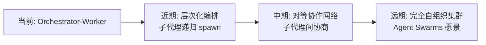

- **近期**：随着"能力对等"让子代理能递归 spawn，层次化编排会成为常态——子代理在处理复杂子任务时，扮演次级 Orchestrator。
- **中期**：随着模型协作能力增强，可能出现更多对等协作的形态——子代理之间不完全依赖中心化编排，而能一定程度地横向协商。
- **远期**：Agent Swarms 的完整愿景——Agent 动态地形成和解散组织关系，如同生物界的蚁群、蜂群，完全由 Agent 自主决策，人类介入降至最低。

### 20.6 token efficiency、long context 与 agent swarms 的协同深化

最后，回到第二章 Scaling 新范式的三个方向。未来它们会进一步协同深化：

- **long context** 让每个 Agent 承载更复杂的任务，减少不必要的拆分。
- **token efficiency** 通过上下文隔离和信息瘦身，让多 Agent 的 token 预算被更聪明地分层管理。
- **agent swarms** 则把这一切组织起来，让"个体智能"升华为"组织智能"。

三者的协同，将是下一代 Agent 系统能力跃迁的核心引擎。

---

## 二十一、总结与展望

### 21.1 全文脉络回顾

本文从"单体 Agent 的能力天花板"出发，系统性地论述了多 Agent 协作与 Subagent 设计。我们可以用一条主线把全文串起来：

```
单体 Agent 遇到天花板（上下文、并行、耦合、隔离）
        │
        ▼
Scaling 新范式指明方向（token efficiency + long context + agent swarms）
        │
        ▼
Orchestrator-Worker 模型（业务线大老板 + 各司其职的子代理）
        │
        ▼
CatDesk Subagent 设计（模型侧 RL + 工程侧三重点：稳定性/能力对等/沙箱）
        │
        ├─ 生命周期管理（创建→执行→通信→恢复→终止）
        ├─ 通信模型（自包含简报 + briefing 原则 + SendMessage）
        ├─ 上下文隔离（token 预算分层管理）
        ├─ Worktree 隔离（执行层隔离，解决并发修改冲突）
        ├─ 并行执行与冲突解决（分治 + 隔离 + 仲裁）
        ├─ 类型体系（general-purpose / Explore / Plan / 自定义）
        ├─ RL 调度优化（instantiation reward / finish rate / task outcome）
        ├─ 能力对等（subagent as a first class agent citizen）
        └─ 沙箱机制（细粒度权限 + Worktree + 最小权限）
        │
        ▼
Pipeline 编排（声明式 DAG + 双层架构 + 人机协作 + 知识沉淀）
        │
        ▼
五层架构统一归纳（Planner / Executor / Evaluation / 约束层 / 知识层）
        │
        ▼
研发全生命周期自动化实战（十阶段端到端落地）
        │
        ▼
挑战与未来（模型能力演进 + 工程架构升级 + 组织形态演进）
```

### 21.2 核心设计原则的凝练

纵观全文，多 Agent 协作与 Subagent 设计可以凝练为几条核心原则：

1. **分治优先**：把复杂任务拆解为独立子任务，是多 Agent 的起点。
2. **隔离为本**：上下文隔离守护信息边界，执行隔离（Worktree）守护操作边界。
3. **关注点分离**：Orchestrator 管规划，Worker 管执行，各司其职。
4. **能力对等**：子代理是一等公民，能力空间与主代理对齐，解放任务拆分自由度。
5. **简报清晰**：每次调用提供自包含简报，不委托理解。
6. **安全兜底**：沙箱机制以最小权限原则约束子代理的实际授权。
7. **可靠优先**：双层架构让脚本控流转、AI 控执行，保障生产可靠性。
8. **人在关键**：只在关键、高风险、不可逆节点设置人机协作。
9. **持续进化**：RL 优化调度能力，知识沉淀积累经验，双飞轮驱动系统越用越聪明。

### 21.3 两条主线的交汇

本文开篇提出了"理论"和"工程"两条主线。到这里，我们可以看到它们如何交汇：

- **理论主线**回答了"为什么"：为什么多 Agent 是 Scaling 的必然方向（第二章）、为什么需要 Orchestrator-Worker（第三章）、为什么需要隔离（第七、八章）、为什么用 RL 优化调度（第十一章）。

- **工程主线**回答了"怎么做"：CatDesk Subagent 如何设计（第四章）、生命周期如何管理（第五章）、通信如何实现（第六章）、Worktree 如何隔离（第八章）、沙箱如何保障安全（第十三章）、DAG 如何编排（第十四章）。

两条主线在"研发全生命周期自动化"这个实战案例（第十九章）中完全交汇——理论指导下的工程实现，落地为真实可用的自动化流水线。

### 21.4 展望：从"更强的模型"到"更好的组织"

本文最想传递的一个核心洞察是：**智能的提升，不只来自"让单个模型更强"，也来自"让多个 Agent 更好地组织协作"。**

这与人类社会的运作逻辑深刻一致——一家优秀公司的产出，从来不是靠一个全能天才，而是靠良好的组织架构和分工协作。Agent Swarms 的愿景，正是把这套"组织智能"的逻辑，赋予 AI 智能体集群。

当前，我们正处在这个演进过程的早期：Orchestrator-Worker 模型日趋成熟，能力对等和沙箱机制不断完善，RL 驱动的调度优化和知识沉淀让系统持续进化。而远方，是"完全由 Agent 自主决策、人类介入降至最低"的 Agent Swarms 完整愿景。

从单体 Agent 到 Agent Swarms，这条路才刚刚开始。但方向已经清晰：**token efficiency、long context 与 agent swarms 三者协同，模型能力与工程架构双轮驱动，个体智能终将升华为组织智能。**

### 21.5 结语

多 Agent 协作与 Subagent 设计，是一个横跨"模型能力"与"工程架构"的宏大课题。它既需要模型在 RL 中学会"主动、聪明地调度协作子代理"，也需要工程构建"稳定、能力对等、安全隔离"的基础设施。二者缺一不可，双轮驱动，才能把 Agent Swarms 的愿景一步步变为现实。

愿本文能为读者理解这一课题提供一张清晰的地图——从理论支柱到工程机制，从单个 Subagent 的生命周期到整个集群的组织进化。多 Agent 的时代已经到来，而我们，正站在它的起点。

---

> 本文档基于对多 Agent 协作与 Subagent 设计的技术资料整理与体系化论述而成，旨在系统性地呈现从单体 Agent 到 Agent Swarms 的完整设计图景。文中的架构图、伪代码、对比表格均为帮助理解相关设计理念而构建的示意，实际工程实现可能因具体系统而异。

---

## 附录 A：关键术语表

为便于读者查阅，本附录汇总全文出现的关键术语及其定义。

| 术语 | 英文 | 定义 |
|------|------|------|
| 智能体集群 | Agent Swarms | 由多个 Agent 组织协作构成的系统，Scaling 新范式方向之一 |
| 协调者 | Orchestrator | 负责高层规划、任务拆解、职责分配、结果聚合的主 Agent |
| 工作者/子代理 | Worker / Subagent | 负责具体执行的子级 Agent |
| token 效率 | token efficiency | 用更少 token 完成同等任务的能力 |
| 长上下文 | long context | 更长且更可用的上下文能力 |
| 上下文腐化 | context rot | 上下文变长导致模型注意力衰减、召回下降的现象 |
| 上下文隔离 | context isolation | 给子代理独立上下文，避免污染主上下文 |
| 执行隔离 | execution isolation | 给子代理独立工作副本，避免执行冲突 |
| 工作副本 | Worktree | Git 多工作区能力，为子代理提供隔离的代码副本 |
| 简报 | briefing | spawn 子代理时提供的自包含任务描述 |
| 定向消息 | SendMessage | 向已存在子代理发送消息使其带上下文恢复 |
| 子代理调用奖励 | instantiation reward | RL 指标，奖励合适时机与方式的子代理调用 |
| 子代理完成率 | sub-agent finish rate | RL 指标，衡量子代理是否完成分配任务 |
| 任务整体完成水平 | task-level outcome | RL 指标，衡量整体任务最终完成质量 |
| 一等公民 | first class agent citizen | 子代理拥有与主代理对等的能力空间 |
| 沙箱 | sandbox | 约束子代理能力使用的安全边界机制 |
| 有向无环图 | DAG | 声明式编排中表达阶段依赖的图结构 |
| 双层架构 | dual-layer | 脚本层控流转、AI 层控执行的架构 |
| 人在回路 | Human-in-the-Loop | 在关键节点让人介入把控的设计 |
| 知识沉淀 | Knowledge Precipitation | 每次任务后自动固化经验供复用 |

## 附录 B：多 Agent 设计自检清单

在设计一个多 Agent 系统或 Subagent 调度方案时，可以对照以下清单自检。

**任务拆解层面**

- [ ] 任务是否真的适合多 Agent 化？（是否有并行机会或高 token 隔离需求）
- [ ] 拆解出的子任务是否满足独立性、完备性、粒度适中、可验证性？
- [ ] 子任务之间的依赖关系是否理清？是否构建了 DAG？

**通信层面**

- [ ] 每个子代理的简报是否自包含？是否解释了意图、已知信息、判断依据？
- [ ] 是否避免了"委托理解"的反模式（如"根据你的发现修复"）？
- [ ] 查找型任务是否给出了确切命令？调查型任务是否交出了问题而非规定步骤？
- [ ] 追加任务时是否正确使用 SendMessage 恢复而非重复 spawn？

**隔离层面**

- [ ] 高 token 成本的探索是否用了上下文隔离？
- [ ] 需要改代码的子代理是否用了 Worktree 隔离？
- [ ] 子代理回传的是否是提炼后的结论而非原始过程？

**并行与冲突层面**

- [ ] 并行的子任务是否真的独立？
- [ ] 是否有冲突预防（隔离/分区）？逻辑冲突是否有 Orchestrator 仲裁？
- [ ] 是否有背压机制控制并发度？

**能力与安全层面**

- [ ] 子代理是否拥有完成任务所需的能力空间？
- [ ] 沙箱是否按最小权限原则收紧了实际授权？
- [ ] 网络权限、文件系统边界、资源/递归限制是否配置？

**可靠性层面**

- [ ] 流程走向是否由确定性逻辑（脚本层）控制，而非 AI 自行判断？
- [ ] 关键、高风险、不可逆的节点是否设置了人工确认？
- [ ] 人工节点数量是否精准（不过多也不过少）？

**进化层面**

- [ ] 任务结束后是否触发知识沉淀？
- [ ] 是否有 skill 自适应更新机制？
- [ ] 沉淀的知识是否能被后续 Agent 复用？

## 附录 C：常见问答（FAQ）

**Q1：什么时候一定要 spawn 子代理？**

两种场景必须 spawn：一是并行化（有两个或更多独立工作项，每项可能多步）；二是上下文隔离（完成高 token 成本子任务而不污染主上下文，如探索代码库、验证早期工作）。

**Q2：spawn 一个新子代理和用 SendMessage 恢复有什么区别？**

spawn 是"全新开始"，子代理没有任何历史上下文，必须提供完整自包含简报。SendMessage 是"带上下文恢复"，子代理保留之前的完整上下文，只需提供增量信息。新的独立任务用 spawn，对已有任务的追加/修正用 SendMessage。

**Q3：上下文隔离和 Worktree 隔离是一回事吗？**

不是。上下文隔离针对"信息层面"——给子代理独立上下文窗口，避免信息污染。Worktree 隔离针对"执行层面"——给子代理独立 Git 工作副本，避免并发修改代码冲突。二者正交，可组合使用。

**Q4：子代理是"一等公民"，那和主代理还有区别吗？**

"一等公民"指子代理拥有与主代理对等的能力空间（BrowserUse、Skills、MCP 等）。区别在于职责定位——子代理专注于被分配的具体子任务，主代理（Orchestrator）负责整体编排。能力对等，但职责分工不同。

**Q5：既然追求"人类介入降至最低"，为什么还要人机协作节点？**

"降至最低"不等于"降为零"。在当前模型能力和工程基础设施下，关键、高风险、不可逆的决策仍需人来把控。人机协作节点是精准地只在这些关键处设置人工确认，其余处让 AI 自主——这是在自动化效率和风险可控之间的平衡。

**Q6：双层架构里为什么 AI 不能自己决定流程走向？**

因为流程走向关乎系统的可靠性和可预测性。如果由 AI 自行判断，一旦推理出错，流程可能失控。双层架构把"流程走向"交给确定性的脚本层，把"业务执行"交给 AI 层，从而在保证可靠性的同时发挥 AI 的智能。

**Q7：RL 的三个指标里，哪个最重要？**

task-level outcome（任务整体完成水平）是最终的"北极星指标"。instantiation reward 和 sub-agent finish rate 是过程性、局部性指标，它们服务于 task-level outcome。有可能出现"局部完美但全局不优"的情况，此时以 task-level outcome 为准进行校准。

**Q8：知识沉淀和 RL 优化有什么区别？**

RL 优化是从大规模训练中优化模型的调度能力（模型侧、离线、通用）；知识沉淀是从每次实际任务中积累具体经验（工程侧、在线、具体）。二者是两个互补的进化飞轮，共同驱动系统越用越聪明。

## 附录 D：设计取舍速查表

| 决策点 | 选项 A | 选项 B | 取舍依据 |
|--------|--------|--------|---------|
| 是否多 Agent | 单体 Agent | 多 Agent | 是否有并行/隔离需求 |
| 隔离粒度 | 细（多子代理） | 粗（少子代理） | 主上下文洁净度 vs 编排开销 |
| 是否 Worktree | 用 | 不用 | 是否修改代码/是否需并发改 |
| 子代理类型 | general-purpose | Explore/Plan/自定义 | 任务性质 |
| 编排方式 | 自由编排 | 声明式 DAG | 灵活性 vs 可预测性 |
| 简报策略 | 给确切命令 | 交出问题 | 查找型 vs 调查型 |
| 恢复 vs 重建 | SendMessage | 重新 spawn | 新任务与旧任务关联度 |
| 人工节点 | 多 | 少 | 风险可控 vs 自动化效率 |
| 授权范围 | 宽松 | 最小权限 | 能力 vs 安全 |

## 附录 E：从单体到集群的能力对照

下表汇总单体 Agent 与多 Agent 集群在各关键维度的对照，作为全文的收束。

| 维度 | 单体 Agent | 多 Agent 集群 | 关键机制 |
|------|-----------|--------------|---------|
| 上下文容量 | 易饱和/腐化 | 分层管理，主线洁净 | 上下文隔离 |
| 并行能力 | 无 | 独立工作项并行 | Fan-out/Fan-in、DAG |
| 关注点 | 规划执行耦合 | 规划执行分离 | Orchestrator-Worker |
| 故障隔离 | 无边界 | 有边界 | 沙箱、Worktree |
| 代码并发 | 冲突 | 隔离副本无冲突 | Worktree |
| 能力扩展 | 固定 | 一等公民能力空间 | BrowserUse/Skills/MCP |
| 可靠性 | 依赖单链推理 | 脚本控流转 | 双层架构 |
| 关键决策 | 全 AI | 人在关键节点 | 人机协作节点 |
| 进化能力 | 静态 | 双飞轮进化 | RL 优化 + 知识沉淀 |
| 组织智能 | 个体智能 | 组织智能 | Agent Swarms |

至此，本文对多 Agent 协作与 Subagent 设计的论述告一段落。愿这份地图，助你在从单体 Agent 走向 Agent Swarms 的道路上，行稳致远。
