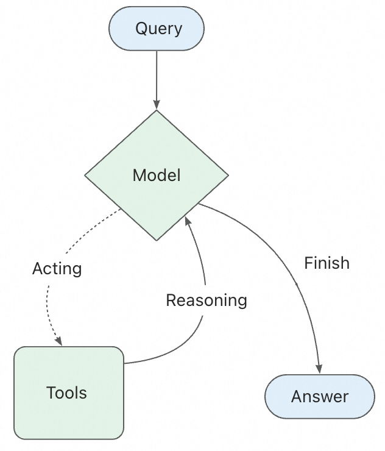

Agents
Agents 将大语言模型与工具结合，创建具备任务推理、工具使用决策、工具调用的自动化系统，系统具备持续推理、工具调用的循环迭代能力，直至问题解决。

Spring AI Alibaba 提供了基于 ReactAgent 的生产级 Agent 实现。

一个 LLM Agent 在循环中通过运行工具来实现目标。Agent 会一直运行直到满足停止条件 —— 即当模型输出最终答案或达到迭代限制时。

ReactAgent 理论基础
什么是 ReAct
ReAct（Reasoning + Acting）是一种将推理和行动相结合的 Agent 范式。在这个范式中，Agent 会：

思考（Reasoning）：分析当前情况，决定下一步该做什么
行动（Acting）：执行工具调用或生成最终答案
观察（Observation）：接收工具执行的结果
迭代：基于观察结果继续思考和行动，直到完成任务
这个循环使 Agent 能够：

将复杂问题分解为多个步骤
动态调整策略基于中间结果
处理需要多次工具调用的任务
在不确定的环境中做出决策
ReactAgent 的工作原理
Spring AI Alibaba 中的ReactAgent 基于 Graph 运行时构建。Graph 由节点（steps）和边（connections）组成，定义了 Agent 如何处理信息。Agent 在这个 Graph 中移动，执行如下节点：

Model Node (模型节点)：调用 LLM 进行推理和决策
Tool Node (工具节点)：执行工具调用
Hook Nodes (钩子节点)：在关键位置插入自定义逻辑
ReactAgent 的核心执行流程：

