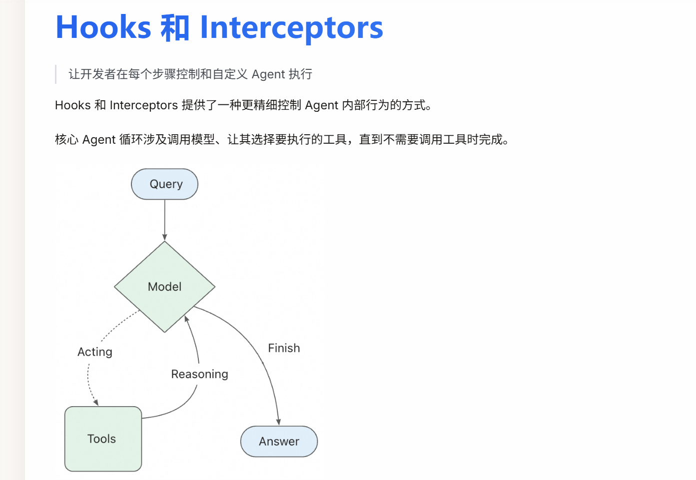
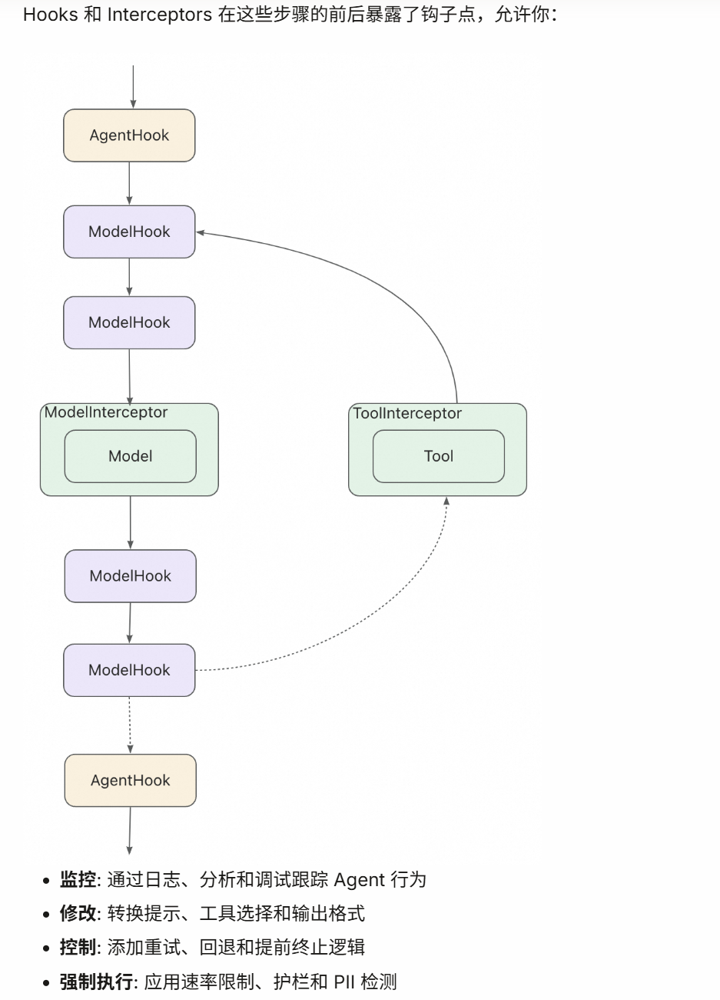
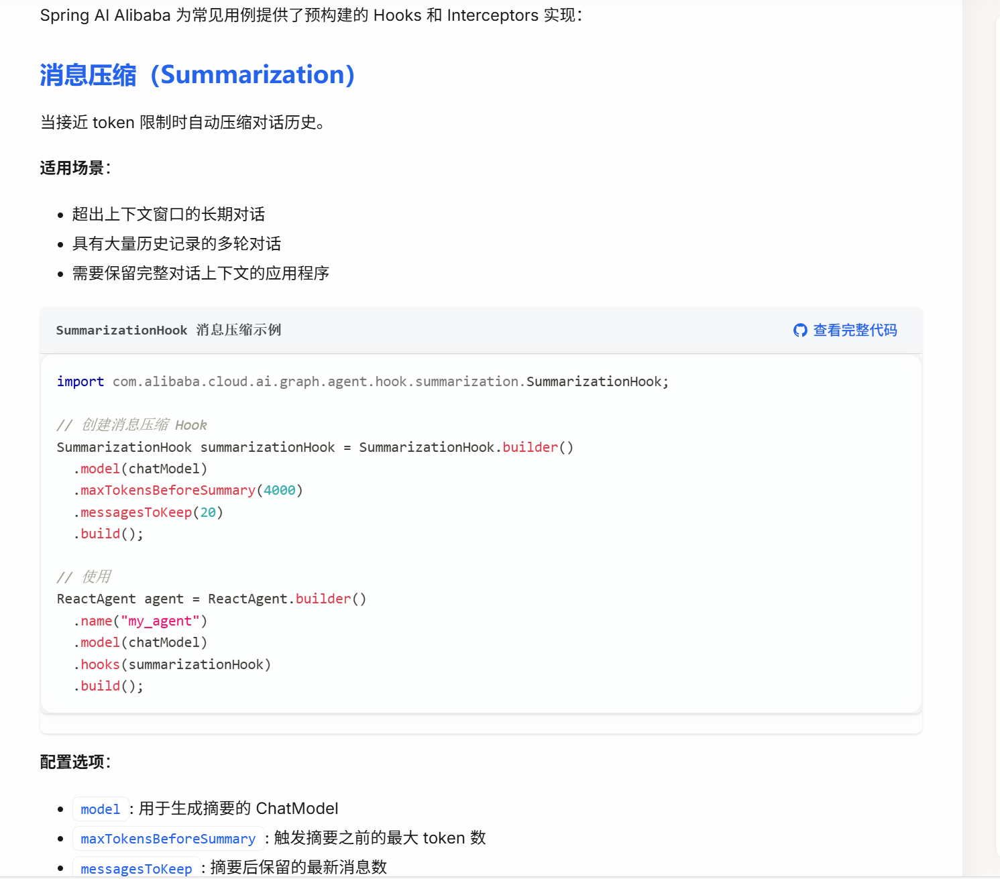
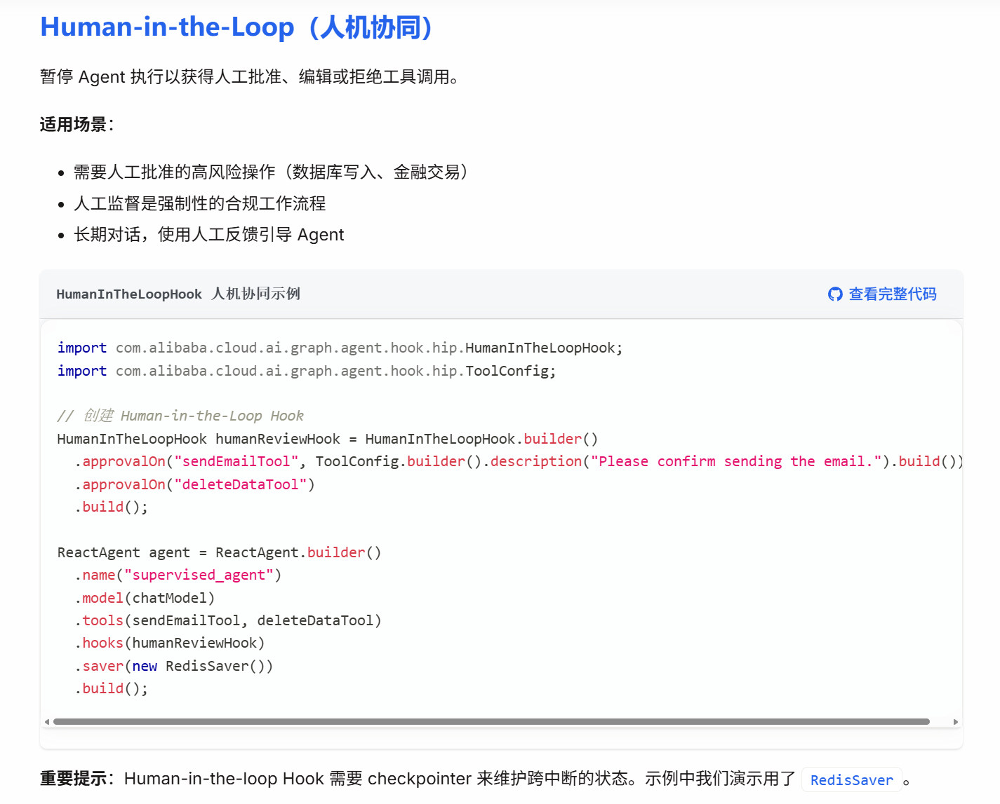
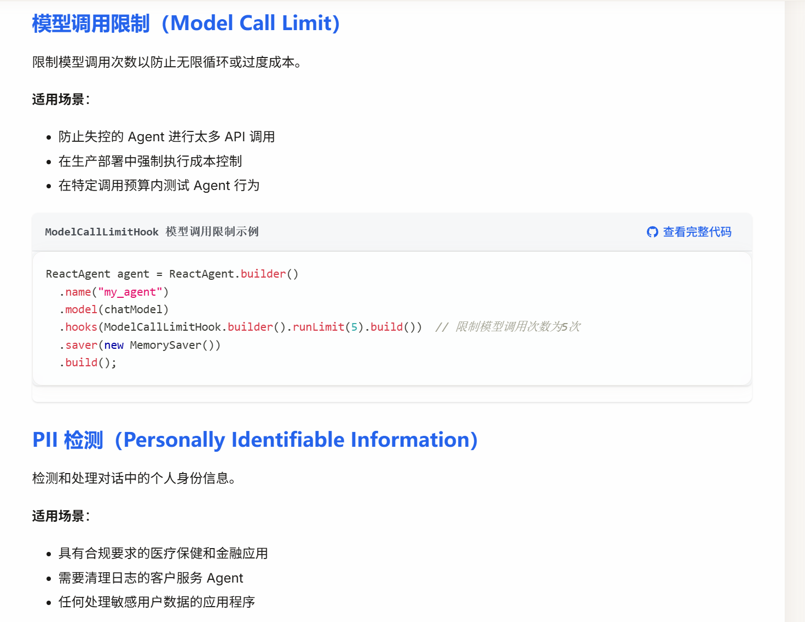
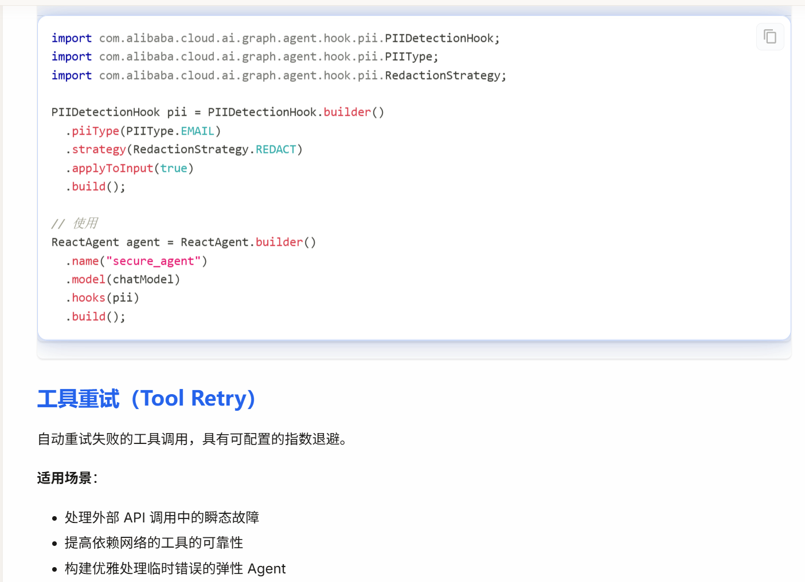
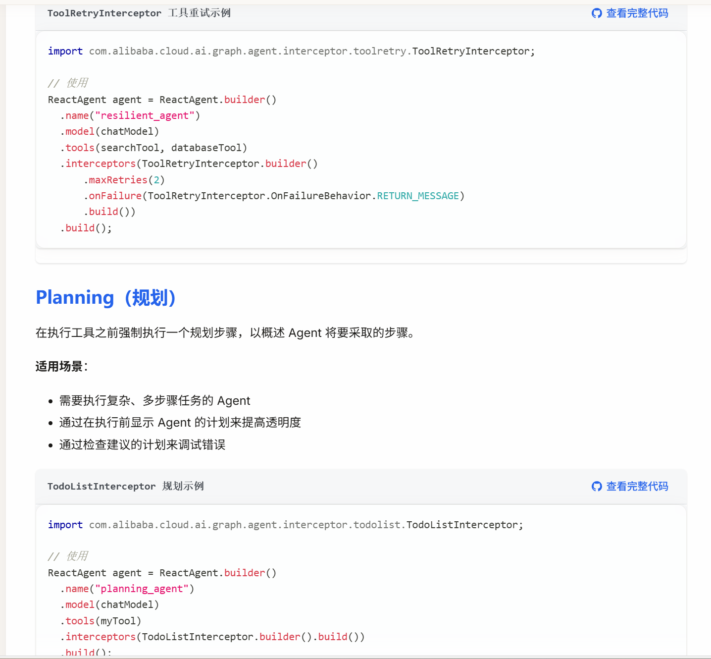

Hooks（钩子）
Hooks 允许在 Agent 执行的关键点插入自定义逻辑。

Hook 类型与使用
Hook 使用示例
查看完整代码
import com.alibaba.cloud.ai.graph.agent.hook.*;
import com.alibaba.cloud.ai.graph.agent.hook.messages.MessagesModelHook;
import com.alibaba.cloud.ai.graph.agent.hook.messages.AgentCommand;
import com.alibaba.cloud.ai.graph.agent.hook.messages.UpdatePolicy;

// 1. AgentHook - 在 Agent 开始/结束时执行，每次Agent调用只会运行一次
@HookPositions({HookPosition.BEFORE_AGENT, HookPosition.AFTER_AGENT})
public class LoggingHook extends AgentHook {
@Override
public String getName() { return "logging"; }

@Override
public CompletableFuture<Map<String, Object>> beforeAgent(OverAllState state, RunnableConfig config) {
System.out.println("Agent 开始执行");
return CompletableFuture.completedFuture(Map.of());
}

@Override
public CompletableFuture<Map<String, Object>> afterAgent(OverAllState state, RunnableConfig config) {
System.out.println("Agent 执行完成");
return CompletableFuture.completedFuture(Map.of());
}
}

// 2. MessagesModelHook - 在模型调用前后执行（例如：消息修剪），专门用于操作消息列表，使用更简单，更推荐。区别于AgentHook，MessagesModelHook在一次agent调用中可能会调用多次，也就是每次 reasoning-acting 迭代都会执行
@HookPositions({HookPosition.BEFORE_MODEL})
public class MessageTrimmingHook extends MessagesModelHook {
private static final int MAX_MESSAGES = 10;

@Override
public String getName() {
return "message_trimming";
}

@Override
public AgentCommand beforeModel(List<Message> previousMessages, RunnableConfig config) {
if (previousMessages.size() > MAX_MESSAGES) {
// 只保留最后 MAX_MESSAGES 条消息
List<Message> trimmedMessages = previousMessages.subList(
previousMessages.size() - MAX_MESSAGES,
previousMessages.size()
);
return new AgentCommand(trimmedMessages, UpdatePolicy.REPLACE);
}
// 消息数量未超过限制，直接返回原消息列表
return new AgentCommand(previousMessages);
}
}

Hook 执行位置：

BEFORE_AGENT / AFTER_AGENT：Agent 整体执行前后
BEFORE_MODEL / AFTER_MODEL：Agent Loop 循环过程中，每次模型调用前后

