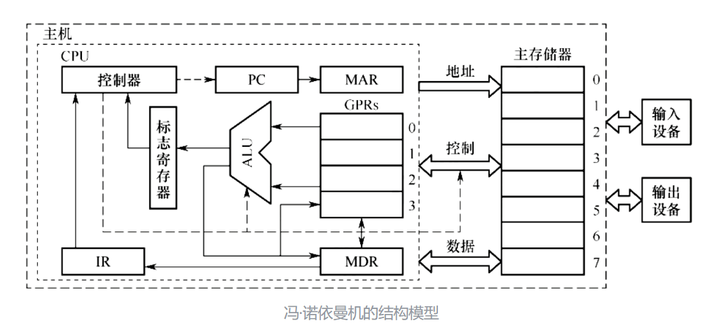
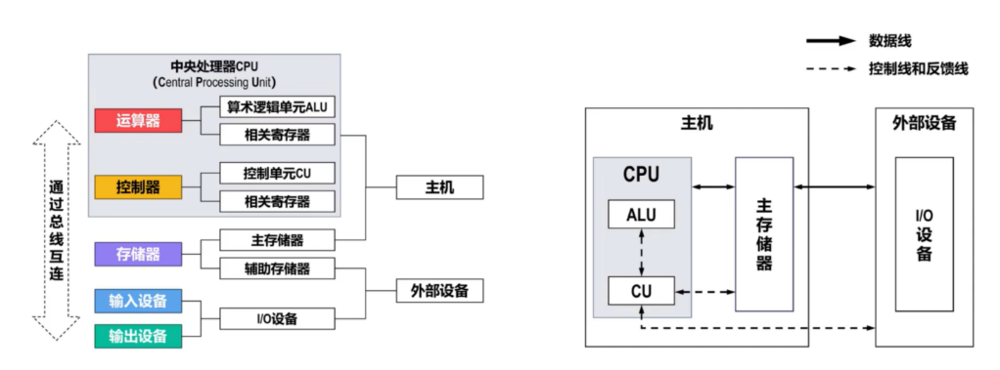
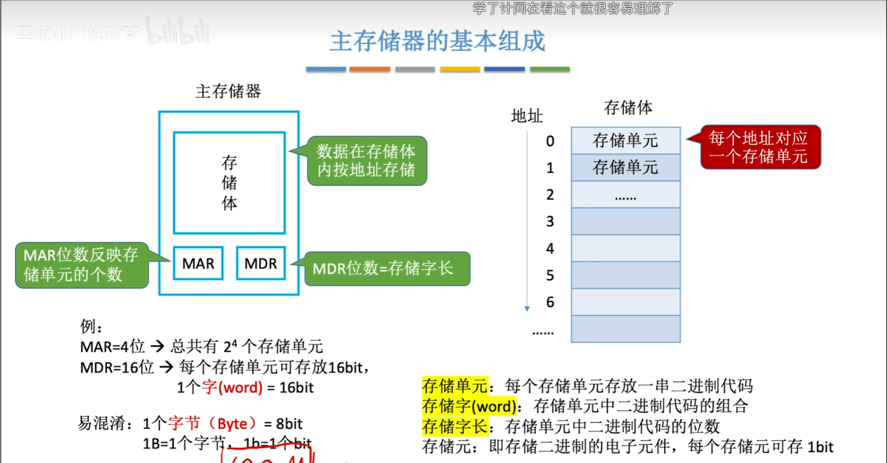
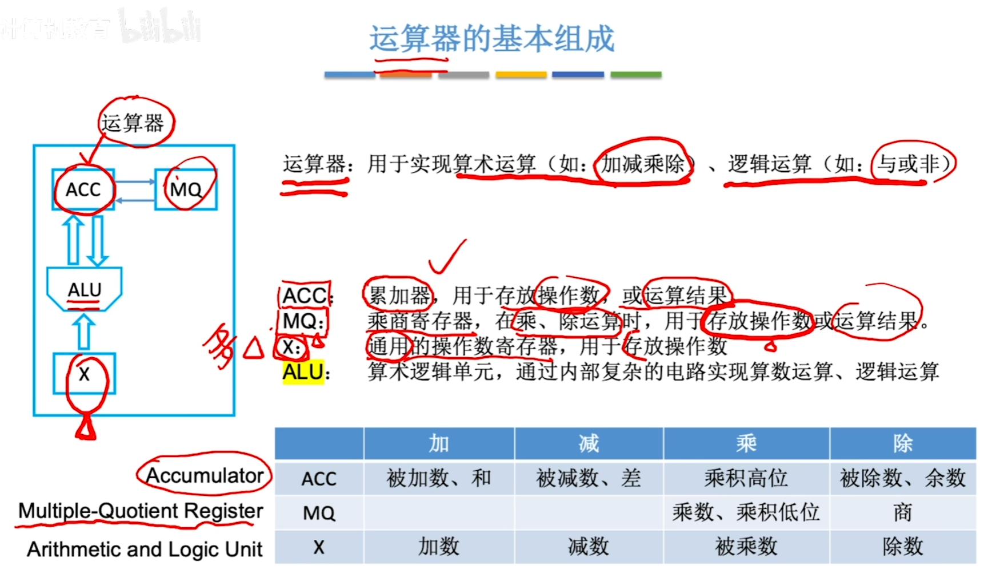
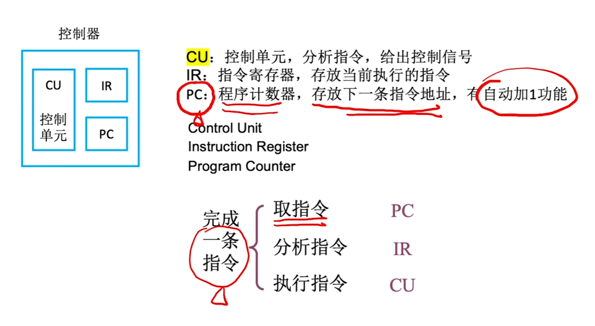
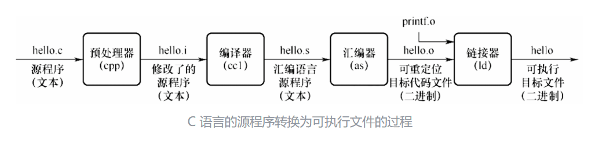
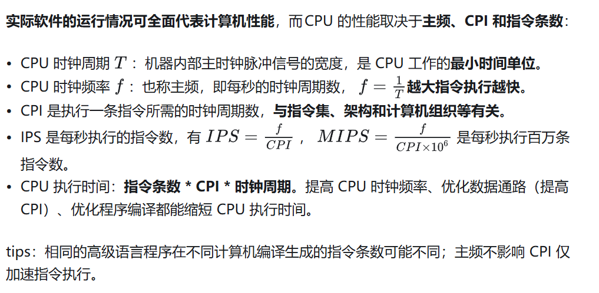
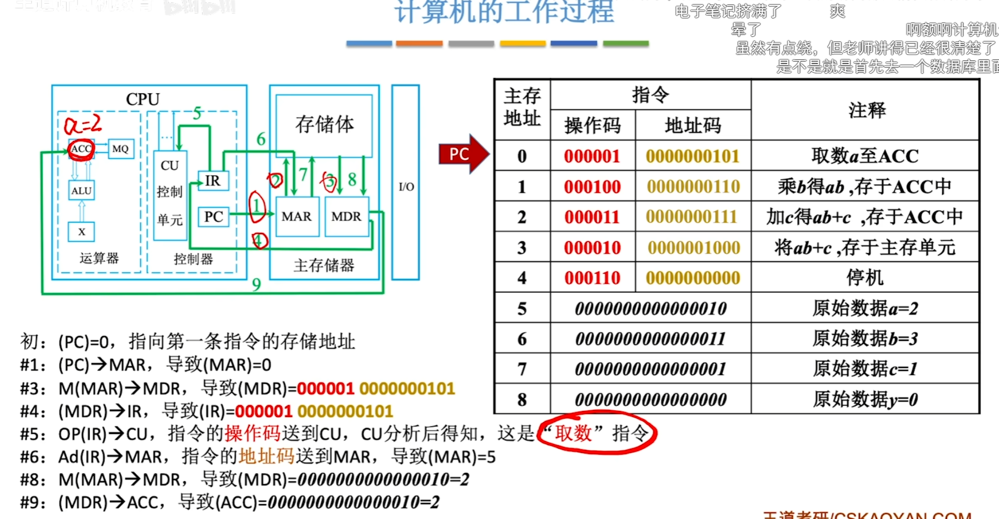

1、计算机系统简述
（1）计算机系统组成

硬件系统和软件系统共同构成完整的计算机系统，具有逻辑功能上的等价性。

硬件是指有形的物理设备，主要由 CPU、内存、外存、I/O 设备和三总线组成。
软件是指在硬件上运行的程序和相关的数据及文档，分为系统软件和应用软件两大类。
冯·诺依曼提出了存储程序的概念，采用控制流驱动的工作方式的计算机称为冯·诺依曼机，特点如下：

- 计算机硬件系统由运算器、存储器、控制器、输入设备和输出设备 5 大部件组成。
- 指令和数据以同等地位存储在存储器中，均用二进制代码表示，但计算机应能区分它们。
- 指令由操作码和地址码组成，操作码指出操作的类型，地址码指出操作数的地址




```
早期冯诺依曼机器的核心：5 大部件 + 1 个关键思想
它的设计就像一个 “会自己干活的工厂”，由 5 个部分组成，彼此配合：
1. 运算器：工厂里的 “计算器”
专门负责算数学题（加减乘除）和逻辑判断（比如 “大于 / 小于”）。早期用真空电子管做电路，算得不算快（比如 ENIAC 每秒算 5000 次加法），但比人快多了。
2. 控制器：工厂里的 “指挥官”
相当于机器的 “大脑中枢”，负责读程序里的指令（比如 “先算 A+B，再乘 C”），然后指挥其他部件按顺序干活。它会说：“运算器，你先算这个；存储器，把结果存起来；输出设备，把结果给用户看看。”
3. 存储器：工厂里的 “仓库”
专门存两样东西：
数据：比如要算的数字（3、5、100）；
程序：就是干活的步骤（比如 “3+5=8，再乘 2=16”）。
早期存储器很简陋，比如用水银延迟线（靠声波在水银里跑的时间存数据），容量很小，存不了多少东西，但关键是 —— 程序和数据存在同一个 “仓库” 里了，不用再重新接线改程序了！
4. 输入设备：给机器 “喂信息” 的工具
早期没键盘鼠标，靠什么输入？比如穿孔卡片（像明信片大小的硬纸，上面打了孔，孔的位置代表数字或指令），机器通过 “读孔” 来获取程序和数据。你可以理解为：“给机器递一张写满任务的纸条”。
5. 输出设备：机器 “说话” 的工具
算完结果后，得告诉人啊。早期靠打印机（在纸上打印数字）或者指示灯（亮灯代表结果），比如算完 1+1，打印机就打出 “2”。
早期冯诺依曼机器怎么干活？举个例子
比如让它算 “2+3×4”：
输入：人把程序（“先算 3×4，再加 2”）和数据（2、3、4）通过穿孔卡片输入，存在存储器里；
控制器：从存储器里读出第一条指令 “算 3×4”，指挥运算器干活；
运算器：算出 3×4=12，结果暂时存回存储器；
控制器：再读下一条指令 “加 2”，指挥运算器把 12 和 2 加起来，得 14；
输出：控制器让输出设备（比如打印机）把 14 打出来，任务完成。
整个过程，机器自己按程序步骤跑，不用人中途插手接线 —— 这就是 “存储程序” 的魔力。
早期冯诺依曼机器的 “缺点”？但意义重大
早期的它其实挺 “原始”：
用真空电子管，体积巨大（比如后来的 EDVAC，虽然是冯诺依曼设计的，也有好几吨重）；
耗电惊人，开机时附近灯光都可能变暗；
存储器容量小，程序稍微复杂点就存不下。
但它的核心思想 ——“程序和数据一起存，机器自动执行”—— 直接奠定了现代计算机的基础。直到今天，我们用的电脑、手机，本质上还是冯诺依曼体系的 “升级版”，只是部件从电子管换成了芯片，速度快了亿万倍而已。
```


### 冯诺依曼机的特点
```
2. 指令和数据以同等地位存于存储器，可按地址寻访
「指令」是计算机的 “操作命令”（比如 “做加法”“存数据”），「数据」是运算的 “原材料”（比如数字 “5”“10”）。
它们都被存在存储器里，像图书馆的书一样，每个都有唯一 “地址”。计算机通过 “地址” 就能找到对应的指令或数据，这样就把 “指令” 和 “数据” 的存储方式统一了，方便管理和读取。
3. 指令和数据用二进制表示
计算机的硬件（比如电路）只有 “通电（1）” 和 “断电（0）” 两种状态，所以用 ** 二进制（0 和 1 的组合）** 来表示指令和数据，能让硬件直接识别、处理，这是计算机底层的 “语言规则”。
4. 指令由操作码和地址码组成
「操作码」：告诉计算机 “做什么操作”（比如 “加、减、存、取”）。
「地址码」：告诉计算机 “去哪里找数据”（比如某个存储单元的地址）。
举个例子：指令 “把地址 A 的数和地址 B 的数相加”，其中 “加” 是操作码，“A、B” 是地址码。
5. 存储程序
这是冯・诺依曼体系的核心思想：把要执行的 “程序”（一系列指令）提前存到存储器里，计算机可以自动、依次读取并执行这些指令，不用每次手动接线改程序（解决了早期计算机 “改任务就得重新布线” 的麻烦）。
6. 以运算器为中心
早期冯・诺依曼机器里，运算器是核心枢纽：控制器、存储器、输入 / 输出设备都围绕运算器传递数据和指令，所有的运算（加减乘除等）都在运算器里完成。（现代计算机已发展为 “以存储器为中心”，但早期是运算器主导）

```

“存储程序”的基本思想是：将事先编制好的程序和原始数据送入主存储器后才能执行，一旦程序被启动执行，就无须操作人员的干预，计算机会按地址访问自动逐条执行指令直至程序执行结束。

计算机操作系统通常是存储在硬盘上的，但在计算机启动时，通常会将操作系统的一部分代码程序即内核 kernel 加载到内存中以便于执行。一旦操作系统启动完成，它会继续在内存中运行，并根据需要从硬盘上加载其他程序和数据到内存中进行处理。


（2）计算机主体硬件简要介绍

中央处理器 CPU：计算机中负责执行程序中的指令以及处理各种计算任务，主要包含：

- 控制单元 CU（Control Unit）主要负责指令的控制与执行。
- 算术逻辑单元 ALU（Arithmetic Logic Unit）处理实际的数学运算和逻辑运算。
- 寄存器（Registers）用于临时存储指令、数据或操作结果，是 CPU 内部的高速存储设备。
- 内存/主存储器：计算机用来存储操作系统内核和正在运行的程序数据的地方，可以被 CPU 直接访问和处理。它是临时存储器，断电后数据会丢失。
- 外存/硬盘：计算机用来长期存储数据和程序的设备，如硬盘驱动器 HDD、固态硬盘 SSD、光盘等，其数据必须调入内存后才能被 CPU 访问。

- I/O 设备：用于计算机对外交互，包括：

输入设备：如键盘、鼠标、触摸屏，它们向计算机输入数据和命令。
输出设备：如显示器、打印机、扬声器，它们将计算机处理后的结果显示或输出给用户。


总线 Bus：连接计算机各部件之间传输数据和信号的通道，可以减少信息传送线数量，分为：

- 地址总线 AB 指示数据的存储位置。
- 数据总线 DB 传输数据。
- 控制总线 CB 传输控制信号，如读/写信号、时钟信号等。





```
主存储器（通常简称内存）是计算机硬件中负责临时存储数据和程序的核心部件，是 CPU 与外存（如硬盘）之间的 “高速中转站”。下面从 “是什么、怎么存、怎么用、为什么快但断电丢数据” 几个维度，超详细且通俗地讲解它的基本原理：
一、主存的 “身份定位”：临时存储的 “高速工作台”
和外存（硬盘 / SSD）的区别：
外存是 “长期仓库”（断电数据不丢，比如存电影、文档），但速度慢；内存是 “临时工作台”（断电数据全丢），但速度极快，CPU 只能直接从内存里读取指令和数据（程序必须先加载到内存，才能被 CPU 执行）。
举个例子：你打开一个 Word 文档，文档先从硬盘（外存）被 “搬到” 内存（工作台），CPU 在内存里直接处理你的编辑操作；如果突然断电，内存里没保存的内容就会丢失，而硬盘里的原文档还在。
二、主存的 “存储单元”：用 0 和 1 砌成的 “小格子”
内存的最小存储单位是位（bit），表示一个二进制数（0 或 1，对应电路的 “断电” 或 “通电”）。8 个 “位” 组成一个字节（Byte），这是计算机存储的 “基本单元”（比如字母 “A” 占 1 字节，一个汉字占 2 字节）。
内存由 ** 大量 “字节级存储单元”** 组成，每个单元都有一个唯一的 “门牌号”——地址（比如第 1000 号单元、第 2048 号单元）。CPU 通过 “地址” 就能精准找到要读写的数据，就像快递员按门牌号送包裹。

三、主存的 “内部结构”：分工明确的 “存储工厂”
内存不是一个 “黑盒子”，它由以下几个核心部分组成，协同完成 “存数据、读数据” 的任务：
组成部分	作用
存储体	核心！由亿万级存储单元组成，是实际存 0 和 1 的 “仓库区”。
地址译码器	把 CPU 给的 “地址”（比如 “第 1000 号单元”）翻译成存储体的具体位置，找到目标存储单元。
读写电路	负责 “读”：把存储单元里的 01 数据传给 CPU；“写”：把 CPU 给的 01 数据存入存储单元。
控制电路	协调读 / 写的时机，确保和 CPU、总线的工作节奏匹配（比如 “等 CPU 准备好再传数据”）。

四、主存的 “工作过程”：读和写的 “流水线操作”
内存的核心操作只有两种：读操作（把数据给 CPU）和写操作（把 CPU 的数据存起来），过程像 “快递收发”：
1. 读操作（CPU 从内存拿数据）
步骤 1：CPU 把要读取的 “地址”（比如 “第 500 号单元”）通过地址总线发给内存。
步骤 2：内存的地址译码器找到第 500 号存储单元，读写电路把里面的 01 数据通过数据总线传回 CPU。
例子：CPU 要算 “3+5”，先从内存地址 A 读 3，地址 B 读 5，再交给运算器计算。
2. 写操作（CPU 把数据存到内存）
步骤 1：CPU 把要写入的 “地址”（比如 “第 600 号单元”）和 “数据”（比如 “8”，即二进制 1000）分别通过地址总线、数据总线发给内存。
步骤 2：内存的地址译码器找到第 600 号存储单元，读写电路把数据 “写” 进这个单元。
例子：CPU 算出 3+5=8，把 8 存到内存地址 C，方便后续使用。
五、主存的 “速度与易失性”：为什么快但断电丢数据？
内存速度快，但断电数据消失，这和它的存储介质密切相关，常见的有两种：
1. DRAM（动态随机存取存储器）—— 主流内存的核心
存储原理：靠 “电容存储电荷” 来表示 0 和 1（电荷多表示 1，少表示 0）。
为什么快？ 电路结构简单，能高密度集成（一个芯片里塞几十亿个存储单元），成本低。
为什么断电丢数据？ 电容会 “漏电”，电荷会慢慢消失，所以需要定时刷新（每隔几毫秒给电容补电）；一旦断电，电容瞬间没电，数据就没了。
2. SRAM（静态随机存取存储器）—— 速度更快但昂贵
存储原理：靠 “触发器”（一种稳定的电路结构）存储 0 和 1，不需要刷新。
特点：速度比 DRAM 快好几倍，但每个存储单元的电路更复杂，成本高、容量小，一般用在CPU 缓存（CPU 内部的 “超高速小内存”）。
六、主存的 “性能指标”：怎么判断内存好不好？
存储容量：能存多少数据，比如 8GB、16GB（1GB=1024MB，1MB=1024KB，1KB=1024 字节）。容量越大，能同时运行的程序越多（比如同时开游戏、浏览器、视频软件，大内存更不容易卡）。
存取速度：访问一次数据的时间，单位是纳秒（ns，1 纳秒 = 10⁻⁹秒），时间越短速度越快（比如 DDR5 内存的存取速度能到十几纳秒）。
带宽：每秒能传输多少数据，单位是 GB/s（比如 DDR5 内存带宽能到几十 GB/s），带宽越高，CPU 和内存之间传数据越快。
```




tips：一般将运算器和控制器集成到同一个芯片上，称为中央处理器 CPU。CPU 和主存储器共同构成主机，而除主机外的其他硬件装置（外存、I/O 设备等）统称外部设备，简称外设。


（3）计算机软件系统与编程语言

系统软件是一组保证计算机系统高效、正确运行的基础软件，主要有操作系统 OS、数据库管理系统 DBMS、语言处理程序、分布式软件系统、网络软件系统、标准库程序、服务性程序等。


应用软件是指用户为解决某个应用领域中的各类问题而编制的程序，如各种科学计算类程序、工程设计类程序、数据统计与处理程序等。
无论是系统软件还是应用软件都是由编程语言得到的程序实现的，主要分为：

机器语言（Machine Language）：计算机硬件唯一可直接理解和执行的语言，它由二进制代码组成，每个指令和数据都用二进制数表示。不同类型架构的计算机可能有不同的机器语言。

汇编语言（Assembly Language）：机器语言的一种助记符表示形式，对应不同的机器语言指令集，需要通过汇编器（Assembler）将其转换为机器语言，计算机硬件才能理解和执行，不同平台之间不可直接移植。

高级语言（High-Level Language）：更接近人类自然语言，如我们熟知的 C/C++、Python、Java 等语言。我们平时编写高级语言代码，需要通过编译器（Compiler）或解释器（Interpreter）转换为机器语言再被计算机逐行执行，具体生成可执行文件的流程简述如下（以 C 语言代码 GCC 编译举例）：


tips：翻译程序分为编译和解释两种不同的程序执行方式，它们在处理高级语言编写的源代码时有本质区别：

编译器是将源代码一次性地转换成机器码或目标代码的程序，源代码中的语法错误在全都检测后报告，并生成一个可执行文件，通常用于编译型语言，如 C/C++、Java，占用空间大。


解释器是将源代码逐行或逐块读取并立即执行相应操作的程序，在运行时解释代码因此启动快运行慢，不需要生成可执行文件，通常用于解释型语言，如 Python、Ruby、JavaScript。


4）计算机性能指标

字长是指计算机一次整数运算所能处理的二进制数据位数，通常为 1 字节 8 位的整数倍。

- 机器字长指的是 CPU 一次整数运算​​能处理的二进制位数，等于其 ALU 和通用寄存器宽度，与总线宽度无必然联系；机器字长越长，数据位数越多，则定点/浮点数表示及运算的精度越高。
- 存储字长是指主存单元​​一次存取操作的位数，等于数据总线宽度，缓存行通常含多个存储字；如果存储字长为 32 位，那么每个存储单元可以存储 4 个字节的数据。
- 指令字长是指一条指令在内存中的​​编码长度​​，取决于具体指令集架构，等于其指令寄存器宽度，会影响指令的复杂性和指令集的大小。


CPU 寻址空间是指 CPU 理论可以直接访问的内存范围，与地址总线宽度有关，若地址线宽度为 16 位，则其寻址空间为 
 即 64K。64 位操作系统即表示 CPU 理论寻址空间 64 位但不是实际寻址能力。

- 吞吐率指系统在单位时间处理请求的数量，主要取决于内存读写速度，是用户评价系统性能的综合参数。
- 响应时间指从用户向计算机发送一个请求开始到获得所需结果的时间，通常包括 CPU 时间和等待时间。

兼容体现的是软件或硬件的通用性，常见于系列机即具有基本相同体系结构，且采用相同基本指令系统的多个不同型号计算机。






### 讲解过程

```


```