# 企业级多环境隔离架构：一套代码如何自动连接正确的环境

> 本文档解答一个初入大厂时常见的困惑：为什么同一套代码，部署到泳道就连测试环境的中间件，合并到主干发布后就连线上环境，而开发者几乎不需要手动切换任何配置？这背后是一整套"环境感知"基础设施在工作。本文结合大型互联网企业内部实际架构，从底层原理到上层平台，完整拆解这套机制。

---

## 一、现象描述：你观察到的"魔法"

你写了一段代码，功能是查询数据平台指标。在本地开发时它连的是测试环境的数据平台；你用 测试环境平台 拉起泳道、部署实例运行，它连的还是测试环境；代码合入 master 后通过 Jenkins 发布到线上，它连的就变成了生产环境的数据平台。

整个过程中，你没有改过一行代码里的"地址"或"环境变量"。那么问题来了：**是谁告诉你的代码"现在应该连哪个环境"？**

答案不是某一个组件，而是一套从主机环境标识、到服务注册发现、到配置中心、到中间件 SDK 全部联动的体系。我们一层层来看。

---

## 二、核心架构全景图

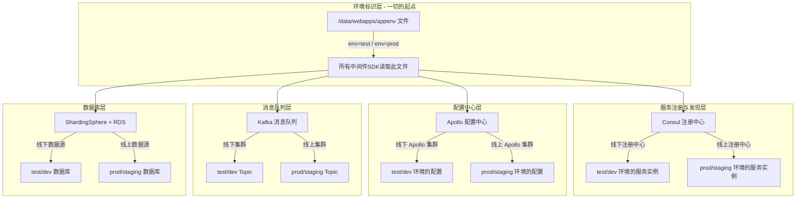

---

## 三、第一层：appenv 文件——环境标识的"身份证"

### 3.1 这是什么

每一台运行服务的机器上，都有一个文件：`/data/webapps/appenv`。这个文件极其简单，通常只有几行：

```
env=test
deployenv=qa
swimlane=ppl-abc123
zkserver=apollo-zk.test.vip.example.com:2181
```

或者在生产环境：

```
env=prod
deployenv=product
zkserver=apollo-zk.vip.example.com:2181
```

### 3.2 它的作用

这个文件是**整个环境感知体系的起点**。企业内部几乎所有中间件 SDK（Consul、Apollo、Kafka、ShardingSphere、SkyWalking 等）在启动时都会读取这个文件。SDK 根据 `env` 字段判断自己当前处于什么环境，然后决定连接哪个集群、注册到哪个注册中心、拉取哪套配置。

### 3.3 各环境的 appenv 标准内容

| 环境 | env 字段 | 含义 | 对应的基础设施集群 |
|------|----------|------|-------------------|
| 线上生产 | prod | 实际生产环境 | 线上 Consul 注册中心、线上 Apollo、线上 Kafka 集群 |
| 线上预发布 | staging | 生产环境的预发布 | 与 prod 共享线上集群，但可配置隔离 |
| 线下测试 | test | QA 测试环境 | 线下 Consul 注册中心、线下 Apollo、线下 Kafka 集群 |
| 线下开发 | dev | 开发环境 | 与 test 共享线下集群 |

### 3.4 关键认知

**线上和线下是天然物理隔离的。** 线上的 Consul 注册中心、Apollo 配置集群、Kafka 消息集群与线下的完全是不同的机器、不同的网络、不同的数据。它们之间无法互通。这不是靠代码逻辑做的"逻辑隔离"，而是**物理上就是两套独立的基础设施**。

所以你的代码在泳道（线下）运行时，SDK 读到 `env=test`，就去连线下的注册中心，自然只能发现线下的服务实例、拉到线下的配置、连到线下的数据库。发布到线上后，机器的 appenv 是 `env=prod`，SDK 就去连线上的注册中心，一切自动切换。

---

## 四、第二层：Consul 服务注册发现——"电话簿"是分环境的

### 4.1 工作原理

Consul 是公司的服务治理平台。每个微服务启动时，会把自己的 appkey（如 `com.example.xxx.orderservice`）、IP 地址、端口、环境标签等信息注册到 Consul 的注册中心。调用方需要调用下游服务时，从 Consul 查询该 appkey 的可用实例列表。

**注册中心本身是分线上线下的：**

- 线下注册中心：所有 `env=test` 或 `env=dev` 的服务都注册在这里
- 线上注册中心：所有 `env=prod` 或 `env=staging` 的服务都注册在这里

因此，一个在泳道运行的服务只能从线下注册中心发现其他线下的服务实例，永远不可能"意外"调用到线上的服务。

### 4.2 泳道内的路由隔离

在线下环境内部，还有更细粒度的隔离：**泳道路由**。

当你在 测试环境平台 创建一个泳道并部署服务时，测试环境平台 会：
1. 申请机器，设置 appenv 中的 `swimlane=xxx`
2. 部署你的代码到该机器
3. 服务启动时，Consul SDK 读取 swimlane 标签，注册时携带泳道信息

当一个请求在泳道内流转时，Consul 的路由逻辑是这样的：

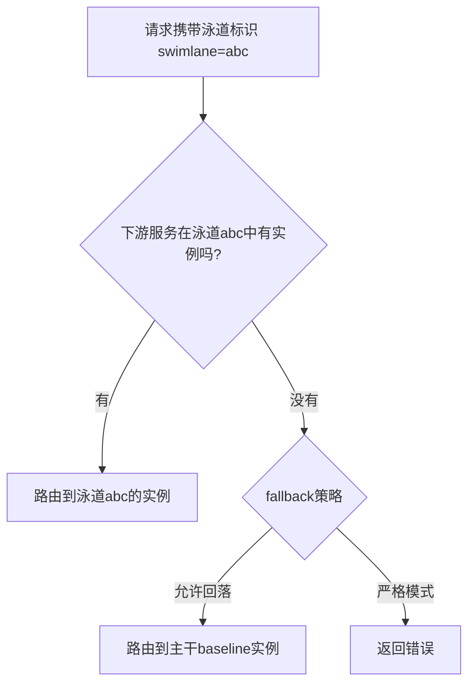

这就是为什么你在泳道里只部署了自己改动的那几个服务，但整条链路依然能跑通——没有改动的服务会回落到主干（baseline）环境。

### 4.3 流量染色与标签传递

泳道标识不是只在第一次调用时生效。它通过 SkyWalking（分布式追踪系统）的上下文传递机制在整条调用链中透传：

1. 请求进入泳道的第一个服务，SkyWalking 在上下文中写入泳道标识
2. 该服务调用下游时，RPC 框架（gRPC/Thrift）自动从 SkyWalking 上下文提取泳道标识，写入请求 Header
3. 下游服务收到请求后，Consul 根据 Header 中的泳道标识做路由决策
4. 如此递归，直到链路末端

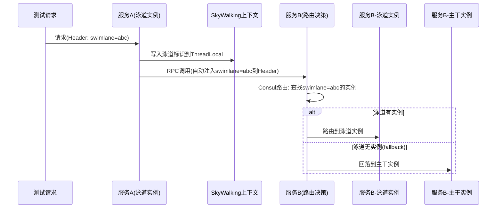

---

## 五、第三层：Apollo 配置中心——配置也是按环境隔离的

### 5.1 工作原理

Apollo 是统一配置管理平台。你的服务在代码中通过 `Apollo.get("some.config.key")` 获取配置值。Apollo SDK 启动时同样读取 appenv 文件，确定当前环境，然后连接对应环境的 Apollo 集群。

**Apollo 集群也是线上线下完全独立的：**

- 线下 Apollo：`apollo.mws-test.example.com`（管理端）
- 线上 Apollo：`apollo.mws.example.com`（管理端）

你在线下 Apollo 管理端配置的值，线上的服务永远读不到；反之亦然。

### 5.2 配置的分层模型

```
Apollo 配置结构：
├── appkey (项目标识)
│   ├── env=prod (线上配置)
│   │   ├── key1 = value_prod_1
│   │   └── key2 = value_prod_2
│   ├── env=staging (预发布配置)
│   │   └── key1 = value_staging_1
│   ├── env=test (测试配置)
│   │   ├── key1 = value_test_1
│   │   └── key2 = value_test_2
│   └── env=dev (开发配置)
│       └── key1 = value_dev_1
```

Apollo 还支持更细粒度的配置隔离：

- **泳道配置**：可以为特定泳道设置专属配置，泳道内的服务优先读取泳道配置
- **SET 配置**：可以为不同的 SET（服务集群分组）设置不同配置
- **分组配置**：可以按服务分组下发不同配置

### 5.3 实际效果

假设你的数据平台查询代码中有一行：

```java
String originUrl = Apollo.get("origin.api.url");
```

在线下 Apollo 中这个 key 的值是 `http://origin.test.example.com`，在线上 Apollo 中这个 key 的值是 `http://origin.example.com`。你的代码完全不用写 `if (env == "prod") { ... } else { ... }`——Apollo SDK 自动帮你读到正确环境的值。

### 5.4 本地 yml 还需要写什么？——Apollo 如何取代传统配置文件

在传统的 Spring Boot 项目里，你需要维护多套配置文件来区分环境：

```yaml
# application-dev.yml
spring:
  datasource:
    url: jdbc:mysql://dev-db:3306/order
    username: dev_user
    password: dev_pass123
  kafka:
    bootstrap-servers: kafka-dev:9092

# application-prod.yml
spring:
  datasource:
    url: jdbc:mysql://prod-db:3306/order
    username: prod_user
    password: ${DB_PASSWORD}  # 还得配合环境变量
  kafka:
    bootstrap-servers: kafka-prod-1:9092,kafka-prod-2:9092,kafka-prod-3:9092
```

然后启动时用 `--spring.profiles.active=prod` 来切换。这意味着每次加环境、加配置项都要改 yml 文件，改完还得重新构建部署。

**在这套体系下，这些全部不需要了。** 你的本地 `application.yml` 只写"与环境无关"的声明性内容：

```yaml
# application.yml —— 企业项目里你实际看到的内容
app:
  key: com.example.waimai.orderservice   # 我是谁（appkey）

server:
  port: 8080                              # 服务端口

# 框架行为配置（与环境无关的"怎么运行"）
thread-pool:
  core-size: 20
  max-size: 100

# 业务开关的key名（值从Apollo动态获取）
feature:
  coupon-msg-enabled: ${lion:waimai.order.coupon.enabled}
```

注意看：**没有数据库地址、没有 Kafka 集群地址、没有下游服务 URL、没有密码。** 这些全部托管在 Apollo 上，由 SDK 根据 appenv 自动拉取。

**配置的实际获取流程是这样的：**

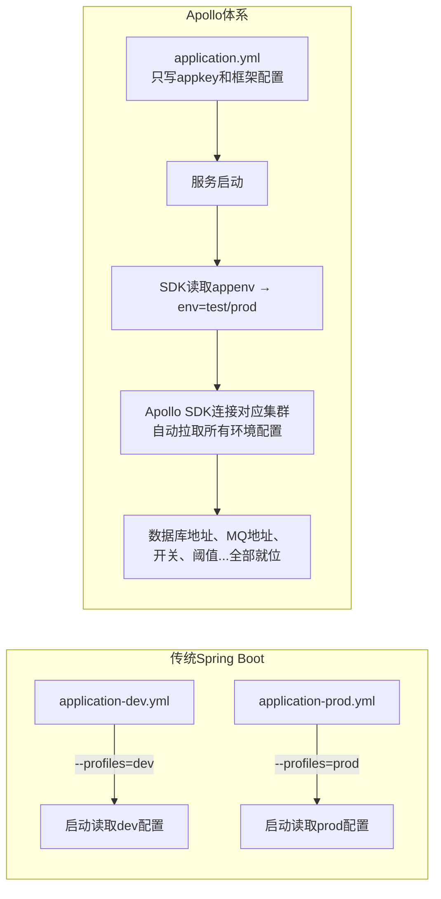

**一个真实的例子：ShardingSphere 是怎么拿到数据库连接的**

在传统项目里你得在 yml 中写 `spring.datasource.url = xxx`。在这种架构下，ShardingSphere（数据库中间件）的工作方式完全不同：

```java
// 你的代码只需要声明用哪个数据源的"逻辑名"
@Configuration
public class DataSourceConfig {
    @Bean
    public DataSource dataSource() {
        // "waimai_order" 是逻辑数据源名，不是连接地址
        return ShardingSphereDataSourceFactory.create("waimai_order");
    }
}
```

当 `ShardingSphereDataSourceFactory.create("waimai_order")` 被调用时，内部发生的事情：

1. ShardingSphere SDK 读取 appenv → 得知当前 `env=test`
2. ShardingSphere SDK 拿着逻辑名 `waimai_order` 去 Apollo 查询数据源配置
3. Apollo（线下集群）返回：`jdbc:mysql://test-order-db.example.com:3306/waimai_order`，以及用户名、密码、连接池参数等
4. ShardingSphere 用这些信息创建真实的数据库连接池

如果同一份代码运行在线上（`env=prod`）：
1. ShardingSphere SDK 读取 appenv → 得知当前 `env=prod`
2. 去线上 Apollo 查询 → 返回：`jdbc:mysql://prod-order-db.example.com:3306/waimai_order`（生产数据库地址）
3. 连接生产数据库

**整个过程中，你的代码里只出现了一个字符串 `"waimai_order"`（逻辑名），连配置文件里都没有真实的数据库地址。** 地址完全由 Apollo 按环境分发。

### 5.5 与开源 Nacos 的对比——它们本质上是同一套思路

如果你用过 Spring Cloud Alibaba 的 Nacos，会发现 Apollo 和它极其相似。实际上它们解决的是完全相同的问题，只是该方案做得更早（Apollo 在 Nacos 开源之前就已经在内部大规模使用了），且与内部基础设施深度绑定。

**功能对照表：**

| 能力 | Apollo | 阿里 Nacos | 传统 Spring Boot |
|------|----------|-----------|-----------------|
| 配置存储 | Apollo 管理端（按 appkey + env） | Nacos 控制台（按 namespace + group + dataId） | 本地 yml 文件 |
| 环境隔离 | appenv 的 env 字段 → 连不同 Apollo 集群 | namespace（dev/test/prod） | spring.profiles.active |
| 动态推送 | 支持（ZooKeeper 监听） | 支持（长轮询） | 不支持（改完得重启） |
| 服务发现 | Consul（独立组件） | Nacos 内置 | Eureka（独立组件） |
| 环境感知触发 | 机器上的 appenv 文件 | 启动参数 `-Dspring.cloud.nacos.config.namespace=xxx` | 启动参数 `--spring.profiles.active=xxx` |
| 数据库地址管理 | ShardingSphere 从 Apollo 自动获取 | 放在 Nacos 配置中心，应用启动时拉取 | 写在 yml 里 |
| 配置变更生效 | 实时推送，业务代码自动生效 | 实时推送，`@RefreshScope` 生效 | 改文件 + 重启 |

**关键差异点：**

1. **环境识别方式不同**：Nacos 需要你在启动命令或 bootstrap.yml 中显式指定 namespace；Apollo 完全靠机器上的 appenv 文件，开发者不需要传任何启动参数。这是该方案更"无感"的原因——环境信息由部署平台（测试环境平台/Jenkins）注入机器，而不是由开发者在启动命令中指定。

2. **物理隔离程度不同**：Nacos 通常是一套集群通过 namespace 逻辑隔离所有环境；Apollo 是线上线下物理部署两套独立集群，更加安全。

3. **配置拉取模式完全不同**：这是架构层面最本质的区别。

**Nacos 模式——"启动时统一拉取，注入 Spring 容器"：**

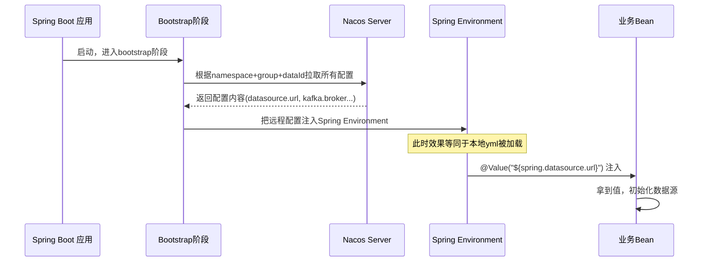

Nacos 的本质是"把远程配置拉下来模拟成本地配置文件"。拉下来之后，后续的使用方式和读本地 yml 完全一样——都是通过 Spring 的 `@Value`、`@ConfigurationProperties` 注入到 Bean 中。应用代码仍然通过 Spring 的机制获取配置，只是配置的来源从本地文件变成了远程 Nacos。

**Apollo 模式——"各 SDK 按需自取，去中心化"：**

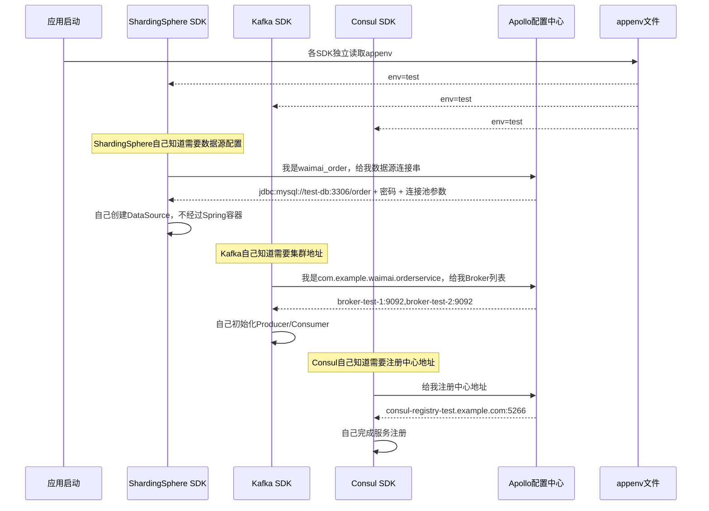

Apollo 模式下，**没有一个"统一拉取再分发"的 bootstrap 阶段**。每个中间件 SDK 都是自治的——它知道自己需要什么配置，自己去 Apollo 取，取完自己用。数据库连接串不会经过 Spring 的 `Environment`，不会被 `@Value` 注入，ShardingSphere 内部自己消化了。

**这就是为什么这类项目的 yml 几乎是空的**——不需要一个中心化的配置注入环节，每个组件各管各的。

**打个比方：**
- Nacos 像"集中采购"：公司统一从供应商进货（启动时拉配置），放到仓库（Spring Environment），各部门需要什么自己去仓库领（@Value 注入）
- Apollo 像"各部门直采"：每个部门（SDK）自己知道需要什么，直接联系供应商（Apollo）拿货，不经过公司仓库

4. **与中间件的集成深度不同**：这其实是第 3 点的直接结果。Nacos 管配置和服务发现，但数据库、消息队列等需要你自己在配置里写地址然后通过 Spring 注入；Apollo 与 ShardingSphere、Kafka、Redis 等深度集成，这些中间件的 SDK 直接内置了"去 Apollo 获取自己所需配置"的逻辑，开发者完全不用操心。

**如果用 Nacos 重新实现小张的例子，会是什么样？**

```yaml
# bootstrap.yml（Nacos 项目）
spring:
  cloud:
    nacos:
      config:
        server-addr: nacos.company.com:8848
        namespace: ${NACOS_NAMESPACE}  # 由部署平台注入：dev/test/prod
        group: waimai-order
      discovery:
        server-addr: nacos.company.com:8848
        namespace: ${NACOS_NAMESPACE}
```

```yaml
# Nacos 控制台上 —— namespace=test 的配置
# dataId: waimai-order-datasource.yml
spring:
  datasource:
    url: jdbc:mysql://test-db:3306/order
    username: test_user
    password: test_pass

# Nacos 控制台上 —— namespace=prod 的配置
# dataId: waimai-order-datasource.yml
spring:
  datasource:
    url: jdbc:mysql://prod-db:3306/order
    username: prod_user
    password: ${encrypted_prod_pass}
```

对比下来你会发现：**思路完全一样——配置集中管理，环境通过标识自动切换。** 只是 Nacos 还需要你在 bootstrap.yml 里声明 Nacos 的地址和 namespace 变量，而 Apollo 连这一步都省了（appenv 文件 + SDK 自动感知）。

**一句话总结：Apollo 是企业内部的"Nacos + 更深度集成"方案。如果你理解了 Nacos 的 namespace 隔离机制，把 namespace 换成 appenv 的 env 字段，把 Nacos 控制台换成 Apollo 管理端，你就理解了 Apollo。**

---

## 六、第四层：中间件层——每个组件都内建了环境感知

### 6.1 Kafka 消息队列

Kafka 是基于 Kafka 的消息队列。它的环境隔离有两个层面：

**物理隔离（线上 vs 线下）：**
- 线上线下是完全独立的 Kafka 集群，不同的 Broker、不同的 Topic、不同的数据
- SDK 根据 appenv 决定连接哪个集群

**逻辑隔离（环境隔离功能）：**
- 在同一套集群内（如线下），Kafka 支持 prod/staging/test/dev 四种环境隔离
- 开启环境隔离后，同一个 Topic 名称在不同环境下实际对应不同的物理分区
- test 环境的生产者只能写入 test 分区，test 环境的消费者只能消费 test 分区

**泳道隔离（泳道 2.0）：**
- 在测试环境内部，多个泳道之间通过"广播消费 + 客户端过滤"实现隔离
- 所有泳道的消息写入同一个 Topic，消息中自动携带泳道标识（通过 SkyWalking 透传注入）
- 每个泳道的消费者只消费属于自己泳道的消息

### 6.2 ShardingSphere 数据库中间件

ShardingSphere 是数据库访问层中间件，提供读写分离、分库分表等功能。数据库的环境隔离：

- **线上线下使用不同的数据库集群**：数据库连接信息通过 Apollo 配置，Apollo 本身按环境隔离，因此不同环境自动连接不同的数据库
- **数据源配置也是按环境存储的**：ShardingSphere 从 Apollo 获取数据源路由信息，而 Apollo 按环境返回对应的数据库连接串

### 6.3 Redis 缓存

Redis 是统一缓存平台，同样通过 appenv 感知环境：

- 线上线下连接不同的 Redis/Memcache 集群
- 配置中心按环境下发不同的缓存集群地址

---

## 七、第五层：测试环境平台 泳道平台——把以上全部串联起来的"编排者"

### 7.1 测试环境平台 做了什么

当你在 测试环境平台 上创建泳道并部署服务时，测试环境平台 在幕后完成了一系列动作：

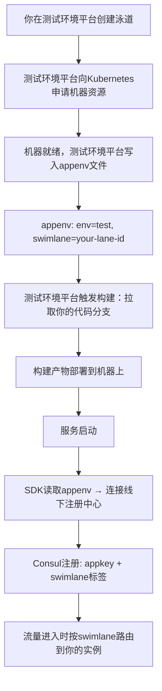

### 7.2 主干环境是什么

测试环境平台 的测试环境由"主干 + N 条泳道"组成：

- **主干（Baseline）**：部署的是 master 分支的稳定版本，所有服务都有实例在主干上。它相当于线下的"生产环境"——稳定、完整。
- **泳道**：只部署你正在开发/测试的那几个服务的新版本。泳道中没有部署的服务，流量会自动回落（fallback）到主干。

这就解释了为什么你只部署了一两个服务，整条链路就能跑通：

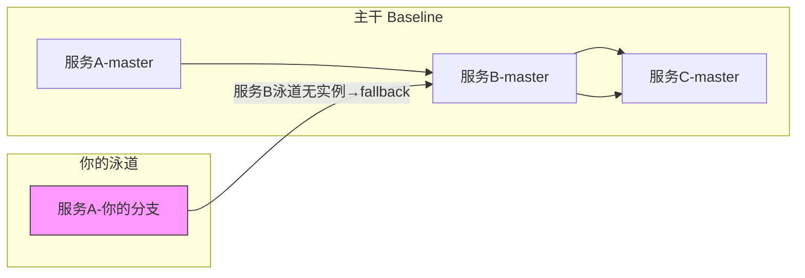

### 7.3 从泳道到线上：发布流程

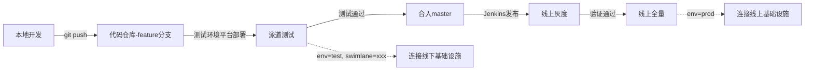

---

## 八、完整链路图：一次请求在不同环境的全路径

### 8.1 在泳道中

```
你的测试请求
    ↓
机器 appenv: env=test, swimlane=abc
    ↓
Consul SDK → 连接线下注册中心 → 带swimlane=abc注册
    ↓
Apollo SDK → 连接线下Apollo → 拉取test环境配置(origin.api.url = test地址)
    ↓
Kafka SDK → 连接线下Kafka集群 → test环境分区 → 泳道消息过滤
    ↓
ShardingSphere SDK → 从Apollo读数据源配置 → 连接线下测试数据库
    ↓
SkyWalking → 泳道标识全链路透传 → 下游服务路由到同泳道或fallback主干
```

### 8.2 在线上

```
用户真实请求
    ↓
机器 appenv: env=prod
    ↓
Consul SDK → 连接线上注册中心 → 发现线上服务实例
    ↓
Apollo SDK → 连接线上Apollo → 拉取prod环境配置(origin.api.url = 线上地址)
    ↓
Kafka SDK → 连接线上Kafka集群 → prod环境分区
    ↓
ShardingSphere SDK → 从Apollo读数据源配置 → 连接线上生产数据库
    ↓
SkyWalking → 正常链路追踪 → 流量隔离方案灰度隔离(如有)
```

---

## 九、核心设计原则总结

### 9.1 "约定优于配置"

整套体系的核心设计哲学是**约定优于配置**：

- 约定了 appenv 文件的路径和格式
- 约定了所有 SDK 都必须读取这个文件
- 约定了线上线下是物理隔离的独立集群
- 约定了泳道标识通过 SkyWalking 自动透传

开发者不需要"配置"环境切换，只需要遵守约定——把代码部署到哪里，它就自动连接那里的基础设施。

### 9.2 "分层隔离"

| 隔离层次 | 隔离方式 | 实现主体 |
|---------|---------|---------|
| 线上 vs 线下 | 物理隔离（独立集群、独立网络） | 基础架构部署 |
| prod vs staging | 逻辑隔离（同集群内按环境标签区分） | 中间件环境隔离功能 |
| test vs dev | 逻辑隔离 | 中间件环境隔离功能 |
| 泳道 vs 泳道 | 流量染色 + 路由规则 | Consul + SkyWalking + 流量调度平台 |
| 泳道 vs 主干 | 标签路由 + fallback | Consul 路由策略 |

### 9.3 "代码无感知"

这是最关键的设计目标。开发者写业务代码时不需要关心环境差异：

```java
// 错误的做法（你永远不需要这样写）：
if (System.getenv("ENV").equals("prod")) {
    url = "http://origin.example.com";
} else {
    url = "http://origin.test.example.com";
}

// 正确的做法（实际上是这样的）：
String url = Apollo.get("origin.api.url");  // Apollo根据环境自动返回正确的值
```

---

## 十、类比理解：用"高速公路"比喻整套体系

想象你开着一辆车（你的代码），车上有一个导航系统（中间件 SDK）。

- **车牌号**（appenv）告诉导航系统你属于哪个城市（哪个环境）
- **导航地图**（Consul 注册中心）有两个版本：城市内部地图（线下）和全国地图（线上）。导航根据车牌自动加载对应版本
- **高速公路**（主干环境）是所有车都能走的主路
- **专用车道**（泳道）是你临时申请的测试车道，走完测试后会被回收
- **收费站配置**（Apollo 配置）对城区道路和高速公路有不同的收费标准，车辆通过时自动识别
- **加油站**（数据库）也是分区域的，城区有城区的，高速服务区有服务区的

**你只需要开车（写代码），车开到哪里，导航就自动帮你连接那里的设施。**

---

## 十一、实际操作中的体现

### 11.1 本地开发

在你的 Mac 上，你需要手动创建 `/data/webapps/appenv` 文件：

```
env=test
deployenv=qa
zkserver=apollo-zk.test.vip.example.com:2181
```

这样你本地启动的服务就连接线下的所有基础设施。本地 Mac 的 env 只能配置为 dev 或 test。

### 11.2 泳道测试

你在 测试环境平台 上创建泳道并部署：
1. 测试环境平台 自动为机器写入 appenv（包含 swimlane 字段）
2. 你的代码构建后部署到这台机器
3. 服务启动后自动连接线下基础设施，并且注册到指定泳道

### 11.3 发布上线

代码合入 master 后通过 Jenkins 发布：
1. Jenkins 将产物部署到线上机器
2. 线上机器的 appenv 是 `env=prod`
3. 服务启动后自动连接线上基础设施

**全程无需修改一行代码。**

---

## 十二、常见疑问

### Q1：如果我在代码里硬编码了一个测试环境的地址，发布到线上会怎样？

会出问题。线上机器访问线下地址通常网络不通（物理隔离），即使通了也是严重的安全和合规问题。所以正确的做法是所有外部地址都通过 Apollo 配置获取，永远不要硬编码。

### Q2：为什么泳道的服务能调通主干的服务？不是隔离的吗？

泳道隔离的意思是"泳道的流量优先在泳道内路由"，但如果下游服务在泳道中没有部署实例，Consul 的 fallback 机制会将请求路由到主干。这是设计上有意为之的——你只需要在泳道中部署自己改动的服务，其余服务复用主干的稳定版本。

### Q3：线上的 staging 和 prod 是怎么隔离的？

staging 和 prod 共享同一套物理集群（都是线上集群），但通过 流量隔离方案 或环境隔离标签实现逻辑隔离。比如 Kafka 的环境隔离功能会让 staging 环境的消息和 prod 环境的消息走不同的分区。

### Q4：如果我想让泳道里的服务用一个特殊的配置，怎么办？

Apollo 支持泳道级别的配置覆盖。在 Apollo 管理端为特定的 swimlane 设置配置值，泳道内的服务会优先读取泳道配置，读不到才 fallback 到 test 环境的默认配置。

### Q5：这套机制能防止线上流量打到线下吗？

物理隔离天然防止了这一点。线上的 Consul 注册中心里根本没有线下服务的注册信息，线上机器也无法访问线下的 Apollo/Kafka/数据库。即使有人恶意修改代码，网络层面就已经隔绝了。

---

## 十三、完整实例：开发人员小张的一天

> 以下用一个虚构但贴近真实的完整故事，把前面所有知识点串联起来。跟着小张走一遍从接需求到上线的全过程，你就能体会到这套"环境自动切换"的体系在每个环节分别做了什么。

### 13.1 背景

小张是外卖业务团队的一名后端开发，负责订单服务（appkey: `com.example.waimai.orderservice`）。今天他接到一个需求：**在用户下单时，异步发送一条消息给优惠券服务，为用户发放满减券。**

这个需求涉及的改动：
- **订单服务**：下单逻辑中新增 Kafka 消息发送
- **优惠券服务**（appkey: `com.example.waimai.couponservice`）：新增 Kafka 消费者，接收消息后发券

小张只负责订单服务的改动。优惠券服务由同事小李负责。

---

### 13.2 第一幕：本地开发（Mac 电脑）

小张打开 IntelliJ，从 Git 上拉了一个 feature 分支 `feature/order-send-coupon-msg`。他写了这段代码：

```java
@Service
public class OrderService {

    // Kafka 生产者，Topic 名称从 Apollo 读取
    @KafkaProducer(topic = "${waimai.order.coupon.topic}")
    private Producer<String, OrderCouponMessage> couponProducer;

    // 下游优惠券服务的 RPC 客户端（通过 Consul 发现）
    @OctoConsumer(appkey = "com.example.waimai.couponservice")
    private CouponService couponService;

    public void createOrder(OrderRequest request) {
        // 1. 创建订单（写数据库，通过 ShardingSphere）
        Order order = orderDao.insert(request);

        // 2. 异步发消息给优惠券服务（通过 Kafka）
        OrderCouponMessage msg = new OrderCouponMessage(order.getUserId(), order.getAmount());
        couponProducer.send(msg);

        // 3. 同步查询用户可用优惠券（通过 Consul RPC）
        List<Coupon> coupons = couponService.queryAvailable(order.getUserId());
    }
}
```

注意：**这段代码里没有任何环境判断逻辑。** 没有 `if (env == "test")`，没有硬编码地址。

小张的 Mac 上有这个文件——`/data/webapps/appenv`：

```
env=test
deployenv=qa
zkserver=apollo-zk.test.vip.example.com:2181
```

他在本地启动服务，此时发生了什么：

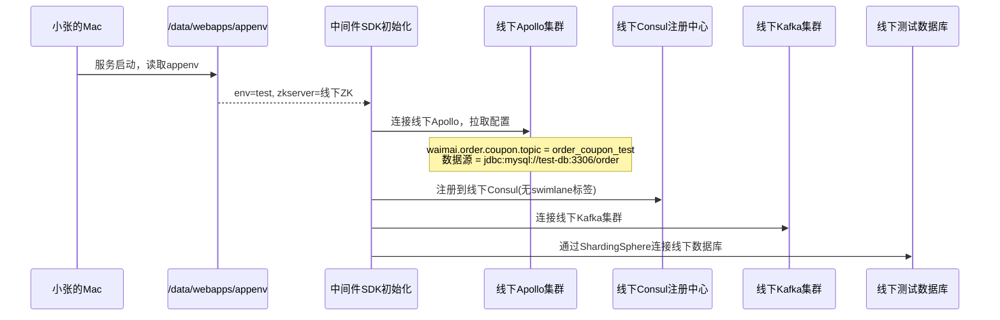

小张在本地用 Postman 发了一个下单请求：
- `orderDao.insert()` → 数据写入**线下测试数据库**（不会碰到线上任何真实用户的订单数据）
- `couponProducer.send()` → 消息发送到**线下 Kafka 集群**的 test 环境分区
- `couponService.queryAvailable()` → Consul 从**线下注册中心**找到优惠券服务的测试实例，RPC 发送到那边

本地验证通过。代码推到远程分支。

---

### 13.3 第二幕：泳道测试（测试环境平台 平台）

小张打开 测试环境平台 平台，创建了一条泳道：`ppl-zhang-coupon-msg`。他在泳道中部署了自己的订单服务（分支 `feature/order-send-coupon-msg`）。

同事小李也把优惠券服务的消费者代码部署到了**同一条泳道**。

**测试环境平台 在幕后做了什么：**

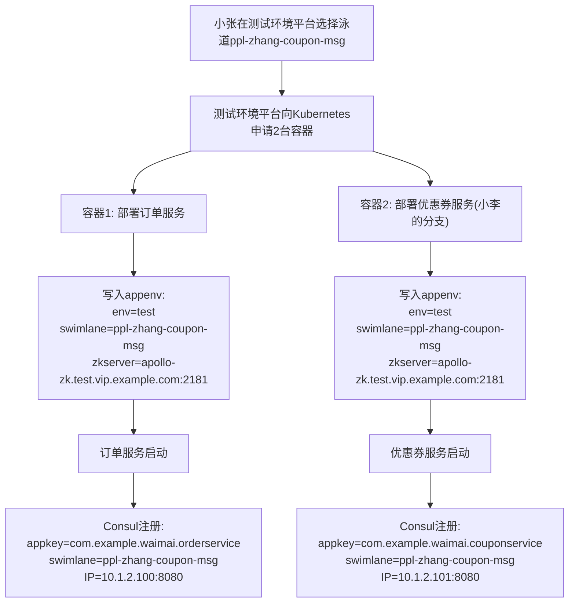

两个服务都启动了。现在小张要发一个测试请求来验证整条链路。他通过 测试环境平台 的泳道入口发起请求（请求 Header 中会自动注入 `swimlane=ppl-zhang-coupon-msg`）。

**请求的完整流转路径：**

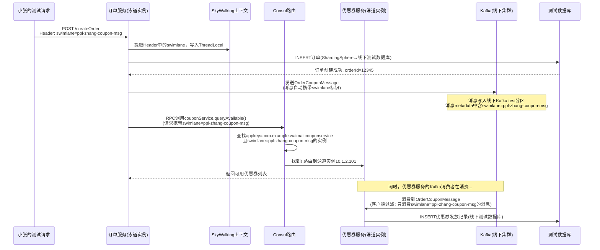

**关键观察点：**

1. **RPC 路由到泳道实例**：小张调用优惠券服务时，Consul 发现同泳道有实例，直接路由过去。如果小李没有在这条泳道部署优惠券服务，请求会 fallback 到主干的优惠券服务（master 版本，还没有消费者逻辑，但 queryAvailable 接口是存在的）。

2. **Kafka 消息泳道隔离**：小张的订单服务发出的消息会携带泳道标识。小李在同泳道的优惠券消费者只会收到本泳道的消息，不会收到主干环境或其他泳道的消息。同样，主干的消费者也不会消费到泳道的消息。

3. **数据库是共享的**：注意这里泳道和主干共用同一个线下测试数据库。这是因为数据库不像无状态服务那样容易隔离——每个泳道建一套数据库成本太高。所以测试数据在数据库层面是"混"在一起的，隔离主要发生在服务层和消息层。

---

### 13.4 第三幕：问题排查——泳道中调用了一个没部署的服务

测试过程中，小张发现下单流程还会调用**库存服务**（appkey: `com.example.waimai.stockservice`）做扣减。库存服务没有在他的泳道中部署。

**会发生什么？**

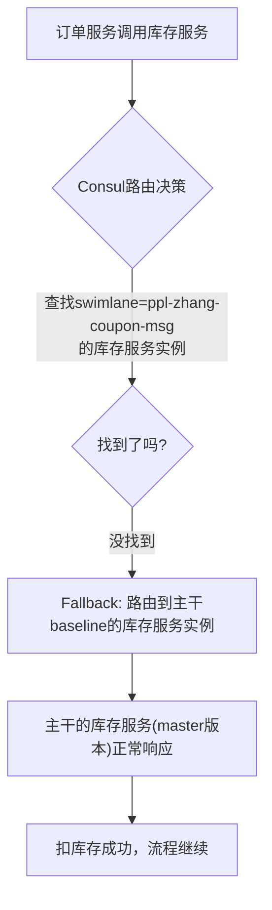

完全没有问题。这就是泳道 fallback 机制的价值——小张不需要把整条链路上所有服务都在泳道中部署一遍，只部署自己改动的部分就够了。

---

### 13.5 第四幕：代码合入 master

测试通过后，小张和小李分别提交了 MR（Merge Request），代码合入 master 分支。

此时 测试环境平台 泳道可以销毁了。销毁后，泳道的机器被回收，Consul 中泳道实例的注册信息也随之消失。

---

### 13.6 第五幕：发布上线（Jenkins）

小张通过 Jenkins 发起上线。Jenkins 的发布流程：

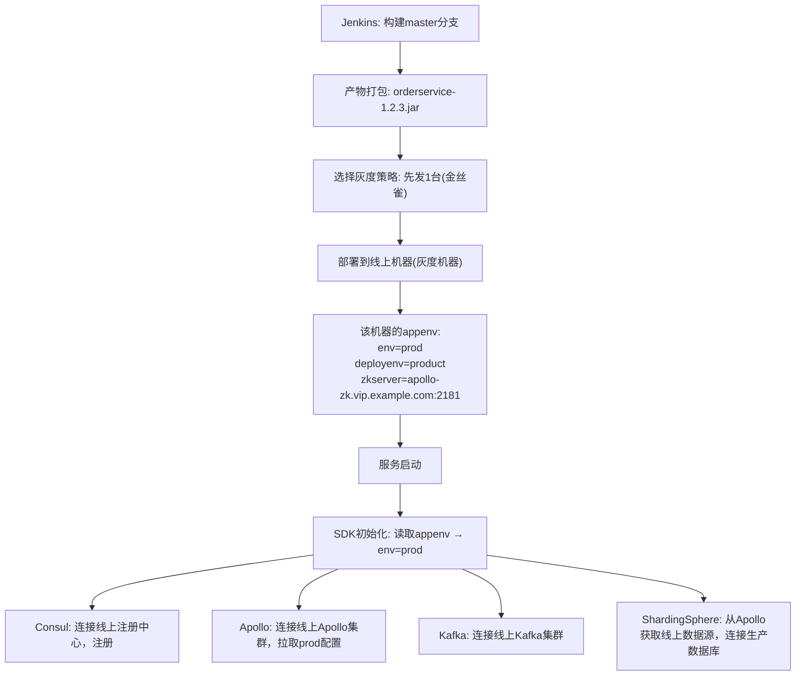

**这一刻的魔法发生了：** 同一份代码（`orderservice-1.2.3.jar`），之前在泳道连的是线下的一切，现在部署到线上机器后，因为 appenv 变成了 `env=prod`，所有 SDK 自动切换到线上集群。

**同一行代码在不同环境的效果对比：**

| 代码 | 泳道中(env=test) | 线上(env=prod) |
|------|-----------------|----------------|
| `Apollo.get("waimai.order.coupon.topic")` | 返回 `order_coupon_test` | 返回 `order_coupon_prod` |
| `couponProducer.send(msg)` | 发到线下 Kafka 集群 test 分区 | 发到线上 Kafka 集群 prod 分区 |
| `couponService.queryAvailable()` | Consul 路由到线下优惠券服务实例 | Consul 路由到线上优惠券服务实例 |
| `orderDao.insert()` | 写入线下测试数据库 | 写入线上生产数据库 |

**小张没有改动任何一行代码、任何一个配置文件。** 环境切换完全由部署目标机器的 appenv 驱动。

---

### 13.7 第六幕：灰度验证

Jenkins 灰度发布了 1 台。此时线上有 20 台订单服务机器：
- 19 台运行旧版本（没有发送优惠券消息的逻辑）
- 1 台运行新版本（小张的代码）

用户流量通过负载均衡随机分配到 20 台机器。大约 5% 的请求会命中新版本那台。

小张在 SkyWalking 上观察灰度机器的调用链路：
- 确认消息成功发送到线上 Kafka
- 确认优惠券服务（小李也已经灰度上线了）成功消费消息并发券
- 确认没有异常日志

验证通过后，Jenkins 全量发布剩余 19 台。上线完成。

---

### 13.8 全流程回顾：同一行代码的"环境旅程"

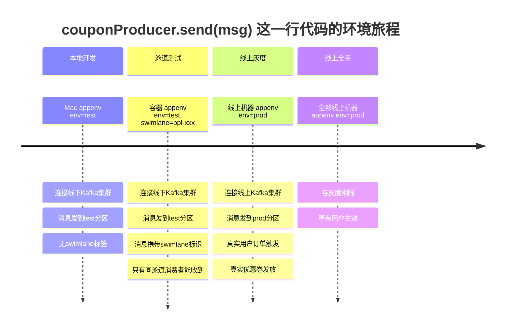

---

### 13.9 小张全程没有做的事情

回顾整个流程，以下这些事情小张**完全不需要做**：

- 没有为不同环境写不同的配置文件（如 `application-dev.yml`、`application-prod.yml`）
- 没有在代码里判断当前环境然后连接不同的地址
- 没有手动修改数据库连接串
- 没有手动指定 Kafka 集群地址
- 没有告诉 Consul "我现在要调用测试环境的优惠券服务"
- 没有在发布前修改任何"环境变量"
- 没有为泳道和线上准备两套部署配置

他唯一做的就是：**写业务代码，用标准 SDK 调用基础设施。** 剩下的，基础设施自己搞定了。

---

### 13.10 如果没有这套体系会怎样？

想象一下如果企业没有 appenv + SDK 自动感知这套机制，小张的日常会是什么样：

```
# 本地开发时
修改 application.yml：
  mafka.broker = mafka-test.example.com:9092
  db.url = jdbc:mysql://test-db:3306/order
  coupon.service.url = http://coupon-test.example.com

# 提测时
修改 application.yml：
  mafka.broker = mafka-test.example.com:9092  （碰巧一样）
  db.url = jdbc:mysql://test-db:3306/order     （碰巧一样）
  coupon.service.url = http://coupon-test.example.com  （碰巧一样）
  
# 上线时
修改 application.yml：
  mafka.broker = mafka-prod.example.com:9092  ← 忘了改？线上消息发到测试集群
  db.url = jdbc:mysql://prod-db:3306/order     ← 写错了？测试数据写入生产库
  coupon.service.url = http://coupon.example.com  ← 漏了？测试请求打到线上
```

每一次环境切换都是一次人工操作，每一次人工操作都是一个潜在故障点。当你有几百个微服务、几千个配置项时，手动管理环境就是灾难。

**这就是为什么大厂要花这么大力气建设基础设施——不是为了炫技，是为了让几千个小张同时开发而互不干扰、不出事故。**

---

## 十四、与全链路灰度的关系

本文讨论的多环境隔离主要解决的是**开发 → 测试 → 生产**的环境切换问题。而目录中另一篇文档《全链路灰度测试架构解析》讨论的是**生产环境内部**的流量隔离问题（灰度发布）。

两者的区别和联系：

| 维度 | 多环境隔离（本文） | 全链路灰度 |
|------|-------------------|-----------|
| 发生在哪里 | 跨环境（dev/test/prod） | 生产环境内部 |
| 隔离方式 | 物理集群隔离 + appenv 标识 | 流量染色 + 标签路由（流量隔离方案） |
| 目的 | 保证开发测试不影响线上 | 保证新版本发布不影响全部用户 |
| 数据 | 完全不同的数据集 | 共享生产数据或用影子表隔离 |
| 管理平台 | 测试环境平台（泳道管理） | Jenkins + 流量调度平台（灰度规则） |
| 共同底座 | Consul + Apollo + SkyWalking + appenv |

它们共享同一套底层基础设施（Consul 路由、SkyWalking 上下文传递、Apollo 配置分发），只是在不同的场景下发挥作用。

---

## 十五、总结：这套体系为什么能"无感"工作

回到最初的问题：一套代码，为什么能自动连接正确的环境？

答案分三层：

1. **机器身份层**：每台机器通过 appenv 文件声明"我是谁"（哪个环境、哪个泳道）
2. **SDK 感知层**：所有中间件 SDK 在启动时读取 appenv，自动连接对应的集群
3. **基础设施层**：线上线下完全独立的集群确保了物理隔离不可逾越

这三层共同构成了一个"约定驱动"的环境感知体系。开发者只需要遵守一个约定——**用 Apollo 获取配置，用 Consul 发现服务，用标准 SDK 访问中间件**——环境切换就是全自动的。

这就是大型企业微服务架构的优雅之处：**把复杂性下沉到基础设施，让业务开发者保持简单。**
