# 全链路灰度测试架构解析

> 本文档结合材料.txt中的全链路灰度设计理论与企业内部实际基础设施，帮助你理解测试开发日常工作中涉及的所有核心概念、平台和流程。

---

## 一、全景架构图：一个请求在企业内部是怎么流转的

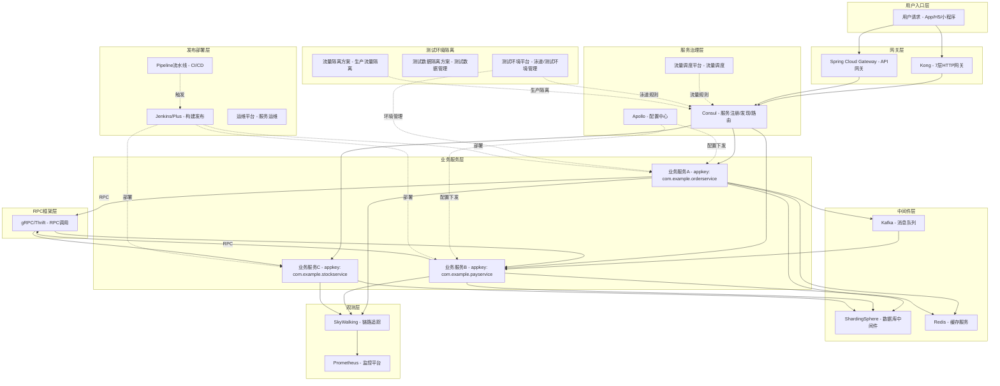

---

## 二、核心概念词典：从"不懂"到"能说明白"

### 2.1 服务标识与治理

| 名词 | 英文/缩写 | 是什么 | 类比 | 在全链路灰度中的作用 |
|------|-----------|--------|------|---------------------|
| **AppKey** | Application Key | 每个微服务在 Consul 平台注册的唯一标识符，格式如 `com.example.inf.octo.xxx` | 相当于每个服务的"身份证号" | 路由决策的基本单元，灰度规则按 appkey 绑定到具体服务 |
| **Consul** | Open Communication Technology Organization | 企业服务治理平台，管理服务注册、发现、负载均衡、熔断和灰度路由 | 相当于"服务的电话号码簿+交通调度中心" | 全链路灰度的核心路由引擎，决定请求打到哪个泳道的实例 |
| **Apollo** | 配置中心 | 企业统一配置管理平台，支持动态配置下发和灰度配置 | 相当于"所有服务的开关面板" | 材料中的"配置中心层"，按灰度上下文返回不同配置 |

### 2.2 环境与泳道

| 名词 | 英文/缩写 | 是什么 | 类比 | 在全链路灰度中的作用 |
|------|-----------|--------|------|---------------------|
| **泳道 (Swimlane)** | Lane / Swimlane | 一套完整的隔离测试环境，包含一组服务实例，互相之间流量隔离 | 相当于游泳池的泳道——每条道上的人只在自己道里游 | 材料中"灰度泳道模型"的核心概念：lane-a、lane-b 各自独立 |
| **主干 (Baseline)** | Trunk / Baseline | 默认的、稳定的主测试环境链路 | 相当于高速公路的主车道 | 材料中的 baseline lane，灰度流量回落时的兜底目标 |
| **测试环境平台** | 测试环境平台 | 企业管理泳道和测试环境的平台，支持创建/销毁/配置泳道 | 相当于"泳道的物业管理处" | 材料中"灰度泳道管理"的实际实现平台 |
| **流量隔离方案** | 生产流量隔离 | 生产环境下的流量隔离方案，用于灰度发布、压测和故障演练 | 相当于生产环境的"安全实验室" | 材料中"全链路灰度不是测试环境"——流量隔离方案 是真正的生产灰度 |
| **SET化** | 系统级隔离 | 按地域/业务将服务集群分组，实现容灾和弹性 | 相当于把服务部署到不同城市的数据中心 | 全链路灰度的更高层次：地域级别的流量隔离 |
| **流量调度平台** | 流量调度平台 | 管理流量染色、隔离规则和泳道路由策略 | 相当于"交通总指挥部" | 材料中"统一灰度控制面"的实际实现 |

### 2.3 网关与接入

| 名词 | 英文/缩写 | 是什么 | 类比 | 在全链路灰度中的作用 |
|------|-----------|--------|------|---------------------|
| **Kong** | 7层HTTP网关 | 企业统一接入网关，处理 HTTP 流量路由、限流、鉴权 | 相当于小区大门的保安+导航牌 | 材料中"入口层"的实现：识别灰度流量、注入灰度 Header |
| **Spring Cloud Gateway** | API网关 | 企业 API 网关，管理 API 路由和服务编排 | 相当于快递分拣中心 | 入口层灰度规则的执行者之一 |

### 2.4 RPC 与通信

| 名词 | 英文/缩写 | 是什么 | 类比 | 在全链路灰度中的作用 |
|------|-----------|--------|------|---------------------|
| **gRPC** | RPC框架 | 企业自研 RPC 框架，服务间同步调用 | 相当于服务之间打电话的"电话线" | 材料中"服务调用层"的载体，负责传播灰度 Header |
| **Thrift** | RPC框架 | 基于 Apache Thrift 的 RPC 框架 | 同上，另一种"电话线" | 同样承载灰度上下文传播 |
| **Service Mesh** | 服务网格 | 将通信逻辑从应用代码剥离到 Sidecar，统一管理流量 | 相当于每个服务旁边站了一个"翻译+导航员" | 材料中 Istio 模型的企业落地方式 |

### 2.5 中间件

| 名词 | 英文/缩写 | 是什么 | 类比 | 在全链路灰度中的作用 |
|------|-----------|--------|------|---------------------|
| **Kafka** | 消息队列 | 企业基于 Kafka 的分布式消息系统 | 相当于"留言信箱"——异步通信 | 材料中"消息队列层"：灰度消息必须写入 Header 或用独立 Topic |
| **ShardingSphere** | 数据库中间件 | 企业数据库路由中间件，管理分库分表和读写分离 | 相当于"数据库的交通警察" | 材料中"数据库层"：根据灰度上下文路由到灰度库 |
| **Redis** | 缓存服务 | 企业统一缓存平台 | 相当于"记忆便签本"——快速存取 | 材料中"缓存层"：灰度 key 必须加命名空间隔离 |

### 2.6 链路追踪与观测

| 名词 | 英文/缩写 | 是什么 | 类比 | 在全链路灰度中的作用 |
|------|-----------|--------|------|---------------------|
| **SkyWalking** | 分布式追踪 | 企业分布式链路追踪系统 | 相当于快递单号追踪——能看到请求经过了哪些服务 | 材料中"观测层"：记录灰度维度，区分灰度和基准的错误 |
| **TraceId** | 追踪ID | 一次完整请求的全局唯一标识 | 相当于快递单号 | 材料明确说"traceId 不作为灰度路由依据"，只用于追踪 |
| **SpanId** | 跨度ID | 一次请求中每个服务调用段的标识 | 相当于快递到每个中转站的签收记录 | 观测用途，不参与灰度路由 |
| **Prometheus** | 监控平台 | 企业统一监控告警平台 | 相当于"仪表盘+警报器" | 按灰度泳道统计错误率、延迟、限流次数 |
| **测试数据隔离方案 (SwimlaneStore)** | 测试数据管理 | 泳道级别的存储隔离方案 | 相当于每条泳道有自己的储物柜 | 材料中"数据库隔离"的企业内部实现方案之一 |

### 2.7 发布部署

| 名词 | 英文/缩写 | 是什么 | 类比 | 在全链路灰度中的作用 |
|------|-----------|--------|------|---------------------|
| **Jenkins/Plus** | 发布平台 | 企业统一服务发布平台：构建→部署→灰度→验证→全量 | 相当于"上线流水线的总控台" | 材料中"统一发布流程"的执行平台 |
| **运维平台** | 运维平台 | 服务/主机自助运维管理平台 | 相当于"服务器的物业管家" | 管理服务实例的上下线、扩缩容 |
| **Pipeline/流水线** | CI/CD | 代码从提交到上线的自动化流程 | 相当于工厂的"流水生产线" | 材料中"发布编排"的自动化实现 |

---

## 三、请求链路详细流程图

### 3.1 一次普通请求的完整链路

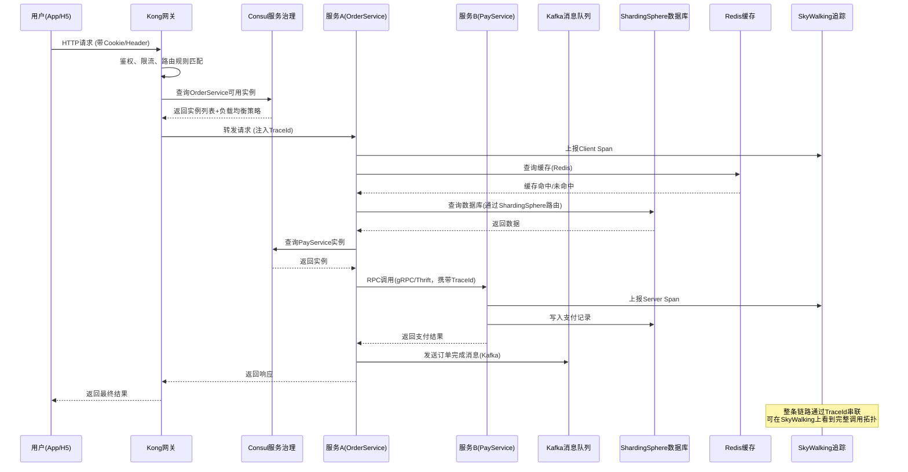

### 3.2 全链路灰度场景下的请求链路

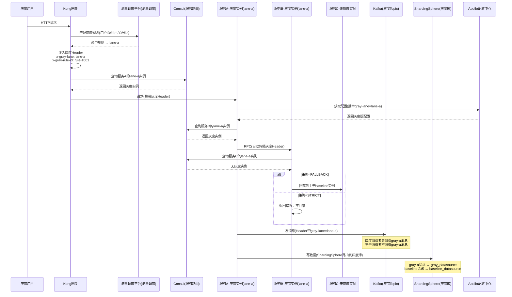

---

## 四、泳道与测试环境架构

### 4.1 泳道模型详解

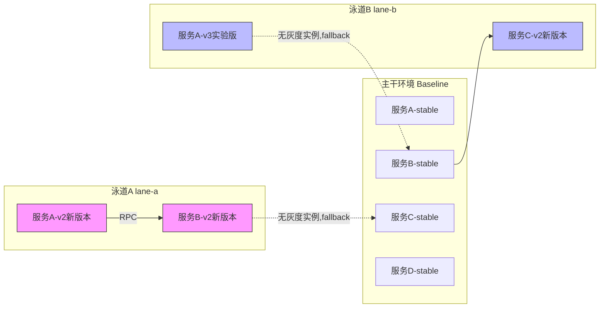

**核心理解**：泳道不需要包含所有服务。只有需要测试新版本的服务才会在泳道中部署灰度实例，其他服务回落到主干。这就是材料中"FALLBACK/STRICT/BASELINE_ONLY"策略的意义。

### 4.2 泳道管理平台（测试环境平台）的工作方式

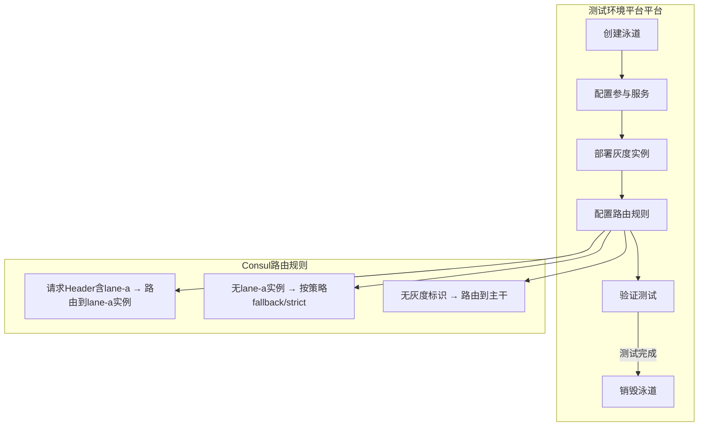

---

## 五、发布上线全流程

### 5.1 一次标准发布的完整流程

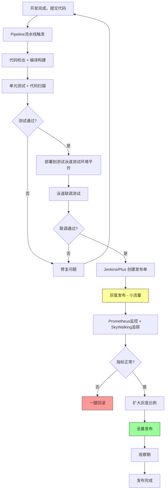

### 5.2 灰度发布与全链路灰度的关系

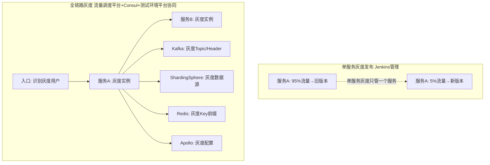

**关键区别**：
- **单服务灰度**（Jenkins管理）：只控制一个应用的新旧版本流量比例
- **全链路灰度**（流量调度平台+Consul+测试环境平台协同）：控制整条调用链，从入口到DB、MQ、缓存全部隔离

---

## 六、材料.txt 各章节 → 企业实际落地对照

| 材料章节 | 核心概念 | 企业内部对应平台/组件 |
|----------|----------|----------------------|
| §2.1 Header传播 | W3C Trace Context, Baggage | SkyWalking（追踪传播）+ Consul（灰度Header传播） |
| §2.2 服务网格 | Istio VirtualService/DestinationRule | Consul 服务路由 + Service Mesh |
| §2.3 权重分流 | Gateway API HTTPRoute | Kong/Spring Cloud Gateway 网关路由 |
| §2.4 渐进式发布 | Argo Rollouts | Jenkins/Plus 灰度发布流程 |
| §4.1 控制面 | 统一灰度控制面 | 流量调度平台(流量调度平台) + 测试环境平台 |
| §4.3 泳道模型 | baseline/gray lanes | 测试环境平台泳道管理 |
| §5.1 入口层 | API Gateway灰度识别 | Kong + Spring Cloud Gateway |
| §5.2 服务调用层 | RPC灰度Header传播 | gRPC/Thrift + Consul路由 |
| §5.4 配置中心层 | 灰度配置 | Apollo配置中心 |
| §5.6 消息队列层 | MQ隔离 | Kafka（独立Topic/Header过滤） |
| §5.7 数据库层 | 灰度数据隔离 | ShardingSphere路由 + 测试数据隔离方案 |
| §5.8 缓存层 | 缓存命名空间隔离 | Redis灰度Key |
| §5.9 观测层 | 灰度维度观测 | SkyWalking + Prometheus |
| §6 防混淆控制 | Header签名/清洗/路由策略 | Consul+流量调度平台规则引擎 |

---

## 七、核心流程：灰度上下文如何穿透整条链路

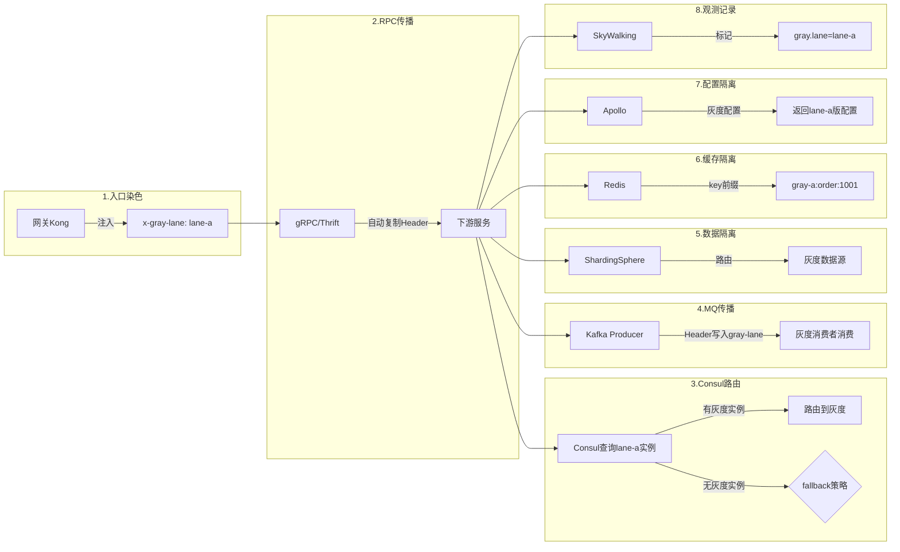

---

## 八、"链路断裂"风险点——材料中的防混淆设计在企业中的意义

材料§6提到的每个控制点，在企业内部都有真实的"踩坑场景"：

### 8.1 线程池上下文丢失

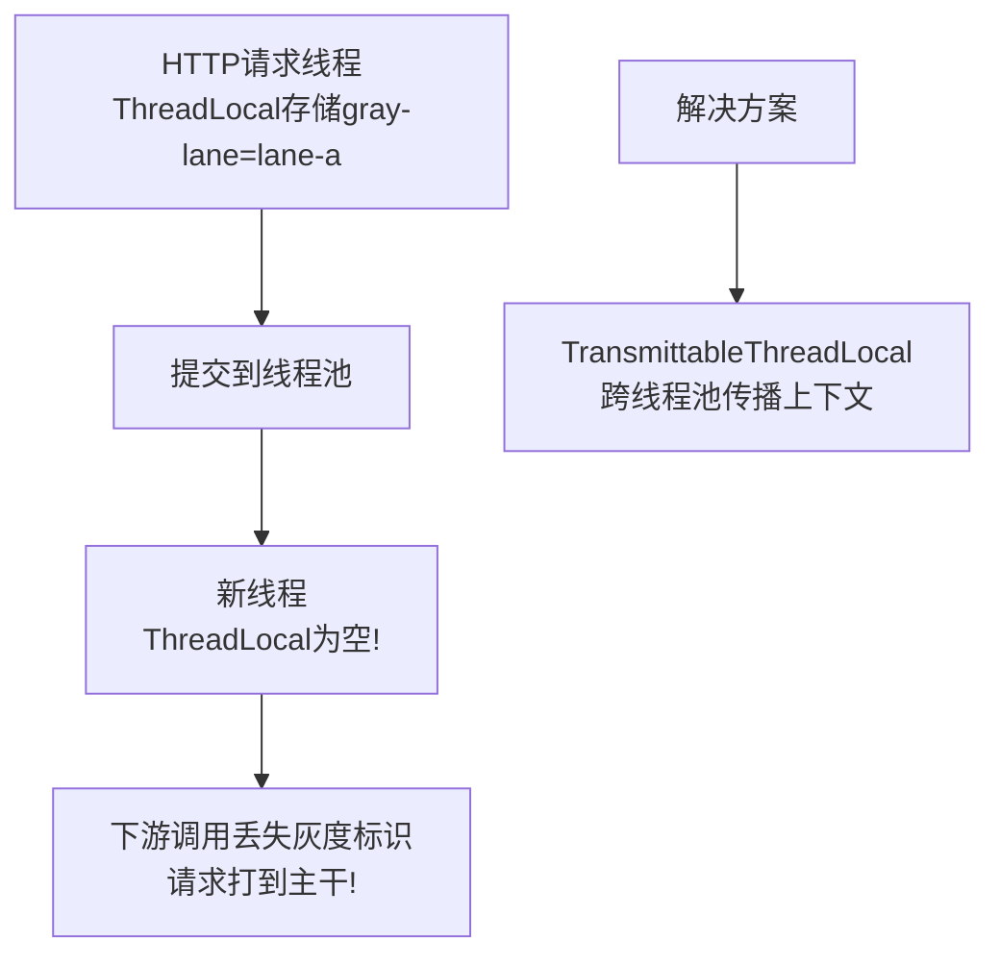

### 8.2 消息队列断裂

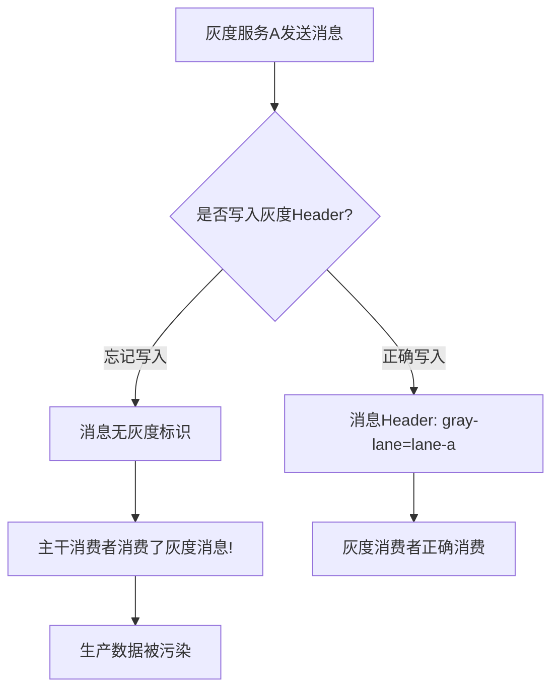

### 8.3 缓存污染

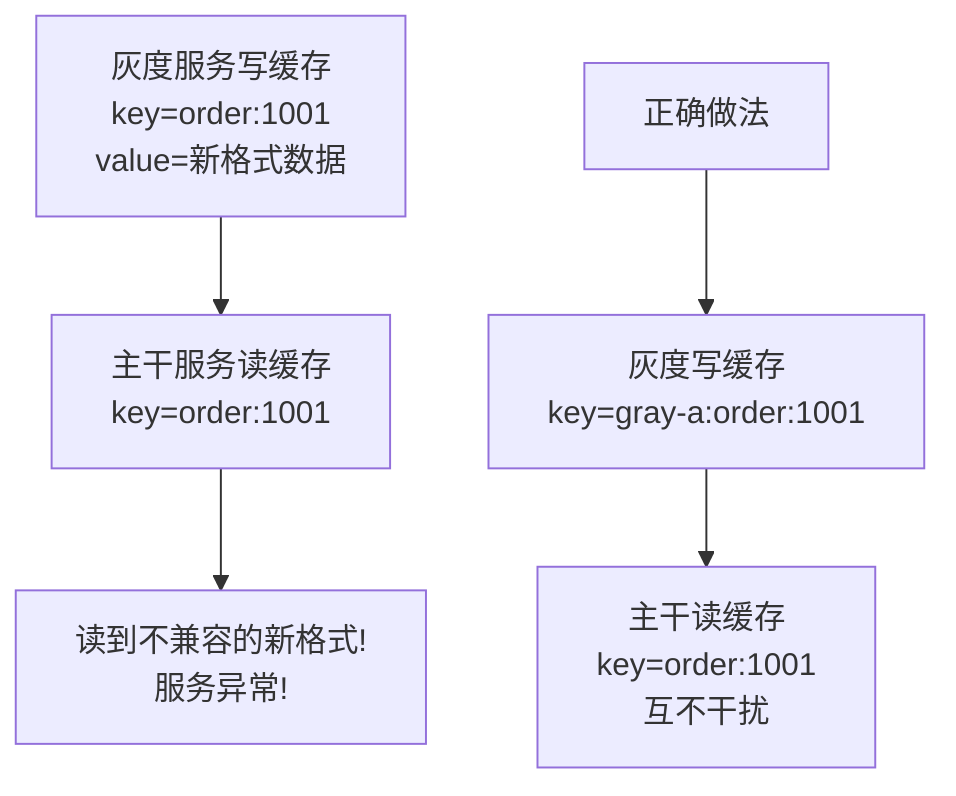

---

## 九、名词关系总图

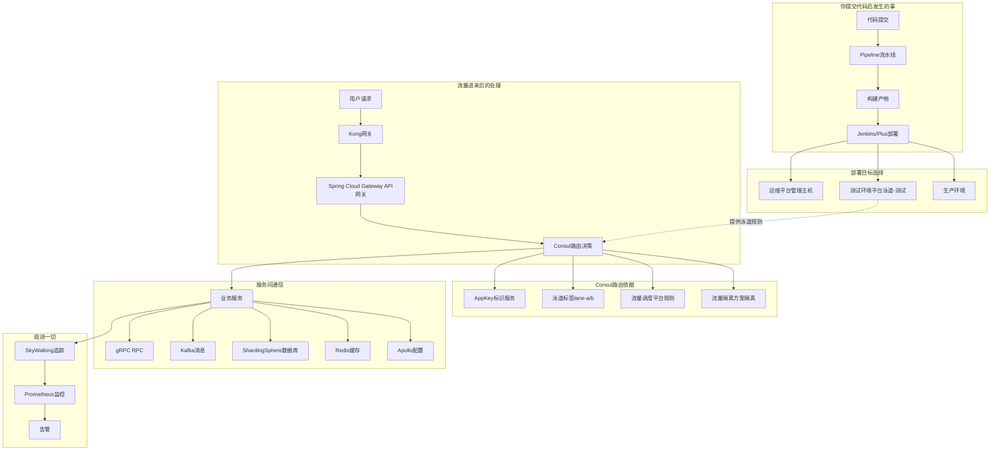

---

## 十、总结：一句话理解每个概念

| 你听到的词 | 一句话解释 |
|------------|-----------|
| AppKey | 服务的身份证号，Consul用它识别"这是哪个服务" |
| 泳道 | 一套隔离的测试环境，多人开发互不干扰 |
| 主干 | 默认的稳定环境，泳道找不到实例时回落到这里 |
| 灰度发布 | 先让一小部分流量走新版本，没问题再全量 |
| 全链路灰度 | 从入口到数据库、消息队列全部按泳道隔离，不只是一个服务 |
| Consul | 管理服务注册、发现和路由的"总调度" |
| 测试环境平台 | 创建和管理泳道的平台 |
| 流量调度平台(流量调度平台) | 决定"哪些流量走哪条泳道"的规则引擎 |
| Kong | HTTP入口网关，第一个接触用户请求的地方 |
| Spring Cloud Gateway | API网关，做API层面的路由 |
| gRPC/Thrift | 服务之间RPC调用的框架 |
| Kafka | 消息队列，异步通信用的 |
| ShardingSphere | 数据库中间件，决定SQL打到哪个库 |
| Redis | 缓存服务，加速数据读取 |
| Apollo | 配置中心，动态下发配置 |
| SkyWalking | 链路追踪，用TraceId串联一次请求的所有调用 |
| Prometheus | 监控告警平台 |
| Jenkins/Plus | 发布上线的操作台 |
| 运维平台 | 服务和主机的运维管理 |
| Pipeline | CI/CD流水线，代码到上线的自动化 |
| 流量隔离方案 | 生产环境流量隔离，真正的灰度 |
| 测试数据隔离方案 | 泳道的数据存储隔离方案 |
| TraceId | 请求的全局追踪号，不参与路由决策 |
| Header传播 | 灰度标识通过HTTP/RPC Header一路传递 |
| 回落(Fallback) | 泳道没有对应实例时，退回主干 |

---

## 十一、FAQ

**Q: 我在日常测试中，"建个泳道测一下"具体发生了什么？**

1. 在 测试环境平台 上创建一条新泳道（比如 lane-dev-zhh）
2. 选择你要测试的几个服务，部署新版本到这条泳道
3. Consul 会自动配置路由规则：带有 `lane=lane-dev-zhh` 标识的请求 → 走你的泳道实例
4. 你的泳道中没有的服务 → 自动回落主干
5. 测试完毕 → 销毁泳道，资源释放

**Q: AppKey和服务名是什么关系？**

AppKey 是服务在 Consul 注册的唯一标识（格式如 `com.example.xxx.yyy`），一个服务有一个 AppKey。所有的路由规则、监控指标、配置下发都以 AppKey 为单位。

**Q: 材料中的"Istio"在企业中是什么？**

企业使用 Consul + Service Mesh 来实现类似 Istio 的能力。VirtualService 对应 Consul 的路由规则，DestinationRule 对应 Consul 的实例标签和负载策略。不需要直接操作 Istio YAML，Consul 平台提供了可视化配置。

**Q: "灰度发布"和"泳道测试"有什么区别？**

- **泳道测试**：在测试环境做的，用 测试环境平台 管理，跑的是测试流量
- **灰度发布**：在生产环境做的，用 Jenkins/Plus 管理，跑的是真实用户流量的一小部分
- **全链路灰度**：无论测试还是生产，整条链路都按灰度身份隔离

---

## 十二、完整实战案例：从零开始的全链路灰度之旅

下面用一个完整的故事来演示整个过程。假设你是某到店业务部的测试开发工程师小张，现在有一个跨三个服务的需求要上线——订单服务（OrderService）需要新增一个"预约到店"功能，这个功能涉及调用门店服务（ShopService）的新接口，并且下单成功后要通过消息队列通知库存服务（StockService）扣减预约库存。目前线上只有这三个服务的 stable 版本在主干上正常运行，没有任何泳道和灰度环境存在。

### 12.1 初始状态：一切都在主干上

此时的世界很简单。三个服务各自只有一组实例跑在生产环境的主干（baseline）上。它们的 AppKey 分别是 com.example.daodian.orderservice、com.example.daodian.shopservice、com.example.daodian.stockservice。所有用户请求从 Kong 网关进来，Consul 把流量路由到这三个服务的 stable 实例上，Kafka 里只有一个 topic 叫 order_event，StockService 的消费者组正常消费所有消息，ShardingSphere 路由到主库，Redis 缓存正常读写，Apollo 下发的是线上正式配置，SkyWalking 记录着每条链路的 TraceId。一切平静如常。

### 12.2 开发完成，推代码触发流水线

小张和合作的研发同学在各自分支上完成了代码开发。OrderService 新增了 /api/order/reserve 接口，ShopService 新增了 /api/shop/checkSlot 接口，StockService 的消费者新增了对"预约扣减"消息类型的处理逻辑。

三位研发分别把代码合并到各自服务的 develop 分支，推送到 Git 仓库。推送动作触发了 Pipeline 流水线。流水线做了这些事：第一步，代码检出（checkout），把最新代码拉到构建机器上。第二步，编译构建（build），Maven 或 Gradle 把代码编译成可部署的 JAR 包。第三步，执行单元测试和静态代码扫描，确保没有明显的 bug 和规范问题。第四步，如果上述步骤全部通过，产出一个带版本号的构建产物（artifact），比如 orderservice-2.3.1-SNAPSHOT.jar。如果某一步失败，流水线中断，开发者收到通知去修复。

### 12.3 创建泳道，部署测试环境

构建产物准备好后，小张登录 测试环境平台 平台创建一条新泳道，命名为 lane-reserve-test。创建泳道时，测试环境平台 做了以下几件事：在 Consul 注册了一组新的路由规则——当请求头中携带 x-gray-lane: lane-reserve-test 时，对 OrderService、ShopService、StockService 这三个 AppKey 优先路由到泳道实例。在 Kafka 中配置了消息隔离策略——带有 gray-lane=lane-reserve-test 标识的消息只会被泳道中的 StockService 消费者消费。在 Apollo 中创建了泳道级别的配置副本，允许在泳道中使用不同的配置参数进行测试。

然后小张在 测试环境平台 上选择这三个服务的最新构建产物，点击"部署到泳道"。测试环境平台 调用 运维平台 在测试集群中拉起三个服务的新实例，并为这些实例打上标签 lane=lane-reserve-test。部署完成后，Consul 的服务注册表中就同时存在了每个服务的两组实例：一组是 lane=baseline（主干），一组是 lane=lane-reserve-test（泳道）。

### 12.4 泳道测试：模拟完整链路

小张开始在泳道中进行联调测试。他的测试请求需要携带特殊的 Header 才能进入泳道。实际操作中，他可以通过 测试环境平台 平台的"流量入口"功能，或者在测试工具中手动添加 x-gray-lane: lane-reserve-test 这个 Header。

一个测试请求的完整旅程如下：小张发起一个 POST /api/order/reserve 请求，这个请求携带了 x-gray-lane: lane-reserve-test。请求到达 Kong 网关，网关识别出这个 Header，不做清洗（因为是来自内部测试入口），直接透传。网关问 Consul："OrderService 有没有 lane-reserve-test 的实例？"Consul 回答："有"，于是请求被路由到泳道中的 OrderService 新版本实例。

OrderService 新版本处理请求时，需要调用 ShopService 的 /api/shop/checkSlot 接口。gRPC RPC 框架自动把当前请求的灰度 Header 复制到出站调用中。Consul 收到查询后发现 ShopService 也有泳道实例，于是路由到泳道中的 ShopService 新版本。ShopService 返回"门店有可用时段"。

OrderService 创建订单写入数据库时，ShardingSphere 识别到灰度上下文，将写请求路由到测试数据源（或者按 测试数据隔离方案 策略写入隔离的测试表）。写入缓存时，Redis SDK 自动在 key 前加上泳道前缀：lane-reserve-test:order:20001。

订单创建成功后，OrderService 向 Kafka 发送一条"预约库存扣减"消息。gRPC/Kafka SDK 自动在消息 Header 中写入 x-gray-lane=lane-reserve-test。Kafka broker 根据隔离策略，确保这条消息只会被泳道中的 StockService 消费者拉取。StockService 泳道实例收到消息，处理库存扣减逻辑，同样写入隔离的测试数据源。

整个过程中，SkyWalking 记录了完整的调用链，每个 Span 上都标记了 gray.lane=lane-reserve-test。小张在 SkyWalking 控制台上按泳道过滤，可以清晰地看到自己的测试请求经过了哪些服务、每段耗时多少、有没有异常。

### 12.5 泳道测试中遇到的问题场景

**场景一：某个服务忘记部署到泳道。** 小张发现他的测试链路中，有一个下游服务 NotifyService（发送短信通知）没有在泳道中部署新版本。这时 Consul 按照路由策略处理：如果 NotifyService 配置的策略是 FALLBACK，请求会回落到主干的 stable 实例——这意味着测试请求走了主干的通知服务。如果策略是 STRICT，请求会直接返回错误，不允许跨泳道调用。小张根据实际情况选择：如果 NotifyService 不涉及本次变更，FALLBACK 没问题；如果需要严格隔离避免测试短信发给真实用户，就设置 STRICT 并把 NotifyService 也部署到泳道中。

**场景二：线程池导致灰度上下文丢失。** OrderService 内部有一个异步操作——创建订单后会提交一个任务到线程池去异步更新用户的"最近订单"缓存。小张在 SkyWalking 上发现这个异步操作的 Span 没有 gray.lane 标记，并且缓存写入没有加泳道前缀，写到了主干的缓存空间中。原因是普通 ThreadLocal 中的灰度上下文在切换线程后丢失了。解决方案是使用 TransmittableThreadLocal（TTL）或者在提交线程池任务时显式包装 Runnable，把灰度上下文捕获并恢复到新线程中。

**场景三：消息消费串了泳道。** 在早期配置不当的情况下，小张发现主干的 StockService 消费者也消费到了他的测试消息。原因是 Kafka 的消费者组没有正确配置过滤规则。解决方式是在 测试环境平台 创建泳道时确保 Kafka 隔离策略正确下发——要么用独立的 topic（order_event_lane_reserve_test），要么配置消费端的 Header 过滤表达式确保主干消费者跳过所有带灰度标识的消息。

**场景四：缓存击穿主干数据。** 小张的测试请求读取一个商品信息时，泳道的 Redis 缓存中没有这条数据（因为泳道是新建的，缓存是冷的）。如果 SDK 直接去查主干缓存并命中，可能读到的是旧版本格式的数据。策略是：对于只读且格式不变的数据，允许读主干缓存作为 fallback；对于格式有变更的数据，必须从泳道数据源重新加载并写入泳道缓存空间。

### 12.6 泳道测试通过，准备灰度发布

联调测试全部通过后，小张在 测试环境平台 上销毁泳道（释放测试资源），然后研发同学把代码合并到 release 分支，触发正式的发布流水线。这一次的流水线更加严格：代码检出 → 编译构建 → 单元测试 → 集成测试 → 代码质量门禁 → 生成生产级构建产物（orderservice-2.3.1-RELEASE.jar）。

研发同学登录 Jenkins/Plus 平台，创建一个发布单。发布单中指定了三个服务要一起发布，选择灰度发布策略。Jenkins 会按照以下步骤编排：首先部署灰度实例——在生产集群中启动三个服务的新版本实例各 1-2 台，打上灰度标签（比如 lane=gray-canary）。然后配置入口灰度规则——通过流量调度平台（流量调度平台）平台设置："对 5% 的线上用户流量（按用户 ID 取模），在 Kong 网关入口处注入 x-gray-lane: gray-canary，路由到灰度实例"。

### 12.7 灰度发布期间：真实用户流量的走向

灰度规则生效后，线上 5% 的用户请求开始走灰度链路。大部分用户（95%）完全感知不到任何变化，他们的请求照旧走主干 stable 实例。但对于命中灰度的那 5% 用户，一次完整请求的经历如下：

用户小王打开 App 点击"预约到店"。请求到达 Kong 网关，网关调用流量调度平台规则引擎，发现小王的用户 ID 对 100 取模结果落在 0-4 的区间内，命中灰度规则。网关在请求中注入 x-gray-lane: gray-canary 和 x-gray-rule-id: rule-2001，同时写入 baggage header 以便全链路传播。然后网关向 Consul 查询 OrderService 的 gray-canary 实例，路由到新版本。

OrderService 新版本处理小王的预约请求，通过 gRPC 调用 ShopService。gRPC SDK 自动把灰度 Header 带到出站请求，Consul 将其路由到 ShopService 的灰度实例。ShopService 返回可预约时段。OrderService 写入数据库，此时 ShardingSphere 根据灰度上下文，按照预先配置的策略决定数据路由——在灰度发布场景中，通常写入的还是同一个生产库（因为这是真实订单），但会在订单记录中打上灰度标记字段方便追溯。写缓存时，Redis 将灰度数据写入独立命名空间。

OrderService 发送下单成功消息到 Kafka，消息头中携带灰度标识。灰度版本的 StockService 消费这条消息，扣减库存。同时主干版本的 StockService 消费者不会拉取到这条消息，避免了新老逻辑冲突。

整个过程中，SkyWalking 记录了这条灰度链路的完整拓扑，Prometheus 监控平台实时统计灰度实例的 QPS、延迟 P99、错误率，并与主干实例的指标做对比展示。

### 12.8 灰度期间可能出现的异常及应对

**情况一：灰度实例报错率上升。** Prometheus 监控发现 OrderService 灰度实例的 500 错误率从 0.1% 上升到了 2%。运维和开发立即在 SkyWalking 上按 gray.lane=gray-canary 过滤，定位到是 ShopService 新接口在某个边界条件下抛了空指针异常。此时的应对方案是：在 Jenkins/Plus 上点击"一键回滚"，流量调度平台立即摘除灰度规则，Kong 网关不再注入灰度 Header，所有流量回到主干。灰度实例仍然存在但不再接收流量。开发修复 bug 后重新走一遍流水线和灰度流程。

**情况二：灰度流量"逃逸"到主干。** 在 SkyWalking 上发现有些灰度用户的请求链路中途断裂——某个中间服务调用了一个旧版 SDK 的内部服务，这个服务没有正确透传灰度 Header。于是从这个节点开始，后续所有下游调用都丢失了灰度标识，被 Consul 路由到了主干实例。表现为：一个本应全程走灰度的请求，前半段走灰度、后半段走主干。解决方式是：排查哪个服务的 SDK 版本过旧不支持 Header 透传，推动升级；或者在该服务前面部署 Sidecar 来自动传播上下文。在此之前，可以在流量调度平台规则中将该服务标记为 BASELINE_ONLY，明确声明它不参与灰度，而不是让流量静默地混合。

**情况三：消息队列产生灰度脏数据。** 灰度版本的 OrderService 发了一条格式稍有变化的消息（新增了一个字段），但由于消息隔离规则配置有误，这条消息被主干的 StockService 消费到了。主干 StockService 的旧代码不认识新字段倒是没报错（忽略了未知字段），但它按旧逻辑处理了这条消息，导致库存扣减逻辑不正确。应对方式：首先修复 Kafka 隔离规则确保灰度消息不会流入主干消费者；然后对已经被错误消费的消息做数据修复（这就是为什么材料中强调"有副作用的消息优先独立 Topic"的原因）。

**情况四：灰度配置污染主干。** 有人在 Apollo 配置中心发布了一个配置变更，但忘记限定在灰度维度下发布，导致主干实例也读到了灰度版本的配置参数。主干服务行为异常。应对方式：Apollo 支持灰度配置隔离，正确的操作是在灰度命名空间下发布配置。配置变更也需要纳入灰度控制面的管理，不能绕过流量调度平台直接在 Apollo 上操作。

**情况五：灰度用户体验不一致。** 用户小王有时走灰度、有时走主干（因为他用了多台设备，或者按百分比桶每次请求计算结果不一样）。体验上表现为：有时能看到"预约到店"按钮，有时看不到。应对方式是确保灰度规则的粒度足够稳定——按用户 ID 分桶而不是按请求随机，这样同一个用户要么一直走灰度、要么一直走主干，不会来回跳动。

### 12.9 灰度验证通过，全量发布

经过 24-72 小时的灰度观察，Prometheus 上的各项指标显示灰度实例的表现与主干持平甚至更优（延迟降低、无错误上升）。研发团队决定全量推开。

在 Jenkins/Plus 上执行"全量发布"：第一步，流量调度平台移除灰度入口规则，Kong 网关不再对任何请求注入灰度 Header。第二步，Jenkins 将所有主干实例滚动升级为新版本——逐批替换，每批替换后观察指标，确认正常再替换下一批。第三步，灰度实例标签改为 baseline，与主干实例合并。第四步，Apollo 上的灰度配置被全量推开为正式配置，旧的灰度命名空间配置被清理。第五步，Kafka 的灰度隔离规则被移除，所有消费者回到统一消费模式。第六步，Redis 中灰度命名空间的缓存自然过期或被清理。

此时，线上又回到了"只有主干、没有泳道、没有灰度"的简洁状态，但所有服务已经运行着新版本的代码。下一次需求开发时，同样的循环再来一遍。

### 12.10 全流程时间线总结

整个过程可以抽象为一条时间线：

第一阶段（开发期，1-2周）：代码开发 → 推送到 Git → Pipeline 流水线编译构建 → 产出构建产物。这个阶段不涉及任何泳道和灰度，只是纯代码工作。

第二阶段（联调测试期，3-5天）：在 测试环境平台 上创建泳道 → 部署服务到泳道 → Consul 配置泳道路由 → 测试请求带 Header 走泳道链路 → SkyWalking 观察链路 → 发现和修复问题 → 确认联调通过 → 销毁泳道。这个阶段的流量是人工构造的测试流量，不影响任何真实用户。

第三阶段（灰度发布期，1-3天）：Jenkins 创建发布单 → 部署灰度实例到生产 → 流量调度平台配置入口灰度规则 → 小比例真实流量走灰度链路 → Prometheus 实时监控 → SkyWalking 验证链路完整性 → 逐步扩大比例。这个阶段的流量是真实用户流量的一小部分，需要严格观察。

第四阶段（全量发布，半天-1天）：移除灰度规则 → 滚动升级主干实例 → 清理灰度资源 → 回到"全主干"状态。

这就是从一行代码到服务万千用户之间发生的全部事情。每个名词、每个平台、每条规则，都在这个流程中找到了自己的位置。AppKey 是服务的门牌号，Consul 是路由的交警，泳道是独立的测试公路，流量调度平台是灰度规则的调度中心，Kong 是高速入口的收费站，gRPC 是服务之间的快递员，Kafka 是异步的信件系统，ShardingSphere 是数据库的交通灯，Redis 是快速记忆的便签本，SkyWalking 是全程的行车记录仪，Prometheus 是时刻盯着仪表盘的安全员，Jenkins 是发布按钮的操控台，Pipeline 是按下按钮后自动运转的流水线——它们共同构成了一个请求从诞生到完成的完整世界。

---

## 十三、从第一性原理重新理解整套体系（叙事版）

想象你现在是一个刚入职企业的工程师，第一天打开电脑，你面对的是一个由几百个微服务组成的系统。每一个服务都有一个叫 AppKey 的东西，比如 `com.example.daodian.orderservice`，这就是它在整个系统中的身份证号。所有服务启动后都会去一个叫 Consul 的平台"报到"——"我是订单服务，我在这台机器上，端口是8080"。Consul 就像一本实时更新的电话号码簿，谁要找订单服务，问 Consul 就行，Consul 还会告诉你哪台机器比较空闲你应该打给哪台。

### 13.1 一个请求的正常旅程

现在一个用户在 App 上点了"下单"。这个请求首先到达 Kong，它是整个系统的大门——一个 7 层 HTTP 网关。Kong 做了几件事：验证你是不是合法用户、看看这个请求有没有超频需要限流、然后决定往哪转。有时候请求会先经过 Spring Cloud Gateway——一个更偏 API 管理的网关，负责做接口级别的路由编排。总之，网关层就是入口的保安加导航员。

网关决定了这个请求应该去订单服务，于是问 Consul："订单服务现在有哪些活着的实例？"Consul 返回一组 IP 地址，网关选一个转发过去。同时网关生成了一个 TraceId——一个全局唯一的追踪号——注入到请求头里。从这一刻起，不管这个请求后面经过多少个服务，都能通过这个 TraceId 串联起来。

请求到了订单服务。订单服务处理业务逻辑时要读数据库——但它不是直接连数据库的，中间隔了一层叫 ShardingSphere 的数据库中间件。ShardingSphere 决定这条 SQL 该去主库还是从库、该去哪个分片。订单服务还要读缓存加速——用的是 Redis，企业的统一缓存服务，避免每次都去查库。

处理完自己的逻辑后，订单服务需要调用支付服务。它通过 gRPC（或者 Thrift）这种 RPC 框架发起调用。gRPC 的作用就像服务之间的电话线——它会自动去 Consul 查支付服务的地址，建立连接，把请求发过去，还顺手把 TraceId 也带过去。支付服务处理完返回结果。

订单创建成功后，订单服务还要异步通知库存服务"扣一件库存"。这种不需要立即等回复的通信就用 Kafka——企业的消息队列。订单服务往 Kafka 里丢一条消息，库存服务的消费者会自己去拉取并处理。这就是同步调用（gRPC RPC）和异步通信（Kafka 消息）的区别。

整个过程中，每个服务的每次调用都会被 SkyWalking 记录下来。SkyWalking 是分布式链路追踪系统，它通过 TraceId 把所有调用串成一棵树，你能看到请求从网关进来，到了订单服务，又到了支付服务，每一段花了多少毫秒，哪里报了错。而 Prometheus 则是监控大盘——它汇总所有服务的 QPS、延迟、错误率，发现异常就告警。

以上就是没有灰度、没有泳道时，一个请求在企业内部的正常流转路径。每个服务需要的配置——比如超时时间、开关、阈值——由 Apollo 这个配置中心统一管理和动态下发。

### 13.2 安全上线新功能：泳道测试

假设你要给订单服务加一个新功能，同时支付服务也有配套改动。代码写完后，你把代码推到 Git。推送触发了 Pipeline 流水线——这是 CI/CD 的自动化流程：拉代码、编译、跑单元测试、做代码扫描，全部通过后生成一个可部署的 JAR 包。这个过程不涉及任何环境的事，纯粹是代码变成可运行程序的过程。

接下来是测试。你不可能拿着新代码直接在生产环境上跑，也不想和其他同事的改动互相干扰。这时候你需要一条泳道。泳道这个名字非常形象——就像游泳池里的泳道，每条道是独立的，你在你的道里游，同事在他的道里游，互不影响。整个游泳池里还有一条"主道"叫主干（Baseline），它跑的是当前线上稳定的版本。

你在 测试环境平台 平台上创建一条泳道，比如叫 lane-my-feature。测试环境平台 做的事情是：帮你在测试集群起几台机器跑你的新版本服务，给这些实例打上标签 `lane=lane-my-feature`，然后告诉 Consul 一条新规则——"如果请求头带着 `x-gray-lane: lane-my-feature`，就把它路由到这些新实例上"。同时 测试环境平台 还帮你在 Kafka 和 ShardingSphere 上配置了隔离规则，确保你的测试数据不会跑到主干的数据库和消息队列里去。运维平台 是管理这些机器的运维平台，测试环境平台 通过它来拉起和销毁实例。

泳道创建好后你开始测试。你发出的请求带上那个特殊的 Header，它就像一张"通行证"。网关看到这个 Header 就知道你要去泳道而不是主干。Consul 根据标签找到你泳道里的实例，请求被路由过去。你的订单服务调支付服务时，gRPC 会自动把这个 Header 复制到下一跳的请求里——这叫灰度上下文传播——所以支付服务也会被路由到泳道里的新版本。

如果某个下游服务你没改、也没部署到泳道里怎么办？Consul 发现泳道里没有这个服务的实例，就会按策略处理：如果配置的是 FALLBACK，请求会回落到主干那个服务的 stable 版本，毕竟它没变化你也不需要测它的新版本；如果配置的是 STRICT，Consul 直接报错，不允许跨泳道调用，适用于那种必须严格隔离的场景（比如发短信的服务，你不想测试的时候真给用户发短信）。

### 13.3 泳道中常见的"坑"

测试过程中你可能会踩一些坑。比如你的服务内部有个线程池异步处理任务，新线程里的 ThreadLocal 是空的，灰度 Header 丢失了，导致异步调用跑到主干去了。比如你发 Kafka 消息时忘记写入灰度 Header（或者 SDK 版本太旧不支持），主干的消费者吃到了你的测试消息把生产数据搞脏了。比如你的泳道缓存是冷的，读了主干的缓存但格式不兼容。这些都是真实会遇到的问题，解决方案就是：确保上下文传播机制覆盖线程切换（用 TransmittableThreadLocal）、确保消息隔离规则正确配置、确保缓存 key 带泳道前缀。

### 13.4 灰度发布：把新版本放到生产环境试水

测试通过后你销毁泳道释放资源，然后进入正式的灰度发布阶段。这时候代码合到 release 分支，正式流水线产出生产级 JAR 包，研发在 Jenkins/Plus 上创建发布单。Jenkins 是企业的发布操控台，它做的事是：在生产集群起几台新版本实例（打标签 `lane=gray-canary`），然后通过流量调度平台配置一条灰度规则——"线上 5% 的用户（按用户 ID 取模），在 Kong 网关处注入灰度 Header，路由到灰度实例"。

灰度规则生效后，95% 的用户完全无感，照旧走主干。那 5% 的用户的请求会全链路走灰度——从网关到服务到消息队列到数据库到缓存到配置，都按灰度身份隔离。这就是全链路灰度和单服务灰度的区别：单服务灰度只是"这一个服务有 5% 流量走新版本"，全链路灰度是"整条调用链从头到尾都按灰度身份走新版本"。前者的问题是下游服务可能还是旧版本在处理灰度流量，新旧逻辑混合会出问题；后者保证了一致性。

灰度期间 Prometheus 实时监控灰度实例的指标，与主干对比。如果错误率上升，在 SkyWalking 上按灰度标签过滤一查就能定位是哪个服务哪个接口报了错。

### 13.5 回滚：出了问题怎么"一键退回"

回滚是灰度发布中最关键的安全网。根据问题发生的阶段不同，回滚的操作方式也不同：

**灰度阶段的回滚（最常见、最快速）：**

灰度期间发现问题时，在 Jenkins/Plus 上点击"一键回滚"，实际上触发的是一连串自动化操作。第一步，流量调度平台立即摘除灰度入口规则，Kong 网关不再对任何新请求注入灰度 Header——这意味着从这一秒开始，所有新进来的用户请求都走主干，没有任何流量会再进入灰度实例。第二步，Consul 将灰度实例从可用实例列表中摘除（或者标记为下线），确保即使有残留的带灰度 Header 的请求正在链路中传播，也不会再有新请求被路由过去。第三步，等待当前正在灰度实例中处理的请求执行完毕（通常设置一个优雅下线的等待窗口，比如 30 秒），避免强杀导致用户请求失败。第四步，Kafka 的灰度消费者停止拉取新消息（已经拉取到但尚未处理完的消息会处理完再停）。第五步，灰度实例保留但不再接收流量，方便事后排查问题日志。

整个过程对用户的影响是：那 5% 的灰度用户下一次请求就会自动走主干的稳定版本，体验恢复正常。已经在灰度中完成的请求（比如已经创建的订单）不会被撤销——它们是真实的业务操作，只是走的是新代码路径。回滚速度通常在秒级到十几秒之间完成。

**全量发布过程中的回滚（滚动升级中途出问题）：**

如果灰度验证通过后进入了全量发布阶段——也就是正在逐批把主干实例从旧版本升级到新版本——此时某一批升完后 Prometheus 告警了，情况就更复杂一些。此时线上同时存在"已升级的主干实例"和"尚未升级的主干实例"。回滚操作是：Jenkins 停止继续升级后续批次，然后对已经升级的那些实例做版本回退——从构建产物仓库中拉取上一个稳定版本的 JAR 包，重新部署覆盖。这个过程也是逐批进行的，但因为是在主干实例上操作，需要确保每批回退后服务正常。整个回退过程可能需要几分钟到十几分钟，取决于服务实例数量和启动速度。这也是为什么企业更倾向于在灰度阶段就发现问题——灰度回滚是秒级的，而全量回滚是分钟级的。

**蓝绿发布场景下的回滚（最简单粗暴）：**

如果采用蓝绿部署模式（企业的核心支付等系统可能用这种方式），线上同时维护着两套完整环境——蓝环境跑旧版本、绿环境跑新版本。全量切换就是把流量从蓝切到绿。如果出问题，回滚就是把流量从绿切回蓝，一条路由规则的事，秒级完成。但代价是需要双倍的机器资源常年待命。

**数据层面的回滚（最棘手的部分）：**

以上说的都是"流量层面"的回滚——让请求不再走新代码。但如果新代码已经往数据库写了不兼容的数据怎么办？比如新版本改了订单表结构，灰度期间创建的订单用了新字段格式，回滚后旧版本代码读到这些数据会不会出错？这就是为什么材料中强调数据隔离的原因。在灰度发布中，通常的做法是：新版本代码必须向前兼容——即旧版本代码也能正确处理新版本写入的数据。如果做不到向前兼容，就必须用 ShardingSphere 把灰度写入路由到独立的灰度数据源，回滚时这些灰度数据要么丢弃（如果是测试数据），要么做数据迁移修复（如果是真实业务数据）。消息队列同理——如果灰度期间 Kafka 里残留了格式不兼容的消息，回滚后需要人工清理或者设置消费端跳过这些消息。

### 13.6 流量隔离方案 和 SET 化：更高层次的隔离

最后把 流量隔离方案 和 SET 化也说清楚。流量隔离方案 是比泳道更高级的概念——它是在生产环境做流量隔离，不仅用于灰度发布，还用于全链路压测（防止压测流量打到真实数据库）和故障演练。而 SET 化是地域级别的隔离——把服务按城市分组部署，北京的流量走北京的集群、上海的走上海的集群，主要为了容灾和就近访问。你可以理解为：泳道是"开发测试用的隔离"，流量隔离方案 是"生产环境里的隔离"，SET 化是"地理层面的隔离"，隔离的粒度和目的不同，但底层机制是一样的——按标签路由。

### 13.7 灰度规则的优先级：同时命中多个规则听谁的

在实际生产中，流量调度平台上经常同时存在多条灰度规则。比如某个用户既是测试白名单用户，又恰好落在 5% 的百分比灰度桶里，还属于某个灰度租户——那他到底走哪条泳道？答案是必须有确定性的优先级链，否则每次计算结果不一样用户体验就乱了。

企业内部（以及材料中建议的）优先级从高到低是这样的：

第一优先级：测试账号 / 指定用户白名单。如果流量调度平台规则里配了"用户 ID = 12345 走 lane-a"，那这个用户无论其他规则怎么配都走 lane-a。这通常用于 QA 同学定向测试。

第二优先级：指定机器 / IP。某些场景下需要特定来源 IP 的请求走灰度，比如办公网出口 IP 全部走灰度让内部员工先体验。

第三优先级：指定标签。比如 App 版本 >= 8.0 的请求走灰度——这是按客户端特征分流。

第四优先级：指定租户。在 B 端 SaaS 场景中，某个商户的所有请求走灰度泳道。

第五优先级：百分比灰度桶。按用户 ID 取模落在某个区间的走灰度——这是最常见的"放 5% 流量"的实现方式。

第六优先级（兜底）：以上都没命中，走 baseline 主干。

关键原则是：入口层（Kong 网关 + 流量调度平台）计算出最终结果后写入 Header，下游服务不再重新计算。如果让每个服务自己判断优先级，一百个服务可能算出一百个不同结果，链路就乱了。

### 13.8 灰度 Header 的安全设计：防伪造和签名

材料中有一个很重要但容易被忽略的细节：如果任何人都能在请求头里写一个 `x-gray-lane: lane-a` 就进入灰度链路，那就意味着外部用户可以自己伪造 Header 进入测试环境——可能读到测试数据，或者让生产资源被测试流量消耗。

企业的做法是在 Kong 网关层做 Header 安全控制：

**外部请求清洗：** 从 App/H5 进来的外部请求，如果携带了 `x-gray-*` 开头的 Header，网关直接剥掉（清洗）。外部用户不可能通过伪造 Header 进入灰度链路。

**入口签名机制：** 网关根据流量调度平台规则判断请求应进入灰度后，注入灰度 Header 的同时还会生成一个签名：

```
x-gray-lane: gray-canary
x-gray-rule-id: rule-2001
x-gray-expire-at: 2026-01-15T00:00:00Z
x-gray-signature: HMAC-SHA256(secret, "gray-canary|rule-2001|2026-01-15T00:00:00Z")
```

下游服务（或者每个服务旁边的 Sidecar）在接收到请求时，会验证这个签名是否合法。如果签名不匹配或已过期，说明这个灰度 Header 不是由可信入口生成的，拒绝按灰度路由处理。

**Header 传播白名单：** 不是所有 Header 都允许在内部链路中传播。只有以下字段会被 gRPC/Thrift 框架自动透传：

```
traceparent          → 追踪上下文（W3C标准）
tracestate           → 供应商追踪状态
baggage              → 应用自定义上下文
x-gray-enabled       → 是否灰度
x-gray-lane          → 泳道标识
x-gray-tag           → 灰度标签
x-gray-rule-id       → 命中的规则
x-gray-expire-at     → 过期时间
x-gray-signature     → 签名
```

其他任何 `x-*` Header 都不允许透传到内部链路。这避免了外部不可控字段意外影响内部的路由、鉴权或配置逻辑。

### 13.9 服务治理规则的灰度隔离：限流桶和熔断窗口

这是一个很容易出事但不容易想到的点。假设 OrderService 的 /api/order/create 接口配置了限流规则：QPS 上限 1000。如果灰度实例和主干实例共享同一个限流计数器会发生什么？

场景一：灰度实例有 bug，疯狂重试导致 QPS 飙到 800。共享限流桶的情况下，主干实例只剩 200 的配额，正常用户的请求开始被限流——灰度的问题影响了主干。

场景二：灰度实例触发了熔断（连续 5 个 5xx 错误），如果熔断窗口也是共享的，主干流量也会被熔断——明明主干没有任何问题。

所以在企业实际实现中，治理规则的作用维度不能只是"服务 + 接口"，而必须是"服务 + 接口 + 泳道"。在 Consul 和流量调度平台的规则配置中，限流、熔断、鉴权都按泳道独立建桶：

```
主干限流桶：  OrderService + /api/order/create + baseline → QPS 1000
灰度限流桶：  OrderService + /api/order/create + gray-canary → QPS 100
主干熔断窗口：OrderService + /api/order/create + baseline → 独立统计
灰度熔断窗口：OrderService + /api/order/create + gray-canary → 独立统计
```

这样灰度链路出了任何问题，主干都不受影响。同时灰度的限流阈值通常设得更低（因为本来就只有 5% 的流量），更容易在小流量阶段就暴露性能问题。

鉴权规则同理——灰度链路可能需要放宽某些权限来测试新功能，但这个放宽只作用于灰度泳道，主干的鉴权策略不受影响。

### 13.10 每个服务对灰度的"声明"：我参不参与、怎么参与

当链路上有一百个服务时，不可能每个服务都需要部署灰度实例。大部分服务可能这次发版跟它们完全没关系。所以每个服务需要在控制面（流量调度平台/测试环境平台）上声明自己对灰度的态度。在企业内部实际操作中，这个声明通过 测试环境平台 平台的泳道配置来管理，概念上相当于：

```yaml
app: com.example.daodian.orderservice
gray:
  supported: true          # 这个服务参与本次灰度
  mode: strict             # 严格模式：必须有灰度实例才路由，不允许回落
  lanes:
    - gray-canary          # 当前参与的泳道
  fallback:
    enabled: false         # 不允许回落到主干
  resources:
    mq:
      producer: isolated   # MQ生产消息带灰度标识
      consumer: isolated   # MQ消费走独立消费者组
    db:
      write: gray-datasource   # 写入走灰度数据源
      read: baseline-readonly  # 允许只读访问主干数据
    cache:
      namespace: gray-canary   # 缓存key加泳道前缀
```

而一个完全不参与灰度的服务则声明为：

```yaml
app: com.example.daodian.userservice
gray:
  supported: false
  mode: baseline-only      # 始终走主干，灰度请求到我这里也走主干实例
```

这个声明的价值在于：流量调度平台和 Consul 根据它自动生成路由矩阵——哪些服务有灰度实例走灰度，哪些没有按策略回落或报错。不需要每个开发自己在代码里判断，控制面统一管理。

如果一个服务没有显式声明就被加入了灰度链路，Consul 不知道该怎么处理，可能出现静默回落导致流量混合。所以材料中反复强调"不能默认回落基准"——必须显式配置。

### 13.11 路由矩阵：谁调谁、走哪条道

当涉及的服务多了以后，光靠"有泳道实例就走泳道"这个简单逻辑是不够的。流量调度平台/Consul 会维护一个路由矩阵，明确记录每对调用关系在灰度场景下的处理策略。用一个简单例子说明：

假设这次灰度发布涉及 OrderService、ShopService、StockService 三个服务有新版本，而 UserService、NotifyService 没有改动。路由矩阵长这样：

```
调用方            →  被调方            泳道          被调方有灰度实例?  策略
─────────────────────────────────────────────────────────────────────────────
Kong网关       →  OrderService     gray-canary   是              route-gray
OrderService      →  ShopService      gray-canary   是              route-gray
OrderService      →  StockService     gray-canary   是              route-gray
OrderService      →  UserService      gray-canary   否              fallback-baseline
ShopService       →  NotifyService    gray-canary   否              strict-fail
StockService      →  UserService      gray-canary   否              fallback-baseline
```

这个矩阵告诉 Consul：OrderService 调 UserService 时，因为 UserService 没有灰度实例且配置为 fallback，所以回落主干没问题（UserService 没有任何变更，旧版本能正常处理请求）。但 ShopService 调 NotifyService 时配置为 strict——因为 ShopService 新版本可能会发送新格式的通知请求，如果让旧版 NotifyService 处理可能出错，所以宁可报错也不回落。

这个矩阵由控制面（流量调度平台+测试环境平台）根据每个服务的灰度声明自动生成，然后下发到 Consul 的路由规则中。研发和测试不需要手动维护这个矩阵，但需要在 测试环境平台 上正确配置每个服务的参与状态和 fallback 策略。

### 13.12 Feature Flag（功能开关）：灰度的另一种补充手段

材料中提到了 OpenFeature 和 Feature Flag，这在企业内部对应的是 Apollo 配置中心的"功能开关"能力。它和全链路灰度不是一回事，但经常配合使用。

全链路灰度解决的是"流量走哪条路"——把请求路由到哪组实例、消息发到哪个 Topic、数据写到哪个库。但有时候你不需要部署新实例，只是想在同一份代码里通过开关控制"某个功能对某些用户可见"。比如：

```java
// Apollo 配置中心下发的功能开关
if (featureFlag.isEnabled("reserve_feature", userId)) {
    // 展示"预约到店"按钮
    showReserveButton();
} else {
    // 隐藏按钮
    hideReserveButton();
}
```

Feature Flag 的评估上下文可以包含用户 ID、App 版本、地域等信息，Apollo 根据这些上下文决定返回 true 还是 false。

两者的关系是：

全链路灰度 = 基础设施层面的隔离（路由、消息、数据库、缓存都按泳道分开走）。适合新代码有结构性变更、需要独立的服务实例来运行的场景。

Feature Flag = 业务代码层面的开关（同一份代码通过 if/else 控制行为）。适合功能已经上线但想按人群逐步开放、或者做 A/B 实验对比效果的场景。

实际项目中经常两者结合：先通过全链路灰度把新版本代码部署上去并验证稳定性，确认没有 bug 后全量推开代码，然后通过 Feature Flag 按人群逐步开放新功能的可见性。

### 13.13 三句话总结整套体系的本质

第一，每个服务有身份（AppKey），注册到 Consul，让别人能找到它。第二，请求从入口就被"染色"（打上灰度 Header），这个颜色一路传播下去，所有组件看到这个颜色就知道该走哪条路。第三，出了问题有完整的追踪（SkyWalking）和监控（Prometheus），能看到、能回滚、能修复。把这三件事做到位了，几百个服务同时发版就不会炸。

---

## 十四、实战补充：用 SkyWalking 实现灰度链路追踪标记

> 如果你的链路追踪系统用的是 Apache SkyWalking（而非企业内部的 SkyWalking），以下是如何让整条链路的每个 Span 都带上灰度/泳道标识，从而实现"按泳道查完整链路日志"的能力。

### 14.1 核心思路：入口染色一次，全链路自动传播

很多人的第一反应是"每个服务的拦截器都去提取一下原始 HTTP Header"——这个思路方向对但做法有问题。原因有两个：

第一，原始的业务 Header（比如 `x-gray-lane`）能不能传到下游，取决于你的 RPC 框架是否配了透传白名单。HTTP 调用之间可能还行，但如果中间经过 gRPC、Dubbo 或者消息队列，原始 HTTP Header 就丢了。

第二，SkyWalking 自身已经有跨进程上下文传播机制（通过 `sw8` 和 `sw8-correlation` Header 自动透传），不需要你手动在每一跳重复提取。

正确做法是分两层：

```
入口网关：提取灰度 Header → 写入 Span Tag + 写入 Correlation Context
下游服务：从 Correlation Context 读取 → 写入当前 Span Tag
```

Correlation Context 是 SkyWalking 提供的"应用自定义跨进程传播上下文"，它会自动随 `sw8-correlation` Header 在所有调用中透传，不管底层协议是 HTTP、gRPC 还是 Dubbo。

### 14.2 入口网关拦截器：染色 + 注入传播上下文

在网关的 SkyWalking 增强拦截器的前置方法（`beforeMethod`）中：

```java
import org.apache.skywalking.apm.agent.core.context.ContextManager;
import org.apache.skywalking.apm.agent.core.context.CorrelationContext;
import org.apache.skywalking.apm.agent.core.context.trace.AbstractSpan;
import org.apache.skywalking.apm.toolkit.trace.Tag;

public class GatewayGrayInterceptor implements InstanceMethodsAroundInterceptor {

    @Override
    public void beforeMethod(EnhancedInstance objInst, Method method,
                             Object[] allArguments, Class<?>[] argumentsTypes,
                             MethodInterceptResult result) {
        // 获取当前活跃 Span
        AbstractSpan span = ContextManager.activeSpan();
        
        // 从 HTTP 请求中提取灰度 Header
        HttpServletRequest request = (HttpServletRequest) allArguments[0];
        String grayLane = request.getHeader("x-gray-lane");
        String grayRuleId = request.getHeader("x-gray-rule-id");
        
        if (grayLane != null && !grayLane.isEmpty()) {
            // 第一步：给当前 Span 打 Tag（用于当前节点的查询和展示）
            span.tag(new StringTag("gray.lane"), grayLane);
            span.tag(new StringTag("gray.source"), "gateway");
            
            if (grayRuleId != null) {
                span.tag(new StringTag("gray.rule_id"), grayRuleId);
            }
            
            // 第二步：写入 Correlation Context（这是关键！会自动跨进程传播）
            CorrelationContext.put("gray.lane", grayLane);
            CorrelationContext.put("gray.rule_id", grayRuleId != null ? grayRuleId : "");
        }
    }
}
```

**关键点：** `span.tag()` 只作用于当前 Span，不会跨进程传播。`CorrelationContext.put()` 才是让灰度标识自动跟着 Trace 走的机制。两者都要做——tag 用于查询展示，CorrelationContext 用于传播。

### 14.3 下游服务拦截器：从传播上下文读取并打标

下游服务不需要再去提取原始 HTTP Header（因为原始 Header 可能早就丢了），只需要从 SkyWalking 的 Correlation Context 中读取：

```java
public class DownstreamGrayInterceptor implements InstanceMethodsAroundInterceptor {

    @Override
    public void beforeMethod(EnhancedInstance objInst, Method method,
                             Object[] allArguments, Class<?>[] argumentsTypes,
                             MethodInterceptResult result) {
        AbstractSpan span = ContextManager.activeSpan();
        
        // 从 Correlation Context 读取（由上游自动传播过来的）
        String grayLane = CorrelationContext.get("gray.lane");
        String grayRuleId = CorrelationContext.get("gray.rule_id");
        
        if (grayLane != null && !grayLane.isEmpty()) {
            span.tag(new StringTag("gray.lane"), grayLane);
            if (grayRuleId != null && !grayRuleId.isEmpty()) {
                span.tag(new StringTag("gray.rule_id"), grayRuleId);
            }
        }
    }
}
```

这个拦截器对所有下游服务通用——不管是第二跳、第三跳还是第十跳，只要 SkyWalking Agent 在工作，Correlation Context 就会一直传下去。

### 14.4 为什么不能只用 span.tag 而必须用 Correlation Context

用一个例子说明：

```
网关 (Span-1)  →  OrderService (Span-2)  →  PaymentService (Span-3)  →  StockService (Span-4)
```

如果你只在网关的 Span-1 上做了 `span.tag("gray.lane", "gray-canary")`：

- Span-1 有 gray.lane 标签 ✓
- Span-2 没有 ✗（tag 不跨进程）
- Span-3 没有 ✗
- Span-4 没有 ✗

查日志时你只能看到网关那一跳是灰度的，后面全看不到。

而如果你在网关做了 `CorrelationContext.put("gray.lane", "gray-canary")`，并且每个服务的拦截器从 CorrelationContext 读取后打 tag：

- Span-1 有 gray.lane 标签 ✓（网关打的）
- Span-2 有 gray.lane 标签 ✓（从 CorrelationContext 读取后打的）
- Span-3 有 gray.lane 标签 ✓（同上）
- Span-4 有 gray.lane 标签 ✓（同上）

这样在 SkyWalking UI 里按 `gray.lane = gray-canary` 过滤，整条链路的所有 Span 都能查出来。

### 14.5 传播机制对比：原始 Header vs sw8-correlation

| 维度 | 原始 HTTP Header (x-gray-lane) | SkyWalking Correlation Context |
|------|-------------------------------|-------------------------------|
| HTTP 调用 | 需要框架配置透传白名单才能传 | 自动透传（通过 sw8-correlation Header） |
| gRPC 调用 | 需要手动放入 Metadata | 自动透传 |
| Dubbo 调用 | 需要手动放入 Attachment | 自动透传 |
| 消息队列（异步） | 需要手动写入消息 Header | 需要配合 MQ 插件，部分场景自动 |
| 线程池切换 | 丢失 | SkyWalking Agent 自动处理（跨线程传播） |
| 适用范围 | 仅限配置了透传的同步 HTTP 调用 | 所有 SkyWalking Agent 支持的协议 |

**结论：** 依赖原始 Header 透传是脆弱的（任何一个环节没配好就断了），依赖 SkyWalking 自身的传播机制是可靠的（Agent 统一保证）。

### 14.6 SkyWalking Correlation Context 的限制

需要注意 Correlation Context 有一些约束：

默认最多支持 3 个 key-value 对（可通过 `agent.config` 中的 `correlation_element_max_number` 调整）。每个 value 默认最大长度 128 字符（可通过 `correlation_value_max_length` 调整）。

所以建议只放最关键的灰度信息：

```
gray.lane  = gray-canary        （泳道标识，必须有）
gray.rule_id = rule-2001        （规则ID，排查用）
gray.source = gateway           （染色来源，可选）
```

不要把大量业务信息塞进去，保持精简。

### 14.7 与企业内部 SkyWalking 的对应关系

如果你在企业内部，用的是 SkyWalking 而不是 Apache SkyWalking，对应关系如下：

| SkyWalking 概念 | SkyWalking 对应 | 说明 |
|----------------|-------------|------|
| Span Tag | SkyWalking Tag / Attribute | 当前节点的标签 |
| Correlation Context | SkyWalking 的 Baggage / 透传上下文 | 跨进程传播的自定义字段 |
| sw8 Header | SkyWalking 自有的追踪 Header | 追踪上下文载体 |
| sw8-correlation Header | SkyWalking baggage 传播机制 | 自定义字段载体 |
| SkyWalking UI 按 Tag 过滤 | Prometheus 按灰度维度过滤 | 查询入口 |

本质是同一个设计模式：入口染色 → 写入传播上下文 → 下游读取并打标 → 观测系统按标签查询。不管底层用什么追踪框架，思路都一样。

### 14.8 完整流程图

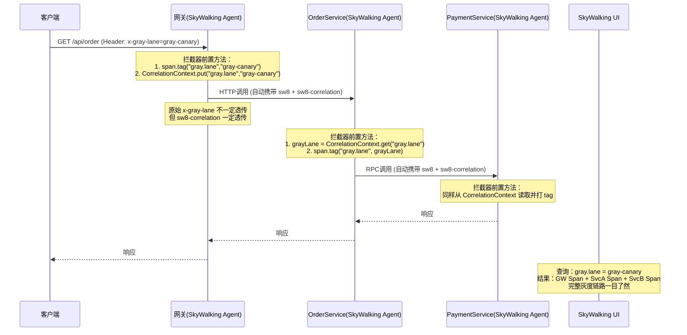

### 14.9 小结

整套方案的核心就一句话：**入口做一次染色写入 Correlation Context，下游所有服务只需要从 Correlation Context 读取并打 Tag，不要依赖原始 HTTP Header 的逐级透传。** 这样做的好处是不管链路中间经过什么协议（HTTP、gRPC、Dubbo）、什么中间件，只要 SkyWalking Agent 在工作，灰度标识就不会丢失。最终在 SkyWalking UI 上按 `gray.lane` 过滤，就能看到某条泳道的完整链路日志。

