# Kubernetes 从入门到精通 —— 第一部分：概述与架构

---

## 第一章：Kubernetes 概述与发展历史

### 1.1 什么是 Kubernetes

Kubernetes，这个名字源自希腊语，意为"舵手"或"领航员"，象征着它在容器化应用管理中的角色——如同一位经验丰富的舵手，驾驭着成百上千个容器在分布式系统的汪洋中平稳航行。社区中人们更习惯称它为"K8s"，这个缩写的由来很简单：字母 K 和 S 之间恰好有 8 个字母（u-b-e-r-n-e-t-e），于是用数字 8 替代，形成了这个简洁的代号。

从官方定义来看，Kubernetes 是一个**开源的容器编排平台**，用于自动化部署、扩展和管理容器化应用程序。但这句话过于抽象，我们可以用一句更贴近实际的话来概括 K8s 的价值：

> **Kubernetes 是容器时代的"操作系统"——它将一个数据中心的所有机器抽象为一台巨大的计算机，开发者只需声明"我要什么"，K8s 负责解决"怎么做"。**

这个类比非常精确。正如 Linux 操作系统管理单台机器上的进程调度、内存分配、文件系统一样，K8s 管理的是整个集群范围内的容器调度、资源分配、网络通信和存储挂载。开发者不再需要关心应用运行在哪台机器上，不再需要手动处理故障恢复，不再需要编写复杂的扩缩容脚本——这一切都由 K8s 自动完成。

在美团，Kubernetes 容器平台便是基于 Kubernetes 构建的核心基础设施，承载着海量在线服务和离线计算任务。该平台实现了 99.99% 的稳定性 SLA，充分证明了 K8s 在超大规模生产环境中的可靠性。

### 1.2 从 Borg 到 Kubernetes：Google 的容器管理演进

Kubernetes 并非凭空出现，它的背后是 Google 长达十余年的大规模集群管理经验积淀。要理解 K8s 的设计哲学，必须追溯到它的前身——Borg 系统。

#### Borg 系统的诞生（2003-2004 年）

2003 年前后，Google 面临一个前所未有的挑战：搜索引擎的流量呈指数级增长，而当时的主流做法是为每个服务手动分配物理机器。这种方式的弊端是显而易见的——机器利用率极低（通常只有 10%-20%），运维人员需要手动处理各种故障，扩容需要数周甚至数月的采购周期。

在这样的背景下，Google 的工程师们开始构建 Borg 系统（以《星际迷航》中的外星种族命名）。Borg 的核心目标是：**让工程师不再关心"机器"，只关心"任务"**。

Borg 的核心设计思想可以归纳为以下几点：

**声明式配置**：用户告诉 Borg"我需要运行 3 个实例的 Web 服务，每个实例需要 2 核 CPU 和 4GB 内存"，Borg 自动找到合适的机器去运行，而不是用户指定"在机器 A 上运行实例 1，在机器 B 上运行实例 2"。这是一个根本性的思维转变——从命令式（imperative）到声明式（declarative）。

**面向终态的调和循环**：Borg 持续比较"用户期望的状态"和"系统当前的状态"，如果发现不一致（比如某个实例挂了），就自动采取行动修复，使系统回到期望状态。这就是后来 K8s 中著名的 **Reconciliation Loop（调和循环）** 的原型。

**混合工作负载调度**：Borg 在同一个集群中同时运行在线服务（称为 prod jobs）和离线批处理任务（称为 non-prod jobs），通过优先级和抢占机制实现资源的高效利用。在线服务享有高优先级，空闲时段的资源则分配给批处理任务，集群利用率因此大幅提升。

**容器化隔离**：早在 Docker 诞生之前，Borg 就已经使用 Linux 内核的 cgroups 和 namespace 技术来实现进程间的资源隔离。Google 工程师是 cgroups 内核特性的主要贡献者之一。

据 Google 在 2015 年公开的论文披露，Borg 在其内部管理着数十个集群，每个集群拥有上万台机器，整体承载着数十亿个容器的运行——每周的容器启动量超过 20 亿次。

#### Omega 系统的改进

2010 年前后，Google 在 Borg 的基础上启动了下一代集群管理系统 Omega 的研发。Omega 并非 Borg 的替代品，而是一个实验性项目，旨在探索更灵活的架构设计。

Omega 最重要的创新是引入了**基于共享状态的乐观并发调度**。在 Borg 中，调度器是中心化的单体架构，所有调度决策都要经过同一个组件；而 Omega 将集群状态存储在一个中心化的"cell state"中，允许多个调度器并行工作，各自基于乐观锁读取状态、做出调度决策，然后在提交时检测冲突。这种架构极大地提升了调度吞吐量和灵活性。

Omega 的另一个重要贡献是**将所有资源对象统一抽象为"资源记录"**，每种资源类型都有一致的 CRUD 操作接口。这个设计理念直接影响了 K8s 的 RESTful API 和资源对象模型。

#### 2014 年 Google 开源 Kubernetes

2014 年 6 月，Google 宣布开源 Kubernetes 项目。这个决定背后有深刻的战略考量：

彼时 AWS 已经占据了云计算市场的主导地位，Google Cloud 作为后来者需要一个"差异化武器"。Google 手中最有价值的技术资产就是十余年积累的大规模集群管理经验，但直接开源 Borg 是不可行的——Borg 与 Google 内部基础设施深度耦合，代码量庞大且包含大量内部依赖。

因此，Google 选择了"重写"而非"开源"——由 Borg 和 Omega 的核心工程师（包括 Joe Beda、Brendan Burns 和 Craig McLuckie）主导，用 Go 语言从零构建一个全新的容器编排系统，它继承了 Borg/Omega 的设计精髓，但面向社区进行了全新的架构设计。

#### 从 Google 内部经验到开源社区的蜕变

Kubernetes 从 Borg 继承的核心设计理念包括：声明式 API、面向终态的控制器模式、Label/Selector 机制（源自 Borg 的 alloc 概念）、以 Pod 为最小调度单元（对应 Borg 中的 task group）等。但 K8s 也做出了重要的改进：

K8s 采用了更加开放的插件化架构——网络方案通过 CNI 插件实现、存储方案通过 CSI 插件实现、容器运行时通过 CRI 插件实现，这使得社区可以自由选择和组合各种实现方案。相比之下，Borg 的各个子系统是紧密耦合的。

2015 年 7 月，K8s v1.0 正式发布，同时 Google 联合 Linux 基金会成立了 CNCF（Cloud Native Computing Foundation），并将 K8s 捐赠给 CNCF 作为种子项目。这一举措消除了社区对"K8s 受 Google 单方控制"的顾虑，极大地推动了 K8s 的社区生态发展。

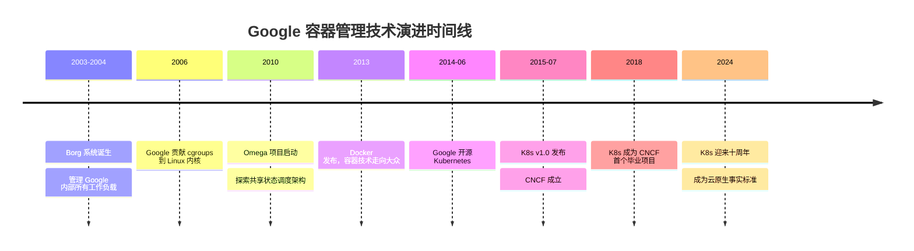

### 1.3 K8s 在云原生生态中的地位

#### CNCF 的成立与云原生版图

2015 年，Cloud Native Computing Foundation（CNCF，云原生计算基金会）在 Linux 基金会旗下成立，K8s 是其第一个托管项目。CNCF 的使命是"推动云原生技术的普及和可持续发展"。

经过近十年的发展，CNCF 的云原生全景图（Landscape）已经涵盖了上千个项目，覆盖容器运行时、编排调度、服务网格、可观测性、安全、存储、网络等各个领域。而 Kubernetes 始终处于这张图谱的核心位置——它就像是一个"操作系统内核"，其他所有云原生项目都是围绕它构建的"应用程序"或"驱动程序"。

#### K8s 与云原生的关系

"云原生"（Cloud Native）这个概念常常被过度解读，但其核心思想其实很简单：**在云环境中，以最高效的方式构建和运行应用程序**。CNCF 给出的官方定义是：云原生技术使组织能够在公有云、私有云和混合云等现代动态环境中，构建和运行可弹性扩展的应用。

云原生的代表技术包括容器、服务网格、微服务、不可变基础设施和声明式 API，而 K8s 恰好是将这些技术串联在一起的核心纽带。容器是 K8s 管理的基本单元，微服务通过 K8s 的 Service 机制实现服务发现和负载均衡，不可变基础设施通过 K8s 的滚动更新和声明式配置来实践，声明式 API 更是 K8s 的设计灵魂。

#### 行业数据：为什么 K8s 成为事实标准

根据 Pepperdata 发布的行业调研报告，K8s 在企业中的采用率持续攀升：

**超过 54% 的企业正在将工作负载迁移到 Kubernetes**，这意味着 K8s 已经从"新兴技术"进入了"主流采用"阶段。不仅是互联网公司，金融、制造、零售等传统行业也在积极拥抱 K8s。

在大数据领域，**Spark 是运行在 K8s 上占比最多的大数据应用，达到 63%**。Spark on K8s 相比传统的 Spark on YARN 方案具有多个优势：统一的资源管理平面（不再需要维护独立的 YARN 集群）、更好的资源隔离（容器级别的 cgroup 隔离）、以及与在线服务共享集群带来的资源利用率提升。

更值得关注的是，**77% 的受访者预计未来会将 50% 或更多的应用迁移到 K8s**。这一数据表明，K8s 不仅是当下的选择，更是未来的方向。

美团在 Spark on K8s 方面也有深入实践。Kubernetes 容器平台支持大数据作业与在线服务混合部署，通过优先级调度和弹性资源池机制，在保障在线服务 SLA 的前提下，将离线大数据作业调度到空闲资源上运行，集群整体资源利用率显著提升。

#### 主要云厂商的 K8s 服务

K8s 成为事实标准的另一个有力证据是：全球所有主流云服务商都提供了托管 K8s 服务。

| 云厂商 | 服务名称 | 简介 |
|--------|----------|------|
| Amazon Web Services | EKS (Elastic Kubernetes Service) | 最早期的托管 K8s 服务之一，与 AWS 生态深度集成 |
| Microsoft Azure | AKS (Azure Kubernetes Service) | 与 Azure AD、Azure Monitor 等深度整合 |
| Google Cloud | GKE (Google Kubernetes Engine) | K8s 的"亲儿子"，功能最为完善 |
| 阿里云 | ACK (Alibaba Cloud Container Service for Kubernetes) | 国内最大的公有云 K8s 服务 |
| 华为云 | CCE (Cloud Container Engine) | 支持边缘计算和混合云场景 |
| 腾讯云 | TKE (Tencent Kubernetes Engine) | 与腾讯生态集成 |

这些托管服务的共同特点是：用户无需关心 K8s 控制平面（Master 节点）的运维，云厂商负责 API Server、etcd、Scheduler 等核心组件的高可用部署和版本升级，并提供 API Server 的 SLA 保障（通常为 99.95% 或更高）。美团内部的 K8s 托管集群同样提供 API Server 99.95% 的 SLA 保障。

### 1.4 K8s 解决了什么问题

要理解 K8s 的价值，需要先回顾应用部署方式的演进历史。

#### 传统部署 vs 虚拟化部署 vs 容器化部署

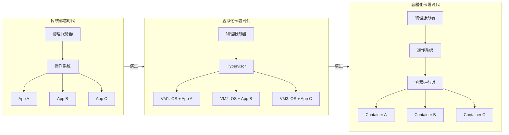

**物理机部署时代**：在最早的阶段，应用程序直接运行在物理服务器上。一台服务器上可能运行多个应用，它们共享 CPU、内存和磁盘资源。这种方式的问题是严重的：应用之间没有隔离，一个应用的资源消耗可能影响其他应用的正常运行。比如某个 Java 应用发生内存泄漏导致 OOM（Out Of Memory），可能触发操作系统的 OOM Killer 杀掉其他关键进程。为了规避风险，运维团队往往采用"一机一应用"的保守策略，但这又导致了严重的资源浪费——一台 64GB 内存的服务器可能只为一个峰值内存 8GB 的应用服务，利用率不足 15%。

**虚拟机部署时代**：虚拟化技术（以 VMware vSphere、KVM 为代表）的出现解决了隔离问题。通过 Hypervisor（虚拟机监控程序），一台物理机可以划分为多台虚拟机，每台虚拟机拥有独立的操作系统、独立的内核、独立的资源配额。应用之间的隔离性和安全性得到了根本保障。然而，虚拟化的代价也是显著的：每台虚拟机都需要运行一个完整的 Guest OS（通常占用 512MB-2GB 内存），Hypervisor 自身也有性能开销（通常 5%-15% 的 CPU 损耗），虚拟机的启动时间以分钟计（需要完成内核引导、系统初始化等过程），镜像体积动辄数 GB。

**容器化部署时代**：容器技术保留了虚拟机"隔离"的核心优势，同时消除了虚拟化层的 overhead。容器直接运行在宿主机的操作系统内核之上，通过 Linux Namespace 实现进程视图隔离（每个容器认为自己独占一个操作系统），通过 Cgroups 实现资源使用限制（CPU、内存、IO 等）。容器不需要运行独立的操作系统内核，因此启动速度极快（毫秒级别），镜像体积小（通常几十 MB 到几百 MB），资源 overhead 几乎可以忽略。

但容器化本身只解决了"单个应用的打包和运行"问题，当容器数量从几个增长到数百、数千甚至数万个时，新的问题出现了：如何自动化地调度这些容器到合适的机器上？如何处理容器故障？如何实现容器间的网络通信？如何实现滚动升级和回滚？——这就是**容器编排**的领域，也是 Kubernetes 要解决的核心问题。

#### K8s 具体解决的问题

**资源强隔离**：K8s 通过 Linux Cgroups 为每个容器提供精确的资源隔离。以美团 Kubernetes 平台为例，典型的宿主机规格为 16 核 CPU / 64GB 内存，每个容器的 CPU 配额设置为 4 核（对应 cgroup 的 cpu.cfs_quota_us/cpu.cfs_period_us = 400000/100000），内存限制为 4Gi。这意味着一台宿主机可以运行约 4 个容器实例（预留部分资源给系统进程和 K8s 组件），每个容器严格限制在 4 核 4Gi 的资源框内，互不干扰。

```yaml
# K8s Pod 资源限制配置示例
apiVersion: v1
kind: Pod
metadata:
  name: resource-demo
spec:
  containers:
  - name: app
    image: nginx:1.24
    resources:
      requests:          # 调度时的资源请求量（保障量）
        cpu: "2"         # 请求 2 核 CPU
        memory: "2Gi"    # 请求 2Gi 内存
      limits:            # 资源使用上限（硬限制）
        cpu: "4"         # 最多使用 4 核 CPU
        memory: "4Gi"    # 最多使用 4Gi 内存
```

这里 `requests` 和 `limits` 的含义不同：`requests` 是调度器分配资源的依据，Pod 调度到某个 Node 时，K8s 会确保该 Node 上有足够的可分配资源满足 requests；`limits` 是 cgroup 强制执行的硬上限，容器实际使用的 CPU 不会超过 limits 中设定的值，如果内存使用超过 limits，容器会被 OOM Kill。

**存算分离提高资源利用率**：传统架构中，计算和存储往往绑定在同一台机器上，导致资源利用率低——计算密集型应用无法充分使用机器的磁盘空间，存储密集型应用又浪费了 CPU 资源。K8s 原生支持存算分离架构，通过 PersistentVolume（PV）和 PersistentVolumeClaim（PVC）机制，存储可以独立于计算节点进行管理和扩展。容器可以灵活挂载远程存储（NFS、Ceph、云厂商的 EBS/云盘等），计算节点变为"无状态"的资源池，可以根据负载灵活扩缩。

**快速弹性扩缩容**：K8s 提供了多层次的弹性能力。HPA（Horizontal Pod Autoscaler）可以根据 CPU 利用率、内存使用量或自定义指标自动增减 Pod 副本数量；VPA（Vertical Pod Autoscaler）可以自动调整单个 Pod 的资源配额；Cluster Autoscaler 可以根据调度需求自动增减集群中的 Node 节点数量。这三层弹性机制组合在一起，使得应用可以从容应对流量波动——电商大促时自动扩容，低谷时自动缩容释放资源。

```yaml
# HPA 自动扩缩容配置示例
apiVersion: autoscaling/v2
kind: HorizontalPodAutoscaler
metadata:
  name: web-app-hpa
spec:
  scaleTargetRef:
    apiVersion: apps/v1
    kind: Deployment
    name: web-app
  minReplicas: 3          # 最少 3 个副本
  maxReplicas: 50         # 最多 50 个副本
  metrics:
  - type: Resource
    resource:
      name: cpu
      target:
        type: Utilization
        averageUtilization: 70  # CPU 利用率超过 70% 触发扩容
```

**高效迭代和运维**：K8s 的声明式 API 和控制器模式使得应用的发布、升级和回滚变得简单可靠。通过 Deployment 的滚动更新策略（Rolling Update），K8s 可以逐步用新版本的 Pod 替换旧版本，过程中始终保持一定数量的可用实例，实现零停机发布。如果新版本出现问题，一条 `kubectl rollout undo` 命令即可回滚到上一个版本。容器化的环境还使得版本管理更加灵活——每个版本对应一个不可变的容器镜像，不同环境（开发、测试、预发、生产）运行的是同一个镜像，消除了"在我本地能跑"的问题。

---

## 第二章：容器技术基础

Kubernetes 是容器的编排平台，因此深入理解容器技术是学好 K8s 的前提。本章将从容器技术的发展历程讲起，深入剖析容器底层的三大核心技术——Namespace、Cgroups 和 UnionFS，然后介绍 Docker 的核心概念和容器运行时的演进。

### 2.1 容器技术的前世今生

容器技术并非 Docker 的发明，它的历史可以追溯到 1979 年。

**chroot（1979 年）**：容器技术的"始祖"是 Unix V7 中引入的 `chroot` 系统调用。chroot 可以将一个进程的根目录（`/`）重定向到文件系统中的某个子目录，使得该进程只能看到这个子目录下的文件，无法访问外部的文件系统。这是最原始的"隔离"——文件系统层面的视图隔离。chroot 后来被广泛用于创建隔离的构建环境和沙箱，但它只隔离了文件系统，进程仍然可以看到主机上的所有进程、网络接口等信息。

```bash
# chroot 基本用法示例
# 创建一个隔离的文件系统环境
mkdir -p /myroot/{bin,lib,lib64}
cp /bin/bash /myroot/bin/
cp /lib/x86_64-linux-gnu/libc.so.6 /myroot/lib/
cp /lib64/ld-linux-x86-64.so.2 /myroot/lib64/

# 进入 chroot 环境，此时根目录变为 /myroot
sudo chroot /myroot /bin/bash
# 在 chroot 环境中，ls / 只能看到 bin, lib, lib64
```

**Linux Containers (LXC)（2008 年）**：2008 年，随着 Linux 内核中 Namespace 和 Cgroups 功能的逐步完善，LXC 项目应运而生。LXC 是第一个完整的 Linux 容器管理方案，它组合使用了 Namespace（隔离进程视图）、Cgroups（限制资源使用）和 chroot（隔离文件系统），提供了一个接近虚拟机但没有 Hypervisor 开销的轻量级隔离环境。LXC 的出现标志着现代容器技术的雏形已经成型，但它的用户体验还很原始——配置复杂，缺乏标准化的镜像格式和分发机制。

**Docker 的诞生（2013 年）**：2013 年 3 月，一家名为 dotCloud 的 PaaS 公司在 PyCon 大会上展示了一个名为 Docker 的开源项目。Docker 的早期版本实际上是对 LXC 的封装，但它带来了两个革命性的创新：一是**标准化的镜像格式**——通过 Dockerfile 和分层镜像（Layered Image），开发者可以像写代码一样定义运行环境，并通过 Docker Registry 轻松分发；二是**极其简洁的用户体验**——一条 `docker run` 命令就能启动一个隔离的容器。这两个创新彻底降低了容器技术的使用门槛，Docker 迅速在开发者社区中引爆式传播，"容器"这个概念从此走向大众。

**容器标准化：OCI 规范**：随着容器技术的爆发，社区意识到需要一个中立的标准来避免供应商锁定。2015 年 6 月，Docker、Google、CoreOS、微软、红帽等公司联合成立了 OCI（Open Container Initiative，开放容器计划），制定了两个核心标准：OCI Runtime Spec（定义了如何运行容器，参考实现为 runc）和 OCI Image Spec（定义了容器镜像格式）。OCI 标准的建立确保了不同的容器运行时（Docker、containerd、CRI-O 等）可以使用相同格式的镜像，实现互操作性。

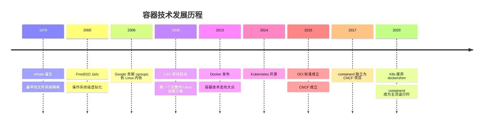

### 2.2 容器核心技术原理

容器不是一种独立的技术实体，而是 Linux 内核中多种功能的组合运用。理解容器，关键是理解三大支柱技术：Namespace（隔离）、Cgroups（限制）和 UnionFS（文件系统）。

#### Linux Namespace（命名空间隔离）

Namespace 是 Linux 内核提供的资源隔离机制。每个 Namespace 封装了一种全局系统资源的抽象，使得 Namespace 内的进程看起来拥有自己独立的全局资源实例。通俗地说，Namespace 就是给进程戴上了一副"有色眼镜"——进程只能看到 Namespace 内的资源，无法感知外部的世界。

Linux 内核目前支持 7 种 Namespace：

**PID Namespace（进程 ID 隔离）**：每个 PID Namespace 都有独立的进程编号空间。在容器内部，进程号从 1 开始编号，容器中的第一个进程（通常是应用的入口进程）拥有 PID 1，就像一个独立的操作系统中的 init 进程。但从宿主机的视角看，这些进程只是宿主机上的普通进程，拥有宿主机全局的 PID 编号。

```bash
# 演示 PID Namespace 隔离
# 在宿主机上运行一个隔离的 bash，它会看到自己的 PID 为 1
sudo unshare --pid --fork --mount-proc bash
# 在这个隔离环境中执行 ps aux，只能看到这个 bash 进程和 ps 自身
ps aux
# 输出：
# USER   PID %CPU %MEM    VSZ   RSS TTY  STAT START   TIME COMMAND
# root     1  0.0  0.0   7236  4016 pts/0 S  10:00   0:00 bash
# root     2  0.0  0.0  10072  3356 pts/0 R+ 10:00   0:00 ps aux
```

**Network Namespace（网络隔离）**：每个 Network Namespace 拥有独立的网络协议栈——独立的网络设备、IP 地址、路由表、端口空间、iptables 规则等。容器可以有自己的 eth0 网卡和 IP 地址，不同容器可以监听相同的端口号而不冲突。容器间的网络通信需要通过虚拟网络设备（veth pair）和网桥（bridge）来连接。

**Mount Namespace（文件系统挂载隔离）**：每个 Mount Namespace 拥有独立的挂载点列表。容器可以挂载自己的文件系统（通常是通过容器镜像构建的 rootfs），而不影响宿主机或其他容器的文件系统。这是 chroot 的进化版——不仅隔离了根目录，还隔离了所有的挂载操作。

**UTS Namespace（主机名和域名隔离）**：每个 UTS Namespace 可以拥有独立的主机名（hostname）和域名（domainname）。这使得每个容器可以有自己的主机名，例如容器内执行 `hostname` 命令返回的是容器的名称而非宿主机的名称。

**IPC Namespace（进程间通信隔离）**：隔离了 System V IPC 和 POSIX 消息队列。不同 IPC Namespace 中的进程无法通过共享内存、信号量等 IPC 机制进行通信，确保容器间的 IPC 资源互相不可见。

**User Namespace（用户和组 ID 隔离）**：允许容器内的进程拥有不同于宿主机的 UID/GID 映射。一个在容器内以 root（UID 0）身份运行的进程，在宿主机上可能映射为一个普通用户（例如 UID 65534），从而提升安全性——即使容器被攻破，攻击者在宿主机上也没有 root 权限。

**Cgroup Namespace（Cgroup 视图隔离）**：隔离了 cgroup 的目录视图。容器内的进程查看 `/proc/self/cgroup` 时，看到的是以自己的 cgroup 为根的相对路径，而非宿主机上的完整路径。这既是安全考虑（防止信息泄漏），也提供了更好的封装性。

```bash
# 创建一个具有多种 Namespace 隔离的环境
sudo unshare --pid --net --mount --uts --ipc --fork bash

# 设置独立的主机名（UTS Namespace 隔离）
hostname my-container
hostname   # 输出: my-container

# 查看网络设备（Network Namespace 隔离）
ip addr    # 只能看到一个 lo 回环设备，没有 eth0
```

#### Linux Cgroups（资源限制）

如果说 Namespace 解决的是"看到什么"（视图隔离），那么 Cgroups（Control Groups）解决的是"用多少"（资源限制）。Cgroups 是 Linux 内核提供的资源管理机制，可以对一组进程的 CPU、内存、磁盘 IO、网络带宽等资源使用进行限制、记账和隔离。

Cgroups 最初由 Google 的工程师 Paul Menage 和 Rohit Seth 在 2006 年提出并贡献到 Linux 内核（最初叫 "process containers"，后更名为 cgroups）。目前 Linux 内核中有两个版本：cgroups v1 和 cgroups v2，后者提供了统一的层次结构和更一致的接口，正在逐步取代 v1。

**CPU 限制**：Cgroups 通过 CFS（Completely Fair Scheduler）的 quota 机制实现 CPU 限制。核心参数有两个——`cpu.cfs_period_us`（调度周期，默认 100000 微秒即 100ms）和 `cpu.cfs_quota_us`（在一个调度周期内允许使用的 CPU 时间上限）。

以美团 Kubernetes 平台的配置为例，容器的 CPU 配额设置为 4 核，对应的 cgroup 参数为 `cpu.cfs_quota_us = 400000`，`cpu.cfs_period_us = 100000`。计算公式为：可用 CPU 核数 = quota / period = 400000 / 100000 = 4 核。这意味着在每个 100ms 的调度周期内，该容器内所有进程加起来最多使用 400ms 的 CPU 时间，等价于持续使用 4 个 CPU 核心的算力。

```bash
# 在 cgroups v1 中查看和设置 CPU 限制
# 创建一个 cgroup
sudo mkdir /sys/fs/cgroup/cpu/my-container

# 设置 CPU 配额为 4 核（400000/100000 = 4）
echo 400000 | sudo tee /sys/fs/cgroup/cpu/my-container/cpu.cfs_quota_us
echo 100000 | sudo tee /sys/fs/cgroup/cpu/my-container/cpu.cfs_period_us

# 将进程加入 cgroup
echo $PID | sudo tee /sys/fs/cgroup/cpu/my-container/cgroup.procs

# 在 cgroups v2 中等价配置
# echo "400000 100000" | sudo tee /sys/fs/cgroup/my-container/cpu.max
```

**内存限制**：Cgroups 对内存的限制是"硬限制"——当容器使用的内存超过限制值时，内核的 OOM Killer 会杀掉容器中的进程。K8s 中通过 `resources.limits.memory` 设置，例如 `4Gi` 表示容器最多使用 4GiB 内存。

```bash
# cgroups v1 设置内存限制为 4Gi
echo 4294967296 | sudo tee /sys/fs/cgroup/memory/my-container/memory.limit_in_bytes

# cgroups v2 等价配置
# echo 4294967296 | sudo tee /sys/fs/cgroup/my-container/memory.max
```

**磁盘 IO 限制**：通过 blkio 子系统（cgroups v1）或 io 控制器（cgroups v2）限制容器对块设备的读写速率和 IOPS（每秒 IO 操作数），防止某个容器的 IO 密集操作影响同一宿主机上的其他容器。

**网络带宽限制**：Cgroups 本身不直接提供网络带宽限制功能（net_cls 和 net_prio 子系统只提供分类和优先级标记）。实际的网络限速通常通过 Linux 的 TC（Traffic Control）工具配合 cgroup 的分类标记来实现，或者使用 CNI 插件在网络层面进行限制。

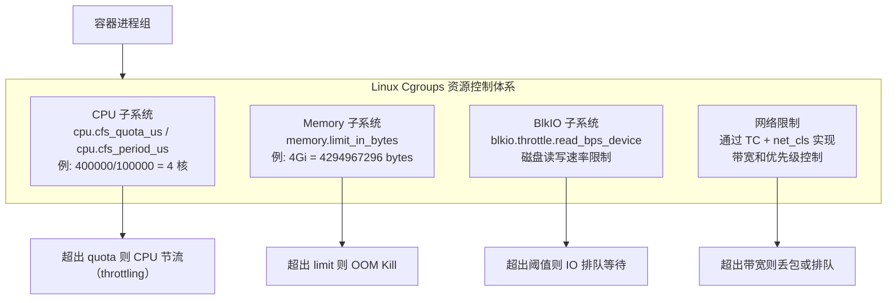

#### UnionFS（联合文件系统）

UnionFS 是容器镜像分层存储的基础技术。它允许将多个目录（称为"层"或"branch"）"透明地"叠加在一起，呈现为一个统一的文件系统视图。

**OverlayFS 的工作原理**：OverlayFS 是目前最主流的联合文件系统实现（已合入 Linux 内核主线），也是美团 Kubernetes 平台选用的文件系统方案。OverlayFS 将文件系统分为三层：

lowerdir（只读的下层）：包含镜像中所有层的内容，这些层是不可修改的。每一层都可能包含一些文件和目录，层与层之间通过叠加形成完整的文件系统。

upperdir（可读写的上层）：容器运行时产生的所有文件修改（创建、修改、删除）都记录在这一层。

merged（合并视图）：将 lowerdir 和 upperdir 合并后呈现给用户的最终视图。读取文件时优先从 upperdir 查找，如果 upperdir 中不存在则从 lowerdir 查找；写入文件时，如果文件来自 lowerdir，会先"复制"到 upperdir（这个过程称为 Copy-on-Write），然后在 upperdir 中修改。

```bash
# OverlayFS 手动挂载示例
# 创建目录结构
mkdir -p /tmp/overlay/{lower,upper,work,merged}

# 在 lower 层写入一些文件（模拟镜像层）
echo "base config" > /tmp/overlay/lower/config.txt
echo "base app" > /tmp/overlay/lower/app.txt

# 挂载 OverlayFS
sudo mount -t overlay overlay \
  -o lowerdir=/tmp/overlay/lower,upperdir=/tmp/overlay/upper,workdir=/tmp/overlay/work \
  /tmp/overlay/merged

# 查看合并视图——可以看到 lower 层的文件
ls /tmp/overlay/merged/   # 输出: app.txt  config.txt

# 修改文件——修改自动写入 upper 层（Copy-on-Write）
echo "modified config" > /tmp/overlay/merged/config.txt

# lower 层不受影响
cat /tmp/overlay/lower/config.txt    # 输出: base config
# 修改记录在 upper 层
cat /tmp/overlay/upper/config.txt    # 输出: modified config
```

**镜像分层存储**：Docker/容器镜像正是利用了 UnionFS 的分层特性。一个镜像由多个只读层组成，每一层代表 Dockerfile 中的一条指令。例如 `FROM ubuntu:22.04` 是基础层，`RUN apt-get update && apt-get install -y nginx` 在基础层之上添加了一个包含 nginx 相关文件的新层，`COPY app.js /app/` 又添加了一个包含应用代码的层。

分层存储带来两个重要优势：一是**层共享**——如果多个镜像基于相同的基础层（如 ubuntu:22.04），这个基础层在磁盘上只存储一份，显著节省了存储空间和镜像拉取时间；二是**增量更新**——更新应用时，通常只有最上面几层（应用代码和配置）发生变化，底层（操作系统和依赖）保持不变，因此镜像的推送和拉取只需传输变化的层。

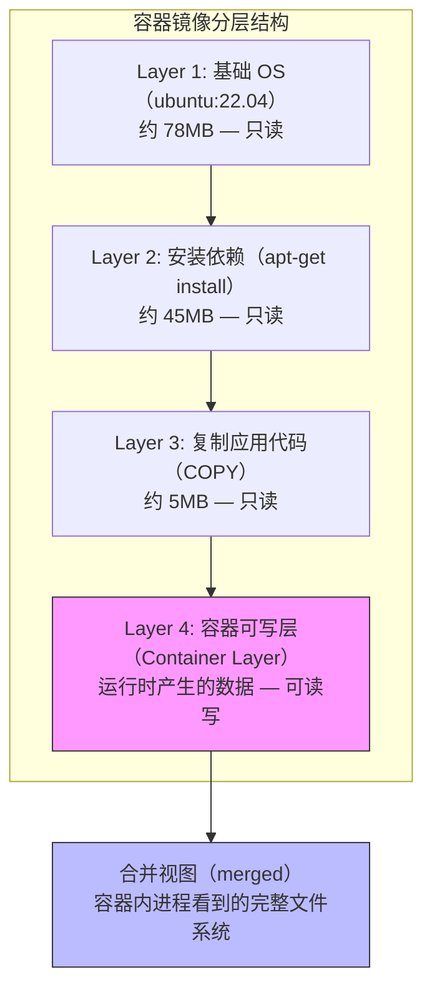

### 2.3 Docker 核心概念

Docker 虽然不再是 K8s 的默认容器运行时，但它仍然是容器生态中最重要的开发工具。理解 Docker 的核心概念对于学习 K8s 至关重要。

**镜像（Image）**：镜像是一个**包含从操作系统层到应用层所有运行环境的只读软件包**。它不仅包含应用程序的二进制文件，还包含应用运行所需的全部依赖——系统库、语言运行时、配置文件等。镜像的这种"自包含"特性是容器化的核心价值——只要有镜像，就能在任何支持容器运行时的机器上运行应用，不再受宿主机环境的影响。

**容器（Container）**：容器是**镜像的运行实例**。如果把镜像类比为 Java 中的 Class，容器就是 Instance。从同一个镜像可以启动多个容器，每个容器都有独立的可写层、独立的进程空间、独立的网络栈。容器的生命周期是短暂的——它可以被创建、启动、停止、删除，容器删除后其可写层中的数据也随之消失（除非使用了持久化存储）。

**仓库（Registry）**：镜像仓库是存储和分发镜像的服务。Docker Hub 是最大的公共镜像仓库，企业通常会搭建私有仓库（如 Harbor）来存储内部镜像。镜像通过"仓库地址/命名空间/镜像名:标签"的格式唯一标识，例如 `docker.io/library/nginx:1.24`。

**Dockerfile 详解**：Dockerfile 是构建镜像的"配方"，每一条指令都会在镜像中创建一个新的层。

```dockerfile
# 多阶段构建示例：构建一个 Go 应用的生产镜像

# ========== 第一阶段：编译 ==========
FROM golang:1.22-alpine AS builder

# 设置工作目录
WORKDIR /app

# 先复制依赖文件，利用 Docker 层缓存
# 如果 go.mod 和 go.sum 没有变化，这两层会被缓存
COPY go.mod go.sum ./
RUN go mod download

# 复制源代码并编译
COPY . .
RUN CGO_ENABLED=0 GOOS=linux go build -o /app/server ./cmd/server

# ========== 第二阶段：运行 ==========
FROM alpine:3.19

# 安装时区数据和 CA 证书（HTTPS 请求需要）
RUN apk --no-cache add ca-certificates tzdata

# 创建非 root 用户（安全最佳实践）
RUN adduser -D -g '' appuser

# 从第一阶段复制编译好的二进制文件
COPY --from=builder /app/server /usr/local/bin/server

# 切换到非 root 用户
USER appuser

# 声明容器监听的端口
EXPOSE 8080

# 健康检查
HEALTHCHECK --interval=30s --timeout=3s --retries=3 \
  CMD wget -qO- http://localhost:8080/health || exit 1

# 容器启动命令
ENTRYPOINT ["server"]
```

这个 Dockerfile 展示了多阶段构建（Multi-stage Build）的最佳实践：第一阶段使用包含完整 Go 工具链的镜像进行编译，第二阶段仅使用一个极小的 Alpine 基础镜像来运行编译好的二进制文件。最终的生产镜像不包含编译器、源代码和开发依赖，体积可以从数百 MB 缩小到十几 MB，同时减小了攻击面。

### 2.4 容器运行时

容器运行时（Container Runtime）是真正负责创建和运行容器的软件。容器运行时的演进经历了从"大而全"到"分层解耦"的过程。

**Docker Engine**：Docker 最早是一个"全家桶"式的容器管理工具，从镜像构建、镜像管理、容器运行、网络管理到存储管理全部包办。但 K8s 并不需要 Docker 的全部功能——K8s 自己管理网络和存储，只需要一个纯粹的"容器运行时"来执行容器的创建和运行。Docker 的大量功能在 K8s 场景下反而成了不必要的复杂性和性能开销。

**containerd**：containerd 最初是 Docker 架构重构时拆分出来的核心容器运行时组件，后来被捐赠给 CNCF 成为独立项目。containerd 专注于容器生命周期管理——镜像的拉取和存储、容器的创建和运行、快照管理（OverlayFS 等）。它不包含镜像构建、Docker CLI 等开发者工具，但正因为功能专注，它的性能和稳定性更好，资源占用也更低。

**CRI-O**：CRI-O 是由红帽主导开发的轻量级容器运行时，专门为 K8s 设计。它直接实现了 K8s 的 CRI 接口，不依赖于 Docker 或 containerd，最小化了运行时的依赖和复杂性。

**CRI（Container Runtime Interface）标准**：CRI 是 K8s 定义的容器运行时接口标准。在 K8s 1.5 之前，K8s 直接通过内置的 dockershim 组件调用 Docker Engine，这种紧耦合的方式限制了容器运行时的选择。CRI 的引入将 K8s 与具体的容器运行时解耦——任何实现了 CRI gRPC 接口的运行时都可以被 K8s 使用。kubelet 通过 CRI 与容器运行时通信，主要包括两组接口：RuntimeService（容器的创建、启动、停止、删除）和 ImageService（镜像的拉取、查询、删除）。

K8s 从 1.20 版本开始正式废弃 dockershim（但 Docker 构建的镜像仍然可以正常使用，因为镜像格式符合 OCI 标准），到 1.24 版本彻底移除了 dockershim，containerd 和 CRI-O 成为了推荐的生产运行时。

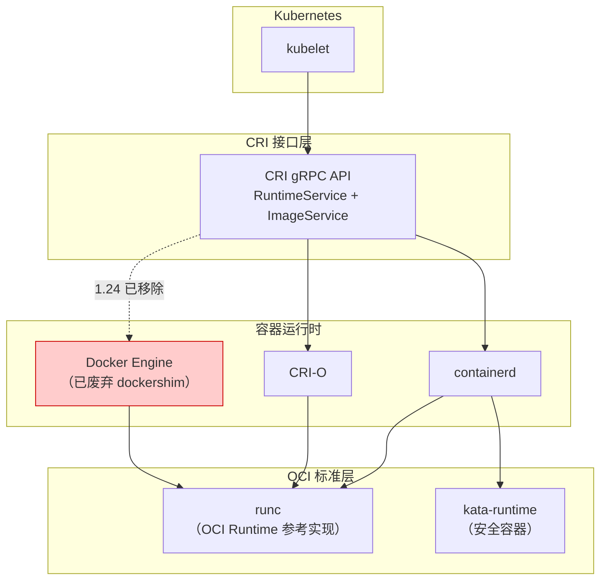

**美团实践：containerd + OverlayFS 的运行时选择**

美团 Kubernetes 容器平台选用 containerd 作为容器运行时，搭配 OverlayFS 作为容器存储驱动。这个技术选型基于几方面的考量：containerd 相比完整的 Docker Engine 减少了约 30% 的内存占用和更低的调用链路延迟（kubelet → containerd → runc vs kubelet → dockershim → dockerd → containerd → runc）；OverlayFS 已合入 Linux 内核主线，稳定性经过大规模验证，且相比 AUFS、DeviceMapper 等方案具有更好的性能和更简单的运维。在美团的生产实践中，这一组合在数十万容器实例的规模下保持了稳定可靠的表现。

---

## 第三章：Kubernetes 架构全景解析

### 3.1 整体架构概览

Kubernetes 采用经典的 **Master-Worker 架构**（也称为**控制平面-数据平面**架构），这种架构分离了"决策"和"执行"的职责——控制平面负责集群的全局决策（调度、故障检测、配置管理等），数据平面负责实际运行工作负载。

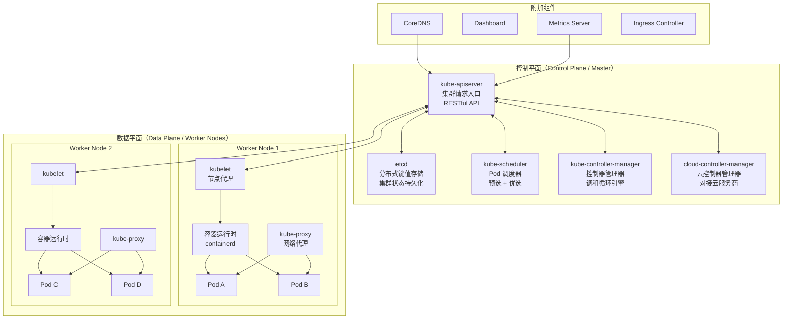

**控制平面（Control Plane）与数据平面（Data Plane）**

控制平面通常由 3 个或 5 个 Master 节点组成（奇数个节点以满足 etcd 的 Raft 一致性协议要求），负责集群的"大脑"功能。在生产环境中，控制平面组件通常部署在独立的机器上，不运行用户的工作负载，以确保管理功能的稳定性和性能。

数据平面由大量的 Worker 节点组成（可以从几台到数千台），每个 Worker 节点上运行着 kubelet 和 kube-proxy 两个核心组件以及容器运行时，负责实际运行用户的 Pod。

**Master 节点与 Worker 节点的关系**：Master 和 Worker 之间通过 kube-apiserver 进行通信。Worker 节点上的 kubelet 定期向 API Server 汇报节点状态和 Pod 状态（类似"心跳"），同时 watch API Server 获取新的任务指令。这种设计使得 Worker 节点是"无状态"的——即使某个 Worker 节点宕机，Master 可以将其上的 Pod 重新调度到其他健康的节点上。

**声明式 API 设计哲学**：K8s 的 API 设计是声明式的（declarative），而非命令式的（imperative）。用户不是告诉 K8s "创建一个容器，然后配置网络，然后挂载存储"（这是命令式的做法），而是告诉 K8s "我期望有 3 个运行 nginx 的 Pod，每个 Pod 有 2 核 CPU 和 4Gi 内存"。K8s 会持续将集群的实际状态向用户声明的"期望状态"（desired state）靠拢。如果某个 Pod 挂了，K8s 会自动创建新的 Pod 来恢复到 3 个副本的期望状态，而不需要用户介入。

这种设计的优势在于幂等性——无论系统当前处于什么状态，只要声明了期望状态，K8s 最终都会收敛到这个状态。这对于自动化运维至关重要。

### 3.2 控制平面组件详解

#### 3.2.1 kube-apiserver

kube-apiserver 是整个 K8s 集群的**请求入口和通信枢纽**。集群中所有组件之间的通信都不是直接进行的，而是通过 API Server 间接完成。这使得 API Server 成为了集群中唯一的"通信中心"。

**以 HTTP RESTful API 提供接口**：API Server 将 K8s 中的所有资源对象（Pod、Service、Deployment、Node 等）都暴露为 RESTful API 端点。每种资源都有标准的 CRUD 操作（Create、Read、Update、Delete）以及 Watch 操作（长连接监听资源变化）。

```bash
# API Server 的 RESTful API 示例

# 列出 default 命名空间下的所有 Pod
curl -k https://<apiserver>:6443/api/v1/namespaces/default/pods \
  -H "Authorization: Bearer <token>"

# 获取特定 Pod 的详细信息
curl -k https://<apiserver>:6443/api/v1/namespaces/default/pods/my-app \
  -H "Authorization: Bearer <token>"

# Watch 监听 Pod 变化事件（长连接，服务端推送）
curl -k https://<apiserver>:6443/api/v1/namespaces/default/pods?watch=true \
  -H "Authorization: Bearer <token>"

# 使用 kubectl（本质上也是调用 API Server）
kubectl get pods -n default -o json
kubectl describe pod my-app
kubectl apply -f deployment.yaml  # 声明式创建/更新资源
```

**API Server 是唯一与 etcd 直接通信的组件**：这是一个至关重要的架构设计原则。Scheduler、Controller Manager、kubelet 等组件都不直接访问 etcd，而是通过 API Server 进行数据的读写。API Server 充当了 etcd 的"代理"和"网关"，负责数据的验证、转换、版本控制和缓存。这种设计带来了几个好处：所有数据访问都有统一的认证授权和审计入口；API Server 内置了对象缓存（watch cache），减少了对 etcd 的直接压力；etcd 的存储格式和版本对其他组件完全透明。

**认证、授权、准入控制流程**：每个发送到 API Server 的请求都要经过三道"关卡"：

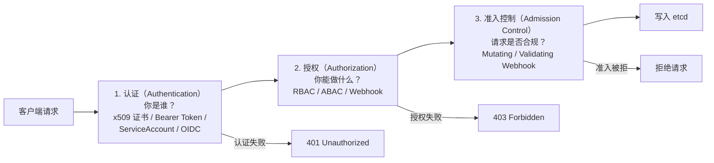

认证（Authentication）阶段确认请求者的身份——可以通过 x509 客户端证书、Bearer Token、ServiceAccount Token、OpenID Connect 等方式。授权（Authorization）阶段检查该身份是否有权限执行请求的操作——最常用的是 RBAC（Role-Based Access Control，基于角色的访问控制），通过 Role/ClusterRole 和 RoleBinding/ClusterRoleBinding 定义权限策略。准入控制（Admission Control）阶段对请求内容进行最后的校验和修改——例如 LimitRanger 可以为没有设置资源限制的 Pod 自动添加默认的资源配额，PodSecurityPolicy 可以禁止特权容器的创建。

```yaml
# RBAC 配置示例：创建一个只读角色，允许查看 Pod 和 Service
apiVersion: rbac.authorization.k8s.io/v1
kind: Role
metadata:
  namespace: production
  name: pod-reader
rules:
- apiGroups: [""]           # 核心 API 组
  resources: ["pods", "services"]
  verbs: ["get", "list", "watch"]  # 只允许读操作
---
# 将角色绑定到用户
apiVersion: rbac.authorization.k8s.io/v1
kind: RoleBinding
metadata:
  name: read-pods
  namespace: production
subjects:
- kind: User
  name: developer-alice
  apiGroup: rbac.authorization.k8s.io
roleRef:
  kind: Role
  name: pod-reader
  apiGroup: rbac.authorization.k8s.io
```

#### 3.2.2 etcd

etcd 是一个基于 Go 语言开发的分布式键值存储系统（由 CoreOS 公司开发，后捐赠给 CNCF），在 K8s 中扮演着**集群"大脑"的"记忆"**角色——集群中所有资源对象的状态数据都持久化存储在 etcd 中。

**存储 K8s 的关键配置和用户配置**：etcd 中存储的数据涵盖集群的方方面面——所有命名空间下的 Pod、Service、Deployment、ConfigMap、Secret 等资源对象的定义和状态，节点的注册信息和健康状态，RBAC 的角色和绑定关系，自定义资源（CRD）的定义和实例，等等。可以说，etcd 中的数据就是集群的"全部真相"。

**etcd 是集群的最终事实来源（Source of Truth）**：在 K8s 的架构中，etcd 中的数据是唯一权威的真实状态。其他所有组件（Scheduler、Controller Manager、kubelet）本地维护的状态都是 etcd 数据的"缓存"或"派生"。如果某个组件的本地状态与 etcd 不一致，以 etcd 为准。这种"单一事实来源"的设计简化了分布式系统的一致性问题。

**Raft 一致性算法保证数据一致性**：etcd 使用 Raft 共识算法来保证集群中多个 etcd 节点之间的数据一致性。Raft 的核心思想是"领导者选举"——集群中的节点通过投票选出一个 Leader，所有的写操作都由 Leader 处理，Leader 将数据复制到多数（quorum）Follower 节点后才返回成功。如果 Leader 宕机，Follower 们会自动选出新的 Leader，确保服务不中断。

对于一个 N 个节点的 etcd 集群，它最多能容忍 (N-1)/2 个节点同时故障。因此生产环境通常部署 3 节点（容忍 1 节点故障）或 5 节点（容忍 2 节点故障）的 etcd 集群。

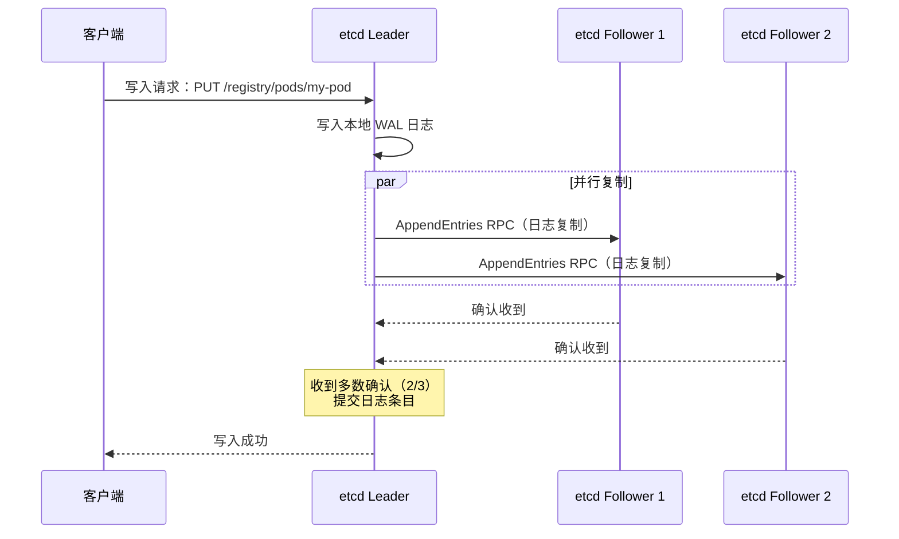

```bash
# 查看 etcd 中存储的 K8s 数据示例
# 注意：需要使用 etcdctl 并提供正确的证书

# 列出所有存储的 key（K8s 资源在 etcd 中的路径格式：/registry/<资源类型>/<命名空间>/<名称>）
ETCDCTL_API=3 etcdctl get / --prefix --keys-only | head -20
# 输出示例：
# /registry/configmaps/default/kube-root-ca.crt
# /registry/deployments/default/nginx-deployment
# /registry/namespaces/default
# /registry/pods/default/nginx-deployment-abc123
# /registry/services/default/kubernetes

# 读取某个 Pod 在 etcd 中的数据
ETCDCTL_API=3 etcdctl get /registry/pods/default/nginx-deployment-abc123
```

**etcd event 集群拆分优化实践**

在大规模 K8s 集群中，etcd 的性能往往成为瓶颈。K8s 写入 etcd 的数据大致分为两类：资源对象数据（Pod、Service 等的定义和状态）和 Event 事件数据（如 Pod 启动成功、容器重启、调度成功等通知性事件）。Event 的写入量远大于资源对象数据——一个万级 Pod 规模的集群，每秒可能产生数百甚至数千条 Event。

美团 Kubernetes 平台在实践中采用了 **etcd event 集群拆分**策略：将 Event 数据存储到独立的 etcd 集群中，主 etcd 集群只存储关键的资源对象数据。这样做的好处是显著降低了主 etcd 集群的写入压力和存储体积，提升了集群的稳定性和性能。配置方式是在 kube-apiserver 的启动参数中指定 `--etcd-servers-overrides`：

```bash
# API Server 启动参数示例：将 Event 存储到独立的 etcd 集群
kube-apiserver \
  --etcd-servers=https://etcd-main-1:2379,https://etcd-main-2:2379,https://etcd-main-3:2379 \
  --etcd-servers-overrides=/events#https://etcd-event-1:2379;https://etcd-event-2:2379;https://etcd-event-3:2379 \
  # ... 其他参数
```

#### 3.2.3 kube-scheduler

kube-scheduler 是 K8s 的**资源调度器**，负责一项核心工作：为新创建的、尚未绑定 Node 的 Pod 选择一个最合适的 Node 节点来运行。

调度器的输入是一个待调度的 Pod 和集群中所有可用 Node 的信息，输出是一个"Pod → Node 的绑定关系"。这个看似简单的过程实际上涉及大量的约束检查和优化决策。

**调度算法：预选（Predicates/Filtering）和优选（Priorities/Scoring）**

调度过程分为两个阶段：

**第一阶段——过滤（Filtering）**：从集群中所有 Node 中过滤掉不满足 Pod 调度条件的节点。过滤条件（称为 Predicates 或 Filter Plugins）包括：

- `PodFitsResources`：节点的可分配资源（Allocatable）是否满足 Pod 的 requests
- `PodFitsHostPorts`：节点上 Pod 请求的 hostPort 是否已被占用
- `NodeSelector`：节点的标签是否匹配 Pod 的 nodeSelector
- `PodToleratesNodeTaints`：Pod 是否容忍节点的 Taints（污点）
- `NodeAffinity`：节点亲和性规则是否满足
- `PodAffinity/PodAntiAffinity`：Pod 的亲和性和反亲和性规则

经过过滤后，只保留满足所有条件的"候选 Node"列表。如果没有任何 Node 通过过滤，Pod 将进入 Pending 状态，等待资源释放。

**第二阶段——打分（Scoring）**：对所有候选 Node 进行评分，选出得分最高的 Node。打分策略（称为 Priorities 或 Score Plugins）包括：

- `LeastRequestedPriority`：倾向于选择资源使用率低的节点（分散负载）
- `BalancedResourceAllocation`：倾向于选择 CPU 和内存利用率均衡的节点
- `ImageLocality`：倾向于选择已有 Pod 所需镜像的节点（减少镜像拉取时间）
- `InterPodAffinityPriority`：根据 Pod 间亲和性规则打分
- `NodeAffinityPriority`：根据节点亲和性偏好打分

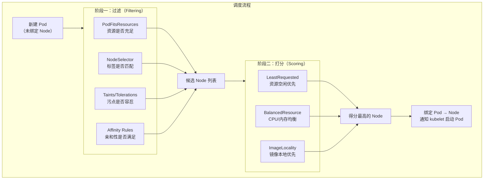

```yaml
# 调度约束配置示例：使用 NodeSelector、Affinity 和 Tolerations
apiVersion: apps/v1
kind: Deployment
metadata:
  name: web-app
spec:
  replicas: 3
  selector:
    matchLabels:
      app: web
  template:
    metadata:
      labels:
        app: web
    spec:
      # nodeSelector：简单的节点选择（必须匹配）
      nodeSelector:
        disk-type: ssd

      # Node 亲和性：更灵活的节点选择规则
      affinity:
        nodeAffinity:
          # 硬性要求：必须调度到 zone-a 或 zone-b
          requiredDuringSchedulingIgnoredDuringExecution:
            nodeSelectorTerms:
            - matchExpressions:
              - key: topology.kubernetes.io/zone
                operator: In
                values: ["zone-a", "zone-b"]
          # 软性偏好：尽量调度到有 gpu=true 标签的节点
          preferredDuringSchedulingIgnoredDuringExecution:
          - weight: 80
            preference:
              matchExpressions:
              - key: gpu
                operator: In
                values: ["true"]

        # Pod 反亲和性：同一应用的 Pod 尽量分散到不同节点
        podAntiAffinity:
          preferredDuringSchedulingIgnoredDuringExecution:
          - weight: 100
            podAffinityTerm:
              labelSelector:
                matchExpressions:
                - key: app
                  operator: In
                  values: ["web"]
              topologyKey: kubernetes.io/hostname

      # Tolerations：容忍带有特定污点的节点
      tolerations:
      - key: "dedicated"
        operator: "Equal"
        value: "high-memory"
        effect: "NoSchedule"

      containers:
      - name: web
        image: nginx:1.24
        resources:
          requests:
            cpu: "2"
            memory: "2Gi"
          limits:
            cpu: "4"
            memory: "4Gi"
```

#### 3.2.4 kube-controller-manager

kube-controller-manager 是 K8s 集群中**所有资源对象的自动化控制中心**。它本质上是一组控制器的集合，每个控制器负责管理一种特定类型的资源对象，确保资源对象的实际状态与用户声明的期望状态保持一致。

控制器的工作模式可以用一个简单的循环来概括——这就是 K8s 中最核心的设计模式之一：**控制循环（Control Loop）**，也称为调和循环（Reconciliation Loop）：

```
for {
    actualState := 获取资源对象的实际状态
    desiredState := 获取资源对象的期望状态
    if actualState != desiredState {
        执行操作使 actualState 趋向 desiredState
    }
}
```

控制器通过 API Server 的 Watch 机制持续监听相关资源对象的变化事件（创建、更新、删除），一旦检测到实际状态与期望状态不一致，就采取行动进行调和。

**核心控制器详解**：

**Node Controller（节点控制器）**：负责节点的生命周期管理和故障发现。Node Controller 定期检查每个节点的心跳状态（kubelet 每 10 秒向 API Server 发送一次心跳）。如果某个节点在 `node-monitor-grace-period`（默认 40 秒）内没有发送心跳，Node Controller 将该节点标记为 `NotReady`。如果节点持续不可达超过 `pod-eviction-timeout`（默认 5 分钟），Node Controller 会驱逐该节点上的所有 Pod，使它们被重新调度到其他健康节点。

**Replication Controller / ReplicaSet Controller（副本控制器）**：确保任何时候都有指定数量的 Pod 副本在运行。如果 Pod 因为节点故障或其他原因被删除，副本控制器会创建新的 Pod 来补足数量；如果 Pod 数量超过期望值（比如手动创建了额外的 Pod），副本控制器会删除多余的 Pod。ReplicaSet 是 Replication Controller 的升级版，支持基于集合的标签选择器（set-based selector）。

**Endpoints Controller（端点控制器）**：负责维护 Service 和 Pod 之间的映射关系。当 Service 关联的 Pod 发生变化（新增、删除、健康状态变化）时，Endpoints Controller 自动更新 Endpoints 对象中的 Pod IP 列表，确保 Service 的流量始终路由到健康的 Pod。

**Service Account & Token Controllers**：为每个新创建的 Namespace 自动创建一个默认的 ServiceAccount，并为 ServiceAccount 生成对应的 API 访问令牌（Token）。这使得 Namespace 中的 Pod 可以使用 ServiceAccount 的身份与 API Server 通信。

**ResourceQuota Controller（资源配额控制器）**：监控各个 Namespace 的资源使用量，确保不超过管理员设定的配额上限。例如可以限制一个 Namespace 最多创建 100 个 Pod、使用 200 核 CPU 和 400Gi 内存。

**Namespace Controller（命名空间控制器）**：管理 Namespace 的生命周期。当一个 Namespace 被删除时，Namespace Controller 会级联删除该 Namespace 下的所有资源对象（Pod、Service、ConfigMap 等），确保资源的完全清理。

**Service Controller**：与云平台的负载均衡器交互。当用户创建 `type: LoadBalancer` 类型的 Service 时，Service Controller 调用云厂商的 API 创建一个外部负载均衡器（如 AWS 的 ELB、阿里云的 SLB），并将负载均衡器的外部 IP 回填到 Service 的 `status.loadBalancer.ingress` 字段。

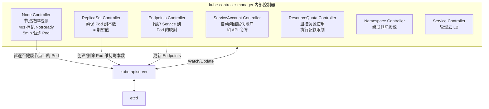

#### 3.2.5 cloud-controller-manager

cloud-controller-manager（CCM）是 K8s 与云服务商集成的桥梁。它将与云平台紧密相关的控制逻辑从 kube-controller-manager 中分离出来，使得 K8s 的核心代码不依赖于特定的云服务商实现。

CCM 主要包含三类控制器：

**节点管理（Node Controller）**：当新的 Worker 节点加入集群时，CCM 通过云厂商的 API 获取该节点的详细信息——云实例 ID、公网/私网 IP 地址、实例类型（CPU/内存规格）、可用区（Availability Zone）等，并将这些信息填充到 Node 对象的 metadata 和 status 中。当云实例被销毁时，CCM 自动清理对应的 Node 对象。

**路由管理（Route Controller）**：在云环境中配置跨节点的网络路由，确保不同 Node 上的 Pod 可以通过云厂商的虚拟网络（VPC）互相通信。例如，在 AWS 中，Route Controller 会在 VPC 路由表中为每个 Node 的 Pod CIDR 添加路由规则。

**负载均衡管理（Service Controller）**：管理云厂商提供的负载均衡器资源。当用户创建 `type: LoadBalancer` 类型的 Service 时，CCM 调用云厂商 API 创建外部负载均衡器，配置健康检查、后端节点组等，并将负载均衡器的 VIP 回填到 Service 对象中。

对于运行在自建数据中心（on-premises）的 K8s 集群，不需要部署 CCM。美团 Kubernetes 平台基于自有数据中心，通过定制化的 CNI 网络插件和 flexvolume 存储插件替代了 CCM 的部分功能，实现了与内部网络和存储系统的集成。

### 3.3 节点组件详解

#### 3.3.1 kubelet

kubelet 是运行在每个 Worker 节点上的核心代理进程，可以形象地比喻为 Master 节点安插在 Worker 节点上的**"眼线"**——它既是 Master 观察 Worker 节点状态的"眼睛"，又是 Master 在 Worker 节点上执行指令的"双手"。

**定时向 API Server 汇报状态**：kubelet 每隔 10 秒向 API Server 发送一次 Node Status 更新（心跳），报告节点的健康状态、资源使用情况（CPU、内存、磁盘、PID 等可分配资源）、以及节点上所有 Pod 的运行状态。这些信息是 Scheduler 进行调度决策和 Node Controller 进行故障检测的基础数据来源。

**接受 Master 节点指示执行操作**：kubelet 通过 Watch 机制监听 API Server，获取调度到本节点的 Pod 定义（PodSpec）。收到新的 Pod 后，kubelet 调用容器运行时（通过 CRI 接口）创建容器、配置网络（通过 CNI 插件）、挂载存储卷（通过 CSI 插件或内置的 volume 插件），将 Pod 从"纸面定义"变为"实际运行的容器组"。

**容器生命周期管理**：kubelet 负责容器的完整生命周期——创建、启动、监控、重启、停止、删除。当 Pod 的定义发生变化（例如容器镜像版本更新），kubelet 会重新创建容器来应用变更。

**健康检查**：kubelet 支持三种健康检查探针，它们是 K8s 确保应用可靠运行的核心机制：

**Liveness Probe（存活探针）**：检测容器是否"还活着"。如果存活探针失败，kubelet 会杀掉容器并根据重启策略（restartPolicy）重启它。典型场景是检测应用是否陷入了死锁——进程还在，但已经无法处理请求。

**Readiness Probe（就绪探针）**：检测容器是否"准备好接收流量"。如果就绪探针失败，Endpoints Controller 会将该 Pod 从 Service 的端点列表中移除，不再向它转发流量。但与存活探针不同的是，就绪探针失败不会触发容器重启。典型场景是应用启动时需要加载缓存或预热连接池，在此期间不应接收流量。

**Startup Probe（启动探针）**：K8s 1.16 引入的探针类型，用于检测容器内的应用是否已经完成启动。在启动探针成功之前，存活探针和就绪探针不会工作。这解决了慢启动应用的问题——如果一个 Java 应用需要 60 秒才能完成初始化，设置过短的存活探针超时会导致容器在启动完成前被反复杀掉重启。

```yaml
# 健康检查探针完整配置示例
apiVersion: v1
kind: Pod
metadata:
  name: health-check-demo
spec:
  containers:
  - name: app
    image: my-app:v1.0
    ports:
    - containerPort: 8080

    # 启动探针：等待应用完成启动
    startupProbe:
      httpGet:
        path: /health/startup
        port: 8080
      initialDelaySeconds: 5     # 容器启动后 5 秒开始检测
      periodSeconds: 5           # 每 5 秒检测一次
      failureThreshold: 30       # 最多允许失败 30 次（总等待 5+30*5=155 秒）
      # 在启动探针成功之前，存活和就绪探针不工作

    # 存活探针：检测应用是否还活着
    livenessProbe:
      httpGet:
        path: /health/live
        port: 8080
      initialDelaySeconds: 0     # 启动探针成功后立即开始
      periodSeconds: 10          # 每 10 秒检测一次
      timeoutSeconds: 3          # 每次检测的超时时间
      failureThreshold: 3        # 连续失败 3 次则重启容器

    # 就绪探针：检测应用是否可以接收流量
    readinessProbe:
      httpGet:
        path: /health/ready
        port: 8080
      periodSeconds: 5           # 每 5 秒检测一次
      failureThreshold: 2        # 连续失败 2 次则从 Service 端点移除

    resources:
      requests:
        cpu: "2"
        memory: "2Gi"
      limits:
        cpu: "4"
        memory: "4Gi"

  # 重启策略
  restartPolicy: Always  # Always: 容器退出后始终重启（默认值）
                          # OnFailure: 仅在非零退出码时重启
                          # Never: 从不重启
```

**重启策略**：`restartPolicy: Always` 是最常用的策略，确保容器在任何情况下退出后都会被自动重启。kubelet 使用指数退避（exponential backoff）算法来控制重启频率——第一次重启间隔 10 秒，第二次 20 秒，第三次 40 秒……最大间隔 5 分钟。如果容器成功运行超过 10 分钟，退避计时器会重置。

#### 3.3.2 kube-proxy

kube-proxy 是运行在每个 Node 上的**网络代理**组件，是 K8s Service 功能实现的核心。它负责将发往 Service ClusterIP 的流量转发到后端的 Pod 实例。

K8s 中的 Service 是一个逻辑概念——它为一组 Pod 提供一个稳定的虚拟 IP 地址（ClusterIP）和 DNS 名称。Pod 的 IP 是动态变化的（Pod 重建后 IP 会变），但 Service 的 ClusterIP 在创建后保持不变。kube-proxy 的工作就是将发往 ClusterIP 的流量"翻译"为发往某个后端 Pod IP 的流量。

kube-proxy 支持两种主要的代理模式：

**iptables 模式**：kube-proxy 通过配置 Linux iptables 规则来实现流量转发。每创建一个 Service，kube-proxy 就会添加一组 iptables 规则，将匹配 Service ClusterIP 和端口的数据包 DNAT（目标地址转换）到某个后端 Pod 的 IP 和端口。iptables 在内核空间直接处理数据包，无需经过用户空间的进程，因此性能较好。但 iptables 的规则是链式匹配的——每个数据包都需要从头开始逐条匹配规则，时间复杂度为 O(n)。当 Service 和 Pod 数量增加到数千时，iptables 规则可能达到数万条，规则更新和匹配的性能都会显著下降。

**IPVS 模式**：IPVS（IP Virtual Server）是 Linux 内核内置的四层负载均衡器，基于 Netfilter 框架，使用哈希表数据结构存储转发规则，查找时间复杂度为 O(1)。这使得 IPVS 在大规模集群中性能远优于 iptables。IPVS 还内置了多种负载均衡算法（轮询、加权轮询、最少连接、加权最少连接、源地址哈希等），比 iptables 的随机 DNAT 更灵活。

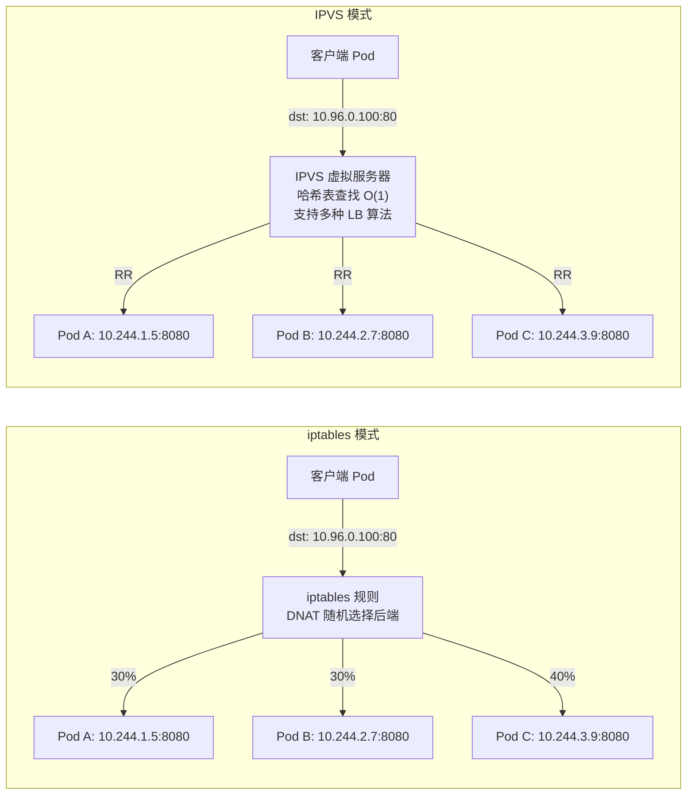

```bash
# 查看 iptables 模式下 kube-proxy 创建的规则
sudo iptables -t nat -L KUBE-SERVICES -n | head -20

# 查看 IPVS 模式下的虚拟服务器
sudo ipvsadm -Ln
# 输出示例：
# TCP  10.96.0.100:80 rr
#   -> 10.244.1.5:8080     Masq    1      0      0
#   -> 10.244.2.7:8080     Masq    1      0      0
#   -> 10.244.3.9:8080     Masq    1      0      0
```

在大规模生产集群中（Service 数量超过 1000），推荐使用 IPVS 模式以获得更好的性能和更丰富的负载均衡策略。

#### 3.3.3 容器运行时

容器运行时是 kubelet 调用来实际创建和管理容器的底层组件。kubelet 通过 CRI（Container Runtime Interface）gRPC 接口与容器运行时通信。

**CRI 接口**：CRI 定义了两组核心接口——RuntimeService 和 ImageService。RuntimeService 包含 Pod 沙箱管理（RunPodSandbox、StopPodSandbox）和容器管理（CreateContainer、StartContainer、StopContainer、RemoveContainer）等操作；ImageService 包含镜像管理（PullImage、ListImages、RemoveImage）等操作。

**containerd 架构**：containerd 是目前最主流的 CRI 运行时实现。它的内部架构是插件化的——内置 CRI 插件直接处理 kubelet 的 CRI 请求，通过 snapshotter（快照管理器）管理容器文件系统（使用 OverlayFS），通过 task/shim 机制管理容器进程的生命周期，最终调用 runc 来创建符合 OCI 标准的容器。

**Pod 创建流程**：当一个新的 Pod 被调度到某个 Node 上时，kubelet 与容器运行时的交互过程如下：

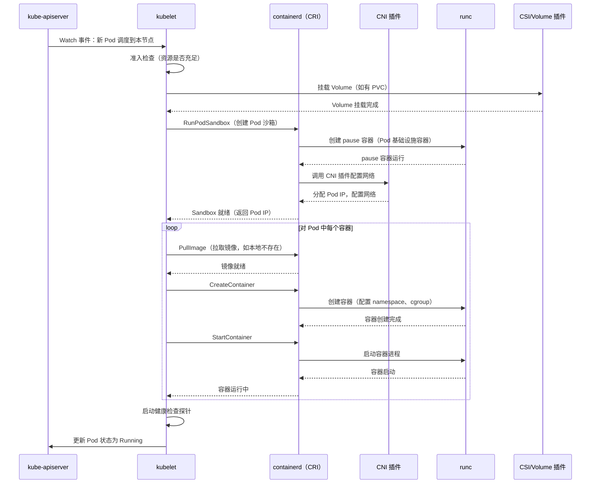

上图中值得关注的一个细节是 **pause 容器**。每个 Pod 中都会有一个隐藏的 pause 容器（也叫 infra container），它是 Pod 中第一个被创建的容器。pause 容器的作用是持有 Pod 的 Linux Namespace（主要是 Network Namespace 和 IPC Namespace），Pod 中的其他业务容器通过 join 这些 Namespace 来共享网络和 IPC。pause 容器本身几乎不消耗资源——它的 main 函数就是一个永久等待信号的 pause() 系统调用。

### 3.4 附加组件

除了核心组件外，K8s 还有一系列附加组件（Addons），它们以 Pod 或 DaemonSet 的形式运行在集群中，提供重要的辅助功能。

**DNS（CoreDNS）**：CoreDNS 是 K8s 集群的内部 DNS 服务器（替代了早期的 kube-dns）。它为每个 Service 自动创建 DNS 记录，使得 Pod 可以通过 Service 名称而非 IP 地址进行服务发现。DNS 记录的格式为 `<service-name>.<namespace>.svc.cluster.local`。例如，名为 `my-api` 的 Service 在 `production` 命名空间中，可以通过 `my-api.production.svc.cluster.local` 访问。同一命名空间内可以省略后缀，直接使用 `my-api`。

```bash
# 在 Pod 内部验证 DNS 解析
kubectl run dns-test --image=busybox:1.36 --restart=Never --rm -it -- nslookup my-api.production.svc.cluster.local
# 输出：
# Server:    10.96.0.10
# Address:   10.96.0.10:53
# Name:      my-api.production.svc.cluster.local
# Address:   10.96.128.55
```

**Dashboard**：K8s 的官方 Web 管理界面，提供了集群资源的可视化管理功能——查看 Pod、Deployment、Service 的状态，查看容器日志，执行简单的运维操作。Dashboard 适合快速浏览集群状态，但对于复杂的管理操作，kubectl 命令行工具通常是更高效的选择。

**Metrics Server**：集群资源监控的基础组件，负责采集各 Node 和 Pod 的 CPU、内存等核心指标数据。Metrics Server 的数据是 HPA（水平自动扩缩容）和 VPA（垂直自动扩缩容）的决策依据——没有 Metrics Server，HPA 就无法感知当前 Pod 的 CPU 使用率，也就无法触发扩缩容。`kubectl top node` 和 `kubectl top pod` 命令也依赖于 Metrics Server。

**Ingress Controller**：K8s 原生的 Service 只能暴露四层（TCP/UDP）的负载均衡。Ingress Controller 提供了七层（HTTP/HTTPS）的流量路由能力——基于域名和 URL 路径将外部流量路由到不同的 Service。常见的 Ingress Controller 实现包括 Nginx Ingress Controller、Traefik、HAProxy Ingress、Istio Gateway 等。

```yaml
# Ingress 配置示例：基于域名和路径路由
apiVersion: networking.k8s.io/v1
kind: Ingress
metadata:
  name: app-ingress
  annotations:
    nginx.ingress.kubernetes.io/rewrite-target: /
spec:
  ingressClassName: nginx
  rules:
  - host: api.example.com
    http:
      paths:
      - path: /users
        pathType: Prefix
        backend:
          service:
            name: user-service
            port:
              number: 80
      - path: /orders
        pathType: Prefix
        backend:
          service:
            name: order-service
            port:
              number: 80
  - host: admin.example.com
    http:
      paths:
      - path: /
        pathType: Prefix
        backend:
          service:
            name: admin-dashboard
            port:
              number: 80
  tls:
  - hosts:
    - api.example.com
    - admin.example.com
    secretName: tls-secret
```

### 3.5 K8s 组件间通信流程

理解了每个组件的职责后，让我们将它们串联起来，看看一个完整的 Pod 创建流程中各组件是如何协作的。

#### 完整的 Pod 创建流程

当用户执行 `kubectl apply -f deployment.yaml` 创建一个 Deployment 时，背后发生了以下一系列精密的协作过程：

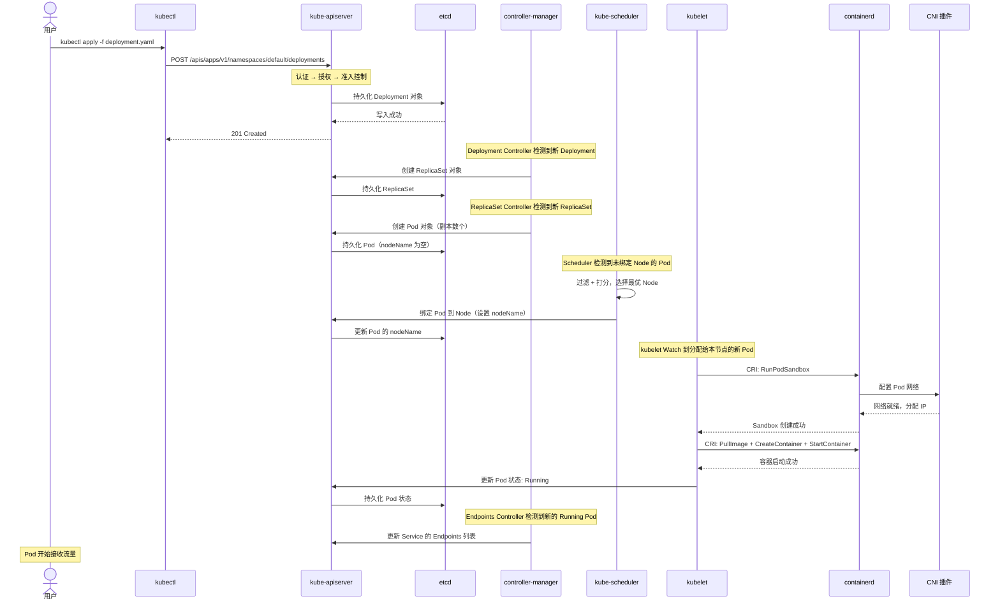

整个流程可以归纳为以下几条关键通信路径：

**用户请求路径**：`用户 → kubectl → API Server → etcd`。用户通过 kubectl 提交资源定义，API Server 验证后持久化到 etcd。这是"声明期望状态"的过程。

**调度路径**：`API Server → Scheduler → API Server → etcd`。Scheduler 监听到新的未绑定 Pod 后进行调度决策，将结果（Pod 到 Node 的绑定关系）写回 API Server。

**控制器路径**：`Controller Manager → API Server → etcd`。各种控制器监听资源变化，执行调和逻辑（如创建 ReplicaSet、创建 Pod、更新 Endpoints），所有变更都通过 API Server 写入 etcd。

**执行路径**：`API Server → kubelet → 容器运行时 → 容器`。kubelet 监听到调度给自己的 Pod 后，调用容器运行时创建并启动容器，然后将 Pod 状态汇报给 API Server。

这个架构有一个非常优雅的特点：**所有组件只与 API Server 通信，组件之间没有直接依赖**。这意味着每个组件都可以独立部署、独立升级、独立扩展。即使 Scheduler 暂时宕机，已经运行的 Pod 不会受到任何影响，只是新的 Pod 暂时无法调度而已。这种松耦合的架构是 K8s 高可用性的基石。

美团 Kubernetes 平台在这一架构的基础上，通过定制 CNI 网络插件（对接内部的网络基础设施）和 flexvolume 存储插件（对接内部分布式存储系统），将 K8s 无缝集成到美团的基础设施体系中，同时通过 etcd event 集群拆分、API Server 请求限流和优先级队列等手段对控制平面进行了深度加固，使得托管集群 API Server 的 SLA 达到 99.95%，整体平台稳定性达到 99.99%。

---

> **本章小结**：本部分系统性地介绍了 Kubernetes 的三大基础主题。第一章回顾了 K8s 从 Google Borg 系统发展而来的历史脉络，阐明了它在云原生生态中的核心地位和解决的关键问题。第二章深入剖析了容器技术的三大支柱——Namespace、Cgroups 和 UnionFS，以及容器运行时的演进。第三章全面解析了 K8s 的 Master-Worker 架构，详细讲解了每个控制平面组件和节点组件的原理和职责，并通过完整的 Pod 创建流程展示了各组件之间的协作机制。理解这些基础知识，是深入学习 K8s 资源对象、网络模型、存储系统等进阶主题的坚实基础。
