## 第四章：核心资源对象详解

Kubernetes 的核心设计理念是"声明式 API + 控制器模式"。用户通过 YAML 声明期望状态，控制器不断将实际状态向期望状态收敛。本章将深入剖析 K8s 中最核心的资源对象——从最小调度单元 Pod，到工作负载控制器、服务发现、配置管理、资源隔离，覆盖每个对象的底层原理、完整配置示例和实际生产最佳实践。

---

### 4.1 Pod —— K8s最小调度单元

#### 4.1.1 Pod的本质

Pod 是 Kubernetes 中最小的可部署和调度单元。一个 Pod 包含一组（一个或多个）紧密协作的容器，这些容器共享网络和存储资源，被作为一个整体进行调度和管理。

**为什么需要 Pod 而不是直接管理容器？**

在 Docker 世界中，我们直接管理容器。但 Kubernetes 引入了 Pod 这一层抽象，核心原因如下：

第一，**容器的设计哲学是"一个容器一个进程"**。Docker 官方建议每个容器只运行一个主进程。但现实中的微服务往往需要多个辅助进程协同工作——比如主应用容器 + 日志收集 sidecar、主应用容器 + 配置文件热加载 agent。如果把这些进程塞进同一个容器，就违反了单一职责原则，且进程管理（信号传递、僵尸进程回收）变得复杂。Pod 允许我们把多个容器放在一起，同时保持每个容器的单一职责。

第二，**Pod 提供了共享的上下文环境**。同一 Pod 内的容器共享 Linux namespace（网络、IPC、UTS），它们可以通过 localhost 互相通信，共享 hostname，共享存储卷。这大大简化了容器间协作的复杂度。

第三，**Pod 是调度的原子单位**。K8s 调度器以 Pod 为单位进行调度，保证 Pod 内的所有容器被部署到同一个 Node 上。如果直接调度容器，很难保证协作的容器被分配到同一节点。

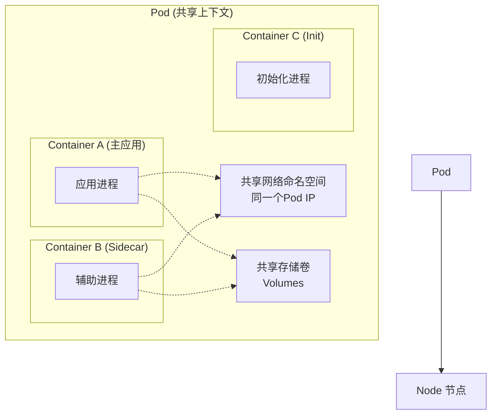

**Pod 与容器的关系图解：**

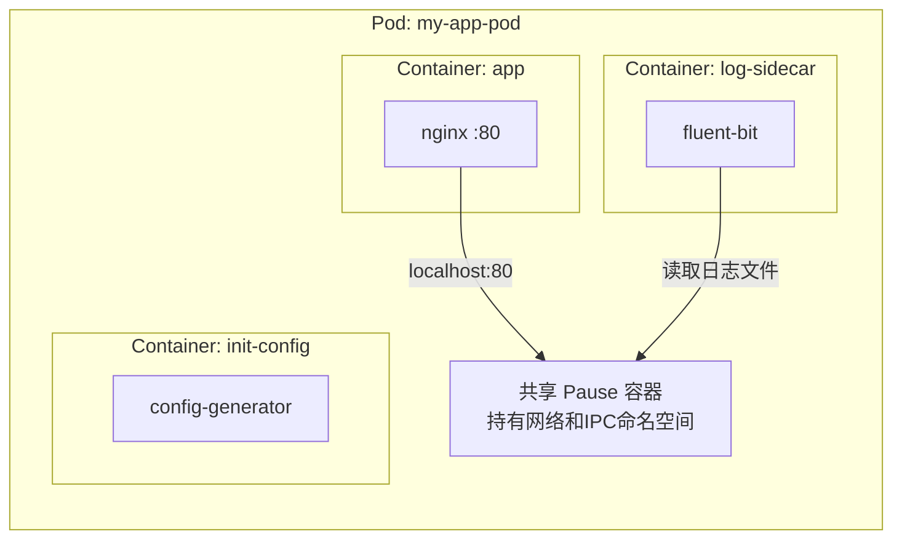

> **Pause 容器的秘密**：每个 Pod 底层都有一个特殊的 "pause" 容器（infrastructure container），它最先启动，持有 Pod 的网络和 IPC 命名空间。Pod 内的其他容器都以 container mode（`--net=container --ipc=container`）加入 pause 容器的命名空间。当其他容器崩溃重启时，网络命名空间不会丢失，Pod IP 保持不变。

#### 4.1.2 Pod的生命周期

Pod 从创建到销毁经历一系列阶段。理解生命周期对于排查问题和设计高可用应用至关重要。

**Pod Phase 状态转换图：**

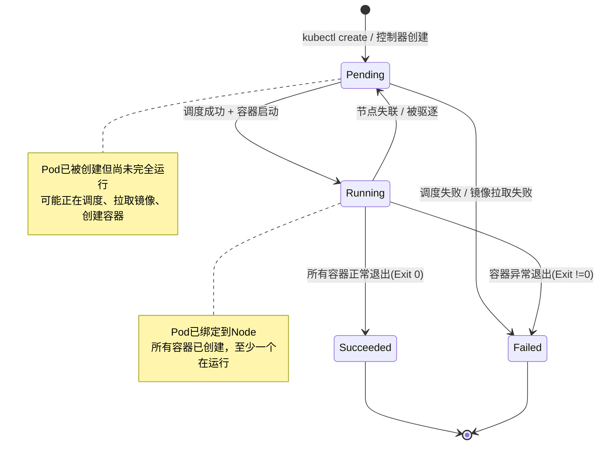

**Pod 的五种 Phase 详解：**

| Phase | 说明 |
|-------|------|
| Pending | Pod 已被 API Server 接受，但尚未完全运行。可能正在等待调度、拉取镜像、创建容器。 |
| Running | Pod 已绑定到某个 Node，所有容器已创建，至少有一个容器正在运行或正在启动/重启。 |
| Succeeded | Pod 中所有容器都已成功终止，且不会重启。常见于 Job 完成时。 |
| Failed | Pod 中所有容器都已终止，且至少有一个容器以失败终止。 |
| Unknown | 通常因为无法与 Pod 所在 Node 的 kubelet 通信导致。 |

**容器的三种状态：**

容器级别的状态比 Pod 级别的 Phase 更精细：

- **Waiting**：容器尚未运行。常见原因包括 `ContainerCreating`（正在创建）、`ImagePullBackOff`（镜像拉取失败重试中）、`CrashLoopBackOff`（容器反复崩溃重启）。
- **Running**：容器正在正常运行。
- **Terminated**：容器已终止。包含退出码、信号、终止原因等信息。

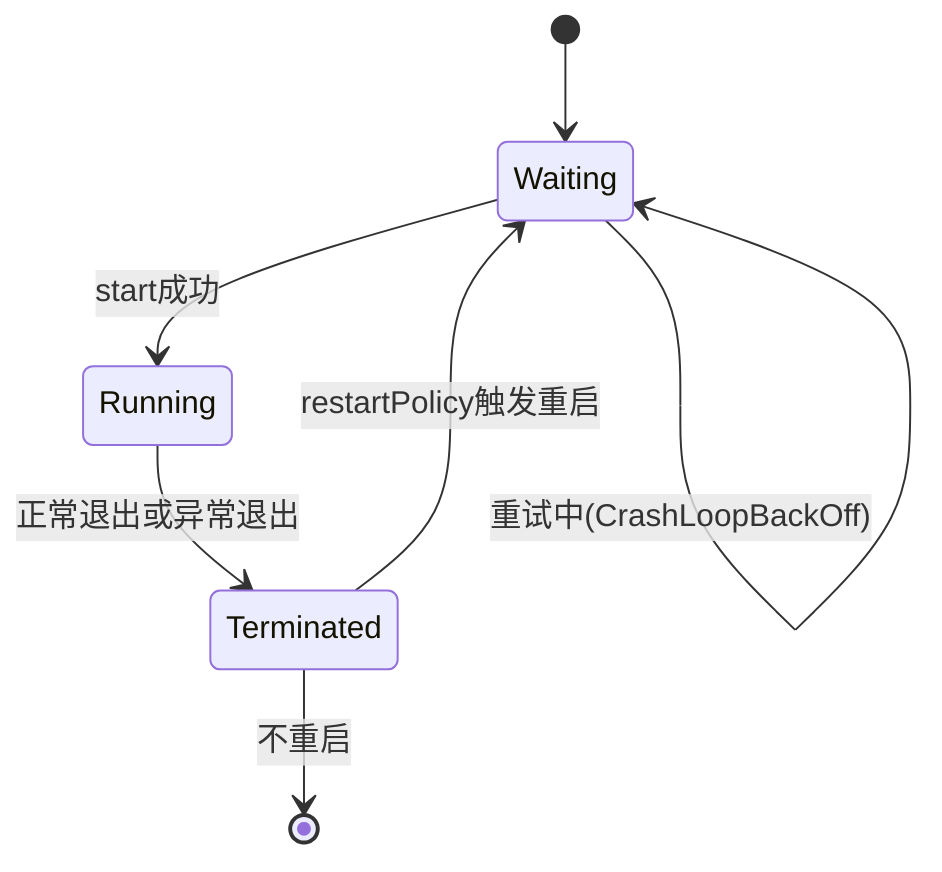

**Init Container 的作用和执行顺序：**

Init Container（初始化容器）在 Pod 的主容器启动之前按顺序运行。它具有以下特性：

1. Init Container 总是运行到完成（不会一直运行）。
2. 每个 Init Container 必须成功完成后，下一个才会启动。
3. 如果 Init Container 失败，K8s 会根据 restartPolicy 重启整个 Pod（注意：即使 restartPolicy 为 Always，Init Container 也不会在失败后原地重启，而是整个 Pod 重启）。
4. Init Container 不支持 readinessProbe 和 livenessProbe。

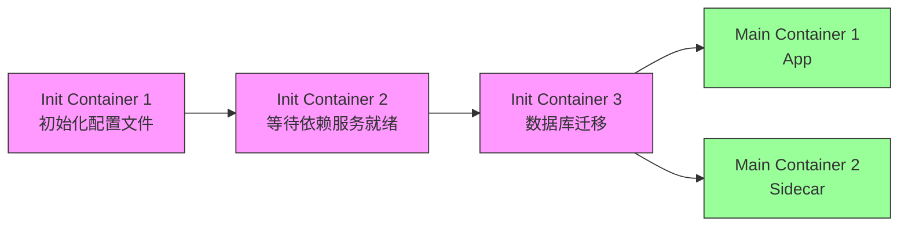

Init Container 的典型使用场景包括：等待外部服务（如数据库）就绪后再启动主容器、从配置中心拉取配置、执行数据库 schema 迁移、注册到服务发现等。

**重启策略（restartPolicy）：**

| 策略 | 说明 | 适用场景 |
|------|------|---------|
| Always | 容器退出后总是重启（默认值） | 长期运行的服务（Deployment、StatefulSet） |
| OnFailure | 仅在容器以非零状态退出时重启 | 期望成功的任务（Job） |
| Never | 容器退出后从不重启 | 一次性任务、调试场景 |

> 注意：restartPolicy 只影响 Pod 内容器的重启行为，不影响 Pod 本身的生命周期。Pod 被 Delete 后不会自动重建——这需要控制器（如 Deployment）来完成。

#### 4.1.3 Pod的YAML定义详解

下面是一个完整的 Pod YAML 定义，包含所有核心字段：

```yaml
apiVersion: v1                    # API 版本
kind: Pod                         # 资源类型
metadata:
  name: my-app-pod                # Pod 名称（命名空间内唯一）
  namespace: production           # 命名空间
  labels:                         # 标签（用于选择和过滤）
    app: my-app
    tier: frontend
    environment: production
  annotations:                    # 注解（用于附加非选择性的元数据）
    description: "前端应用Pod"
    maintained-by: "team-frontend"
spec:
  restartPolicy: Always           # 重启策略
  nodeSelector:                   # 节点选择器（简单亲和性）
    disktype: ssd
  serviceAccountName: my-app-sa   # ServiceAccount（用于RBAC）
  
  initContainers:                 # 初始化容器
  - name: init-db-check
    image: busybox:1.36
    command: ['sh', '-c', 'until nc -z mysql-service 3306; do echo waiting for mysql; sleep 2; done;']
    
  containers:                     # 主容器列表
  - name: my-app                  # 容器名称（Pod内唯一）
    image: my-app:v1.0.0          # 镜像
    imagePullPolicy: IfNotPresent # 镜像拉取策略: Always|Never|IfNotPresent
    
    ports:                        # 容器暴露端口
    - name: http
      containerPort: 8080
      protocol: TCP
    
    env:                          # 环境变量
    - name: APP_ENV
      value: "production"
    - name: DB_HOST
      valueFrom:                  # 从ConfigMap/Secret引用
        configMapKeyRef:
          name: app-config
          key: db_host
    - name: DB_PASSWORD
      valueFrom:
        secretKeyRef:
          name: db-secret
          key: password
    
    resources:                    # 资源请求与限制
      requests:                   # 调度依据，保证最小资源
        cpu: "500m"               # 500 millicores = 0.5 核
        memory: "512Mi"           # 512 MiB
        ephemeral-storage: "1Gi"
      limits:                     # 资源上限，超过将被限制或杀掉
        cpu: "1000m"              # 1 核
        memory: "1Gi"
        ephemeral-storage: "2Gi"
    
    livenessProbe:                # 存活探针
      httpGet:
        path: /health
        port: 8080
      initialDelaySeconds: 30     # 首次探测延迟
      periodSeconds: 10           # 探测间隔
      failureThreshold: 3         # 连续失败次数才判定为不健康
    
    readinessProbe:               # 就绪探针
      httpGet:
        path: /ready
        port: 8080
      initialDelaySeconds: 5
      periodSeconds: 5
      failureThreshold: 3
    
    volumeMounts:                 # 挂载存储卷
    - name: config-volume
      mountPath: /etc/config      # 挂载到容器内路径
      readOnly: true
    - name: cache-volume
      mountPath: /tmp/cache
    
    lifecycle:                    # 生命周期钩子
      postStart:                  # 容器创建后执行
        exec:
          command: ["/bin/sh", "-c", "echo 'App started' > /tmp/start.log"]
      preStop:                    # 容器终止前执行
        exec:
          command: ["/bin/sh", "-c", "nginx -s quit; sleep 10"]
    
    securityContext:              # 安全上下文
      runAsUser: 1000             # 以非root用户运行
      runAsNonRoot: true
      readOnlyRootFilesystem: false
      allowPrivilegeEscalation: false
      capabilities:
        drop: ["ALL"]
        add: ["NET_BIND_SERVICE"]
  
  - name: log-sidecar             # 第二个容器（Sidecar）
    image: fluent-bit:2.2.0
    resources:
      requests:
        cpu: "100m"
        memory: "128Mi"
      limits:
        cpu: "200m"
        memory: "256Mi"
    volumeMounts:
    - name: log-volume
      mountPath: /var/log/app
      readOnly: true
    - name: config-volume
      mountPath: /fluent-bit/etc
      readOnly: true
  
  volumes:                        # 存储卷定义
  - name: config-volume
    configMap:
      name: app-config            # 从ConfigMap创建
  
  - name: cache-volume
    emptyDir:
      sizeLimit: "1Gi"            # 临时空目录
  
  - name: log-volume
    emptyDir: {}
  
  terminationGracePeriodSeconds: 30  # 优雅终止宽限期（默认30秒）
  dnsPolicy: ClusterFirst         # DNS策略
```

**resources 请求与限制（requests vs limits）深入理解：**

`requests` 是调度器在调度 Pod 时参考的依据——调度器会寻找至少有这么多剩余资源的 Node。同时，requests 也是 QoS 计算的基础。`limits` 是运行时的硬上限——CPU limit 超过时容器会被节流（throttle），内存 limit 超过时容器会被 OOMKilled。

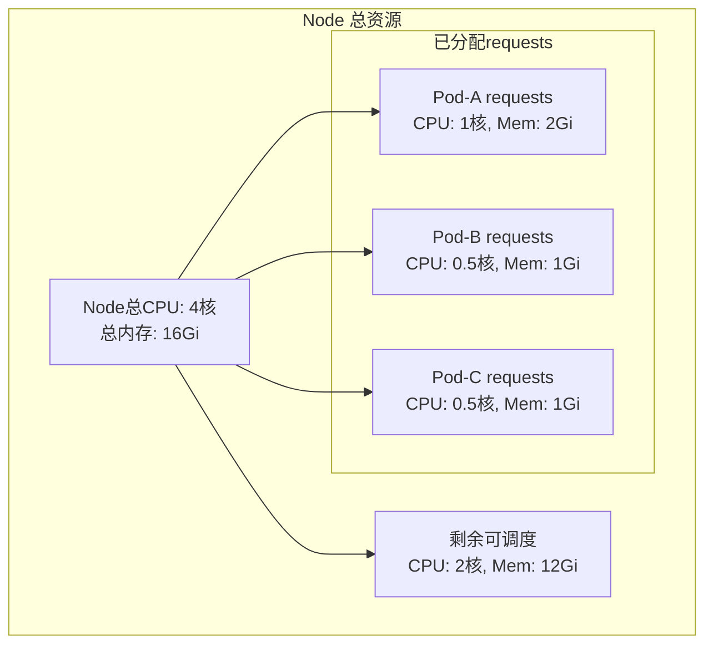

**Pod QoS（Quality of Service）类别详解：**

Kubernetes 根据每个容器的 requests 和 limits 配置，将 Pod 自动归为三个 QoS 等级。当节点资源不足时，K8s 按照 QoS 等级决定先驱逐哪些 Pod。

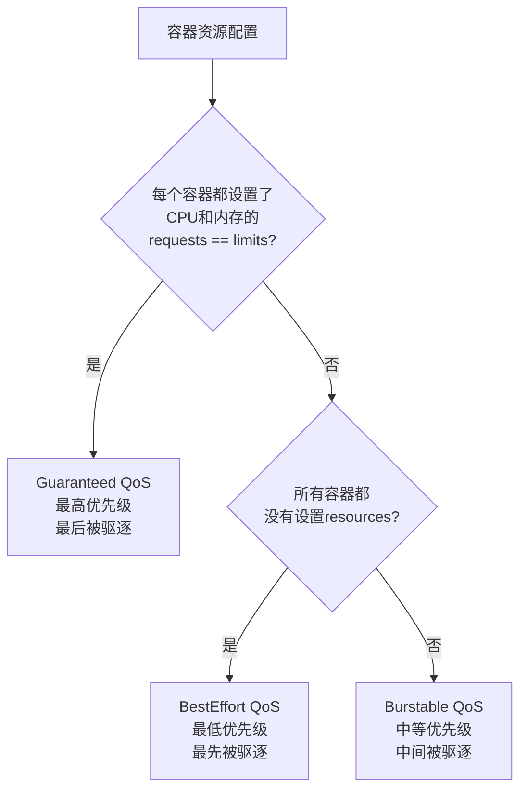

**Guaranteed（保证级）**：Pod 中每个容器都必须设置 CPU 和内存的 requests 和 limits，且 requests == limits。这类 Pod 获得最高优先级，节点资源紧张时最后被驱逐。适用于核心服务。

```yaml
# Guaranteed 示例
resources:
  requests:
    cpu: "500m"
    memory: "512Mi"
  limits:
    cpu: "500m"        # == requests
    memory: "512Mi"    # == requests
```

**Burstable（可突发级）**：Pod 至少有一个容器设置了 requests 或 limits，但不满足 Guaranteed 条件。容器获得 requests 保证的资源，在有空余资源时可以突发使用到 limits。**企业实践中大量使用此类别**，因为大多数微服务的负载有明显的峰谷特征，Burstable 既保证了基线资源，又允许突发使用，提高集群整体资源利用率。

```yaml
# Burstable 示例（企业推荐实践）
resources:
  requests:
    cpu: "500m"       # 保底 0.5 核
    memory: "512Mi"   # 保底 512Mi
  limits:
    cpu: "2000m"      # 可突发到 2 核
    memory: "2Gi"     # 可突发到 2Gi
```

**BestEffort（尽力而为级）**：Pod 中所有容器都没有设置 resources。这类 Pod 优先级最低，节点资源不足时最先被驱逐。仅适用于不重要的任务。

```yaml
# BestEffort 示例（不设置resources）
# 不设置 resources 字段即为 BestEffort
```

> **企业最佳实践建议**：生产环境的服务 Pod 应至少设置为 Burstable，核心服务设置为 Guaranteed。合理设置 requests（参考 P50 负载）和 limits（参考 P99 负载），避免 requests 设置过高导致集群资源利用率低，也要避免 limits 设置过低导致频繁 OOM。

#### 4.1.4 健康检查机制

Kubernetes 提供三种探针（Probe）来全面监控容器健康状态。这是保障应用高可用的关键机制。

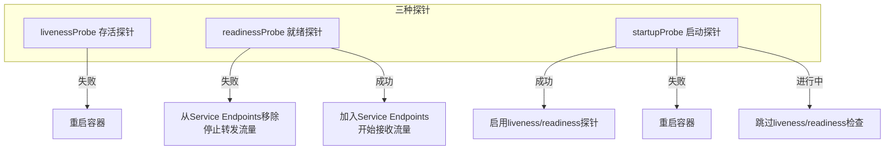

**livenessProbe（存活探针）**：用于检测容器是否在运行。如果存活探针失败，kubelet 会杀掉容器并根据 restartPolicy 决定是否重启。存活探针用于检测死锁、无限循环等容器进程还在但无法提供服务的状态。

**readinessProbe（就绪探针）**：用于检测容器是否准备好接收流量。就绪探针失败时，Pod 会从 Service 的 Endpoints 中移除，不再接收新请求，但容器不会被重启。就绪探针用于应用启动慢、依赖外部服务暂时不可用的场景。

**startupProbe（启动探针）**：K8s 1.16+ 引入，专门用于检测容器应用是否已启动。在 startupProbe 成功之前，livenessProbe 和 readinessProbe 会被禁用。这对于启动缓慢的应用（如 Java Spring Boot 应用启动可能需要数分钟）非常有用，避免因 livenessProbe 在启动期间失败而导致容器被反复重启。

**三种探针检测类型：**

**1. HTTP GET 探针**——最常用，适用于提供 HTTP 健康检查接口的应用：

```yaml
apiVersion: v1
kind: Pod
metadata:
  name: http-probe-demo
spec:
  containers:
  - name: web-app
    image: nginx:1.25
    ports:
    - containerPort: 80
    
    # 存活探针 - HTTP GET方式
    livenessProbe:
      httpGet:
        path: /healthz          # 健康检查路径
        port: 80                # 端口
        httpHeaders:            # 自定义请求头
        - name: Custom-Header
          value: health-check
      initialDelaySeconds: 15   # 容器启动后15秒开始探测
      periodSeconds: 10         # 每10秒探测一次
      timeoutSeconds: 3         # 探测超时时间
      successThreshold: 1       # 连续成功1次判定为健康
      failureThreshold: 3       # 连续失败3次判定为不健康
    
    # 就绪探针 - HTTP GET方式
    readinessProbe:
      httpGet:
        path: /readyz
        port: 80
      initialDelaySeconds: 5
      periodSeconds: 5
      failureThreshold: 3
    
    # 启动探针 - HTTP GET方式
    startupProbe:
      httpGet:
        path: /startup
        port: 80
      initialDelaySeconds: 0
      periodSeconds: 10
      failureThreshold: 30     # 30次 * 10秒 = 最多等5分钟启动
```

**2. TCP Socket 探针**——适用于非HTTP服务（如数据库、消息队列）：

```yaml
apiVersion: v1
kind: Pod
metadata:
  name: tcp-probe-demo
spec:
  containers:
  - name: redis
    image: redis:7.2
    ports:
    - containerPort: 6379
    
    livenessProbe:
      tcpSocket:
        port: 6379            # 尝试建立TCP连接
      initialDelaySeconds: 10
      periodSeconds: 10
      timeoutSeconds: 3
      failureThreshold: 3
    
    readinessProbe:
      tcpSocket:
        port: 6379
      initialDelaySeconds: 5
      periodSeconds: 5
```

**3. Exec 命令探针**——在容器内执行命令，退出码为0表示成功：

```yaml
apiVersion: v1
kind: Pod
metadata:
  name: exec-probe-demo
spec:
  containers:
  - name: app
    image: busybox:1.36
    command: ["/bin/sh", "-c", "touch /tmp/healthy; sleep 3600"]
    
    livenessProbe:
      exec:
        command:
        - /bin/sh
        - -c
        - test -f /tmp/healthy    # 检查文件是否存在
      initialDelaySeconds: 5
      periodSeconds: 5
      failureThreshold: 3
    
    readinessProbe:
      exec:
        command:
        - /bin/sh
        - -c
        - "pgrep -f my-app"       # 检查进程是否在运行
      initialDelaySeconds: 5
      periodSeconds: 10
```

> **企业最佳实践**：livenessProbe 的 `initialDelaySeconds` 和 `failureThreshold` 要设置得保守一些，避免因网络抖动导致误杀。readinessProbe 可以设置得更积极，因为失败只是摘除流量不会杀容器。对于 Java 应用强烈建议使用 startupProbe，避免启动期间被 livenessProbe 误判。

#### 4.1.5 多容器Pod设计模式

多容器 Pod 是 Kubernetes 的特色设计。以下是四种经典设计模式：

**1. Sidecar 模式**——在主容器旁运行辅助容器，增强或扩展主容器功能：

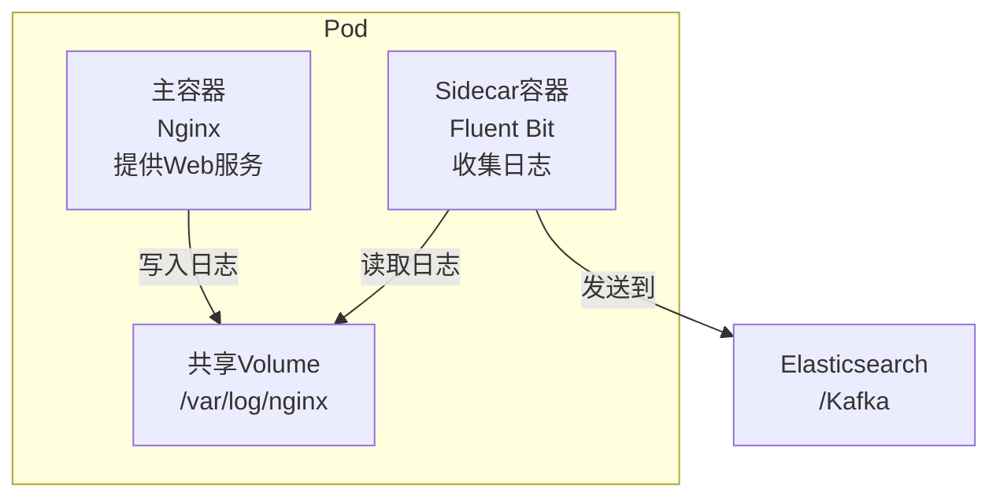

```yaml
apiVersion: v1
kind: Pod
metadata:
  name: sidecar-pattern
  labels:
    app: web-with-logging
spec:
  containers:
  - name: nginx
    image: nginx:1.25
    ports:
    - containerPort: 80
    volumeMounts:
    - name: shared-logs
      mountPath: /var/log/nginx
    
  - name: log-collector          # Sidecar容器
    image: fluent-bit:2.2.0
    volumeMounts:
    - name: shared-logs
      mountPath: /var/log/nginx
      readOnly: true
    env:
    - name: FLUENT_BIT_CONFIG
      value: "/fluent-bit/etc/fluent-bit.conf"
  
  volumes:
  - name: shared-logs
    emptyDir: {}
```

**2. Ambassador 模式**——容器作为代理，为主容器屏蔽外部服务的访问复杂度：

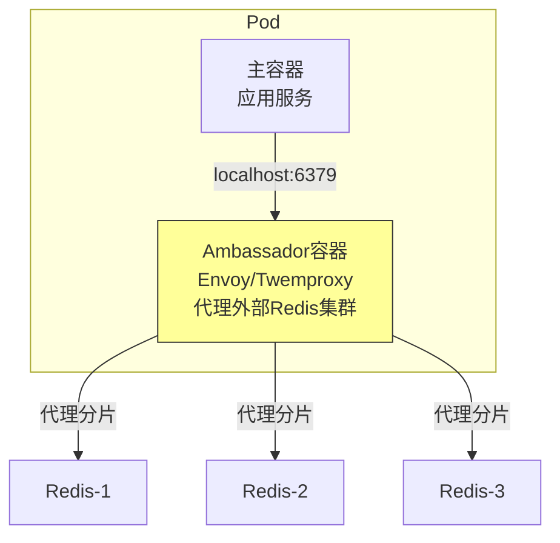

```yaml
apiVersion: v1
kind: Pod
metadata:
  name: ambassador-pattern
spec:
  containers:
  - name: my-app
    image: my-app:v1.0
    env:
    - name: REDIS_HOST
      value: "localhost"       # 连接本地的Ambassador
    - name: REDIS_PORT
      value: "6379"
    
  - name: redis-proxy          # Ambassador容器
    image: twemproxy:0.5.0
    env:
    - name: REDIS_SERVERS
      value: "redis-1:6379:1 redis-2:6379:1 redis-3:6379:1"
    ports:
    - containerPort: 6379
```

**3. Adapter 模式**——容器将主容器的输出标准化，使其符合外部系统的期望格式：

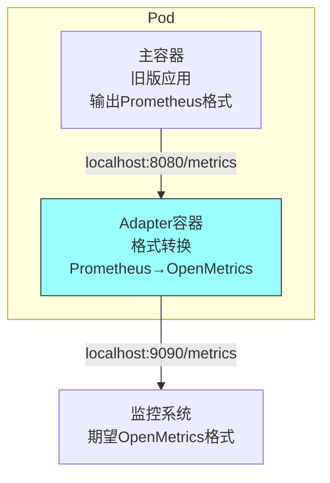

```yaml
apiVersion: v1
kind: Pod
metadata:
  name: adapter-pattern
spec:
  containers:
  - name: legacy-app
    image: legacy-app:v2.0
    ports:
    - containerPort: 8080
    
  - name: metrics-adapter       # Adapter容器
    image: metrics-adapter:v1.0
    ports:
    - containerPort: 9090
    env:
    - name: SOURCE_URL
      value: "http://localhost:8080/metrics"
    - name: OUTPUT_FORMAT
      value: "openmetrics"
```

**4. Init Container 模式**——在主容器启动前完成初始化工作：

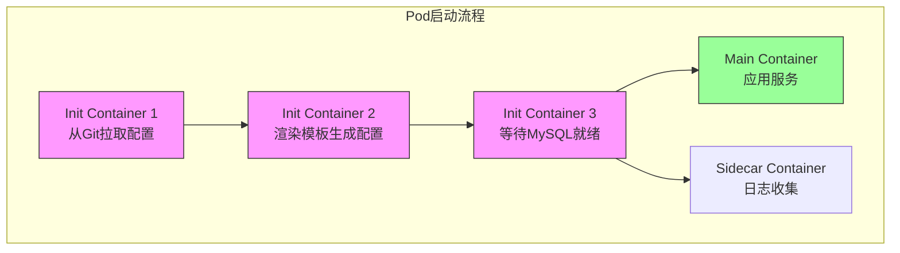

```yaml
apiVersion: v1
kind: Pod
metadata:
  name: init-container-pattern
spec:
  initContainers:
  - name: clone-config          # 第一个Init Container
    image: alpine/git:2.40.1
    command:
    - sh
    - -c
    - |
      git clone https://github.com/myorg/app-config.git /config
    volumeMounts:
    - name: config-data
      mountPath: /config
      
  - name: render-template       # 第二个Init Container（在前一个完成后执行）
    image: jinja2-cli:0.8.2
    command:
    - sh
    - -c
    - |
      jinja2 /config/app.conf.j2 /config/values.yaml > /config/app.conf
    volumeMounts:
    - name: config-data
      mountPath: /config
      
  - name: wait-for-db           # 第三个Init Container
    image: busybox:1.36
    command: ['sh', '-c', 'until nc -z mysql-service 3306; do sleep 2; done']
  
  containers:
  - name: my-app
    image: my-app:v1.0
    volumeMounts:
    - name: config-data
      mountPath: /etc/app
      readOnly: true
  
  volumes:
  - name: config-data
    emptyDir: {}
```

---

### 4.2 工作负载控制器

直接管理 Pod 是不可靠的——Pod 挂了不会自动重建。K8s 提供了多种工作负载控制器（Workload Controller）来管理 Pod 的生命周期，实现期望状态收敛、滚动更新、自愈等高级能力。

#### 4.2.1 ReplicaSet

ReplicaSet 确保任意时刻都有指定数量的 Pod 副本在运行。它是 ReplicationController 的继任者，主要区别在于支持更强大的标签选择器（Set-Based Selector）。

**标签选择器机制：**

- `matchLabels`：精确匹配键值对，等价于 ReplicationController 的选择器。
- `matchExpressions`：支持 `In`、`NotIn`、`Exists`、`DoesNotExist` 四种操作符，实现更灵活的选择逻辑。

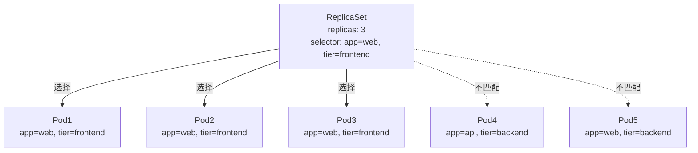

```yaml
apiVersion: apps/v1
kind: ReplicaSet
metadata:
  name: frontend-rs
  namespace: production
  labels:
    app: guestbook
    tier: frontend
spec:
  replicas: 3                     # 期望副本数
  minReadySeconds: 5              # Pod就绪后至少运行5秒才算可用
  
  selector:                       # 标签选择器
    matchLabels:
      app: guestbook
      tier: frontend
    # 也可以使用matchExpressions（与matchLabels是AND关系）
    # matchExpressions:
    # - key: environment
    #   operator: In
    #   values: ["production", "staging"]
    # - key: version
    #   operator: Exists
  
  template:                       # Pod模板
    metadata:
      labels:
        app: guestbook
        tier: frontend
        version: v1
    spec:
      containers:
      - name: php-redis
        image: gcr.io/google_samples/gb-frontend:v3
        ports:
        - containerPort: 80
        resources:
          requests:
            cpu: 100m
            memory: 128Mi
          limits:
            cpu: 200m
            memory: 256Mi
```

> **实际使用建议**：在生产环境中几乎不直接创建 ReplicaSet，而是通过 Deployment 来间接管理。Deployment 会自动创建和管理 ReplicaSet，并提供滚动更新和回滚能力。

#### 4.2.2 Deployment（重点详解）

Deployment 是 Kubernetes 中部署无状态应用的标准方式。它管理 ReplicaSet，ReplicaSet 管理 Pod，形成三层管理结构。

**Deployment → ReplicaSet → Pod 管理层级：**

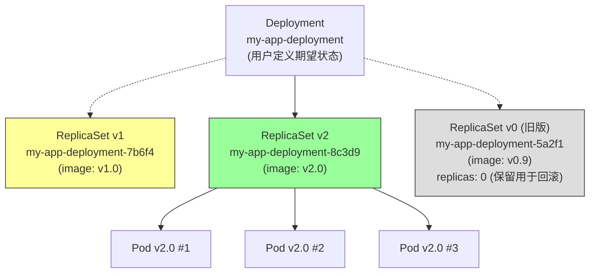

每次更新 Deployment 的 Pod 模板（如镜像版本），Deployment 就会创建一个新的 ReplicaSet，并逐步将旧的 ReplicaSet 缩容到 0，同时将新 ReplicaSet 扩容到期望副本数。旧 ReplicaSet 不会被删除（保留用于回滚），数量受 `revisionHistoryLimit` 控制。

**完整的 Deployment YAML 示例：**

```yaml
apiVersion: apps/v1
kind: Deployment
metadata:
  name: my-app-deployment
  namespace: production
  labels:
    app: my-app
spec:
  replicas: 4                       # 期望Pod副本数
  revisionHistoryLimit: 10          # 保留10个历史ReplicaSet版本（用于回滚）
  minReadySeconds: 10               # Pod就绪后至少运行10秒才算可用（防止滚动更新过快）
  paused: false                     # 是否暂停部署
  
  strategy:                         # 部署策略
    type: RollingUpdate             # RollingUpdate | Recreate
    rollingUpdate:
      maxSurge: 1                   # 滚动更新时，最多可超出期望副本数的数量（数字或百分比）
      maxUnavailable: 1             # 滚动更新时，最多允许不可用的副本数（数字或百分比）
  
  selector:
    matchLabels:
      app: my-app
  
  template:
    metadata:
      labels:
        app: my-app
        version: v2.0
    spec:
      containers:
      - name: my-app
        image: my-app:v2.0
        ports:
        - containerPort: 8080
        resources:
          requests:
            cpu: "500m"
            memory: "512Mi"
          limits:
            cpu: "1000m"
            memory: "1Gi"
        livenessProbe:
          httpGet:
            path: /health
            port: 8080
          initialDelaySeconds: 30
          periodSeconds: 10
        readinessProbe:
          httpGet:
            path: /ready
            port: 8080
          initialDelaySeconds: 5
          periodSeconds: 5
        env:
        - name: APP_ENV
          value: "production"
```

**滚动更新（RollingUpdate）策略详解：**

`maxSurge` 和 `maxUnavailable` 是控制滚动更新节奏的两个关键参数：

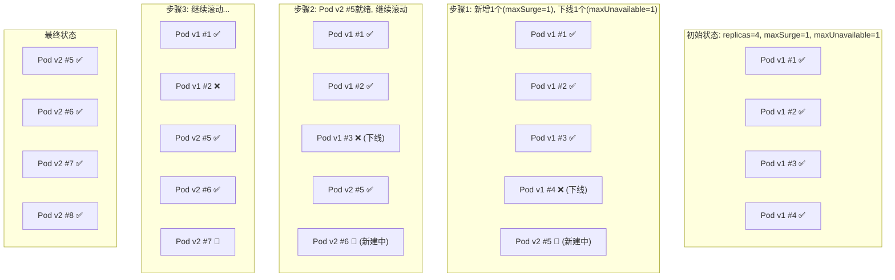

**maxSurge**：滚动更新过程中，允许超出期望副本数的最大 Pod 数量。例如期望 4 个副本，maxSurge=1，则最多同时运行 5 个 Pod。设置为 0 意味着不允许超量，更新必须先下线再上线。

**maxUnavailable**：滚动更新过程中，允许不可用（非就绪）Pod 的最大数量。例如期望 4 个副本，maxUnavailable=1，则最少保持 3 个 Pod 可用。设置为 0 意味着更新期间不允许任何 Pod 不可用，必须先上线再下线。

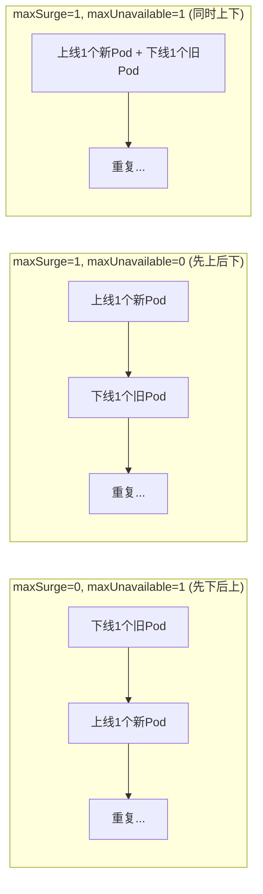

**回滚机制：**

当新版本有问题时，可以快速回滚到之前的版本：

```bash
# 查看部署历史
kubectl rollout history deployment/my-app-deployment

# 查看特定版本的详细信息
kubectl rollout history deployment/my-app-deployment --revision=2

# 回滚到上一个版本
kubectl rollout undo deployment/my-app-deployment

# 回滚到特定版本
kubectl rollout undo deployment/my-app-deployment --to-revision=2

# 查看回滚状态
kubectl rollout status deployment/my-app-deployment
```

回滚原理：Deployment 将目标 ReplicaSet 切换回旧版本，旧 ReplicaSet 扩容到期望副本数，当前 ReplicaSet 缩容到 0。本质上是一次反向的滚动更新。

**暂停和恢复部署：**

有时需要对 Deployment 做多项修改，但不希望每次修改都触发滚动更新。可以先暂停部署，完成所有修改后恢复：

```bash
# 暂停部署
kubectl rollout pause deployment/my-app-deployment

# 此时可以安全地修改多个字段
kubectl set image deployment/my-app-deployment my-app=my-app:v2.1
kubectl set resources deployment/my-app-deployment -c=my-app --limits=cpu=2,memory=2Gi

# 恢复部署，一次性应用所有变更
kubectl rollout resume deployment/my-app-deployment
```

**蓝绿部署实现方式：**

蓝绿部署通过两个 Deployment 切换流量来实现零停机更新：

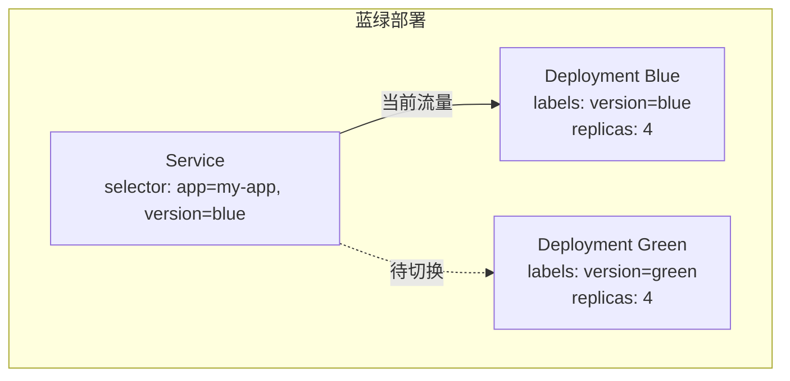

```yaml
# 蓝色版本（当前版本）
apiVersion: apps/v1
kind: Deployment
metadata:
  name: my-app-blue
spec:
  replicas: 4
  selector:
    matchLabels:
      app: my-app
      version: blue
  template:
    metadata:
      labels:
        app: my-app
        version: blue
    spec:
      containers:
      - name: my-app
        image: my-app:v1.0
---
# 绿色版本（新版本）
apiVersion: apps/v1
kind: Deployment
metadata:
  name: my-app-green
spec:
  replicas: 4
  selector:
    matchLabels:
      app: my-app
      version: green
  template:
    metadata:
      labels:
        app: my-app
        version: green
    spec:
      containers:
      - name: my-app
        image: my-app:v2.0
---
# Service（初始指向蓝色版本）
apiVersion: v1
kind: Service
metadata:
  name: my-app-service
spec:
  selector:
    app: my-app
    version: blue          # 切换为green即可完成蓝绿切换
  ports:
  - port: 80
    targetPort: 8080
```

蓝绿切换操作：将 Service 的 selector 从 `version: blue` 改为 `version: green`，流量瞬间切换到绿色版本。如果发现问题，改回 `version: blue` 即可秒级回滚。

**金丝雀发布实现方式：**

金丝雀发布通过逐步将少量流量导到新版本来验证新版本稳定性：

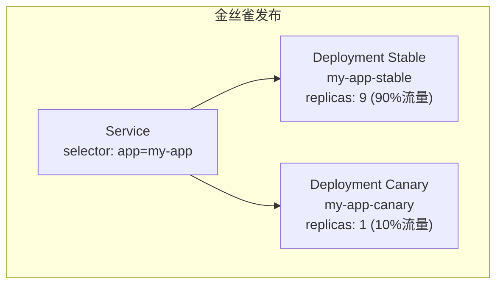

```yaml
# 稳定版本（承载90%流量）
apiVersion: apps/v1
kind: Deployment
metadata:
  name: my-app-stable
spec:
  replicas: 9                 # 9个副本
  selector:
    matchLabels:
      app: my-app
      track: stable
  template:
    metadata:
      labels:
        app: my-app
        track: stable
    spec:
      containers:
      - name: my-app
        image: my-app:v1.0
---
# 金丝雀版本（承载10%流量）
apiVersion: apps/v1
kind: Deployment
metadata:
  name: my-app-canary
spec:
  replicas: 1                 # 1个副本，约10%流量
  selector:
    matchLabels:
      app: my-app
      track: canary
  template:
    metadata:
      labels:
        app: my-app
        track: canary
    spec:
      containers:
      - name: my-app
        image: my-app:v2.0   # 新版本镜像
---
# Service（同时选择stable和canary）
apiVersion: v1
kind: Service
metadata:
  name: my-app-service
spec:
  selector:
    app: my-app               # 只匹配app标签，不区分track
  ports:
  - port: 80
    targetPort: 8080
```

金丝雀发布的流量比例由两个 Deployment 的副本数比例决定。验证通过后，逐步增加 canary 副本数、减少 stable 副本数，最终完成全量发布。如需更精确的流量控制，可使用 Istio 等服务网格实现基于权重的流量切分。

#### 4.2.3 StatefulSet

StatefulSet 用于管理有状态应用。与 Deployment 的核心区别在于：StatefulSet 为每个 Pod 提供稳定的网络标识和持久化存储，并保证有序的部署、扩缩和滚动更新。

**与 Deployment 的核心区别：**

| 特性 | Deployment | StatefulSet |
|------|-----------|-------------|
| Pod 名称 | 随机后缀（如 my-app-7b6f4-abcde） | 有序编号（如 web-0, web-1, web-2） |
| 网络标识 | Pod 重建后 hostname 变化 | Pod 重建后 hostname 不变 |
| 持久存储 | 共享或临时存储，Pod 重建后数据丢失 | 每个 Pod 绑定独立 PVC，Pod 重建后数据保留 |
| 部署顺序 | 并行创建所有 Pod | 有序创建（0 → 1 → 2...） |
| 缩容顺序 | 随机终止 Pod | 有序终止（...2 → 1 → 0） |
| 适用场景 | Web 服务、API 服务 | 数据库、消息队列、分布式存储 |

**稳定的网络标识：**

StatefulSet 的每个 Pod 拥有固定格式的名称：`$(statefulset-name)-$(ordinal)`。配合 Headless Service，每个 Pod 有一个稳定的 DNS 域名：`$(pod-name).$(service-name).$(namespace).svc.cluster.local`。

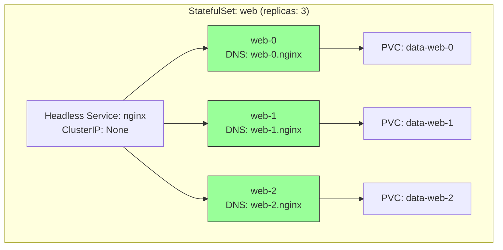

**有序部署和扩缩：**

默认使用 `OrderedReady` 策略——Pod 按序号顺序创建，前一个 Pod 必须就绪后下一个才会创建。扩容时从 0 开始依次创建，缩容时从最大序号开始依次删除。K8s 1.7+ 也支持 `Parallel` 策略，允许并行创建/删除 Pod。

**完整的 StatefulSet YAML 示例（以 MySQL 主从为例）：**

```yaml
# Headless Service - 为StatefulSet提供稳定网络标识
apiVersion: v1
kind: Service
metadata:
  name: mysql
  namespace: production
  labels:
    app: mysql
spec:
  ports:
  - name: mysql
    port: 3306
  clusterIP: None             # Headless Service，不分配ClusterIP
  selector:
    app: mysql
---
# StatefulSet
apiVersion: apps/v1
kind: StatefulSet
metadata:
  name: mysql
  namespace: production
spec:
  serviceName: mysql           # 必须指定关联的Headless Service
  replicas: 3                  # 3个MySQL实例
  podManagementPolicy: OrderedReady  # OrderedReady | Parallel
  updateStrategy:              # 滚动更新策略
    type: RollingUpdate
    rollingUpdate:
      partition: 0             # 仅更新序号 >= partition的Pod（用于分阶段更新）
  
  selector:
    matchLabels:
      app: mysql
  
  template:
    metadata:
      labels:
        app: mysql
    spec:
      affinity:
        podAntiAffinity:        # 反亲和性，将Pod分散到不同节点
          requiredDuringSchedulingIgnoredDuringExecution:
          - labelSelector:
              matchExpressions:
              - key: app
                operator: In
                values: ["mysql"]
            topologyKey: kubernetes.io/hostname
      
      initContainers:
      - name: init-mysql         # 初始化容器：根据Pod序号配置主从
        image: mysql:8.0
        command:
        - bash
        - -c
        - |
          # 根据序号判断主从
          ordinal=$(hostname | awk -F'-' '{print $NF}')
          if [ $ordinal -eq 0 ]; then
            cp /mnt/config-map/master.cnf /etc/mysql/conf.d/
          else
            cp /mnt/config-map/slave.cnf /etc/mysql/conf.d/
          fi
        volumeMounts:
        - name: conf
          mountPath: /etc/mysql/conf.d
        - name: config-map
          mountPath: /mnt/config-map
      
      - name: clone-mysql        # 从前一个Pod克隆数据
        image: gcr.io/google-samples/xtrabackup:1.0
        command: ['bash', '-c', 'clone-script-here']
        volumeMounts:
        - name: conf
          mountPath: /etc/mysql/conf.d
        - name: data
          mountPath: /var/lib/mysql
      
      containers:
      - name: mysql
        image: mysql:8.0
        ports:
        - name: mysql
          containerPort: 3306
        env:
        - name: MYSQL_ROOT_PASSWORD
          valueFrom:
            secretKeyRef:
              name: mysql-secret
              key: root-password
        resources:
          requests:
            cpu: "500m"
            memory: "1Gi"
          limits:
            cpu: "2000m"
            memory: "4Gi"
        volumeMounts:
        - name: data
          mountPath: /var/lib/mysql
        - name: conf
          mountPath: /etc/mysql/conf.d
        livenessProbe:
          exec:
            command: ["mysqladmin", "ping", "-h", "localhost"]
          initialDelaySeconds: 30
          periodSeconds: 10
        readinessProbe:
          exec:
            command: ["mysql", "-h", "127.0.0.1", "-e", "SELECT 1"]
          initialDelaySeconds: 10
          periodSeconds: 5
      
      - name: xtrabackup          # Sidecar容器：数据同步
        image: gcr.io/google-samples/xtrabackup:1.0
        ports:
        - name: xtrabackup
          containerPort: 3307
        volumeMounts:
        - name: data
          mountPath: /var/lib/mysql
        - name: conf
          mountPath: /etc/mysql/conf.d
      
      volumes:
      - name: config-map
        configMap:
          name: mysql-config
  
  # 持久化存储模板 - 每个Pod自动创建独立的PVC
  volumeClaimTemplates:
  - metadata:
      name: data                 # PVC名称格式: data-$(pod-name)，如 data-mysql-0
    spec:
      accessModes: ["ReadWriteOnce"]   # 仅单个Pod可读写
      storageClassName: fast-ssd       # 存储类
      resources:
        requests:
          storage: 50Gi               # 每个MySQL实例50Gi存储
```

#### 4.2.4 DaemonSet

DaemonSet 确保每个（或部分）Node 上运行一个 Pod 副本。当新 Node 加入集群时，自动在新 Node 上创建 Pod；当 Node 移除时，Pod 被回收。

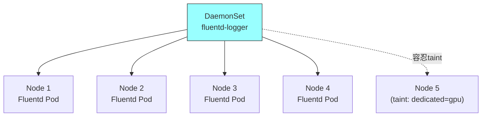

**适用场景：**

日志收集（Fluentd、Filebeat、Fluent Bit），在每个节点上收集容器日志；监控 Agent（Prometheus Node Exporter、Datadog Agent），在每个节点上采集节点指标；网络插件（Calico、Cilium），在每个节点上运行网络组件；存储插件（Ceph、GlusterFS），在每个节点上运行存储客户端。

```yaml
apiVersion: apps/v1
kind: DaemonSet
metadata:
  name: fluent-bit
  namespace: kube-system
  labels:
    k8s-app: fluent-bit-logging
spec:
  selector:
    matchLabels:
      k8s-app: fluent-bit-logging
  
  updateStrategy:                  # 更新策略
    type: RollingUpdate
    rollingUpdate:
      maxUnavailable: 1            # 滚动更新时最多不可用数
      # maxSurge: 0                # DaemonSet不支持surge（因为每节点固定一个）
  
  template:
    metadata:
      labels:
        k8s-app: fluent-bit-logging
    spec:
      # 容忍所有污点，确保在所有节点运行（包括master）
      tolerations:
      - key: node-role.kubernetes.io/control-plane
        operator: Exists
        effect: NoSchedule
      - key: node-role.kubernetes.io/master
        operator: Exists
        effect: NoSchedule
      
      # 节点亲和性 - 可选择性部署到特定节点
      affinity:
        nodeAffinity:
          requiredDuringSchedulingIgnoredDuringExecution:
            nodeSelectorTerms:
            - matchExpressions:
              - key: kubernetes.io/os
                operator: In
                values: ["linux"]
      
      containers:
      - name: fluent-bit
        image: fluent/fluent-bit:2.2.0
        resources:
          requests:
            cpu: 50m
            memory: 64Mi
          limits:
            cpu: 200m
            memory: 256Mi
        
        # 挂载宿主机路径 - 采集节点日志
        volumeMounts:
        - name: varlog              # 宿主机/var/log
          mountPath: /var/log
          readOnly: true
        - name: varlibdockercontainers  # Docker容器日志
          mountPath: /var/lib/docker/containers
          readOnly: true
        - name: config
          mountPath: /fluent-bit/etc
          readOnly: true
      
      # 使用宿主机网络和PID命名空间（监控Agent常用）
      hostNetwork: true
      hostPID: true
      dnsPolicy: ClusterFirstWithHostNet
      
      volumes:
      - name: varlog
        hostPath:
          path: /var/log
      - name: varlibdockercontainers
        hostPath:
          path: /var/lib/docker/containers
      - name: config
        configMap:
          name: fluent-bit-config
```

#### 4.2.5 Job 与 CronJob

**Job** —— 一次性任务，确保 Pod 成功完成。

Job 的核心参数：

- `completions`：需要成功完成的 Pod 总数。默认为1。
- `parallelism`：并行运行的 Pod 数量。默认为1。
- `backoffLimit`：失败重试次数上限，达到后 Job 标记为失败。默认为6。
- `activeDeadlineSeconds`：Job 最大运行时间，超时后终止所有 Pod。
- `ttlSecondsAfterFinished`：Job 完成后自动清理的延迟时间。

```mermaid
graph TB
    subgraph "Job执行模式"
        subgraph "模式1: 串行单任务 (completions=1, parallelism=1)"
            J1["Job"] --> JP1["Pod (执行1次)"]
        end
        subgraph "模式2: 并行多任务 (completions=5, parallelism=2)"
            J2["Job"] --> JP2["Pod-1"]
            J2 --> JP3["Pod-2"]
            JP2 --> JP4["Pod-3"]
            JP3 --> JP5["Pod-4"]
            JP4 --> JP6["Pod-5"]
        end
        subgraph "模式3: 工作队列 (completions未设置, parallelism=N)"
            J3["Job"] --> Q["工作队列"]
            Q --> W1["Worker-1"]
            Q --> W2["Worker-2"]
            Q --> W3["Worker-3"]
        end
    end
```

```yaml
apiVersion: batch/v1
kind: Job
metadata:
  name: data-migration-job
  namespace: production
spec:
  completions: 5               # 需要成功完成5个Pod
  parallelism: 2               # 最多同时运行2个Pod
  backoffLimit: 4              # 最多重试4次（每次间隔指数增长）
  activeDeadlineSeconds: 3600  # 最长运行1小时
  ttlSecondsAfterFinished: 100 # 完成后100秒自动清理
  
  template:
    spec:
      restartPolicy: OnFailure   # Job只支持OnFailure或Never
      containers:
      - name: migration
        image: migration-tool:v1.0
        command: ["python", "migrate.py"]
        env:
        - name: TASK_ID
          value: "migration-2024"
        - name: DB_HOST
          valueFrom:
            configMapKeyRef:
              name: db-config
              key: host
        resources:
          requests:
            cpu: "500m"
            memory: "512Mi"
          limits:
            cpu: "2000m"
            memory: "2Gi"
```

**CronJob** —— 定时任务，按 Cron 表达式周期性创建 Job。

Cron 表达式格式：`分 时 日 月 周`（如 `0 2 * * *` 表示每天凌晨2点）。

**并发策略：**

| 策略 | 说明 |
|------|------|
| Allow（默认） | 允许前一个 Job 还在运行时创建新 Job |
| Forbid | 如果前一个 Job 还在运行，跳过本次调度 |
| Replace | 终止前一个 Job，用新 Job 替换 |

```yaml
apiVersion: batch/v1
kind: CronJob
metadata:
  name: database-backup
  namespace: production
spec:
  schedule: "0 2 * * *"                   # 每天凌晨2点执行
  timeZone: "Asia/Shanghai"               # 时区（K8s 1.25+）
  startingDeadlineSeconds: 200            # 如果错过调度时间200秒内未启动则跳过
  concurrencyPolicy: Forbid               # 禁止并发：上一次还没跑完就跳过本次
  successfulJobsHistoryLimit: 3           # 保留3个成功完成的Job记录
  failedJobsHistoryLimit: 5               # 保留5个失败的Job记录
  
  jobTemplate:
    spec:
      backoffLimit: 2
      activeDeadlineSeconds: 1800         # 单次备份最多30分钟
      template:
        spec:
          restartPolicy: OnFailure
          containers:
          - name: backup
            image: backup-tool:v1.0
            command:
            - /bin/sh
            - -c
            - |
              echo "Starting database backup at $(date)"
              mysqldump -h ${DB_HOST} -u ${DB_USER} -p${DB_PASSWORD} --all-databases > /backup/db-$(date +%Y%m%d).sql
              aws s3 cp /backup/db-$(date +%Y%m%d).sql s3://my-bucket/backup/
              echo "Backup completed at $(date)"
            env:
            - name: DB_HOST
              valueFrom:
                secretKeyRef:
                  name: db-secret
                  key: host
            - name: DB_USER
              valueFrom:
                secretKeyRef:
                  name: db-secret
                  key: username
            - name: DB_PASSWORD
              valueFrom:
                secretKeyRef:
                  name: db-secret
                  key: password
            volumeMounts:
            - name: backup-data
              mountPath: /backup
            resources:
              requests:
                cpu: "500m"
                memory: "1Gi"
              limits:
                cpu: "2000m"
                memory: "4Gi"
          volumes:
          - name: backup-data
            emptyDir: {}
```

---

### 4.3 Service —— 服务发现与负载均衡

#### 4.3.1 为什么需要Service

Pod 的 IP 地址是不稳定的——每次 Pod 重建、调度到其他节点、或滚动更新时，Pod IP 都会变化。如果一个前端 Pod 直接通过后端 Pod IP 访问，后端 Pod 一旦重建，前端就失去连接。Service 就是解决这个问题的抽象层。

```mermaid
graph LR
    CLIENT["客户端 / 前端Pod"] -->|访问 Service IP:Port| SVC["Service<br/>ClusterIP: 10.96.0.100<br/>Port: 3306<br/>(稳定不变)"]
    SVC -->|负载均衡| P1["Pod-1: 10.244.1.10"]
    SVC -->|负载均衡| P2["Pod-2: 10.244.1.11"]
    SVC -->|负载均衡| P3["Pod-3: 10.244.2.10"]
    
    P1 -.->|重建后IP变化| P1N["Pod-1': 10.244.3.20"]
    SVC -->|自动更新Endpoints| P1N
    
    style SVC fill:#9ff,stroke:#333
```

Service 提供三个核心能力：稳定的虚拟 IP（VIP）和端口、自动的负载均衡（将流量分发到后端 Pod）、服务发现（通过 DNS 名称访问服务）。

#### 4.3.2 Service类型详解

**1. ClusterIP（默认类型）**——仅集群内部可访问：

ClusterIP 是 Service 的默认类型。K8s 为 Service 分配一个集群内部的虚拟 IP，通过 iptables/IPVS 规则将流量转发到后端 Pod。这个虚拟 IP 无法从集群外部直接访问。

```yaml
apiVersion: v1
kind: Service
metadata:
  name: my-app-service
  namespace: production
spec:
  type: ClusterIP               # 默认类型，可省略
  clusterIP: 10.96.0.100        # 可手动指定，通常省略让K8s自动分配
  selector:
    app: my-app
  ports:
  - name: http
    port: 80                    # Service端口
    targetPort: 8080            # Pod端口（可以是数字或名称）
    protocol: TCP
  - name: https
    port: 443
    targetPort: 8443
    protocol: TCP
  sessionAffinity: None         # None | ClientIP（会话保持）
  sessionAffinityConfig:
    clientIP:
      timeoutSeconds: 10800     # ClientIP会话保持超时时间
```

ClusterIP 的虚拟 IP 实现原理：这个 IP 实际上不存在于任何网络接口上，它是通过 iptables/IPVS 的 DNAT 规则实现的。当 Pod 发送请求到 ClusterIP 时，iptables 规则将目标地址 DNAT 为某个后端 Pod 的真实 IP。

**2. NodePort**——在每个节点开放端口：

NodePort 在 ClusterIP 的基础上，在每个 Node 上开放一个固定端口（默认范围 30000-32767），外部可以通过 `NodeIP:NodePort` 访问服务。

```yaml
apiVersion: v1
kind: Service
metadata:
  name: my-app-nodeport
  namespace: production
spec:
  type: NodePort
  selector:
    app: my-app
  ports:
  - name: http
    port: 80                    # ClusterIP端口（集群内访问）
    targetPort: 8080            # Pod端口
    nodePort: 30080             # 节点端口（外部访问），可省略让K8s自动分配
    protocol: TCP
  externalTrafficPolicy: Cluster  # Cluster | Local
  # Cluster(默认): 流量可能转发到其他节点的Pod（会SNAT，丢失客户端IP）
  # Local: 流量只转发到本节点的Pod（保留客户端IP，但负载可能不均）
```

```mermaid
graph TB
    EXT["外部客户端"] -->|访问 Node1:30080| N1["Node 1<br/>:30080"]
    EXT -->|访问 Node2:30080| N2["Node 2<br/>:30080"]
    N1 -->|kube-proxy转发| SVC["Service VIP<br/>10.96.0.100"]
    N2 -->|kube-proxy转发| SVC
    SVC --> P1["Pod-1<br/>(Node1)"]
    SVC --> P2["Pod-2<br/>(Node1)"]
    SVC --> P3["Pod-3<br/>(Node2)"]
    
    style SVC fill:#9ff,stroke:#333
```

**3. LoadBalancer**——云环境下的外部负载均衡：

LoadBalancer 在 NodePort 的基础上，自动调用云提供商的 API 创建一个外部负载均衡器（如 AWS ELB、阿里云 SLB），并将外部流量转发到 NodePort。

```yaml
apiVersion: v1
kind: Service
metadata:
  name: my-app-lb
  namespace: production
  annotations:
    # 云提供商特定注解
    service.beta.kubernetes.io/alibaba-cloud-loadbalancer-spec: slb.s2.medium
    service.beta.kubernetes.io/alibaba-cloud-loadbalancer-protocol-port: "https:443"
spec:
  type: LoadBalancer
  loadBalancerIP: 203.0.113.100  # 可指定外部LB的IP（需云平台支持）
  externalIPs:
  - 203.0.113.50                  # 额外的外部IP
  selector:
    app: my-app
  ports:
  - name: https
    port: 443
    targetPort: 8443
    protocol: TCP
  externalTrafficPolicy: Local    # 保留客户端真实IP
```

**4. ExternalName**——CNAME 映射到外部服务：

ExternalName 不创建任何代理规则，只是在 DNS 层面创建一个 CNAME 记录，将集群内的服务名映射到外部域名。

```yaml
apiVersion: v1
kind: Service
metadata:
  name: external-db
  namespace: production
spec:
  type: ExternalName
  externalName: db.example.com    # 外部数据库的DNS名称
  # 集群内访问 external-db.production.svc.cluster.local
  # DNS返回的是 db.example.com 的CNAME记录
```

#### 4.3.3 Headless Service

Headless Service（无头服务）不分配 ClusterIP（设置 `clusterIP: None`），DNS 查询直接返回后端 Pod 的 IP 列表，而非一个虚拟 IP。这常用于 StatefulSet，让客户端直接连接到特定 Pod。

```yaml
apiVersion: v1
kind: Service
metadata:
  name: mysql-headless
  namespace: production
spec:
  clusterIP: None               # 关键：不分配ClusterIP
  selector:
    app: mysql
  ports:
  - port: 3306
    targetPort: 3306
    name: mysql
```

```mermaid
graph TB
    subgraph "Headless Service DNS解析"
        CLIENT["客户端查询<br/>mysql-headless.production.svc.cluster.local"]
        DNS["CoreDNS"]
        CLIENT --> DNS
        DNS -->|返回Pod IP列表<br/>而非单个VIP| R["10.244.1.10 (mysql-0)<br/>10.244.1.11 (mysql-1)<br/>10.244.2.10 (mysql-2)"]
    end
    
    subgraph "StatefulSet Pod专属DNS"
        DNS2["CoreDNS"]
        DNS2 -->|mysql-0.mysql-headless<br/>→ 10.244.1.10| P0["mysql-0"]
        DNS2 -->|mysql-1.mysql-headless<br/>→ 10.244.1.11| P1["mysql-1"]
        DNS2 -->|mysql-2.mysql-headless<br/>→ 10.244.2.10| P2["mysql-2"]
    end
```

Headless Service 与 StatefulSet 配合使用时，每个 Pod 都有独立的 DNS 记录：`$(pod-name).$(service-name).$(namespace).svc.cluster.local`。这使得客户端可以精确连接到特定的 Pod 实例，这在主从架构（如 MySQL 主从、Redis 哨兵）中至关重要——客户端需要知道哪个是主节点、哪个是从节点。

#### 4.3.4 Service实现原理

Service 的流量转发由 **kube-proxy** 组件实现。kube-proxy 运行在每个 Node 上，监听 Service 和 Endpoint 的变化，并相应地更新节点上的转发规则。

```mermaid
graph TB
    subgraph "Service实现原理"
        APISERVER["API Server"]
        EP["Endpoints/EndpointSlice<br/>维护Pod IP列表"]
        SVC2["Service对象<br/>定义VIP和端口"]
        
        KP1["kube-proxy (Node1)<br/>监听Service/Endpoint变化"]
        KP2["kube-proxy (Node2)<br/>监听Service/Endpoint变化"]
        
        RULES1["iptables/IPVS规则 (Node1)"]
        RULES2["iptables/IPVS规则 (Node2)"]
        
        APISERVER --> EP
        APISERVER --> SVC2
        EP --> KP1
        SVC2 --> KP1
        EP --> KP2
        SVC2 --> KP2
        KP1 --> RULES1
        KP2 --> RULES2
        
        RULES1 -->|DNAT| P1["Pod-1"]
        RULES1 -->|DNAT| P2["Pod-2"]
        RULES2 -->|DNAT| P3["Pod-3"]
    end
```

**kube-proxy 的工作模式：**

**iptables 模式（默认）：**

kube-proxy 在 iptables 的 nat 表中创建规则链。当请求到达 ClusterIP 时，KUBE-SERVICES 链中的规则将流量 DNAT 到后端 Pod IP。

```mermaid
graph LR
    subgraph "iptables规则链示意"
        PACKET["请求到 ClusterIP:10.96.0.100:80"] 
        KS["KUBE-SERVICES链<br/>匹配目标IP=10.96.0.100"]
        KSV["KUBE-SVC-XXXX链<br/>Service的虚拟链"]
        
        KSV -->|30%概率| KB1["KUBE-SEP-AAA<br/>DNAT→10.244.1.10:8080"]
        KSV -->|30%概率| KB2["KUBE-SEP-BBB<br/>DNAT→10.244.1.11:8080"]
        KSV -->|40%概率| KB3["KUBE-SEP-CCC<br/>DNAT→10.244.2.10:8080"]
    end
    PACKET --> KS --> KSV
```

iptables 模式的规则链层级：
1. `PREROUTING` → `KUBE-SERVICES`（所有入站流量入口）
2. `KUBE-SERVICES` → `KUBE-SVC-XXX`（匹配到具体Service）
3. `KUBE-SVC-XXX` → `KUBE-SEP-XXX`（按概率分发到各Endpoint）
4. `KUBE-SEP-XXX` 执行 DNAT（将目标IP改为Pod IP）

iptables 模式的缺点是规则匹配是 O(n) 线性复杂度——当 Service 和 Endpoint 数量增多时，性能下降明显。

**IPVS 模式：**

IPVS（IP Virtual Server）基于 Linux 内核的哈希表实现负载均衡，查找复杂度为 O(1)，在大规模集群中性能远优于 iptables。IPVS 还支持更多负载均衡算法（轮询、最小连接、源地址哈希等）。

```yaml
# kube-proxy 配置为 IPVS 模式
apiVersion: kubeproxy.config.k8s.io/v1alpha1
kind: KubeProxyConfiguration
mode: ipvs
ipvs:
  scheduler: lc                  # 负载均衡算法: rr|lc|dh|sh|sed|nq
  strictARP: true
  excludeCIDRs: []
  minSyncPeriod: 0s
  syncPeriod: 30s
  tcpTimeout: 0s
  tcpFinTimeout: 0s
  udpTimeout: 0s
```

| 特性 | iptables 模式 | IPVS 模式 |
|------|-------------|-----------|
| 查找复杂度 | O(n) 线性 | O(1) 哈希 |
| 负载均衡算法 | 随机 | rr/lc/dh/sh/sed/nq |
| 规则数量 | 大量规则链 | 内核数据结构 |
| 大规模性能 | 下降明显 | 稳定 |
| 协议支持 | TCP/UDP/SCTP | TCP/UDP/SCTP |
| 适用场景 | 小规模集群 | 大规模集群（>1000 Service） |

**Endpoints 和 EndpointSlice：**

Endpoints 和 EndpointSlice 记录了 Service 后端的实际 Pod IP 和端口。

```mermaid
graph TB
    SVC["Service<br/>my-app-service<br/>selector: app=my-app"]
    
    SVC --> EP1["Pod-1<br/>10.244.1.10:8080<br/>Ready"]
    SVC --> EP2["Pod-2<br/>10.244.1.11:8080<br/>Ready"]
    SVC -.->|不Ready| EP3["Pod-3<br/>10.244.2.10:8080<br/>NotReady"]
    SVC -.->|不匹配selector| EP4["Pod-4<br/>10.244.3.20:8080"]
    
    subgraph "Endpoints对象"
        EP_OBJ["addresses: [10.244.1.10, 10.244.1.11]<br/>ports: [{name:http, port:8080}]"]
    end
    
    subgraph "EndpointSlice对象 (K8s 1.16+)"
        EPS_OBJ["slice1: [10.244.1.10, 10.244.1.11]<br/>slice2: [10.244.2.10]<br/>(每个slice最多100个endpoint)"]
    end
```

EndpointSlice 是 Endpoints 的进化版，将 Endpoints 切分成多个小片段（默认每片最多100个endpoint），大幅减少了 API Server 的 watch 压力。在大规模集群中，EndpointSlice 是必选项。

**完整的 Service 流量转发流程：**

```mermaid
sequenceDiagram
    participant Client as 客户端Pod
    participant DNS as CoreDNS
    participant IPT as iptables/IPVS
    participant Pod as 后端Pod

    Client->>DNS: 解析 my-app.production.svc.cluster.local
    DNS-->>Client: 返回 ClusterIP 10.96.0.100
    Client->>IPT: 发送请求到 10.96.0.100:80
    Note over IPT: KUBE-SERVICES链匹配
    Note over IPT: KUBE-SVC-XXX链负载均衡
    Note over IPT: KUBE-SEP-XXX DNAT
    IPT->>Pod: DNAT后请求到达 10.244.1.10:8080
    Pod-->>IPT: 响应数据
    IPT-->>Client: 响应数据（SNAT还原源IP）
```

#### 4.3.5 Ingress

Ingress 是 Kubernetes 的七层（L7）路由资源，提供基于 HTTP/HTTPS 的域名和路径路由能力。与 Service（L4）不同，Ingress 可以根据 HTTP 请求的 Host 和 Path 将流量路由到不同的 Service。

```mermaid
graph TB
    EXT["外部客户端"] -->|HTTP/HTTPS| IC["Ingress Controller<br/>(Nginx/Traefik/HAProxy)"]
    
    IC -->|api.example.com/api| SVC1["Service: api-service<br/>(api Pods)"]
    IC -->|api.example.com/docs| SVC2["Service: docs-service<br/>(docs Pods)"]
    IC -->|app.example.com/| SVC3["Service: web-service<br/>(web Pods)"]
    IC -->|admin.example.com/| SVC4["Service: admin-service<br/>(admin Pods)"]
    
    SVC1 --> AP1["API Pod-1"]
    SVC1 --> AP2["API Pod-2"]
    SVC2 --> DP1["Docs Pod-1"]
    SVC3 --> WP1["Web Pod-1"]
    SVC3 --> WP2["Web Pod-2"]
    SVC4 --> ADP1["Admin Pod-1"]
    
    style IC fill:#9ff,stroke:#333
```

**Ingress Controller 的角色：**

Ingress 资源本身只是路由规则的定义，真正执行路由的是 Ingress Controller。它是一个运行在集群中的 Pod，监听 Ingress 资源变化，并生成对应的反向代理配置（如 Nginx 配置文件），然后 reload 以生效。

常见的 Ingress Controller 包括：
- **Nginx Ingress Controller**：最流行，基于 Nginx 或 OpenResty
- **Traefik**：云原生设计，自动配置，支持 Let's Encrypt
- **HAProxy Ingress**：高性能，适合大规模
- **Kong Ingress**：API 网关能力，支持插件

```yaml
# 完整的 Ingress YAML 示例 - 含TLS和多种路由规则
apiVersion: networking.k8s.io/v1
kind: Ingress
metadata:
  name: my-app-ingress
  namespace: production
  annotations:
    # Nginx Ingress Controller 特定注解
    nginx.ingress.kubernetes.io/ssl-redirect: "true"
    nginx.ingress.kubernetes.io/proxy-body-size: "100m"
    nginx.ingress.kubernetes.io/proxy-connect-timeout: "10"
    nginx.ingress.kubernetes.io/proxy-send-timeout: "300"
    nginx.ingress.kubernetes.io/proxy-read-timeout: "300"
    nginx.ingress.kubernetes.io/rewrite-target: /
    nginx.ingress.kubernetes.io/cors-allow-origin: "https://app.example.com"
    nginx.ingress.kubernetes.io/rate-limit-connections: "10"
    nginx.ingress.kubernetes.io/rate-limit-rps: "100"
    cert-manager.io/cluster-issuer: "letsencrypt-prod"
spec:
  ingressClassName: nginx          # 指定Ingress Controller
  
  # TLS/SSL 终端配置
  tls:
  - hosts:
    - api.example.com
    - app.example.com
    - admin.example.com
    secretName: example-tls-secret  # 包含TLS证书的Secret
  
  # 路由规则
  rules:
  - host: api.example.com
    http:
      paths:
      - path: /v1
        pathType: Prefix            # Prefix | Exact | ImplementationSpecific
        backend:
          service:
            name: api-v1-service
            port:
              number: 80
      - path: /v2
        pathType: Prefix
        backend:
          service:
            name: api-v2-service
            port:
              number: 80
      - path: /health
        pathType: Exact
        backend:
          service:
            name: api-v1-service
            port:
              number: 80
  
  - host: app.example.com
    http:
      paths:
      - path: /
        pathType: Prefix
        backend:
          service:
            name: web-frontend-service
            port:
              number: 80
  
  - host: admin.example.com
    http:
      paths:
      - path: /
        pathType: Prefix
        backend:
          service:
            name: admin-service
            port:
              number: 80
  
  # 默认后端 - 没有匹配到任何规则的请求
  defaultBackend:
    service:
      name: default-http-backend
      port:
        number: 80
```

> **生产实践**：美团内部使用自研的 Ingress Controller（基于 Nginx），配合 cert-manager 自动管理 TLS 证书。对于高流量入口，建议配置 HPA 对 Ingress Controller Pod 进行自动扩缩容，并使用 `externalTrafficPolicy: Local` 保留客户端真实 IP 用于访问日志和限流。

---

### 4.4 配置管理

#### 4.4.1 ConfigMap

ConfigMap 用于存储非敏感的配置数据，以键值对形式保存。它将配置与应用镜像解耦，使同一镜像可以在不同环境（开发、测试、生产）中使用不同配置。

**创建 ConfigMap 的三种方式：**

```bash
# 方式1：命令行直接创建
kubectl create configmap app-config \
  --from-literal=APP_ENV=production \
  --from-literal=LOG_LEVEL=info \
  --from-literal=MAX_CONNECTIONS=100

# 方式2：从文件创建
kubectl create configmap app-config \
  --from-file=app.properties \
  --from-file=logging.conf

# 方式3：从目录创建（目录下所有文件都会被包含）
kubectl create configmap app-config \
  --from-file=configs/
```

**YAML 定义方式：**

```yaml
apiVersion: v1
kind: ConfigMap
metadata:
  name: app-config
  namespace: production
  labels:
    app: my-app
data:
  # 简单键值对
  APP_ENV: "production"
  LOG_LEVEL: "info"
  MAX_CONNECTIONS: "100"
  DB_HOST: "mysql.production.svc.cluster.local"
  DB_PORT: "3306"
  
  # 多行配置文件内容
  application.yml: |
    server:
      port: 8080
      tomcat:
        max-threads: 200
        accept-count: 100
    
    spring:
      datasource:
        url: jdbc:mysql://mysql:3306/mydb
        username: appuser
        driver-class-name: com.mysql.cj.jdbc.Driver
    
    logging:
      level:
        root: INFO
        com.example: DEBUG
  
  nginx.conf: |
    server {
      listen 80;
      server_name localhost;
      
      location / {
        proxy_pass http://backend:8080;
        proxy_set_header Host $host;
        proxy_set_header X-Real-IP $remote_addr;
      }
      
      location /health {
        access_log off;
        return 200 "healthy\n";
      }
    }
```

**在 Pod 中使用 ConfigMap 的三种方式：**

```yaml
apiVersion: v1
kind: Pod
metadata:
  name: configmap-usage-demo
  namespace: production
spec:
  containers:
  - name: my-app
    image: my-app:v1.0
    
    # 方式1：作为环境变量注入
    env:
    - name: APP_ENV              # 容器内的环境变量名
      valueFrom:
        configMapKeyRef:
          name: app-config       # ConfigMap名称
          key: APP_ENV           # ConfigMap中的key
    - name: LOG_LEVEL
      valueFrom:
        configMapKeyRef:
          name: app-config
          key: LOG_LEVEL
    
    # 方式1b：批量注入所有键值对为环境变量
    envFrom:
    - configMapRef:
        name: app-config
        prefix: CONFIG_          # 可选前缀，环境变量名变为 CONFIG_APP_ENV 等
    
    # 方式2：作为命令行参数（引用环境变量）
    command: ["/bin/sh", "-c"]
    args:
    - |
      echo "APP_ENV=${APP_ENV}"
      /app/start.sh --config=/etc/config/application.yml
    
    # 方式3：挂载为Volume文件
    volumeMounts:
    - name: config-volume
      mountPath: /etc/config      # 整个ConfigMap挂载为目录
      readOnly: true
    - name: nginx-config
      mountPath: /etc/nginx/conf.d/default.conf  # 挂载单个文件
      subPath: nginx.conf         # subPath指定只挂载ConfigMap中的某个key
      readOnly: true
  
  volumes:
  - name: config-volume
    configMap:
      name: app-config
      defaultMode: 0644           # 文件权限
      # 可选：只挂载部分key
      # items:
      # - key: application.yml
      #   path: application.yml
      #   mode: 0644
  
  - name: nginx-config
    configMap:
      name: app-config
      items:
      - key: nginx.conf
        path: nginx.conf
```

**ConfigMap 热更新机制：**

当以 Volume 方式挂载 ConfigMap 时，Kubelet 会定期（默认约1分钟）检测 ConfigMap 是否更新，并将更新同步到 Pod 内的文件。这意味着修改 ConfigMap 后，Pod 内的配置文件会自动更新。

但有以下注意事项：
- 以环境变量方式注入的 ConfigMap 不会自动更新（环境变量在容器创建时确定）。
- Volume 挂载的热更新有约1分钟的延迟。
- 应用程序需要自己检测配置文件变化并 reload（如 Nginx 的 `nginx -s reload`，Spring Boot 的 `@RefreshScope`）。
- 使用 `subPath` 挂载的文件不会热更新（这是 Kubernetes 的已知限制）。

```mermaid
graph TB
    CM["ConfigMap (更新)"] -->|kubelet watch| KP["kubelet检测到变化"]
    KP -->|同步文件| VOL["Volume挂载路径<br/>/etc/config/application.yml"]
    VOL -->|文件更新| APP["应用程序检测变化<br/>(需要应用自身支持热加载)"]
    APP -->|reload配置| RELOAD["使用新配置运行"]
    
    ENV["环境变量方式"] -.->|不更新| X["❌ 环境变量在容器创建时确定<br/>修改ConfigMap后不会更新"]
    
    style CM fill:#9ff,stroke:#333
    style X fill:#f99,stroke:#333
```

#### 4.4.2 Secret

Secret 用于存储敏感信息，如密码、Token、SSH 密钥、TLS 证书等。与 ConfigMap 的使用方式几乎相同，但数据以 Base64 编码存储。

**Secret 类型：**

| 类型 | 说明 | 用途 |
|------|------|------|
| Opaque | 通用类型，任意键值对 | 密码、Token 等自定义敏感数据 |
| kubernetes.io/dockerconfigjson | Docker 镜像仓库认证 | 拉取私有镜像仓库的镜像 |
| kubernetes.io/tls | TLS 证书和私钥 | Ingress TLS、其他需要证书的场景 |
| kubernetes.io/service-account-token | ServiceAccount Token | Pod 访问 API Server 的认证 |
| kubernetes.io/basic-auth | 基本认证 | 用户名密码 |
| kubernetes.io/ssh-auth | SSH 认证 | SSH 密钥 |

**重要安全说明：Base64 ≠ 加密！** Secret 中的数据只是 Base64 编码，任何人都可以解码。Secret 的安全性依赖于：

1. **RBAC**：通过 Role-Based Access Control 限制谁可以读取 Secret。
2. **etcd 加密**：在 API Server 配置 etcd 静态加密，使 Secret 在 etcd 中以密文存储。
3. **最小权限**：Pod 只挂载它需要的 Secret。
4. **外部密钥管理**：使用 HashiCorp Vault、AWS KMS、阿里云 KMS 等外部密钥管理系统，通过 CSI Driver 或外部 Secret Controller 注入密钥。

```yaml
# 1. Opaque Secret - 通用敏感数据
apiVersion: v1
kind: Secret
metadata:
  name: db-secret
  namespace: production
type: Opaque
data:
  # Base64编码的值
  username: YXBwdXNlcg==           # echo -n 'appuser' | base64
  password: UEBzc3cwcmQxMjM=      # echo -n 'P@ssw0rd123' | base64
stringData:                        # stringData字段可直接写明文（创建时自动编码）
  database-url: "mysql://mysql:3306/mydb"
---
# 2. Docker Registry Secret - 镜像仓库认证
apiVersion: v1
kind: Secret
metadata:
  name: registry-secret
  namespace: production
type: kubernetes.io/dockerconfigjson
data:
  .dockerconfigjson: eyJhdXRocyI6eyJyZWdpc3RyeS5leGFtcGxlLmNvbSI6eyJ1c2VybmFtZSI6ImFkbWluIiwicGFzc3dvcmQiOiJwYXNzd29yZCIsImF1dGgiOiJZV1J0YVc0NlNHRnlZbTl5TVRJek5BPT0ifX19
# 也可以用stringData方式
# stringData:
#   .dockerconfigjson: '{"auths":{"registry.example.com":{"username":"admin","password":"password","auth":"YWRtaW46cGFzc3dvcmQ="}}}'
---
# 3. TLS Secret - 证书和私钥
apiVersion: v1
kind: Secret
metadata:
  name: tls-secret
  namespace: production
type: kubernetes.io/tls
data:
  tls.crt: LS0tLS1CRUdJTiBDRVJUSUZJQ0FURS0tLS0t...   # Base64编码的证书
  tls.key: LS0tLS1CRUdJTiBQUklWQVRFIEtFWS0tLS0t...   # Base64编码的私钥
```

**在 Pod 中使用 Secret：**

```yaml
apiVersion: v1
kind: Pod
metadata:
  name: secret-usage-demo
  namespace: production
spec:
  # 使用镜像仓库认证Secret
  imagePullSecrets:
  - name: registry-secret
  
  containers:
  - name: my-app
    image: registry.example.com/my-app:v1.0
    
    # 方式1：作为环境变量
    env:
    - name: DB_USERNAME
      valueFrom:
        secretKeyRef:
          name: db-secret
          key: username
    - name: DB_PASSWORD
      valueFrom:
        secretKeyRef:
          name: db-secret
          key: password
    
    # 方式2：批量注入
    envFrom:
    - secretRef:
        name: db-secret
    
    # 方式3：挂载为Volume
    volumeMounts:
    - name: secret-volume
      mountPath: /etc/secrets
      readOnly: true
  
  volumes:
  - name: secret-volume
    secret:
      secretName: db-secret
      defaultMode: 0400           # Secret文件权限应该更严格
```

**安全最佳实践：**

```mermaid
graph TB
    subgraph "Secret安全防护层次"
        L1["第1层: RBAC<br/>限制谁能get/list/watch Secret"]
        L2["第2层: etcd静态加密<br/>Secret在etcd中加密存储"]
        L3["第3层: 最小挂载<br/>Pod只挂载必要的Secret"]
        L4["第4层: 外部密钥管理<br/>Vault/KMS + CSI Driver"]
        L5["第5层: 审计日志<br/>记录Secret访问行为"]
    end
    L1 --> L2 --> L3 --> L4 --> L5
```

```yaml
# etcd静态加密配置示例 (EncryptionConfiguration)
apiVersion: apiserver.config.k8s.io/v1
kind: EncryptionConfiguration
resources:
- resources:
  - secrets
  providers:
  - aescbc:
      keys:
      - name: key1
        secret: <base64-encoded-32-byte-key>  # 32字节随机密钥的Base64编码
  - identity: {}    # 兜底：允许读取未加密的旧Secret
```

#### 4.4.3 Downward API

Downward API 允许容器获取自身 Pod 和容器的元数据信息，而无需调用 Kubernetes API。这在应用需要感知自身运行环境时非常有用。

```yaml
apiVersion: v1
kind: Pod
metadata:
  name: downward-api-demo
  namespace: production
  labels:
    app: my-app
    version: v1.0
  annotations:
    build-id: "20240101-1234"
    configured-by: "config-team"
spec:
  containers:
  - name: my-app
    image: my-app:v1.0
    
    # 方式1：环境变量方式获取元数据
    env:
    - name: POD_NAME
      valueFrom:
        fieldRef:
          fieldPath: metadata.name           # Pod名称
    - name: POD_NAMESPACE
      valueFrom:
        fieldRef:
          fieldPath: metadata.namespace      # 命名空间
    - name: POD_IP
      valueFrom:
        fieldRef:
          fieldPath: status.podIP            # Pod IP
    - name: NODE_NAME
      valueFrom:
        fieldRef:
          fieldPath: spec.nodeName           # 所在节点名称
    
    # 获取标签和注解
    - name: POD_LABELS
      valueFrom:
        fieldRef:
          fieldPath: metadata.labels['app']  # 获取特定标签
    - name: POD_ANNOTATIONS
      valueFrom:
        fieldRef:
          fieldPath: metadata.annotations['build-id']  # 获取特定注解
    
    # 获取容器级资源信息
    - name: CPU_REQUEST
      valueFrom:
        resourceFieldRef:
          containerName: my-app             # 必须指定容器名
          resource: requests.cpu
    - name: CPU_LIMIT
      valueFrom:
        resourceFieldRef:
          containerName: my-app
          resource: limits.cpu
    - name: MEM_REQUEST
      valueFrom:
        resourceFieldRef:
          containerName: my-app
          resource: requests.memory
    - name: MEM_LIMIT
      valueFrom:
        resourceFieldRef:
          containerName: my-app
          resource: limits.memory
    
    # 方式2：Volume方式获取元数据
    volumeMounts:
    - name: podinfo
      mountPath: /etc/podinfo
      readOnly: true
    
    resources:
      requests:
        cpu: "500m"
        memory: "512Mi"
      limits:
        cpu: "1000m"
        memory: "1Gi"
  
  volumes:
  - name: podinfo
    downwardAPI:
      items:
      - path: "labels"                      # 文件路径: /etc/podinfo/labels
        fieldRef:
          fieldPath: metadata.labels        # 所有标签
      - path: "annotations"                 # 文件路径: /etc/podinfo/annotations
        fieldRef:
          fieldPath: metadata.annotations   # 所有注解
      - path: "name"
        fieldRef:
          fieldPath: metadata.name
      - path: "namespace"
        fieldRef:
          fieldPath: metadata.namespace
      - path: "cpu_limit"
        resourceFieldRef:
          containerName: my-app
          resource: limits.cpu
      - path: "mem_limit"
        resourceFieldRef:
          containerName: my-app
          resource: limits.memory
```

Downward API 的典型使用场景包括：应用根据自身资源限制调整运行参数（如 Java JVM 根据 CPU limit 设置线程池大小）、Sidecar 读取 Pod 标签进行差异化配置、日志收集器获取 Pod 名称作为日志标签等。

---

### 4.5 Namespace —— 资源隔离

#### 4.5.1 Namespace概念

Namespace 是 Kubernetes 中用于逻辑隔离资源的机制。它将一个物理集群划分为多个虚拟集群，不同 Namespace 中的资源名称可以重复，但同一 Namespace 内资源名称必须唯一。

```mermaid
graph TB
    subgraph "Kubernetes集群"
        subgraph "kube-system"
            KS1["CoreDNS"]
            KS2["kube-proxy"]
            KS3["CNI插件"]
        end
        subgraph "default"
            D1["用户应用A"]
            D2["用户应用B"]
        end
        subgraph "production"
            P1["线上服务A"]
            P2["线上服务B"]
        end
        subgraph "staging"
            S1["预发服务A"]
        end
        subgraph "kube-public"
            KP1["公共配置"]
        end
        subgraph "kube-node-lease"
            KNL1["节点心跳信息"]
        end
    end
```

**K8s 默认 Namespace：**

| Namespace | 说明 |
|-----------|------|
| default | 未指定 Namespace 时使用的默认命名空间 |
| kube-system | K8s 系统组件运行的命名空间（CoreDNS、kube-proxy、CNI 等） |
| kube-public | 公共资源命名空间，所有用户（包括未认证用户）都可以读取 |
| kube-node-lease | 节点心跳租约信息，kubelet 定期发送心跳 |

Namespace 提供的是**逻辑隔离而非物理隔离**——不同 Namespace 的 Pod 仍然可以通过 Service IP 互相访问（除非配置了 NetworkPolicy）。真正的网络隔离需要 NetworkPolicy 来实现。

**Namespace 级别的 RBAC：**

```yaml
# Role - 命名空间级别的角色
apiVersion: rbac.authorization.k8s.io/v1
kind: Role
metadata:
  name: pod-reader
  namespace: production           # 仅在production命名空间生效
rules:
- apiGroups: [""]
  resources: ["pods", "pods/log"]
  verbs: ["get", "list", "watch"]
- apiGroups: [""]
  resources: ["configmaps"]
  verbs: ["get", "list", "watch", "create", "update", "patch"]
---
# RoleBinding - 将Role绑定到用户/ServiceAccount
apiVersion: rbac.authorization.k8s.io/v1
kind: RoleBinding
metadata:
  name: pod-reader-binding
  namespace: production
subjects:
- kind: ServiceAccount
  name: my-app-sa
  namespace: production
- kind: User
  name: developer-zhang
  apiGroup: rbac.authorization.k8s.io
roleRef:
  kind: Role
  name: pod-reader
  apiGroup: rbac.authorization.k8s.io
```

#### 4.5.2 ResourceQuota

ResourceQuota 限制一个 Namespace 可以使用的资源总量，防止某个团队或项目消耗过多集群资源，影响其他团队。

```yaml
apiVersion: v1
kind: ResourceQuota
metadata:
  name: production-quota
  namespace: production
spec:
  hard:
    # 计算资源配额
    requests.cpu: "20"                # 所有Pod的CPU请求总和上限: 20核
    requests.memory: "40Gi"           # 所有Pod的内存请求总和上限: 40Gi
    limits.cpu: "40"                  # 所有Pod的CPU限制总和上限: 40核
    limits.memory: "80Gi"             # 所有Pod的内存限制总和上限: 80Gi
    
    # 存储资源配额
    requests.storage: "500Gi"         # PVC请求总量上限: 500Gi
    persistentvolumeclaims: "20"      # PVC数量上限: 20个
    ssd.storageclass.storage.k8s.io/requests.storage: "300Gi"  # 特定StorageClass
    
    # 对象数量配额
    pods: "50"                        # Pod数量上限
    services: "20"                    # Service数量上限
    services.loadbalancers: "2"       # LoadBalancer类型Service上限
    services.nodeports: "5"           # NodePort类型Service上限
    replicationcontrollers: "10"      # RC数量上限
    resourcequotas: "1"               # ResourceQuota数量上限
    configmaps: "50"                  # ConfigMap数量上限
    secrets: "30"                     # Secret数量上限
    
    # 工作负载控制器数量
    count/deployments.apps: "15"      # Deployment数量上限
    count/statefulsets.apps: "5"      # StatefulSet数量上限
    count/jobs.batch: "20"            # Job数量上限
    count/cronjobs.batch: "10"        # CronJob数量上限
```

```mermaid
graph TB
    RQ["ResourceQuota<br/>production namespace"]
    RQ -->|限制CPU requests| CPU_R["所有Pod CPU请求总和 ≤ 20核"]
    RQ -->|限制CPU limits| CPU_L["所有Pod CPU限制总和 ≤ 40核"]
    RQ -->|限制Memory| MEM["所有Pod内存请求 ≤ 40Gi<br/>限制 ≤ 80Gi"]
    RQ -->|限制存储| STO["PVC总量 ≤ 500Gi<br/>PVC数量 ≤ 20"]
    RQ -->|限制对象数| OBJ["Pod ≤ 50<br/>Service ≤ 20<br/>Secret ≤ 30"]
    
    subgraph "超限行为"
        NEW_POD["创建新Pod"] -->|requests总和超过quota| REJECT["API Server拒绝创建<br/>错误: Forbidden"]
    end
```

> **注意**：ResourceQuota 对 CPU 和内存的 requests 限制是硬性的——如果 Namespace 中所有 Pod 的 requests 总和已达到配额，新的 Pod 将无法创建（API Server 返回 Forbidden 错误）。这是防止资源超卖的重要机制。

#### 4.5.3 LimitRange

ResourceQuota 限制 Namespace 的资源总量，但不限制单个 Pod 的资源使用。LimitRange 补充了这个能力，为 Namespace 中的 Pod 和 Container 设置默认值和上下限。

```yaml
apiVersion: v1
kind: LimitRange
metadata:
  name: production-limits
  namespace: production
spec:
  limits:
  # Container 级别限制
  - type: Container
    default:                        # 默认limits（未设置limits时使用）
      cpu: "1000m"
      memory: "1Gi"
    defaultRequest:                 # 默认requests（未设置requests时使用）
      cpu: "200m"
      memory: "256Mi"
    min:                           # 最小值（设置的requests不能低于此值）
      cpu: "50m"
      memory: "64Mi"
    max:                           # 最大值（设置的limits不能高于此值）
      cpu: "4000m"
      memory: "8Gi"
    maxLimitRequestRatio:          # limits/requests 的最大比值（防止过度超卖）
      cpu: "4"                     # CPU limits最多是requests的4倍
      memory: "2"                  # 内存limits最多是requests的2倍
  
  # Pod 级别限制
  - type: Pod
    max:
      cpu: "8000m"
      memory: "16Gi"
    min:
      cpu: "100m"
      memory: "128Mi"
  
  # PVC 限制
  - type: PersistentVolumeClaim
    max:
      storage: "100Gi"            # 单个PVC最大100Gi
    min:
      storage: "1Gi"              # 单个PVC最小1Gi
  
  # 基于存储类的限制
  - type: PersistentVolumeClaim
    max:
      storage: "200Gi"
    min:
      storage: "10Gi"
    matchLabels:
      storageclass: "fast-ssd"    # 仅针对使用fast-ssd存储类的PVC
```

```mermaid
graph TB
    subgraph "LimitRange 作用机制"
        CREATE["用户创建Pod<br/>(未设置resources)"]
        CHECK["API Server验证"]
        
        CREATE --> CHECK
        
        CHECK -->|未设置resources| DEFAULT["自动注入默认值<br/>requests: 200m/256Mi<br/>limits: 1000m/1Gi"]
        CHECK -->|requests低于min| REJECT_MIN["拒绝创建<br/>错误: 资源请求低于最小值"]
        CHECK -->|limits高于max| REJECT_MAX["拒绝创建<br/>错误: 资源限制高于最大值"]
        CHECK -->|limits/requests > ratio| REJECT_RATIO["拒绝创建<br/>错误: 超卖比例超限"]
        CHECK -->|验证通过| ALLOW["允许创建"]
    end
    
    style DEFAULT fill:#9f9,stroke:#333
    style REJECT_MIN fill:#f99,stroke:#333
    style REJECT_MAX fill:#f99,stroke:#333
    style REJECT_RATIO fill:#f99,stroke:#333
```

> **企业最佳实践**：在生产 Namespace 中同时配置 ResourceQuota 和 LimitRange。ResourceQuota 防止团队整体超用，LimitRange 防止个别 Pod 异常占用资源（如一个 Pod 申请了整个节点资源）。`maxLimitRequestRatio` 的设置尤为关键——CPU 设为 4 倍、内存设为 2 倍是企业实践中验证过的合理值，既允许合理的资源突发，又防止恶意或错误配置导致的严重超卖。

---

本章详细介绍了 Kubernetes 的核心资源对象：从最小调度单元 Pod（含多容器设计模式、健康检查、QoS），到工作负载控制器（Deployment、StatefulSet、DaemonSet、Job/CronJob），再到服务发现（Service、Ingress）、配置管理（ConfigMap、Secret、Downward API）和资源隔离（Namespace、ResourceQuota、LimitRange）。这些对象构成了 Kubernetes 声明式 API 的基础，理解它们的原理和最佳实践是深入掌握 Kubernetes 的关键。
