# Kubernetes 从入门到精通 —— 第三部分：调度、网络与存储

---

## 第五章：调度机制深度解析

### 5.1 调度器架构

#### 5.1.1 kube-scheduler 概述

kube-scheduler 是 Kubernetes 控制平面的核心组件之一，负责将未调度的 Pod 绑定到合适的 Node 上运行。在整个集群中，kube-scheduler 就像一位"调度员"——它需要综合考虑资源需求、亲和性约束、污点容忍、拓扑分布等多种因素，从众多候选节点中选出最优的那个。

kube-scheduler 的设计遵循一个基本原则：**先过滤，再打分**。就像招聘流程一样——先筛选出满足硬性条件的候选人（预选/Filtering），再对这些人进行综合评估打分（优选/Scoring），最终选出得分最高者。

#### 5.1.2 调度框架（Scheduling Framework）

从 Kubernetes 1.19 开始，调度框架（Scheduling Framework）成为调度器的核心架构。它将调度过程拆分为一系列扩展点（Extension Point），允许通过插件（Plugin）方式自定义每个阶段的行为，而无需修改 kube-scheduler 的源码。

调度框架定义了以下扩展点：

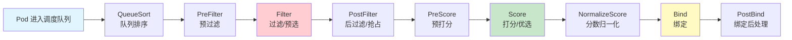

各扩展点的职责：

| 扩展点 | 阶段 | 作用 | 示例插件 |
|--------|------|------|----------|
| `QueueSort` | 调度前 | 决定 Pod 在待调度队列中的优先级顺序 | PrioritySort |
| `PreFilter` | 预选前 | 预处理 Pod 信息，为 Filter 阶段准备数据 | PodTopologySpread、NodePorts |
| `Filter` | 预选 | 排除不满足条件的节点（硬约束） | NodeName、NodeUnschedulable、TaintToleration、NodeAffinity |
| `PostFilter` | 预选后 | 当没有节点通过 Filter 时触发抢占逻辑 | DefaultPreemption |
| `PreScore` | 优选前 | 为 Score 阶段做数据预处理 | PodTopologySpread |
| `Score` | 优选 | 为通过 Filter 的节点打分（软约束） | NodeResourcesFit、ImageLocality、PodTopologySpread |
| `NormalizeScore` | 优选后 | 将不同插件的分数归一化到 [0, 100] 区间 | 各 Score 插件 |
| `Reserve` | 绑定前 | 预留资源（防止并发调度导致超卖） | VolumeBinding |
| `Permit` | 绑定前 | 批准/拒绝/延迟绑定决策 | Gate |
| `Bind` | 绑定 | 将 Pod 绑定到 Node | DefaultBinder |
| `PostBind` | 绑定后 | 绑定成功后的收尾工作 | — |

#### 5.1.3 调度队列

kube-scheduler 内部维护了三个队列来管理待调度的 Pod：

- **Active Queue**：活跃队列，存放正在等待调度的 Pod。调度器每次从这个队列中取出一个 Pod 进行调度。队列按优先级排序（PriorityClass 决定），高优先级的 Pod 先被调度。
- **Backoff Queue**：退避队列，存放调度失败后需要等待重试的 Pod。采用指数退避策略（默认最短 1s，最长 10s），避免频繁重试浪费调度资源。
- **Unschedulable Queue**：不可调度队列，存放因无法找到合适节点而暂时无法调度的 Pod。当集群状态发生变化（如新节点加入、Pod 删除释放资源、节点污点变化等），调度器会将这些 Pod 重新移回 Active Queue。

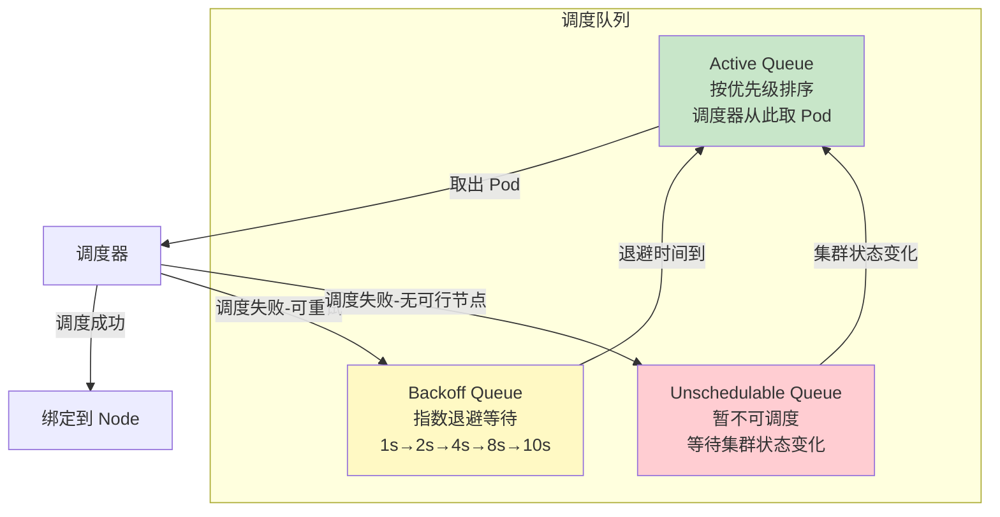

队列的关键源码逻辑位于 `pkg/scheduler/internal/queue/scheduling_queue.go`。调度器使用 `PriorityQueue` 结构体实现三队列逻辑，其核心方法 `Pop()` 从 Active Queue 取 Pod，`Add()` 将新 Pod 放入 Active Queue，`AddUnschedulableIfNecessary()` 将失败的 Pod 放入 Unschedulable Queue。

---

### 5.2 调度流程详解

#### 5.2.1 完整调度流程

当一个 Pod 被创建时，它首先进入 kube-scheduler 的调度队列，然后经历以下完整流程：

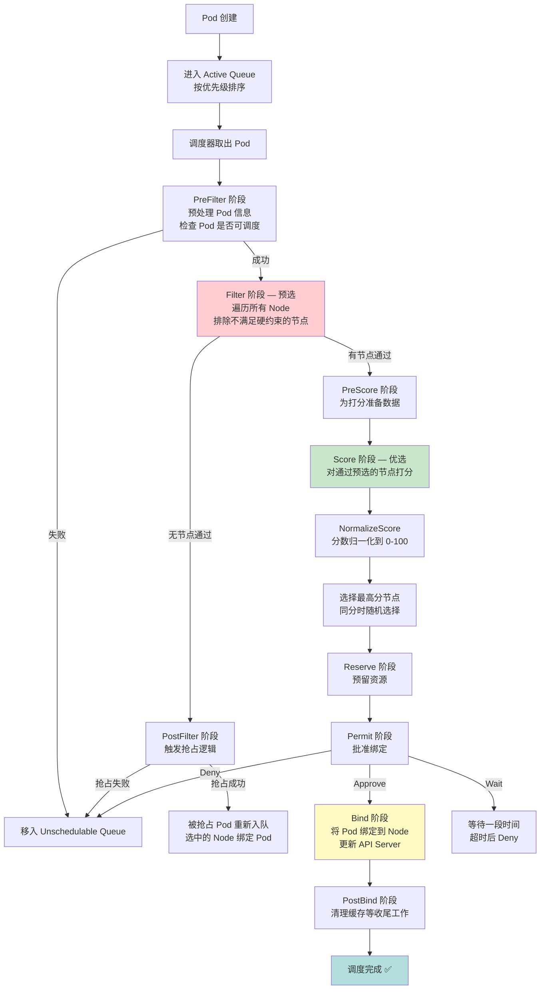

#### 5.2.2 预选（Filtering）阶段详解

预选阶段的核心目标是**排除不满足 Pod 运行条件的节点**，这是一个硬约束的过滤过程。调度器会对每一个节点依次执行所有注册的 Filter 插件，任何一个插件返回"不可调度"，该节点就会被排除。

关键的 Filter 插件及其筛选逻辑：

| 插件名称 | 过滤条件 | 说明 |
|----------|----------|------|
| `NodeName` | Pod 指定了 `nodeName` | 仅保留指定节点 |
| `NodeUnschedulable` | Node 的 `spec.unschedulable=true` | 排除被标记为不可调度的节点（cordon 效果） |
| `NodeAffinity` | Pod 的 `requiredDuringSchedulingIgnoredDuringExecution` | 排除不满足节点亲和性硬约束的节点 |
| `TaintToleration` | Node 的 Taint 与 Pod 的 Toleration | 排除 Pod 无法容忍的污点节点 |
| `PodFitsResources` | CPU/内存等资源请求 | 排除剩余资源不足的节点 |
| `NodePorts` | Pod 的 hostPort | 排除端口冲突的节点 |
| `VolumeBinding` | PVC 的 `WaitForFirstConsumer` | 检查 PV 是否可绑定到该节点 |
| `PodTopologySpread` | `whenUnsatisfiable=DoNotSchedule` | 拓扑分布硬约束 |
| `InterPodAffinity` | `requiredDuringSchedulingIgnoredDuringExecution` | Pod 间亲和性硬约束 |

> **美团实践**：美团 Kubernetes 容器平台在 Filter 阶段注册了自定义插件，实现了"机房亲和性过滤"和"机柜级反亲和"等调度策略。在多机房部署场景下，同一个服务的不同副本需要分散到不同机房和机柜，以保证单机房/单机柜故障时的服务可用性。

#### 5.2.3 优选（Scoring）阶段详解

优选阶段对通过预选的节点进行打分，分数越高表示该节点越适合运行该 Pod。多个 Score 插件各自独立打分，然后通过 NormalizeScore 归一化，最终按配置的权重加权求和。

关键 Score 插件及其打分逻辑：

| 插件名称 | 打分逻辑 | 默认权重 |
|----------|----------|----------|
| `NodeResourcesFit` | 倾向选择资源剩余较多的节点（支持 LeastAllocated/MostAllocated/RequestedToCapacityRatio 三种策略） | 1 |
| `NodeAffinity` | 满足软约束的节点得分更高 | 1 |
| `PodTopologySpread` | 拓扑分布越均匀得分越高 | 2 |
| `InterPodAffinity` | 满足 Pod 间亲和性软约束的节点得分更高 | 1 |
| `ImageLocality` | 节点已有 Pod 所需镜像的得分更高（减少拉取时间） | 1 |
| `TaintToleration` | 对污点容忍度越低的 Pod，该节点得分越低（PreferNoSchedule 效果） | 1 |

**分数计算示例**：

假设有 3 个节点通过预选，2 个 Score 插件（NodeResourcesFit 权重 1，PodTopologySpread 权重 2）：

```
节点 A：NodeResourcesFit = 70, PodTopologySpread = 90
        总分 = 70×1 + 90×2 = 250

节点 B：NodeResourcesFit = 80, PodTopologySpread = 60
        总分 = 80×1 + 60×2 = 200

节点 C：NodeResourcesFit = 60, PodTopologySpread = 80
        总分 = 60×1 + 80×2 = 220

最终选择：节点 A（总分最高 250）
```

#### 5.2.4 查看调度决策过程

```bash
# 查看 Pod 的调度事件
kubectl describe pod <pod-name> -n <namespace>

# 查看调度器日志
kubectl logs -n kube-system kube-scheduler-<node-name>

# 开启调度器详细日志（修改 kube-scheduler 的 --v 参数为 9 或更高）
# 在 /etc/kubernetes/manifests/kube-scheduler.yaml 中添加：
# - --v=9

# 查看调度失败原因
kubectl get events -n <namespace> --field-selector reason=FailedScheduling
```

---

### 5.3 亲和性与反亲和性

#### 5.3.1 Node Affinity（节点亲和性）

节点亲和性允许你基于 Node 的 Label 来约束 Pod 可以被调度到哪些节点。它是 `nodeSelector` 的增强版，支持更丰富的表达式（In、NotIn、Exists、DoesNotExist、Gt、Lt）和软硬两种约束级别。

**两种约束级别**：

- **硬约束**（`requiredDuringSchedulingIgnoredDuringExecution`）：必须满足，否则 Pod 无法调度。类似于"必须"。
- **软约束**（`preferredDuringSchedulingIgnoredDuringExecution`）：尽量满足，不满足也可以调度。类似于"偏好"。

> 字段名中的 `IgnoredDuringExecution` 表示：一旦 Pod 已经运行在节点上，即使后续节点 Label 发生变化导致亲和性不再满足，K8s 也不会驱逐该 Pod。

**完整 YAML 示例**：

```yaml
apiVersion: v1
kind: Pod
metadata:
  name: node-affinity-demo
  namespace: default
spec:
  containers:
  - name: nginx
    image: nginx:1.25
    resources:
      requests:
        cpu: "500m"
        memory: "512Mi"
  # 硬约束：必须调度到 zone=beijing 或 zone=shanghai 的节点
  # 且节点类型必须是 high-memory
  affinity:
    nodeAffinity:
      requiredDuringSchedulingIgnoredDuringExecution:
        nodeSelectorTerms:
        - matchExpressions:
          - key: topology.kubernetes.io/zone
            operator: In
            values:
            - beijing
            - shanghai
          - key: node-type
            operator: In
            values:
            - high-memory
      # 软约束：尽量调度到 ssd=true 的节点
      # 权重范围 1-100，数值越大优先级越高
      preferredDuringSchedulingIgnoredDuringExecution:
      - weight: 80
        preference:
          matchExpressions:
          - key: disk-type
            operator: In
            values:
            - ssd
      - weight: 20
        preference:
          matchExpressions:
          - key: node-rack
            operator: In
            values:
            - rack-01
```

**操作符说明**：

| 操作符 | 含义 | 示例 |
|--------|------|------|
| `In` | Label 值在给定列表中 | `zone In [beijing, shanghai]` |
| `NotIn` | Label 值不在给定列表中 | `env NotIn [test]` |
| `Exists` | Label 键存在（不检查值） | `ssd Exists` |
| `DoesNotExist` | Label 键不存在 | `gpu DoesNotExist` |
| `Gt` | Label 值大于给定整数 | `priority Gt 5` |
| `Lt` | Label 值小于给定整数 | `priority Lt 10` |

```bash
# 给节点打 Label
kubectl label nodes node-01 topology.kubernetes.io/zone=beijing
kubectl label nodes node-01 node-type=high-memory
kubectl label nodes node-01 disk-type=ssd

# 查看 Node 的 Label
kubectl get nodes --show-labels

# 按 Label 筛选节点
kubectl get nodes -l topology.kubernetes.io/zone=beijing
```

#### 5.3.2 Pod Affinity/Anti-Affinity（Pod 亲和性与反亲和性）

Pod 亲和性/反亲和性允许你基于**已经在节点上运行的 Pod 的 Label** 来约束新 Pod 的调度位置。这在以下场景中非常有用：

- **亲和性**：将同一服务的多个副本部署到同一拓扑域（如同一可用区），减少网络延迟。
- **反亲和性**：将同一服务的不同副本分散到不同拓扑域（如不同可用区、不同节点），提高容灾能力。

**topologyKey 的关键作用**：拓扑键定义了"拓扑域"的划分方式。如果两个节点在 `topologyKey` 指定的 Label 上有相同的值，它们属于同一个拓扑域。

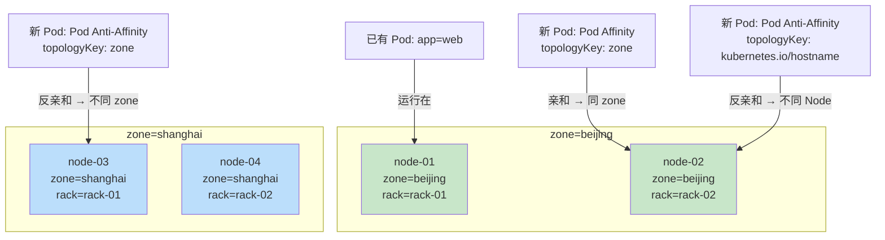

**完整 YAML 示例**：

```yaml
apiVersion: apps/v1
kind: Deployment
metadata:
  name: web-app
  namespace: default
spec:
  replicas: 4
  selector:
    matchLabels:
      app: web-app
  template:
    metadata:
      labels:
        app: web-app
        version: v2
    spec:
      containers:
      - name: web-app
        image: nginx:1.25
        ports:
        - containerPort: 80
        resources:
          requests:
            cpu: "250m"
            memory: "256Mi"
      affinity:
        podAffinity:
          # 硬约束：必须与 app=cache 的 Pod 部署在同一个 zone
          requiredDuringSchedulingIgnoredDuringExecution:
          - labelSelector:
              matchExpressions:
              - key: app
                operator: In
                values:
                - cache
            topologyKey: topology.kubernetes.io/zone
          # 软约束：尽量与 app=web-app 的 Pod 部署在同一 rack
          preferredDuringSchedulingIgnoredDuringExecution:
          - weight: 50
            podAffinityTerm:
              labelSelector:
                matchExpressions:
                - key: app
                  operator: In
                  values:
                  - cache
              topologyKey: rack
        podAntiAffinity:
          # 硬约束：不能与相同 app=web-app 的 Pod 部署在同一 Node
          # 确保每个副本在不同节点上
          requiredDuringSchedulingIgnoredDuringExecution:
          - labelSelector:
              matchExpressions:
              - key: app
                operator: In
                values:
                - web-app
            topologyKey: kubernetes.io/hostname
          # 软约束：尽量不在同一 zone 部署多个副本
          preferredDuringSchedulingIgnoredDuringExecution:
          - weight: 100
            podAffinityTerm:
              labelSelector:
                matchExpressions:
                - key: app
                  operator: In
                  values:
                - web-app
              topologyKey: topology.kubernetes.io/zone
```

> **美团实践**：在美团的容器化部署中，Pod 反亲和性被广泛用于保证服务的高可用性。例如，对于核心在线服务，使用 `requiredDuringSchedulingIgnoredDuringExecution` 配合 `topologyKey: kubernetes.io/hostname` 确保同一 Deployment 的不同 Pod 不会调度到同一节点；同时使用 `preferredDuringSchedulingIgnoredDuringExecution` 配合 `topologyKey: topology.kubernetes.io/zone` 尽量将副本分散到不同可用区。这种"节点级硬约束 + 可用区级软约束"的组合策略，在单节点故障和单可用区故障场景下都能保障服务可用性。

---

### 5.4 污点和容忍度

#### 5.4.1 污点（Taint）

污点是打在 Node 上的"排斥标记"，表示该节点有某种特殊状况，默认情况下不允许 Pod 调度到这里。只有明确声明了容忍度（Toleration）的 Pod 才能被调度到有对应污点的节点上。

**污点格式**：`key=value:effect`

三种 Effect：

| Effect | 行为 | 典型用途 |
|--------|------|----------|
| `NoSchedule` | 不允许新的 Pod 调度到该节点（已运行的 Pod 不受影响） | 专用节点（如 GPU 节点）、维护中的节点 |
| `PreferNoSchedule` | 尽量不调度到该节点，但如果没有其他节点可用时仍可调度（软约束） | 临时标记，温和地驱离 |
| `NoExecute` | 不允许新 Pod 调度，且已有的不能容忍该污点的 Pod 会被驱逐 | 节点故障、网络分区、内核升级 |

```bash
# 添加污点
kubectl taint nodes node-01 dedicated=gpu:NoSchedule
kubectl taint nodes node-02 maintenance=true:NoExecute

# 查看节点污点
kubectl describe node node-01 | grep Taints

# 删除污点（注意末尾的减号）
kubectl taint nodes node-01 dedicated=gpu:NoSchedule-
kubectl taint nodes node-02 maintenance=true:NoExecute-

# Master 节点默认污点（阻止普通 Pod 调度到控制平面）
# node-role.kubernetes.io/control-plane:NoSchedule
# node-role.kubernetes.io/master:NoSchedule  （旧版本）
```

**Kubernetes 自动添加的污点**：

| 污点 | 触发条件 | Effect |
|------|----------|--------|
| `node.kubernetes.io/not-ready` | 节点 NotReady | NoExecute |
| `node.kubernetes.io/unreachable` | 节点不可达（网络分区） | NoExecute |
| `node.kubernetes.io/memory-pressure` | 节点内存压力 | NoSchedule |
| `node.kubernetes.io/disk-pressure` | 节点磁盘压力 | NoSchedule |
| `node.kubernetes.io/pid-pressure` | 节点 PID 资源不足 | NoSchedule |
| `node.kubernetes.io/network-unavailable` | 节点网络未就绪 | NoSchedule |
| `node.kubernetes.io/unschedulable` | 节点被 cordon 标记 | NoSchedule |

对于 `NoExecute` 污点，K8s 默认会为 Pod 添加对 `not-ready` 和 `unreachable` 的容忍度，容忍时间为 300 秒（5 分钟）。这意味着当节点故障时，Pod 有 5 分钟的缓冲期，超过后会被驱逐。这个时间可以通过 `tolerationSeconds` 自定义。

#### 5.4.2 容忍度（Toleration）

容忍度定义在 Pod 上，表示该 Pod 可以"容忍"哪些污点。容忍度与污点的匹配规则如下：

| 匹配方式 | Toleration | 匹配的 Taint |
|----------|------------|-------------|
| 完全匹配 | `key=dedicated, value=gpu, effect=NoSchedule` | `dedicated=gpu:NoSchedule` |
| Effect 通配 | `key=dedicated, value=gpu, operator=Equal` | `dedicated=gpu:NoSchedule` 或 `dedicated=gpu:NoExecute` |
| Key 通配 | `operator=Exists, effect=NoSchedule` | 任何 key 的 `NoSchedule` 污点 |
| 全通配 | `operator=Exists` | 所有污点 |

**完整 YAML 示例**：

```yaml
apiVersion: v1
kind: Pod
metadata:
  name: gpu-workload
  namespace: default
spec:
  containers:
  - name: tensorflow
    image: tensorflow/tensorflow:latest-gpu
    resources:
      limits:
        nvidia.com/gpu: 1
  tolerations:
  # 精确匹配：容忍 dedicated=gpu:NoSchedule 污点
  # 用于将 GPU 工作负载调度到 GPU 专用节点
  - key: "dedicated"
    operator: "Equal"
    value: "gpu"
    effect: "NoSchedule"
  
  # 容忍内存压力污点，但只容忍 60 秒
  # 适用于可以短暂容忍内存压力但不应长期运行的 Pod
  - key: "node.kubernetes.io/memory-pressure"
    operator: "Exists"
    effect: "NoSchedule"
  
  # 自定义节点故障容忍时间（替代默认的 300 秒）
  - key: "node.kubernetes.io/not-ready"
    operator: "Exists"
    effect: "NoExecute"
    tolerationSeconds: 3600  # 容忍 1 小时
  
  - key: "node.kubernetes.io/unreachable"
    operator: "Exists"
    effect: "NoExecute"
    tolerationSeconds: 3600
```

**专用节点实践**：通常将 Taint 和 Tolerations 结合使用来实现"专用节点"模式：

```yaml
# 步骤 1：给 GPU 节点打污点
# kubectl taint nodes gpu-node-01 dedicated=gpu:NoSchedule
# kubectl taint nodes gpu-node-02 dedicated=gpu:NoSchedule

# 步骤 2：在 GPU 工作负载的 Deployment 中添加容忍度
apiVersion: apps/v1
kind: Deployment
metadata:
  name: gpu-training
spec:
  replicas: 2
  selector:
    matchLabels:
      app: gpu-training
  template:
    metadata:
      labels:
        app: gpu-training
    spec:
      tolerations:
      - key: "dedicated"
        operator: "Equal"
        value: "gpu"
        effect: "NoSchedule"
      # 同时添加节点亲和性，确保只调度到 GPU 节点
      affinity:
        nodeAffinity:
          requiredDuringSchedulingIgnoredDuringExecution:
            nodeSelectorTerms:
            - matchExpressions:
              - key: dedicated
                operator: In
                values:
                - gpu
      containers:
      - name: training
        image: tensorflow/tensorflow:latest-gpu
        resources:
          limits:
            nvidia.com/gpu: 1
```

> **美团实践**：美团在 GPU 训练集群中广泛使用 Taint + Toleration 实现专用节点隔离。GPU 节点打上 `dedicated=gpu:NoSchedule` 污点，只有带对应容忍度的训练任务才能调度上去。同时，针对在线服务集群，使用了 `dedicated=online:NoSchedule` 污点确保在线服务不会被离线任务"抢占"节点资源。在节点故障场景下，通过自定义 `tolerationSeconds` 将默认的 5 分钟容忍时间延长到 30 分钟，避免因短暂网络抖动导致大量 Pod 被驱逐。

---

### 5.5 Pod 优先级与抢占

#### 5.5.1 PriorityClass

PriorityClass 是一个集群范围的资源对象，定义了优先级类别的名称和数值。优先级数值越大，优先级越高。

```yaml
# 创建 PriorityClass
apiVersion: scheduling.k8s.io/v1
kind: PriorityClass
metadata:
  name: high-priority
description: "高优先级 - 用于核心在线服务"
value: 1000000
preemptionPolicy: PreemptLowerPriority  # 默认值，允许抢占低优先级 Pod
globalDefault: false  # 是否作为集群默认优先级（只能有一个为 true）
---
apiVersion: scheduling.k8s.io/v1
kind: PriorityClass
metadata:
  name: medium-priority
description: "中优先级 - 用于普通业务服务"
value: 500000
preemptionPolicy: PreemptLowerPriority
globalDefault: false
---
apiVersion: scheduling.k8s.io/v1
kind: PriorityClass
metadata:
  name: low-priority
description: "低优先级 - 用于离线批处理任务"
value: 100000
preemptionPolicy: PreemptLowerPriority
globalDefault: false
---
# 系统集群关键组件优先级（K8s 内置）
# system-cluster-critical: 2000000000
# system-node-critical: 2000001000
```

在 Pod 中使用 PriorityClass：

```yaml
apiVersion: v1
kind: Pod
metadata:
  name: high-priority-pod
spec:
  priorityClassName: high-priority
  containers:
  - name: nginx
    image: nginx:1.25
    resources:
      requests:
        cpu: "1"
        memory: "1Gi"
```

#### 5.5.2 抢占机制

当高优先级 Pod 无法找到满足条件的节点时，调度器会触发抢占：选择一个或多个低优先级 Pod 进行驱逐，释放资源后让高优先级 Pod 得以调度。

抢占流程：

```mermaid
flowchart TD
    A[高优先级 Pod 进入调度] --> B[Filter 阶段：无节点通过]
    B --> C[PostFilter 阶段：触发抢占]
    C --> D[遍历所有节点<br/>计算需要驱逐哪些低优先级 Pod<br/>才能满足高优先级 Pod 的资源需求]
    D --> E[选择"最小驱逐代价"的节点<br/>优先驱逐优先级最低的 Pod<br/>同优先级时优先驱逐最近启动的]
    E --> F[向 API Server 发送删除请求<br/>驱逐选中的低优先级 Pod]
    F --> G[等待被驱逐 Pod 优雅退出<br/>默认优雅终止期 30s]
    G --> H[资源释放后<br/>高优先级 Pod 绑定到该节点]
    
    style A fill:#e1f5fe
    style D fill:#fff9c4
    style F fill:#ffcdd2
    style H fill:#c8e6c9
```

抢占的关键细节：

1. **PodDisruptionBudget（PDB）保护**：抢占不会违反 PDB 的约束。如果驱逐某个 Pod 会导致该服务的可用副本数低于 PDB 规定的最小值，调度器会跳过该节点。
2. **优雅终止**：被抢占的 Pod 会收到 SIGTERM 信号，有 `terminationGracePeriodSeconds`（默认 30 秒）的时间进行优雅关闭。
3. **抢占不保证立即调度**：抢占释放资源后，高优先级 Pod 需要重新进入调度流程，此时可能有更高优先级的 Pod 抢占了释放出的资源。
4. **跨节点抢占**：K8s 1.22+ 支持跨节点抢占，可以从多个节点上各驱逐一部分 Pod 来满足高优先级 Pod 的需求。

```bash
# 查看 PriorityClass 列表
kubectl get priorityclasses

# 查看当前 Pod 的优先级
kubectl get pod <pod-name> -o jsonpath='{.spec.priority}'

# 查看 Pod 被抢占的事件
kubectl get events -n <namespace> --field-selector reason=Preempted
```

> **美团实践**：美团在混部（在线+离线混合部署）场景中深度使用优先级与抢占机制。在线服务被赋予高优先级（PriorityClass value: 1000000），离线批处理任务使用低优先级（PriorityClass value: 100000）。当在线服务需要扩容但集群资源不足时，调度器会自动驱逐低优先级的离线任务，释放资源供在线服务使用。这种机制使得集群在正常时段的 CPU 利用率可以从 20%-30% 提升到 60%-70%，同时在流量高峰期仍能保证在线服务的资源需求。

---

### 5.6 拓扑分布约束

#### 5.6.1 topologySpreadConstraints 详解

Pod 拓扑分布约束（Topology Spread Constraints）是 Kubernetes 提供的一种更精细化的 Pod 分布控制机制，用于将 Pod 均匀地分散到不同的拓扑域中，以实现高可用。

与 Pod 反亲和性相比，拓扑分布约束具有以下优势：

| 对比项 | Pod Anti-Affinity | topologySpreadConstraints |
|--------|-------------------|--------------------------|
| 分布方式 | 只能"不允许同域" | 可以精确控制分布的均匀程度 |
| 约束强度 | 只有硬约束和软约束 | maxSkew 量化允许的最大偏差 |
| 多拓扑域 | 需要写多条规则 | 一条规则即可 |
| 默认调度器权重 | 1 | 2 |

**核心参数说明**：

- `maxSkew`：最大倾斜度。描述 Pod 分布的最大不均匀程度。例如 `maxSkew=1` 表示拓扑域之间的 Pod 数量差异最多为 1。
- `topologyKey`：拓扑键。用于划分拓扑域的 Node Label 键。
- `whenUnsatisfiable`：不满足约束时的行为：
  - `DoNotSchedule`：不调度（硬约束）
  - `ScheduleAnyway`：继续调度，但尽量满足（软约束）
- `labelSelector`：用于匹配要分布的 Pod 集合。

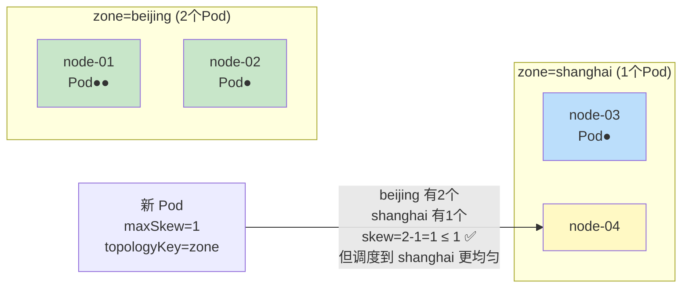

**完整 YAML 示例**：

```yaml
apiVersion: apps/v1
kind: Deployment
metadata:
  name: web-app-spread
  namespace: default
spec:
  replicas: 6
  selector:
    matchLabels:
      app: web-app-spread
  template:
    metadata:
      labels:
        app: web-app-spread
    spec:
      containers:
      - name: web-app
        image: nginx:1.25
        ports:
        - containerPort: 80
      topologySpreadConstraints:
      # 约束1：按 zone 均匀分布，最大偏差不超过 1
      - maxSkew: 1
        topologyKey: topology.kubernetes.io/zone
        whenUnsatisfiable: DoNotSchedule  # 硬约束
        labelSelector:
          matchLabels:
            app: web-app-spread
      # 约束2：按 node 均匀分布，最大偏差不超过 1
      - maxSkew: 1
        topologyKey: kubernetes.io/hostname
        whenUnsatisfiable: ScheduleAnyway  # 软约束
        labelSelector:
          matchLabels:
            app: web-app-spread
```

**分布计算过程**（假设集群有 2 个 zone，6 个副本）：

```
理想分布：每个 zone 6/2 = 3 个 Pod

zone=beijing  3个Pod  (node-01: 2, node-02: 1)
zone=shanghai 3个Pod  (node-03: 2, node-04: 1)

每个 Node 理想分布：6/4 = 1.5 → 每节点 1 或 2 个
maxSkew=1: 任意两节点间 Pod 数差 ≤ 1 ✅
```

```bash
# 查看拓扑分布状态
kubectl get pods -l app=web-app-spread -o wide --sort-by='.spec.nodeName'

# 查看节点的 zone Label
kubectl get nodes -L topology.kubernetes.io/zone
```

---

### 5.7 自定义调度器

#### 5.7.1 自定义调度器的实现方式

Kubernetes 允许运行多个调度器，每个 Pod 可以通过 `spec.schedulerName` 字段选择使用哪个调度器。未指定时使用默认的 `default-scheduler`。

实现自定义调度器有三种主要方式：

**方式一：调度框架插件（推荐）**

基于 Scheduling Framework 编写插件，以 Webhook 或编译到 kube-scheduler 中的方式扩展调度逻辑。

```yaml
# kube-scheduler 配置文件
apiVersion: kubescheduler.config.k8s.io/v1
kind: KubeSchedulerConfiguration
profiles:
- schedulerName: default-scheduler
  plugins:
    queueSort:
      enabled:
      - name: PrioritySort
    preFilter:
      enabled:
      - name: NodeResourcesFit
      - name: NodePorts
      - name: MyCustomPreFilter  # 自定义预过滤插件
    filter:
      enabled:
      - name: NodeUnschedulable
      - name: NodeName
      - name: NodeAffinity
      - name: TaintToleration
      - name: MyCustomFilter  # 自定义过滤插件
    score:
      enabled:
      - name: NodeResourcesFit
      - name: MyCustomScore  # 自定义打分插件
        weight: 5  # 自定义权重
```

**方式二：独立调度器**

完全独立实现一个调度器程序，通过 Watch API Server 获取未调度的 Pod，做出调度决策后通过 Bind API 绑定 Pod 到 Node。

```go
// 简化的自定义调度器核心逻辑
package main

import (
    "context"
    "fmt"
    "k8s.io/client-go/kubernetes"
    "k8s.io/client-go/tools/clientcmd"
    "k8s.io/apimachinery/pkg/apis/meta/v1"
)

const SchedulerName = "my-custom-scheduler"

func main() {
    config, _ := clientcmd.BuildConfigFromFlags("", clientcmd.RecommendedHomeFile)
    clientset, _ := kubernetes.NewForConfig(config)

    // 1. Watch 未调度的 Pod（schedulerName = my-custom-scheduler）
    // 2. 获取所有可用 Node
    // 3. 执行自定义调度算法
    // 4. 将 Pod 绑定到选中的 Node

    pods, _ := clientset.CoreV1().Pods("").List(context.TODO(), v1.ListOptions{})
    for _, pod := range pods.Items {
        if pod.Spec.SchedulerName == SchedulerName && pod.Spec.NodeName == "" {
            node := customSchedule(pod)
            bindPodToNode(clientset, pod.Name, pod.Namespace, node)
        }
    }
}

func customSchedule(pod v1.Pod) string {
    // 自定义调度逻辑：例如基于 Pod 的 Label 选择最近的节点
    // 可以实现机房亲和、机柜感知等策略
    return "node-01"
}
```

**方式三：调度器扩展（Scheduler Extender，已弃用）**

通过 HTTP Webhook 的方式扩展默认调度器的 Filter 和 Score 阶段。K8s 社区已建议迁移到 Scheduling Framework。

在 Pod 中指定自定义调度器：

```yaml
apiVersion: v1
kind: Pod
metadata:
  name: custom-scheduled-pod
spec:
  schedulerName: my-custom-scheduler  # 指定自定义调度器
  containers:
  - name: nginx
    image: nginx:1.25
```

```bash
# 查看集群中的调度器
kubectl get pods -n kube-system -l component=kube-scheduler

# 查看 Pod 使用的调度器
kubectl get pod <pod-name> -o jsonpath='{.spec.schedulerName}'
```

> **美团实践**：美团 Kubernetes 平台实现了基于 Scheduling Framework 的自定义调度器插件，主要包括：①**机房亲和插件**——根据服务的容灾等级，自动将副本分散到不同机房；②**机柜感知插件**——避免同一服务的多个副本落在同一机柜（同一机柜共享电源和交换机，是故障爆炸半径的最小单位）；③**资源碎片整理插件**——在打分阶段倾向于将小 Pod 调度到资源碎片较多的节点，将大块连续资源留给大 Pod。这些插件以 out-of-tree 方式编译为独立的 kube-scheduler 二进制，无需修改上游代码。

---

## 第六章：网络模型深度解析

### 6.1 K8s 网络模型基本原则

Kubernetes 的网络模型设计遵循以下几个核心原则，这些原则由 k8s sig-network 社区定义，所有 CNI 插件都必须遵守：

1. **每个 Pod 拥有唯一 IP**：Pod 内所有容器共享同一个网络命名空间（Network Namespace），它们彼此通过 `localhost` 通信，就像同一台机器上的进程一样。从网络角度看，Pod 就是一台独立的"虚拟机"。

2. **所有 Pod 之间可以直接通信，无需 NAT**：无论 Pod 运行在哪个节点上，Pod 之间的通信都是直接的，不需要地址转换。这意味着 Pod IP 在整个集群范围内是全局唯一且可直接路由的。

3. **Pod 与节点之间可以直接通信，无需 NAT**：节点可以直接访问运行在其上的 Pod，反之亦然。

4. **扁平网络**：整个集群是一个扁平的网络空间，没有网络层次和边界。这大大简化了服务发现和通信模型。

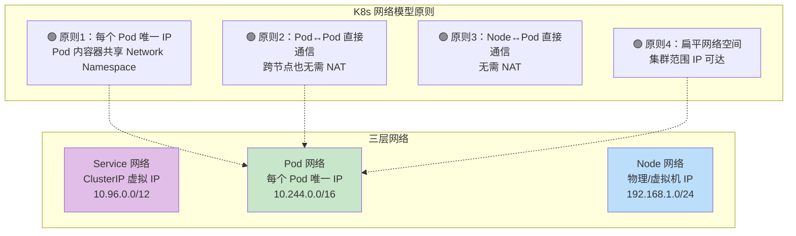

这三个网络（Pod 网络、Service 网络、Node 网络）是完全独立的地址空间，通过 iptables/IPVS 规则和路由表实现互联。理解这三层网络的分离与协作，是理解 K8s 网络的关键。

---

### 6.2 Pod 网络实现

#### 6.2.1 Pause 容器

每个 Pod 都有一个特殊的"基础容器"——Pause 容器（也叫 sandbox 容器），它是 Pod 中第一个启动的容器，也是最后一个退出的容器。Pause 容器的作用是**创建并持有 Pod 的 Network Namespace**。

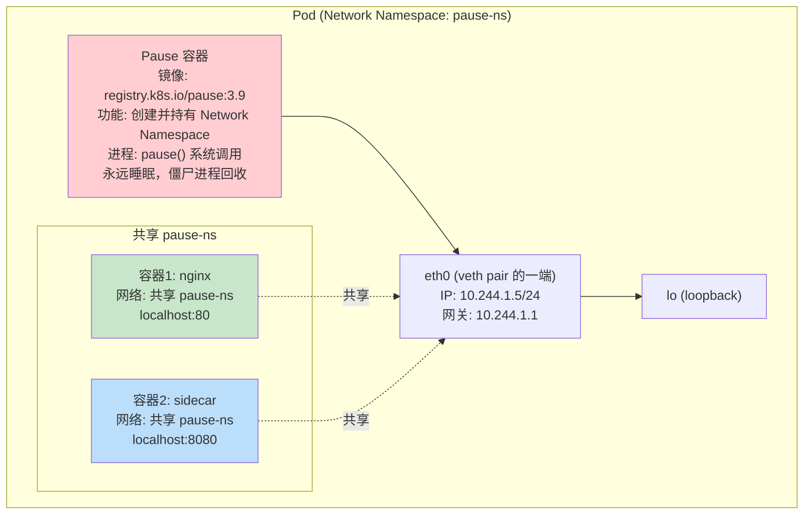

Pause 容器的核心功能：

1. **创建 Network Namespace**：Pause 容器启动时创建一个新的 Network Namespace，Pod 内的其他容器通过 `--net=container:<pause-container-id>` 的方式加入这个 Namespace。
2. **持有 Namespace 生命周期**：只要 Pause 容器存在，Network Namespace 就存在。这确保了即使业务容器重启，Pod 的 IP 地址和网络配置不会丢失。
3. **僵尸进程回收**：Pause 容器作为 PID 1 进程，负责回收 Pod 内其他容器产生的僵尸进程（子进程退出但父进程未调用 `wait()` 的进程）。

```bash
# 查看 Pod 的 Pause 容器
kubectl get pods <pod-name> -o jsonpath='{.status.containerStatuses[0].containerID}'
# 或在节点上
crictl ps --name POD

# 查看 Pause 容器持有的 Network Namespace
# 找到 Pause 容器的 PID
PID=$(docker inspect --format '{{.State.Pid}}' <pause-container-id>)
# 查看其 Network Namespace
ls -la /proc/$PID/ns/net
# 进入 Network Namespace 查看网络配置
nsenter -t $PID -n ip addr
nsenter -t $PID -n ip route
```

#### 6.2.2 veth pair 与网桥模式

veth pair（Virtual Ethernet Pair）是 Linux 内核提供的一种虚拟网络设备，它总是成对出现——从一端进入的数据包会从另一端出来，就像一根"虚拟网线"。

在 Kubernetes 中，veth pair 的一端放在容器的 Network Namespace 中（通常命名为 `eth0`），另一端连接到宿主机的网桥（通常命名为 `cni0` 或 `br0`）。

**完整的网络数据路径**：

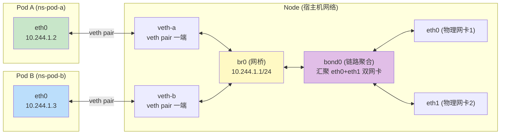

**同节点 Pod 通信流程**（Pod A → Pod B）：

```
1. Pod A 的进程发送数据包到 10.244.1.3
2. 数据包从 Pod A 的 eth0 → veth pair → 宿主机的 veth-a
3. veth-a 连接在 br0 网桥上，网桥根据 MAC 地址表转发
4. 数据包从 br0 → veth-b → veth pair → Pod B 的 eth0
5. Pod B 收到数据包
```

**跨节点 Pod 通信流程**（Node1 Pod A → Node2 Pod C）：

```
1. Pod A 发送数据包到 10.244.2.5（Node2 上的 Pod C）
2. 数据包从 eth0 → veth pair → veth-a → br0
3. br0 发现目标 IP 不在本机网段，查询路由表
4. 路由表指向 bond0（或物理网卡）
5. 数据包经 bond0 → eth0/eth1 → 物理网络 → Node2 的 eth0/eth1 → bond0 → br0
6. Node2 的 br0 根据路由表转发到 veth-c → veth pair → Pod C 的 eth0
```

**bond0 双网卡链路聚合**：

在高可靠生产环境中，宿主机通常配置双网卡（eth0 + eth1），通过 bond0 进行链路聚合，提供：
- **冗余**：单网卡故障时自动切换，不中断业务
- **负载均衡**：流量分散到两条链路上，提升带宽
- 常见的 bond 模式：mode=4（802.3ad LACP，需要交换机支持）或 mode=1（active-backup，主备模式）

```bash
# 在节点上查看网络配置
# 查看网桥
brctl show br0
# 或
bridge link

# 查看 veth pair
ip link show type veth

# 查看路由表
ip route

# 查看 bond0 配置
cat /proc/net/bonding/bond0

# 查看 NAT 规则
iptables -t nat -L -n -v

# 抓包分析 Pod 通信
# 在 Pod 的 veth 一端抓包
tcpdump -i veth-a -nn port 80
```

---

### 6.3 CNI（Container Network Interface）

#### 6.3.1 CNI 标准与工作流程

CNI（Container Network Interface）是 Cloud Native Computing Foundation（CNCF）下的一个项目，定义了容器运行时与网络插件之间的标准接口。kubelet 通过 CNI 插件为 Pod 配置网络。

**CNI 的核心设计理念**：

- **简单**：CNI 只关注网络配置，不涉及网络策略、服务发现等高级功能
- **松耦合**：容器运行时通过执行二进制文件的方式调用 CNI 插件，而非通过库或 API
- **可组合**：多个 CNI 插件可以链式调用（通过 `.conflist` 配置文件）

**CNI 插件工作流程**（以 Pod 创建为例）：

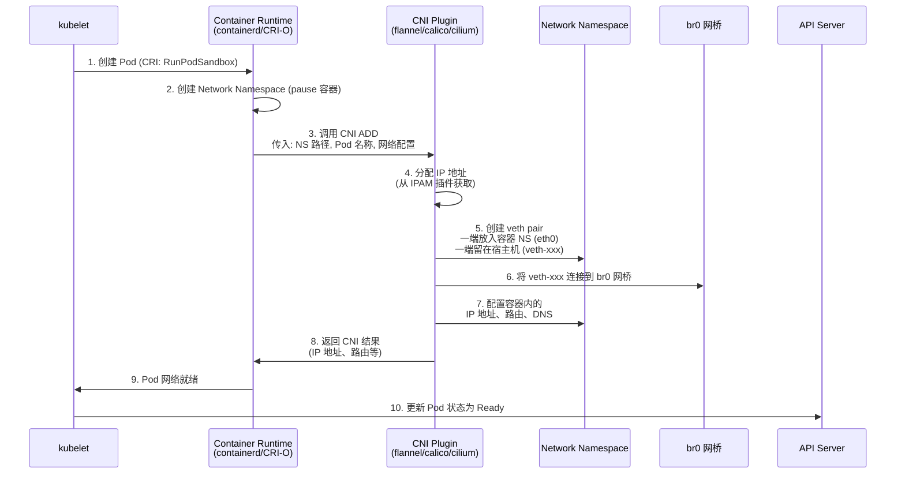

**CNI 配置文件示例**（`/etc/cni/net.d/10-br0.conflist`）：

```json
{
  "cniVersion": "0.4.0",
  "name": "br0-network",
  "plugins": [
    {
      "type": "bridge",
      "bridge": "br0",
      "ipam": {
        "type": "host-local",
        "subnet": "10.244.1.0/24",
        "rangeStart": "10.244.1.10",
        "rangeEnd": "10.244.1.250",
        "gateway": "10.244.1.1",
        "routes": [
          { "dst": "0.0.0.0/0" }
        ]
      },
      "isDefaultGateway": true
    },
    {
      "type": "portmap",
      "capabilities": {
        "portMappings": true
      }
    },
    {
      "type": "bandwidth",
      "capabilities": {
        "bandwidth": true
      }
    }
  ]
}
```

#### 6.3.2 主流 CNI 插件对比

| 特性 | Flannel | Calico | Cilium | Weave |
|------|---------|--------|--------|-------|
| **网络模式** | VXLAN Overlay / host-gw | BGP 路由 / VXLAN / eBPF | eBPF 数据面 / VXLAN / 路由 | VXLAN Overlay |
| **网络策略** | ❌ 不支持 | ✅ 完整支持 | ✅ 完整支持 + L7 策略 | ✅ 基础支持 |
| **性能** | 一般（VXLAN 有封装开销） | 优秀（BGP 路由无封装） | 卓越（eBPF 绕过 iptables） | 一般 |
| **底层技术** | 内核 VXLAN 模块 | iptables + BGP + eBPF | eBPF + XDP | 内核 VXLAN |
| **适用场景** | 简单集群、快速搭建 | 大规模生产环境 | 高性能/可观测性需求 | 小规模集群 |
| **IPAM** | host-local（每节点子网） | host-local / Calico IPAM | host-local / Calico IPAM | 自动发现 |
| **规模** | < 5000 节点 | 10000+ 节点 | 10000+ 节点 | < 1000 节点 |
| **可观测性** | 基础 | 丰富（Hubble 可选） | 卓越（Hubble 内置） | 基础 |
| **加密** | IPSec（可选） | WireGuard（可选） | WireGuard（内置） | IPSec（内置） |

**Flannel 工作原理**：

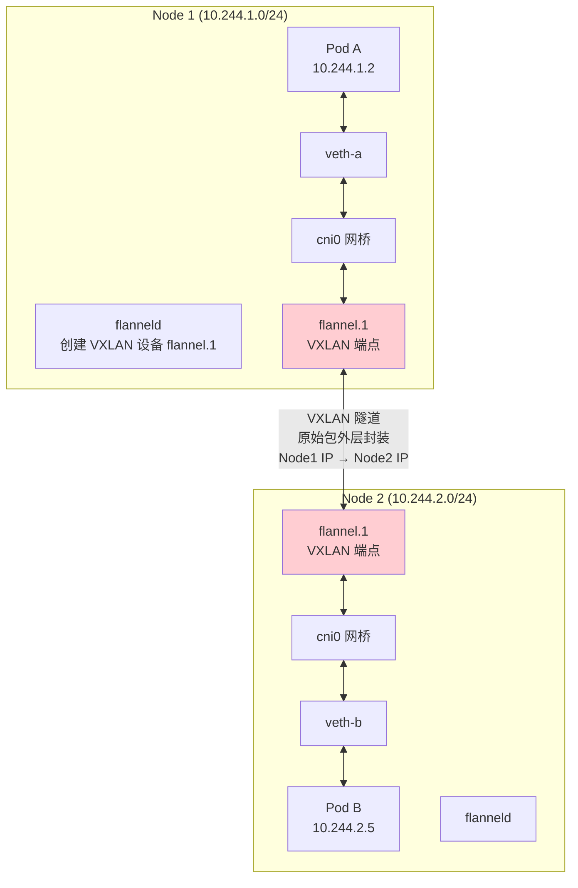

Flannel 的 VXLAN 模式在原始数据包外层封装了一个 VXLAN 头、UDP 头和 IP 头，这带来了额外的开销（约 50 字节/包），同时也降低了性能（封装/解封装需要 CPU 计算）。`host-gw` 模式通过直接写入路由表项（下一跳为目标节点 IP）避免了封装开销，性能更好，但要求节点间二层直接可达。

**Calico 工作原理**：

Calico 使用 BGP（Border Gateway Protocol）在节点之间交换路由信息。每个节点运行一个 BGP Agent（BIRD），将自己的 Pod 子网通告给其他节点。数据包直接通过路由表转发，无需封装。

```
# Node1 上的路由表示例
# 目标: 10.244.2.0/24 → 经 Node2 (192.168.1.2) 转发
10.244.1.0/24 dev cali-xxx  scope link  # 本节点 Pod 子网
10.244.2.0/24 via 192.168.1.2 dev eth0  # 远端 Pod 子网，BGP 学习到的
10.244.3.0/24 via 192.168.1.3 dev eth0  # 另一个远端 Pod 子网
```

**Cilium 工作原理**：

Cilium 是基于 eBPF（Extended Berkeley Packet Filter）的新一代 CNI 插件。eBPF 允许在 Linux 内核中安全地运行沙盒程序，无需修改内核源码或加载内核模块。Cilium 将网络策略、路由、NAT 等逻辑从 iptables 移到 eBPF 程序中，在网络数据路径的关键挂载点（XDP、TC、socket 层）注入 eBPF 程序，实现高性能的网络处理。

Cilium 的核心优势：
- **性能**：eBPF 程序在内核态执行，绕过 iptables 和 conntrack，包处理延迟降低 50%+
- **L7 策略**：支持 HTTP、gRPC、Kafka 等应用层协议的细粒度网络策略
- **可观测性**：Hubble 组件提供实时的网络流量监控和服务依赖图
- **透明加密**：基于 WireGuard 的节点间流量加密

```bash
# 查看 CNI 配置
ls /etc/cni/net.d/
cat /etc/cni/net.d/10-calico.conflist

# 查看当前使用的 CNI 插件
kubectl get pods -n kube-system | grep -E 'calico|flannel|cilium|weave'

# Calico: 查看 BGP 邻居
calicoctl node status

# Calico: 查看 IP 池
calicoctl ip-pools show

# Cilium: 查看 eBPF 程序
cilium bpf lb list
cilium bpf ct list global

# Cilium: Hubble 可观测性
hubble observe --since 1m
```

---

### 6.4 美团实践：定制化 CNI

#### 6.4.1 美团网络架构演进

美团在 Kubernetes 网络方面有着丰富的工程实践，其网络架构经历了从简单到复杂、从通用到定制化的演进过程。

**演进历程**：

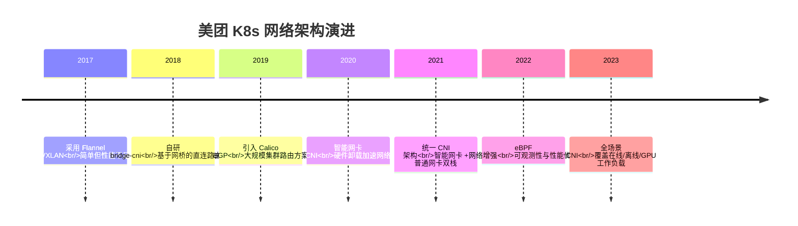

#### 6.4.2 bridge-cni：美团自研网桥 CNI

美团基于生产环境的实际需求，自研了 bridge-cni，其核心设计思路是：使用 Linux bridge 作为 Pod 网络的核心转发平面，通过直连路由（而非 VXLAN 封装）实现跨节点 Pod 通信。

**bridge-cni 架构**：

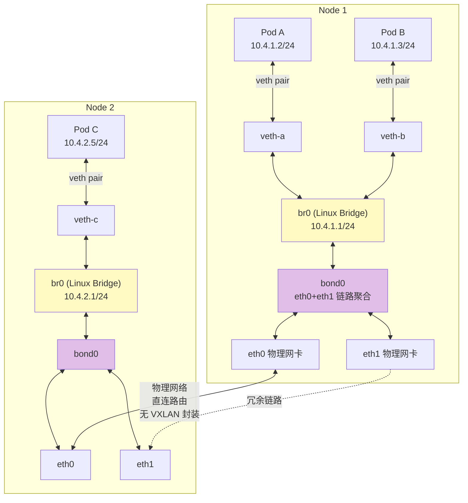

bridge-cni 的关键特性：

1. **直连路由模式**：每个节点分配一个 /24 的 Pod 子网，跨节点通信通过路由表直接转发，无 VXLAN 封装开销。
2. **bond0 双网卡链路聚合**：通过 bond0 将 eth0 和 eth1 绑定，提供网卡级别的冗余和负载均衡。
3. **br0 网桥**：所有容器的 veth pair 一端连接到 br0，同节点 Pod 通信走网桥转发，跨节点通信经 br0 → bond0 → 物理网络。

```bash
# bridge-cni 配置示例
# /etc/cni/net.d/10-bridge-cni.conf
{
  "cniVersion": "0.4.0",
  "name": "bridge-cni",
  "type": "bridge-cni",
  "bridge": "br0",
  "ipam": {
    "type": "host-local",
    "subnet": "10.4.1.0/24",
    "gateway": "10.4.1.1"
  },
  "routeManagement": {
    "enabled": true,
    "autoAddRoutes": true
  }
}
```

#### 6.4.3 智能网卡 CNI vs 普通网卡 CNI

美团在部分高性能场景下引入了智能网卡（SmartNIC/DPU）方案，将网络处理从主机 CPU 卸载到智能网卡上的硬件芯片，大幅提升网络性能和降低宿主机 CPU 开销。

**两种 CNI 方案对比**：

| 对比项 | 普通网卡 CNI (bridge-cni) | 智能网卡 CNI |
|--------|--------------------------|-------------|
| **数据路径** | Pod → veth → br0 → bond0 → eth0 | Pod → veth → br0 → smart-nic VF → 网卡硬件 |
| **OVS/VXLAN** | 宿主机 CPU 处理 | 智能网卡硬件卸载 |
| **网络策略** | iptables/eBPF (宿主机 CPU) | 网卡硬件 ACL |
| **CPU 开销** | 高（网络处理占 5%-15% CPU） | 低（卸载到网卡，节省 5%-10% CPU） |
| **网络延迟** | ~50-100μs | ~20-40μs |
| **吞吐量** | 10-20Gbps | 40-100Gbps |
| **适用场景** | 通用在线服务、离线任务 | 高性能计算、低延迟交易、AI 训练 |
| **成本** | 低 | 高（智能网卡约 2-3x 普通网卡价格） |

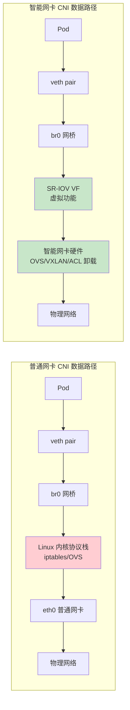

#### 6.4.4 路由管理

美团在多机房、多可用区部署场景下，开发了统一的路由管理组件，负责：

1. **Pod 子网路由自动下发**：新节点加入集群时，自动将节点的 Pod 子网路由通告给所有节点。
2. **跨机房路由管理**：管理不同机房之间的 Pod 子网路由，确保跨机房 Pod 通信的正确路径。
3. **路由健康检查**：持续监控路由可达性，自动剔除不可达的路由。
4. **路由优先级控制**：在多路径场景下，通过路由优先级控制流量走向，优先走同机房路径。

```bash
# 查看路由管理状态
kubectl get pods -n kube-system -l app=route-manager

# 查看路由表
ip route show | grep "10.4"

# 输出示例：
# 10.4.1.0/24 dev br0 proto kernel scope link src 10.4.1.1
# 10.4.2.0/24 via 192.168.2.1 dev bond0  # 同机房路由
# 10.4.3.0/24 via 10.0.3.1 dev bond0     # 跨机房路由（优先级更低）
```

---

### 6.5 Service 网络

#### 6.5.1 ClusterIP 实现原理

Service 是 Kubernetes 中最核心的网络抽象之一。它为一组功能相同的 Pod 提供一个稳定的访问入口（ClusterIP + DNS 名称），并实现负载均衡。

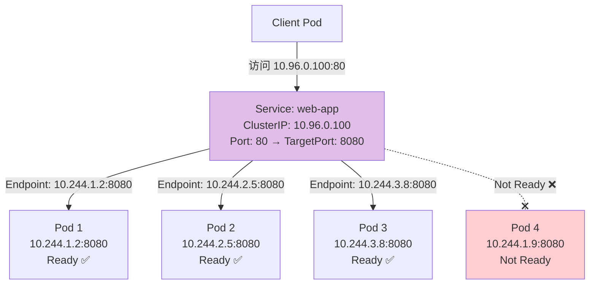

Service 的工作机制：

1. **API Server 创建 Service**：用户提交 Service 定义，API Server 分配 ClusterIP。
2. **Endpoint Controller**：监听 Service 和 Pod 的变化，根据 Label Selector 自动维护 Endpoint 列表（仅包含 Ready 状态的 Pod）。
3. **kube-proxy**：监听 Service 和 Endpoint 的变化，在节点上配置流量转发规则。
4. **CoreDNS**：为 Service 创建 DNS 记录（`<service>.<namespace>.svc.cluster.local`）。

```yaml
# Service 示例
apiVersion: v1
kind: Service
metadata:
  name: web-app
  namespace: default
spec:
  type: ClusterIP  # 默认类型
  selector:
    app: web-app
  ports:
  - name: http
    protocol: TCP
    port: 80          # Service 端口
    targetPort: 8080  # Pod 容器端口
  - name: https
    protocol: TCP
    port: 443
    targetPort: 8443
  internalTrafficPolicy: Cluster  # 集群内部流量策略
  ipFamilyPolicy: SingleStack     # IPv4 单栈
```

#### 6.5.2 kube-proxy 三种模式

kube-proxy 是实现 Service 负载均衡的核心组件，它有三种工作模式：

**模式一：userspace（已弃用）**

最早的模式，在用户空间实现代理。每个请求都需要从内核态复制到用户态，再复制回内核态，性能极差。

```
Client → iptables DNAT → userspace kube-proxy → 后端 Pod
         (内核态)          (用户态，性能瓶颈)
```

**模式二：iptables（默认模式）**

利用 iptables 的 DNAT（Destination Network Address Translation）规则实现流量转发，所有转发在内核态完成，性能远优于 userspace。

```
# iptables 规则链示例
# KUBE-SERVICES 链：匹配目标 ClusterIP
-A KUBE-SERVICES -d 10.96.0.100/32 -p tcp --dport 80 -j KUBE-SVC-WEBAPP

# KUBE-SVC-WEBAPP 链：随机选择后端 Pod（概率轮询）
-A KUBE-SVC-WEBAPP -m statistic --probability 0.33 -j KUBE-SEP-P1
-A KUBE-SVC-WEBAPP -m statistic --probability 0.50 -j KUBE-SEP-P2
-A KUBE-SVC-WEBAPP -j KUBE-SEP-P3

# KUBE-SEP-P1 链：DNAT 到 Pod IP
-A KUBE-SEP-P1 -s 10.244.1.2/32 -j KUBE-MARK-MASQ
-A KUBE-SEP-P1 -p tcp -j DNAT --to-destination 10.244.1.2:8080
```

iptables 模式的问题：
- **规则数量线性增长**：每增加一个 Service+Endpoint 就增加多条 iptables 规则，大规模集群（数千 Service，数万 Endpoint）下规则可达数十万条
- **O(n) 匹配**：iptables 规则是线性匹配的，规则越多，每个包的匹配时间越长
- **无法加权轮询**：`--probability` 只能实现近似均匀分布，无法精确控制权重
- **难以调试**：iptables 规则链复杂，排查问题困难

**模式三：IPVS（推荐模式）**

IPVS（IP Virtual Server）是 Linux 内核的 L4 负载均衡器，专为高性能负载均衡设计。它使用哈希表存储转发规则，查找复杂度为 O(1)，不受规则数量影响。

```bash
# 查看当前 kube-proxy 模式
kubectl get configmap kube-proxy -n kube-system -o yaml | grep mode

# 切换到 IPVS 模式（修改 kube-proxy ConfigMap）
kubectl edit configmap kube-proxy -n kube-system
# 设置 mode: "ipvs"

# 重启 kube-proxy
kubectl rollout restart daemonset kube-proxy -n kube-system

# 查看 IPVS 规则
ipvsadm -Ln

# 输出示例：
# TCP  10.96.0.100:80 rr
#   -> 10.244.1.2:8080          Masq    1      0          0
#   -> 10.244.2.5:8080          Masq    1      0          0
#   -> 10.244.3.8:8080          Masq    1      0          0
```

**三种模式对比**：

| 对比项 | userspace | iptables | IPVS |
|--------|-----------|----------|------|
| **转发位置** | 用户态 | 内核态 | 内核态 |
| **性能** | 差 | 中等 | 优秀 |
| **规则查找** | O(n) | O(n) | O(1) |
| **负载均衡算法** | 轮询 | 随机（概率） | rr/wrr/lc/wlc/sh/dh/sed/nq 等 8 种 |
| **会话保持** | ✅ | ✅ | ✅ |
| **大规模集群** | ❌ | ⚠️ (>5000 Service 有性能问题) | ✅ |
| **状态 | 已弃用 | 默认 | 推荐 |

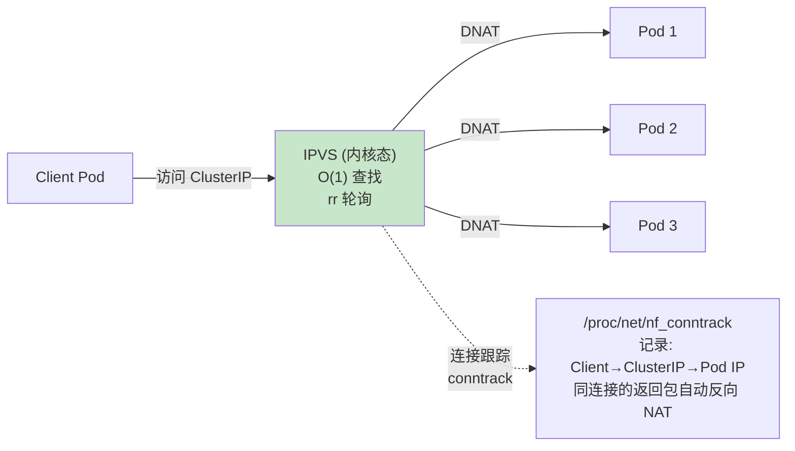

#### 6.5.3 CoreDNS 服务发现

CoreDNS 是 Kubernetes 集群的默认 DNS 服务器，为集群内的服务提供名称解析。

**DNS 记录类型**：

| 记录类型 | 格式 | 示例 | 解析结果 |
|----------|------|------|----------|
| ClusterIP Service | `<svc>.<ns>.svc.cluster.local` | `web-app.default.svc.cluster.local` | 10.96.0.100 |
| Headless Service | `<svc>.<ns>.svc.cluster.local` | `headless-app.default.svc.cluster.local` | 返回所有 Pod IP |
| Pod (Headless) | `<pod-ip-dashed>.<svc>.<ns>.svc.cluster.local` | `10-244-1-2.headless-app.default.svc.cluster.local` | 10.244.1.2 |
| ExternalName | `<svc>.<ns>.svc.cluster.local` | `ext-svc.default.svc.cluster.local` | CNAME → external.example.com |

```yaml
# CoreDNS 配置（ConfigMap: coredns -n kube-system）
apiVersion: v1
kind: ConfigMap
metadata:
  name: coredns
  namespace: kube-system
data:
  Corefile: |
    .:53 {
        errors
        health {
            lameduck 5s
        }
        ready
        # 集群内 DNS 解析
        kubernetes cluster.local in-addr.arpa ip6.arpa {
            pods insecure
            fallthrough in-addr.arpa ip6.arpa
            ttl 30
        }
        # 上游 DNS 解析（集群外域名）
        prometheus :9153
        forward . /etc/resolv.conf {
            max_concurrent 1000
        }
        cache 30
        loop
        reload
        loadbalance
    }
```

```bash
# 在 Pod 内测试 DNS 解析
kubectl run dns-test --image=busybox:1.36 --rm -it --restart=Never -- \
  nslookup web-app.default.svc.cluster.local

# 查看 CoreDNS 日志
kubectl logs -n kube-system -l k8s-app=kube-dns

# 查看 CoreDNS Pod 状态
kubectl get pods -n kube-system -l k8s-app=kube-dns -o wide

# 测试 Headless Service 解析
kubectl run dns-test --image=busybox:1.36 --rm -it --restart=Never -- \
  nslookup headless-app.default.svc.cluster.local
# 返回所有 Pod IP 而非 ClusterIP
```

---

### 6.6 Ingress 与入口流量

#### 6.6.1 Ingress 资源

Ingress 是 Kubernetes 中管理集群外部 HTTP/HTTPS 访问的 API 对象。它提供了基于域名和路径的路由规则，将外部流量路由到集群内的 Service。

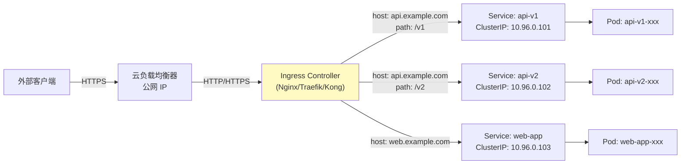

**Ingress YAML 示例**：

```yaml
apiVersion: networking.k8s.io/v1
kind: Ingress
metadata:
  name: web-app-ingress
  namespace: default
  annotations:
    # Nginx Ingress Controller 专用注解
    nginx.ingress.kubernetes.io/ssl-redirect: "true"
    nginx.ingress.kubernetes.io/use-regex: "true"
    nginx.ingress.kubernetes.io/rewrite-target: /$2
    # 限流配置
    nginx.ingress.kubernetes.io/limit-rps: "100"
    # 超时配置
    nginx.ingress.kubernetes.io/proxy-connect-timeout: "5"
    nginx.ingress.kubernetes.io/proxy-read-timeout: "60"
spec:
  ingressClassName: nginx  # 指定 Ingress Controller
  tls:
  - hosts:
    - api.example.com
    - web.example.com
    secretName: tls-secret  # TLS 证书 Secret
  rules:
  - host: api.example.com
    http:
      paths:
      - path: /v1(/|$)(.*)
        pathType: Prefix
        backend:
          service:
            name: api-v1
            port:
              number: 80
      - path: /v2(/|$)(.*)
        pathType: Prefix
        backend:
          service:
            name: api-v2
            port:
              number: 80
  - host: web.example.com
    http:
      paths:
      - path: /
        pathType: Prefix
        backend:
          service:
            name: web-app
            port:
              number: 80
```

```bash
# 查看 Ingress
kubectl get ingress -A

# 查看 Ingress 详情
kubectl describe ingress web-app-ingress

# 查看 Ingress Controller 日志
kubectl logs -n ingress-nginx -l app.kubernetes.io/name=ingress-nginx

# 测试 Ingress 路由
curl -H "Host: api.example.com" https://<ingress-ip>/v1/users
curl -H "Host: web.example.com" https://<ingress-ip>/
```

> **美团实践**：美团使用自研的 API 网关作为 Ingress Controller 的替代方案。API 网关基于 Nginx + Lua 扩展，集成了限流、熔断、鉴权、灰度发布等微服务治理能力。在流量入口层面，采用"云负载均衡器 → API 网关 → K8s Service"的三层架构，云 LB 负责 L4 负载均衡和 TLS 终结，API 网关负责 L7 路由和微服务治理。

---

### 6.7 NetworkPolicy

#### 6.7.1 网络策略详解

NetworkPolicy 是 Kubernetes 中实现网络访问控制的资源对象，类似于云平台中的"安全组"。默认情况下，Pod 之间的网络是完全开放的；NetworkPolicy 用于限制 Pod 的入站和出站流量。

**NetworkPolicy 的工作原理**：

1. **标签选择器**：通过 `podSelector` 选择要应用策略的 Pod
2. **入站规则**（`ingress`）：定义允许访问的源（from）和端口（ports）
3. **出站规则**（`egress`）：定义允许访问的目标（to）和端口（ports）
4. **默认行为**：如果 NetworkPolicy 选择了某个 Pod，则该 Pod 的所有未明确允许的流量都会被拒绝

> ⚠️ **重要提示**：NetworkPolicy 由 CNI 插件实现，不是 kube-proxy。只有支持 NetworkPolicy 的 CNI（如 Calico、Cilium、Weave）才能生效，Flannel 不支持。

**完整的 NetworkPolicy YAML 示例**：

```yaml
# 策略1：允许 frontend 访问 backend 的 8080 端口
apiVersion: networking.k8s.io/v1
kind: NetworkPolicy
metadata:
  name: backend-allow-frontend
  namespace: default
spec:
  podSelector:
    matchLabels:
      app: backend  # 策略应用于 backend Pod
  policyTypes:
  - Ingress
  ingress:
  - from:
    - podSelector:
        matchLabels:
          app: frontend  # 允许来自 frontend Pod 的流量
    ports:
    - protocol: TCP
      port: 8080  # 仅允许访问 8080 端口
---
# 策略2：backend 允许访问 MySQL 的 3306 端口
apiVersion: networking.k8s.io/v1
kind: NetworkPolicy
metadata:
  name: backend-allow-mysql-egress
  namespace: default
spec:
  podSelector:
    matchLabels:
      app: backend  # 策略应用于 backend Pod
  policyTypes:
  - Egress
  egress:
  - to:
    - podSelector:
        matchLabels:
          app: mysql  # 允许访问 mysql Pod
    ports:
    - protocol: TCP
      port: 3306
  - to:  # 允许 DNS 解析（必须！否则无法解析 Service 名称）
    - namespaceSelector: {}
    ports:
    - protocol: UDP
      port: 53
---
# 策略3：默认拒绝所有入站流量（零信任模型）
apiVersion: networking.k8s.io/v1
kind: NetworkPolicy
metadata:
  name: default-deny-ingress
  namespace: production
spec:
  podSelector: {}  # 选择命名空间中的所有 Pod
  policyTypes:
  - Ingress  # 拒绝所有入站流量（不定义 ingress 规则 = 全部拒绝）
---
# 策略4：默认拒绝所有出站流量
apiVersion: networking.k8s.io/v1
kind: NetworkPolicy
metadata:
  name: default-deny-egress
  namespace: production
spec:
  podSelector: {}
  policyTypes:
  - Egress
---
# 策略5：跨命名空间策略 — 允许 monitoring 命名空间的 Prometheus 抓取指标
apiVersion: networking.k8s.io/v1
kind: NetworkPolicy
metadata:
  name: allow-prometheus-scrape
  namespace: default
spec:
  podSelector:
    matchLabels:
      prometheus-scrape: "true"
  policyTypes:
  - Ingress
  ingress:
  - from:
    - namespaceSelector:
        matchLabels:
          name: monitoring  # 来自 monitoring 命名空间
    ports:
    - protocol: TCP
      port: 9090
```

```bash
# 查看 NetworkPolicy
kubectl get networkpolicy -A

# 查看 NetworkPolicy 详情
kubectl describe networkpolicy backend-allow-frontend

# 查看 Calico 网络策略（扩展策略，比 K8s 原生更强大）
calicoctl get networkpolicy -A

# 调试 NetworkPolicy
# 在测试 Pod 中尝试访问
kubectl run test --image=busybox:1.36 --rm -it --restart=Never -- \
  wget -qO- --timeout=2 http://backend:8080
```

> **美团实践**：美团在核心业务命名空间中实施了"默认拒绝 + 白名单"的零信任网络策略模型。每个命名空间都有 `default-deny-ingress` 和 `default-deny-egress` 策略，然后按需开放必要的通信路径。通过自研的 NetworkPolicy 管理平台，开发人员可以自助申请网络策略，经过安全团队审批后自动生效。同时，基于 Calico 的扩展 NetworkPolicy（GlobalNetworkPolicy），实现了跨命名空间的全局策略和基于 FQDN 的出站流量控制。

---

## 第七章：存储体系深度解析

### 7.1 Volume 类型

Kubernetes 的 Volume 是 Pod 中容器可以访问的目录，其生命周期与 Pod 相同。Volume 解决了容器文件系统 ephemeral（易失性）的问题——容器重启后文件丢失，但 Volume 中的数据可以持久保存。

#### 7.1.1 Volume 类型概览

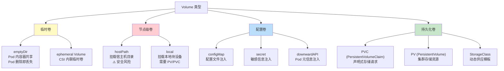

#### 7.1.2 emptyDir

emptyDir 在 Pod 被分配到节点时创建，初始内容为空。Pod 内的所有容器都可以读写同一个 emptyDir。当 Pod 从节点上删除时，emptyDir 中的数据也会被永久删除。

**典型用途**：
- Pod 内多个容器共享临时数据（如日志收集 sidecar）
- 基于内存的临时缓存（`medium: Memory`）

```yaml
apiVersion: v1
kind: Pod
metadata:
  name: emptydir-demo
spec:
  containers:
  - name: app
    image: nginx:1.25
    volumeMounts:
    - name: cache
      mountPath: /var/cache/nginx  # 应用使用缓存目录
    - name: shared-data
      mountPath: /usr/share/nginx/html  # 共享 HTML 目录
  - name: log-collector
    image: busybox:1.36
    command: ['sh', '-c', 'tail -f /var/log/nginx/access.log']
    volumeMounts:
    - name: shared-data
      mountPath: /var/log/app  # 读取应用日志
  volumes:
  - name: cache
    emptyDir:
      medium: Memory  # 使用内存（tmpfs），性能更好但消耗内存
      sizeLimit: 256Mi  # 最大 256Mi
  - name: shared-data
    emptyDir: {}  # 默认使用磁盘
```

#### 7.1.3 hostPath

hostPath 将宿主机文件系统上的文件或目录挂载到 Pod 中。

> ⚠️ **安全警告**：hostPath 存在严重的安全风险——Pod 可以访问宿主机的敏感文件（如 `/etc/shadow`、`/var/run/docker.sock`），可能被利用进行容器逃逸。在生产环境中应尽量避免使用，或者配合 Pod Security Standards 限制 hostPath 的使用。

```yaml
apiVersion: v1
kind: Pod
metadata:
  name: hostpath-demo
spec:
  containers:
  - name: node-exporter
    image: prom/node-exporter:v1.7.0
    volumeMounts:
    - name: proc
      mountPath: /host/proc
      readOnly: true
    - name: sys
      mountPath: /host/sys
      readOnly: true
  volumes:
  - name: proc
    hostPath:
      path: /proc
      type: DirectoryReadOnly  # 只读挂载
  - name: sys
    hostPath:
      path: /sys
      type: DirectoryReadOnly
```

hostPath 的 `type` 字段：

| type 值 | 行为 |
|---------|------|
| `Directory` | 必须存在一个目录 |
| `DirectoryOrCreate` | 不存在则创建（权限 0755） |
| `File` | 必须存在一个文件 |
| `FileOrCreate` | 不存在则创建（权限 0644） |
| `Socket` | 必须存在一个 Unix socket |
| `CharDevice` | 必须存在一个字符设备 |
| `BlockDevice` | 必须存在一个块设备 |

#### 7.1.4 configMap 卷

configMap 卷将 ConfigMap 中的数据作为文件挂载到 Pod 中，常用于注入配置文件。

```yaml
# 创建 ConfigMap
apiVersion: v1
kind: ConfigMap
metadata:
  name: nginx-config
data:
  nginx.conf: |
    user nginx;
    worker_processes auto;
    events {
        worker_connections 1024;
    }
    http {
        server {
            listen 80;
            location / {
                proxy_pass http://backend:8080;
            }
        }
    }
  mime.types: |
    types {
        text/html html htm;
        text/css css;
        application/javascript js;
    }
---
# 在 Pod 中使用 ConfigMap
apiVersion: v1
kind: Pod
metadata:
  name: configmap-demo
spec:
  containers:
  - name: nginx
    image: nginx:1.25
    volumeMounts:
    - name: config
      mountPath: /etc/nginx/nginx.conf
      subPath: nginx.conf  # 仅挂载单个文件，不覆盖目录
    - name: config
      mountPath: /etc/nginx/mime.types
      subPath: mime.types
    env:
    - name: WORKER_PROCESSES
      valueFrom:
        configMapKeyRef:
          name: nginx-config
          key: worker_processes  # 也可以作为环境变量使用
  volumes:
  - name: config
    configMap:
      name: nginx-config
      defaultMode: 0644  # 文件权限
      # 可选：自动热更新（挂载目录时生效，subPath 不支持热更新）
```

#### 7.1.5 PVC 卷

在 Pod 中直接通过 PVC（PersistentVolumeClaim）引用持久化存储：

```yaml
apiVersion: v1
kind: Pod
metadata:
  name: pvc-demo
spec:
  containers:
  - name: app
    image: nginx:1.25
    volumeMounts:
    - name: data
      mountPath: /data
  volumes:
  - name: data
    persistentVolumeClaim:
      claimName: my-pvc  # 引用 PVC
```

---

### 7.2 持久化存储：PV/PVC/StorageClass

#### 7.2.1 PV/PVC 模型

PV（PersistentVolume）和 PVC（PersistentVolumeClaim）是 Kubernetes 持久化存储的两个核心抽象。PV 是集群级别的存储资源，PVC 是命名空间级别的存储请求。它们的关系就像"节点"和"Pod"——PVC 消费 PV，Pod 消费 Node。

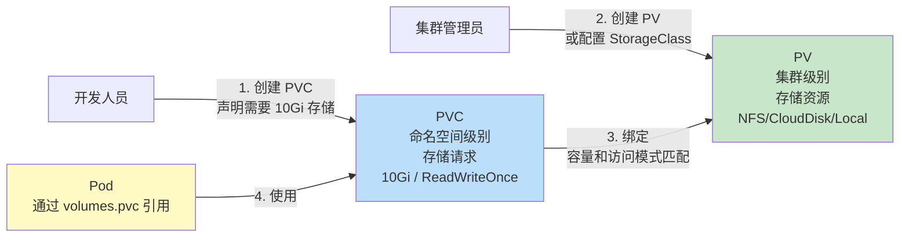

**PV 关键字段**：

```yaml
apiVersion: v1
kind: PersistentVolume
metadata:
  name: pv-nfs-001
spec:
  capacity:
    storage: 50Gi  # 存储容量
  volumeMode: Filesystem  # Filesystem 或 Block
  accessModes:
  - ReadWriteOnce   # RWO: 单节点读写
  - ReadOnlyMany    # ROX: 多节点只读
  # - ReadWriteMany  # RWX: 多节点读写（需要存储后端支持）
  persistentVolumeReclaimPolicy: Retain  # Retain/Delete/Recycle
  storageClassName: nfs-standard  # 对应 StorageClass
  mountOptions:
  - hard
  - nfsvers=4.1
  nfs:
    server: 10.0.0.100
    path: /data/pv001
```

**PVC 关键字段**：

```yaml
apiVersion: v1
kind: PersistentVolumeClaim
metadata:
  name: my-pvc
  namespace: default
spec:
  accessModes:
  - ReadWriteOnce
  resources:
    requests:
      storage: 10Gi  # 请求 10Gi
  storageClassName: nfs-standard  # 指定 StorageClass
  selector:  # 可选：进一步筛选 PV
    matchLabels:
      environment: production
```

**PV 生命周期阶段**：

| 阶段 | 说明 |
|------|------|
| `Available` | 可用，尚未绑定到 PVC |
| `Bound` | 已绑定到 PVC |
| `Released` | PVC 已删除，但 PV 上的回收策略不是 Delete |
| `Failed` | 自动回收失败 |

**回收策略**：

| 策略 | 行为 | 适用场景 |
|------|------|----------|
| `Retain` | PVC 删除后，PV 保留数据和状态（Released），需手动清理 | 生产环境，数据安全 |
| `Delete` | PVC 删除后，PV 和底层存储一起删除 | 动态供应的云硬盘 |
| `Recycle`（已弃用） | 执行 `rm -rf /volume/*` 后 PV 变为 Available | 旧版本兼容 |

#### 7.2.2 StorageClass 与动态供应

StorageClass 是存储的"类模板"，定义了存储的类型和供应参数。当 PVC 指定 StorageClass 且集群中无匹配的 Available PV 时，K8s 会自动调用 StorageClass 中指定的 Provisioner（供应器）动态创建 PV。

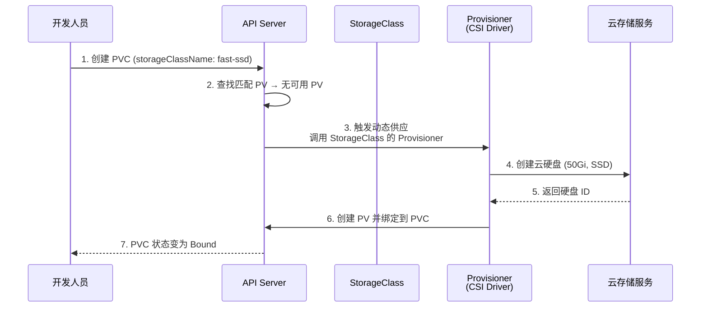

**StorageClass YAML 示例**：

```yaml
# AWS EBS StorageClass
apiVersion: storage.k8s.io/v1
kind: StorageClass
metadata:
  name: fast-ssd
provisioner: ebs.csi.aws.com  # CSI 驱动
parameters:
  type: gp3  # EBS 卷类型
  iops: "5000"
  throughput: "250"
  encrypted: "true"
reclaimPolicy: Delete  # PVC 删除时自动删除云硬盘
volumeBindingMode: WaitForFirstConsumer  # 延迟绑定，直到 Pod 调度后再创建
allowVolumeExpansion: true  # 允许扩容
---
# NFS StorageClass（需要 nfs-subdir-external-provisioner）
apiVersion: storage.k8s.io/v1
kind: StorageClass
metadata:
  name: nfs-standard
provisioner: nfs.csi.k8s.io
parameters:
  server: 10.0.0.100
  share: /data/nfs
  subDir: ${pvc.metadata.namespace}/${pvc.metadata.name}
reclaimPolicy: Retain
volumeBindingMode: Immediate
---
# 本地存储 StorageClass
apiVersion: storage.k8s.io/v1
kind: StorageClass
metadata:
  name: local-storage
provisioner: kubernetes.io/no-provisioner  # 本地存储不支持动态供应
reclaimPolicy: Retain
volumeBindingMode: WaitForFirstConsumer  # 必须延迟绑定
```

**volumeBindingMode 详解**：

- `Immediate`：PVC 创建后立即绑定/供应 PV，不考虑 Pod 的调度位置。可能导致 PV 创建在节点 A，但 Pod 被调度到节点 B，对于本地存储这种节点绑定的场景就会出问题。
- `WaitForFirstConsumer`：延迟绑定，直到使用该 PVC 的 Pod 被调度后，才根据 Pod 所在节点创建/绑定 PV。这对于本地存储和需要感知 Pod 调度位置的云硬盘非常关键。

```bash
# 查看 StorageClass
kubectl get storageclass

# 查看 PVC 状态
kubectl get pvc -A

# 查看 PV 状态
kubectl get pv

# 扩容 PVC
kubectl patch pvc my-pvc -p '{"spec":{"resources":{"requests":{"storage":"20Gi"}}}}'

# 查看 PV 详细信息
kubectl describe pv <pv-name>
```

---

### 7.3 CSI（Container Storage Interface）架构

#### 7.3.1 CSI 设计与架构

CSI（Container Storage Interface）是 Kubernetes 定义的存储接口标准，类似于 CNI 之于网络、CRI 之于容器运行时。CSI 将存储驱动的实现从 Kubernetes 核心代码中解耦出来，使得存储厂商可以独立开发和发布自己的 CSI 驱动，无需修改 K8s 源码。

**CSI 架构**：

```mermaid
flowchart TD
    subgraph "Kubernetes 控制平面"
        API[API Server]
        PVC_CTRL[PVC Controller<br/>绑定/供应 PV]
        ATT_CTRL[Attach Controller<br/>将卷挂载到节点]
    end
    
    subgraph "CSI Sidecar Containers（由 K8s 部署）"
        PROV["external-provisioner<br/>监听 PVC，调用 CSI<br/>CreateVolume/DeleteVolume"]
        ATT["external-attacher<br/>监听 VolumeAttachment，调用 CSI<br/>ControllerPublish/UnpublishVolume"]
        RES["external-resizer<br/>监听 PVC 扩容，调用 CSI<br/>ControllerExpandVolume"]
        SNAP["external-snapshotter<br/>监听 VolumeSnapshot，调用 CSI<br/>CreateSnapshot/DeleteSnapshot"]
    end
    
    subgraph "CSI Driver（存储厂商实现）"
        CTRL["CSI Controller Service<br/>Node: 控制平面节点<br/>CreateVolume, DeleteVolume<br/>ControllerPublishVolume<br/>ControllerExpandVolume"]
        NODE_SVC["CSI Node Service<br/>Node: 每个工作节点<br/>NodeStageVolume<br/>NodePublishVolume<br/>NodeExpandVolume"]
    end
    
    subgraph "存储后端"
        STORAGE[NFS / Cloud Disk / Ceph / LVM / ...]
    end
    
    PVC_CTRL --> PROV
    ATT_CTRL --> ATT
    PROV --> CTRL
    ATT --> CTRL
    RES --> CTRL
    SNAP --> CTRL
    CTRL --> STORAGE
    
    KUBELET[kubelet] --> NODE_SVC
    NODE_SVC --> STORAGE
    
    style CTRL fill:#c8e6c9
    style NODE_SVC fill:#bbdefb
    style STORAGE fill:#fff9c4
```

**CSI 核心接口（gRPC）**：

| 接口 | 服务 | 作用 |
|------|------|------|
| `CreateVolume` | Controller | 创建存储卷 |
| `DeleteVolume` | Controller | 删除存储卷 |
| `ControllerPublishVolume` | Controller | 将卷挂载到节点（Attach） |
| `ControllerUnpublishVolume` | Controller | 将卷从节点卸载（Detach） |
| `ControllerExpandVolume` | Controller | 扩容存储卷 |
| `CreateSnapshot` | Controller | 创建快照 |
| `NodeStageVolume` | Node | 将卷挂载到节点的暂存目录（Stage） |
| `NodePublishVolume` | Node | 将卷绑定挂载到 Pod 目录（Publish/Mount） |
| `NodeExpandVolume` | Node | 节点端扩容（resize文件系统） |

**卷的挂载流程（Attach → Stage → Publish）**：

```
1. Attach: 将远程存储卷连接到目标节点
   - 云硬盘：将 EBS/CBS 卷挂载到 EC2/CVM 实例
   - 网络存储：建立网络连接
   - 本地存储：无需 Attach

2. Stage: 将卷挂载到节点的全局暂存目录
   - 目标: /var/lib/kubelet/plugins/kubernetes.io/csi/pv/<pv-name>/globalmount
   - 对于块设备：格式化文件系统
   - 对于 NFS：mount 到全局目录

3. Publish: 将全局目录 bind mount 到 Pod 的特定目录
   - 目标: /var/lib/kubelet/pods/<pod-uid>/volumes/kubernetes.io~csi/<pv-name>/mount
   - 使用 bind mount 实现同一个卷可以被多个 Pod 共享
```

```bash
# 查看 CSI Driver
kubectl get csidriver

# 查看 CSI Driver 详情
kubectl describe csidriver <driver-name>

# 查看 CSI Pod
kubectl get pods -n kube-system | grep csi

# 查看 VolumeAttachment（Attach 状态）
kubectl get volumeattachment

# 查看节点上的挂载信息
ls /var/lib/kubelet/plugins/kubernetes.io/csi/
ls /var/lib/kubelet/pods/
```

---

### 7.4 本地存储 LVM 方案

#### 7.4.1 HostPath 和 LocalVolume 的局限性

在许多生产场景中，应用需要高性能的本地存储（如数据库、消息队列、日志系统）。Kubernetes 原生提供的 HostPath 和 Local Volume 存在严重的局限性：

| 局限性 | HostPath | Local Volume | 影响 |
|--------|----------|--------------|------|
| **生命周期管理** | ❌ 无 | 部分（静态 PV） | Pod 删除后数据残留，需要手动清理 |
| **容量隔离** | ❌ 无 | ❌ 无 | 一个应用可能写满整个磁盘，影响其他应用 |
| **IOPS 限制** | ❌ 无 | ❌ 无 | 一个应用可能耗尽磁盘 IOPS，影响其他应用 |
| **动态供应** | ❌ 不支持 | ❌ 不支持 | 必须手动创建 PV，运维成本高 |
| **目录隔离** | ❌ 弱 | ✅ 有 | HostPath 可能覆盖宿主机重要文件 |
| **调度感知** | ❌ 无 | ✅ 有 | Local Volume 通过 PV 的 nodeAffinity 感知调度 |
| **扩容** | ❌ 不支持 | ❌ 不支持 | 存储空间不足时无法在线扩容 |
| **快照** | ❌ 不支持 | ❌ 不支持 | 无法进行数据备份和恢复 |

**HostPath 的问题**：

```yaml
# HostPath 的典型问题示例
apiVersion: v1
kind: Pod
metadata:
  name: hostpath-problems
spec:
  containers:
  - name: app
    image: myapp
    volumeMounts:
    - name: data
      mountPath: /data
  volumes:
  - name: data
    hostPath:
      path: /data/app-data  # 问题1: 无容量限制，可能写满磁盘
      type: DirectoryOrCreate
  # 问题2: Pod 重建后可能调度到不同节点，数据丢失
  # 问题3: 多个 Pod 使用相同 hostPath，数据冲突
  # 问题4: Pod 删除后 /data/app-data 残留，造成磁盘空间浪费
```

**Local Volume 的局限**：

```yaml
# Local Volume 必须手动创建 PV
apiVersion: v1
kind: PersistentVolume
metadata:
  name: local-pv-001
spec:
  capacity:
    storage: 100Gi  # 静态声明，无法动态调整
  volumeMode: Filesystem
  accessModes:
  - ReadWriteOnce
  persistentVolumeReclaimPolicy: Delete  # Delete 后数据仍然残留
  storageClassName: local-storage
  local:
    path: /mnt/disks/ssd1  # 必须预先格式化并挂载
  nodeAffinity:
    required:
      nodeSelectorTerms:
      - matchExpressions:
        - key: kubernetes.io/hostname
          operator: In
          values:
          - node-01  # 绑定到特定节点
```

#### 7.4.2 LVM 数据卷方案

LVM（Logical Volume Manager）是 Linux 内核提供的逻辑卷管理器，它将物理磁盘（PV, Physical Volume）组织成卷组（VG, Volume Group），再从卷组中划分逻辑卷（LV, Logical Volume）。基于 LVM 的 K8s 存储方案可以完美解决 HostPath 和 Local Volume 的局限性。

**LVM 数据卷方案架构**：

```mermaid
flowchart TD
    subgraph "物理层"
        SSD1["/dev/nvme0n1<br/>SSD 1TB"]
        SSD2["/dev/nvme1n1<br/>SSD 1TB"]
        HDD1["/dev/sda<br/>HDD 2TB"]
    end
    
    subgraph "LVM 层"
        PV1["PV (Physical Volume)<br/>/dev/nvme0n1"]
        PV2["PV (Physical Volume)<br/>/dev/nvme1n1"]
        PV3["PV (Physical Volume)<br/>/dev/sda"]
        
        VG_SSD["VG: vg-ssd<br/>总容量: 2TB<br/>可用: 1.5TB"]
        VG_HDD["VG: vg-hdd<br/>总容量: 2TB<br/>可用: 1.8TB"]
        
        LV1["LV: pvc-abc123<br/>50Gi<br/>IOPS: 3000"]
        LV2["LV: pvc-def456<br/>100Gi<br/>IOPS: 5000"]
        LV3["LV: pvc-ghi789<br/>200Gi<br/>IOPS: 1000"]
    end
    
    subgraph "K8s CSI 层"
        CSI["LVM CSI Driver<br/>自动创建/删除 LV<br/>自动挂载/卸载<br/>容量隔离 + IOPS 限制"]
        SC1["StorageClass: ssd-lvm<br/>vgName: vg-ssd"]
        SC2["StorageClass: hdd-lvm<br/>vgName: vg-hdd"]
    end
    
    SSD1 --> PV1 --> VG_SSD
    SSD2 --> PV2 --> VG_SSD
    HDD1 --> PV3 --> VG_HDD
    
    VG_SSD --> LV1
    VG_SSD --> LV2
    VG_HDD --> LV3
    
    LV1 --> CSI
    LV2 --> CSI
    LV3 --> CSI
    
    CSI --> SC1
    CSI --> SC2
    
    style VG_SSD fill:#c8e6c9
    style VG_HDD fill:#bbdefb
    style CSI fill:#fff9c4
```

**LVM 数据卷方案的核心能力**：

1. **自动创建/删除**：CSI Driver 监听 PVC 创建/删除事件，自动调用 `lvcreate`/`lvremove` 创建/删除逻辑卷，无需手动管理 PV。

2. **自动挂载/卸载**：在 `NodeStageVolume` 中将 LV 格式化并挂载到全局目录，在 `NodePublishVolume` 中 bind mount 到 Pod 目录；删除时自动卸载。

3. **容量隔离**：每个 PVC 对应一个独立的 LV，LV 大小由 PVC 的 `resources.requests.storage` 决定，无法超出分配容量。

4. **IOPS 限制**：通过 cgroup blkio 或 device mapper 的 `thin-provision` 配合 IOPS 限流，防止单个应用耗尽磁盘 IOPS。

5. **集群容量感知**：CSI Driver 在创建 LV 前检查 VG 的剩余空间，如果空间不足则返回错误，避免超卖。

6. **在线扩容**：支持 PVC 在线扩容，通过 `lvextend` + `resize2fs/xfs_growfs` 实现。

**StorageClass 配置示例**：

```yaml
apiVersion: storage.k8s.io/v1
kind: StorageClass
metadata:
  name: ssd-lvm
provisioner: lvm.csi.k8s.io  # LVM CSI Driver
parameters:
  vgName: vg-ssd  # 使用的卷组名称
  fsType: ext4  # 文件系统类型
  # IOPS 限制（可选）
  iopsLimit: "3000"  # 每个 LV 的 IOPS 上限
  # 条带化配置（可选，提升性能）
  stripe: "2"  # 条带数量
  stripeSize: "64"  # 条带大小 (KB)
reclaimPolicy: Delete
volumeBindingMode: WaitForFirstConsumer  # 延迟绑定，感知调度
allowVolumeExpansion: true  # 允许在线扩容
---
apiVersion: storage.k8s.io/v1
kind: StorageClass
metadata:
  name: hdd-lvm
provisioner: lvm.csi.k8s.io
parameters:
  vgName: vg-hdd
  fsType: xfs
  iopsLimit: "500"
reclaimPolicy: Delete
volumeBindingMode: WaitForFirstConsumer
allowVolumeExpansion: true
```

**使用示例**：

```yaml
# 创建 PVC
apiVersion: v1
kind: PersistentVolumeClaim
metadata:
  name: mysql-data
spec:
  accessModes:
  - ReadWriteOnce
  storageClassName: ssd-lvm
  resources:
    requests:
      storage: 50Gi
---
# 在 Pod 中使用
apiVersion: v1
kind: Pod
metadata:
  name: mysql
spec:
  containers:
  - name: mysql
    image: mysql:8.0
    volumeMounts:
    - name: data
      mountPath: /var/lib/mysql
    env:
    - name: MYSQL_ROOT_PASSWORD
      value: "password"
  volumes:
  - name: data
    persistentVolumeClaim:
      claimName: mysql-data
```

#### 7.4.3 flexvolume vs CSI

Kubernetes 存储插件的演进经历了从 in-tree → flexvolume → CSI 三个阶段：

| 对比项 | in-tree | flexvolume | CSI |
|--------|---------|------------|-----|
| **实现位置** | K8s 源码内 | 宿主机可执行文件 | 独立容器（gRPC） |
| **K8s 版本** | 所有版本 | K8s 1.2+ | K8s 1.13+（GA） |
| **开发语言** | Go | 任意语言（shell/python/go） | 任意语言（gRPC） |
| **动态供应** | ✅ | ❌（需要 external-provisioner） | ✅ |
| **扩容** | 部分 | ❌ | ✅ |
| **快照** | 部分 | ❌ | ✅ |
| **维护者** | K8s 社区 | 存储厂商 | 存储厂商 |
| **状态** | 逐步迁移到 CSI | **已弃用** | **推荐** |

**美团 LVM 存储方案的演进**：

- **K8s 1.11 时期**：CSI 尚未 GA（1.13 才 GA），美团基于 flexvolume 实现了第一版 LVM 存储方案。flexvolume 的方式是在每个节点上部署一个可执行文件，kubelet 调用该文件完成卷的挂载/卸载操作。动态供应需要额外部署 external-provisioner。

- **K8s 1.16+ 时期**：CSI 正式稳定，美团将 LVM 存储方案从 flexvolume 迁移到 CSI。CSI 的标准化接口和丰富的 sidecar 容器生态（provisioner、attacher、resizer、snapshotter）大幅简化了开发工作量。

```bash
# flexvolume 遗留部署方式（K8s 1.11）
# 可执行文件位置: /usr/libexec/kubernetes/kubelet-plugins/volume/exec/lvm~lvm/lvm
# 实现 mount/unmount/attach/detach 等命令

# CSI 部署方式（K8s 1.16+）
# Controller Service: Deployment，运行在控制平面节点
kubectl get deploy -n kube-system lvm-csi-controller

# Node Service: DaemonSet，运行在每个工作节点
kubectl get ds -n kube-system lvm-csi-node

# 查看节点上的 VG 容量
vgs
# 输出示例：
# VG      #PV #LV #SN Attr   VSize   VFree
# vg-ssd    2  10   0 wz--n-  1.99t   500.00g
# vg-hdd    1   5   0 wz--n-  2.00t  1200.00g

# 查看逻辑卷
lvs
# 输出示例：
# LV         VG      Attr       LSize   Pool Origin Data%  Meta%
# pvc-abc123 vg-ssd  -wi-a-----  50.00g                    
# pvc-def456 vg-ssd  -wi-a----- 100.00g                    
# pvc-ghi789 vg-hdd  -wi-a----- 200.00g
```

#### 7.4.4 本地存储注意事项

> ⚠️ **核心风险：本地存储不具备高可用性**

本地存储的数据存储在宿主机的本地磁盘上，一旦宿主机发生故障（硬件故障、内核崩溃、断电等），数据将不可访问甚至永久丢失。这与云硬盘/网络存储（数据持久性 99.9999999%，即"9 个 9"）形成鲜明对比。

**适用场景与不适用场景**：

| 场景 | 是否适用本地存储 | 原因 |
|------|------------------|------|
| MySQL 主库数据 | ❌ 不适用 | 数据丢失不可接受 |
| MySQL 从库数据 | ⚠️ 有条件适用 | 从库可从主库重建，但重建时间较长 |
| Redis 缓存 | ✅ 适用 | 缓存数据可丢失，从后端数据库重建 |
| Kafka 日志 | ⚠️ 有条件适用 | 多副本保证可用性，但需配置 `min.insync.replicas` |
| 日志采集 sidecar | ✅ 适用 | emptyDir 即可，数据无需持久化 |
| 机器学习训练数据 | ✅ 适用 | 训练数据可从对象存储重新拉取 |
| Elasticsearch 数据 | ⚠️ 有条件适用 | 多分片+多副本，但节点故障会触发分片迁移 |
| 临时构建缓存 | ✅ 适用 | CI/CD 构建缓存，丢失无影响 |

**本地存储的数据保护策略**：

1. **应用层多副本**：如 Kafka 的 `replication.factor=3`、Redis Cluster 的多分片多副本
2. **定期备份**：通过 CronJob 定期将关键数据备份到对象存储（S3/COS）或网络存储
3. **机架感知调度**：确保同一应用的不同副本分布在不同机架上，避免单机架故障
4. **监控告警**：监控磁盘使用率、IOPS、延迟等指标，提前预警
5. **快速恢复机制**：自动化数据重建流程，缩短恢复时间

---

### 7.5 云硬盘存储

#### 7.5.1 云硬盘特性

云硬盘（Cloud Block Storage）是云厂商提供的高可靠、高性能块存储服务。与本地存储相比，云硬盘具有以下核心优势：

**数据持久性 9 个 9**：

云硬盘的数据持久性为 99.9999999%（9 个 9），这意味着存储 1 亿个文件，每年仅有 0.1 个文件可能丢失。这个可靠性是通过以下技术实现的：

```
数据写入流程：
1. 数据写入主副本
2. 同时写入两个备副本（三副本机制）
3. 三个副本确认写入成功后才返回写入完成
4. 如果某个副本写入失败，自动在新位置重建副本

数据恢复：
- 某个副本所在磁盘故障时，自动从其他副本重建
- 数据重建速度可达 100MB/s，1TB 数据约 3 小时恢复
- 重建期间数据仍然可用（读取其他副本）
```

```mermaid
flowchart TD
    WRITE["数据写入请求"] --> R1["副本 1<br/>可用区 A<br/>磁盘 1"]
    WRITE --> R2["副本 2<br/>可用区 A<br/>磁盘 2"]
    WRITE --> R3["副本 3<br/>可用区 A<br/>磁盘 3"]
    
    R1 --> ACK1["ACK ✅"]
    R2 --> ACK2["ACK ✅"]
    R3 --> ACK3["ACK ✅"]
    
    ACK1 --> SUCCESS["写入成功 ✅<br/>三副本确认"]
    ACK2 --> SUCCESS
    ACK3 --> SUCCESS
    
    R1 -.-x|"磁盘1故障"| FAIL["副本1不可用"]
    FAIL -->|"自动重建<br/>从副本2/3恢复"| R1_NEW["副本 1 (重建)<br/>磁盘 4"]
    
    style SUCCESS fill:#c8e6c9
    style FAIL fill:#ffcdd2
```

#### 7.5.2 PVC 跨节点挂载

云硬盘的一个重要特性是支持跨节点挂载——当 Pod 从节点 A 迁移到节点 B 时，云硬盘可以从节点 A 卸载（Detach），然后挂载到节点 B（Attach），数据不会丢失。

**跨节点挂载流程**：

```mermaid
sequenceDiagram
    participant K as kubelet (Node B)
    participant API as API Server
    participant ATT as external-attacher
    participant CSI as CSI Controller
    participant Cloud as 云存储服务
    
    Note over K,Cloud: Pod 从 Node A 迁移到 Node B
    
    K->>API: 1. Pod 调度到 Node B
    API->>ATT: 2. VolumeAttachment 变化<br/>需要 Attach 到 Node B
    ATT->>CSI: 3. ControllerUnpublishVolume<br/>从 Node A Detach
    CSI->>Cloud: 4. Detach 云硬盘 from Node A
    Cloud-->>CSI: 5. Detach 成功
    CSI->>Cloud: 6. Attach 云硬盘 to Node B
    Cloud-->>CSI: 7. Attach 成功
    CSI-->>ATT: 8. 操作成功
    ATT->>API: 9. 更新 VolumeAttachment 状态
    K->>CSI: 10. NodeStageVolume<br/>格式化 + 挂载到全局目录
    K->>CSI: 11. NodePublishVolume<br/>Bind mount 到 Pod 目录
    K->>K: 12. 启动容器
```

**关键注意事项**：

1. **云硬盘是节点级资源，不是集群级资源**：同一块云硬盘同一时刻只能挂载到一个节点（RWO - ReadWriteOnce）。如果需要多节点同时读写，需要使用支持 RWX（ReadWriteMany）的存储方案（如 NFS、CephFS）。

2. **Attach/Detach 耗时**：云硬盘的 Attach/Detach 操作通常需要 5-30 秒，这意味着 Pod 迁移时会有短暂的数据不可用窗口。

3. **跨可用区挂载**：大多数云厂商的云硬盘不支持跨可用区挂载。如果 Pod 从可用区 A 的节点迁移到可用区 B 的节点，需要使用跨可用区复制功能或在可用区 B 创建新的云硬盘。

4. **强制卸载风险**：如果 Node A 突然不可达（如断电），云硬盘可能无法正常 Detach。此时需要使用"强制卸载"功能，但可能导致数据不一致。

```yaml
# 云硬盘 PVC 示例
apiVersion: v1
kind: PersistentVolumeClaim
metadata:
  name: mysql-data-cloud
  namespace: default
spec:
  accessModes:
  - ReadWriteOnce  # 云硬盘仅支持 RWO
  storageClassName: cloud-ssd  # 云硬盘 StorageClass
  resources:
    requests:
      storage: 200Gi
---
# StorageClass 示例（AWS EBS）
apiVersion: storage.k8s.io/v1
kind: StorageClass
metadata:
  name: cloud-ssd
provisioner: ebs.csi.aws.com
parameters:
  type: gp3
  iops: "10000"
  throughput: "500"
  encrypted: "true"
  kmsKeyId: "arn:aws:kms:us-east-1:123456789:key/xxx"
reclaimPolicy: Delete
volumeBindingMode: WaitForFirstConsumer  # 延迟绑定，感知 Pod 调度位置
allowVolumeExpansion: true
```

```bash
# 查看云硬盘状态
kubectl get pv -o wide

# 查看 VolumeAttachment（了解云硬盘挂载到哪个节点）
kubectl get volumeattachment

# 手动扩容云硬盘 PVC
kubectl patch pvc mysql-data-cloud -p '{"spec":{"resources":{"requests":{"storage":"400Gi"}}}}'

# 查看扩容进度
kubectl describe pvc mysql-data-cloud | grep -A5 Conditions

# 强制卸载卡住的云硬盘（谨慎使用！）
# 需要在云厂商控制台操作，或使用云 CLI
# aws ec2 detach-volume --volume-id vol-xxx --force
```

> **美团实践**：美团的数据库服务（MySQL 主库、Redis 持久化等）运行在 K8s 上，使用云硬盘作为持久化存储。通过 `WaitForFirstConsumer` 延迟绑定策略，确保云硬盘创建在与 Pod 相同的可用区，避免跨可用区挂载的问题。对于跨可用区容灾需求，采用 MySQL 主从复制 + 跨可用区从库的方案，而非依赖云硬盘的跨区能力。在云硬盘的 IOPS 配置上，根据业务类型选择不同的存储等级——核心交易链路使用最高性能的 SSD 云硬盘（IOPS > 20000），普通业务使用标准 SSD（IOPS ≈ 5000），日志类服务使用高效云盘（IOPS ≈ 2000）。

---

### 附录：关键命令速查表

```bash
# ============ 调度相关 ============
# 查看节点污点
kubectl describe node <node> | grep Taints

# 标记节点不可调度
kubectl cordon <node>

# 驱逐节点上的所有 Pod
kubectl drain <node> --ignore-daemonsets --delete-emptydir-data

# 解除不可调度标记
kubectl uncordon <node>

# 查看调度事件
kubectl get events -A --field-selector reason=FailedScheduling

# 查看 PriorityClass
kubectl get priorityclasses

# ============ 网络相关 ============
# 查看 Service 和 Endpoints
kubectl get svc,endpoints -A

# 查看 IPVS 规则
ipvsadm -Ln

# 查看 iptables NAT 规则
iptables -t nat -L KUBE-SERVICES -n

# 查看 CoreDNS 配置
kubectl get configmap coredns -n kube-system -o yaml

# 测试 Pod 间网络连通性
kubectl run test-net --image=busybox:1.36 --rm -it --restart=Never -- \
  wget -qO- --timeout=2 http://<target-service>:<port>

# 查看 NetworkPolicy
kubectl get networkpolicy -A

# ============ 存储相关 ============
# 查看 PV/PVC
kubectl get pv,pvc -A

# 查看 StorageClass
kubectl get storageclass

# 查看 CSI Driver
kubectl get csidriver

# 查看 VolumeAttachment
kubectl get volumeattachment

# 扩容 PVC
kubectl patch pvc <pvc-name> -p '{"spec":{"resources":{"requests":{"storage":"<new-size>"}}}}'

# 查看 LVM 卷组信息（在节点上执行）
vgs

# 查看 LVM 逻辑卷信息（在节点上执行）
lvs
```

---

> **本部分小结**：调度、网络、存储是 Kubernetes 三大核心子系统。调度器通过"预选-优选"两阶段机制将 Pod 分配到最合适的节点，亲和性/污点/优先级/拓扑分布等策略提供了丰富的调度控制手段；网络模型遵循"每个 Pod 唯一 IP、扁平网络"的设计原则，CNI 插件实现了具体的网络方案；存储体系从简单的 Volume 到 PV/PVC/StorageClass 再到 CSI 标准，提供了从临时存储到持久化存储的完整解决方案。理解这三大子系统的原理和交互方式，是深入掌握 Kubernetes 的关键。
