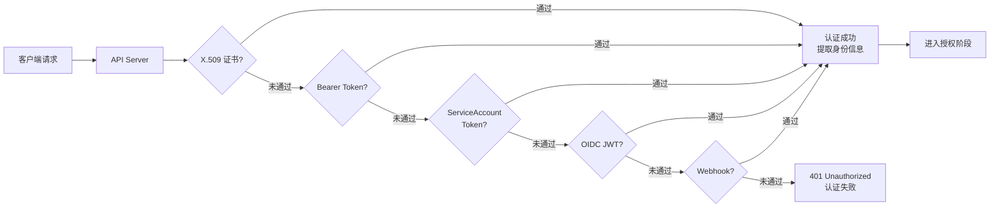
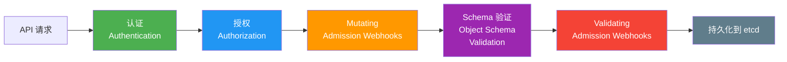
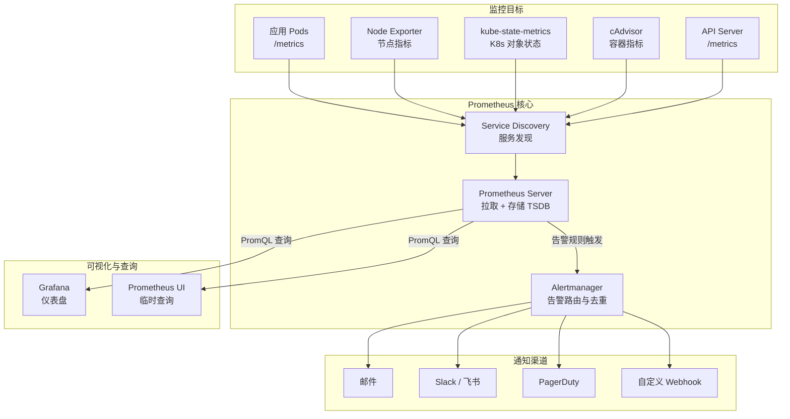
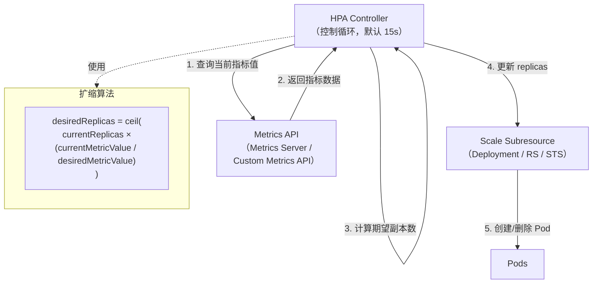
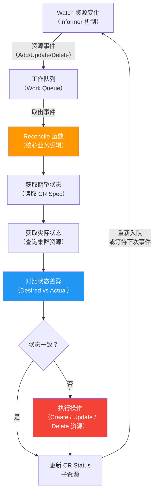

## 第八章：安全体系

Kubernetes 安全体系遵循**纵深防御**原则，从 API 请求入口到 Pod 运行时，层层设防。每一个到达 API Server 的请求都必须经历认证（Authentication）、授权（Authorization）、准入控制（Admission Control）三道关卡，才能最终被持久化到 etcd 中。本章将逐一剖析这三道关卡的实现机制，并深入讨论 Pod 运行时安全与网络安全策略。

---

### 8.1 认证（Authentication）

认证回答的核心问题是**"你是谁？"**。Kubernetes API Server 支持多种认证机制，可以同时启用多个认证模块，任何一个模块认证成功即可通过。

#### 8.1.1 X.509 客户端证书

这是 Kubernetes 集群内部组件（kubelet、kube-proxy、controller-manager、scheduler）之间通信的默认认证方式。API Server 启动时通过 `--client-ca-file` 指定 CA 证书，任何由该 CA 签发的客户端证书都被信任。证书中的 **Common Name（CN）** 被用作用户名，**Organization（O）** 被用作用户所属的组。

例如，一个 CN 为 `system:kube-scheduler`、O 为 `system:kube-scheduler` 的证书，表示该请求来自调度器组件。集群初始化工具（如 kubeadm）会自动为各核心组件生成对应的证书和 kubeconfig 文件。

#### 8.1.2 Bearer Token

Bearer Token 认证通过在 HTTP 请求的 `Authorization` 头中携带 `Bearer <token>` 来完成身份识别。API Server 通过 `--token-auth-file` 加载一个静态 Token 文件（CSV 格式，包含 token、用户名、UID 和可选的组信息），或者通过 Bootstrap Token 机制支持节点加入集群时的临时认证。静态 Token 文件的缺点是修改后需要重启 API Server，因此生产环境中较少使用。

#### 8.1.3 ServiceAccount

ServiceAccount 是 Kubernetes 原生的、专为 **Pod 内进程** 设计的身份机制。每个 Namespace 都会自动创建一个名为 `default` 的 ServiceAccount。当 Pod 没有显式指定 ServiceAccount 时，就使用 `default`。

ServiceAccount 对应的 Token 会被自动挂载到 Pod 内的 `/var/run/secrets/kubernetes.io/serviceaccount/token` 路径。从 Kubernetes 1.24 开始，系统不再自动为 ServiceAccount 创建永久的 Secret Token，而是通过 **TokenRequest API** 动态签发有时效性的、绑定受众（audience-bound）的短期 Token，安全性大幅提升。

```yaml
apiVersion: v1
kind: ServiceAccount
metadata:
  name: my-app-sa
  namespace: production
automountServiceAccountToken: true  # 默认为true，安全场景可设为false
---
apiVersion: v1
kind: Pod
metadata:
  name: my-app
  namespace: production
spec:
  serviceAccountName: my-app-sa
  containers:
    - name: app
      image: my-app:v1
      volumeMounts:
        - name: token-vol
          mountPath: /var/run/secrets/tokens
  volumes:
    - name: token-vol
      projected:
        sources:
          - serviceAccountToken:
              path: my-app-token
              expirationSeconds: 3600    # Token 有效期1小时
              audience: my-api-server    # 绑定受众
```

#### 8.1.4 OpenID Connect（OIDC）

OIDC 是企业级集群中最主流的用户认证方案，适合与公司已有的身份提供商（IdP）集成，如 Keycloak、Dex、Azure AD、Google Identity 等。其工作流程是：用户先通过 IdP 完成登录获取 ID Token（JWT 格式），然后将该 Token 作为 Bearer Token 发送给 API Server。API Server 通过配置的 OIDC 参数（`--oidc-issuer-url`、`--oidc-client-id`、`--oidc-username-claim` 等）验证 JWT 的签名和有效期，并从中提取用户身份信息。OIDC 的优势在于无需在 API Server 上存储任何用户凭据，身份管理完全由外部 IdP 负责。

#### 8.1.5 Webhook Token 认证

当内置认证机制都不能满足需求时，可以通过 `--authentication-token-webhook-config-file` 配置一个外部的 Webhook 服务。API Server 将收到的 Token 封装为 `TokenReview` 对象发送给 Webhook 服务，Webhook 服务返回认证结果（是否通过、用户名、组信息等）。这种方式提供了最大的灵活性，可以对接任何自定义的认证后端。

#### 8.1.6 认证流程总览



> **关键原则：** 认证模块是**链式执行**的，只要有一个模块认证成功就通过，全部失败才拒绝。认证阶段只关心"你是谁"，不关心"你能做什么"——后者由授权阶段负责。

---

### 8.2 授权——RBAC 详解

认证通过后，API Server 需要判断**"你能做什么？"**。Kubernetes 支持多种授权模式，其中 **RBAC（Role-Based Access Control，基于角色的访问控制）** 是最主流、最推荐的方式。RBAC 在 Kubernetes 1.8 后成为默认启用的授权模式。

#### 8.2.1 RBAC 核心概念

RBAC 的设计围绕四个核心资源对象展开：

**Role 和 ClusterRole** 定义了**权限集合**——即"可以对哪些资源执行哪些操作"。Role 的作用域限定在某个 Namespace 内，而 ClusterRole 的作用域是整个集群。ClusterRole 除了可以管理 Namespace 级别的资源外，还可以管理集群级别的资源（如 Node、PersistentVolume）和非资源端点（如 `/healthz`）。

**RoleBinding 和 ClusterRoleBinding** 将权限（Role/ClusterRole）与**主体（Subject）** 绑定。主体可以是 User、Group 或 ServiceAccount。RoleBinding 将权限授予到特定 Namespace，而 ClusterRoleBinding 将权限授予到整个集群。一个巧妙的用法是：RoleBinding 可以引用 ClusterRole，这样同一个 ClusterRole 可以在不同的 Namespace 中被复用，而不需要在每个 Namespace 中都创建相同的 Role。

#### 8.2.2 完整 YAML 示例

**Role —— 限定在某个 Namespace 内的权限：**

```yaml
apiVersion: rbac.authorization.k8s.io/v1
kind: Role
metadata:
  name: pod-reader
  namespace: development
rules:
  - apiGroups: [""]                  # 空字符串表示核心API组（v1）
    resources: ["pods", "pods/log"]  # 可操作的资源类型
    verbs: ["get", "list", "watch"]  # 允许的操作动词
  - apiGroups: ["apps"]
    resources: ["deployments"]
    verbs: ["get", "list"]
  - apiGroups: [""]
    resources: ["configmaps"]
    verbs: ["get"]
    resourceNames: ["app-config"]    # 限定到具体的资源实例名称
```

**RoleBinding —— 将 Role 绑定到具体用户/ServiceAccount：**

```yaml
apiVersion: rbac.authorization.k8s.io/v1
kind: RoleBinding
metadata:
  name: read-pods-binding
  namespace: development
subjects:
  - kind: User
    name: developer-alice           # 用户名（来自认证阶段）
    apiGroup: rbac.authorization.k8s.io
  - kind: ServiceAccount
    name: ci-bot                    # ServiceAccount
    namespace: development
  - kind: Group
    name: dev-team                  # 用户组
    apiGroup: rbac.authorization.k8s.io
roleRef:
  kind: Role
  name: pod-reader                  # 引用上面定义的Role
  apiGroup: rbac.authorization.k8s.io
```

**ClusterRole —— 集群范围的权限定义：**

```yaml
apiVersion: rbac.authorization.k8s.io/v1
kind: ClusterRole
metadata:
  name: secret-reader
rules:
  - apiGroups: [""]
    resources: ["secrets"]
    verbs: ["get", "list", "watch"]
  - apiGroups: [""]
    resources: ["nodes"]           # 集群级别资源
    verbs: ["get", "list"]
  - nonResourceURLs: ["/healthz", "/metrics"]  # 非资源端点
    verbs: ["get"]
```

**ClusterRoleBinding —— 将 ClusterRole 绑定到全集群范围：**

```yaml
apiVersion: rbac.authorization.k8s.io/v1
kind: ClusterRoleBinding
metadata:
  name: global-secret-reader
subjects:
  - kind: Group
    name: sre-team
    apiGroup: rbac.authorization.k8s.io
  - kind: ServiceAccount
    name: monitoring-sa
    namespace: monitoring          # ServiceAccount 必须指定namespace
roleRef:
  kind: ClusterRole
  name: secret-reader
  apiGroup: rbac.authorization.k8s.io
```

#### 8.2.3 内置 ClusterRole

Kubernetes 预定义了一系列 ClusterRole，覆盖了最常见的权限需求：

| 内置角色 | 权限范围 | 典型使用场景 |
|---------|---------|------------|
| `cluster-admin` | 对所有资源的所有操作（超级管理员） | 集群管理员、紧急故障排查 |
| `admin` | 对某 Namespace 内所有资源的读写（含 Role/RoleBinding） | Namespace 管理员 |
| `edit` | 对某 Namespace 内大部分资源的读写（不含 Role/RoleBinding） | 开发者日常操作 |
| `view` | 对某 Namespace 内大部分资源的只读访问（不含 Secret） | 只读审计、临时排查 |
| `system:node` | kubelet 所需的最小权限 | 节点组件自动绑定 |

> **最小权限原则：** 永远不要将 `cluster-admin` 用于日常操作。为每个用户和 ServiceAccount 分配满足其工作需要的最小权限集合。

#### 8.2.4 其他授权模式

**ABAC（Attribute-Based Access Control）：** 通过 JSON 格式的策略文件定义访问规则，基于请求属性（用户、组、Namespace、资源等）进行匹配。缺点是策略文件修改后需要重启 API Server，灵活性远不如 RBAC，已被逐步淘汰。

**Webhook 授权：** 通过 `--authorization-webhook-config-file` 将授权决策委托给外部的 HTTP 服务。API Server 将请求封装为 `SubjectAccessReview` 发送给 Webhook，Webhook 返回允许或拒绝。适合需要与外部策略引擎（如 OPA/Gatekeeper）集成的场景。

**Node 授权：** 专门为 kubelet 设计的授权模式，配合 `NodeRestriction` 准入控制器使用。它确保 kubelet 只能访问调度到自身节点上的 Pod 及其相关资源（如 Secret、ConfigMap、PV），防止被攻陷的节点横向访问其他节点的数据。

---

### 8.3 准入控制（Admission Control）

请求通过认证和授权后，在被持久化到 etcd 之前，还需要经过**准入控制器（Admission Controller）** 的审查。准入控制器可以**修改（Mutate）** 或**验证（Validate）** 请求对象，是 Kubernetes 安全策略执行的最后一道防线。

#### 8.3.1 请求处理完整流程



Mutating Webhook 在 Schema 验证之前执行，可以修改请求对象（如注入 Sidecar 容器、添加默认标签）。Validating Webhook 在 Schema 验证之后执行，只能接受或拒绝请求，不能修改对象。这种设计保证了 Mutating 的修改也会经过 Schema 验证和 Validating 的检查。

#### 8.3.2 常用内置准入控制器

**NamespaceLifecycle：** 阻止在不存在或正在被删除的 Namespace 中创建资源，并禁止删除系统关键 Namespace（default、kube-system、kube-public）。

**LimitRanger：** 为 Namespace 中的 Pod/Container 强制执行资源限制。如果 Pod 没有设置 requests/limits，LimitRanger 会根据 LimitRange 对象的配置自动注入默认值；如果超出了 LimitRange 定义的范围则直接拒绝。

**ResourceQuota：** 在 Namespace 级别限制资源总量消耗（CPU、内存、Pod 数量、Service 数量等）。当新建资源会导致超出配额时，请求将被拒绝。

**PodSecurity（取代 PodSecurityPolicy）：** 从 Kubernetes 1.25 开始正式启用，基于 Pod Security Standards 对 Pod 的安全配置进行准入检查，支持 enforce（拒绝）、audit（审计日志）、warn（警告）三种执行模式。

**MutatingAdmissionWebhook / ValidatingAdmissionWebhook：** 调用外部 Webhook 服务进行动态准入控制，是扩展准入逻辑的核心机制。

#### 8.3.3 动态准入控制 Webhook 配置

```yaml
apiVersion: admissionregistration.k8s.io/v1
kind: ValidatingWebhookConfiguration
metadata:
  name: pod-policy-validator
webhooks:
  - name: validate.pod-policy.example.com
    admissionReviewVersions: ["v1", "v1beta1"]
    sideEffects: None                          # 声明 Webhook 无副作用
    failurePolicy: Fail                        # Webhook 不可达时拒绝请求（Fail/Ignore）
    timeoutSeconds: 10                         # 超时时间
    matchPolicy: Equivalent
    rules:
      - apiGroups: [""]
        apiVersions: ["v1"]
        operations: ["CREATE", "UPDATE"]
        resources: ["pods"]
        scope: Namespaced
    namespaceSelector:                         # 只对匹配的 Namespace 生效
      matchExpressions:
        - key: environment
          operator: In
          values: ["production", "staging"]
    clientConfig:
      service:
        name: pod-policy-webhook               # Webhook 服务名
        namespace: webhook-system
        path: /validate-pod                    # Webhook 端点路径
        port: 443
      caBundle: LS0tLS1CRUdJTi...              # CA证书（Base64编码）
---
apiVersion: admissionregistration.k8s.io/v1
kind: MutatingWebhookConfiguration
metadata:
  name: sidecar-injector
webhooks:
  - name: inject.sidecar.example.com
    admissionReviewVersions: ["v1"]
    sideEffects: None
    failurePolicy: Ignore                      # Webhook 不可达时放行
    reinvocationPolicy: IfNeeded               # 其他 Mutating Webhook 修改对象后重新调用
    rules:
      - apiGroups: [""]
        apiVersions: ["v1"]
        operations: ["CREATE"]
        resources: ["pods"]
    objectSelector:                            # 通过对象标签选择
      matchLabels:
        inject-sidecar: "true"
    clientConfig:
      service:
        name: sidecar-injector-svc
        namespace: istio-system
        path: /inject
        port: 443
      caBundle: LS0tLS1CRUdJTi...
```

---

### 8.4 Pod 安全

Pod 是 Kubernetes 中最小的调度和执行单元，也是安全加固的核心对象。通过 SecurityContext 可以精细控制容器的运行时权限。

#### 8.4.1 SecurityContext 完整配置

```yaml
apiVersion: v1
kind: Pod
metadata:
  name: security-hardened-pod
  namespace: production
spec:
  securityContext:                        # Pod 级别安全上下文
    runAsUser: 1000                       # 所有容器以 UID 1000 运行
    runAsGroup: 3000                      # 主组 GID 3000
    fsGroup: 2000                         # 挂载卷的文件所属组为 GID 2000
    fsGroupChangePolicy: OnRootMismatch  # 仅在卷根目录权限不匹配时修改
    runAsNonRoot: true                    # 强制非 root 运行，违反则拒绝启动
    seccompProfile:                       # Seccomp 配置
      type: RuntimeDefault                # 使用容器运行时默认的 seccomp profile
    sysctls:                              # 安全的 sysctl 参数
      - name: net.core.somaxconn
        value: "1024"
  
  containers:
    - name: app
      image: my-app:v1.2.3
      securityContext:                    # 容器级别安全上下文（覆盖 Pod 级别）
        allowPrivilegeEscalation: false   # 禁止权限提升（如 setuid）
        privileged: false                 # 禁止特权模式
        readOnlyRootFilesystem: true      # 根文件系统只读
        capabilities:
          drop:
            - ALL                         # 丢弃所有 Linux Capabilities
          add:
            - NET_BIND_SERVICE            # 仅添加绑定低端口的能力
        seLinuxOptions:                   # SELinux 标签（如果启用）
          level: "s0:c123,c456"
      
      volumeMounts:
        - name: tmp-dir
          mountPath: /tmp                 # 为需要写入的路径提供可写卷
        - name: app-data
          mountPath: /data
  
  volumes:
    - name: tmp-dir
      emptyDir:
        sizeLimit: 100Mi                  # 限制 emptyDir 大小
    - name: app-data
      persistentVolumeClaim:
        claimName: app-data-pvc
  
  automountServiceAccountToken: false     # 不需要调用 K8s API 时关闭自动挂载
```

#### 8.4.2 Pod Security Standards（PSS）

Kubernetes 定义了三个安全级别标准，由 Pod Security Admission 控制器执行：

**Privileged（特权级）：** 完全不受限制的策略，允许已知的特权提升。适用于系统级和基础设施级工作负载，如 CNI 插件、日志收集器、存储驱动等需要主机访问权限的组件。

**Baseline（基准级）：** 最小限度的限制性策略，阻止已知的特权提升。禁止使用 hostNetwork、hostPID、hostIPC，禁止特权容器，禁止添加除少数白名单外的 Linux Capabilities，限制某些 Volume 类型。这是大多数普通工作负载的推荐起点。

**Restricted（严格级）：** 遵循当前 Pod 安全加固最佳实践的严格策略。在 Baseline 基础上，还要求必须以非 root 用户运行、必须设置 `allowPrivilegeEscalation: false`、必须丢弃 ALL capabilities、必须设置 seccomp profile 为 RuntimeDefault 或 Localhost。

```yaml
# 通过 Namespace 标签启用 Pod Security Standards
apiVersion: v1
kind: Namespace
metadata:
  name: production
  labels:
    # enforce: 违反策略的 Pod 将被拒绝创建
    pod-security.kubernetes.io/enforce: restricted
    pod-security.kubernetes.io/enforce-version: latest
    # audit: 违反策略的事件记录到审计日志
    pod-security.kubernetes.io/audit: restricted
    pod-security.kubernetes.io/audit-version: latest
    # warn: 违反策略时向用户显示警告信息
    pod-security.kubernetes.io/warn: restricted
    pod-security.kubernetes.io/warn-version: latest
---
apiVersion: v1
kind: Namespace
metadata:
  name: kube-system
  labels:
    # 系统 Namespace 通常使用 Privileged 级别
    pod-security.kubernetes.io/enforce: privileged
```

#### 8.4.3 Pod 安全最佳实践清单

1. **始终以非 root 用户运行容器：** 设置 `runAsNonRoot: true` 和明确的 `runAsUser`。
2. **设置只读根文件系统：** `readOnlyRootFilesystem: true`，需要写入的路径使用 emptyDir 挂载。
3. **丢弃所有 Capabilities 后按需添加：** `drop: [ALL]` 然后只 `add` 必需的。
4. **禁止特权模式和权限提升：** `privileged: false`，`allowPrivilegeEscalation: false`。
5. **启用 Seccomp Profile：** 至少使用 `RuntimeDefault`，有条件时使用自定义 profile。
6. **始终设置资源 requests 和 limits：** 防止单个 Pod 耗尽节点资源。
7. **关闭不必要的 ServiceAccount Token 挂载：** `automountServiceAccountToken: false`。
8. **使用只读镜像和最小化基础镜像：** 如 distroless、scratch、alpine。
9. **对生产 Namespace 启用 Restricted 级别的 Pod Security Standards。**
10. **定期审计 RBAC 权限：** 使用 `kubectl auth can-i --list` 检查权限分配是否合理。

---

### 8.5 网络安全与镜像安全

#### 8.5.1 NetworkPolicy

Kubernetes 默认的网络模型是**全开放**的——集群内所有 Pod 之间都可以互相通信。NetworkPolicy 提供了 Pod 级别的网络防火墙能力，可以精细控制 Pod 的入站（Ingress）和出站（Egress）流量。NetworkPolicy 由 CNI 插件（如 Calico、Cilium、Weave Net）负责执行，不是所有 CNI 插件都支持（如 Flannel 不支持）。

```yaml
apiVersion: networking.k8s.io/v1
kind: NetworkPolicy
metadata:
  name: backend-network-policy
  namespace: production
spec:
  podSelector:
    matchLabels:
      role: backend                        # 策略应用于哪些 Pod
  policyTypes:
    - Ingress
    - Egress
  
  ingress:
    # 规则1：只允许来自 frontend Pod 的 8080 端口访问
    - from:
        - podSelector:
            matchLabels:
              role: frontend
        - namespaceSelector:                # 允许来自 monitoring 命名空间
            matchLabels:
              name: monitoring
      ports:
        - protocol: TCP
          port: 8080
    # 规则2：允许来自特定 IP 段的访问（如负载均衡器）
    - from:
        - ipBlock:
            cidr: 10.0.0.0/8
            except:
              - 10.0.1.0/24               # 排除某个子网
      ports:
        - protocol: TCP
          port: 8080
  
  egress:
    # 允许访问数据库
    - to:
        - podSelector:
            matchLabels:
              role: database
      ports:
        - protocol: TCP
          port: 5432
    # 允许 DNS 解析
    - to:
        - namespaceSelector: {}
      ports:
        - protocol: UDP
          port: 53
        - protocol: TCP
          port: 53
    # 允许访问外部 HTTPS 服务
    - to:
        - ipBlock:
            cidr: 0.0.0.0/0
            except:
              - 10.0.0.0/8
              - 172.16.0.0/12
              - 192.168.0.0/16
      ports:
        - protocol: TCP
          port: 443
---
# 默认拒绝所有入站和出站流量（零信任基线）
apiVersion: networking.k8s.io/v1
kind: NetworkPolicy
metadata:
  name: default-deny-all
  namespace: production
spec:
  podSelector: {}                          # 匹配 Namespace 内所有 Pod
  policyTypes:
    - Ingress
    - Egress
```

> **最佳实践：** 在每个 Namespace 中首先应用一条 `default-deny-all` 策略，然后再逐个白名单放行必要的通信路径。这就是**零信任网络**在 Kubernetes 中的落地方式。

#### 8.5.2 mTLS（双向 TLS）

Service Mesh（如 Istio、Linkerd）可以为集群内所有服务间通信自动注入 **mTLS**。每个 Pod 的 Sidecar 代理（如 Envoy）持有独立的证书，通信双方都需要验证对方的身份。这提供了传输层加密、身份认证和流量可观测性三重保障。Istio 通过 `PeerAuthentication` 资源控制 mTLS 模式：`STRICT`（强制 mTLS）、`PERMISSIVE`（同时接受 mTLS 和明文，用于迁移过渡）或 `DISABLE`。

#### 8.5.3 Secret 加密

Kubernetes Secret 默认以 **Base64 编码** 存储在 etcd 中，这**不是加密**。任何有权访问 etcd 的人都可以读取所有 Secret。生产环境必须启用 **etcd 静态加密（Encryption at Rest）**：

```yaml
# /etc/kubernetes/encryption-config.yaml
apiVersion: apiserver.config.k8s.io/v1
kind: EncryptionConfiguration
resources:
  - resources:
      - secrets
    providers:
      - aescbc:                            # AES-CBC 加密（推荐 aesgcm 或 secretbox）
          keys:
            - name: key1
              secret: <base64-encoded-32-byte-key>
      - identity: {}                       # 回退方案：不加密（用于读取旧数据）
```

更高级的方案是使用 **KMS（Key Management Service）** 插件，将密钥管理委托给外部密钥管理系统（如 AWS KMS、HashiCorp Vault、Azure Key Vault），密钥永远不会以明文形式出现在 Kubernetes 节点上。

#### 8.5.4 镜像安全

**镜像扫描：** 在 CI/CD 流水线中集成镜像漏洞扫描工具（如 Trivy、Clair、Anchore），在镜像推送到仓库前和部署到集群前进行安全检查。结合 Validating Webhook 可以实现只有通过扫描的镜像才能被部署到集群中。

**镜像签名：** 使用 Cosign（Sigstore 项目）或 Notary 对镜像进行数字签名。部署时通过策略引擎（如 Kyverno、OPA Gatekeeper）验证镜像签名，确保镜像来源可信、内容未被篡改。

**其他实践：** 使用精简基础镜像（distroless/scratch）减少攻击面；固定镜像 Tag 使用 SHA256 摘要而非 `latest`；配置 `imagePullPolicy: Always` 确保始终拉取最新镜像（或使用不可变 Tag）；通过 `imagePullSecrets` 从私有仓库拉取镜像。

---

## 第九章：监控与日志体系

在 Kubernetes 这样的分布式系统中，可观测性（Observability）是运维的基石。它包含三大支柱：**指标（Metrics）**、**日志（Logs）** 和 **链路追踪（Traces）**。本章聚焦于前两个支柱以及基于指标的告警和弹性伸缩。

---

### 9.1 Metrics 指标体系

#### 9.1.1 Metrics Server

Metrics Server 是 Kubernetes 内置的轻量级指标聚合器，它通过 kubelet 内嵌的 cAdvisor 接口收集各节点上容器和节点的**实时** CPU 和内存使用数据。Metrics Server 是 `kubectl top` 命令和 HPA（Horizontal Pod Autoscaler）进行基础资源指标扩缩的数据来源。

Metrics Server 只保留最近一次采集的数据，**不做持久化存储**，因此它不适合用于历史数据分析和趋势查看。它的定位是为 Kubernetes 核心功能（调度决策、自动扩缩）提供轻量且实时的资源指标。

#### 9.1.2 Prometheus + Grafana 全栈监控方案

对于生产级监控，Prometheus + Grafana 是 Kubernetes 生态中的事实标准方案。Prometheus 由 CNCF 托管，是继 Kubernetes 之后第二个毕业的项目。



**核心工作机制：**

Prometheus 采用 **Pull 模式** 采集指标——它主动通过 HTTP 请求抓取各目标暴露的 `/metrics` 端点。在 Kubernetes 中，Prometheus 通过 Service Discovery 自动发现需要监控的 Pod、Service 和 Endpoint，通常基于 Annotation（如 `prometheus.io/scrape: "true"`）或 ServiceMonitor CRD（Prometheus Operator 方式）来确定抓取目标。

采集到的指标数据存储在本地的 **TSDB（时间序列数据库）** 中，通过 **PromQL** 查询语言进行查询和聚合。

**常用 PromQL 示例：**

```promql
# 计算过去 5 分钟内每个容器的 CPU 使用速率
rate(container_cpu_usage_seconds_total{namespace="production"}[5m])

# 计算每个 Pod 的内存使用百分比
container_memory_working_set_bytes{namespace="production"}
  / on(pod) kube_pod_container_resource_limits{resource="memory"} * 100

# 过去 1 小时内 Pod 重启次数大于 3 的 Pod
increase(kube_pod_container_status_restarts_total[1h]) > 3

# API Server 请求延迟的 P99（按 verb 分组）
histogram_quantile(0.99,
  sum(rate(apiserver_request_duration_seconds_bucket{job="apiserver"}[5m])) by (le, verb)
)

# 节点 CPU 使用率
1 - avg by(instance) (rate(node_cpu_seconds_total{mode="idle"}[5m]))

# 集群中各 Namespace 的 Pod 数量
count by(namespace) (kube_pod_info)
```

#### 9.1.3 自定义指标

应用程序可以通过 Prometheus 客户端库（Go、Java、Python 等）暴露业务指标。Kubernetes 通过 **Custom Metrics API**（`custom.metrics.k8s.io`）和 **External Metrics API**（`external.metrics.k8s.io`）将这些指标暴露给 HPA 使用。Prometheus Adapter 是连接 Prometheus 和 Custom Metrics API 的桥梁，它定期从 Prometheus 查询指定的指标并注册到 Custom Metrics API 中。

```yaml
# Prometheus Adapter 配置示例
apiVersion: v1
kind: ConfigMap
metadata:
  name: prometheus-adapter-config
  namespace: monitoring
data:
  config.yaml: |
    rules:
      - seriesQuery: 'http_requests_total{namespace!="",pod!=""}'
        resources:
          overrides:
            namespace: {resource: "namespace"}
            pod: {resource: "pod"}
        name:
          matches: "^(.*)_total$"
          as: "${1}_per_second"            # 暴露为 http_requests_per_second
        metricsQuery: 'sum(rate(<<.Series>>{<<.LabelMatchers>>}[2m])) by (<<.GroupBy>>)'
```

---

### 9.2 日志体系

容器化环境中日志管理面临独特挑战：容器生命周期短暂、Pod 可能被调度到任意节点、日志量庞大。Kubernetes 推荐应用将日志输出到 **stdout/stderr**，由容器运行时将其写入节点的日志文件（通常位于 `/var/log/containers/`），然后由外部日志系统负责收集、聚合、存储和查询。

#### 9.2.1 三种日志收集策略

**方案一：节点级 DaemonSet Agent（推荐）**

在每个节点上部署一个日志收集 Agent（如 Fluentd、Filebeat、Fluent Bit）作为 DaemonSet。Agent 读取节点上所有容器的日志文件并发送到后端存储。这种方案对应用透明、资源开销低、部署维护简单，是最主流的方案。

**方案二：Sidecar 容器**

为每个需要收集日志的 Pod 添加一个 Sidecar 容器，专门负责读取主容器输出的日志并转发。适用于主容器不将日志输出到 stdout（如写入文件），或者需要对不同应用的日志做差异化处理的场景。缺点是每个 Pod 都多一个容器，资源消耗较大。

**方案三：应用直接推送**

应用代码中直接集成日志 SDK，将日志推送到后端（如直接写入 Kafka、Elasticsearch）。这种方案灵活性最高但侵入性最强，且日志收集逻辑与业务代码耦合，不推荐。

#### 9.2.2 EFK 方案（Elasticsearch + Fluentd + Kibana）

EFK 是经典的日志方案。Fluentd（或其轻量替代 Fluent Bit）作为 DaemonSet 在每个节点上运行，收集容器日志并解析、过滤后发送到 Elasticsearch 集群。Kibana 提供日志搜索和可视化界面。EFK 方案功能强大但 Elasticsearch 的运维成本和资源消耗较高，适合大规模企业环境。

#### 9.2.3 Loki 方案（轻量级替代）

Grafana Loki 是受 Prometheus 启发设计的日志系统，核心理念是**只索引标签（Label），不索引日志内容**。相比 Elasticsearch，Loki 的存储和运维成本大幅降低。配合 Promtail（日志收集 Agent）和 Grafana（查询界面），形成 PLG 栈（Promtail + Loki + Grafana）。Loki 使用 LogQL 查询语言（语法类似 PromQL），天然支持 Kubernetes 标签体系，与 Grafana 的指标面板无缝联动。

```logql
# LogQL 示例：查询 production 命名空间中包含 error 的日志
{namespace="production", app="my-service"} |= "error"

# 统计过去 5 分钟内每分钟的错误日志数量
sum(rate({namespace="production"} |= "error" [5m])) by (pod)
```

---

### 9.3 告警体系

监控的最终目的是在问题发生时及时通知相关人员。Alertmanager 是 Prometheus 生态的告警管理组件。

#### 9.3.1 Alertmanager 架构

Prometheus Server 根据配置的告警规则持续评估 PromQL 表达式，当表达式结果满足条件并持续超过指定时间（`for` 字段）时，触发告警并发送给 Alertmanager。Alertmanager 负责对告警进行**分组（Grouping）**、**抑制（Inhibition）** 和 **静默（Silencing）** 处理，然后通过配置的路由规则分发到不同的通知渠道。

**分组：** 将同类告警（如同一服务的多个实例同时报错）合并为一条通知，避免告警风暴。

**抑制：** 当某个高优先级告警触发时，自动抑制由此引起的低优先级告警（如集群节点宕机时，抑制该节点上所有 Pod 的告警）。

**静默：** 在指定时间窗口内屏蔽匹配条件的告警（如计划维护期间）。

#### 9.3.2 告警规则配置

```yaml
# Prometheus 告警规则
apiVersion: monitoring.coreos.com/v1
kind: PrometheusRule
metadata:
  name: kubernetes-pod-alerts
  namespace: monitoring
  labels:
    release: prometheus                   # 需要与 Prometheus Operator 的 ruleSelector 匹配
spec:
  groups:
    - name: pod-health
      interval: 30s                       # 规则评估间隔
      rules:
        # 告警1：Pod 频繁重启
        - alert: PodFrequentRestart
          expr: increase(kube_pod_container_status_restarts_total[1h]) > 3
          for: 10m                        # 持续 10 分钟满足条件才触发
          labels:
            severity: warning
            team: backend
          annotations:
            summary: "Pod {{ $labels.namespace }}/{{ $labels.pod }} 频繁重启"
            description: >
              Pod {{ $labels.namespace }}/{{ $labels.pod }} 在过去 1 小时内
              重启了 {{ $value }} 次，请检查容器日志和事件。
            runbook_url: "https://wiki.example.com/runbooks/pod-restart"
        
        # 告警2：容器 CPU 使用率超限
        - alert: ContainerCPUHigh
          expr: |
            sum(rate(container_cpu_usage_seconds_total{
              namespace="production",
              container!=""
            }[5m])) by (pod, container, namespace)
            /
            sum(kube_pod_container_resource_limits{
              resource="cpu",
              namespace="production"
            }) by (pod, container, namespace)
            > 0.85
          for: 15m
          labels:
            severity: critical
            team: platform
          annotations:
            summary: "容器 CPU 使用率超过 85%"
            description: >
              {{ $labels.namespace }}/{{ $labels.pod }}/{{ $labels.container }}
              的 CPU 使用率已达 {{ printf "%.1f" (mul $value 100) }}%，
              持续 15 分钟，可能需要扩容或优化。
        
        # 告警3：Pod 处于非 Ready 状态
        - alert: PodNotReady
          expr: |
            sum by (namespace, pod) (
              max by (namespace, pod) (kube_pod_status_phase{phase=~"Pending|Unknown"}) * 
              on(namespace, pod) group_left() 
              max by (namespace, pod) (kube_pod_status_ready{condition="false"})
            ) > 0
          for: 15m
          labels:
            severity: warning
          annotations:
            summary: "Pod {{ $labels.namespace }}/{{ $labels.pod }} 持续 Not Ready"
```

#### 9.3.3 路由和接收器配置

```yaml
# Alertmanager 配置
apiVersion: v1
kind: Secret
metadata:
  name: alertmanager-main
  namespace: monitoring
stringData:
  alertmanager.yaml: |
    global:
      resolve_timeout: 5m
      smtp_from: 'alertmanager@example.com'
      smtp_smarthost: 'smtp.example.com:587'
      smtp_auth_username: 'alertmanager@example.com'
      smtp_auth_password: '<password>'
    
    route:
      receiver: 'default-receiver'
      group_by: ['namespace', 'alertname']  # 按 namespace 和告警名分组
      group_wait: 30s                       # 首次等待时间
      group_interval: 5m                    # 同组告警发送间隔
      repeat_interval: 4h                   # 重复告警发送间隔
      routes:
        - receiver: 'critical-pagerduty'
          match:
            severity: critical
          continue: false                   # 匹配后不再继续匹配
        - receiver: 'warning-slack'
          match:
            severity: warning
        - receiver: 'backend-team'
          match:
            team: backend
    
    receivers:
      - name: 'default-receiver'
        email_configs:
          - to: 'ops-team@example.com'
      
      - name: 'critical-pagerduty'
        pagerduty_configs:
          - service_key: '<pagerduty-service-key>'
            severity: 'critical'
        webhook_configs:
          - url: 'https://hooks.example.com/critical'
      
      - name: 'warning-slack'
        slack_configs:
          - api_url: 'https://hooks.slack.com/services/xxx/yyy/zzz'
            channel: '#k8s-alerts'
            title: '{{ .GroupLabels.alertname }}'
            text: '{{ range .Alerts }}{{ .Annotations.summary }}{{ end }}'
      
      - name: 'backend-team'
        email_configs:
          - to: 'backend-team@example.com'
    
    inhibit_rules:
      - source_match:
          severity: 'critical'
        target_match:
          severity: 'warning'
        equal: ['namespace', 'alertname']   # 同 namespace 同告警名的 warning 被抑制
```

---

### 9.4 HPA（Horizontal Pod Autoscaler）

HPA 根据观测到的指标（CPU 使用率、内存使用率、自定义指标等）自动调整 Deployment/ReplicaSet/StatefulSet 的 Pod 副本数。

#### 9.4.1 工作原理



**核心算法：**

```
desiredReplicas = ceil( currentReplicas × (currentMetricValue / desiredMetricValue) )
```

例如，当前有 3 个副本，CPU 使用率为 80%，目标使用率为 50%，则：`ceil(3 × (80/50)) = ceil(4.8) = 5`，HPA 会将副本数扩展到 5。

当配置多个指标时，HPA 分别计算每个指标对应的期望副本数，然后取**最大值**作为最终的期望副本数，这确保了所有指标的目标都能被满足。

#### 9.4.2 基于 CPU 的 HPA 配置

```yaml
apiVersion: autoscaling/v2
kind: HorizontalPodAutoscaler
metadata:
  name: web-app-hpa
  namespace: production
spec:
  scaleTargetRef:
    apiVersion: apps/v1
    kind: Deployment
    name: web-app
  minReplicas: 2                          # 最小副本数
  maxReplicas: 20                         # 最大副本数
  
  metrics:
    # 指标1：CPU 使用率
    - type: Resource
      resource:
        name: cpu
        target:
          type: Utilization
          averageUtilization: 60          # 目标 CPU 使用率 60%
    
    # 指标2：内存使用量（绝对值）
    - type: Resource
      resource:
        name: memory
        target:
          type: AverageValue
          averageValue: 500Mi             # 目标每 Pod 平均内存 500Mi
    
    # 指标3：自定义指标（每秒请求数）
    - type: Pods
      pods:
        metric:
          name: http_requests_per_second
        target:
          type: AverageValue
          averageValue: "1000"            # 目标每 Pod 每秒 1000 请求
    
    # 指标4：外部指标（如消息队列积压）
    - type: External
      external:
        metric:
          name: queue_messages_ready
          selector:
            matchLabels:
              queue: worker-tasks
        target:
          type: Value
          value: "50"                     # 队列积压不超过 50 条
  
  behavior:                               # 精细控制扩缩行为（v2 特性）
    scaleUp:
      stabilizationWindowSeconds: 60      # 扩容稳定窗口：60秒内取最大值
      policies:
        - type: Percent
          value: 100                      # 每次最多扩容 100%
          periodSeconds: 60
        - type: Pods
          value: 5                        # 每次最多扩容 5 个 Pod
          periodSeconds: 60
      selectPolicy: Max                   # 取两个策略中较大的值
    scaleDown:
      stabilizationWindowSeconds: 300     # 缩容稳定窗口：5分钟内取最小值（防抖动）
      policies:
        - type: Percent
          value: 10                       # 每次最多缩容 10%
          periodSeconds: 60
      selectPolicy: Min                   # 保守缩容
```

#### 9.4.3 冷却期与防抖动

HPA 通过 `behavior.scaleUp.stabilizationWindowSeconds` 和 `behavior.scaleDown.stabilizationWindowSeconds` 来实现防抖动。稳定窗口的含义是：在窗口时间内，HPA 会收集所有计算出的期望副本数，扩容时取最大值（确保能处理突发流量），缩容时取最小值（避免过快缩容导致服务质量下降）。

默认情况下，扩容没有稳定窗口（立即扩容），缩容的稳定窗口为 300 秒（5 分钟）。这种非对称设计体现了**快扩慢缩**的理念——宁可多付一点资源成本，也不要因为过快缩容导致服务不可用。

---

### 9.5 VPA 与 Cluster Autoscaler 简介

#### 9.5.1 VPA（Vertical Pod Autoscaler）

VPA 自动调整 Pod 的**资源请求值（requests）**，而不是副本数。它由三个组件组成：

**Recommender** 持续监控 Pod 的实际资源使用情况，并基于历史数据生成推荐的 requests/limits 值。**Updater** 发现运行中的 Pod 的 requests 与推荐值差距过大时，触发 Pod 驱逐（eviction），让新 Pod 以推荐的资源值重建。**Admission Controller** 在新 Pod 创建时，将 Recommender 推荐的资源值注入到 Pod spec 中。

VPA 有三种运行模式：`Off`（仅推荐，不执行）、`Initial`（仅在 Pod 创建时设置，不更新运行中的 Pod）、`Auto`（自动驱逐和重建）。VPA 目前不支持与 HPA 同时基于 CPU/内存进行调整（会冲突），但可以 VPA 管理 requests、HPA 基于自定义指标管理副本数的方式配合使用。

#### 9.5.2 Cluster Autoscaler

Cluster Autoscaler 运行在集群级别，负责自动调整**节点数量**。当 Pod 因资源不足无法调度（Pending）时，Cluster Autoscaler 会向云平台（AWS ASG、GCP MIG、Azure VMSS 等）请求添加新节点。当某些节点的利用率长期过低（通常低于 50%），且其上的 Pod 可以被安全迁移到其他节点时，Cluster Autoscaler 会缩减该节点。

三者的协同关系：HPA 调整 Pod 副本数以应对负载变化 → Pod 增多导致集群资源不足 → Cluster Autoscaler 添加节点以承载新 Pod → VPA 为每个 Pod 设置合适的资源请求以提高装箱率。这三者共同构成了 Kubernetes 完整的弹性伸缩体系。

---

## 第十章：Helm 包管理

随着 Kubernetes 应用的复杂度增长，一个典型的微服务应用可能包含数十个 YAML 文件（Deployment、Service、ConfigMap、Ingress、ServiceAccount、RBAC 等）。手动管理这些文件的创建、更新、版本控制和环境差异配置是极其繁琐且容易出错的。Helm 正是为解决这一问题而生的 Kubernetes 包管理器。

---

### 10.1 概述

#### 10.1.1 从 Helm v2 到 v3 的重大变化

Helm v2 架构中包含一个部署在集群中的服务端组件 **Tiller**。Tiller 拥有集群管理员权限，负责执行实际的资源创建和更新操作。这带来了严重的**安全隐患**——任何能访问 Tiller 的用户都间接获得了集群管理员权限，且 Tiller 需要额外的维护和安全加固。

Helm v3（2019 年发布）的核心变化是**彻底移除了 Tiller**。Release 信息不再存储在 Tiller 管理的 ConfigMap 中，而是以 Secret 的形式存储在 Release 所在的 Namespace 中。Helm v3 直接使用用户的 kubeconfig 凭据与 API Server 通信，遵循用户已有的 RBAC 权限，安全性大幅提升。

其他重要变化包括：三方合并策略（Three-Way Strategic Merge Patch），在 upgrade 时同时考虑旧 Chart、新 Chart 和集群中的实际状态，使手动修改的资源也能被正确处理；移除了 `helm init` 和 `helm serve`；Chart 依赖管理从 `requirements.yaml` 移至 `Chart.yaml`；支持推送 Chart 到 OCI 兼容的容器镜像仓库。

#### 10.1.2 核心概念

**Chart** 是 Helm 的打包格式，本质上是一个包含模板化 Kubernetes 资源定义文件的目录。可以类比为 apt/yum 中的 `.deb`/`.rpm` 包。

**Release** 是 Chart 的一个运行实例。同一个 Chart 可以被多次安装到同一个集群（甚至同一个 Namespace），每次安装都会创建一个独立的 Release。

**Repository** 是存储和共享 Chart 的服务器。公共仓库如 Artifact Hub、Bitnami，企业内部可以搭建私有仓库（如 ChartMuseum、Harbor）。Helm v3 也支持将 Chart 存储在 OCI 兼容的容器仓库中。

---

### 10.2 Chart 结构与模板语法

#### 10.2.1 Chart 目录结构

```
my-app/
├── Chart.yaml              # Chart 元数据（名称、版本、描述、依赖等）
├── Chart.lock              # 依赖版本锁定文件（自动生成）
├── values.yaml             # 默认配置值
├── values.schema.json      # values 的 JSON Schema 验证（可选）
├── .helmignore              # 打包时忽略的文件模式
├── templates/              # Kubernetes 资源模板目录
│   ├── _helpers.tpl        # 模板片段和辅助函数定义
│   ├── deployment.yaml     # Deployment 模板
│   ├── service.yaml        # Service 模板
│   ├── ingress.yaml        # Ingress 模板
│   ├── configmap.yaml      # ConfigMap 模板
│   ├── hpa.yaml            # HPA 模板
│   ├── serviceaccount.yaml # ServiceAccount 模板
│   ├── NOTES.txt           # 安装后显示给用户的说明
│   └── tests/              # Helm 测试
│       └── test-connection.yaml
├── charts/                 # 子 Chart（依赖）目录
│   └── postgresql/         # 依赖的子 Chart
└── crds/                   # CRD 定义（安装时自动应用，不走模板渲染）
```

#### 10.2.2 Chart.yaml 示例

```yaml
apiVersion: v2                  # Helm v3 使用 v2
name: my-web-app
version: 1.3.0                  # Chart 版本（遵循 SemVer）
appVersion: "2.1.0"             # 应用本身的版本
description: A production-grade web application
type: application               # application 或 library
keywords:
  - web
  - api
maintainers:
  - name: Platform Team
    email: platform@example.com
home: https://github.com/example/my-web-app
icon: https://example.com/icon.png
dependencies:
  - name: postgresql
    version: "12.x.x"           # 支持版本范围
    repository: "https://charts.bitnami.com/bitnami"
    condition: postgresql.enabled  # 通过 values 控制是否安装此依赖
  - name: redis
    version: "17.x.x"
    repository: "https://charts.bitnami.com/bitnami"
    condition: redis.enabled
```

#### 10.2.3 values.yaml 示例

```yaml
# 副本数
replicaCount: 2

# 镜像配置
image:
  repository: my-registry.example.com/my-web-app
  tag: "2.1.0"
  pullPolicy: IfNotPresent

# Service 配置
service:
  type: ClusterIP
  port: 80
  targetPort: 8080

# Ingress 配置
ingress:
  enabled: true
  className: nginx
  annotations:
    cert-manager.io/cluster-issuer: letsencrypt-prod
  hosts:
    - host: app.example.com
      paths:
        - path: /
          pathType: Prefix
  tls:
    - secretName: app-tls
      hosts:
        - app.example.com

# 资源配置
resources:
  requests:
    cpu: 100m
    memory: 128Mi
  limits:
    cpu: 500m
    memory: 512Mi

# 自动扩缩
autoscaling:
  enabled: true
  minReplicas: 2
  maxReplicas: 10
  targetCPUUtilizationPercentage: 70

# 数据库依赖
postgresql:
  enabled: true
  auth:
    postgresPassword: changeme
    database: myapp

redis:
  enabled: false
```

#### 10.2.4 Go 模板语法

Helm 使用 Go 的 `text/template` 引擎，并扩展了 Sprig 函数库。

```yaml
# templates/deployment.yaml
apiVersion: apps/v1
kind: Deployment
metadata:
  name: {{ include "my-app.fullname" . }}
  labels:
    {{- include "my-app.labels" . | nindent 4 }}
spec:
  {{- if not .Values.autoscaling.enabled }}
  replicas: {{ .Values.replicaCount }}
  {{- end }}
  selector:
    matchLabels:
      {{- include "my-app.selectorLabels" . | nindent 6 }}
  template:
    metadata:
      annotations:
        checksum/config: {{ include (print $.Template.BasePath "/configmap.yaml") . | sha256sum }}
      labels:
        {{- include "my-app.selectorLabels" . | nindent 8 }}
    spec:
      serviceAccountName: {{ include "my-app.serviceAccountName" . }}
      containers:
        - name: {{ .Chart.Name }}
          image: "{{ .Values.image.repository }}:{{ .Values.image.tag | default .Chart.AppVersion }}"
          imagePullPolicy: {{ .Values.image.pullPolicy }}
          ports:
            - name: http
              containerPort: {{ .Values.service.targetPort }}
              protocol: TCP
          
          {{- with .Values.env }}
          env:
            {{- range $key, $value := . }}
            - name: {{ $key }}
              value: {{ $value | quote }}
            {{- end }}
          {{- end }}
          
          {{- if .Values.resources }}
          resources:
            {{- toYaml .Values.resources | nindent 12 }}
          {{- end }}
          
          livenessProbe:
            httpGet:
              path: /healthz
              port: http
            initialDelaySeconds: 15
          readinessProbe:
            httpGet:
              path: /ready
              port: http
            initialDelaySeconds: 5
```

```yaml
# templates/_helpers.tpl
{{/*
生成应用全名（限制63字符）
*/}}
{{- define "my-app.fullname" -}}
{{- if .Values.fullnameOverride }}
{{- .Values.fullnameOverride | trunc 63 | trimSuffix "-" }}
{{- else }}
{{- $name := default .Chart.Name .Values.nameOverride }}
{{- printf "%s-%s" .Release.Name $name | trunc 63 | trimSuffix "-" }}
{{- end }}
{{- end }}

{{/*
通用标签
*/}}
{{- define "my-app.labels" -}}
helm.sh/chart: {{ include "my-app.chart" . }}
{{ include "my-app.selectorLabels" . }}
app.kubernetes.io/managed-by: {{ .Release.Service }}
app.kubernetes.io/version: {{ .Chart.AppVersion | quote }}
{{- end }}

{{/*
选择器标签
*/}}
{{- define "my-app.selectorLabels" -}}
app.kubernetes.io/name: {{ include "my-app.name" . }}
app.kubernetes.io/instance: {{ .Release.Name }}
{{- end }}
```

常用模板语法一览：`{{ .Values.xxx }}` 引用 values.yaml 中的值；`{{ if }}...{{ else }}...{{ end }}` 条件判断；`{{ range }}...{{ end }}` 遍历列表或 Map；`{{ with }}...{{ end }}` 设置当前作用域；`{{ include "template-name" . }}` 引用命名模板；`{{ toYaml . | nindent N }}` 将对象转为 YAML 并缩进；`{{ default "value" .Values.xxx }}` 提供默认值；`{{ .Values.xxx | quote }}` 管道操作符。

---

### 10.3 操作命令

#### 10.3.1 安装、升级、回滚、卸载

```bash
# 安装 Chart（创建新 Release）
helm install my-release ./my-app \
  --namespace production \
  --create-namespace \
  --values production-values.yaml \
  --set image.tag=v2.1.0 \
  --set postgresql.auth.postgresPassword=securepass \
  --wait \                          # 等待所有资源就绪
  --timeout 5m

# 升级 Release
helm upgrade my-release ./my-app \
  --namespace production \
  --values production-values.yaml \
  --set image.tag=v2.2.0 \
  --atomic \                        # 失败时自动回滚
  --cleanup-on-fail                 # 失败时清理新创建的资源

# 查看 Release 历史
helm history my-release -n production

# 回滚到指定版本
helm rollback my-release 3 \
  --namespace production \
  --wait

# 卸载 Release
helm uninstall my-release -n production \
  --keep-history                    # 保留历史记录（可回滚）
```

#### 10.3.2 仓库管理

```bash
# 添加仓库
helm repo add bitnami https://charts.bitnami.com/bitnami
helm repo add prometheus-community https://prometheus-community.github.io/helm-charts

# 更新仓库索引
helm repo update

# 搜索 Chart
helm search repo nginx
helm search hub wordpress         # 搜索 Artifact Hub

# 拉取 Chart 到本地
helm pull bitnami/nginx --version 15.0.0 --untar
```

#### 10.3.3 值覆盖与调试

Helm 的值覆盖遵循明确的优先级（从低到高）：Chart 的 `values.yaml` → 父 Chart 的 `values.yaml` → `-f` 指定的 values 文件（多个文件时后者覆盖前者）→ `--set` 参数。

```bash
# 使用多个 values 文件（后者覆盖前者）
helm install my-release ./my-app \
  -f values.yaml \
  -f values-production.yaml \
  --set image.tag=v2.1.0

# --dry-run：渲染模板但不实际部署（用于检查生成的 YAML）
helm install my-release ./my-app \
  --dry-run \
  --debug \
  --values production-values.yaml

# 只渲染模板输出（不连接集群）
helm template my-release ./my-app \
  --values production-values.yaml \
  --show-only templates/deployment.yaml

# 检查 Chart 语法
helm lint ./my-app --values production-values.yaml

# 查看已安装 Release 的 values
helm get values my-release -n production --all
```

---

### 10.4 最佳实践

**版本管理：** Chart 版本（`version`）和应用版本（`appVersion`）分开管理。Chart 版本遵循语义化版本（SemVer），每次 Chart 模板或默认值变更时递增。

**values 设计：** 提供合理的默认值，使 Chart 开箱即用。使用 `values.schema.json` 对 values 进行校验，在安装前发现配置错误。敏感信息（密码、密钥）不要放在 values.yaml 中，通过 `--set` 传入或使用 External Secrets Operator。

**模板健壮性：** 使用 `_helpers.tpl` 集中定义可复用的模板片段（名称、标签等）。使用 `{{ default }}` 和 `{{ if }}` 处理可选值，避免模板渲染失败。添加 NOTES.txt 为用户提供安装后的使用说明。

**测试：** 使用 `helm lint` 检查语法错误，`helm template --dry-run` 验证渲染输出，`helm test` 运行 Chart 内定义的集成测试（通常是一个连通性检查 Pod）。在 CI/CD 中集成 Chart 测试，如使用 `ct`（Chart Testing）工具。

**安全：** 对 Chart 进行签名（`helm package --sign`），消费者通过 `helm verify` 验证。使用 `helm secrets` 插件（基于 sops）加密 values 文件中的敏感数据。

---

## 第十一章：Operator 模式

Operator 是 Kubernetes 生态中最强大的扩展模式之一，它将**特定应用的运维知识编码为软件**，实现了有状态和复杂应用在 Kubernetes 上的全自动化运维。

---

### 11.1 Operator 的定义与本质

Operator 的核心等式是：**Operator = 自定义控制器（Custom Controller） + 自定义资源定义（CRD）**。

**CRD（Custom Resource Definition）** 扩展了 Kubernetes API，让用户可以像定义原生资源（Deployment、Service）一样定义自己的资源类型。例如，`EtcdCluster`、`PostgreSQLCluster`、`SparkApplication` 都是 CRD。CRD 让 Kubernetes 的声明式 API 模型可以表达任意领域概念。

**自定义控制器（Custom Controller）** 是一个持续运行的程序，它监听（Watch）CRD 实例的变化，然后执行相应的运维操作（如创建 Pod、配置复制拓扑、执行备份、版本滚动升级等），使集群的实际状态收敛到 CRD 中声明的期望状态。

这两者结合起来的效果是：DBA 不再需要手动操作数据库集群的扩缩容、备份恢复、故障转移等，而是只需修改一个 YAML 文件（CRD 实例），Operator 就会自动完成所有步骤——就像有一个"永不下班的 SRE"在持续观察和操作集群。

---

### 11.2 工作原理：Reconcile Loop

Operator 的核心是一个**无限循环**的调和过程（Reconcile Loop），这与 Kubernetes 内置控制器（如 Deployment Controller、ReplicaSet Controller）的工作方式完全一致。



**Watch 阶段：** 控制器通过 Kubernetes 的 **Informer** 机制（基于 List & Watch API）监听目标资源的变化。Informer 在本地维护一个缓存，避免每次 Reconcile 都直接访问 API Server，大幅降低 API Server 的压力。

**Compare 阶段：** Reconcile 函数读取 CR（Custom Resource）的 Spec 字段获取用户声明的期望状态，同时查询集群中的实际资源状态，然后比较两者的差异。

**Act 阶段：** 根据差异执行相应的操作。例如，期望 3 个副本但实际只有 2 个，就创建 1 个新 Pod；期望版本是 v3 但实际是 v2，就执行滚动升级。

**Status 更新：** 将当前的实际状态写回到 CR 的 Status 子字段中，供用户和其他系统查询。Status 子资源的更新不会触发新的 Reconcile 事件，避免了循环触发。

> **关键设计原则：** Reconcile 函数必须是**级别触发（Level-triggered）** 而非**边沿触发（Edge-triggered）** 的。也就是说，Reconcile 不应该关心"发生了什么事件"，而应该只关心"当前实际状态与期望状态的差距是什么"。这种设计天然具有自愈能力——即使错过了某个事件，下一次 Reconcile 仍然会纠正状态。

---

### 11.3 开发框架

#### 11.3.1 Kubebuilder

Kubebuilder 是 Kubernetes 官方的 Operator 开发框架（由 SIG API Machinery 维护），基于 **controller-runtime** 库。它提供了脚手架工具，可以快速生成项目骨架、API 定义、控制器代码和 Webhook 配置。开发者只需要关注 Reconcile 函数中的业务逻辑。

Kubebuilder 的优势在于与 Kubernetes 上游保持紧密同步，生成的项目结构清晰标准化，社区文档完善。适合 Go 语言开发者和需要深度定制的场景。

#### 11.3.2 Operator SDK

Operator SDK 是 Red Hat 主导的开源项目，属于 Operator Framework 的一部分。它在 Kubebuilder 的基础上提供了更多上层能力：支持用 **Go、Ansible 或 Helm** 三种方式开发 Operator（降低了开发门槛），集成了 OLM（Operator Lifecycle Manager）用于 Operator 自身的生命周期管理（安装、升级、卸载），以及 Scorecard 工具用于 Operator 质量评分。

| 对比维度 | Kubebuilder | Operator SDK |
|---------|------------|-------------|
| 维护方 | Kubernetes SIG | Red Hat / OperatorHub |
| 开发语言 | Go | Go / Ansible / Helm |
| 底层库 | controller-runtime | controller-runtime（Go模式） |
| OLM 集成 | 无 | 内置支持 |
| 适用场景 | 深度自定义、性能要求高 | 快速开发、多语言团队 |
| 学习曲线 | 中等（需要 Go 和 K8s API 知识） | 低（Helm/Ansible 模式入门快） |

---

### 11.4 经典案例

#### 11.4.1 etcd Operator

etcd Operator 是最早也是最经典的 Operator 实现之一（由 CoreOS 开发），展示了 Operator 如何自动化管理一个复杂的分布式有状态系统。

它可以实现：声明式创建指定大小的 etcd 集群；自动处理成员故障恢复（检测到成员失败后自动移除并添加新成员）；支持在线扩缩容（自动处理成员变更和数据迁移）；自动化备份和恢复（通过 EtcdBackup/EtcdRestore CRD）。

```yaml
apiVersion: etcd.database.coreos.com/v1beta2
kind: EtcdCluster
metadata:
  name: my-etcd-cluster
spec:
  size: 3                              # 期望 3 个成员的集群
  version: "3.5.9"
  repository: quay.io/coreos/etcd
  pod:
    resources:
      requests:
        cpu: 200m
        memory: 512Mi
      limits:
        cpu: "1"
        memory: 1Gi
    persistentVolumeClaimSpec:
      accessModes: ["ReadWriteOnce"]
      resources:
        requests:
          storage: 10Gi
```

#### 11.4.2 Prometheus Operator 与 ServiceMonitor

Prometheus Operator 通过引入 ServiceMonitor、PodMonitor、PrometheusRule 等 CRD，将 Prometheus 的监控目标配置从传统的配置文件管理转变为 Kubernetes 原生的声明式管理。这是目前生产环境中部署 Prometheus 的标准方式。

```yaml
# ServiceMonitor：声明式定义 Prometheus 的抓取目标
apiVersion: monitoring.coreos.com/v1
kind: ServiceMonitor
metadata:
  name: my-app-monitor
  namespace: production
  labels:
    release: prometheus               # 需要与 Prometheus CR 的 serviceMonitorSelector 匹配
spec:
  selector:
    matchLabels:
      app: my-app                     # 选择目标 Service
  namespaceSelector:
    matchNames:
      - production
  endpoints:
    - port: http-metrics              # Service 中定义的端口名
      interval: 15s                   # 抓取间隔
      path: /metrics                  # 指标端点路径
      scrapeTimeout: 10s
      metricRelabelings:              # 指标重标记（过滤/修改）
        - sourceLabels: [__name__]
          regex: "go_.*"
          action: drop                # 丢弃 Go 运行时指标，减少存储
---
# Prometheus CR：声明式定义 Prometheus Server 实例
apiVersion: monitoring.coreos.com/v1
kind: Prometheus
metadata:
  name: main
  namespace: monitoring
spec:
  replicas: 2
  retention: 30d
  serviceMonitorSelector:
    matchLabels:
      release: prometheus             # 自动发现匹配标签的 ServiceMonitor
  ruleSelector:
    matchLabels:
      release: prometheus
  resources:
    requests:
      memory: 2Gi
    limits:
      memory: 4Gi
  storage:
    volumeClaimTemplate:
      spec:
        storageClassName: fast-ssd
        resources:
          requests:
            storage: 100Gi
```

#### 11.4.3 美团 SparkOperator 实践

在大数据处理场景中，美团等公司采用 Spark on Kubernetes 方案，通过 **SparkOperator** 在 Kubernetes 上原生运行 Spark 作业。SparkOperator 引入了 `SparkApplication` 和 `ScheduledSparkApplication` 两个 CRD。

```yaml
apiVersion: sparkoperator.k8s.io/v1beta2
kind: SparkApplication
metadata:
  name: daily-etl-job
  namespace: spark-jobs
spec:
  type: Scala
  mode: cluster
  image: my-registry/spark:3.4.1
  mainClass: com.example.DailyETL
  mainApplicationFile: "local:///opt/spark/jars/daily-etl.jar"
  arguments:
    - "--date"
    - "2024-01-15"
  sparkVersion: "3.4.1"
  restartPolicy:
    type: OnFailure
    onFailureRetries: 3
    onFailureRetryInterval: 60
  driver:
    cores: 2
    memory: "4g"
    serviceAccount: spark-driver-sa
    labels:
      team: data-platform
  executor:
    cores: 4
    instances: 10
    memory: "8g"
    labels:
      team: data-platform
  dynamicAllocation:
    enabled: true
    initialExecutors: 5
    minExecutors: 2
    maxExecutors: 20
```

SparkOperator 相比传统的 spark-submit 方式的优势在于：利用 Kubernetes 的资源调度能力（与其他工作负载共享集群），通过 CRD 实现声明式作业管理（版本可控、可审计），原生支持动态资源分配和故障自动恢复，且可与 Kubernetes 的 RBAC、NetworkPolicy 等安全机制集成。

---

### 11.5 Operator 开发最佳实践

#### 11.5.1 幂等性（Idempotency）

Reconcile 函数必须是**幂等**的——对同一个输入执行任意多次，结果都相同。这是因为 Reconcile 可能因为各种原因被重复调用（网络抖动、控制器重启、事件重放等）。实现幂等性的关键是使用 **Create-or-Update** 模式（在 controller-runtime 中是 `controllerutil.CreateOrUpdate`），而不是盲目的 Create（会导致 AlreadyExists 错误）。

```go
// 幂等的 Reconcile 实现示例（Go）
func (r *MyAppReconciler) Reconcile(ctx context.Context, req ctrl.Request) (ctrl.Result, error) {
    app := &myappv1.MyApp{}
    if err := r.Get(ctx, req.NamespacedName, app); err != nil {
        return ctrl.Result{}, client.IgnoreNotFound(err)  // 资源被删除，忽略
    }

    // 使用 CreateOrUpdate 保证幂等
    deploy := &appsv1.Deployment{ObjectMeta: metav1.ObjectMeta{
        Name: app.Name, Namespace: app.Namespace,
    }}
    op, err := controllerutil.CreateOrUpdate(ctx, r.Client, deploy, func() error {
        // 在此设置 Deployment 的期望状态
        deploy.Spec.Replicas = &app.Spec.Replicas
        deploy.Spec.Template.Spec.Containers[0].Image = app.Spec.Image
        return controllerutil.SetControllerReference(app, deploy, r.Scheme)
    })
    // op 为 "created"、"updated" 或 "unchanged"
}
```

#### 11.5.2 指数退避重试（Exponential Backoff）

当 Reconcile 遇到暂时性错误（如网络超时、API Server 限流）时，不应立即重试（会加剧问题），而应采用指数退避策略。controller-runtime 内置了重试机制：当 Reconcile 返回 error 时，会自动以指数退避间隔重新入队。如果需要在固定时间后重试（如等待外部资源就绪），可以返回 `ctrl.Result{RequeueAfter: time.Duration}`。

```go
// 暂时性错误：返回 error，controller-runtime 自动指数退避重试
if err := externalService.Provision(ctx, app.Spec); err != nil {
    if isTransient(err) {
        return ctrl.Result{}, err  // 自动指数退避重试
    }
    // 永久性错误：更新 Status 并不再重试
    app.Status.Phase = "Failed"
    app.Status.Message = err.Error()
    r.Status().Update(ctx, app)
    return ctrl.Result{}, nil      // 返回 nil 不再重试
}

// 固定延迟重试：等待外部资源就绪
if !isReady(externalResource) {
    return ctrl.Result{RequeueAfter: 30 * time.Second}, nil
}
```

#### 11.5.3 Status 子资源

CR 的 Spec 字段由用户声明期望状态，**Status 字段由控制器写入实际状态**。通过 Status 子资源更新（`r.Status().Update()`），可以避免 Spec 和 Status 的更新相互冲突（乐观锁冲突）。Status 中应包含关键的运行状态信息，如阶段（Phase）、条件（Conditions）、就绪副本数、最后操作时间等，方便用户和运维工具查询。

```yaml
# CRD 中的 Status 定义示例
status:
  phase: Running                      # 当前阶段：Pending/Creating/Running/Failed
  readyReplicas: 3                    # 就绪副本数
  currentVersion: "3.5.9"             # 当前运行版本
  conditions:
    - type: Available
      status: "True"
      lastTransitionTime: "2024-01-15T10:30:00Z"
      reason: MinimumReplicasAvailable
      message: "Deployment has minimum availability"
    - type: Progressing
      status: "True"
      lastTransitionTime: "2024-01-15T10:28:00Z"
      reason: NewReplicaSetAvailable
      message: "ReplicaSet has successfully progressed"
```

#### 11.5.4 其他最佳实践

**Owner Reference 与垃圾回收：** 为 Operator 创建的所有子资源设置 OwnerReference（`controllerutil.SetControllerReference`），确保 CR 被删除时子资源会被 Kubernetes 自动级联删除（Garbage Collection），避免资源泄露。

**Finalizer 模式：** 当 CR 被删除时需要执行清理操作（如释放外部资源、清理云服务），应使用 Finalizer。在 CR 创建时添加 Finalizer，在 Reconcile 中检测到删除标记（`DeletionTimestamp`）时执行清理逻辑，清理完成后移除 Finalizer，CR 才会被真正删除。

**Leader Election：** 为保证高可用，Operator 通常部署多个副本。通过 Leader Election 机制（controller-runtime 内置支持）确保同一时间只有一个副本执行 Reconcile 逻辑，避免并发冲突。

**限流与速率控制：** 通过 `controller.Options{MaxConcurrentReconciles: N}` 控制并发 Reconcile 的数量，通过 `RateLimiter` 控制重试频率，防止 Operator 在大规模集群中给 API Server 造成过大压力。

**可观测性：** Operator 自身也需要暴露 Prometheus 指标（如 Reconcile 延迟、错误率、队列深度），并输出结构化日志，方便排查问题。controller-runtime 已经内置了基础的指标暴露能力。
