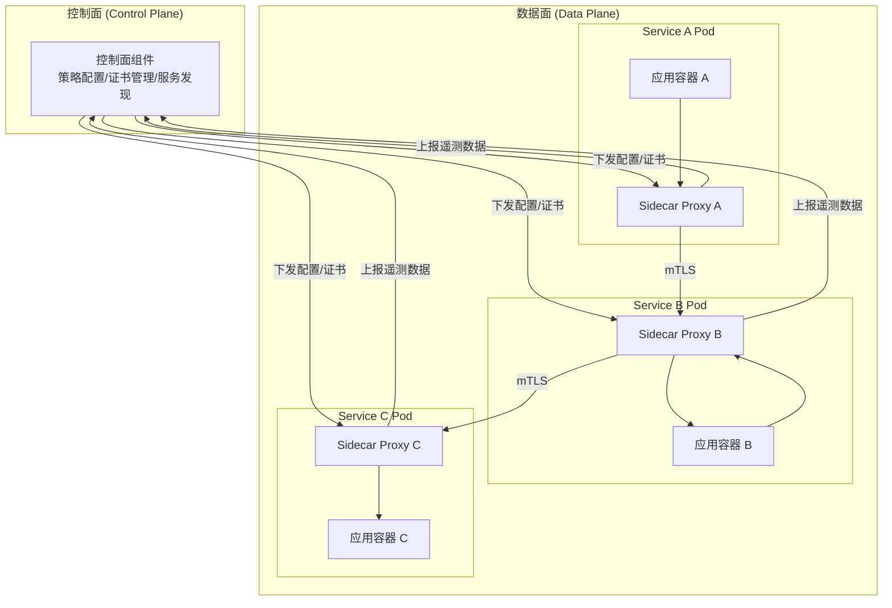
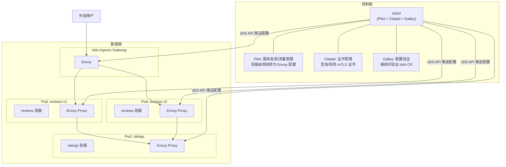
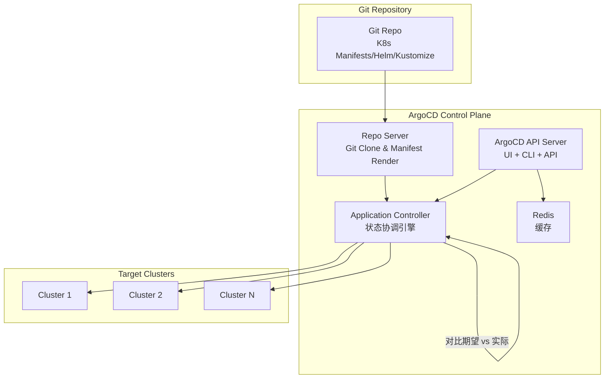

## 第十二章：CRD与API扩展

### 12.1 Custom Resource Definition（CRD）

#### 概念

CRD（Custom Resource Definition）是 Kubernetes 提供的扩展机制，允许用户在不修改 Kubernetes 源码、不编写自定义 API Server 的前提下，向集群注册全新的资源类型。注册完成后，用户可以像操作原生资源（Pod、Service）一样，通过 kubectl 和 API 对自定义资源（CR）进行 CRUD 操作。

CRD 的核心价值在于将 Kubernetes 从一个容器编排平台升级为一个通用的声明式资源管理平台。结合 Operator 模式，CRD 可以将任何领域的运维知识编码为控制器逻辑，实现数据库、消息队列、机器学习平台等复杂系统的自动化管理。

#### 完整 CRD YAML 示例

以下定义了一个 `Database` 自定义资源，属于 `app.example.com` API Group：

```yaml
apiVersion: apiextensions.k8s.io/v1
kind: CustomResourceDefinition
metadata:
  name: databases.app.example.com
spec:
  group: app.example.com
  names:
    kind: Database
    listKind: DatabaseList
    plural: databases
    singular: database
    shortNames:
      - db
    categories:
      - all
  scope: Namespaced
  versions:
    - name: v1alpha1
      served: true
      storage: false
      deprecated: true
      deprecationWarning: "app.example.com/v1alpha1 Database is deprecated; use v1"
      schema:
        openAPIV3Schema:
          type: object
          properties:
            spec:
              type: object
              required:
                - engine
                - version
              properties:
                engine:
                  type: string
                  enum: ["mysql", "postgresql", "mongodb"]
                version:
                  type: string
                replicas:
                  type: integer
                  minimum: 1
                  maximum: 7
                  default: 3
                storage:
                  type: object
                  properties:
                    size:
                      type: string
                      pattern: "^[0-9]+(Gi|Ti)$"
                    storageClass:
                      type: string
            status:
              type: object
              properties:
                phase:
                  type: string
                readyReplicas:
                  type: integer
                conditions:
                  type: array
                  items:
                    type: object
                    properties:
                      type:
                        type: string
                      status:
                        type: string
                      lastTransitionTime:
                        type: string
                        format: date-time
                      reason:
                        type: string
                      message:
                        type: string
      subresources:
        status: {}
        scale:
          specReplicasPath: .spec.replicas
          statusReplicasPath: .status.readyReplicas
      additionalPrinterColumns:
        - name: Engine
          type: string
          jsonPath: .spec.engine
        - name: Version
          type: string
          jsonPath: .spec.version
        - name: Replicas
          type: integer
          jsonPath: .spec.replicas
        - name: Phase
          type: string
          jsonPath: .status.phase
        - name: Age
          type: date
          jsonPath: .metadata.creationTimestamp
    - name: v1
      served: true
      storage: true
      schema:
        openAPIV3Schema:
          type: object
          properties:
            spec:
              type: object
              required:
                - engine
                - version
              properties:
                engine:
                  type: string
                  enum: ["mysql", "postgresql", "mongodb", "redis"]
                version:
                  type: string
                replicas:
                  type: integer
                  minimum: 1
                  maximum: 11
                  default: 3
                storage:
                  type: object
                  properties:
                    size:
                      type: string
                      pattern: "^[0-9]+(Gi|Ti)$"
                    storageClass:
                      type: string
                    backupEnabled:
                      type: boolean
                      default: true
                resources:
                  type: object
                  properties:
                    cpu:
                      type: string
                    memory:
                      type: string
                monitoring:
                  type: object
                  properties:
                    enabled:
                      type: boolean
                      default: true
                    exporterImage:
                      type: string
            status:
              type: object
              properties:
                phase:
                  type: string
                readyReplicas:
                  type: integer
                endpoint:
                  type: string
                conditions:
                  type: array
                  items:
                    type: object
                    properties:
                      type:
                        type: string
                      status:
                        type: string
                      lastTransitionTime:
                        type: string
                        format: date-time
                      reason:
                        type: string
                      message:
                        type: string
      subresources:
        status: {}
        scale:
          specReplicasPath: .spec.replicas
          statusReplicasPath: .status.readyReplicas
      additionalPrinterColumns:
        - name: Engine
          type: string
          jsonPath: .spec.engine
        - name: Version
          type: string
          jsonPath: .spec.version
        - name: Replicas
          type: integer
          jsonPath: .spec.replicas
        - name: Phase
          type: string
          jsonPath: .status.phase
        - name: Endpoint
          type: string
          jsonPath: .status.endpoint
        - name: Age
          type: date
          jsonPath: .metadata.creationTimestamp
  conversion:
    strategy: Webhook
    webhook:
      conversionReviewVersions: ["v1"]
      clientConfig:
        service:
          name: database-operator-webhook
          namespace: database-system
          path: /convert
        caBundle: LS0tLS1CRUdJTi4uLg==
```

#### CR 使用示例

```yaml
apiVersion: app.example.com/v1
kind: Database
metadata:
  name: production-mysql
  namespace: backend
  labels:
    team: platform
    environment: production
spec:
  engine: mysql
  version: "8.0.35"
  replicas: 3
  storage:
    size: 100Gi
    storageClass: ssd-replicated
    backupEnabled: true
  resources:
    cpu: "4"
    memory: 16Gi
  monitoring:
    enabled: true
    exporterImage: prom/mysqld-exporter:v0.15.0
```

创建和操作自定义资源：

```bash
# 创建 CRD
kubectl apply -f database-crd.yaml

# 创建 CR 实例
kubectl apply -f production-mysql.yaml

# 列出所有 Database 资源（使用 shortName）
kubectl get db -n backend

# 查看详情
kubectl describe db production-mysql -n backend

# 扩容
kubectl scale db production-mysql --replicas=5 -n backend

# 查看状态子资源
kubectl get db production-mysql -n backend -o jsonpath='{.status.phase}'
```

#### 版本管理

CRD 版本管理遵循 Kubernetes API 版本约定：

- **v1alpha1**：初始实验版本，可能随时变更，不建议生产使用
- **v1beta1**：功能基本稳定，API 可能有小幅调整
- **v1**：稳定版本，向后兼容保证

版本迁移策略有两种：一是 None（仅改名，字段完全兼容），二是 Webhook（通过 Conversion Webhook 实现字段转换）。storage 字段标记存储版本（只能有一个为 true），served 字段控制 API 是否对外暴露。通过 Conversion Webhook，集群可以同时服务多个版本的 API，在读取时自动转换为请求的版本格式。

---

### 12.2 API Aggregation

#### 架构

API Aggregation（AA）是 Kubernetes 提供的另一种 API 扩展机制。与 CRD 不同，AA 允许用户部署自己的 API Server（Aggregated API Server），注册到 kube-apiserver 的代理层中。当客户端请求特定的 API Group 时，kube-apiserver 将请求代理转发给对应的 Aggregated API Server。

AA 的核心组件是 APIService 资源：

```yaml
apiVersion: apiregistration.k8s.io/v1
kind: APIService
metadata:
  name: v1beta1.metrics.k8s.io
spec:
  service:
    name: metrics-server
    namespace: kube-system
  group: metrics.k8s.io
  version: v1beta1
  insecureSkipTLSVerify: false
  caBundle: LS0tLS1CRUdJTi4uLg==
  groupPriorityMinimum: 100
  versionPriority: 100
```

请求流转过程：Client → kube-apiserver → kube-aggregator（检查 APIService 注册表）→ Aggregated API Server → 返回结果。Metrics Server 就是典型的 AA 实现。

#### CRD 与 API Aggregation 对比

| 维度 | CRD | API Aggregation |
|------|-----|-----------------|
| 实现复杂度 | 低，只需编写 YAML 和控制器 | 高，需实现完整的 API Server |
| 部署方式 | 提交 CRD YAML 即可 | 需部署独立服务 + 注册 APIService |
| 存储 | 使用 kube-apiserver 的 etcd | 可自定义存储后端 |
| 验证方式 | OpenAPI v3 Schema + Webhook | 代码内自定义验证逻辑 |
| 子资源支持 | status、scale（有限） | 完全自定义任意子资源 |
| API 路径 | 固定格式 /apis/group/version/resource | 完全自定义 |
| 认证授权 | 复用 kube-apiserver RBAC | 可自定义，也可委托给 kube-apiserver |
| 版本转换 | Conversion Webhook | 代码内实现 |
| watch/list 性能 | 依赖 etcd watch 机制 | 可优化，如使用内存缓存 |
| 适用场景 | 大多数扩展场景 | 需要自定义存储、高性能、复杂子资源 |
| 典型案例 | Prometheus Operator、Cert-Manager | Metrics Server、Custom Metrics API |
| 高可用 | kube-apiserver 自身保证 | 需自行实现多副本 + 负载均衡 |

选型建议：绝大多数场景（90%以上）选择 CRD + Operator 即可满足需求。只有在需要自定义存储后端（如直接读取 Prometheus TSDB）、复杂的子资源路径、protobuf 性能优化等高级场景时，才需要考虑 API Aggregation。

---

### 12.3 Admission Webhook

#### MutatingAdmissionWebhook

MutatingAdmissionWebhook 在资源持久化到 etcd 之前拦截请求，可以修改（mutate）资源内容。典型场景包括注入 sidecar 容器、添加默认标签、注入环境变量等。

```yaml
apiVersion: admissionregistration.k8s.io/v1
kind: MutatingWebhookConfiguration
metadata:
  name: sidecar-injector
  labels:
    app: sidecar-injector
webhooks:
  - name: sidecar-injector.example.com
    admissionReviewVersions: ["v1", "v1beta1"]
    sideEffects: None
    timeoutSeconds: 10
    reinvocationPolicy: IfNeeded
    failurePolicy: Fail
    matchPolicy: Equivalent
    clientConfig:
      service:
        name: sidecar-injector
        namespace: sidecar-system
        path: /mutate
        port: 443
      caBundle: LS0tLS1CRUdJTi4uLg==
    rules:
      - operations: ["CREATE"]
        apiGroups: [""]
        apiVersions: ["v1"]
        resources: ["pods"]
        scope: "Namespaced"
    namespaceSelector:
      matchLabels:
        sidecar-injection: enabled
    objectSelector:
      matchExpressions:
        - key: sidecar.example.com/inject
          operator: NotIn
          values: ["false"]
```

#### ValidatingAdmissionWebhook

ValidatingAdmissionWebhook 在 Mutating 之后执行，只能接受或拒绝请求，不能修改资源内容。典型场景包括策略合规检查、资源配额验证、镜像白名单验证等。

```yaml
apiVersion: admissionregistration.k8s.io/v1
kind: ValidatingWebhookConfiguration
metadata:
  name: resource-policy-validator
webhooks:
  - name: validate.resource-policy.example.com
    admissionReviewVersions: ["v1"]
    sideEffects: None
    timeoutSeconds: 5
    failurePolicy: Fail
    matchPolicy: Exact
    clientConfig:
      service:
        name: policy-webhook
        namespace: policy-system
        path: /validate
        port: 443
      caBundle: LS0tLS1CRUdJTi4uLg==
    rules:
      - operations: ["CREATE", "UPDATE"]
        apiGroups: ["apps"]
        apiVersions: ["v1"]
        resources: ["deployments"]
        scope: "Namespaced"
      - operations: ["CREATE", "UPDATE"]
        apiGroups: [""]
        apiVersions: ["v1"]
        resources: ["pods"]
        scope: "Namespaced"
    namespaceSelector:
      matchExpressions:
        - key: kubernetes.io/metadata.name
          operator: NotIn
          values: ["kube-system", "kube-public"]
    objectSelector:
      matchExpressions:
        - key: skip-validation
          operator: DoesNotExist
```

#### Conversion Webhook

Conversion Webhook 用于 CRD 多版本之间的数据格式转换。当 CRD 存在多个 served 版本时，API Server 需要在不同版本之间做转换，此时会调用 Conversion Webhook。

```yaml
apiVersion: apiextensions.k8s.io/v1
kind: CustomResourceDefinition
metadata:
  name: databases.app.example.com
spec:
  group: app.example.com
  names:
    kind: Database
    plural: databases
  scope: Namespaced
  versions:
    - name: v1alpha1
      served: true
      storage: false
      schema:
        openAPIV3Schema:
          type: object
          properties:
            spec:
              type: object
              properties:
                engine:
                  type: string
                size:
                  type: string
    - name: v1
      served: true
      storage: true
      schema:
        openAPIV3Schema:
          type: object
          properties:
            spec:
              type: object
              properties:
                engine:
                  type: string
                storage:
                  type: object
                  properties:
                    size:
                      type: string
                    class:
                      type: string
  conversion:
    strategy: Webhook
    webhook:
      conversionReviewVersions: ["v1"]
      clientConfig:
        service:
          name: database-conversion-webhook
          namespace: database-system
          path: /convert
          port: 443
        caBundle: LS0tLS1CRUdJTi4uLg==
```

Webhook 执行顺序为：请求到达 → Authentication → Authorization → **MutatingAdmission**（可多轮，按 reinvocationPolicy 决定）→ Object Schema Validation → **ValidatingAdmission** → 持久化到 etcd。如果任一 ValidatingWebhook 返回拒绝，整个请求被拒绝。

---

## 第十三章：服务网格

### 13.1 微服务挑战

随着单体应用拆分为微服务架构，服务数量从几个增长到数十甚至数百个。这带来了一系列分布式系统的固有挑战：

**服务发现与负载均衡**：每个服务可能有多个实例，实例地址动态变化，需要可靠的服务发现机制和智能负载均衡策略（轮询、加权、最少连接、一致性哈希等）。

**流量管理**：灰度发布、A/B 测试、流量镜像、故障注入等高级流量控制需求，传统方式需要在每个服务中实现。

**安全通信**：服务间通信需要 mTLS 加密、身份认证、细粒度授权。手动管理证书在大规模集群中几乎不可行。

**可观测性**：分布式追踪（Tracing）、指标采集（Metrics）、日志聚合（Logging）需要统一方案。每个服务都要集成 SDK 带来巨大的侵入性。

**弹性能力**：超时、重试、熔断、限流等弹性模式需要在每个服务中实现，且配置难以统一管理。

传统的解决方案是使用框架级 SDK（如 Spring Cloud、Dubbo），但这带来语言绑定、升级困难、业务代码侵入等问题。Service Mesh 的出现正是为了将这些横切关注点从应用代码中抽离出来。

---

### 13.2 Service Mesh 定义

Service Mesh（服务网格）是一个专门处理服务间通信的基础设施层。它以 Sidecar 代理的形式部署在每个服务实例旁边，透明地处理服务间的所有网络通信，无需修改应用代码。

#### 数据面与控制面架构



**数据面（Data Plane）**：由一组 Sidecar 代理组成，拦截每个服务的入站和出站流量。负责服务发现、负载均衡、健康检查、认证、授权、可观测性数据采集、流量路由等。

**控制面（Control Plane）**：负责管理和配置所有 Sidecar 代理。提供 API 供运维人员下发路由规则、安全策略，管理证书生命周期，聚合遥测数据。

#### Sidecar 模式

Sidecar 模式的核心思想是在每个应用 Pod 中注入一个代理容器，通过 iptables 规则将应用容器的所有入站和出站流量劫持到 Sidecar 代理。应用容器完全无感知，仍然像往常一样发送和接收普通的 HTTP/gRPC 请求，所有的服务治理逻辑由 Sidecar 代理透明处理。

注入方式通常有两种：一是通过 MutatingAdmissionWebhook 在 Pod 创建时自动注入（Istio 方式），二是手动在 Deployment YAML 中添加 Sidecar 容器定义。

---

### 13.3 Istio

#### 架构

Istio 是目前最成熟、功能最完整的 Service Mesh 实现。在 1.5 版本之后，Istio 将原来分散的控制面组件（Pilot、Citadel、Galley）合并为单一的 istiod 进程，大幅简化了部署和运维。



**istiod** 通过 xDS（x Discovery Service）协议向所有 Envoy 代理推送配置，包括 LDS（Listener）、RDS（Route）、CDS（Cluster）、EDS（Endpoint）、SDS（Secret）。这种推送模式使得配置变更可以在秒级生效到整个网格。

#### VirtualService

VirtualService 定义流量路由规则，决定流量如何到达目标服务：

```yaml
apiVersion: networking.istio.io/v1beta1
kind: VirtualService
metadata:
  name: reviews-routing
  namespace: bookinfo
spec:
  hosts:
    - reviews
  http:
    - match:
        - headers:
            end-user:
              exact: jason
      route:
        - destination:
            host: reviews
            subset: v2
          weight: 100
      timeout: 10s
      retries:
        attempts: 3
        perTryTimeout: 3s
        retryOn: 5xx,reset,connect-failure
    - match:
        - uri:
            prefix: /api/v2
      route:
        - destination:
            host: reviews
            subset: v2
          weight: 80
        - destination:
            host: reviews
            subset: v3
          weight: 20
      fault:
        delay:
          percentage:
            value: 5
          fixedDelay: 3s
    - route:
        - destination:
            host: reviews
            subset: v1
          weight: 100
```

#### DestinationRule

DestinationRule 定义到达目标服务后的流量策略，包括负载均衡、连接池、熔断、TLS 模式等：

```yaml
apiVersion: networking.istio.io/v1beta1
kind: DestinationRule
metadata:
  name: reviews-destination
  namespace: bookinfo
spec:
  host: reviews
  trafficPolicy:
    connectionPool:
      tcp:
        maxConnections: 100
        connectTimeout: 30ms
      http:
        h2UpgradePolicy: DEFAULT
        http1MaxPendingRequests: 100
        http2MaxRequests: 1000
        maxRequestsPerConnection: 10
        maxRetries: 3
    outlierDetection:
      consecutive5xxErrors: 5
      interval: 10s
      baseEjectionTime: 30s
      maxEjectionPercent: 50
      minHealthPercent: 30
    loadBalancer:
      simple: LEAST_REQUEST
  subsets:
    - name: v1
      labels:
        version: v1
      trafficPolicy:
        loadBalancer:
          simple: ROUND_ROBIN
    - name: v2
      labels:
        version: v2
    - name: v3
      labels:
        version: v3
      trafficPolicy:
        connectionPool:
          http:
            http2MaxRequests: 500
```

#### Gateway

Gateway 定义网格边缘的入口点，配置外部流量如何进入网格：

```yaml
apiVersion: networking.istio.io/v1beta1
kind: Gateway
metadata:
  name: bookinfo-gateway
  namespace: bookinfo
spec:
  selector:
    istio: ingressgateway
  servers:
    - port:
        number: 443
        name: https
        protocol: HTTPS
      hosts:
        - "bookinfo.example.com"
        - "*.bookinfo.example.com"
      tls:
        mode: SIMPLE
        credentialName: bookinfo-tls-cert
        minProtocolVersion: TLSV1_2
        cipherSuites:
          - ECDHE-RSA-AES256-GCM-SHA384
          - ECDHE-RSA-AES128-GCM-SHA256
    - port:
        number: 80
        name: http
        protocol: HTTP
      hosts:
        - "bookinfo.example.com"
      tls:
        httpsRedirect: true
---
apiVersion: networking.istio.io/v1beta1
kind: VirtualService
metadata:
  name: bookinfo-vs
  namespace: bookinfo
spec:
  hosts:
    - "bookinfo.example.com"
  gateways:
    - bookinfo-gateway
  http:
    - match:
        - uri:
            prefix: /productpage
        - uri:
            exact: /login
      route:
        - destination:
            host: productpage
            port:
              number: 9080
```

#### mTLS（双向 TLS）

Istio 通过 PeerAuthentication 资源配置 mTLS 策略：

```yaml
apiVersion: security.istio.io/v1beta1
kind: PeerAuthentication
metadata:
  name: default
  namespace: bookinfo
spec:
  mtls:
    mode: STRICT  # STRICT | PERMISSIVE | DISABLE
  portLevelMtls:
    8080:
      mode: PERMISSIVE  # 特定端口允许明文（兼容旧服务）
```

Citadel 组件负责为每个工作负载签发 SPIFFE 格式的 x.509 证书（如 `spiffe://cluster.local/ns/bookinfo/sa/reviews`），证书默认 24 小时轮转。所有服务间通信自动加密，且基于工作负载身份（而非 IP）进行认证。

#### 可观测性

Istio 提供三大可观测性支柱的开箱即用支持：

**指标（Metrics）**：Envoy 自动采集 L4/L7 指标，包括请求数、延迟直方图、错误率等。通过 Prometheus 采集后在 Grafana 展示。关键指标包括 `istio_requests_total`、`istio_request_duration_milliseconds`、`istio_tcp_connections_opened_total`。

**分布式追踪（Tracing）**：Envoy 自动生成 span 并上报到 Jaeger/Zipkin。应用只需传递 trace header（如 `x-request-id`、`x-b3-traceid`），无需集成追踪 SDK。

**访问日志（Access Logs）**：可配置 Envoy 输出结构化访问日志，包含源/目标服务身份、响应码、延迟等信息。

---

### 13.4 Service Mesh 方案对比

| 维度 | Istio | Linkerd | Consul Connect |
|------|------|------|------|
| **架构** | 功能丰富，组件较多 | 极简设计，轻量级 | 与 HashiCorp 生态深度集成 |
| **数据面代理** | Envoy | linkerd2-proxy（Rust） | Envoy（Connect Proxy） |
| **控制面** | istiod（单体） | control plane（Go） | Consul Server |
| **性能开销** | 较高（Envoy 内存 ~50MB） | 极低（proxy ~10MB） | 中等 |
| **学习曲线** | 陡峭 | 平缓 | 中等（熟悉 Consul 则低） |
| **多集群** | 原生支持 | 支持（mirror模式） | 原生支持（WAN Federation） |
| **非 K8s 支持** | 有限 | 仅 K8s | 原生支持 VM + K8s |
| **流量管理** | 非常强大 | 基础（SMI 规范） | 中等 |
| **安全（mTLS）** | 自动 | 自动 | 自动（内置 CA） |
| **可观测性** | 丰富（指标/追踪/日志） | 良好（金色指标） | 基础 |
| **社区活跃度** | 最高（CNCF毕业） | 高（CNCF毕业） | 高（HashiCorp维护） |
| **适用场景** | 大规模微服务、复杂流量需求 | 追求简单和低开销 | 混合环境（VM+K8s） |

**选型建议**：
- 需要丰富流量管理能力（金丝雀、故障注入、熔断等）→ Istio
- 追求极简部署和最低资源开销 → Linkerd
- 已有 Consul 服务发现或需要跨 VM/K8s 混合环境 → Consul Connect

---

## 第十四章：多集群管理

### 14.1 多集群架构模式

企业采用多集群的驱动因素包括：高可用容灾（跨地域故障隔离）、合规要求（数据主权）、团队隔离（不同BU独立集群）、规模限制（单集群节点上限约5000）、混合云/多云策略。

**常见架构模式**：

**模式一：独立集群 + 统一管控面**  
每个集群完全独立运行，通过中央管控平台（如 Rancher）进行统一管理。适合团队隔离需求强、跨集群通信少的场景。

**模式二：联邦集群（Federation）**  
通过 KubeFed 等工具将多个集群组成联邦，实现资源在多集群间的统一分发。适合需要跨集群部署同一应用的场景。

**模式三：服务网格多集群**  
通过 Istio 等服务网格打通多集群间的服务发现和流量管理。适合微服务跨集群部署、需要统一流量策略的场景。

### 14.2 KubeFed（Kubernetes Federation v2）

KubeFed 是 Kubernetes SIG-multicluster 项目，实现跨集群资源分发：

**核心概念**：
- **Host Cluster**：运行 KubeFed 控制面的集群
- **Member Cluster**：加入联邦的集群
- **FederatedType**：联邦化的资源类型（如 FederatedDeployment）
- **Placement**：资源放置策略（放到哪些集群）
- **Override**：针对特定集群的字段覆盖

**工作流程**：用户创建 FederatedDeployment → KubeFed controller 读取 placement 和 override → 在目标集群创建对应的 Deployment → 持续协调保证状态一致。

### 14.3 跨集群流量管理

**DNS 方式**：通过外部 DNS（如 Route53、CoreDNS with multicluster plugin）实现跨集群服务发现。客户端 DNS 解析到最近/健康的集群端点。

**服务网格方式**：Istio 多集群模式支持跨集群 mTLS 通信，服务对跨集群调用透明无感。

**Ingress 网关方式**：每个集群暴露 Ingress Gateway，通过全局负载均衡（如 GSLB）分发流量。

### 14.4 多集群管理平台

**Rancher**：企业级多集群管理平台。提供统一UI管理多个K8s集群（支持 RKE/EKS/AKS/GKE等），内置应用商店、监控告警、CI/CD、RBAC策略管理。适合需要统一管理异构集群的企业。

**KubeSphere**：开源的分布式操作系统，以K8s为内核。提供多集群管理、DevOps、微服务治理、可观测性、应用商店等功能。支持在任何基础设施上部署，界面友好。

**ArgoCD（多集群部署）**：虽然 ArgoCD 主要是 GitOps CD 工具，但天然支持管理多集群应用部署。通过 ApplicationSet 可以模板化地向多个集群分发应用，配合 Git 实现多集群配置的版本化管理。

---

## 第十五章：CI/CD与GitOps

### 15.1 CI/CD 工具链

#### Jenkins on Kubernetes

Jenkins 是最成熟的 CI/CD 工具，运行在 K8s 上可获得弹性 Agent 能力：

- **Jenkins Master**：以 StatefulSet 部署，持久化 JENKINS_HOME
- **动态 Agent**：通过 Kubernetes Plugin，每次构建动态创建 Pod 作为 Agent，构建完自动销毁
- **优势**：无需维护固定 Agent 池，资源按需分配，构建环境一致性
- **Pipeline 示例**：Jenkinsfile 中使用 `podTemplate` 定义构建 Pod 的容器组合（maven/docker/kubectl）

#### Tekton

Tekton 是 Kubernetes 原生的 CI/CD 框架，所有概念都是 CRD：

- **Task**：定义一组 Step（容器），完成特定工作
- **Pipeline**：编排多个 Task 的执行顺序和依赖
- **PipelineRun**：Pipeline 的一次执行实例
- **Workspace**：Task 间共享数据的 PVC

```yaml
apiVersion: tekton.dev/v1beta1
kind: Task
metadata:
  name: build-and-push
spec:
  params:
    - name: image
      type: string
  workspaces:
    - name: source
  steps:
    - name: build
      image: gcr.io/kaniko-project/executor:latest
      command:
        - /kaniko/executor
      args:
        - --dockerfile=$(workspaces.source.path)/Dockerfile
        - --destination=$(params.image)
        - --context=$(workspaces.source.path)
```

#### GitHub Actions

与 K8s 结合的模式：在 Actions workflow 中构建镜像 → 推送到 Registry → 更新 K8s manifests（或触发 ArgoCD 同步）。可使用 self-hosted runner 运行在 K8s 集群内。

### 15.2 GitOps 与 ArgoCD

**GitOps 核心理念**：
- Git 仓库是系统期望状态的唯一真实来源（Single Source of Truth）
- 所有变更通过 Git 提交（PR Review + Merge）
- 自动化代理持续协调实际状态与期望状态
- 偏差（Drift）被自动检测并可自动修复

**ArgoCD 架构**：



**ArgoCD Application YAML 示例**：

```yaml
apiVersion: argoproj.io/v1alpha1
kind: Application
metadata:
  name: my-app
  namespace: argocd
  finalizers:
    - resources-finalizer.argocd.argoproj.io
spec:
  project: default
  source:
    repoURL: https://github.com/myorg/k8s-manifests.git
    targetRevision: main
    path: apps/my-app/overlays/production
  destination:
    server: https://kubernetes.default.svc
    namespace: production
  syncPolicy:
    automated:
      prune: true          # 自动删除 Git 中不存在的资源
      selfHeal: true       # 自动修复手动修改导致的偏差
      allowEmpty: false    # 禁止同步到空目录
    syncOptions:
      - CreateNamespace=true
      - PrunePropagationPolicy=foreground
      - PruneLast=true
    retry:
      limit: 5
      backoff:
        duration: 5s
        factor: 2
        maxDuration: 3m
  ignoreDifferences:
    - group: apps
      kind: Deployment
      jsonPointers:
        - /spec/replicas    # 忽略 HPA 修改的副本数
```

**同步策略详解**：
- **Manual Sync**：需要手动触发同步，适合生产环境谨慎变更
- **Auto Sync**：检测到 Git 变更自动同步，适合开发/测试环境
- **Self-Heal**：即使有人 kubectl 手动改了线上资源，也会自动恢复到 Git 定义的状态
- **Prune**：Git 中删除的资源，线上也自动删除
- **Sync Waves & Hooks**：控制资源的同步顺序（如先创建 Namespace，再创建 Deployment）

### 15.3 镜像构建最佳实践

#### Dockerfile 多阶段构建

```dockerfile
# === 阶段1：构建 ===
FROM golang:1.21-alpine AS builder
WORKDIR /app

# 利用缓存：先复制依赖文件
COPY go.mod go.sum ./
RUN go mod download

# 再复制源码
COPY . .
RUN CGO_ENABLED=0 GOOS=linux go build -ldflags='-w -s' -o /app/server ./cmd/server

# === 阶段2：运行 ===
FROM alpine:3.19
RUN apk --no-cache add ca-certificates tzdata

# 非 root 用户
RUN adduser -D -g '' appuser
USER appuser

COPY --from=builder /app/server /usr/local/bin/server

EXPOSE 8080
ENTRYPOINT ["server"]
```

**最佳实践要点**：
- 使用多阶段构建，最终镜像不包含编译工具链
- 基础镜像选择 alpine 或 distroless 减小体积
- 合理利用 Docker 层缓存（依赖文件单独 COPY）
- 使用 `.dockerignore` 排除无关文件
- 设置非 root 用户运行
- 固定基础镜像版本（避免 latest）
- 使用 `--ldflags='-w -s'` 去除调试信息

#### Harbor 企业级镜像仓库

Harbor 是 CNCF 毕业的企业级 Registry：
- **镜像安全扫描**：集成 Trivy，自动扫描镜像漏洞
- **签名与信任**：Cosign/Notary 镜像签名验证
- **复制策略**：支持跨 Harbor 实例的镜像同步（用于多地域部署）
- **RBAC**：项目级别的访问控制
- **配额管理**：限制项目的存储使用
- **垃圾回收**：自动清理未引用的 blob

---

## 第十六章：企业级K8s落地实践

### 16.1 美团容器平台演进

#### 平台发展历程

美团容器化经历了从自研到拥抱 Kubernetes 的演进：

**Kubernetes 1.0 阶段**：基于自研调度系统，提供基础的容器编排能力。随着业务规模快速增长，自研系统在功能迭代、生态对接方面面临越来越大的挑战。

**Kubernetes 2.0 阶段（引入 Kubernetes）**：全面转向 Kubernetes 作为底层编排引擎。这一决策基于 K8s 的声明式 API、丰富的生态、活跃的社区以及对有状态/无状态应用的统一管理能力。

#### Kubernetes 加固措施

在大规模落地过程中，美团对 Kubernetes 进行了多维度加固：

**etcd 拆分**：将 Events 与核心资源数据（Pods/Services/Endpoints等）存储到不同的 etcd 集群。Events 写入频繁但重要性低，分离后避免影响核心数据的读写性能。同时针对 etcd 进行了参数调优（如增大 quota-backend-bytes、调整 heartbeat-interval）。

**定制 CNI 插件**：根据企业网络环境定制 CNI 插件，实现容器网络与物理网络的高效打通。支持固定 IP、多网卡、网络策略等企业级需求。

**FlexVolume/CSI 存储**：适配美团内部存储系统（如分布式文件系统、对象存储），通过 FlexVolume（早期）和 CSI（后期）实现存储的灵活对接。

**参数调优**：针对大规模集群进行 API Server、Controller Manager、Scheduler 的参数精调。包括调整 `--max-requests-inflight`、`--max-mutating-requests-inflight`、调大 `--kube-api-qps` 和 `--kube-api-burst` 等。

#### 稳定性成果

- **平台可用性**：达到 99.99%（年度不可用时间 < 52.6分钟）
- **扩缩容成功率**：99.9%+，确保业务弹性伸缩的可靠性

#### 智能调度系统 Vision

Vision 是美团自研的智能调度系统，在 K8s 默认调度器之上提供高级能力：

**故障重编排**：当检测到节点异常（如内核故障、硬件告警）时，自动将受影响的 Pod 迁移到健康节点，无需人工干预。

**宕机恢复**：节点宕机后，系统快速识别并在其他节点重建 Pod，通过预留资源池缩短恢复时间。

**自动巡检**：定期检查集群健康状态，包括节点资源水位、Pod 分布均衡性、存储卷状态等，发现问题主动修复。

#### 弹性伸缩策略

美团的弹性伸缩策略远超原生 HPA 能力：

**多指标投票机制**：同时监测 CPU 利用率、QPS（每秒请求数）、内存使用率等多个指标。每个指标独立计算目标副本数，最终通过投票（取最大值）决定实际副本数，避免单一指标盲区。

**步长自动计算**：根据历史扩缩容数据自动调整每次扩缩的步长，避免扩容不足或缩容过激。高峰期加大步长快速扩容，低峰期减小步长平滑缩容。

**发布期间禁用弹性**：应用发布过程中自动暂停弹性伸缩，避免发布期间的指标波动触发错误的扩缩容，待发布完成并稳定后恢复。

#### 四层保障体系

美团容器平台建立了从进程到平台的四层保障体系：

**进程级保障（秒级恢复）**：使用 s6-overlay 等进程管理器，在容器内实现进程级的健康检查和秒级重启。应用进程崩溃后6秒内自动拉起，用户几乎无感知。

**容器级保障（分钟级恢复）**：kubelet 通过 liveness probe 检测容器健康状态，异常容器在分钟级别内重启。配合 readiness probe 确保流量只转发给健康容器。

**节点级保障（驱逐与重调度）**：节点故障时，Node Controller 将 Pod 标记为驱逐状态，Deployment Controller 在其他健康节点重建 Pod。结合 PDB 保证驱逐过程中服务可用。

**平台级保障**：API Server 可用性 99.95%+（多副本+负载均衡），云硬盘提供9个9的数据可靠性。etcd 多副本 + 定期备份确保元数据安全。

### 16.2 Spark On Kubernetes

#### 从 YARN 迁移到 K8s 的原因

**YARN 资源隔离差**：YARN 的资源隔离主要依赖 CGroup，但粒度较粗，大任务可能影响同节点其他任务的 I/O 和网络性能。

**存算耦合**：传统 Hadoop 集群中计算和存储绑定在同一节点（DataNode + NodeManager），导致资源无法独立扩展。存储扩容必须同时扩容计算节点，造成资源浪费。

**弹性能力差**：YARN 集群扩缩容周期长（需要 DataNode 数据均衡），难以应对突发的计算需求峰值。

**迭代难度大**：YARN 生态相对封闭，版本升级涉及大量组件联动，新特性引入周期长。

#### Kubernetes 方案

**CGroup 精细隔离**：利用 K8s 的 requests/limits 机制实现 CPU、内存的精确隔离。配合 Pod QoS（Guaranteed/Burstable/BestEffort）分级保障不同优先级任务。

**混部调度**：在线服务与离线 Spark 任务混合部署在同一集群。利用在线服务的低谷期资源运行 Spark 任务，整体资源利用率从 30% 提升到 60%+。

**存算分离**：计算在 K8s Pod 中运行，数据存储在独立的 HDFS/对象存储中。计算资源可以秒级弹性伸缩，不受存储节点限制。

**容器化灰度发布**：Spark 版本升级通过容器镜像管理，不同版本可以并行运行。灰度发布只需调整镜像 tag，回滚也是秒级操作。

#### SparkOperator

SparkOperator 是 Google 开源的 K8s Operator，管理 Spark 应用的全生命周期：

- 提供 SparkApplication CRD，声明式定义 Spark 任务
- 自动管理 Driver Pod 和 Executor Pod 的创建/清理
- 支持定时调度（ScheduledSparkApplication）
- 集成 K8s RBAC 实现多租户
- 支持 Pod Template 定制 Executor 配置（亲和性、容忍等）

### 16.3 Kata 容器

#### 传统 VM 调度的问题

**模块繁多**：传统虚拟化栈涉及 libvirt、QEMU、OpenStack Nova/Neutron/Cinder 等众多组件，运维复杂度高。

**Python 性能瓶颈**：OpenStack 核心组件（Nova、Neutron等）大量使用 Python 编写，在大规模调度场景下性能不足，API 响应延迟高。

#### Kata 容器的优势

**与 Kubernetes 原生融合**：Kata 容器完全兼容 OCI 标准，通过 containerd + kata-runtime 无缝接入 K8s。对用户透明，Pod YAML 只需指定 RuntimeClass 即可使用 Kata。

```yaml
apiVersion: node.k8s.io/v1
kind: RuntimeClass
metadata:
  name: kata
handler: kata
```

**享受 Deployment 全部特性**：滚动更新、回滚、HPA、PDB 等 K8s 原生能力全部可用。不再需要为 VM 单独建设编排系统。

**安全隔离**：每个 Pod 运行在独立的轻量级 VM（microVM）中，提供硬件级别的安全隔离。相比 runc 容器共享内核的风险，Kata 容器内核独立，即使容器逃逸也只影响自己的 VM。适合多租户、不可信工作负载等场景。

### 16.4 生产最佳实践清单

**资源管理**：
- 所有 Pod 必须设置 requests 和 limits
- 使用 LimitRange 设置 Namespace 级别的默认值
- 使用 ResourceQuota 防止单个团队过度占用
- Guaranteed QoS 用于核心服务，Burstable 用于一般服务

**高可用**：
- 控制面至少3副本（API Server、etcd、Controller Manager、Scheduler）
- 应用至少2副本，配合 PodAntiAffinity 打散到不同节点
- 配置 PDB 保证滚动更新和节点维护时的可用性
- 使用 topologySpreadConstraints 跨可用区分布

**安全**：
- 启用 RBAC，遵循最小权限原则
- Pod SecurityContext 设置非 root 运行
- NetworkPolicy 限制 Pod 间网络访问
- 定期扫描镜像漏洞，使用签名验证
- Secret 加密存储（启用 encryption-at-rest）

**可观测性**：
- Prometheus + Grafana 监控集群和应用指标
- EFK/Loki 集中日志收集
- Jaeger/Zipkin 分布式追踪
- 配置关键告警（节点 NotReady、Pod OOMKilled、PVC 容量不足等）

**发布策略**：
- 使用 Rolling Update，配置合理的 maxUnavailable 和 maxSurge
- 配置 readinessProbe 和 livenessProbe
- preStop hook 实现优雅退出
- 灰度发布使用 Canary Deployment 或 Istio 流量分割

---

## 第十七章：常见问题排查

### 17.1 Pod 问题排查

#### CrashLoopBackOff

**含义**：Pod 容器反复崩溃，kubelet 以指数退避（10s → 20s → 40s → ... → 5min）间隔重启。

**常见原因**：
- 应用启动时配置错误（连接数据库失败、配置文件缺失）
- 应用代码 bug 导致启动即崩溃
- liveness probe 配置不当（initialDelaySeconds 太短）
- 依赖服务未就绪
- OOM（内存不足被内核 kill）

**排查命令**：
```bash
# 查看 Pod 事件和状态
kubectl describe pod <pod-name>

# 查看当前容器日志
kubectl logs <pod-name>

# 查看上一次崩溃的容器日志（关键！）
kubectl logs <pod-name> --previous

# 查看容器退出码
kubectl get pod <pod-name> -o jsonpath='{.status.containerStatuses[0].lastState.terminated.exitCode}'
```

#### ImagePullBackOff

**含义**：kubelet 无法拉取容器镜像。

**常见原因**：
- 镜像名称或 tag 拼写错误
- 私有仓库未配置 imagePullSecret
- 镜像仓库不可达（网络问题/仓库宕机）
- 镜像被删除或 tag 被覆盖

**排查命令**：
```bash
# 查看详细错误信息
kubectl describe pod <pod-name> | grep -A5 Events

# 在节点上手动拉取测试
crictl pull <image-name>

# 检查 imagePullSecret 是否正确
kubectl get secret <secret-name> -o jsonpath='{.data.\.dockerconfigjson}' | base64 -d
```

#### Pending

**含义**：Pod 无法被调度到任何节点。

**常见原因**：
- 资源不足（CPU/Memory requests 超过所有节点可用资源）
- nodeSelector/nodeAffinity 无匹配节点
- 存在 taint 但 Pod 未配置对应 toleration
- PVC 绑定失败（StorageClass 无可用 PV）
- 达到 ResourceQuota 限制

**排查命令**：
```bash
# 查看调度失败原因
kubectl describe pod <pod-name> | grep -A10 Events

# 检查节点资源
kubectl describe nodes | grep -A5 "Allocated resources"

# 检查节点 taint
kubectl get nodes -o custom-columns=NAME:.metadata.name,TAINTS:.spec.taints

# 检查 PVC 状态
kubectl get pvc
```

#### OOMKilled（退出码 137）

**含义**：容器使用内存超过 limits，被内核 OOM Killer 终止。退出码 137 = 128 + 9（SIGKILL）。

**常见原因**：
- Memory limits 设置过低
- 应用存在内存泄漏
- JVM 堆内存未与容器 limits 对齐
- 加载大文件到内存

**排查命令**：
```bash
# 确认是否 OOMKilled
kubectl get pod <pod-name> -o jsonpath='{.status.containerStatuses[0].lastState.terminated.reason}'

# 查看容器资源使用
kubectl top pod <pod-name>

# 查看节点 OOM 事件
kubectl describe node <node-name> | grep -i oom

# 查看内核 OOM 日志（在节点上）
dmesg | grep -i "out of memory"
```

#### Evicted

**含义**：Pod 因节点资源压力被驱逐。

**常见原因**：
- 节点磁盘压力（DiskPressure：可用磁盘 < 15%）
- 节点内存压力（MemoryPressure）
- 节点 PID 压力（PIDPressure）
- ephemeral-storage 使用超过 limits

**排查命令**：
```bash
# 查看驱逐原因
kubectl get pod <pod-name> -o jsonpath='{.status.reason}'
kubectl describe pod <pod-name> | grep -i evict

# 检查节点 Condition
kubectl describe node <node-name> | grep -A5 Conditions

# 检查节点磁盘使用
kubectl exec -it <debug-pod> -- df -h
```

### 17.2 网络与存储问题排查

#### 网络问题

**Service 无法访问**：
```bash
# 检查 Endpoints 是否正常
kubectl get endpoints <service-name>

# 检查 Pod label 是否匹配 Service selector
kubectl get pods --show-labels

# 在 Pod 内测试 DNS 解析
kubectl exec -it <pod> -- nslookup <service-name>

# 检查 kube-proxy 规则
iptables-save | grep <service-name>  # iptables 模式
ipvsadm -Ln                           # IPVS 模式
```

**Pod 间通信失败**：
```bash
# 检查 NetworkPolicy 是否阻断
kubectl get networkpolicy -A

# 在源 Pod 中 ping/curl 目标 Pod IP
kubectl exec -it <src-pod> -- curl <dst-pod-ip>:<port>

# 检查 CNI 插件状态
kubectl get pods -n kube-system | grep -E 'calico|flannel|cilium'
```

#### 存储问题

**PVC Pending**：
```bash
# 检查 PVC 事件
kubectl describe pvc <pvc-name>

# 检查 StorageClass 是否存在
kubectl get sc

# 检查 CSI 驱动 Pod 状态
kubectl get pods -n kube-system | grep csi
```

**Volume 挂载失败**：
```bash
# 查看 Pod 事件中的挂载错误
kubectl describe pod <pod-name> | grep -A3 "Warning"

# 检查节点上的挂载状态
kubectl exec -it <pod> -- mount | grep <volume-name>
```

### 17.3 排查工具集

#### kubectl 核心排查命令

**kubectl describe**：查看资源详情和事件，是排查的第一步。Events 部分通常包含问题的直接线索。

```bash
kubectl describe pod/node/service/pvc <name>
```

**kubectl logs**：查看容器标准输出日志。

```bash
kubectl logs <pod> -c <container>     # 指定容器
kubectl logs <pod> --previous          # 上次崩溃的日志
kubectl logs <pod> -f                  # 实时跟踪
kubectl logs <pod> --since=1h          # 最近1小时
kubectl logs -l app=myapp --all-containers  # 按 label 查所有
```

**kubectl exec**：进入容器执行命令排查。

```bash
kubectl exec -it <pod> -- /bin/sh
kubectl exec <pod> -- cat /etc/resolv.conf
kubectl exec <pod> -- env | grep DATABASE
```

**kubectl port-forward**：将 Pod/Service 端口转发到本地，方便调试。

```bash
kubectl port-forward pod/<pod-name> 8080:80
kubectl port-forward svc/<service-name> 9090:80
```

**kubectl debug**（K8s 1.25+ GA）：创建临时调试容器，特别适合 distroless 镜像。

```bash
# 在目标 Pod 中注入 debug 容器
kubectl debug <pod> -it --image=busybox --target=<container>

# 创建 Pod 副本并替换命令
kubectl debug <pod> -it --image=busybox --copy-to=debug-pod

# 调试节点
kubectl debug node/<node-name> -it --image=ubuntu
```

**kubectl top**：查看资源实际使用量（需要 Metrics Server）。

```bash
kubectl top pods --sort-by=memory
kubectl top nodes
kubectl top pods -A --sort-by=cpu | head -20
```

#### crictl

crictl 是 CRI 兼容的容器运行时命令行工具，直接与 containerd/CRI-O 交互：

```bash
# 查看容器列表
crictl ps -a

# 查看容器详情（底层视角）
crictl inspect <container-id>

# 查看容器日志
crictl logs <container-id>

# 查看镜像列表
crictl images

# 拉取镜像测试
crictl pull <image>

# 查看 Pod 沙箱
crictl pods
```

crictl 在 kubelet 层面排查问题时特别有用，比如容器实际状态与 kubectl 显示不一致时。

---

## 第十八章：面试高频题精讲

### 18.1 基础题

#### 题目1：请描述 Kubernetes 的整体架构及核心组件的作用

**答案**：

Kubernetes 采用 Master-Worker 架构（现称 Control Plane + Node）：

**Control Plane 组件**：
- **kube-apiserver**：集群的统一入口，所有操作必须经过 API Server。它负责认证、授权、准入控制，并将资源状态持久化到 etcd。支持 Watch 机制实现事件驱动。
- **etcd**：分布式键值存储，是集群所有状态数据的唯一持久化存储。使用 Raft 一致性算法保证数据可靠性。
- **kube-scheduler**：负责将未调度的 Pod 分配到合适的 Node。经历过滤（Filter）和打分（Score）两个阶段。
- **kube-controller-manager**：运行各种控制器（Deployment Controller、ReplicaSet Controller、Node Controller 等），通过控制循环将实际状态协调为期望状态。

**Node 组件**：
- **kubelet**：每个节点上的代理，负责管理 Pod 生命周期、健康检查、资源上报。与容器运行时通过 CRI 接口交互。
- **kube-proxy**：维护节点上的网络规则（iptables/IPVS），实现 Service 的负载均衡和服务发现。
- **Container Runtime**：实际运行容器的组件（如 containerd、CRI-O）。

**核心附加组件**：CoreDNS（服务发现）、Metrics Server（资源监控）、Ingress Controller（七层路由）。

#### 题目2：Pod 和 Container 有什么区别？为什么需要 Pod 这一层抽象？

**答案**：

Container 是单个容器进程的封装，Pod 是 Kubernetes 的最小调度单元，包含一个或多个容器。

**Pod 存在的意义**：

1. **共享网络命名空间**：同一 Pod 内的容器共享同一个 IP 和端口空间，可以通过 localhost 互相通信。这模拟了传统部署中多个进程在同一主机上通过本地通信的模式。

2. **共享存储卷**：Pod 内的容器可以挂载相同的 Volume，实现文件共享。典型场景如日志收集 Sidecar 读取主容器写入的日志文件。

3. **协同调度**：紧耦合的容器需要在同一节点运行（如应用容器 + 日志采集容器），Pod 保证它们一起被调度。

4. **生命周期管理**：Pod 内的容器共享生命周期，支持 Init Container（初始化依赖）和 Sidecar Container（辅助功能）等模式。

5. **设计哲学**：Pod 对应一个「逻辑主机」的概念，让传统应用向容器化迁移更自然。

#### 题目3：Deployment 和 StatefulSet 的区别是什么？分别适用什么场景？

**答案**：

| 维度 | Deployment | StatefulSet |
|------|-----------|-------------|
| Pod 标识 | 随机名称（如 app-5d8f9c7b4-x2k9z） | 固定序号（如 db-0, db-1, db-2） |
| 网络标识 | 无固定 hostname | 固定 hostname + Headless Service DNS |
| 存储 | 共享或无状态 | 每个 Pod 独立 PVC（volumeClaimTemplates） |
| 扩缩容顺序 | 并行，无顺序保证 | 顺序创建（0→1→2），逆序删除（2→1→0） |
| 更新策略 | RollingUpdate（可并行） | RollingUpdate（逆序逐个）或 OnDelete |
| Pod 替换 | 新 Pod 获得新标识 | 新 Pod 继承原标识和存储 |

**Deployment 适用场景**：无状态 Web 服务、API 服务、微服务——实例之间完全对等，可以任意替换和扩缩。

**StatefulSet 适用场景**：数据库（MySQL主从）、分布式存储（Elasticsearch）、消息队列（Kafka/ZooKeeper）——需要稳定网络标识用于集群成员发现，需要持久化存储与 Pod 绑定。

#### 题目4：Kubernetes 中 Service 有哪些类型？各自的工作原理和适用场景？

**答案**：

**ClusterIP（默认）**：分配集群内部虚拟 IP，仅集群内可访问。kube-proxy 通过 iptables/IPVS 规则将流量转发到后端 Pod。适用于内部微服务间通信。

**NodePort**：在 ClusterIP 基础上，在每个节点上开放一个端口（30000-32767）。外部流量通过 `<NodeIP>:<NodePort>` 进入。适用于开发测试或需要通过外部 LB 转发的场景。

**LoadBalancer**：在 NodePort 基础上，自动请求云提供商创建外部负载均衡器。LB 将流量分发到各节点的 NodePort。适用于云环境中需要暴露给外部用户的服务。

**ExternalName**：不做代理转发，仅返回一条 CNAME DNS 记录指向外部域名。适用于集群内服务需要访问外部服务时提供统一的服务发现入口。

**Headless Service（ClusterIP: None）**：不分配 ClusterIP，DNS 直接解析为后端 Pod IP 列表。StatefulSet 用它实现每个 Pod 的独立 DNS 记录（`pod-0.svc.ns.svc.cluster.local`）。

#### 题目5：ConfigMap 和 Secret 有什么区别？如何选择使用？

**答案**：

**共同点**：都是键值对存储，都可以通过环境变量或 Volume 挂载方式注入 Pod，都支持热更新（Volume 方式）。

**区别**：
- **数据性质**：ConfigMap 存储非敏感配置（应用参数、配置文件）；Secret 存储敏感数据（密码、Token、证书）。
- **存储方式**：ConfigMap 明文存储；Secret base64 编码存储（注意：base64 不是加密，只是编码）。配合 etcd 的 encryption-at-rest 才是真正加密。
- **传输安全**：API Server 到 kubelet 的 Secret 传输走 TLS；Secret 在节点上存储在 tmpfs（内存文件系统）中，不落盘。
- **大小限制**：两者都限制 1MB。
- **RBAC 管控**：生产环境通常对 Secret 配置更严格的 RBAC，限制谁能读取。

**使用建议**：任何不应该出现在代码仓库或日志中的数据用 Secret，其他配置用 ConfigMap。对于高安全要求场景，建议使用外部密钥管理服务（如 Vault）配合 CSI Secret Store Driver。

### 18.2 原理题

#### 题目1：详细描述 Pod 的调度流程

**答案**：

当一个 Pod 被创建后，调度流程如下：

**1. 准入阶段**：API Server 接收 Pod 创建请求 → Admission Controller 执行 Mutating/Validating webhook → Pod 写入 etcd（此时 `spec.nodeName` 为空）。

**2. Scheduler Watch**：Scheduler 通过 Informer Watch 到新的未调度 Pod（nodeName 为空），将其加入调度队列。

**3. 调度周期**：
- **Pre-Filter**：前置检查（如 Pod 亲和性预计算）
- **Filter（过滤）**：遍历所有节点，排除不满足条件的节点。检查项包括：资源是否充足（PodFitsResources）、端口是否冲突（PodFitsHostPorts）、nodeSelector/nodeAffinity 是否匹配、Taint/Toleration、PVC 是否可绑定等。
- **Post-Filter**：如果没有节点通过 Filter，尝试抢占（Preemption）
- **Score（打分）**：对通过 Filter 的节点打分。评分维度包括：资源均衡度（BalancedAllocation）、节点亲和性得分、Pod 拓扑分布、镜像是否已存在等。
- **Normalize Score**：将各插件打分归一化到 0-100
- **Reserve**：预留资源，防止并发调度冲突

**4. 绑定阶段**：Scheduler 向 API Server 发送 Bind 请求，设置 Pod 的 `spec.nodeName`。

**5. 节点执行**：目标节点的 kubelet Watch 到绑定到自己的 Pod → 通过 CRI 创建容器 → 配置网络（CNI）→ 挂载存储（CSI）→ 启动容器。

#### 题目2：kube-proxy 的工作原理，iptables 和 IPVS 模式有什么区别？

**答案**：

kube-proxy 运行在每个节点上，负责将 Service 的虚拟 IP（ClusterIP）流量转发到后端 Pod：

**iptables 模式**（默认）：
- kube-proxy Watch Service 和 Endpoints 变化
- 为每个 Service 生成一组 iptables 规则
- 流量匹配 ClusterIP+Port 后，通过 DNAT 规则随机选择一个后端 Pod
- 是纯内核层面的包处理，不经过用户态
- **缺点**：Service 多时规则数量爆炸（O(n)线性扫描），更新规则需要全量刷新，无法实现更复杂的负载均衡算法

**IPVS 模式**：
- 使用 Linux IPVS（IP Virtual Server）内核模块
- IPVS 专为负载均衡设计，使用哈希表存储规则，查找复杂度 O(1)
- 支持多种负载均衡算法：轮询（rr）、最少连接（lc）、加权轮询（wrr）等
- 规则增量更新，不需要全量刷新
- **优势**：大规模集群（Service 数量 > 1000）性能显著优于 iptables

**对比总结**：小集群（< 1000 Service）两者差异不大，建议默认 iptables；大集群建议 IPVS。

#### 题目3：Kubernetes 的网络模型是什么？CNI 是如何工作的？

**答案**：

**K8s 网络模型三条基本要求**：
1. 每个 Pod 拥有独立 IP，Pod 间可以直接通过 IP 通信（不需要 NAT）
2. Node 上的进程可以与所有 Pod 通信（不需要 NAT）
3. Pod 看到自己的 IP 与其他 Pod 看到它的 IP 一致

**CNI（Container Network Interface）工作原理**：

CNI 是一个规范，定义了容器运行时如何调用网络插件配置容器网络：

1. kubelet 创建 Pod 时，先创建 Network Namespace
2. kubelet 调用 CNI 插件的 `ADD` 命令，传入容器 ID、Network Namespace 路径等参数
3. CNI 插件为容器分配 IP、创建 veth pair、配置路由
4. 插件返回分配的 IP 和网关信息给 kubelet

**常见 CNI 实现**：
- **Flannel**：简单的 Overlay 网络（VXLAN/host-gw），适合入门
- **Calico**：基于 BGP 的纯三层路由，性能好，支持 NetworkPolicy
- **Cilium**：基于 eBPF，高性能，支持 L7 策略，是 CNCF 毕业项目
- **Weave**：Mesh 网络，自动发现节点，配置简单

#### 题目4：etcd 在 Kubernetes 中的角色？Raft 算法如何保证一致性？

**答案**：

**etcd 的角色**：etcd 是 Kubernetes 集群的「大脑」，存储所有集群状态数据，包括 Pod/Service/ConfigMap/Secret 等所有资源对象。它是整个集群唯一的状态持久化存储，API Server 是唯一与 etcd 直接交互的组件。

**为什么选择 etcd**：
- 强一致性（线性化读写）保证不会出现数据不一致
- Watch 机制支持事件驱动架构
- 高可用（Raft 多副本）
- 键值存储模型与 K8s 资源的层次结构天然匹配

**Raft 一致性算法核心机制**：

1. **Leader 选举**：集群中只有一个 Leader，其他为 Follower。Leader 失联时 Follower 超时触发选举，获得多数票者成为新 Leader。

2. **日志复制**：所有写请求必须经过 Leader。Leader 将写操作追加到本地日志，并行发送给所有 Follower。当多数节点（> N/2）确认后，Leader 提交该日志条目并返回客户端成功。

3. **安全性保证**：通过 Term（任期）和 Log Index 保证日志的一致性。选举时只有日志至少与多数节点一样新的候选者才能当选，确保已提交的日志不会丢失。

**生产建议**：3或5节点（奇数，容忍 1 或 2 节点故障），使用 SSD 存储，独立部署（不与其他组件混部），定期备份快照。

#### 题目5：kubelet 是如何管理 Pod 生命周期的？

**答案**：

kubelet 是每个节点上最核心的组件，管理 Pod 的完整生命周期：

**1. Pod 发现**：通过 Watch API Server 获知调度到本节点的 Pod（也支持 Static Pod 从本地文件读取）。

**2. Pod 创建流程**：
- 调用 CRI（Container Runtime Interface）创建 Pod Sandbox（pause 容器，持有 Network Namespace）
- 调用 CNI 插件为 Pod 配置网络
- 按顺序启动 Init Containers（一个完成才启动下一个）
- 并行启动业务 Containers
- 调用 CSI 挂载所需的 Volume

**3. 健康管理**：
- 执行 startupProbe（启动探针，保护慢启动应用）
- 定期执行 livenessProbe（失败则重启容器）
- 定期执行 readinessProbe（失败则从 Service Endpoints 摘除）

**4. 资源管理**：
- 通过 CGroup 设置 CPU/Memory 的 requests 和 limits
- 上报节点资源使用情况给 API Server（心跳+NodeStatus）
- 资源压力时触发驱逐（Eviction）：先驱逐 BestEffort，再 Burstable

**5. Pod 终止**：
- 从 Endpoints 摘除（停止接收新流量）
- 发送 SIGTERM 信号 + 执行 preStop hook
- 等待 terminationGracePeriodSeconds（默认30s）
- 超时则发送 SIGKILL 强制终止
- 清理资源（卸载 Volume、释放网络）

**6. 状态上报**：
- 定期更新 Node Lease（轻量心跳，默认10s）
- 定期上报 NodeStatus（包括 Conditions、Capacity、Allocatable）

### 18.3 设计题

#### 题目1：如何设计一个高可用的 Kubernetes 集群？

**答案**：

**Control Plane 高可用**：
- **etcd**：至少3节点集群（跨可用区部署），定期自动备份快照到对象存储
- **API Server**：多副本（至少3个）+ 前置 LB（如 HAProxy/云 LB），无状态设计天然支持水平扩展
- **Controller Manager / Scheduler**：多副本部署，通过 Leader Election 保证同一时刻只有一个活跃实例
- **证书管理**：使用自动化证书轮转（kubeadm 支持自动续期）

**Worker Node 高可用**：
- 节点跨可用区分布（至少3个AZ）
- 使用 Cluster Autoscaler 自动扩缩节点
- 配置节点自愈（云平台的 Auto Healing）

**应用层高可用**：
- Deployment 副本 ≥ 2，配合 PodAntiAffinity 打散
- topologySpreadConstraints 跨 AZ 均匀分布
- PDB 保证更新/维护时最少可用副本
- 合理配置 readinessProbe，避免流量打到未就绪的 Pod

**网络高可用**：
- 使用可靠的 CNI（如 Calico/Cilium）
- Service 使用 IPVS 模式（大集群）
- Ingress Controller 多副本 + 外部 LB

**数据层高可用**：
- etcd 数据定期备份（每小时一次，保留7天）
- 有状态应用使用跨 AZ 复制的存储
- PV 的 reclaimPolicy 设为 Retain

#### 题目2：如何实现零停机部署（Zero-Downtime Deployment）？

**答案**：

零停机部署需要多个机制协同：

**1. Rolling Update 配置**：
```yaml
strategy:
  type: RollingUpdate
  rollingUpdate:
    maxUnavailable: 0    # 不允许任何 Pod 不可用
    maxSurge: 25%        # 允许临时多出25%的 Pod
```
设置 `maxUnavailable: 0` 确保更新过程中始终有足够的旧版本 Pod 服务请求。

**2. 就绪检查**：
```yaml
readinessProbe:
  httpGet:
    path: /health
    port: 8080
  initialDelaySeconds: 5
  periodSeconds: 5
```
新 Pod 必须通过 readinessProbe 才会被加入 Service Endpoints 接收流量。

**3. 优雅终止**：
```yaml
lifecycle:
  preStop:
    exec:
      command: ["sh", "-c", "sleep 5"]  # 等待 Endpoints 更新传播
terminationGracePeriodSeconds: 60
```
旧 Pod 收到终止信号后，先从 Endpoints 摘除（但有传播延迟），preStop hook 中 sleep 一段时间确保所有 kube-proxy/Ingress 规则更新完毕，然后应用停止接受新连接、处理完现有请求后退出。

**4. PDB 保护**：
```yaml
apiVersion: policy/v1
kind: PodDisruptionBudget
spec:
  minAvailable: 2
  selector:
    matchLabels:
      app: my-app
```

**5. 连接排水**：应用收到 SIGTERM 后应进入「排水」模式——拒绝新连接但完成已有请求。配合 Ingress/Service Mesh 的连接排水配置。

#### 题目3：如何在 Kubernetes 上部署有状态应用（如 MySQL 主从）？

**答案**：

**核心组件选择**：
- 使用 StatefulSet（稳定网络标识 + 独立持久存储）
- Headless Service（Pod 间可通过 DNS 直接通信）
- ConfigMap（分别配置 Master 和 Slave）
- PVC（每个实例独立数据卷）

**关键设计要点**：

1. **身份区分**：StatefulSet 的 Pod-0 固定为 Master，Pod-1/2/... 为 Slave。Init Container 根据自身序号决定初始化行为。

2. **数据初始化**：Slave 启动时的 Init Container 从 Master（或前一个 Slave）克隆数据，然后主容器启动复制线程。

3. **配置差异化**：通过 Init Container 判断 Pod 序号，生成不同的 `server-id` 和角色配置。

4. **服务暴露**：
   - 读写 Service（selector + 只转发到 Pod-0）用于写操作
   - 只读 Service（selector 转发到所有 Pod）用于读操作

5. **备份与恢复**：CronJob 定期对 Master 做 mysqldump/xtrabackup，存储到对象存储。

6. **Operator 推荐**：生产环境建议使用 MySQL Operator（如 Oracle MySQL Operator、Vitess），它们封装了故障转移、备份恢复、扩缩容等复杂运维逻辑。

#### 题目4：如何实现 Kubernetes 的多租户隔离？

**答案**：

多租户隔离需要从多个维度实现：

**1. 命名空间隔离**：每个租户一个 Namespace，是最基础的逻辑隔离边界。

**2. RBAC 权限隔离**：每个租户独立的 ServiceAccount + Role/RoleBinding，只能操作自己 Namespace 内的资源。ClusterRole 仅授予管理员。

**3. 资源配额隔离**：
```yaml
apiVersion: v1
kind: ResourceQuota
metadata:
  name: tenant-a-quota
  namespace: tenant-a
spec:
  hard:
    requests.cpu: "10"
    requests.memory: 20Gi
    limits.cpu: "20"
    limits.memory: 40Gi
    pods: "50"
    persistentvolumeclaims: "10"
```

**4. 网络隔离**：NetworkPolicy 限制跨 Namespace 流量，默认 deny all，显式允许必要通信。

**5. 节点隔离**（强隔离需求）：通过 Taint/Toleration + NodeAffinity 将不同租户的 Pod 调度到不同节点池。

**6. 运行时安全**：Pod Security Standards / Admission 限制特权容器、hostNetwork、hostPID 等危险配置。

**7. 更强隔离方案**：
- 虚拟集群（vCluster）：每个租户一个虚拟 K8s 集群
- Kata Containers：硬件级隔离（microVM）
- 独立集群：最强隔离但管理成本最高

#### 题目5：如何优化 Kubernetes 集群的资源利用率？

**答案**：

**1. 合理设置 Requests/Limits**：
- 通过 VPA（Vertical Pod Autoscaler）推荐模式分析历史使用量，设定合理的 requests
- 避免 requests 设置过高（浪费）或过低（过度调度导致争抢）
- CPU limits 可以适度放宽（CPU 可压缩），Memory limits 需严格（不可压缩）

**2. 自动伸缩**：
- HPA：根据 CPU/Memory/自定义指标自动调整副本数
- VPA：自动调整单 Pod 资源配置
- Cluster Autoscaler：根据 Pending Pod 自动扩缩节点

**3. 混部策略**：
- 在线服务（高优先级）+ 离线任务（低优先级）混合部署
- 利用在线服务低峰期的空闲资源运行离线任务
- 通过 PriorityClass 确保资源争抢时高优先级任务不受影响

**4. 节点资源回收**：
- 使用 Descheduler 定期重新平衡 Pod 分布
- 清理 Completed/Failed 的 Job Pod
- 设置 TTL Controller 自动清理完成的 Job

**5. 右尺寸化（Right-sizing）**：
- 定期审计资源使用率（kubectl top + Prometheus 报表）
- 识别「僵尸」Deployment（长期 0 流量但占用资源）
- 使用 Goldilocks 等工具可视化 VPA 推荐值

**6. Spot/竞价实例**：非关键工作负载使用 Spot 实例降低成本（配合节点亲和性和容错设计）。

### 18.4 排查题

#### 题目1：Pod 一直处于 Pending 状态，如何排查？

**答案**：

**排查步骤**：

**第一步：查看 Events**
```bash
kubectl describe pod <pod-name>
```
关注 Events 部分的调度失败原因，常见信息：
- `Insufficient cpu/memory`：资源不足
- `0/N nodes are available: N node(s) had taint`：Taint 不匹配
- `0/N nodes are available: N node(s) didn't match node selector`：节点选择器无匹配
- `persistentvolumeclaim "xxx" not found` 或 `unbound`：PVC 问题

**第二步：检查资源状况**
```bash
# 查看各节点可分配资源
kubectl describe nodes | grep -A 5 "Allocated resources"

# 对比 Pod 请求的资源
kubectl get pod <pod-name> -o jsonpath='{.spec.containers[*].resources}'
```

**第三步：检查约束条件**
```bash
# 检查 nodeSelector
kubectl get pod <pod-name> -o jsonpath='{.spec.nodeSelector}'

# 检查 tolerations 与 node taints 是否匹配
kubectl get nodes -o custom-columns=NAME:.metadata.name,TAINTS:.spec.taints
```

**第四步：检查 PVC**
```bash
kubectl get pvc -n <namespace>
# 如果 PVC 是 Pending，进一步检查 StorageClass 和 PV
kubectl describe pvc <pvc-name>
```

**第五步：检查 ResourceQuota**
```bash
kubectl describe resourcequota -n <namespace>
```

**解决策略**：根据具体原因——增加节点/调整 requests/添加 toleration/修复 PVC/调整 Quota。

#### 题目2：Pod 处于 CrashLoopBackOff，如何排查？

**答案**：

**排查步骤**：

**第一步：查看上一次崩溃日志**
```bash
kubectl logs <pod-name> --previous
```
这是最关键的一步，`--previous` 能看到容器崩溃前的输出。

**第二步：检查退出码**
```bash
kubectl get pod <pod-name> -o jsonpath='{.status.containerStatuses[0].lastState.terminated}'
```
- 退出码 1：应用错误
- 退出码 137（128+9）：被 SIGKILL（通常是 OOM）
- 退出码 143（128+15）：被 SIGTERM

**第三步：如果是 OOM**
```bash
kubectl describe pod <pod-name> | grep -i oom
kubectl top pod <pod-name>  # 查看实时内存使用
```
解决：增大 memory limits 或优化应用内存使用。

**第四步：如果是应用错误**
- 检查配置是否正确（ConfigMap/Secret 内容、环境变量）
- 检查依赖服务是否可达（数据库、Redis、其他微服务）
- 检查 liveness probe 是否过于严格

**第五步：临时调试**
```bash
# 用 command 覆盖让 Pod 不退出
kubectl debug <pod-name> -it --copy-to=debug-pod --container=app -- /bin/sh
# 或者修改 Deployment 临时把 command 改为 sleep infinity
```

#### 题目3：Service 无法访问后端 Pod，如何排查？

**答案**：

**排查思路（从上到下）**：

**第一步：检查 Endpoints**
```bash
kubectl get endpoints <service-name>
```
如果 Endpoints 为空，说明没有 Pod 匹配 Service 的 selector。

**第二步：检查 Selector 匹配**
```bash
# 查看 Service 的 selector
kubectl get svc <service-name> -o jsonpath='{.spec.selector}'

# 查看 Pod 的 labels
kubectl get pods --show-labels | grep <app-label>
```
常见问题：label 拼写错误、Namespace 不一致。

**第三步：检查 Pod 就绪状态**
```bash
kubectl get pods -l <selector> -o wide
```
如果 Pod 的 READY 为 0/1，说明 readinessProbe 失败，Pod 不会出现在 Endpoints 中。

**第四步：检查端口配置**
```bash
# Service targetPort 是否与容器实际监听端口一致
kubectl get svc <service-name> -o yaml | grep -A5 ports
kubectl exec <pod> -- netstat -tlnp  # 查看容器监听端口
```

**第五步：网络层面验证**
```bash
# 从客户端 Pod 直接访问后端 Pod IP（绕过 Service）
kubectl exec <client-pod> -- curl <pod-ip>:<port>

# 如果直接访问 Pod IP 正常，问题在 kube-proxy/iptables 规则
# 如果直接访问也不通，问题在 CNI/NetworkPolicy
```

**第六步：检查 NetworkPolicy**
```bash
kubectl get networkpolicy -n <namespace>
```

#### 题目4：HPA 配置了但不生效，如何排查？

**答案**：

**排查步骤**：

**第一步：检查 HPA 状态和条件**
```bash
kubectl get hpa <name> -o yaml
kubectl describe hpa <name>
```
关注 `status.conditions` 中的错误信息和 `currentMetrics` 是否有值。

**第二步：检查 Metrics Server**
```bash
# Metrics Server 是否运行正常
kubectl get pods -n kube-system | grep metrics-server

# 能否获取到 Pod 指标
kubectl top pods
```
如果 `kubectl top` 报错，说明 Metrics Server 未部署或不正常。

**第三步：检查 Pod 是否设置了 requests**
```bash
kubectl get pod <pod> -o jsonpath='{.spec.containers[*].resources.requests}'
```
**关键**：HPA 基于 CPU/Memory 百分比工作，如果 Pod 没有设置 `resources.requests`，HPA 无法计算利用率百分比，因此不会生效。

**第四步：检查自定义指标**（如果使用自定义指标）
```bash
# 检查 custom metrics API 是否可用
kubectl get --raw /apis/custom.metrics.k8s.io/v1beta1

# 检查 Prometheus Adapter 是否正常
kubectl get pods -n monitoring | grep prometheus-adapter
```

**第五步：检查 HPA 参数配置**
- `minReplicas` 是否已经等于当前副本数（无法缩容到更少）
- `scaleTargetRef` 是否正确指向 Deployment
- `targetAverageUtilization` 的值是否合理

**第六步：检查缩容冷却期**
HPA 默认有5分钟缩容冷却期（`--horizontal-pod-autoscaler-downscale-stabilization`），可能正在冷却中。

### 18.5 进阶题

#### 题目1：什么是声明式 API？为什么 Kubernetes 选择声明式而非命令式？

**答案**：

**声明式 vs 命令式**：
- **命令式**：告诉系统「怎么做」——执行一步步操作（如 `docker run`、`kubectl create`）
- **声明式**：告诉系统「要什么」——描述期望最终状态，系统自动协调（如 `kubectl apply`）

**K8s 选择声明式的原因**：

1. **幂等性**：同一份 YAML 多次 apply 结果一致，不会产生重复资源。命令式多次执行可能创建多个副本。

2. **自愈能力**：控制器持续对比期望状态和实际状态，自动修复偏差（如 Pod 被删除后自动重建）。命令式执行完就结束，无法自愈。

3. **GitOps 友好**：YAML 文件可以版本化存储在 Git 中，天然支持审计、回滚、协作。

4. **并发安全**：声明式 API 通过 resourceVersion 实现乐观并发控制，多个控制器可以安全地并发操作同一资源。

5. **组合性**：多个控制器可以各自管理资源的不同方面（如 Deployment Controller 管理副本数，HPA 管理扩缩容），声明式模型天然支持这种松耦合。

6. **Level-triggered vs Edge-triggered**：声明式是 Level-triggered（持续检测状态），即使错过某个事件也能在下一次协调中修复。命令式是 Edge-triggered，错过就丢失。

#### 题目2：什么是 Operator？它解决了什么问题？

**答案**：

**定义**：Operator 是一种将领域特定运维知识编码到软件中的模式。它通过自定义资源（CRD）扩展 K8s API，并运行自定义控制器来自动管理复杂有状态应用的完整生命周期。

**Operator = CRD + Custom Controller + 领域知识**

**解决的问题**：

Kubernetes 内置控制器（Deployment/StatefulSet）只能管理通用的无状态/有状态应用场景。但复杂应用（如数据库集群）的运维需要领域专家知识：
- 初始化集群拓扑（主从选举）
- 安全的版本升级（先升 Slave 再升 Master）
- 故障转移（Master 挂了如何 Failover）
- 备份与恢复（什么时候备份、如何恢复到指定时间点）
- 扩缩容（添加 Slave 后如何同步数据）

这些操作原本需要 DBA 手动完成，Operator 将这些知识编码为代码，用户只需要声明「我要一个3节点的 MySQL 集群」，Operator 自动完成所有复杂操作。

**典型 Operator 示例**：
- Prometheus Operator：管理 Prometheus/AlertManager/ServiceMonitor
- MySQL Operator：管理 MySQL 集群生命周期
- Elastic Cloud on Kubernetes（ECK）：管理 Elasticsearch 集群
- Strimzi：管理 Kafka 集群

**开发框架**：
- Operator SDK（Go/Ansible/Helm）
- Kubebuilder（Go，CNCF 项目）
- KUDO（声明式 Operator 开发）

#### 题目3：CRD 和 API Aggregation 有什么区别？如何选择？

**答案**：

| 维度 | CRD | API Aggregation |
|------|-----|------------------|
| 实现复杂度 | 低（只需定义 YAML） | 高（需开发完整 API Server） |
| 功能灵活性 | 受限（声明式 CRUD） | 完全灵活（自定义任何行为） |
| 存储 | 使用 etcd | 可使用任何后端存储 |
| 验证 | OpenAPI v3 Schema | 完全自定义验证逻辑 |
| 子资源 | 支持 status/scale | 完全自定义子资源 |
| 版本转换 | Conversion Webhook | 代码内置转换 |
| 部署运维 | 简单（kubectl apply） | 复杂（需部署独立服务） |
| 性能 | 受 etcd 限制 | 可针对场景优化 |
| 典型用途 | 自定义业务资源、Operator | metrics API、自定义复杂 API |

**选择建议**：
- **95% 的场景选 CRD**：当你需要一个新的资源类型，CRUD 语义够用，数据量不大时
- **选 API Aggregation**：需要非 CRUD 语义（如 `kubectl exec` 这种 WebSocket）、数据量大不适合存 etcd、需要对接已有系统的 API、需要完全控制请求处理流程

实际案例：Kubernetes 的 Metrics Server 使用 API Aggregation 实现 `metrics.k8s.io` API（需要实时聚合数据，不需要持久化），而 Prometheus Operator 使用 CRD（ServiceMonitor/PrometheusRule 是标准声明式资源）。

#### 题目4：Service Mesh 和 Kubernetes Service 有什么区别？什么时候需要 Service Mesh？

**答案**：

**Kubernetes Service 提供的能力**：
- L4 负载均衡（基于 IP:Port 的流量转发）
- 服务发现（DNS 解析）
- 简单的健康检查（Endpoint 自动摘除 NotReady Pod）

**Service Mesh 额外提供的能力**：
- **L7 流量管理**：基于 HTTP Header/Path/Method 的路由、金丝雀发布、故障注入、超时重试、熔断
- **安全**：自动 mTLS 加密（零信任网络）、细粒度访问控制（哪个服务可以调用哪个服务）
- **可观测性**：自动生成请求级别指标、分布式追踪、访问日志，无需修改应用代码
- **弹性**：自动重试、超时、熔断器、限流，均在基础设施层实现

**什么时候需要 Service Mesh**：
- 微服务数量多（> 20个），手动管理服务间通信策略复杂
- 需要零信任安全（所有通信加密 + 身份认证）
- 需要对流量做精细控制（灰度发布百分比、A/B 测试）
- 需要统一的可观测性，但不想修改每个应用代码
- 多语言微服务（无法统一 SDK）

**什么时候不需要**：
- 服务数量少（< 10个），原生 Service 足够
- 团队规模小，运维 Service Mesh 本身的复杂度大于收益
- 性能要求极高，无法接受 Sidecar 带来的额外延迟（通常 1-3ms）

#### 题目5：Kubernetes 调度器如何扩展？有哪些扩展方式？

**答案**：

**方式一：Scheduling Framework（推荐）**

K8s 1.19+ 引入的插件化框架，在调度流程的各个扩展点插入自定义逻辑：

- **QueueSort**：自定义 Pod 在调度队列中的排序
- **PreFilter / Filter**：自定义过滤逻辑（如 GPU 拓扑感知）
- **PreScore / Score**：自定义打分逻辑（如机架亲和性）
- **Reserve / Permit / PreBind / Bind / PostBind**：自定义绑定前后行为

优势：与默认调度器深度集成，性能好，可以选择性覆盖某些阶段。

**方式二：多调度器（Multiple Schedulers）**

部署独立的自定义调度器，Pod 通过 `schedulerName` 字段指定使用哪个调度器：

```yaml
spec:
  schedulerName: my-custom-scheduler
```

适合场景：特定工作负载需要完全不同的调度策略（如 GPU 任务调度器、批处理调度器）。

注意：多调度器之间可能产生资源竞争，需要配合 Reserve 机制避免冲突。

**方式三：Scheduler Extender（已不推荐）**

通过 Webhook 方式扩展调度器，调度器在 Filter/Prioritize 阶段调用外部 HTTP 服务。

缺点：HTTP 调用延迟高、无法参与调度的所有阶段、错误处理困难。已被 Scheduling Framework 取代。

**方式四：Descheduler（重调度器）**

不修改调度逻辑，而是定期检查已调度的 Pod 分布，驱逐不合理的 Pod 让它们重新调度：
- 节点负载不均衡时重平衡
- Pod 违反了后来添加的亲和性规则
- 节点 Taint 变化后清理不再容忍的 Pod

**实际案例**：
- Volcano：面向批处理/AI训练的调度器，支持 Gang Scheduling（一组 Pod 要么全部调度，要么全不调度）
- Koordinator：阿里开源的混部调度系统，支持精细化资源管理和 QoS 保障
- Yunikorn：Apache 大数据调度器，支持层次化队列和公平调度