# Kubernetes（K8s）全方位深度讲解 —— 从入门到精通

> **文档说明**：本文档是一份全方位、多角度的 Kubernetes 讲解资料，涵盖 18 个章节，从容器技术基础到企业级落地实践，从核心概念到面试高频题，力求做到从入门到精通。内容结合了学城文档中的美团实践案例（Hulk容器平台、Spark On K8s、Kata容器等）和业界最佳实践。
>
> **适用人群**：K8s 初学者、中级开发者、运维工程师、架构师、面试备战者。

---

## 目录总览

**第一部分：概述与架构基础**
- 第一章：Kubernetes 概述与发展历史
- 第二章：容器技术基础
- 第三章：Kubernetes 架构全景解析

**第二部分：核心资源对象**
- 第四章：核心资源对象详解（Pod / Deployment / Service / ConfigMap / Namespace）

**第三部分：调度、网络与存储**
- 第五章：调度机制深度解析
- 第六章：网络模型深度解析
- 第七章：存储体系深度解析

**第四部分：安全、监控与运维工具**
- 第八章：安全体系
- 第九章：监控与日志体系
- 第十章：Helm —— 包管理工具
- 第十一章：Operator 模式

**第五部分：高级主题与企业实践**
- 第十二章：CRD 与 API 扩展
- 第十三章：服务网格（Service Mesh）
- 第十四章：多集群管理
- 第十五章：CI/CD 与 GitOps
- 第十六章：企业级 K8s 落地实践（企业案例）
- 第十七章：K8s 常见问题排查
- 第十八章：K8s 面试高频题精讲

---

# Kubernetes 从入门到精通 —— 第一部分：概述与架构

---

## 第一章：Kubernetes 概述与发展历史

### 1.1 什么是 Kubernetes

Kubernetes，这个名字源自希腊语，意为"舵手"或"领航员"，象征着它在容器化应用管理中的角色——如同一位经验丰富的舵手，驾驭着成百上千个容器在分布式系统的汪洋中平稳航行。社区中人们更习惯称它为"K8s"，这个缩写的由来很简单：字母 K 和 S 之间恰好有 8 个字母（u-b-e-r-n-e-t-e），于是用数字 8 替代，形成了这个简洁的代号。

从官方定义来看，Kubernetes 是一个**开源的容器编排平台**，用于自动化部署、扩展和管理容器化应用程序。但这句话过于抽象，我们可以用一句更贴近实际的话来概括 K8s 的价值：

> **Kubernetes 是容器时代的"操作系统"——它将一个数据中心的所有机器抽象为一台巨大的计算机，开发者只需声明"我要什么"，K8s 负责解决"怎么做"。**

这个类比非常精确。正如 Linux 操作系统管理单台机器上的进程调度、内存分配、文件系统一样，K8s 管理的是整个集群范围内的容器调度、资源分配、网络通信和存储挂载。开发者不再需要关心应用运行在哪台机器上，不再需要手动处理故障恢复，不再需要编写复杂的扩缩容脚本——这一切都由 K8s 自动完成。

在美团，Kubernetes 容器平台便是基于 Kubernetes 构建的核心基础设施，承载着海量在线服务和离线计算任务。该平台实现了 99.99% 的稳定性 SLA，充分证明了 K8s 在超大规模生产环境中的可靠性。

### 1.2 从 Borg 到 Kubernetes：Google 的容器管理演进

Kubernetes 并非凭空出现，它的背后是 Google 长达十余年的大规模集群管理经验积淀。要理解 K8s 的设计哲学，必须追溯到它的前身——Borg 系统。

#### Borg 系统的诞生（2003-2004 年）

2003 年前后，Google 面临一个前所未有的挑战：搜索引擎的流量呈指数级增长，而当时的主流做法是为每个服务手动分配物理机器。这种方式的弊端是显而易见的——机器利用率极低（通常只有 10%-20%），运维人员需要手动处理各种故障，扩容需要数周甚至数月的采购周期。

在这样的背景下，Google 的工程师们开始构建 Borg 系统（以《星际迷航》中的外星种族命名）。Borg 的核心目标是：**让工程师不再关心"机器"，只关心"任务"**。

Borg 的核心设计思想可以归纳为以下几点：

**声明式配置**：用户告诉 Borg"我需要运行 3 个实例的 Web 服务，每个实例需要 2 核 CPU 和 4GB 内存"，Borg 自动找到合适的机器去运行，而不是用户指定"在机器 A 上运行实例 1，在机器 B 上运行实例 2"。这是一个根本性的思维转变——从命令式（imperative）到声明式（declarative）。

**面向终态的调和循环**：Borg 持续比较"用户期望的状态"和"系统当前的状态"，如果发现不一致（比如某个实例挂了），就自动采取行动修复，使系统回到期望状态。这就是后来 K8s 中著名的 **Reconciliation Loop（调和循环）** 的原型。

**混合工作负载调度**：Borg 在同一个集群中同时运行在线服务（称为 prod jobs）和离线批处理任务（称为 non-prod jobs），通过优先级和抢占机制实现资源的高效利用。在线服务享有高优先级，空闲时段的资源则分配给批处理任务，集群利用率因此大幅提升。

**容器化隔离**：早在 Docker 诞生之前，Borg 就已经使用 Linux 内核的 cgroups 和 namespace 技术来实现进程间的资源隔离。Google 工程师是 cgroups 内核特性的主要贡献者之一。

据 Google 在 2015 年公开的论文披露，Borg 在其内部管理着数十个集群，每个集群拥有上万台机器，整体承载着数十亿个容器的运行——每周的容器启动量超过 20 亿次。

#### Omega 系统的改进

2010 年前后，Google 在 Borg 的基础上启动了下一代集群管理系统 Omega 的研发。Omega 并非 Borg 的替代品，而是一个实验性项目，旨在探索更灵活的架构设计。

Omega 最重要的创新是引入了**基于共享状态的乐观并发调度**。在 Borg 中，调度器是中心化的单体架构，所有调度决策都要经过同一个组件；而 Omega 将集群状态存储在一个中心化的"cell state"中，允许多个调度器并行工作，各自基于乐观锁读取状态、做出调度决策，然后在提交时检测冲突。这种架构极大地提升了调度吞吐量和灵活性。

Omega 的另一个重要贡献是**将所有资源对象统一抽象为"资源记录"**，每种资源类型都有一致的 CRUD 操作接口。这个设计理念直接影响了 K8s 的 RESTful API 和资源对象模型。

#### 2014 年 Google 开源 Kubernetes

2014 年 6 月，Google 宣布开源 Kubernetes 项目。这个决定背后有深刻的战略考量：

彼时 AWS 已经占据了云计算市场的主导地位，Google Cloud 作为后来者需要一个"差异化武器"。Google 手中最有价值的技术资产就是十余年积累的大规模集群管理经验，但直接开源 Borg 是不可行的——Borg 与 Google 内部基础设施深度耦合，代码量庞大且包含大量内部依赖。

因此，Google 选择了"重写"而非"开源"——由 Borg 和 Omega 的核心工程师（包括 Joe Beda、Brendan Burns 和 Craig McLuckie）主导，用 Go 语言从零构建一个全新的容器编排系统，它继承了 Borg/Omega 的设计精髓，但面向社区进行了全新的架构设计。

#### 从 Google 内部经验到开源社区的蜕变

Kubernetes 从 Borg 继承的核心设计理念包括：声明式 API、面向终态的控制器模式、Label/Selector 机制（源自 Borg 的 alloc 概念）、以 Pod 为最小调度单元（对应 Borg 中的 task group）等。但 K8s 也做出了重要的改进：

K8s 采用了更加开放的插件化架构——网络方案通过 CNI 插件实现、存储方案通过 CSI 插件实现、容器运行时通过 CRI 插件实现，这使得社区可以自由选择和组合各种实现方案。相比之下，Borg 的各个子系统是紧密耦合的。

2015 年 7 月，K8s v1.0 正式发布，同时 Google 联合 Linux 基金会成立了 CNCF（Cloud Native Computing Foundation），并将 K8s 捐赠给 CNCF 作为种子项目。这一举措消除了社区对"K8s 受 Google 单方控制"的顾虑，极大地推动了 K8s 的社区生态发展。

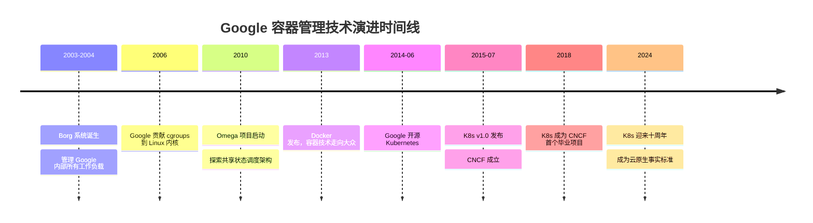
```mermaid
timeline
    title Google 容器管理技术演进时间线
    2003-2004 : Borg 系统诞生
              : 管理 Google 内部所有工作负载
    2006 : Google 贡献 cgroups 到 Linux 内核
    2010 : Omega 项目启动
         : 探索共享状态调度架构
    2013 : Docker 发布，容器技术走向大众
    2014-06 : Google 开源 Kubernetes
    2015-07 : K8s v1.0 发布
            : CNCF 成立
    2018 : K8s 成为 CNCF 首个毕业项目
    2024 : K8s 迎来十周年
         : 成为云原生事实标准
```

### 1.3 K8s 在云原生生态中的地位

#### CNCF 的成立与云原生版图

2015 年，Cloud Native Computing Foundation（CNCF，云原生计算基金会）在 Linux 基金会旗下成立，K8s 是其第一个托管项目。CNCF 的使命是"推动云原生技术的普及和可持续发展"。

经过近十年的发展，CNCF 的云原生全景图（Landscape）已经涵盖了上千个项目，覆盖容器运行时、编排调度、服务网格、可观测性、安全、存储、网络等各个领域。而 Kubernetes 始终处于这张图谱的核心位置——它就像是一个"操作系统内核"，其他所有云原生项目都是围绕它构建的"应用程序"或"驱动程序"。

#### K8s 与云原生的关系

"云原生"（Cloud Native）这个概念常常被过度解读，但其核心思想其实很简单：**在云环境中，以最高效的方式构建和运行应用程序**。CNCF 给出的官方定义是：云原生技术使组织能够在公有云、私有云和混合云等现代动态环境中，构建和运行可弹性扩展的应用。

云原生的代表技术包括容器、服务网格、微服务、不可变基础设施和声明式 API，而 K8s 恰好是将这些技术串联在一起的核心纽带。容器是 K8s 管理的基本单元，微服务通过 K8s 的 Service 机制实现服务发现和负载均衡，不可变基础设施通过 K8s 的滚动更新和声明式配置来实践，声明式 API 更是 K8s 的设计灵魂。

#### 行业数据：为什么 K8s 成为事实标准

根据 Pepperdata 发布的行业调研报告，K8s 在企业中的采用率持续攀升：

**超过 54% 的企业正在将工作负载迁移到 Kubernetes**，这意味着 K8s 已经从"新兴技术"进入了"主流采用"阶段。不仅是互联网公司，金融、制造、零售等传统行业也在积极拥抱 K8s。

在大数据领域，**Spark 是运行在 K8s 上占比最多的大数据应用，达到 63%**。Spark on K8s 相比传统的 Spark on YARN 方案具有多个优势：统一的资源管理平面（不再需要维护独立的 YARN 集群）、更好的资源隔离（容器级别的 cgroup 隔离）、以及与在线服务共享集群带来的资源利用率提升。

更值得关注的是，**77% 的受访者预计未来会将 50% 或更多的应用迁移到 K8s**。这一数据表明，K8s 不仅是当下的选择，更是未来的方向。

美团在 Spark on K8s 方面也有深入实践。Kubernetes 容器平台支持大数据作业与在线服务混合部署，通过优先级调度和弹性资源池机制，在保障在线服务 SLA 的前提下，将离线大数据作业调度到空闲资源上运行，集群整体资源利用率显著提升。

#### 主要云厂商的 K8s 服务

K8s 成为事实标准的另一个有力证据是：全球所有主流云服务商都提供了托管 K8s 服务。

| 云厂商 | 服务名称 | 简介 |
|--------|----------|------|
| Amazon Web Services | EKS (Elastic Kubernetes Service) | 最早期的托管 K8s 服务之一，与 AWS 生态深度集成 |
| Microsoft Azure | AKS (Azure Kubernetes Service) | 与 Azure AD、Azure Monitor 等深度整合 |
| Google Cloud | GKE (Google Kubernetes Engine) | K8s 的"亲儿子"，功能最为完善 |
| 阿里云 | ACK (Alibaba Cloud Container Service for Kubernetes) | 国内最大的公有云 K8s 服务 |
| 华为云 | CCE (Cloud Container Engine) | 支持边缘计算和混合云场景 |
| 腾讯云 | TKE (Tencent Kubernetes Engine) | 与腾讯生态集成 |

这些托管服务的共同特点是：用户无需关心 K8s 控制平面（Master 节点）的运维，云厂商负责 API Server、etcd、Scheduler 等核心组件的高可用部署和版本升级，并提供 API Server 的 SLA 保障（通常为 99.95% 或更高）。美团内部的 K8s 托管集群同样提供 API Server 99.95% 的 SLA 保障。

### 1.4 K8s 解决了什么问题

要理解 K8s 的价值，需要先回顾应用部署方式的演进历史。

#### 传统部署 vs 虚拟化部署 vs 容器化部署

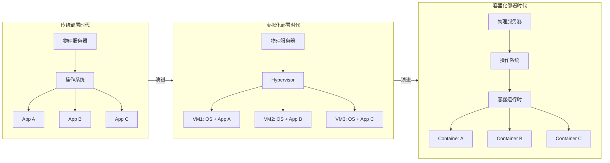
```mermaid
graph LR
    subgraph era1["传统部署时代"]
        PM["物理服务器"]
        OS1["操作系统"]
        A1["App A"]
        A2["App B"]
        A3["App C"]
        PM --> OS1 --> A1 & A2 & A3
    end

    subgraph era2["虚拟化部署时代"]
        PM2["物理服务器"]
        HV["Hypervisor"]
        VM1["VM1: OS + App A"]
        VM2["VM2: OS + App B"]
        VM3["VM3: OS + App C"]
        PM2 --> HV --> VM1 & VM2 & VM3
    end

    subgraph era3["容器化部署时代"]
        PM3["物理服务器"]
        OS3["操作系统"]
        CR["容器运行时"]
        C1["Container A"]
        C2["Container B"]
        C3["Container C"]
        PM3 --> OS3 --> CR --> C1 & C2 & C3
    end

    era1 -->|演进| era2 -->|演进| era3
```

**物理机部署时代**：在最早的阶段，应用程序直接运行在物理服务器上。一台服务器上可能运行多个应用，它们共享 CPU、内存和磁盘资源。这种方式的问题是严重的：应用之间没有隔离，一个应用的资源消耗可能影响其他应用的正常运行。比如某个 Java 应用发生内存泄漏导致 OOM（Out Of Memory），可能触发操作系统的 OOM Killer 杀掉其他关键进程。为了规避风险，运维团队往往采用"一机一应用"的保守策略，但这又导致了严重的资源浪费——一台 64GB 内存的服务器可能只为一个峰值内存 8GB 的应用服务，利用率不足 15%。

**虚拟机部署时代**：虚拟化技术（以 VMware vSphere、KVM 为代表）的出现解决了隔离问题。通过 Hypervisor（虚拟机监控程序），一台物理机可以划分为多台虚拟机，每台虚拟机拥有独立的操作系统、独立的内核、独立的资源配额。应用之间的隔离性和安全性得到了根本保障。然而，虚拟化的代价也是显著的：每台虚拟机都需要运行一个完整的 Guest OS（通常占用 512MB-2GB 内存），Hypervisor 自身也有性能开销（通常 5%-15% 的 CPU 损耗），虚拟机的启动时间以分钟计（需要完成内核引导、系统初始化等过程），镜像体积动辄数 GB。

**容器化部署时代**：容器技术保留了虚拟机"隔离"的核心优势，同时消除了虚拟化层的 overhead。容器直接运行在宿主机的操作系统内核之上，通过 Linux Namespace 实现进程视图隔离（每个容器认为自己独占一个操作系统），通过 Cgroups 实现资源使用限制（CPU、内存、IO 等）。容器不需要运行独立的操作系统内核，因此启动速度极快（毫秒级别），镜像体积小（通常几十 MB 到几百 MB），资源 overhead 几乎可以忽略。

但容器化本身只解决了"单个应用的打包和运行"问题，当容器数量从几个增长到数百、数千甚至数万个时，新的问题出现了：如何自动化地调度这些容器到合适的机器上？如何处理容器故障？如何实现容器间的网络通信？如何实现滚动升级和回滚？——这就是**容器编排**的领域，也是 Kubernetes 要解决的核心问题。

#### K8s 具体解决的问题

**资源强隔离**：K8s 通过 Linux Cgroups 为每个容器提供精确的资源隔离。以美团 Kubernetes 平台为例，典型的宿主机规格为 16 核 CPU / 64GB 内存，每个容器的 CPU 配额设置为 4 核（对应 cgroup 的 cpu.cfs_quota_us/cpu.cfs_period_us = 400000/100000），内存限制为 4Gi。这意味着一台宿主机可以运行约 4 个容器实例（预留部分资源给系统进程和 K8s 组件），每个容器严格限制在 4 核 4Gi 的资源框内，互不干扰。

```yaml
# K8s Pod 资源限制配置示例
apiVersion: v1
kind: Pod
metadata:
  name: resource-demo
spec:
  containers:
  - name: app
    image: nginx:1.24
    resources:
      requests:          # 调度时的资源请求量（保障量）
        cpu: "2"         # 请求 2 核 CPU
        memory: "2Gi"    # 请求 2Gi 内存
      limits:            # 资源使用上限（硬限制）
        cpu: "4"         # 最多使用 4 核 CPU
        memory: "4Gi"    # 最多使用 4Gi 内存
```

这里 `requests` 和 `limits` 的含义不同：`requests` 是调度器分配资源的依据，Pod 调度到某个 Node 时，K8s 会确保该 Node 上有足够的可分配资源满足 requests；`limits` 是 cgroup 强制执行的硬上限，容器实际使用的 CPU 不会超过 limits 中设定的值，如果内存使用超过 limits，容器会被 OOM Kill。

**存算分离提高资源利用率**：传统架构中，计算和存储往往绑定在同一台机器上，导致资源利用率低——计算密集型应用无法充分使用机器的磁盘空间，存储密集型应用又浪费了 CPU 资源。K8s 原生支持存算分离架构，通过 PersistentVolume（PV）和 PersistentVolumeClaim（PVC）机制，存储可以独立于计算节点进行管理和扩展。容器可以灵活挂载远程存储（NFS、Ceph、云厂商的 EBS/云盘等），计算节点变为"无状态"的资源池，可以根据负载灵活扩缩。

**快速弹性扩缩容**：K8s 提供了多层次的弹性能力。HPA（Horizontal Pod Autoscaler）可以根据 CPU 利用率、内存使用量或自定义指标自动增减 Pod 副本数量；VPA（Vertical Pod Autoscaler）可以自动调整单个 Pod 的资源配额；Cluster Autoscaler 可以根据调度需求自动增减集群中的 Node 节点数量。这三层弹性机制组合在一起，使得应用可以从容应对流量波动——电商大促时自动扩容，低谷时自动缩容释放资源。

```yaml
# HPA 自动扩缩容配置示例
apiVersion: autoscaling/v2
kind: HorizontalPodAutoscaler
metadata:
  name: web-app-hpa
spec:
  scaleTargetRef:
    apiVersion: apps/v1
    kind: Deployment
    name: web-app
  minReplicas: 3          # 最少 3 个副本
  maxReplicas: 50         # 最多 50 个副本
  metrics:
  - type: Resource
    resource:
      name: cpu
      target:
        type: Utilization
        averageUtilization: 70  # CPU 利用率超过 70% 触发扩容
```

**高效迭代和运维**：K8s 的声明式 API 和控制器模式使得应用的发布、升级和回滚变得简单可靠。通过 Deployment 的滚动更新策略（Rolling Update），K8s 可以逐步用新版本的 Pod 替换旧版本，过程中始终保持一定数量的可用实例，实现零停机发布。如果新版本出现问题，一条 `kubectl rollout undo` 命令即可回滚到上一个版本。容器化的环境还使得版本管理更加灵活——每个版本对应一个不可变的容器镜像，不同环境（开发、测试、预发、生产）运行的是同一个镜像，消除了"在我本地能跑"的问题。

---

## 第二章：容器技术基础

Kubernetes 是容器的编排平台，因此深入理解容器技术是学好 K8s 的前提。本章将从容器技术的发展历程讲起，深入剖析容器底层的三大核心技术——Namespace、Cgroups 和 UnionFS，然后介绍 Docker 的核心概念和容器运行时的演进。

### 2.1 容器技术的前世今生

容器技术并非 Docker 的发明，它的历史可以追溯到 1979 年。

**chroot（1979 年）**：容器技术的"始祖"是 Unix V7 中引入的 `chroot` 系统调用。chroot 可以将一个进程的根目录（`/`）重定向到文件系统中的某个子目录，使得该进程只能看到这个子目录下的文件，无法访问外部的文件系统。这是最原始的"隔离"——文件系统层面的视图隔离。chroot 后来被广泛用于创建隔离的构建环境和沙箱，但它只隔离了文件系统，进程仍然可以看到主机上的所有进程、网络接口等信息。

```bash
# chroot 基本用法示例
# 创建一个隔离的文件系统环境
mkdir -p /myroot/{bin,lib,lib64}
cp /bin/bash /myroot/bin/
cp /lib/x86_64-linux-gnu/libc.so.6 /myroot/lib/
cp /lib64/ld-linux-x86-64.so.2 /myroot/lib64/

# 进入 chroot 环境，此时根目录变为 /myroot
sudo chroot /myroot /bin/bash
# 在 chroot 环境中，ls / 只能看到 bin, lib, lib64
```

**Linux Containers (LXC)（2008 年）**：2008 年，随着 Linux 内核中 Namespace 和 Cgroups 功能的逐步完善，LXC 项目应运而生。LXC 是第一个完整的 Linux 容器管理方案，它组合使用了 Namespace（隔离进程视图）、Cgroups（限制资源使用）和 chroot（隔离文件系统），提供了一个接近虚拟机但没有 Hypervisor 开销的轻量级隔离环境。LXC 的出现标志着现代容器技术的雏形已经成型，但它的用户体验还很原始——配置复杂，缺乏标准化的镜像格式和分发机制。

**Docker 的诞生（2013 年）**：2013 年 3 月，一家名为 dotCloud 的 PaaS 公司在 PyCon 大会上展示了一个名为 Docker 的开源项目。Docker 的早期版本实际上是对 LXC 的封装，但它带来了两个革命性的创新：一是**标准化的镜像格式**——通过 Dockerfile 和分层镜像（Layered Image），开发者可以像写代码一样定义运行环境，并通过 Docker Registry 轻松分发；二是**极其简洁的用户体验**——一条 `docker run` 命令就能启动一个隔离的容器。这两个创新彻底降低了容器技术的使用门槛，Docker 迅速在开发者社区中引爆式传播，"容器"这个概念从此走向大众。

**容器标准化：OCI 规范**：随着容器技术的爆发，社区意识到需要一个中立的标准来避免供应商锁定。2015 年 6 月，Docker、Google、CoreOS、微软、红帽等公司联合成立了 OCI（Open Container Initiative，开放容器计划），制定了两个核心标准：OCI Runtime Spec（定义了如何运行容器，参考实现为 runc）和 OCI Image Spec（定义了容器镜像格式）。OCI 标准的建立确保了不同的容器运行时（Docker、containerd、CRI-O 等）可以使用相同格式的镜像，实现互操作性。

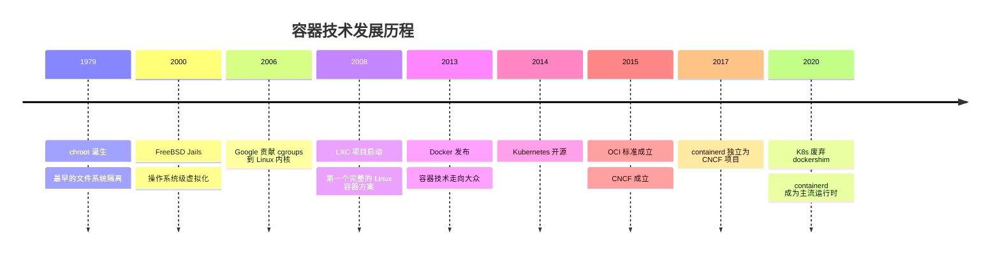
```mermaid
timeline
    title 容器技术发展历程
    1979 : chroot 诞生
         : 最早的文件系统隔离
    2000 : FreeBSD Jails
         : 操作系统级虚拟化
    2006 : Google 贡献 cgroups 到 Linux 内核
    2008 : LXC 项目启动
         : 第一个完整的 Linux 容器方案
    2013 : Docker 发布
         : 容器技术走向大众
    2014 : Kubernetes 开源
    2015 : OCI 标准成立
         : CNCF 成立
    2017 : containerd 独立为 CNCF 项目
    2020 : K8s 废弃 dockershim
         : containerd 成为主流运行时
```

### 2.2 容器核心技术原理

容器不是一种独立的技术实体，而是 Linux 内核中多种功能的组合运用。理解容器，关键是理解三大支柱技术：Namespace（隔离）、Cgroups（限制）和 UnionFS（文件系统）。

#### Linux Namespace（命名空间隔离）

Namespace 是 Linux 内核提供的资源隔离机制。每个 Namespace 封装了一种全局系统资源的抽象，使得 Namespace 内的进程看起来拥有自己独立的全局资源实例。通俗地说，Namespace 就是给进程戴上了一副"有色眼镜"——进程只能看到 Namespace 内的资源，无法感知外部的世界。

Linux 内核目前支持 7 种 Namespace：

**PID Namespace（进程 ID 隔离）**：每个 PID Namespace 都有独立的进程编号空间。在容器内部，进程号从 1 开始编号，容器中的第一个进程（通常是应用的入口进程）拥有 PID 1，就像一个独立的操作系统中的 init 进程。但从宿主机的视角看，这些进程只是宿主机上的普通进程，拥有宿主机全局的 PID 编号。

```bash
# 演示 PID Namespace 隔离
# 在宿主机上运行一个隔离的 bash，它会看到自己的 PID 为 1
sudo unshare --pid --fork --mount-proc bash
# 在这个隔离环境中执行 ps aux，只能看到这个 bash 进程和 ps 自身
ps aux
# 输出：
# USER   PID %CPU %MEM    VSZ   RSS TTY  STAT START   TIME COMMAND
# root     1  0.0  0.0   7236  4016 pts/0 S  10:00   0:00 bash
# root     2  0.0  0.0  10072  3356 pts/0 R+ 10:00   0:00 ps aux
```

**Network Namespace（网络隔离）**：每个 Network Namespace 拥有独立的网络协议栈——独立的网络设备、IP 地址、路由表、端口空间、iptables 规则等。容器可以有自己的 eth0 网卡和 IP 地址，不同容器可以监听相同的端口号而不冲突。容器间的网络通信需要通过虚拟网络设备（veth pair）和网桥（bridge）来连接。

**Mount Namespace（文件系统挂载隔离）**：每个 Mount Namespace 拥有独立的挂载点列表。容器可以挂载自己的文件系统（通常是通过容器镜像构建的 rootfs），而不影响宿主机或其他容器的文件系统。这是 chroot 的进化版——不仅隔离了根目录，还隔离了所有的挂载操作。

**UTS Namespace（主机名和域名隔离）**：每个 UTS Namespace 可以拥有独立的主机名（hostname）和域名（domainname）。这使得每个容器可以有自己的主机名，例如容器内执行 `hostname` 命令返回的是容器的名称而非宿主机的名称。

**IPC Namespace（进程间通信隔离）**：隔离了 System V IPC 和 POSIX 消息队列。不同 IPC Namespace 中的进程无法通过共享内存、信号量等 IPC 机制进行通信，确保容器间的 IPC 资源互相不可见。

**User Namespace（用户和组 ID 隔离）**：允许容器内的进程拥有不同于宿主机的 UID/GID 映射。一个在容器内以 root（UID 0）身份运行的进程，在宿主机上可能映射为一个普通用户（例如 UID 65534），从而提升安全性——即使容器被攻破，攻击者在宿主机上也没有 root 权限。

**Cgroup Namespace（Cgroup 视图隔离）**：隔离了 cgroup 的目录视图。容器内的进程查看 `/proc/self/cgroup` 时，看到的是以自己的 cgroup 为根的相对路径，而非宿主机上的完整路径。这既是安全考虑（防止信息泄漏），也提供了更好的封装性。

```bash
# 创建一个具有多种 Namespace 隔离的环境
sudo unshare --pid --net --mount --uts --ipc --fork bash

# 设置独立的主机名（UTS Namespace 隔离）
hostname my-container
hostname   # 输出: my-container

# 查看网络设备（Network Namespace 隔离）
ip addr    # 只能看到一个 lo 回环设备，没有 eth0
```

#### Linux Cgroups（资源限制）

如果说 Namespace 解决的是"看到什么"（视图隔离），那么 Cgroups（Control Groups）解决的是"用多少"（资源限制）。Cgroups 是 Linux 内核提供的资源管理机制，可以对一组进程的 CPU、内存、磁盘 IO、网络带宽等资源使用进行限制、记账和隔离。

Cgroups 最初由 Google 的工程师 Paul Menage 和 Rohit Seth 在 2006 年提出并贡献到 Linux 内核（最初叫 "process containers"，后更名为 cgroups）。目前 Linux 内核中有两个版本：cgroups v1 和 cgroups v2，后者提供了统一的层次结构和更一致的接口，正在逐步取代 v1。

**CPU 限制**：Cgroups 通过 CFS（Completely Fair Scheduler）的 quota 机制实现 CPU 限制。核心参数有两个——`cpu.cfs_period_us`（调度周期，默认 100000 微秒即 100ms）和 `cpu.cfs_quota_us`（在一个调度周期内允许使用的 CPU 时间上限）。

以美团 Kubernetes 平台的配置为例，容器的 CPU 配额设置为 4 核，对应的 cgroup 参数为 `cpu.cfs_quota_us = 400000`，`cpu.cfs_period_us = 100000`。计算公式为：可用 CPU 核数 = quota / period = 400000 / 100000 = 4 核。这意味着在每个 100ms 的调度周期内，该容器内所有进程加起来最多使用 400ms 的 CPU 时间，等价于持续使用 4 个 CPU 核心的算力。

```bash
# 在 cgroups v1 中查看和设置 CPU 限制
# 创建一个 cgroup
sudo mkdir /sys/fs/cgroup/cpu/my-container

# 设置 CPU 配额为 4 核（400000/100000 = 4）
echo 400000 | sudo tee /sys/fs/cgroup/cpu/my-container/cpu.cfs_quota_us
echo 100000 | sudo tee /sys/fs/cgroup/cpu/my-container/cpu.cfs_period_us

# 将进程加入 cgroup
echo $PID | sudo tee /sys/fs/cgroup/cpu/my-container/cgroup.procs

# 在 cgroups v2 中等价配置
# echo "400000 100000" | sudo tee /sys/fs/cgroup/my-container/cpu.max
```

**内存限制**：Cgroups 对内存的限制是"硬限制"——当容器使用的内存超过限制值时，内核的 OOM Killer 会杀掉容器中的进程。K8s 中通过 `resources.limits.memory` 设置，例如 `4Gi` 表示容器最多使用 4GiB 内存。

```bash
# cgroups v1 设置内存限制为 4Gi
echo 4294967296 | sudo tee /sys/fs/cgroup/memory/my-container/memory.limit_in_bytes

# cgroups v2 等价配置
# echo 4294967296 | sudo tee /sys/fs/cgroup/my-container/memory.max
```

**磁盘 IO 限制**：通过 blkio 子系统（cgroups v1）或 io 控制器（cgroups v2）限制容器对块设备的读写速率和 IOPS（每秒 IO 操作数），防止某个容器的 IO 密集操作影响同一宿主机上的其他容器。

**网络带宽限制**：Cgroups 本身不直接提供网络带宽限制功能（net_cls 和 net_prio 子系统只提供分类和优先级标记）。实际的网络限速通常通过 Linux 的 TC（Traffic Control）工具配合 cgroup 的分类标记来实现，或者使用 CNI 插件在网络层面进行限制。

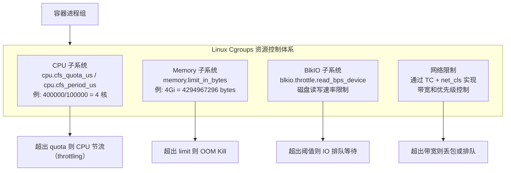
```mermaid
graph TB
    subgraph cgroup["Linux Cgroups 资源控制体系"]
        CPU["CPU 子系统<br/>cpu.cfs_quota_us / cpu.cfs_period_us<br/>例: 400000/100000 = 4 核"]
        MEM["Memory 子系统<br/>memory.limit_in_bytes<br/>例: 4Gi = 4294967296 bytes"]
        IO["BlkIO 子系统<br/>blkio.throttle.read_bps_device<br/>磁盘读写速率限制"]
        NET["网络限制<br/>通过 TC + net_cls 实现<br/>带宽和优先级控制"]
    end

    PROC["容器进程组"] --> cgroup
    CPU --> ENFORCE1["超出 quota 则 CPU 节流（throttling）"]
    MEM --> ENFORCE2["超出 limit 则 OOM Kill"]
    IO --> ENFORCE3["超出阈值则 IO 排队等待"]
    NET --> ENFORCE4["超出带宽则丢包或排队"]
```

#### UnionFS（联合文件系统）

UnionFS 是容器镜像分层存储的基础技术。它允许将多个目录（称为"层"或"branch"）"透明地"叠加在一起，呈现为一个统一的文件系统视图。

**OverlayFS 的工作原理**：OverlayFS 是目前最主流的联合文件系统实现（已合入 Linux 内核主线），也是美团 Kubernetes 平台选用的文件系统方案。OverlayFS 将文件系统分为三层：

lowerdir（只读的下层）：包含镜像中所有层的内容，这些层是不可修改的。每一层都可能包含一些文件和目录，层与层之间通过叠加形成完整的文件系统。

upperdir（可读写的上层）：容器运行时产生的所有文件修改（创建、修改、删除）都记录在这一层。

merged（合并视图）：将 lowerdir 和 upperdir 合并后呈现给用户的最终视图。读取文件时优先从 upperdir 查找，如果 upperdir 中不存在则从 lowerdir 查找；写入文件时，如果文件来自 lowerdir，会先"复制"到 upperdir（这个过程称为 Copy-on-Write），然后在 upperdir 中修改。

```bash
# OverlayFS 手动挂载示例
# 创建目录结构
mkdir -p /tmp/overlay/{lower,upper,work,merged}

# 在 lower 层写入一些文件（模拟镜像层）
echo "base config" > /tmp/overlay/lower/config.txt
echo "base app" > /tmp/overlay/lower/app.txt

# 挂载 OverlayFS
sudo mount -t overlay overlay \
  -o lowerdir=/tmp/overlay/lower,upperdir=/tmp/overlay/upper,workdir=/tmp/overlay/work \
  /tmp/overlay/merged

# 查看合并视图——可以看到 lower 层的文件
ls /tmp/overlay/merged/   # 输出: app.txt  config.txt

# 修改文件——修改自动写入 upper 层（Copy-on-Write）
echo "modified config" > /tmp/overlay/merged/config.txt

# lower 层不受影响
cat /tmp/overlay/lower/config.txt    # 输出: base config
# 修改记录在 upper 层
cat /tmp/overlay/upper/config.txt    # 输出: modified config
```

**镜像分层存储**：Docker/容器镜像正是利用了 UnionFS 的分层特性。一个镜像由多个只读层组成，每一层代表 Dockerfile 中的一条指令。例如 `FROM ubuntu:22.04` 是基础层，`RUN apt-get update && apt-get install -y nginx` 在基础层之上添加了一个包含 nginx 相关文件的新层，`COPY app.js /app/` 又添加了一个包含应用代码的层。

分层存储带来两个重要优势：一是**层共享**——如果多个镜像基于相同的基础层（如 ubuntu:22.04），这个基础层在磁盘上只存储一份，显著节省了存储空间和镜像拉取时间；二是**增量更新**——更新应用时，通常只有最上面几层（应用代码和配置）发生变化，底层（操作系统和依赖）保持不变，因此镜像的推送和拉取只需传输变化的层。

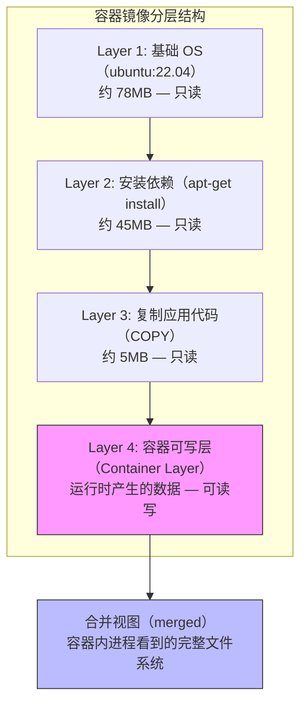
```mermaid
graph TB
    subgraph image["容器镜像分层结构"]
        L1["Layer 1: 基础 OS（ubuntu:22.04）<br/>约 78MB — 只读"]
        L2["Layer 2: 安装依赖（apt-get install）<br/>约 45MB — 只读"]
        L3["Layer 3: 复制应用代码（COPY）<br/>约 5MB — 只读"]
        L4["Layer 4: 容器可写层（Container Layer）<br/>运行时产生的数据 — 可读写"]
    end

    L1 --> L2 --> L3 --> L4
    L4 --> MERGED["合并视图（merged）<br/>容器内进程看到的完整文件系统"]

    style L4 fill:#f9f,stroke:#333
    style MERGED fill:#bbf,stroke:#333
```

### 2.3 Docker 核心概念

Docker 虽然不再是 K8s 的默认容器运行时，但它仍然是容器生态中最重要的开发工具。理解 Docker 的核心概念对于学习 K8s 至关重要。

**镜像（Image）**：镜像是一个**包含从操作系统层到应用层所有运行环境的只读软件包**。它不仅包含应用程序的二进制文件，还包含应用运行所需的全部依赖——系统库、语言运行时、配置文件等。镜像的这种"自包含"特性是容器化的核心价值——只要有镜像，就能在任何支持容器运行时的机器上运行应用，不再受宿主机环境的影响。

**容器（Container）**：容器是**镜像的运行实例**。如果把镜像类比为 Java 中的 Class，容器就是 Instance。从同一个镜像可以启动多个容器，每个容器都有独立的可写层、独立的进程空间、独立的网络栈。容器的生命周期是短暂的——它可以被创建、启动、停止、删除，容器删除后其可写层中的数据也随之消失（除非使用了持久化存储）。

**仓库（Registry）**：镜像仓库是存储和分发镜像的服务。Docker Hub 是最大的公共镜像仓库，企业通常会搭建私有仓库（如 Harbor）来存储内部镜像。镜像通过"仓库地址/命名空间/镜像名:标签"的格式唯一标识，例如 `docker.io/library/nginx:1.24`。

**Dockerfile 详解**：Dockerfile 是构建镜像的"配方"，每一条指令都会在镜像中创建一个新的层。

```dockerfile
# 多阶段构建示例：构建一个 Go 应用的生产镜像

# ========== 第一阶段：编译 ==========
FROM golang:1.22-alpine AS builder

# 设置工作目录
WORKDIR /app

# 先复制依赖文件，利用 Docker 层缓存
# 如果 go.mod 和 go.sum 没有变化，这两层会被缓存
COPY go.mod go.sum ./
RUN go mod download

# 复制源代码并编译
COPY . .
RUN CGO_ENABLED=0 GOOS=linux go build -o /app/server ./cmd/server

# ========== 第二阶段：运行 ==========
FROM alpine:3.19

# 安装时区数据和 CA 证书（HTTPS 请求需要）
RUN apk --no-cache add ca-certificates tzdata

# 创建非 root 用户（安全最佳实践）
RUN adduser -D -g '' appuser

# 从第一阶段复制编译好的二进制文件
COPY --from=builder /app/server /usr/local/bin/server

# 切换到非 root 用户
USER appuser

# 声明容器监听的端口
EXPOSE 8080

# 健康检查
HEALTHCHECK --interval=30s --timeout=3s --retries=3 \
  CMD wget -qO- http://localhost:8080/health || exit 1

# 容器启动命令
ENTRYPOINT ["server"]
```

这个 Dockerfile 展示了多阶段构建（Multi-stage Build）的最佳实践：第一阶段使用包含完整 Go 工具链的镜像进行编译，第二阶段仅使用一个极小的 Alpine 基础镜像来运行编译好的二进制文件。最终的生产镜像不包含编译器、源代码和开发依赖，体积可以从数百 MB 缩小到十几 MB，同时减小了攻击面。

### 2.4 容器运行时

容器运行时（Container Runtime）是真正负责创建和运行容器的软件。容器运行时的演进经历了从"大而全"到"分层解耦"的过程。

**Docker Engine**：Docker 最早是一个"全家桶"式的容器管理工具，从镜像构建、镜像管理、容器运行、网络管理到存储管理全部包办。但 K8s 并不需要 Docker 的全部功能——K8s 自己管理网络和存储，只需要一个纯粹的"容器运行时"来执行容器的创建和运行。Docker 的大量功能在 K8s 场景下反而成了不必要的复杂性和性能开销。

**containerd**：containerd 最初是 Docker 架构重构时拆分出来的核心容器运行时组件，后来被捐赠给 CNCF 成为独立项目。containerd 专注于容器生命周期管理——镜像的拉取和存储、容器的创建和运行、快照管理（OverlayFS 等）。它不包含镜像构建、Docker CLI 等开发者工具，但正因为功能专注，它的性能和稳定性更好，资源占用也更低。

**CRI-O**：CRI-O 是由红帽主导开发的轻量级容器运行时，专门为 K8s 设计。它直接实现了 K8s 的 CRI 接口，不依赖于 Docker 或 containerd，最小化了运行时的依赖和复杂性。

**CRI（Container Runtime Interface）标准**：CRI 是 K8s 定义的容器运行时接口标准。在 K8s 1.5 之前，K8s 直接通过内置的 dockershim 组件调用 Docker Engine，这种紧耦合的方式限制了容器运行时的选择。CRI 的引入将 K8s 与具体的容器运行时解耦——任何实现了 CRI gRPC 接口的运行时都可以被 K8s 使用。kubelet 通过 CRI 与容器运行时通信，主要包括两组接口：RuntimeService（容器的创建、启动、停止、删除）和 ImageService（镜像的拉取、查询、删除）。

K8s 从 1.20 版本开始正式废弃 dockershim（但 Docker 构建的镜像仍然可以正常使用，因为镜像格式符合 OCI 标准），到 1.24 版本彻底移除了 dockershim，containerd 和 CRI-O 成为了推荐的生产运行时。

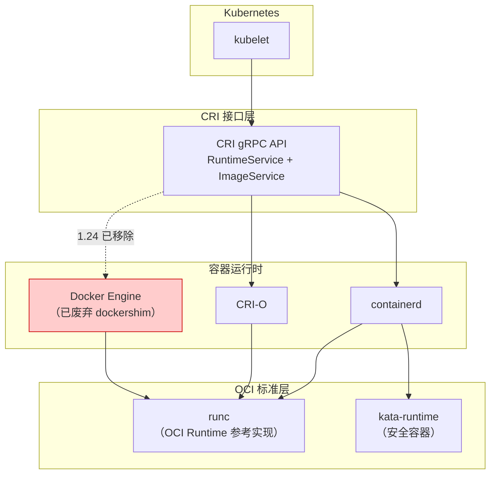
```mermaid
graph TB
    subgraph k8s["Kubernetes"]
        KUBELET["kubelet"]
    end

    subgraph cri["CRI 接口层"]
        CRI_API["CRI gRPC API<br/>RuntimeService + ImageService"]
    end

    subgraph runtimes["容器运行时"]
        CONTAINERD["containerd"]
        CRIO["CRI-O"]
        DOCKER["Docker Engine<br/>（已废弃 dockershim）"]
    end

    subgraph oci["OCI 标准层"]
        RUNC["runc<br/>（OCI Runtime 参考实现）"]
        KATA["kata-runtime<br/>（安全容器）"]
    end

    KUBELET --> CRI_API
    CRI_API --> CONTAINERD
    CRI_API --> CRIO
    CRI_API -.->|"1.24 已移除"| DOCKER
    CONTAINERD --> RUNC
    CONTAINERD --> KATA
    CRIO --> RUNC
    DOCKER --> RUNC

    style DOCKER fill:#fcc,stroke:#c00
```

**美团实践：containerd + OverlayFS 的运行时选择**

美团 Kubernetes 容器平台选用 containerd 作为容器运行时，搭配 OverlayFS 作为容器存储驱动。这个技术选型基于几方面的考量：containerd 相比完整的 Docker Engine 减少了约 30% 的内存占用和更低的调用链路延迟（kubelet → containerd → runc vs kubelet → dockershim → dockerd → containerd → runc）；OverlayFS 已合入 Linux 内核主线，稳定性经过大规模验证，且相比 AUFS、DeviceMapper 等方案具有更好的性能和更简单的运维。在美团的生产实践中，这一组合在数十万容器实例的规模下保持了稳定可靠的表现。

---

## 第三章：Kubernetes 架构全景解析

### 3.1 整体架构概览

Kubernetes 采用经典的 **Master-Worker 架构**（也称为**控制平面-数据平面**架构），这种架构分离了"决策"和"执行"的职责——控制平面负责集群的全局决策（调度、故障检测、配置管理等），数据平面负责实际运行工作负载。

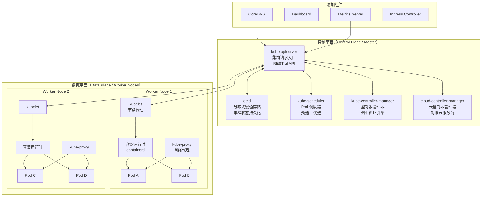
```mermaid
graph TB
    subgraph CP["控制平面（Control Plane / Master）"]
        API["kube-apiserver<br/>集群请求入口<br/>RESTful API"]
        ETCD["etcd<br/>分布式键值存储<br/>集群状态持久化"]
        SCHED["kube-scheduler<br/>Pod 调度器<br/>预选 + 优选"]
        CM["kube-controller-manager<br/>控制器管理器<br/>调和循环引擎"]
        CCM["cloud-controller-manager<br/>云控制器管理器<br/>对接云服务商"]
    end

    subgraph DP["数据平面（Data Plane / Worker Nodes）"]
        subgraph Node1["Worker Node 1"]
            KL1["kubelet<br/>节点代理"]
            KP1["kube-proxy<br/>网络代理"]
            CR1["容器运行时<br/>containerd"]
            POD1["Pod A"]
            POD2["Pod B"]
        end
        subgraph Node2["Worker Node 2"]
            KL2["kubelet"]
            KP2["kube-proxy"]
            CR2["容器运行时"]
            POD3["Pod C"]
            POD4["Pod D"]
        end
    end

    subgraph ADDONS["附加组件"]
        DNS["CoreDNS"]
        DASH["Dashboard"]
        METRICS["Metrics Server"]
        ING["Ingress Controller"]
    end

    API <--> ETCD
    API <--> SCHED
    API <--> CM
    API <--> CCM
    API <--> KL1
    API <--> KL2
    KL1 --> CR1 --> POD1 & POD2
    KL2 --> CR2 --> POD3 & POD4
    KP1 --> POD1 & POD2
    KP2 --> POD3 & POD4
    DNS --> API
    METRICS --> API
```

**控制平面（Control Plane）与数据平面（Data Plane）**

控制平面通常由 3 个或 5 个 Master 节点组成（奇数个节点以满足 etcd 的 Raft 一致性协议要求），负责集群的"大脑"功能。在生产环境中，控制平面组件通常部署在独立的机器上，不运行用户的工作负载，以确保管理功能的稳定性和性能。

数据平面由大量的 Worker 节点组成（可以从几台到数千台），每个 Worker 节点上运行着 kubelet 和 kube-proxy 两个核心组件以及容器运行时，负责实际运行用户的 Pod。

**Master 节点与 Worker 节点的关系**：Master 和 Worker 之间通过 kube-apiserver 进行通信。Worker 节点上的 kubelet 定期向 API Server 汇报节点状态和 Pod 状态（类似"心跳"），同时 watch API Server 获取新的任务指令。这种设计使得 Worker 节点是"无状态"的——即使某个 Worker 节点宕机，Master 可以将其上的 Pod 重新调度到其他健康的节点上。

**声明式 API 设计哲学**：K8s 的 API 设计是声明式的（declarative），而非命令式的（imperative）。用户不是告诉 K8s "创建一个容器，然后配置网络，然后挂载存储"（这是命令式的做法），而是告诉 K8s "我期望有 3 个运行 nginx 的 Pod，每个 Pod 有 2 核 CPU 和 4Gi 内存"。K8s 会持续将集群的实际状态向用户声明的"期望状态"（desired state）靠拢。如果某个 Pod 挂了，K8s 会自动创建新的 Pod 来恢复到 3 个副本的期望状态，而不需要用户介入。

这种设计的优势在于幂等性——无论系统当前处于什么状态，只要声明了期望状态，K8s 最终都会收敛到这个状态。这对于自动化运维至关重要。

### 3.2 控制平面组件详解

#### 3.2.1 kube-apiserver

kube-apiserver 是整个 K8s 集群的**请求入口和通信枢纽**。集群中所有组件之间的通信都不是直接进行的，而是通过 API Server 间接完成。这使得 API Server 成为了集群中唯一的"通信中心"。

**以 HTTP RESTful API 提供接口**：API Server 将 K8s 中的所有资源对象（Pod、Service、Deployment、Node 等）都暴露为 RESTful API 端点。每种资源都有标准的 CRUD 操作（Create、Read、Update、Delete）以及 Watch 操作（长连接监听资源变化）。

```bash
# API Server 的 RESTful API 示例

# 列出 default 命名空间下的所有 Pod
curl -k https://<apiserver>:6443/api/v1/namespaces/default/pods \
  -H "Authorization: Bearer <token>"

# 获取特定 Pod 的详细信息
curl -k https://<apiserver>:6443/api/v1/namespaces/default/pods/my-app \
  -H "Authorization: Bearer <token>"

# Watch 监听 Pod 变化事件（长连接，服务端推送）
curl -k https://<apiserver>:6443/api/v1/namespaces/default/pods?watch=true \
  -H "Authorization: Bearer <token>"

# 使用 kubectl（本质上也是调用 API Server）
kubectl get pods -n default -o json
kubectl describe pod my-app
kubectl apply -f deployment.yaml  # 声明式创建/更新资源
```

**API Server 是唯一与 etcd 直接通信的组件**：这是一个至关重要的架构设计原则。Scheduler、Controller Manager、kubelet 等组件都不直接访问 etcd，而是通过 API Server 进行数据的读写。API Server 充当了 etcd 的"代理"和"网关"，负责数据的验证、转换、版本控制和缓存。这种设计带来了几个好处：所有数据访问都有统一的认证授权和审计入口；API Server 内置了对象缓存（watch cache），减少了对 etcd 的直接压力；etcd 的存储格式和版本对其他组件完全透明。

**认证、授权、准入控制流程**：每个发送到 API Server 的请求都要经过三道"关卡"：

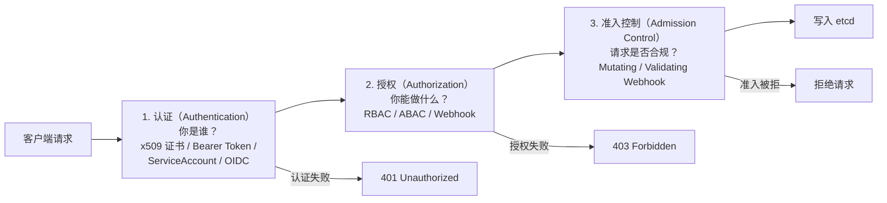
```mermaid
graph LR
    REQ["客户端请求"] --> AUTH["1. 认证（Authentication）<br/>你是谁？<br/>x509 证书 / Bearer Token /<br/>ServiceAccount / OIDC"]
    AUTH --> AUTHZ["2. 授权（Authorization）<br/>你能做什么？<br/>RBAC / ABAC / Webhook"]
    AUTHZ --> AC["3. 准入控制（Admission Control）<br/>请求是否合规？<br/>Mutating / Validating Webhook"]
    AC --> ETCD_WRITE["写入 etcd"]
    
    AUTH -->|认证失败| REJECT1["401 Unauthorized"]
    AUTHZ -->|授权失败| REJECT2["403 Forbidden"]
    AC -->|准入被拒| REJECT3["拒绝请求"]
```

认证（Authentication）阶段确认请求者的身份——可以通过 x509 客户端证书、Bearer Token、ServiceAccount Token、OpenID Connect 等方式。授权（Authorization）阶段检查该身份是否有权限执行请求的操作——最常用的是 RBAC（Role-Based Access Control，基于角色的访问控制），通过 Role/ClusterRole 和 RoleBinding/ClusterRoleBinding 定义权限策略。准入控制（Admission Control）阶段对请求内容进行最后的校验和修改——例如 LimitRanger 可以为没有设置资源限制的 Pod 自动添加默认的资源配额，PodSecurityPolicy 可以禁止特权容器的创建。

```yaml
# RBAC 配置示例：创建一个只读角色，允许查看 Pod 和 Service
apiVersion: rbac.authorization.k8s.io/v1
kind: Role
metadata:
  namespace: production
  name: pod-reader
rules:
- apiGroups: [""]           # 核心 API 组
  resources: ["pods", "services"]
  verbs: ["get", "list", "watch"]  # 只允许读操作
---
# 将角色绑定到用户
apiVersion: rbac.authorization.k8s.io/v1
kind: RoleBinding
metadata:
  name: read-pods
  namespace: production
subjects:
- kind: User
  name: developer-alice
  apiGroup: rbac.authorization.k8s.io
roleRef:
  kind: Role
  name: pod-reader
  apiGroup: rbac.authorization.k8s.io
```

#### 3.2.2 etcd

etcd 是一个基于 Go 语言开发的分布式键值存储系统（由 CoreOS 公司开发，后捐赠给 CNCF），在 K8s 中扮演着**集群"大脑"的"记忆"**角色——集群中所有资源对象的状态数据都持久化存储在 etcd 中。

**存储 K8s 的关键配置和用户配置**：etcd 中存储的数据涵盖集群的方方面面——所有命名空间下的 Pod、Service、Deployment、ConfigMap、Secret 等资源对象的定义和状态，节点的注册信息和健康状态，RBAC 的角色和绑定关系，自定义资源（CRD）的定义和实例，等等。可以说，etcd 中的数据就是集群的"全部真相"。

**etcd 是集群的最终事实来源（Source of Truth）**：在 K8s 的架构中，etcd 中的数据是唯一权威的真实状态。其他所有组件（Scheduler、Controller Manager、kubelet）本地维护的状态都是 etcd 数据的"缓存"或"派生"。如果某个组件的本地状态与 etcd 不一致，以 etcd 为准。这种"单一事实来源"的设计简化了分布式系统的一致性问题。

**Raft 一致性算法保证数据一致性**：etcd 使用 Raft 共识算法来保证集群中多个 etcd 节点之间的数据一致性。Raft 的核心思想是"领导者选举"——集群中的节点通过投票选出一个 Leader，所有的写操作都由 Leader 处理，Leader 将数据复制到多数（quorum）Follower 节点后才返回成功。如果 Leader 宕机，Follower 们会自动选出新的 Leader，确保服务不中断。

对于一个 N 个节点的 etcd 集群，它最多能容忍 (N-1)/2 个节点同时故障。因此生产环境通常部署 3 节点（容忍 1 节点故障）或 5 节点（容忍 2 节点故障）的 etcd 集群。

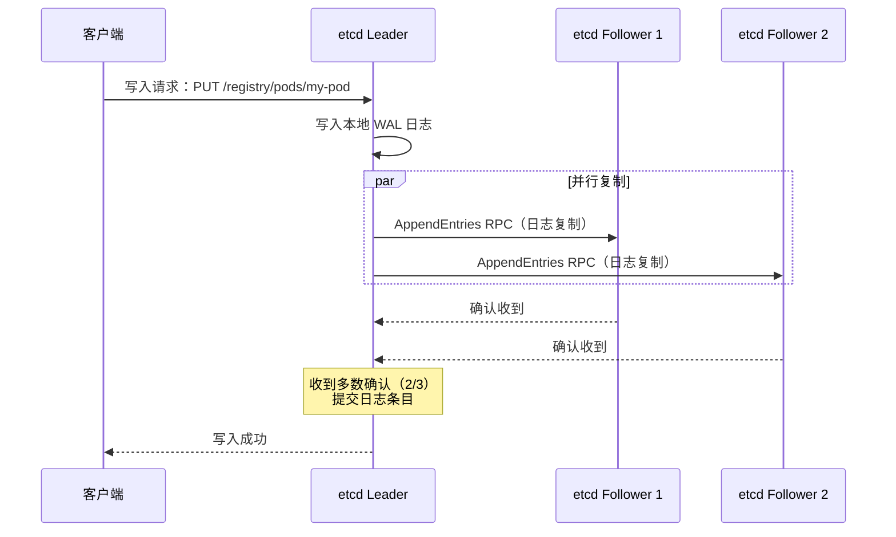
```mermaid
sequenceDiagram
    participant Client as 客户端
    participant Leader as etcd Leader
    participant F1 as etcd Follower 1
    participant F2 as etcd Follower 2

    Client->>Leader: 写入请求：PUT /registry/pods/my-pod
    Leader->>Leader: 写入本地 WAL 日志
    par 并行复制
        Leader->>F1: AppendEntries RPC（日志复制）
        Leader->>F2: AppendEntries RPC（日志复制）
    end
    F1-->>Leader: 确认收到
    F2-->>Leader: 确认收到
    Note over Leader: 收到多数确认（2/3）<br/>提交日志条目
    Leader-->>Client: 写入成功
```

```bash
# 查看 etcd 中存储的 K8s 数据示例
# 注意：需要使用 etcdctl 并提供正确的证书

# 列出所有存储的 key（K8s 资源在 etcd 中的路径格式：/registry/<资源类型>/<命名空间>/<名称>）
ETCDCTL_API=3 etcdctl get / --prefix --keys-only | head -20
# 输出示例：
# /registry/configmaps/default/kube-root-ca.crt
# /registry/deployments/default/nginx-deployment
# /registry/namespaces/default
# /registry/pods/default/nginx-deployment-abc123
# /registry/services/default/kubernetes

# 读取某个 Pod 在 etcd 中的数据
ETCDCTL_API=3 etcdctl get /registry/pods/default/nginx-deployment-abc123
```

**etcd event 集群拆分优化实践**

在大规模 K8s 集群中，etcd 的性能往往成为瓶颈。K8s 写入 etcd 的数据大致分为两类：资源对象数据（Pod、Service 等的定义和状态）和 Event 事件数据（如 Pod 启动成功、容器重启、调度成功等通知性事件）。Event 的写入量远大于资源对象数据——一个万级 Pod 规模的集群，每秒可能产生数百甚至数千条 Event。

美团 Kubernetes 平台在实践中采用了 **etcd event 集群拆分**策略：将 Event 数据存储到独立的 etcd 集群中，主 etcd 集群只存储关键的资源对象数据。这样做的好处是显著降低了主 etcd 集群的写入压力和存储体积，提升了集群的稳定性和性能。配置方式是在 kube-apiserver 的启动参数中指定 `--etcd-servers-overrides`：

```bash
# API Server 启动参数示例：将 Event 存储到独立的 etcd 集群
kube-apiserver \
  --etcd-servers=https://etcd-main-1:2379,https://etcd-main-2:2379,https://etcd-main-3:2379 \
  --etcd-servers-overrides=/events#https://etcd-event-1:2379;https://etcd-event-2:2379;https://etcd-event-3:2379 \
  # ... 其他参数
```

#### 3.2.3 kube-scheduler

kube-scheduler 是 K8s 的**资源调度器**，负责一项核心工作：为新创建的、尚未绑定 Node 的 Pod 选择一个最合适的 Node 节点来运行。

调度器的输入是一个待调度的 Pod 和集群中所有可用 Node 的信息，输出是一个"Pod → Node 的绑定关系"。这个看似简单的过程实际上涉及大量的约束检查和优化决策。

**调度算法：预选（Predicates/Filtering）和优选（Priorities/Scoring）**

调度过程分为两个阶段：

**第一阶段——过滤（Filtering）**：从集群中所有 Node 中过滤掉不满足 Pod 调度条件的节点。过滤条件（称为 Predicates 或 Filter Plugins）包括：

- `PodFitsResources`：节点的可分配资源（Allocatable）是否满足 Pod 的 requests
- `PodFitsHostPorts`：节点上 Pod 请求的 hostPort 是否已被占用
- `NodeSelector`：节点的标签是否匹配 Pod 的 nodeSelector
- `PodToleratesNodeTaints`：Pod 是否容忍节点的 Taints（污点）
- `NodeAffinity`：节点亲和性规则是否满足
- `PodAffinity/PodAntiAffinity`：Pod 的亲和性和反亲和性规则

经过过滤后，只保留满足所有条件的"候选 Node"列表。如果没有任何 Node 通过过滤，Pod 将进入 Pending 状态，等待资源释放。

**第二阶段——打分（Scoring）**：对所有候选 Node 进行评分，选出得分最高的 Node。打分策略（称为 Priorities 或 Score Plugins）包括：

- `LeastRequestedPriority`：倾向于选择资源使用率低的节点（分散负载）
- `BalancedResourceAllocation`：倾向于选择 CPU 和内存利用率均衡的节点
- `ImageLocality`：倾向于选择已有 Pod 所需镜像的节点（减少镜像拉取时间）
- `InterPodAffinityPriority`：根据 Pod 间亲和性规则打分
- `NodeAffinityPriority`：根据节点亲和性偏好打分

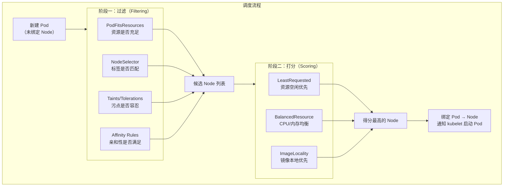
```mermaid
graph TB
    subgraph scheduling["调度流程"]
        NEW_POD["新建 Pod<br/>（未绑定 Node）"]
        
        subgraph filter["阶段一：过滤（Filtering）"]
            F1["PodFitsResources<br/>资源是否充足"]
            F2["NodeSelector<br/>标签是否匹配"]
            F3["Taints/Tolerations<br/>污点是否容忍"]
            F4["Affinity Rules<br/>亲和性是否满足"]
        end
        
        CANDIDATES["候选 Node 列表"]
        
        subgraph score["阶段二：打分（Scoring）"]
            S1["LeastRequested<br/>资源空闲优先"]
            S2["BalancedResource<br/>CPU/内存均衡"]
            S3["ImageLocality<br/>镜像本地优先"]
        end
        
        BEST["得分最高的 Node"]
        BIND["绑定 Pod → Node<br/>通知 kubelet 启动 Pod"]
    end
    
    NEW_POD --> filter
    F1 & F2 & F3 & F4 --> CANDIDATES
    CANDIDATES --> score
    S1 & S2 & S3 --> BEST
    BEST --> BIND
```

```yaml
# 调度约束配置示例：使用 NodeSelector、Affinity 和 Tolerations
apiVersion: apps/v1
kind: Deployment
metadata:
  name: web-app
spec:
  replicas: 3
  selector:
    matchLabels:
      app: web
  template:
    metadata:
      labels:
        app: web
    spec:
      # nodeSelector：简单的节点选择（必须匹配）
      nodeSelector:
        disk-type: ssd

      # Node 亲和性：更灵活的节点选择规则
      affinity:
        nodeAffinity:
          # 硬性要求：必须调度到 zone-a 或 zone-b
          requiredDuringSchedulingIgnoredDuringExecution:
            nodeSelectorTerms:
            - matchExpressions:
              - key: topology.kubernetes.io/zone
                operator: In
                values: ["zone-a", "zone-b"]
          # 软性偏好：尽量调度到有 gpu=true 标签的节点
          preferredDuringSchedulingIgnoredDuringExecution:
          - weight: 80
            preference:
              matchExpressions:
              - key: gpu
                operator: In
                values: ["true"]

        # Pod 反亲和性：同一应用的 Pod 尽量分散到不同节点
        podAntiAffinity:
          preferredDuringSchedulingIgnoredDuringExecution:
          - weight: 100
            podAffinityTerm:
              labelSelector:
                matchExpressions:
                - key: app
                  operator: In
                  values: ["web"]
              topologyKey: kubernetes.io/hostname

      # Tolerations：容忍带有特定污点的节点
      tolerations:
      - key: "dedicated"
        operator: "Equal"
        value: "high-memory"
        effect: "NoSchedule"

      containers:
      - name: web
        image: nginx:1.24
        resources:
          requests:
            cpu: "2"
            memory: "2Gi"
          limits:
            cpu: "4"
            memory: "4Gi"
```

#### 3.2.4 kube-controller-manager

kube-controller-manager 是 K8s 集群中**所有资源对象的自动化控制中心**。它本质上是一组控制器的集合，每个控制器负责管理一种特定类型的资源对象，确保资源对象的实际状态与用户声明的期望状态保持一致。

控制器的工作模式可以用一个简单的循环来概括——这就是 K8s 中最核心的设计模式之一：**控制循环（Control Loop）**，也称为调和循环（Reconciliation Loop）：

```
for {
    actualState := 获取资源对象的实际状态
    desiredState := 获取资源对象的期望状态
    if actualState != desiredState {
        执行操作使 actualState 趋向 desiredState
    }
}
```

控制器通过 API Server 的 Watch 机制持续监听相关资源对象的变化事件（创建、更新、删除），一旦检测到实际状态与期望状态不一致，就采取行动进行调和。

**核心控制器详解**：

**Node Controller（节点控制器）**：负责节点的生命周期管理和故障发现。Node Controller 定期检查每个节点的心跳状态（kubelet 每 10 秒向 API Server 发送一次心跳）。如果某个节点在 `node-monitor-grace-period`（默认 40 秒）内没有发送心跳，Node Controller 将该节点标记为 `NotReady`。如果节点持续不可达超过 `pod-eviction-timeout`（默认 5 分钟），Node Controller 会驱逐该节点上的所有 Pod，使它们被重新调度到其他健康节点。

**Replication Controller / ReplicaSet Controller（副本控制器）**：确保任何时候都有指定数量的 Pod 副本在运行。如果 Pod 因为节点故障或其他原因被删除，副本控制器会创建新的 Pod 来补足数量；如果 Pod 数量超过期望值（比如手动创建了额外的 Pod），副本控制器会删除多余的 Pod。ReplicaSet 是 Replication Controller 的升级版，支持基于集合的标签选择器（set-based selector）。

**Endpoints Controller（端点控制器）**：负责维护 Service 和 Pod 之间的映射关系。当 Service 关联的 Pod 发生变化（新增、删除、健康状态变化）时，Endpoints Controller 自动更新 Endpoints 对象中的 Pod IP 列表，确保 Service 的流量始终路由到健康的 Pod。

**Service Account & Token Controllers**：为每个新创建的 Namespace 自动创建一个默认的 ServiceAccount，并为 ServiceAccount 生成对应的 API 访问令牌（Token）。这使得 Namespace 中的 Pod 可以使用 ServiceAccount 的身份与 API Server 通信。

**ResourceQuota Controller（资源配额控制器）**：监控各个 Namespace 的资源使用量，确保不超过管理员设定的配额上限。例如可以限制一个 Namespace 最多创建 100 个 Pod、使用 200 核 CPU 和 400Gi 内存。

**Namespace Controller（命名空间控制器）**：管理 Namespace 的生命周期。当一个 Namespace 被删除时，Namespace Controller 会级联删除该 Namespace 下的所有资源对象（Pod、Service、ConfigMap 等），确保资源的完全清理。

**Service Controller**：与云平台的负载均衡器交互。当用户创建 `type: LoadBalancer` 类型的 Service 时，Service Controller 调用云厂商的 API 创建一个外部负载均衡器（如 AWS 的 ELB、阿里云的 SLB），并将负载均衡器的外部 IP 回填到 Service 的 `status.loadBalancer.ingress` 字段。

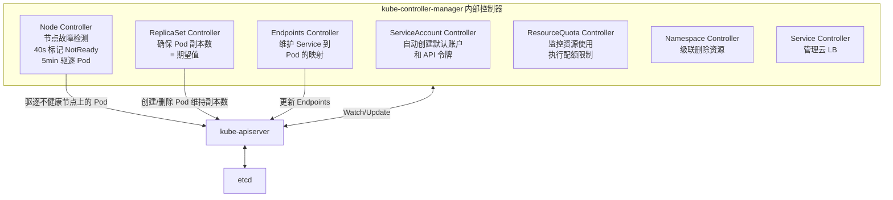
```mermaid
graph TB
    subgraph controllers["kube-controller-manager 内部控制器"]
        NC["Node Controller<br/>节点故障检测<br/>40s 标记 NotReady<br/>5min 驱逐 Pod"]
        RC["ReplicaSet Controller<br/>确保 Pod 副本数<br/>= 期望值"]
        EC["Endpoints Controller<br/>维护 Service 到<br/>Pod 的映射"]
        SAC["ServiceAccount Controller<br/>自动创建默认账户<br/>和 API 令牌"]
        RQC["ResourceQuota Controller<br/>监控资源使用<br/>执行配额限制"]
        NSC["Namespace Controller<br/>级联删除资源"]
        SC["Service Controller<br/>管理云 LB"]
    end

    API_SERVER["kube-apiserver"]
    ETCD2["etcd"]

    controllers <-->|"Watch/Update"| API_SERVER
    API_SERVER <--> ETCD2

    NC -->|"驱逐不健康节点上的 Pod"| API_SERVER
    RC -->|"创建/删除 Pod 维持副本数"| API_SERVER
    EC -->|"更新 Endpoints"| API_SERVER
```

#### 3.2.5 cloud-controller-manager

cloud-controller-manager（CCM）是 K8s 与云服务商集成的桥梁。它将与云平台紧密相关的控制逻辑从 kube-controller-manager 中分离出来，使得 K8s 的核心代码不依赖于特定的云服务商实现。

CCM 主要包含三类控制器：

**节点管理（Node Controller）**：当新的 Worker 节点加入集群时，CCM 通过云厂商的 API 获取该节点的详细信息——云实例 ID、公网/私网 IP 地址、实例类型（CPU/内存规格）、可用区（Availability Zone）等，并将这些信息填充到 Node 对象的 metadata 和 status 中。当云实例被销毁时，CCM 自动清理对应的 Node 对象。

**路由管理（Route Controller）**：在云环境中配置跨节点的网络路由，确保不同 Node 上的 Pod 可以通过云厂商的虚拟网络（VPC）互相通信。例如，在 AWS 中，Route Controller 会在 VPC 路由表中为每个 Node 的 Pod CIDR 添加路由规则。

**负载均衡管理（Service Controller）**：管理云厂商提供的负载均衡器资源。当用户创建 `type: LoadBalancer` 类型的 Service 时，CCM 调用云厂商 API 创建外部负载均衡器，配置健康检查、后端节点组等，并将负载均衡器的 VIP 回填到 Service 对象中。

对于运行在自建数据中心（on-premises）的 K8s 集群，不需要部署 CCM。美团 Kubernetes 平台基于自有数据中心，通过定制化的 CNI 网络插件和 flexvolume 存储插件替代了 CCM 的部分功能，实现了与内部网络和存储系统的集成。

### 3.3 节点组件详解

#### 3.3.1 kubelet

kubelet 是运行在每个 Worker 节点上的核心代理进程，可以形象地比喻为 Master 节点安插在 Worker 节点上的**"眼线"**——它既是 Master 观察 Worker 节点状态的"眼睛"，又是 Master 在 Worker 节点上执行指令的"双手"。

**定时向 API Server 汇报状态**：kubelet 每隔 10 秒向 API Server 发送一次 Node Status 更新（心跳），报告节点的健康状态、资源使用情况（CPU、内存、磁盘、PID 等可分配资源）、以及节点上所有 Pod 的运行状态。这些信息是 Scheduler 进行调度决策和 Node Controller 进行故障检测的基础数据来源。

**接受 Master 节点指示执行操作**：kubelet 通过 Watch 机制监听 API Server，获取调度到本节点的 Pod 定义（PodSpec）。收到新的 Pod 后，kubelet 调用容器运行时（通过 CRI 接口）创建容器、配置网络（通过 CNI 插件）、挂载存储卷（通过 CSI 插件或内置的 volume 插件），将 Pod 从"纸面定义"变为"实际运行的容器组"。

**容器生命周期管理**：kubelet 负责容器的完整生命周期——创建、启动、监控、重启、停止、删除。当 Pod 的定义发生变化（例如容器镜像版本更新），kubelet 会重新创建容器来应用变更。

**健康检查**：kubelet 支持三种健康检查探针，它们是 K8s 确保应用可靠运行的核心机制：

**Liveness Probe（存活探针）**：检测容器是否"还活着"。如果存活探针失败，kubelet 会杀掉容器并根据重启策略（restartPolicy）重启它。典型场景是检测应用是否陷入了死锁——进程还在，但已经无法处理请求。

**Readiness Probe（就绪探针）**：检测容器是否"准备好接收流量"。如果就绪探针失败，Endpoints Controller 会将该 Pod 从 Service 的端点列表中移除，不再向它转发流量。但与存活探针不同的是，就绪探针失败不会触发容器重启。典型场景是应用启动时需要加载缓存或预热连接池，在此期间不应接收流量。

**Startup Probe（启动探针）**：K8s 1.16 引入的探针类型，用于检测容器内的应用是否已经完成启动。在启动探针成功之前，存活探针和就绪探针不会工作。这解决了慢启动应用的问题——如果一个 Java 应用需要 60 秒才能完成初始化，设置过短的存活探针超时会导致容器在启动完成前被反复杀掉重启。

```yaml
# 健康检查探针完整配置示例
apiVersion: v1
kind: Pod
metadata:
  name: health-check-demo
spec:
  containers:
  - name: app
    image: my-app:v1.0
    ports:
    - containerPort: 8080

    # 启动探针：等待应用完成启动
    startupProbe:
      httpGet:
        path: /health/startup
        port: 8080
      initialDelaySeconds: 5     # 容器启动后 5 秒开始检测
      periodSeconds: 5           # 每 5 秒检测一次
      failureThreshold: 30       # 最多允许失败 30 次（总等待 5+30*5=155 秒）
      # 在启动探针成功之前，存活和就绪探针不工作

    # 存活探针：检测应用是否还活着
    livenessProbe:
      httpGet:
        path: /health/live
        port: 8080
      initialDelaySeconds: 0     # 启动探针成功后立即开始
      periodSeconds: 10          # 每 10 秒检测一次
      timeoutSeconds: 3          # 每次检测的超时时间
      failureThreshold: 3        # 连续失败 3 次则重启容器

    # 就绪探针：检测应用是否可以接收流量
    readinessProbe:
      httpGet:
        path: /health/ready
        port: 8080
      periodSeconds: 5           # 每 5 秒检测一次
      failureThreshold: 2        # 连续失败 2 次则从 Service 端点移除

    resources:
      requests:
        cpu: "2"
        memory: "2Gi"
      limits:
        cpu: "4"
        memory: "4Gi"

  # 重启策略
  restartPolicy: Always  # Always: 容器退出后始终重启（默认值）
                          # OnFailure: 仅在非零退出码时重启
                          # Never: 从不重启
```

**重启策略**：`restartPolicy: Always` 是最常用的策略，确保容器在任何情况下退出后都会被自动重启。kubelet 使用指数退避（exponential backoff）算法来控制重启频率——第一次重启间隔 10 秒，第二次 20 秒，第三次 40 秒……最大间隔 5 分钟。如果容器成功运行超过 10 分钟，退避计时器会重置。

#### 3.3.2 kube-proxy

kube-proxy 是运行在每个 Node 上的**网络代理**组件，是 K8s Service 功能实现的核心。它负责将发往 Service ClusterIP 的流量转发到后端的 Pod 实例。

K8s 中的 Service 是一个逻辑概念——它为一组 Pod 提供一个稳定的虚拟 IP 地址（ClusterIP）和 DNS 名称。Pod 的 IP 是动态变化的（Pod 重建后 IP 会变），但 Service 的 ClusterIP 在创建后保持不变。kube-proxy 的工作就是将发往 ClusterIP 的流量"翻译"为发往某个后端 Pod IP 的流量。

kube-proxy 支持两种主要的代理模式：

**iptables 模式**：kube-proxy 通过配置 Linux iptables 规则来实现流量转发。每创建一个 Service，kube-proxy 就会添加一组 iptables 规则，将匹配 Service ClusterIP 和端口的数据包 DNAT（目标地址转换）到某个后端 Pod 的 IP 和端口。iptables 在内核空间直接处理数据包，无需经过用户空间的进程，因此性能较好。但 iptables 的规则是链式匹配的——每个数据包都需要从头开始逐条匹配规则，时间复杂度为 O(n)。当 Service 和 Pod 数量增加到数千时，iptables 规则可能达到数万条，规则更新和匹配的性能都会显著下降。

**IPVS 模式**：IPVS（IP Virtual Server）是 Linux 内核内置的四层负载均衡器，基于 Netfilter 框架，使用哈希表数据结构存储转发规则，查找时间复杂度为 O(1)。这使得 IPVS 在大规模集群中性能远优于 iptables。IPVS 还内置了多种负载均衡算法（轮询、加权轮询、最少连接、加权最少连接、源地址哈希等），比 iptables 的随机 DNAT 更灵活。

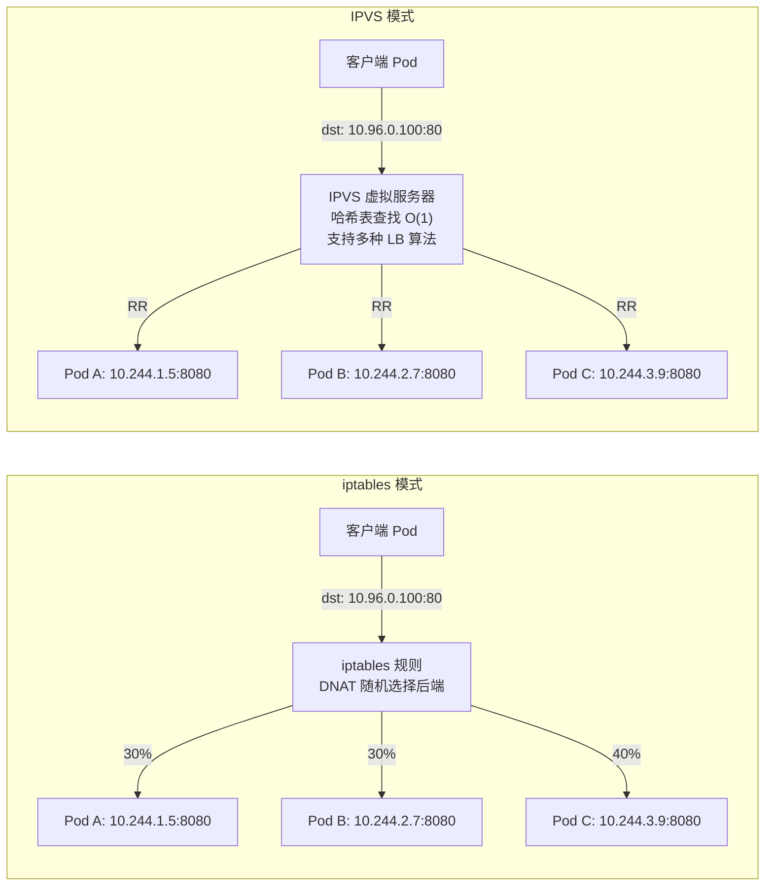
```mermaid
graph LR
    subgraph iptables_mode["iptables 模式"]
        CLIENT1["客户端 Pod"] -->|"dst: 10.96.0.100:80"| IPTABLES["iptables 规则<br/>DNAT 随机选择后端"]
        IPTABLES -->|"30%"| POD_A1["Pod A: 10.244.1.5:8080"]
        IPTABLES -->|"30%"| POD_B1["Pod B: 10.244.2.7:8080"]
        IPTABLES -->|"40%"| POD_C1["Pod C: 10.244.3.9:8080"]
    end

    subgraph ipvs_mode["IPVS 模式"]
        CLIENT2["客户端 Pod"] -->|"dst: 10.96.0.100:80"| IPVS["IPVS 虚拟服务器<br/>哈希表查找 O(1)<br/>支持多种 LB 算法"]
        IPVS -->|"RR"| POD_A2["Pod A: 10.244.1.5:8080"]
        IPVS -->|"RR"| POD_B2["Pod B: 10.244.2.7:8080"]
        IPVS -->|"RR"| POD_C2["Pod C: 10.244.3.9:8080"]
    end
```

```bash
# 查看 iptables 模式下 kube-proxy 创建的规则
sudo iptables -t nat -L KUBE-SERVICES -n | head -20

# 查看 IPVS 模式下的虚拟服务器
sudo ipvsadm -Ln
# 输出示例：
# TCP  10.96.0.100:80 rr
#   -> 10.244.1.5:8080     Masq    1      0      0
#   -> 10.244.2.7:8080     Masq    1      0      0
#   -> 10.244.3.9:8080     Masq    1      0      0
```

在大规模生产集群中（Service 数量超过 1000），推荐使用 IPVS 模式以获得更好的性能和更丰富的负载均衡策略。

#### 3.3.3 容器运行时

容器运行时是 kubelet 调用来实际创建和管理容器的底层组件。kubelet 通过 CRI（Container Runtime Interface）gRPC 接口与容器运行时通信。

**CRI 接口**：CRI 定义了两组核心接口——RuntimeService 和 ImageService。RuntimeService 包含 Pod 沙箱管理（RunPodSandbox、StopPodSandbox）和容器管理（CreateContainer、StartContainer、StopContainer、RemoveContainer）等操作；ImageService 包含镜像管理（PullImage、ListImages、RemoveImage）等操作。

**containerd 架构**：containerd 是目前最主流的 CRI 运行时实现。它的内部架构是插件化的——内置 CRI 插件直接处理 kubelet 的 CRI 请求，通过 snapshotter（快照管理器）管理容器文件系统（使用 OverlayFS），通过 task/shim 机制管理容器进程的生命周期，最终调用 runc 来创建符合 OCI 标准的容器。

**Pod 创建流程**：当一个新的 Pod 被调度到某个 Node 上时，kubelet 与容器运行时的交互过程如下：

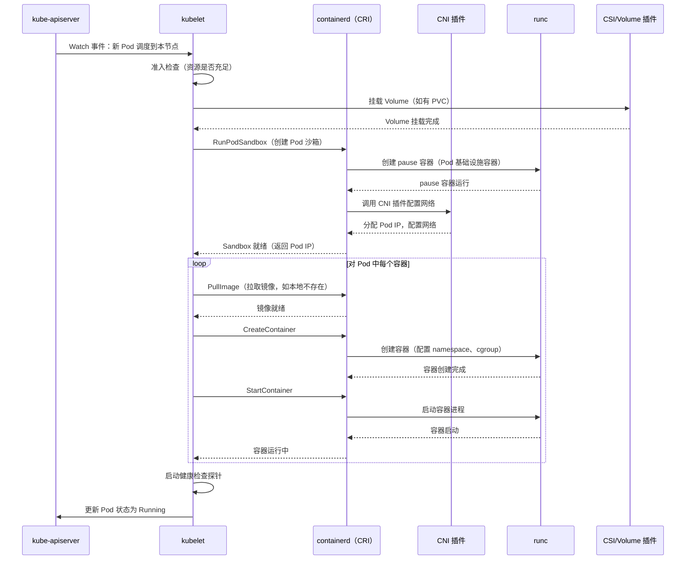
```mermaid
sequenceDiagram
    participant API as kube-apiserver
    participant KL as kubelet
    participant CRI as containerd（CRI）
    participant CNI as CNI 插件
    participant RUNC as runc
    participant CSI as CSI/Volume 插件

    API->>KL: Watch 事件：新 Pod 调度到本节点
    KL->>KL: 准入检查（资源是否充足）

    KL->>CSI: 挂载 Volume（如有 PVC）
    CSI-->>KL: Volume 挂载完成

    KL->>CRI: RunPodSandbox（创建 Pod 沙箱）
    CRI->>RUNC: 创建 pause 容器（Pod 基础设施容器）
    RUNC-->>CRI: pause 容器运行
    CRI->>CNI: 调用 CNI 插件配置网络
    CNI-->>CRI: 分配 Pod IP，配置网络
    CRI-->>KL: Sandbox 就绪（返回 Pod IP）

    loop 对 Pod 中每个容器
        KL->>CRI: PullImage（拉取镜像，如本地不存在）
        CRI-->>KL: 镜像就绪
        KL->>CRI: CreateContainer
        CRI->>RUNC: 创建容器（配置 namespace、cgroup）
        RUNC-->>CRI: 容器创建完成
        KL->>CRI: StartContainer
        CRI->>RUNC: 启动容器进程
        RUNC-->>CRI: 容器启动
        CRI-->>KL: 容器运行中
    end

    KL->>KL: 启动健康检查探针
    KL->>API: 更新 Pod 状态为 Running
```

上图中值得关注的一个细节是 **pause 容器**。每个 Pod 中都会有一个隐藏的 pause 容器（也叫 infra container），它是 Pod 中第一个被创建的容器。pause 容器的作用是持有 Pod 的 Linux Namespace（主要是 Network Namespace 和 IPC Namespace），Pod 中的其他业务容器通过 join 这些 Namespace 来共享网络和 IPC。pause 容器本身几乎不消耗资源——它的 main 函数就是一个永久等待信号的 pause() 系统调用。

### 3.4 附加组件

除了核心组件外，K8s 还有一系列附加组件（Addons），它们以 Pod 或 DaemonSet 的形式运行在集群中，提供重要的辅助功能。

**DNS（CoreDNS）**：CoreDNS 是 K8s 集群的内部 DNS 服务器（替代了早期的 kube-dns）。它为每个 Service 自动创建 DNS 记录，使得 Pod 可以通过 Service 名称而非 IP 地址进行服务发现。DNS 记录的格式为 `<service-name>.<namespace>.svc.cluster.local`。例如，名为 `my-api` 的 Service 在 `production` 命名空间中，可以通过 `my-api.production.svc.cluster.local` 访问。同一命名空间内可以省略后缀，直接使用 `my-api`。

```bash
# 在 Pod 内部验证 DNS 解析
kubectl run dns-test --image=busybox:1.36 --restart=Never --rm -it -- nslookup my-api.production.svc.cluster.local
# 输出：
# Server:    10.96.0.10
# Address:   10.96.0.10:53
# Name:      my-api.production.svc.cluster.local
# Address:   10.96.128.55
```

**Dashboard**：K8s 的官方 Web 管理界面，提供了集群资源的可视化管理功能——查看 Pod、Deployment、Service 的状态，查看容器日志，执行简单的运维操作。Dashboard 适合快速浏览集群状态，但对于复杂的管理操作，kubectl 命令行工具通常是更高效的选择。

**Metrics Server**：集群资源监控的基础组件，负责采集各 Node 和 Pod 的 CPU、内存等核心指标数据。Metrics Server 的数据是 HPA（水平自动扩缩容）和 VPA（垂直自动扩缩容）的决策依据——没有 Metrics Server，HPA 就无法感知当前 Pod 的 CPU 使用率，也就无法触发扩缩容。`kubectl top node` 和 `kubectl top pod` 命令也依赖于 Metrics Server。

**Ingress Controller**：K8s 原生的 Service 只能暴露四层（TCP/UDP）的负载均衡。Ingress Controller 提供了七层（HTTP/HTTPS）的流量路由能力——基于域名和 URL 路径将外部流量路由到不同的 Service。常见的 Ingress Controller 实现包括 Nginx Ingress Controller、Traefik、HAProxy Ingress、Istio Gateway 等。

```yaml
# Ingress 配置示例：基于域名和路径路由
apiVersion: networking.k8s.io/v1
kind: Ingress
metadata:
  name: app-ingress
  annotations:
    nginx.ingress.kubernetes.io/rewrite-target: /
spec:
  ingressClassName: nginx
  rules:
  - host: api.example.com
    http:
      paths:
      - path: /users
        pathType: Prefix
        backend:
          service:
            name: user-service
            port:
              number: 80
      - path: /orders
        pathType: Prefix
        backend:
          service:
            name: order-service
            port:
              number: 80
  - host: admin.example.com
    http:
      paths:
      - path: /
        pathType: Prefix
        backend:
          service:
            name: admin-dashboard
            port:
              number: 80
  tls:
  - hosts:
    - api.example.com
    - admin.example.com
    secretName: tls-secret
```

### 3.5 K8s 组件间通信流程

理解了每个组件的职责后，让我们将它们串联起来，看看一个完整的 Pod 创建流程中各组件是如何协作的。

#### 完整的 Pod 创建流程

当用户执行 `kubectl apply -f deployment.yaml` 创建一个 Deployment 时，背后发生了以下一系列精密的协作过程：

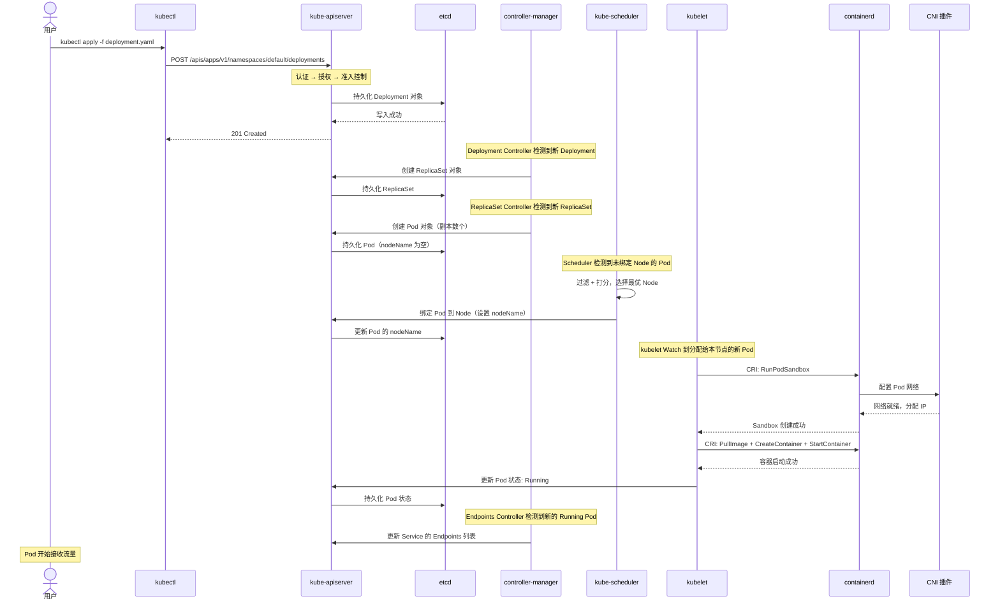
```mermaid
sequenceDiagram
    actor User as 用户
    participant KC as kubectl
    participant API as kube-apiserver
    participant ETCD as etcd
    participant CM as controller-manager
    participant SCHED as kube-scheduler
    participant KL as kubelet
    participant CR as containerd
    participant CNI as CNI 插件

    User->>KC: kubectl apply -f deployment.yaml
    KC->>API: POST /apis/apps/v1/namespaces/default/deployments
    
    Note over API: 认证 → 授权 → 准入控制
    API->>ETCD: 持久化 Deployment 对象
    ETCD-->>API: 写入成功
    API-->>KC: 201 Created

    Note over CM: Deployment Controller 检测到新 Deployment
    CM->>API: 创建 ReplicaSet 对象
    API->>ETCD: 持久化 ReplicaSet
    
    Note over CM: ReplicaSet Controller 检测到新 ReplicaSet
    CM->>API: 创建 Pod 对象（副本数个）
    API->>ETCD: 持久化 Pod（nodeName 为空）

    Note over SCHED: Scheduler 检测到未绑定 Node 的 Pod
    SCHED->>SCHED: 过滤 + 打分，选择最优 Node
    SCHED->>API: 绑定 Pod 到 Node（设置 nodeName）
    API->>ETCD: 更新 Pod 的 nodeName

    Note over KL: kubelet Watch 到分配给本节点的新 Pod
    KL->>CR: CRI: RunPodSandbox
    CR->>CNI: 配置 Pod 网络
    CNI-->>CR: 网络就绪，分配 IP
    CR-->>KL: Sandbox 创建成功

    KL->>CR: CRI: PullImage + CreateContainer + StartContainer
    CR-->>KL: 容器启动成功

    KL->>API: 更新 Pod 状态: Running
    API->>ETCD: 持久化 Pod 状态

    Note over CM: Endpoints Controller 检测到新的 Running Pod
    CM->>API: 更新 Service 的 Endpoints 列表
    
    Note over User: Pod 开始接收流量
```

整个流程可以归纳为以下几条关键通信路径：

**用户请求路径**：`用户 → kubectl → API Server → etcd`。用户通过 kubectl 提交资源定义，API Server 验证后持久化到 etcd。这是"声明期望状态"的过程。

**调度路径**：`API Server → Scheduler → API Server → etcd`。Scheduler 监听到新的未绑定 Pod 后进行调度决策，将结果（Pod 到 Node 的绑定关系）写回 API Server。

**控制器路径**：`Controller Manager → API Server → etcd`。各种控制器监听资源变化，执行调和逻辑（如创建 ReplicaSet、创建 Pod、更新 Endpoints），所有变更都通过 API Server 写入 etcd。

**执行路径**：`API Server → kubelet → 容器运行时 → 容器`。kubelet 监听到调度给自己的 Pod 后，调用容器运行时创建并启动容器，然后将 Pod 状态汇报给 API Server。

这个架构有一个非常优雅的特点：**所有组件只与 API Server 通信，组件之间没有直接依赖**。这意味着每个组件都可以独立部署、独立升级、独立扩展。即使 Scheduler 暂时宕机，已经运行的 Pod 不会受到任何影响，只是新的 Pod 暂时无法调度而已。这种松耦合的架构是 K8s 高可用性的基石。

美团 Kubernetes 平台在这一架构的基础上，通过定制 CNI 网络插件（对接内部的网络基础设施）和 flexvolume 存储插件（对接内部分布式存储系统），将 K8s 无缝集成到美团的基础设施体系中，同时通过 etcd event 集群拆分、API Server 请求限流和优先级队列等手段对控制平面进行了深度加固，使得托管集群 API Server 的 SLA 达到 99.95%，整体平台稳定性达到 99.99%。

---

> **本章小结**：本部分系统性地介绍了 Kubernetes 的三大基础主题。第一章回顾了 K8s 从 Google Borg 系统发展而来的历史脉络，阐明了它在云原生生态中的核心地位和解决的关键问题。第二章深入剖析了容器技术的三大支柱——Namespace、Cgroups 和 UnionFS，以及容器运行时的演进。第三章全面解析了 K8s 的 Master-Worker 架构，详细讲解了每个控制平面组件和节点组件的原理和职责，并通过完整的 Pod 创建流程展示了各组件之间的协作机制。理解这些基础知识，是深入学习 K8s 资源对象、网络模型、存储系统等进阶主题的坚实基础。


---

## 第四章：核心资源对象详解

Kubernetes 的核心设计理念是"声明式 API + 控制器模式"。用户通过 YAML 声明期望状态，控制器不断将实际状态向期望状态收敛。本章将深入剖析 K8s 中最核心的资源对象——从最小调度单元 Pod，到工作负载控制器、服务发现、配置管理、资源隔离，覆盖每个对象的底层原理、完整配置示例和实际生产最佳实践。

---

### 4.1 Pod —— K8s最小调度单元

#### 4.1.1 Pod的本质

Pod 是 Kubernetes 中最小的可部署和调度单元。一个 Pod 包含一组（一个或多个）紧密协作的容器，这些容器共享网络和存储资源，被作为一个整体进行调度和管理。

**为什么需要 Pod 而不是直接管理容器？**

在 Docker 世界中，我们直接管理容器。但 Kubernetes 引入了 Pod 这一层抽象，核心原因如下：

第一，**容器的设计哲学是"一个容器一个进程"**。Docker 官方建议每个容器只运行一个主进程。但现实中的微服务往往需要多个辅助进程协同工作——比如主应用容器 + 日志收集 sidecar、主应用容器 + 配置文件热加载 agent。如果把这些进程塞进同一个容器，就违反了单一职责原则，且进程管理（信号传递、僵尸进程回收）变得复杂。Pod 允许我们把多个容器放在一起，同时保持每个容器的单一职责。

第二，**Pod 提供了共享的上下文环境**。同一 Pod 内的容器共享 Linux namespace（网络、IPC、UTS），它们可以通过 localhost 互相通信，共享 hostname，共享存储卷。这大大简化了容器间协作的复杂度。

第三，**Pod 是调度的原子单位**。K8s 调度器以 Pod 为单位进行调度，保证 Pod 内的所有容器被部署到同一个 Node 上。如果直接调度容器，很难保证协作的容器被分配到同一节点。

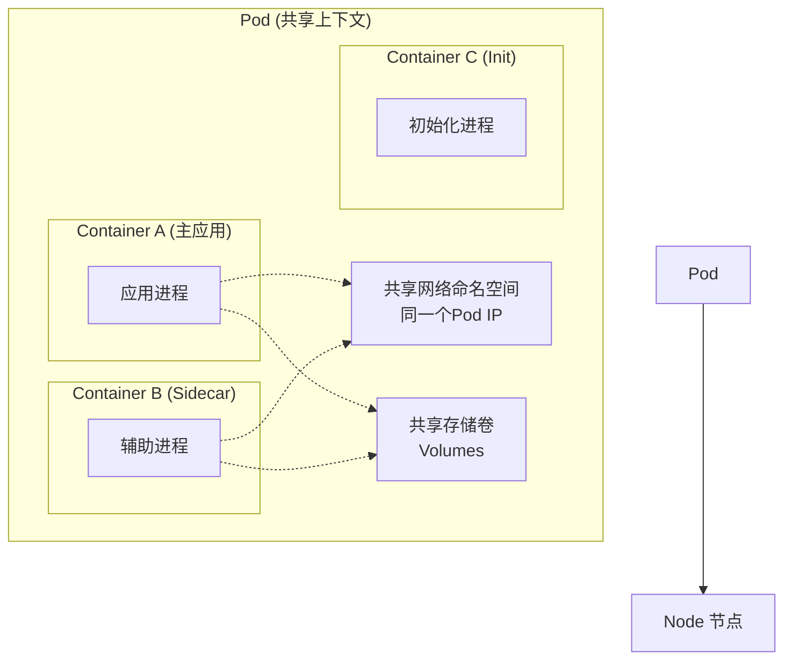
```mermaid
graph TB
    subgraph "Pod (共享上下文)"
        subgraph "Container A (主应用)"
            PA[应用进程]
        end
        subgraph "Container B (Sidecar)"
            PB[辅助进程]
        end
        subgraph "Container C (Init)"
            PC[初始化进程]
        end
        NET["共享网络命名空间<br/>同一个Pod IP"]
        VOL["共享存储卷<br/>Volumes"]
        PA -.-> NET
        PB -.-> NET
        PA -.-> VOL
        PB -.-> VOL
    end
    NODE["Node 节点"]
    Pod --> NODE
```

**Pod 与容器的关系图解：**

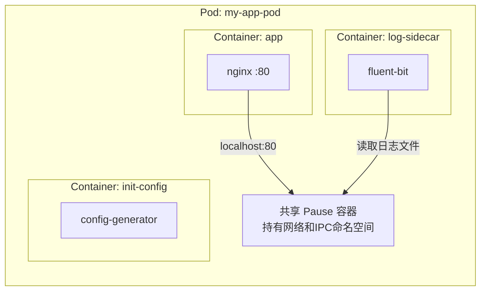
```mermaid
graph LR
    subgraph "Pod: my-app-pod"
        subgraph "Container: app"
            APP[nginx :80]
        end
        subgraph "Container: log-sidecar"
            LOG[fluent-bit]
        end
        subgraph "Container: init-config"
            INIT[config-generator]
        end
        SHARED["共享 Pause 容器<br/>持有网络和IPC命名空间"]
    end
    APP -->|localhost:80| SHARED
    LOG -->|读取日志文件| SHARED
```

> **Pause 容器的秘密**：每个 Pod 底层都有一个特殊的 "pause" 容器（infrastructure container），它最先启动，持有 Pod 的网络和 IPC 命名空间。Pod 内的其他容器都以 container mode（`--net=container --ipc=container`）加入 pause 容器的命名空间。当其他容器崩溃重启时，网络命名空间不会丢失，Pod IP 保持不变。

#### 4.1.2 Pod的生命周期

Pod 从创建到销毁经历一系列阶段。理解生命周期对于排查问题和设计高可用应用至关重要。

**Pod Phase 状态转换图：**

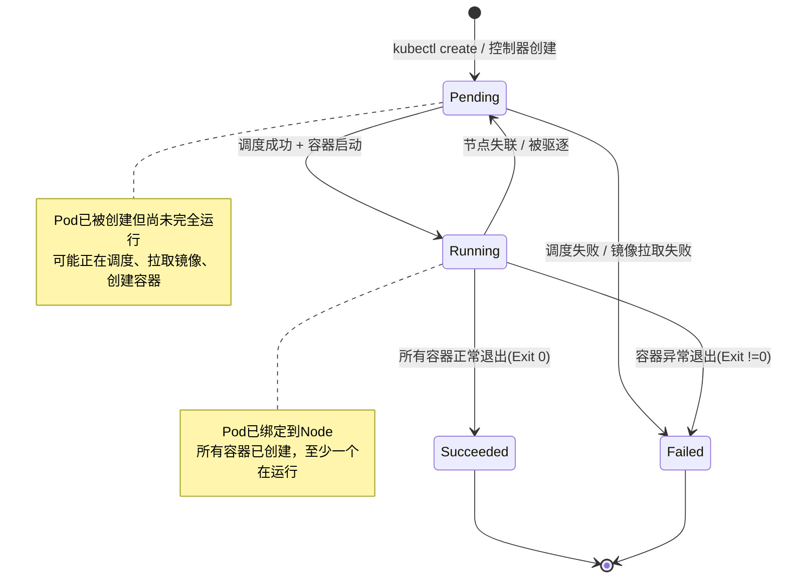
```mermaid
stateDiagram-v2
    [*] --> Pending : kubectl create / 控制器创建
    Pending --> Running : 调度成功 + 容器启动
    Pending --> Failed : 调度失败 / 镜像拉取失败
    Running --> Succeeded : 所有容器正常退出(Exit 0)
    Running --> Failed : 容器异常退出(Exit !=0)
    Running --> Pending : 节点失联 / 被驱逐
    Succeeded --> [*]
    Failed --> [*]
    
    note right of Pending
      Pod已被创建但尚未完全运行
      可能正在调度、拉取镜像、创建容器
    end note
    
    note right of Running
      Pod已绑定到Node
      所有容器已创建，至少一个在运行
    end note
```

**Pod 的五种 Phase 详解：**

| Phase | 说明 |
|-------|------|
| Pending | Pod 已被 API Server 接受，但尚未完全运行。可能正在等待调度、拉取镜像、创建容器。 |
| Running | Pod 已绑定到某个 Node，所有容器已创建，至少有一个容器正在运行或正在启动/重启。 |
| Succeeded | Pod 中所有容器都已成功终止，且不会重启。常见于 Job 完成时。 |
| Failed | Pod 中所有容器都已终止，且至少有一个容器以失败终止。 |
| Unknown | 通常因为无法与 Pod 所在 Node 的 kubelet 通信导致。 |

**容器的三种状态：**

容器级别的状态比 Pod 级别的 Phase 更精细：

- **Waiting**：容器尚未运行。常见原因包括 `ContainerCreating`（正在创建）、`ImagePullBackOff`（镜像拉取失败重试中）、`CrashLoopBackOff`（容器反复崩溃重启）。
- **Running**：容器正在正常运行。
- **Terminated**：容器已终止。包含退出码、信号、终止原因等信息。

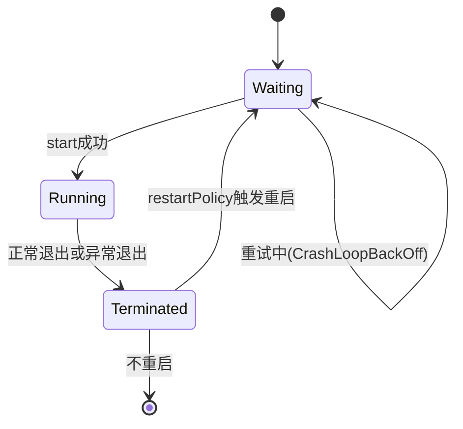
```mermaid
stateDiagram-v2
    [*] --> Waiting
    Waiting --> Running : start成功
    Waiting --> Waiting : 重试中(CrashLoopBackOff)
    Running --> Terminated : 正常退出或异常退出
    Terminated --> Waiting : restartPolicy触发重启
    Terminated --> [*] : 不重启
```

**Init Container 的作用和执行顺序：**

Init Container（初始化容器）在 Pod 的主容器启动之前按顺序运行。它具有以下特性：

1. Init Container 总是运行到完成（不会一直运行）。
2. 每个 Init Container 必须成功完成后，下一个才会启动。
3. 如果 Init Container 失败，K8s 会根据 restartPolicy 重启整个 Pod（注意：即使 restartPolicy 为 Always，Init Container 也不会在失败后原地重启，而是整个 Pod 重启）。
4. Init Container 不支持 readinessProbe 和 livenessProbe。

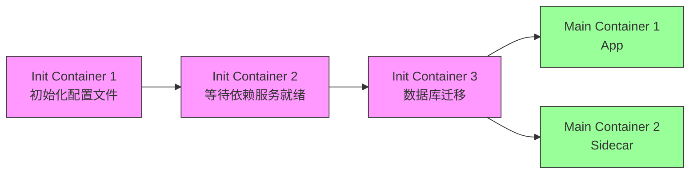
```mermaid
graph LR
    IC1["Init Container 1<br/>初始化配置文件"] --> IC2["Init Container 2<br/>等待依赖服务就绪"]
    IC2 --> IC3["Init Container 3<br/>数据库迁移"]
    IC3 --> MC1["Main Container 1<br/>App"]
    IC3 --> MC2["Main Container 2<br/>Sidecar"]
    
    style IC1 fill:#f9f,stroke:#333
    style IC2 fill:#f9f,stroke:#333
    style IC3 fill:#f9f,stroke:#333
    style MC1 fill:#9f9,stroke:#333
    style MC2 fill:#9f9,stroke:#333
```

Init Container 的典型使用场景包括：等待外部服务（如数据库）就绪后再启动主容器、从配置中心拉取配置、执行数据库 schema 迁移、注册到服务发现等。

**重启策略（restartPolicy）：**

| 策略 | 说明 | 适用场景 |
|------|------|---------|
| Always | 容器退出后总是重启（默认值） | 长期运行的服务（Deployment、StatefulSet） |
| OnFailure | 仅在容器以非零状态退出时重启 | 期望成功的任务（Job） |
| Never | 容器退出后从不重启 | 一次性任务、调试场景 |

> 注意：restartPolicy 只影响 Pod 内容器的重启行为，不影响 Pod 本身的生命周期。Pod 被 Delete 后不会自动重建——这需要控制器（如 Deployment）来完成。

#### 4.1.3 Pod的YAML定义详解

下面是一个完整的 Pod YAML 定义，包含所有核心字段：

```yaml
apiVersion: v1                    # API 版本
kind: Pod                         # 资源类型
metadata:
  name: my-app-pod                # Pod 名称（命名空间内唯一）
  namespace: production           # 命名空间
  labels:                         # 标签（用于选择和过滤）
    app: my-app
    tier: frontend
    environment: production
  annotations:                    # 注解（用于附加非选择性的元数据）
    description: "前端应用Pod"
    maintained-by: "team-frontend"
spec:
  restartPolicy: Always           # 重启策略
  nodeSelector:                   # 节点选择器（简单亲和性）
    disktype: ssd
  serviceAccountName: my-app-sa   # ServiceAccount（用于RBAC）
  
  initContainers:                 # 初始化容器
  - name: init-db-check
    image: busybox:1.36
    command: ['sh', '-c', 'until nc -z mysql-service 3306; do echo waiting for mysql; sleep 2; done;']
    
  containers:                     # 主容器列表
  - name: my-app                  # 容器名称（Pod内唯一）
    image: my-app:v1.0.0          # 镜像
    imagePullPolicy: IfNotPresent # 镜像拉取策略: Always|Never|IfNotPresent
    
    ports:                        # 容器暴露端口
    - name: http
      containerPort: 8080
      protocol: TCP
    
    env:                          # 环境变量
    - name: APP_ENV
      value: "production"
    - name: DB_HOST
      valueFrom:                  # 从ConfigMap/Secret引用
        configMapKeyRef:
          name: app-config
          key: db_host
    - name: DB_PASSWORD
      valueFrom:
        secretKeyRef:
          name: db-secret
          key: password
    
    resources:                    # 资源请求与限制
      requests:                   # 调度依据，保证最小资源
        cpu: "500m"               # 500 millicores = 0.5 核
        memory: "512Mi"           # 512 MiB
        ephemeral-storage: "1Gi"
      limits:                     # 资源上限，超过将被限制或杀掉
        cpu: "1000m"              # 1 核
        memory: "1Gi"
        ephemeral-storage: "2Gi"
    
    livenessProbe:                # 存活探针
      httpGet:
        path: /health
        port: 8080
      initialDelaySeconds: 30     # 首次探测延迟
      periodSeconds: 10           # 探测间隔
      failureThreshold: 3         # 连续失败次数才判定为不健康
    
    readinessProbe:               # 就绪探针
      httpGet:
        path: /ready
        port: 8080
      initialDelaySeconds: 5
      periodSeconds: 5
      failureThreshold: 3
    
    volumeMounts:                 # 挂载存储卷
    - name: config-volume
      mountPath: /etc/config      # 挂载到容器内路径
      readOnly: true
    - name: cache-volume
      mountPath: /tmp/cache
    
    lifecycle:                    # 生命周期钩子
      postStart:                  # 容器创建后执行
        exec:
          command: ["/bin/sh", "-c", "echo 'App started' > /tmp/start.log"]
      preStop:                    # 容器终止前执行
        exec:
          command: ["/bin/sh", "-c", "nginx -s quit; sleep 10"]
    
    securityContext:              # 安全上下文
      runAsUser: 1000             # 以非root用户运行
      runAsNonRoot: true
      readOnlyRootFilesystem: false
      allowPrivilegeEscalation: false
      capabilities:
        drop: ["ALL"]
        add: ["NET_BIND_SERVICE"]
  
  - name: log-sidecar             # 第二个容器（Sidecar）
    image: fluent-bit:2.2.0
    resources:
      requests:
        cpu: "100m"
        memory: "128Mi"
      limits:
        cpu: "200m"
        memory: "256Mi"
    volumeMounts:
    - name: log-volume
      mountPath: /var/log/app
      readOnly: true
    - name: config-volume
      mountPath: /fluent-bit/etc
      readOnly: true
  
  volumes:                        # 存储卷定义
  - name: config-volume
    configMap:
      name: app-config            # 从ConfigMap创建
  
  - name: cache-volume
    emptyDir:
      sizeLimit: "1Gi"            # 临时空目录
  
  - name: log-volume
    emptyDir: {}
  
  terminationGracePeriodSeconds: 30  # 优雅终止宽限期（默认30秒）
  dnsPolicy: ClusterFirst         # DNS策略
```

**resources 请求与限制（requests vs limits）深入理解：**

`requests` 是调度器在调度 Pod 时参考的依据——调度器会寻找至少有这么多剩余资源的 Node。同时，requests 也是 QoS 计算的基础。`limits` 是运行时的硬上限——CPU limit 超过时容器会被节流（throttle），内存 limit 超过时容器会被 OOMKilled。

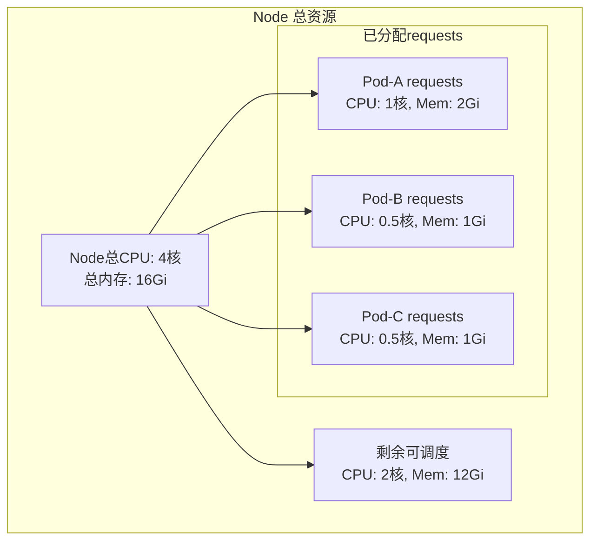
```mermaid
graph TB
    subgraph "Node 总资源"
        TOTAL["Node总CPU: 4核<br/>总内存: 16Gi"]
        subgraph "已分配requests"
            P1["Pod-A requests<br/>CPU: 1核, Mem: 2Gi"]
            P2["Pod-B requests<br/>CPU: 0.5核, Mem: 1Gi"]
            P3["Pod-C requests<br/>CPU: 0.5核, Mem: 1Gi"]
        end
        REMAIN["剩余可调度<br/>CPU: 2核, Mem: 12Gi"]
    end
    TOTAL --> P1
    TOTAL --> P2
    TOTAL --> P3
    TOTAL --> REMAIN
```

**Pod QoS（Quality of Service）类别详解：**

Kubernetes 根据每个容器的 requests 和 limits 配置，将 Pod 自动归为三个 QoS 等级。当节点资源不足时，K8s 按照 QoS 等级决定先驱逐哪些 Pod。

```mermaid
graph TB
    START["容器资源配置"] --> Q1{"每个容器都设置了<br/>CPU和内存的<br/>requests == limits?"}
    Q1 -->|是| GUARANTEED["Guaranteed QoS<br/>最高优先级<br/>最后被驱逐"]
    Q1 -->|否| Q2{"所有容器都<br/>没有设置resources?"}
    Q2 -->|是| BESTEFFORT["BestEffort QoS<br/>最低优先级<br/>最先被驱逐"]
    Q2 -->|否| BURSTABLE["Burstable QoS<br/>中等优先级<br/>中间被驱逐"]
```

**Guaranteed（保证级）**：Pod 中每个容器都必须设置 CPU 和内存的 requests 和 limits，且 requests == limits。这类 Pod 获得最高优先级，节点资源紧张时最后被驱逐。适用于核心服务。

```yaml
# Guaranteed 示例
resources:
  requests:
    cpu: "500m"
    memory: "512Mi"
  limits:
    cpu: "500m"        # == requests
    memory: "512Mi"    # == requests
```

**Burstable（可突发级）**：Pod 至少有一个容器设置了 requests 或 limits，但不满足 Guaranteed 条件。容器获得 requests 保证的资源，在有空余资源时可以突发使用到 limits。**企业实践中大量使用此类别**，因为大多数微服务的负载有明显的峰谷特征，Burstable 既保证了基线资源，又允许突发使用，提高集群整体资源利用率。

```yaml
# Burstable 示例（企业推荐实践）
resources:
  requests:
    cpu: "500m"       # 保底 0.5 核
    memory: "512Mi"   # 保底 512Mi
  limits:
    cpu: "2000m"      # 可突发到 2 核
    memory: "2Gi"     # 可突发到 2Gi
```

**BestEffort（尽力而为级）**：Pod 中所有容器都没有设置 resources。这类 Pod 优先级最低，节点资源不足时最先被驱逐。仅适用于不重要的任务。

```yaml
# BestEffort 示例（不设置resources）
# 不设置 resources 字段即为 BestEffort
```

> **企业最佳实践建议**：生产环境的服务 Pod 应至少设置为 Burstable，核心服务设置为 Guaranteed。合理设置 requests（参考 P50 负载）和 limits（参考 P99 负载），避免 requests 设置过高导致集群资源利用率低，也要避免 limits 设置过低导致频繁 OOM。

#### 4.1.4 健康检查机制

Kubernetes 提供三种探针（Probe）来全面监控容器健康状态。这是保障应用高可用的关键机制。

```mermaid
graph TB
    subgraph "三种探针"
        LP["livenessProbe 存活探针"]
        RP["readinessProbe 就绪探针"]
        SP["startupProbe 启动探针"]
    end
    
    LP -->|失败| RESTART["重启容器"]
    RP -->|失败| REMOVE["从Service Endpoints移除<br/>停止转发流量"]
    RP -->|成功| ADD["加入Service Endpoints<br/>开始接收流量"]
    SP -->|成功| ENABLE["启用liveness/readiness探针"]
    SP -->|失败| RESTART2["重启容器"]
    SP -->|进行中| SKIP["跳过liveness/readiness检查"]
```

**livenessProbe（存活探针）**：用于检测容器是否在运行。如果存活探针失败，kubelet 会杀掉容器并根据 restartPolicy 决定是否重启。存活探针用于检测死锁、无限循环等容器进程还在但无法提供服务的状态。

**readinessProbe（就绪探针）**：用于检测容器是否准备好接收流量。就绪探针失败时，Pod 会从 Service 的 Endpoints 中移除，不再接收新请求，但容器不会被重启。就绪探针用于应用启动慢、依赖外部服务暂时不可用的场景。

**startupProbe（启动探针）**：K8s 1.16+ 引入，专门用于检测容器应用是否已启动。在 startupProbe 成功之前，livenessProbe 和 readinessProbe 会被禁用。这对于启动缓慢的应用（如 Java Spring Boot 应用启动可能需要数分钟）非常有用，避免因 livenessProbe 在启动期间失败而导致容器被反复重启。

**三种探针检测类型：**

**1. HTTP GET 探针**——最常用，适用于提供 HTTP 健康检查接口的应用：

```yaml
apiVersion: v1
kind: Pod
metadata:
  name: http-probe-demo
spec:
  containers:
  - name: web-app
    image: nginx:1.25
    ports:
    - containerPort: 80
    
    # 存活探针 - HTTP GET方式
    livenessProbe:
      httpGet:
        path: /healthz          # 健康检查路径
        port: 80                # 端口
        httpHeaders:            # 自定义请求头
        - name: Custom-Header
          value: health-check
      initialDelaySeconds: 15   # 容器启动后15秒开始探测
      periodSeconds: 10         # 每10秒探测一次
      timeoutSeconds: 3         # 探测超时时间
      successThreshold: 1       # 连续成功1次判定为健康
      failureThreshold: 3       # 连续失败3次判定为不健康
    
    # 就绪探针 - HTTP GET方式
    readinessProbe:
      httpGet:
        path: /readyz
        port: 80
      initialDelaySeconds: 5
      periodSeconds: 5
      failureThreshold: 3
    
    # 启动探针 - HTTP GET方式
    startupProbe:
      httpGet:
        path: /startup
        port: 80
      initialDelaySeconds: 0
      periodSeconds: 10
      failureThreshold: 30     # 30次 * 10秒 = 最多等5分钟启动
```

**2. TCP Socket 探针**——适用于非HTTP服务（如数据库、消息队列）：

```yaml
apiVersion: v1
kind: Pod
metadata:
  name: tcp-probe-demo
spec:
  containers:
  - name: redis
    image: redis:7.2
    ports:
    - containerPort: 6379
    
    livenessProbe:
      tcpSocket:
        port: 6379            # 尝试建立TCP连接
      initialDelaySeconds: 10
      periodSeconds: 10
      timeoutSeconds: 3
      failureThreshold: 3
    
    readinessProbe:
      tcpSocket:
        port: 6379
      initialDelaySeconds: 5
      periodSeconds: 5
```

**3. Exec 命令探针**——在容器内执行命令，退出码为0表示成功：

```yaml
apiVersion: v1
kind: Pod
metadata:
  name: exec-probe-demo
spec:
  containers:
  - name: app
    image: busybox:1.36
    command: ["/bin/sh", "-c", "touch /tmp/healthy; sleep 3600"]
    
    livenessProbe:
      exec:
        command:
        - /bin/sh
        - -c
        - test -f /tmp/healthy    # 检查文件是否存在
      initialDelaySeconds: 5
      periodSeconds: 5
      failureThreshold: 3
    
    readinessProbe:
      exec:
        command:
        - /bin/sh
        - -c
        - "pgrep -f my-app"       # 检查进程是否在运行
      initialDelaySeconds: 5
      periodSeconds: 10
```

> **企业最佳实践**：livenessProbe 的 `initialDelaySeconds` 和 `failureThreshold` 要设置得保守一些，避免因网络抖动导致误杀。readinessProbe 可以设置得更积极，因为失败只是摘除流量不会杀容器。对于 Java 应用强烈建议使用 startupProbe，避免启动期间被 livenessProbe 误判。

#### 4.1.5 多容器Pod设计模式

多容器 Pod 是 Kubernetes 的特色设计。以下是四种经典设计模式：

**1. Sidecar 模式**——在主容器旁运行辅助容器，增强或扩展主容器功能：

```mermaid
graph TB
    subgraph "Pod"
        MAIN["主容器<br/>Nginx<br/>提供Web服务"]
        SIDE["Sidecar容器<br/>Fluent Bit<br/>收集日志"]
        VOL["共享Volume<br/>/var/log/nginx"]
    end
    MAIN -->|写入日志| VOL
    SIDE -->|读取日志| VOL
    SIDE -->|发送到| ES["Elasticsearch<br/>/Kafka"]
```

```yaml
apiVersion: v1
kind: Pod
metadata:
  name: sidecar-pattern
  labels:
    app: web-with-logging
spec:
  containers:
  - name: nginx
    image: nginx:1.25
    ports:
    - containerPort: 80
    volumeMounts:
    - name: shared-logs
      mountPath: /var/log/nginx
    
  - name: log-collector          # Sidecar容器
    image: fluent-bit:2.2.0
    volumeMounts:
    - name: shared-logs
      mountPath: /var/log/nginx
      readOnly: true
    env:
    - name: FLUENT_BIT_CONFIG
      value: "/fluent-bit/etc/fluent-bit.conf"
  
  volumes:
  - name: shared-logs
    emptyDir: {}
```

**2. Ambassador 模式**——容器作为代理，为主容器屏蔽外部服务的访问复杂度：

```mermaid
graph TB
    subgraph "Pod"
        APP["主容器<br/>应用服务"]
        AMB["Ambassador容器<br/>Envoy/Twemproxy<br/>代理外部Redis集群"]
    end
    APP -->|localhost:6379| AMB
    AMB -->|代理分片| R1["Redis-1"]
    AMB -->|代理分片| R2["Redis-2"]
    AMB -->|代理分片| R3["Redis-3"]
    
    style AMB fill:#ff9,stroke:#333
```

```yaml
apiVersion: v1
kind: Pod
metadata:
  name: ambassador-pattern
spec:
  containers:
  - name: my-app
    image: my-app:v1.0
    env:
    - name: REDIS_HOST
      value: "localhost"       # 连接本地的Ambassador
    - name: REDIS_PORT
      value: "6379"
    
  - name: redis-proxy          # Ambassador容器
    image: twemproxy:0.5.0
    env:
    - name: REDIS_SERVERS
      value: "redis-1:6379:1 redis-2:6379:1 redis-3:6379:1"
    ports:
    - containerPort: 6379
```

**3. Adapter 模式**——容器将主容器的输出标准化，使其符合外部系统的期望格式：

```mermaid
graph TB
    subgraph "Pod"
        MAIN["主容器<br/>旧版应用<br/>输出Prometheus格式"]
        ADAPT["Adapter容器<br/>格式转换<br/>Prometheus→OpenMetrics"]
    end
    MAIN -->|localhost:8080/metrics| ADAPT
    ADAPT -->|localhost:9090/metrics| MON["监控系统<br/>期望OpenMetrics格式"]
    
    style ADAPT fill:#9ff,stroke:#333
```

```yaml
apiVersion: v1
kind: Pod
metadata:
  name: adapter-pattern
spec:
  containers:
  - name: legacy-app
    image: legacy-app:v2.0
    ports:
    - containerPort: 8080
    
  - name: metrics-adapter       # Adapter容器
    image: metrics-adapter:v1.0
    ports:
    - containerPort: 9090
    env:
    - name: SOURCE_URL
      value: "http://localhost:8080/metrics"
    - name: OUTPUT_FORMAT
      value: "openmetrics"
```

**4. Init Container 模式**——在主容器启动前完成初始化工作：

```mermaid
graph TB
    subgraph "Pod启动流程"
        IC1["Init Container 1<br/>从Git拉取配置"] --> IC2["Init Container 2<br/>渲染模板生成配置"]
        IC2 --> IC3["Init Container 3<br/>等待MySQL就绪"]
        IC3 --> MAIN["Main Container<br/>应用服务"]
        IC3 --> SIDE["Sidecar Container<br/>日志收集"]
    end
    
    style IC1 fill:#f9f,stroke:#333
    style IC2 fill:#f9f,stroke:#333
    style IC3 fill:#f9f,stroke:#333
    style MAIN fill:#9f9,stroke:#333
```

```yaml
apiVersion: v1
kind: Pod
metadata:
  name: init-container-pattern
spec:
  initContainers:
  - name: clone-config          # 第一个Init Container
    image: alpine/git:2.40.1
    command:
    - sh
    - -c
    - |
      git clone https://github.com/myorg/app-config.git /config
    volumeMounts:
    - name: config-data
      mountPath: /config
      
  - name: render-template       # 第二个Init Container（在前一个完成后执行）
    image: jinja2-cli:0.8.2
    command:
    - sh
    - -c
    - |
      jinja2 /config/app.conf.j2 /config/values.yaml > /config/app.conf
    volumeMounts:
    - name: config-data
      mountPath: /config
      
  - name: wait-for-db           # 第三个Init Container
    image: busybox:1.36
    command: ['sh', '-c', 'until nc -z mysql-service 3306; do sleep 2; done']
  
  containers:
  - name: my-app
    image: my-app:v1.0
    volumeMounts:
    - name: config-data
      mountPath: /etc/app
      readOnly: true
  
  volumes:
  - name: config-data
    emptyDir: {}
```

---

### 4.2 工作负载控制器

直接管理 Pod 是不可靠的——Pod 挂了不会自动重建。K8s 提供了多种工作负载控制器（Workload Controller）来管理 Pod 的生命周期，实现期望状态收敛、滚动更新、自愈等高级能力。

#### 4.2.1 ReplicaSet

ReplicaSet 确保任意时刻都有指定数量的 Pod 副本在运行。它是 ReplicationController 的继任者，主要区别在于支持更强大的标签选择器（Set-Based Selector）。

**标签选择器机制：**

- `matchLabels`：精确匹配键值对，等价于 ReplicationController 的选择器。
- `matchExpressions`：支持 `In`、`NotIn`、`Exists`、`DoesNotExist` 四种操作符，实现更灵活的选择逻辑。

```mermaid
graph TB
    RS["ReplicaSet<br/>replicas: 3<br/>selector: app=web, tier=frontend"] --> |选择| P1["Pod1<br/>app=web, tier=frontend"]
    RS --> |选择| P2["Pod2<br/>app=web, tier=frontend"]
    RS --> |选择| P3["Pod3<br/>app=web, tier=frontend"]
    RS -.->|不匹配| P4["Pod4<br/>app=api, tier=backend"]
    RS -.->|不匹配| P5["Pod5<br/>app=web, tier=backend"]
```

```yaml
apiVersion: apps/v1
kind: ReplicaSet
metadata:
  name: frontend-rs
  namespace: production
  labels:
    app: guestbook
    tier: frontend
spec:
  replicas: 3                     # 期望副本数
  minReadySeconds: 5              # Pod就绪后至少运行5秒才算可用
  
  selector:                       # 标签选择器
    matchLabels:
      app: guestbook
      tier: frontend
    # 也可以使用matchExpressions（与matchLabels是AND关系）
    # matchExpressions:
    # - key: environment
    #   operator: In
    #   values: ["production", "staging"]
    # - key: version
    #   operator: Exists
  
  template:                       # Pod模板
    metadata:
      labels:
        app: guestbook
        tier: frontend
        version: v1
    spec:
      containers:
      - name: php-redis
        image: gcr.io/google_samples/gb-frontend:v3
        ports:
        - containerPort: 80
        resources:
          requests:
            cpu: 100m
            memory: 128Mi
          limits:
            cpu: 200m
            memory: 256Mi
```

> **实际使用建议**：在生产环境中几乎不直接创建 ReplicaSet，而是通过 Deployment 来间接管理。Deployment 会自动创建和管理 ReplicaSet，并提供滚动更新和回滚能力。

#### 4.2.2 Deployment（重点详解）

Deployment 是 Kubernetes 中部署无状态应用的标准方式。它管理 ReplicaSet，ReplicaSet 管理 Pod，形成三层管理结构。

**Deployment → ReplicaSet → Pod 管理层级：**

```mermaid
graph TB
    DEPLOY["Deployment<br/>my-app-deployment<br/>(用户定义期望状态)"]
    RS1["ReplicaSet v1<br/>my-app-deployment-7b6f4<br/>(image: v1.0)"]
    RS2["ReplicaSet v2<br/>my-app-deployment-8c3d9<br/>(image: v2.0)"]
    RS0["ReplicaSet v0 (旧版)<br/>my-app-deployment-5a2f1<br/>(image: v0.9)<br/>replicas: 0 (保留用于回滚)"]
    
    P1["Pod v2.0 #1"]
    P2["Pod v2.0 #2"]
    P3["Pod v2.0 #3"]
    
    DEPLOY --> RS2
    DEPLOY -.-> RS1
    DEPLOY -.-> RS0
    
    RS2 --> P1
    RS2 --> P2
    RS2 --> P3
    
    style RS2 fill:#9f9,stroke:#333
    style RS1 fill:#ff9,stroke:#333
    style RS0 fill:#ddd,stroke:#333
```

每次更新 Deployment 的 Pod 模板（如镜像版本），Deployment 就会创建一个新的 ReplicaSet，并逐步将旧的 ReplicaSet 缩容到 0，同时将新 ReplicaSet 扩容到期望副本数。旧 ReplicaSet 不会被删除（保留用于回滚），数量受 `revisionHistoryLimit` 控制。

**完整的 Deployment YAML 示例：**

```yaml
apiVersion: apps/v1
kind: Deployment
metadata:
  name: my-app-deployment
  namespace: production
  labels:
    app: my-app
spec:
  replicas: 4                       # 期望Pod副本数
  revisionHistoryLimit: 10          # 保留10个历史ReplicaSet版本（用于回滚）
  minReadySeconds: 10               # Pod就绪后至少运行10秒才算可用（防止滚动更新过快）
  paused: false                     # 是否暂停部署
  
  strategy:                         # 部署策略
    type: RollingUpdate             # RollingUpdate | Recreate
    rollingUpdate:
      maxSurge: 1                   # 滚动更新时，最多可超出期望副本数的数量（数字或百分比）
      maxUnavailable: 1             # 滚动更新时，最多允许不可用的副本数（数字或百分比）
  
  selector:
    matchLabels:
      app: my-app
  
  template:
    metadata:
      labels:
        app: my-app
        version: v2.0
    spec:
      containers:
      - name: my-app
        image: my-app:v2.0
        ports:
        - containerPort: 8080
        resources:
          requests:
            cpu: "500m"
            memory: "512Mi"
          limits:
            cpu: "1000m"
            memory: "1Gi"
        livenessProbe:
          httpGet:
            path: /health
            port: 8080
          initialDelaySeconds: 30
          periodSeconds: 10
        readinessProbe:
          httpGet:
            path: /ready
            port: 8080
          initialDelaySeconds: 5
          periodSeconds: 5
        env:
        - name: APP_ENV
          value: "production"
```

**滚动更新（RollingUpdate）策略详解：**

`maxSurge` 和 `maxUnavailable` 是控制滚动更新节奏的两个关键参数：

```mermaid
graph TB
    subgraph "初始状态: replicas=4, maxSurge=1, maxUnavailable=1"
        A1["Pod v1 #1 ✅"]
        A2["Pod v1 #2 ✅"]
        A3["Pod v1 #3 ✅"]
        A4["Pod v1 #4 ✅"]
    end
    
    subgraph "步骤1: 新增1个(maxSurge=1), 下线1个(maxUnavailable=1)"
        B1["Pod v1 #1 ✅"]
        B2["Pod v1 #2 ✅"]
        B3["Pod v1 #3 ✅"]
        B4["Pod v1 #4 ❌ (下线)"]
        B5["Pod v2 #5 🔄 (新建中)"]
    end
    
    subgraph "步骤2: Pod v2 #5就绪, 继续滚动"
        C1["Pod v1 #1 ✅"]
        C2["Pod v1 #2 ✅"]
        C3["Pod v1 #3 ❌ (下线)"]
        C4["Pod v2 #5 ✅"]
        C5["Pod v2 #6 🔄 (新建中)"]
    end
    
    subgraph "步骤3: 继续滚动..."
        D1["Pod v1 #1 ✅"]
        D2["Pod v1 #2 ❌"]
        D3["Pod v2 #5 ✅"]
        D4["Pod v2 #6 ✅"]
        D5["Pod v2 #7 🔄"]
    end
    
    subgraph "最终状态"
        E1["Pod v2 #5 ✅"]
        E2["Pod v2 #6 ✅"]
        E3["Pod v2 #7 ✅"]
        E4["Pod v2 #8 ✅"]
    end
```

**maxSurge**：滚动更新过程中，允许超出期望副本数的最大 Pod 数量。例如期望 4 个副本，maxSurge=1，则最多同时运行 5 个 Pod。设置为 0 意味着不允许超量，更新必须先下线再上线。

**maxUnavailable**：滚动更新过程中，允许不可用（非就绪）Pod 的最大数量。例如期望 4 个副本，maxUnavailable=1，则最少保持 3 个 Pod 可用。设置为 0 意味着更新期间不允许任何 Pod 不可用，必须先上线再下线。

```mermaid
graph LR
    subgraph "maxSurge=0, maxUnavailable=1 (先下后上)"
        S1["下线1个旧Pod"] --> S2["上线1个新Pod"] --> S3["重复..."]
    end
    
    subgraph "maxSurge=1, maxUnavailable=0 (先上后下)"
        T1["上线1个新Pod"] --> T2["下线1个旧Pod"] --> T3["重复..."]
    end
    
    subgraph "maxSurge=1, maxUnavailable=1 (同时上下)"
        U1["上线1个新Pod + 下线1个旧Pod"] --> U2["重复..."]
    end
```

**回滚机制：**

当新版本有问题时，可以快速回滚到之前的版本：

```bash
# 查看部署历史
kubectl rollout history deployment/my-app-deployment

# 查看特定版本的详细信息
kubectl rollout history deployment/my-app-deployment --revision=2

# 回滚到上一个版本
kubectl rollout undo deployment/my-app-deployment

# 回滚到特定版本
kubectl rollout undo deployment/my-app-deployment --to-revision=2

# 查看回滚状态
kubectl rollout status deployment/my-app-deployment
```

回滚原理：Deployment 将目标 ReplicaSet 切换回旧版本，旧 ReplicaSet 扩容到期望副本数，当前 ReplicaSet 缩容到 0。本质上是一次反向的滚动更新。

**暂停和恢复部署：**

有时需要对 Deployment 做多项修改，但不希望每次修改都触发滚动更新。可以先暂停部署，完成所有修改后恢复：

```bash
# 暂停部署
kubectl rollout pause deployment/my-app-deployment

# 此时可以安全地修改多个字段
kubectl set image deployment/my-app-deployment my-app=my-app:v2.1
kubectl set resources deployment/my-app-deployment -c=my-app --limits=cpu=2,memory=2Gi

# 恢复部署，一次性应用所有变更
kubectl rollout resume deployment/my-app-deployment
```

**蓝绿部署实现方式：**

蓝绿部署通过两个 Deployment 切换流量来实现零停机更新：

```mermaid
graph TB
    subgraph "蓝绿部署"
        SVC["Service<br/>selector: app=my-app, version=blue"]
        BLUE["Deployment Blue<br/>labels: version=blue<br/>replicas: 4"]
        GREEN["Deployment Green<br/>labels: version=green<br/>replicas: 4"]
    end
    SVC -->|当前流量| BLUE
    SVC -.->|待切换| GREEN
```

```yaml
# 蓝色版本（当前版本）
apiVersion: apps/v1
kind: Deployment
metadata:
  name: my-app-blue
spec:
  replicas: 4
  selector:
    matchLabels:
      app: my-app
      version: blue
  template:
    metadata:
      labels:
        app: my-app
        version: blue
    spec:
      containers:
      - name: my-app
        image: my-app:v1.0
---
# 绿色版本（新版本）
apiVersion: apps/v1
kind: Deployment
metadata:
  name: my-app-green
spec:
  replicas: 4
  selector:
    matchLabels:
      app: my-app
      version: green
  template:
    metadata:
      labels:
        app: my-app
        version: green
    spec:
      containers:
      - name: my-app
        image: my-app:v2.0
---
# Service（初始指向蓝色版本）
apiVersion: v1
kind: Service
metadata:
  name: my-app-service
spec:
  selector:
    app: my-app
    version: blue          # 切换为green即可完成蓝绿切换
  ports:
  - port: 80
    targetPort: 8080
```

蓝绿切换操作：将 Service 的 selector 从 `version: blue` 改为 `version: green`，流量瞬间切换到绿色版本。如果发现问题，改回 `version: blue` 即可秒级回滚。

**金丝雀发布实现方式：**

金丝雀发布通过逐步将少量流量导到新版本来验证新版本稳定性：

```mermaid
graph TB
    subgraph "金丝雀发布"
        SVC["Service<br/>selector: app=my-app"]
        STABLE["Deployment Stable<br/>my-app-stable<br/>replicas: 9 (90%流量)"]
        CANARY["Deployment Canary<br/>my-app-canary<br/>replicas: 1 (10%流量)"]
    end
    SVC --> STABLE
    SVC --> CANARY
```

```yaml
# 稳定版本（承载90%流量）
apiVersion: apps/v1
kind: Deployment
metadata:
  name: my-app-stable
spec:
  replicas: 9                 # 9个副本
  selector:
    matchLabels:
      app: my-app
      track: stable
  template:
    metadata:
      labels:
        app: my-app
        track: stable
    spec:
      containers:
      - name: my-app
        image: my-app:v1.0
---
# 金丝雀版本（承载10%流量）
apiVersion: apps/v1
kind: Deployment
metadata:
  name: my-app-canary
spec:
  replicas: 1                 # 1个副本，约10%流量
  selector:
    matchLabels:
      app: my-app
      track: canary
  template:
    metadata:
      labels:
        app: my-app
        track: canary
    spec:
      containers:
      - name: my-app
        image: my-app:v2.0   # 新版本镜像
---
# Service（同时选择stable和canary）
apiVersion: v1
kind: Service
metadata:
  name: my-app-service
spec:
  selector:
    app: my-app               # 只匹配app标签，不区分track
  ports:
  - port: 80
    targetPort: 8080
```

金丝雀发布的流量比例由两个 Deployment 的副本数比例决定。验证通过后，逐步增加 canary 副本数、减少 stable 副本数，最终完成全量发布。如需更精确的流量控制，可使用 Istio 等服务网格实现基于权重的流量切分。

#### 4.2.3 StatefulSet

StatefulSet 用于管理有状态应用。与 Deployment 的核心区别在于：StatefulSet 为每个 Pod 提供稳定的网络标识和持久化存储，并保证有序的部署、扩缩和滚动更新。

**与 Deployment 的核心区别：**

| 特性 | Deployment | StatefulSet |
|------|-----------|-------------|
| Pod 名称 | 随机后缀（如 my-app-7b6f4-abcde） | 有序编号（如 web-0, web-1, web-2） |
| 网络标识 | Pod 重建后 hostname 变化 | Pod 重建后 hostname 不变 |
| 持久存储 | 共享或临时存储，Pod 重建后数据丢失 | 每个 Pod 绑定独立 PVC，Pod 重建后数据保留 |
| 部署顺序 | 并行创建所有 Pod | 有序创建（0 → 1 → 2...） |
| 缩容顺序 | 随机终止 Pod | 有序终止（...2 → 1 → 0） |
| 适用场景 | Web 服务、API 服务 | 数据库、消息队列、分布式存储 |

**稳定的网络标识：**

StatefulSet 的每个 Pod 拥有固定格式的名称：`$(statefulset-name)-$(ordinal)`。配合 Headless Service，每个 Pod 有一个稳定的 DNS 域名：`$(pod-name).$(service-name).$(namespace).svc.cluster.local`。

```mermaid
graph TB
    subgraph "StatefulSet: web (replicas: 3)"
        SVC["Headless Service: nginx<br/>ClusterIP: None"]
        P0["web-0<br/>DNS: web-0.nginx"]
        P1["web-1<br/>DNS: web-1.nginx"]
        P2["web-2<br/>DNS: web-2.nginx"]
        PVC0["PVC: data-web-0"]
        PVC1["PVC: data-web-1"]
        PVC2["PVC: data-web-2"]
    end
    
    SVC --> P0
    SVC --> P1
    SVC --> P2
    P0 --> PVC0
    P1 --> PVC1
    P2 --> PVC2
    
    style P0 fill:#9f9,stroke:#333
    style P1 fill:#9f9,stroke:#333
    style P2 fill:#9f9,stroke:#333
```

**有序部署和扩缩：**

默认使用 `OrderedReady` 策略——Pod 按序号顺序创建，前一个 Pod 必须就绪后下一个才会创建。扩容时从 0 开始依次创建，缩容时从最大序号开始依次删除。K8s 1.7+ 也支持 `Parallel` 策略，允许并行创建/删除 Pod。

**完整的 StatefulSet YAML 示例（以 MySQL 主从为例）：**

```yaml
# Headless Service - 为StatefulSet提供稳定网络标识
apiVersion: v1
kind: Service
metadata:
  name: mysql
  namespace: production
  labels:
    app: mysql
spec:
  ports:
  - name: mysql
    port: 3306
  clusterIP: None             # Headless Service，不分配ClusterIP
  selector:
    app: mysql
---
# StatefulSet
apiVersion: apps/v1
kind: StatefulSet
metadata:
  name: mysql
  namespace: production
spec:
  serviceName: mysql           # 必须指定关联的Headless Service
  replicas: 3                  # 3个MySQL实例
  podManagementPolicy: OrderedReady  # OrderedReady | Parallel
  updateStrategy:              # 滚动更新策略
    type: RollingUpdate
    rollingUpdate:
      partition: 0             # 仅更新序号 >= partition的Pod（用于分阶段更新）
  
  selector:
    matchLabels:
      app: mysql
  
  template:
    metadata:
      labels:
        app: mysql
    spec:
      affinity:
        podAntiAffinity:        # 反亲和性，将Pod分散到不同节点
          requiredDuringSchedulingIgnoredDuringExecution:
          - labelSelector:
              matchExpressions:
              - key: app
                operator: In
                values: ["mysql"]
            topologyKey: kubernetes.io/hostname
      
      initContainers:
      - name: init-mysql         # 初始化容器：根据Pod序号配置主从
        image: mysql:8.0
        command:
        - bash
        - -c
        - |
          # 根据序号判断主从
          ordinal=$(hostname | awk -F'-' '{print $NF}')
          if [ $ordinal -eq 0 ]; then
            cp /mnt/config-map/master.cnf /etc/mysql/conf.d/
          else
            cp /mnt/config-map/slave.cnf /etc/mysql/conf.d/
          fi
        volumeMounts:
        - name: conf
          mountPath: /etc/mysql/conf.d
        - name: config-map
          mountPath: /mnt/config-map
      
      - name: clone-mysql        # 从前一个Pod克隆数据
        image: gcr.io/google-samples/xtrabackup:1.0
        command: ['bash', '-c', 'clone-script-here']
        volumeMounts:
        - name: conf
          mountPath: /etc/mysql/conf.d
        - name: data
          mountPath: /var/lib/mysql
      
      containers:
      - name: mysql
        image: mysql:8.0
        ports:
        - name: mysql
          containerPort: 3306
        env:
        - name: MYSQL_ROOT_PASSWORD
          valueFrom:
            secretKeyRef:
              name: mysql-secret
              key: root-password
        resources:
          requests:
            cpu: "500m"
            memory: "1Gi"
          limits:
            cpu: "2000m"
            memory: "4Gi"
        volumeMounts:
        - name: data
          mountPath: /var/lib/mysql
        - name: conf
          mountPath: /etc/mysql/conf.d
        livenessProbe:
          exec:
            command: ["mysqladmin", "ping", "-h", "localhost"]
          initialDelaySeconds: 30
          periodSeconds: 10
        readinessProbe:
          exec:
            command: ["mysql", "-h", "127.0.0.1", "-e", "SELECT 1"]
          initialDelaySeconds: 10
          periodSeconds: 5
      
      - name: xtrabackup          # Sidecar容器：数据同步
        image: gcr.io/google-samples/xtrabackup:1.0
        ports:
        - name: xtrabackup
          containerPort: 3307
        volumeMounts:
        - name: data
          mountPath: /var/lib/mysql
        - name: conf
          mountPath: /etc/mysql/conf.d
      
      volumes:
      - name: config-map
        configMap:
          name: mysql-config
  
  # 持久化存储模板 - 每个Pod自动创建独立的PVC
  volumeClaimTemplates:
  - metadata:
      name: data                 # PVC名称格式: data-$(pod-name)，如 data-mysql-0
    spec:
      accessModes: ["ReadWriteOnce"]   # 仅单个Pod可读写
      storageClassName: fast-ssd       # 存储类
      resources:
        requests:
          storage: 50Gi               # 每个MySQL实例50Gi存储
```

#### 4.2.4 DaemonSet

DaemonSet 确保每个（或部分）Node 上运行一个 Pod 副本。当新 Node 加入集群时，自动在新 Node 上创建 Pod；当 Node 移除时，Pod 被回收。

```mermaid
graph TB
    DS["DaemonSet<br/>fluentd-logger"]
    DS --> N1["Node 1<br/>Fluentd Pod"]
    DS --> N2["Node 2<br/>Fluentd Pod"]
    DS --> N3["Node 3<br/>Fluentd Pod"]
    DS --> N4["Node 4<br/>Fluentd Pod"]
    N5["Node 5<br/>(taint: dedicated=gpu)"]
    DS -.->|容忍taint| N5
    
    style DS fill:#9ff,stroke:#333
```

**适用场景：**

日志收集（Fluentd、Filebeat、Fluent Bit），在每个节点上收集容器日志；监控 Agent（Prometheus Node Exporter、Datadog Agent），在每个节点上采集节点指标；网络插件（Calico、Cilium），在每个节点上运行网络组件；存储插件（Ceph、GlusterFS），在每个节点上运行存储客户端。

```yaml
apiVersion: apps/v1
kind: DaemonSet
metadata:
  name: fluent-bit
  namespace: kube-system
  labels:
    k8s-app: fluent-bit-logging
spec:
  selector:
    matchLabels:
      k8s-app: fluent-bit-logging
  
  updateStrategy:                  # 更新策略
    type: RollingUpdate
    rollingUpdate:
      maxUnavailable: 1            # 滚动更新时最多不可用数
      # maxSurge: 0                # DaemonSet不支持surge（因为每节点固定一个）
  
  template:
    metadata:
      labels:
        k8s-app: fluent-bit-logging
    spec:
      # 容忍所有污点，确保在所有节点运行（包括master）
      tolerations:
      - key: node-role.kubernetes.io/control-plane
        operator: Exists
        effect: NoSchedule
      - key: node-role.kubernetes.io/master
        operator: Exists
        effect: NoSchedule
      
      # 节点亲和性 - 可选择性部署到特定节点
      affinity:
        nodeAffinity:
          requiredDuringSchedulingIgnoredDuringExecution:
            nodeSelectorTerms:
            - matchExpressions:
              - key: kubernetes.io/os
                operator: In
                values: ["linux"]
      
      containers:
      - name: fluent-bit
        image: fluent/fluent-bit:2.2.0
        resources:
          requests:
            cpu: 50m
            memory: 64Mi
          limits:
            cpu: 200m
            memory: 256Mi
        
        # 挂载宿主机路径 - 采集节点日志
        volumeMounts:
        - name: varlog              # 宿主机/var/log
          mountPath: /var/log
          readOnly: true
        - name: varlibdockercontainers  # Docker容器日志
          mountPath: /var/lib/docker/containers
          readOnly: true
        - name: config
          mountPath: /fluent-bit/etc
          readOnly: true
      
      # 使用宿主机网络和PID命名空间（监控Agent常用）
      hostNetwork: true
      hostPID: true
      dnsPolicy: ClusterFirstWithHostNet
      
      volumes:
      - name: varlog
        hostPath:
          path: /var/log
      - name: varlibdockercontainers
        hostPath:
          path: /var/lib/docker/containers
      - name: config
        configMap:
          name: fluent-bit-config
```

#### 4.2.5 Job 与 CronJob

**Job** —— 一次性任务，确保 Pod 成功完成。

Job 的核心参数：

- `completions`：需要成功完成的 Pod 总数。默认为1。
- `parallelism`：并行运行的 Pod 数量。默认为1。
- `backoffLimit`：失败重试次数上限，达到后 Job 标记为失败。默认为6。
- `activeDeadlineSeconds`：Job 最大运行时间，超时后终止所有 Pod。
- `ttlSecondsAfterFinished`：Job 完成后自动清理的延迟时间。

```mermaid
graph TB
    subgraph "Job执行模式"
        subgraph "模式1: 串行单任务 (completions=1, parallelism=1)"
            J1["Job"] --> JP1["Pod (执行1次)"]
        end
        subgraph "模式2: 并行多任务 (completions=5, parallelism=2)"
            J2["Job"] --> JP2["Pod-1"]
            J2 --> JP3["Pod-2"]
            JP2 --> JP4["Pod-3"]
            JP3 --> JP5["Pod-4"]
            JP4 --> JP6["Pod-5"]
        end
        subgraph "模式3: 工作队列 (completions未设置, parallelism=N)"
            J3["Job"] --> Q["工作队列"]
            Q --> W1["Worker-1"]
            Q --> W2["Worker-2"]
            Q --> W3["Worker-3"]
        end
    end
```

```yaml
apiVersion: batch/v1
kind: Job
metadata:
  name: data-migration-job
  namespace: production
spec:
  completions: 5               # 需要成功完成5个Pod
  parallelism: 2               # 最多同时运行2个Pod
  backoffLimit: 4              # 最多重试4次（每次间隔指数增长）
  activeDeadlineSeconds: 3600  # 最长运行1小时
  ttlSecondsAfterFinished: 100 # 完成后100秒自动清理
  
  template:
    spec:
      restartPolicy: OnFailure   # Job只支持OnFailure或Never
      containers:
      - name: migration
        image: migration-tool:v1.0
        command: ["python", "migrate.py"]
        env:
        - name: TASK_ID
          value: "migration-2024"
        - name: DB_HOST
          valueFrom:
            configMapKeyRef:
              name: db-config
              key: host
        resources:
          requests:
            cpu: "500m"
            memory: "512Mi"
          limits:
            cpu: "2000m"
            memory: "2Gi"
```

**CronJob** —— 定时任务，按 Cron 表达式周期性创建 Job。

Cron 表达式格式：`分 时 日 月 周`（如 `0 2 * * *` 表示每天凌晨2点）。

**并发策略：**

| 策略 | 说明 |
|------|------|
| Allow（默认） | 允许前一个 Job 还在运行时创建新 Job |
| Forbid | 如果前一个 Job 还在运行，跳过本次调度 |
| Replace | 终止前一个 Job，用新 Job 替换 |

```yaml
apiVersion: batch/v1
kind: CronJob
metadata:
  name: database-backup
  namespace: production
spec:
  schedule: "0 2 * * *"                   # 每天凌晨2点执行
  timeZone: "Asia/Shanghai"               # 时区（K8s 1.25+）
  startingDeadlineSeconds: 200            # 如果错过调度时间200秒内未启动则跳过
  concurrencyPolicy: Forbid               # 禁止并发：上一次还没跑完就跳过本次
  successfulJobsHistoryLimit: 3           # 保留3个成功完成的Job记录
  failedJobsHistoryLimit: 5               # 保留5个失败的Job记录
  
  jobTemplate:
    spec:
      backoffLimit: 2
      activeDeadlineSeconds: 1800         # 单次备份最多30分钟
      template:
        spec:
          restartPolicy: OnFailure
          containers:
          - name: backup
            image: backup-tool:v1.0
            command:
            - /bin/sh
            - -c
            - |
              echo "Starting database backup at $(date)"
              mysqldump -h ${DB_HOST} -u ${DB_USER} -p${DB_PASSWORD} --all-databases > /backup/db-$(date +%Y%m%d).sql
              aws s3 cp /backup/db-$(date +%Y%m%d).sql s3://my-bucket/backup/
              echo "Backup completed at $(date)"
            env:
            - name: DB_HOST
              valueFrom:
                secretKeyRef:
                  name: db-secret
                  key: host
            - name: DB_USER
              valueFrom:
                secretKeyRef:
                  name: db-secret
                  key: username
            - name: DB_PASSWORD
              valueFrom:
                secretKeyRef:
                  name: db-secret
                  key: password
            volumeMounts:
            - name: backup-data
              mountPath: /backup
            resources:
              requests:
                cpu: "500m"
                memory: "1Gi"
              limits:
                cpu: "2000m"
                memory: "4Gi"
          volumes:
          - name: backup-data
            emptyDir: {}
```

---

### 4.3 Service —— 服务发现与负载均衡

#### 4.3.1 为什么需要Service

Pod 的 IP 地址是不稳定的——每次 Pod 重建、调度到其他节点、或滚动更新时，Pod IP 都会变化。如果一个前端 Pod 直接通过后端 Pod IP 访问，后端 Pod 一旦重建，前端就失去连接。Service 就是解决这个问题的抽象层。

```mermaid
graph LR
    CLIENT["客户端 / 前端Pod"] -->|访问 Service IP:Port| SVC["Service<br/>ClusterIP: 10.96.0.100<br/>Port: 3306<br/>(稳定不变)"]
    SVC -->|负载均衡| P1["Pod-1: 10.244.1.10"]
    SVC -->|负载均衡| P2["Pod-2: 10.244.1.11"]
    SVC -->|负载均衡| P3["Pod-3: 10.244.2.10"]
    
    P1 -.->|重建后IP变化| P1N["Pod-1': 10.244.3.20"]
    SVC -->|自动更新Endpoints| P1N
    
    style SVC fill:#9ff,stroke:#333
```

Service 提供三个核心能力：稳定的虚拟 IP（VIP）和端口、自动的负载均衡（将流量分发到后端 Pod）、服务发现（通过 DNS 名称访问服务）。

#### 4.3.2 Service类型详解

**1. ClusterIP（默认类型）**——仅集群内部可访问：

ClusterIP 是 Service 的默认类型。K8s 为 Service 分配一个集群内部的虚拟 IP，通过 iptables/IPVS 规则将流量转发到后端 Pod。这个虚拟 IP 无法从集群外部直接访问。

```yaml
apiVersion: v1
kind: Service
metadata:
  name: my-app-service
  namespace: production
spec:
  type: ClusterIP               # 默认类型，可省略
  clusterIP: 10.96.0.100        # 可手动指定，通常省略让K8s自动分配
  selector:
    app: my-app
  ports:
  - name: http
    port: 80                    # Service端口
    targetPort: 8080            # Pod端口（可以是数字或名称）
    protocol: TCP
  - name: https
    port: 443
    targetPort: 8443
    protocol: TCP
  sessionAffinity: None         # None | ClientIP（会话保持）
  sessionAffinityConfig:
    clientIP:
      timeoutSeconds: 10800     # ClientIP会话保持超时时间
```

ClusterIP 的虚拟 IP 实现原理：这个 IP 实际上不存在于任何网络接口上，它是通过 iptables/IPVS 的 DNAT 规则实现的。当 Pod 发送请求到 ClusterIP 时，iptables 规则将目标地址 DNAT 为某个后端 Pod 的真实 IP。

**2. NodePort**——在每个节点开放端口：

NodePort 在 ClusterIP 的基础上，在每个 Node 上开放一个固定端口（默认范围 30000-32767），外部可以通过 `NodeIP:NodePort` 访问服务。

```yaml
apiVersion: v1
kind: Service
metadata:
  name: my-app-nodeport
  namespace: production
spec:
  type: NodePort
  selector:
    app: my-app
  ports:
  - name: http
    port: 80                    # ClusterIP端口（集群内访问）
    targetPort: 8080            # Pod端口
    nodePort: 30080             # 节点端口（外部访问），可省略让K8s自动分配
    protocol: TCP
  externalTrafficPolicy: Cluster  # Cluster | Local
  # Cluster(默认): 流量可能转发到其他节点的Pod（会SNAT，丢失客户端IP）
  # Local: 流量只转发到本节点的Pod（保留客户端IP，但负载可能不均）
```

```mermaid
graph TB
    EXT["外部客户端"] -->|访问 Node1:30080| N1["Node 1<br/>:30080"]
    EXT -->|访问 Node2:30080| N2["Node 2<br/>:30080"]
    N1 -->|kube-proxy转发| SVC["Service VIP<br/>10.96.0.100"]
    N2 -->|kube-proxy转发| SVC
    SVC --> P1["Pod-1<br/>(Node1)"]
    SVC --> P2["Pod-2<br/>(Node1)"]
    SVC --> P3["Pod-3<br/>(Node2)"]
    
    style SVC fill:#9ff,stroke:#333
```

**3. LoadBalancer**——云环境下的外部负载均衡：

LoadBalancer 在 NodePort 的基础上，自动调用云提供商的 API 创建一个外部负载均衡器（如 AWS ELB、阿里云 SLB），并将外部流量转发到 NodePort。

```yaml
apiVersion: v1
kind: Service
metadata:
  name: my-app-lb
  namespace: production
  annotations:
    # 云提供商特定注解
    service.beta.kubernetes.io/alibaba-cloud-loadbalancer-spec: slb.s2.medium
    service.beta.kubernetes.io/alibaba-cloud-loadbalancer-protocol-port: "https:443"
spec:
  type: LoadBalancer
  loadBalancerIP: 203.0.113.100  # 可指定外部LB的IP（需云平台支持）
  externalIPs:
  - 203.0.113.50                  # 额外的外部IP
  selector:
    app: my-app
  ports:
  - name: https
    port: 443
    targetPort: 8443
    protocol: TCP
  externalTrafficPolicy: Local    # 保留客户端真实IP
```

**4. ExternalName**——CNAME 映射到外部服务：

ExternalName 不创建任何代理规则，只是在 DNS 层面创建一个 CNAME 记录，将集群内的服务名映射到外部域名。

```yaml
apiVersion: v1
kind: Service
metadata:
  name: external-db
  namespace: production
spec:
  type: ExternalName
  externalName: db.example.com    # 外部数据库的DNS名称
  # 集群内访问 external-db.production.svc.cluster.local
  # DNS返回的是 db.example.com 的CNAME记录
```

#### 4.3.3 Headless Service

Headless Service（无头服务）不分配 ClusterIP（设置 `clusterIP: None`），DNS 查询直接返回后端 Pod 的 IP 列表，而非一个虚拟 IP。这常用于 StatefulSet，让客户端直接连接到特定 Pod。

```yaml
apiVersion: v1
kind: Service
metadata:
  name: mysql-headless
  namespace: production
spec:
  clusterIP: None               # 关键：不分配ClusterIP
  selector:
    app: mysql
  ports:
  - port: 3306
    targetPort: 3306
    name: mysql
```

```mermaid
graph TB
    subgraph "Headless Service DNS解析"
        CLIENT["客户端查询<br/>mysql-headless.production.svc.cluster.local"]
        DNS["CoreDNS"]
        CLIENT --> DNS
        DNS -->|返回Pod IP列表<br/>而非单个VIP| R["10.244.1.10 (mysql-0)<br/>10.244.1.11 (mysql-1)<br/>10.244.2.10 (mysql-2)"]
    end
    
    subgraph "StatefulSet Pod专属DNS"
        DNS2["CoreDNS"]
        DNS2 -->|mysql-0.mysql-headless<br/>→ 10.244.1.10| P0["mysql-0"]
        DNS2 -->|mysql-1.mysql-headless<br/>→ 10.244.1.11| P1["mysql-1"]
        DNS2 -->|mysql-2.mysql-headless<br/>→ 10.244.2.10| P2["mysql-2"]
    end
```

Headless Service 与 StatefulSet 配合使用时，每个 Pod 都有独立的 DNS 记录：`$(pod-name).$(service-name).$(namespace).svc.cluster.local`。这使得客户端可以精确连接到特定的 Pod 实例，这在主从架构（如 MySQL 主从、Redis 哨兵）中至关重要——客户端需要知道哪个是主节点、哪个是从节点。

#### 4.3.4 Service实现原理

Service 的流量转发由 **kube-proxy** 组件实现。kube-proxy 运行在每个 Node 上，监听 Service 和 Endpoint 的变化，并相应地更新节点上的转发规则。

```mermaid
graph TB
    subgraph "Service实现原理"
        APISERVER["API Server"]
        EP["Endpoints/EndpointSlice<br/>维护Pod IP列表"]
        SVC2["Service对象<br/>定义VIP和端口"]
        
        KP1["kube-proxy (Node1)<br/>监听Service/Endpoint变化"]
        KP2["kube-proxy (Node2)<br/>监听Service/Endpoint变化"]
        
        RULES1["iptables/IPVS规则 (Node1)"]
        RULES2["iptables/IPVS规则 (Node2)"]
        
        APISERVER --> EP
        APISERVER --> SVC2
        EP --> KP1
        SVC2 --> KP1
        EP --> KP2
        SVC2 --> KP2
        KP1 --> RULES1
        KP2 --> RULES2
        
        RULES1 -->|DNAT| P1["Pod-1"]
        RULES1 -->|DNAT| P2["Pod-2"]
        RULES2 -->|DNAT| P3["Pod-3"]
    end
```

**kube-proxy 的工作模式：**

**iptables 模式（默认）：**

kube-proxy 在 iptables 的 nat 表中创建规则链。当请求到达 ClusterIP 时，KUBE-SERVICES 链中的规则将流量 DNAT 到后端 Pod IP。

```mermaid
graph LR
    subgraph "iptables规则链示意"
        PACKET["请求到 ClusterIP:10.96.0.100:80"] 
        KS["KUBE-SERVICES链<br/>匹配目标IP=10.96.0.100"]
        KSV["KUBE-SVC-XXXX链<br/>Service的虚拟链"]
        
        KSV -->|30%概率| KB1["KUBE-SEP-AAA<br/>DNAT→10.244.1.10:8080"]
        KSV -->|30%概率| KB2["KUBE-SEP-BBB<br/>DNAT→10.244.1.11:8080"]
        KSV -->|40%概率| KB3["KUBE-SEP-CCC<br/>DNAT→10.244.2.10:8080"]
    end
    PACKET --> KS --> KSV
```

iptables 模式的规则链层级：
1. `PREROUTING` → `KUBE-SERVICES`（所有入站流量入口）
2. `KUBE-SERVICES` → `KUBE-SVC-XXX`（匹配到具体Service）
3. `KUBE-SVC-XXX` → `KUBE-SEP-XXX`（按概率分发到各Endpoint）
4. `KUBE-SEP-XXX` 执行 DNAT（将目标IP改为Pod IP）

iptables 模式的缺点是规则匹配是 O(n) 线性复杂度——当 Service 和 Endpoint 数量增多时，性能下降明显。

**IPVS 模式：**

IPVS（IP Virtual Server）基于 Linux 内核的哈希表实现负载均衡，查找复杂度为 O(1)，在大规模集群中性能远优于 iptables。IPVS 还支持更多负载均衡算法（轮询、最小连接、源地址哈希等）。

```yaml
# kube-proxy 配置为 IPVS 模式
apiVersion: kubeproxy.config.k8s.io/v1alpha1
kind: KubeProxyConfiguration
mode: ipvs
ipvs:
  scheduler: lc                  # 负载均衡算法: rr|lc|dh|sh|sed|nq
  strictARP: true
  excludeCIDRs: []
  minSyncPeriod: 0s
  syncPeriod: 30s
  tcpTimeout: 0s
  tcpFinTimeout: 0s
  udpTimeout: 0s
```

| 特性 | iptables 模式 | IPVS 模式 |
|------|-------------|-----------|
| 查找复杂度 | O(n) 线性 | O(1) 哈希 |
| 负载均衡算法 | 随机 | rr/lc/dh/sh/sed/nq |
| 规则数量 | 大量规则链 | 内核数据结构 |
| 大规模性能 | 下降明显 | 稳定 |
| 协议支持 | TCP/UDP/SCTP | TCP/UDP/SCTP |
| 适用场景 | 小规模集群 | 大规模集群（>1000 Service） |

**Endpoints 和 EndpointSlice：**

Endpoints 和 EndpointSlice 记录了 Service 后端的实际 Pod IP 和端口。

```mermaid
graph TB
    SVC["Service<br/>my-app-service<br/>selector: app=my-app"]
    
    SVC --> EP1["Pod-1<br/>10.244.1.10:8080<br/>Ready"]
    SVC --> EP2["Pod-2<br/>10.244.1.11:8080<br/>Ready"]
    SVC -.->|不Ready| EP3["Pod-3<br/>10.244.2.10:8080<br/>NotReady"]
    SVC -.->|不匹配selector| EP4["Pod-4<br/>10.244.3.20:8080"]
    
    subgraph "Endpoints对象"
        EP_OBJ["addresses: [10.244.1.10, 10.244.1.11]<br/>ports: [{name:http, port:8080}]"]
    end
    
    subgraph "EndpointSlice对象 (K8s 1.16+)"
        EPS_OBJ["slice1: [10.244.1.10, 10.244.1.11]<br/>slice2: [10.244.2.10]<br/>(每个slice最多100个endpoint)"]
    end
```

EndpointSlice 是 Endpoints 的进化版，将 Endpoints 切分成多个小片段（默认每片最多100个endpoint），大幅减少了 API Server 的 watch 压力。在大规模集群中，EndpointSlice 是必选项。

**完整的 Service 流量转发流程：**

```mermaid
sequenceDiagram
    participant Client as 客户端Pod
    participant DNS as CoreDNS
    participant IPT as iptables/IPVS
    participant Pod as 后端Pod

    Client->>DNS: 解析 my-app.production.svc.cluster.local
    DNS-->>Client: 返回 ClusterIP 10.96.0.100
    Client->>IPT: 发送请求到 10.96.0.100:80
    Note over IPT: KUBE-SERVICES链匹配
    Note over IPT: KUBE-SVC-XXX链负载均衡
    Note over IPT: KUBE-SEP-XXX DNAT
    IPT->>Pod: DNAT后请求到达 10.244.1.10:8080
    Pod-->>IPT: 响应数据
    IPT-->>Client: 响应数据（SNAT还原源IP）
```

#### 4.3.5 Ingress

Ingress 是 Kubernetes 的七层（L7）路由资源，提供基于 HTTP/HTTPS 的域名和路径路由能力。与 Service（L4）不同，Ingress 可以根据 HTTP 请求的 Host 和 Path 将流量路由到不同的 Service。

```mermaid
graph TB
    EXT["外部客户端"] -->|HTTP/HTTPS| IC["Ingress Controller<br/>(Nginx/Traefik/HAProxy)"]
    
    IC -->|api.example.com/api| SVC1["Service: api-service<br/>(api Pods)"]
    IC -->|api.example.com/docs| SVC2["Service: docs-service<br/>(docs Pods)"]
    IC -->|app.example.com/| SVC3["Service: web-service<br/>(web Pods)"]
    IC -->|admin.example.com/| SVC4["Service: admin-service<br/>(admin Pods)"]
    
    SVC1 --> AP1["API Pod-1"]
    SVC1 --> AP2["API Pod-2"]
    SVC2 --> DP1["Docs Pod-1"]
    SVC3 --> WP1["Web Pod-1"]
    SVC3 --> WP2["Web Pod-2"]
    SVC4 --> ADP1["Admin Pod-1"]
    
    style IC fill:#9ff,stroke:#333
```

**Ingress Controller 的角色：**

Ingress 资源本身只是路由规则的定义，真正执行路由的是 Ingress Controller。它是一个运行在集群中的 Pod，监听 Ingress 资源变化，并生成对应的反向代理配置（如 Nginx 配置文件），然后 reload 以生效。

常见的 Ingress Controller 包括：
- **Nginx Ingress Controller**：最流行，基于 Nginx 或 OpenResty
- **Traefik**：云原生设计，自动配置，支持 Let's Encrypt
- **HAProxy Ingress**：高性能，适合大规模
- **Kong Ingress**：API 网关能力，支持插件

```yaml
# 完整的 Ingress YAML 示例 - 含TLS和多种路由规则
apiVersion: networking.k8s.io/v1
kind: Ingress
metadata:
  name: my-app-ingress
  namespace: production
  annotations:
    # Nginx Ingress Controller 特定注解
    nginx.ingress.kubernetes.io/ssl-redirect: "true"
    nginx.ingress.kubernetes.io/proxy-body-size: "100m"
    nginx.ingress.kubernetes.io/proxy-connect-timeout: "10"
    nginx.ingress.kubernetes.io/proxy-send-timeout: "300"
    nginx.ingress.kubernetes.io/proxy-read-timeout: "300"
    nginx.ingress.kubernetes.io/rewrite-target: /
    nginx.ingress.kubernetes.io/cors-allow-origin: "https://app.example.com"
    nginx.ingress.kubernetes.io/rate-limit-connections: "10"
    nginx.ingress.kubernetes.io/rate-limit-rps: "100"
    cert-manager.io/cluster-issuer: "letsencrypt-prod"
spec:
  ingressClassName: nginx          # 指定Ingress Controller
  
  # TLS/SSL 终端配置
  tls:
  - hosts:
    - api.example.com
    - app.example.com
    - admin.example.com
    secretName: example-tls-secret  # 包含TLS证书的Secret
  
  # 路由规则
  rules:
  - host: api.example.com
    http:
      paths:
      - path: /v1
        pathType: Prefix            # Prefix | Exact | ImplementationSpecific
        backend:
          service:
            name: api-v1-service
            port:
              number: 80
      - path: /v2
        pathType: Prefix
        backend:
          service:
            name: api-v2-service
            port:
              number: 80
      - path: /health
        pathType: Exact
        backend:
          service:
            name: api-v1-service
            port:
              number: 80
  
  - host: app.example.com
    http:
      paths:
      - path: /
        pathType: Prefix
        backend:
          service:
            name: web-frontend-service
            port:
              number: 80
  
  - host: admin.example.com
    http:
      paths:
      - path: /
        pathType: Prefix
        backend:
          service:
            name: admin-service
            port:
              number: 80
  
  # 默认后端 - 没有匹配到任何规则的请求
  defaultBackend:
    service:
      name: default-http-backend
      port:
        number: 80
```

> **生产实践**：美团内部使用自研的 Ingress Controller（基于 Nginx），配合 cert-manager 自动管理 TLS 证书。对于高流量入口，建议配置 HPA 对 Ingress Controller Pod 进行自动扩缩容，并使用 `externalTrafficPolicy: Local` 保留客户端真实 IP 用于访问日志和限流。

---

### 4.4 配置管理

#### 4.4.1 ConfigMap

ConfigMap 用于存储非敏感的配置数据，以键值对形式保存。它将配置与应用镜像解耦，使同一镜像可以在不同环境（开发、测试、生产）中使用不同配置。

**创建 ConfigMap 的三种方式：**

```bash
# 方式1：命令行直接创建
kubectl create configmap app-config \
  --from-literal=APP_ENV=production \
  --from-literal=LOG_LEVEL=info \
  --from-literal=MAX_CONNECTIONS=100

# 方式2：从文件创建
kubectl create configmap app-config \
  --from-file=app.properties \
  --from-file=logging.conf

# 方式3：从目录创建（目录下所有文件都会被包含）
kubectl create configmap app-config \
  --from-file=configs/
```

**YAML 定义方式：**

```yaml
apiVersion: v1
kind: ConfigMap
metadata:
  name: app-config
  namespace: production
  labels:
    app: my-app
data:
  # 简单键值对
  APP_ENV: "production"
  LOG_LEVEL: "info"
  MAX_CONNECTIONS: "100"
  DB_HOST: "mysql.production.svc.cluster.local"
  DB_PORT: "3306"
  
  # 多行配置文件内容
  application.yml: |
    server:
      port: 8080
      tomcat:
        max-threads: 200
        accept-count: 100
    
    spring:
      datasource:
        url: jdbc:mysql://mysql:3306/mydb
        username: appuser
        driver-class-name: com.mysql.cj.jdbc.Driver
    
    logging:
      level:
        root: INFO
        com.example: DEBUG
  
  nginx.conf: |
    server {
      listen 80;
      server_name localhost;
      
      location / {
        proxy_pass http://backend:8080;
        proxy_set_header Host $host;
        proxy_set_header X-Real-IP $remote_addr;
      }
      
      location /health {
        access_log off;
        return 200 "healthy\n";
      }
    }
```

**在 Pod 中使用 ConfigMap 的三种方式：**

```yaml
apiVersion: v1
kind: Pod
metadata:
  name: configmap-usage-demo
  namespace: production
spec:
  containers:
  - name: my-app
    image: my-app:v1.0
    
    # 方式1：作为环境变量注入
    env:
    - name: APP_ENV              # 容器内的环境变量名
      valueFrom:
        configMapKeyRef:
          name: app-config       # ConfigMap名称
          key: APP_ENV           # ConfigMap中的key
    - name: LOG_LEVEL
      valueFrom:
        configMapKeyRef:
          name: app-config
          key: LOG_LEVEL
    
    # 方式1b：批量注入所有键值对为环境变量
    envFrom:
    - configMapRef:
        name: app-config
        prefix: CONFIG_          # 可选前缀，环境变量名变为 CONFIG_APP_ENV 等
    
    # 方式2：作为命令行参数（引用环境变量）
    command: ["/bin/sh", "-c"]
    args:
    - |
      echo "APP_ENV=${APP_ENV}"
      /app/start.sh --config=/etc/config/application.yml
    
    # 方式3：挂载为Volume文件
    volumeMounts:
    - name: config-volume
      mountPath: /etc/config      # 整个ConfigMap挂载为目录
      readOnly: true
    - name: nginx-config
      mountPath: /etc/nginx/conf.d/default.conf  # 挂载单个文件
      subPath: nginx.conf         # subPath指定只挂载ConfigMap中的某个key
      readOnly: true
  
  volumes:
  - name: config-volume
    configMap:
      name: app-config
      defaultMode: 0644           # 文件权限
      # 可选：只挂载部分key
      # items:
      # - key: application.yml
      #   path: application.yml
      #   mode: 0644
  
  - name: nginx-config
    configMap:
      name: app-config
      items:
      - key: nginx.conf
        path: nginx.conf
```

**ConfigMap 热更新机制：**

当以 Volume 方式挂载 ConfigMap 时，Kubelet 会定期（默认约1分钟）检测 ConfigMap 是否更新，并将更新同步到 Pod 内的文件。这意味着修改 ConfigMap 后，Pod 内的配置文件会自动更新。

但有以下注意事项：
- 以环境变量方式注入的 ConfigMap 不会自动更新（环境变量在容器创建时确定）。
- Volume 挂载的热更新有约1分钟的延迟。
- 应用程序需要自己检测配置文件变化并 reload（如 Nginx 的 `nginx -s reload`，Spring Boot 的 `@RefreshScope`）。
- 使用 `subPath` 挂载的文件不会热更新（这是 Kubernetes 的已知限制）。

```mermaid
graph TB
    CM["ConfigMap (更新)"] -->|kubelet watch| KP["kubelet检测到变化"]
    KP -->|同步文件| VOL["Volume挂载路径<br/>/etc/config/application.yml"]
    VOL -->|文件更新| APP["应用程序检测变化<br/>(需要应用自身支持热加载)"]
    APP -->|reload配置| RELOAD["使用新配置运行"]
    
    ENV["环境变量方式"] -.->|不更新| X["❌ 环境变量在容器创建时确定<br/>修改ConfigMap后不会更新"]
    
    style CM fill:#9ff,stroke:#333
    style X fill:#f99,stroke:#333
```

#### 4.4.2 Secret

Secret 用于存储敏感信息，如密码、Token、SSH 密钥、TLS 证书等。与 ConfigMap 的使用方式几乎相同，但数据以 Base64 编码存储。

**Secret 类型：**

| 类型 | 说明 | 用途 |
|------|------|------|
| Opaque | 通用类型，任意键值对 | 密码、Token 等自定义敏感数据 |
| kubernetes.io/dockerconfigjson | Docker 镜像仓库认证 | 拉取私有镜像仓库的镜像 |
| kubernetes.io/tls | TLS 证书和私钥 | Ingress TLS、其他需要证书的场景 |
| kubernetes.io/service-account-token | ServiceAccount Token | Pod 访问 API Server 的认证 |
| kubernetes.io/basic-auth | 基本认证 | 用户名密码 |
| kubernetes.io/ssh-auth | SSH 认证 | SSH 密钥 |

**重要安全说明：Base64 ≠ 加密！** Secret 中的数据只是 Base64 编码，任何人都可以解码。Secret 的安全性依赖于：

1. **RBAC**：通过 Role-Based Access Control 限制谁可以读取 Secret。
2. **etcd 加密**：在 API Server 配置 etcd 静态加密，使 Secret 在 etcd 中以密文存储。
3. **最小权限**：Pod 只挂载它需要的 Secret。
4. **外部密钥管理**：使用 HashiCorp Vault、AWS KMS、阿里云 KMS 等外部密钥管理系统，通过 CSI Driver 或外部 Secret Controller 注入密钥。

```yaml
# 1. Opaque Secret - 通用敏感数据
apiVersion: v1
kind: Secret
metadata:
  name: db-secret
  namespace: production
type: Opaque
data:
  # Base64编码的值
  username: YXBwdXNlcg==           # echo -n 'appuser' | base64
  password: UEBzc3cwcmQxMjM=      # echo -n 'P@ssw0rd123' | base64
stringData:                        # stringData字段可直接写明文（创建时自动编码）
  database-url: "mysql://mysql:3306/mydb"
---
# 2. Docker Registry Secret - 镜像仓库认证
apiVersion: v1
kind: Secret
metadata:
  name: registry-secret
  namespace: production
type: kubernetes.io/dockerconfigjson
data:
  .dockerconfigjson: eyJhdXRocyI6eyJyZWdpc3RyeS5leGFtcGxlLmNvbSI6eyJ1c2VybmFtZSI6ImFkbWluIiwicGFzc3dvcmQiOiJwYXNzd29yZCIsImF1dGgiOiJZV1J0YVc0NlNHRnlZbTl5TVRJek5BPT0ifX19
# 也可以用stringData方式
# stringData:
#   .dockerconfigjson: '{"auths":{"registry.example.com":{"username":"admin","password":"password","auth":"YWRtaW46cGFzc3dvcmQ="}}}'
---
# 3. TLS Secret - 证书和私钥
apiVersion: v1
kind: Secret
metadata:
  name: tls-secret
  namespace: production
type: kubernetes.io/tls
data:
  tls.crt: LS0tLS1CRUdJTiBDRVJUSUZJQ0FURS0tLS0t...   # Base64编码的证书
  tls.key: LS0tLS1CRUdJTiBQUklWQVRFIEtFWS0tLS0t...   # Base64编码的私钥
```

**在 Pod 中使用 Secret：**

```yaml
apiVersion: v1
kind: Pod
metadata:
  name: secret-usage-demo
  namespace: production
spec:
  # 使用镜像仓库认证Secret
  imagePullSecrets:
  - name: registry-secret
  
  containers:
  - name: my-app
    image: registry.example.com/my-app:v1.0
    
    # 方式1：作为环境变量
    env:
    - name: DB_USERNAME
      valueFrom:
        secretKeyRef:
          name: db-secret
          key: username
    - name: DB_PASSWORD
      valueFrom:
        secretKeyRef:
          name: db-secret
          key: password
    
    # 方式2：批量注入
    envFrom:
    - secretRef:
        name: db-secret
    
    # 方式3：挂载为Volume
    volumeMounts:
    - name: secret-volume
      mountPath: /etc/secrets
      readOnly: true
  
  volumes:
  - name: secret-volume
    secret:
      secretName: db-secret
      defaultMode: 0400           # Secret文件权限应该更严格
```

**安全最佳实践：**

```mermaid
graph TB
    subgraph "Secret安全防护层次"
        L1["第1层: RBAC<br/>限制谁能get/list/watch Secret"]
        L2["第2层: etcd静态加密<br/>Secret在etcd中加密存储"]
        L3["第3层: 最小挂载<br/>Pod只挂载必要的Secret"]
        L4["第4层: 外部密钥管理<br/>Vault/KMS + CSI Driver"]
        L5["第5层: 审计日志<br/>记录Secret访问行为"]
    end
    L1 --> L2 --> L3 --> L4 --> L5
```

```yaml
# etcd静态加密配置示例 (EncryptionConfiguration)
apiVersion: apiserver.config.k8s.io/v1
kind: EncryptionConfiguration
resources:
- resources:
  - secrets
  providers:
  - aescbc:
      keys:
      - name: key1
        secret: <base64-encoded-32-byte-key>  # 32字节随机密钥的Base64编码
  - identity: {}    # 兜底：允许读取未加密的旧Secret
```

#### 4.4.3 Downward API

Downward API 允许容器获取自身 Pod 和容器的元数据信息，而无需调用 Kubernetes API。这在应用需要感知自身运行环境时非常有用。

```yaml
apiVersion: v1
kind: Pod
metadata:
  name: downward-api-demo
  namespace: production
  labels:
    app: my-app
    version: v1.0
  annotations:
    build-id: "20240101-1234"
    configured-by: "config-team"
spec:
  containers:
  - name: my-app
    image: my-app:v1.0
    
    # 方式1：环境变量方式获取元数据
    env:
    - name: POD_NAME
      valueFrom:
        fieldRef:
          fieldPath: metadata.name           # Pod名称
    - name: POD_NAMESPACE
      valueFrom:
        fieldRef:
          fieldPath: metadata.namespace      # 命名空间
    - name: POD_IP
      valueFrom:
        fieldRef:
          fieldPath: status.podIP            # Pod IP
    - name: NODE_NAME
      valueFrom:
        fieldRef:
          fieldPath: spec.nodeName           # 所在节点名称
    
    # 获取标签和注解
    - name: POD_LABELS
      valueFrom:
        fieldRef:
          fieldPath: metadata.labels['app']  # 获取特定标签
    - name: POD_ANNOTATIONS
      valueFrom:
        fieldRef:
          fieldPath: metadata.annotations['build-id']  # 获取特定注解
    
    # 获取容器级资源信息
    - name: CPU_REQUEST
      valueFrom:
        resourceFieldRef:
          containerName: my-app             # 必须指定容器名
          resource: requests.cpu
    - name: CPU_LIMIT
      valueFrom:
        resourceFieldRef:
          containerName: my-app
          resource: limits.cpu
    - name: MEM_REQUEST
      valueFrom:
        resourceFieldRef:
          containerName: my-app
          resource: requests.memory
    - name: MEM_LIMIT
      valueFrom:
        resourceFieldRef:
          containerName: my-app
          resource: limits.memory
    
    # 方式2：Volume方式获取元数据
    volumeMounts:
    - name: podinfo
      mountPath: /etc/podinfo
      readOnly: true
    
    resources:
      requests:
        cpu: "500m"
        memory: "512Mi"
      limits:
        cpu: "1000m"
        memory: "1Gi"
  
  volumes:
  - name: podinfo
    downwardAPI:
      items:
      - path: "labels"                      # 文件路径: /etc/podinfo/labels
        fieldRef:
          fieldPath: metadata.labels        # 所有标签
      - path: "annotations"                 # 文件路径: /etc/podinfo/annotations
        fieldRef:
          fieldPath: metadata.annotations   # 所有注解
      - path: "name"
        fieldRef:
          fieldPath: metadata.name
      - path: "namespace"
        fieldRef:
          fieldPath: metadata.namespace
      - path: "cpu_limit"
        resourceFieldRef:
          containerName: my-app
          resource: limits.cpu
      - path: "mem_limit"
        resourceFieldRef:
          containerName: my-app
          resource: limits.memory
```

Downward API 的典型使用场景包括：应用根据自身资源限制调整运行参数（如 Java JVM 根据 CPU limit 设置线程池大小）、Sidecar 读取 Pod 标签进行差异化配置、日志收集器获取 Pod 名称作为日志标签等。

---

### 4.5 Namespace —— 资源隔离

#### 4.5.1 Namespace概念

Namespace 是 Kubernetes 中用于逻辑隔离资源的机制。它将一个物理集群划分为多个虚拟集群，不同 Namespace 中的资源名称可以重复，但同一 Namespace 内资源名称必须唯一。

```mermaid
graph TB
    subgraph "Kubernetes集群"
        subgraph "kube-system"
            KS1["CoreDNS"]
            KS2["kube-proxy"]
            KS3["CNI插件"]
        end
        subgraph "default"
            D1["用户应用A"]
            D2["用户应用B"]
        end
        subgraph "production"
            P1["线上服务A"]
            P2["线上服务B"]
        end
        subgraph "staging"
            S1["预发服务A"]
        end
        subgraph "kube-public"
            KP1["公共配置"]
        end
        subgraph "kube-node-lease"
            KNL1["节点心跳信息"]
        end
    end
```

**K8s 默认 Namespace：**

| Namespace | 说明 |
|-----------|------|
| default | 未指定 Namespace 时使用的默认命名空间 |
| kube-system | K8s 系统组件运行的命名空间（CoreDNS、kube-proxy、CNI 等） |
| kube-public | 公共资源命名空间，所有用户（包括未认证用户）都可以读取 |
| kube-node-lease | 节点心跳租约信息，kubelet 定期发送心跳 |

Namespace 提供的是**逻辑隔离而非物理隔离**——不同 Namespace 的 Pod 仍然可以通过 Service IP 互相访问（除非配置了 NetworkPolicy）。真正的网络隔离需要 NetworkPolicy 来实现。

**Namespace 级别的 RBAC：**

```yaml
# Role - 命名空间级别的角色
apiVersion: rbac.authorization.k8s.io/v1
kind: Role
metadata:
  name: pod-reader
  namespace: production           # 仅在production命名空间生效
rules:
- apiGroups: [""]
  resources: ["pods", "pods/log"]
  verbs: ["get", "list", "watch"]
- apiGroups: [""]
  resources: ["configmaps"]
  verbs: ["get", "list", "watch", "create", "update", "patch"]
---
# RoleBinding - 将Role绑定到用户/ServiceAccount
apiVersion: rbac.authorization.k8s.io/v1
kind: RoleBinding
metadata:
  name: pod-reader-binding
  namespace: production
subjects:
- kind: ServiceAccount
  name: my-app-sa
  namespace: production
- kind: User
  name: developer-zhang
  apiGroup: rbac.authorization.k8s.io
roleRef:
  kind: Role
  name: pod-reader
  apiGroup: rbac.authorization.k8s.io
```

#### 4.5.2 ResourceQuota

ResourceQuota 限制一个 Namespace 可以使用的资源总量，防止某个团队或项目消耗过多集群资源，影响其他团队。

```yaml
apiVersion: v1
kind: ResourceQuota
metadata:
  name: production-quota
  namespace: production
spec:
  hard:
    # 计算资源配额
    requests.cpu: "20"                # 所有Pod的CPU请求总和上限: 20核
    requests.memory: "40Gi"           # 所有Pod的内存请求总和上限: 40Gi
    limits.cpu: "40"                  # 所有Pod的CPU限制总和上限: 40核
    limits.memory: "80Gi"             # 所有Pod的内存限制总和上限: 80Gi
    
    # 存储资源配额
    requests.storage: "500Gi"         # PVC请求总量上限: 500Gi
    persistentvolumeclaims: "20"      # PVC数量上限: 20个
    ssd.storageclass.storage.k8s.io/requests.storage: "300Gi"  # 特定StorageClass
    
    # 对象数量配额
    pods: "50"                        # Pod数量上限
    services: "20"                    # Service数量上限
    services.loadbalancers: "2"       # LoadBalancer类型Service上限
    services.nodeports: "5"           # NodePort类型Service上限
    replicationcontrollers: "10"      # RC数量上限
    resourcequotas: "1"               # ResourceQuota数量上限
    configmaps: "50"                  # ConfigMap数量上限
    secrets: "30"                     # Secret数量上限
    
    # 工作负载控制器数量
    count/deployments.apps: "15"      # Deployment数量上限
    count/statefulsets.apps: "5"      # StatefulSet数量上限
    count/jobs.batch: "20"            # Job数量上限
    count/cronjobs.batch: "10"        # CronJob数量上限
```

```mermaid
graph TB
    RQ["ResourceQuota<br/>production namespace"]
    RQ -->|限制CPU requests| CPU_R["所有Pod CPU请求总和 ≤ 20核"]
    RQ -->|限制CPU limits| CPU_L["所有Pod CPU限制总和 ≤ 40核"]
    RQ -->|限制Memory| MEM["所有Pod内存请求 ≤ 40Gi<br/>限制 ≤ 80Gi"]
    RQ -->|限制存储| STO["PVC总量 ≤ 500Gi<br/>PVC数量 ≤ 20"]
    RQ -->|限制对象数| OBJ["Pod ≤ 50<br/>Service ≤ 20<br/>Secret ≤ 30"]
    
    subgraph "超限行为"
        NEW_POD["创建新Pod"] -->|requests总和超过quota| REJECT["API Server拒绝创建<br/>错误: Forbidden"]
    end
```

> **注意**：ResourceQuota 对 CPU 和内存的 requests 限制是硬性的——如果 Namespace 中所有 Pod 的 requests 总和已达到配额，新的 Pod 将无法创建（API Server 返回 Forbidden 错误）。这是防止资源超卖的重要机制。

#### 4.5.3 LimitRange

ResourceQuota 限制 Namespace 的资源总量，但不限制单个 Pod 的资源使用。LimitRange 补充了这个能力，为 Namespace 中的 Pod 和 Container 设置默认值和上下限。

```yaml
apiVersion: v1
kind: LimitRange
metadata:
  name: production-limits
  namespace: production
spec:
  limits:
  # Container 级别限制
  - type: Container
    default:                        # 默认limits（未设置limits时使用）
      cpu: "1000m"
      memory: "1Gi"
    defaultRequest:                 # 默认requests（未设置requests时使用）
      cpu: "200m"
      memory: "256Mi"
    min:                           # 最小值（设置的requests不能低于此值）
      cpu: "50m"
      memory: "64Mi"
    max:                           # 最大值（设置的limits不能高于此值）
      cpu: "4000m"
      memory: "8Gi"
    maxLimitRequestRatio:          # limits/requests 的最大比值（防止过度超卖）
      cpu: "4"                     # CPU limits最多是requests的4倍
      memory: "2"                  # 内存limits最多是requests的2倍
  
  # Pod 级别限制
  - type: Pod
    max:
      cpu: "8000m"
      memory: "16Gi"
    min:
      cpu: "100m"
      memory: "128Mi"
  
  # PVC 限制
  - type: PersistentVolumeClaim
    max:
      storage: "100Gi"            # 单个PVC最大100Gi
    min:
      storage: "1Gi"              # 单个PVC最小1Gi
  
  # 基于存储类的限制
  - type: PersistentVolumeClaim
    max:
      storage: "200Gi"
    min:
      storage: "10Gi"
    matchLabels:
      storageclass: "fast-ssd"    # 仅针对使用fast-ssd存储类的PVC
```

```mermaid
graph TB
    subgraph "LimitRange 作用机制"
        CREATE["用户创建Pod<br/>(未设置resources)"]
        CHECK["API Server验证"]
        
        CREATE --> CHECK
        
        CHECK -->|未设置resources| DEFAULT["自动注入默认值<br/>requests: 200m/256Mi<br/>limits: 1000m/1Gi"]
        CHECK -->|requests低于min| REJECT_MIN["拒绝创建<br/>错误: 资源请求低于最小值"]
        CHECK -->|limits高于max| REJECT_MAX["拒绝创建<br/>错误: 资源限制高于最大值"]
        CHECK -->|limits/requests > ratio| REJECT_RATIO["拒绝创建<br/>错误: 超卖比例超限"]
        CHECK -->|验证通过| ALLOW["允许创建"]
    end
    
    style DEFAULT fill:#9f9,stroke:#333
    style REJECT_MIN fill:#f99,stroke:#333
    style REJECT_MAX fill:#f99,stroke:#333
    style REJECT_RATIO fill:#f99,stroke:#333
```

> **企业最佳实践**：在生产 Namespace 中同时配置 ResourceQuota 和 LimitRange。ResourceQuota 防止团队整体超用，LimitRange 防止个别 Pod 异常占用资源（如一个 Pod 申请了整个节点资源）。`maxLimitRequestRatio` 的设置尤为关键——CPU 设为 4 倍、内存设为 2 倍是企业实践中验证过的合理值，既允许合理的资源突发，又防止恶意或错误配置导致的严重超卖。

---

本章详细介绍了 Kubernetes 的核心资源对象：从最小调度单元 Pod（含多容器设计模式、健康检查、QoS），到工作负载控制器（Deployment、StatefulSet、DaemonSet、Job/CronJob），再到服务发现（Service、Ingress）、配置管理（ConfigMap、Secret、Downward API）和资源隔离（Namespace、ResourceQuota、LimitRange）。这些对象构成了 Kubernetes 声明式 API 的基础，理解它们的原理和最佳实践是深入掌握 Kubernetes 的关键。


---

# Kubernetes 从入门到精通 —— 第三部分：调度、网络与存储

---

## 第五章：调度机制深度解析

### 5.1 调度器架构

#### 5.1.1 kube-scheduler 概述

kube-scheduler 是 Kubernetes 控制平面的核心组件之一，负责将未调度的 Pod 绑定到合适的 Node 上运行。在整个集群中，kube-scheduler 就像一位"调度员"——它需要综合考虑资源需求、亲和性约束、污点容忍、拓扑分布等多种因素，从众多候选节点中选出最优的那个。

kube-scheduler 的设计遵循一个基本原则：**先过滤，再打分**。就像招聘流程一样——先筛选出满足硬性条件的候选人（预选/Filtering），再对这些人进行综合评估打分（优选/Scoring），最终选出得分最高者。

#### 5.1.2 调度框架（Scheduling Framework）

从 Kubernetes 1.19 开始，调度框架（Scheduling Framework）成为调度器的核心架构。它将调度过程拆分为一系列扩展点（Extension Point），允许通过插件（Plugin）方式自定义每个阶段的行为，而无需修改 kube-scheduler 的源码。

调度框架定义了以下扩展点：

```mermaid
flowchart LR
    A[Pod 进入调度队列] --> B[QueueSort<br/>队列排序]
    B --> C[PreFilter<br/>预过滤]
    C --> D[Filter<br/>过滤/预选]
    D --> E[PostFilter<br/>后过滤/抢占]
    E --> F[PreScore<br/>预打分]
    F --> G[Score<br/>打分/优选]
    G --> H[NormalizeScore<br/>分数归一化]
    H --> I[Bind<br/>绑定]
    I --> J[PostBind<br/>绑定后处理]
    
    style A fill:#e1f5fe
    style D fill:#ffcdd2
    style G fill:#c8e6c9
    style I fill:#fff9c4
```

各扩展点的职责：

| 扩展点 | 阶段 | 作用 | 示例插件 |
|--------|------|------|----------|
| `QueueSort` | 调度前 | 决定 Pod 在待调度队列中的优先级顺序 | PrioritySort |
| `PreFilter` | 预选前 | 预处理 Pod 信息，为 Filter 阶段准备数据 | PodTopologySpread、NodePorts |
| `Filter` | 预选 | 排除不满足条件的节点（硬约束） | NodeName、NodeUnschedulable、TaintToleration、NodeAffinity |
| `PostFilter` | 预选后 | 当没有节点通过 Filter 时触发抢占逻辑 | DefaultPreemption |
| `PreScore` | 优选前 | 为 Score 阶段做数据预处理 | PodTopologySpread |
| `Score` | 优选 | 为通过 Filter 的节点打分（软约束） | NodeResourcesFit、ImageLocality、PodTopologySpread |
| `NormalizeScore` | 优选后 | 将不同插件的分数归一化到 [0, 100] 区间 | 各 Score 插件 |
| `Reserve` | 绑定前 | 预留资源（防止并发调度导致超卖） | VolumeBinding |
| `Permit` | 绑定前 | 批准/拒绝/延迟绑定决策 | Gate |
| `Bind` | 绑定 | 将 Pod 绑定到 Node | DefaultBinder |
| `PostBind` | 绑定后 | 绑定成功后的收尾工作 | — |

#### 5.1.3 调度队列

kube-scheduler 内部维护了三个队列来管理待调度的 Pod：

- **Active Queue**：活跃队列，存放正在等待调度的 Pod。调度器每次从这个队列中取出一个 Pod 进行调度。队列按优先级排序（PriorityClass 决定），高优先级的 Pod 先被调度。
- **Backoff Queue**：退避队列，存放调度失败后需要等待重试的 Pod。采用指数退避策略（默认最短 1s，最长 10s），避免频繁重试浪费调度资源。
- **Unschedulable Queue**：不可调度队列，存放因无法找到合适节点而暂时无法调度的 Pod。当集群状态发生变化（如新节点加入、Pod 删除释放资源、节点污点变化等），调度器会将这些 Pod 重新移回 Active Queue。

```mermaid
flowchart TD
    subgraph 调度队列
        AQ[Active Queue<br/>按优先级排序<br/>调度器从此取 Pod]
        BQ[Backoff Queue<br/>指数退避等待<br/>1s→2s→4s→8s→10s]
        UQ[Unschedulable Queue<br/>暂不可调度<br/>等待集群状态变化]
    end
    
    AQ -->|取出 Pod| SCHED[调度器]
    SCHED -->|调度成功| BIND[绑定到 Node]
    SCHED -->|调度失败-可重试| BQ
    SCHED -->|调度失败-无可行节点| UQ
    BQ -->|退避时间到| AQ
    UQ -->|集群状态变化| AQ
    
    style AQ fill:#c8e6c9
    style BQ fill:#fff9c4
    style UQ fill:#ffcdd2
```

队列的关键源码逻辑位于 `pkg/scheduler/internal/queue/scheduling_queue.go`。调度器使用 `PriorityQueue` 结构体实现三队列逻辑，其核心方法 `Pop()` 从 Active Queue 取 Pod，`Add()` 将新 Pod 放入 Active Queue，`AddUnschedulableIfNecessary()` 将失败的 Pod 放入 Unschedulable Queue。

---

### 5.2 调度流程详解

#### 5.2.1 完整调度流程

当一个 Pod 被创建时，它首先进入 kube-scheduler 的调度队列，然后经历以下完整流程：

```mermaid
flowchart TD
    START[Pod 创建] --> QUEUE[进入 Active Queue<br/>按优先级排序]
    QUEUE --> POP[调度器取出 Pod]
    POP --> PREFILTER[PreFilter 阶段<br/>预处理 Pod 信息<br/>检查 Pod 是否可调度]
    PREFILTER -->|失败| UNSCHED[移入 Unschedulable Queue]
    PREFILTER -->|成功| FILTER[Filter 阶段 — 预选<br/>遍历所有 Node<br/>排除不满足硬约束的节点]
    FILTER -->|无节点通过| POSTFILTER[PostFilter 阶段<br/>触发抢占逻辑]
    POSTFILTER -->|抢占成功| REQUEUE[被抢占 Pod 重新入队<br/>选中的 Node 绑定 Pod]
    POSTFILTER -->|抢占失败| UNSCHED
    FILTER -->|有节点通过| PRESCORE[PreScore 阶段<br/>为打分准备数据]
    PRESCORE --> SCORE[Score 阶段 — 优选<br/>对通过预选的节点打分]
    SCORE --> NORMALIZE[NormalizeScore<br/>分数归一化到 0-100]
    NORMALIZE --> SELECT[选择最高分节点<br/>同分时随机选择]
    SELECT --> RESERVE[Reserve 阶段<br/>预留资源]
    RESERVE --> PERMIT[Permit 阶段<br/>批准绑定]
    PERMIT -->|Approve| BIND[Bind 阶段<br/>将 Pod 绑定到 Node<br/>更新 API Server]
    PERMIT -->|Deny| UNSCHED
    PERMIT -->|Wait| WAIT[等待一段时间<br/>超时后 Deny]
    BIND --> POSTBIND[PostBind 阶段<br/>清理缓存等收尾工作]
    POSTBIND --> DONE[调度完成 ✅]
    
    style FILTER fill:#ffcdd2
    style SCORE fill:#c8e6c9
    style BIND fill:#fff9c4
    style DONE fill:#b2dfdb
```

#### 5.2.2 预选（Filtering）阶段详解

预选阶段的核心目标是**排除不满足 Pod 运行条件的节点**，这是一个硬约束的过滤过程。调度器会对每一个节点依次执行所有注册的 Filter 插件，任何一个插件返回"不可调度"，该节点就会被排除。

关键的 Filter 插件及其筛选逻辑：

| 插件名称 | 过滤条件 | 说明 |
|----------|----------|------|
| `NodeName` | Pod 指定了 `nodeName` | 仅保留指定节点 |
| `NodeUnschedulable` | Node 的 `spec.unschedulable=true` | 排除被标记为不可调度的节点（cordon 效果） |
| `NodeAffinity` | Pod 的 `requiredDuringSchedulingIgnoredDuringExecution` | 排除不满足节点亲和性硬约束的节点 |
| `TaintToleration` | Node 的 Taint 与 Pod 的 Toleration | 排除 Pod 无法容忍的污点节点 |
| `PodFitsResources` | CPU/内存等资源请求 | 排除剩余资源不足的节点 |
| `NodePorts` | Pod 的 hostPort | 排除端口冲突的节点 |
| `VolumeBinding` | PVC 的 `WaitForFirstConsumer` | 检查 PV 是否可绑定到该节点 |
| `PodTopologySpread` | `whenUnsatisfiable=DoNotSchedule` | 拓扑分布硬约束 |
| `InterPodAffinity` | `requiredDuringSchedulingIgnoredDuringExecution` | Pod 间亲和性硬约束 |

> **美团实践**：美团 Kubernetes 容器平台在 Filter 阶段注册了自定义插件，实现了"机房亲和性过滤"和"机柜级反亲和"等调度策略。在多机房部署场景下，同一个服务的不同副本需要分散到不同机房和机柜，以保证单机房/单机柜故障时的服务可用性。

#### 5.2.3 优选（Scoring）阶段详解

优选阶段对通过预选的节点进行打分，分数越高表示该节点越适合运行该 Pod。多个 Score 插件各自独立打分，然后通过 NormalizeScore 归一化，最终按配置的权重加权求和。

关键 Score 插件及其打分逻辑：

| 插件名称 | 打分逻辑 | 默认权重 |
|----------|----------|----------|
| `NodeResourcesFit` | 倾向选择资源剩余较多的节点（支持 LeastAllocated/MostAllocated/RequestedToCapacityRatio 三种策略） | 1 |
| `NodeAffinity` | 满足软约束的节点得分更高 | 1 |
| `PodTopologySpread` | 拓扑分布越均匀得分越高 | 2 |
| `InterPodAffinity` | 满足 Pod 间亲和性软约束的节点得分更高 | 1 |
| `ImageLocality` | 节点已有 Pod 所需镜像的得分更高（减少拉取时间） | 1 |
| `TaintToleration` | 对污点容忍度越低的 Pod，该节点得分越低（PreferNoSchedule 效果） | 1 |

**分数计算示例**：

假设有 3 个节点通过预选，2 个 Score 插件（NodeResourcesFit 权重 1，PodTopologySpread 权重 2）：

```
节点 A：NodeResourcesFit = 70, PodTopologySpread = 90
        总分 = 70×1 + 90×2 = 250

节点 B：NodeResourcesFit = 80, PodTopologySpread = 60
        总分 = 80×1 + 60×2 = 200

节点 C：NodeResourcesFit = 60, PodTopologySpread = 80
        总分 = 60×1 + 80×2 = 220

最终选择：节点 A（总分最高 250）
```

#### 5.2.4 查看调度决策过程

```bash
# 查看 Pod 的调度事件
kubectl describe pod <pod-name> -n <namespace>

# 查看调度器日志
kubectl logs -n kube-system kube-scheduler-<node-name>

# 开启调度器详细日志（修改 kube-scheduler 的 --v 参数为 9 或更高）
# 在 /etc/kubernetes/manifests/kube-scheduler.yaml 中添加：
# - --v=9

# 查看调度失败原因
kubectl get events -n <namespace> --field-selector reason=FailedScheduling
```

---

### 5.3 亲和性与反亲和性

#### 5.3.1 Node Affinity（节点亲和性）

节点亲和性允许你基于 Node 的 Label 来约束 Pod 可以被调度到哪些节点。它是 `nodeSelector` 的增强版，支持更丰富的表达式（In、NotIn、Exists、DoesNotExist、Gt、Lt）和软硬两种约束级别。

**两种约束级别**：

- **硬约束**（`requiredDuringSchedulingIgnoredDuringExecution`）：必须满足，否则 Pod 无法调度。类似于"必须"。
- **软约束**（`preferredDuringSchedulingIgnoredDuringExecution`）：尽量满足，不满足也可以调度。类似于"偏好"。

> 字段名中的 `IgnoredDuringExecution` 表示：一旦 Pod 已经运行在节点上，即使后续节点 Label 发生变化导致亲和性不再满足，K8s 也不会驱逐该 Pod。

**完整 YAML 示例**：

```yaml
apiVersion: v1
kind: Pod
metadata:
  name: node-affinity-demo
  namespace: default
spec:
  containers:
  - name: nginx
    image: nginx:1.25
    resources:
      requests:
        cpu: "500m"
        memory: "512Mi"
  # 硬约束：必须调度到 zone=beijing 或 zone=shanghai 的节点
  # 且节点类型必须是 high-memory
  affinity:
    nodeAffinity:
      requiredDuringSchedulingIgnoredDuringExecution:
        nodeSelectorTerms:
        - matchExpressions:
          - key: topology.kubernetes.io/zone
            operator: In
            values:
            - beijing
            - shanghai
          - key: node-type
            operator: In
            values:
            - high-memory
      # 软约束：尽量调度到 ssd=true 的节点
      # 权重范围 1-100，数值越大优先级越高
      preferredDuringSchedulingIgnoredDuringExecution:
      - weight: 80
        preference:
          matchExpressions:
          - key: disk-type
            operator: In
            values:
            - ssd
      - weight: 20
        preference:
          matchExpressions:
          - key: node-rack
            operator: In
            values:
            - rack-01
```

**操作符说明**：

| 操作符 | 含义 | 示例 |
|--------|------|------|
| `In` | Label 值在给定列表中 | `zone In [beijing, shanghai]` |
| `NotIn` | Label 值不在给定列表中 | `env NotIn [test]` |
| `Exists` | Label 键存在（不检查值） | `ssd Exists` |
| `DoesNotExist` | Label 键不存在 | `gpu DoesNotExist` |
| `Gt` | Label 值大于给定整数 | `priority Gt 5` |
| `Lt` | Label 值小于给定整数 | `priority Lt 10` |

```bash
# 给节点打 Label
kubectl label nodes node-01 topology.kubernetes.io/zone=beijing
kubectl label nodes node-01 node-type=high-memory
kubectl label nodes node-01 disk-type=ssd

# 查看 Node 的 Label
kubectl get nodes --show-labels

# 按 Label 筛选节点
kubectl get nodes -l topology.kubernetes.io/zone=beijing
```

#### 5.3.2 Pod Affinity/Anti-Affinity（Pod 亲和性与反亲和性）

Pod 亲和性/反亲和性允许你基于**已经在节点上运行的 Pod 的 Label** 来约束新 Pod 的调度位置。这在以下场景中非常有用：

- **亲和性**：将同一服务的多个副本部署到同一拓扑域（如同一可用区），减少网络延迟。
- **反亲和性**：将同一服务的不同副本分散到不同拓扑域（如不同可用区、不同节点），提高容灾能力。

**topologyKey 的关键作用**：拓扑键定义了"拓扑域"的划分方式。如果两个节点在 `topologyKey` 指定的 Label 上有相同的值，它们属于同一个拓扑域。

```mermaid
flowchart TD
    subgraph "zone=beijing"
        N1[node-01<br/>zone=beijing<br/>rack=rack-01]
        N2[node-02<br/>zone=beijing<br/>rack=rack-02]
    end
    subgraph "zone=shanghai"
        N3[node-03<br/>zone=shanghai<br/>rack=rack-01]
        N4[node-04<br/>zone=shanghai<br/>rack=rack-02]
    end
    
    POD1[已有 Pod: app=web] -->|运行在| N1
    
    NEW_POD[新 Pod: Pod Affinity<br/>topologyKey: zone] -->|亲和 → 同 zone| N2
    NEW_POD2[新 Pod: Pod Anti-Affinity<br/>topologyKey: zone] -->|反亲和 → 不同 zone| N3
    NEW_POD3[新 Pod: Pod Anti-Affinity<br/>topologyKey: kubernetes.io/hostname] -->|反亲和 → 不同 Node| N2
    
    style N1 fill:#c8e6c9
    style N2 fill:#c8e6c9
    style N3 fill:#bbdefb
    style N4 fill:#bbdefb
```

**完整 YAML 示例**：

```yaml
apiVersion: apps/v1
kind: Deployment
metadata:
  name: web-app
  namespace: default
spec:
  replicas: 4
  selector:
    matchLabels:
      app: web-app
  template:
    metadata:
      labels:
        app: web-app
        version: v2
    spec:
      containers:
      - name: web-app
        image: nginx:1.25
        ports:
        - containerPort: 80
        resources:
          requests:
            cpu: "250m"
            memory: "256Mi"
      affinity:
        podAffinity:
          # 硬约束：必须与 app=cache 的 Pod 部署在同一个 zone
          requiredDuringSchedulingIgnoredDuringExecution:
          - labelSelector:
              matchExpressions:
              - key: app
                operator: In
                values:
                - cache
            topologyKey: topology.kubernetes.io/zone
          # 软约束：尽量与 app=web-app 的 Pod 部署在同一 rack
          preferredDuringSchedulingIgnoredDuringExecution:
          - weight: 50
            podAffinityTerm:
              labelSelector:
                matchExpressions:
                - key: app
                  operator: In
                  values:
                  - cache
              topologyKey: rack
        podAntiAffinity:
          # 硬约束：不能与相同 app=web-app 的 Pod 部署在同一 Node
          # 确保每个副本在不同节点上
          requiredDuringSchedulingIgnoredDuringExecution:
          - labelSelector:
              matchExpressions:
              - key: app
                operator: In
                values:
                - web-app
            topologyKey: kubernetes.io/hostname
          # 软约束：尽量不在同一 zone 部署多个副本
          preferredDuringSchedulingIgnoredDuringExecution:
          - weight: 100
            podAffinityTerm:
              labelSelector:
                matchExpressions:
                - key: app
                  operator: In
                  values:
                - web-app
              topologyKey: topology.kubernetes.io/zone
```

> **美团实践**：在美团的容器化部署中，Pod 反亲和性被广泛用于保证服务的高可用性。例如，对于核心在线服务，使用 `requiredDuringSchedulingIgnoredDuringExecution` 配合 `topologyKey: kubernetes.io/hostname` 确保同一 Deployment 的不同 Pod 不会调度到同一节点；同时使用 `preferredDuringSchedulingIgnoredDuringExecution` 配合 `topologyKey: topology.kubernetes.io/zone` 尽量将副本分散到不同可用区。这种"节点级硬约束 + 可用区级软约束"的组合策略，在单节点故障和单可用区故障场景下都能保障服务可用性。

---

### 5.4 污点和容忍度

#### 5.4.1 污点（Taint）

污点是打在 Node 上的"排斥标记"，表示该节点有某种特殊状况，默认情况下不允许 Pod 调度到这里。只有明确声明了容忍度（Toleration）的 Pod 才能被调度到有对应污点的节点上。

**污点格式**：`key=value:effect`

三种 Effect：

| Effect | 行为 | 典型用途 |
|--------|------|----------|
| `NoSchedule` | 不允许新的 Pod 调度到该节点（已运行的 Pod 不受影响） | 专用节点（如 GPU 节点）、维护中的节点 |
| `PreferNoSchedule` | 尽量不调度到该节点，但如果没有其他节点可用时仍可调度（软约束） | 临时标记，温和地驱离 |
| `NoExecute` | 不允许新 Pod 调度，且已有的不能容忍该污点的 Pod 会被驱逐 | 节点故障、网络分区、内核升级 |

```bash
# 添加污点
kubectl taint nodes node-01 dedicated=gpu:NoSchedule
kubectl taint nodes node-02 maintenance=true:NoExecute

# 查看节点污点
kubectl describe node node-01 | grep Taints

# 删除污点（注意末尾的减号）
kubectl taint nodes node-01 dedicated=gpu:NoSchedule-
kubectl taint nodes node-02 maintenance=true:NoExecute-

# Master 节点默认污点（阻止普通 Pod 调度到控制平面）
# node-role.kubernetes.io/control-plane:NoSchedule
# node-role.kubernetes.io/master:NoSchedule  （旧版本）
```

**Kubernetes 自动添加的污点**：

| 污点 | 触发条件 | Effect |
|------|----------|--------|
| `node.kubernetes.io/not-ready` | 节点 NotReady | NoExecute |
| `node.kubernetes.io/unreachable` | 节点不可达（网络分区） | NoExecute |
| `node.kubernetes.io/memory-pressure` | 节点内存压力 | NoSchedule |
| `node.kubernetes.io/disk-pressure` | 节点磁盘压力 | NoSchedule |
| `node.kubernetes.io/pid-pressure` | 节点 PID 资源不足 | NoSchedule |
| `node.kubernetes.io/network-unavailable` | 节点网络未就绪 | NoSchedule |
| `node.kubernetes.io/unschedulable` | 节点被 cordon 标记 | NoSchedule |

对于 `NoExecute` 污点，K8s 默认会为 Pod 添加对 `not-ready` 和 `unreachable` 的容忍度，容忍时间为 300 秒（5 分钟）。这意味着当节点故障时，Pod 有 5 分钟的缓冲期，超过后会被驱逐。这个时间可以通过 `tolerationSeconds` 自定义。

#### 5.4.2 容忍度（Toleration）

容忍度定义在 Pod 上，表示该 Pod 可以"容忍"哪些污点。容忍度与污点的匹配规则如下：

| 匹配方式 | Toleration | 匹配的 Taint |
|----------|------------|-------------|
| 完全匹配 | `key=dedicated, value=gpu, effect=NoSchedule` | `dedicated=gpu:NoSchedule` |
| Effect 通配 | `key=dedicated, value=gpu, operator=Equal` | `dedicated=gpu:NoSchedule` 或 `dedicated=gpu:NoExecute` |
| Key 通配 | `operator=Exists, effect=NoSchedule` | 任何 key 的 `NoSchedule` 污点 |
| 全通配 | `operator=Exists` | 所有污点 |

**完整 YAML 示例**：

```yaml
apiVersion: v1
kind: Pod
metadata:
  name: gpu-workload
  namespace: default
spec:
  containers:
  - name: tensorflow
    image: tensorflow/tensorflow:latest-gpu
    resources:
      limits:
        nvidia.com/gpu: 1
  tolerations:
  # 精确匹配：容忍 dedicated=gpu:NoSchedule 污点
  # 用于将 GPU 工作负载调度到 GPU 专用节点
  - key: "dedicated"
    operator: "Equal"
    value: "gpu"
    effect: "NoSchedule"
  
  # 容忍内存压力污点，但只容忍 60 秒
  # 适用于可以短暂容忍内存压力但不应长期运行的 Pod
  - key: "node.kubernetes.io/memory-pressure"
    operator: "Exists"
    effect: "NoSchedule"
  
  # 自定义节点故障容忍时间（替代默认的 300 秒）
  - key: "node.kubernetes.io/not-ready"
    operator: "Exists"
    effect: "NoExecute"
    tolerationSeconds: 3600  # 容忍 1 小时
  
  - key: "node.kubernetes.io/unreachable"
    operator: "Exists"
    effect: "NoExecute"
    tolerationSeconds: 3600
```

**专用节点实践**：通常将 Taint 和 Tolerations 结合使用来实现"专用节点"模式：

```yaml
# 步骤 1：给 GPU 节点打污点
# kubectl taint nodes gpu-node-01 dedicated=gpu:NoSchedule
# kubectl taint nodes gpu-node-02 dedicated=gpu:NoSchedule

# 步骤 2：在 GPU 工作负载的 Deployment 中添加容忍度
apiVersion: apps/v1
kind: Deployment
metadata:
  name: gpu-training
spec:
  replicas: 2
  selector:
    matchLabels:
      app: gpu-training
  template:
    metadata:
      labels:
        app: gpu-training
    spec:
      tolerations:
      - key: "dedicated"
        operator: "Equal"
        value: "gpu"
        effect: "NoSchedule"
      # 同时添加节点亲和性，确保只调度到 GPU 节点
      affinity:
        nodeAffinity:
          requiredDuringSchedulingIgnoredDuringExecution:
            nodeSelectorTerms:
            - matchExpressions:
              - key: dedicated
                operator: In
                values:
                - gpu
      containers:
      - name: training
        image: tensorflow/tensorflow:latest-gpu
        resources:
          limits:
            nvidia.com/gpu: 1
```

> **美团实践**：美团在 GPU 训练集群中广泛使用 Taint + Toleration 实现专用节点隔离。GPU 节点打上 `dedicated=gpu:NoSchedule` 污点，只有带对应容忍度的训练任务才能调度上去。同时，针对在线服务集群，使用了 `dedicated=online:NoSchedule` 污点确保在线服务不会被离线任务"抢占"节点资源。在节点故障场景下，通过自定义 `tolerationSeconds` 将默认的 5 分钟容忍时间延长到 30 分钟，避免因短暂网络抖动导致大量 Pod 被驱逐。

---

### 5.5 Pod 优先级与抢占

#### 5.5.1 PriorityClass

PriorityClass 是一个集群范围的资源对象，定义了优先级类别的名称和数值。优先级数值越大，优先级越高。

```yaml
# 创建 PriorityClass
apiVersion: scheduling.k8s.io/v1
kind: PriorityClass
metadata:
  name: high-priority
description: "高优先级 - 用于核心在线服务"
value: 1000000
preemptionPolicy: PreemptLowerPriority  # 默认值，允许抢占低优先级 Pod
globalDefault: false  # 是否作为集群默认优先级（只能有一个为 true）
---
apiVersion: scheduling.k8s.io/v1
kind: PriorityClass
metadata:
  name: medium-priority
description: "中优先级 - 用于普通业务服务"
value: 500000
preemptionPolicy: PreemptLowerPriority
globalDefault: false
---
apiVersion: scheduling.k8s.io/v1
kind: PriorityClass
metadata:
  name: low-priority
description: "低优先级 - 用于离线批处理任务"
value: 100000
preemptionPolicy: PreemptLowerPriority
globalDefault: false
---
# 系统集群关键组件优先级（K8s 内置）
# system-cluster-critical: 2000000000
# system-node-critical: 2000001000
```

在 Pod 中使用 PriorityClass：

```yaml
apiVersion: v1
kind: Pod
metadata:
  name: high-priority-pod
spec:
  priorityClassName: high-priority
  containers:
  - name: nginx
    image: nginx:1.25
    resources:
      requests:
        cpu: "1"
        memory: "1Gi"
```

#### 5.5.2 抢占机制

当高优先级 Pod 无法找到满足条件的节点时，调度器会触发抢占：选择一个或多个低优先级 Pod 进行驱逐，释放资源后让高优先级 Pod 得以调度。

抢占流程：

```mermaid
flowchart TD
    A[高优先级 Pod 进入调度] --> B[Filter 阶段：无节点通过]
    B --> C[PostFilter 阶段：触发抢占]
    C --> D[遍历所有节点<br/>计算需要驱逐哪些低优先级 Pod<br/>才能满足高优先级 Pod 的资源需求]
    D --> E[选择"最小驱逐代价"的节点<br/>优先驱逐优先级最低的 Pod<br/>同优先级时优先驱逐最近启动的]
    E --> F[向 API Server 发送删除请求<br/>驱逐选中的低优先级 Pod]
    F --> G[等待被驱逐 Pod 优雅退出<br/>默认优雅终止期 30s]
    G --> H[资源释放后<br/>高优先级 Pod 绑定到该节点]
    
    style A fill:#e1f5fe
    style D fill:#fff9c4
    style F fill:#ffcdd2
    style H fill:#c8e6c9
```

抢占的关键细节：

1. **PodDisruptionBudget（PDB）保护**：抢占不会违反 PDB 的约束。如果驱逐某个 Pod 会导致该服务的可用副本数低于 PDB 规定的最小值，调度器会跳过该节点。
2. **优雅终止**：被抢占的 Pod 会收到 SIGTERM 信号，有 `terminationGracePeriodSeconds`（默认 30 秒）的时间进行优雅关闭。
3. **抢占不保证立即调度**：抢占释放资源后，高优先级 Pod 需要重新进入调度流程，此时可能有更高优先级的 Pod 抢占了释放出的资源。
4. **跨节点抢占**：K8s 1.22+ 支持跨节点抢占，可以从多个节点上各驱逐一部分 Pod 来满足高优先级 Pod 的需求。

```bash
# 查看 PriorityClass 列表
kubectl get priorityclasses

# 查看当前 Pod 的优先级
kubectl get pod <pod-name> -o jsonpath='{.spec.priority}'

# 查看 Pod 被抢占的事件
kubectl get events -n <namespace> --field-selector reason=Preempted
```

> **美团实践**：美团在混部（在线+离线混合部署）场景中深度使用优先级与抢占机制。在线服务被赋予高优先级（PriorityClass value: 1000000），离线批处理任务使用低优先级（PriorityClass value: 100000）。当在线服务需要扩容但集群资源不足时，调度器会自动驱逐低优先级的离线任务，释放资源供在线服务使用。这种机制使得集群在正常时段的 CPU 利用率可以从 20%-30% 提升到 60%-70%，同时在流量高峰期仍能保证在线服务的资源需求。

---

### 5.6 拓扑分布约束

#### 5.6.1 topologySpreadConstraints 详解

Pod 拓扑分布约束（Topology Spread Constraints）是 Kubernetes 提供的一种更精细化的 Pod 分布控制机制，用于将 Pod 均匀地分散到不同的拓扑域中，以实现高可用。

与 Pod 反亲和性相比，拓扑分布约束具有以下优势：

| 对比项 | Pod Anti-Affinity | topologySpreadConstraints |
|--------|-------------------|--------------------------|
| 分布方式 | 只能"不允许同域" | 可以精确控制分布的均匀程度 |
| 约束强度 | 只有硬约束和软约束 | maxSkew 量化允许的最大偏差 |
| 多拓扑域 | 需要写多条规则 | 一条规则即可 |
| 默认调度器权重 | 1 | 2 |

**核心参数说明**：

- `maxSkew`：最大倾斜度。描述 Pod 分布的最大不均匀程度。例如 `maxSkew=1` 表示拓扑域之间的 Pod 数量差异最多为 1。
- `topologyKey`：拓扑键。用于划分拓扑域的 Node Label 键。
- `whenUnsatisfiable`：不满足约束时的行为：
  - `DoNotSchedule`：不调度（硬约束）
  - `ScheduleAnyway`：继续调度，但尽量满足（软约束）
- `labelSelector`：用于匹配要分布的 Pod 集合。

```mermaid
flowchart LR
    subgraph "zone=beijing (2个Pod)"
        N1[node-01<br/>Pod●●]
        N2[node-02<br/>Pod●]
    end
    subgraph "zone=shanghai (1个Pod)"
        N3[node-03<br/>Pod●]
        N4[node-04<br/>]
    end
    
    NEW[新 Pod<br/>maxSkew=1<br/>topologyKey=zone] -->|beijing 有2个<br/>shanghai 有1个<br/>skew=2-1=1 ≤ 1 ✅<br/>但调度到 shanghai 更均匀| N4
    
    style N1 fill:#c8e6c9
    style N2 fill:#c8e6c9
    style N3 fill:#bbdefb
    style N4 fill:#fff9c4
```

**完整 YAML 示例**：

```yaml
apiVersion: apps/v1
kind: Deployment
metadata:
  name: web-app-spread
  namespace: default
spec:
  replicas: 6
  selector:
    matchLabels:
      app: web-app-spread
  template:
    metadata:
      labels:
        app: web-app-spread
    spec:
      containers:
      - name: web-app
        image: nginx:1.25
        ports:
        - containerPort: 80
      topologySpreadConstraints:
      # 约束1：按 zone 均匀分布，最大偏差不超过 1
      - maxSkew: 1
        topologyKey: topology.kubernetes.io/zone
        whenUnsatisfiable: DoNotSchedule  # 硬约束
        labelSelector:
          matchLabels:
            app: web-app-spread
      # 约束2：按 node 均匀分布，最大偏差不超过 1
      - maxSkew: 1
        topologyKey: kubernetes.io/hostname
        whenUnsatisfiable: ScheduleAnyway  # 软约束
        labelSelector:
          matchLabels:
            app: web-app-spread
```

**分布计算过程**（假设集群有 2 个 zone，6 个副本）：

```
理想分布：每个 zone 6/2 = 3 个 Pod

zone=beijing  3个Pod  (node-01: 2, node-02: 1)
zone=shanghai 3个Pod  (node-03: 2, node-04: 1)

每个 Node 理想分布：6/4 = 1.5 → 每节点 1 或 2 个
maxSkew=1: 任意两节点间 Pod 数差 ≤ 1 ✅
```

```bash
# 查看拓扑分布状态
kubectl get pods -l app=web-app-spread -o wide --sort-by='.spec.nodeName'

# 查看节点的 zone Label
kubectl get nodes -L topology.kubernetes.io/zone
```

---

### 5.7 自定义调度器

#### 5.7.1 自定义调度器的实现方式

Kubernetes 允许运行多个调度器，每个 Pod 可以通过 `spec.schedulerName` 字段选择使用哪个调度器。未指定时使用默认的 `default-scheduler`。

实现自定义调度器有三种主要方式：

**方式一：调度框架插件（推荐）**

基于 Scheduling Framework 编写插件，以 Webhook 或编译到 kube-scheduler 中的方式扩展调度逻辑。

```yaml
# kube-scheduler 配置文件
apiVersion: kubescheduler.config.k8s.io/v1
kind: KubeSchedulerConfiguration
profiles:
- schedulerName: default-scheduler
  plugins:
    queueSort:
      enabled:
      - name: PrioritySort
    preFilter:
      enabled:
      - name: NodeResourcesFit
      - name: NodePorts
      - name: MyCustomPreFilter  # 自定义预过滤插件
    filter:
      enabled:
      - name: NodeUnschedulable
      - name: NodeName
      - name: NodeAffinity
      - name: TaintToleration
      - name: MyCustomFilter  # 自定义过滤插件
    score:
      enabled:
      - name: NodeResourcesFit
      - name: MyCustomScore  # 自定义打分插件
        weight: 5  # 自定义权重
```

**方式二：独立调度器**

完全独立实现一个调度器程序，通过 Watch API Server 获取未调度的 Pod，做出调度决策后通过 Bind API 绑定 Pod 到 Node。

```go
// 简化的自定义调度器核心逻辑
package main

import (
    "context"
    "fmt"
    "k8s.io/client-go/kubernetes"
    "k8s.io/client-go/tools/clientcmd"
    "k8s.io/apimachinery/pkg/apis/meta/v1"
)

const SchedulerName = "my-custom-scheduler"

func main() {
    config, _ := clientcmd.BuildConfigFromFlags("", clientcmd.RecommendedHomeFile)
    clientset, _ := kubernetes.NewForConfig(config)

    // 1. Watch 未调度的 Pod（schedulerName = my-custom-scheduler）
    // 2. 获取所有可用 Node
    // 3. 执行自定义调度算法
    // 4. 将 Pod 绑定到选中的 Node

    pods, _ := clientset.CoreV1().Pods("").List(context.TODO(), v1.ListOptions{})
    for _, pod := range pods.Items {
        if pod.Spec.SchedulerName == SchedulerName && pod.Spec.NodeName == "" {
            node := customSchedule(pod)
            bindPodToNode(clientset, pod.Name, pod.Namespace, node)
        }
    }
}

func customSchedule(pod v1.Pod) string {
    // 自定义调度逻辑：例如基于 Pod 的 Label 选择最近的节点
    // 可以实现机房亲和、机柜感知等策略
    return "node-01"
}
```

**方式三：调度器扩展（Scheduler Extender，已弃用）**

通过 HTTP Webhook 的方式扩展默认调度器的 Filter 和 Score 阶段。K8s 社区已建议迁移到 Scheduling Framework。

在 Pod 中指定自定义调度器：

```yaml
apiVersion: v1
kind: Pod
metadata:
  name: custom-scheduled-pod
spec:
  schedulerName: my-custom-scheduler  # 指定自定义调度器
  containers:
  - name: nginx
    image: nginx:1.25
```

```bash
# 查看集群中的调度器
kubectl get pods -n kube-system -l component=kube-scheduler

# 查看 Pod 使用的调度器
kubectl get pod <pod-name> -o jsonpath='{.spec.schedulerName}'
```

> **美团实践**：美团 Kubernetes 平台实现了基于 Scheduling Framework 的自定义调度器插件，主要包括：①**机房亲和插件**——根据服务的容灾等级，自动将副本分散到不同机房；②**机柜感知插件**——避免同一服务的多个副本落在同一机柜（同一机柜共享电源和交换机，是故障爆炸半径的最小单位）；③**资源碎片整理插件**——在打分阶段倾向于将小 Pod 调度到资源碎片较多的节点，将大块连续资源留给大 Pod。这些插件以 out-of-tree 方式编译为独立的 kube-scheduler 二进制，无需修改上游代码。

---

## 第六章：网络模型深度解析

### 6.1 K8s 网络模型基本原则

Kubernetes 的网络模型设计遵循以下几个核心原则，这些原则由 k8s sig-network 社区定义，所有 CNI 插件都必须遵守：

1. **每个 Pod 拥有唯一 IP**：Pod 内所有容器共享同一个网络命名空间（Network Namespace），它们彼此通过 `localhost` 通信，就像同一台机器上的进程一样。从网络角度看，Pod 就是一台独立的"虚拟机"。

2. **所有 Pod 之间可以直接通信，无需 NAT**：无论 Pod 运行在哪个节点上，Pod 之间的通信都是直接的，不需要地址转换。这意味着 Pod IP 在整个集群范围内是全局唯一且可直接路由的。

3. **Pod 与节点之间可以直接通信，无需 NAT**：节点可以直接访问运行在其上的 Pod，反之亦然。

4. **扁平网络**：整个集群是一个扁平的网络空间，没有网络层次和边界。这大大简化了服务发现和通信模型。

```mermaid
flowchart TD
    subgraph "K8s 网络模型原则"
        P1["🟢 原则1：每个 Pod 唯一 IP<br/>Pod 内容器共享 Network Namespace"]
        P2["🟢 原则2：Pod↔Pod 直接通信<br/>跨节点也无需 NAT"]
        P3["🟢 原则3：Node↔Pod 直接通信<br/>无需 NAT"]
        P4["🟢 原则4：扁平网络空间<br/>集群范围 IP 可达"]
    end
    
    subgraph "三层网络"
        SN[Service 网络<br/>ClusterIP 虚拟 IP<br/>10.96.0.0/12]
        PN[Pod 网络<br/>每个 Pod 唯一 IP<br/>10.244.0.0/16]
        NN[Node 网络<br/>物理/虚拟机 IP<br/>192.168.1.0/24]
    end
    
    P1 -.-> PN
    P2 -.-> PN
    P4 -.-> PN
    
    style SN fill:#e1bee7
    style PN fill:#c8e6c9
    style NN fill:#bbdefb
```

这三个网络（Pod 网络、Service 网络、Node 网络）是完全独立的地址空间，通过 iptables/IPVS 规则和路由表实现互联。理解这三层网络的分离与协作，是理解 K8s 网络的关键。

---

### 6.2 Pod 网络实现

#### 6.2.1 Pause 容器

每个 Pod 都有一个特殊的"基础容器"——Pause 容器（也叫 sandbox 容器），它是 Pod 中第一个启动的容器，也是最后一个退出的容器。Pause 容器的作用是**创建并持有 Pod 的 Network Namespace**。

```mermaid
flowchart TD
    subgraph "Pod (Network Namespace: pause-ns)"
        PAUSE["Pause 容器<br/>镜像: registry.k8s.io/pause:3.9<br/>功能: 创建并持有 Network Namespace<br/>进程: pause() 系统调用<br/>永远睡眠，僵尸进程回收"]
        
        subgraph "共享 pause-ns"
            C1["容器1: nginx<br/>网络: 共享 pause-ns<br/>localhost:80"]
            C2["容器2: sidecar<br/>网络: 共享 pause-ns<br/>localhost:8080"]
        end
        
        ETH["eth0 (veth pair 的一端)<br/>IP: 10.244.1.5/24<br/>网关: 10.244.1.1"]
        LO["lo (loopback)"]
    end
    
    PAUSE --> ETH
    ETH --> LO
    C1 -.->|共享| ETH
    C2 -.->|共享| ETH
    
    style PAUSE fill:#ffcdd2
    style C1 fill:#c8e6c9
    style C2 fill:#bbdefb
```

Pause 容器的核心功能：

1. **创建 Network Namespace**：Pause 容器启动时创建一个新的 Network Namespace，Pod 内的其他容器通过 `--net=container:<pause-container-id>` 的方式加入这个 Namespace。
2. **持有 Namespace 生命周期**：只要 Pause 容器存在，Network Namespace 就存在。这确保了即使业务容器重启，Pod 的 IP 地址和网络配置不会丢失。
3. **僵尸进程回收**：Pause 容器作为 PID 1 进程，负责回收 Pod 内其他容器产生的僵尸进程（子进程退出但父进程未调用 `wait()` 的进程）。

```bash
# 查看 Pod 的 Pause 容器
kubectl get pods <pod-name> -o jsonpath='{.status.containerStatuses[0].containerID}'
# 或在节点上
crictl ps --name POD

# 查看 Pause 容器持有的 Network Namespace
# 找到 Pause 容器的 PID
PID=$(docker inspect --format '{{.State.Pid}}' <pause-container-id>)
# 查看其 Network Namespace
ls -la /proc/$PID/ns/net
# 进入 Network Namespace 查看网络配置
nsenter -t $PID -n ip addr
nsenter -t $PID -n ip route
```

#### 6.2.2 veth pair 与网桥模式

veth pair（Virtual Ethernet Pair）是 Linux 内核提供的一种虚拟网络设备，它总是成对出现——从一端进入的数据包会从另一端出来，就像一根"虚拟网线"。

在 Kubernetes 中，veth pair 的一端放在容器的 Network Namespace 中（通常命名为 `eth0`），另一端连接到宿主机的网桥（通常命名为 `cni0` 或 `br0`）。

**完整的网络数据路径**：

```mermaid
flowchart LR
    subgraph "Pod A (ns-pod-a)"
        PA_ETH["eth0<br/>10.244.1.2"]
    end
    
    subgraph "Pod B (ns-pod-b)"
        PB_ETH["eth0<br/>10.244.1.3"]
    end
    
    subgraph "Node (宿主机网络)"
        BR["br0 (网桥)<br/>10.244.1.1/24"]
        VETH_A["veth-a<br/>veth pair 一端"]
        VETH_B["veth-b<br/>veth pair 一端"]
        BOND["bond0 (链路聚合)<br/>汇聚 eth0+eth1 双网卡"]
        ETH0["eth0 (物理网卡1)"]
        ETH1["eth1 (物理网卡2)"]
    end
    
    PA_ETH <-->|"veth pair"| VETH_A
    PB_ETH <-->|"veth pair"| VETH_B
    VETH_A <--> BR
    VETH_B <--> BR
    BR <--> BOND
    BOND <--> ETH0
    BOND <--> ETH1
    
    style BR fill:#fff9c4
    style BOND fill:#e1bee7
    style PA_ETH fill:#c8e6c9
    style PB_ETH fill:#bbdefb
```

**同节点 Pod 通信流程**（Pod A → Pod B）：

```
1. Pod A 的进程发送数据包到 10.244.1.3
2. 数据包从 Pod A 的 eth0 → veth pair → 宿主机的 veth-a
3. veth-a 连接在 br0 网桥上，网桥根据 MAC 地址表转发
4. 数据包从 br0 → veth-b → veth pair → Pod B 的 eth0
5. Pod B 收到数据包
```

**跨节点 Pod 通信流程**（Node1 Pod A → Node2 Pod C）：

```
1. Pod A 发送数据包到 10.244.2.5（Node2 上的 Pod C）
2. 数据包从 eth0 → veth pair → veth-a → br0
3. br0 发现目标 IP 不在本机网段，查询路由表
4. 路由表指向 bond0（或物理网卡）
5. 数据包经 bond0 → eth0/eth1 → 物理网络 → Node2 的 eth0/eth1 → bond0 → br0
6. Node2 的 br0 根据路由表转发到 veth-c → veth pair → Pod C 的 eth0
```

**bond0 双网卡链路聚合**：

在高可靠生产环境中，宿主机通常配置双网卡（eth0 + eth1），通过 bond0 进行链路聚合，提供：
- **冗余**：单网卡故障时自动切换，不中断业务
- **负载均衡**：流量分散到两条链路上，提升带宽
- 常见的 bond 模式：mode=4（802.3ad LACP，需要交换机支持）或 mode=1（active-backup，主备模式）

```bash
# 在节点上查看网络配置
# 查看网桥
brctl show br0
# 或
bridge link

# 查看 veth pair
ip link show type veth

# 查看路由表
ip route

# 查看 bond0 配置
cat /proc/net/bonding/bond0

# 查看 NAT 规则
iptables -t nat -L -n -v

# 抓包分析 Pod 通信
# 在 Pod 的 veth 一端抓包
tcpdump -i veth-a -nn port 80
```

---

### 6.3 CNI（Container Network Interface）

#### 6.3.1 CNI 标准与工作流程

CNI（Container Network Interface）是 Cloud Native Computing Foundation（CNCF）下的一个项目，定义了容器运行时与网络插件之间的标准接口。kubelet 通过 CNI 插件为 Pod 配置网络。

**CNI 的核心设计理念**：

- **简单**：CNI 只关注网络配置，不涉及网络策略、服务发现等高级功能
- **松耦合**：容器运行时通过执行二进制文件的方式调用 CNI 插件，而非通过库或 API
- **可组合**：多个 CNI 插件可以链式调用（通过 `.conflist` 配置文件）

**CNI 插件工作流程**（以 Pod 创建为例）：

```mermaid
sequenceDiagram
    participant K as kubelet
    participant CR as Container Runtime<br/>(containerd/CRI-O)
    participant CNI as CNI Plugin<br/>(flannel/calico/cilium)
    participant NS as Network Namespace
    participant BR as br0 网桥
    participant API as API Server
    
    K->>CR: 1. 创建 Pod (CRI: RunPodSandbox)
    CR->>CR: 2. 创建 Network Namespace (pause 容器)
    CR->>CNI: 3. 调用 CNI ADD<br/>传入: NS 路径, Pod 名称, 网络配置
    CNI->>CNI: 4. 分配 IP 地址<br/>(从 IPAM 插件获取)
    CNI->>NS: 5. 创建 veth pair<br/>一端放入容器 NS (eth0)<br/>一端留在宿主机 (veth-xxx)
    CNI->>BR: 6. 将 veth-xxx 连接到 br0 网桥
    CNI->>NS: 7. 配置容器内的<br/>IP 地址、路由、DNS
    CNI->>CR: 8. 返回 CNI 结果<br/>(IP 地址、路由等)
    CR->>K: 9. Pod 网络就绪
    K->>API: 10. 更新 Pod 状态为 Ready
```

**CNI 配置文件示例**（`/etc/cni/net.d/10-br0.conflist`）：

```json
{
  "cniVersion": "0.4.0",
  "name": "br0-network",
  "plugins": [
    {
      "type": "bridge",
      "bridge": "br0",
      "ipam": {
        "type": "host-local",
        "subnet": "10.244.1.0/24",
        "rangeStart": "10.244.1.10",
        "rangeEnd": "10.244.1.250",
        "gateway": "10.244.1.1",
        "routes": [
          { "dst": "0.0.0.0/0" }
        ]
      },
      "isDefaultGateway": true
    },
    {
      "type": "portmap",
      "capabilities": {
        "portMappings": true
      }
    },
    {
      "type": "bandwidth",
      "capabilities": {
        "bandwidth": true
      }
    }
  ]
}
```

#### 6.3.2 主流 CNI 插件对比

| 特性 | Flannel | Calico | Cilium | Weave |
|------|---------|--------|--------|-------|
| **网络模式** | VXLAN Overlay / host-gw | BGP 路由 / VXLAN / eBPF | eBPF 数据面 / VXLAN / 路由 | VXLAN Overlay |
| **网络策略** | ❌ 不支持 | ✅ 完整支持 | ✅ 完整支持 + L7 策略 | ✅ 基础支持 |
| **性能** | 一般（VXLAN 有封装开销） | 优秀（BGP 路由无封装） | 卓越（eBPF 绕过 iptables） | 一般 |
| **底层技术** | 内核 VXLAN 模块 | iptables + BGP + eBPF | eBPF + XDP | 内核 VXLAN |
| **适用场景** | 简单集群、快速搭建 | 大规模生产环境 | 高性能/可观测性需求 | 小规模集群 |
| **IPAM** | host-local（每节点子网） | host-local / Calico IPAM | host-local / Calico IPAM | 自动发现 |
| **规模** | < 5000 节点 | 10000+ 节点 | 10000+ 节点 | < 1000 节点 |
| **可观测性** | 基础 | 丰富（Hubble 可选） | 卓越（Hubble 内置） | 基础 |
| **加密** | IPSec（可选） | WireGuard（可选） | WireGuard（内置） | IPSec（内置） |

**Flannel 工作原理**：

```mermaid
flowchart TD
    subgraph "Node 1 (10.244.1.0/24)"
        P1[Pod A<br/>10.244.1.2]
        V1[veth-a]
        BR1[cni0 网桥]
        FL1[flanneld<br/>创建 VXLAN 设备 flannel.1]
        VX1[flannel.1<br/>VXLAN 端点]
    end
    
    subgraph "Node 2 (10.244.2.0/24)"
        P2[Pod B<br/>10.244.2.5]
        V2[veth-b]
        BR2[cni0 网桥]
        FL2[flanneld]
        VX2[flannel.1<br/>VXLAN 端点]
    end
    
    P1 <--> V1 <--> BR1
    BR1 <--> VX1
    VX1 <-->|"VXLAN 隧道<br/>原始包外层封装<br/>Node1 IP → Node2 IP"| VX2
    VX2 <--> BR2 <--> V2 <--> P2
    
    style VX1 fill:#ffcdd2
    style VX2 fill:#ffcdd2
```

Flannel 的 VXLAN 模式在原始数据包外层封装了一个 VXLAN 头、UDP 头和 IP 头，这带来了额外的开销（约 50 字节/包），同时也降低了性能（封装/解封装需要 CPU 计算）。`host-gw` 模式通过直接写入路由表项（下一跳为目标节点 IP）避免了封装开销，性能更好，但要求节点间二层直接可达。

**Calico 工作原理**：

Calico 使用 BGP（Border Gateway Protocol）在节点之间交换路由信息。每个节点运行一个 BGP Agent（BIRD），将自己的 Pod 子网通告给其他节点。数据包直接通过路由表转发，无需封装。

```
# Node1 上的路由表示例
# 目标: 10.244.2.0/24 → 经 Node2 (192.168.1.2) 转发
10.244.1.0/24 dev cali-xxx  scope link  # 本节点 Pod 子网
10.244.2.0/24 via 192.168.1.2 dev eth0  # 远端 Pod 子网，BGP 学习到的
10.244.3.0/24 via 192.168.1.3 dev eth0  # 另一个远端 Pod 子网
```

**Cilium 工作原理**：

Cilium 是基于 eBPF（Extended Berkeley Packet Filter）的新一代 CNI 插件。eBPF 允许在 Linux 内核中安全地运行沙盒程序，无需修改内核源码或加载内核模块。Cilium 将网络策略、路由、NAT 等逻辑从 iptables 移到 eBPF 程序中，在网络数据路径的关键挂载点（XDP、TC、socket 层）注入 eBPF 程序，实现高性能的网络处理。

Cilium 的核心优势：
- **性能**：eBPF 程序在内核态执行，绕过 iptables 和 conntrack，包处理延迟降低 50%+
- **L7 策略**：支持 HTTP、gRPC、Kafka 等应用层协议的细粒度网络策略
- **可观测性**：Hubble 组件提供实时的网络流量监控和服务依赖图
- **透明加密**：基于 WireGuard 的节点间流量加密

```bash
# 查看 CNI 配置
ls /etc/cni/net.d/
cat /etc/cni/net.d/10-calico.conflist

# 查看当前使用的 CNI 插件
kubectl get pods -n kube-system | grep -E 'calico|flannel|cilium|weave'

# Calico: 查看 BGP 邻居
calicoctl node status

# Calico: 查看 IP 池
calicoctl ip-pools show

# Cilium: 查看 eBPF 程序
cilium bpf lb list
cilium bpf ct list global

# Cilium: Hubble 可观测性
hubble observe --since 1m
```

---

### 6.4 美团实践：定制化 CNI

#### 6.4.1 美团网络架构演进

美团在 Kubernetes 网络方面有着丰富的工程实践，其网络架构经历了从简单到复杂、从通用到定制化的演进过程。

**演进历程**：

```mermaid
timeline
    title 美团 K8s 网络架构演进
    2017 : 采用 Flannel VXLAN<br/>简单但性能不足
    2018 : 自研 bridge-cni<br/>基于网桥的直连路由方案
    2019 : 引入 Calico BGP<br/>大规模集群路由方案
    2020 : 智能网卡 CNI<br/>硬件卸载加速网络
    2021 : 统一 CNI 架构<br/>智能网卡 + 普通网卡双栈
    2022 : eBPF 网络增强<br/>可观测性与性能优化
    2023 : 全场景 CNI<br/>覆盖在线/离线/GPU 工作负载
```

#### 6.4.2 bridge-cni：美团自研网桥 CNI

美团基于生产环境的实际需求，自研了 bridge-cni，其核心设计思路是：使用 Linux bridge 作为 Pod 网络的核心转发平面，通过直连路由（而非 VXLAN 封装）实现跨节点 Pod 通信。

**bridge-cni 架构**：

```mermaid
flowchart TD
    subgraph "Node 1"
        PA[Pod A<br/>10.4.1.2/24] <-->|"veth pair"| VA[veth-a]
        PB[Pod B<br/>10.4.1.3/24] <-->|"veth pair"| VB[veth-b]
        VA <--> BR0["br0 (Linux Bridge)<br/>10.4.1.1/24"]
        VB <--> BR0
        BR0 <--> B0[bond0<br/>eth0+eth1 链路聚合]
        B0 <--> E0[eth0 物理网卡]
        B0 <--> E1[eth1 物理网卡]
    end
    
    subgraph "Node 2"
        PC[Pod C<br/>10.4.2.5/24] <-->|"veth pair"| VC[veth-c]
        VC <--> BR1["br0 (Linux Bridge)<br/>10.4.2.1/24"]
        BR1 <--> B1[bond0]
        B1 <--> E2[eth0]
        B1 <--> E3[eth1]
    end
    
    E0 <-->|"物理网络<br/>直连路由<br/>无 VXLAN 封装"| E2
    E1 -.->|"冗余链路"| E3
    
    style BR0 fill:#fff9c4
    style BR1 fill:#fff9c4
    style B0 fill:#e1bee7
    style B1 fill:#e1bee7
```

bridge-cni 的关键特性：

1. **直连路由模式**：每个节点分配一个 /24 的 Pod 子网，跨节点通信通过路由表直接转发，无 VXLAN 封装开销。
2. **bond0 双网卡链路聚合**：通过 bond0 将 eth0 和 eth1 绑定，提供网卡级别的冗余和负载均衡。
3. **br0 网桥**：所有容器的 veth pair 一端连接到 br0，同节点 Pod 通信走网桥转发，跨节点通信经 br0 → bond0 → 物理网络。

```bash
# bridge-cni 配置示例
# /etc/cni/net.d/10-bridge-cni.conf
{
  "cniVersion": "0.4.0",
  "name": "bridge-cni",
  "type": "bridge-cni",
  "bridge": "br0",
  "ipam": {
    "type": "host-local",
    "subnet": "10.4.1.0/24",
    "gateway": "10.4.1.1"
  },
  "routeManagement": {
    "enabled": true,
    "autoAddRoutes": true
  }
}
```

#### 6.4.3 智能网卡 CNI vs 普通网卡 CNI

美团在部分高性能场景下引入了智能网卡（SmartNIC/DPU）方案，将网络处理从主机 CPU 卸载到智能网卡上的硬件芯片，大幅提升网络性能和降低宿主机 CPU 开销。

**两种 CNI 方案对比**：

| 对比项 | 普通网卡 CNI (bridge-cni) | 智能网卡 CNI |
|--------|--------------------------|-------------|
| **数据路径** | Pod → veth → br0 → bond0 → eth0 | Pod → veth → br0 → smart-nic VF → 网卡硬件 |
| **OVS/VXLAN** | 宿主机 CPU 处理 | 智能网卡硬件卸载 |
| **网络策略** | iptables/eBPF (宿主机 CPU) | 网卡硬件 ACL |
| **CPU 开销** | 高（网络处理占 5%-15% CPU） | 低（卸载到网卡，节省 5%-10% CPU） |
| **网络延迟** | ~50-100μs | ~20-40μs |
| **吞吐量** | 10-20Gbps | 40-100Gbps |
| **适用场景** | 通用在线服务、离线任务 | 高性能计算、低延迟交易、AI 训练 |
| **成本** | 低 | 高（智能网卡约 2-3x 普通网卡价格） |

```mermaid
flowchart LR
    subgraph "普通网卡 CNI 数据路径"
        P1[Pod] --> V1[veth pair]
        V1 --> BR1[br0 网桥]
        BR1 --> L1[Linux 内核协议栈<br/>iptables/OVS]
        L1 --> E1[eth0 普通网卡]
        E1 --> NET1[物理网络]
    end
    
    subgraph "智能网卡 CNI 数据路径"
        P2[Pod] --> V2[veth pair]
        V2 --> BR2[br0 网桥]
        BR2 --> VF[SR-IOV VF<br/>虚拟功能]
        VF --> NIC[智能网卡硬件<br/>OVS/VXLAN/ACL 卸载]
        NIC --> NET2[物理网络]
    end
    
    style L1 fill:#ffcdd2
    style NIC fill:#c8e6c9
    style VF fill:#c8e6c9
```

#### 6.4.4 路由管理

美团在多机房、多可用区部署场景下，开发了统一的路由管理组件，负责：

1. **Pod 子网路由自动下发**：新节点加入集群时，自动将节点的 Pod 子网路由通告给所有节点。
2. **跨机房路由管理**：管理不同机房之间的 Pod 子网路由，确保跨机房 Pod 通信的正确路径。
3. **路由健康检查**：持续监控路由可达性，自动剔除不可达的路由。
4. **路由优先级控制**：在多路径场景下，通过路由优先级控制流量走向，优先走同机房路径。

```bash
# 查看路由管理状态
kubectl get pods -n kube-system -l app=route-manager

# 查看路由表
ip route show | grep "10.4"

# 输出示例：
# 10.4.1.0/24 dev br0 proto kernel scope link src 10.4.1.1
# 10.4.2.0/24 via 192.168.2.1 dev bond0  # 同机房路由
# 10.4.3.0/24 via 10.0.3.1 dev bond0     # 跨机房路由（优先级更低）
```

---

### 6.5 Service 网络

#### 6.5.1 ClusterIP 实现原理

Service 是 Kubernetes 中最核心的网络抽象之一。它为一组功能相同的 Pod 提供一个稳定的访问入口（ClusterIP + DNS 名称），并实现负载均衡。

```mermaid
flowchart TD
    CLIENT[Client Pod] -->|"访问 10.96.0.100:80"| SVC["Service: web-app<br/>ClusterIP: 10.96.0.100<br/>Port: 80 → TargetPort: 8080"]
    
    SVC -->|"Endpoint: 10.244.1.2:8080"| P1["Pod 1<br/>10.244.1.2:8080<br/>Ready ✅"]
    SVC -->|"Endpoint: 10.244.2.5:8080"| P2["Pod 2<br/>10.244.2.5:8080<br/>Ready ✅"]
    SVC -->|"Endpoint: 10.244.3.8:8080"| P3["Pod 3<br/>10.244.3.8:8080<br/>Ready ✅"]
    SVC -.-x|"Not Ready ❌"| P4["Pod 4<br/>10.244.1.9:8080<br/>Not Ready"]
    
    style SVC fill:#e1bee7
    style P4 fill:#ffcdd2
```

Service 的工作机制：

1. **API Server 创建 Service**：用户提交 Service 定义，API Server 分配 ClusterIP。
2. **Endpoint Controller**：监听 Service 和 Pod 的变化，根据 Label Selector 自动维护 Endpoint 列表（仅包含 Ready 状态的 Pod）。
3. **kube-proxy**：监听 Service 和 Endpoint 的变化，在节点上配置流量转发规则。
4. **CoreDNS**：为 Service 创建 DNS 记录（`<service>.<namespace>.svc.cluster.local`）。

```yaml
# Service 示例
apiVersion: v1
kind: Service
metadata:
  name: web-app
  namespace: default
spec:
  type: ClusterIP  # 默认类型
  selector:
    app: web-app
  ports:
  - name: http
    protocol: TCP
    port: 80          # Service 端口
    targetPort: 8080  # Pod 容器端口
  - name: https
    protocol: TCP
    port: 443
    targetPort: 8443
  internalTrafficPolicy: Cluster  # 集群内部流量策略
  ipFamilyPolicy: SingleStack     # IPv4 单栈
```

#### 6.5.2 kube-proxy 三种模式

kube-proxy 是实现 Service 负载均衡的核心组件，它有三种工作模式：

**模式一：userspace（已弃用）**

最早的模式，在用户空间实现代理。每个请求都需要从内核态复制到用户态，再复制回内核态，性能极差。

```
Client → iptables DNAT → userspace kube-proxy → 后端 Pod
         (内核态)          (用户态，性能瓶颈)
```

**模式二：iptables（默认模式）**

利用 iptables 的 DNAT（Destination Network Address Translation）规则实现流量转发，所有转发在内核态完成，性能远优于 userspace。

```
# iptables 规则链示例
# KUBE-SERVICES 链：匹配目标 ClusterIP
-A KUBE-SERVICES -d 10.96.0.100/32 -p tcp --dport 80 -j KUBE-SVC-WEBAPP

# KUBE-SVC-WEBAPP 链：随机选择后端 Pod（概率轮询）
-A KUBE-SVC-WEBAPP -m statistic --probability 0.33 -j KUBE-SEP-P1
-A KUBE-SVC-WEBAPP -m statistic --probability 0.50 -j KUBE-SEP-P2
-A KUBE-SVC-WEBAPP -j KUBE-SEP-P3

# KUBE-SEP-P1 链：DNAT 到 Pod IP
-A KUBE-SEP-P1 -s 10.244.1.2/32 -j KUBE-MARK-MASQ
-A KUBE-SEP-P1 -p tcp -j DNAT --to-destination 10.244.1.2:8080
```

iptables 模式的问题：
- **规则数量线性增长**：每增加一个 Service+Endpoint 就增加多条 iptables 规则，大规模集群（数千 Service，数万 Endpoint）下规则可达数十万条
- **O(n) 匹配**：iptables 规则是线性匹配的，规则越多，每个包的匹配时间越长
- **无法加权轮询**：`--probability` 只能实现近似均匀分布，无法精确控制权重
- **难以调试**：iptables 规则链复杂，排查问题困难

**模式三：IPVS（推荐模式）**

IPVS（IP Virtual Server）是 Linux 内核的 L4 负载均衡器，专为高性能负载均衡设计。它使用哈希表存储转发规则，查找复杂度为 O(1)，不受规则数量影响。

```bash
# 查看当前 kube-proxy 模式
kubectl get configmap kube-proxy -n kube-system -o yaml | grep mode

# 切换到 IPVS 模式（修改 kube-proxy ConfigMap）
kubectl edit configmap kube-proxy -n kube-system
# 设置 mode: "ipvs"

# 重启 kube-proxy
kubectl rollout restart daemonset kube-proxy -n kube-system

# 查看 IPVS 规则
ipvsadm -Ln

# 输出示例：
# TCP  10.96.0.100:80 rr
#   -> 10.244.1.2:8080          Masq    1      0          0
#   -> 10.244.2.5:8080          Masq    1      0          0
#   -> 10.244.3.8:8080          Masq    1      0          0
```

**三种模式对比**：

| 对比项 | userspace | iptables | IPVS |
|--------|-----------|----------|------|
| **转发位置** | 用户态 | 内核态 | 内核态 |
| **性能** | 差 | 中等 | 优秀 |
| **规则查找** | O(n) | O(n) | O(1) |
| **负载均衡算法** | 轮询 | 随机（概率） | rr/wrr/lc/wlc/sh/dh/sed/nq 等 8 种 |
| **会话保持** | ✅ | ✅ | ✅ |
| **大规模集群** | ❌ | ⚠️ (>5000 Service 有性能问题) | ✅ |
| **状态 | 已弃用 | 默认 | 推荐 |

```mermaid
flowchart LR
    CLIENT[Client Pod] -->|"访问 ClusterIP"| IPVS["IPVS (内核态)<br/>O(1) 查找<br/>rr 轮询"]
    IPVS -->|"DNAT"| P1[Pod 1]
    IPVS -->|"DNAT"| P2[Pod 2]
    IPVS -->|"DNAT"| P3[Pod 3]
    
    IPVS -.->|"连接跟踪<br/>conntrack"| CT["/proc/net/nf_conntrack<br/>记录: Client→ClusterIP→Pod IP<br/>同连接的返回包自动反向 NAT"]
    
    style IPVS fill:#c8e6c9
```

#### 6.5.3 CoreDNS 服务发现

CoreDNS 是 Kubernetes 集群的默认 DNS 服务器，为集群内的服务提供名称解析。

**DNS 记录类型**：

| 记录类型 | 格式 | 示例 | 解析结果 |
|----------|------|------|----------|
| ClusterIP Service | `<svc>.<ns>.svc.cluster.local` | `web-app.default.svc.cluster.local` | 10.96.0.100 |
| Headless Service | `<svc>.<ns>.svc.cluster.local` | `headless-app.default.svc.cluster.local` | 返回所有 Pod IP |
| Pod (Headless) | `<pod-ip-dashed>.<svc>.<ns>.svc.cluster.local` | `10-244-1-2.headless-app.default.svc.cluster.local` | 10.244.1.2 |
| ExternalName | `<svc>.<ns>.svc.cluster.local` | `ext-svc.default.svc.cluster.local` | CNAME → external.example.com |

```yaml
# CoreDNS 配置（ConfigMap: coredns -n kube-system）
apiVersion: v1
kind: ConfigMap
metadata:
  name: coredns
  namespace: kube-system
data:
  Corefile: |
    .:53 {
        errors
        health {
            lameduck 5s
        }
        ready
        # 集群内 DNS 解析
        kubernetes cluster.local in-addr.arpa ip6.arpa {
            pods insecure
            fallthrough in-addr.arpa ip6.arpa
            ttl 30
        }
        # 上游 DNS 解析（集群外域名）
        prometheus :9153
        forward . /etc/resolv.conf {
            max_concurrent 1000
        }
        cache 30
        loop
        reload
        loadbalance
    }
```

```bash
# 在 Pod 内测试 DNS 解析
kubectl run dns-test --image=busybox:1.36 --rm -it --restart=Never -- \
  nslookup web-app.default.svc.cluster.local

# 查看 CoreDNS 日志
kubectl logs -n kube-system -l k8s-app=kube-dns

# 查看 CoreDNS Pod 状态
kubectl get pods -n kube-system -l k8s-app=kube-dns -o wide

# 测试 Headless Service 解析
kubectl run dns-test --image=busybox:1.36 --rm -it --restart=Never -- \
  nslookup headless-app.default.svc.cluster.local
# 返回所有 Pod IP 而非 ClusterIP
```

---

### 6.6 Ingress 与入口流量

#### 6.6.1 Ingress 资源

Ingress 是 Kubernetes 中管理集群外部 HTTP/HTTPS 访问的 API 对象。它提供了基于域名和路径的路由规则，将外部流量路由到集群内的 Service。

```mermaid
flowchart LR
    CLIENT[外部客户端] -->|"HTTPS"| LB[云负载均衡器<br/>公网 IP]
    LB -->|"HTTP/HTTPS"| IG["Ingress Controller<br/>(Nginx/Traefik/Kong)"]
    
    IG -->|"host: api.example.com<br/>path: /v1"| SVC1["Service: api-v1<br/>ClusterIP: 10.96.0.101"]
    IG -->|"host: api.example.com<br/>path: /v2"| SVC2["Service: api-v2<br/>ClusterIP: 10.96.0.102"]
    IG -->|"host: web.example.com"| SVC3["Service: web-app<br/>ClusterIP: 10.96.0.103"]
    
    SVC1 --> P1[Pod: api-v1-xxx]
    SVC2 --> P2[Pod: api-v2-xxx]
    SVC3 --> P3[Pod: web-app-xxx]
    
    style IG fill:#fff9c4
```

**Ingress YAML 示例**：

```yaml
apiVersion: networking.k8s.io/v1
kind: Ingress
metadata:
  name: web-app-ingress
  namespace: default
  annotations:
    # Nginx Ingress Controller 专用注解
    nginx.ingress.kubernetes.io/ssl-redirect: "true"
    nginx.ingress.kubernetes.io/use-regex: "true"
    nginx.ingress.kubernetes.io/rewrite-target: /$2
    # 限流配置
    nginx.ingress.kubernetes.io/limit-rps: "100"
    # 超时配置
    nginx.ingress.kubernetes.io/proxy-connect-timeout: "5"
    nginx.ingress.kubernetes.io/proxy-read-timeout: "60"
spec:
  ingressClassName: nginx  # 指定 Ingress Controller
  tls:
  - hosts:
    - api.example.com
    - web.example.com
    secretName: tls-secret  # TLS 证书 Secret
  rules:
  - host: api.example.com
    http:
      paths:
      - path: /v1(/|$)(.*)
        pathType: Prefix
        backend:
          service:
            name: api-v1
            port:
              number: 80
      - path: /v2(/|$)(.*)
        pathType: Prefix
        backend:
          service:
            name: api-v2
            port:
              number: 80
  - host: web.example.com
    http:
      paths:
      - path: /
        pathType: Prefix
        backend:
          service:
            name: web-app
            port:
              number: 80
```

```bash
# 查看 Ingress
kubectl get ingress -A

# 查看 Ingress 详情
kubectl describe ingress web-app-ingress

# 查看 Ingress Controller 日志
kubectl logs -n ingress-nginx -l app.kubernetes.io/name=ingress-nginx

# 测试 Ingress 路由
curl -H "Host: api.example.com" https://<ingress-ip>/v1/users
curl -H "Host: web.example.com" https://<ingress-ip>/
```

> **美团实践**：美团使用自研的 API 网关作为 Ingress Controller 的替代方案。API 网关基于 Nginx + Lua 扩展，集成了限流、熔断、鉴权、灰度发布等微服务治理能力。在流量入口层面，采用"云负载均衡器 → API 网关 → K8s Service"的三层架构，云 LB 负责 L4 负载均衡和 TLS 终结，API 网关负责 L7 路由和微服务治理。

---

### 6.7 NetworkPolicy

#### 6.7.1 网络策略详解

NetworkPolicy 是 Kubernetes 中实现网络访问控制的资源对象，类似于云平台中的"安全组"。默认情况下，Pod 之间的网络是完全开放的；NetworkPolicy 用于限制 Pod 的入站和出站流量。

**NetworkPolicy 的工作原理**：

1. **标签选择器**：通过 `podSelector` 选择要应用策略的 Pod
2. **入站规则**（`ingress`）：定义允许访问的源（from）和端口（ports）
3. **出站规则**（`egress`）：定义允许访问的目标（to）和端口（ports）
4. **默认行为**：如果 NetworkPolicy 选择了某个 Pod，则该 Pod 的所有未明确允许的流量都会被拒绝

> ⚠️ **重要提示**：NetworkPolicy 由 CNI 插件实现，不是 kube-proxy。只有支持 NetworkPolicy 的 CNI（如 Calico、Cilium、Weave）才能生效，Flannel 不支持。

**完整的 NetworkPolicy YAML 示例**：

```yaml
# 策略1：允许 frontend 访问 backend 的 8080 端口
apiVersion: networking.k8s.io/v1
kind: NetworkPolicy
metadata:
  name: backend-allow-frontend
  namespace: default
spec:
  podSelector:
    matchLabels:
      app: backend  # 策略应用于 backend Pod
  policyTypes:
  - Ingress
  ingress:
  - from:
    - podSelector:
        matchLabels:
          app: frontend  # 允许来自 frontend Pod 的流量
    ports:
    - protocol: TCP
      port: 8080  # 仅允许访问 8080 端口
---
# 策略2：backend 允许访问 MySQL 的 3306 端口
apiVersion: networking.k8s.io/v1
kind: NetworkPolicy
metadata:
  name: backend-allow-mysql-egress
  namespace: default
spec:
  podSelector:
    matchLabels:
      app: backend  # 策略应用于 backend Pod
  policyTypes:
  - Egress
  egress:
  - to:
    - podSelector:
        matchLabels:
          app: mysql  # 允许访问 mysql Pod
    ports:
    - protocol: TCP
      port: 3306
  - to:  # 允许 DNS 解析（必须！否则无法解析 Service 名称）
    - namespaceSelector: {}
    ports:
    - protocol: UDP
      port: 53
---
# 策略3：默认拒绝所有入站流量（零信任模型）
apiVersion: networking.k8s.io/v1
kind: NetworkPolicy
metadata:
  name: default-deny-ingress
  namespace: production
spec:
  podSelector: {}  # 选择命名空间中的所有 Pod
  policyTypes:
  - Ingress  # 拒绝所有入站流量（不定义 ingress 规则 = 全部拒绝）
---
# 策略4：默认拒绝所有出站流量
apiVersion: networking.k8s.io/v1
kind: NetworkPolicy
metadata:
  name: default-deny-egress
  namespace: production
spec:
  podSelector: {}
  policyTypes:
  - Egress
---
# 策略5：跨命名空间策略 — 允许 monitoring 命名空间的 Prometheus 抓取指标
apiVersion: networking.k8s.io/v1
kind: NetworkPolicy
metadata:
  name: allow-prometheus-scrape
  namespace: default
spec:
  podSelector:
    matchLabels:
      prometheus-scrape: "true"
  policyTypes:
  - Ingress
  ingress:
  - from:
    - namespaceSelector:
        matchLabels:
          name: monitoring  # 来自 monitoring 命名空间
    ports:
    - protocol: TCP
      port: 9090
```

```bash
# 查看 NetworkPolicy
kubectl get networkpolicy -A

# 查看 NetworkPolicy 详情
kubectl describe networkpolicy backend-allow-frontend

# 查看 Calico 网络策略（扩展策略，比 K8s 原生更强大）
calicoctl get networkpolicy -A

# 调试 NetworkPolicy
# 在测试 Pod 中尝试访问
kubectl run test --image=busybox:1.36 --rm -it --restart=Never -- \
  wget -qO- --timeout=2 http://backend:8080
```

> **美团实践**：美团在核心业务命名空间中实施了"默认拒绝 + 白名单"的零信任网络策略模型。每个命名空间都有 `default-deny-ingress` 和 `default-deny-egress` 策略，然后按需开放必要的通信路径。通过自研的 NetworkPolicy 管理平台，开发人员可以自助申请网络策略，经过安全团队审批后自动生效。同时，基于 Calico 的扩展 NetworkPolicy（GlobalNetworkPolicy），实现了跨命名空间的全局策略和基于 FQDN 的出站流量控制。

---

## 第七章：存储体系深度解析

### 7.1 Volume 类型

Kubernetes 的 Volume 是 Pod 中容器可以访问的目录，其生命周期与 Pod 相同。Volume 解决了容器文件系统 ephemeral（易失性）的问题——容器重启后文件丢失，但 Volume 中的数据可以持久保存。

#### 7.1.1 Volume 类型概览

```mermaid
flowchart TD
    V[Volume 类型] --> EPH[临时卷]
    V --> NODE[节点级卷]
    V --> CONFIG[配置卷]
    V --> PERSIST[持久化卷]
    
    EPH --> emptyDir["emptyDir<br/>Pod 内容器共享<br/>Pod 删除即丢失"]
    EPH --> EBS["ephemeral Volume<br/>CSI 内联临时卷"]
    
    NODE --> hostPath["hostPath<br/>挂载宿主机目录<br/>⚠️ 安全风险"]
    NODE --> local["local<br/>挂载本地块设备<br/>需要 PV/PVC"]
    
    CONFIG --> configMap["configMap<br/>配置文件注入"]
    CONFIG --> secret["secret<br/>敏感信息注入"]
    CONFIG --> downwardAPI["downwardAPI<br/>Pod 元信息注入"]
    
    PERSIST --> PVC["PVC (PersistentVolumeClaim)<br/>声明式存储请求"]
    PERSIST --> PV["PV (PersistentVolume)<br/>集群存储资源"]
    PERSIST --> SC["StorageClass<br/>动态供应模板"]
    
    style EPH fill:#fff9c4
    style NODE fill:#ffcdd2
    style CONFIG fill:#bbdefb
    style PERSIST fill:#c8e6c9
```

#### 7.1.2 emptyDir

emptyDir 在 Pod 被分配到节点时创建，初始内容为空。Pod 内的所有容器都可以读写同一个 emptyDir。当 Pod 从节点上删除时，emptyDir 中的数据也会被永久删除。

**典型用途**：
- Pod 内多个容器共享临时数据（如日志收集 sidecar）
- 基于内存的临时缓存（`medium: Memory`）

```yaml
apiVersion: v1
kind: Pod
metadata:
  name: emptydir-demo
spec:
  containers:
  - name: app
    image: nginx:1.25
    volumeMounts:
    - name: cache
      mountPath: /var/cache/nginx  # 应用使用缓存目录
    - name: shared-data
      mountPath: /usr/share/nginx/html  # 共享 HTML 目录
  - name: log-collector
    image: busybox:1.36
    command: ['sh', '-c', 'tail -f /var/log/nginx/access.log']
    volumeMounts:
    - name: shared-data
      mountPath: /var/log/app  # 读取应用日志
  volumes:
  - name: cache
    emptyDir:
      medium: Memory  # 使用内存（tmpfs），性能更好但消耗内存
      sizeLimit: 256Mi  # 最大 256Mi
  - name: shared-data
    emptyDir: {}  # 默认使用磁盘
```

#### 7.1.3 hostPath

hostPath 将宿主机文件系统上的文件或目录挂载到 Pod 中。

> ⚠️ **安全警告**：hostPath 存在严重的安全风险——Pod 可以访问宿主机的敏感文件（如 `/etc/shadow`、`/var/run/docker.sock`），可能被利用进行容器逃逸。在生产环境中应尽量避免使用，或者配合 Pod Security Standards 限制 hostPath 的使用。

```yaml
apiVersion: v1
kind: Pod
metadata:
  name: hostpath-demo
spec:
  containers:
  - name: node-exporter
    image: prom/node-exporter:v1.7.0
    volumeMounts:
    - name: proc
      mountPath: /host/proc
      readOnly: true
    - name: sys
      mountPath: /host/sys
      readOnly: true
  volumes:
  - name: proc
    hostPath:
      path: /proc
      type: DirectoryReadOnly  # 只读挂载
  - name: sys
    hostPath:
      path: /sys
      type: DirectoryReadOnly
```

hostPath 的 `type` 字段：

| type 值 | 行为 |
|---------|------|
| `Directory` | 必须存在一个目录 |
| `DirectoryOrCreate` | 不存在则创建（权限 0755） |
| `File` | 必须存在一个文件 |
| `FileOrCreate` | 不存在则创建（权限 0644） |
| `Socket` | 必须存在一个 Unix socket |
| `CharDevice` | 必须存在一个字符设备 |
| `BlockDevice` | 必须存在一个块设备 |

#### 7.1.4 configMap 卷

configMap 卷将 ConfigMap 中的数据作为文件挂载到 Pod 中，常用于注入配置文件。

```yaml
# 创建 ConfigMap
apiVersion: v1
kind: ConfigMap
metadata:
  name: nginx-config
data:
  nginx.conf: |
    user nginx;
    worker_processes auto;
    events {
        worker_connections 1024;
    }
    http {
        server {
            listen 80;
            location / {
                proxy_pass http://backend:8080;
            }
        }
    }
  mime.types: |
    types {
        text/html html htm;
        text/css css;
        application/javascript js;
    }
---
# 在 Pod 中使用 ConfigMap
apiVersion: v1
kind: Pod
metadata:
  name: configmap-demo
spec:
  containers:
  - name: nginx
    image: nginx:1.25
    volumeMounts:
    - name: config
      mountPath: /etc/nginx/nginx.conf
      subPath: nginx.conf  # 仅挂载单个文件，不覆盖目录
    - name: config
      mountPath: /etc/nginx/mime.types
      subPath: mime.types
    env:
    - name: WORKER_PROCESSES
      valueFrom:
        configMapKeyRef:
          name: nginx-config
          key: worker_processes  # 也可以作为环境变量使用
  volumes:
  - name: config
    configMap:
      name: nginx-config
      defaultMode: 0644  # 文件权限
      # 可选：自动热更新（挂载目录时生效，subPath 不支持热更新）
```

#### 7.1.5 PVC 卷

在 Pod 中直接通过 PVC（PersistentVolumeClaim）引用持久化存储：

```yaml
apiVersion: v1
kind: Pod
metadata:
  name: pvc-demo
spec:
  containers:
  - name: app
    image: nginx:1.25
    volumeMounts:
    - name: data
      mountPath: /data
  volumes:
  - name: data
    persistentVolumeClaim:
      claimName: my-pvc  # 引用 PVC
```

---

### 7.2 持久化存储：PV/PVC/StorageClass

#### 7.2.1 PV/PVC 模型

PV（PersistentVolume）和 PVC（PersistentVolumeClaim）是 Kubernetes 持久化存储的两个核心抽象。PV 是集群级别的存储资源，PVC 是命名空间级别的存储请求。它们的关系就像"节点"和"Pod"——PVC 消费 PV，Pod 消费 Node。

```mermaid
flowchart LR
    USER[开发人员] -->|"1. 创建 PVC<br/>声明需要 10Gi 存储"| PVC["PVC<br/>命名空间级别<br/>存储请求<br/>10Gi / ReadWriteOnce"]
    ADMIN[集群管理员] -->|"2. 创建 PV<br/>或配置 StorageClass"| PV["PV<br/>集群级别<br/>存储资源<br/>NFS/CloudDisk/Local"]
    
    PVC -->|"3. 绑定<br/>容量和访问模式匹配"| PV
    POD["Pod<br/>通过 volumes.pvc 引用"] -->|"4. 使用"| PVC
    
    style PVC fill:#bbdefb
    style PV fill:#c8e6c9
    style POD fill:#fff9c4
```

**PV 关键字段**：

```yaml
apiVersion: v1
kind: PersistentVolume
metadata:
  name: pv-nfs-001
spec:
  capacity:
    storage: 50Gi  # 存储容量
  volumeMode: Filesystem  # Filesystem 或 Block
  accessModes:
  - ReadWriteOnce   # RWO: 单节点读写
  - ReadOnlyMany    # ROX: 多节点只读
  # - ReadWriteMany  # RWX: 多节点读写（需要存储后端支持）
  persistentVolumeReclaimPolicy: Retain  # Retain/Delete/Recycle
  storageClassName: nfs-standard  # 对应 StorageClass
  mountOptions:
  - hard
  - nfsvers=4.1
  nfs:
    server: 10.0.0.100
    path: /data/pv001
```

**PVC 关键字段**：

```yaml
apiVersion: v1
kind: PersistentVolumeClaim
metadata:
  name: my-pvc
  namespace: default
spec:
  accessModes:
  - ReadWriteOnce
  resources:
    requests:
      storage: 10Gi  # 请求 10Gi
  storageClassName: nfs-standard  # 指定 StorageClass
  selector:  # 可选：进一步筛选 PV
    matchLabels:
      environment: production
```

**PV 生命周期阶段**：

| 阶段 | 说明 |
|------|------|
| `Available` | 可用，尚未绑定到 PVC |
| `Bound` | 已绑定到 PVC |
| `Released` | PVC 已删除，但 PV 上的回收策略不是 Delete |
| `Failed` | 自动回收失败 |

**回收策略**：

| 策略 | 行为 | 适用场景 |
|------|------|----------|
| `Retain` | PVC 删除后，PV 保留数据和状态（Released），需手动清理 | 生产环境，数据安全 |
| `Delete` | PVC 删除后，PV 和底层存储一起删除 | 动态供应的云硬盘 |
| `Recycle`（已弃用） | 执行 `rm -rf /volume/*` 后 PV 变为 Available | 旧版本兼容 |

#### 7.2.2 StorageClass 与动态供应

StorageClass 是存储的"类模板"，定义了存储的类型和供应参数。当 PVC 指定 StorageClass 且集群中无匹配的 Available PV 时，K8s 会自动调用 StorageClass 中指定的 Provisioner（供应器）动态创建 PV。

```mermaid
sequenceDiagram
    participant User as 开发人员
    participant API as API Server
    participant SC as StorageClass
    participant Prov as Provisioner<br/>(CSI Driver)
    participant Cloud as 云存储服务
    
    User->>API: 1. 创建 PVC (storageClassName: fast-ssd)
    API->>API: 2. 查找匹配 PV → 无可用 PV
    API->>Prov: 3. 触发动态供应<br/>调用 StorageClass 的 Provisioner
    Prov->>Cloud: 4. 创建云硬盘 (50Gi, SSD)
    Cloud-->>Prov: 5. 返回硬盘 ID
    Prov->>API: 6. 创建 PV 并绑定到 PVC
    API-->>User: 7. PVC 状态变为 Bound
```

**StorageClass YAML 示例**：

```yaml
# AWS EBS StorageClass
apiVersion: storage.k8s.io/v1
kind: StorageClass
metadata:
  name: fast-ssd
provisioner: ebs.csi.aws.com  # CSI 驱动
parameters:
  type: gp3  # EBS 卷类型
  iops: "5000"
  throughput: "250"
  encrypted: "true"
reclaimPolicy: Delete  # PVC 删除时自动删除云硬盘
volumeBindingMode: WaitForFirstConsumer  # 延迟绑定，直到 Pod 调度后再创建
allowVolumeExpansion: true  # 允许扩容
---
# NFS StorageClass（需要 nfs-subdir-external-provisioner）
apiVersion: storage.k8s.io/v1
kind: StorageClass
metadata:
  name: nfs-standard
provisioner: nfs.csi.k8s.io
parameters:
  server: 10.0.0.100
  share: /data/nfs
  subDir: ${pvc.metadata.namespace}/${pvc.metadata.name}
reclaimPolicy: Retain
volumeBindingMode: Immediate
---
# 本地存储 StorageClass
apiVersion: storage.k8s.io/v1
kind: StorageClass
metadata:
  name: local-storage
provisioner: kubernetes.io/no-provisioner  # 本地存储不支持动态供应
reclaimPolicy: Retain
volumeBindingMode: WaitForFirstConsumer  # 必须延迟绑定
```

**volumeBindingMode 详解**：

- `Immediate`：PVC 创建后立即绑定/供应 PV，不考虑 Pod 的调度位置。可能导致 PV 创建在节点 A，但 Pod 被调度到节点 B，对于本地存储这种节点绑定的场景就会出问题。
- `WaitForFirstConsumer`：延迟绑定，直到使用该 PVC 的 Pod 被调度后，才根据 Pod 所在节点创建/绑定 PV。这对于本地存储和需要感知 Pod 调度位置的云硬盘非常关键。

```bash
# 查看 StorageClass
kubectl get storageclass

# 查看 PVC 状态
kubectl get pvc -A

# 查看 PV 状态
kubectl get pv

# 扩容 PVC
kubectl patch pvc my-pvc -p '{"spec":{"resources":{"requests":{"storage":"20Gi"}}}}'

# 查看 PV 详细信息
kubectl describe pv <pv-name>
```

---

### 7.3 CSI（Container Storage Interface）架构

#### 7.3.1 CSI 设计与架构

CSI（Container Storage Interface）是 Kubernetes 定义的存储接口标准，类似于 CNI 之于网络、CRI 之于容器运行时。CSI 将存储驱动的实现从 Kubernetes 核心代码中解耦出来，使得存储厂商可以独立开发和发布自己的 CSI 驱动，无需修改 K8s 源码。

**CSI 架构**：

```mermaid
flowchart TD
    subgraph "Kubernetes 控制平面"
        API[API Server]
        PVC_CTRL[PVC Controller<br/>绑定/供应 PV]
        ATT_CTRL[Attach Controller<br/>将卷挂载到节点]
    end
    
    subgraph "CSI Sidecar Containers（由 K8s 部署）"
        PROV["external-provisioner<br/>监听 PVC，调用 CSI<br/>CreateVolume/DeleteVolume"]
        ATT["external-attacher<br/>监听 VolumeAttachment，调用 CSI<br/>ControllerPublish/UnpublishVolume"]
        RES["external-resizer<br/>监听 PVC 扩容，调用 CSI<br/>ControllerExpandVolume"]
        SNAP["external-snapshotter<br/>监听 VolumeSnapshot，调用 CSI<br/>CreateSnapshot/DeleteSnapshot"]
    end
    
    subgraph "CSI Driver（存储厂商实现）"
        CTRL["CSI Controller Service<br/>Node: 控制平面节点<br/>CreateVolume, DeleteVolume<br/>ControllerPublishVolume<br/>ControllerExpandVolume"]
        NODE_SVC["CSI Node Service<br/>Node: 每个工作节点<br/>NodeStageVolume<br/>NodePublishVolume<br/>NodeExpandVolume"]
    end
    
    subgraph "存储后端"
        STORAGE[NFS / Cloud Disk / Ceph / LVM / ...]
    end
    
    PVC_CTRL --> PROV
    ATT_CTRL --> ATT
    PROV --> CTRL
    ATT --> CTRL
    RES --> CTRL
    SNAP --> CTRL
    CTRL --> STORAGE
    
    KUBELET[kubelet] --> NODE_SVC
    NODE_SVC --> STORAGE
    
    style CTRL fill:#c8e6c9
    style NODE_SVC fill:#bbdefb
    style STORAGE fill:#fff9c4
```

**CSI 核心接口（gRPC）**：

| 接口 | 服务 | 作用 |
|------|------|------|
| `CreateVolume` | Controller | 创建存储卷 |
| `DeleteVolume` | Controller | 删除存储卷 |
| `ControllerPublishVolume` | Controller | 将卷挂载到节点（Attach） |
| `ControllerUnpublishVolume` | Controller | 将卷从节点卸载（Detach） |
| `ControllerExpandVolume` | Controller | 扩容存储卷 |
| `CreateSnapshot` | Controller | 创建快照 |
| `NodeStageVolume` | Node | 将卷挂载到节点的暂存目录（Stage） |
| `NodePublishVolume` | Node | 将卷绑定挂载到 Pod 目录（Publish/Mount） |
| `NodeExpandVolume` | Node | 节点端扩容（resize文件系统） |

**卷的挂载流程（Attach → Stage → Publish）**：

```
1. Attach: 将远程存储卷连接到目标节点
   - 云硬盘：将 EBS/CBS 卷挂载到 EC2/CVM 实例
   - 网络存储：建立网络连接
   - 本地存储：无需 Attach

2. Stage: 将卷挂载到节点的全局暂存目录
   - 目标: /var/lib/kubelet/plugins/kubernetes.io/csi/pv/<pv-name>/globalmount
   - 对于块设备：格式化文件系统
   - 对于 NFS：mount 到全局目录

3. Publish: 将全局目录 bind mount 到 Pod 的特定目录
   - 目标: /var/lib/kubelet/pods/<pod-uid>/volumes/kubernetes.io~csi/<pv-name>/mount
   - 使用 bind mount 实现同一个卷可以被多个 Pod 共享
```

```bash
# 查看 CSI Driver
kubectl get csidriver

# 查看 CSI Driver 详情
kubectl describe csidriver <driver-name>

# 查看 CSI Pod
kubectl get pods -n kube-system | grep csi

# 查看 VolumeAttachment（Attach 状态）
kubectl get volumeattachment

# 查看节点上的挂载信息
ls /var/lib/kubelet/plugins/kubernetes.io/csi/
ls /var/lib/kubelet/pods/
```

---

### 7.4 本地存储 LVM 方案

#### 7.4.1 HostPath 和 LocalVolume 的局限性

在许多生产场景中，应用需要高性能的本地存储（如数据库、消息队列、日志系统）。Kubernetes 原生提供的 HostPath 和 Local Volume 存在严重的局限性：

| 局限性 | HostPath | Local Volume | 影响 |
|--------|----------|--------------|------|
| **生命周期管理** | ❌ 无 | 部分（静态 PV） | Pod 删除后数据残留，需要手动清理 |
| **容量隔离** | ❌ 无 | ❌ 无 | 一个应用可能写满整个磁盘，影响其他应用 |
| **IOPS 限制** | ❌ 无 | ❌ 无 | 一个应用可能耗尽磁盘 IOPS，影响其他应用 |
| **动态供应** | ❌ 不支持 | ❌ 不支持 | 必须手动创建 PV，运维成本高 |
| **目录隔离** | ❌ 弱 | ✅ 有 | HostPath 可能覆盖宿主机重要文件 |
| **调度感知** | ❌ 无 | ✅ 有 | Local Volume 通过 PV 的 nodeAffinity 感知调度 |
| **扩容** | ❌ 不支持 | ❌ 不支持 | 存储空间不足时无法在线扩容 |
| **快照** | ❌ 不支持 | ❌ 不支持 | 无法进行数据备份和恢复 |

**HostPath 的问题**：

```yaml
# HostPath 的典型问题示例
apiVersion: v1
kind: Pod
metadata:
  name: hostpath-problems
spec:
  containers:
  - name: app
    image: myapp
    volumeMounts:
    - name: data
      mountPath: /data
  volumes:
  - name: data
    hostPath:
      path: /data/app-data  # 问题1: 无容量限制，可能写满磁盘
      type: DirectoryOrCreate
  # 问题2: Pod 重建后可能调度到不同节点，数据丢失
  # 问题3: 多个 Pod 使用相同 hostPath，数据冲突
  # 问题4: Pod 删除后 /data/app-data 残留，造成磁盘空间浪费
```

**Local Volume 的局限**：

```yaml
# Local Volume 必须手动创建 PV
apiVersion: v1
kind: PersistentVolume
metadata:
  name: local-pv-001
spec:
  capacity:
    storage: 100Gi  # 静态声明，无法动态调整
  volumeMode: Filesystem
  accessModes:
  - ReadWriteOnce
  persistentVolumeReclaimPolicy: Delete  # Delete 后数据仍然残留
  storageClassName: local-storage
  local:
    path: /mnt/disks/ssd1  # 必须预先格式化并挂载
  nodeAffinity:
    required:
      nodeSelectorTerms:
      - matchExpressions:
        - key: kubernetes.io/hostname
          operator: In
          values:
          - node-01  # 绑定到特定节点
```

#### 7.4.2 LVM 数据卷方案

LVM（Logical Volume Manager）是 Linux 内核提供的逻辑卷管理器，它将物理磁盘（PV, Physical Volume）组织成卷组（VG, Volume Group），再从卷组中划分逻辑卷（LV, Logical Volume）。基于 LVM 的 K8s 存储方案可以完美解决 HostPath 和 Local Volume 的局限性。

**LVM 数据卷方案架构**：

```mermaid
flowchart TD
    subgraph "物理层"
        SSD1["/dev/nvme0n1<br/>SSD 1TB"]
        SSD2["/dev/nvme1n1<br/>SSD 1TB"]
        HDD1["/dev/sda<br/>HDD 2TB"]
    end
    
    subgraph "LVM 层"
        PV1["PV (Physical Volume)<br/>/dev/nvme0n1"]
        PV2["PV (Physical Volume)<br/>/dev/nvme1n1"]
        PV3["PV (Physical Volume)<br/>/dev/sda"]
        
        VG_SSD["VG: vg-ssd<br/>总容量: 2TB<br/>可用: 1.5TB"]
        VG_HDD["VG: vg-hdd<br/>总容量: 2TB<br/>可用: 1.8TB"]
        
        LV1["LV: pvc-abc123<br/>50Gi<br/>IOPS: 3000"]
        LV2["LV: pvc-def456<br/>100Gi<br/>IOPS: 5000"]
        LV3["LV: pvc-ghi789<br/>200Gi<br/>IOPS: 1000"]
    end
    
    subgraph "K8s CSI 层"
        CSI["LVM CSI Driver<br/>自动创建/删除 LV<br/>自动挂载/卸载<br/>容量隔离 + IOPS 限制"]
        SC1["StorageClass: ssd-lvm<br/>vgName: vg-ssd"]
        SC2["StorageClass: hdd-lvm<br/>vgName: vg-hdd"]
    end
    
    SSD1 --> PV1 --> VG_SSD
    SSD2 --> PV2 --> VG_SSD
    HDD1 --> PV3 --> VG_HDD
    
    VG_SSD --> LV1
    VG_SSD --> LV2
    VG_HDD --> LV3
    
    LV1 --> CSI
    LV2 --> CSI
    LV3 --> CSI
    
    CSI --> SC1
    CSI --> SC2
    
    style VG_SSD fill:#c8e6c9
    style VG_HDD fill:#bbdefb
    style CSI fill:#fff9c4
```

**LVM 数据卷方案的核心能力**：

1. **自动创建/删除**：CSI Driver 监听 PVC 创建/删除事件，自动调用 `lvcreate`/`lvremove` 创建/删除逻辑卷，无需手动管理 PV。

2. **自动挂载/卸载**：在 `NodeStageVolume` 中将 LV 格式化并挂载到全局目录，在 `NodePublishVolume` 中 bind mount 到 Pod 目录；删除时自动卸载。

3. **容量隔离**：每个 PVC 对应一个独立的 LV，LV 大小由 PVC 的 `resources.requests.storage` 决定，无法超出分配容量。

4. **IOPS 限制**：通过 cgroup blkio 或 device mapper 的 `thin-provision` 配合 IOPS 限流，防止单个应用耗尽磁盘 IOPS。

5. **集群容量感知**：CSI Driver 在创建 LV 前检查 VG 的剩余空间，如果空间不足则返回错误，避免超卖。

6. **在线扩容**：支持 PVC 在线扩容，通过 `lvextend` + `resize2fs/xfs_growfs` 实现。

**StorageClass 配置示例**：

```yaml
apiVersion: storage.k8s.io/v1
kind: StorageClass
metadata:
  name: ssd-lvm
provisioner: lvm.csi.k8s.io  # LVM CSI Driver
parameters:
  vgName: vg-ssd  # 使用的卷组名称
  fsType: ext4  # 文件系统类型
  # IOPS 限制（可选）
  iopsLimit: "3000"  # 每个 LV 的 IOPS 上限
  # 条带化配置（可选，提升性能）
  stripe: "2"  # 条带数量
  stripeSize: "64"  # 条带大小 (KB)
reclaimPolicy: Delete
volumeBindingMode: WaitForFirstConsumer  # 延迟绑定，感知调度
allowVolumeExpansion: true  # 允许在线扩容
---
apiVersion: storage.k8s.io/v1
kind: StorageClass
metadata:
  name: hdd-lvm
provisioner: lvm.csi.k8s.io
parameters:
  vgName: vg-hdd
  fsType: xfs
  iopsLimit: "500"
reclaimPolicy: Delete
volumeBindingMode: WaitForFirstConsumer
allowVolumeExpansion: true
```

**使用示例**：

```yaml
# 创建 PVC
apiVersion: v1
kind: PersistentVolumeClaim
metadata:
  name: mysql-data
spec:
  accessModes:
  - ReadWriteOnce
  storageClassName: ssd-lvm
  resources:
    requests:
      storage: 50Gi
---
# 在 Pod 中使用
apiVersion: v1
kind: Pod
metadata:
  name: mysql
spec:
  containers:
  - name: mysql
    image: mysql:8.0
    volumeMounts:
    - name: data
      mountPath: /var/lib/mysql
    env:
    - name: MYSQL_ROOT_PASSWORD
      value: "password"
  volumes:
  - name: data
    persistentVolumeClaim:
      claimName: mysql-data
```

#### 7.4.3 flexvolume vs CSI

Kubernetes 存储插件的演进经历了从 in-tree → flexvolume → CSI 三个阶段：

| 对比项 | in-tree | flexvolume | CSI |
|--------|---------|------------|-----|
| **实现位置** | K8s 源码内 | 宿主机可执行文件 | 独立容器（gRPC） |
| **K8s 版本** | 所有版本 | K8s 1.2+ | K8s 1.13+（GA） |
| **开发语言** | Go | 任意语言（shell/python/go） | 任意语言（gRPC） |
| **动态供应** | ✅ | ❌（需要 external-provisioner） | ✅ |
| **扩容** | 部分 | ❌ | ✅ |
| **快照** | 部分 | ❌ | ✅ |
| **维护者** | K8s 社区 | 存储厂商 | 存储厂商 |
| **状态** | 逐步迁移到 CSI | **已弃用** | **推荐** |

**美团 LVM 存储方案的演进**：

- **K8s 1.11 时期**：CSI 尚未 GA（1.13 才 GA），美团基于 flexvolume 实现了第一版 LVM 存储方案。flexvolume 的方式是在每个节点上部署一个可执行文件，kubelet 调用该文件完成卷的挂载/卸载操作。动态供应需要额外部署 external-provisioner。

- **K8s 1.16+ 时期**：CSI 正式稳定，美团将 LVM 存储方案从 flexvolume 迁移到 CSI。CSI 的标准化接口和丰富的 sidecar 容器生态（provisioner、attacher、resizer、snapshotter）大幅简化了开发工作量。

```bash
# flexvolume 遗留部署方式（K8s 1.11）
# 可执行文件位置: /usr/libexec/kubernetes/kubelet-plugins/volume/exec/lvm~lvm/lvm
# 实现 mount/unmount/attach/detach 等命令

# CSI 部署方式（K8s 1.16+）
# Controller Service: Deployment，运行在控制平面节点
kubectl get deploy -n kube-system lvm-csi-controller

# Node Service: DaemonSet，运行在每个工作节点
kubectl get ds -n kube-system lvm-csi-node

# 查看节点上的 VG 容量
vgs
# 输出示例：
# VG      #PV #LV #SN Attr   VSize   VFree
# vg-ssd    2  10   0 wz--n-  1.99t   500.00g
# vg-hdd    1   5   0 wz--n-  2.00t  1200.00g

# 查看逻辑卷
lvs
# 输出示例：
# LV         VG      Attr       LSize   Pool Origin Data%  Meta%
# pvc-abc123 vg-ssd  -wi-a-----  50.00g                    
# pvc-def456 vg-ssd  -wi-a----- 100.00g                    
# pvc-ghi789 vg-hdd  -wi-a----- 200.00g
```

#### 7.4.4 本地存储注意事项

> ⚠️ **核心风险：本地存储不具备高可用性**

本地存储的数据存储在宿主机的本地磁盘上，一旦宿主机发生故障（硬件故障、内核崩溃、断电等），数据将不可访问甚至永久丢失。这与云硬盘/网络存储（数据持久性 99.9999999%，即"9 个 9"）形成鲜明对比。

**适用场景与不适用场景**：

| 场景 | 是否适用本地存储 | 原因 |
|------|------------------|------|
| MySQL 主库数据 | ❌ 不适用 | 数据丢失不可接受 |
| MySQL 从库数据 | ⚠️ 有条件适用 | 从库可从主库重建，但重建时间较长 |
| Redis 缓存 | ✅ 适用 | 缓存数据可丢失，从后端数据库重建 |
| Kafka 日志 | ⚠️ 有条件适用 | 多副本保证可用性，但需配置 `min.insync.replicas` |
| 日志采集 sidecar | ✅ 适用 | emptyDir 即可，数据无需持久化 |
| 机器学习训练数据 | ✅ 适用 | 训练数据可从对象存储重新拉取 |
| Elasticsearch 数据 | ⚠️ 有条件适用 | 多分片+多副本，但节点故障会触发分片迁移 |
| 临时构建缓存 | ✅ 适用 | CI/CD 构建缓存，丢失无影响 |

**本地存储的数据保护策略**：

1. **应用层多副本**：如 Kafka 的 `replication.factor=3`、Redis Cluster 的多分片多副本
2. **定期备份**：通过 CronJob 定期将关键数据备份到对象存储（S3/COS）或网络存储
3. **机架感知调度**：确保同一应用的不同副本分布在不同机架上，避免单机架故障
4. **监控告警**：监控磁盘使用率、IOPS、延迟等指标，提前预警
5. **快速恢复机制**：自动化数据重建流程，缩短恢复时间

---

### 7.5 云硬盘存储

#### 7.5.1 云硬盘特性

云硬盘（Cloud Block Storage）是云厂商提供的高可靠、高性能块存储服务。与本地存储相比，云硬盘具有以下核心优势：

**数据持久性 9 个 9**：

云硬盘的数据持久性为 99.9999999%（9 个 9），这意味着存储 1 亿个文件，每年仅有 0.1 个文件可能丢失。这个可靠性是通过以下技术实现的：

```
数据写入流程：
1. 数据写入主副本
2. 同时写入两个备副本（三副本机制）
3. 三个副本确认写入成功后才返回写入完成
4. 如果某个副本写入失败，自动在新位置重建副本

数据恢复：
- 某个副本所在磁盘故障时，自动从其他副本重建
- 数据重建速度可达 100MB/s，1TB 数据约 3 小时恢复
- 重建期间数据仍然可用（读取其他副本）
```

```mermaid
flowchart TD
    WRITE["数据写入请求"] --> R1["副本 1<br/>可用区 A<br/>磁盘 1"]
    WRITE --> R2["副本 2<br/>可用区 A<br/>磁盘 2"]
    WRITE --> R3["副本 3<br/>可用区 A<br/>磁盘 3"]
    
    R1 --> ACK1["ACK ✅"]
    R2 --> ACK2["ACK ✅"]
    R3 --> ACK3["ACK ✅"]
    
    ACK1 --> SUCCESS["写入成功 ✅<br/>三副本确认"]
    ACK2 --> SUCCESS
    ACK3 --> SUCCESS
    
    R1 -.-x|"磁盘1故障"| FAIL["副本1不可用"]
    FAIL -->|"自动重建<br/>从副本2/3恢复"| R1_NEW["副本 1 (重建)<br/>磁盘 4"]
    
    style SUCCESS fill:#c8e6c9
    style FAIL fill:#ffcdd2
```

#### 7.5.2 PVC 跨节点挂载

云硬盘的一个重要特性是支持跨节点挂载——当 Pod 从节点 A 迁移到节点 B 时，云硬盘可以从节点 A 卸载（Detach），然后挂载到节点 B（Attach），数据不会丢失。

**跨节点挂载流程**：

```mermaid
sequenceDiagram
    participant K as kubelet (Node B)
    participant API as API Server
    participant ATT as external-attacher
    participant CSI as CSI Controller
    participant Cloud as 云存储服务
    
    Note over K,Cloud: Pod 从 Node A 迁移到 Node B
    
    K->>API: 1. Pod 调度到 Node B
    API->>ATT: 2. VolumeAttachment 变化<br/>需要 Attach 到 Node B
    ATT->>CSI: 3. ControllerUnpublishVolume<br/>从 Node A Detach
    CSI->>Cloud: 4. Detach 云硬盘 from Node A
    Cloud-->>CSI: 5. Detach 成功
    CSI->>Cloud: 6. Attach 云硬盘 to Node B
    Cloud-->>CSI: 7. Attach 成功
    CSI-->>ATT: 8. 操作成功
    ATT->>API: 9. 更新 VolumeAttachment 状态
    K->>CSI: 10. NodeStageVolume<br/>格式化 + 挂载到全局目录
    K->>CSI: 11. NodePublishVolume<br/>Bind mount 到 Pod 目录
    K->>K: 12. 启动容器
```

**关键注意事项**：

1. **云硬盘是节点级资源，不是集群级资源**：同一块云硬盘同一时刻只能挂载到一个节点（RWO - ReadWriteOnce）。如果需要多节点同时读写，需要使用支持 RWX（ReadWriteMany）的存储方案（如 NFS、CephFS）。

2. **Attach/Detach 耗时**：云硬盘的 Attach/Detach 操作通常需要 5-30 秒，这意味着 Pod 迁移时会有短暂的数据不可用窗口。

3. **跨可用区挂载**：大多数云厂商的云硬盘不支持跨可用区挂载。如果 Pod 从可用区 A 的节点迁移到可用区 B 的节点，需要使用跨可用区复制功能或在可用区 B 创建新的云硬盘。

4. **强制卸载风险**：如果 Node A 突然不可达（如断电），云硬盘可能无法正常 Detach。此时需要使用"强制卸载"功能，但可能导致数据不一致。

```yaml
# 云硬盘 PVC 示例
apiVersion: v1
kind: PersistentVolumeClaim
metadata:
  name: mysql-data-cloud
  namespace: default
spec:
  accessModes:
  - ReadWriteOnce  # 云硬盘仅支持 RWO
  storageClassName: cloud-ssd  # 云硬盘 StorageClass
  resources:
    requests:
      storage: 200Gi
---
# StorageClass 示例（AWS EBS）
apiVersion: storage.k8s.io/v1
kind: StorageClass
metadata:
  name: cloud-ssd
provisioner: ebs.csi.aws.com
parameters:
  type: gp3
  iops: "10000"
  throughput: "500"
  encrypted: "true"
  kmsKeyId: "arn:aws:kms:us-east-1:123456789:key/xxx"
reclaimPolicy: Delete
volumeBindingMode: WaitForFirstConsumer  # 延迟绑定，感知 Pod 调度位置
allowVolumeExpansion: true
```

```bash
# 查看云硬盘状态
kubectl get pv -o wide

# 查看 VolumeAttachment（了解云硬盘挂载到哪个节点）
kubectl get volumeattachment

# 手动扩容云硬盘 PVC
kubectl patch pvc mysql-data-cloud -p '{"spec":{"resources":{"requests":{"storage":"400Gi"}}}}'

# 查看扩容进度
kubectl describe pvc mysql-data-cloud | grep -A5 Conditions

# 强制卸载卡住的云硬盘（谨慎使用！）
# 需要在云厂商控制台操作，或使用云 CLI
# aws ec2 detach-volume --volume-id vol-xxx --force
```

> **美团实践**：美团的数据库服务（MySQL 主库、Redis 持久化等）运行在 K8s 上，使用云硬盘作为持久化存储。通过 `WaitForFirstConsumer` 延迟绑定策略，确保云硬盘创建在与 Pod 相同的可用区，避免跨可用区挂载的问题。对于跨可用区容灾需求，采用 MySQL 主从复制 + 跨可用区从库的方案，而非依赖云硬盘的跨区能力。在云硬盘的 IOPS 配置上，根据业务类型选择不同的存储等级——核心交易链路使用最高性能的 SSD 云硬盘（IOPS > 20000），普通业务使用标准 SSD（IOPS ≈ 5000），日志类服务使用高效云盘（IOPS ≈ 2000）。

---

### 附录：关键命令速查表

```bash
# ============ 调度相关 ============
# 查看节点污点
kubectl describe node <node> | grep Taints

# 标记节点不可调度
kubectl cordon <node>

# 驱逐节点上的所有 Pod
kubectl drain <node> --ignore-daemonsets --delete-emptydir-data

# 解除不可调度标记
kubectl uncordon <node>

# 查看调度事件
kubectl get events -A --field-selector reason=FailedScheduling

# 查看 PriorityClass
kubectl get priorityclasses

# ============ 网络相关 ============
# 查看 Service 和 Endpoints
kubectl get svc,endpoints -A

# 查看 IPVS 规则
ipvsadm -Ln

# 查看 iptables NAT 规则
iptables -t nat -L KUBE-SERVICES -n

# 查看 CoreDNS 配置
kubectl get configmap coredns -n kube-system -o yaml

# 测试 Pod 间网络连通性
kubectl run test-net --image=busybox:1.36 --rm -it --restart=Never -- \
  wget -qO- --timeout=2 http://<target-service>:<port>

# 查看 NetworkPolicy
kubectl get networkpolicy -A

# ============ 存储相关 ============
# 查看 PV/PVC
kubectl get pv,pvc -A

# 查看 StorageClass
kubectl get storageclass

# 查看 CSI Driver
kubectl get csidriver

# 查看 VolumeAttachment
kubectl get volumeattachment

# 扩容 PVC
kubectl patch pvc <pvc-name> -p '{"spec":{"resources":{"requests":{"storage":"<new-size>"}}}}'

# 查看 LVM 卷组信息（在节点上执行）
vgs

# 查看 LVM 逻辑卷信息（在节点上执行）
lvs
```

---

> **本部分小结**：调度、网络、存储是 Kubernetes 三大核心子系统。调度器通过"预选-优选"两阶段机制将 Pod 分配到最合适的节点，亲和性/污点/优先级/拓扑分布等策略提供了丰富的调度控制手段；网络模型遵循"每个 Pod 唯一 IP、扁平网络"的设计原则，CNI 插件实现了具体的网络方案；存储体系从简单的 Volume 到 PV/PVC/StorageClass 再到 CSI 标准，提供了从临时存储到持久化存储的完整解决方案。理解这三大子系统的原理和交互方式，是深入掌握 Kubernetes 的关键。


---

## 第八章：安全体系

Kubernetes 安全体系遵循**纵深防御**原则，从 API 请求入口到 Pod 运行时，层层设防。每一个到达 API Server 的请求都必须经历认证（Authentication）、授权（Authorization）、准入控制（Admission Control）三道关卡，才能最终被持久化到 etcd 中。本章将逐一剖析这三道关卡的实现机制，并深入讨论 Pod 运行时安全与网络安全策略。

---

### 8.1 认证（Authentication）

认证回答的核心问题是**"你是谁？"**。Kubernetes API Server 支持多种认证机制，可以同时启用多个认证模块，任何一个模块认证成功即可通过。

#### 8.1.1 X.509 客户端证书

这是 Kubernetes 集群内部组件（kubelet、kube-proxy、controller-manager、scheduler）之间通信的默认认证方式。API Server 启动时通过 `--client-ca-file` 指定 CA 证书，任何由该 CA 签发的客户端证书都被信任。证书中的 **Common Name（CN）** 被用作用户名，**Organization（O）** 被用作用户所属的组。

例如，一个 CN 为 `system:kube-scheduler`、O 为 `system:kube-scheduler` 的证书，表示该请求来自调度器组件。集群初始化工具（如 kubeadm）会自动为各核心组件生成对应的证书和 kubeconfig 文件。

#### 8.1.2 Bearer Token

Bearer Token 认证通过在 HTTP 请求的 `Authorization` 头中携带 `Bearer <token>` 来完成身份识别。API Server 通过 `--token-auth-file` 加载一个静态 Token 文件（CSV 格式，包含 token、用户名、UID 和可选的组信息），或者通过 Bootstrap Token 机制支持节点加入集群时的临时认证。静态 Token 文件的缺点是修改后需要重启 API Server，因此生产环境中较少使用。

#### 8.1.3 ServiceAccount

ServiceAccount 是 Kubernetes 原生的、专为 **Pod 内进程** 设计的身份机制。每个 Namespace 都会自动创建一个名为 `default` 的 ServiceAccount。当 Pod 没有显式指定 ServiceAccount 时，就使用 `default`。

ServiceAccount 对应的 Token 会被自动挂载到 Pod 内的 `/var/run/secrets/kubernetes.io/serviceaccount/token` 路径。从 Kubernetes 1.24 开始，系统不再自动为 ServiceAccount 创建永久的 Secret Token，而是通过 **TokenRequest API** 动态签发有时效性的、绑定受众（audience-bound）的短期 Token，安全性大幅提升。

```yaml
apiVersion: v1
kind: ServiceAccount
metadata:
  name: my-app-sa
  namespace: production
automountServiceAccountToken: true  # 默认为true，安全场景可设为false
---
apiVersion: v1
kind: Pod
metadata:
  name: my-app
  namespace: production
spec:
  serviceAccountName: my-app-sa
  containers:
    - name: app
      image: my-app:v1
      volumeMounts:
        - name: token-vol
          mountPath: /var/run/secrets/tokens
  volumes:
    - name: token-vol
      projected:
        sources:
          - serviceAccountToken:
              path: my-app-token
              expirationSeconds: 3600    # Token 有效期1小时
              audience: my-api-server    # 绑定受众
```

#### 8.1.4 OpenID Connect（OIDC）

OIDC 是企业级集群中最主流的用户认证方案，适合与公司已有的身份提供商（IdP）集成，如 Keycloak、Dex、Azure AD、Google Identity 等。其工作流程是：用户先通过 IdP 完成登录获取 ID Token（JWT 格式），然后将该 Token 作为 Bearer Token 发送给 API Server。API Server 通过配置的 OIDC 参数（`--oidc-issuer-url`、`--oidc-client-id`、`--oidc-username-claim` 等）验证 JWT 的签名和有效期，并从中提取用户身份信息。OIDC 的优势在于无需在 API Server 上存储任何用户凭据，身份管理完全由外部 IdP 负责。

#### 8.1.5 Webhook Token 认证

当内置认证机制都不能满足需求时，可以通过 `--authentication-token-webhook-config-file` 配置一个外部的 Webhook 服务。API Server 将收到的 Token 封装为 `TokenReview` 对象发送给 Webhook 服务，Webhook 服务返回认证结果（是否通过、用户名、组信息等）。这种方式提供了最大的灵活性，可以对接任何自定义的认证后端。

#### 8.1.6 认证流程总览

```mermaid
flowchart LR
    Client["客户端请求"] --> APIServer["API Server"]
    
    APIServer --> X509{"X.509 证书?"}
    X509 -->|通过| Authenticated["认证成功<br/>提取身份信息"]
    X509 -->|未通过| BearerToken{"Bearer Token?"}
    
    BearerToken -->|通过| Authenticated
    BearerToken -->|未通过| SA{"ServiceAccount<br/>Token?"}
    
    SA -->|通过| Authenticated
    SA -->|未通过| OIDC{"OIDC JWT?"}
    
    OIDC -->|通过| Authenticated
    OIDC -->|未通过| Webhook{"Webhook?"}
    
    Webhook -->|通过| Authenticated
    Webhook -->|未通过| Rejected["401 Unauthorized<br/>认证失败"]
    
    Authenticated --> Authorization["进入授权阶段"]
```

> **关键原则：** 认证模块是**链式执行**的，只要有一个模块认证成功就通过，全部失败才拒绝。认证阶段只关心"你是谁"，不关心"你能做什么"——后者由授权阶段负责。

---

### 8.2 授权——RBAC 详解

认证通过后，API Server 需要判断**"你能做什么？"**。Kubernetes 支持多种授权模式，其中 **RBAC（Role-Based Access Control，基于角色的访问控制）** 是最主流、最推荐的方式。RBAC 在 Kubernetes 1.8 后成为默认启用的授权模式。

#### 8.2.1 RBAC 核心概念

RBAC 的设计围绕四个核心资源对象展开：

**Role 和 ClusterRole** 定义了**权限集合**——即"可以对哪些资源执行哪些操作"。Role 的作用域限定在某个 Namespace 内，而 ClusterRole 的作用域是整个集群。ClusterRole 除了可以管理 Namespace 级别的资源外，还可以管理集群级别的资源（如 Node、PersistentVolume）和非资源端点（如 `/healthz`）。

**RoleBinding 和 ClusterRoleBinding** 将权限（Role/ClusterRole）与**主体（Subject）** 绑定。主体可以是 User、Group 或 ServiceAccount。RoleBinding 将权限授予到特定 Namespace，而 ClusterRoleBinding 将权限授予到整个集群。一个巧妙的用法是：RoleBinding 可以引用 ClusterRole，这样同一个 ClusterRole 可以在不同的 Namespace 中被复用，而不需要在每个 Namespace 中都创建相同的 Role。

#### 8.2.2 完整 YAML 示例

**Role —— 限定在某个 Namespace 内的权限：**

```yaml
apiVersion: rbac.authorization.k8s.io/v1
kind: Role
metadata:
  name: pod-reader
  namespace: development
rules:
  - apiGroups: [""]                  # 空字符串表示核心API组（v1）
    resources: ["pods", "pods/log"]  # 可操作的资源类型
    verbs: ["get", "list", "watch"]  # 允许的操作动词
  - apiGroups: ["apps"]
    resources: ["deployments"]
    verbs: ["get", "list"]
  - apiGroups: [""]
    resources: ["configmaps"]
    verbs: ["get"]
    resourceNames: ["app-config"]    # 限定到具体的资源实例名称
```

**RoleBinding —— 将 Role 绑定到具体用户/ServiceAccount：**

```yaml
apiVersion: rbac.authorization.k8s.io/v1
kind: RoleBinding
metadata:
  name: read-pods-binding
  namespace: development
subjects:
  - kind: User
    name: developer-alice           # 用户名（来自认证阶段）
    apiGroup: rbac.authorization.k8s.io
  - kind: ServiceAccount
    name: ci-bot                    # ServiceAccount
    namespace: development
  - kind: Group
    name: dev-team                  # 用户组
    apiGroup: rbac.authorization.k8s.io
roleRef:
  kind: Role
  name: pod-reader                  # 引用上面定义的Role
  apiGroup: rbac.authorization.k8s.io
```

**ClusterRole —— 集群范围的权限定义：**

```yaml
apiVersion: rbac.authorization.k8s.io/v1
kind: ClusterRole
metadata:
  name: secret-reader
rules:
  - apiGroups: [""]
    resources: ["secrets"]
    verbs: ["get", "list", "watch"]
  - apiGroups: [""]
    resources: ["nodes"]           # 集群级别资源
    verbs: ["get", "list"]
  - nonResourceURLs: ["/healthz", "/metrics"]  # 非资源端点
    verbs: ["get"]
```

**ClusterRoleBinding —— 将 ClusterRole 绑定到全集群范围：**

```yaml
apiVersion: rbac.authorization.k8s.io/v1
kind: ClusterRoleBinding
metadata:
  name: global-secret-reader
subjects:
  - kind: Group
    name: sre-team
    apiGroup: rbac.authorization.k8s.io
  - kind: ServiceAccount
    name: monitoring-sa
    namespace: monitoring          # ServiceAccount 必须指定namespace
roleRef:
  kind: ClusterRole
  name: secret-reader
  apiGroup: rbac.authorization.k8s.io
```

#### 8.2.3 内置 ClusterRole

Kubernetes 预定义了一系列 ClusterRole，覆盖了最常见的权限需求：

| 内置角色 | 权限范围 | 典型使用场景 |
|---------|---------|------------|
| `cluster-admin` | 对所有资源的所有操作（超级管理员） | 集群管理员、紧急故障排查 |
| `admin` | 对某 Namespace 内所有资源的读写（含 Role/RoleBinding） | Namespace 管理员 |
| `edit` | 对某 Namespace 内大部分资源的读写（不含 Role/RoleBinding） | 开发者日常操作 |
| `view` | 对某 Namespace 内大部分资源的只读访问（不含 Secret） | 只读审计、临时排查 |
| `system:node` | kubelet 所需的最小权限 | 节点组件自动绑定 |

> **最小权限原则：** 永远不要将 `cluster-admin` 用于日常操作。为每个用户和 ServiceAccount 分配满足其工作需要的最小权限集合。

#### 8.2.4 其他授权模式

**ABAC（Attribute-Based Access Control）：** 通过 JSON 格式的策略文件定义访问规则，基于请求属性（用户、组、Namespace、资源等）进行匹配。缺点是策略文件修改后需要重启 API Server，灵活性远不如 RBAC，已被逐步淘汰。

**Webhook 授权：** 通过 `--authorization-webhook-config-file` 将授权决策委托给外部的 HTTP 服务。API Server 将请求封装为 `SubjectAccessReview` 发送给 Webhook，Webhook 返回允许或拒绝。适合需要与外部策略引擎（如 OPA/Gatekeeper）集成的场景。

**Node 授权：** 专门为 kubelet 设计的授权模式，配合 `NodeRestriction` 准入控制器使用。它确保 kubelet 只能访问调度到自身节点上的 Pod 及其相关资源（如 Secret、ConfigMap、PV），防止被攻陷的节点横向访问其他节点的数据。

---

### 8.3 准入控制（Admission Control）

请求通过认证和授权后，在被持久化到 etcd 之前，还需要经过**准入控制器（Admission Controller）** 的审查。准入控制器可以**修改（Mutate）** 或**验证（Validate）** 请求对象，是 Kubernetes 安全策略执行的最后一道防线。

#### 8.3.1 请求处理完整流程

```mermaid
flowchart LR
    Request["API 请求"] --> AuthN["认证<br/>Authentication"]
    AuthN --> AuthZ["授权<br/>Authorization"]
    AuthZ --> Mutating["Mutating<br/>Admission Webhooks"]
    Mutating --> SchemaValidation["Schema 验证<br/>Object Schema<br/>Validation"]
    SchemaValidation --> Validating["Validating<br/>Admission Webhooks"]
    Validating --> Persist["持久化到 etcd"]
    
    style AuthN fill:#4CAF50,color:#fff
    style AuthZ fill:#2196F3,color:#fff
    style Mutating fill:#FF9800,color:#fff
    style SchemaValidation fill:#9C27B0,color:#fff
    style Validating fill:#f44336,color:#fff
    style Persist fill:#607D8B,color:#fff
```

Mutating Webhook 在 Schema 验证之前执行，可以修改请求对象（如注入 Sidecar 容器、添加默认标签）。Validating Webhook 在 Schema 验证之后执行，只能接受或拒绝请求，不能修改对象。这种设计保证了 Mutating 的修改也会经过 Schema 验证和 Validating 的检查。

#### 8.3.2 常用内置准入控制器

**NamespaceLifecycle：** 阻止在不存在或正在被删除的 Namespace 中创建资源，并禁止删除系统关键 Namespace（default、kube-system、kube-public）。

**LimitRanger：** 为 Namespace 中的 Pod/Container 强制执行资源限制。如果 Pod 没有设置 requests/limits，LimitRanger 会根据 LimitRange 对象的配置自动注入默认值；如果超出了 LimitRange 定义的范围则直接拒绝。

**ResourceQuota：** 在 Namespace 级别限制资源总量消耗（CPU、内存、Pod 数量、Service 数量等）。当新建资源会导致超出配额时，请求将被拒绝。

**PodSecurity（取代 PodSecurityPolicy）：** 从 Kubernetes 1.25 开始正式启用，基于 Pod Security Standards 对 Pod 的安全配置进行准入检查，支持 enforce（拒绝）、audit（审计日志）、warn（警告）三种执行模式。

**MutatingAdmissionWebhook / ValidatingAdmissionWebhook：** 调用外部 Webhook 服务进行动态准入控制，是扩展准入逻辑的核心机制。

#### 8.3.3 动态准入控制 Webhook 配置

```yaml
apiVersion: admissionregistration.k8s.io/v1
kind: ValidatingWebhookConfiguration
metadata:
  name: pod-policy-validator
webhooks:
  - name: validate.pod-policy.example.com
    admissionReviewVersions: ["v1", "v1beta1"]
    sideEffects: None                          # 声明 Webhook 无副作用
    failurePolicy: Fail                        # Webhook 不可达时拒绝请求（Fail/Ignore）
    timeoutSeconds: 10                         # 超时时间
    matchPolicy: Equivalent
    rules:
      - apiGroups: [""]
        apiVersions: ["v1"]
        operations: ["CREATE", "UPDATE"]
        resources: ["pods"]
        scope: Namespaced
    namespaceSelector:                         # 只对匹配的 Namespace 生效
      matchExpressions:
        - key: environment
          operator: In
          values: ["production", "staging"]
    clientConfig:
      service:
        name: pod-policy-webhook               # Webhook 服务名
        namespace: webhook-system
        path: /validate-pod                    # Webhook 端点路径
        port: 443
      caBundle: LS0tLS1CRUdJTi...              # CA证书（Base64编码）
---
apiVersion: admissionregistration.k8s.io/v1
kind: MutatingWebhookConfiguration
metadata:
  name: sidecar-injector
webhooks:
  - name: inject.sidecar.example.com
    admissionReviewVersions: ["v1"]
    sideEffects: None
    failurePolicy: Ignore                      # Webhook 不可达时放行
    reinvocationPolicy: IfNeeded               # 其他 Mutating Webhook 修改对象后重新调用
    rules:
      - apiGroups: [""]
        apiVersions: ["v1"]
        operations: ["CREATE"]
        resources: ["pods"]
    objectSelector:                            # 通过对象标签选择
      matchLabels:
        inject-sidecar: "true"
    clientConfig:
      service:
        name: sidecar-injector-svc
        namespace: istio-system
        path: /inject
        port: 443
      caBundle: LS0tLS1CRUdJTi...
```

---

### 8.4 Pod 安全

Pod 是 Kubernetes 中最小的调度和执行单元，也是安全加固的核心对象。通过 SecurityContext 可以精细控制容器的运行时权限。

#### 8.4.1 SecurityContext 完整配置

```yaml
apiVersion: v1
kind: Pod
metadata:
  name: security-hardened-pod
  namespace: production
spec:
  securityContext:                        # Pod 级别安全上下文
    runAsUser: 1000                       # 所有容器以 UID 1000 运行
    runAsGroup: 3000                      # 主组 GID 3000
    fsGroup: 2000                         # 挂载卷的文件所属组为 GID 2000
    fsGroupChangePolicy: OnRootMismatch  # 仅在卷根目录权限不匹配时修改
    runAsNonRoot: true                    # 强制非 root 运行，违反则拒绝启动
    seccompProfile:                       # Seccomp 配置
      type: RuntimeDefault                # 使用容器运行时默认的 seccomp profile
    sysctls:                              # 安全的 sysctl 参数
      - name: net.core.somaxconn
        value: "1024"
  
  containers:
    - name: app
      image: my-app:v1.2.3
      securityContext:                    # 容器级别安全上下文（覆盖 Pod 级别）
        allowPrivilegeEscalation: false   # 禁止权限提升（如 setuid）
        privileged: false                 # 禁止特权模式
        readOnlyRootFilesystem: true      # 根文件系统只读
        capabilities:
          drop:
            - ALL                         # 丢弃所有 Linux Capabilities
          add:
            - NET_BIND_SERVICE            # 仅添加绑定低端口的能力
        seLinuxOptions:                   # SELinux 标签（如果启用）
          level: "s0:c123,c456"
      
      volumeMounts:
        - name: tmp-dir
          mountPath: /tmp                 # 为需要写入的路径提供可写卷
        - name: app-data
          mountPath: /data
  
  volumes:
    - name: tmp-dir
      emptyDir:
        sizeLimit: 100Mi                  # 限制 emptyDir 大小
    - name: app-data
      persistentVolumeClaim:
        claimName: app-data-pvc
  
  automountServiceAccountToken: false     # 不需要调用 K8s API 时关闭自动挂载
```

#### 8.4.2 Pod Security Standards（PSS）

Kubernetes 定义了三个安全级别标准，由 Pod Security Admission 控制器执行：

**Privileged（特权级）：** 完全不受限制的策略，允许已知的特权提升。适用于系统级和基础设施级工作负载，如 CNI 插件、日志收集器、存储驱动等需要主机访问权限的组件。

**Baseline（基准级）：** 最小限度的限制性策略，阻止已知的特权提升。禁止使用 hostNetwork、hostPID、hostIPC，禁止特权容器，禁止添加除少数白名单外的 Linux Capabilities，限制某些 Volume 类型。这是大多数普通工作负载的推荐起点。

**Restricted（严格级）：** 遵循当前 Pod 安全加固最佳实践的严格策略。在 Baseline 基础上，还要求必须以非 root 用户运行、必须设置 `allowPrivilegeEscalation: false`、必须丢弃 ALL capabilities、必须设置 seccomp profile 为 RuntimeDefault 或 Localhost。

```yaml
# 通过 Namespace 标签启用 Pod Security Standards
apiVersion: v1
kind: Namespace
metadata:
  name: production
  labels:
    # enforce: 违反策略的 Pod 将被拒绝创建
    pod-security.kubernetes.io/enforce: restricted
    pod-security.kubernetes.io/enforce-version: latest
    # audit: 违反策略的事件记录到审计日志
    pod-security.kubernetes.io/audit: restricted
    pod-security.kubernetes.io/audit-version: latest
    # warn: 违反策略时向用户显示警告信息
    pod-security.kubernetes.io/warn: restricted
    pod-security.kubernetes.io/warn-version: latest
---
apiVersion: v1
kind: Namespace
metadata:
  name: kube-system
  labels:
    # 系统 Namespace 通常使用 Privileged 级别
    pod-security.kubernetes.io/enforce: privileged
```

#### 8.4.3 Pod 安全最佳实践清单

1. **始终以非 root 用户运行容器：** 设置 `runAsNonRoot: true` 和明确的 `runAsUser`。
2. **设置只读根文件系统：** `readOnlyRootFilesystem: true`，需要写入的路径使用 emptyDir 挂载。
3. **丢弃所有 Capabilities 后按需添加：** `drop: [ALL]` 然后只 `add` 必需的。
4. **禁止特权模式和权限提升：** `privileged: false`，`allowPrivilegeEscalation: false`。
5. **启用 Seccomp Profile：** 至少使用 `RuntimeDefault`，有条件时使用自定义 profile。
6. **始终设置资源 requests 和 limits：** 防止单个 Pod 耗尽节点资源。
7. **关闭不必要的 ServiceAccount Token 挂载：** `automountServiceAccountToken: false`。
8. **使用只读镜像和最小化基础镜像：** 如 distroless、scratch、alpine。
9. **对生产 Namespace 启用 Restricted 级别的 Pod Security Standards。**
10. **定期审计 RBAC 权限：** 使用 `kubectl auth can-i --list` 检查权限分配是否合理。

---

### 8.5 网络安全与镜像安全

#### 8.5.1 NetworkPolicy

Kubernetes 默认的网络模型是**全开放**的——集群内所有 Pod 之间都可以互相通信。NetworkPolicy 提供了 Pod 级别的网络防火墙能力，可以精细控制 Pod 的入站（Ingress）和出站（Egress）流量。NetworkPolicy 由 CNI 插件（如 Calico、Cilium、Weave Net）负责执行，不是所有 CNI 插件都支持（如 Flannel 不支持）。

```yaml
apiVersion: networking.k8s.io/v1
kind: NetworkPolicy
metadata:
  name: backend-network-policy
  namespace: production
spec:
  podSelector:
    matchLabels:
      role: backend                        # 策略应用于哪些 Pod
  policyTypes:
    - Ingress
    - Egress
  
  ingress:
    # 规则1：只允许来自 frontend Pod 的 8080 端口访问
    - from:
        - podSelector:
            matchLabels:
              role: frontend
        - namespaceSelector:                # 允许来自 monitoring 命名空间
            matchLabels:
              name: monitoring
      ports:
        - protocol: TCP
          port: 8080
    # 规则2：允许来自特定 IP 段的访问（如负载均衡器）
    - from:
        - ipBlock:
            cidr: 10.0.0.0/8
            except:
              - 10.0.1.0/24               # 排除某个子网
      ports:
        - protocol: TCP
          port: 8080
  
  egress:
    # 允许访问数据库
    - to:
        - podSelector:
            matchLabels:
              role: database
      ports:
        - protocol: TCP
          port: 5432
    # 允许 DNS 解析
    - to:
        - namespaceSelector: {}
      ports:
        - protocol: UDP
          port: 53
        - protocol: TCP
          port: 53
    # 允许访问外部 HTTPS 服务
    - to:
        - ipBlock:
            cidr: 0.0.0.0/0
            except:
              - 10.0.0.0/8
              - 172.16.0.0/12
              - 192.168.0.0/16
      ports:
        - protocol: TCP
          port: 443
---
# 默认拒绝所有入站和出站流量（零信任基线）
apiVersion: networking.k8s.io/v1
kind: NetworkPolicy
metadata:
  name: default-deny-all
  namespace: production
spec:
  podSelector: {}                          # 匹配 Namespace 内所有 Pod
  policyTypes:
    - Ingress
    - Egress
```

> **最佳实践：** 在每个 Namespace 中首先应用一条 `default-deny-all` 策略，然后再逐个白名单放行必要的通信路径。这就是**零信任网络**在 Kubernetes 中的落地方式。

#### 8.5.2 mTLS（双向 TLS）

Service Mesh（如 Istio、Linkerd）可以为集群内所有服务间通信自动注入 **mTLS**。每个 Pod 的 Sidecar 代理（如 Envoy）持有独立的证书，通信双方都需要验证对方的身份。这提供了传输层加密、身份认证和流量可观测性三重保障。Istio 通过 `PeerAuthentication` 资源控制 mTLS 模式：`STRICT`（强制 mTLS）、`PERMISSIVE`（同时接受 mTLS 和明文，用于迁移过渡）或 `DISABLE`。

#### 8.5.3 Secret 加密

Kubernetes Secret 默认以 **Base64 编码** 存储在 etcd 中，这**不是加密**。任何有权访问 etcd 的人都可以读取所有 Secret。生产环境必须启用 **etcd 静态加密（Encryption at Rest）**：

```yaml
# /etc/kubernetes/encryption-config.yaml
apiVersion: apiserver.config.k8s.io/v1
kind: EncryptionConfiguration
resources:
  - resources:
      - secrets
    providers:
      - aescbc:                            # AES-CBC 加密（推荐 aesgcm 或 secretbox）
          keys:
            - name: key1
              secret: <base64-encoded-32-byte-key>
      - identity: {}                       # 回退方案：不加密（用于读取旧数据）
```

更高级的方案是使用 **KMS（Key Management Service）** 插件，将密钥管理委托给外部密钥管理系统（如 AWS KMS、HashiCorp Vault、Azure Key Vault），密钥永远不会以明文形式出现在 Kubernetes 节点上。

#### 8.5.4 镜像安全

**镜像扫描：** 在 CI/CD 流水线中集成镜像漏洞扫描工具（如 Trivy、Clair、Anchore），在镜像推送到仓库前和部署到集群前进行安全检查。结合 Validating Webhook 可以实现只有通过扫描的镜像才能被部署到集群中。

**镜像签名：** 使用 Cosign（Sigstore 项目）或 Notary 对镜像进行数字签名。部署时通过策略引擎（如 Kyverno、OPA Gatekeeper）验证镜像签名，确保镜像来源可信、内容未被篡改。

**其他实践：** 使用精简基础镜像（distroless/scratch）减少攻击面；固定镜像 Tag 使用 SHA256 摘要而非 `latest`；配置 `imagePullPolicy: Always` 确保始终拉取最新镜像（或使用不可变 Tag）；通过 `imagePullSecrets` 从私有仓库拉取镜像。

---

## 第九章：监控与日志体系

在 Kubernetes 这样的分布式系统中，可观测性（Observability）是运维的基石。它包含三大支柱：**指标（Metrics）**、**日志（Logs）** 和 **链路追踪（Traces）**。本章聚焦于前两个支柱以及基于指标的告警和弹性伸缩。

---

### 9.1 Metrics 指标体系

#### 9.1.1 Metrics Server

Metrics Server 是 Kubernetes 内置的轻量级指标聚合器，它通过 kubelet 内嵌的 cAdvisor 接口收集各节点上容器和节点的**实时** CPU 和内存使用数据。Metrics Server 是 `kubectl top` 命令和 HPA（Horizontal Pod Autoscaler）进行基础资源指标扩缩的数据来源。

Metrics Server 只保留最近一次采集的数据，**不做持久化存储**，因此它不适合用于历史数据分析和趋势查看。它的定位是为 Kubernetes 核心功能（调度决策、自动扩缩）提供轻量且实时的资源指标。

#### 9.1.2 Prometheus + Grafana 全栈监控方案

对于生产级监控，Prometheus + Grafana 是 Kubernetes 生态中的事实标准方案。Prometheus 由 CNCF 托管，是继 Kubernetes 之后第二个毕业的项目。

```mermaid
flowchart TB
    subgraph Targets["监控目标"]
        Pods["应用 Pods<br/>/metrics"]
        Node["Node Exporter<br/>节点指标"]
        KSM["kube-state-metrics<br/>K8s 对象状态"]
        cAdvisor["cAdvisor<br/>容器指标"]
        APIServer["API Server<br/>/metrics"]
    end
    
    subgraph PrometheusStack["Prometheus 核心"]
        SD["Service Discovery<br/>服务发现"]
        Prom["Prometheus Server<br/>拉取 + 存储 TSDB"]
        AlertMgr["Alertmanager<br/>告警路由与去重"]
    end
    
    subgraph Visualization["可视化与查询"]
        Grafana["Grafana<br/>仪表盘"]
        PromUI["Prometheus UI<br/>临时查询"]
    end
    
    subgraph Notification["通知渠道"]
        Email["邮件"]
        Slack["Slack / 飞书"]
        PagerDuty["PagerDuty"]
        Webhook2["自定义 Webhook"]
    end
    
    Pods --> SD
    Node --> SD
    KSM --> SD
    cAdvisor --> SD
    APIServer --> SD
    
    SD --> Prom
    Prom -->|"PromQL 查询"| Grafana
    Prom -->|"PromQL 查询"| PromUI
    Prom -->|"告警规则触发"| AlertMgr
    
    AlertMgr --> Email
    AlertMgr --> Slack
    AlertMgr --> PagerDuty
    AlertMgr --> Webhook2
```

**核心工作机制：**

Prometheus 采用 **Pull 模式** 采集指标——它主动通过 HTTP 请求抓取各目标暴露的 `/metrics` 端点。在 Kubernetes 中，Prometheus 通过 Service Discovery 自动发现需要监控的 Pod、Service 和 Endpoint，通常基于 Annotation（如 `prometheus.io/scrape: "true"`）或 ServiceMonitor CRD（Prometheus Operator 方式）来确定抓取目标。

采集到的指标数据存储在本地的 **TSDB（时间序列数据库）** 中，通过 **PromQL** 查询语言进行查询和聚合。

**常用 PromQL 示例：**

```promql
# 计算过去 5 分钟内每个容器的 CPU 使用速率
rate(container_cpu_usage_seconds_total{namespace="production"}[5m])

# 计算每个 Pod 的内存使用百分比
container_memory_working_set_bytes{namespace="production"}
  / on(pod) kube_pod_container_resource_limits{resource="memory"} * 100

# 过去 1 小时内 Pod 重启次数大于 3 的 Pod
increase(kube_pod_container_status_restarts_total[1h]) > 3

# API Server 请求延迟的 P99（按 verb 分组）
histogram_quantile(0.99,
  sum(rate(apiserver_request_duration_seconds_bucket{job="apiserver"}[5m])) by (le, verb)
)

# 节点 CPU 使用率
1 - avg by(instance) (rate(node_cpu_seconds_total{mode="idle"}[5m]))

# 集群中各 Namespace 的 Pod 数量
count by(namespace) (kube_pod_info)
```

#### 9.1.3 自定义指标

应用程序可以通过 Prometheus 客户端库（Go、Java、Python 等）暴露业务指标。Kubernetes 通过 **Custom Metrics API**（`custom.metrics.k8s.io`）和 **External Metrics API**（`external.metrics.k8s.io`）将这些指标暴露给 HPA 使用。Prometheus Adapter 是连接 Prometheus 和 Custom Metrics API 的桥梁，它定期从 Prometheus 查询指定的指标并注册到 Custom Metrics API 中。

```yaml
# Prometheus Adapter 配置示例
apiVersion: v1
kind: ConfigMap
metadata:
  name: prometheus-adapter-config
  namespace: monitoring
data:
  config.yaml: |
    rules:
      - seriesQuery: 'http_requests_total{namespace!="",pod!=""}'
        resources:
          overrides:
            namespace: {resource: "namespace"}
            pod: {resource: "pod"}
        name:
          matches: "^(.*)_total$"
          as: "${1}_per_second"            # 暴露为 http_requests_per_second
        metricsQuery: 'sum(rate(<<.Series>>{<<.LabelMatchers>>}[2m])) by (<<.GroupBy>>)'
```

---

### 9.2 日志体系

容器化环境中日志管理面临独特挑战：容器生命周期短暂、Pod 可能被调度到任意节点、日志量庞大。Kubernetes 推荐应用将日志输出到 **stdout/stderr**，由容器运行时将其写入节点的日志文件（通常位于 `/var/log/containers/`），然后由外部日志系统负责收集、聚合、存储和查询。

#### 9.2.1 三种日志收集策略

**方案一：节点级 DaemonSet Agent（推荐）**

在每个节点上部署一个日志收集 Agent（如 Fluentd、Filebeat、Fluent Bit）作为 DaemonSet。Agent 读取节点上所有容器的日志文件并发送到后端存储。这种方案对应用透明、资源开销低、部署维护简单，是最主流的方案。

**方案二：Sidecar 容器**

为每个需要收集日志的 Pod 添加一个 Sidecar 容器，专门负责读取主容器输出的日志并转发。适用于主容器不将日志输出到 stdout（如写入文件），或者需要对不同应用的日志做差异化处理的场景。缺点是每个 Pod 都多一个容器，资源消耗较大。

**方案三：应用直接推送**

应用代码中直接集成日志 SDK，将日志推送到后端（如直接写入 Kafka、Elasticsearch）。这种方案灵活性最高但侵入性最强，且日志收集逻辑与业务代码耦合，不推荐。

#### 9.2.2 EFK 方案（Elasticsearch + Fluentd + Kibana）

EFK 是经典的日志方案。Fluentd（或其轻量替代 Fluent Bit）作为 DaemonSet 在每个节点上运行，收集容器日志并解析、过滤后发送到 Elasticsearch 集群。Kibana 提供日志搜索和可视化界面。EFK 方案功能强大但 Elasticsearch 的运维成本和资源消耗较高，适合大规模企业环境。

#### 9.2.3 Loki 方案（轻量级替代）

Grafana Loki 是受 Prometheus 启发设计的日志系统，核心理念是**只索引标签（Label），不索引日志内容**。相比 Elasticsearch，Loki 的存储和运维成本大幅降低。配合 Promtail（日志收集 Agent）和 Grafana（查询界面），形成 PLG 栈（Promtail + Loki + Grafana）。Loki 使用 LogQL 查询语言（语法类似 PromQL），天然支持 Kubernetes 标签体系，与 Grafana 的指标面板无缝联动。

```logql
# LogQL 示例：查询 production 命名空间中包含 error 的日志
{namespace="production", app="my-service"} |= "error"

# 统计过去 5 分钟内每分钟的错误日志数量
sum(rate({namespace="production"} |= "error" [5m])) by (pod)
```

---

### 9.3 告警体系

监控的最终目的是在问题发生时及时通知相关人员。Alertmanager 是 Prometheus 生态的告警管理组件。

#### 9.3.1 Alertmanager 架构

Prometheus Server 根据配置的告警规则持续评估 PromQL 表达式，当表达式结果满足条件并持续超过指定时间（`for` 字段）时，触发告警并发送给 Alertmanager。Alertmanager 负责对告警进行**分组（Grouping）**、**抑制（Inhibition）** 和 **静默（Silencing）** 处理，然后通过配置的路由规则分发到不同的通知渠道。

**分组：** 将同类告警（如同一服务的多个实例同时报错）合并为一条通知，避免告警风暴。

**抑制：** 当某个高优先级告警触发时，自动抑制由此引起的低优先级告警（如集群节点宕机时，抑制该节点上所有 Pod 的告警）。

**静默：** 在指定时间窗口内屏蔽匹配条件的告警（如计划维护期间）。

#### 9.3.2 告警规则配置

```yaml
# Prometheus 告警规则
apiVersion: monitoring.coreos.com/v1
kind: PrometheusRule
metadata:
  name: kubernetes-pod-alerts
  namespace: monitoring
  labels:
    release: prometheus                   # 需要与 Prometheus Operator 的 ruleSelector 匹配
spec:
  groups:
    - name: pod-health
      interval: 30s                       # 规则评估间隔
      rules:
        # 告警1：Pod 频繁重启
        - alert: PodFrequentRestart
          expr: increase(kube_pod_container_status_restarts_total[1h]) > 3
          for: 10m                        # 持续 10 分钟满足条件才触发
          labels:
            severity: warning
            team: backend
          annotations:
            summary: "Pod {{ $labels.namespace }}/{{ $labels.pod }} 频繁重启"
            description: >
              Pod {{ $labels.namespace }}/{{ $labels.pod }} 在过去 1 小时内
              重启了 {{ $value }} 次，请检查容器日志和事件。
            runbook_url: "https://wiki.example.com/runbooks/pod-restart"
        
        # 告警2：容器 CPU 使用率超限
        - alert: ContainerCPUHigh
          expr: |
            sum(rate(container_cpu_usage_seconds_total{
              namespace="production",
              container!=""
            }[5m])) by (pod, container, namespace)
            /
            sum(kube_pod_container_resource_limits{
              resource="cpu",
              namespace="production"
            }) by (pod, container, namespace)
            > 0.85
          for: 15m
          labels:
            severity: critical
            team: platform
          annotations:
            summary: "容器 CPU 使用率超过 85%"
            description: >
              {{ $labels.namespace }}/{{ $labels.pod }}/{{ $labels.container }}
              的 CPU 使用率已达 {{ printf "%.1f" (mul $value 100) }}%，
              持续 15 分钟，可能需要扩容或优化。
        
        # 告警3：Pod 处于非 Ready 状态
        - alert: PodNotReady
          expr: |
            sum by (namespace, pod) (
              max by (namespace, pod) (kube_pod_status_phase{phase=~"Pending|Unknown"}) * 
              on(namespace, pod) group_left() 
              max by (namespace, pod) (kube_pod_status_ready{condition="false"})
            ) > 0
          for: 15m
          labels:
            severity: warning
          annotations:
            summary: "Pod {{ $labels.namespace }}/{{ $labels.pod }} 持续 Not Ready"
```

#### 9.3.3 路由和接收器配置

```yaml
# Alertmanager 配置
apiVersion: v1
kind: Secret
metadata:
  name: alertmanager-main
  namespace: monitoring
stringData:
  alertmanager.yaml: |
    global:
      resolve_timeout: 5m
      smtp_from: 'alertmanager@example.com'
      smtp_smarthost: 'smtp.example.com:587'
      smtp_auth_username: 'alertmanager@example.com'
      smtp_auth_password: '<password>'
    
    route:
      receiver: 'default-receiver'
      group_by: ['namespace', 'alertname']  # 按 namespace 和告警名分组
      group_wait: 30s                       # 首次等待时间
      group_interval: 5m                    # 同组告警发送间隔
      repeat_interval: 4h                   # 重复告警发送间隔
      routes:
        - receiver: 'critical-pagerduty'
          match:
            severity: critical
          continue: false                   # 匹配后不再继续匹配
        - receiver: 'warning-slack'
          match:
            severity: warning
        - receiver: 'backend-team'
          match:
            team: backend
    
    receivers:
      - name: 'default-receiver'
        email_configs:
          - to: 'ops-team@example.com'
      
      - name: 'critical-pagerduty'
        pagerduty_configs:
          - service_key: '<pagerduty-service-key>'
            severity: 'critical'
        webhook_configs:
          - url: 'https://hooks.example.com/critical'
      
      - name: 'warning-slack'
        slack_configs:
          - api_url: 'https://hooks.slack.com/services/xxx/yyy/zzz'
            channel: '#k8s-alerts'
            title: '{{ .GroupLabels.alertname }}'
            text: '{{ range .Alerts }}{{ .Annotations.summary }}{{ end }}'
      
      - name: 'backend-team'
        email_configs:
          - to: 'backend-team@example.com'
    
    inhibit_rules:
      - source_match:
          severity: 'critical'
        target_match:
          severity: 'warning'
        equal: ['namespace', 'alertname']   # 同 namespace 同告警名的 warning 被抑制
```

---

### 9.4 HPA（Horizontal Pod Autoscaler）

HPA 根据观测到的指标（CPU 使用率、内存使用率、自定义指标等）自动调整 Deployment/ReplicaSet/StatefulSet 的 Pod 副本数。

#### 9.4.1 工作原理

```mermaid
flowchart TB
    HPA["HPA Controller<br/>（控制循环，默认 15s）"]
    MetricsAPI["Metrics API<br/>（Metrics Server /<br/>Custom Metrics API）"]
    Scale["Scale Subresource<br/>（Deployment / RS / STS）"]
    
    HPA -->|"1. 查询当前指标值"| MetricsAPI
    MetricsAPI -->|"2. 返回指标数据"| HPA
    HPA -->|"3. 计算期望副本数"| HPA
    HPA -->|"4. 更新 replicas"| Scale
    Scale -->|"5. 创建/删除 Pod"| Pods["Pods"]
    
    subgraph Algorithm["扩缩算法"]
        Formula["desiredReplicas = ceil(<br/>currentReplicas ×<br/>(currentMetricValue / desiredMetricValue)<br/>)"]
    end
    
    HPA -.->|"使用"| Algorithm
```

**核心算法：**

```
desiredReplicas = ceil( currentReplicas × (currentMetricValue / desiredMetricValue) )
```

例如，当前有 3 个副本，CPU 使用率为 80%，目标使用率为 50%，则：`ceil(3 × (80/50)) = ceil(4.8) = 5`，HPA 会将副本数扩展到 5。

当配置多个指标时，HPA 分别计算每个指标对应的期望副本数，然后取**最大值**作为最终的期望副本数，这确保了所有指标的目标都能被满足。

#### 9.4.2 基于 CPU 的 HPA 配置

```yaml
apiVersion: autoscaling/v2
kind: HorizontalPodAutoscaler
metadata:
  name: web-app-hpa
  namespace: production
spec:
  scaleTargetRef:
    apiVersion: apps/v1
    kind: Deployment
    name: web-app
  minReplicas: 2                          # 最小副本数
  maxReplicas: 20                         # 最大副本数
  
  metrics:
    # 指标1：CPU 使用率
    - type: Resource
      resource:
        name: cpu
        target:
          type: Utilization
          averageUtilization: 60          # 目标 CPU 使用率 60%
    
    # 指标2：内存使用量（绝对值）
    - type: Resource
      resource:
        name: memory
        target:
          type: AverageValue
          averageValue: 500Mi             # 目标每 Pod 平均内存 500Mi
    
    # 指标3：自定义指标（每秒请求数）
    - type: Pods
      pods:
        metric:
          name: http_requests_per_second
        target:
          type: AverageValue
          averageValue: "1000"            # 目标每 Pod 每秒 1000 请求
    
    # 指标4：外部指标（如消息队列积压）
    - type: External
      external:
        metric:
          name: queue_messages_ready
          selector:
            matchLabels:
              queue: worker-tasks
        target:
          type: Value
          value: "50"                     # 队列积压不超过 50 条
  
  behavior:                               # 精细控制扩缩行为（v2 特性）
    scaleUp:
      stabilizationWindowSeconds: 60      # 扩容稳定窗口：60秒内取最大值
      policies:
        - type: Percent
          value: 100                      # 每次最多扩容 100%
          periodSeconds: 60
        - type: Pods
          value: 5                        # 每次最多扩容 5 个 Pod
          periodSeconds: 60
      selectPolicy: Max                   # 取两个策略中较大的值
    scaleDown:
      stabilizationWindowSeconds: 300     # 缩容稳定窗口：5分钟内取最小值（防抖动）
      policies:
        - type: Percent
          value: 10                       # 每次最多缩容 10%
          periodSeconds: 60
      selectPolicy: Min                   # 保守缩容
```

#### 9.4.3 冷却期与防抖动

HPA 通过 `behavior.scaleUp.stabilizationWindowSeconds` 和 `behavior.scaleDown.stabilizationWindowSeconds` 来实现防抖动。稳定窗口的含义是：在窗口时间内，HPA 会收集所有计算出的期望副本数，扩容时取最大值（确保能处理突发流量），缩容时取最小值（避免过快缩容导致服务质量下降）。

默认情况下，扩容没有稳定窗口（立即扩容），缩容的稳定窗口为 300 秒（5 分钟）。这种非对称设计体现了**快扩慢缩**的理念——宁可多付一点资源成本，也不要因为过快缩容导致服务不可用。

---

### 9.5 VPA 与 Cluster Autoscaler 简介

#### 9.5.1 VPA（Vertical Pod Autoscaler）

VPA 自动调整 Pod 的**资源请求值（requests）**，而不是副本数。它由三个组件组成：

**Recommender** 持续监控 Pod 的实际资源使用情况，并基于历史数据生成推荐的 requests/limits 值。**Updater** 发现运行中的 Pod 的 requests 与推荐值差距过大时，触发 Pod 驱逐（eviction），让新 Pod 以推荐的资源值重建。**Admission Controller** 在新 Pod 创建时，将 Recommender 推荐的资源值注入到 Pod spec 中。

VPA 有三种运行模式：`Off`（仅推荐，不执行）、`Initial`（仅在 Pod 创建时设置，不更新运行中的 Pod）、`Auto`（自动驱逐和重建）。VPA 目前不支持与 HPA 同时基于 CPU/内存进行调整（会冲突），但可以 VPA 管理 requests、HPA 基于自定义指标管理副本数的方式配合使用。

#### 9.5.2 Cluster Autoscaler

Cluster Autoscaler 运行在集群级别，负责自动调整**节点数量**。当 Pod 因资源不足无法调度（Pending）时，Cluster Autoscaler 会向云平台（AWS ASG、GCP MIG、Azure VMSS 等）请求添加新节点。当某些节点的利用率长期过低（通常低于 50%），且其上的 Pod 可以被安全迁移到其他节点时，Cluster Autoscaler 会缩减该节点。

三者的协同关系：HPA 调整 Pod 副本数以应对负载变化 → Pod 增多导致集群资源不足 → Cluster Autoscaler 添加节点以承载新 Pod → VPA 为每个 Pod 设置合适的资源请求以提高装箱率。这三者共同构成了 Kubernetes 完整的弹性伸缩体系。

---

## 第十章：Helm 包管理

随着 Kubernetes 应用的复杂度增长，一个典型的微服务应用可能包含数十个 YAML 文件（Deployment、Service、ConfigMap、Ingress、ServiceAccount、RBAC 等）。手动管理这些文件的创建、更新、版本控制和环境差异配置是极其繁琐且容易出错的。Helm 正是为解决这一问题而生的 Kubernetes 包管理器。

---

### 10.1 概述

#### 10.1.1 从 Helm v2 到 v3 的重大变化

Helm v2 架构中包含一个部署在集群中的服务端组件 **Tiller**。Tiller 拥有集群管理员权限，负责执行实际的资源创建和更新操作。这带来了严重的**安全隐患**——任何能访问 Tiller 的用户都间接获得了集群管理员权限，且 Tiller 需要额外的维护和安全加固。

Helm v3（2019 年发布）的核心变化是**彻底移除了 Tiller**。Release 信息不再存储在 Tiller 管理的 ConfigMap 中，而是以 Secret 的形式存储在 Release 所在的 Namespace 中。Helm v3 直接使用用户的 kubeconfig 凭据与 API Server 通信，遵循用户已有的 RBAC 权限，安全性大幅提升。

其他重要变化包括：三方合并策略（Three-Way Strategic Merge Patch），在 upgrade 时同时考虑旧 Chart、新 Chart 和集群中的实际状态，使手动修改的资源也能被正确处理；移除了 `helm init` 和 `helm serve`；Chart 依赖管理从 `requirements.yaml` 移至 `Chart.yaml`；支持推送 Chart 到 OCI 兼容的容器镜像仓库。

#### 10.1.2 核心概念

**Chart** 是 Helm 的打包格式，本质上是一个包含模板化 Kubernetes 资源定义文件的目录。可以类比为 apt/yum 中的 `.deb`/`.rpm` 包。

**Release** 是 Chart 的一个运行实例。同一个 Chart 可以被多次安装到同一个集群（甚至同一个 Namespace），每次安装都会创建一个独立的 Release。

**Repository** 是存储和共享 Chart 的服务器。公共仓库如 Artifact Hub、Bitnami，企业内部可以搭建私有仓库（如 ChartMuseum、Harbor）。Helm v3 也支持将 Chart 存储在 OCI 兼容的容器仓库中。

---

### 10.2 Chart 结构与模板语法

#### 10.2.1 Chart 目录结构

```
my-app/
├── Chart.yaml              # Chart 元数据（名称、版本、描述、依赖等）
├── Chart.lock              # 依赖版本锁定文件（自动生成）
├── values.yaml             # 默认配置值
├── values.schema.json      # values 的 JSON Schema 验证（可选）
├── .helmignore              # 打包时忽略的文件模式
├── templates/              # Kubernetes 资源模板目录
│   ├── _helpers.tpl        # 模板片段和辅助函数定义
│   ├── deployment.yaml     # Deployment 模板
│   ├── service.yaml        # Service 模板
│   ├── ingress.yaml        # Ingress 模板
│   ├── configmap.yaml      # ConfigMap 模板
│   ├── hpa.yaml            # HPA 模板
│   ├── serviceaccount.yaml # ServiceAccount 模板
│   ├── NOTES.txt           # 安装后显示给用户的说明
│   └── tests/              # Helm 测试
│       └── test-connection.yaml
├── charts/                 # 子 Chart（依赖）目录
│   └── postgresql/         # 依赖的子 Chart
└── crds/                   # CRD 定义（安装时自动应用，不走模板渲染）
```

#### 10.2.2 Chart.yaml 示例

```yaml
apiVersion: v2                  # Helm v3 使用 v2
name: my-web-app
version: 1.3.0                  # Chart 版本（遵循 SemVer）
appVersion: "2.1.0"             # 应用本身的版本
description: A production-grade web application
type: application               # application 或 library
keywords:
  - web
  - api
maintainers:
  - name: Platform Team
    email: platform@example.com
home: https://github.com/example/my-web-app
icon: https://example.com/icon.png
dependencies:
  - name: postgresql
    version: "12.x.x"           # 支持版本范围
    repository: "https://charts.bitnami.com/bitnami"
    condition: postgresql.enabled  # 通过 values 控制是否安装此依赖
  - name: redis
    version: "17.x.x"
    repository: "https://charts.bitnami.com/bitnami"
    condition: redis.enabled
```

#### 10.2.3 values.yaml 示例

```yaml
# 副本数
replicaCount: 2

# 镜像配置
image:
  repository: my-registry.example.com/my-web-app
  tag: "2.1.0"
  pullPolicy: IfNotPresent

# Service 配置
service:
  type: ClusterIP
  port: 80
  targetPort: 8080

# Ingress 配置
ingress:
  enabled: true
  className: nginx
  annotations:
    cert-manager.io/cluster-issuer: letsencrypt-prod
  hosts:
    - host: app.example.com
      paths:
        - path: /
          pathType: Prefix
  tls:
    - secretName: app-tls
      hosts:
        - app.example.com

# 资源配置
resources:
  requests:
    cpu: 100m
    memory: 128Mi
  limits:
    cpu: 500m
    memory: 512Mi

# 自动扩缩
autoscaling:
  enabled: true
  minReplicas: 2
  maxReplicas: 10
  targetCPUUtilizationPercentage: 70

# 数据库依赖
postgresql:
  enabled: true
  auth:
    postgresPassword: changeme
    database: myapp

redis:
  enabled: false
```

#### 10.2.4 Go 模板语法

Helm 使用 Go 的 `text/template` 引擎，并扩展了 Sprig 函数库。

```yaml
# templates/deployment.yaml
apiVersion: apps/v1
kind: Deployment
metadata:
  name: {{ include "my-app.fullname" . }}
  labels:
    {{- include "my-app.labels" . | nindent 4 }}
spec:
  {{- if not .Values.autoscaling.enabled }}
  replicas: {{ .Values.replicaCount }}
  {{- end }}
  selector:
    matchLabels:
      {{- include "my-app.selectorLabels" . | nindent 6 }}
  template:
    metadata:
      annotations:
        checksum/config: {{ include (print $.Template.BasePath "/configmap.yaml") . | sha256sum }}
      labels:
        {{- include "my-app.selectorLabels" . | nindent 8 }}
    spec:
      serviceAccountName: {{ include "my-app.serviceAccountName" . }}
      containers:
        - name: {{ .Chart.Name }}
          image: "{{ .Values.image.repository }}:{{ .Values.image.tag | default .Chart.AppVersion }}"
          imagePullPolicy: {{ .Values.image.pullPolicy }}
          ports:
            - name: http
              containerPort: {{ .Values.service.targetPort }}
              protocol: TCP
          
          {{- with .Values.env }}
          env:
            {{- range $key, $value := . }}
            - name: {{ $key }}
              value: {{ $value | quote }}
            {{- end }}
          {{- end }}
          
          {{- if .Values.resources }}
          resources:
            {{- toYaml .Values.resources | nindent 12 }}
          {{- end }}
          
          livenessProbe:
            httpGet:
              path: /healthz
              port: http
            initialDelaySeconds: 15
          readinessProbe:
            httpGet:
              path: /ready
              port: http
            initialDelaySeconds: 5
```

```yaml
# templates/_helpers.tpl
{{/*
生成应用全名（限制63字符）
*/}}
{{- define "my-app.fullname" -}}
{{- if .Values.fullnameOverride }}
{{- .Values.fullnameOverride | trunc 63 | trimSuffix "-" }}
{{- else }}
{{- $name := default .Chart.Name .Values.nameOverride }}
{{- printf "%s-%s" .Release.Name $name | trunc 63 | trimSuffix "-" }}
{{- end }}
{{- end }}

{{/*
通用标签
*/}}
{{- define "my-app.labels" -}}
helm.sh/chart: {{ include "my-app.chart" . }}
{{ include "my-app.selectorLabels" . }}
app.kubernetes.io/managed-by: {{ .Release.Service }}
app.kubernetes.io/version: {{ .Chart.AppVersion | quote }}
{{- end }}

{{/*
选择器标签
*/}}
{{- define "my-app.selectorLabels" -}}
app.kubernetes.io/name: {{ include "my-app.name" . }}
app.kubernetes.io/instance: {{ .Release.Name }}
{{- end }}
```

常用模板语法一览：`{{ .Values.xxx }}` 引用 values.yaml 中的值；`{{ if }}...{{ else }}...{{ end }}` 条件判断；`{{ range }}...{{ end }}` 遍历列表或 Map；`{{ with }}...{{ end }}` 设置当前作用域；`{{ include "template-name" . }}` 引用命名模板；`{{ toYaml . | nindent N }}` 将对象转为 YAML 并缩进；`{{ default "value" .Values.xxx }}` 提供默认值；`{{ .Values.xxx | quote }}` 管道操作符。

---

### 10.3 操作命令

#### 10.3.1 安装、升级、回滚、卸载

```bash
# 安装 Chart（创建新 Release）
helm install my-release ./my-app \
  --namespace production \
  --create-namespace \
  --values production-values.yaml \
  --set image.tag=v2.1.0 \
  --set postgresql.auth.postgresPassword=securepass \
  --wait \                          # 等待所有资源就绪
  --timeout 5m

# 升级 Release
helm upgrade my-release ./my-app \
  --namespace production \
  --values production-values.yaml \
  --set image.tag=v2.2.0 \
  --atomic \                        # 失败时自动回滚
  --cleanup-on-fail                 # 失败时清理新创建的资源

# 查看 Release 历史
helm history my-release -n production

# 回滚到指定版本
helm rollback my-release 3 \
  --namespace production \
  --wait

# 卸载 Release
helm uninstall my-release -n production \
  --keep-history                    # 保留历史记录（可回滚）
```

#### 10.3.2 仓库管理

```bash
# 添加仓库
helm repo add bitnami https://charts.bitnami.com/bitnami
helm repo add prometheus-community https://prometheus-community.github.io/helm-charts

# 更新仓库索引
helm repo update

# 搜索 Chart
helm search repo nginx
helm search hub wordpress         # 搜索 Artifact Hub

# 拉取 Chart 到本地
helm pull bitnami/nginx --version 15.0.0 --untar
```

#### 10.3.3 值覆盖与调试

Helm 的值覆盖遵循明确的优先级（从低到高）：Chart 的 `values.yaml` → 父 Chart 的 `values.yaml` → `-f` 指定的 values 文件（多个文件时后者覆盖前者）→ `--set` 参数。

```bash
# 使用多个 values 文件（后者覆盖前者）
helm install my-release ./my-app \
  -f values.yaml \
  -f values-production.yaml \
  --set image.tag=v2.1.0

# --dry-run：渲染模板但不实际部署（用于检查生成的 YAML）
helm install my-release ./my-app \
  --dry-run \
  --debug \
  --values production-values.yaml

# 只渲染模板输出（不连接集群）
helm template my-release ./my-app \
  --values production-values.yaml \
  --show-only templates/deployment.yaml

# 检查 Chart 语法
helm lint ./my-app --values production-values.yaml

# 查看已安装 Release 的 values
helm get values my-release -n production --all
```

---

### 10.4 最佳实践

**版本管理：** Chart 版本（`version`）和应用版本（`appVersion`）分开管理。Chart 版本遵循语义化版本（SemVer），每次 Chart 模板或默认值变更时递增。

**values 设计：** 提供合理的默认值，使 Chart 开箱即用。使用 `values.schema.json` 对 values 进行校验，在安装前发现配置错误。敏感信息（密码、密钥）不要放在 values.yaml 中，通过 `--set` 传入或使用 External Secrets Operator。

**模板健壮性：** 使用 `_helpers.tpl` 集中定义可复用的模板片段（名称、标签等）。使用 `{{ default }}` 和 `{{ if }}` 处理可选值，避免模板渲染失败。添加 NOTES.txt 为用户提供安装后的使用说明。

**测试：** 使用 `helm lint` 检查语法错误，`helm template --dry-run` 验证渲染输出，`helm test` 运行 Chart 内定义的集成测试（通常是一个连通性检查 Pod）。在 CI/CD 中集成 Chart 测试，如使用 `ct`（Chart Testing）工具。

**安全：** 对 Chart 进行签名（`helm package --sign`），消费者通过 `helm verify` 验证。使用 `helm secrets` 插件（基于 sops）加密 values 文件中的敏感数据。

---

## 第十一章：Operator 模式

Operator 是 Kubernetes 生态中最强大的扩展模式之一，它将**特定应用的运维知识编码为软件**，实现了有状态和复杂应用在 Kubernetes 上的全自动化运维。

---

### 11.1 Operator 的定义与本质

Operator 的核心等式是：**Operator = 自定义控制器（Custom Controller） + 自定义资源定义（CRD）**。

**CRD（Custom Resource Definition）** 扩展了 Kubernetes API，让用户可以像定义原生资源（Deployment、Service）一样定义自己的资源类型。例如，`EtcdCluster`、`PostgreSQLCluster`、`SparkApplication` 都是 CRD。CRD 让 Kubernetes 的声明式 API 模型可以表达任意领域概念。

**自定义控制器（Custom Controller）** 是一个持续运行的程序，它监听（Watch）CRD 实例的变化，然后执行相应的运维操作（如创建 Pod、配置复制拓扑、执行备份、版本滚动升级等），使集群的实际状态收敛到 CRD 中声明的期望状态。

这两者结合起来的效果是：DBA 不再需要手动操作数据库集群的扩缩容、备份恢复、故障转移等，而是只需修改一个 YAML 文件（CRD 实例），Operator 就会自动完成所有步骤——就像有一个"永不下班的 SRE"在持续观察和操作集群。

---

### 11.2 工作原理：Reconcile Loop

Operator 的核心是一个**无限循环**的调和过程（Reconcile Loop），这与 Kubernetes 内置控制器（如 Deployment Controller、ReplicaSet Controller）的工作方式完全一致。

```mermaid
flowchart TB
    Watch["Watch 资源变化<br/>（Informer 机制）"]
    EventQueue["工作队列<br/>（Work Queue）"]
    Reconcile["Reconcile 函数<br/>（核心业务逻辑）"]
    
    GetDesired["获取期望状态<br/>（读取 CR Spec）"]
    GetActual["获取实际状态<br/>（查询集群资源）"]
    Compare["对比状态差异<br/>（Desired vs Actual）"]
    
    Match{"状态一致？"}
    Act["执行操作<br/>（Create / Update /<br/>Delete 资源）"]
    UpdateStatus["更新 CR Status<br/>子资源"]
    
    Watch -->|"资源事件<br/>（Add/Update/Delete）"| EventQueue
    EventQueue -->|"取出事件"| Reconcile
    
    Reconcile --> GetDesired
    GetDesired --> GetActual
    GetActual --> Compare
    Compare --> Match
    
    Match -->|"是"| UpdateStatus
    Match -->|"否"| Act
    Act --> UpdateStatus
    UpdateStatus -->|"重新入队<br/>或等待下次事件"| Watch
    
    style Reconcile fill:#FF9800,color:#fff
    style Compare fill:#2196F3,color:#fff
    style Act fill:#f44336,color:#fff
```

**Watch 阶段：** 控制器通过 Kubernetes 的 **Informer** 机制（基于 List & Watch API）监听目标资源的变化。Informer 在本地维护一个缓存，避免每次 Reconcile 都直接访问 API Server，大幅降低 API Server 的压力。

**Compare 阶段：** Reconcile 函数读取 CR（Custom Resource）的 Spec 字段获取用户声明的期望状态，同时查询集群中的实际资源状态，然后比较两者的差异。

**Act 阶段：** 根据差异执行相应的操作。例如，期望 3 个副本但实际只有 2 个，就创建 1 个新 Pod；期望版本是 v3 但实际是 v2，就执行滚动升级。

**Status 更新：** 将当前的实际状态写回到 CR 的 Status 子字段中，供用户和其他系统查询。Status 子资源的更新不会触发新的 Reconcile 事件，避免了循环触发。

> **关键设计原则：** Reconcile 函数必须是**级别触发（Level-triggered）** 而非**边沿触发（Edge-triggered）** 的。也就是说，Reconcile 不应该关心"发生了什么事件"，而应该只关心"当前实际状态与期望状态的差距是什么"。这种设计天然具有自愈能力——即使错过了某个事件，下一次 Reconcile 仍然会纠正状态。

---

### 11.3 开发框架

#### 11.3.1 Kubebuilder

Kubebuilder 是 Kubernetes 官方的 Operator 开发框架（由 SIG API Machinery 维护），基于 **controller-runtime** 库。它提供了脚手架工具，可以快速生成项目骨架、API 定义、控制器代码和 Webhook 配置。开发者只需要关注 Reconcile 函数中的业务逻辑。

Kubebuilder 的优势在于与 Kubernetes 上游保持紧密同步，生成的项目结构清晰标准化，社区文档完善。适合 Go 语言开发者和需要深度定制的场景。

#### 11.3.2 Operator SDK

Operator SDK 是 Red Hat 主导的开源项目，属于 Operator Framework 的一部分。它在 Kubebuilder 的基础上提供了更多上层能力：支持用 **Go、Ansible 或 Helm** 三种方式开发 Operator（降低了开发门槛），集成了 OLM（Operator Lifecycle Manager）用于 Operator 自身的生命周期管理（安装、升级、卸载），以及 Scorecard 工具用于 Operator 质量评分。

| 对比维度 | Kubebuilder | Operator SDK |
|---------|------------|-------------|
| 维护方 | Kubernetes SIG | Red Hat / OperatorHub |
| 开发语言 | Go | Go / Ansible / Helm |
| 底层库 | controller-runtime | controller-runtime（Go模式） |
| OLM 集成 | 无 | 内置支持 |
| 适用场景 | 深度自定义、性能要求高 | 快速开发、多语言团队 |
| 学习曲线 | 中等（需要 Go 和 K8s API 知识） | 低（Helm/Ansible 模式入门快） |

---

### 11.4 经典案例

#### 11.4.1 etcd Operator

etcd Operator 是最早也是最经典的 Operator 实现之一（由 CoreOS 开发），展示了 Operator 如何自动化管理一个复杂的分布式有状态系统。

它可以实现：声明式创建指定大小的 etcd 集群；自动处理成员故障恢复（检测到成员失败后自动移除并添加新成员）；支持在线扩缩容（自动处理成员变更和数据迁移）；自动化备份和恢复（通过 EtcdBackup/EtcdRestore CRD）。

```yaml
apiVersion: etcd.database.coreos.com/v1beta2
kind: EtcdCluster
metadata:
  name: my-etcd-cluster
spec:
  size: 3                              # 期望 3 个成员的集群
  version: "3.5.9"
  repository: quay.io/coreos/etcd
  pod:
    resources:
      requests:
        cpu: 200m
        memory: 512Mi
      limits:
        cpu: "1"
        memory: 1Gi
    persistentVolumeClaimSpec:
      accessModes: ["ReadWriteOnce"]
      resources:
        requests:
          storage: 10Gi
```

#### 11.4.2 Prometheus Operator 与 ServiceMonitor

Prometheus Operator 通过引入 ServiceMonitor、PodMonitor、PrometheusRule 等 CRD，将 Prometheus 的监控目标配置从传统的配置文件管理转变为 Kubernetes 原生的声明式管理。这是目前生产环境中部署 Prometheus 的标准方式。

```yaml
# ServiceMonitor：声明式定义 Prometheus 的抓取目标
apiVersion: monitoring.coreos.com/v1
kind: ServiceMonitor
metadata:
  name: my-app-monitor
  namespace: production
  labels:
    release: prometheus               # 需要与 Prometheus CR 的 serviceMonitorSelector 匹配
spec:
  selector:
    matchLabels:
      app: my-app                     # 选择目标 Service
  namespaceSelector:
    matchNames:
      - production
  endpoints:
    - port: http-metrics              # Service 中定义的端口名
      interval: 15s                   # 抓取间隔
      path: /metrics                  # 指标端点路径
      scrapeTimeout: 10s
      metricRelabelings:              # 指标重标记（过滤/修改）
        - sourceLabels: [__name__]
          regex: "go_.*"
          action: drop                # 丢弃 Go 运行时指标，减少存储
---
# Prometheus CR：声明式定义 Prometheus Server 实例
apiVersion: monitoring.coreos.com/v1
kind: Prometheus
metadata:
  name: main
  namespace: monitoring
spec:
  replicas: 2
  retention: 30d
  serviceMonitorSelector:
    matchLabels:
      release: prometheus             # 自动发现匹配标签的 ServiceMonitor
  ruleSelector:
    matchLabels:
      release: prometheus
  resources:
    requests:
      memory: 2Gi
    limits:
      memory: 4Gi
  storage:
    volumeClaimTemplate:
      spec:
        storageClassName: fast-ssd
        resources:
          requests:
            storage: 100Gi
```

#### 11.4.3 美团 SparkOperator 实践

在大数据处理场景中，美团等公司采用 Spark on Kubernetes 方案，通过 **SparkOperator** 在 Kubernetes 上原生运行 Spark 作业。SparkOperator 引入了 `SparkApplication` 和 `ScheduledSparkApplication` 两个 CRD。

```yaml
apiVersion: sparkoperator.k8s.io/v1beta2
kind: SparkApplication
metadata:
  name: daily-etl-job
  namespace: spark-jobs
spec:
  type: Scala
  mode: cluster
  image: my-registry/spark:3.4.1
  mainClass: com.example.DailyETL
  mainApplicationFile: "local:///opt/spark/jars/daily-etl.jar"
  arguments:
    - "--date"
    - "2024-01-15"
  sparkVersion: "3.4.1"
  restartPolicy:
    type: OnFailure
    onFailureRetries: 3
    onFailureRetryInterval: 60
  driver:
    cores: 2
    memory: "4g"
    serviceAccount: spark-driver-sa
    labels:
      team: data-platform
  executor:
    cores: 4
    instances: 10
    memory: "8g"
    labels:
      team: data-platform
  dynamicAllocation:
    enabled: true
    initialExecutors: 5
    minExecutors: 2
    maxExecutors: 20
```

SparkOperator 相比传统的 spark-submit 方式的优势在于：利用 Kubernetes 的资源调度能力（与其他工作负载共享集群），通过 CRD 实现声明式作业管理（版本可控、可审计），原生支持动态资源分配和故障自动恢复，且可与 Kubernetes 的 RBAC、NetworkPolicy 等安全机制集成。

---

### 11.5 Operator 开发最佳实践

#### 11.5.1 幂等性（Idempotency）

Reconcile 函数必须是**幂等**的——对同一个输入执行任意多次，结果都相同。这是因为 Reconcile 可能因为各种原因被重复调用（网络抖动、控制器重启、事件重放等）。实现幂等性的关键是使用 **Create-or-Update** 模式（在 controller-runtime 中是 `controllerutil.CreateOrUpdate`），而不是盲目的 Create（会导致 AlreadyExists 错误）。

```go
// 幂等的 Reconcile 实现示例（Go）
func (r *MyAppReconciler) Reconcile(ctx context.Context, req ctrl.Request) (ctrl.Result, error) {
    app := &myappv1.MyApp{}
    if err := r.Get(ctx, req.NamespacedName, app); err != nil {
        return ctrl.Result{}, client.IgnoreNotFound(err)  // 资源被删除，忽略
    }

    // 使用 CreateOrUpdate 保证幂等
    deploy := &appsv1.Deployment{ObjectMeta: metav1.ObjectMeta{
        Name: app.Name, Namespace: app.Namespace,
    }}
    op, err := controllerutil.CreateOrUpdate(ctx, r.Client, deploy, func() error {
        // 在此设置 Deployment 的期望状态
        deploy.Spec.Replicas = &app.Spec.Replicas
        deploy.Spec.Template.Spec.Containers[0].Image = app.Spec.Image
        return controllerutil.SetControllerReference(app, deploy, r.Scheme)
    })
    // op 为 "created"、"updated" 或 "unchanged"
}
```

#### 11.5.2 指数退避重试（Exponential Backoff）

当 Reconcile 遇到暂时性错误（如网络超时、API Server 限流）时，不应立即重试（会加剧问题），而应采用指数退避策略。controller-runtime 内置了重试机制：当 Reconcile 返回 error 时，会自动以指数退避间隔重新入队。如果需要在固定时间后重试（如等待外部资源就绪），可以返回 `ctrl.Result{RequeueAfter: time.Duration}`。

```go
// 暂时性错误：返回 error，controller-runtime 自动指数退避重试
if err := externalService.Provision(ctx, app.Spec); err != nil {
    if isTransient(err) {
        return ctrl.Result{}, err  // 自动指数退避重试
    }
    // 永久性错误：更新 Status 并不再重试
    app.Status.Phase = "Failed"
    app.Status.Message = err.Error()
    r.Status().Update(ctx, app)
    return ctrl.Result{}, nil      // 返回 nil 不再重试
}

// 固定延迟重试：等待外部资源就绪
if !isReady(externalResource) {
    return ctrl.Result{RequeueAfter: 30 * time.Second}, nil
}
```

#### 11.5.3 Status 子资源

CR 的 Spec 字段由用户声明期望状态，**Status 字段由控制器写入实际状态**。通过 Status 子资源更新（`r.Status().Update()`），可以避免 Spec 和 Status 的更新相互冲突（乐观锁冲突）。Status 中应包含关键的运行状态信息，如阶段（Phase）、条件（Conditions）、就绪副本数、最后操作时间等，方便用户和运维工具查询。

```yaml
# CRD 中的 Status 定义示例
status:
  phase: Running                      # 当前阶段：Pending/Creating/Running/Failed
  readyReplicas: 3                    # 就绪副本数
  currentVersion: "3.5.9"             # 当前运行版本
  conditions:
    - type: Available
      status: "True"
      lastTransitionTime: "2024-01-15T10:30:00Z"
      reason: MinimumReplicasAvailable
      message: "Deployment has minimum availability"
    - type: Progressing
      status: "True"
      lastTransitionTime: "2024-01-15T10:28:00Z"
      reason: NewReplicaSetAvailable
      message: "ReplicaSet has successfully progressed"
```

#### 11.5.4 其他最佳实践

**Owner Reference 与垃圾回收：** 为 Operator 创建的所有子资源设置 OwnerReference（`controllerutil.SetControllerReference`），确保 CR 被删除时子资源会被 Kubernetes 自动级联删除（Garbage Collection），避免资源泄露。

**Finalizer 模式：** 当 CR 被删除时需要执行清理操作（如释放外部资源、清理云服务），应使用 Finalizer。在 CR 创建时添加 Finalizer，在 Reconcile 中检测到删除标记（`DeletionTimestamp`）时执行清理逻辑，清理完成后移除 Finalizer，CR 才会被真正删除。

**Leader Election：** 为保证高可用，Operator 通常部署多个副本。通过 Leader Election 机制（controller-runtime 内置支持）确保同一时间只有一个副本执行 Reconcile 逻辑，避免并发冲突。

**限流与速率控制：** 通过 `controller.Options{MaxConcurrentReconciles: N}` 控制并发 Reconcile 的数量，通过 `RateLimiter` 控制重试频率，防止 Operator 在大规模集群中给 API Server 造成过大压力。

**可观测性：** Operator 自身也需要暴露 Prometheus 指标（如 Reconcile 延迟、错误率、队列深度），并输出结构化日志，方便排查问题。controller-runtime 已经内置了基础的指标暴露能力。


---

## 第十二章：CRD与API扩展

### 12.1 Custom Resource Definition（CRD）

#### 概念

CRD（Custom Resource Definition）是 Kubernetes 提供的扩展机制，允许用户在不修改 Kubernetes 源码、不编写自定义 API Server 的前提下，向集群注册全新的资源类型。注册完成后，用户可以像操作原生资源（Pod、Service）一样，通过 kubectl 和 API 对自定义资源（CR）进行 CRUD 操作。

CRD 的核心价值在于将 Kubernetes 从一个容器编排平台升级为一个通用的声明式资源管理平台。结合 Operator 模式，CRD 可以将任何领域的运维知识编码为控制器逻辑，实现数据库、消息队列、机器学习平台等复杂系统的自动化管理。

#### 完整 CRD YAML 示例

以下定义了一个 `Database` 自定义资源，属于 `app.example.com` API Group：

```yaml
apiVersion: apiextensions.k8s.io/v1
kind: CustomResourceDefinition
metadata:
  name: databases.app.example.com
spec:
  group: app.example.com
  names:
    kind: Database
    listKind: DatabaseList
    plural: databases
    singular: database
    shortNames:
      - db
    categories:
      - all
  scope: Namespaced
  versions:
    - name: v1alpha1
      served: true
      storage: false
      deprecated: true
      deprecationWarning: "app.example.com/v1alpha1 Database is deprecated; use v1"
      schema:
        openAPIV3Schema:
          type: object
          properties:
            spec:
              type: object
              required:
                - engine
                - version
              properties:
                engine:
                  type: string
                  enum: ["mysql", "postgresql", "mongodb"]
                version:
                  type: string
                replicas:
                  type: integer
                  minimum: 1
                  maximum: 7
                  default: 3
                storage:
                  type: object
                  properties:
                    size:
                      type: string
                      pattern: "^[0-9]+(Gi|Ti)$"
                    storageClass:
                      type: string
            status:
              type: object
              properties:
                phase:
                  type: string
                readyReplicas:
                  type: integer
                conditions:
                  type: array
                  items:
                    type: object
                    properties:
                      type:
                        type: string
                      status:
                        type: string
                      lastTransitionTime:
                        type: string
                        format: date-time
                      reason:
                        type: string
                      message:
                        type: string
      subresources:
        status: {}
        scale:
          specReplicasPath: .spec.replicas
          statusReplicasPath: .status.readyReplicas
      additionalPrinterColumns:
        - name: Engine
          type: string
          jsonPath: .spec.engine
        - name: Version
          type: string
          jsonPath: .spec.version
        - name: Replicas
          type: integer
          jsonPath: .spec.replicas
        - name: Phase
          type: string
          jsonPath: .status.phase
        - name: Age
          type: date
          jsonPath: .metadata.creationTimestamp
    - name: v1
      served: true
      storage: true
      schema:
        openAPIV3Schema:
          type: object
          properties:
            spec:
              type: object
              required:
                - engine
                - version
              properties:
                engine:
                  type: string
                  enum: ["mysql", "postgresql", "mongodb", "redis"]
                version:
                  type: string
                replicas:
                  type: integer
                  minimum: 1
                  maximum: 11
                  default: 3
                storage:
                  type: object
                  properties:
                    size:
                      type: string
                      pattern: "^[0-9]+(Gi|Ti)$"
                    storageClass:
                      type: string
                    backupEnabled:
                      type: boolean
                      default: true
                resources:
                  type: object
                  properties:
                    cpu:
                      type: string
                    memory:
                      type: string
                monitoring:
                  type: object
                  properties:
                    enabled:
                      type: boolean
                      default: true
                    exporterImage:
                      type: string
            status:
              type: object
              properties:
                phase:
                  type: string
                readyReplicas:
                  type: integer
                endpoint:
                  type: string
                conditions:
                  type: array
                  items:
                    type: object
                    properties:
                      type:
                        type: string
                      status:
                        type: string
                      lastTransitionTime:
                        type: string
                        format: date-time
                      reason:
                        type: string
                      message:
                        type: string
      subresources:
        status: {}
        scale:
          specReplicasPath: .spec.replicas
          statusReplicasPath: .status.readyReplicas
      additionalPrinterColumns:
        - name: Engine
          type: string
          jsonPath: .spec.engine
        - name: Version
          type: string
          jsonPath: .spec.version
        - name: Replicas
          type: integer
          jsonPath: .spec.replicas
        - name: Phase
          type: string
          jsonPath: .status.phase
        - name: Endpoint
          type: string
          jsonPath: .status.endpoint
        - name: Age
          type: date
          jsonPath: .metadata.creationTimestamp
  conversion:
    strategy: Webhook
    webhook:
      conversionReviewVersions: ["v1"]
      clientConfig:
        service:
          name: database-operator-webhook
          namespace: database-system
          path: /convert
        caBundle: LS0tLS1CRUdJTi4uLg==
```

#### CR 使用示例

```yaml
apiVersion: app.example.com/v1
kind: Database
metadata:
  name: production-mysql
  namespace: backend
  labels:
    team: platform
    environment: production
spec:
  engine: mysql
  version: "8.0.35"
  replicas: 3
  storage:
    size: 100Gi
    storageClass: ssd-replicated
    backupEnabled: true
  resources:
    cpu: "4"
    memory: 16Gi
  monitoring:
    enabled: true
    exporterImage: prom/mysqld-exporter:v0.15.0
```

创建和操作自定义资源：

```bash
# 创建 CRD
kubectl apply -f database-crd.yaml

# 创建 CR 实例
kubectl apply -f production-mysql.yaml

# 列出所有 Database 资源（使用 shortName）
kubectl get db -n backend

# 查看详情
kubectl describe db production-mysql -n backend

# 扩容
kubectl scale db production-mysql --replicas=5 -n backend

# 查看状态子资源
kubectl get db production-mysql -n backend -o jsonpath='{.status.phase}'
```

#### 版本管理

CRD 版本管理遵循 Kubernetes API 版本约定：

- **v1alpha1**：初始实验版本，可能随时变更，不建议生产使用
- **v1beta1**：功能基本稳定，API 可能有小幅调整
- **v1**：稳定版本，向后兼容保证

版本迁移策略有两种：一是 None（仅改名，字段完全兼容），二是 Webhook（通过 Conversion Webhook 实现字段转换）。storage 字段标记存储版本（只能有一个为 true），served 字段控制 API 是否对外暴露。通过 Conversion Webhook，集群可以同时服务多个版本的 API，在读取时自动转换为请求的版本格式。

---

### 12.2 API Aggregation

#### 架构

API Aggregation（AA）是 Kubernetes 提供的另一种 API 扩展机制。与 CRD 不同，AA 允许用户部署自己的 API Server（Aggregated API Server），注册到 kube-apiserver 的代理层中。当客户端请求特定的 API Group 时，kube-apiserver 将请求代理转发给对应的 Aggregated API Server。

AA 的核心组件是 APIService 资源：

```yaml
apiVersion: apiregistration.k8s.io/v1
kind: APIService
metadata:
  name: v1beta1.metrics.k8s.io
spec:
  service:
    name: metrics-server
    namespace: kube-system
  group: metrics.k8s.io
  version: v1beta1
  insecureSkipTLSVerify: false
  caBundle: LS0tLS1CRUdJTi4uLg==
  groupPriorityMinimum: 100
  versionPriority: 100
```

请求流转过程：Client → kube-apiserver → kube-aggregator（检查 APIService 注册表）→ Aggregated API Server → 返回结果。Metrics Server 就是典型的 AA 实现。

#### CRD 与 API Aggregation 对比

| 维度 | CRD | API Aggregation |
|------|-----|-----------------|
| 实现复杂度 | 低，只需编写 YAML 和控制器 | 高，需实现完整的 API Server |
| 部署方式 | 提交 CRD YAML 即可 | 需部署独立服务 + 注册 APIService |
| 存储 | 使用 kube-apiserver 的 etcd | 可自定义存储后端 |
| 验证方式 | OpenAPI v3 Schema + Webhook | 代码内自定义验证逻辑 |
| 子资源支持 | status、scale（有限） | 完全自定义任意子资源 |
| API 路径 | 固定格式 /apis/group/version/resource | 完全自定义 |
| 认证授权 | 复用 kube-apiserver RBAC | 可自定义，也可委托给 kube-apiserver |
| 版本转换 | Conversion Webhook | 代码内实现 |
| watch/list 性能 | 依赖 etcd watch 机制 | 可优化，如使用内存缓存 |
| 适用场景 | 大多数扩展场景 | 需要自定义存储、高性能、复杂子资源 |
| 典型案例 | Prometheus Operator、Cert-Manager | Metrics Server、Custom Metrics API |
| 高可用 | kube-apiserver 自身保证 | 需自行实现多副本 + 负载均衡 |

选型建议：绝大多数场景（90%以上）选择 CRD + Operator 即可满足需求。只有在需要自定义存储后端（如直接读取 Prometheus TSDB）、复杂的子资源路径、protobuf 性能优化等高级场景时，才需要考虑 API Aggregation。

---

### 12.3 Admission Webhook

#### MutatingAdmissionWebhook

MutatingAdmissionWebhook 在资源持久化到 etcd 之前拦截请求，可以修改（mutate）资源内容。典型场景包括注入 sidecar 容器、添加默认标签、注入环境变量等。

```yaml
apiVersion: admissionregistration.k8s.io/v1
kind: MutatingWebhookConfiguration
metadata:
  name: sidecar-injector
  labels:
    app: sidecar-injector
webhooks:
  - name: sidecar-injector.example.com
    admissionReviewVersions: ["v1", "v1beta1"]
    sideEffects: None
    timeoutSeconds: 10
    reinvocationPolicy: IfNeeded
    failurePolicy: Fail
    matchPolicy: Equivalent
    clientConfig:
      service:
        name: sidecar-injector
        namespace: sidecar-system
        path: /mutate
        port: 443
      caBundle: LS0tLS1CRUdJTi4uLg==
    rules:
      - operations: ["CREATE"]
        apiGroups: [""]
        apiVersions: ["v1"]
        resources: ["pods"]
        scope: "Namespaced"
    namespaceSelector:
      matchLabels:
        sidecar-injection: enabled
    objectSelector:
      matchExpressions:
        - key: sidecar.example.com/inject
          operator: NotIn
          values: ["false"]
```

#### ValidatingAdmissionWebhook

ValidatingAdmissionWebhook 在 Mutating 之后执行，只能接受或拒绝请求，不能修改资源内容。典型场景包括策略合规检查、资源配额验证、镜像白名单验证等。

```yaml
apiVersion: admissionregistration.k8s.io/v1
kind: ValidatingWebhookConfiguration
metadata:
  name: resource-policy-validator
webhooks:
  - name: validate.resource-policy.example.com
    admissionReviewVersions: ["v1"]
    sideEffects: None
    timeoutSeconds: 5
    failurePolicy: Fail
    matchPolicy: Exact
    clientConfig:
      service:
        name: policy-webhook
        namespace: policy-system
        path: /validate
        port: 443
      caBundle: LS0tLS1CRUdJTi4uLg==
    rules:
      - operations: ["CREATE", "UPDATE"]
        apiGroups: ["apps"]
        apiVersions: ["v1"]
        resources: ["deployments"]
        scope: "Namespaced"
      - operations: ["CREATE", "UPDATE"]
        apiGroups: [""]
        apiVersions: ["v1"]
        resources: ["pods"]
        scope: "Namespaced"
    namespaceSelector:
      matchExpressions:
        - key: kubernetes.io/metadata.name
          operator: NotIn
          values: ["kube-system", "kube-public"]
    objectSelector:
      matchExpressions:
        - key: skip-validation
          operator: DoesNotExist
```

#### Conversion Webhook

Conversion Webhook 用于 CRD 多版本之间的数据格式转换。当 CRD 存在多个 served 版本时，API Server 需要在不同版本之间做转换，此时会调用 Conversion Webhook。

```yaml
apiVersion: apiextensions.k8s.io/v1
kind: CustomResourceDefinition
metadata:
  name: databases.app.example.com
spec:
  group: app.example.com
  names:
    kind: Database
    plural: databases
  scope: Namespaced
  versions:
    - name: v1alpha1
      served: true
      storage: false
      schema:
        openAPIV3Schema:
          type: object
          properties:
            spec:
              type: object
              properties:
                engine:
                  type: string
                size:
                  type: string
    - name: v1
      served: true
      storage: true
      schema:
        openAPIV3Schema:
          type: object
          properties:
            spec:
              type: object
              properties:
                engine:
                  type: string
                storage:
                  type: object
                  properties:
                    size:
                      type: string
                    class:
                      type: string
  conversion:
    strategy: Webhook
    webhook:
      conversionReviewVersions: ["v1"]
      clientConfig:
        service:
          name: database-conversion-webhook
          namespace: database-system
          path: /convert
          port: 443
        caBundle: LS0tLS1CRUdJTi4uLg==
```

Webhook 执行顺序为：请求到达 → Authentication → Authorization → **MutatingAdmission**（可多轮，按 reinvocationPolicy 决定）→ Object Schema Validation → **ValidatingAdmission** → 持久化到 etcd。如果任一 ValidatingWebhook 返回拒绝，整个请求被拒绝。

---

## 第十三章：服务网格

### 13.1 微服务挑战

随着单体应用拆分为微服务架构，服务数量从几个增长到数十甚至数百个。这带来了一系列分布式系统的固有挑战：

**服务发现与负载均衡**：每个服务可能有多个实例，实例地址动态变化，需要可靠的服务发现机制和智能负载均衡策略（轮询、加权、最少连接、一致性哈希等）。

**流量管理**：灰度发布、A/B 测试、流量镜像、故障注入等高级流量控制需求，传统方式需要在每个服务中实现。

**安全通信**：服务间通信需要 mTLS 加密、身份认证、细粒度授权。手动管理证书在大规模集群中几乎不可行。

**可观测性**：分布式追踪（Tracing）、指标采集（Metrics）、日志聚合（Logging）需要统一方案。每个服务都要集成 SDK 带来巨大的侵入性。

**弹性能力**：超时、重试、熔断、限流等弹性模式需要在每个服务中实现，且配置难以统一管理。

传统的解决方案是使用框架级 SDK（如 Spring Cloud、Dubbo），但这带来语言绑定、升级困难、业务代码侵入等问题。Service Mesh 的出现正是为了将这些横切关注点从应用代码中抽离出来。

---

### 13.2 Service Mesh 定义

Service Mesh（服务网格）是一个专门处理服务间通信的基础设施层。它以 Sidecar 代理的形式部署在每个服务实例旁边，透明地处理服务间的所有网络通信，无需修改应用代码。

#### 数据面与控制面架构

```mermaid
graph TB
    subgraph Control Plane["控制面 (Control Plane)"]
        CP[控制面组件<br/>策略配置/证书管理/服务发现]
    end
    
    subgraph Data Plane["数据面 (Data Plane)"]
        subgraph Service_A["Service A Pod"]
            App_A[应用容器 A]
            Proxy_A[Sidecar Proxy A]
        end
        
        subgraph Service_B["Service B Pod"]
            App_B[应用容器 B]
            Proxy_B[Sidecar Proxy B]
        end
        
        subgraph Service_C["Service C Pod"]
            App_C[应用容器 C]
            Proxy_C[Sidecar Proxy C]
        end
    end
    
    CP -->|下发配置/证书| Proxy_A
    CP -->|下发配置/证书| Proxy_B
    CP -->|下发配置/证书| Proxy_C
    
    Proxy_A -->|上报遥测数据| CP
    Proxy_B -->|上报遥测数据| CP
    Proxy_C -->|上报遥测数据| CP
    
    App_A --> Proxy_A
    Proxy_A -->|mTLS| Proxy_B
    Proxy_B --> App_B
    
    App_B --> Proxy_B
    Proxy_B -->|mTLS| Proxy_C
    Proxy_C --> App_C
```

**数据面（Data Plane）**：由一组 Sidecar 代理组成，拦截每个服务的入站和出站流量。负责服务发现、负载均衡、健康检查、认证、授权、可观测性数据采集、流量路由等。

**控制面（Control Plane）**：负责管理和配置所有 Sidecar 代理。提供 API 供运维人员下发路由规则、安全策略，管理证书生命周期，聚合遥测数据。

#### Sidecar 模式

Sidecar 模式的核心思想是在每个应用 Pod 中注入一个代理容器，通过 iptables 规则将应用容器的所有入站和出站流量劫持到 Sidecar 代理。应用容器完全无感知，仍然像往常一样发送和接收普通的 HTTP/gRPC 请求，所有的服务治理逻辑由 Sidecar 代理透明处理。

注入方式通常有两种：一是通过 MutatingAdmissionWebhook 在 Pod 创建时自动注入（Istio 方式），二是手动在 Deployment YAML 中添加 Sidecar 容器定义。

---

### 13.3 Istio

#### 架构

Istio 是目前最成熟、功能最完整的 Service Mesh 实现。在 1.5 版本之后，Istio 将原来分散的控制面组件（Pilot、Citadel、Galley）合并为单一的 istiod 进程，大幅简化了部署和运维。

```mermaid
graph TB
    subgraph Control_Plane["控制面"]
        istiod["istiod<br/>(Pilot + Citadel + Galley)"]
        istiod_pilot["Pilot: 服务发现/流量管理<br/>将路由规则转为 Envoy 配置"]
        istiod_citadel["Citadel: 证书管理<br/>签发/轮转 mTLS 证书"]
        istiod_galley["Galley: 配置验证<br/>接收并验证 Istio CR"]
    end
    
    subgraph Data_Plane["数据面"]
        subgraph Pod_1["Pod: reviews-v1"]
            app1[reviews 容器]
            envoy1[Envoy Proxy]
        end
        subgraph Pod_2["Pod: reviews-v2"]
            app2[reviews 容器]
            envoy2[Envoy Proxy]
        end
        subgraph Pod_3["Pod: ratings"]
            app3[ratings 容器]
            envoy3[Envoy Proxy]
        end
        subgraph Ingress["Istio Ingress Gateway"]
            gw_envoy[Envoy]
        end
    end
    
    User[外部用户] --> gw_envoy
    gw_envoy --> envoy1
    gw_envoy --> envoy2
    envoy1 --> envoy3
    envoy2 --> envoy3
    
    istiod -->|xDS API 推送配置| envoy1
    istiod -->|xDS API 推送配置| envoy2
    istiod -->|xDS API 推送配置| envoy3
    istiod -->|xDS API 推送配置| gw_envoy
    
    istiod --- istiod_pilot
    istiod --- istiod_citadel
    istiod --- istiod_galley
```

**istiod** 通过 xDS（x Discovery Service）协议向所有 Envoy 代理推送配置，包括 LDS（Listener）、RDS（Route）、CDS（Cluster）、EDS（Endpoint）、SDS（Secret）。这种推送模式使得配置变更可以在秒级生效到整个网格。

#### VirtualService

VirtualService 定义流量路由规则，决定流量如何到达目标服务：

```yaml
apiVersion: networking.istio.io/v1beta1
kind: VirtualService
metadata:
  name: reviews-routing
  namespace: bookinfo
spec:
  hosts:
    - reviews
  http:
    - match:
        - headers:
            end-user:
              exact: jason
      route:
        - destination:
            host: reviews
            subset: v2
          weight: 100
      timeout: 10s
      retries:
        attempts: 3
        perTryTimeout: 3s
        retryOn: 5xx,reset,connect-failure
    - match:
        - uri:
            prefix: /api/v2
      route:
        - destination:
            host: reviews
            subset: v2
          weight: 80
        - destination:
            host: reviews
            subset: v3
          weight: 20
      fault:
        delay:
          percentage:
            value: 5
          fixedDelay: 3s
    - route:
        - destination:
            host: reviews
            subset: v1
          weight: 100
```

#### DestinationRule

DestinationRule 定义到达目标服务后的流量策略，包括负载均衡、连接池、熔断、TLS 模式等：

```yaml
apiVersion: networking.istio.io/v1beta1
kind: DestinationRule
metadata:
  name: reviews-destination
  namespace: bookinfo
spec:
  host: reviews
  trafficPolicy:
    connectionPool:
      tcp:
        maxConnections: 100
        connectTimeout: 30ms
      http:
        h2UpgradePolicy: DEFAULT
        http1MaxPendingRequests: 100
        http2MaxRequests: 1000
        maxRequestsPerConnection: 10
        maxRetries: 3
    outlierDetection:
      consecutive5xxErrors: 5
      interval: 10s
      baseEjectionTime: 30s
      maxEjectionPercent: 50
      minHealthPercent: 30
    loadBalancer:
      simple: LEAST_REQUEST
  subsets:
    - name: v1
      labels:
        version: v1
      trafficPolicy:
        loadBalancer:
          simple: ROUND_ROBIN
    - name: v2
      labels:
        version: v2
    - name: v3
      labels:
        version: v3
      trafficPolicy:
        connectionPool:
          http:
            http2MaxRequests: 500
```

#### Gateway

Gateway 定义网格边缘的入口点，配置外部流量如何进入网格：

```yaml
apiVersion: networking.istio.io/v1beta1
kind: Gateway
metadata:
  name: bookinfo-gateway
  namespace: bookinfo
spec:
  selector:
    istio: ingressgateway
  servers:
    - port:
        number: 443
        name: https
        protocol: HTTPS
      hosts:
        - "bookinfo.example.com"
        - "*.bookinfo.example.com"
      tls:
        mode: SIMPLE
        credentialName: bookinfo-tls-cert
        minProtocolVersion: TLSV1_2
        cipherSuites:
          - ECDHE-RSA-AES256-GCM-SHA384
          - ECDHE-RSA-AES128-GCM-SHA256
    - port:
        number: 80
        name: http
        protocol: HTTP
      hosts:
        - "bookinfo.example.com"
      tls:
        httpsRedirect: true
---
apiVersion: networking.istio.io/v1beta1
kind: VirtualService
metadata:
  name: bookinfo-vs
  namespace: bookinfo
spec:
  hosts:
    - "bookinfo.example.com"
  gateways:
    - bookinfo-gateway
  http:
    - match:
        - uri:
            prefix: /productpage
        - uri:
            exact: /login
      route:
        - destination:
            host: productpage
            port:
              number: 9080
```

#### mTLS（双向 TLS）

Istio 通过 PeerAuthentication 资源配置 mTLS 策略：

```yaml
apiVersion: security.istio.io/v1beta1
kind: PeerAuthentication
metadata:
  name: default
  namespace: bookinfo
spec:
  mtls:
    mode: STRICT  # STRICT | PERMISSIVE | DISABLE
  portLevelMtls:
    8080:
      mode: PERMISSIVE  # 特定端口允许明文（兼容旧服务）
```

Citadel 组件负责为每个工作负载签发 SPIFFE 格式的 x.509 证书（如 `spiffe://cluster.local/ns/bookinfo/sa/reviews`），证书默认 24 小时轮转。所有服务间通信自动加密，且基于工作负载身份（而非 IP）进行认证。

#### 可观测性

Istio 提供三大可观测性支柱的开箱即用支持：

**指标（Metrics）**：Envoy 自动采集 L4/L7 指标，包括请求数、延迟直方图、错误率等。通过 Prometheus 采集后在 Grafana 展示。关键指标包括 `istio_requests_total`、`istio_request_duration_milliseconds`、`istio_tcp_connections_opened_total`。

**分布式追踪（Tracing）**：Envoy 自动生成 span 并上报到 Jaeger/Zipkin。应用只需传递 trace header（如 `x-request-id`、`x-b3-traceid`），无需集成追踪 SDK。

**访问日志（Access Logs）**：可配置 Envoy 输出结构化访问日志，包含源/目标服务身份、响应码、延迟等信息。

---

### 13.4 Service Mesh 方案对比

| 维度 | Istio | Linkerd | Consul Connect |
|------|------|------|------|
| **架构** | 功能丰富，组件较多 | 极简设计，轻量级 | 与 HashiCorp 生态深度集成 |
| **数据面代理** | Envoy | linkerd2-proxy（Rust） | Envoy（Connect Proxy） |
| **控制面** | istiod（单体） | control plane（Go） | Consul Server |
| **性能开销** | 较高（Envoy 内存 ~50MB） | 极低（proxy ~10MB） | 中等 |
| **学习曲线** | 陡峭 | 平缓 | 中等（熟悉 Consul 则低） |
| **多集群** | 原生支持 | 支持（mirror模式） | 原生支持（WAN Federation） |
| **非 K8s 支持** | 有限 | 仅 K8s | 原生支持 VM + K8s |
| **流量管理** | 非常强大 | 基础（SMI 规范） | 中等 |
| **安全（mTLS）** | 自动 | 自动 | 自动（内置 CA） |
| **可观测性** | 丰富（指标/追踪/日志） | 良好（金色指标） | 基础 |
| **社区活跃度** | 最高（CNCF毕业） | 高（CNCF毕业） | 高（HashiCorp维护） |
| **适用场景** | 大规模微服务、复杂流量需求 | 追求简单和低开销 | 混合环境（VM+K8s） |

**选型建议**：
- 需要丰富流量管理能力（金丝雀、故障注入、熔断等）→ Istio
- 追求极简部署和最低资源开销 → Linkerd
- 已有 Consul 服务发现或需要跨 VM/K8s 混合环境 → Consul Connect

---

## 第十四章：多集群管理

### 14.1 多集群架构模式

企业采用多集群的驱动因素包括：高可用容灾（跨地域故障隔离）、合规要求（数据主权）、团队隔离（不同BU独立集群）、规模限制（单集群节点上限约5000）、混合云/多云策略。

**常见架构模式**：

**模式一：独立集群 + 统一管控面**  
每个集群完全独立运行，通过中央管控平台（如 Rancher）进行统一管理。适合团队隔离需求强、跨集群通信少的场景。

**模式二：联邦集群（Federation）**  
通过 KubeFed 等工具将多个集群组成联邦，实现资源在多集群间的统一分发。适合需要跨集群部署同一应用的场景。

**模式三：服务网格多集群**  
通过 Istio 等服务网格打通多集群间的服务发现和流量管理。适合微服务跨集群部署、需要统一流量策略的场景。

### 14.2 KubeFed（Kubernetes Federation v2）

KubeFed 是 Kubernetes SIG-multicluster 项目，实现跨集群资源分发：

**核心概念**：
- **Host Cluster**：运行 KubeFed 控制面的集群
- **Member Cluster**：加入联邦的集群
- **FederatedType**：联邦化的资源类型（如 FederatedDeployment）
- **Placement**：资源放置策略（放到哪些集群）
- **Override**：针对特定集群的字段覆盖

**工作流程**：用户创建 FederatedDeployment → KubeFed controller 读取 placement 和 override → 在目标集群创建对应的 Deployment → 持续协调保证状态一致。

### 14.3 跨集群流量管理

**DNS 方式**：通过外部 DNS（如 Route53、CoreDNS with multicluster plugin）实现跨集群服务发现。客户端 DNS 解析到最近/健康的集群端点。

**服务网格方式**：Istio 多集群模式支持跨集群 mTLS 通信，服务对跨集群调用透明无感。

**Ingress 网关方式**：每个集群暴露 Ingress Gateway，通过全局负载均衡（如 GSLB）分发流量。

### 14.4 多集群管理平台

**Rancher**：企业级多集群管理平台。提供统一UI管理多个K8s集群（支持 RKE/EKS/AKS/GKE等），内置应用商店、监控告警、CI/CD、RBAC策略管理。适合需要统一管理异构集群的企业。

**KubeSphere**：开源的分布式操作系统，以K8s为内核。提供多集群管理、DevOps、微服务治理、可观测性、应用商店等功能。支持在任何基础设施上部署，界面友好。

**ArgoCD（多集群部署）**：虽然 ArgoCD 主要是 GitOps CD 工具，但天然支持管理多集群应用部署。通过 ApplicationSet 可以模板化地向多个集群分发应用，配合 Git 实现多集群配置的版本化管理。

---

## 第十五章：CI/CD与GitOps

### 15.1 CI/CD 工具链

#### Jenkins on Kubernetes

Jenkins 是最成熟的 CI/CD 工具，运行在 K8s 上可获得弹性 Agent 能力：

- **Jenkins Master**：以 StatefulSet 部署，持久化 JENKINS_HOME
- **动态 Agent**：通过 Kubernetes Plugin，每次构建动态创建 Pod 作为 Agent，构建完自动销毁
- **优势**：无需维护固定 Agent 池，资源按需分配，构建环境一致性
- **Pipeline 示例**：Jenkinsfile 中使用 `podTemplate` 定义构建 Pod 的容器组合（maven/docker/kubectl）

#### Tekton

Tekton 是 Kubernetes 原生的 CI/CD 框架，所有概念都是 CRD：

- **Task**：定义一组 Step（容器），完成特定工作
- **Pipeline**：编排多个 Task 的执行顺序和依赖
- **PipelineRun**：Pipeline 的一次执行实例
- **Workspace**：Task 间共享数据的 PVC

```yaml
apiVersion: tekton.dev/v1beta1
kind: Task
metadata:
  name: build-and-push
spec:
  params:
    - name: image
      type: string
  workspaces:
    - name: source
  steps:
    - name: build
      image: gcr.io/kaniko-project/executor:latest
      command:
        - /kaniko/executor
      args:
        - --dockerfile=$(workspaces.source.path)/Dockerfile
        - --destination=$(params.image)
        - --context=$(workspaces.source.path)
```

#### GitHub Actions

与 K8s 结合的模式：在 Actions workflow 中构建镜像 → 推送到 Registry → 更新 K8s manifests（或触发 ArgoCD 同步）。可使用 self-hosted runner 运行在 K8s 集群内。

### 15.2 GitOps 与 ArgoCD

**GitOps 核心理念**：
- Git 仓库是系统期望状态的唯一真实来源（Single Source of Truth）
- 所有变更通过 Git 提交（PR Review + Merge）
- 自动化代理持续协调实际状态与期望状态
- 偏差（Drift）被自动检测并可自动修复

**ArgoCD 架构**：

```mermaid
graph TB
    subgraph "Git Repository"
        REPO[Git Repo<br/>K8s Manifests/Helm/Kustomize]
    end
    
    subgraph "ArgoCD Control Plane"
        API[ArgoCD API Server<br/>UI + CLI + API]
        REPO_SERVER[Repo Server<br/>Git Clone & Manifest Render]
        APP_CTRL[Application Controller<br/>状态协调引擎]
        REDIS[Redis<br/>缓存]
    end
    
    subgraph "Target Clusters"
        C1[Cluster 1]
        C2[Cluster 2]
        C3[Cluster N]
    end
    
    REPO --> REPO_SERVER
    REPO_SERVER --> APP_CTRL
    APP_CTRL --> C1
    APP_CTRL --> C2
    APP_CTRL --> C3
    API --> APP_CTRL
    API --> REDIS
    APP_CTRL -->|"对比期望 vs 实际"| APP_CTRL
```

**ArgoCD Application YAML 示例**：

```yaml
apiVersion: argoproj.io/v1alpha1
kind: Application
metadata:
  name: my-app
  namespace: argocd
  finalizers:
    - resources-finalizer.argocd.argoproj.io
spec:
  project: default
  source:
    repoURL: https://github.com/myorg/k8s-manifests.git
    targetRevision: main
    path: apps/my-app/overlays/production
  destination:
    server: https://kubernetes.default.svc
    namespace: production
  syncPolicy:
    automated:
      prune: true          # 自动删除 Git 中不存在的资源
      selfHeal: true       # 自动修复手动修改导致的偏差
      allowEmpty: false    # 禁止同步到空目录
    syncOptions:
      - CreateNamespace=true
      - PrunePropagationPolicy=foreground
      - PruneLast=true
    retry:
      limit: 5
      backoff:
        duration: 5s
        factor: 2
        maxDuration: 3m
  ignoreDifferences:
    - group: apps
      kind: Deployment
      jsonPointers:
        - /spec/replicas    # 忽略 HPA 修改的副本数
```

**同步策略详解**：
- **Manual Sync**：需要手动触发同步，适合生产环境谨慎变更
- **Auto Sync**：检测到 Git 变更自动同步，适合开发/测试环境
- **Self-Heal**：即使有人 kubectl 手动改了线上资源，也会自动恢复到 Git 定义的状态
- **Prune**：Git 中删除的资源，线上也自动删除
- **Sync Waves & Hooks**：控制资源的同步顺序（如先创建 Namespace，再创建 Deployment）

### 15.3 镜像构建最佳实践

#### Dockerfile 多阶段构建

```dockerfile
# === 阶段1：构建 ===
FROM golang:1.21-alpine AS builder
WORKDIR /app

# 利用缓存：先复制依赖文件
COPY go.mod go.sum ./
RUN go mod download

# 再复制源码
COPY . .
RUN CGO_ENABLED=0 GOOS=linux go build -ldflags='-w -s' -o /app/server ./cmd/server

# === 阶段2：运行 ===
FROM alpine:3.19
RUN apk --no-cache add ca-certificates tzdata

# 非 root 用户
RUN adduser -D -g '' appuser
USER appuser

COPY --from=builder /app/server /usr/local/bin/server

EXPOSE 8080
ENTRYPOINT ["server"]
```

**最佳实践要点**：
- 使用多阶段构建，最终镜像不包含编译工具链
- 基础镜像选择 alpine 或 distroless 减小体积
- 合理利用 Docker 层缓存（依赖文件单独 COPY）
- 使用 `.dockerignore` 排除无关文件
- 设置非 root 用户运行
- 固定基础镜像版本（避免 latest）
- 使用 `--ldflags='-w -s'` 去除调试信息

#### Harbor 企业级镜像仓库

Harbor 是 CNCF 毕业的企业级 Registry：
- **镜像安全扫描**：集成 Trivy，自动扫描镜像漏洞
- **签名与信任**：Cosign/Notary 镜像签名验证
- **复制策略**：支持跨 Harbor 实例的镜像同步（用于多地域部署）
- **RBAC**：项目级别的访问控制
- **配额管理**：限制项目的存储使用
- **垃圾回收**：自动清理未引用的 blob

---

## 第十六章：企业级K8s落地实践

### 16.1 美团容器平台演进

#### 平台发展历程

美团容器化经历了从自研到拥抱 Kubernetes 的演进：

**Kubernetes 1.0 阶段**：基于自研调度系统，提供基础的容器编排能力。随着业务规模快速增长，自研系统在功能迭代、生态对接方面面临越来越大的挑战。

**Kubernetes 2.0 阶段（引入 Kubernetes）**：全面转向 Kubernetes 作为底层编排引擎。这一决策基于 K8s 的声明式 API、丰富的生态、活跃的社区以及对有状态/无状态应用的统一管理能力。

#### Kubernetes 加固措施

在大规模落地过程中，美团对 Kubernetes 进行了多维度加固：

**etcd 拆分**：将 Events 与核心资源数据（Pods/Services/Endpoints等）存储到不同的 etcd 集群。Events 写入频繁但重要性低，分离后避免影响核心数据的读写性能。同时针对 etcd 进行了参数调优（如增大 quota-backend-bytes、调整 heartbeat-interval）。

**定制 CNI 插件**：根据企业网络环境定制 CNI 插件，实现容器网络与物理网络的高效打通。支持固定 IP、多网卡、网络策略等企业级需求。

**FlexVolume/CSI 存储**：适配美团内部存储系统（如分布式文件系统、对象存储），通过 FlexVolume（早期）和 CSI（后期）实现存储的灵活对接。

**参数调优**：针对大规模集群进行 API Server、Controller Manager、Scheduler 的参数精调。包括调整 `--max-requests-inflight`、`--max-mutating-requests-inflight`、调大 `--kube-api-qps` 和 `--kube-api-burst` 等。

#### 稳定性成果

- **平台可用性**：达到 99.99%（年度不可用时间 < 52.6分钟）
- **扩缩容成功率**：99.9%+，确保业务弹性伸缩的可靠性

#### 智能调度系统 Vision

Vision 是美团自研的智能调度系统，在 K8s 默认调度器之上提供高级能力：

**故障重编排**：当检测到节点异常（如内核故障、硬件告警）时，自动将受影响的 Pod 迁移到健康节点，无需人工干预。

**宕机恢复**：节点宕机后，系统快速识别并在其他节点重建 Pod，通过预留资源池缩短恢复时间。

**自动巡检**：定期检查集群健康状态，包括节点资源水位、Pod 分布均衡性、存储卷状态等，发现问题主动修复。

#### 弹性伸缩策略

美团的弹性伸缩策略远超原生 HPA 能力：

**多指标投票机制**：同时监测 CPU 利用率、QPS（每秒请求数）、内存使用率等多个指标。每个指标独立计算目标副本数，最终通过投票（取最大值）决定实际副本数，避免单一指标盲区。

**步长自动计算**：根据历史扩缩容数据自动调整每次扩缩的步长，避免扩容不足或缩容过激。高峰期加大步长快速扩容，低峰期减小步长平滑缩容。

**发布期间禁用弹性**：应用发布过程中自动暂停弹性伸缩，避免发布期间的指标波动触发错误的扩缩容，待发布完成并稳定后恢复。

#### 四层保障体系

美团容器平台建立了从进程到平台的四层保障体系：

**进程级保障（秒级恢复）**：使用 s6-overlay 等进程管理器，在容器内实现进程级的健康检查和秒级重启。应用进程崩溃后6秒内自动拉起，用户几乎无感知。

**容器级保障（分钟级恢复）**：kubelet 通过 liveness probe 检测容器健康状态，异常容器在分钟级别内重启。配合 readiness probe 确保流量只转发给健康容器。

**节点级保障（驱逐与重调度）**：节点故障时，Node Controller 将 Pod 标记为驱逐状态，Deployment Controller 在其他健康节点重建 Pod。结合 PDB 保证驱逐过程中服务可用。

**平台级保障**：API Server 可用性 99.95%+（多副本+负载均衡），云硬盘提供9个9的数据可靠性。etcd 多副本 + 定期备份确保元数据安全。

### 16.2 Spark On Kubernetes

#### 从 YARN 迁移到 K8s 的原因

**YARN 资源隔离差**：YARN 的资源隔离主要依赖 CGroup，但粒度较粗，大任务可能影响同节点其他任务的 I/O 和网络性能。

**存算耦合**：传统 Hadoop 集群中计算和存储绑定在同一节点（DataNode + NodeManager），导致资源无法独立扩展。存储扩容必须同时扩容计算节点，造成资源浪费。

**弹性能力差**：YARN 集群扩缩容周期长（需要 DataNode 数据均衡），难以应对突发的计算需求峰值。

**迭代难度大**：YARN 生态相对封闭，版本升级涉及大量组件联动，新特性引入周期长。

#### Kubernetes 方案

**CGroup 精细隔离**：利用 K8s 的 requests/limits 机制实现 CPU、内存的精确隔离。配合 Pod QoS（Guaranteed/Burstable/BestEffort）分级保障不同优先级任务。

**混部调度**：在线服务与离线 Spark 任务混合部署在同一集群。利用在线服务的低谷期资源运行 Spark 任务，整体资源利用率从 30% 提升到 60%+。

**存算分离**：计算在 K8s Pod 中运行，数据存储在独立的 HDFS/对象存储中。计算资源可以秒级弹性伸缩，不受存储节点限制。

**容器化灰度发布**：Spark 版本升级通过容器镜像管理，不同版本可以并行运行。灰度发布只需调整镜像 tag，回滚也是秒级操作。

#### SparkOperator

SparkOperator 是 Google 开源的 K8s Operator，管理 Spark 应用的全生命周期：

- 提供 SparkApplication CRD，声明式定义 Spark 任务
- 自动管理 Driver Pod 和 Executor Pod 的创建/清理
- 支持定时调度（ScheduledSparkApplication）
- 集成 K8s RBAC 实现多租户
- 支持 Pod Template 定制 Executor 配置（亲和性、容忍等）

### 16.3 Kata 容器

#### 传统 VM 调度的问题

**模块繁多**：传统虚拟化栈涉及 libvirt、QEMU、OpenStack Nova/Neutron/Cinder 等众多组件，运维复杂度高。

**Python 性能瓶颈**：OpenStack 核心组件（Nova、Neutron等）大量使用 Python 编写，在大规模调度场景下性能不足，API 响应延迟高。

#### Kata 容器的优势

**与 Kubernetes 原生融合**：Kata 容器完全兼容 OCI 标准，通过 containerd + kata-runtime 无缝接入 K8s。对用户透明，Pod YAML 只需指定 RuntimeClass 即可使用 Kata。

```yaml
apiVersion: node.k8s.io/v1
kind: RuntimeClass
metadata:
  name: kata
handler: kata
```

**享受 Deployment 全部特性**：滚动更新、回滚、HPA、PDB 等 K8s 原生能力全部可用。不再需要为 VM 单独建设编排系统。

**安全隔离**：每个 Pod 运行在独立的轻量级 VM（microVM）中，提供硬件级别的安全隔离。相比 runc 容器共享内核的风险，Kata 容器内核独立，即使容器逃逸也只影响自己的 VM。适合多租户、不可信工作负载等场景。

### 16.4 生产最佳实践清单

**资源管理**：
- 所有 Pod 必须设置 requests 和 limits
- 使用 LimitRange 设置 Namespace 级别的默认值
- 使用 ResourceQuota 防止单个团队过度占用
- Guaranteed QoS 用于核心服务，Burstable 用于一般服务

**高可用**：
- 控制面至少3副本（API Server、etcd、Controller Manager、Scheduler）
- 应用至少2副本，配合 PodAntiAffinity 打散到不同节点
- 配置 PDB 保证滚动更新和节点维护时的可用性
- 使用 topologySpreadConstraints 跨可用区分布

**安全**：
- 启用 RBAC，遵循最小权限原则
- Pod SecurityContext 设置非 root 运行
- NetworkPolicy 限制 Pod 间网络访问
- 定期扫描镜像漏洞，使用签名验证
- Secret 加密存储（启用 encryption-at-rest）

**可观测性**：
- Prometheus + Grafana 监控集群和应用指标
- EFK/Loki 集中日志收集
- Jaeger/Zipkin 分布式追踪
- 配置关键告警（节点 NotReady、Pod OOMKilled、PVC 容量不足等）

**发布策略**：
- 使用 Rolling Update，配置合理的 maxUnavailable 和 maxSurge
- 配置 readinessProbe 和 livenessProbe
- preStop hook 实现优雅退出
- 灰度发布使用 Canary Deployment 或 Istio 流量分割

---

## 第十七章：常见问题排查

### 17.1 Pod 问题排查

#### CrashLoopBackOff

**含义**：Pod 容器反复崩溃，kubelet 以指数退避（10s → 20s → 40s → ... → 5min）间隔重启。

**常见原因**：
- 应用启动时配置错误（连接数据库失败、配置文件缺失）
- 应用代码 bug 导致启动即崩溃
- liveness probe 配置不当（initialDelaySeconds 太短）
- 依赖服务未就绪
- OOM（内存不足被内核 kill）

**排查命令**：
```bash
# 查看 Pod 事件和状态
kubectl describe pod <pod-name>

# 查看当前容器日志
kubectl logs <pod-name>

# 查看上一次崩溃的容器日志（关键！）
kubectl logs <pod-name> --previous

# 查看容器退出码
kubectl get pod <pod-name> -o jsonpath='{.status.containerStatuses[0].lastState.terminated.exitCode}'
```

#### ImagePullBackOff

**含义**：kubelet 无法拉取容器镜像。

**常见原因**：
- 镜像名称或 tag 拼写错误
- 私有仓库未配置 imagePullSecret
- 镜像仓库不可达（网络问题/仓库宕机）
- 镜像被删除或 tag 被覆盖

**排查命令**：
```bash
# 查看详细错误信息
kubectl describe pod <pod-name> | grep -A5 Events

# 在节点上手动拉取测试
crictl pull <image-name>

# 检查 imagePullSecret 是否正确
kubectl get secret <secret-name> -o jsonpath='{.data.\.dockerconfigjson}' | base64 -d
```

#### Pending

**含义**：Pod 无法被调度到任何节点。

**常见原因**：
- 资源不足（CPU/Memory requests 超过所有节点可用资源）
- nodeSelector/nodeAffinity 无匹配节点
- 存在 taint 但 Pod 未配置对应 toleration
- PVC 绑定失败（StorageClass 无可用 PV）
- 达到 ResourceQuota 限制

**排查命令**：
```bash
# 查看调度失败原因
kubectl describe pod <pod-name> | grep -A10 Events

# 检查节点资源
kubectl describe nodes | grep -A5 "Allocated resources"

# 检查节点 taint
kubectl get nodes -o custom-columns=NAME:.metadata.name,TAINTS:.spec.taints

# 检查 PVC 状态
kubectl get pvc
```

#### OOMKilled（退出码 137）

**含义**：容器使用内存超过 limits，被内核 OOM Killer 终止。退出码 137 = 128 + 9（SIGKILL）。

**常见原因**：
- Memory limits 设置过低
- 应用存在内存泄漏
- JVM 堆内存未与容器 limits 对齐
- 加载大文件到内存

**排查命令**：
```bash
# 确认是否 OOMKilled
kubectl get pod <pod-name> -o jsonpath='{.status.containerStatuses[0].lastState.terminated.reason}'

# 查看容器资源使用
kubectl top pod <pod-name>

# 查看节点 OOM 事件
kubectl describe node <node-name> | grep -i oom

# 查看内核 OOM 日志（在节点上）
dmesg | grep -i "out of memory"
```

#### Evicted

**含义**：Pod 因节点资源压力被驱逐。

**常见原因**：
- 节点磁盘压力（DiskPressure：可用磁盘 < 15%）
- 节点内存压力（MemoryPressure）
- 节点 PID 压力（PIDPressure）
- ephemeral-storage 使用超过 limits

**排查命令**：
```bash
# 查看驱逐原因
kubectl get pod <pod-name> -o jsonpath='{.status.reason}'
kubectl describe pod <pod-name> | grep -i evict

# 检查节点 Condition
kubectl describe node <node-name> | grep -A5 Conditions

# 检查节点磁盘使用
kubectl exec -it <debug-pod> -- df -h
```

### 17.2 网络与存储问题排查

#### 网络问题

**Service 无法访问**：
```bash
# 检查 Endpoints 是否正常
kubectl get endpoints <service-name>

# 检查 Pod label 是否匹配 Service selector
kubectl get pods --show-labels

# 在 Pod 内测试 DNS 解析
kubectl exec -it <pod> -- nslookup <service-name>

# 检查 kube-proxy 规则
iptables-save | grep <service-name>  # iptables 模式
ipvsadm -Ln                           # IPVS 模式
```

**Pod 间通信失败**：
```bash
# 检查 NetworkPolicy 是否阻断
kubectl get networkpolicy -A

# 在源 Pod 中 ping/curl 目标 Pod IP
kubectl exec -it <src-pod> -- curl <dst-pod-ip>:<port>

# 检查 CNI 插件状态
kubectl get pods -n kube-system | grep -E 'calico|flannel|cilium'
```

#### 存储问题

**PVC Pending**：
```bash
# 检查 PVC 事件
kubectl describe pvc <pvc-name>

# 检查 StorageClass 是否存在
kubectl get sc

# 检查 CSI 驱动 Pod 状态
kubectl get pods -n kube-system | grep csi
```

**Volume 挂载失败**：
```bash
# 查看 Pod 事件中的挂载错误
kubectl describe pod <pod-name> | grep -A3 "Warning"

# 检查节点上的挂载状态
kubectl exec -it <pod> -- mount | grep <volume-name>
```

### 17.3 排查工具集

#### kubectl 核心排查命令

**kubectl describe**：查看资源详情和事件，是排查的第一步。Events 部分通常包含问题的直接线索。

```bash
kubectl describe pod/node/service/pvc <name>
```

**kubectl logs**：查看容器标准输出日志。

```bash
kubectl logs <pod> -c <container>     # 指定容器
kubectl logs <pod> --previous          # 上次崩溃的日志
kubectl logs <pod> -f                  # 实时跟踪
kubectl logs <pod> --since=1h          # 最近1小时
kubectl logs -l app=myapp --all-containers  # 按 label 查所有
```

**kubectl exec**：进入容器执行命令排查。

```bash
kubectl exec -it <pod> -- /bin/sh
kubectl exec <pod> -- cat /etc/resolv.conf
kubectl exec <pod> -- env | grep DATABASE
```

**kubectl port-forward**：将 Pod/Service 端口转发到本地，方便调试。

```bash
kubectl port-forward pod/<pod-name> 8080:80
kubectl port-forward svc/<service-name> 9090:80
```

**kubectl debug**（K8s 1.25+ GA）：创建临时调试容器，特别适合 distroless 镜像。

```bash
# 在目标 Pod 中注入 debug 容器
kubectl debug <pod> -it --image=busybox --target=<container>

# 创建 Pod 副本并替换命令
kubectl debug <pod> -it --image=busybox --copy-to=debug-pod

# 调试节点
kubectl debug node/<node-name> -it --image=ubuntu
```

**kubectl top**：查看资源实际使用量（需要 Metrics Server）。

```bash
kubectl top pods --sort-by=memory
kubectl top nodes
kubectl top pods -A --sort-by=cpu | head -20
```

#### crictl

crictl 是 CRI 兼容的容器运行时命令行工具，直接与 containerd/CRI-O 交互：

```bash
# 查看容器列表
crictl ps -a

# 查看容器详情（底层视角）
crictl inspect <container-id>

# 查看容器日志
crictl logs <container-id>

# 查看镜像列表
crictl images

# 拉取镜像测试
crictl pull <image>

# 查看 Pod 沙箱
crictl pods
```

crictl 在 kubelet 层面排查问题时特别有用，比如容器实际状态与 kubectl 显示不一致时。

---

## 第十八章：面试高频题精讲

### 18.1 基础题

#### 题目1：请描述 Kubernetes 的整体架构及核心组件的作用

**答案**：

Kubernetes 采用 Master-Worker 架构（现称 Control Plane + Node）：

**Control Plane 组件**：
- **kube-apiserver**：集群的统一入口，所有操作必须经过 API Server。它负责认证、授权、准入控制，并将资源状态持久化到 etcd。支持 Watch 机制实现事件驱动。
- **etcd**：分布式键值存储，是集群所有状态数据的唯一持久化存储。使用 Raft 一致性算法保证数据可靠性。
- **kube-scheduler**：负责将未调度的 Pod 分配到合适的 Node。经历过滤（Filter）和打分（Score）两个阶段。
- **kube-controller-manager**：运行各种控制器（Deployment Controller、ReplicaSet Controller、Node Controller 等），通过控制循环将实际状态协调为期望状态。

**Node 组件**：
- **kubelet**：每个节点上的代理，负责管理 Pod 生命周期、健康检查、资源上报。与容器运行时通过 CRI 接口交互。
- **kube-proxy**：维护节点上的网络规则（iptables/IPVS），实现 Service 的负载均衡和服务发现。
- **Container Runtime**：实际运行容器的组件（如 containerd、CRI-O）。

**核心附加组件**：CoreDNS（服务发现）、Metrics Server（资源监控）、Ingress Controller（七层路由）。

#### 题目2：Pod 和 Container 有什么区别？为什么需要 Pod 这一层抽象？

**答案**：

Container 是单个容器进程的封装，Pod 是 Kubernetes 的最小调度单元，包含一个或多个容器。

**Pod 存在的意义**：

1. **共享网络命名空间**：同一 Pod 内的容器共享同一个 IP 和端口空间，可以通过 localhost 互相通信。这模拟了传统部署中多个进程在同一主机上通过本地通信的模式。

2. **共享存储卷**：Pod 内的容器可以挂载相同的 Volume，实现文件共享。典型场景如日志收集 Sidecar 读取主容器写入的日志文件。

3. **协同调度**：紧耦合的容器需要在同一节点运行（如应用容器 + 日志采集容器），Pod 保证它们一起被调度。

4. **生命周期管理**：Pod 内的容器共享生命周期，支持 Init Container（初始化依赖）和 Sidecar Container（辅助功能）等模式。

5. **设计哲学**：Pod 对应一个「逻辑主机」的概念，让传统应用向容器化迁移更自然。

#### 题目3：Deployment 和 StatefulSet 的区别是什么？分别适用什么场景？

**答案**：

| 维度 | Deployment | StatefulSet |
|------|-----------|-------------|
| Pod 标识 | 随机名称（如 app-5d8f9c7b4-x2k9z） | 固定序号（如 db-0, db-1, db-2） |
| 网络标识 | 无固定 hostname | 固定 hostname + Headless Service DNS |
| 存储 | 共享或无状态 | 每个 Pod 独立 PVC（volumeClaimTemplates） |
| 扩缩容顺序 | 并行，无顺序保证 | 顺序创建（0→1→2），逆序删除（2→1→0） |
| 更新策略 | RollingUpdate（可并行） | RollingUpdate（逆序逐个）或 OnDelete |
| Pod 替换 | 新 Pod 获得新标识 | 新 Pod 继承原标识和存储 |

**Deployment 适用场景**：无状态 Web 服务、API 服务、微服务——实例之间完全对等，可以任意替换和扩缩。

**StatefulSet 适用场景**：数据库（MySQL主从）、分布式存储（Elasticsearch）、消息队列（Kafka/ZooKeeper）——需要稳定网络标识用于集群成员发现，需要持久化存储与 Pod 绑定。

#### 题目4：Kubernetes 中 Service 有哪些类型？各自的工作原理和适用场景？

**答案**：

**ClusterIP（默认）**：分配集群内部虚拟 IP，仅集群内可访问。kube-proxy 通过 iptables/IPVS 规则将流量转发到后端 Pod。适用于内部微服务间通信。

**NodePort**：在 ClusterIP 基础上，在每个节点上开放一个端口（30000-32767）。外部流量通过 `<NodeIP>:<NodePort>` 进入。适用于开发测试或需要通过外部 LB 转发的场景。

**LoadBalancer**：在 NodePort 基础上，自动请求云提供商创建外部负载均衡器。LB 将流量分发到各节点的 NodePort。适用于云环境中需要暴露给外部用户的服务。

**ExternalName**：不做代理转发，仅返回一条 CNAME DNS 记录指向外部域名。适用于集群内服务需要访问外部服务时提供统一的服务发现入口。

**Headless Service（ClusterIP: None）**：不分配 ClusterIP，DNS 直接解析为后端 Pod IP 列表。StatefulSet 用它实现每个 Pod 的独立 DNS 记录（`pod-0.svc.ns.svc.cluster.local`）。

#### 题目5：ConfigMap 和 Secret 有什么区别？如何选择使用？

**答案**：

**共同点**：都是键值对存储，都可以通过环境变量或 Volume 挂载方式注入 Pod，都支持热更新（Volume 方式）。

**区别**：
- **数据性质**：ConfigMap 存储非敏感配置（应用参数、配置文件）；Secret 存储敏感数据（密码、Token、证书）。
- **存储方式**：ConfigMap 明文存储；Secret base64 编码存储（注意：base64 不是加密，只是编码）。配合 etcd 的 encryption-at-rest 才是真正加密。
- **传输安全**：API Server 到 kubelet 的 Secret 传输走 TLS；Secret 在节点上存储在 tmpfs（内存文件系统）中，不落盘。
- **大小限制**：两者都限制 1MB。
- **RBAC 管控**：生产环境通常对 Secret 配置更严格的 RBAC，限制谁能读取。

**使用建议**：任何不应该出现在代码仓库或日志中的数据用 Secret，其他配置用 ConfigMap。对于高安全要求场景，建议使用外部密钥管理服务（如 Vault）配合 CSI Secret Store Driver。

### 18.2 原理题

#### 题目1：详细描述 Pod 的调度流程

**答案**：

当一个 Pod 被创建后，调度流程如下：

**1. 准入阶段**：API Server 接收 Pod 创建请求 → Admission Controller 执行 Mutating/Validating webhook → Pod 写入 etcd（此时 `spec.nodeName` 为空）。

**2. Scheduler Watch**：Scheduler 通过 Informer Watch 到新的未调度 Pod（nodeName 为空），将其加入调度队列。

**3. 调度周期**：
- **Pre-Filter**：前置检查（如 Pod 亲和性预计算）
- **Filter（过滤）**：遍历所有节点，排除不满足条件的节点。检查项包括：资源是否充足（PodFitsResources）、端口是否冲突（PodFitsHostPorts）、nodeSelector/nodeAffinity 是否匹配、Taint/Toleration、PVC 是否可绑定等。
- **Post-Filter**：如果没有节点通过 Filter，尝试抢占（Preemption）
- **Score（打分）**：对通过 Filter 的节点打分。评分维度包括：资源均衡度（BalancedAllocation）、节点亲和性得分、Pod 拓扑分布、镜像是否已存在等。
- **Normalize Score**：将各插件打分归一化到 0-100
- **Reserve**：预留资源，防止并发调度冲突

**4. 绑定阶段**：Scheduler 向 API Server 发送 Bind 请求，设置 Pod 的 `spec.nodeName`。

**5. 节点执行**：目标节点的 kubelet Watch 到绑定到自己的 Pod → 通过 CRI 创建容器 → 配置网络（CNI）→ 挂载存储（CSI）→ 启动容器。

#### 题目2：kube-proxy 的工作原理，iptables 和 IPVS 模式有什么区别？

**答案**：

kube-proxy 运行在每个节点上，负责将 Service 的虚拟 IP（ClusterIP）流量转发到后端 Pod：

**iptables 模式**（默认）：
- kube-proxy Watch Service 和 Endpoints 变化
- 为每个 Service 生成一组 iptables 规则
- 流量匹配 ClusterIP+Port 后，通过 DNAT 规则随机选择一个后端 Pod
- 是纯内核层面的包处理，不经过用户态
- **缺点**：Service 多时规则数量爆炸（O(n)线性扫描），更新规则需要全量刷新，无法实现更复杂的负载均衡算法

**IPVS 模式**：
- 使用 Linux IPVS（IP Virtual Server）内核模块
- IPVS 专为负载均衡设计，使用哈希表存储规则，查找复杂度 O(1)
- 支持多种负载均衡算法：轮询（rr）、最少连接（lc）、加权轮询（wrr）等
- 规则增量更新，不需要全量刷新
- **优势**：大规模集群（Service 数量 > 1000）性能显著优于 iptables

**对比总结**：小集群（< 1000 Service）两者差异不大，建议默认 iptables；大集群建议 IPVS。

#### 题目3：Kubernetes 的网络模型是什么？CNI 是如何工作的？

**答案**：

**K8s 网络模型三条基本要求**：
1. 每个 Pod 拥有独立 IP，Pod 间可以直接通过 IP 通信（不需要 NAT）
2. Node 上的进程可以与所有 Pod 通信（不需要 NAT）
3. Pod 看到自己的 IP 与其他 Pod 看到它的 IP 一致

**CNI（Container Network Interface）工作原理**：

CNI 是一个规范，定义了容器运行时如何调用网络插件配置容器网络：

1. kubelet 创建 Pod 时，先创建 Network Namespace
2. kubelet 调用 CNI 插件的 `ADD` 命令，传入容器 ID、Network Namespace 路径等参数
3. CNI 插件为容器分配 IP、创建 veth pair、配置路由
4. 插件返回分配的 IP 和网关信息给 kubelet

**常见 CNI 实现**：
- **Flannel**：简单的 Overlay 网络（VXLAN/host-gw），适合入门
- **Calico**：基于 BGP 的纯三层路由，性能好，支持 NetworkPolicy
- **Cilium**：基于 eBPF，高性能，支持 L7 策略，是 CNCF 毕业项目
- **Weave**：Mesh 网络，自动发现节点，配置简单

#### 题目4：etcd 在 Kubernetes 中的角色？Raft 算法如何保证一致性？

**答案**：

**etcd 的角色**：etcd 是 Kubernetes 集群的「大脑」，存储所有集群状态数据，包括 Pod/Service/ConfigMap/Secret 等所有资源对象。它是整个集群唯一的状态持久化存储，API Server 是唯一与 etcd 直接交互的组件。

**为什么选择 etcd**：
- 强一致性（线性化读写）保证不会出现数据不一致
- Watch 机制支持事件驱动架构
- 高可用（Raft 多副本）
- 键值存储模型与 K8s 资源的层次结构天然匹配

**Raft 一致性算法核心机制**：

1. **Leader 选举**：集群中只有一个 Leader，其他为 Follower。Leader 失联时 Follower 超时触发选举，获得多数票者成为新 Leader。

2. **日志复制**：所有写请求必须经过 Leader。Leader 将写操作追加到本地日志，并行发送给所有 Follower。当多数节点（> N/2）确认后，Leader 提交该日志条目并返回客户端成功。

3. **安全性保证**：通过 Term（任期）和 Log Index 保证日志的一致性。选举时只有日志至少与多数节点一样新的候选者才能当选，确保已提交的日志不会丢失。

**生产建议**：3或5节点（奇数，容忍 1 或 2 节点故障），使用 SSD 存储，独立部署（不与其他组件混部），定期备份快照。

#### 题目5：kubelet 是如何管理 Pod 生命周期的？

**答案**：

kubelet 是每个节点上最核心的组件，管理 Pod 的完整生命周期：

**1. Pod 发现**：通过 Watch API Server 获知调度到本节点的 Pod（也支持 Static Pod 从本地文件读取）。

**2. Pod 创建流程**：
- 调用 CRI（Container Runtime Interface）创建 Pod Sandbox（pause 容器，持有 Network Namespace）
- 调用 CNI 插件为 Pod 配置网络
- 按顺序启动 Init Containers（一个完成才启动下一个）
- 并行启动业务 Containers
- 调用 CSI 挂载所需的 Volume

**3. 健康管理**：
- 执行 startupProbe（启动探针，保护慢启动应用）
- 定期执行 livenessProbe（失败则重启容器）
- 定期执行 readinessProbe（失败则从 Service Endpoints 摘除）

**4. 资源管理**：
- 通过 CGroup 设置 CPU/Memory 的 requests 和 limits
- 上报节点资源使用情况给 API Server（心跳+NodeStatus）
- 资源压力时触发驱逐（Eviction）：先驱逐 BestEffort，再 Burstable

**5. Pod 终止**：
- 从 Endpoints 摘除（停止接收新流量）
- 发送 SIGTERM 信号 + 执行 preStop hook
- 等待 terminationGracePeriodSeconds（默认30s）
- 超时则发送 SIGKILL 强制终止
- 清理资源（卸载 Volume、释放网络）

**6. 状态上报**：
- 定期更新 Node Lease（轻量心跳，默认10s）
- 定期上报 NodeStatus（包括 Conditions、Capacity、Allocatable）

### 18.3 设计题

#### 题目1：如何设计一个高可用的 Kubernetes 集群？

**答案**：

**Control Plane 高可用**：
- **etcd**：至少3节点集群（跨可用区部署），定期自动备份快照到对象存储
- **API Server**：多副本（至少3个）+ 前置 LB（如 HAProxy/云 LB），无状态设计天然支持水平扩展
- **Controller Manager / Scheduler**：多副本部署，通过 Leader Election 保证同一时刻只有一个活跃实例
- **证书管理**：使用自动化证书轮转（kubeadm 支持自动续期）

**Worker Node 高可用**：
- 节点跨可用区分布（至少3个AZ）
- 使用 Cluster Autoscaler 自动扩缩节点
- 配置节点自愈（云平台的 Auto Healing）

**应用层高可用**：
- Deployment 副本 ≥ 2，配合 PodAntiAffinity 打散
- topologySpreadConstraints 跨 AZ 均匀分布
- PDB 保证更新/维护时最少可用副本
- 合理配置 readinessProbe，避免流量打到未就绪的 Pod

**网络高可用**：
- 使用可靠的 CNI（如 Calico/Cilium）
- Service 使用 IPVS 模式（大集群）
- Ingress Controller 多副本 + 外部 LB

**数据层高可用**：
- etcd 数据定期备份（每小时一次，保留7天）
- 有状态应用使用跨 AZ 复制的存储
- PV 的 reclaimPolicy 设为 Retain

#### 题目2：如何实现零停机部署（Zero-Downtime Deployment）？

**答案**：

零停机部署需要多个机制协同：

**1. Rolling Update 配置**：
```yaml
strategy:
  type: RollingUpdate
  rollingUpdate:
    maxUnavailable: 0    # 不允许任何 Pod 不可用
    maxSurge: 25%        # 允许临时多出25%的 Pod
```
设置 `maxUnavailable: 0` 确保更新过程中始终有足够的旧版本 Pod 服务请求。

**2. 就绪检查**：
```yaml
readinessProbe:
  httpGet:
    path: /health
    port: 8080
  initialDelaySeconds: 5
  periodSeconds: 5
```
新 Pod 必须通过 readinessProbe 才会被加入 Service Endpoints 接收流量。

**3. 优雅终止**：
```yaml
lifecycle:
  preStop:
    exec:
      command: ["sh", "-c", "sleep 5"]  # 等待 Endpoints 更新传播
terminationGracePeriodSeconds: 60
```
旧 Pod 收到终止信号后，先从 Endpoints 摘除（但有传播延迟），preStop hook 中 sleep 一段时间确保所有 kube-proxy/Ingress 规则更新完毕，然后应用停止接受新连接、处理完现有请求后退出。

**4. PDB 保护**：
```yaml
apiVersion: policy/v1
kind: PodDisruptionBudget
spec:
  minAvailable: 2
  selector:
    matchLabels:
      app: my-app
```

**5. 连接排水**：应用收到 SIGTERM 后应进入「排水」模式——拒绝新连接但完成已有请求。配合 Ingress/Service Mesh 的连接排水配置。

#### 题目3：如何在 Kubernetes 上部署有状态应用（如 MySQL 主从）？

**答案**：

**核心组件选择**：
- 使用 StatefulSet（稳定网络标识 + 独立持久存储）
- Headless Service（Pod 间可通过 DNS 直接通信）
- ConfigMap（分别配置 Master 和 Slave）
- PVC（每个实例独立数据卷）

**关键设计要点**：

1. **身份区分**：StatefulSet 的 Pod-0 固定为 Master，Pod-1/2/... 为 Slave。Init Container 根据自身序号决定初始化行为。

2. **数据初始化**：Slave 启动时的 Init Container 从 Master（或前一个 Slave）克隆数据，然后主容器启动复制线程。

3. **配置差异化**：通过 Init Container 判断 Pod 序号，生成不同的 `server-id` 和角色配置。

4. **服务暴露**：
   - 读写 Service（selector + 只转发到 Pod-0）用于写操作
   - 只读 Service（selector 转发到所有 Pod）用于读操作

5. **备份与恢复**：CronJob 定期对 Master 做 mysqldump/xtrabackup，存储到对象存储。

6. **Operator 推荐**：生产环境建议使用 MySQL Operator（如 Oracle MySQL Operator、Vitess），它们封装了故障转移、备份恢复、扩缩容等复杂运维逻辑。

#### 题目4：如何实现 Kubernetes 的多租户隔离？

**答案**：

多租户隔离需要从多个维度实现：

**1. 命名空间隔离**：每个租户一个 Namespace，是最基础的逻辑隔离边界。

**2. RBAC 权限隔离**：每个租户独立的 ServiceAccount + Role/RoleBinding，只能操作自己 Namespace 内的资源。ClusterRole 仅授予管理员。

**3. 资源配额隔离**：
```yaml
apiVersion: v1
kind: ResourceQuota
metadata:
  name: tenant-a-quota
  namespace: tenant-a
spec:
  hard:
    requests.cpu: "10"
    requests.memory: 20Gi
    limits.cpu: "20"
    limits.memory: 40Gi
    pods: "50"
    persistentvolumeclaims: "10"
```

**4. 网络隔离**：NetworkPolicy 限制跨 Namespace 流量，默认 deny all，显式允许必要通信。

**5. 节点隔离**（强隔离需求）：通过 Taint/Toleration + NodeAffinity 将不同租户的 Pod 调度到不同节点池。

**6. 运行时安全**：Pod Security Standards / Admission 限制特权容器、hostNetwork、hostPID 等危险配置。

**7. 更强隔离方案**：
- 虚拟集群（vCluster）：每个租户一个虚拟 K8s 集群
- Kata Containers：硬件级隔离（microVM）
- 独立集群：最强隔离但管理成本最高

#### 题目5：如何优化 Kubernetes 集群的资源利用率？

**答案**：

**1. 合理设置 Requests/Limits**：
- 通过 VPA（Vertical Pod Autoscaler）推荐模式分析历史使用量，设定合理的 requests
- 避免 requests 设置过高（浪费）或过低（过度调度导致争抢）
- CPU limits 可以适度放宽（CPU 可压缩），Memory limits 需严格（不可压缩）

**2. 自动伸缩**：
- HPA：根据 CPU/Memory/自定义指标自动调整副本数
- VPA：自动调整单 Pod 资源配置
- Cluster Autoscaler：根据 Pending Pod 自动扩缩节点

**3. 混部策略**：
- 在线服务（高优先级）+ 离线任务（低优先级）混合部署
- 利用在线服务低峰期的空闲资源运行离线任务
- 通过 PriorityClass 确保资源争抢时高优先级任务不受影响

**4. 节点资源回收**：
- 使用 Descheduler 定期重新平衡 Pod 分布
- 清理 Completed/Failed 的 Job Pod
- 设置 TTL Controller 自动清理完成的 Job

**5. 右尺寸化（Right-sizing）**：
- 定期审计资源使用率（kubectl top + Prometheus 报表）
- 识别「僵尸」Deployment（长期 0 流量但占用资源）
- 使用 Goldilocks 等工具可视化 VPA 推荐值

**6. Spot/竞价实例**：非关键工作负载使用 Spot 实例降低成本（配合节点亲和性和容错设计）。

### 18.4 排查题

#### 题目1：Pod 一直处于 Pending 状态，如何排查？

**答案**：

**排查步骤**：

**第一步：查看 Events**
```bash
kubectl describe pod <pod-name>
```
关注 Events 部分的调度失败原因，常见信息：
- `Insufficient cpu/memory`：资源不足
- `0/N nodes are available: N node(s) had taint`：Taint 不匹配
- `0/N nodes are available: N node(s) didn't match node selector`：节点选择器无匹配
- `persistentvolumeclaim "xxx" not found` 或 `unbound`：PVC 问题

**第二步：检查资源状况**
```bash
# 查看各节点可分配资源
kubectl describe nodes | grep -A 5 "Allocated resources"

# 对比 Pod 请求的资源
kubectl get pod <pod-name> -o jsonpath='{.spec.containers[*].resources}'
```

**第三步：检查约束条件**
```bash
# 检查 nodeSelector
kubectl get pod <pod-name> -o jsonpath='{.spec.nodeSelector}'

# 检查 tolerations 与 node taints 是否匹配
kubectl get nodes -o custom-columns=NAME:.metadata.name,TAINTS:.spec.taints
```

**第四步：检查 PVC**
```bash
kubectl get pvc -n <namespace>
# 如果 PVC 是 Pending，进一步检查 StorageClass 和 PV
kubectl describe pvc <pvc-name>
```

**第五步：检查 ResourceQuota**
```bash
kubectl describe resourcequota -n <namespace>
```

**解决策略**：根据具体原因——增加节点/调整 requests/添加 toleration/修复 PVC/调整 Quota。

#### 题目2：Pod 处于 CrashLoopBackOff，如何排查？

**答案**：

**排查步骤**：

**第一步：查看上一次崩溃日志**
```bash
kubectl logs <pod-name> --previous
```
这是最关键的一步，`--previous` 能看到容器崩溃前的输出。

**第二步：检查退出码**
```bash
kubectl get pod <pod-name> -o jsonpath='{.status.containerStatuses[0].lastState.terminated}'
```
- 退出码 1：应用错误
- 退出码 137（128+9）：被 SIGKILL（通常是 OOM）
- 退出码 143（128+15）：被 SIGTERM

**第三步：如果是 OOM**
```bash
kubectl describe pod <pod-name> | grep -i oom
kubectl top pod <pod-name>  # 查看实时内存使用
```
解决：增大 memory limits 或优化应用内存使用。

**第四步：如果是应用错误**
- 检查配置是否正确（ConfigMap/Secret 内容、环境变量）
- 检查依赖服务是否可达（数据库、Redis、其他微服务）
- 检查 liveness probe 是否过于严格

**第五步：临时调试**
```bash
# 用 command 覆盖让 Pod 不退出
kubectl debug <pod-name> -it --copy-to=debug-pod --container=app -- /bin/sh
# 或者修改 Deployment 临时把 command 改为 sleep infinity
```

#### 题目3：Service 无法访问后端 Pod，如何排查？

**答案**：

**排查思路（从上到下）**：

**第一步：检查 Endpoints**
```bash
kubectl get endpoints <service-name>
```
如果 Endpoints 为空，说明没有 Pod 匹配 Service 的 selector。

**第二步：检查 Selector 匹配**
```bash
# 查看 Service 的 selector
kubectl get svc <service-name> -o jsonpath='{.spec.selector}'

# 查看 Pod 的 labels
kubectl get pods --show-labels | grep <app-label>
```
常见问题：label 拼写错误、Namespace 不一致。

**第三步：检查 Pod 就绪状态**
```bash
kubectl get pods -l <selector> -o wide
```
如果 Pod 的 READY 为 0/1，说明 readinessProbe 失败，Pod 不会出现在 Endpoints 中。

**第四步：检查端口配置**
```bash
# Service targetPort 是否与容器实际监听端口一致
kubectl get svc <service-name> -o yaml | grep -A5 ports
kubectl exec <pod> -- netstat -tlnp  # 查看容器监听端口
```

**第五步：网络层面验证**
```bash
# 从客户端 Pod 直接访问后端 Pod IP（绕过 Service）
kubectl exec <client-pod> -- curl <pod-ip>:<port>

# 如果直接访问 Pod IP 正常，问题在 kube-proxy/iptables 规则
# 如果直接访问也不通，问题在 CNI/NetworkPolicy
```

**第六步：检查 NetworkPolicy**
```bash
kubectl get networkpolicy -n <namespace>
```

#### 题目4：HPA 配置了但不生效，如何排查？

**答案**：

**排查步骤**：

**第一步：检查 HPA 状态和条件**
```bash
kubectl get hpa <name> -o yaml
kubectl describe hpa <name>
```
关注 `status.conditions` 中的错误信息和 `currentMetrics` 是否有值。

**第二步：检查 Metrics Server**
```bash
# Metrics Server 是否运行正常
kubectl get pods -n kube-system | grep metrics-server

# 能否获取到 Pod 指标
kubectl top pods
```
如果 `kubectl top` 报错，说明 Metrics Server 未部署或不正常。

**第三步：检查 Pod 是否设置了 requests**
```bash
kubectl get pod <pod> -o jsonpath='{.spec.containers[*].resources.requests}'
```
**关键**：HPA 基于 CPU/Memory 百分比工作，如果 Pod 没有设置 `resources.requests`，HPA 无法计算利用率百分比，因此不会生效。

**第四步：检查自定义指标**（如果使用自定义指标）
```bash
# 检查 custom metrics API 是否可用
kubectl get --raw /apis/custom.metrics.k8s.io/v1beta1

# 检查 Prometheus Adapter 是否正常
kubectl get pods -n monitoring | grep prometheus-adapter
```

**第五步：检查 HPA 参数配置**
- `minReplicas` 是否已经等于当前副本数（无法缩容到更少）
- `scaleTargetRef` 是否正确指向 Deployment
- `targetAverageUtilization` 的值是否合理

**第六步：检查缩容冷却期**
HPA 默认有5分钟缩容冷却期（`--horizontal-pod-autoscaler-downscale-stabilization`），可能正在冷却中。

### 18.5 进阶题

#### 题目1：什么是声明式 API？为什么 Kubernetes 选择声明式而非命令式？

**答案**：

**声明式 vs 命令式**：
- **命令式**：告诉系统「怎么做」——执行一步步操作（如 `docker run`、`kubectl create`）
- **声明式**：告诉系统「要什么」——描述期望最终状态，系统自动协调（如 `kubectl apply`）

**K8s 选择声明式的原因**：

1. **幂等性**：同一份 YAML 多次 apply 结果一致，不会产生重复资源。命令式多次执行可能创建多个副本。

2. **自愈能力**：控制器持续对比期望状态和实际状态，自动修复偏差（如 Pod 被删除后自动重建）。命令式执行完就结束，无法自愈。

3. **GitOps 友好**：YAML 文件可以版本化存储在 Git 中，天然支持审计、回滚、协作。

4. **并发安全**：声明式 API 通过 resourceVersion 实现乐观并发控制，多个控制器可以安全地并发操作同一资源。

5. **组合性**：多个控制器可以各自管理资源的不同方面（如 Deployment Controller 管理副本数，HPA 管理扩缩容），声明式模型天然支持这种松耦合。

6. **Level-triggered vs Edge-triggered**：声明式是 Level-triggered（持续检测状态），即使错过某个事件也能在下一次协调中修复。命令式是 Edge-triggered，错过就丢失。

#### 题目2：什么是 Operator？它解决了什么问题？

**答案**：

**定义**：Operator 是一种将领域特定运维知识编码到软件中的模式。它通过自定义资源（CRD）扩展 K8s API，并运行自定义控制器来自动管理复杂有状态应用的完整生命周期。

**Operator = CRD + Custom Controller + 领域知识**

**解决的问题**：

Kubernetes 内置控制器（Deployment/StatefulSet）只能管理通用的无状态/有状态应用场景。但复杂应用（如数据库集群）的运维需要领域专家知识：
- 初始化集群拓扑（主从选举）
- 安全的版本升级（先升 Slave 再升 Master）
- 故障转移（Master 挂了如何 Failover）
- 备份与恢复（什么时候备份、如何恢复到指定时间点）
- 扩缩容（添加 Slave 后如何同步数据）

这些操作原本需要 DBA 手动完成，Operator 将这些知识编码为代码，用户只需要声明「我要一个3节点的 MySQL 集群」，Operator 自动完成所有复杂操作。

**典型 Operator 示例**：
- Prometheus Operator：管理 Prometheus/AlertManager/ServiceMonitor
- MySQL Operator：管理 MySQL 集群生命周期
- Elastic Cloud on Kubernetes（ECK）：管理 Elasticsearch 集群
- Strimzi：管理 Kafka 集群

**开发框架**：
- Operator SDK（Go/Ansible/Helm）
- Kubebuilder（Go，CNCF 项目）
- KUDO（声明式 Operator 开发）

#### 题目3：CRD 和 API Aggregation 有什么区别？如何选择？

**答案**：

| 维度 | CRD | API Aggregation |
|------|-----|------------------|
| 实现复杂度 | 低（只需定义 YAML） | 高（需开发完整 API Server） |
| 功能灵活性 | 受限（声明式 CRUD） | 完全灵活（自定义任何行为） |
| 存储 | 使用 etcd | 可使用任何后端存储 |
| 验证 | OpenAPI v3 Schema | 完全自定义验证逻辑 |
| 子资源 | 支持 status/scale | 完全自定义子资源 |
| 版本转换 | Conversion Webhook | 代码内置转换 |
| 部署运维 | 简单（kubectl apply） | 复杂（需部署独立服务） |
| 性能 | 受 etcd 限制 | 可针对场景优化 |
| 典型用途 | 自定义业务资源、Operator | metrics API、自定义复杂 API |

**选择建议**：
- **95% 的场景选 CRD**：当你需要一个新的资源类型，CRUD 语义够用，数据量不大时
- **选 API Aggregation**：需要非 CRUD 语义（如 `kubectl exec` 这种 WebSocket）、数据量大不适合存 etcd、需要对接已有系统的 API、需要完全控制请求处理流程

实际案例：Kubernetes 的 Metrics Server 使用 API Aggregation 实现 `metrics.k8s.io` API（需要实时聚合数据，不需要持久化），而 Prometheus Operator 使用 CRD（ServiceMonitor/PrometheusRule 是标准声明式资源）。

#### 题目4：Service Mesh 和 Kubernetes Service 有什么区别？什么时候需要 Service Mesh？

**答案**：

**Kubernetes Service 提供的能力**：
- L4 负载均衡（基于 IP:Port 的流量转发）
- 服务发现（DNS 解析）
- 简单的健康检查（Endpoint 自动摘除 NotReady Pod）

**Service Mesh 额外提供的能力**：
- **L7 流量管理**：基于 HTTP Header/Path/Method 的路由、金丝雀发布、故障注入、超时重试、熔断
- **安全**：自动 mTLS 加密（零信任网络）、细粒度访问控制（哪个服务可以调用哪个服务）
- **可观测性**：自动生成请求级别指标、分布式追踪、访问日志，无需修改应用代码
- **弹性**：自动重试、超时、熔断器、限流，均在基础设施层实现

**什么时候需要 Service Mesh**：
- 微服务数量多（> 20个），手动管理服务间通信策略复杂
- 需要零信任安全（所有通信加密 + 身份认证）
- 需要对流量做精细控制（灰度发布百分比、A/B 测试）
- 需要统一的可观测性，但不想修改每个应用代码
- 多语言微服务（无法统一 SDK）

**什么时候不需要**：
- 服务数量少（< 10个），原生 Service 足够
- 团队规模小，运维 Service Mesh 本身的复杂度大于收益
- 性能要求极高，无法接受 Sidecar 带来的额外延迟（通常 1-3ms）

#### 题目5：Kubernetes 调度器如何扩展？有哪些扩展方式？

**答案**：

**方式一：Scheduling Framework（推荐）**

K8s 1.19+ 引入的插件化框架，在调度流程的各个扩展点插入自定义逻辑：

- **QueueSort**：自定义 Pod 在调度队列中的排序
- **PreFilter / Filter**：自定义过滤逻辑（如 GPU 拓扑感知）
- **PreScore / Score**：自定义打分逻辑（如机架亲和性）
- **Reserve / Permit / PreBind / Bind / PostBind**：自定义绑定前后行为

优势：与默认调度器深度集成，性能好，可以选择性覆盖某些阶段。

**方式二：多调度器（Multiple Schedulers）**

部署独立的自定义调度器，Pod 通过 `schedulerName` 字段指定使用哪个调度器：

```yaml
spec:
  schedulerName: my-custom-scheduler
```

适合场景：特定工作负载需要完全不同的调度策略（如 GPU 任务调度器、批处理调度器）。

注意：多调度器之间可能产生资源竞争，需要配合 Reserve 机制避免冲突。

**方式三：Scheduler Extender（已不推荐）**

通过 Webhook 方式扩展调度器，调度器在 Filter/Prioritize 阶段调用外部 HTTP 服务。

缺点：HTTP 调用延迟高、无法参与调度的所有阶段、错误处理困难。已被 Scheduling Framework 取代。

**方式四：Descheduler（重调度器）**

不修改调度逻辑，而是定期检查已调度的 Pod 分布，驱逐不合理的 Pod 让它们重新调度：
- 节点负载不均衡时重平衡
- Pod 违反了后来添加的亲和性规则
- 节点 Taint 变化后清理不再容忍的 Pod

**实际案例**：
- Volcano：面向批处理/AI训练的调度器，支持 Gang Scheduling（一组 Pod 要么全部调度，要么全不调度）
- Koordinator：阿里开源的混部调度系统，支持精细化资源管理和 QoS 保障
- Yunikorn：Apache 大数据调度器，支持层次化队列和公平调度