# 交换机深度解析——从二层转发到可编程数据平面

> 本文系统梳理交换机从基础原理到前沿技术的完整知识体系，覆盖二层交换、VLAN、生成树、链路聚合、三层交换、数据中心架构、芯片硬件、QoS/ACL/安全、SDN/P4可编程、SONiC/M-NOS等全部核心知识点，并融入美团的真实网络实践。由资深网络工程师视角撰写，面向有基础但希望深入理解交换机全貌的读者。

---

## 目录概览

- [一、交换机是什么：从集线器到交换机的进化](#一交换机是什么从集线器到交换机的进化)
- [二、二层交换原理：MAC地址表与帧转发](#二二层交换原理mac地址表与帧转发)
- [三、VLAN：逻辑隔离的艺术](#三vlan逻辑隔离的艺术)
- [四、VLAN的扩展：QinQ与VXLAN](#四vlan的扩展qinq与vxlan)
- [五、生成树协议：消除二层环路](#五生成树协议消除二层环路)
- [六、链路聚合与高可靠性](#六链路聚合与高可靠性)
- [七、三层交换：当交换机学会路由](#七三层交换当交换机学会路由)
- [八、数据中心交换机架构](#八数据中心交换机架构)
- [九、交换机硬件架构与芯片](#九交换机硬件架构与芯片)
- [十、交换机高级特性](#十交换机高级特性)
- [十一、SDN 与可编程交换机](#十一sdn-与可编程交换机)
- [十二、SONiC 与美团 M-NOS](#十二sonic-与美团-m-nos)
- [十三、交换机在企业网络中的部署实践](#十三交换机在企业网络中的部署实践)
- [十四、组播与 IGMP Snooping](#十四组播与-igmp-snooping)
- [十五、PFC 与 DCB：构建无损以太网](#十五pfc-与-dcb构建无损以太网)
- [十六、交换机缓冲与 MMU 深度解析](#十六交换机缓冲与-mmu-深度解析)
- [十七、单向链路检测与环路防护增强](#十七单向链路检测与环路防护增强)
- [十八、PoE：以太网供电](#十八poe以太网供电)
- [十九、ERSPAN 实战与流量分析工作流](#十九erspan-实战与流量分析工作流)
- [二十、总结与知识图谱](#二十总结与知识图谱)

---

## 一、交换机是什么：从集线器到交换机的进化

### 1.1 集线器（Hub）：最原始的"共享式"网络设备

要理解交换机，得先从集线器说起。集线器是最早的局域网互联设备，工作在 OSI 模型的物理层（第一层）。它的逻辑极其简单——就是一个**电气信号放大器+广播器**。任何一个端口收到的电信号，集线器会原封不动地复制到所有其他端口。

这意味着什么？

- **所有端口共享带宽**：如果集线器带宽是 100Mbps，连了 10 台电脑，每台平均只能分到 10Mbps——大家抢一条路走。
- **同一时刻只能一个端口发送数据**：如果两台电脑同时发数据，电信号就在线路上碰撞了，这叫**冲突（Collision）**。CSMA/CD 协议就是专门处理这个问题的——先听后发，冲突就退避随机时间重试。
- **所有端口都在同一个冲突域**：一个端口发出的帧，所有端口都能收到。任何一次冲突，所有设备都得停下来等。

打个比方：集线器就像一个大房间，10 个人在里面说话，同一时刻只能一个人讲，其他人都要听——不管你想不想听，你都听得见。两个人同时开口就是"冲突"，大家得重新来。

### 1.2 网桥（Bridge）：第一次引入"智能转发"

网桥是比集线器进了一步的设备，工作在数据链路层（第二层）。它只有两个端口，但关键区别是——**它能看懂 MAC 地址**。

网桥内部维护一张 MAC 地址表，记录"哪个 MAC 地址在哪个端口这边"。收到帧后，网桥会看目的 MAC 地址，然后决定：

- 如果目的 MAC 在同一个端口那边（比如帧从端口 1 进来，目的 MAC 也在端口 1 这侧），就不转发——这叫**过滤（Filter）**。
- 如果目的 MAC 在另一个端口那边，才转发过去。
- 如果目的 MAC 地址不在表里，就泛洪到另一个端口。

网桥最重要的贡献是：**隔离了冲突域**。端口 1 这边的冲突不会影响端口 2 那边。两个端口各自独立工作，各自独享带宽。

### 1.3 交换机：多端口网桥

交换机的本质就是一个**多端口网桥**。每一个端口都是一个独立的冲突域，各端口可以同时收发数据，互不干扰。比如一台 24 口交换机，理论上 24 个端口可以同时以线速转发——这就是"交换"的含义：每个端口独立转发，不像集线器那样大家抢一条路。

但要注意一个关键点：**交换机的所有端口默认在同一个广播域**。什么意思？当交换机收到一个广播帧（目的 MAC 是 FF:FF:FF:FF:FF:FF），它会把这个帧泛洪到所有端口。如果网络中有 1000 台设备，任何一台发广播，其他 999 台都得处理——这就是后面要讲 VLAN 的原因。

### 1.4 冲突域 vs 广播域

这是面试必考概念，也是理解网络隔离的基础：

| 概念 | 冲突域 | 广播域 |
|------|--------|--------|
| 定义 | 同一物理网段上，可能发生帧冲突的设备集合 | 能收到同一个广播帧的设备集合 |
| Hub | 所有端口一个冲突域 | 所有端口一个广播域 |
| 交换机 | 每个端口一个独立冲突域 | 默认所有端口一个广播域 |
| 路由器 | 每个接口一个冲突域 | 每个接口一个广播域 |
| 隔离设备 | 交换机/网桥隔离冲突域 | 路由器/VLAN隔离广播域 |

简单记法：**Hub 啥也不隔，交换机隔冲突域，路由器隔广播域**。

### 1.5 Hub vs Switch 工作对比

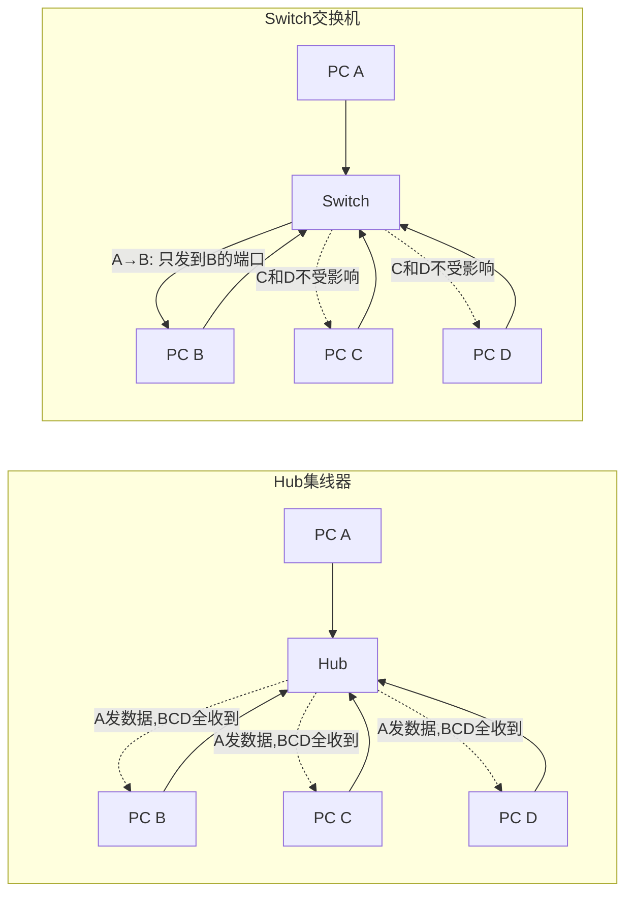

左边的 Hub，A 发数据时 B、C、D 全部收到，同一时刻其他人不能发；右边的 Switch，A 给 B 发数据只有 B 收到，C 和 D 可以同时互相通信。这就是交换机相对集线器的核心优势：**每端口独立带宽 + 精准转发**。

---

## 二、二层交换原理：MAC地址表与帧转发

### 2.1 MAC地址表（CAM表）

MAC 地址表是交换机最核心的数据结构，也叫 **CAM 表**（Content Addressable Memory，内容可寻址存储器）。之所以叫 CAM，是因为这张表存在一种特殊的硬件存储器里——CAM 存储器可以在一个时钟周期内完成精确匹配查找，普通内存需要逐条比对，而 CAM 是"你说个地址，我立刻告诉你它在哪个端口"，类似于哈希表 O(1) 的查找速度。

MAC 地址表的每条记录包含三个字段：

| 字段 | 说明 | 示例 |
|------|------|------|
| MAC 地址 | 设备的网卡地址 | aa:bb:cc:dd:ee:01 |
| 端口号 | 该 MAC 地址对应的交换机端口 | Port 5 |
| VLAN ID | 该 MAC 所属的 VLAN | VLAN 10 |
| 老化计时器 | 多久没用到就删除 | 默认 300 秒 |

### 2.2 学习过程：交换机如何"记住"设备

交换机上电后，MAC 地址表是空的。它是怎么学习到 MAC 地址和端口的映射关系的呢？答案就在**源 MAC 地址**里。

当交换机从端口 5 收到一个帧，帧的源 MAC 是 `aa:bb:cc:dd:ee:01`，交换机就想："哦，这个 MAC 地址的设备在端口 5 那边，我记下来。"于是 MAC 地址表就多了一条记录：`aa:bb:cc:dd:ee:01 → Port 5`。

这就是交换机的**自学习能力**——不需要人工配置，只要设备发了数据，交换机就能记住它在哪。这种"源地址学习"的方式简单高效，但也是泛洪攻击的基础（后面安全章节会讲）。

### 2.3 老化过程：清理不活跃的记录

网络中的设备不是永远在线的，如果一个设备关机了或者移到了别的端口，MAC 地址表里旧的记录就该被清理掉。交换机使用**老化机制（Aging）**来实现这一点：

- 每条记录都有一个老化计时器，默认 300 秒（5 分钟）
- 如果该 MAC 地址在 300 秒内有新的帧进来（源或目的匹配），计时器重置
- 如果 300 秒内没有流量，这条记录就被删除
- 下次再需要通信时，交换机会重新泛洪学习

为什么是 300 秒？这是一个经验值——太短会导致频繁泛洪（影响性能），太长会导致表里堆积大量无效记录（浪费 CAM 空间）。大部分企业级交换机允许你修改这个值，但通常不建议改。

### 2.4 三种转发行为

交换机收到帧后，根据目的 MAC 地址查表，有三种可能的处理方式：

**已知单播（Known Unicast）**：目的 MAC 在表里有记录，交换机知道这个设备在哪个端口，于是只往那个端口转发。这是最高效的情况，帧的转发完全精准，其他端口不受任何影响。比如 A 给 B 发数据，只有 B 的端口会收到这个帧。

**未知单播（Unknown Unicast）**：目的 MAC 在表里找不到。可能是因为目标设备还没发过数据（交换机还没学到它的 MAC），也可能是 MAC 表项已老化。此时交换机不能直接丢掉（万一是合法流量呢），也不能只往一个口发（不知道该往哪个口发），所以只能**泛洪（Flooding）**——把帧复制到除入端口外的所有端口。这其实是"宁可多发，不能丢包"的保守策略。目标设备收到后会回复，交换机就能学到它的 MAC 地址了，后续就不用泛洪了。

**广播/组播（Broadcast/Multicast）**：目的 MAC 是广播地址 `FF:FF:FF:FF:FF:FF` 或组播地址（首字节最低位为 1），交换机始终泛洪到除入端口外的所有端口。广播帧在所到之处每台设备都得接收和处理，这就是广播域太大的问题所在。

### 2.5 三种转发方式

交换机在硬件上如何处理帧的转发，有三种方式：

**直通转发（Cut-Through）**：交换机读到帧的前 14 字节（6 字节目的 MAC + 6 字节源 MAC + 2 字节类型），拿到目的 MAC 就立刻开始转发。优点是**延迟极低**——帧还没完全进来，就已经开始从出口发出去了。缺点是不检查帧的完整性——如果帧在传输中发生了比特错误（CRC 校验失败），交换机也会照样转发这个坏帧，到目的地才会被丢弃。Cut-Through 还有一个变种叫 **Fragment-Free（碎片隔离）**：读前 64 字节再转发——因为大部分错误帧（碰撞碎片）都小于 64 字节，这样可以过滤掉大部分坏帧，同时延迟也不高。

**存储转发（Store-and-Forward）**：交换机把整个帧完整接收下来，检查 FCS（帧校验序列）/CRC，确认帧没有错误后再转发。优点是**可靠性高**——坏帧不会在网络中继续传播。缺点是**延迟大**——必须等整个帧收完才能转发，帧越长延迟越高。对于 1518 字节的标准以太网帧，在 1Gbps 链路上接收需要约 12 微秒，在 10Gbps 上约 1.2 微秒。

**现代交换机实际怎么做**：大多数企业级交换机默认使用 Store-and-Forward（可靠性优先）。但在超低延迟场景（如金融交易），有些交换机支持 Cut-Through。值得注意的是，Cut-Through 只有在入端口和出端口速率相同时才能真正实现——如果出端口比入端口慢，还是得缓冲等待。

### 2.6 帧转发完整决策流程

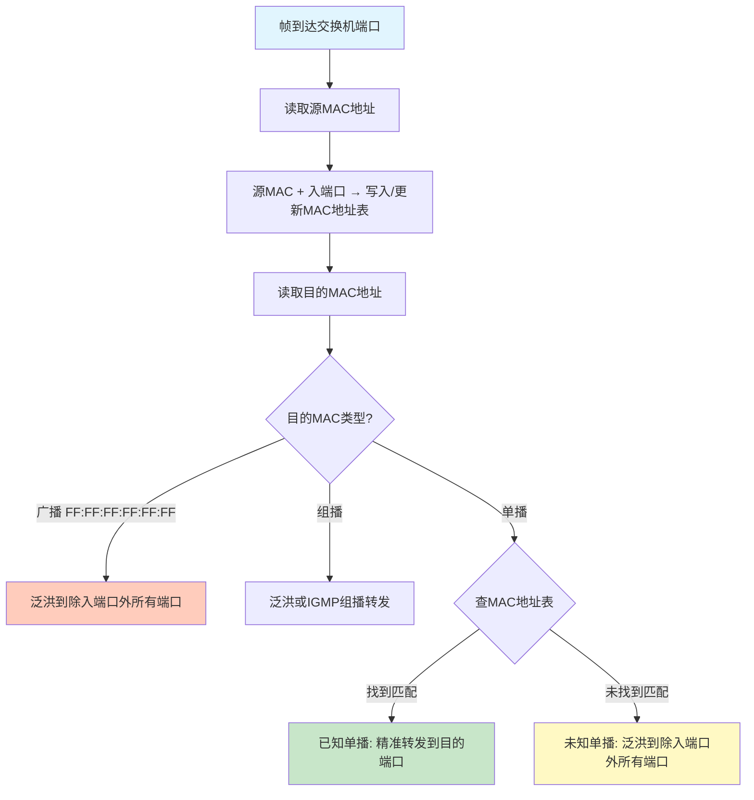

这个流程图展示了帧到达交换机后的完整处理逻辑：先学习（记录源 MAC），再查表（查找目的 MAC），根据结果决定转发行为。**学习是基于源 MAC 的，转发是基于目的 MAC 的**——这个区分非常重要，很多人容易搞混。

---

## 三、VLAN：逻辑隔离的艺术

### 3.1 为什么需要VLAN

想象一个有 500 台电脑的公司局域网，全部连在交换机上，默认都在同一个广播域里。这意味着什么？

- 任何一台电脑发广播（ARP 请求、DHCP 发现等），其他 499 台都要接收和处理
- 广播风暴一来，500 台电脑全部受影响
- 安全问题：财务部的电脑能直接嗅探到技术部的 ARP 请求
- 管理问题：网段太大，IP 地址规划困难

最原始的解决方案是"物理隔离"——给每个部门买一台独立的交换机。但这太浪费了，而且部门搬迁时要重新拉线。

**VLAN（Virtual Local Area Network，虚拟局域网）**就是来解决这个问题的。它在逻辑上把一个大交换机"切"成多个虚拟的小交换机，每个 VLAN 就是一个独立的广播域。同一个 VLAN 内的设备可以直接二层通信，不同 VLAN 之间必须经过三层路由。这样既不需要额外买交换机，又实现了广播域隔离和安全控制。

### 3.2 802.1Q标签格式

VLAN 的核心实现是 **802.1Q 标签**——在以太网帧的源 MAC 地址和类型字段之间插入 4 个字节的 Tag。这 4 个字节的结构如下：

```
 0                   1                   2                   3
 0 1 2 3 4 5 6 7 8 9 0 1 2 3 4 5 6 7 8 9 0 1 2 3 4 5 6 7 8 9 0 1
+-+-+-+-+-+-+-+-+-+-+-+-+-+-+-+-+-+-+-+-+-+-+-+-+-+-+-+-+-+-+-+-+
|          TPID (0x8100)        |  PCP  |DEI|    VLAN ID       |
+-+-+-+-+-+-+-+-+-+-+-+-+-+-+-+-+-+-+-+-+-+-+-+-+-+-+-+-+-+-+-+-+
```

| 字段 | 长度 | 说明 |
|------|------|------|
| TPID | 2 字节 | 标签协议标识，固定值 `0x8100`，表示这是一个 802.1Q 标签帧 |
| PCP | 3 位 | 优先级代码点（Priority Code Point），0-7 共 8 个优先级，用于 QoS |
| DEI | 1 位 | 丢弃合格指示（Drop Eligible Indicator），为 1 表示该帧在拥塞时可被优先丢弃 |
| VLAN ID | 12 位 | VLAN 编号，范围 0-4095。其中 0 和 4095 保留，有效范围 1-4094 |

12 位 VLAN ID 意味着最多支持 **4094 个 VLAN**——在企业网络中通常够用，但在大型数据中心里远远不够（这就是后面要讲 QinQ 和 VXLAN 的原因）。

### 3.3 端口类型：Access、Trunk、Hybrid

VLAN 的配置核心在于端口类型——它决定了帧进出端口时如何处理 VLAN Tag。

**Access 端口**：最简单的端口类型，只属于一个 VLAN。用于连接终端设备（PC、服务器、打印机等）。

- 收到帧：不带 Tag，交换机打上该端口的 PVID（Port VLAN ID）作为 VLAN 标签
- 发出帧：去掉 Tag，以无标签帧发送给终端设备
- 为什么终端不需要 Tag？因为终端设备（普通 PC）通常不理解 802.1Q 标签，它们只认标准的以太网帧

**Trunk 端口**：允许多个 VLAN 通过的端口，用于交换机之间或交换机与路由器之间的互联。

- 收到帧：如果带 Tag，保持 Tag 不变；如果不带 Tag（属于 Native VLAN），打上 Native VLAN 的 Tag
- 发出帧：如果帧属于允许通过的 VLAN，保持 Tag 发出；如果是 Native VLAN 的帧，去掉 Tag 发出
- 可以配置允许通过的 VLAN 列表（Allowed VLAN List），不在列表中的 VLAN 帧会被丢弃

**Hybrid 端口**：华为/H3C 设备特有的端口类型，比 Trunk 更灵活。它可以对不同 VLAN 配置不同的 Tag 行为——某些 VLAN 带 Tag 发出，某些 VLAN 去 Tag 发出。这在一个端口需要同时连接对 VLAN 标签理解程度不同的设备时非常有用。

### 3.4 Native VLAN

Native VLAN 是 Trunk 端口上的一个特殊概念：**属于 Native VLAN 的帧在 Trunk 链路上传输时不带 Tag**。这个设计的初衷是兼容不支持 802.1Q 的老旧设备——它们发出的无 Tag 帧会被当作 Native VLAN 的流量。

但 Native VLAN 也是一个**安全隐患**：如果攻击者向 Trunk 口发送不带 Tag 的帧，交换机会把它当作 Native VLAN 的流量处理，从而可能跨 VLAN 访问。最佳实践是将 Native VLAN 设为一个不使用的 VLAN（如 VLAN 999），并确保两端配置一致。

### 3.5 Voice VLAN

IP 电话是一种特殊的终端设备——它同时需要传输语音流量（需要高优先级）和数据流量（普通优先级）。Voice VLAN 允许 IP 电话的语音流量带上特定的 VLAN Tag 和高 PCP 优先级，而数据流量走 Native VLAN 或 Access VLAN。这样语音流量和数据流量在二层就隔离了，且语音帧的 PCP 值（通常是 5 或 6）确保了在拥塞时语音包优先转发。

### 3.6 VLAN间路由三种方式

不同 VLAN 之间的通信必须经过三层路由，因为 VLAN 就是不同的广播域/子网。实现 VLAN 间路由有三种方式：

**单臂路由（Router-on-a-Stick）**：路由器用一个物理接口连接交换机的 Trunk 口，在路由器上创建多个子接口（如 `G0/0.10`、`G0/0.20`），每个子接口对应一个 VLAN，配一个网关 IP。路由器收到带 VLAN 10 Tag 的帧，由子接口 `.10` 处理；需要发往 VLAN 20 时，由子接口 `.20` 封装 VLAN 20 Tag 发回交换机。

优点：节省路由器接口。缺点：所有 VLAN 间流量都走一条物理链路，带宽成为瓶颈；且路由器是软件转发，性能有限。这种方式只适合小型网络。

**SVI（Switch Virtual Interface）**：三层交换机上为每个 VLAN 创建一个虚拟接口（如 `interface Vlan10`），配上 IP 地址作为该 VLAN 的网关。交换机内部直接完成三层转发，不需要外部路由器。这是**企业网络最常用的方式**——硬件转发，性能远超单臂路由。

**三层交换（纯硬件路由）**：现代三层交换机直接在 ASIC/TCAM 中完成 IP 路由查找和转发，不需要经过 CPU。每个 VLAN 的网关 IP 配在 SVI 上，交换机的 FIB 表存有所有 VLAN 网段的路由，帧到达后直接查 FIB 表转发。这是**最高效的方式**，也是数据中心的标准做法。

### 3.7 美团实践：M-NOS的VLAN配置

在美团的自研交换机操作系统 M-NOS 中，VLAN 的配置采用 JSON 格式，支持 `tagged` 和 `untagged` 两种模式，对应 Trunk 和 Access 的概念。一个典型的配置片段如下：

```json
{
  "VLAN": {
    "Vlan100": {
      "vlanid": 100,
      "description": "production-servers",
      "members": {
        "Ethernet0": "untagged",
        "Ethernet1": "untagged",
        "Ethernet48": "tagged"
      }
    }
  }
}
```

这种声明式的配置方式相比传统 CLI 逐条输入，更适合自动化管理和批量下发，也更容易做配置校验和版本控制。

### 3.8 VLAN帧在Trunk链路上的传输过程

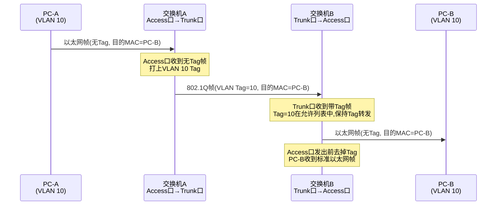

整个过程中，PC-A 和 PC-B 完全感知不到 VLAN Tag 的存在——Tag 的添加和去除由交换机在 Access 端口自动完成。对于终端设备来说，它们就像在一个普通的局域网里通信一样。

---

## 四、VLAN的扩展：QinQ与VXLAN

### 4.1 为什么4094个VLAN不够用

802.1Q 的 12 位 VLAN ID 最多支持 4094 个 VLAN，在传统企业网络中这绰绰有余——一个公司可能也就十几个部门，配几十个 VLAN 就够了。但在以下场景中，4094 就成了硬限制：

- **运营商网络**：运营商要为成千上万的企业客户提供二层隔离，每个客户可能需要多个 VLAN
- **大型数据中心**：成千上万的租户，每个租户可能需要独立的 VLAN
- **云计算**：多租户环境下，每个租户的虚拟网络都需要 VLAN 隔离

此外，VLAN 还有一个根本性限制：**VLAN 是二层概念，不能跨越三层网络**。如果你在北京和上海各有两个数据中心，想让同一个 VLAN 跨数据中心互通，就得在中间拉一条纯二层链路——这在广域网上几乎不可行。

### 4.2 QinQ（802.1ad）：双层VLAN标签

QinQ 的思路非常直接——一层不够就再加一层。在已有的 802.1Q Tag 外面再套一层 802.1ad Tag，形成"标签栈"：

```
| 外层Tag (Service VLAN) | 内层Tag (Customer VLAN) | 原始以太网帧 |
```

- **内层 Tag**（Customer VLAN，C-VLAN）：客户自己打的 VLAN 标签，客户网络内部使用
- **外层 Tag**（Service VLAN，S-VLAN）：运营商打的 VLAN 标签，用于区分不同客户

这样，VLAN 数量就从 4094 扩展到了 **4094 × 4094 ≈ 1600 万**个逻辑组合。运营商为每个客户分配一个 S-VLAN，客户内部再自由使用 C-VLAN，互不冲突。

QinQ 的封装和解封装在运营商的边缘设备（PE）上完成。客户设备只看到内层 Tag，完全不知道外层 Tag 的存在。这就像快递公司在外面又套了一个大包裹——寄件人只管自己的小包裹，外面的快递袋是快递公司加的。

**QinQ 的局限**：虽然扩展了 VLAN 数量，但本质上还是二层技术，仍然不能跨三层网络传输。而且双层 Tag 增加了帧长度（多了 4 字节），可能导致超过标准 MTU（1500 字节）而需要调整。

### 4.3 VXLAN：用三层网络传输二层帧

VXLAN（Virtual eXtensible Local Area Network）是网络虚拟化的革命性技术，它用一种巧妙的方式解决了 VLAN 的两大限制：数量不够和不能跨三层。

**核心思想**：把原始的二层以太网帧整个作为载荷，封装在一个三层 UDP 数据包里传输。这样，二层帧就能跨越三层网络了——因为中间的路由器只看外层的 IP 头，不知道里面还藏着一个二层帧。

**VXLAN 封装结构**：

```
| 外层以太网头 | 外层IP头 | 外层UDP头(目的端口4789) | VXLAN头(8字节) | 原始以太网帧 |
```

其中 VXLAN 头的 8 字节结构：

```
 0                   1                   2                   3
 0 1 2 3 4 5 6 7 8 9 0 1 2 3 4 5 6 7 8 9 0 1 2 3 4 5 6 7 8 9 0 1
+-+-+-+-+-+-+-+-+-+-+-+-+-+-+-+-+-+-+-+-+-+-+-+-+-+-+-+-+-+-+-+-+
|R|R|R|R|I|R|R|R|            Reserved                         |
+-+-+-+-+-+-+-+-+-+-+-+-+-+-+-+-+-+-+-+-+-+-+-+-+-+-+-+-+-+-+-+-+
|                VXLAN Network Identifier (VNI) |  Reserved    |
+-+-+-+-+-+-+-+-+-+-+-+-+-+-+-+-+-+-+-+-+-+-+-+-+-+-+-+-+-+-+-+-+
```

- **VNI（VXLAN Network Identifier）**：24 位，支持 **2^24 ≈ 1677 万**个逻辑网络，远超 VLAN 的 4094
- **Flags 字段中的 I 位**：必须为 1，表示 VNI 字段有效
- **UDP 目的端口**：标准端口 4789，源端口由 VTEP 根据内层帧的哈希值生成（用于 ECMP 负载均衡）

### 4.4 VTEP：VXLAN的封装/解封装端点

**VTEP（VXLAN Tunnel Endpoint）**是 VXLAN 网络中的关键角色——它负责在原始帧和 VXLAN 封装帧之间转换：

- **封装（Encapsulation）**：收到原始二层帧后，加上 VXLAN 头、UDP 头、外层 IP 头、外层以太网头，从物理端口发出
- **解封装（Decapsulation）**：收到 VXLAN 封装帧后，剥掉外层头部，还原出原始二层帧，在本地交换机内转发

VTEP 可以是物理交换机（如数据中心的 Leaf 交换机），也可以是软件实现（如 Linux 上的 VXLAN 接口、虚拟交换机 OVS）。

VTEP 之间通过**洪泛与学习**或 **EVPN 控制面**来发现彼此。传统方式是广播学习（和二层交换机学习 MAC 地址类似），但规模大了以后效率太低。现代数据中心普遍使用 **EVPN（Ethernet VPN）**作为 VXLAN 的控制面——用 BGP 来传递 MAC/IP 地址信息，不再依赖泛洪学习。

### 4.5 为什么数据中心用VXLAN

VXLAN 在数据中心全面替代 VLAN 有三大理由：

**第一，VLAN 数量不够**。一个大型数据中心可能有成千上万个租户/应用，每个需要独立的二层网络。4094 个 VLAN 远远不够，而 VXLAN 的 1600 万 VNI 绰绰有余。

**第二，跨三层的二层互通**。数据中心的 Leaf-Spine 架构是三层路由互联（后面会讲），但虚拟机迁移、容器网络等场景又要求二层互通。VXLAN 把二层帧封装在三层包里，完美解决了这个矛盾。

**第三，支持虚拟机/容器迁移**。虚拟机从一个物理服务器迁移到另一个，要求 IP 地址和 MAC 地址不变（否则上层应用会断开）。VXLAN Overlay 网络让虚拟机的二层域可以跨越物理网络，迁移不受物理位置限制。

### 4.6 VXLAN封装结构图

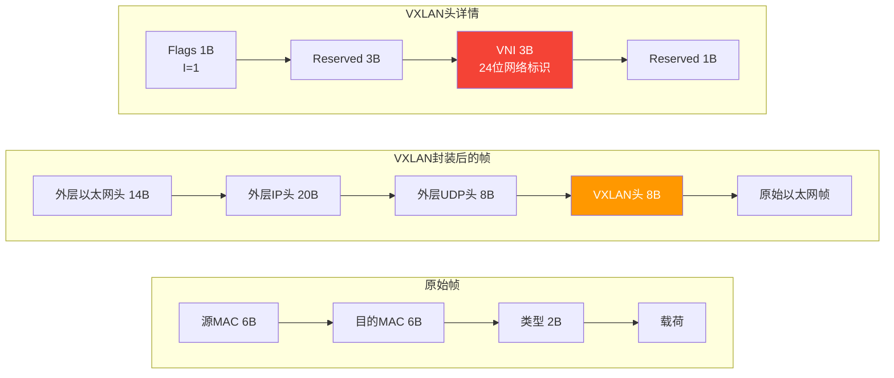

VXLAN 封装增加了 **50 字节**的额外开销（14 + 20 + 8 + 8），这意味着原始帧最大只能 1450 字节（假设 MTU 为 1500）。因此部署 VXLAN 时通常需要调整物理网络的 MTU 到至少 1550，推荐 9000（Jumbo Frame），以减少分片和提高效率。

---

## 五、生成树协议：消除二层环路

### 5.1 二层环路为什么致命

在设计网络时，为了冗余可靠性，我们通常会在交换机之间部署多条链路。比如两台核心交换机之间连两条线，一条断了还有另一条。但如果两条线都活着，就形成了**二层环路**。

二层环路和三层环路有一个根本区别：**IP 包有 TTL（生存时间），每经过一个路由器 TTL 减 1，减到 0 就丢弃**；但**以太网帧没有 TTL**——一个帧可以在环路里永远转圈。

一旦有广播帧进入环路，后果是灾难性的：

1. **广播风暴**：广播帧在每个交换机上都被泛洪到所有端口，包括环路回来的端口。帧回到原交换机后又被泛洪出去，形成正反馈。几秒钟内，网络带宽就被无限复制的广播帧完全占满。
2. **MAC 地址表震荡**：同一个 MAC 地址一会儿从端口 1 学到，一会儿又从端口 2 学到（因为环路帧从不同端口回来）。交换机不停地更新 MAC 表，导致正常流量也无法正确转发。
3. **CPU 飙升**：交换机 CPU 被海量的帧中断处理淹没，可能直接宕机。

这不是理论上的问题——**一根误插的网线就能让整个二层网络在 5 秒内瘫痪**。这就是生成树协议存在的意义。

### 5.2 STP（802.1D）：经典生成树

生成树协议（Spanning Tree Protocol）的目标是：**在存在物理环路的网络中，通过逻辑上阻塞某些端口，构建一棵无环的"树"**。

**根桥选举**：

STP 的第一步是选出一台交换机作为"老大"——根桥（Root Bridge）。选举规则很简单：**Bridge ID 最小的交换机成为根桥**。

Bridge ID = 优先级（2 字节，默认 32768，步长 4096）+ MAC 地址（6 字节）。先比优先级，优先级相同再比 MAC 地址，越小越优先。

实际部署中，**应该手动把核心交换机的优先级调低**（如设为 0 或 4096），确保它成为根桥。如果让交换机自动选举，MAC 地址最小的那台成为根桥——而这可能是一台性能最弱的接入层交换机，导致网络流量走次优路径。

**端口角色分配**：

选出根桥后，非根桥交换机上的每个端口会被分配一个角色：

- **根端口（Root Port，RP）**：每台非根桥交换机上，到根桥路径开销最小的端口。每台交换机只有一个根端口。
- **指定端口（Designated Port，DP）**：每个网段（链路）上，到根桥路径开销最小的端口。该端口负责转发该网段的流量。根桥上的所有端口都是指定端口。
- **阻塞端口（Blocked Port/Alternate Port）**：既不是根端口也不是指定端口的端口，被逻辑阻塞，不转发数据帧（但仍然接收 BPDU）。

**BPDU（Bridge Protocol Data Unit）**：

交换机之间通过交换 BPDU 来完成根桥选举和拓扑计算。BPDU 有两种：

- **配置 BPDU（Configuration BPDU）**：由根桥周期性发送（默认每 2 秒），非根桥交换机转发。包含根桥 ID、路径开销、发送者 Bridge ID 等信息。
- **TCN BPDU（Topology Change Notification BPDU）**：当网络拓扑变化时（如链路断开），由检测到变化的交换机向根桥发送，根桥收到后通知全网更新 MAC 表。

**端口状态迁移**：

STP 端口从阻塞到转发需要经历漫长的状态迁移：

| 状态 | 接收BPDU | 学习MAC | 转发数据 | 持续时间 |
|------|----------|---------|----------|----------|
| Blocking | ✓ | ✗ | ✗ | 无限（直到被选为RP或DP） |
| Listening | ✓ | ✗ | ✗ | 15秒（Forward Delay） |
| Learning | ✓ | ✓ | ✗ | 15秒（Forward Delay） |
| Forwarding | ✓ | ✓ | ✓ | 正常工作 |

从 Blocking 到 Forwarding 总共需要 **30-50 秒**——这就是经典 STP 最被诟病的地方：收敛太慢。在 50 秒内，受影响的 VLAN 通信完全中断，对现代应用来说是不可接受的。

### 5.3 RSTP（802.1W）：快速生成树

RSTP（Rapid Spanning Tree Protocol）是 STP 的快速版本，核心改进是**将收敛时间从 30-50 秒缩短到秒级**。

**主要改进**：

1. **端口状态简化**：从 5 个状态简化为 3 个——Discarding（丢弃）、Learning（学习）、Forwarding（转发）。Discarding 合并了原来的 Disabled、Blocking、Listening 三个状态。
2. **端口角色扩展**：增加了 Backup Port（备份指定端口）和 Alternate Port（替代根端口），提前确定好备用路径，拓扑变化时直接切换。
3. **Proposal/Agreement 机制**：这是 RSTP 快速收敛的关键。当一个新的链路接入时，交换机通过 Proposal/Agreement 握手，在两端同步确定端口角色，**无需等待 Forward Delay 计时器**，可以在几秒内完成收敛。
4. **边缘端口（Edge Port）**：连接终端设备的端口可以配置为 Edge Port，直接进入 Forwarding 状态，不参与 STP 计算。插上网线就能通——这对接入层非常友好。

### 5.4 MSTP（802.1S）：多实例生成树

STP/RSTP 只有一棵生成树——所有 VLAN 的流量走同一条路径。这意味着即使网络中有多条等价链路，STP 也会阻塞其中一些，造成带宽浪费。

MSTP（Multiple Spanning Tree Protocol）允许将多个 VLAN 映射到不同的生成树实例（MST Instance，MSTI），不同实例可以有不同的根桥和转发路径，从而实现**负载均衡**。

举例：网络中有两台核心交换机 Core-A 和 Core-B，VLAN 10-20 映射到 MSTI 1（以 Core-A 为根），VLAN 30-40 映射到 MSTI 2（以 Core-B 为根）。这样，VLAN 10-20 的流量走 Core-A 侧的链路，VLAN 30-40 的流量走 Core-B 侧的链路，两条链路都得到利用。

### 5.5 数据中心为什么不用STP

现代数据中心几乎不使用生成树协议，原因有三：

1. **收敛太慢**：即使是 RSTP 的秒级收敛，对数据中心毫秒级的要求也不够。流量洪峰期间一秒的中断都可能造成业务损失。
2. **带宽浪费**：STP 必须阻塞冗余链路，而数据中心的 Leaf-Spine 架构有大量并行链路，如果用 STP 阻塞，浪费严重。
3. **架构不同**：数据中心的 Leaf-Spine 架构是三层路由互联，使用 **ECMP（等价多路径路由）** 实现冗余和负载均衡——路由协议天然无环，不需要 STP。

在数据中心里，STP 只在接入层的局部小范围使用（如 ToR 交换机的下联端口），核心和汇聚层完全依赖三层路由。

### 5.6 STP根桥选举与端口角色

```mermaid
graph TB
    SW1["SW-A<br/>Bridge ID: 32768.aa:aa:aa:aa:aa:aa<br/>🔴 根桥"]
    SW2["SW-B<br/>Bridge ID: 32769.bb:bb:bb:bb:bb:bb"]
    SW3["SW-C<br/>Bridge ID: 32770.cc:cc:cc:cc:cc:cc"]

    SW1 ---|"指定端口(DP)"<br/>根端口(RP)| SW2
    SW1 ---|"指定端口(DP)"<br/>根端口(RP)| SW3
    SW2 -.-|"阻塞端口(Blocked)"| SW3

    style SW1 fill:#ffcdd2
    style SW2 fill:#c8e6c9
    style SW3 fill:#c8e6c9
```

在这个拓扑中：SW-A 的 Bridge ID 最小，成为根桥，其所有端口都是指定端口。SW-B 和 SW-C 各自选择到根桥开销最小的端口作为根端口。SW-B 和 SW-C 之间的链路上，靠近根桥开销较小的端口成为指定端口，另一端被阻塞——从而消除环路。如果 SW-B 到 SW-A 的链路断开，SW-B 的阻塞端口会升级为根端口，流量改走 SW-C 转发。

---

## 六、链路聚合与高可靠性

### 6.1 链路聚合LACP（802.3ad）

在实际网络中，两台交换机之间往往需要比单条链路更大的带宽和更高的可靠性。链路聚合（Link Aggregation）就是把多条物理链路捆绑成一条逻辑链路，实现**带宽叠加**和**链路冗余**。

**带宽叠加**：4 条 10G 链路聚合成一条 40G 逻辑链路。但要注意，链路聚合的负载分担是**基于流**的，不是基于包的。交换机根据帧的源/目的 MAC、源/目的 IP、TCP/UDP 端口等信息做哈希，同一个流的帧始终走同一条物理链路（避免乱序），不同流分到不同链路。所以实际吞吐量取决于流数的分布——如果只有一个大流量，它只能跑在一条物理链路上，总带宽还是 10G。

**链路冗余**：聚合组中任意一条物理链路断开，流量会自动重新哈希到剩余链路上，不会中断业务（只是可用带宽减少）。

**LACP（Link Aggregation Control Protocol）**是链路聚合的协商协议，确保两端设备的聚合配置一致。LACP 有两种模式：

- **主动模式（Active）**：主动发送 LACP 协商报文，不管对端是否响应
- **被动模式（Passive）**：只有收到对端的 LACP 报文才响应，自己不主动发起

两端至少要有一端是 Active 才能成功建立聚合。LACP 报文包含系统优先级、系统 MAC、端口优先级、端口编号等信息，两端根据这些参数协商出哪些端口加入聚合组。

### 6.2 堆叠技术：多虚一

堆叠（Stacking）技术将多台物理交换机虚拟为一台逻辑交换机，对外呈现为一个管理实体。

**常见厂商实现**：

- 思科 Catalyst：**StackWise**，专用堆叠线缆互联
- 思科 Nexus：**VSS（Virtual Switching System）**，两台交换机虚拟为一台
- 华为/H3C：**IRF（Intelligent Resilient Framework）**
- 锐捷：**VSU（Virtual Switching Unit）**

**堆叠的优点**：

1. **配置简单**：只需管理一台逻辑设备，不用在多台设备上重复配置
2. **毫秒级收敛**：成员交换机之间通过专用链路实时同步状态，故障切换极快
3. **跨设备链路聚合**：服务器可以分别连到两台堆叠交换机上做跨设备聚合，实现双活上行

**堆叠的缺点**：

1. **故障域扩大**：一台成员交换机故障可能导致整个堆叠系统不稳定（尤其是主交换机故障时）
2. **分裂脑（Split-Brain）风险**：当堆叠线缆断开时，两台交换机都认为自己是主设备，各自主控网络——IP 地址冲突、MAC 地址表混乱，后果严重。通常通过检测机制（如通过管理口互相探测）来发现分裂，然后让备设备重启
3. **版本升级需整体重启**：堆叠系统升级通常需要所有成员同时重启，导致业务中断

### 6.3 跨设备链路聚合：M-LAG与VPC

跨设备链路聚合解决了堆叠的"控制面耦合"问题——两台交换机在控制面上保持独立，只在数据面上协同工作，对外表现为一个聚合系统。

**M-LAG（Multi-Chassis Link Aggregation）**：

M-LAG 是华为/H3C 的跨设备链路聚合技术。两台独立交换机通过 **Peer-Link**（对等链路）和 **Keepalive**（心跳线）协同工作：

- **Peer-Link**：两台交换机之间的专用链路，用于同步 MAC 地址表、ARP 表、IGMP 表等，以及传输跨设备的流量（当流量从一台交换机进入但目的服务器连在另一台交换机上时）
- **Keepalive**：独立于 Peer-Link 的心跳链路（通常走管理口），用于检测对端是否存活。如果 Keepalive 断开但 Peer-Link 还在，说明对端可能宕机；如果 Keepalive 在但 Peer-Link 断开，需要触发保护动作

对下联服务器来说，它看到的就像是连在一台交换机上——两台 M-LAG 交换机对外通告**相同的 System MAC**，LACP 协商正常进行。

**VPC（Virtual Port Channel）**：

VPC 是思科 Nexus 的跨设备链路聚合技术，原理和 M-LAG 类似，也是两台独立的 Nexus 交换机通过 Peer-Link 和 Keepalive 协同，对外伪装成一个 LACP 系统。

**M-LAG/VPC 相比堆叠的优势**：

1. **故障域隔离**：两台交换机控制面独立，一台故障不影响另一台的正常运行
2. **无分裂脑风险**：Keepalive 检测到对端宕机后，本地交换机继续独立工作，不存在两个主设备冲突的问题
3. **支持独立升级**：可以逐台升级交换机，业务不中断——先升级一台，等它恢复后再升级另一台

### 6.4 美团去堆叠实践

美团在网络演进过程中，经历了从堆叠到"去堆叠"的转变。早期美团也使用 IRF/VSS 堆叠，但随着规模扩大，堆叠的缺陷暴露无遗——分裂脑导致整网中断的事故时有发生。

美团推行的"去堆叠"策略，核心思路是**用 M-LAG 或 ARP 代理替代堆叠**，实现控制面解耦：

**LACP 欺骗**：在没有 M-LAG 的场景下，两台独立交换机各自伪装相同的 System MAC，让下游服务器以为连的是同一台交换机，从而完成 LACP 协商。两台交换机之间不需要 Peer-Link 同步，各自独立工作。

**ARP 代理（ARP2HOST）**：每台交换机独立学习 ARP 表，当流量从一台交换机进入但目的 IP 在另一台交换机的下联服务器上时，通过 ARP 代理机制将流量引导到正确的交换机。这种方式比 M-LAG 更轻量——不需要 Peer-Link 链路，两台交换机之间完全解耦。

**M-NOS 默认去堆叠配置**：美团自研的交换机操作系统 M-NOS 默认使用去堆叠配置，不再支持传统堆叠模式。新部署的交换机一律采用独立控制面 + 跨设备链路聚合的方式。

**去堆叠的优势**：

| 对比项 | 堆叠 | 去堆叠（M-LAG/ARP代理） |
|--------|------|--------------------------|
| 控制面 | 耦合（统一主控） | 独立（各自运行） |
| 分裂风险 | 有（严重故障） | 无 |
| 故障域 | 整个堆叠系统 | 单台交换机 |
| 升级方式 | 整体重启 | 逐台升级，业务不中断 |
| 配置复杂度 | 低（一台设备） | 中（需配Peer-Link/ARP代理） |
| 收敛速度 | 毫秒级 | 毫秒级（M-LAG）/ 秒级（ARP代理） |

### 6.5 M-LAG双活架构

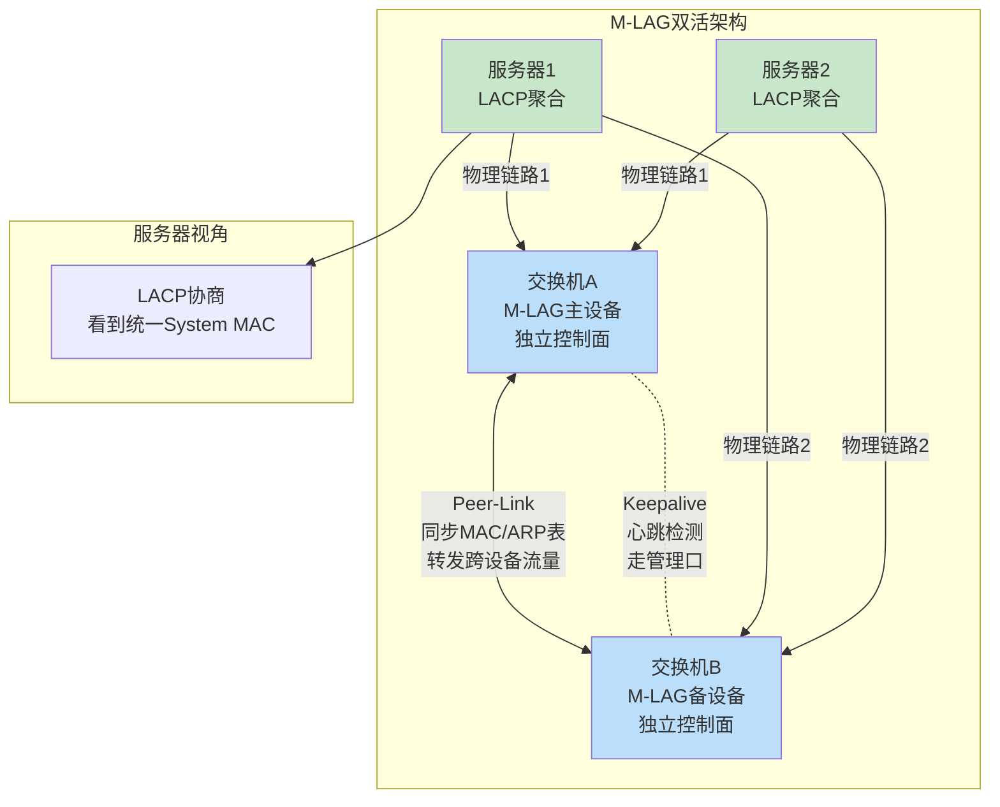

从服务器的角度看，它通过 LACP 和一台逻辑交换机建立了聚合链路——两台物理交换机对外表现为一个统一的 LACP 对端。任意一台交换机故障，服务器仍可通过另一台正常通信，业务不中断。

---

## 七、三层交换：当交换机学会路由

### 7.1 三层交换机 vs 传统路由器

很多人会有疑问：三层交换机和路由器到底有什么区别？它们都能做 IP 路由转发，为什么数据中心用三层交换机而不用路由器？

**核心区别在于转发引擎**：

传统路由器（尤其是中低端）用 **CPU 软件转发**——收到 IP 包后，CPU 查路由表、做 ACL 匹配、改写 TTL、重新计算校验和，然后从对应接口发出。这个过程虽然灵活，但受限于 CPU 性能，吞吐量通常在几百万 pps（包每秒）级别。

三层交换机用 **ASIC/TCAM 硬件转发**——整个查表、匹配、转发过程在专用芯片中完成，一个时钟周期就能处理一个包，吞吐量可以达到数十亿 pps，即**线速转发（Line-Rate）**——不管包多大，端口的速率有多快就能转多快。

当然，高端核心路由器（如 Cisco 8000、华为 NE9000）也使用 ASIC/NPU，但它们侧重的是 WAN 接口（POS、OTN 等）、丰富的 QoS 特性和 MPLS 功能，而三层交换机侧重的是高密度以太网接口和数据中心内部路由。

| 对比项 | 三层交换机 | 传统路由器 |
|--------|-----------|-----------|
| 转发引擎 | ASIC/TCAM 硬件 | CPU 软件（高端也有ASIC） |
| 转发性能 | 线速（数十亿pps） | 百万~十亿pps |
| 接口类型 | 高密度以太网口 | 多种WAN接口 |
| 路由协议 | 支持（OSPF/BGP/IS-IS） | 支持（全系列） |
| 典型场景 | 数据中心内部VLAN间路由、BGP Leaf/Spine | WAN互联、互联网出口 |
| 价格 | 相对便宜（万~百万） | 昂贵（十万~千万） |

### 7.2 硬件转发原理

三层交换机的硬件转发涉及三个关键组件：

**ASIC（Application-Specific Integrated Circuit）**：专用集成电路，是交换机的"心脏"。ASIC 内部集成了大量的处理单元和查找引擎，可以并行处理多个包的转发。ASIC 不像 CPU 那样运行软件——它的逻辑是固化的（烧在芯片里的），所以速度极快但灵活性有限。常见的交换机 ASIC 包括 Broadcom Trident/Tomahawk 系列、Mellanox Spectrum 系列、Barefoot Tofino 等。

**FIB 表（Forwarding Information Base）**：转发信息表，是路由表的"硬件版本"。路由协议（OSPF/BGP 等）计算出最优路由后，将结果写入 FIB 表。FIB 表存在 TCAM 中，可以在一个时钟周期内完成最长前缀匹配查找。一个大型三层交换机的 FIB 表可以容纳数十万到数百万条路由。

**TCAM（Ternary Content Addressable Memory）**：三态内容可寻址存储器，是 FIB 表和 ACL 的存储介质。"三态"指的是每个比特可以是 0、1 或 X（不关心/don't care），这使得 TCAM 支持**掩码匹配**——比如一条路由 `10.0.0.0/8`，TCAM 可以将后 24 位设为 X，只匹配前 8 位。TCAM 的查找速度极快（一个时钟周期），但成本高昂且功耗大，所以容量有限。

### 7.3 SVI（Switch Virtual Interface）

SVI 是三层交换机上最常用的三层接口类型。它是为每个 VLAN 创建的虚拟接口，配上 IP 地址后作为该 VLAN 的网关。

```
interface Vlan10
 ip address 10.1.10.1 255.255.255.0

interface Vlan20
 ip address 10.1.20.1 255.255.255.0
```

VLAN 10 的设备想访问 VLAN 20 的设备，就把包发给网关 10.1.10.1（SVI 10），交换机在内部完成三层转发：查 FIB 表找到目的网段 10.1.20.0/24 对应 SVI 20，做 ARP 解析，封装新帧从 VLAN 20 的端口发出。

SVI 的状态和 VLAN 的状态绑定——如果 VLAN 10 没有活跃的物理端口（所有端口都 down 了或 VLAN 未创建），SVI 10 也会自动 down。

### 7.4 Routed Port

Routed Port（路由端口）是将一个二层交换口变成三层路由口的方式。在三层交换机上，可以用 `no switchport`（Cisco）或类似命令将端口切换为路由模式，直接在端口上配置 IP 地址。

```
interface Ethernet1/1
 no switchport
 ip address 192.168.1.1 255.255.255.0
```

Routed Port 适用于点对点三层互联场景，比如两台三层交换机之间通过三层链路连接、交换机与路由器之间的互联等。与 SVI 不同，Routed Port 不属于任何 VLAN，纯粹是三层接口。

### 7.5 "一次路由，多次交换"的演进

早期（上世纪90年代）的三层交换机采用"一次路由，多次交换"（Route Once, Switch Many）的模式：

1. **第一个包**（新流的首包）到达三层交换机，硬件查表发现没有对应的转发缓存，于是上送 CPU
2. CPU 软件路由：查路由表、做 ARP 解析、确定出接口，生成一条**流缓存（Flow Cache）**记录
3. **后续同流的包**直接命中流缓存，由硬件按照缓存中的信息转发，不再经过 CPU

这种模式的问题是：首包延迟高（CPU 处理），且流缓存在流量模型复杂时命中率下降。

**现代三层交换机已经不需要"一次路由"了**。ASIC/TCAM 直接硬件完成最长前缀匹配和 ARP 解析——所有包，包括首包，都在硬件中转发。CPU 只负责运行路由协议、管理配置等控制面任务，不再参与数据面转发。所以"一次路由，多次交换"这个说法在现代网络中已经过时，但在面试中仍然经常被问到。

### 7.6 三层交换机上跑OSPF、BGP

现代三层交换机完全支持运行完整的路由协议。美团的 Leaf/Spine 架构中，每台 Leaf 交换机和 Spine 交换机上都运行 **BGP**（通常是 eBGP），通过 BGP 交换路由信息：

- Leaf 交换机通过 BGP 向 Spine 通告本地直连的网段（服务器所在的子网）
- Spine 交换机将收到的路由反射给其他 Leaf（Spine 作为路由反射器，Route Reflector）
- Leaf 之间的流量通过 Spine 中转，路径是最短的三跳（Leaf → Spine → Leaf）

为什么数据中心选 BGP 而不是 OSPF？因为 BGP 更灵活：

1. **策略控制**：BGP 丰富的属性（Local Preference、MED、Community 等）可以精细控制路由策略
2. **可扩展性**：BGP 天然支持大量路由（互联网有近百万条路由），OSPF 在大规模时 LSP 泛洪开销大
3. **ECMP**：BGP 天然支持等价多路径，适合 Leaf-Spine 的多路径架构
4. **故障隔离**：eBGP 邻居关系比 OSPF 更独立，一个邻居故障不会波及其他邻居

当然，BGP 的配置比 OSPF 复杂，但在自动化运维（如美团 M-NOS 的自动配置下发）的加持下，这个复杂度已经被有效管理了。

### 7.7 三层交换转发流程

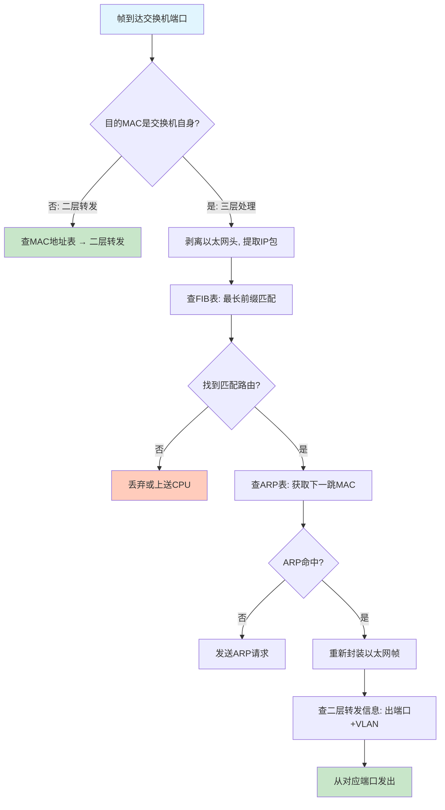

三层转发的关键判断是：**帧的目的 MAC 是不是交换机自身的 MAC**。如果是，说明这个帧是发给交换机本身做三层转发的（通常是因为目的 IP 不在本 VLAN 内，终端把帧发给网关 SVI）；如果不是，按普通二层转发处理。

整个三层转发过程——从 IP 包提取、FIB 查找、ARP 解析、帧重封装——在现代交换机的 ASIC 中全部由硬件完成，可以达到线速转发。

---


## 八、数据中心交换机架构

### 8.1 传统三层架构的困境

早期数据中心沿用园区网的接入-汇聚-核心三层架构。这套架构在数据中心里暴露出几个致命问题：

第一，**STP 阻塞带宽**。为了防环，生成树会阻塞冗余链路，大量投资的链路被闲置。第二，**南北向设计不适应东西向流量**。传统架构为"客户端→服务器"的南北向流量优化，但虚拟化和微服务时代，服务器之间（东西向）的流量占比超过 70%。第三，**扩展困难**。每增加一层汇聚交换机，整个生成树都要重新计算。

### 8.2 CLOS 网络：一个 1952 年的天才想法

1952 年，贝尔实验室的 Charles Clos 发表了一篇论文，证明可以用多个小规模交换单元组合出一个无阻塞的大规模交换网络。核心思想是：**不需要一台巨大的交换机，只需要把小交换机按特定拓扑互联就行**。

70 年后的今天，全球几乎所有大型数据中心都在用这个架构，只不过换了个名字叫 **Leaf-Spine**。

### 8.3 Leaf-Spine 两层架构

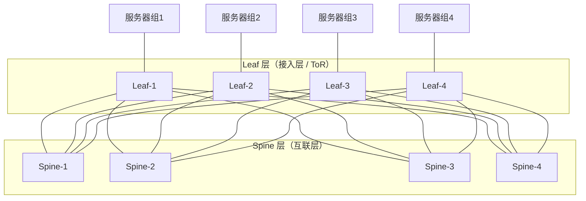

关键特性：

**全互联**：每台 Leaf 都与每台 Spine 有一条直连链路，没有例外。这意味着任意两台服务器之间最多经过 2 跳（Leaf→Spine→Leaf），延迟完全一致。

**ECMP 天然负载均衡**：因为到同一个目的 Leaf 有多条等价路径（经过不同的 Spine），路由协议自动实现等价多路径负载均衡，不再需要 STP 来防环——所有链路都在工作。

**水平扩展**：需要接入更多服务器？加 Leaf。需要更多互联带宽？加 Spine。互不影响。

**三级 CLOS（Super Spine）**：当 Spine 数量达到极限时，在 Spine 之上再加一层 Super Spine，形成 Pod→Spine→Super Spine 的三级结构，支撑数十万台服务器的超大规模数据中心。

### 8.4 ToR vs EoR

| 对比项 | ToR（Top of Rack） | EoR（End of Row） |
|--------|--------------------|--------------------|
| 交换机位置 | 每个机柜顶部一台 | 一排机柜末端集中 |
| 线缆长度 | 短（1-3米） | 长（10-30米） |
| 故障域 | 小（一个机柜） | 大（一排机柜） |
| 端口利用率 | 可能有空闲端口 | 较高 |
| 主流程度 | 最主流方案 | 少数场景 |

### 8.5 美团数据中心实践

美团 IDC 网络采用去堆叠的 Leaf-Spine 架构：

- 同 AZ（可用区）内延时 **< 0.3ms**
- 同 Region 不同 AZ 间延时 **< 2ms**
- 中卫云创数据中心：服务器接入带宽 25G/100G，上联 100G
- 北京多个 AZ：永丰（YF）、光环（GH）、兆丰（ZF）等，采用 Set 对容灾互备
- 上海：月浦（YP）、嘉定（JD）

---

## 九、交换机硬件架构与芯片

### 9.1 交换机内部拆解

打开一台交换机，核心部件包括：

- **交换芯片（ASIC）**：灵魂部件，决定了转发能力、端口数量、功能特性。一台交换机的性能上限取决于它用了什么芯片
- **CPU**：运行网络操作系统（NOS），处理控制面协议（OSPF/BGP/STP 等），一般是 ARM 或 x86
- **内存（DRAM）**：存储路由表、MAC 地址表、配置文件、操作系统运行时数据
- **Flash / SSD**：持久化存储操作系统镜像和配置
- **端口模块**：SFP（1G/10G）、SFP28（25G）、QSFP28（100G）、QSFP-DD（400G）光口或 RJ45 电口
- **电源和风扇**：通常冗余配置

### 9.2 CAM vs TCAM

这两种存储器是交换机硬件转发的核心：

**CAM（Content Addressable Memory）**：内容可寻址存储器。你给它一个值（比如 MAC 地址），它在一个时钟周期内告诉你"找到了，在第 X 个位置"或"没找到"。用于 **MAC 地址表精确查找**。

**TCAM（Ternary CAM）**：三态内容可寻址存储器。每个比特可以是 0、1 或 **X（don't care，任意匹配）**。这让它能做通配符匹配，用于 **ACL 规则匹配、QoS 策略、路由前缀的最长前缀匹配**。

TCAM 成本很高、容量有限（通常几千到几万条）。这就是为什么交换机上配太多 ACL 规则会出问题——TCAM 被塞满后，新规则只能走 CPU 软件处理，性能断崖式下降。

### 9.3 博通芯片家族

博通（Broadcom）是交换芯片市场的绝对霸主，旗下有三大产品线：

**Trident 系列——功能全能型**：面向需要丰富功能的企业级和数据中心场景。Trident 4（2019 年，7nm，12.8Tbps）支持大型片上数据库、强化 Telemetry 和智能拥塞控制。Trident 5（2023 年，16Tbps）融入 AI 赋能。特点是功能丰富但带宽不是最高。

**Tomahawk 系列——带宽怪兽型**：面向超大规模数据中心的纯粹高带宽需求。Tomahawk 5（2022 年，5nm，51.2Tbps，64 端口 800G）。最新的 **Tomahawk 6**（2025 年，3nm + Chiplet，**102.4Tbps**）是业界首款单芯片突破 100T 的交换芯片，支持 64 个 1.6TbE 端口。特点是带宽极高但功能相对精简。

**Jericho 系列——大路由表型**：面向运营商和需要大规模路由表的场景（百万级路由条目），和前两者互补。

### 9.4 其他芯片厂商

- **Mellanox Spectrum**（现 NVIDIA）：强调低延迟和 RoCE/RDMA 支持，美团的白盒交换机大量使用
- **Intel Tofino**：P4 可编程交换芯片（已停产，但推动了可编程交换机的发展）
- **擎发（Memory Memory）**：国产交换芯片新势力

### 9.5 白盒交换机 vs 品牌交换机

传统模式下，思科、华为、Arista 等厂商把硬件、软件、服务捆绑销售——你买交换机就必须用他们的操作系统和技术支持。

白盒交换机打破了这个模式：**硬件和软件解耦**。白盒硬件用通用芯片（博通/Mellanox），上面跑开源 NOS（如 SONiC）。就像 PC 行业——你可以自由组合硬件和操作系统。

白盒优势：成本低约 20%、自主可控（不被厂商锁定）、可快速定制开发。劣势：需要自己维护软件和驱动，技术门槛高。

美团、微软、谷歌、百度等互联网公司都在大规模使用白盒交换机。

### 9.6 美团 M-NOS 白盒交换机硬件规格

部署 M-NOS 的硬件最低要求：CPU ≥ 2 核 1GHz（推荐 Intel Xeon D-1527 8 核 2.2GHz），内存 ≥ 4GB DDR4（推荐 8GB），Flash ≥ 32GB SSD，管理口 ≥ 1000Mbps。美团主要使用 Mellanox 芯片，部分引入 Broadcom 及擎发芯片。

---

## 十、交换机高级特性

### 10.1 QoS（服务质量）

网络带宽总是有限的，QoS 的目标是：**保障关键业务的带宽和延迟，不让垃圾流量饿死重要流量**。

QoS 的完整流水线：


**流分类**：根据 ACL、DSCP、VLAN 等条件把流量分成不同类别（比如语音、视频、数据、尽力而为）。

**流量标记**：给数据包打上优先级标签。L3 用 DSCP（Differentiated Services Code Point，IP 头中 6 位，64 个值），L2 用 802.1p/CoS（VLAN Tag 中 3 位，8 个值）。

**队列调度**：
- SP（Strict Priority）：高优先级队列永远优先发，适合语音/视频，但可能饿死低优先级
- WRR（Weighted Round Robin）：按权重轮流发，保证每个队列都有带宽
- WDRR（Weighted Deficit Round Robin）：WRR 的改进，更公平

**流量整形/限速**：Shaping 把突发流量平滑化，Policing 超过限速直接丢弃或降级。

**WRED（Weighted Random Early Detection）**：在队列快满时，随机丢弃一些低优先级的包，避免队列溢出导致所有流量一起被丢（尾丢弃的雪崩效应）。

### 10.2 ACL（访问控制列表）

ACL 是交换机上最基本的安全和流量控制工具：

- **标准 ACL**：只匹配源 IP 地址，功能简单
- **扩展 ACL**：匹配五元组（源/目的 IP、协议号、源/目的端口），功能强大
- **命名 ACL**：用名字而不是编号，方便管理

ACL 在交换机上用 **TCAM 硬件实现**，匹配和执行在一个时钟周期内完成，不影响转发性能。但 TCAM 资源有限，配置几千条 ACL 后要注意 TCAM 利用率。

### 10.3 端口镜像

端口镜像是网络排障和流量分析的核心手段：

- **SPAN（Local Mirror）**：把一个端口的流量复制到同一台交换机的另一个端口，接抓包设备分析
- **RSPAN（Remote SPAN）**：通过专用 VLAN 把镜像流量传到远端交换机的端口
- **ERSPAN（Encapsulated RSPAN）**：用 GRE 隧道封装镜像流量，可以跨三层网络传输到远端分析设备

### 10.4 安全特性

**DHCP Snooping**：交换机在 DHCP 过程中"窃听"，建立 IP-MAC-端口的绑定表（Snooping 表）。区分信任端口（连接合法 DHCP 服务器）和非信任端口（连接终端），非信任端口上的 DHCP 回复直接丢弃，防止非法 DHCP 服务器欺骗。

**DAI（Dynamic ARP Inspection）**：基于 DHCP Snooping 表检查所有 ARP 包，源 IP-MAC 不在绑定表中的 ARP 直接丢弃，防止 ARP 欺骗/中间人攻击。

**IP Source Guard**：基于绑定表过滤 IP 包，源 IP 不匹配绑定关系的包直接丢弃，防止 IP 欺骗。

**802.1X 端口认证**：终端设备（Supplicant）通过交换机（Authenticator）与 RADIUS 服务器交互完成认证。未认证的设备只能发 EAPOL 帧，无法访问网络资源。

**Storm Control（风暴抑制）**：限制广播/组播/未知单播流量占端口带宽的比例，超过阈值直接丢弃，防止广播风暴压垮网络。

---

## 十一、SDN 与可编程交换机

### 11.1 SDN 的核心理念

传统网络中，每台交换机/路由器既要自己做决策（控制面），又要自己转发数据（数据面），还要自己管理配置（管理面）。每台设备都是一个独立的"大脑+手脚"，网络管理员要一台一台设备去配置。

SDN（Software Defined Networking）的核心思想是：**把控制面从每台设备中抽出来，集中到一个控制器上**。交换机只负责按照控制器下发的规则转发数据，变成了"听指挥的执行者"。

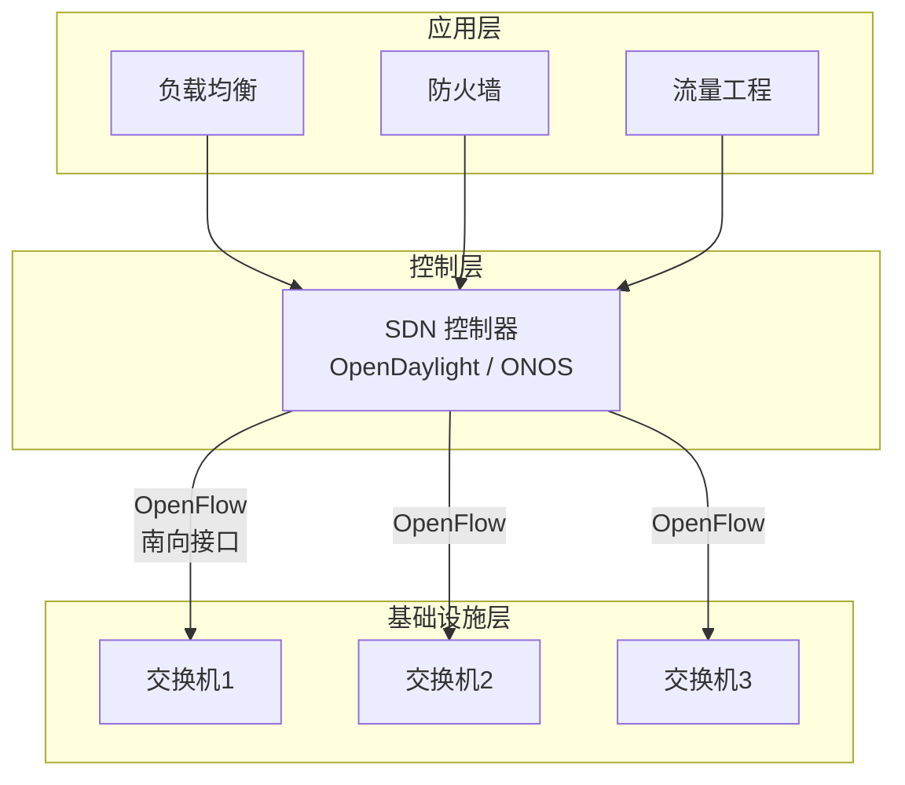

### 11.2 OpenFlow 协议

OpenFlow 是 SDN 最经典的"南向接口"协议，连接控制器和交换机。

工作方式：控制器通过 OpenFlow 向交换机下发**流表（Flow Table）**。流表的每条规则包含：

- **Match Fields**（匹配字段）：源/目的 MAC、源/目的 IP、VLAN ID、端口号等
- **Instructions**（指令）：转发到某端口、丢弃、修改字段、发给控制器等
- **Priority**（优先级）：多条规则匹配时取优先级最高的
- **Counters**（计数器）：统计匹配了多少包/字节

数据包到达交换机后，按优先级逐条匹配流表，命中后执行对应指令。如果所有规则都不匹配，按默认动作处理（通常是发给控制器决策）。

### 11.3 OpenFlow 的局限

OpenFlow 定义了一组固定的匹配字段（以太网头、IP 头、TCP/UDP 头等）。问题是：**这些字段在芯片出厂时就确定了**。如果你想匹配一个新协议的包头（比如自定义的隧道协议），OpenFlow 做不到——它不认识这个协议。

这就是 OpenFlow 的根本局限：**协议感知能力被硬编码了**。

### 11.4 P4：真正的可编程数据平面

2014 年，斯坦福大学的 Nick McKeown 团队提出了 P4（Programming Protocol-independent Packet Processors），彻底解决了这个问题。

P4 的核心能力是让用户**自定义三件事**：

1. **解析器（Parser）**：定义交换机能识别哪些包头格式——不再受限于预定义的协议
2. **匹配-动作表（Match-Action Table）**：定义匹配哪些字段、执行什么动作
3. **控制流（Control Flow）**：定义包在各个表之间的处理顺序

有了 P4，你可以在交换机芯片上用硬件线速处理任何你想象得到的协议——VXLAN、GRE、MPLS、甚至你自己发明的隧道封装格式。

P4 对比 OpenFlow 的本质区别：**OpenFlow 让你控制"流表里填什么规则"，P4 让你控制"流表长什么样"**。

Intel 的 Tofino 芯片是第一个商用 P4 可编程交换芯片（虽然已停产），但它推动了整个行业向可编程网络演进。

---

## 十二、SONiC 与美团 M-NOS

### 12.1 SONiC 架构

SONiC（Software for Open Networking in the Cloud）是微软开源的网络操作系统，已经成为白盒交换机操作系统的事实标准。

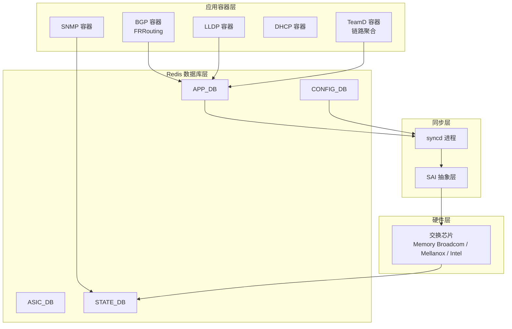

SONiC 的架构设计非常优雅：

**容器化微服务**：每个功能模块（BGP、LLDP、SNMP 等）运行在独立的 Docker 容器中。某个模块崩溃不影响其他模块，可以独立重启和升级。

**Redis 数据库通信**：模块之间不直接通信，而是通过 Redis 数据库交换信息。APPDB 存应用层数据、ASICDB 存芯片层数据、CONFIGDB 存配置、STATEDB 存运行状态。这种松耦合设计让系统更稳定。

**SAI 抽象层（Switch Abstraction Interface）**：这是 SONiC 的灵魂。SAI 定义了一套标准 API，屏蔽了底层芯片的差异。不管你用博通 Memory 还是 Mellanox Spectrum，上层软件调用的是同一套 SAI 接口。这就实现了**硬件无关**——一套软件跑在不同厂商的白盒硬件上。

### 12.2 业界 SONiC 实践

- **微软**：SONiC 的发起者，自家 Azure 数据中心大规模上线
- **谷歌**：联合 ONF 推出 PINS 项目，为 SONiC 注入 P4 可编程能力
- **百度**：1 万+ 白盒交换机部署
- **阿里、腾讯、京东、滴滴**：均在部署或研发 SONiC 系统

### 12.3 美团 M-NOS

M-NOS 是美团基于 SONiC 二次开发的网络操作系统，2019 年 12 月上线。M-NOS 的设计哲学是**去除传统交换机的冗余功能，聚焦运维效率和故障快速定位**。

**核心能力：**

**ZTP（Zero Touch Provisioning）零接触部署**：新交换机上电后，自动通过 DHCP 获取地址，自动下载配置和固件，自动完成上线。一台设备替换从开箱到业务恢复只需 **10-20 分钟**，无需工程师到现场手工配置。

**gRPC 批量配置**：通过 JSON/gRPC/Ansible 统一管理接口批量下发配置，屏蔽不同厂商芯片的差异。再也不用逐台登录设备敲 CLI。

**毫秒/秒级故障主动推送**：传统黑盒设备故障定位要联系厂商（几十分钟到数天），M-NOS 直接推送丢弃报文（携带报文头部信息）、端口 buffer 利用率、链路时延等信息，实现秒级故障定位。

**热重启（Warm Reboot）**：版本升级时，转发面继续工作不中断，控制面快速重启后恢复。做到**升级不丢包、业务无感知**。

**成本优势**：比同等性能的商用品牌交换机便宜约 **20%**。

### 12.4 网络可视化与监控

美团构建了一套完整的网络可视化技术体系，把数据中心网络变成"透明"的：

**INT（Inband Network Telemetry，带内网络遥测）**：在数据包内嵌入每一跳的延迟、路径、队列深度等信息。数据包经过每台交换机时，交换机芯片自动在包里追加自己的遥测数据。包到达终点后，就能看到完整的逐跳延迟和路径。这是最先进的网络可视化技术。

**MOD（Monitor on Drop）**：当交换机芯片丢弃数据包时，自动截取报文的前 80 字节上送 CPU 或外部 Collector，记录丢包原因和现场。排障时不再"猜"为什么丢包。

**TCB（Transient Capture Buffer）**：捕捉交换机 MMU（Memory Management Unit）中的丢包信息，记录瞬态拥塞事件。

**gRPC Telemetry**：控制面高速采集端口速率、队列 buffer 统计、CPU/内存利用率等 counter 信息。

**eRSPAN**：按五元组规则镜像采集原始报文，用于深度包分析。

**北斗 Pingmesh**：美团自研的跨数据中心网络质量全路径监控系统，持续探测任意两点间的延迟、丢包率和路径。

---

## 十三、交换机在企业网络中的部署实践

### 13.1 园区网 / 办公网部署

传统的接入-汇聚-核心三层架构至今仍是园区网的主流方案：

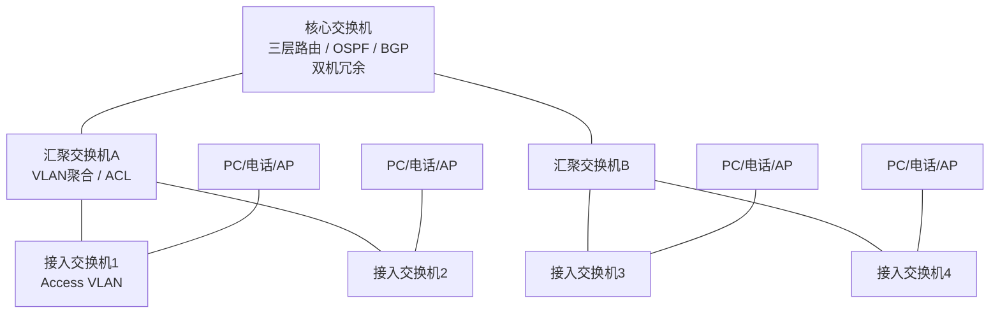

接入层交换机划分 VLAN 隔离不同部门/楼层，汇聚层做 VLAN 间路由和策略控制，核心层做高速转发和跨区域路由。

### 13.2 数据中心部署

数据中心用 Leaf-Spine + ToR 模式，前面第八章已经详细讲过。补充几个实际部署要点：

- 每台服务器通常**双上联**两台不同的 ToR 交换机（用 LACP Bond），一台 ToR 挂了不影响服务器网络
- ToR 到 Leaf/Spine 全部走三层路由（OSPF 或 BGP），不存在二层环路问题
- ECMP 实现多路径负载均衡，单链路故障自动切换

### 13.3 容器网络与交换机的交互

美团大规模使用容器（55 万+ Pod），容器网络和物理交换机之间有几个关键交互点：

**Macvlan VEPA 模式**：容器使用 Macvlan 网络时，VEPA（Virtual Ethernet Port Aggregator）模式会将容器间的流量强制发到外部交换机再折回，这样交换机可以集中实施 ACL 和 QoS 策略，实现对容器流量的精细控制。

**ARP 代理**：在去堆叠场景下，宿主机和容器在同一子网但通过不同的上联交换机通信时，交换机需要配置 ARP 代理来中转 ARP 请求。M-NOS 的去堆叠配置默认支持。

**拓扑域打散**：容器调度系统通过交换机拓扑域标签（`shield.Kubernetes.example.com/switch`）实现服务实例在 ToR 维度的打散部署。宿主机双上联两台交换机，在调度上视为一个拓扑域。这样一台 ToR 故障不会导致同一服务的多个实例同时挂掉。

### 13.4 MGW 负载均衡与交换机

美团的四层负载均衡器 MGW（基于 DPDK 开发）和交换机配合工作：

- **外网模式**：多台 MGW 通过交换机 ECMP 组成集群，交换机配置 OSPF 动态路由，MGW 发布 VIP 路由。某台 MGW 故障时，OSPF 自动撤回路由，流量自动分散到其他 MGW——实现 IP 级别的 failover
- **内网模式**：MGW 通过 BONDING 双上联交换机，实现端口级别的 failover

### 13.5 交换机故障场景与应急

美团将交换机故障分为四类，每类有明确的影响范围和应急预案：

| 故障类型 | 影响范围 | 典型处理 |
|---------|---------|---------|
| ToR 故障 | 单个机架的服务器 | 服务器双上联自动切换到另一台 ToR |
| Leaf 故障 | 一组 ToR 的上联流量 | ECMP 自动绕行到其他 Leaf |
| Spine 故障 | 跨 Leaf 的部分流量 | ECMP 自动分散到其他 Spine |
| DCI 故障 | 跨数据中心的流量 | BGP 路由收敛，切换到备用 DCI 链路 |

---

## 十四、组播与 IGMP Snooping

### 14.1 组播基础：一对多的高效传输

组播（Multicast）是一种"一对多"的通信方式。发送方只需发送一份数据，网络中的交换机和路由器负责将这份数据复制并送达所有订阅了该组播组的接收者。

| 通信方式 | 发送方数量 | 接收方数量 | 带宽利用 | 典型场景 |
|---------|-----------|-----------|---------|---------|
| 单播（Unicast） | 1 | 1 | 每个接收方一份副本 | HTTP、SSH |
| 广播（Broadcast） | 1 | 全部 | 一份副本泛洪到所有设备 | ARP、DHCP |
| 组播（Multicast） | 1 | 一组订阅者 | 一份副本，仅复制到有订阅者的分支 | 视频直播、RoCEv2、金融行情 |

组播的核心优势是**带宽效率**。假设一台视频服务器要向 1000 个用户推送直播流，每路流 5Mbps。用单播，服务器要发 1000 份副本，出口带宽需要 5Gbps；用组播，服务器只发一份 5Mbps 的流，网络在分叉处复制，带宽消耗大幅降低。

**组播 IP 地址**：IPv4 组播地址范围是 `224.0.0.0/4`（224.0.0.0 ~ 239.255.255.255），分为以下几类：

| 范围 | 类型 | 说明 |
|------|------|------|
| 224.0.0.0 ~ 224.0.0.255 | 链路本地 | TTL=1，不跨路由器转发，如 OSPF Hello（224.0.0.5） |
| 224.0.1.0 ~ 238.255.255.255 | 全局组播 | 可跨网络传输，用于应用层组播 |
| 239.0.0.0 ~ 239.255.255.255 | 管理范围 | 类似私有 IP，限于组织内部使用 |

**组播 MAC 地址**：以太网组播 MAC 地址以 `01:00:5E` 开头，后 23 位映射自组播 IP 地址的后 23 位。例如组播 IP `239.1.1.1` 对应的 MAC 地址为 `01:00:5E:01:01:01`。由于 IP 到 MAC 的映射只用了 23 位（IP 组播地址有 28 位有效位），存在 32:1 的地址重叠——32 个不同的组播 IP 可能映射到同一个 MAC 地址。这是设计上的折衷，交换机在精确转发时需要同时检查 IP 和 MAC。

### 14.2 IGMP 协议：组播成员管理

IGMP（Internet Group Management Protocol）是主机和路由器之间管理组播组成员关系的协议。交换机通过"窃听"IGMP 报文来学习哪些端口有组播成员。

**IGMP v1**：最简单的版本。只有两种报文类型：Membership Query（成员查询，路由器每 60 秒发送一次）和 Membership Report（成员报告，主机收到查询后回复）。v1 的关键缺陷是**没有离开机制**——主机想退出组播组时不能主动通知路由器，路由器只能等到 3 次查询（180 秒）没有收到报告后才认为主机离开了。离开延迟高达 3 分钟。

**IGMP v2**：在 v1 基础上增加了两个关键改进。一是 Leave Group（离开报告）——主机退出组播组时主动发送 Leave Group 报文，路由器收到后立即发送 Group-Specific Query 确认是否还有其他成员，如果没有就停止转发，离开延迟从 180 秒缩短到几秒。二是 Querier Election（查询器选举）——当同一网段有多个路由器时，IP 地址最小的路由器成为查询器，避免重复发送查询。

**IGMP v3**：最重要的改进是**源过滤**——主机可以指定"我只接收来自特定源的组播流量"（Include 模式），或"我接收除了某些源之外的所有组播流量"（Exclude 模式）。这为 SSM（Source-Specific Multicast）提供了基础。v3 的 Membership Report 报文可以一次包含多个组记录，每条记录包含组地址和源地址列表。

| 版本 | 加入方式 | 离开机制 | 源过滤 | 离开延迟 |
|------|---------|---------|--------|---------|
| v1 | 主动报告 | 无（超时 3 分钟） | 不支持 | ~180 秒 |
| v2 | 主动报告 | Leave Group 报文 | 不支持 | ~几秒 |
| v3 | 主动报告 | Leave Group 报文 | 支持（Include/Exclude） | ~几秒 |

### 14.3 IGMP Snooping：交换机的组播智能

**为什么需要 IGMP Snooping**：默认情况下，交换机收到组播帧（目的 MAC 以 01:00:5E 开头）后，会像处理广播帧一样**泛洪到所有端口**。这在小规模网络中没问题，但在数据中心中后果严重——一个组播流可能被复制到几百个不需要它的端口上，浪费大量带宽，还可能影响其他流量。

IGMP Snooping 让交换机"偷听"主机和路由器之间的 IGMP 报文，建立一张**组播成员表**，记录"哪个组播组在哪些端口有成员"。之后收到组播流量时，交换机只往有成员的端口转发，不再泛洪。

**IGMP Snooping 表结构**：

| 字段 | 说明 | 示例 |
|------|------|------|
| 组播 IP 地址 | 组播组地址 | 239.1.1.1 |
| 组播 MAC 地址 | 映射的 L2 地址 | 01:00:5E:01:01:01 |
| VLAN ID | 所属 VLAN | VLAN 100 |
| 成员端口 | 有订阅者的端口 | Eth1, Eth5, Eth12 |
| 路由器端口 | 连接组播路由器的端口 | Eth48 |

**工作过程**：

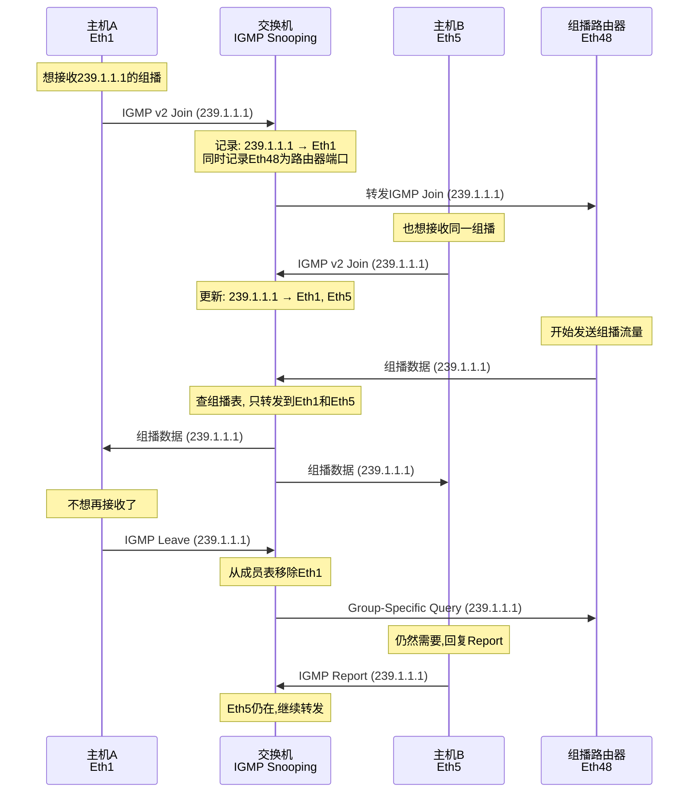

**路由器端口（Router Port）的发现**：交换机需要知道哪些端口连接了组播路由器，因为组播流量从路由器方向进入。发现方式有两种：被动方式——监听 PIM Hello、IGMP Query 等路由器发出的报文，收到报文的端口标记为路由器端口；主动方式——交换机自己充当 IGMP Querier，主动发送 IGMP Query 报文，这在没有组播路由器的纯二层网络中很有用。

**IGMP Snooping Proxy**：进一步优化的模式。交换机不仅"偷听"，还作为代理——向上（路由器方向）汇总下游所有主机的成员关系，只向路由器发送一份 IGMP Report；向下（主机方向）代替路由器发送 IGMP Query，代替路由器接收 Leave 报文。这样减少了 IGMP 报文的上行转发，也减少了路由器的处理负担。

### 14.4 组播 VLAN（Multicast VLAN）

在标准配置中，组播流量在每个 VLAN 内独立转发。如果 10 个 VLAN 都需要接收同一个组播流（如企业 IPTV），交换机需要把同一份流量复制 10 次，每个 VLAN 一份。

**组播 VLAN** 解决方案：指定一个专门的 VLAN（如 VLAN 1000）作为组播 VLAN，组播源在这个 VLAN 内发送。其他用户 VLAN 的成员可以通过跨 VLAN 组播复制接收到流量。交换机在组播 VLAN 内接收组播流，然后复制到有订阅者的用户 VLAN 端口。这样组播流只需要进入交换机一次，交换机内部完成跨 VLAN 的复制，大大节省了上行带宽。

### 14.5 组播在 RoCEv2 中的应用

RoCEv2（RDMA over Converged Ethernet v2）在数据中心中广泛用于高性能存储和 AI 训练。RoCEv2 的连接建立阶段使用组播——当一个 RDMA 节点想要发现网络中的其他节点时，会向预定义的组播地址发送 ARP 请求。

交换机需要正确配置 IGMP Snooping 来确保 RoCEv2 的组播流量只被发送到有 RDMA 网卡的端口，而不是泛洪到所有端口。美团的 RoCEv2 场景中，TH5 交换机上配置了精确的 IGMP Snooping 规则，配合 PFC 实现无损的组播传输。

### 14.6 配置示例

**华为/H3C 交换机 IGMP Snooping 配置**：

```
# 全局开启IGMP Snooping
igmp-snooping enable

# VLAN 100内配置
vlan 100
  igmp-snooping enable
  igmp-snooping version 3
  igmp-snooping querier enable          # 交换机充当查询器
  igmp-snooping querier source 10.1.1.1  # 查询源IP
  igmp-snooping fast-leave enable        # 快速离开
  igmp-snooping group-policy 2001        # 限制可加入的组播组
```

**M-NOS JSON 配置**：

```json
{
  "IGMP_SNOOPING": {
    "Vlan100": {
      "igmp_snooping": "enable",
      "version": "3",
      "querier": "enable",
      "querier_source": "10.1.1.1",
      "fast_leave": "enable",
      "mrouter_port": "Ethernet48"
    }
  }
}
```

`fast-leave` 选项让交换机在收到 Leave 报文后立即删除该端口的成员记录，不再发送 Group-Specific Query 确认。这适用于每个端口只连接一个主机的场景（如服务器直连），能将离开延迟从几秒降到接近 0。

---

## 十五、PFC 与 DCB：构建无损以太网

### 15.1 为什么需要无损网络

传统以太网是"有损"的——当网络拥塞时，交换机缓冲区满了就直接丢包。对于 TCP 流量，丢包会触发重传和拥塞窗口缩减，虽然影响性能但协议本身能恢复。但对于 RDMA（Remote Direct Memory Access）流量，丢包是致命的——RoCEv2 依赖无损网络，任何一个丢包都会导致重传，严重拖慢吞吐量。

在 AI 训练场景中，数百张 GPU 卡之间的 AllReduce 操作产生海量 RDMA 流量。一个丢包可能导致整个迭代步骤重做，训练效率下降 10% 以上。因此构建无损网络（Lossless Network）成为数据中心的核心需求。

**DCB（Data Center Bridging）**是 IEEE 制定的一组标准，旨在让以太网支持无损传输。DCB 包含四个核心组件：

| 组件 | IEEE 标准 | 作用 |
|------|---------|------|
| PFC | 802.1Qbb | 基于优先级的流量控制 |
| ETS | 802.1Qaz | 增强传输选择（带宽分配） |
| DCBX | 802.1Qaz | 数据中心桥接交换（自动协商） |
| ECN | RFC 3168 | 显式拥塞通知 |

### 15.2 PFC（Priority Flow Control）详解

**传统流量控制（802.3x PAUSE）的问题**：传统以太网流量控制是端口级的——一个端口发送 PAUSE 帧后，对端停止发送所有流量。这相当于"一个人闯红灯，所有车都停"。在多优先级流量混合的场景中，低优先级流量导致的拥塞会暂停高优先级流量，完全不合理。

**PFC 的改进**：PFC 将 PAUSE 机制细化到**优先级级别**。以太网帧的 VLAN Tag 中有 3 位 PCP 字段，定义了 8 个优先级（0-7）。PFC 可以单独暂停某个优先级的流量，而不影响其他优先级。例如：优先级 3（RDMA 流量）发生拥塞时，交换机向上游发送 PFC PAUSE 帧，暂停优先级 3 的流量，但优先级 0-2 和 4-7 的流量不受影响。

**PFC PAUSE 帧格式**：PFC 帧是一个特殊的以太网帧（目的 MAC 01:80:C2:00:00:01，类型 0x8808），载荷中包含一个 8 位的 bitmap，每一位对应一个优先级。bitmap 中置 1 的位表示请求暂停该优先级的流量。帧中还包含暂停时间（0-65535 个 quanta，每个 quanta 为 512 bit time）。

**PFC Headroom 计算**：当交换机发送 PFC PAUSE 后，对端不会立即停止发送——在 PAUSE 帧到达对端、对端处理、最后一帧到达的这段时间内，交换机还需要缓冲继续到达的流量。这段额外缓冲空间称为 **Headroom**。

Headroom 的计算涉及几个因素：往返时延（RTT）——PAUSE 帧到达对端 + 对端停止 + 最后一个帧到达本端的时间；对端处理延迟——网卡处理 PAUSE 帧的时间；安全余量——通常额外加 20-30%。如果 Headroom 设置不足，缓冲区溢出仍然会丢包；如果设置过大，浪费宝贵的缓冲空间。典型配置中，25G 链路的 Headroom 约为 80-120KB，100G 链路约为 300-500KB。

### 15.3 ETS（Enhanced Transmission Selection）

ETS 解决的是**带宽公平分配**问题。当多条链路汇聚到一个出口端口时，如果总流量超过出口带宽，如何保证各类流量的最低带宽？

ETS 允许管理员将 8 个优先级分组，为每个组分配最低带宽保证。例如：

| 优先级组 | 优先级 | 最低带宽保证 | 典型流量 |
|---------|--------|------------|---------|
| PG 0 | 0, 1 | 10% | 管理流量、控制流量 |
| PG 1 | 2, 3 | 50% | RDMA/存储流量 |
| PG 2 | 4-7 | 40% | 业务流量 |

当某个组没有用完分配的带宽时，剩余带宽可以分配给其他组。这种机制确保了即使网络拥塞，各类流量也能获得最低保证带宽。

### 15.4 ECN（Explicit Congestion Notification）

ECN 是 IP 层和 TCP 层的拥塞通知机制。当交换机检测到队列长度超过阈值时，不是直接丢包，而是在 IP 头中设置 ECN 标记（将 ECT 位改为 CE）。接收端 TCP 看到 CE 标记后，在 ACK 中设置 ECE 标志通知发送端降速。

在 RoCEv2 场景中，ECN 的作用更加关键。RoCEv2 的拥塞控制依赖 ECN 标记来触发降速。交换机配置 ECN 标记阈值后，当 RDMA 流量导致队列积压超过阈值时，交换机在 IP 头打上 ECN 标记。接收端网卡收到标记后，通过 BTH（Base Transport Header）中的 FECN 位通知发送端，发送端降低发送速率。

**PFC + ECN 的协同**：PFC 是"硬"手段——直接暂停上游发送，立即生效但影响范围大。ECN 是"软"手段——通知发送端降速，温和但需要端到端配合。两者的配合策略：当队列长度超过第一个阈值（ECN 阈值）时，打 ECN 标记让发送端降速；如果队列继续增长超过第二个阈值（PFC 阈值），触发 PFC 暂停上游。这种"先 ECN 后 PFC"的策略既保证了低延迟，又避免了不必要的 PFC 触发。

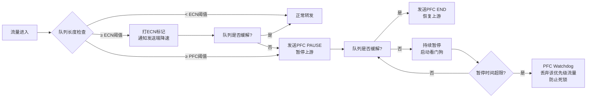

### 15.5 PFC Watchdog（看门狗）

PFC 的一个风险是**死锁**——如果两个交换机互相 PFC 暂停对方，或者 PFC PAUSE 帧因为某种原因没有被解除，流量会永久暂停，导致端口"假死"。

PFC Watchdog 是检测和缓解 PFC 死锁的机制：当某个优先级被 PFC 暂停超过一定时间（如 100ms），Watchdog 认为发生了死锁，临时禁止该优先级的 PFC 功能，丢弃该队列的流量。当恢复正常后（暂停状态解除），重新启用 PFC。

### 15.6 DCBX（Data Center Bridging eXchange）

DCBX 是 PFC 和 ETS 的自动发现和配置协商协议。它使用 LLDP（Link Layer Discovery Protocol）帧携带 DCB TLV（Type-Length-Value），让链路两端的设备自动交换 DCB 能力信息：对端是否支持 PFC，支持哪些优先级；对端的 ETS 配置；是否愿意接受对端的配置（willing 模式）。

如果两端 PFC 配置不一致（一端开启了 PFC 优先级 3，另一端没开），流量控制不会生效。DCBX 确保了两端配置的一致性，也可以让一端自动学习另一端的配置。

### 15.7 美团 RoCE 无损网络实践

美团在 AI 训练和 RDMA 存储场景中部署了 RoCEv2 无损网络：

- **TH5 交换机**配置 PFC 优先级 3（RDMA 流量），Headroom 根据 25G/100G 链路速率分别计算
- **ECN 标记阈值**配置为队列长度的 1/8，PFC 触发阈值配置为队列长度的 1/4，实现"先 ECN 降速，后 PFC 暂停"
- **VRF 隔离**：RDMA 存储流量和业务流量在同一个 TH5 交换机上通过 VRF 隔离，各自独立的 QoS 策略
- **PFC Watchdog**：暂停超时设为 100ms，超时后丢弃流量并告警
- **监控**：通过 INT 采集每个端口的 PFC 暂停次数和持续时间，当某端口频繁触发 PFC 时自动告警

---

## 十六、交换机缓冲与 MMU 深度解析

### 16.1 为什么缓冲很重要

交换机的缓冲区（Buffer）是连接入端口和出端口之间的"蓄水池"。当入端口流量速率超过出端口速率时（比如多个 10G 端口同时向一个 10G 端口发送），多余的帧需要暂存在缓冲区中等待发送。如果缓冲区满了，帧就被丢弃。

缓冲区的大小和管理策略直接决定了交换机在拥塞时的表现：小缓冲区延迟低但容易丢包，大缓冲区不容易丢包但延迟高（缓冲膨胀，Bufferbloat）。

### 16.2 缓冲的物理实现

现代交换机的缓冲主要使用两种物理介质：

**片上缓冲（On-Chip Buffer）**：集成在交换 ASIC 芯片内部的 SRAM，速度极快（纳秒级访问），但容量有限（通常 12-16MB）。这是主缓冲池，绝大部分转发流量使用它。

**外置缓冲（External Buffer）**：使用外置 DRAM 芯片，容量大（可达几 GB）但速度慢（百纳秒级）。用于深度缓冲场景，如突发流量吸收、镜像流量缓冲。不是所有交换机都有外置缓冲。

### 16.3 MMU（Memory Management Unit）的缓冲池架构

交换机缓冲区不是一整块"大池子"随便用——它被 MMU 精心划分为多个池，每个池有不同的用途和调度策略。

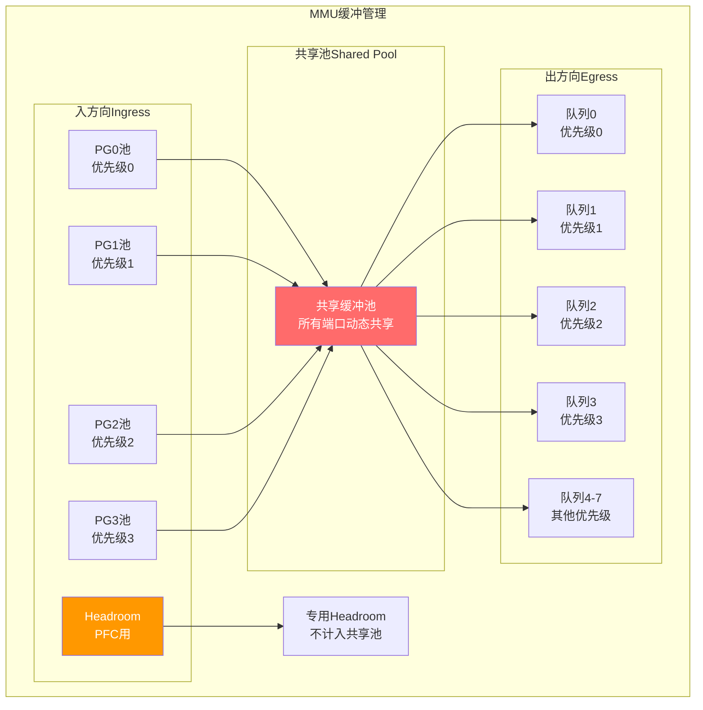

**三种缓冲池类型**：

**专用池（Dedicated Pool / Guaranteed Pool）**：每个端口每个优先级有一个最小保证的缓冲空间，其他端口不能抢占。即使网络严重拥塞，这个空间也是这个端口专属的。典型值为每端口每优先级约 8-16KB。

**共享池（Shared Pool）**：所有端口共享的大缓冲池，按需动态分配。当某个端口的专用池用完后，可以从共享池借用空间。共享池的分配策略通常是按比例分配（按端口权重或优先级权重），确保公平性。

**Headroom 池**：PFC 专用缓冲，当触发 PFC PAUSE 后用于缓冲持续到达的帧。Headroom 不计入共享池，是额外分配的。每个端口每个 PFC 优先级都有独立的 Headroom。

### 16.4 缓冲分配策略

MMU 的缓冲分配使用 **alpha（α）因子**控制每个端口可以从共享池中借用的比例。alpha 值越大，端口能借用的越多。

分配过程：帧到达入端口后，首先使用专用池；专用池用完后向共享池申请额外空间；共享池检查是否有可用空间，按 alpha 因子计算该端口可用的最大额度；如果共享池也满了，帧被丢弃（或触发 PFC 暂停）。

### 16.5 拥塞丢包分析

当交换机丢弃数据包时，理解丢包发生在哪个缓冲池至关重要：

**入方向丢包（Ingress Drop）**：入端口缓冲池满。通常因为上游发送速率过高且下游无法及时消化。如果是 PFC 优先级的流量，应该先触发 PFC 暂停而不是丢包——如果仍然丢包，说明 Headroom 不足或 PFC 没有正确配置。

**出方向丢包（Egress Drop）**：出端口队列溢出。通常因为多个入端口同时向同一个出端口发送。出方向丢包是"正常"的拥塞丢包，可以通过 QoS 的 WRED 策略来优化。

**共享池耗尽丢包**：某个端口从共享池借用了过多空间，导致其他端口无法借用。需要检查 alpha 因子配置和各端口的流量模式。

### 16.6 缓冲监控与美团实践

美团通过网络可视化体系对交换机缓冲进行实时监控：

- **gRPC Telemetry**：每秒采集每个端口每个队列的缓冲利用率、丢弃包数
- **MOD（Monitor on Drop）**：丢包时自动截取报文头部和丢包原因（ingress drop / egress drop / shared pool exhaustion），上送 Collector
- **TCB（Transient Capture Buffer）**：捕获瞬态拥塞事件，记录拥塞持续时间和峰值队列深度
- **告警阈值**：队列利用率超过 80% 告警，PFC 暂停频率超过每秒 10 次告警，丢包率超过万分之一告警

通过这些监控数据，美团网络团队能够在缓冲相关问题影响业务之前发现并处理，如调整 alpha 因子、优化 ECMP 分布、增加链路带宽等。

### 16.7 配置示例

**Broadcom 交换芯片 MMU 配置（通过 SAI/SONiC）**：

```json
{
  "MMU": {
    "INGRESS_POOL": {
      "shared_pool_size": "12781824",
      "headroom_size": "94208"
    },
    "EGRESS_POOL": {
      "shared_pool_size": "12781824",
      "queue_0_guaranteed": "10240",
      "queue_1_guaranteed": "10240",
      "queue_2_guaranteed": "10240",
      "queue_3_guaranteed": "10240"
    },
    "PFC_HEADROOM": {
      "priority_3": {
        "headroom_size": "94208",
        "xoff_threshold": "8192",
        "xon_threshold": "4096"
      }
    }
  }
}
```

其中 `xoff_threshold` 是触发 PFC PAUSE 的队列长度阈值，`xon_threshold` 是解除 PFC PAUSE 的阈值。xon 必须小于 xoff，形成滞后区间避免震荡。

---

## 十七、单向链路检测与环路防护增强

### 17.1 单向链路问题

在网络部署中，光纤连接是最常见的物理介质。光纤通信使用两根光纤——一根发送（TX），一根接收（RX）。在以下情况下可能出现**单向链路（Unidirectional Link）**：光纤接头松动或损坏导致一个方向的传输中断，另一个方向正常；光纤弯折过度导致单方向衰减过大；光模块故障导致单方向无信号；光纤交叉连接错误（一端的 TX 接到了另一端的 TX）。

单向链路的危险在于：链路的一端认为链路是正常的（因为它能收到对端的信号），但实际上对端收不到它的信号。STP 依赖 BPDU 的双向交换来维持拓扑——如果 BPDU 只能单方向传递，STP 的环路检测会失效。

具体场景：交换机 A 和 B 之间有两条链路，STP 阻塞了其中一条。如果主链路变成单向（A 能收到 B 的 BPDU，但 B 收不到 A 的 BPDU），B 会认为 A 已经"消失"了，于是解除阻塞端口，此时两条链路都在转发，形成环路。

### 17.2 UDLD（UniDirectional Link Detection）

UDLD 是 Cisco 开发的链路层协议，专门检测单向链路。它通过让链路两端互相发送探测报文来确认双向连通性。

**工作原理**：UDLD 设备周期性（默认 15 秒）向邻居发送 UDLD Probe 报文，报文中包含自己的设备 ID 和端口 ID。邻居收到后，在下一个 Probe 报文中把收到的设备 ID 和端口 ID 包含进去，发回来。如果设备在 UDLD 报文中看到了自己的信息，说明双向链路都通。如果在超时时间内没有看到自己的信息，说明出现了单向链路。

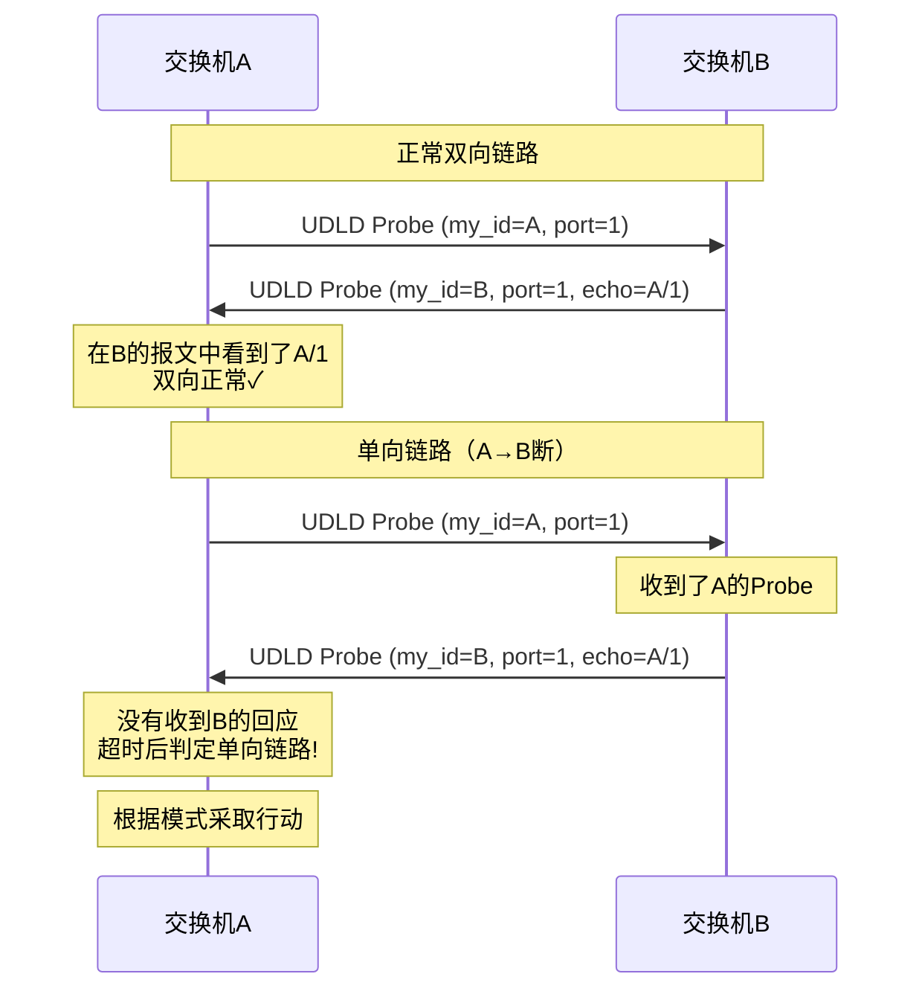

**两种模式**：

**普通模式（Normal Mode）**：检测到单向链路后，将端口状态设为"errdisable"，端口不转发任何流量。但不会影响其他正常链路。

**激进模式（Aggressive Mode）**：在普通模式基础上更进一步——当链路完全失去对端的 UDLD 报文时（不仅仅是单向，而是完全无响应），也会将端口设为 errdisable。激进模式在链路"半死不活"（端口 UP 但没有流量）时更加敏感，适合关键链路。

### 17.3 UDLD 恢复

端口被 UDLD 设为 errdisable 后，不会自动恢复。两种恢复方式：手动恢复——管理员执行 `udld reset` 命令全局恢复所有 UDLD 端口；自动恢复——配置 `errdisable recovery cause udld` 和 `errdisable recovery interval 300`，300 秒后自动尝试恢复。

自动恢复需要注意：如果单向链路问题没有解决，端口恢复后会再次被 UDLD 禁用，形成"抖动"。建议自动恢复间隔设置较长（5-10 分钟），避免频繁抖动。

### 17.4 Loop Guard（环路防护）

Loop Guard 是 STP 的辅助防护机制，解决的问题是：当 STP 的阻塞端口由于某种原因（单向链路、对端交换机 CPU 繁忙导致无法发送 BPDU 等）不再收到 BPDU 时，STP 会认为对端"消失"了，将阻塞端口升级为转发端口。如果对端实际上没有消失，这就形成环路。

Loop Guard 的逻辑很简单：**阻塞端口如果收不到 BPDU，不能升级为转发，而是进入"loop-inconsistent"状态（持续阻塞）**。只有重新收到 BPDU 后才恢复正常。

### 17.5 BPDU Guard（BPDU 防护）

BPDU Guard 用于接入层，保护网络不受未经授权的交换机影响。在接入端口（连接终端的 Access 端口）上启用 BPDU Guard 后，如果该端口收到 BPDU（说明有人接了一台交换机上来），立即将端口设为 errdisable。

这防止了以下场景：员工从家里带来一台交换机插到办公网口上，结果这台交换机的优先级更低，意外当选为根桥，导致整网 STP 重新计算。

### 17.6 BPDU Filter（BPDU 过滤）

BPDU Filter 有两种行为：全局配置——在所有 Edge Port 上，交换机不发送也不处理 BPDU，如果 Edge Port 收到 BPDU，端口失去 Edge 属性，退回普通 STP 端口行为；接口配置——该端口不发送也不接收 BPDU，相当于完全关闭该端口的 STP 功能。BPDU Filter 要谨慎使用——如果在交换机之间的 Trunk 链路上误配 BPDU Filter，会导致 STP 完全失效，可能形成环路。

### 17.7 Root Guard（根桥防护）

Root Guard 确保网络中的根桥位置不被意外改变。在指定端口上启用 Root Guard 后，如果该端口收到比自己更优的 BPDU（可能成为新根桥的 BPDU），端口进入"root-inconsistent"状态（持续阻塞），阻止新根桥的影响扩散。Root Guard 通常配置在核心交换机连接下级交换机的端口上，确保下级交换机永远不能成为根桥。

### 17.8 各防护机制对比

| 机制 | 检测目标 | 触发条件 | 动作 | 典型配置位置 |
|------|---------|---------|------|------------|
| UDLD | 单向链路 | 收不到自己的 UDLD echo | errdisable | 所有光纤链路 |
| Loop Guard | 阻塞端口 BPDU 丢失 | 阻塞端口收不到 BPDU | loop-inconsistent | 非指定端口 |
| BPDU Guard | 未授权交换机 | Edge Port 收到 BPDU | errdisable | 接入端口 |
| BPDU Filter | 减少 BPDU 开销 | - | 不发/不收 BPDU | 接入端口（谨慎） |
| Root Guard | 根桥位置变化 | 收到更优 BPDU | root-inconsistent | 核心→下级端口 |

### 17.9 美团实践

美团在园区网和数据中心中部署了多层环路防护：

- **光纤链路**：UDLD 激进模式，自动恢复间隔 300 秒
- **接入端口**：BPDU Guard + BPDU Filter（全局模式），防止未授权交换机接入
- **核心层下行端口**：Root Guard，确保核心交换机始终是根桥
- **非指定端口**：Loop Guard，防止单向链路导致阻塞端口误升级
- **数据中心 Leaf-Spine**：不使用 STP，通过 ECMP 天然无环。但 ToR 下联端口仍配置 BPDU Guard 防止服务器侧误接交换机

---

## 十八、PoE：以太网供电

### 18.1 PoE 概述

PoE（Power over Ethernet）技术允许通过以太网网线同时传输数据和电力，省去单独的电源布线。这在部署 IP 电话、无线 AP、IP 摄像头、IoT 传感器等终端设备时非常有用——只需要一根网线就能同时解决网络和供电。

PoE 的四个标准：

| 标准 | IEEE 编号 | 最大供电功率 | 供电脚位 | 典型设备 |
|------|---------|------------|---------|---------|
| PoE | 802.3af | 15.4W | Mode A/B | IP 电话、普通 AP |
| PoE+ | 802.3at | 30W | Mode A/B | 双频 AP、PTZ 摄像头 |
| PoE++ (Type 3) | 802.3bt | 60W | Mode A/B | Wi-Fi 6 AP、LED 显示屏 |
| PoE++ (Type 4) | 802.3bt | 100W | Mode A/B | 笔记本充电、小型显示器 |

### 18.2 供电方式

PoE 有两种供电脚位模式：

**Mode A（Endpoint PSE）**：供电在数据对上叠加。10/100M 使用 1-2 和 3-6 线对，1000M 使用全部 4 对。供电和数据在同一对线上，通过变压器耦合叠加，互不干扰。

**Mode B（Midspan PSE）**：供电在空闲对上。10/100M 使用 4-5 和 7-8 线对供电，数据对不受影响。千兆以太网没有空闲对，所以 Mode B 在千兆时也使用全部 4 对。

大部分现代交换机使用 Mode A（Endpoint PSE），即供电集成在交换机端口上。

### 18.3 PD 检测与分级

PoE 供电不是一上来就给 48V——交换机（PSE，Power Sourcing Equipment）需要先检测连接的设备是否是合法的 PD（Powered Device），然后根据 PD 的功率等级分配适当的电力。

**检测流程**：

1. **检测阶段（Detection）**：交换机在端口上输出 2.7V-10.1V 的小电压，测量回路电阻。合法 PD 会有一个 25kΩ 的特征电阻。如果检测到 25kΩ 电阻，确认为合法 PD；如果电阻太小（<15kΩ，可能是短路）或太大（>33kΩ，无 PoE 设备），不供电。
2. **分级阶段（Classification）**：交换机输出 15.5V-20.5V 电压，PD 通过吸收特定电流来报告自己的功率等级。交换机根据电流值判断 PD 需要的功率，并预留相应的电源预算。
3. **供电阶段**：交换机输出 48V-57V 的工作电压，PD 开始正常工作。
4. **断电检测**：交换机持续监测端口电流，当电流低于 5mA 且持续 300ms 以上时，认为 PD 已断开，停止供电。

### 18.4 功率预算管理

交换机的 PoE 总功率是有限的——一台 24 口 PoE 交换机可能只有 370W 的总功率预算。如果每个端口都接一个 15.4W 的设备，总需求是 370W，刚好用完。但如果有人接了一个 30W 的设备，功率预算就不够了。

交换机的功率预算管理策略：先到先得（First Come First Served）——端口按接入顺序分配功率，预算用完后新接入的 PD 不供电；静态分配——管理员为每个端口预设功率上限，超出预设值的 PD 不供电；动态分配——通过 LLDP-MED 协商 PD 的实际功率需求，动态调整分配。

### 18.5 美团园区网 PoE 实践

美团在办公网络中广泛使用 PoE 交换机：

- **IP 电话**：每台 PoE 电话功耗约 3-5W，使用 802.3af 标准
- **无线 AP**：Wi-Fi 6 AP 功耗约 15-25W，使用 802.3at 标准。部分高密度 AP 使用 802.3bt Type 3（60W）
- **IP 摄像头**：PTZ 摄像头功耗约 15-25W，使用 802.3at 标准
- **门禁系统**：功耗约 5-10W，使用 802.3af 标准

功率预算规划：以一台 48 口 PoE+ 交换机（总功率 740W）为例，预留 10% 余量（可用 666W），可支持 22 台 30W 设备或 44 台 15W 设备。美团在部署前会根据 AP/电话/摄像头的数量做功率预算计算，确保不超载。

---

## 十九、ERSPAN 实战与流量分析工作流

### 19.1 端口镜像技术回顾

在网络排障中，最常用的手段之一就是抓包分析。但生产环境的交换机是硬件转发，不能像 PC 那样直接在端口上运行 tcpdump。端口镜像技术通过将指定端口的流量复制到另一个端口（镜像口），让抓包设备可以"旁听"网络流量。

| 类型 | 范围 | 封装方式 | 适用场景 |
|------|------|---------|---------|
| SPAN | 本机端口到端口 | 原始帧 | 本机排障 |
| RSPAN | 跨交换机 | 专用 VLAN | 同机房跨设备排障 |
| ERSPAN | 跨三层网络 | GRE 封装 | 跨数据中心远程分析 |

### 19.2 SPAN 配置示例

**本地镜像（SPAN）**：

```
# 将Eth1的流量镜像到Eth48（接抓包设备）
monitor session 1 source interface Ethernet1 both
monitor session 1 destination interface Ethernet48
```

`both` 表示同时镜像入方向和出方向流量。也可以用 `rx`（只镜像入方向）或 `tx`（只镜像出方向）。

### 19.3 RSPAN 配置示例

RSPAN 通过专用 VLAN 传输镜像流量：

```
# 交换机A（源端）
vlan 999
  name RSPAN_VLAN
  remote-span
monitor session 1 source interface Ethernet1 both
monitor session 1 destination remote vlan 999

# 交换机B（目的端）
vlan 999
  name RSPAN_VLAN
  remote-span
monitor session 2 source remote vlan 999
monitor session 2 destination interface Ethernet48
```

RSPAN 的局限：镜像流量在 RSPAN VLAN 内泛洪，如果跨多台交换机，每台都要配置 RSPAN VLAN，且泛洪会消耗带宽。不能跨三层网络。

### 19.4 ERSPAN 配置详解

ERSPAN 使用 GRE 隧道封装镜像帧，可以跨越三层网络传输到远程分析设备。

**Type II ERSPAN（最常用）**：在 GRE 头部增加了 ERSPAN 头，支持更多的元数据（如时间戳、截断长度、VLAN 信息等）。

```
# 源交换机（Cisco风格）
monitor session 1 type erspan-source
  source interface Ethernet1 rx
  filter vlan 100              # 只镜像VLAN 100的流量
  destination
    erspan-id 101
    ip-address 10.20.30.40    # 远程分析设备IP
    origin-ip-address 10.1.1.1  # 源IP
    erspan-version 2           # Type II
    mtu 1464
```

**M-NOS ERSPAN 配置（JSON 格式）**：

```json
{
  "ERSPAN": {
    "Session1": {
      "source": "Ethernet1",
      "direction": "rx",
      "filter": {
        "vlan": 100,
        "acl": "ACL_CAPTURE_100"
      },
      "destination": {
        "type": "erspan",
        "erspan_id": 101,
        "dst_ip": "10.20.30.40",
        "src_ip": "10.1.1.1",
        "version": 2,
        "truncate": 128
      }
    }
  }
}
```

`truncate` 选项截断每个镜像帧的前 128 字节（足够包含以太网头+IP 头+TCP/UDP 头），减少镜像流量对网络的影响。抓包分析时通常只需要头部信息，不需要完整的载荷。

### 19.5 五元组过滤镜像

在生产环境中，全量镜像一个端口的流量可能产生几百 Gbps 的镜像流量，直接打满分析设备的处理能力。通过五元组过滤，只镜像感兴趣的流量：

```
# 只镜像HTTP流量（TCP端口80）
ip access-list extended ACL_CAPTURE_HTTP
  permit tcp any any eq 80
monitor session 1 type erspan-source
  source interface Ethernet1 rx
  filter ip access-group ACL_CAPTURE_HTTP
  destination
    erspan-id 101
    ip-address 10.20.30.40
```

### 19.6 流量分析工作流

一个完整的网络排障抓包分析流程：

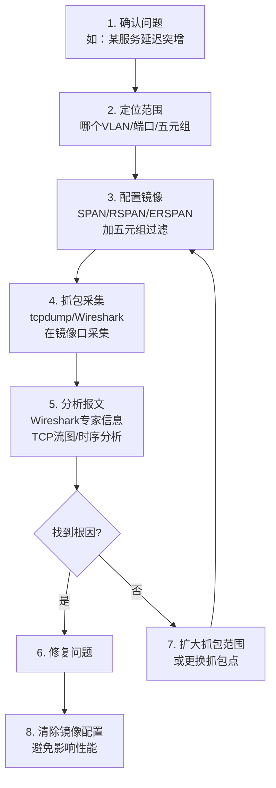

**关键注意事项**：镜像配置完成后，排障结束后必须及时清除。镜像会消耗交换机 CPU 和转发资源——特别是 ERSPAN，GRE 封装和复制操作在 ASIC 中执行，大量镜像流量会占用转发引擎的带宽和缓冲。长期开启镜像可能导致正常流量丢包。

**美团实践**：美团的 M-NOS 支持通过 gRPC 动态下发 ERSPAN 配置，排障时无需登录设备 CLI，通过自动化平台一键开启镜像，设定自动过期时间（如 30 分钟后自动清除），避免遗忘。

### 19.7 Wireshark 分析技巧

收到抓包文件后，Wireshark 的几个关键分析功能：

- **专家信息（Expert Information）**：自动标记异常包（重传、乱序、RST 等），快速定位问题
- **TCP 流图（TCP Stream Graph）**：可视化 TCP 序列号和 ACK，分析拥塞和重传模式
- **IO 图表（IO Graph）**：显示流量速率随时间变化，定位突发和拥塞时段
- **流追踪（Follow TCP Stream）**：重组 TCP 流内容，查看完整的应用层交互
- **过滤器**：如 `tcp.analysis.retransmission` 过滤重传包，`tcp.flags.reset==1` 过滤 RST 包

---

## 二十、总结与知识图谱

### 交换机技术的完整脉络

从最基础的二层帧转发，到最前沿的 P4 可编程数据平面，交换机技术经历了深刻的进化：

**第一阶段：解决基本连接**——集线器 → 网桥 → 交换机，从共享冲突域到独立冲突域。

**第二阶段：解决隔离问题**——VLAN 把一个物理网络切成多个逻辑网络，STP 消除二层环路。

**第三阶段：突破二层限制**——三层交换让交换机学会路由，QinQ/VXLAN 打破 VLAN 数量限制。

**第四阶段：重构网络架构**——CLOS/Leaf-Spine 取代三层树形架构，ECMP 取代 STP，M-LAG 取代堆叠。

**第五阶段：软件定义一切**——SDN/OpenFlow 分离控制面，P4 让数据面可编程，SONiC 让操作系统开源化。

**第六阶段：无损与确定性**——PFC/DCB 构建无损以太网，IGMP Snooping 实现精确组播转发，MMU 缓冲精细化管理，UDLD/Loop Guard 多层环路防护，这些技术让交换机从"尽力而为"走向"确定性保障"。


> 交换机是网络世界的"铁路系统"。二层交换是铁轨，VLAN 是不同车道，STP 是信号灯防撞，三层交换是立交桥，CLOS 架构是高铁网络，SDN 是智能调度中心，P4 是可以随时改造的智能铁轨。PFC 和 DCB 让铁轨变成"磁悬浮"——无损、零丢包；IGMP Snooping 让组播流量精准送达；MMU 缓冲管理是车站的调度场，决定哪些流量先走、哪些等一等；UDLD 和环路防护是安全联锁装置，防止任何意外的撞车。从最原始的"有线就能通"到今天的"软件定义一切 + 确定性保障"，交换机的进化史就是整个数据通信技术的缩影。
