# 企业级内网架构全景解析：从一根网线到整个数字世界

> 本文面向新人，从零开始梳理"公司内网"到底是怎么回事。你将理解为什么内网网站外面打不开、为什么同一个 WiFi 下你 ping 不通同事的电脑、VPN 和零信任是怎么回事、你的一次内部网页请求到底经过了哪些环节。
>
> 资料来源：学城内部文档综合整理。

---

## 〇、全景鸟瞰：一张图理解美团内网

在深入每个细节之前，先建立一个全局的心智模型。美团的网络世界可以粗略地分成三个大的"圈"，它们之间有严格的边界和门禁：

```
┌─────────────────────────────────────────────────────────────────────────┐
│                           互联网（公网）                                  │
│                  用户手机 App / 外部合作伙伴 / 公网流量                      │
└───────────┬──────────────────────────────────┬──────────────────────────┘
            │ 防火墙（默认拒绝，按域名白名单放行）    │
            ▼                                  ▼
┌──────────────────────┐          ┌──────────────────────────────────────┐
│      办公网 (OA)      │          │              IDC 网络                 │
│                      │          │  ┌──────────────┐ ┌───────────────┐  │
│  员工电脑、手机、      │  防火墙   │  │ 线上环境      │ │ 线下环境       │  │
│  打印机、会议室设备    │◄────────►│  │ (Prod/Staging)│ │ (Test/Dev)    │  │
│                      │ 白名单放行 │  └──────────────┘ └───────────────┘  │
│  IP: 11.x / 172.x    │          │  IP: 10.x / 33.x                    │
│       / 192.168.x    │          │  防火墙隔离线上↔线下                    │
└──────────────────────┘          └──────────────────────────────────────┘
```

记住这张图，后面所有的技术细节都是在解释这三个圈各自是怎么建起来的、圈和圈之间的"门"是怎么管的。

---

## 一、物理基础：机房在哪里，网线怎么拉

### 1.1 IDC 机房分布

"内网"并不是一个虚无缥缈的概念，它首先是实实在在的物理存在——服务器放在机房（IDC，Internet Data Center）里，机房之间用光纤连起来。

美团的机房按照 **Region → AZ → IDC** 三级组织：

**Region（地域）** 是最大的地理单位。目前有三个 Region：北京、上海、怀来。同一个 Region 内的机房之间网络延迟很低（通常 2ms 以内），跨 Region 延迟会高很多（北京到上海 25-65ms）。

**AZ（可用区，Availability Zone）** 是 Region 内的逻辑划分，通常对应一个或一组物理上相邻的机房。北京 Region 下有永丰(YF)、光环(GH)、大兴(DX)、次渠(CQ)、望京(WJ)、兆丰(ZF)、贤人(XR)等多个 AZ；上海 Region 下有月浦(YP)、嘉定(JD)、徐汇(XH)等 AZ。

**IDC** 是最小的物理机房单位。美团的机房几乎全部为租用机房，也就是说美团租用运营商或第三方数据中心的物理空间，在里面放自己的服务器和网络设备。

这些机房之间通过专线（光纤）互联，形成一张覆盖北京、上海、怀来三地的骨干网络。同一个 AZ 内机房间延迟小于 0.3ms，同 Region 内 AZ 间延迟小于 2ms。

### 1.2 办公网的物理位置

除了 IDC 机房，美团在北京、上海、扬州、石家庄、宣化、武汉等地都有办公场所（职场）。每个职场里都有自己的办公网络基础设施——交换机、无线 AP、路由器等。

办公网并不直接和 IDC 机房的网络"混"在一起。它们通过专门的"IT POP 点"（类似于一个网络接入汇聚节点）与 IDC 的骨干网络互联。北京的 IT POP 分别和两个"超核"（核心骨干节点）互连，形成冗余。如果北京 Region 的两个超核全挂了，北京办公网络就无法使用，但上海的办公网络仍然正常——这就是物理冗余设计的价值。

### 1.3 机房内部的网络层次

在每个 IDC 机房内部，网络设备也是分层的，典型结构是"Spine-Leaf"（脊叶架构）或传统的三层架构（核心层-汇聚层-接入层）。服务器通过网线或光纤连接到 ToR（Top of Rack，机架顶部）交换机，ToR 交换机再向上连接到汇聚/核心交换机。美团在网络设备上采用了 SONiC（Software for Open Networking in the Cloud）操作系统，这是微软开源的网络操作系统，支持 VLAN 配置、VRF（虚拟路由转发）隔离等功能。

---

## 二、网络分区：三个圈的 IP 地址规划

理解了物理基础之后，接下来最关键的概念是**网络分区**。美团的网络被明确划分为不同的区域，每个区域有自己的 IP 地址段，区域之间的访问受到严格控制。

### 2.1 两大网络域

**办公网（OA 网络）**：员工日常办公使用的网络。IP 地址段包括 `11.0.0.0/8`、`172.16.0.0/12`、`192.168.0.0/16`。你的电脑拿到的 `11.10.x.x` 就属于这个范围。

**IDC 网络**：服务器所在的数据中心网络。IP 地址段包括 `10.0.0.0/8`、`33.0.0.0/8`。你在代码里看到的服务地址，基本都在这个范围。

这两个网络域使用完全不同的私有地址段，这本身就是第一层隔离。它们之间的通信必须经过防火墙，就像两个房间之间有一道带门禁的墙。

### 2.2 IDC 内部的进一步划分

IDC 网络内部并不是一个大平层，它又被分成了两个环境：

**线上环境（Prod / Staging）**：直接服务真实用户的生产系统，以及与生产环境高度一致的预发布环境。这是最核心、最敏感的区域。

**线下环境（Test / Dev）**：开发和测试用的环境。虽然也在 IDC 内，但与线上环境之间同样有防火墙隔离。

所以整体来看，存在三层边界：办公网↔IDC线下、IDC线下↔IDC线上、IDC线上↔公网。每一层边界都有防火墙把守。

### 2.3 为什么要这样分

这种分区的核心思想叫做"纵深防御"：即使攻击者突破了一层防线，他面对的仍然是下一层防线，而不是一马平川。如果办公网和生产网混在一起，一个员工电脑中了木马，攻击者就可能直接横向移动到生产服务器。分区之后，即使办公网被渗透，攻击者还要再突破防火墙才能碰到生产环境——而防火墙是默认拒绝一切、只放行白名单的。

---

## 三、你的电脑是怎么接入内网的：网络准入控制

你拿到公司电脑，插上网线或连上 WiFi，似乎就"进了内网"。但背后发生的事情远比你想象的复杂。

### 3.1 802.1X 证书认证

美团办公网的标准入网方式是 **802.1X 证书认证**。这是一个 IEEE 标准协议，核心思想是：在你的设备被允许使用网络之前，交换机或无线 AP 先把你的设备"隔离"在一个受限状态，只允许你进行身份认证。认证通过了，才给你开放完整的网络访问权限。

具体流程是这样的：你在电脑上打开 大象客户端并登录，然后点击"连接内网"。大象 会自动向公司的证书服务器申请一张设备证书，同时你需要在手机大象端确认这次证书申请（这是一种双因素验证——你既要有公司账号密码，还要有已经认证过的手机）。证书下发后，你的电脑就用这张证书通过 802.1X 协议向交换机证明自己的身份。交换机验证通过后，把你的网口从"受限"状态切换到"放行"状态，你才真正接入了办公网。

无线网络的接入过程类似，只是载体从网线变成了 WiFi。

### 3.2 四个 WiFi SSID 的秘密

你在公司可能注意到了好几个 WiFi 名称，它们不是随便起的，每一个都对应不同的安全级别和用途：

**美团**：这是正式员工的主力 WiFi。使用 WPA2-Enterprise 加密 + 802.1X 证书认证。连接方式是通过大象 App 扫码登录 大象，大象 自动完成证书下发和连网。连上之后，你可以访问完整的公司内网。

**美团-Guest**：访客专用。使用 Portal 认证（就是打开浏览器跳转到一个登录页面输入账号密码的那种方式）。访客只能访问互联网，**完全无法访问美团内部办公网和 IDC 网络**。这就是为什么你让来访的朋友连公司 WiFi，他能刷微博但打不开公司内部的任何网站。

**美团-Test**：仅在总部类职场提供，专门给研发测试和抓包用。同样使用证书认证，但它有一个特殊的特性——**允许无线设备之间互访**。这是专门为需要手机连电脑做 Lyrebird 抓包、ADB over WiFi 等场景设计的。同时支持 2.4G 频段，兼容一些只支持 2.4G 的测试设备。

**美团-Internet**：仅在总部类职场提供，给不支持证书认证的特殊终端使用（比如某些嵌入式设备、智能硬件）。使用设备 MAC 地址认证，只有互联网访问权限，需要单独在安全运营平台申请，且有效期最长 36 个月。

### 3.3 非标设备怎么办

不是所有设备都能安装 大象 做 802.1X 认证的。比如打印机、投屏设备、IoT 传感器等。这些设备被称为"非标准入网资产"，需要通过 MAC 地址白名单的方式接入，并且必须满足一系列安全要求：安装安全管理软件（如果设备支持的话）、遵循最小权限原则（如非必要不允许出外网、不允许访问办公网其他环境）。每次申请只限一年，需要提供 MAC 地址和 MIS 账号双因素匹配。

### 3.4 为什么你 ping 不通同事的电脑

这是很多新人的疑惑：我和同事都连着 美团 WiFi，IP 看起来也在同一个网段，为什么 ping 不通？

答案是**无线客户端隔离（AP Isolation）**。在美团 WiFi 中，无线控制器或 AP 不允许两个无线终端之间直接转发二层流量。你发出的 ARP 请求根本到达不了同事的电脑，或者对方的响应回不来。

这么做的原因是安全：防止办公网内的横向攻击。想象一下，如果一台电脑中了木马，它可以在局域网内扫描所有其他设备、尝试攻击它们。客户端隔离之后，每台设备只能和网关通信，不能直接碰到其他设备，横向攻击面就被大大缩小了。

这也是为什么 美团-Test 这个 SSID 存在的原因——它特意关闭了客户端隔离，让测试场景下的设备可以互访。如果你需要手机连电脑做抓包，应该用 美团-Test 而不是 美团。

（关于终端隔离的更深入原理，可以参考你已有的笔记《美团网络终端隔离与同子网互访原理》。）

---

## 四、防火墙：圈与圈之间的门禁

### 4.1 防火墙本质上是什么

防火墙（Firewall）本质上是一个**部署在网络边界上的流量检查设备**。你可以把它理解为一个"门卫"——它坐在两个网络区域的交界处，所有从一个区域流向另一个区域的数据包都必须经过它，它会根据事先配置好的规则来决定：这个包放行，还是丢弃。

从技术实现上说，防火墙是一个具有多个网络接口的设备（可以是硬件盒子，也可以是运行在服务器上的软件），它以"透明"的方式串联在网络链路中间。所谓"透明"，是指防火墙对正常通信不引入额外的延迟感知或地址变化——它不像代理服务器那样需要你主动配置，而是默默嵌入在网络路径上，数据包经过它时根本"不知道"自己被检查了。这也是为什么公司内部文档会强调"防火墙在网络中是透明的，不会影响网络质量"——它只管能不能通，不管好不好用，telnet 通了就不是防火墙问题。

### 4.2 防火墙在公司网络中的物理位置

理解了防火墙是"坐在边界上的门卫"之后，下一个问题就是：在美团的网络里，它具体坐在哪些边界上？回顾第二章的网络分区，你会发现公司网络有好几道"圈"，而防火墙就守在圈与圈之间的关卡上。

**第一道：办公网 ↔ IDC 边界**。你的办公电脑（OA 网络，`172.16.x.x`/`192.168.x.x`/`11.x.x.x`）要访问 IDC 机房里的服务器（`10.x.x.x`/`33.x.x.x`），这条路上就有一道防火墙。它控制着办公网的人能不能、以及能用哪些端口去访问机房的机器。在 Avatar上你会看到这类白名单叫"办公网到机房"。

**第二道：IDC 线上 ↔ 线下边界**。IDC 内部还分为线上环境（Prod/Staging）和线下环境（Test/Dev），这两者之间也有防火墙。防止测试环境的流量意外冲击到生产环境，也防止生产环境的敏感数据泄露到测试区域。这类白名单在 Avatar 上叫"IDC 线上-线下"，审批通过后约 30 分钟生效。

**第三道：IDC 公网出口防火墙**。这是最严格的一道关卡——机房的服务器要访问外部互联网时，必须经过公网出口防火墙。这道防火墙在美团内部由一个叫 **XFW** 的系统来实现。默认策略是全部禁止，除了少数公共基础组件域名（如某些云服务、证书服务等）已经默认放行外，任何外网访问都需要申请白名单。这也是整个公司网络安全防线的最后一道闸门——如果黑客攻破了内网的某台服务器，这道防火墙可以阻止他把数据发到外网，也可以阻止他从外网下载攻击工具。

此外，如果你通过 VPN 远程访问 IDC，还需要单独过一道 **VPN 防火墙**，它和上述三道防火墙是独立的。

### 4.3 防火墙怎么拦截：四层策略与七层策略

防火墙检查数据包有两种不同深度的方式，在美团内部被称为"四层策略"和"七层策略"，对应 OSI 网络模型中的不同层次。

**四层策略（IP 白名单）** 是最基础的方式。防火墙查看每一个数据包的包头信息，包括：源 IP 地址是什么、目的 IP 地址是什么、目的端口号是多少、使用的是 TCP 还是 UDP 协议。它把这些信息跟白名单规则进行匹配——比如规则说"允许 `172.16.5.0/24` 网段访问 `10.65.1.100` 的 `8080` 端口"，那符合条件的包就放行，其他的就丢弃。四层策略的优点是速度快、性能好，因为只需要看包头里固定位置的几个字段，不需要理解包的内容。

但四层策略有一个致命缺陷：当服务器要访问外网的某个域名（比如 `api.github.com`）时，这个域名对应的 IP 地址可能会变。业务为了省事，往往会把目的 IP 填成 `0.0.0.0/0`（也就是全网段放行），这等于在防火墙上开了一个巨大的口子。安全团队统计发现，历史上 90% 的外网访问策略都被这样放大了。

**七层策略（域名白名单）** 就是为了解决这个问题而引入的。七层策略不再只看 IP 和端口，而是进一步检查应用层协议的内容来获取你实际要访问的域名。具体来说，它通过两种方式获取域名信息：对于 HTTP（明文）请求，防火墙读取 HTTP 请求头中的 **Host** 字段，比如 `Host: api.github.com`；对于 HTTPS（加密）请求，虽然请求体已经被 TLS 加密了，但在 TLS 握手的第一步（ClientHello），客户端会以明文方式发送一个叫 **SNI**（Server Name Indication）的字段，告诉服务器"我要连接的是 `api.github.com`"——防火墙就是抓住这个 SNI 字段来判断你要访问的域名是否在白名单里。

美团的 **XFW 防火墙**同时支持四层和七层两种策略。目前的策略迁移方向是：能用七层域名策略的尽量用七层，逐步下线过去那些放大的四层 IP 策略。迁移过程中，两种策略共存，一个 appkey 添加了域名白名单后，会优先命中七层域名策略；只有七层策略无法覆盖的情况才会 fallback 到四层 IP 策略。

### 4.4 防火墙的基本原则

美团的防火墙策略遵循一个核心原则：**默认拒绝，按需放行**。也就是说，如果没有明确的白名单规则允许某个方向的流量通过，那它就会被拦截。

防火墙控制的是端口级别的 TCP/UDP 连通性，而不是简单的 ping（ICMP）。也就是说，防火墙关心的是"你要访问哪个 IP 的哪个端口"，而不只是"你能不能 ping 通"。这是一个非常容易踩的坑——很多同学发现 `ping 10.x.x.x` 能通就以为网络没问题，但实际上 ping 用的是 ICMP 协议，和你的 TCP 服务走的根本不是同一条规则。正确的测试方式是用 `telnet 目标IP 目标端口` 来验证。

### 4.5 各方向的默认策略

不同方向的默认开放程度是不同的，越靠近生产环境越严格：

**办公网 → IDC 线下（Test/Dev）**：相对宽松，除了 22（SSH）、3389（远程桌面）、445（SMB 文件共享）这几个高危端口被禁止外，其他端口默认允许。因为开发和测试工作需要频繁访问线下环境。

**办公网 → IDC 线上（Prod/Staging）**：非常严格，仅默认开放 DNS(53)、NTP(123)、HTTP(80/8080)、HTTPS(443) 等少数端口。其他端口必须通过 Avatar申请白名单。历史上曾经比较宽松——办公网任意地址可以直接访问线上的很多端口——但这带来了巨大的安全风险，2023 年信息安全部推动了权限收敛，把大量历史开放的端口（4089、27017-27019、5900-5920 等）全部收紧，变成"按需放行，兜底拦截"。

**IDC → 公网**：默认全部禁止。服务器要访问外部网络，必须通过 XFW 防火墙申请域名白名单。过去是用 IP 白名单，但发现 90% 的策略都被放大成了 `0.0.0.0/0`（全网段放行），黑客一旦入侵就能轻松向外网反弹。后来升级到了域名/泛域名粒度的白名单，精确控制服务器能访问哪些外部域名。

### 4.6 白名单管理

所有的防火墙白名单都通过 **Avatar**统一管理。需要开通白名单的同学在 Avatar 上发起申请，填写源 IP/网段、目标 IP/网段、端口、协议等信息，经审批后生效。白名单的生效时间：办公网↔IDC 方向约 30 分钟，IDC 到外网方向约 10 秒。

白名单是与 appkey（服务标识）关联的。当一个服务新增机器时，白名单不会立即对新机器生效，可能有 20-30 分钟的延迟。

---

## 五、DNS：你输入的域名是怎么变成 IP 的

当你在浏览器输入 `docs.sankuai.com` 的时候，你的电脑首先需要知道这个域名对应的 IP 地址是什么，这个过程叫做 DNS 解析。美团有一套完整的内部 DNS 体系，这也是"为什么内网域名外面打不开"的核心原因之一。

### 5.1 内部 DNS 服务器

你的办公电脑配置的 DNS 服务器地址是 `11.11.11.11` 和 `11.11.11.12`。这两个 DNS 服务器部署在 IT 机房（注意，是 IT 机房，不是 IDC 机房），与 IDC 网络隔离部署。

当你请求解析一个内部域名（如 `docs.sankuai.com`、`internal.sankuai.com`）时，办公网 DNS 会将请求转发到 IDC 内部的 DNS 服务器 `10.10.10.10` 进行解析。IDC 内部的权威 DNS 叫做 **内部DNS**，它维护着所有内部域名的解析记录。

### 5.2 Domain 系统：域名管理平台

美团有一个叫 **Domain** 的内部域名管理平台，负责管理所有域名的解析记录。Domain 系统的一个关键设计是"分线路写入"：一个域名可以同时有 internal（内网）线路和 external（外网）线路的解析记录。internal 线路的记录被写入内网 内部DNS，external 线路的记录被写入 DNSPod 和外网 内部DNS。

这意味着：同一个域名，在内网和外网可以解析到完全不同的 IP。比如一个域名在内网解析到 `10.x.x.x`（IDC 内网地址），在外网解析到一个公网 IP 或者干脆不提供解析记录。

### 5.3 为什么内网网站外面打不开

现在可以回答这个问题了。一个内部网站"外面打不开"通常是多重机制叠加的结果：

第一层，**DNS 解析不到**。内部域名只在内网 内部DNS 上有解析记录。你在家用的 DNS 服务器（比如 `8.8.8.8`）去查 `docs.sankuai.com`，根本查不到任何记录，浏览器直接报"找不到服务器"。

第二层，**即使你知道 IP 也访问不了**。内部服务器的 IP 是 `10.x.x.x` 这样的私有地址，这些地址在公网上不可路由。你的家用路由器根本不知道怎么把数据包送到 `10.65.1.100`，因为这个地址在公网上不存在。

第三层，**防火墙拦截**。即使你通过某种方式（比如 VPN）能路由到内网，防火墙也会检查你的来源和目的端口，没有白名单就拒绝。

第四层，**应用层认证**。即使你过了防火墙，内部网站通常还会要求 SSO 登录。没有有效的公司账号，你看到的只是一个登录页面。

这四层防护叠加在一起，使得内网网站几乎不可能被外部访问到。它不是靠某一个单一机制实现的，而是一个层层递进的防御体系。

---

## 六、从 VPN 到零信任：远程访问的演进

### 6.1 传统 VPN 方案

在可信访问方案出现之前，员工远程办公需要连接 VPN（Virtual Private Network，虚拟专用网络）。VPN 的原理是在你的电脑和公司网络之间建立一条加密隧道，让你的电脑"仿佛"直接接入了办公网络。

连接 VPN 后，你的电脑会获得一个 VPN 网络地址（通常是 `172.18.x.x`），你的流量会通过加密隧道发送到公司的 VPN 网关，由 VPN 网关代替你去访问内网资源。

VPN 方案有一个核心的安全假设：**内网是可信的，外网是不可信的**。一旦你连上了 VPN，你就被视为"在内网里"，可以访问内网的各种资源。这个假设在安全领域被称为"城堡与护城河"模型——城墙外面是危险的，城墙里面是安全的。

但这个模型有明显的缺陷：如果攻击者的电脑也连上了 VPN（比如通过钓鱼获取了员工的 VPN 凭据），那他就直接进入了"城堡"内部，可以横向移动攻击各种内部系统。

### 6.2 大象 可信访问（零信任架构）

为了解决传统 VPN 的安全缺陷，美团信息安全部、美团平台部、基础技术部合力建设了 **大象 可信访问（零信任网络）** 方案。这是一个基于"零信任"（Zero Trust）理念的全新网络安全架构。

零信任的核心原则是：**永不信任，始终验证**（Never Trust, Always Verify）。它完全抛弃了"内网安全、外网危险"的假设，认为任何来源的访问都不应该被默认信任。

零信任网络 的四大核心能力：

**不基于网络位置判定安全性**。不管你是在公司办公室、家里的 WiFi、还是咖啡厅的公网，你的访问请求都要经过同样的安全验证。在办公室不等于安全，在外面不等于不安全。

**终端设备认证**。你的设备本身也要被验证为"可信设备"。大象 会检查你的电脑是否安装了必要的安全软件、操作系统是否打了安全补丁、是否存在可疑的运行状态。

**最小权限原则**。你只能访问你被明确授权的资源，而不是"连上网就能访问一切"。

**持续风险检测**。即使你已经通过了认证，系统仍然会持续监测你的行为和设备状态。如果检测到异常（比如你的设备突然开始大量扫描内网），可以实时切断你的访问。

实际使用体验是：你的电脑安装了 大象客户端，大象 在后台持续工作。当你在外网访问内网站点时，大象 会通过一个加密隧道将请求转发到内网，同时在请求中嵌入你的身份票据（透明票据）。整个过程对你来说是**无感知**的——你不需要手动拨 VPN，打开浏览器直接访问内网域名就行。大象 甚至支持 git、jumper（跳板机）、Cloud IDE 等非浏览器场景的内网访问。

零信任网络 目前支持 macOS 11.0+ 和 Windows 10.0+ 系统。它不影响 WiFi 连接和网络准入认证——也就是说，零信任网络 是建立在网络层之上的应用层安全通道，和你的 WiFi 连接是两回事。

### 6.3 可信访问的技术实现

零信任网络 背后有三种身份鉴权方式：

**普通票据（SSO/JWT）**：标准的 SSO 单点登录票据，适用于浏览器场景。

**零信任网络 透明票据**：大象 通过多因子认证确认你的可信身份后，建立安全加密隧道，在请求中嵌入身份票据。服务端接入鉴权 SDK 后，可以从请求中提取出你的 MisId 进行权限验证。这种方式的参考对象是字节跳动的"飞连"。

**TLS 证书（mTLS）**：基于 X.509 的双向 TLS 认证，终端和服务端互相验证对方的身份证书。参考对象是 Google 的工作负载身份联合。

---

## 七、身份认证体系：你是谁，你能做什么

内网不只是"网络层"的事，还有一层非常关键的逻辑层——**身份认证与授权**。即使你的网络是通的，你还需要证明"你是谁"以及"你有没有权限"才能访问具体的服务。

美团的认证授权体系是一个五层架构：

### 7.1 SSO（Single Sign-On，单点登录）

SSO 是整个体系的基础。基于标准的 CAS 协议和 OIDC 协议扩展，为美团内部 2100+ 个应用提供统一登录服务。覆盖外卖、酒旅、出行、零售、到店、金融服务等全部 BG。

核心流程：当你第一次访问某个内部系统时，它会把你重定向到 SSO 登录页面。你输入账号密码（或者通过 大象 扫码）完成认证后，SSO 颁发一系列凭据：TGC（Ticket Granting Cookie，14 天有效）存在你的浏览器里；后续访问其他系统时，浏览器带上 TGC，SSO 验证后直接放行，不需要再次输入密码——这就是"单点登录"的含义。

### 7.2 大象

大象 不只是一个 WiFi 连接工具，它还是移动端认证凭据的载体。大象客户端持有 TGCX Cookie，可以用于 CLI 工具、命令行等非浏览器场景的无感登录。

### 7.3 IAM（Identity and Access Management）

IAM 是第一级的权限控制，管理的是"你能不能进入这个系统"。它控制的是系统入口级别的访问权限。员工在 `iam.sankuai.com` 上申请某个系统的访问权限，审批通过后才能进入该系统。

### 7.4 UAC（Unified Access Control）

UAC 管理的是"进入系统之后你能干什么"。它基于 RBAC3 模型（Role-Based Access Control），提供菜单权限、按钮权限、API 权限、数据权限等细粒度的权限控制。比如你进入了某个运营后台，但你只能看到你负责的业务线的数据，看不到其他业务线的——这就是 UAC 在工作。

### 7.5 将军令

将军令专注于数据资产的访问权限控制，管控 BI 报表、数据 API、Hive 表等数据资源的访问权限。

这五层从下到上，分别解决了"你是不是公司员工"→"你能不能进这个系统"→"你进去之后能干什么"→"你能看哪些数据"的问题。

---

## 八、运维安全：你怎么操作服务器

作为开发人员，你不可能直接 SSH 到生产服务器上去。在安全管理严格的美团里，所有对服务器的操作都必须通过受控通道进行。

### 8.1 跳板机（Jumper）

Jumper 是美团完全自研的远程登录管理系统，也是通常意义上的"堡垒机"。它是访问 IDC 服务器的**唯一合法入口**。

Jumper 采用北京、上海双集群架构，通用入口是 `jumper.sankuai.com`。你可以通过 Web 终端（浏览器）或 Terminal 终端（SSH 客户端）两种方式使用。

权限控制遵循最小权限原则，按角色和环境分配：Prod 环境只有 RD/SRE 负责人有登录权限，SRE 有 root 权限；Test/Dev 环境相对宽松一些，RD/QA 也有 root 权限。临时权限需要通过 Avatar 流程申请，由服务负责人或 SRE 审批。

Jumper 的核心安全能力包括：所有操作的命令录制回放（操作审计）、危险行为拦截（比如在生产环境执行 `rm -rf /`）、登录记录追溯。IDC 机器覆盖率 100%，登录成功率 99.99%。

每个用户在 Jumper 上还有一个 SFTP 个人存储空间，用于安全的文件传输。文件保留时效根据大小不同：小于 100M 保留 3 年，小于 5G 保留 1 年，大于 5G 保留 6 个月。离职账号立即清理。

### 8.2 Avatar：统一Avatar

Avatar 是面向所有技术人员的统一自助Avatar，以服务（appkey）为主要管理对象。它集成了服务管理、资源管理、主机管理、跳板机权限、域名管理、防火墙白名单、负载均衡配置、发布管理等功能。

Avatar 取代了之前的 TTT 和 Workflow 系统，成为统一的运维入口。基本上，你在内网做运维相关的事情，都会和 Avatar 打交道。

### 8.3 主机安全 Agent

在美团容器化率 97%+ 的环境下，每个容器/主机上都部署了多个安全类 Agent：

**Direwolf**：主机入侵检测系统（HIDS），实时检测异常行为，比如可疑的进程启动、异常的网络连接、文件篡改等。

**KMS-Agent**：密钥管理服务 Agent，负责密钥、Token、证书的安全分发。服务运行需要的各种敏感凭据（数据库密码、API 密钥等）都通过 KMS 安全下发，而不是写在配置文件里。KMS 主机级身份认证覆盖率已达 98%。

**Jumper-Agent**：跳板机 Agent，负责运维操作审计、命令录制回放、权限管控。

---

## 九、安全红线：什么事情绝对不能做

了解了内网架构之后，你也需要知道一些铁律。这些不是"建议"，而是"红线"，违反者将被辞退且永不录用：

**禁止通过端口转发、内网穿透、反向代理等方式突破公司网络隔离及访问控制。** 这包括使用 frp、ngrok、花生壳等工具将内网端口暴露到外网，也包括搭建私人 VPN 或代理服务。

**禁止私自搭建 WiFi。** 不能在办公区域用自己的路由器或热点创建一个绕过公司网络安全策略的网络。

**禁止在办公网络和 IDC 环境中放置木马、后门等恶意程序。**

**禁止对安全管理类软件（大象、EDR、HIDS、杀毒软件等）进行破坏、卸载或更改。**

**禁止绕过公司安全策略**，包括但不限于网络隔离策略、访问控制策略等。

这些规定的背后逻辑是：内网的安全防线是多层叠加的，每一层都不能被绕过。一个人的"方便"可能打开一个让整个公司暴露在风险中的缺口。

---

## 十、把它们串起来：一次请求的完整链路深度拆解

前面九章分别讲了物理基础、网络分区、准入控制、防火墙、DNS、远程访问、身份认证、运维安全、安全红线。这些知识点是散落的拼图碎片。现在让我们用一个具体的场景——**你坐在工位上，打开浏览器访问一台 IDC 线上服务器的 8080 端口**——把所有碎片拼成一张完整的画面。

这个例子会覆盖从你的手指敲下回车键到服务器返回数据的每一跳，包括你日常开发中最容易困惑的那些"为什么不通"的场景。

### 10.1 第零步：你的电脑是怎么获得网络访问权的

在一切请求发生之前，你的电脑首先需要"接入内网"。

你打开 MacBook，连接 美团 WiFi。此时无线 AP 并不会立刻让你的流量通过——它先把你的设备置于一个"受限"状态，只允许你完成 802.1X 认证流程。你的电脑上安装的 大象客户端自动提交设备证书（这张证书是你之前通过 大象 登录 + 大象手机端确认后下发的），AP 将证书转发给后端的 RADIUS 认证服务器验证。验证通过后，AP 把你的设备从"受限"切换到"放行"，DHCP 服务器给你分配一个办公网 IP，比如 `11.10.5.88`。

从这一刻起，你的电脑正式成为办公网（OA 网络）的一员。但要注意：虽然你和旁边同事可能拿到了同一个子网的 IP，由于 AP 客户端隔离机制，你们之间的二层流量是互相隔绝的——你发出的 ARP 广播到达不了同事的电脑。你的所有流量都只能发往默认网关。

### 10.2 第一步：DNS 解析——把域名变成 IP

你在浏览器地址栏输入 `docs.sankuai.com` 然后按下回车。浏览器要做的第一件事不是发 HTTP 请求，而是搞清楚这个域名对应的 IP 地址是什么。

你的电脑的 DNS 配置指向 `11.11.11.11` 和 `11.11.11.12`（这两台 DNS 服务器部署在 IT 机房，属于办公网基础设施）。电脑向 `11.11.11.11` 发送一个 DNS 查询请求："请问 `docs.sankuai.com` 的 A 记录是什么？"

`11.11.11.11` 本身并不直接存储内部域名的解析记录，它作为递归解析器，发现这是一个 `sankuai.com` 域下的域名，于是将查询转发给 IDC 内部的权威 DNS 服务器 `10.10.10.10`（内部DNS）。内部DNS 在自己的区域文件中查到 `docs.sankuai.com` 的 internal 线路记录，返回一个 IDC 内网地址，比如 `10.65.1.100`。

这个解析结果沿原路返回：`10.10.10.10` → `11.11.11.11` → 你的电脑。现在你的浏览器知道了：要访问的服务器在 `10.65.1.100`。

这里有一个关键细节：`docs.sankuai.com` 在 Domain 平台上只配置了 internal 线路的解析记录，没有 external 线路。这意味着如果你在家用 `8.8.8.8` 去查这个域名，根本查不到任何结果——浏览器会直接报"找不到服务器"。这就是内网网站"外面打不开"的第一层防护。

### 10.3 第二步：构造数据包——你的电脑在想什么

拿到 IP 后，浏览器准备发起 HTTPS 连接。操作系统的网络栈开始构造数据包：

目标 IP 是 `10.65.1.100`，你的电脑 IP 是 `11.10.5.88`。操作系统检查路由表，发现 `10.65.1.100` 不在自己所属的子网内（`11.10.5.0/24`），所以这个包不能直接在局域网里发——它必须交给默认网关来转发。

于是你的电脑通过 ARP 协议查到默认网关的 MAC 地址，将数据包的二层目的 MAC 设为网关的 MAC，三层目的 IP 保持 `10.65.1.100`，从网卡发出。这是一个标准的"跨子网通信"流程——你的电脑并不需要知道最终的路径是什么，它只需要把包交给网关，剩下的事情由网络基础设施来处理。

### 10.4 第三步：办公网内部路由——包在办公网里怎么走

这一步是整个链路中最容易被一笔带过的，但它恰恰是**美团网络和家庭网络最本质的区别**所在。在家里，你的全部网络设备就是一台无线路由器，所有手机、电脑、电视都挂在同一台路由器下面，处于同一个子网，设备之间直接通信，流量出口只有一个——宽带口。整个网络是"扁平"的，一层就够了。但是在一个有几万人的美团里，这种架构是完全不可行的。一台交换机最多接入几十到几百台设备，一个子网的广播域如果包含了上万台电脑，广播风暴就能把网络打垮。所以美团网络必须分层，就像城市的交通系统分为小区道路、城市主干道、高速公路一样。

美团的办公网采用经典的**三层网络架构**（有的地方也叫"接入-汇聚-核心"模型），从下到上分为接入层、汇聚层、核心层，再往上通过 IT POP 点接入骨干网。我们逐层来看你的数据包是怎么走的。

**第一层：接入层（Access Layer）——离你最近的那台交换机**

你的 MacBook 连的 WiFi AP（无线接入点），或者你用网线插的桌面网口，背后连接的就是**接入层交换机**。它通常就藏在你所在楼层的弱电间（IDF，Intermediate Distribution Frame）里，是一台二层交换机（比如 48 口的那种）。整层楼甚至半层楼的电脑都通过网线或 AP 汇聚到这台接入交换机上。

接入层交换机的职责非常明确：把终端设备的流量收上来，同时做一些最基本的安全和隔离工作。比如，它会通过 VLAN（虚拟局域网）把不同部门、不同用途的设备分到不同的广播域里。你所在的研发团队可能被划分在 VLAN 100，隔壁的行政团队在 VLAN 200，即使你们插在同一台交换机的不同端口上，你们的广播流量也是互不可见的。这就像一栋大楼里虽然所有人走同一部电梯，但每个公司有自己的门禁卡，只能刷开自己楼层的门。

接入层交换机本身通常不做路由决策（它是二层设备，只看 MAC 地址），你的数据包到了这里，交换机发现目的 MAC 是网关的 MAC，而网关并不在自己本地的端口上，于是通过上联链路（uplink）把这个包发给上一级——汇聚层交换机。

**第二层：汇聚层（Aggregation Layer）——楼栋级别的"交通枢纽"**

汇聚层交换机通常部署在一栋楼的主配线间（MDF，Main Distribution Frame）里，一栋楼可能有 1-2 台（通常做冗余配对）。它的下面挂着这栋楼里所有楼层的接入层交换机。

汇聚层是从二层网络到三层网络的**分界点**。前面说的 VLAN 100、VLAN 200，它们各自是一个独立的广播域，互相之间不能直接通信。要让 VLAN 之间的流量互通（比如你要访问行政系统的打印服务器），就需要做**三层路由**（VLAN 间路由）。汇聚层交换机就是干这个的——它是一台**三层交换机**，同时具备交换能力和路由能力。它为每个 VLAN 配置一个虚拟网关接口（SVI，Switch Virtual Interface），比如 VLAN 100 的网关是 `11.10.5.1`，VLAN 200 的网关是 `11.10.6.1`。

还记得 10.3 里你的电脑把包发给了默认网关吗？这个默认网关地址 `11.10.5.1` 其实就是汇聚层交换机上 VLAN 100 对应的 SVI 接口的 IP。所以你的数据包从接入层交换机上来之后，到达的就是汇聚层交换机的这个网关接口。

汇聚层交换机收到包后，剥掉原来的二层帧头，看三层的目的 IP：`10.65.1.100`。它查自己的路由表，发现 `10.0.0.0/8` 不在自己直连的任何 VLAN 子网里，路由表里有一条指向核心层交换机的路由条目（通常是通过 OSPF 或 BGP 等动态路由协议学习到的）。于是它重新封装二层帧头——源 MAC 改成自己的上联口 MAC，目的 MAC 改成核心层交换机的接口 MAC——然后从上联口发出去。

汇聚层还承担另一个重要角色：**策略执行点**。ACL（访问控制列表）、QoS（服务质量策略，比如给视频会议流量更高的优先级）、流量镜像（把特定流量复制一份给安全审计系统）等策略，往往就部署在汇聚层。这是因为汇聚层是南北向流量（终端到服务器）的必经之路，在这里做策略最高效。

**第三层：核心层（Core Layer）——园区级别的"高速公路"**

核心层交换机是整个办公园区网络的中枢，通常部署在园区的核心机房里，数量很少（一般就 2 台，做冗余），但性能极其强大。所有汇聚层交换机都上联到核心层，核心层之间互联形成高速的转发骨干。

核心层的设计哲学是**"快速转发，不做复杂处理"**。它不做 ACL 过滤，不做复杂的策略匹配，唯一的任务就是以线速（wire-speed）把数据包从一个汇聚层交换机转发到另一个汇聚层交换机，或者转发到出口方向。你可以把它想象成城市的高速环路——上面不设红绿灯，车辆全速通过，复杂的交通管理都在匝道口（汇聚层）完成。

你的数据包到达核心层交换机后，核心交换机查路由表，发现 `10.0.0.0/8` 的路由下一跳指向 IT POP 点的接口。于是它再次改写二层帧头，把包从连接 IT POP 的接口发出去。

**第四层（出口）：IT POP 点——办公网通往外部世界的大门**

IT POP（Point of Presence，接入点）是办公网和外部网络（IDC 骨干网、互联网）的交汇处。你可以把它理解为办公园区网络的"高速公路收费站入口"。IT POP 点部署着出口路由器和防火墙设备。

数据包到达 IT POP 后，出口路由器根据路由表判断这个包应该走哪条路：如果目的地是 IDC（`10.0.0.0/8`），就通过办公网到 IDC 的专用互联链路发往 IDC 骨干网；如果目的地是公网（比如你要访问 baidu.com），就通过互联网出口链路发出去，途中还会经过 NAT 设备把你的内网 IP 转换成公网 IP。

**逐跳转发的本质——每一跳只改 MAC，不改 IP**

在上面整个过程中，有一个贯穿始终的原则：每经过一台三层设备（汇聚交换机、核心交换机、出口路由器），数据包的**三层 IP 地址始终不变**（源 IP `11.10.5.88`，目的 IP `10.65.1.100`），但**二层 MAC 地址每一跳都在变**。每台设备都是把"下一跳设备的 MAC"写进帧头，然后发出去。这就像你寄一个包裹，收件人地址（IP）从头到尾不变，但每到一个中转站，包裹上的"下一站"标签（MAC）都会被撕掉重贴。

把上面四层画成一张图：

```
你的 MacBook ──WiFi AP──→ [接入层交换机] ──uplink──→ [汇聚层交换机(网关)]
   11.10.5.88              楼层弱电间(IDF)           楼栋主配线间(MDF)
   VLAN 100                二层转发,VLAN隔离          三层路由,VLAN间路由
                                                     策略执行(ACL/QoS)
                                                          │
                                                          ↓
                                               [核心层交换机(冗余对)]
                                                   园区核心机房
                                                 线速转发,不做策略
                                                          │
                                                          ↓
                                                  [IT POP 出口路由器]
                                                  办公网 ←→ IDC骨干
                                                  办公网 ←→ 互联网
```

在我们这个场景里，数据包的目的地是 IDC 的 `10.65.1.100`，所以它从 IT POP 出发，通过办公网到 IDC 的互联链路，进入 IDC 骨干网络，准备面对下一关——防火墙。

### 10.5 第四步：过防火墙——网络层的安检

数据包在办公网和 IDC 网络的边界上，遇到了第一道防火墙。

防火墙收到这个包后，提取包头中的四个关键信息：源 IP `11.10.5.88`、目的 IP `10.65.1.100`、目的端口 `443`（HTTPS）、协议 TCP。然后去匹配白名单规则。

因为 443 端口属于办公网→IDC 线上方向的默认放行端口，所以这个包直接被放行，继续沿路由转发。防火墙对这个包的处理是完全"透明"的——它不修改包的任何内容，不引入可感知的延迟，你的电脑甚至不知道自己的包被检查过。

但如果你访问的不是 443 端口，而是 `10.65.1.100:9200`（比如想直接访问一个线上 Elasticsearch 集群），那情况就完全不同了。9200 不在默认放行列表里，而且假设你的 appkey 也没有在 Avatar 上申请过这个端口的白名单——防火墙会直接丢弃这个包。你那边的表现就是 `telnet 10.65.1.100 9200` 一直卡住，最终报 `Connection timed out`。注意，这时候你 `ping 10.65.1.100` 可能是通的（因为 ICMP 协议和 TCP 走的不是同一条规则），这会让你误以为"网络没问题"——但实际上是防火墙在端口级别拦截了你的 TCP 连接。

### 10.6 第五步：IDC 内部路由——包在机房里怎么走

过了防火墙之后，数据包进入 IDC 网络。根据目的 IP `10.65.1.100`，IDC 内部的路由设备继续逐跳转发。数据包经过 IDC 的核心交换机，根据路由找到目标服务器所在的机房和机架，最终到达目标机架的 ToR（Top of Rack）交换机，由 ToR 交换机将包送达 `10.65.1.100` 这台服务器。

如果目标服务器和你的 IT POP 点在同一个 AZ（比如都在北京永丰），这条路非常短，延迟不到 1ms。如果跨 AZ（比如从永丰到大兴），延迟大约 1.8-2ms。如果跨 Region（比如北京到上海），延迟会跳到 25-30ms——这就是为什么跨 Region 调用要格外注意延迟的原因。

### 10.7 第六步：TCP 握手和 TLS 握手——建立安全连接

数据包到达服务器后，客户端和服务端开始 TCP 三次握手（SYN → SYN-ACK → ACK），建立传输层连接。TCP 连接建立成功后，紧接着进行 TLS 握手。

TLS 握手的第一步是客户端发送 ClientHello 消息，这个消息里包含一个重要字段——**SNI（Server Name Indication）**，值为 `docs.sankuai.com`。SNI 是以明文发送的（即使后续的通信全部加密），这个字段在前面第四章讲过：如果你的请求要过 IDC 到公网的 XFW 防火墙，防火墙就是读这个 SNI 字段来判断你访问的域名是否在白名单内。不过在这个场景下，你的请求是办公网到 IDC 线上，走的是四层策略，所以 SNI 不会被防火墙用到——但知道这个细节有助于你理解整个体系。

TLS 握手完成后，后续所有的 HTTP 通信都在加密隧道中进行。

### 10.8 第七步：应用层——SSO 认证和业务响应

加密隧道建好之后，浏览器通过 HTTPS 发出第一个 HTTP 请求：`GET / HTTP/1.1`，Host: `docs.sankuai.com`。

这个请求到达学城的接入层（通常是一个 Nginx 反向代理或 Oceanus 七层负载均衡）。接入层检查请求中有没有携带有效的 SSO 凭据（比如 Cookie 里的 TGC 或 Service Ticket）。

如果你是第一次访问（或者 Cookie 已过期），接入层发现没有有效凭据，返回一个 `302 重定向`，把你的浏览器导向 SSO 登录页面（`sso.sankuai.com`）。你在 SSO 页面输入 内部账号密码，或者用大象 App 扫码登录。SSO 服务验证通过后，颁发 TGC（Ticket Granting Cookie，有效期 14 天），通过 `Set-Cookie` 写入你的浏览器，然后将你重定向回 `docs.sankuai.com`。

这一次，你的浏览器带着 TGC 重新访问学城。接入层验证 TGC 有效，请求被放行到后端的业务服务器。业务服务器处理请求，返回学城的页面内容。页面数据沿原路（服务器 → IDC 路由 → 防火墙 → 办公网路由 → 你的电脑）返回，浏览器渲染页面——你终于看到了学城的首页。

**这里要特别强调一个很多人搞混的概念**：SSO/零信任网络 认证和防火墙是两个完全独立的机制，工作在不同的层次。防火墙在网络层工作，它看到的是 IP 包头，做的是"这条路你能不能走"的判断；SSO/零信任网络 在应用层工作，它看到的是 HTTP 请求头里的 Cookie 和身份票据，做的是"你是谁、你有没有权限"的判断。防火墙不认识也不关心你的 零信任网络 凭据，SSO 也不关心你的包是从哪个网段来的——它们各管各的，只不过在时间线上是串行的：先过防火墙（网络层），再过 SSO（应用层）。

### 10.9 完整链路总览

把上面的所有步骤浓缩一下：

```
[你的 MacBook]
    │
    │ ⓪ 802.1X 证书认证 → AP 放行 → DHCP 分配 IP 11.10.5.88
    │
    │ ① DNS 查询: docs.sankuai.com → 11.11.11.11 → 10.10.10.10(内部DNS)
    │                                              返回 10.65.1.100
    │
    │ ② 构造数据包: 源IP 11.10.5.88 → 目的IP 10.65.1.100:443
    │   目的IP不在本子网 → 发往默认网关
    │
    ▼
[办公网网关 / 交换机]
    │
    │ ③ 路由转发: 查路由表, 10.0.0.0/8 → IDC方向, 逐跳转发
    │
    ▼
[办公网 ↔ IDC 防火墙]  ← 网络层安检
    │
    │ ④ 检查: 源IP + 目的IP + 端口443 + TCP → 命中默认放行规则 → 通过
    │   (如果是端口9200且无白名单 → 直接丢弃 → 你看到 Connection timed out)
    │
    ▼
[IDC 内部路由 / 交换机]
    │
    │ ⑤ 路由转发: 核心交换机 → ToR交换机 → 目标服务器
    │
    ▼
[目标服务器 10.65.1.100]
    │
    │ ⑥ TCP 三次握手 → TLS 握手(ClientHello 含 SNI: docs.sankuai.com)
    │
    │ ⑦ HTTP 请求到达应用接入层
    │   → 无 SSO 凭据 → 302 重定向到 SSO 登录
    │   → 用户认证通过 → 颁发 TGC → 重定向回学城
    │   → 带 TGC 再次请求 → 验证通过 → 返回页面内容  ← 应用层认证
    │
    ▼
[页面数据原路返回: 服务器 → IDC路由 → 防火墙 → 办公网路由 → 你的电脑]
```

### 10.10 当事情出问题时：常见故障的定位思路

理解了完整链路之后，你就能快速定位"访问不通"的原因了：

**浏览器报"找不到服务器"** — 大概率是 DNS 层面的问题。可能是域名本身没有配置解析记录，也可能你不在办公网（比如用了家里的 WiFi），你的 DNS 服务器不是 `11.11.11.11`，查不到内部域名。

**`telnet IP 端口` 超时（Connection timed out）** — 网络层的问题。最常见的原因是防火墙没有放行这个端口。去 Avatar检查你的 appkey 有没有对应方向和端口的白名单。记住：`ping` 通不代表端口通，因为 ICMP 和 TCP 走不同的防火墙规则。

**`telnet IP 端口` 成功但 HTTP 请求返回 4xx** — 网络层是通的（防火墙已放行），问题出在应用层。如果是 401/403，通常是 SSO 或 IAM 权限问题；如果是 502/504，可能是后端服务本身挂了或者负载均衡配置有问题。

**访问特别慢但不超时** — 检查是不是跨 Region 调用（北京到上海 25-30ms），或者是服务端自身的性能问题。防火墙只管通不通，不影响网络质量——如果 `telnet` 能通，那慢的原因一定不是防火墙。

---

## 十一、总结：为什么要搞这么复杂

如果你读到这里，可能会觉得"一个内网至于搞这么复杂吗？"答案是：至于的。

对于一家拥有数万名员工、数十万台服务器、承载亿级用户数据的互联网公司来说，网络安全不是一个可选项，而是生存的基础设施。

这套复杂架构解决的核心问题可以归结为几个方面。首先是**纵深防御**：不依赖任何单一安全机制，而是层层设防，确保即使某一层被突破，攻击者仍然面对下一层防线。其次是**最小权限**：每个人、每台设备、每个服务，都只能访问它确实需要的资源，而不是"能访问一切"。再次是**可审计**：所有的访问、操作都有记录，出了问题可以追溯。最后是**持续演进**：从传统的 VPN + 防火墙边界模型，到零信任的"永不信任、始终验证"模型，安全架构不是一成不变的，而是随着威胁的演化不断升级。

对于新人来说，理解这套架构最重要的不是记住每个系统的名字，而是建立起"分层、隔离、验证、审计"这几个基本的安全思维。当你遇到"为什么这个访问不通""为什么需要申请权限""为什么不能直接 SSH 到服务器"这类问题时，你就能从架构的角度理解背后的逻辑，而不是觉得公司在"故意设障碍"。

---

## 附录二：多场景链路实战拆解

第十章用"办公电脑浏览器访问学城"这一个场景串起了完整链路。但实际工作中你会遇到各种各样不同的访问模式，每种模式走的链路、经过的安检点、涉及的协议栈都不一样。这一节把最常见的几种场景逐个拆开讲，每一步都不跳过。

### 场景一：通过跳板机 SSH 到一台线上服务器

**背景**：你是后端开发，需要登录一台线上（Prod）服务器 `10.72.3.55` 查看日志。公司规定所有 IDC 服务器的登录必须通过跳板机 Jumper，不能直连。

**第 1 步：你的电脑发起 SSH 连接到 Jumper。** 你在终端输入 `ssh jumper.sankuai.com`，或者在浏览器打开 Jumper 的 Web 终端。无论哪种方式，你的电脑首先要解析 `jumper.sankuai.com` 的 IP。DNS 查询流程和第十章一样：你的电脑向 `11.11.11.11` 发起查询，递归到 `10.10.10.10`（内部DNS），内部DNS 返回 Jumper 集群的 IP，比如 `10.4.1.200`。

**第 2 步：数据包构造和路由。** 你的电脑 IP 是 `11.10.5.88`，目标 IP 是 `10.4.1.200`，不在同一子网。数据包的二层目的 MAC 设为默认网关的 MAC，三层目的 IP 保持 `10.4.1.200`，从网卡发出。网关根据路由表将包往 IDC 方向逐跳转发。

**第 3 步：过办公网到IDC 防火墙。** SSH 默认使用 TCP 端口 22。查看防火墙默认放行规则：办公网和IDC线上之间，端口 22 在默认允许列表中（`22, 58422 TCP`）。所以防火墙检查源 IP `11.10.5.88`、目的 IP `10.4.1.200`、目的端口 22、协议 TCP，命中放行规则，数据包通过。如果 22 端口没有默认放行（或者你用的是非标端口），你会看到 `ssh: connect to host jumper.sankuai.com port 22: Operation timed out`——这就是防火墙丢包的典型表现。

**第 4 步：到达 Jumper 服务器，身份认证。** 数据包经过 IDC 内部路由，到达 Jumper 集群的服务器 `10.4.1.200`。TCP 三次握手完成后，SSH 协议开始密钥交换和身份认证。Jumper 不是一个普通的 SSH 服务器——它是一个堡垒机。你的身份认证不是靠传统的密码或公钥，而是通过 大象 的身份票据。Jumper 验证你的 内部身份后，检查你对目标服务器 `10.72.3.55` 有没有登录权限。这个权限是在 Avatar上管理的：Prod 环境只有 RD 负责人和 SRE 才有登录权限，其他人需要通过 Avatar 提交临时权限申请，经服务负责人审批后才能获得。如果你没有权限，Jumper 直接拒绝你的登录请求，你看到的是一个"无权限"的提示。注意：这不是防火墙拦截，也不是网络不通——网络层完全是通的（你已经成功连接到 Jumper 了），是应用层的权限控制在起作用。

**第 5 步：Jumper 代理连接到目标服务器。** 权限验证通过后，Jumper 服务器代替你向目标服务器 `10.72.3.55` 发起一个新的 SSH 连接。注意，这个连接的源 IP 不再是你的电脑 `11.10.5.88`，而是 Jumper 自己的 IP `10.4.1.200`。这意味着这条连接走的防火墙规则是"IDC 内部"的规则（Jumper 和目标服务器都在 IDC 内），而不是"办公网到IDC"的规则。IDC 内部同环境的通信通常是比较宽松的，端口 22 默认放行。Jumper 到 `10.72.3.55` 的 SSH 连接建立后，你在终端里输入的每一个字符，实际上经历了两跳：你的电脑到Jumper再到目标服务器。Jumper 在中间做全量的命令录制回放——你敲的每一个命令、看到的每一行输出，都被记录下来用于审计。如果你在线上环境执行了危险命令（比如 `rm -rf /`），Jumper 的危险行为拦截机制会直接阻断这个命令。

**第 6 步：数据返回。** 目标服务器的输出沿原路返回：`10.72.3.55` 到 Jumper `10.4.1.200`，再到 IDC 路由，过防火墙，经办公网路由，到你的电脑 `11.10.5.88`。你在终端上看到了日志内容。

**为什么不能直连？** 如果你尝试直接 `ssh 10.72.3.55`，会发生什么？首先，即使防火墙放行了（假设端口 22 有白名单），目标服务器上的 Jumper-Agent 也会检查这个 SSH 连接是不是从 Jumper 代理过来的。如果不是，连接会被拒绝。这就是"Jumper 是唯一合法入口"这句话的技术含义——不是靠"你记得要走 Jumper"这种自觉，而是服务器端有 Agent 在技术层面强制执行。

---

### 场景二：在家远程办公，通过 零信任网络 访问内部系统

**背景**：周末你在家里，需要打开 Avatar（`ops.sankuai.com`）处理一个紧急工单。你的家用 WiFi 的 IP 是 `192.168.1.105`，DNS 服务器是运营商默认的 `114.114.114.114`。

**第 1 步：DNS 解析——第一个不同。** 你在浏览器输入 `ops.sankuai.com`。浏览器向 `114.114.114.114` 发起 DNS 查询。这台公网 DNS 服务器去查 `sankuai.com` 域的权威 DNS，但公司的内网域名在外网 DNS 上通常没有解析记录（Domain 平台只配置了 internal 线路）。如果你没有开启 零信任网络，这里就直接失败了——浏览器报"找不到服务器"，故事结束。这就是第十章讲的"内网网站外面打不开"的第一层防护。但你的电脑上安装了 大象客户端，零信任访问功能是开启的。零信任网络 在你的电脑上运行了一个本地代理，它会拦截你的 DNS 查询。当 零信任网络 发现你要解析的是 `sankuai.com` 域下的域名时，它不走公网 DNS，而是通过自己和公司之间的加密隧道，把 DNS 查询转发到公司内网的 DNS 服务器 `11.11.11.11` 去解析。`11.11.11.11` 照常递归到 内部DNS `10.10.10.10`，拿到 `ops.sankuai.com` 的内网 IP，比如 `10.32.8.77`。这个结果通过加密隧道返回给 零信任网络 本地代理，再返回给你的浏览器。

**第 2 步：建立加密隧道——最关键的一步。** 现在你的浏览器知道目标 IP 是 `10.32.8.77`。但你在家里，家用路由器的路由表里根本没有 `10.0.0.0/8` 的条目——这是私有地址，公网上不可路由，发出去的包会被你的路由器直接丢弃。零信任网络 解决这个问题的方式是：它在你的电脑和公司网络之间维持一条持久的加密隧道。你的浏览器发给 `10.32.8.77:443` 的数据包，会被 零信任网络 的本地代理捕获（通过修改系统路由表或虚拟网卡），包裹在一个新的加密数据包里，外层的目的地址是公司的 零信任网络 网关的公网 IP（比如 `103.x.x.x`）。这个外层包能正常在公网路由，从你家的路由器经运营商网络、互联网，到达公司的 零信任网络 网关。

**第 3 步：零信任网络 网关处理——身份验证在这里发生。** 加密包到达公司的 零信任网络 网关后，网关首先解开加密层，还原出原始的数据包（目的 IP `10.32.8.77:443`）。但在转发之前，零信任网络 网关会做一系列检查。**设备认证**：你的电脑是否是一台经过注册的可信设备？大象客户端是否在正常运行？操作系统是否打了最新的安全补丁？是否安装了必要的安全软件？**身份认证**：你是谁？零信任网络 通过 大象客户端持有的身份凭据来确认你的 内部身份。这个凭据是你之前在办公网环境下通过多因子认证（密码 + 大象手机端确认）获取的。**权限检查**：你有没有权限访问 `ops.sankuai.com`？零信任网络 会根据最小权限原则进行判断。所有检查通过后，零信任网络 网关在原始数据包中嵌入你的身份票据（透明票据），然后将包注入公司内网，按正常路由转发给 `10.32.8.77`。

**第 4 步：过防火墙——注意防火墙看到的源 IP。** 从防火墙的视角来看，这个包的源 IP 不是你家里的 `192.168.1.105`（那个地址在第 2 步就被 零信任网络 隧道封装掉了），而是 零信任网络 网关注入内网后分配的一个内网地址。防火墙按照正常规则匹配：源 IP（零信任网络 网关的内网出口地址）、目的 IP `10.32.8.77`、目的端口 443、协议 TCP。如果命中放行规则，包通过。这也是为什么 VPN 环境访问 IDC 需要单独过一道 VPN 防火墙——远程接入的流量和办公网直连的流量走的防火墙规则可能不一样。

**第 5 步：到达应用服务器。** 数据包到达 Avatar 服务器 `10.32.8.77`，TCP 握手、TLS 握手完成。HTTP 请求到达 Avatar 的接入层。接入层检测到请求中携带了 零信任网络 透明票据，通过 零信任网络 鉴权 SDK 提取出你的 内部身份，验证通过，返回 Avatar 页面。注意这里和"在办公室访问"的一个区别：在办公室你通常是通过 SSO 的 Cookie（TGC）来完成认证的，而在家里通过 零信任网络 访问时，认证凭据是 零信任网络 透明票据——这两个是不同的认证方式，但最终效果一样，都能证明"你是某个 内部用户"。

**第 6 步：数据返回。** Avatar 的响应数据沿原路返回：`10.32.8.77` 经 IDC 路由到 零信任网络 网关，通过加密隧道走公网回到你家路由器，到你的电脑。零信任网络 本地代理解开加密层，把 HTTP 响应交给浏览器，你看到了 Avatar 页面。整个过程对你来说是无感知的——你不需要手动拨 VPN，不需要切换什么模式，打开浏览器输入地址就行。这就是零信任架构相比传统 VPN 的体验优势。

**如果 零信任网络 没有开启会怎样？** DNS 查询直接失败（公网 DNS 查不到内网域名），浏览器报"找不到服务器"。即使你手动设置了 DNS 指向 `11.11.11.11`，由于 `11.0.0.0/8` 是美团的办公网地址段，从你家的网络根本路由不到，DNS 查询包也发不出去。即使你通过某种方式知道了目标 IP `10.32.8.77`，这个私有地址在公网上不可路由，包发不到。三层防护叠加，不是某一层"碰巧"拦住了你，而是每一层都独立地拦住了你。

---

### 场景三：线上服务器调用外部 API（IDC 到 公网）

**背景**：你的服务 `com.sankuai.xxx.payment` 部署在线上环境，服务器 IP 是 `10.88.2.30`。业务逻辑中需要调用微信支付的回调接口 `https://api.mch.weixin.qq.com/v3/pay/transactions`。

**第 1 步：应用代码发起 HTTPS 请求。** 你的 Java 代码里用 OkHttp 或者 HttpClient 发起了一个 HTTPS POST 请求，目标是 `api.mch.weixin.qq.com`。应用层把请求交给操作系统的网络栈。

**第 2 步：DNS 解析——这次走的是 IDC 内部 DNS。** 服务器 `10.88.2.30` 的 DNS 配置指向 IDC 内部的 DNS 服务器（通常是 `10.10.10.10` 或所在集群的本地 DNS）。DNS 服务器收到查询 `api.mch.weixin.qq.com`——这不是 `sankuai.com` 域下的域名，而是一个外部域名。IDC 内部的 DNS 服务器对于外部域名的处理方式是：向上游的公网 DNS（比如运营商 DNS 或公共 DNS）转发查询。公网 DNS 返回微信支付 API 的公网 IP，比如 `140.207.x.x`。

**第 3 步：构造数据包和路由。** 服务器 `10.88.2.30` 构造数据包：源 IP `10.88.2.30`、目的 IP `140.207.x.x`、目的端口 443、协议 TCP。操作系统查路由表，发现 `140.207.x.x` 不在任何内网网段内，属于公网地址，需要通过默认路由发往公网出口方向。数据包在 IDC 内部经过若干路由设备逐跳转发，最终到达 IDC 公网出口。

**第 4 步：过 XFW 防火墙——最严格的一道关卡。** 这里就到了第四章详细讲过的 XFW 防火墙。IDC 到公网的默认策略是**全部禁止**。XFW 同时进行两个层面的检查。**四层检查**：源 IP `10.88.2.30`（属于 appkey `com.sankuai.xxx.payment` 的机器）、目的 IP `140.207.x.x`、目的端口 443、协议 TCP。XFW 查找这个 appkey 有没有四层 IP 白名单。**七层检查**：由于这是一个 HTTPS 连接，XFW 还会检查 TLS 握手阶段 ClientHello 消息中的 SNI 字段。SNI 的值是 `api.mch.weixin.qq.com`。XFW 用这个域名去匹配七层域名白名单。如果你的 appkey 在 Avatar上申请过 `api.mch.weixin.qq.com` 的域名白名单（七层策略），并且审批通过了，那 XFW 命中域名白名单规则，数据包被放行。如果你只申请了四层 IP 白名单（目的 IP 填了微信支付的 IP 段），也能通过，但不推荐——因为微信的 IP 可能变，变了你的白名单就失效了。如果两种白名单都没有，XFW 直接丢弃这个包。你的应用代码会收到一个 `SocketTimeoutException: connect timed out`——注意不是 HTTP 层面的错误，而是 TCP 连接都建不起来。

这里有一个常见的坑：你在 Avatar 上申请了域名白名单 `api.mch.weixin.qq.com`，但你的代码里发请求时用了 IP 而不是域名（比如直接 `https://140.207.x.x/v3/pay/transactions`）。这种情况下，TLS ClientHello 里的 SNI 字段要么是空的，要么是 IP 地址字符串，不是域名——XFW 的七层策略匹配不上，包会被丢弃。你必须在代码里用域名发请求，让 SNI 正确携带域名信息。

**第 5 步：NAT 转换——私有地址变公网地址。** XFW 放行后，数据包到达公网出口网关。这里要做一个关键操作：NAT（Network Address Translation，网络地址转换）。你的服务器 IP `10.88.2.30` 是私有地址，在公网上不可路由——微信的服务器收到一个来自 `10.88.2.30` 的包，根本没法回复，因为它不知道怎么把响应包路由回一个私有地址。所以公网出口网关把数据包的源 IP 从 `10.88.2.30` 改写为美团的一个公网出口 IP（比如 `103.37.x.x`），同时记录一条映射关系。这样微信的服务器看到的请求来自 `103.37.x.x`，回复时发给 `103.37.x.x`，出口网关收到回复后再根据映射关系把目的 IP 改回 `10.88.2.30`，转发回内网。这也是为什么第三方机构需要在自己的防火墙上加白美团的出口 IP——《闲聊网络架构》里专门提到了这一点：因为出口 IP 可能在各个机房切换，第三方需要把美团所有部署地区的出口 IP 都加白。

**第 6 步：公网路由到微信服务器。** NAT 之后的数据包（源 IP `103.37.x.x`、目的 IP `140.207.x.x`）进入公网。经过运营商网络、Internet 路由，最终到达微信支付的服务器。TCP 三次握手、TLS 握手完成，你的 HTTPS POST 请求到达微信支付 API，微信处理后返回响应。

**第 7 步：响应原路返回。** 微信的响应包从 `140.207.x.x` 发往 `103.37.x.x`（美团公网出口 IP）。公网出口网关收到后，根据 NAT 映射表，把目的 IP 改回 `10.88.2.30`，然后转发回 IDC 内部。数据包经过 IDC 路由到达你的服务器，应用代码收到了微信支付的 API 响应。

**如果新增机器了怎么办？** 假设你的服务扩容了，新加了一台机器 `10.88.2.31`。这台新机器也需要调用微信支付 API。但防火墙白名单是跟 appkey 关联的，新增机器需要等白名单策略同步到新机器——这个过程有 20-30 分钟的延迟。在这段时间内，新机器发出的外网请求可能会被 XFW 拦截。这就是为什么白名单 FAQ 里强调"新增机器不是实时生效"。

---

### 场景四：在办公网访问线下测试环境的服务

**背景**：你是 QA 工程师，需要在办公电脑上直接访问线下测试环境（Test）里的一个服务 `10.55.3.22:8080`，验证一个接口的返回值。

**第 1 步：构造数据包。** 你在终端输入 `curl http://10.55.3.22:8080/api/test`。这里你没有用域名，直接用了 IP，所以没有 DNS 解析这一步。操作系统构造数据包：源 IP `11.10.5.88`、目的 IP `10.55.3.22`、目的端口 8080、协议 TCP。目标不在本子网，发往默认网关。

**第 2 步：路由到 IDC。** 和之前一样，网关根据路由表将包往 IDC 方向转发。

**第 3 步：过防火墙——这次规则不同。** 数据包到达办公网到IDC 防火墙。但这次的目标是线下环境（Test/Dev），不是线上环境。查看防火墙策略：办公网到IDC 线下方向，除了 22（SSH）、3389（远程桌面）、445（SMB）这几个端口被禁止外，其他端口**默认全部允许**。你要访问的 8080 端口不在禁止列表里，所以直接放行。这就是为什么开发和测试日常工作时，访问线下环境很少遇到"网络不通"的问题——线下环境的防火墙策略是故意放宽的，为了不影响开发效率。但 22 端口被禁了，这意味着你不能从办公电脑直接 SSH 到测试环境的服务器（还是要走 Jumper），不过 HTTP 之类的端口是通的。

**第 4 步：到达目标服务器。** 数据包经过 IDC 路由到达 `10.55.3.22`，TCP 握手成功，HTTP 请求发出，服务器返回 API 响应。因为这是 HTTP（非 HTTPS），没有 TLS 握手步骤，请求也没有经过 SSO 认证（测试环境的很多接口可能没有接入 SSO）。你直接拿到了 API 返回的 JSON 数据。

**但如果你要访问线上的同一个端口呢？** 假设线上环境有一个 `10.72.3.55:9090`，你想 curl 一下看看线上的接口表现。这时候防火墙规则变了——办公网到IDC 线上方向，9090 端口不在默认放行列表里（线上默认只放行 80、8080、443、53、123 等少数端口），而且你的 appkey 也没有申请白名单——防火墙直接丢包，`curl` 会一直卡住直到超时。你需要去 Avatar 上为你的 appkey 申请"办公网到机房"方向的白名单，填上 9090 端口，审批通过后大约 30 分钟生效。

---

### 场景五：线下测试服务器访问线上生产服务器

**背景**：你在线下（Test）环境部署了一套联调服务 `10.55.3.22`，需要调用线上（Prod）环境的一个基础服务 `10.72.3.55:8080`。

**第 1 步：DNS 或直接 IP 访问。** 如果你用域名调用，DNS 解析的过程和之前一样。如果直接用 IP，则跳过 DNS。无论哪种方式，线下服务器 `10.55.3.22` 构造数据包：源 IP `10.55.3.22`、目的 IP `10.72.3.55`、目的端口 8080、协议 TCP。

**第 2 步：IDC 内部路由。** 源和目的都在 IDC 网络内，但一个在线下环境，一个在线上环境。数据包在 IDC 内部路由转发。

**第 3 步：过 IDC 线上线下防火墙。** 这是第四章提到的第二道防火墙。线上和线下之间虽然 IP 段相同（都是 `10.x.x.x`），但它们之间有逻辑隔离，防火墙控制着两个环境间的流量。默认策略是：线上和线下之间仅允许 ICMP、GRE、SNMP、NTP、DNS、OSPF 等基础协议，以及 22 和 58422 端口（SSH 和 EBS 相关）。8080 端口不在默认放行列表里。如果你的 appkey 没有在 Avatar 上申请过"IDC 线上-线下"方向的白名单（目的端口 8080），防火墙会丢弃这个包。你的联调服务调用线上接口会超时。解决方案：去 Avatar，找到线上服务的 appkey，申请线上-线下方向的白名单，填上端口 8080，提交审批。审批通过后约 30 分钟生效。

**第 4 步：到达线上服务器。** 白名单生效后，防火墙放行，数据包到达 `10.72.3.55:8080`，TCP 握手成功，HTTP 请求正常处理。

**一个重要的安全限制**：线下环境不可以访问金融专区（Oceanus 集群）。这是一条硬性规定，即使你申请了白名单也会被拒绝。金融专区存放的是支付、账户等高敏感数据，线下环境的隔离等级不够，不允许有任何数据通路。

---

### 场景六：外部用户通过手机 App 访问美团服务

**背景**：一个普通用户打开App，搜索附近的餐厅。这是"由外向内"的请求，和前面所有"由内向外"或"内部互访"的场景完全不同。

**第 1 步：DNS 解析——走公网 DNS。** 用户的手机向运营商 DNS 或者公共 DNS（比如 `8.8.8.8`）查询美团 API 的域名（比如 `api.sankuai.com`）。和内网域名不同，`api.sankuai.com` 在公网 DNS 上是有解析记录的——Domain 平台为它配置了 external 线路，记录被写入了 DNSPod 等公网权威 DNS。公网 DNS 返回一个公网 IP，比如 `103.37.y.y`。这个 IP 并不是某台具体服务器的 IP，而是美团的**公网接入层**的 IP——通常是一个 CDN 或者负载均衡器的公网地址。

**第 2 步：请求到达公网接入层。** 用户的手机向 `103.37.y.y:443` 发起 HTTPS 连接。经过公网路由，请求到达美团的公网接入层。这个接入层通常包括 CDN、WAF（Web Application Firewall，Web 应用防火墙）、DDoS 防护等安全组件。WAF 会检查请求是否包含 SQL 注入、XSS、恶意爬虫等攻击特征——这和内网的防火墙是完全不同的两个东西：内网防火墙做的是网络层的 IP/端口级访问控制，WAF 做的是应用层的请求内容安全检查。

**第 3 步：从公网到 IDC 内网——反向代理。** 请求通过 WAF 检查后，公网接入层作为反向代理，向 IDC 内网的后端服务发起请求。注意，这里发生了一个关键的地址转换：用户手机看到的目的地址是公网 IP `103.37.y.y`，但实际处理请求的后端服务器在 IDC 内网（比如 `10.66.4.88`）。公网接入层把用户的请求"翻译"成一个内网请求转发给后端——用户永远不会直接接触到 `10.x.x.x` 这些内网地址。这也是为什么外部用户无法直接访问内网服务器：公网上根本没有到 `10.x.x.x` 的路由，用户能接触到的只有公网接入层暴露出来的公网 IP，而公网接入层背后有层层安全检查和协议转换。

**第 4 步：IDC 内部处理。** 请求到达后端服务器 `10.66.4.88`，业务逻辑处理（查询数据库、调用推荐服务等），生成响应数据。

**第 5 步：响应原路返回。** 响应从后端服务器到公网接入层，接入层返回给用户手机。整个过程中，用户的手机只和公网接入层通信，和 IDC 内网没有任何直接的网络连接。

**和内部访问的本质区别**：内部员工访问内网服务，是电脑直接和 IDC 内网的 `10.x.x.x` 地址通信（经过防火墙放行后直达）。外部用户则完全不同——他们的流量必须先到达公网接入层，由接入层做安全检查和协议转换后，才以内网流量的形式转发给后端。外部用户永远无法绕过公网接入层直接访问内网地址，因为私有地址在公网上不可路由。

---

### 场景七：同事发给你一个测试服务的 URL，你手机连着 Guest WiFi 打不开

**背景**：你的同事在大象上发了一个链接 `http://10.55.3.22:8080/api/test`，你随手在手机上点开，但手机连的是 美团-Guest WiFi。页面一直转圈，最终加载失败。

**第 1 步：你的手机网络环境。** 美团-Guest 是访客 WiFi，使用 Portal 认证，只能访问互联网，**完全无法访问美团内部办公网和 IDC 网络**。你的手机拿到的 IP 是 Guest 网络分配的地址，这个网络和办公网是隔离的。

**第 2 步：手机尝试访问 `10.55.3.22`。** 你的手机操作系统构造数据包，目的 IP 是 `10.55.3.22`。但 Guest 网络的路由配置里，只有到互联网的路由，没有到 `10.0.0.0/8`（IDC 网络）或 `11.0.0.0/8`（办公网）的路由。数据包发到 Guest 网络的网关后，网关查路由表发现没有匹配的路由条目，直接丢弃。你的手机看到的就是连接超时。

这甚至不是防火墙拦截的——包根本还没走到防火墙那一步，在 Guest 网络的网关就已经被丢掉了。这是通过**路由隔离**实现的安全控制：Guest 网络的路由表里压根没有内网的路由条目，所以从 Guest 网络出发的包永远到不了内网。

**怎么解决？** 把手机切到 美团 WiFi（需要 802.1X 证书认证），或者把链接发到电脑上，用连着 美团 WiFi 的电脑打开。

---

### 场景八：你的服务调用另一个内网服务（IDC 内部同环境通信）

**背景**：你的线上服务 `com.sankuai.xxx.order`（服务器 `10.72.3.55`）需要调用另一个线上服务 `com.sankuai.xxx.inventory`（服务器 `10.66.4.88:9080`）来查询库存。两个服务都在线上环境（Prod），可能在同一个 AZ 也可能跨 AZ。

**第 1 步：服务发现——不走传统 DNS。** 在微服务架构下，服务之间的调用通常不是直接写死 IP 和端口的。你的代码里调用的是一个服务名（比如 `com.sankuai.xxx.inventory`），RPC 框架（如 OCTO/MTThrift）通过服务注册中心（如 MNS/ZooKeeper）查到这个服务名下有哪些实例、每个实例的 IP 和端口是什么。假设注册中心返回了 `10.66.4.88:9080`。这个过程不经过 DNS，而是框架层面的服务发现机制。

**第 2 步：构造数据包。** 你的服务器 `10.72.3.55` 构造数据包：源 IP `10.72.3.55`、目的 IP `10.66.4.88`、目的端口 9080、协议 TCP。两台机器都在 `10.x.x.x` 网段，都在 IDC 线上环境。

**第 3 步：IDC 内部路由——没有防火墙。** 这是和前面所有场景最大的区别：同一个环境内部（线上到线上、线下到线下）的通信，**不经过防火墙**。防火墙只守在不同网络区域的边界上（办公网和IDC之间、线上和线下之间、IDC和公网之间）。同环境内部的机器之间是可以自由通信的，数据包只经过 IDC 内部的交换机和路由设备逐跳转发。

如果两台机器在同一个机架（同一个 ToR 交换机下），数据包甚至不需要上到核心交换机——ToR 交换机直接本地转发，延迟只有零点几毫秒。如果跨机架但在同一个 AZ，经过几跳交换机，延迟通常在 0.2-1ms。如果跨 AZ，经过城域网络，延迟在 1.8-2ms。如果跨 Region（比如你的服务在北京，调用的服务在上海），数据包要走骨干网络的跨域链路，延迟跳到 25-30ms。

**第 4 步：TCP 连接和 RPC 调用。** TCP 三次握手成功后，你的 RPC 框架通过这个连接发送序列化后的请求数据（比如 MTThrift 协议格式）。对端服务反序列化请求，执行业务逻辑，返回库存数据。

**第 5 步：响应返回。** 响应数据沿原路返回给你的服务器，RPC 框架反序列化响应，你的代码拿到了库存数据。

**注意点**：虽然同环境内部没有防火墙，但这不意味着完全没有安全控制。服务间调用通常有**鉴权**机制——比如 OCTO 框架可以配置服务级别的调用授权，只有被授权的上游服务才能调用你的接口。这是应用层的安全控制，和网络层的防火墙是两回事。

---

### 场景九：在公司访问外网网站（办公网到公网）

**背景**：你坐在工位上，用浏览器打开 `github.com` 查看一个开源项目的代码。

**第 1 步：DNS 解析。** 你的电脑向 `11.11.11.11` 查询 `github.com`。这不是 `sankuai.com` 域下的域名，`11.11.11.11` 作为递归解析器，向上游的公网 DNS 转发查询，拿到 GitHub 的公网 IP 比如 `20.205.243.166`。

**第 2 步：构造数据包和路由。** 目的 IP `20.205.243.166` 不在任何内网网段内。你的电脑把包发给默认网关。网关根据路由表，发现公网地址需要往互联网出口方向转发。

**第 3 步：过办公网到公网的出口。** 办公网访问公网和 IDC 访问公网走的是不同的出口。办公网的公网出口通常有自己的 NAT 网关和安全策略。办公网访问外部网站相对宽松——毕竟员工日常工作需要查资料、访问 GitHub、下载工具等。你的数据包经过 NAT（源 IP 从办公网的 `11.10.5.88` 改写为美团办公网的公网出口 IP），然后进入公网。

**第 4 步：公网路由到 GitHub。** 数据包经过运营商网络到达 GitHub 的服务器。TCP 握手、TLS 握手完成，浏览器发出 HTTP 请求，GitHub 返回页面内容。

**第 5 步：响应返回。** GitHub 的响应发回美团办公网的公网出口 IP，NAT 网关根据映射表将目的 IP 改回 `11.10.5.88`，转发回你的电脑。

**和 IDC 访问公网的区别**：办公网访问公网相对宽松，大部分常见网站可以直接访问。但 IDC 服务器访问公网默认全部禁止，必须申请白名单——因为 IDC 里跑的是生产服务，如果任意服务器都能随意访问外网，一旦被入侵，攻击者就能轻松把数据传出去或者下载攻击工具。安全要求完全不在一个级别上。

---

### 各场景链路对比速查

| 场景 | 方向 | 是否过防火墙 | 防火墙策略 | 认证方式 | 关键注意点 |
|------|------|------------|-----------|---------|-----------|
| 办公电脑 → 学城 | 办公网→IDC线上 | 是 | 443默认放行 | SSO Cookie/TGC | ping通不代表端口通 |
| SSH跳板机 → 线上服务器 | 办公网→IDC + IDC内部 | 两道 | 22默认放行 | 大象身份票据 + Avatar权限 | 必须经 Jumper，不能直连 |
| 在家→内部系统 | 公网→零信任网络隧道→内网 | 零信任网络网关 + 防火墙 | 取决于端口 | 零信任网络透明票据 | 无零信任网络则三层防护全拦 |
| IDC服务器→微信API | IDC→公网 | XFW防火墙 | 默认全禁，需白名单 | 无 | 代码必须用域名，不能用IP |
| 办公电脑→线下测试 | 办公网→IDC线下 | 是 | 除22/3389/445外全放行 | 通常无SSO | 22端口禁止直连，走Jumper |
| 线下→线上 | IDC线下→IDC线上 | 是 | 默认仅22/基础协议 | 无 | 需申请白名单；金融专区禁访 |
| 外部用户→App | 公网→公网接入层→IDC | 不直接过内网防火墙 | WAF安全检查 | 用户token | 用户永远不接触内网IP |
| Guest WiFi→内网 | 被隔离 | 不涉及 | 路由不可达 | 无 | 路由表里没有内网条目 |
| IDC同环境内部调用 | IDC线上→IDC线上 | 否 | 无防火墙 | 服务级鉴权(OCTO等) | 跨Region延迟25-30ms |
| 办公电脑→GitHub | 办公网→公网 | 办公网出口 | 相对宽松 | 无 | 与IDC出口是不同通道 |

---

## 附录一：关键系统速查表

| 系统名称 | 用途 | 一句话说明 |
|---------|------|-----------|
| 大象 / 零信任网络 | 可信访问 / 零信任 | 设备认证 + 免 VPN 内网访问 + 持续风险检测 |
| SSO (mtcas) | 单点登录 | 一次登录，2100+ 系统通用 |
| IAM | 系统级权限 | 控制"你能不能进这个系统" |
| UAC | 业务级权限 | 控制"进去之后你能干什么" |
| 将军令 | 数据权限 | 控制"你能看哪些数据" |
| Avatar | Avatar | 服务管理、防火墙白名单、跳板机权限等 |
| Jumper | 跳板机/堡垒机 | 访问 IDC 服务器的唯一合法入口 |
| Domain / 内部DNS | DNS 管理 | 内部域名的解析和管理 |
| KMS | 密钥管理 | 密钥、Token、证书的安全分发 |
| Direwolf | 入侵检测 | 主机级异常行为实时检测 |
| SONiC | 网络设备 OS | 美团在交换机上使用的开源网络操作系统 |

---

---

## 附录三：物理网络架构拓扑详解

> 本节内容来源于学城文档[《闲聊网络架构》](https://docs.sankuai.com/article/12345)，由一位前 SRE 同学编写，信息非常硬核。前面的章节讲的是"逻辑上的隔离和访问控制"，这一节讲的是"物理上的网络到底长什么样"——光缆怎么铺的、交换机怎么连的、机房之间怎么互联的、数据包从北京到上海要花多长时间。

### 三.一 内网 IP 网段：一张图看懂谁在哪

前面第二章讲过办公网用 `11.x.x.x`、IDC 用 `10.x.x.x`。这里给出完整的网段分配：

**IDC 机房**用的是 `10.0.0.0/8`、`33.0.0.0/8`、`9.0.0.0/8` 三个大段。你平时接触最多的是 `10.x.x.x`，线上服务器、测试服务器基本都在这个段里。`33.x.x.x` 和 `9.x.x.x` 是扩展段，随着业务增长机器越来越多，一个 `/8` 段（约 1677 万个 IP）可能不够用，所以额外启用了这两个段。

**IT 机房**用的是 `192.168.0.0/16`。这个网段你在家用路由器上也见过（`192.168.1.x`），在公司里它主要用于 IT 基础设施。

**办公网**用的是 `172.16.0.0/12` 加 `11.0.0.0/8`。`172.16.x.x` 是标准的私有地址段，`11.0.0.0/8` 严格来说是公网地址（IANA 分配给了美国国防部），但公司内部拿来当办公网私有地址用了——这是一种常见的美团做法，只要不和外部通信冲突就行。

**优选物流仓**用的是 `100.64.0.0/10`。这是 IANA 专门为运营商级 NAT（CGN）保留的"共享地址空间"，公司把它分配给了物流相关的网络。

一个关键的认知：这些网段之间的隔离，不是靠"大家约定不互相访问"，而是靠物理上的路由配置和防火墙策略来强制执行的。路由表里没有的路由，包就发不过去，这是硬隔离。

### 三.二 机房内部网络：从你的服务器到机架顶

你在 Avatar 上看到的每一台服务器，物理上都插在一个机架里。机架顶部有一台交换机叫 **ToR**（Top of Rack，机架顶交换机），机架里所有服务器的网线都插在这台 ToR 上。

根据机房建设的时期不同，机房内部的网络架构分为几代：

**2.0 架构**（较早的机房，如永丰、贤人、光环）：服务器用 10G 双网卡接入，从主机到最上层的超核设备经过 3 层——host → ToR → Spine(Core) → DCI/POP/SC。

**3.0 架构**（近期的机房，如铭泰、兆丰、汇海、浦江）：服务器升级到 25G 双网卡，多了一层 Leaf 交换机，变成 4 层——host → ToR → Leaf → Spine → DCI/POP/SC。多一层的好处是可以支撑更大的机房规模，每一层的扇出比（一台设备连多少台下级设备）可以做得更合理。

**4.0 架构**（后续新建机房）：服务器进一步升级到 100G 双网卡，支持 IPv4/IPv6 双栈，网络层级和 3.0 基本一致，但底层技术增强了扩展性。

这些层级名词你不需要背，记住一个核心概念就行：**机房内部的网络是一棵胖树**。服务器在最底层，往上逐层汇聚，最终通过最顶层的"超核"设备和其他机房互联。两台同机架的服务器通信只经过一台 ToR，延迟零点几毫秒；跨机架要往上走更多层，延迟稍微高一点但通常不超过 1ms。

关于服务器的网卡接入方式：每台服务器有两块物理网卡，通过 **Bond Mode 4**（LACP，链路聚合）绑定在一起。两块网卡分别插在同一机架的两台 ToR 交换机上（去堆叠模式下）或同一堆叠组的两台交换机上。这样任何一台 ToR 故障，服务器的网络不会中断——流量自动切到另一块网卡。

### 三.三 跨机房互联：双星拓扑和超核 POP 点

每个机房不是直接和其他机房拉光缆互联的（那样 N 个机房需要 N×(N-1)/2 条光缆，成本爆炸），而是通过 **POP 点**（Point of Presence）机房来中转。

POP 点机房里部署的是**超核交换机**（Super Core，简称 SC）。每个普通机房通过两条独立光缆分别连接到两个不同的 POP 点，形成"**双星拓扑**"——就像两颗星星，每颗星星的中心是一个 POP 点，周围的射线连接各个机房。

北京地区的两个超核 POP 点分别在**数北（DBA）**和**酒仙桥（JXQ）**。上海地区在**嘉定（JD）**和**万荣（WR）**。

为什么要用两个 POP 点而不是一个？因为冗余。每个机房到两个 POP 点之间是**异路双线裸光纤**——"异路"意味着两条光缆走的物理路径不一样（不在同一个管道里），即使有人施工挖断了一条光缆，另一条还在。这被称为"**四纤四路由**"结构：两个 POP 点 × 每个 POP 点两条光缆 = 四条独立光路。

容量设计上有一个 40% 规则：任意两点间的专线带宽使用量控制在 40% 以内（连续 4 周超过 40% 就启动扩容）。这保证了即使一个 POP 点完全故障，剩余的带宽仍然能承载全量流量。

### 三.四 跨地域互联：北京到上海的数据要跑多远

同地域（比如北京各机房之间）的互联通过城域网络（MAN），延迟通常在 1.8-2ms。但跨地域就不一样了。

北京到上海的主用线路走的是**京沪线**，全程光缆距离约 **2254 公里**，路由延迟约 **25-30ms**。这不是美团自己铺的光缆，是租用运营商的长途传输线路。

为什么是 25-30ms 而不是更短？可以算一下：光在光纤中的传播速度大约是 20 万公里/秒（光速 30 万公里/秒除以光纤的折射率 1.5），也就是 **5 微秒/公里**。2254 公里的单程延迟就是 2254 × 5 = 11.27 毫秒，往返（RTT）就是 22.54 毫秒。加上沿途路由设备的转发延迟和排队延迟，最终约 25-30ms。这个延迟是**物理定律决定的**，不可能通过软件优化来降低——光速就那么快，光缆就那么长。

备用线路更长：**湘赣线**全程约 3405 公里，延迟约 42ms；**京汉广南沿海线**全程约 5632 公里，延迟约 65ms。平时不启用备用线路，只有主用线路故障时才切换。所以如果你的服务强依赖北京和上海之间的跨地域调用，需要按照备用线路的最长延迟（65ms）来做容灾规划。

北京到怀来相对近，主用线路 22-25ms，备用 30ms。这也是为什么公司在怀来建机房——距离北京足够近，延迟可接受，但地理上足够远，能起到异地容灾的作用。

### 三.五 光缆故障和自动保护：OLP 切换

光缆在现实世界中是会断的——施工挖断、自然灾害、设备老化都可能导致光缆故障。传输系统有一套自动保护机制叫 **OLP**（Optical Fiber Line Auto Switch Protection Equipment，光纤线路自动切换保护设备）。

原理是"**双发选收**"：发送端同时向两条光缆发送相同的数据（双发），接收端只从信号质量好的那条光缆接收数据（选收）。当正在接收的光缆突然中断，接收端自动切换到另一条光缆，切换时间通常在 **10-200 毫秒**，一般 50 毫秒左右。

这个切换速度对于大多数业务来说是无感知的——TCP 连接的超时时间通常是秒级，50ms 的抖动不会导致连接断开。但如果你的服务对延迟极其敏感（比如高频交易），就需要关注这个切换窗口。

光缆故障分两种：**光缆中断**（物理完全断开，信号彻底中断）和**光缆劣化**（光缆受到挤压或应力，信号质量变差，部分波道不可用或出现大量误码）。中断比较好处理——OLP 直接切换就行。劣化更麻烦——可能只有部分端口 down，部分端口在 up/down 之间闪烁，排查起来更困难。

为了避免 OLP 切换后触发二次故障，交换机上还配置了一些保护策略：**link-delay-down**——光缆波动触发后，交换机等待 2000ms 再决定是否 down 端口，避免 OLP 切换完成后端口又被误判为故障；端口故障恢复后 200 秒内不把流量切回问题端口（**恢复抑制**），避免反复波动。

### 三.六 公网出入口：MGW 和 NAT 的 IP 映射

第十章和附录二的场景已经多次提到了 NAT，这里讲清楚整个公网出入口的 IP 映射过程。

公网流量的出入口有两个核心组件：**MGW**（入口负载均衡器）和 **NAT**（出口地址转换器）。

**公网请求进入机房**（外部用户访问美团）：用户的请求到达 MGW，MGW 做的事情是把目标地址从 **VIP**（Virtual IP，一个公网 IP）转换为 **RIP**（Real IP，后端真实服务器的内网 IP）。具体来说，用户手机发出的包目的地址是 `103.37.y.y:443`（VIP），MGW 收到后查负载均衡表，把目的地址改写为 `10.66.4.88:443`（RIP），同时把源地址改写为 MGW 自己的 **LIP**（Local IP，MGW 内部地址池中的一个 IP）。为什么要改源地址？因为后端服务器返回响应时，需要把响应发回给 MGW（而不是直接发给用户手机的公网 IP——内网发不到公网），MGW 再把响应转发给用户。整个过程中，后端服务器看到的客户端 IP 是 LIP，真正的客户端公网 IP（**CIP**，Client IP）被 MGW 记录在 HTTP 头的 `X-Forwarded-For` 字段里。

**机房内部请求出公网**（IDC 服务器调用外部 API）：服务器发出的包源地址是 `10.88.2.30`（**SIP**，Source IP），目的地址是 `140.207.x.x`（**DIP**，Destination IP）。包到达公网出口时经过 NAT 设备，NAT 把源地址从内网 IP `10.88.2.30` 改写为美团的公网出口 IP `103.37.x.x`，然后发到公网。外部服务器的响应返回到 `103.37.x.x`，NAT 再根据映射表把目的地址改回 `10.88.2.30`，转发回内网。

如果你需要知道你的服务出公网时用的是哪个 IP（比如需要告诉第三方机构加白），可以在 Avatar 服务页面右上角的"第三方白名单备案"里查看。注意：因为出口 IP 可能随着机房切换而变化，你需要把服务部署地区的**所有**出口 IP 都提供给第三方。

关于公有云的特殊情况：北京和上海的腾讯云主机请求公网时，流量会**绕行私有云永丰机房的 NAT**，也就是说出口 IP 和永丰机房相同。如果永丰的 NAT 故障，会轮询其他机房出口。其他地区的腾讯云直接使用腾讯云当地机房的出口。

### 三.七 公有云与私有云的互联

公司的服务不全部署在自建机房（私有云）里，也有一部分部署在腾讯云、华为云等公有云上。公有云和私有云之间通过**专线**互联，而不是走公网——走公网的话延迟不可控、安全性也不够。

互联的光缆架构有两种：**口字型**和 **Full Mesh（全互联）**。口字型是四个节点首尾相连形成一个"口"字，Full Mesh 是每两个节点之间都有一条直连线路。Full Mesh 的好处是当某条线路故障时，影响面更小——只有故障线路两端的设备需要路由收敛，其他设备不受影响。口字型故障时，可能导致线路两端的设备都出现路由收敛。

目前的部署情况：北京腾讯云和北京华为云都是全互联架构，上海腾讯云和上海华为云是口字型架构。扩容步长（每次增加的带宽）从 400G 到 1600G 不等。

### 三.八 海外网络和延迟

公司在海外也有部署（香港、法兰克福、利雅得、圣保罗等），海外节点之间以及和国内之间的延迟受海缆距离的制约。一些典型的延迟数据：

- **香港到上海**：公网 25-32ms，内网 25-31ms——非常近，因为有直连海缆
- **香港到北京**：公网 45-150ms（波动大，走不同运营商差异很大），内网 47-54ms
- **法兰克福到北京**：公网 215-270ms，内网 240-270ms——跨了大半个地球
- **法兰克福到上海**：公网 155-220ms，内网 220-250ms
- **利雅得到北京**：公网 250-330ms，内网 176-180ms——内网走专线比公网快很多
- **圣保罗到北京**：公网 315-330ms，内网 347-392ms——地球上最远的两个点之一

这些延迟数据对你理解跨境业务的性能约束很有帮助。如果你的服务需要给海外用户提供低延迟的体验，就需要在靠近用户的地区部署服务节点，而不是让请求千里迢迢跑回北京处理。

### 三.九 DNS Anycast 和 MGW Anycast

前面讲 DNS 时提到过办公网的 DNS 请求会转发到机房的 `10.10.10.10`。但你有没有想过：如果北京有 5 个机房，`10.10.10.10` 到底在哪个机房？

答案是**每个机房都有一套 DNS 服务器，它们共享同一个 IP `10.10.10.10`**。这就是 **Anycast** 技术：多个地理位置不同的服务器使用同一个 IP 地址，路由协议（BGP）自动把请求导向"最近"的那台服务器。你在北京永丰机房的服务器发起 DNS 查询，路由会把它转到永丰本地的 DNS 服务器；你在上海嘉定机房的服务器发起同样的查询，路由会把它转到嘉定本地的 DNS 服务器。如果某个机房的 DNS 服务器故障了，BGP 邻居断开，Anycast 自动把流量切到其他机房的 DNS 服务器，切换时间理论上 30 秒。

MGW 也在推进 Anycast 化：同一个 VIP 在两个机房的 MGW 集群上都配置，通过 Anycast 实现机房级容灾。一个机房的 MGW 故障，流量自动切到另一个机房。

### 三.十 专线双 NAT 架构：和银行等机构的专线互联

如果你做的是支付相关的业务，可能会接触到和银行、金融机构之间的**专线**通信。这和走公网完全不同——专线是一条物理上独立的线路，直接从美团的机房拉到银行的机房，不经过公共互联网。

专线两端各有一套 NAT 设备，做双向的地址映射。为什么需要 NAT？因为美团和银行的内网 IP 段可能冲突（大家都用 `10.x.x.x`），直接互联路由会混乱。所以专线两端各自做一次 NAT，把内网 IP 映射成双方约定好的"对端可见 IP"。

举个具体的例子：银行调用美团的接口。银行服务器 `10.200.197.115` 发起请求，目标 IP 是 `172.16.0.185:80`（双方约定的虚拟地址）。请求通过专线到达美团这边的 NAT 设备，NAT 把源 IP 从 `10.200.197.115` 改写为 `10.12.255.159`（美团内部可路由的地址），目标 IP 从 `172.16.0.185:80` 改写为 `10.12.5.1:80`（Nginx 的真实内网地址），然后转发给 Nginx。注意：Nginx 上需要配置 `server_name` 为 `172.16.0.185`，因为 HTTP Host 头带的是原始目标地址。

专线也有同城和异地之分。同城专线（比如美团北京机房到某银行北京机房）距离短、成本低。异地专线（比如美团北京到某银行上海）需要跨地区长传带宽，成本高得多。后来有一种优化叫"**异地转同城**"：不直接从北京拉专线到上海的银行，而是在上海本地接入一条短距离专线，然后通过美团自己的北上内网长传链路回到北京——利用美团自有的长传带宽替代运营商的长传专线，降低成本（虽然延迟理论上差不多）。

### 三.十一 网络延迟的物理极限

最后补充一个有趣的知识点：如何从物理层面计算网络延迟。

光在光纤中的传播速度不是光速（30 万公里/秒），而是光速除以光纤的折射率。光纤的材料是二氧化硅，折射率约 1.44-1.5。取 1.5 计算：光在光纤中的速度 = 30 万 / 1.5 = **20 万公里/秒**，也就是 **5 微秒/公里**。往返时间（RTT）就是 **10 微秒/公里**，约等于**每 100 公里 1 毫秒**。

有了这个公式你就能理解很多延迟数据了：同城机房间光缆距离 60-80 公里，RTT 约 0.6-0.8ms，加上设备转发延迟，总延迟 1.8-2ms，完全吻合。北京到上海光缆 2254 公里，RTT 约 22.5ms，加上设备延迟，总延迟 25-30ms，也完全吻合。

这也解释了为什么双星架构下要求机房到 POP 点的光缆距离不超过 180 公里——因为要保证同地域跨机房延迟在 2ms 以内，光缆传播就要控制在 1.4ms 以内（留 0.6ms 给设备），对应光缆距离 140 公里。考虑光缆实际铺设路径比直线距离长 1.3-1.5 倍，反推最大直线距离约 100-110 公里。

记住这个公式：**100 公里约等于 1 毫秒**。下次你看到某个跨机房调用延迟偏高，可以先查一下两个机房之间的光缆距离，算算理论最低延迟是多少，就知道是网络架构的问题还是物理距离的极限了。

---

> 参考资料来源：学城内部文档，包括《闲聊网络架构》《职场网络拓扑》《防火墙白名单FAQ》《防火墙默认开放协议》《大象可信访问能力来了》《IT网络-无线网络+证书认证连接教程》《办公环境非标准入网资产管理要求》《2023办公网访问美团IDC线上网络权限收敛规划》《跳板机使用指南》《微服务基本功：深入理解OCTO RPC框架原理》《美团认证授权体系全景：SSO、大象、IAM、UAC、将军令》《员工信息安全与保密行为标准》等数十篇内部文档。

---

# 附录四：物理世界与逻辑世界交织版——每一跳到底发生了什么

> 前面的章节侧重"逻辑上发生了什么"——DNS 怎么查、防火墙怎么匹配、SSO 怎么认证。但很多人读完之后仍然觉得"雾里看花"，核心原因是：**不知道这些东西在物理世界里到底是什么**。交换机长什么样？放在哪里？光缆是怎么铺的？防火墙是一台机器还是一段代码？数据包"经过"一台设备到底是什么意思？
>
> 这一节把第十章及之后的所有内容重新讲一遍。每一步都同时回答两个问题：**物理上是什么（在哪里、长什么样、怎么建设的）**和**逻辑上干了什么（数据包到了之后发生了什么、怎么决定下一跳）**。两条线索交织推进，让你真正"摸得到"网络。

---

## 第一部分：主链路——从你按下回车到看见页面（第十章物理+逻辑交织版）

场景不变：你坐在北京望京办公楼 8 层工位上，打开 MacBook 浏览器访问 `docs.sankuai.com`。

---

### 第零步：你的电脑获得网络访问权——802.1X 认证

#### 物理世界

你抬头看天花板——吊顶上用螺丝固定着一个白色的扁圆盘（或方形盒子），大约一个巴掌大小。这就是 **WiFi AP（无线接入点，Access Point）**。它内部有天线阵列、射频芯片和一颗嵌入式 CPU，背面伸出一根六类非屏蔽双绞线（Cat6 UTP），俗称"网线"。

这根网线穿过吊顶上方的**金属线槽**（有时候是塑料 PVC 管，贴着天花板走），沿着走廊延伸几十米，穿过楼板或沿着墙面的竖直桥架，最终到达你这一层的**弱电间（IDF，Intermediate Distribution Frame）**。

弱电间在哪里？你可能在楼道里见过一扇标着"弱电井"或"网络配线间"的铁门，有时候还上着锁。推开门，里面是一个不大的房间（可能只有两三平米），墙上固定着一两个 **19 英寸标准机柜**（和你在机房照片里看到的那种金属柜一样，只是矮一些，通常 12U-22U 高度）。机柜里放着一台或几台**接入层交换机**——这是一个黑色或灰色的金属盒子，前面板密密麻麻排列着 24 个或 48 个 RJ45 网口（和你家路由器上的网口一样，只是多了很多个），每个口旁边有一颗小 LED 灯。交换机后面的风扇一直在转，有微弱的嗡嗡声，面板上一排排绿色小灯在闪烁——每个灯代表一个端口的活动状态：灯亮表示有设备连接，灯闪表示有数据在传输。

整层楼所有工位的有线网口、所有天花板 AP 的网线，都汇聚到这台交换机上。交换机的电源接在弱电间的 **UPS（不间断电源）**上——一个方方正正的黑色铁盒子，里面装着蓄电池，即使大楼市电停电，也能撑几十分钟到几个小时，保证交换机不断电、你的网络不中断。

#### 逻辑世界

你的 MacBook 打开 WiFi，搜到 `美团` 这个 SSID，点击连接。你的电脑通过 2.4GHz 或 5GHz 频段的无线电波和天花板上那个 AP 建立了射频链路。但 AP 并不会立刻让你上网——它把你的设备置于一个"受限"状态，只允许你完成 **802.1X 认证**。

你电脑上的 大象客户端自动提交设备证书。这张证书是什么？是你之前通过 大象 登录、大象手机端扫码确认后，由公司的**证书签发服务器（CA）**签发给你的电脑的一段加密数据——证明"这台电脑属于 MIS 号 zhangsan 的合法设备"。

AP 收到证书后，把它打包成一个 **RADIUS 协议**数据包，通过那根网线 → 弱电间交换机 → 上联光纤 → 汇聚层 → 核心层 → 送到 **IT 机房**里的 **RADIUS 认证服务器**。

IT 机房是什么？它不是 IDC（互联网数据中心），它是公司为办公网基础设施专门准备的一个小型机房，物理位置可能在办公园区内某栋楼的地下室、或者附近一个小型数据中心里。里面有标准服务器机柜、精密空调、UPS，规模比 IDC 小得多，但同样有门禁系统。RADIUS 服务器就是这里面的一台或一组服务器，运行着 FreeRADIUS 或商用 RADIUS 软件。

RADIUS 服务器验证证书的签名和有效期，确认你的设备合法，给 AP 回一个"放行"指令。AP 收到后，从"受限"切换到"放行"状态。接着 **DHCP 服务器**（物理上也在 IT 机房，或者是汇聚层交换机上运行的一个软件模块）给你的电脑分配：IP 地址 `11.10.5.88`、子网掩码 `255.255.255.0`、默认网关 `11.10.5.1`、DNS 服务器 `11.11.11.11`。

从这一刻起，你的电脑正式成为办公网的一员。

还有一个你看不到的安全细节：AP 开启了**客户端隔离**——同一个 AP 下的两台无线设备之间不能直接通信。你和旁边同事虽然连着同一个 AP，但他发的帧 AP 不会转给你，你发的帧 AP 也不会转给他。所有人的流量都只能"向上"走，到交换机去。

---

### 第一步：DNS 解析——把名字变成地址

#### 物理世界

你在浏览器地址栏敲下 `docs.sankuai.com` 然后按回车。你的电脑需要先知道这个域名对应的 IP。

你的电脑构造了一个 DNS 查询数据包（UDP 协议，目标端口 53），塞进一个以太网帧里，通过 WiFi 网卡的天线以无线电波发射出去。AP 的天线接收到这些无线电波，内部射频芯片将其解调还原为数字数据（一个以太网帧），然后通过背面的网线发出。

这个帧沿着线槽里的网线到达弱电间的接入层交换机。交换机查 MAC 地址表发现目的 MAC（网关的 MAC）不在本地端口，从**上联口**发出——上联口连着一根**光纤**。

光纤是什么？它是一根极细的玻璃丝（纤芯直径只有 8-50 微米，比头发丝还细），外面包裹着包层和护套，看起来像一根细细的黄色或橙色塑料线。光纤两端各插着一个**光模块**——一个拇指大小的金属盒子，插在交换机面板的 SFP/QSFP 槽位里。光模块一端把电信号转成激光，射入光纤；另一端把从光纤里出来的光信号转回电信号。数据就这样以光速的约 2/3（20 万公里/秒）在玻璃丝里传播。

这根光纤从弱电间出发，沿着楼内的**竖井（vertical riser）**——通常在楼梯间旁边的一个垂直管道里——一路向下，到达楼栋的**主配线间（MDF，Main Distribution Frame）**，一般在一楼或地下层。主配线间比弱电间大得多，有好几个机柜，里面放着**汇聚层交换机**。

汇聚层交换机比接入层交换机大一圈、贵很多，通常两台做冗余配对。这栋楼所有楼层弱电间的接入层交换机都通过光纤上联到这两台汇聚层交换机。

DNS 查询包到目标服务器 `11.11.11.11` 的路径是：你的电脑 → AP → 弱电间接入交换机 → 楼内光纤竖井 → MDF 汇聚层交换机 → 园区核心机房核心交换机 → IT 机房的 DNS 服务器。IT 机房里的 `11.11.11.11` 是一台运行着递归 DNS 软件的服务器。

#### 逻辑世界

`11.11.11.11` 收到你的查询"请问 `docs.sankuai.com` 的 A 记录是什么？"。它是一个**递归解析器**——它不直接存域名记录，它负责帮你找到答案。它发现这是 `sankuai.com` 域下的域名，查自己的配置，知道内部域名要转发给 `10.10.10.10`。

`10.10.10.10` 是 **内部DNS**，公司的内部权威 DNS。物理上它部署在 **IDC 机房**里（不是 IT 机房）。而且这个 IP 用了 **Anycast** 技术：北京永丰机房有一套 内部DNS 服务器在宣告 `10.10.10.10`，北京大兴也有一套，上海嘉定也有一套。当 IT 机房的 DNS 递归器发出查询时，IDC 骨干网络上的 BGP 路由协议会自动把这个查询导向距离最近的那套 内部DNS。如果最近的那套挂了，BGP 邻居断开，流量自动切到下一个最近的——切换时间理论上约 30 秒。

内部DNS 在自己的数据库里查到 `docs.sankuai.com` 的 **internal 线路**记录，返回 `10.65.1.100`。这个结果沿原路返回：内部DNS → IT 机房 DNS → 办公网路由 → 你的电脑。整个过程大约几毫秒。

**为什么在家里打不开这个域名？** 因为 `docs.sankuai.com` 只在 内部DNS 上配了 internal 线路，没有写入 DNSPod 等公网 DNS。你在家用 `8.8.8.8` 查，Google 的 DNS 一路追到 `sankuai.com` 的公网权威 DNS，发现根本没有这条记录——浏览器报"找不到服务器"。域名解析记录本身就是第一道隔离防线。

---

### 第二步：构造数据包——你的电脑在想什么

#### 物理世界

这一步完全发生在你的 MacBook 内部，没有任何数据离开你的电脑。但你的电脑本身就是一个精密的物理系统：CPU（Apple M 系列或 Intel 芯片）在执行 macOS 内核的网络栈代码，内存芯片里存着路由表和 ARP 缓存表，主板上焊着的 WiFi 芯片（一小片硅晶体，几毫米见方）即将把数据调制成无线电波。

#### 逻辑世界

浏览器拿到 IP `10.65.1.100` 后，告诉操作系统："请帮我建立到 `10.65.1.100:443` 的 TCP 连接。"操作系统的网络栈开始干活：

**查路由表。** 路由表是操作系统维护的一张表格，记录了"去某个网段应该走哪个网卡、下一跳是谁"。你的电脑发现 `10.65.1.100` 不在自己所属的子网 `11.10.5.0/24` 内，命中默认路由——下一跳是网关 `11.10.5.1`。

**ARP 解析。** 以太网帧的寻址靠的是 MAC 地址，不是 IP 地址。你的电脑需要知道 `11.10.5.1` 的 MAC 地址。如果 ARP 缓存里没有，就广播一个 ARP 请求："谁是 11.10.5.1？请告诉我你的 MAC 地址。"这个广播被 AP 送到弱电间交换机，交换机送到汇聚层交换机——汇聚层交换机上的 **SVI（Switch Virtual Interface）接口**就是 `11.10.5.1`，它回复自己的 MAC。

**封装数据包。** 三层头部：源 IP `11.10.5.88`，目的 IP `10.65.1.100`。二层头部：源 MAC 是你电脑 WiFi 网卡的 MAC，目的 MAC 是网关（汇聚层交换机）的 MAC。然后把这个包交给 WiFi 网卡，网卡把数字信号调制成 5GHz 频段的无线电波，通过内置天线发射出去。

---

### 第三步：办公网内部路由——包在大楼和园区里怎么走

这一步你的数据包要经过**四个物理位置**。

#### 第一站：天花板 AP → 弱电间接入层交换机

**物理上**：你电脑发出的无线电波被天花板 AP 的天线接收。AP 内部的射频芯片把无线信号解调还原成数字数据（以太网帧），通过背面的网线发到弱电间，插在接入层交换机的某个端口上。**无线到有线的转换就在 AP 这个小盒子里完成了。** 对交换机来说，它收到的就是一个普通的以太网帧，和直接用网线连过来的台式机没有任何区别。

**逻辑上**：接入层交换机是一台**二层设备（Layer 2 switch）**，它只看帧头里的 MAC 地址。它看到目的 MAC 是网关的 MAC，查自己的 MAC 地址表——这个 MAC 不在本地的任何端口上（网关在楼下的汇聚层交换机上），于是从**上联口（uplink）**发出去。上联口连的是一根光纤，沿着楼内竖井向下，到达楼栋主配线间。

#### 第二站：楼栋主配线间（MDF）汇聚层交换机

**物理上**：主配线间一般在一楼或地下层，比弱电间大得多，有好几个 19 英寸机柜。汇聚层交换机通常是两台做冗余——一模一样的两台，互为热备份。如果其中一台突然断电或软件崩溃，另一台在毫秒级内接管所有流量，你完全感知不到。这栋楼所有楼层的弱电间的接入交换机，都通过光纤上联到这两台汇聚层交换机。

**逻辑上**：汇聚层交换机是一台**三层交换机**——既能看 MAC（二层转发）也能看 IP（三层路由）。你的帧到达后，它发现目的 MAC 就是自己（因为 `11.10.5.1` 配在它的 SVI 接口上），于是**剥掉二层帧头，开始看三层的目的 IP：`10.65.1.100`**。

它查路由表。这张路由表不是人手工配的——是通过**动态路由协议（OSPF 或 BGP）**自动学习的。汇聚层交换机和核心层交换机之间周期性地交换路由信息："我这边有 `11.10.5.0/24`""我这边有到 `10.0.0.0/8` 的路由"。查表结果：`10.0.0.0/8` 的下一跳指向核心层交换机。

于是它**重新封装二层帧头**——源 MAC 改成自己上联口的 MAC，目的 MAC 改成核心层交换机接口的 MAC——从上联口发出。这根光纤从主配线间出发，沿着楼间的地下管道（或架空桥架），到达园区核心机房。

汇聚层还偷偷做了两件事：检查 **ACL（访问控制列表）**看这个流量是否被策略允许，打上 **QoS 标记**给流量分优先级。这些都在交换机芯片里用硬件完成，纳秒级延迟，你完全感知不到。

#### 第三站：园区核心机房 → 核心层交换机

**物理上**：核心机房是办公园区网络的"心脏"，通常在园区内某栋建筑的专用机房层。这里有独立的精密空调系统（不是家用空调，是那种上出风、下回风的大型柜式空调，24 小时运转，把温度精确控制在 22-26°C）、UPS 电源组、甚至可能有柴油发电机和消防系统。核心交换机只有 **2 台**（冗余对），但每台都是最高端的型号——体积比汇聚层交换机大得多，转发能力极强（几十 Tbps 的交换容量），价格可能在几十万到上百万。园区内所有楼栋的汇聚层交换机都通过光纤汇聚到这里。

**逻辑上**：核心层交换机的设计哲学是**"快速转发，不做复杂处理"**——不做 ACL，不做策略匹配，只查路由表然后以线速转发。它发现 `10.0.0.0/8` 的下一跳指向 IT POP 点，改写 MAC 头，从连接 IT POP 的光纤口发出。就像高速公路上不设红绿灯，车辆全速通过。

#### 第四站：IT POP 点——办公网通往外部世界的大门

**物理上**：**IT POP 点（IT Point of Presence）**是一个独立的小型机房（或某个 IDC 机房里划出的一片区域），物理位置**不在办公园区内**，而是在靠近 IDC 骨干网络节点的地方。它的机柜里放着**出口路由器**和**防火墙设备**。从核心机房到 IT POP 点之间有专用光纤连接，这段光纤可能走城市地下管道，距离几公里到几十公里。

北京的 IT POP 点分别和两个"超核"POP 点（数北 DBA 和酒仙桥 JXQ）互连，形成冗余——任何一条断了，流量自动切到另一条。

**逻辑上**：出口路由器收到你的数据包后查路由表，发现 `10.65.1.100` 属于 `10.0.0.0/8`（IDC 网段），从连接 IDC 骨干网的接口发出。如果你访问的是 `github.com`（公网地址），路由器会走另一个接口——互联网出口方向，途中还会经过 NAT 设备把你的内网 IP 改成公网 IP。

---

### 第四步：过防火墙——网络层的安检

#### 物理世界

你的数据包从 IT POP 点出来，在进入 IDC 骨干网络之前，要经过**防火墙**。

防火墙到底是什么东西？它是一台（或一组）专用的网络设备。物理上就是一个金属盒子，1U 或 2U 高度（1U ≈ 4.4 厘米），前面板有若干网口和状态指示灯，放在 IT POP 机房或 IDC 边界机房的机柜里。它可以是专用硬件盒子（比如 Palo Alto、华为 USG），也可以是高性能通用服务器上运行的软件——美团的 **XFW 防火墙**就是后者，在通用 x86 服务器上运行防火墙软件，利用 **DPDK（一种绕过操作系统内核直接操作网卡的技术）**实现高速数据包处理。

防火墙以**串联（inline）**方式部署在链路上——数据包物理上必须从它的一个网口进去、从另一个网口出来。它不是旁路监听，而是坐在必经之路上。如果把防火墙的电源拔了，链路就彻底断了（当然实际上有冗余和 bypass 机制防止这种情况）。

#### 逻辑世界

数据包进入防火墙的网口后，DPDK 程序以极快速度读取包头四个关键字段：源 IP `11.10.5.88`、目的 IP `10.65.1.100`、目的端口 `443`、协议 TCP。然后拿这四个字段去匹配**规则表**（通过 Avatar管理，存储在防火墙内存里）。

匹配逻辑：办公网→IDC 线上方向，端口 443 在默认放行列表里。命中 → 放行。防火墙从另一个网口把包**原封不动**地发出去。

"原封不动"是重点：防火墙不修改包的任何内容（IP、端口、MAC 都不改），也不引入可感知的延迟（纳秒到微秒级）。它是"透明"的——你的电脑不知道自己的包被检查过，目标服务器也不知道。

如果你访问的是 9200 端口且没有白名单呢？防火墙匹配不到放行规则，默认动作是 **drop（丢弃）**——直接把包扔掉，不做任何回复。你的电脑发出 SYN 包后等啊等，等不到 SYN-ACK，最终报 `Connection timed out`。注意和 `Connection refused` 的区别：refused 是对方主动回了 RST 包说"我不接受"，timed out 是包石沉大海——往往就是防火墙悄悄把包吃掉了。

---

### 第五步：IDC 内部路由——包在机房里怎么走

#### 物理世界

过了防火墙，你的数据包进入了 **IDC 骨干网络**。这是和办公网**完全独立**的物理网络——不同的光缆、不同的交换机、不同的机房。

**IDC 机房长什么样？** 它不是一个普通房间，而是一整栋建筑（或几层），面积从几百到几千平米。推开防尘门，你会看到一排排整齐的服务器机柜（42U 标准机柜，约两米高），每排机柜之间形成通道。通道分为**冷通道**和**热通道**交替排列——冷通道朝向机柜前面板，从架高的防静电地板下方送冷风进来；热通道朝向机柜背面，服务器排出的热风被天花板上的回风口吸走。头顶是粗大的电缆桥架和空调送风管道，脚下是架高 30-60 厘米的防静电地板（地板下面走着密密麻麻的电缆和冷风通道）。

噪音很大——几千台服务器的风扇同时运转，声音可以超过 80 分贝（相当于站在繁忙路口），进去通常需要戴耳塞。温度被精确控制在 22-26°C，湿度 40%-60%。有 7×24 小时的安保和门禁，进出需要刷卡甚至人脸识别。

你的数据包在 IDC 里要经过几级网络设备：

**1. 超核交换机（Super Core / SC）**——部署在超核 POP 点机房里（比如北京数北 DBA 或酒仙桥 JXQ）。这是整个 IDC 骨干网络的顶层设备，物理上是最大型号的交换机，连接着所有机房。

**2. Spine 交换机**——部署在目标机房的核心网络区（专门的"网络机柜"区，和服务器机柜分开），它下面连着若干台 Leaf 交换机（3.0 架构）。

**3. Leaf 交换机**——3.0 架构特有的一层，介于 Spine 和 ToR 之间。

**4. ToR（Top of Rack）交换机**——离服务器最近的网络设备。它就放在服务器机架的**最顶部**——一个 42U 机架，最上面 1-2U 放着 ToR 交换机（通常是两台，冗余），下面 40U 密密麻麻插着十几到二十几台服务器。机架里每台服务器背面伸出两根网线（或光纤），分别插在两台 ToR 上。一台 ToR 坏了，另一台接管。

**5. 服务器**——最终目的地。ToR 交换机的某个端口连着一根短短的网线（通常不超过 3 米，就在机架内部），数据包通过这根线到达服务器的网卡。

#### 逻辑世界

整个 IDC 内部路由过程和办公网一样：每台交换机查路由表（也是通过 BGP/OSPF 动态学习的），确定下一跳，改写二层帧头，从对应端口发出。

超核交换机查到 `10.65.1.100` 所在子网属于永丰机房 → 从连接永丰的光纤发出。永丰机房 Spine 查到该子网在某个 Leaf 下 → 转给 Leaf。Leaf 查到该子网在某台 ToR 下 → 转给 ToR。ToR 查 MAC 地址表发现 `10.65.1.100` 就挂在自己的 42 号端口 → 从 42 号端口发出，通过一根短网线到达服务器网卡。

如果目标服务器和 IT POP 在同一个 AZ（如北京永丰），路径很短，延迟不到 1ms。跨 AZ（如永丰到大兴）走城域光纤，约 1.8-2ms。跨 Region（如北京到上海），要走 2254 公里的长途光缆，延迟 25-30ms。

---

### 第六步：TCP 握手和 TLS 握手——建立安全通道

#### 物理世界

数据包到达服务器的网卡后，网卡通过 **PCIe 总线**把数据传给 CPU，CPU 运行着 Linux 内核的网络栈。服务器本身是一台标准的 1U 或 2U 机架式服务器——前面板有电源指示灯和一小块 LCD 状态屏，侧面是散热风扇，主板上插着 CPU、内存条和网卡。

从这一步开始，物理位置不再变化——你的电脑和服务器之间的所有数据都沿着第三步到第五步建立的物理路径来回传输。但逻辑上还要完成很多步骤。

#### 逻辑世界

**TCP 三次握手**：你的电脑发 SYN 包（沿上述路径到达服务器），服务器回 SYN-ACK 包（沿反向路径回来），你的电脑再发 ACK 包——TCP 连接建立。

**TLS 握手**：紧接着进行加密协商。你的电脑发 ClientHello，包含一个重要字段——**SNI（Server Name Indication）**，值为 `docs.sankuai.com`。SNI 是以明文发送的。如果你的请求要过 IDC 到公网的 XFW 防火墙（场景三那种情况），防火墙就是靠读 SNI 来判断域名是否在白名单内。不过在这个场景下（办公网→IDC 线上），走的是四层策略，SNI 不会被防火墙使用。

服务器返回自己的 TLS 证书、密钥交换参数，双方协商出一个会话密钥。从此之后，所有数据都在加密隧道中传输——中间经过的任何交换机、路由器、防火墙都看不到 HTTP 请求的具体内容，只能看到外层的 IP 和端口信息。

---

### 第七步：应用层——SSO 认证和看到页面

#### 物理世界

加密隧道建好后，HTTP 数据在隧道里加密传输。这些加密数据和之前一样走物理路径（光纤、交换机、服务器），物理设备对加密内容一无所知。

应用层的处理全部发生在 IDC 机房某个机架里的服务器 CPU 上——可能还涉及多台服务器：前端有 **Nginx 反向代理**或 **Oceanus 七层负载均衡**（也是一台或一组服务器），背后是学城的业务服务器集群，再后面可能还有数据库服务器、缓存服务器（Squirrel）等。这些服务器可能在同一个机架，也可能分散在同一机房的不同机架甚至不同机房——服务器之间通过 IDC 内部网络互联。

**SSO 认证服务器**（`sso.sankuai.com`）也是 IDC 里的一组服务器，它的 IP 也在 `10.x.x.x` 段。

#### 逻辑世界

浏览器通过 HTTPS 发出第一个请求：`GET / HTTP/1.1`，Host: `docs.sankuai.com`。

请求到达学城的接入层（Nginx 或 Oceanus）。接入层检查请求里有没有有效的 **SSO 凭据**（Cookie 里的 TGC）。

如果你是第一次访问（或 Cookie 过期），接入层返回 `302 重定向`，把你的浏览器导向 `sso.sankuai.com`。你在 SSO 页面输入 内部账号密码（或大象扫码）。SSO 服务验证通过后颁发 **TGC（Ticket Granting Cookie）**，有效期 14 天，通过 `Set-Cookie` 写入浏览器，再重定向回 `docs.sankuai.com`。

你的浏览器带着 TGC 重新访问学城。接入层验证 TGC 有效，请求放行到后端业务服务器。业务服务器处理请求（查数据库、渲染页面），返回学城首页内容。

页面数据沿原路返回：服务器网卡 → ToR → Leaf → Spine → 超核 → 防火墙（反向通过，同样透明） → IT POP → 核心交换机 → 汇聚层交换机 → 接入交换机 → AP → 无线电波 → 你的 MacBook WiFi 网卡 → 浏览器渲染页面。

你终于看到了学城首页。

**特别强调**：SSO 认证和防火墙是两个完全独立的机制。防火墙在网络层（L3/L4）工作，看的是 IP 和端口，决定"这条路你能不能走"。SSO 在应用层（L7）工作，看的是 HTTP Cookie 和身份票据，决定"你是谁、你有没有权限"。防火墙不认识你的 TGC，SSO 也不关心你的包从哪个网段来。它们各管各的，只是在时间线上串行：先过防火墙（网络层），再过 SSO（应用层）。

---

## 第二部分：多场景链路物理+逻辑交织版（附录二交织版）

---

### 场景一：通过跳板机 SSH 到线上服务器

#### 故事起点

你是后端开发，需要登录线上服务器 `10.72.3.55` 查看日志。

#### 第 1 跳：你的电脑 → DNS 服务器

**物理上**：和主链路第一步完全一样的物理路径——无线电波 → AP → 网线 → 弱电间交换机 → 光纤 → 汇聚层 → 核心层 → IT 机房 DNS 服务器。

**逻辑上**：解析 `jumper.sankuai.com`，递归到 内部DNS，返回跳板机集群 IP `10.4.1.200`。

#### 第 2 跳：你的电脑 → 防火墙 → 跳板机

**物理上**：数据包沿主链路第三步的路径走出办公网，经过 IT POP 点的防火墙，进入 IDC 网络，经过超核 → Spine → Leaf → ToR，到达跳板机 `10.4.1.200` 所在机架里的那台服务器。跳板机不是一台普通服务器——它是一台（或一组）专门配置的高安全等级服务器，部署在 IDC 内一个独立的安全区域里，专门用于中转 SSH 连接。

**逻辑上**：SSH 默认用 TCP 端口 22。防火墙检查：办公网→IDC 线上方向，22 端口在默认放行列表里，放行通过。TCP 三次握手完成后，SSH 协议开始密钥交换。跳板机是一个**堡垒机**——身份认证不靠传统密码或公钥，而是通过 大象 身份票据验证你的 内部身份，然后检查你对目标服务器 `10.72.3.55` 有没有登录权限（在 Avatar管理）。

#### 第 3 跳：跳板机 → 目标服务器

**物理上**：跳板机代替你向 `10.72.3.55` 发起一个**新的** SSH 连接。这个新连接的源 IP 是跳板机自己的 `10.4.1.200`，不是你的 `11.10.5.88`。数据包从跳板机所在机架的 ToR 出发，经过 IDC 内部路由（可能跨机架、跨 Spine、甚至跨机房），到达目标服务器 `10.72.3.55` 所在机架的 ToR，再通过一根短网线到达服务器网卡。

**逻辑上**：这条连接走的防火墙规则是"IDC 内部"——跳板机和目标服务器都在 IDC 线上环境，**同环境内部通信不经过防火墙**。SSH 连接建立后，你在终端里敲的每个字符实际经历两跳：你的电脑 → 跳板机 → 目标服务器。跳板机做**全量命令录制**——你敲的每条命令、看到的每行输出都被记录用于审计。如果你在线上执行危险命令（如 `rm -rf /`），跳板机的拦截机制会直接阻断。

**为什么不能直连？** 即使防火墙放行端口 22，目标服务器上的 **Jumper-Agent**（一个守护进程）会检查 SSH 连接是不是从跳板机代理过来的——不是就直接拒绝。这是服务器端的技术强制，不是靠自觉。

---

### 场景二：在家通过 零信任网络 访问内部系统

#### 故事起点

周末你在家，需要打开 Avatar（`ops.sankuai.com`）处理工单。家用 WiFi IP `192.168.1.105`，DNS `114.114.114.114`。

#### 第 1 跳：DNS 劫持——零信任网络 本地代理

**物理上**：你的电脑连着家用 WiFi 路由器（客厅电视柜旁边那个白色小盒子），路由器通过光猫连着运营商的光纤入户线。你的 DNS 查询包本来会走：电脑 → 路由器 → 光猫 → 运营商网络 → `114.114.114.114`。但你的电脑上运行着 **大象客户端**——它在后台启动了一个 零信任网络 本地代理进程。这个代理修改了你电脑的网络配置（虚拟网卡或路由表），拦截了发往 `sankuai.com` 域的 DNS 查询。

**逻辑上**：零信任网络 代理发现你要解析 `sankuai.com` 域下的域名，不走公网 DNS，而是通过自己和公司之间的**加密隧道**（这条隧道的外层走的是公网，目的地是公司 零信任网络 网关的公网 IP `103.x.x.x`），把 DNS 查询转发到公司内网的 `11.11.11.11`。DNS 解析正常完成，返回 `10.32.8.77`。

如果没有 零信任网络？公网 DNS `114.114.114.114` 查不到 `sankuai.com` 的 internal 记录——浏览器报"找不到服务器"，故事结束。

#### 第 2 跳：数据包穿越公网——加密隧道

**物理上**：你的浏览器发给 `10.32.8.77:443` 的数据包被 零信任网络 代理捕获。代理把这个原始数据包包裹在一个新的加密数据包里——外层目的 IP 是 零信任网络 网关的公网 IP `103.x.x.x`。这个外层包从你的电脑出发：WiFi 无线电波 → 家用路由器 → 光猫 → 运营商光纤（从你家到附近的光交箱，再到社区机房，再到运营商城域网）→ 经过多级路由器跨越互联网 → 到达美团 零信任网络 网关。

零信任网络 网关物理上部署在公司 IDC 机房（或靠近 IDC 的接入点）的机柜里，是一台（或一组）高性能服务器，对外暴露公网 IP。

**逻辑上**：原始数据包（目的 IP `10.32.8.77`，私有地址）被加密封装在新数据包里（目的 IP `103.x.x.x`，公网地址）。外层包能在公网正常路由，内层包在加密保护下不会被运营商或中间人看到。

#### 第 3 跳：零信任网络 网关——零信任检查

**物理上**：零信任网络 网关服务器收到加密包。服务器的 CPU 执行解密运算，还原出原始数据包。

**逻辑上**：在转发之前，零信任网络 网关做一系列检查——设备认证（电脑是否注册？大象 是否运行？系统补丁是否最新？安全软件是否安装？）、身份认证（你是哪个 内部用户？凭据是否有效？）、权限检查（你有没有权限访问 `ops.sankuai.com`？）。所有检查通过后，网关在原始数据包中嵌入**透明票据**（你的身份信息），然后把包注入公司内网，按正常路由转发。

#### 第 4 跳：防火墙 + IDC 路由 → 目标服务器

**物理上**：和主链路第四、五步完全一样的 IDC 物理路径。

**逻辑上**：防火墙看到的源 IP 是 零信任网络 网关的内网出口地址（不是你家的 `192.168.1.105`），按正常规则匹配。到达 Avatar 服务器后，接入层检测到 零信任网络 透明票据，验证你的 内部身份——不需要再弹 SSO 登录页。

**零信任 vs VPN 的物理区别**：传统 VPN 是在你电脑和公司之间建一条"虚拟网线"，把你的电脑直接接入办公网——相当于你在家但网络上"坐在工位上"。零信任网络 不是这样——它只在需要访问内网资源的那一刻才建立隧道，而且每次都验证身份和设备状态。你不需要手动拨 VPN、不需要切模式、打开浏览器就能用。

---

### 场景三：线上服务器调用微信支付 API（IDC → 公网）

#### 故事起点

你的支付服务 `10.88.2.30` 需要调用 `https://api.mch.weixin.qq.com`。

#### 第 1 跳：IDC 内部 DNS

**物理上**：服务器 `10.88.2.30` 向 IDC 内部的 DNS 服务器发查询。DNS 服务器就在同一个 IDC 或相邻 IDC 里——数据包走 ToR → Leaf → Spine → 到达 DNS 服务器所在机架。

**逻辑上**：DNS 服务器发现 `api.mch.weixin.qq.com` 不是内部域名，向上游公网 DNS 转发查询（这个查询包走 IDC 公网出口到公网 DNS），拿到微信支付 API 的公网 IP `140.207.x.x`。

#### 第 2 跳：到达 XFW 防火墙

**物理上**：服务器构造数据包（源 `10.88.2.30`，目的 `140.207.x.x:443`），经过 ToR → Leaf → Spine → 超核 → 到达 IDC 公网出口区域。出口区域有 **XFW 防火墙**设备——串联部署在 IDC 内网和公网出口网关之间。

**逻辑上**：XFW 同时做两个层面检查。四层：源 IP 属于哪个 appkey？目的 IP？目的端口 443？查四层白名单。七层：TLS ClientHello 里的 **SNI 字段** `api.mch.weixin.qq.com`——查七层域名白名单。IDC→公网默认策略是**全部禁止**，必须命中白名单才放行。

**一个常见坑**：如果你代码里用 IP 而不是域名发请求（`https://140.207.x.x/...`），TLS ClientHello 的 SNI 会是 IP 而不是域名——七层策略匹配不上，包被丢弃。

#### 第 3 跳：NAT 转换 → 公网路由 → 微信服务器

**物理上**：XFW 放行后，包到达**公网出口 NAT 网关**——机柜里的一台高性能设备（或服务器集群），负责地址转换。

**逻辑上**：NAT 把源 IP 从私有地址 `10.88.2.30` 改写为美团公网出口 IP `103.37.x.x`。记录映射关系。包进入公网，经过运营商网络到达微信服务器。微信回复时发给 `103.37.x.x`，NAT 网关收到后查映射表改回 `10.88.2.30`，转发回 IDC 内网。

**为什么第三方需要加白美团的出口 IP？** 因为微信侧的防火墙也需要知道"谁有资格调用我的 API"。美团的出口 IP 可能随机房切换而变化，所以需要把所有部署地区的出口 IP 都告诉第三方。

---

### 场景四：办公电脑访问线下测试环境

#### 故事起点

你是 QA，要在电脑上 `curl http://10.55.3.22:8080/api/test`。

#### 物理路径

和主链路相同：电脑 → AP → 接入交换机 → 汇聚层 → 核心层 → IT POP → 防火墙 → IDC 路由 → 目标服务器。

#### 逻辑关键差异

防火墙策略不同！办公网→IDC **线下**方向，除了 22（SSH）、3389（远程桌面）、445（SMB）被禁止外，**其他端口默认全部允许**。你的 8080 不在禁止列表里，直接放行。

这就是为什么开发日常访问测试环境很少碰到"网络不通"——线下环境的防火墙策略故意放宽了。但 22 端口被禁了，意味着你不能从办公电脑直接 SSH 到测试服务器——还是要走跳板机。

如果换成线上的 `10.72.3.55:9090` 呢？线上方向 9090 不在默认放行列表里（线上默认只放 80/8080/443/53/123 等少数端口），防火墙丢包，`curl` 超时。需要去 Avatar 申请白名单。

---

### 场景五：线下测试服务器访问线上生产服务器

#### 物理路径

两台服务器都在 IDC 里（`10.55.3.22` 在线下环境，`10.72.3.55` 在线上环境），数据包走的都是 IDC 内部的交换网络：ToR → Leaf → Spine → 可能跨机房 → Spine → Leaf → ToR。

#### 逻辑关键差异

虽然 IP 段都是 `10.x.x.x`，但线上和线下之间有**逻辑隔离**——存在一道防火墙（第二道防火墙）。默认策略很严格：仅允许 ICMP、DNS、NTP、SSH 等基础协议。8080 端口不在默认放行列表里，需要在 Avatar 申请"IDC 线上-线下"方向白名单。

**硬限制**：线下环境无论如何不能访问**金融专区（Oceanus 集群）**，即使申请白名单也会被拒绝——金融数据隔离等级最高。

---

### 场景六：外部用户通过手机 App 访问美团服务

#### 故事起点

一个普通用户打开App 搜索餐厅。这是"由外向内"的请求。

#### 第 1 跳：用户手机 → 公网 DNS

**物理上**：用户的手机连着家用 WiFi 或 4G/5G 基站，DNS 查询走运营商网络到达公网 DNS 服务器（可能在运营商的城域网机房里）。

**逻辑上**：查询 `api.sankuai.com`——这个域名在公网 DNS 上**有**记录（Domain 平台配了 external 线路，写入了 DNSPod 等公网权威 DNS）。返回一个公网 IP `103.37.y.y`——这不是某台服务器的 IP，而是美团**公网接入层**的 IP（CDN 或负载均衡器的地址）。

#### 第 2 跳：用户手机 → 公网接入层

**物理上**：用户的 HTTPS 请求经过运营商网络（基站/光纤 → 运营商城域网 → 互联网交换点）到达美团的**公网接入层**。接入层物理上部署在 IDC 机房的边缘区域——一组高性能服务器和专用设备，包括 CDN 节点、WAF 设备、DDoS 清洗设备。

**逻辑上**：WAF 检查请求内容——有没有 SQL 注入、XSS、恶意爬虫特征。这和内网防火墙完全不同：内网防火墙做 IP/端口级控制，WAF 做 HTTP 请求内容级安全检查。

#### 第 3 跳：公网接入层 → IDC 内网后端

**物理上**：接入层的反向代理服务器向 IDC 内网的后端服务器 `10.66.4.88` 发起请求。数据包从接入层服务器 → ToR → IDC 内部路由 → 后端服务器。

**逻辑上**：发生了关键的地址转换——用户看到的是公网 IP `103.37.y.y`，但处理请求的是内网 `10.66.4.88`。用户**永远不会直接接触到 `10.x.x.x` 地址**。公网上没有到 `10.x.x.x` 的路由，用户能接触到的只有公网接入层暴露的公网 IP。

这就是内部员工和外部用户的本质区别：员工的电脑直接和 `10.x.x.x` 通信（经防火墙放行后直达）；外部用户必须先到公网接入层，由接入层做安全检查和协议转换后才以内网流量形式转发。

---

### 场景七：手机连 Guest WiFi 打不开内网链接

#### 物理世界

你的手机连着 `美团-Guest` WiFi——这个 WiFi 的 AP 可能和 `美团` 办公 WiFi 的 AP 是**同一个物理设备**（现代美团 AP 支持同时广播多个 SSID），但它们的流量在逻辑上被完全隔离——Guest SSID 的流量被 AP 打上不同的 **VLAN 标签**，送到交换机后走完全不同的转发路径。

#### 逻辑世界

Guest 网络使用 **Portal 认证**（打开浏览器弹出登录页，输入手机号获取验证码），只能访问互联网。关键差异在**路由表**：Guest 网络的网关路由表里**没有 `10.0.0.0/8` 和 `11.0.0.0/8` 的路由条目**。当你手机发一个目的 IP `10.55.3.22` 的包时，网关查路由表——无匹配——直接丢弃。

这甚至不是防火墙拦截——包根本没走到防火墙那一步，在 Guest 网关就被丢了。这是**路由隔离**：没有路由条目就到不了。

---

### 场景八：IDC 同环境内部服务调用

#### 故事起点

你的线上服务 `10.72.3.55` 调用另一个线上服务 `10.66.4.88:9080`。

#### 物理路径

两台都在 IDC 线上环境。数据包走 IDC 内部交换网络：ToR → Leaf → Spine → 如果跨机房则走超核 → Spine → Leaf → ToR → 目标服务器。如果在同一个机架（同一台 ToR 下），数据包甚至不需要上到 Spine——ToR 直接本地转发，延迟零点几毫秒，一根网线的距离。

#### 逻辑关键差异

**没有防火墙！** 这是和所有其他场景最大的区别。防火墙只守在不同网络区域的边界上（办公网↔IDC、线上↔线下、IDC↔公网）。同环境内部机器之间自由通信。

**服务发现不走 DNS**：RPC 框架（OCTO/MTThrift）通过服务注册中心（MNS/ZooKeeper）查到 `com.sankuai.xxx.inventory` 的实例列表和端口，直接建立 TCP 连接。

**但不是完全无安全控制**：OCTO 框架可以配置服务级鉴权——只有被授权的上游服务才能调用你的接口。这是应用层安全，不是网络层。

---

### 场景九：在公司访问 GitHub（办公网 → 公网）

#### 物理路径

电脑 → AP → 接入交换机 → 汇聚层 → 核心层 → IT POP → **办公网公网出口**（和 IDC 的公网出口是**不同的物理设备和链路**）→ NAT 网关 → 公网 → GitHub 服务器。

#### 逻辑关键差异

办公网访问公网**相对宽松**——员工日常要查资料、上 GitHub、下载工具。NAT 网关把源 IP 从 `11.10.5.88` 改成美团办公网的公网出口 IP，包进入公网。

和 IDC 访问公网的核心区别：IDC→公网默认全禁，需要白名单（因为 IDC 跑生产服务，被入侵后果严重）。办公网→公网默认较宽松（因为是人在上网，不是服务器在对外通信）。两者走的是不同的物理出口通道。

---

## 第三部分：物理网络架构拓扑物理+逻辑交织版（附录三交织版）

---

### IP 网段——为什么不同网络用不同的地址段

#### 物理对应关系

每个 IP 段对应的是一组**物理上独立的网络设备和线路**：

**`10.0.0.0/8`、`33.0.0.0/8`、`9.0.0.0/8`——IDC 机房**。对应的是分布在北京永丰、大兴、酒仙桥，上海嘉定、浦江等地的大型数据中心里的几十万台服务器和几千台交换机。一个 `/8` 段有约 1677 万个 IP，随着业务增长可能不够用，所以启用了三个。

**`192.168.0.0/16`——IT 机房**。对应的是办公园区内或附近的小型机房，放置 DNS、DHCP、RADIUS、AD 域控等办公基础设施服务器。

**`172.16.0.0/12` + `11.0.0.0/8`——办公网**。对应的是各办公楼里的 AP、接入交换机、汇聚层交换机、核心交换机这一整套网络设备。`11.0.0.0/8` 严格来说是 IANA 分配给美国国防部的公网地址，但公司拿来当私有地址用了——只要不和外部通信冲突就行。

**`100.64.0.0/10`——优选物流仓**。对应的是仓储物流网点里的网络设备——这些网点分散在全国各地的仓库里，物理上和办公楼、IDC 都不在一起。

#### 逻辑隔离

这些网段之间的隔离不是"大家约定不互访"，而是路由表和防火墙**硬隔离**：路由表里没有的路由，包就发不出去——连尝试的机会都没有。

---

### 机房内部网络——从服务器到机架顶到机房出口

#### 物理世界

把一台服务器的旅程从下往上讲：

**服务器**：一台 1U 或 2U 的金属盒子，滑轨固定在机架的导轨上。前面板有状态指示灯、一小块 LCD 屏（显示温度、错误代码等），后面板伸出两根网线（或光纤跳线），分别插在机架顶部的两台 ToR 交换机上。服务器有两块物理网卡，通过 **Bond Mode 4（LACP 链路聚合）**绑定——两块网卡对外表现为一个逻辑网口。一台 ToR 坏了，流量自动走另一块网卡到另一台 ToR，服务器网络不中断。

**ToR 交换机**：放在 42U 机架的最顶部 1-2U 位置，每个机架有两台。一台 ToR 的下行端口连着本机架的十几到二十几台服务器，上行端口通过光纤连着上一层的 Leaf 交换机（3.0 架构）或直接连 Spine（2.0 架构）。

**Leaf 交换机**（3.0 架构才有）：放在机房的网络机柜区（和服务器机柜区分开），下连若干台 ToR，上连 Spine。

**Spine 交换机**：机房的顶层网络设备，下连 Leaf/ToR，上连 DCI（数据中心互联）设备或超核 POP 点。

架构演进：2.0 架构（永丰、贤人等较早机房）三层——host → ToR → Spine → 超核，服务器 10G 网卡。3.0 架构（铭泰、兆丰等新机房）四层——多了 Leaf，服务器升级到 25G 网卡。4.0 架构（更新的机房）继续升级到 100G 网卡，支持 IPv4/IPv6 双栈。

#### 逻辑世界

**核心概念：机房内部网络是一棵胖树。** 服务器在最底层，往上逐层汇聚，最终通过顶层设备和其他机房互联。两台同机架的服务器通信只经过一台 ToR，延迟零点几毫秒；跨机架多走几层，但通常不超过 1ms。

每一层交换机都通过 BGP/OSPF 学习路由。当你在 Avatar 上新增一台服务器时，ToR 交换机通过路由协议自动向上层宣告"我下面新增了一个 IP"，几秒钟内整个网络都知道怎么路由到这台新服务器。

---

### 跨机房互联——双星拓扑和超核 POP 点

#### 物理世界

每个 IDC 机房不是直接和其他机房拉光缆互联的（N 个机房需要 N×(N-1)/2 条光缆，成本爆炸），而是通过 **POP 点**中转。

POP 点是一个专门的小型机房（或大型 IDC 里划出的一片区域），里面的机柜放着**超核交换机（Super Core / SC）**——整个网络中最高端、最大型的交换设备。

每个普通机房通过两条独立光缆分别连接到两个不同的 POP 点，形成**双星拓扑**——像两颗星星，每颗中心是一个 POP 点，射线连接各机房。

北京两个超核 POP 点在**数北（DBA）**和**酒仙桥（JXQ）**。上海在**嘉定（JD）**和**万荣（WR）**。

两条光缆走**异路双线**——物理路径不同（不在同一个地下管道里），即使施工挖断一条，另一条还在。这叫**四纤四路由**：2 个 POP 点 × 每个 2 条光缆 = 4 条独立光路。

#### 逻辑世界

**40% 容量规则**：任意两点间专线带宽使用量控制在 40% 以内。保证一个 POP 点完全故障时，剩余带宽仍能承载全量流量。连续 4 周超 40% 就启动扩容。

当永丰机房的服务器要和大兴机房的服务器通信：永丰 Spine → 光纤 → 超核 POP（比如 DBA）→ 光纤 → 大兴 Spine → 大兴 Leaf → 大兴 ToR → 目标服务器。路由协议自动选择延迟最低或负载最小的路径。如果 DBA 的超核交换机故障了，路由协议在秒级内收敛，把流量切到 JXQ——你的服务可能感觉到一两秒的延迟抖动，但不会断线。

---

### 跨地域互联——北京到上海数据跑多远

#### 物理世界

北京到上海的主用线路走**京沪线**——全程光缆距离约 **2254 公里**。这不是美团自己铺的光缆，是**租用运营商的长途传输线路**（中国电信/联通/移动的长途光缆网络）。光缆物理上埋在国道或铁路旁边的地下管道里，沿着京沪高速铁路或公路走廊一路南下。

备用线路有两条：**湘赣线**约 3405 公里（绕道湖南、江西），**京汉广南沿海线**约 5632 公里（绕道武汉、广州、沿海北上）。这些备用线路走不同的地理路径——即使发生大规模自然灾害（如地震）破坏了京沪沿线的光缆，备用线路仍然可用。

#### 逻辑世界

延迟计算：光在光纤中的速度 ≈ 20 万公里/秒（光速 ÷ 折射率 1.5），即 5 微秒/公里。2254 公里单程 ≈ 11.3ms，往返 RTT ≈ 22.5ms，加上设备转发延迟 → 实际 25-30ms。

备用线路延迟更长：湘赣线约 42ms，京汉广南沿海线约 65ms。所以如果你的服务强依赖北京-上海跨地域调用，需要按**备用线路的最长延迟 65ms**做容灾规划——因为主用线路断了就得走备用。

北京到怀来：主用 22-25ms，备用 30ms。距离近延迟低，但地理上够远能做异地容灾——这就是在怀来建机房的原因。

---

### 光缆故障和自动保护——OLP 切换

#### 物理世界

光缆在现实中是会断的——施工挖断（最常见原因）、自然灾害、设备老化。光缆埋在地下管道里，上面的路面在施工、打桩、开挖时可能误触。

传输系统有一套自动保护装备叫 **OLP（光纤线路自动切换保护设备）**。OLP 设备物理上是一个小盒子，安装在光缆两端的机房里，连接在两条光缆和交换机之间。

#### 逻辑世界

OLP 的原理叫**双发选收**：发送端同时向两条光缆发送相同的数据（双发），接收端只从信号好的那条接收（选收）。当正在接收的光缆中断，接收端自动切到另一条，切换时间通常 **10-200 毫秒**（一般 50ms 左右）。

TCP 超时通常是秒级，50ms 的抖动不会导致断线——对大多数业务无感知。

光缆故障分两种：**中断**（物理完全断开）——OLP 直接切换就行；**劣化**（受挤压，信号变差）——部分端口闪烁，排查更麻烦。

交换机上还有配套保护策略：**link-delay-down**（光缆波动后等 2000ms 再决定是否 down 端口，避免 OLP 切换完成后误判）、**恢复抑制**（端口恢复后 200 秒内不切回，避免反复波动）。

---

### 公网出入口——MGW 和 NAT 怎么做 IP 映射

#### 物理世界

IDC 公网出入口区域的机柜里有两类关键设备：

**MGW（入口负载均衡器）**——一台或一组高性能服务器/专用设备，对外暴露公网 VIP，对内连接后端服务器。它像一个翻译官，站在公网和内网之间。

**NAT 网关（出口地址转换器）**——也是一台高性能设备，把内网服务器发出的包的源 IP 从私有地址改成公网 IP。

#### 逻辑世界

**公网→内网（用户访问美团）**：用户的包目的地址是 VIP `103.37.y.y`，MGW 收到后查负载均衡表，把目的地址改成 RIP `10.66.4.88`（真实服务器 IP），源地址改成 LIP（MGW 内部地址），转发给后端。后端回复发给 LIP，MGW 再转发给用户。用户的真实公网 IP（CIP）被记在 HTTP 头的 `X-Forwarded-For` 里。

**内网→公网（服务器调外部 API）**：服务器的包源地址 `10.88.2.30`（SIP），NAT 改成公网出口 IP `103.37.x.x`。外部回复到 `103.37.x.x`，NAT 查映射表改回 `10.88.2.30`。

在 Avatar 服务页面"第三方白名单备案"可以查看你的服务出公网用的 IP。

---

### 公有云与私有云互联

#### 物理世界

公司的服务不全在自建 IDC（私有云），部分在腾讯云、华为云等公有云上。两者之间通过**专线**互联——物理上是从美团 IDC 机房拉一根光纤到腾讯云/华为云的机房，走的是独立的物理线路，不经过公共互联网。

互联的光缆架构有两种：**口字型**（四个节点首尾相连成"口"字）和 **Full Mesh（全互联）**（每两个节点间都有直连线路）。Full Mesh 更可靠——某条线故障只影响两端设备，其他不受影响。口字型故障时影响面更大。

目前北京腾讯云和华为云用全互联，上海用口字型。

#### 逻辑世界

走专线而不是公网的原因：延迟可控（专线是固定路径，延迟稳定）、安全性高（数据不经过公共互联网，不会被窃听或劫持）、带宽有保障（专线是独占带宽，不会被其他互联网流量抢占）。

一个特殊情况：北京和上海的腾讯云主机请求公网时，流量会**绕行私有云永丰机房的 NAT**——出口 IP 和永丰机房相同。

---

### DNS Anycast 和 MGW Anycast

#### 物理世界

北京有 5 个机房，`10.10.10.10`（内部DNS）到底在哪个机房？答案是**每个机房都有一套 DNS 服务器**——物理上是每个机房的机柜里都放着几台运行 DNS 软件的服务器。

#### 逻辑世界

这就是 **Anycast** 技术：多个地理位置不同的服务器使用同一个 IP `10.10.10.10`，路由协议（BGP）自动把请求导向最近的那台。永丰机房的服务器查 DNS 会到永丰本地的 DNS 服务器，嘉定机房的会到嘉定本地的。某个机房的 DNS 挂了，BGP 邻居断开，流量自动切到其他机房——切换约 30 秒。

MGW 也在推进 Anycast 化：同一个 VIP 在两个机房的 MGW 上都配置，实现机房级容灾——一个机房 MGW 挂了，流量自动切到另一个。

---

### 专线双 NAT——和银行等机构的专线互联

#### 物理世界

做支付业务可能接触到和银行之间的**专线**——一条物理上独立的光纤线路，从美团 IDC 机房直接拉到银行的机房。这条线路不经过公共互联网，是两个机构之间的"专属通道"。专线两端的机柜里各放着一套 **NAT 设备**。

#### 逻辑世界

为什么需要双 NAT？因为美团和银行可能都用 `10.x.x.x` 私有地址段——IP 冲突了，直接互联路由会混乱。所以两端各做一次 NAT，把内网 IP 映射成双方约定好的"对端可见 IP"。

举例：银行 `10.200.197.115` 调美团接口，目标写 `172.16.0.185:80`（约定的虚拟地址）。到达美团 NAT 后：源 IP 改成 `10.12.255.159`（美团内部可路由），目标改成 `10.12.5.1:80`（Nginx 真实地址）。Nginx 的 `server_name` 配 `172.16.0.185`，因为 HTTP Host 头带的是原始目标地址。

专线有同城和异地之分。异地专线成本高，后来有了"**异地转同城**"优化：不从北京直接拉到上海的银行，而是在上海本地接一条短距专线到银行，再通过美团自己的北上内网长传回北京——用自有带宽替代运营商长传专线，降低成本。

---

### 网络延迟的物理极限——100 公里约等于 1 毫秒

#### 物理世界

光在光纤中跑的不是真空光速（30 万公里/秒），而是光速除以光纤折射率。光纤材料是二氧化硅，折射率约 1.5，所以实际速度 = 30 万 / 1.5 = **20 万公里/秒** = **5 微秒/公里**。往返 RTT = **10 微秒/公里** ≈ **每 100 公里 1 毫秒**。

这是物理定律决定的下限——**不可能通过任何软件优化来打破**。

#### 逻辑验证

同城机房光缆 60-80 公里 → RTT 0.6-0.8ms → 加设备延迟 → 实际 1.8-2ms ✓

京沪光缆 2254 公里 → RTT 22.5ms → 加设备延迟 → 实际 25-30ms ✓

双星架构要求机房到 POP 点光缆 ≤180 公里——因为同地域跨机房延迟要控制在 2ms 内，光缆传播要 ≤1.4ms（留 0.6ms 给设备），对应 140 公里。实际光缆铺设路径比直线长 1.3-1.5 倍，反推最大直线距离约 100-110 公里。

**记住这个公式：100 公里 ≈ 1 毫秒。** 下次跨机房调用延迟偏高时，先查两个机房的光缆距离，算理论最低延迟——就知道是网络架构问题还是物理距离极限了。

---

> 附录四到此结束。回过头来再看一遍前面的逻辑章节，你会发现每个概念都能在物理世界里找到对应的实体——交换机是弱电间里嗡嗡响的黑盒子，防火墙是机柜里串联部署的金属设备，光纤是埋在地下管道里比头发丝还细的玻璃丝，Anycast 是多个机房里的服务器共享同一个 IP。网络不是虚幻的"云端"，它是光、电、金属和玻璃构成的物理世界。

---

# 附录五：物理设备全局架构图

> 下面几张图从不同视角展示公司网络中**所有物理设备**的层次关系和互联方式。建议对照前面的文字描述一起看——图给你全局骨架，文字给你每个节点的细节。

---

## 图一：全局物理设备层次总览——从你的电脑到整个世界

> 这张图展示了公司网络中所有物理设备的垂直层次关系。从最左边你手里的电脑，到最右边的公网、海外和银行，所有设备和它们之间的连接方式一览无余。

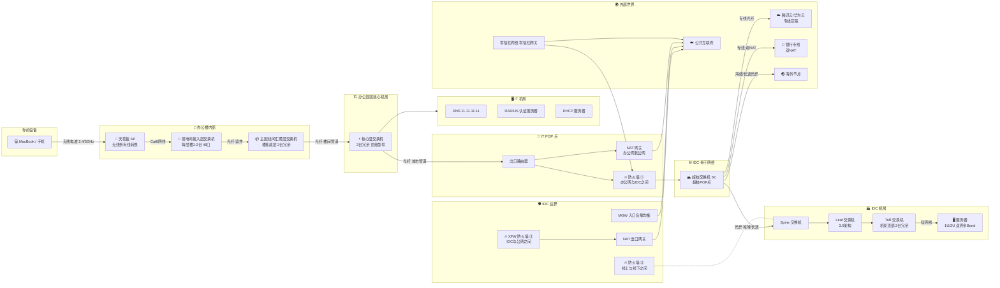

---

## 图二：办公楼内部三层架构——你的包怎么走出大楼

> 从你按下回车到数据包离开办公楼，经过的每一台物理设备和它们所在的物理位置。

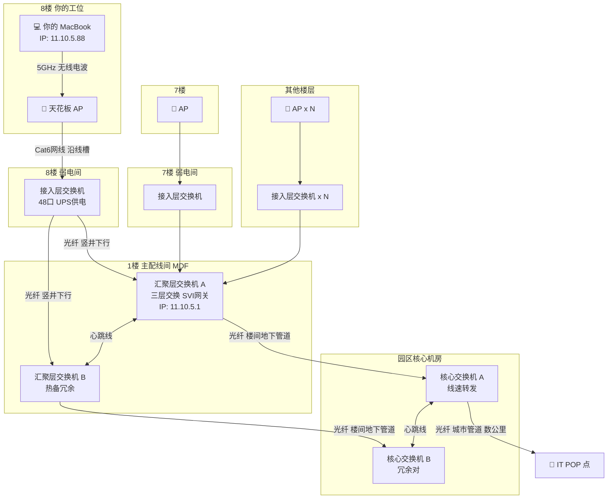

---

## 图三：IDC 机房内部设备层次——一棵胖树

> 机房内部从服务器到超核的完整设备层次。左侧是 2.0 架构（三层），右侧是 3.0/4.0 架构（四层 Leaf-Spine）。

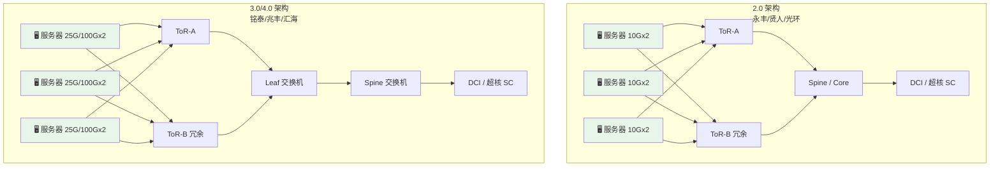

---

## 图四：跨机房双星拓扑——北京地区全局互联

> 所有机房通过两个超核 POP 点互联，形成双星结构。每条连线代表**异路双线光纤**（四纤四路由）。

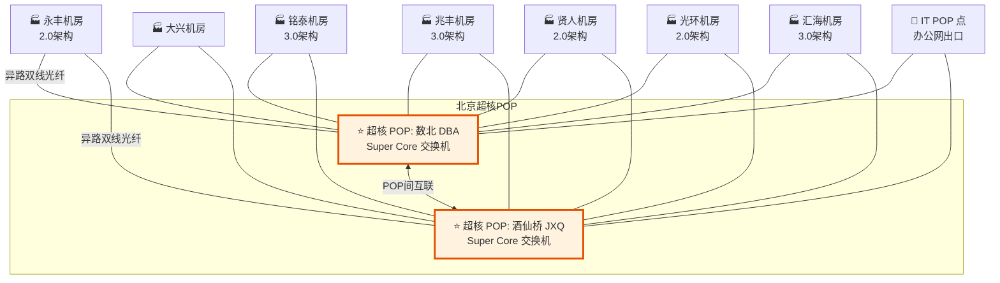

---

## 图五：跨地域互联——北京 / 上海 / 怀来 / 海外

> 地域之间通过运营商长途光缆互联，不同线路有不同的物理路径和延迟。

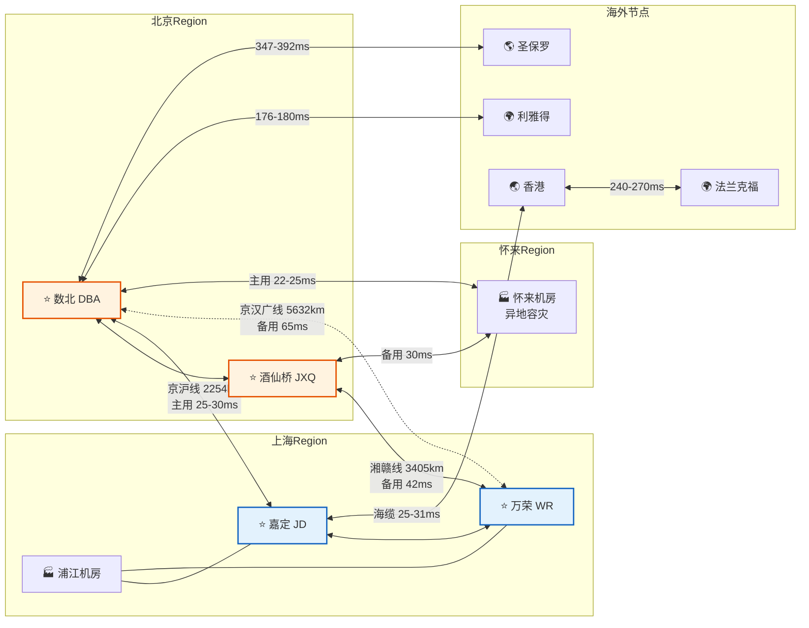

---

## 图六：三道防火墙的物理部署位置

> 三道防火墙分别守在三个网络区域的边界上，加上公网出入口的 MGW/NAT 设备。

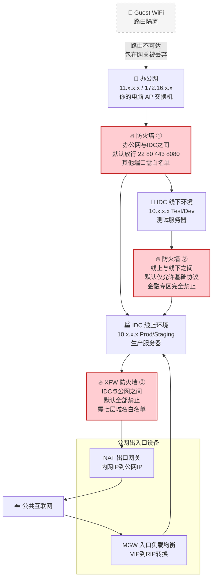

---

## 图七：公网出入口 IP 映射全景——MGW / NAT / 专线 NAT

> 公网流量进出 IDC 时经过的设备和 IP 地址转换过程。

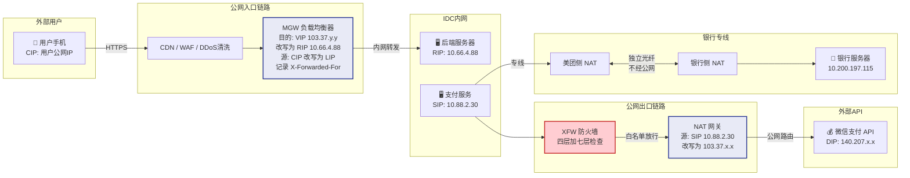

---

## 图八：端到端完整物理路径——一次请求经过的所有物理设备

> 你在工位上打开 docs.sankuai.com，数据包从出发到返回，按真实顺序经过的每一台物理设备。

```mermaid
graph LR
    A["💻 MacBook\nWiFi网卡"] -->|"① 5GHz无线电波"| B["📡 天花板AP\n无线到有线"]
    B -->|"② Cat6网线\n沿线槽几十米"| C["🔌 接入层交换机\n8楼弱电间"]
    C -->|"③ 光纤\n楼内竖井"| D["📦 汇聚层交换机\n1楼主配线间\n网关 11.10.5.1"]
    D -->|"④ 光纤\n楼间管道"| E["⚡ 核心层交换机\n园区核心机房"]
    E -->|"⑤ 光纤\n城市管道 数公里"| F["🚪 出口路由器\nIT POP点"]
    F -->|"⑥ 串联通过"| G["🔥 防火墙\n检查IP加端口443"]
    G -->|"⑦ 光纤"| H["🏔️ 超核SC\nPOP点 DBA/JXQ"]
    H -->|"⑧ 光纤\n城域网络"| I["Spine\n目标机房"]
    I -->|"⑨"| J["Leaf"]
    J -->|"⑩"| K["ToR\n机架顶部"]
    K -->|"⑪ 短网线\n机架内部"| L["🖥️ 目标服务器\n10.65.1.100"]

    style A fill:#e8f5e9
    style L fill:#e8f5e9
    style G fill:#ffcdd2,stroke:#c62828,stroke-width:2px
    style H fill:#fff3e0,stroke:#e65100,stroke-width:2px
```

---

## 图九：所有物理设备分类速查

> 按物理位置和功能分类，列出你在这套网络里会遇到的所有物理设备类型。

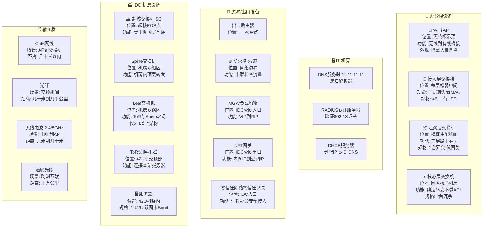

> 这九张图覆盖了公司网络中你能接触到的所有物理设备——从你桌上的 MacBook，到天花板上的 AP，到弱电间里的交换机，到埋在地下管道里的光纤，到另一个城市机房里的服务器。下次你打开一个页面觉得慢的时候，不妨想想：这个请求经过了图八里的几台设备？卡在了哪一跳？是防火墙的规则检查慢了，还是跨了一次京沪光缆多了 25 毫秒？网络不再是黑盒子，它是你能看懂的一条条物理链路。


---

## 附录六：容器网络、IPv6 双栈与 SD-WAN —— 美团内部实践深度解析

> 前面的正文和附录从物理链路一直讲到了逻辑隧道，覆盖了传统意义上"网络"的绝大部分版图。但 2020 年之后，美团的网络发生了三件大事：**第一**，几乎所有业务都跑进了容器，传统的"一机一 IP"模型被彻底打破，每台物理机上要同时管好几十甚至上百个容器的网络栈；**第二**，IPv4 地址空间告急，公司启动了 IPv6 双栈改造，从内核到 CNI 插件到上层业务全链路适配；**第三**，线下几万家门店、仓库、IT 办公室需要安全、稳定地接入中心云，传统 MPLS 专线太贵太慢，自研的 SD-WAN 产品 SAG（Smart Access Gateway）应运而生。这三件事，正好补全了"云原生时代"网络架构最后的拼图。

### 第一部分：容器网络 —— 从 Bridge CNI 到 MNIC 智能网卡再到 eBPF

#### 1.1 为什么容器网络是个独立课题

在没有容器的年代，一台物理服务器就一个操作系统、一个网络命名空间（Network Namespace）、一个 IP，网络管理相对简单。但容器化之后，一台 512 核的物理机上可能同时跑着 100 多个容器，每个容器都需要独立的 IP、独立的网络栈、独立的路由规则，还要能和其他宿主机上的容器通信——这就是 Hulk 给 CNI（Container Network Interface）插件提出的核心需求。

美团的容器平台叫 **Hulk**（对，就是绿巨人那个名字），截至 2024 年，公司整体容器化率超过 97%，线上运行着 **55 万+** 富容器（功能完整的大容器）和 **1.1 万+** 轻容器（Sidecar 等辅助容器）。这个规模意味着 CNI 插件不只是一个"能用就行"的基础组件，它直接决定了网络性能的上限和运维的复杂度。

#### 1.2 Bridge CNI：经典方案与它的瓶颈

美团最早的容器网络方案是 **Bridge CNI**，原理和 Docker 默认的 bridge 模式非常相似，但做了深度定制。它的数据路径是这样的：

**物理层面**：每台宿主机的物理网卡（比如 eth0）连着 ToR（Top of Rack）交换机，这是容器流量出宿主机的唯一物理出口。

**软件层面**：宿主机内核里创建一个 Linux Bridge（桥接设备），命名为 **br0**。每当 Kubelet 调用 CNI 插件创建一个新 Pod 时，插件会做三件事——第一，创建一对 **veth pair**（虚拟以太网对），一端放进 Pod 的网络命名空间里命名为 eth0，另一端挂到 br0 上；第二，从 IPAM（IP Address Management）模块为这个 Pod 分配一个 IP，这个 IP 来自宿主机被分配到的 **/26 子网**（也就是最多 64 个地址，刨去网络地址和广播地址后实际可用 **61 个**）；第三，在 Pod 内部配好默认路由指向 br0 的 IP，在宿主机上配好指向 Pod IP 的路由。

**Pod 间通信**：同一台宿主机上的两个 Pod 通信，数据包从 Pod A 的 eth0（veth 一端）出发，经过 br0 直接转发到 Pod B 的 veth 另一端，全程在内核态完成，不经过物理网卡。跨宿主机通信时，数据包从 br0 经过宿主机的路由表转发到 eth0，由物理网卡发出到 ToR 交换机，ToR 交换机根据路由表（这些路由是宿主机通过 BGP 或静态路由宣告上去的）把包转发给目标宿主机，再由目标宿主机的 br0 交给目标 Pod。

**路由管理**：这里有个关键设计——每台宿主机被分到的 /26 子网，是 ToR 交换机"知道"的。也就是说，ToR 交换机上配了一条路由："这个 /26 子网的流量，下一跳是这台宿主机的 eth0 IP。"这种**基于 ToR 交换机做路由隔离**的设计，避免了每个 Pod IP 都要在全网通告，大幅降低了路由表的规模。

Bridge CNI 的优点是成熟稳定、原理简单、和标准 Linux 网络栈完全兼容。但它的瓶颈也很明显——所有容器的网络流量都要经过宿主机内核的 Linux Bridge 和 iptables/netfilter 规则链，在高吞吐场景下（比如大数据任务或高并发 RPC 调用），内核网络栈会成为性能瓶颈，CPU 花在网络转发上的开销显著上升。

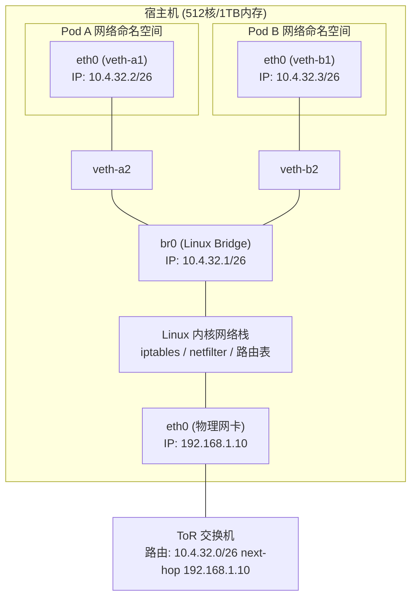

#### 1.3 MNIC 智能网卡：硬件加速的破局

为了解决 Bridge CNI 在高吞吐场景下的性能问题，美团网络团队自研了 **MNIC（美团 NIC）智能网卡系统**。MNIC 的核心思路是把网络转发从 CPU 卸载（offload）到智能网卡硬件上，用 **SR-IOV（Single Root I/O Virtualization）** 技术让每个容器直接绑定一个硬件虚拟网卡（VF，Virtual Function），数据包不再经过宿主机内核的 Bridge 和 iptables，而是直接在网卡硬件上完成转发。

SR-IOV 的原理是这样的：一块支持 SR-IOV 的物理网卡（PF，Physical Function）可以虚拟出多个 VF，每个 VF 在操作系统看来就像一块独立的网卡。Hulk 通过 Device Plugin 机制把 VF 作为一种"设备资源"暴露出来，Pod 在调度时声明需要一个 VF，Kubelet 就会为它分配一个 VF 并直通到 Pod 的网络命名空间里——这就是所谓的 **硬件直通（passthrough）**。

MNIC 方案的性能提升非常显著：由于数据包不再经过宿主机内核的软件协议栈，网络延迟大幅降低，吞吐量接近物理网卡的线速。尤其适合两类场景——一是**虚拟机**（美团内部仍有部分业务跑在 KVM 虚拟机里），VF 直通给虚拟机后，虚拟机的网络性能几乎等于物理机；二是**对网络性能要求极高的容器**，比如分布式存储节点、大数据计算节点等。

但 MNIC 也有局限性：一块物理网卡能虚拟出的 VF 数量是有限的（通常几十到一百多个），当一台宿主机上的容器密度超过 100 个时，VF 资源会成为瓶颈。另外，SR-IOV 的 VF 分配和回收涉及硬件层面的操作，灵活性不如纯软件方案。

#### 1.4 eBPF CNI：软件加速的新路径

针对 MNIC 在**超高密度容器场景**（一台机器跑 100+ 个容器）下 VF 资源不够用的问题，美团又研发了基于 **eBPF（Extended Berkeley Packet Filter）** 的 CNI 方案。

eBPF 是 Linux 内核提供的一种"可编程数据平面"技术——简单说，你可以写一小段程序（eBPF 程序），把它注入到内核网络栈的关键路径上（比如 TC ingress/egress、XDP 等挂载点），让这段程序在内核态高速执行网络包的转发、过滤、修改等操作，而不需要经过传统的 iptables/netfilter 规则链。

eBPF CNI 的数据路径和 Bridge CNI 类似，仍然使用 veth pair 连接 Pod 和宿主机，但**取消了 br0 这个 Linux Bridge**，转发逻辑完全由 eBPF 程序实现。同一宿主机上 Pod 间的通信，eBPF 程序直接在 TC 层把数据包从一个 veth 重定向到另一个 veth，跳过了 Bridge 转发和 iptables 规则匹配，性能比 Bridge CNI 提升明显。跨宿主机通信时，eBPF 程序做完必要的处理后把包交给物理网卡发出，路径也比传统方案更短。

eBPF CNI 的优势在于**纯软件方案、不依赖特定硬件、支持高密度容器部署**。它的单位性能提升虽然不如 MNIC 的硬件直通那么极致，但对于"容器数量多但单个容器吞吐量要求不极端"的场景（比如微服务、Web 应用），是性价比最高的选择。

#### 1.5 三种方案的混合部署：512 核大机型的实战策略

在美团的实际生产环境中，这三种 CNI 方案并不是互斥的，而是**根据机型和业务场景混合部署**。最典型的例子是 **512 核大机型**（通常是 4 路或 8 路服务器，配备大量内存和多块物理网卡）：

这类超大机型上通常同时跑着虚拟机和容器。虚拟机使用 **MNIC（SR-IOV VF 直通）** 方案，确保虚拟机内的业务获得接近物理机的网络性能。容器则使用 **eBPF CNI** 方案，因为容器数量可能超过 100 个，VF 资源不够分，而 eBPF 方案没有硬件资源的数量限制。两种方案共存在同一台物理机上，由 Hulk 平台的调度系统根据 Pod 的类型自动选择对应的 CNI 插件。

对于容器密度不高（比如一台机器只跑十几二十个容器）的普通机型，**Bridge CNI** 仍然是默认方案，因为它最成熟稳定，运维成本最低。

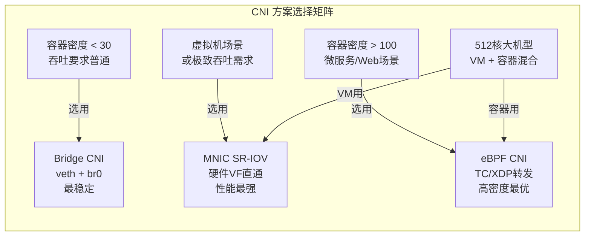

#### 1.6 IPAM 与路由：容器 IP 怎么分配和管理

不管用哪种 CNI 方案，IP 地址的分配和管理都是由 **IPAM（IP Address Management）** 模块统一负责的。美团的 IPAM 设计有几个关键点：

**子网分配**：每台宿主机从网络管理平台获得一个 **/26 子网**（64 个 IP，可用 61 个）。这个子网和宿主机的 ToR 交换机端口绑定，ToR 交换机上配一条路由指向这个子网。Pod 创建时，IPAM 模块从这个 /26 子网中分配一个未使用的 IP 给 Pod。

**路由隔离**：Pod 的 IP 不需要在整个数据中心的所有交换机上通告——只需要 ToR 交换机知道"这个 /26 子网下一跳是这台宿主机"就够了。这种设计让路由表的规模保持在可控范围内，不会因为容器数量增长而爆炸。

**IP 回收与复用**：Pod 被销毁后，它的 IP 会被回收到 IPAM 的可用池中，供后续新建的 Pod 使用。但这里有一个细节——为了避免 IP 复用导致的"幽灵流量"（旧连接的数据包被新 Pod 收到），IPAM 会设置一个短暂的**冷却期**，IP 回收后不会立即被重新分配。

### 第二部分：IPv6 双栈改造 —— 从 IaaS 到业务的全链路适配

#### 2.1 为什么要做 IPv6

美团要做 IPv6 双栈改造，核心驱动力是 **IPv4 地址空间不够用了**。公司内部 RFC 1918 私有地址池（10.0.0.0/8、172.16.0.0/12、192.168.0.0/16）能提供的地址总量大约 1760 万个，听起来很多，但当你有 55 万个容器、每个容器都需要独立 IP、加上虚拟机、物理机、网络设备本身也要 IP 时，地址池的消耗速度远超预期。更重要的是，国家政策层面也在大力推动 IPv6 部署，运营商和云服务商都在加速 IPv6 化。

#### 2.2 四阶段改造路线图

美团的 IPv6 双栈改造分为**四个阶段**推进，这个路线图体现了"先基础设施、再上层业务"的务实思路：

**第一阶段：IaaS 双栈就绪**。目标是让底层基础设施——物理机、虚拟机、容器、负载均衡器、DNS 等——都具备同时支持 IPv4 和 IPv6 的能力。具体到容器网络，就是修改 CNI 插件（不管是 Bridge、MNIC 还是 eBPF 方案），让它在为 Pod 创建网络时同时配置 IPv4 和 IPv6 地址；修改 IPAM 模块，让它同时管理 IPv4 和 IPv6 的地址池；修改宿主机的路由配置，让 ToR 交换机同时通告 IPv4 和 IPv6 路由。

**第二阶段：业务适配**。让上层业务——各种微服务、中间件、RPC 框架（如 MTThrift、Pigeon）——能够正确处理 IPv6 地址。这一步的挑战在于很多业务代码里硬编码了 IPv4 地址格式的假设（比如用正则匹配 IP），需要逐个排查和修改。服务注册与发现系统也需要改造，让服务在注册时同时上报 IPv4 和 IPv6 地址，调用方可以根据网络条件选择使用哪个地址族。

**第三阶段：存量 IDC 改造**。对现有数据中心的网络设备（交换机、路由器、防火墙等）进行 IPv6 配置，确保设备的控制平面和数据平面都能正确处理 IPv6 流量。这一步涉及大量的设备配置变更，需要分批次、分机房逐步推进，避免大规模变更带来的风险。

**第四阶段：新建 IDC 全 IPv6**。新建的数据中心从设计阶段就以 IPv6 为主（IPv6-only 或 IPv6-preferred），IPv4 只作为兼容性保留。这是最终目标——当所有新 IDC 都是 IPv6 优先时，旧 IDC 的 IPv4 地址池压力就会逐步缓解。

#### 2.3 CNI 插件的双栈改造细节

在容器网络层面，IPv6 双栈改造的核心工作集中在 CNI 插件和 IPAM 模块上。

**CNI 插件改造**：以 Bridge CNI 为例，原来创建 veth pair 后只配一个 IPv4 地址，改造后需要同时配 IPv4 和 IPv6 两个地址。具体操作是在 Pod 的 eth0 上同时绑定一个 IPv4 地址（比如 10.4.32.2/26）和一个 IPv6 地址（比如 fd00::4:32:2/120），然后在 Pod 内同时配好 IPv4 和 IPv6 的默认路由。br0 上也要同时有 IPv4 和 IPv6 的网关地址。

**IPAM 模块改造**：原来 IPAM 只管一个 IPv4 的 /26 子网池，改造后需要同时管理一个 IPv4 子网池和一个 IPv6 子网池。Pod 创建时同时分配两个地址，Pod 销毁时同时回收两个地址。IPv6 地址空间远大于 IPv4（一个 /64 子网就有 2^64 个地址），所以 IPv6 子网的分配粒度和 IPv4 不同，通常给每台宿主机分配一个 /120 或 /112 的 IPv6 子网。

**Hulk 集群的双栈支持**：Hulk 从 1.20 版本开始正式支持双栈（Dual-Stack）网络，Service 可以同时拥有 IPv4 和 IPv6 的 ClusterIP。美团的 Hulk 平台在 2023 年完成了双栈 K8s 集群的交付，新创建的集群默认启用双栈。

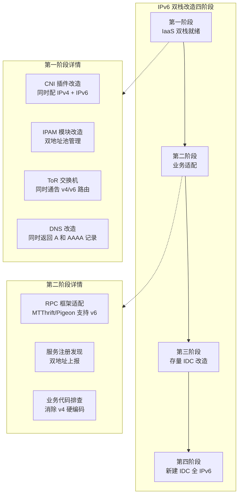

### 第三部分：SAG 智能接入网关 —— 美团自研 SD-WAN 的边缘实践

#### 3.1 边缘节点的网络困境

美团的业务不只是在数据中心里跑，还有大量的**边缘节点**需要接入中心云：餐饮 SaaS 门店（几万家合作餐厅的收银系统、厨房显示屏）、前置仓和配送站（生鲜电商、社区团购的仓储系统）、IT 办公室（各城市分公司的办公网络）、甚至无人配送车和无人机。

这些边缘节点的网络环境和数据中心完全不同——它们通常只有运营商的普通宽带（电信、联通、移动），没有 MPLS 专线；网络质量不稳定，丢包、延迟抖动是家常便饭；设备分散在全国各地，现场没有专业网络工程师维护；安全要求很高，门店收银数据、配送路线数据都属于敏感信息，不能在公网上裸跑。

传统方案是给每个门店拉一条 MPLS 专线，但成本极高（一条专线每月数千到上万元，乘以几万家门店就是天文数字），而且开通周期长（通常 1-3 个月），完全无法满足业务快速扩张的需求。

#### 3.2 SAG 的设计哲学

**SAG（Smart Access Gateway，智能接入网关）** 是美团网络团队自研的 SD-WAN 产品，专门用于解决边缘节点的网络接入问题。它的设计哲学可以用一句话概括：**用白盒硬件 + 软件定义的 overlay 隧道，在廉价的运营商宽带上构建企业级的安全组网。**

**白盒硬件**：SAG 的硬件设备不是思科或华为的高端路由器，而是基于通用 x86 或 ARM 芯片的低成本白盒设备。一台 SAG 设备可能就是一个小型的工控机，成本只有传统专线设备的几分之一。设备出厂时预装了美团自研的网络操作系统，支持即插即用——门店工作人员只需要把设备通电、插上网线，设备会自动通过 DHCP 获取 IP，然后向中心云的 SAG 控制器注册自己，整个过程不需要任何手动配置。

**Overlay 隧道**：SAG 设备和中心云之间通过 **IPsec 或 VXLAN over IPsec 隧道**建立加密连接。所有门店到云的流量都走这条隧道，在公网上是加密的，即使被中间人截获也无法解密。隧道的建立、维护、故障切换都由 SAG 控制器集中管理。

**多链路聚合与智能选路**：一个门店可能有两条宽带（比如一条电信、一条联通），SAG 设备可以同时利用这两条链路，根据实时的链路质量（延迟、丢包率、带宽利用率）动态选择最优链路转发流量。如果一条链路故障，流量会自动切换到另一条链路，业务几乎感知不到中断。

**集中管控**：所有 SAG 设备的配置、状态、告警都通过中心云的 SAG 控制平面（Controller）统一管理。网络工程师坐在北京的办公室里，就可以通过 Web 控制台看到全国几万家门店的 SAG 设备状态，远程推送配置变更，排查网络故障——不需要派人去现场。

#### 3.3 SAG 覆盖的五大场景

根据内部文档，SAG 目前覆盖了五大类边缘接入场景：

**餐饮 SaaS 门店**：合作餐厅的收银系统、排队叫号系统、厨房显示系统等，通过 SAG 设备接入美团云，保证交易数据的安全传输和系统的高可用。

**前置仓和配送站**：生鲜电商、社区团购的仓储管理系统、拣货系统、配送调度系统等，对网络延迟和稳定性有较高要求，SAG 的多链路聚合和故障切换能力在这里发挥重要作用。

**IT 办公室**：各城市分公司的办公网络，员工通过 SAG 接入公司内网，访问内部系统。这个场景和传统的 Site-to-Site VPN 类似，但 SAG 提供了更灵活的策略管理和更好的用户体验。

**无人配送车和无人机**：这是一个新兴场景，无人车和无人机通过 4G/5G 网络接入美团云端的调度系统，SAG 需要处理移动场景下的频繁切换和网络抖动。

**智慧楼宇与 IoT**：美团自有办公楼和合作物业的智能设备（门禁、摄像头、传感器等），通过 SAG 统一接入云端管理平台。

#### 3.4 SAG 的技术架构

SAG 的整体架构可以分为三层：

**设备层（CPE）**：部署在边缘节点的白盒硬件设备，运行美团自研的网络操作系统。设备具备多 WAN 口，可以同时接入多条运营商链路（电信、联通、移动），实现链路聚合和故障切换。设备上运行 Overlay 隧道协议（通常是 VXLAN 或 IPsec），将边缘节点的流量封装后通过公网传输到中心云。

**控制层（Controller）**：中心化的控制平面，负责设备的配置下发、隧道的建立和维护、路由策略的计算和分发。控制器采用分布式架构，支持大规模设备的管理。运维人员通过控制器的 Web 界面或 API 进行设备的批量配置和监控。

**云端接入层（POP）**：部署在美团各大 IDC 的接入点，是 SAG 隧道的终结点。POP 节点负责解封装 Overlay 流量，将其路由到美团内部网络。POP 节点通常和美团的骨干网直连，保证低延迟。

一个典型的数据流：门店收银机发出一笔交易请求 → SAG 设备将请求封装在 VXLAN 隧道中 → 通过运营商公网传输到最近的 POP 节点 → POP 解封装后将请求路由到美团内网的交易处理系统 → 响应原路返回。整个过程对应用透明，应用感知不到底层网络的复杂性。

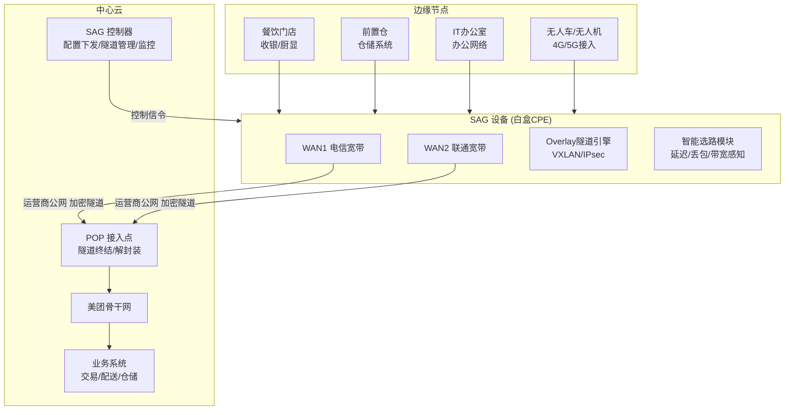

#### 3.5 SAG vs 传统 VPN

相比传统的 IPsec VPN 方案，SAG 有几个显著优势：

**零接触部署**：传统 VPN 需要专业人员到现场配置设备，SAG 设备支持即插即用，设备上电后自动连接控制器获取配置，大幅降低了部署成本——这对于有数万家门店的美团来说至关重要。

**智能选路**：传统 VPN 通常是单链路，SAG 可以根据链路质量实时切换最优路径，比如当电信链路延迟升高时自动切换到联通链路。

**集中管控**：所有设备的配置、监控、故障排查都可以在控制器上完成，不需要逐台设备登录操作。

**与云网络深度集成**：SAG 和美团的 VPC、安全组、负载均衡等云网络服务无缝集成，而传统 VPN 通常是一个孤立的连接。

### 第四部分：三大技术的协同关系

容器网络、IPv6 双栈、SD-WAN 这三项技术并不是孤立存在的，它们在美团的网络体系中相互配合：

**容器网络 + IPv6 双栈**：随着容器规模的爆发式增长（55 万+ Pod），IPv4 地址空间的压力越来越大。IPv6 的 128 位地址空间从根本上解决了这个问题。目前美团已经在容器网络的 CNI 插件中实现了 IPv6 双栈支持，新创建的 Pod 同时获得 IPv4 和 IPv6 地址。

**容器网络 + SD-WAN**：边缘场景（如门店）的应用也在逐步容器化，SAG 设备需要能够正确处理容器网络的 Overlay 流量。在一些前置仓场景中，本地也会运行轻量级的 K8s 集群，SAG 负责将这些边缘集群和中心集群的网络打通。

**IPv6 + SD-WAN**：随着运营商网络全面支持 IPv6，SAG 的隧道也在从 IPv4 向 IPv6 迁移，这可以简化 NAT 配置，提高传输效率。

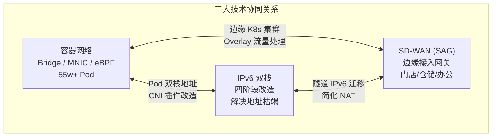

### 本章总结

| 技术领域 | 核心问题 | 美团方案 | 关键数据 |
|---------|---------|---------|----------|
| 容器网络 | 海量 Pod 的高性能网络连接 | Bridge CNI + MNIC 智能网卡 + eBPF | 55w+ 富容器，1.1w+ 轻容器 |
| IPv6 双栈 | IPv4 地址枯竭 + 未来网络演进 | 四阶段推进，CNI 插件改造 | IaaS 层双栈已交付 |
| SD-WAN | 海量边缘节点的安全高效接入 | SAG 智能接入网关 | 覆盖门店、仓储、办公等场景 |

这三项技术代表了美团网络基础设施的三个演进方向：**容器网络解决的是云上计算密度的问题，IPv6 解决的是地址空间和未来兼容性的问题，SD-WAN 解决的是云边协同的问题**。它们共同构成了美团下一代网络架构的基础。

> 如果说前面十四章讲的是「美团的网络长什么样」，这一章讲的是「美团的网络正在变成什么样」。容器让一台物理机上跑出几十上百个独立网络身份，IPv6 让地址空间不再是瓶颈，SD-WAN 让几万家门店像插上网线一样接入美团的云。网络基础设施的进化，最终是为了让业务跑得更快、更稳、更安全。


---

## 附录七：路由寻址与下一跳判断——从原理到实践的完整讲解

> 本章系统讲解 IP 路由的核心机制：一个数据包从源到目的地，每一跳是怎么决定的？路由表怎么来的？什么是动态路由？为什么需要它？读完本章，你将彻底理解"数据包在网络中是怎么一跳一跳走到目的地的"这个根本问题。

---

### 一、先搞清一个根本问题：谁在做路由决策？

网络中的每一台设备（终端主机、路由器、三层交换机）都有路由表，都会做路由决策。但它们的角色不同：

**终端主机（你的电脑/手机/服务器）做的事情很简单：**

1. 拿目标 IP 和自己的子网掩码做"与运算"
2. 判断目标是否在同一子网
3. 如果在同一子网 → 直接 ARP 查目标 MAC → 二层直达
4. 如果不在同一子网 → 把包交给默认网关 → 让网关去操心后面的路

**中间设备（路由器/三层交换机）做的事情复杂得多：**

1. 收到数据包，剥掉二层帧头
2. 读取目标 IP 地址
3. 在路由表中做**最长前缀匹配（Longest Prefix Match）**
4. 找到匹配条目 → 确定出接口 + 下一跳 IP
5. ARP 查下一跳的 MAC 地址
6. 重新封装二层帧头（源 MAC 改成自己出口的 MAC，目的 MAC 改成下一跳的 MAC）
7. 从对应接口转发出去

**关键区别：终端只需要知道"交给谁"（网关），路由器需要知道"往哪走"（路由表查询）。**

---

### 二、路由表长什么样？

一条路由表条目包含以下关键字段：

```
目的网段          子网掩码            下一跳            出接口        优先级/度量值    来源
10.4.0.0         255.255.0.0        10.1.1.2         eth0          110/20          OSPF
172.16.5.0       255.255.255.0      172.16.1.1       eth1          100/0           Static
0.0.0.0          0.0.0.0            10.1.1.1         eth0          60/0            Default
192.168.1.0      255.255.255.0      直连              eth2          0/0             Connected
```

各字段的含义：

- **目的网段 + 子网掩码**：描述"这条路由能覆盖哪些目标地址"
- **下一跳**：数据包应该转发给谁（一个具体的 IP 地址）
- **出接口**：从自己的哪个物理/逻辑口发出去
- **优先级 / 度量值**：当有多条路径可达同一目的地时，用来选最优路径
- **来源**：这条路由是怎么学到的（直连、静态配置、还是动态路由协议学来的）

---

### 三、路由查找的核心算法：最长前缀匹配

假设路由表里有这几条：

```
10.0.0.0/8       → 下一跳 A
10.4.0.0/16      → 下一跳 B  
10.4.5.0/24      → 下一跳 C
0.0.0.0/0        → 下一跳 D（默认路由）
```

现在来了一个目标地址 `10.4.5.100`，路由器怎么查？

1. 和 `10.0.0.0/8` 匹配吗？`10.4.5.100 AND 255.0.0.0 = 10.0.0.0` ✅ 匹配，前缀长度 8
2. 和 `10.4.0.0/16` 匹配吗？`10.4.5.100 AND 255.255.0.0 = 10.4.0.0` ✅ 匹配，前缀长度 16
3. 和 `10.4.5.0/24` 匹配吗？`10.4.5.100 AND 255.255.255.0 = 10.4.5.0` ✅ 匹配，前缀长度 24
4. 和 `0.0.0.0/0` 匹配吗？任何地址都匹配，前缀长度 0

**结果：选前缀最长的那条——`10.4.5.0/24 → 下一跳 C`**

这就是"最长前缀匹配"。为什么这样设计？因为前缀越长，描述的范围越精确。`/24` 只覆盖 256 个地址，比 `/8` 覆盖的 1600 万个地址精确得多。**越精确的路由优先级越高**，这样可以实现灵活的流量导向。

#### 最长前缀匹配的实际意义

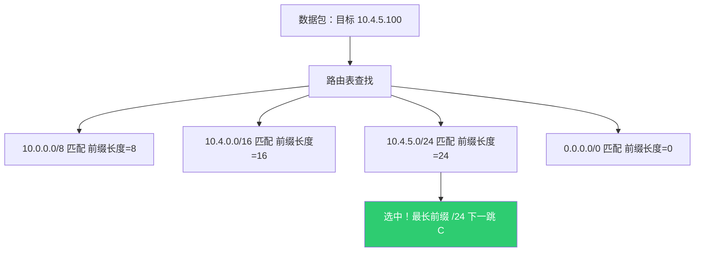

---

### 四、路由表是怎么来的？三种路由来源

路由表里的条目不是凭空出现的，有三种来源：

#### 4.1 直连路由（Connected）

当你给交换机/路由器的某个接口配上 IP 地址并 `up` 之后，设备自动知道"这个接口直接连着这个网段"。

```
比如 eth0 配了 10.4.5.1/24
自动产生路由：10.4.5.0/24 → 直连 via eth0
```

这是最基本的路由，不需要任何配置，只要接口有 IP 就有。

#### 4.2 静态路由（Static）

网络管理员手工配置的路由条目：

```bash
# Linux 写法
ip route add 172.16.0.0/16 via 10.4.5.254

# 思科交换机写法
ip route 172.16.0.0 255.255.0.0 10.4.5.254
```

意思是："凡是去 172.16.0.0/16 这个网段的包，统统交给 10.4.5.254 这个下一跳"。

**静态路由的优点：** 简单、确定、不消耗 CPU/带宽、安全（不会被别人的路由通告影响）。

**静态路由的缺点：** 网络拓扑变了（比如某条链路断了），静态路由不会自动调整，包还是会往断掉的方向发，直到管理员手动修改。

**适用场景：** 小型网络、末梢网段（只有一个出口的网段）、默认路由。

#### 4.3 动态路由（Dynamic）

路由器之间通过**路由协议**互相交换信息，自动学习整个网络的拓扑，自动计算最优路径，自动更新路由表。

这是大型网络（如美团 IDC、校园网核心、运营商骨干网）的命脉。下面重点讲。

---

### 五、动态路由协议详解

#### 5.1 为什么需要动态路由？

想象美团有几十个 IDC，每个 IDC 内部有上千台交换机，互相之间有复杂的连接关系。如果全靠人手工写静态路由：

1. **工作量恐怖**：几万条路由，人工写完还没写完网络已经变了
2. **无法应对故障**：一条链路断了，静态路由不会自动切换到备份路径，业务直接中断
3. **无法应对扩容**：新加一个机架/一个网段，所有相关设备都要人工加路由

动态路由协议就是让路由器"自己学会网络长什么样"，并且"链路挂了能自动绕路"。

#### 5.2 动态路由的基本工作原理

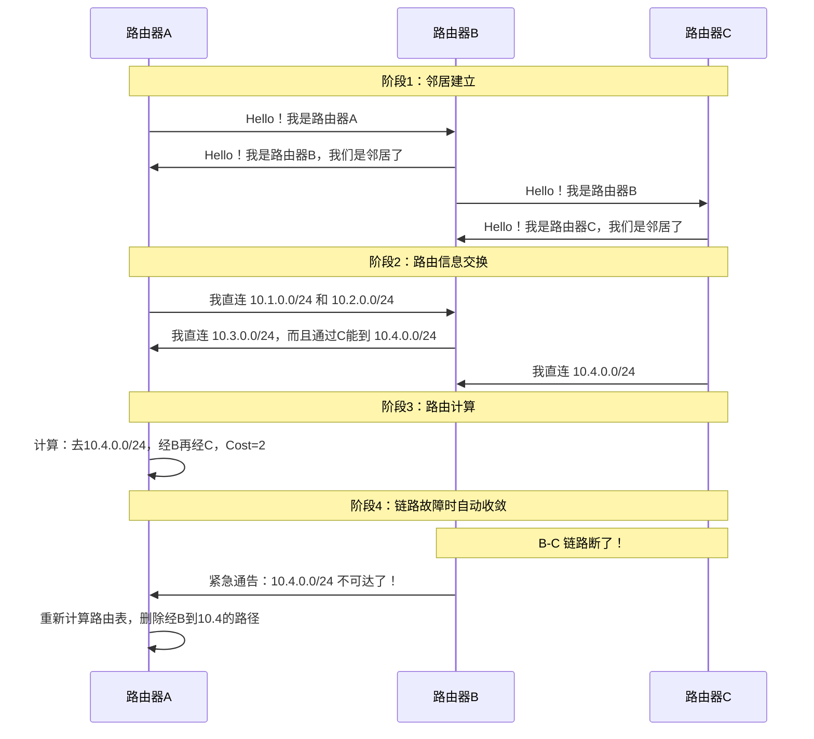

所有动态路由协议都遵循这个基本流程：**发现邻居 → 交换信息 → 计算路径 → 持续监控 → 故障收敛**。

#### 5.3 两大类动态路由协议

动态路由协议分为两大流派，底层思想完全不同：

##### 距离矢量（Distance Vector）—— "我听说隔壁怎么走"

**代表协议：RIP、EIGRP**

核心思想：每台路由器把自己知道的路由表（目的地 + 距离）发给直接邻居，邻居收到后加上到发送者的距离，形成自己的路由表。

类比：你问室友"去图书馆怎么走？"，室友说"往东走 3 个路口"。你记下"图书馆：向东，距离 = 3 + 1（到室友那里）= 4"。

```
路由器B告诉路由器A：
  "我到 10.4.0.0/24 的距离是 1"
路由器A计算：
  "我到B的距离是 1，B到目标的距离是 1，所以我到目标的距离是 2"
  加入路由表：10.4.0.0/24，下一跳 B，距离 2
```

**优点：** 实现简单、配置简单、对设备性能要求低。

**缺点：** 收敛慢（链路故障后需要多轮传播才能让所有路由器知道）、容易产生路由环路、只能看到"距离"看不到完整拓扑。

**RIP 的具体参数：**
- 距离度量：跳数（Hop Count），最大 15 跳，16 跳视为不可达
- 更新间隔：每 30 秒广播一次完整路由表
- 收敛时间：分钟级（这在现代网络中完全不可接受）

##### 链路状态（Link State）—— "我知道整个地图"

**代表协议：OSPF、IS-IS**

核心思想：每台路由器把自己"和谁相连、链路状态如何"这个信息（LSA, Link State Advertisement）洪泛给网络中的所有路由器。这样每台路由器都拥有完整的网络拓扑图，然后各自用 SPF（最短路径优先，Dijkstra 算法）计算到每个目的地的最优路径。

类比：所有人把自己的位置和周围道路状况发到群里，每个人都拿到一张完整的地图，然后自己用导航算路。

```
路由器A洪泛 LSA：
  "我是A，我连着B（Cost=10）和C（Cost=5）"
路由器B洪泛 LSA：
  "我是B，我连着A（Cost=10）和D（Cost=3）"
路由器C洪泛 LSA：
  "我是C，我连着A（Cost=5）和D（Cost=8）"

每台路由器收集所有LSA后，用Dijkstra算法计算：
A到D的最短路径：A-B-D (Cost=13) vs A-C-D (Cost=13) 等价多路径(ECMP)
```

**优点：** 收敛快（毫秒到秒级）、无环路、能看到完整拓扑、支持等价多路径负载均衡（ECMP）。

**缺点：** 实现复杂、消耗更多内存和 CPU（要存完整拓扑数据库）、配置相对复杂。

---

### 六、重点协议深度解析

#### 6.1 OSPF（Open Shortest Path First）

OSPF 是美团网和 IDC 内部最常用的动态路由协议，美团 IDC 内部就大量使用 OSPF。

**核心概念：**

**Area（区域）：** OSPF 把网络划分为多个区域，减少每台路由器需要维护的拓扑数据量。所有区域必须连接到 Area 0（骨干区域）。

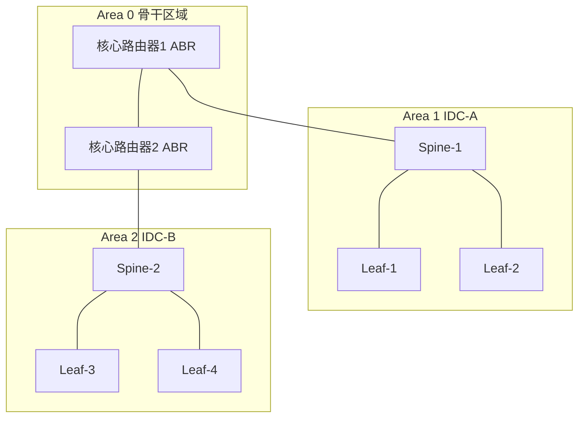

**Router 角色：**
- **Internal Router**：所有接口都在同一区域内的路由器
- **ABR（Area Border Router）**：连接两个以上区域的路由器，负责区域间路由汇总
- **ASBR（AS Boundary Router）**：连接 OSPF 域和外部路由域（如 BGP）的路由器

**Cost 计算：** OSPF 用接口带宽来计算 Cost。公式：`Cost = 参考带宽 / 接口带宽`

```
参考带宽默认 100Mbps：
  100Mbps 接口 Cost = 1
  1Gbps 接口   Cost = 0.1（取整为1，所以实际常调参考带宽为10Gbps或100Gbps）
  10Gbps 接口  Cost = 0.01

美团 IDC 中通常调整参考带宽为 100Gbps：
  100Gbps 接口 Cost = 1
  25Gbps 接口  Cost = 4
  10Gbps 接口  Cost = 10
```

**OSPF 工作过程：**

1. **邻居发现**：通过 Hello 包（默认每 10 秒发一次）发现直连邻居
2. **邻接建立**：交换数据库描述（DBD），确认双方数据库同步
3. **LSA 洪泛**：将自己的链路状态通告洪泛到整个区域
4. **SPF 计算**：收集所有 LSA 后，用 Dijkstra 算法算出到每个网段的最短路径
5. **路由安装**：把计算结果写入路由表
6. **持续维护**：链路状态变化时，立即洪泛新 LSA，触发重新计算

**收敛速度：** 链路故障后，OSPF 能在 1-10 秒内完成收敛（配合 BFD 快速检测可达到毫秒级）。

#### 6.2 BGP（Border Gateway Protocol）

BGP 是唯一的"域间路由协议"，负责互联网上不同自治系统（AS）之间的路由交换。美团的多个 IDC 之间、美团和运营商之间，都使用 BGP。

**为什么需要 BGP？**

OSPF/IS-IS 适合在一个"统一管理"的网络内部使用（比如一个公司、一个 IDC）。但是不同公司、不同运营商之间，需要：
- 控制路由策略（我不想让别人的流量经过我）
- 管理路由通告（我只告诉你我愿意让你访问的网段）
- 支持超大规模（全球互联网有 100 万+条路由，OSPF 的 Dijkstra 算法算不动）

BGP 就是为这些需求设计的。

**BGP 的两种模式：**
- **iBGP（internal BGP）**：同一个 AS 内部的 BGP 对等。美团多 IDC 互联用 iBGP
- **eBGP（external BGP）**：不同 AS 之间的 BGP 对等。美团和电信/联通/移动之间用 eBGP

**BGP 选路原则（简化版，按优先级从高到低）：**
1. 权重最高（本地配置，思科私有）
2. Local Preference 最高（域内优选）
3. 本地始发（自己 network 命令注入的）
4. AS-Path 最短（经过的自治系统最少）
5. Origin 类型（IGP > EGP > Incomplete）
6. MED 最小（多出口选择的度量值）
7. eBGP 优先于 iBGP
8. IGP 度量值最小（到下一跳的内部距离最短）

#### 6.3 美团网络中的路由协议使用

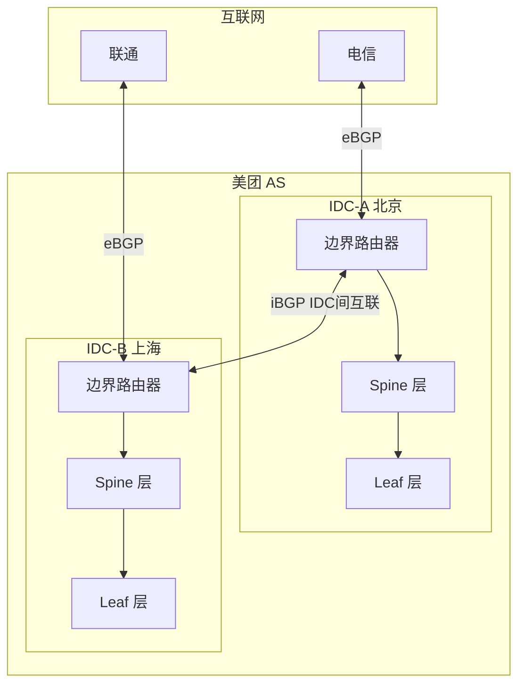

| 场景 | 使用协议 | 原因 |
|------|---------|------|
| IDC 内部（Leaf-Spine 之间） | OSPF 或 IS-IS | 快速收敛、ECMP、拓扑简单 |
| IDC 之间（美团内部跨城） | iBGP | 路由策略控制、大规模路由管理 |
| 美团与运营商之间 | eBGP | 标准域间路由协议 |
| IDC 到办公网 | OSPF + 路由重分发 | 办公网规模较小，用 OSPF 即可 |

---

### 七、完整转发流程：从头到尾走一遍

现在把所有知识串起来，看一个完整的数据包转发过程。

**场景：** 美团办公网的一台电脑（10.1.1.100/24）访问 IDC 中的一台服务器（10.4.5.200/24），中间经过三台路由设备。

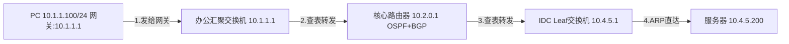

**第一步：PC 判断——目标不在本网段，发给网关**

```
PC 的配置：IP = 10.1.1.100，掩码 = 255.255.255.0（/24），网关 = 10.1.1.1
目标地址：10.4.5.200

计算：10.4.5.200 AND 255.255.255.0 = 10.4.5.0
本网段：10.1.1.100 AND 255.255.255.0 = 10.1.1.0
10.4.5.0 不等于 10.1.1.0 → 不在同一网段 → 发给默认网关 10.1.1.1
```

PC 查 ARP 表找到 10.1.1.1 的 MAC 地址（假设是 AA:AA:AA:AA:AA:01），封装二层帧：

```
帧头：源MAC=PC的MAC  目的MAC=AA:AA:AA:AA:AA:01（网关MAC）
IP头：源IP=10.1.1.100  目的IP=10.4.5.200（始终不变！）
```

**第二步：办公汇聚交换机——查路由表，转发给核心**

交换机收到帧，剥掉二层帧头，读取目的 IP = 10.4.5.200，查路由表：

```
路由表（通过 OSPF 学到）：
  10.1.1.0/24  → 直连 via vlan10
  10.4.0.0/16  → 下一跳 10.2.0.1 via uplink（OSPF学到的）
  0.0.0.0/0    → 下一跳 10.2.0.1 via uplink

匹配：10.4.0.0/16 命中（最长前缀匹配）
下一跳：10.2.0.1
```

交换机 ARP 查 10.2.0.1 的 MAC（假设是 BB:BB:BB:BB:BB:01），重新封装：

```
帧头：源MAC=交换机uplink口MAC  目的MAC=BB:BB:BB:BB:BB:01（核心路由器MAC）
IP头：源IP=10.1.1.100  目的IP=10.4.5.200（不变！）
```

**第三步：核心路由器——查路由表，转发给 IDC Leaf**

核心路由器收到，剥帧头，读目的 IP = 10.4.5.200，查路由表：

```
路由表（通过 OSPF + iBGP 学到）：
  10.2.0.0/24   → 直连
  10.4.5.0/24   → 下一跳 10.3.0.2 via IDC-link（OSPF学到的）
  10.4.0.0/16   → 下一跳 10.3.0.2 via IDC-link
  0.0.0.0/0     → 下一跳 x.x.x.x（指向互联网）

匹配：10.4.5.0/24 命中（比 /16 更长，优先选择）
下一跳：10.3.0.2（Leaf 交换机）
```

重新封装二层帧头发出。

**第四步：Leaf 交换机——直连网段，ARP 直达目标**

Leaf 交换机收到，读目的 IP = 10.4.5.200，查路由表：

```
路由表：
  10.4.5.0/24  → 直连 via server-port

匹配：10.4.5.0/24 直连
```

因为是直连网段，Leaf 直接 ARP 查 10.4.5.200 的 MAC 地址，然后二层直接送达服务器。

**全程关键点总结：**
- **IP 头中的源 IP 和目的 IP 全程不变**（NAT 除外）
- **每过一跳，二层帧头（MAC 地址）都会被重写**
- **每台设备独立做路由决策，只关心"下一跳是谁"，不关心最终目的地怎么到达**
- **路由表的内容来自 OSPF/BGP 等动态协议的计算结果**

---

### 八、路由收敛：链路故障时发生什么？

网络最重要的能力之一就是**故障自愈**。路由收敛指的是"网络拓扑发生变化后，所有路由器的路由表更新到一致状态"的过程。

#### 8.1 故障检测

**物理层检测：** 接口 Down 时立即感知（毫秒级）。

**BFD（Bidirectional Forwarding Detection）：** 专门的轻量级协议，以毫秒级间隔互相发检测包。如果连续几个包没收到回复，立即判定链路故障。典型配置：检测间隔 50ms x 3 次 = 150ms 就能发现故障。

**路由协议 Hello 超时：** OSPF 默认 40 秒没收到邻居 Hello 就判定邻居失效（太慢了，所以现代网络都配合 BFD）。

#### 8.2 收敛过程

```
链路故障 → BFD 检测到(150ms) → 路由协议通告(秒级) → 邻居更新路由表 → 流量切换到备份路径
```

**OSPF 收敛：** 发现故障后，产生新的 LSA（链路状态通告），洪泛到整个区域的所有路由器，每台路由器重新运行 SPF 算法，更新路由表。整个过程通常在 1-5 秒内完成。

**BGP 收敛：** BGP 是路径向量协议，收敛较慢（默认 Hold Timer 180s）。所以在大规模网络中，BGP 都配合 BFD 来加速故障检测。

#### 8.3 等价多路径（ECMP）

当路由表中到同一目的地存在多条代价相同的路径时，流量可以同时走多条路径：

```
目的网段：10.20.0.0/16
  下一跳 1：via 10.1.1.1（cost 20）走上行链路 A
  下一跳 2：via 10.1.1.2（cost 20）走上行链路 B
  两条路径等价，按 Hash（五元组）分担流量
```

ECMP 是现代数据中心 CLOS 架构的基础——Leaf 到 Spine 的每条上行链路都是等价路径，天然实现负载均衡。当某条链路故障时，流量自动分散到剩余路径，不需要等待收敛。

---

### 九、路由的高级话题

#### 9.1 路由汇总（Route Summarization）

在大型网络中，如果每个小网段都作为单独的路由条目传播，路由表会非常庞大。路由汇总就是把多个小网段合并成一个大网段来通告：

```
原始路由（来自某个 Pod）：
  10.4.1.0/24
  10.4.2.0/24
  10.4.3.0/24
  10.4.4.0/24

汇总后通告给上层：
  10.4.0.0/22（涵盖了上面 4 个 /24）
```

这样上层路由器只需要一条路由就能覆盖整个 Pod，大大减少了路由表规模。

#### 9.2 路由重分发（Route Squirreltribution）

当网络中同时运行多种路由协议时（比如办公网用 OSPF，IDC 之间用 BGP），需要在协议边界做"路由重分发"——把一种协议学到的路由注入到另一种协议中：

```
OSPF 域                    BGP 域
[办公网]  ←→  [ASBR]  ←→  [IDC 互联]
          重分发点：
          OSPF学到的路由 → 注入BGP
          BGP学到的路由  → 注入OSPF
```

重分发时要设置策略（哪些路由允许重分发、设什么度量值），否则容易造成路由环路或次优路径。

#### 9.3 VRF（Virtual Routing and Forwarding）

一台物理路由器上可以运行多个独立的路由表实例，就像虚拟机一样互相隔离：

```
一台核心交换机上：
  VRF-办公网：有自己的路由表，10.0.0.0/8 走办公出口
  VRF-IDC：有自己的路由表，10.0.0.0/8 走 IDC 互联链路
  VRF-管理网：有自己的路由表，只包含管理设备的路由
```

美团用 VRF 实现办公网、生产网、管理网的流量隔离，即使它们跑在同一套物理设备上。

#### 9.4 策略路由（Policy Based Routing, PBR）

正常路由只看目的 IP。策略路由可以根据更多条件来决定转发：

```
策略：如果源IP是 10.1.5.0/24 且目的端口是 443
  则走链路 A（即使正常路由会走链路 B）
```

应用场景：把特定业务的流量引导到专线、强制某些流量经过防火墙、实现精细化流量工程。

---

### 十、与美团网络架构的对应关系

| 路由概念 | 美团办公网 | 美团 IDC |
|---------|-----------|---------|
| 直连路由 | 每个楼层 VLAN 是一个直连网段 | 每个 ToR 下挂的服务器是直连网段 |
| 静态路由 | 少量特殊网段（如管理网） | 几乎不用（规模太大） |
| OSPF | 办公园区内部的路由协议 | IDC Underlay 的 IGP |
| BGP | 办公网与 IDC 之间的互联 | Spine-Leaf 之间用 eBGP（大规模 CLOS） |
| ECMP | 核心交换机双上行 | Leaf 到多台 Spine 的等价多路径 |
| 默认路由 | PC 的默认网关 | ToR 可能有默认路由指向 Leaf |
| 路由汇总 | 楼栋汇总后通告给核心 | Leaf 向 Spine 汇总通告 Pod 内网段 |
| BFD | 关键链路的快速检测 | 所有 Fabric 链路都跑 BFD |
| VRF | 办公/生产/管理网隔离 | 不同业务域的流量隔离 |
| 策略路由 | 特定业务走专线 | 精细化流量工程 |

---

### 本章总结

路由转发的本质可以归纳为三句话：

**终端做判断：** "目的 IP 跟我同网段吗？是就直接 ARP 找它，不是就交给网关。"

**交换机/路由器做转发：** "查路由表，最长前缀匹配，找到下一跳 IP，再查 ARP 得到下一跳 MAC，重写帧头，从对应接口发出去。"

**路由表怎么来的：** "直连的自动有，近处的用 OSPF 学，远处的用 BGP 学，实在找不到就走默认路由。"

掌握了这三层逻辑，再去看美团的 CLOS 架构、Overlay 网络、跨机房互联，就都是这个基础模型的规模化应用而已。

> 路由是网络的"导航系统"。就像开车导航一样：你不需要在出发前就知道全程每一个路口怎么走，你只需要在每个路口知道"下一步往哪个方向转"就够了。每台路由器就是一个路口，路由表就是那个路口的指示牌，而路由协议就是自动更新指示牌的系统。整个互联网就是靠千千万万个路口各自做出正确的"下一跳决策"，把数据包一站一站地传递到目的地。
