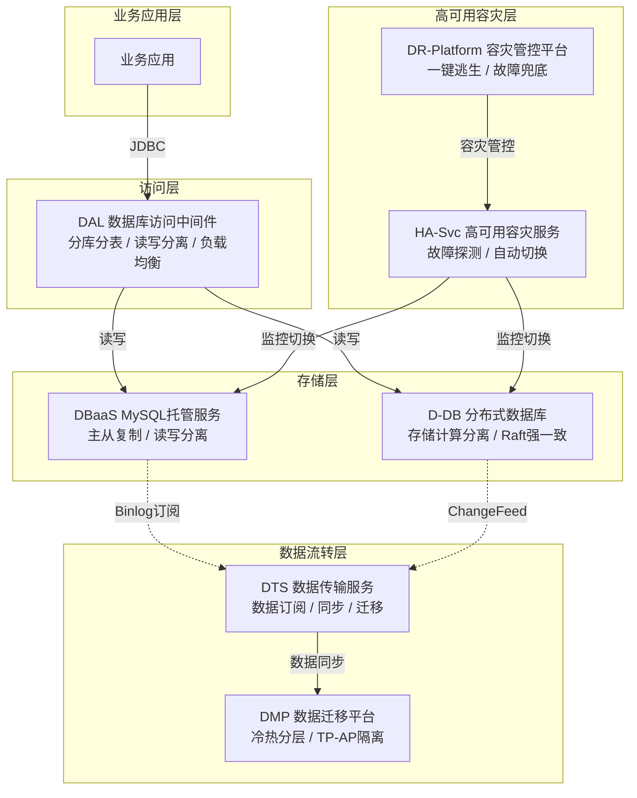
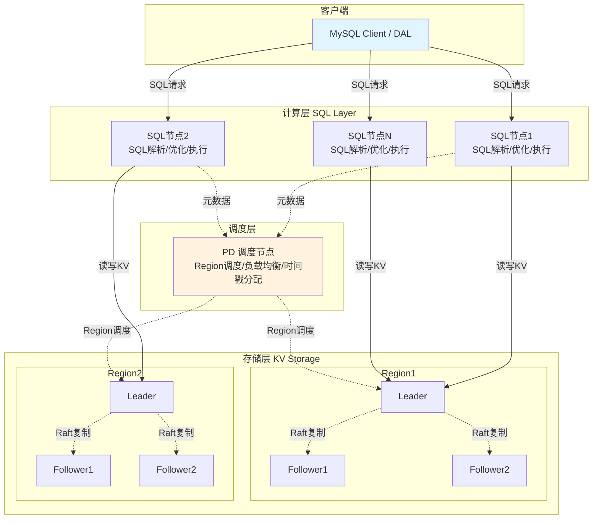
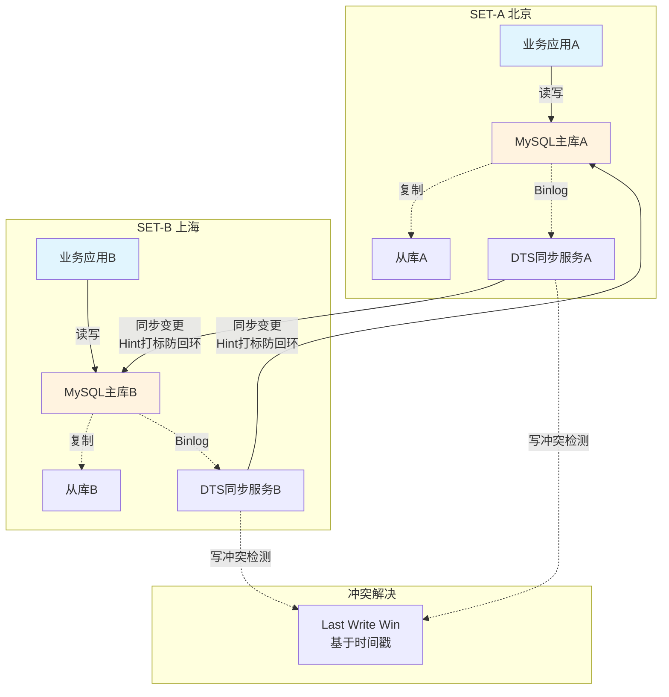
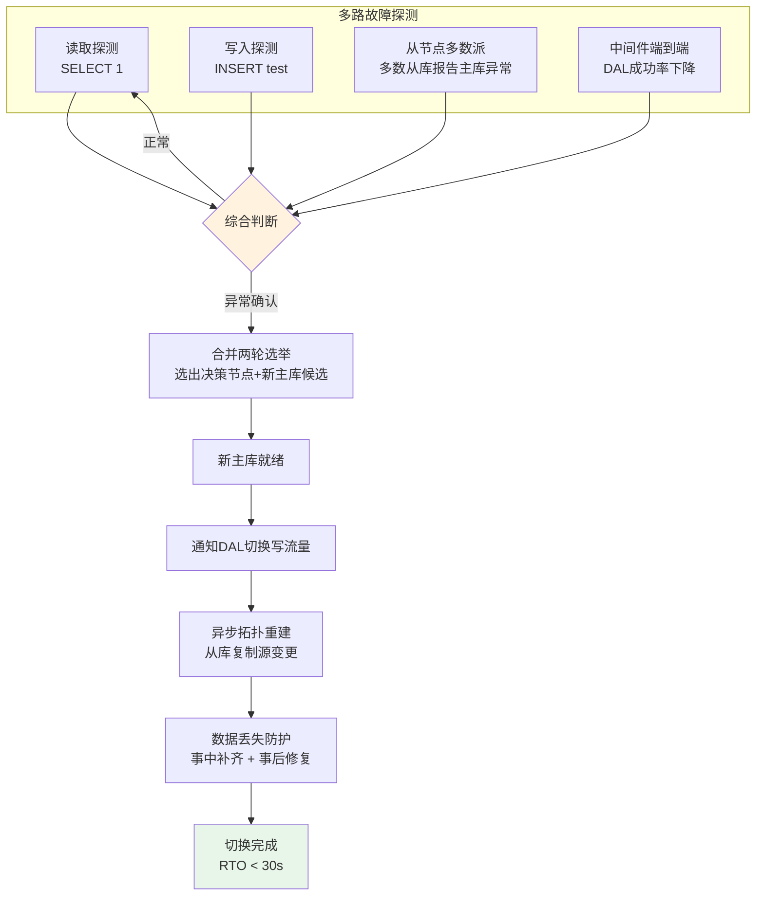
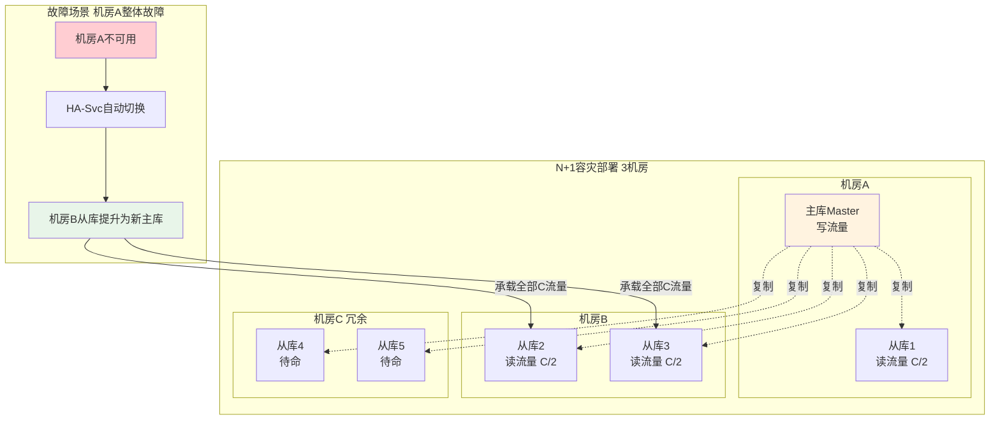
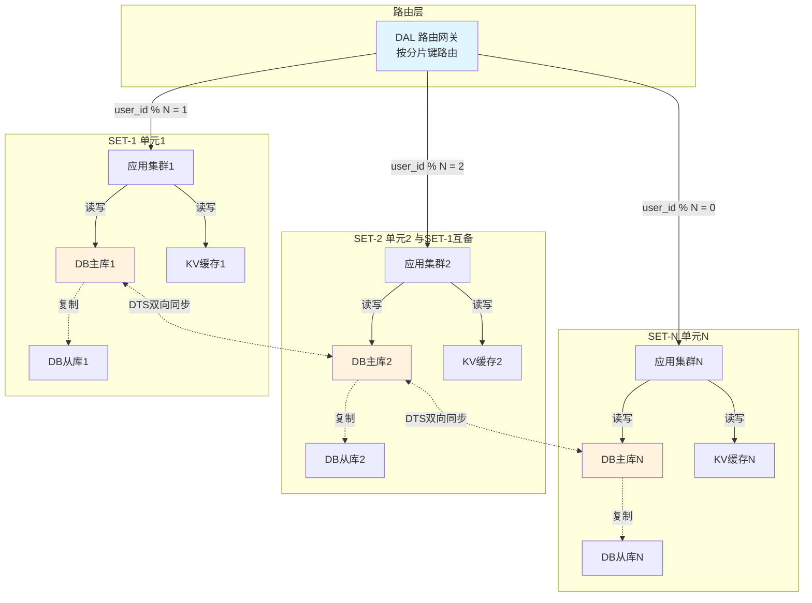

# 某大型互联网公司关系型数据库分布式架构实践

---

## 一、概述

### 1.1 背景与挑战

在过去十余年间，某大型互联网公司的业务版图从最初的团购服务逐步扩展到覆盖餐饮、外卖、酒旅、出行、金融等数十个垂直领域。伴随业务规模的爆发式增长，底层数据存储系统面临着前所未有的压力与挑战。作为IT系统最核心的基石组件，关系型数据库承载着绝大部分在线事务处理（OLTP）负载，其稳定性与性能直接关系到亿级用户的体验质量。

传统单机MySQL架构在业务高速发展期逐渐暴露出三大核心挑战。第一，单表数据量膨胀问题。当单表行数超过数千万甚至上亿行后，即使建立了合理的索引，查询性能仍会出现显著劣化，请求耗时从毫秒级跃升至秒级，严重影响在线服务的响应速度。B+Tree索引的层级增加、页分裂频率上升、缓冲池命中率下降等底层机制共同作用，使得大表场景下的读写性能难以满足互联网级别的低延迟要求。第二，单机容量受限于物理磁盘，无法实现在线水平扩展。传统MySQL的存储容量受限于单机磁盘上限，当数据量增长到TB级别时，纵向扩容（Scale Up）的成本急剧增加且存在物理天花板，而横向扩容（Scale Out）则需要复杂的分库分表方案支撑，对业务侵入性极大。第三，主从复制架构下的数据一致性问题。MySQL原生的异步复制和半同步复制机制在极端场景下仍然存在主从延迟和脑裂风险，可能导致数据不一致，对金融级业务场景构成严重威胁。

面对这些挑战，该公司从2014年开始系统性地构建数据库基础设施体系。截至目前，公司内部80%以上的数据库访问通过自研的数据库访问中间件接入，形成了统一的数据库访问标准。整体数据库服务的可用性要求达到99.99%以上（即全年不可用时间不超过52.56分钟），这一目标的达成依赖于从访问层、存储层到运维层的全链路高可用设计。

### 1.2 数据库体系全景

该公司的关系型数据库体系经过多年演进，已形成一套涵盖存储引擎、访问代理、数据流转、高可用保障、自动化运维等多维度的完整技术栈。整体架构可分为以下几个核心子系统：

**集中式关系型数据库（数据库托管服务平台，以下简称DBaaS）**。这是基于MySQL构建的托管式数据库服务，采用经典的主从复制架构，支持一主多从的读写分离部署模式。DBaaS对MySQL进行了深度定制与增强，包括但不限于内核级别的性能优化、自动故障检测与切换、备份恢复、参数模板管理、慢查询分析等能力。作为该公司使用最广泛的数据库服务，DBaaS承载了大量核心在线业务，覆盖了从小规模配置表到中等规模业务表的各类场景。

**分布式关系型数据库（以下简称D-DB）**。D-DB是基于开源分布式数据库TiDB演进而来的企业级分布式关系型数据库，采用存储计算分离架构，具备在线水平扩缩容、分布式强一致、兼容MySQL协议等核心特性。D-DB的引入从根本上解决了传统MySQL在超大规模数据场景下的扩展性瓶颈，使业务无需设计复杂的分库分表方案即可实现透明化的水平扩展。

**数据库访问中间件（以下简称DAL）**。DAL是该公司统一的数据库访问层组件，提供分库分表、读写分离、负载均衡、SQL路由、流量调度等核心能力。所有业务应用通过DAL访问后端数据库，DAL屏蔽了底层存储拓扑的复杂性，为上层业务提供统一且透明的数据访问接口。

**高可用容灾服务（简称HA-Svc）**。HA-Svc负责数据库集群的故障检测与自动切换。当主库节点出现故障时，HA-Svc能够在秒级时间内完成故障判定并将流量切换到备库节点，最大程度减少业务中断时间。HA-Svc支持多机房部署，能够处理从单节点故障到整个机房故障的各级容灾场景。

**容灾管控平台（简称DR-Platform）**。DR-Platform是面向极端灾难场景的容灾管控中心，提供一键逃生、故障兜底、容灾恢复等能力。当常规高可用机制无法应对突发故障时（如整个数据中心不可用），DR-Platform可以在分钟级完成全局流量调度，将业务切换到容灾数据中心继续提供服务。

**数据传输服务（简称DTS）**。DTS是一套集数据订阅、数据同步、数据迁移于一体的数据流转平台。它支持从MySQL到同构或异构数据源的实时数据传输，广泛应用于异地容灾、业务解耦、搜索索引构建、数据分析等场景。

**数据迁移平台（简称DMP）**。DMP是一站式在线数据处理平台，提供数据实时处理、数据迁移与拆分、数据通用解决方案、数据分析与治理四大核心能力。DMP将各类数据流转场景进行了标准化和产品化，使业务团队可以通过简单的配置完成复杂的数据迁移与治理任务。



### 1.3 集中式 vs 分布式架构对比

在该公司的数据库体系中，集中式架构（DBaaS/MySQL）和分布式架构（D-DB）各自承担着不同的角色，适用于不同的业务场景。理解两者的核心差异对于架构选型至关重要。

**存储架构层面**。DBaaS采用经典的MySQL单机存储引擎（InnoDB），数据存储在单台物理机的本地磁盘上，通过主从复制实现数据冗余。这种架构的优势在于单点性能极高（无网络开销的本地读写），但劣势在于存储容量受限于单机磁盘且无法实现在线水平扩展。D-DB则采用存储计算分离架构，计算层（SQL Layer）和存储层（KV Storage）独立部署，存储层将数据按照Range或Hash进行分片，分散存储在多个节点上。这种架构使得存储容量可以通过添加节点线性增长，且扩容过程对业务完全透明无感知。

**数据一致性层面**。DBaaS通过MySQL的半同步复制（Semi-Sync Replication）来保障数据一致性，但在网络分区或主库突发宕机的极端场景下，仍可能出现数据丢失或短暂的脑裂状态。D-DB则在底层存储引擎中集成了Raft分布式一致性协议，数据默认维护3个副本，任何写入操作必须同步到半数以上节点（即至少2个副本确认写入成功）才会向客户端返回成功响应。这种设计从协议层面保证了数据的强一致性，从根本上避免了主从延迟和脑裂导致的数据不一致问题。

**扩展性层面**。DBaaS的扩展主要依赖纵向扩容（升级CPU、内存、磁盘）和基于DAL的分库分表方案。前者存在物理上限，后者需要业务层面的深度改造。D-DB的存储和计算可以独立扩容：当存储空间不足时，添加新的存储节点后数据会自动重新分布（Rebalance）；当计算资源不足时，添加新的计算节点即可分担SQL解析和执行的压力。整个扩容过程在线完成，业务无需停服且不需要任何代码改动。

**故障恢复层面**。DBaaS依赖外部的HA-Svc进行故障检测和主从切换，切换过程通常需要数秒到数十秒。D-DB内建了故障自恢复能力，当主副本（Leader）发生故障时，Raft协议会自动在剩余的副本中选举新的Leader，选举过程通常在秒级完成，实现快速的读写服务恢复。

**业界对标**。D-DB的设计理念与业界多款知名分布式数据库产品一脉相承。Amazon Aurora通过存储计算分离和日志即数据库的设计理念实现了高性能和高可用；Google Spanner则是全球首个提供外部一致性（即线性一致性）的全球分布式数据库；阿里云PolarDB采用共享存储架构实现了存储计算分离；OceanBase则通过Paxos协议实现了金融级的高可用和强一致。D-DB在借鉴这些产品优秀设计思想的基础上，针对该公司特有的业务场景和技术栈进行了深度定制与优化。

---

## 二、数据库访问中间件（DAL）架构设计

### 2.1 定位与核心能力

数据库访问中间件（DAL）定位为该公司统一的数据库访问层组件，是连接业务应用与底层数据存储之间的桥梁。从技术实现角度看，DAL基于JDBC API开发，以客户端库（Client Library）的形式嵌入到应用进程中运行，属于业界所称的"Smart Client"模式。这种模式与阿里巴巴的TDDL（Taobao Distributed Data Layer）设计思路类似，避免了独立Proxy节点带来的额外网络跳转开销和运维复杂度，同时保留了客户端直连数据库的高性能优势。

DAL的核心设计理念是"对业务透明"。业务开发人员无需关心底层数据库的物理拓扑结构（如分库分表的具体布局、主从节点的IP地址等），只需按照标准的JDBC接口编写数据访问代码，DAL会自动完成SQL路由、负载均衡、故障转移等底层工作。这种设计极大地降低了业务开发的复杂度，使开发人员可以专注于业务逻辑本身。

DAL提供的核心能力包括以下几个方面：

**分库分表**。当单表数据量超过一定阈值时，DAL支持将数据透明地分散到多个物理库和物理表中。业务层面仍然操作逻辑上的单一数据源，DAL在底层自动完成分片键的计算、SQL的改写与路由、结果集的归并与排序。

**读写分离**。DAL能够自动识别SQL语句的读写属性，将写操作路由到主库节点，将读操作分发到多个从库节点，从而充分利用从库的计算资源分摊读压力。同时支持强制路由到主库的场景（如写后立即读），避免因主从延迟导致的数据不一致。

**负载均衡**。在多个从库节点之间，DAL实现了多种负载均衡策略（如轮询、加权轮询、最少活跃连接等），确保读请求均匀分布在各个从库节点上，避免单点过载。

**流量调度**。DAL支持按比例调整各节点的流量权重，使得DBA可以在不停服的情况下逐步将流量从一个节点迁移到另一个节点，用于滚动升级、灰度发布、故障隔离等运维场景。

**动态Hint**。DAL支持通过SQL注释中嵌入的特殊Hint指令，在运行时动态控制SQL的路由行为。例如，强制某条读请求走主库、指定路由到某个特定分片、开启全表扫描等。这为业务层提供了灵活的路由控制手段。

**影子表压测**。在全链路压测场景下，DAL能够自动识别压测流量并将其路由到影子库/影子表中执行，确保压测数据不会污染真实的生产数据。这一能力的实现依赖于请求上下文中携带的压测标记，DAL根据标记自动改写表名（如将`order`表路由到`order_shadow`表）。

**全局ID生成器**。在分库分表场景下，传统的AUTO_INCREMENT自增主键无法保证全局唯一性。DAL内置了全局唯一ID生成器，支持基于Snowflake雪花算法和号段模式两种实现，为业务提供全局唯一且趋势递增的ID序列。

**多数据源支持**。DAL不仅支持MySQL，还兼容D-DB、PostgreSQL等多种关系型数据库。业务可以通过统一的DAL接口访问不同类型的后端数据源，降低了多数据源场景下的开发和运维复杂度。

**多语言支持**。虽然DAL最初是作为Java客户端库开发的，但随着公司技术栈的多元化发展，DAL也提供了Golang、Python、Node.js等多种语言的SDK实现，确保不同技术栈的业务团队都能使用统一的数据库访问能力。

### 2.2 分库分表架构

分库分表是DAL最核心且最复杂的能力之一。其设计目标是在对业务完全透明的前提下，实现数据的水平分片，从而突破单库单表的容量和性能瓶颈。

**透明化分片方案**。DAL的分库分表方案遵循"业务无感知"的设计原则。从业务视角看，应用仍然操作逻辑上的单一数据源和单一表名，所有的分片逻辑都封装在DAL内部。这种透明化设计使得业务可以平滑升级——当一个原本使用单库的业务需要切换到分库分表架构时，只需修改DAL的配置即可，无需改动任何业务代码。同时，分片方案的设计严格遵循ACID准则，保证在单分片范围内的事务操作具有完整的原子性、一致性、隔离性和持久性。

**分库分表规则配置**。DAL支持两种分片规则的配置方式。第一种是平台化配置（推荐方式），通过公司内部的配置中心进行统一管理。DBA在管理平台上定义分片规则后，配置信息通过配置中心推送到各个应用节点的DAL客户端，实现分片规则的动态更新，无需重启应用。第二种是本地文件配置，适用于开发环境或特殊场景，分片规则以XML或YAML格式的本地配置文件形式存储，DAL启动时加载并解析这些配置。

**路由规则**。DAL的路由规则通过数学表达式定义，核心逻辑是根据分片键（Sharding Key）的值计算出目标数据库索引（Database Index）和目标表索引（Table Index）。典型的路由表达式如：`dbIndex = hash(shardingKey) % dbCount`，`tbIndex = hash(shardingKey) / dbCount % tbCount`。其中，`dbCount`是数据库分片数量，`tbCount`是单库内的表分片数量。DAL支持多种哈希算法，包括简单取模、一致性哈希等，以适应不同的数据分布需求。

**路由执行过程**。分库分表的路由过程在数据落库之前完成。当业务发出一条SQL语句时，DAL的处理流程如下：首先，SQL解析器对SQL进行词法分析和语法分析，提取出分片键的值和SQL的操作类型；其次，路由引擎根据分片键的值和预定义的路由规则，计算出目标分片（库+表）；然后，SQL改写器将逻辑表名替换为物理表名（如将`order`改写为`order_0003`），生成可在目标分片上执行的物理SQL；最后，执行引擎将物理SQL发送到目标分片上执行并收集结果。

**并发执行与结果归并**。在分库分表场景下，一条逻辑SQL可能需要拆分为多个物理SQL在不同分库上并发执行。典型场景如不带分片键的全表扫描查询，需要在所有分片上执行并将结果归并。DAL内置了并行执行线程池，支持配置并发度和超时时间。结果归并引擎支持多种归并策略，包括排序归并（ORDER BY）、分组归并（GROUP BY）、聚合归并（SUM/COUNT/AVG/MAX/MIN）、分页归并（LIMIT）等。对于分页查询，DAL采用了优化的流式归并策略，避免将所有分片的全量结果加载到内存中，从而控制内存消耗。

**分片键选择建议**。分片键的选择直接影响数据分布的均匀性和查询路由的效率。DAL推荐选择具有高基数（Cardinality）、业务查询频繁使用、且数据分布均匀的字段作为分片键。典型的分片键如用户ID、订单ID等。如果业务查询中存在非分片键的高频查询维度，可以通过异构索引表（将数据按不同维度冗余一份到另一套分片中）或DTS数据同步到搜索引擎的方式来满足多维度查询需求。

```mermaid
flowchart LR
    A[业务SQL<br/>SELECT * FROM order WHERE user_id=123] --> B[SQL解析器<br/>提取分片键 user_id=123]
    B --> C[路由引擎<br/>hash(123) % 16384 = Slot 4567]
    C --> D[路由表查找<br/>Slot 4567 → DB_2, Table_003]
    D --> E[SQL改写<br/>order → order_003]
    E --> F[并发执行<br/>发送到DB_2执行]
    F --> G[结果归并<br/>排序/分组/聚合/分页]
    G --> H[返回业务结果]
    
    style A fill:#e1f5fe
    style H fill:#e8f5e9
```

### 2.3 读写分离架构

读写分离是数据库横向扩展读能力的经典方案。DAL通过GroupDataSource组件提供读写分离能力，将读写请求按照预定义的规则分发到不同的数据库节点上。

**基本原理**。GroupDataSource在逻辑上封装了一组物理数据库连接——一个主库连接（用于处理写请求）和多个从库连接（用于分担读请求）。当业务发出SQL请求时，DAL首先判断SQL的读写属性：INSERT/UPDATE/DELETE/DDL等写操作路由到主库节点执行；SELECT等读操作则分发到从库节点执行。这种设计对业务层完全透明，业务代码无需区分主从连接。

**对业务层的透明性**。DAL的读写分离设计旨在对业务层屏蔽后端复杂的分布式存储逻辑。无论后端是一主一从还是一主多从，无论从库的IP地址如何变化，业务层始终通过同一个GroupDataSource接口访问数据库。当DBA进行主从切换、添加/移除从库节点等运维操作时，DAL能够通过配置中心的动态推送实时感知拓扑变更，自动更新内部的连接池和路由表，整个过程业务完全无感。

**流量调度与负载均衡**。在多个从库节点之间，DAL支持灵活的流量调度策略。默认情况下，DAL采用加权轮询（Weighted Round Robin）算法在各从库之间分配读请求。DBA可以通过管理平台动态调整各节点的权重值，实现精细化的流量控制。例如，当某个从库节点的性能较弱或正在进行数据追赶时，可以降低其权重以减少其承载的读流量。此外，DAL还支持基于响应时间的自适应负载均衡策略，自动将更多流量分配到响应速度更快的节点上。

**强制路由（动态Hint）**。在某些业务场景下，业务需要确保读操作读取到最新的数据（如写后立即读），此时读请求需要强制路由到主库而非从库（因为主从之间存在复制延迟）。DAL通过动态Hint机制支持这种强制路由需求。业务可以在SQL中添加特定的Hint注释（如`/*+ROUTE_TO_MASTER*/`），或通过DAL提供的编程API在ThreadLocal中设置路由标记，DAL识别到这些标记后会将对应的读请求路由到主库执行。

**从库故障自动摘除**。DAL内置了从库健康检测机制。当某个从库节点出现故障（如连接超时、复制延迟过大、只读状态异常等）时，DAL会自动将该节点从可用从库列表中摘除，后续的读请求不再路由到该节点。当故障节点恢复健康后，DAL会自动将其重新加入可用列表。整个摘除和恢复过程自动完成，无需人工干预。

### 2.4 数据源类型

DAL根据不同的使用场景，提供了多种层次的数据源抽象，形成了从简单到复杂的数据源类型层级体系。

**SingleDataSource（单数据源）**。SingleDataSource是DAL最基础的数据源类型，封装了对单个MySQL实例的连接管理。它在原生JDBC DataSource的基础上增加了连接池管理、超时控制、监控上报等增强能力。SingleDataSource适用于无需分库分表和读写分离的简单场景，如访问配置库、字典表等小型数据源。

**GroupDataSource（读写分离数据源）**。GroupDataSource在SingleDataSource的基础上增加了读写分离能力。一个GroupDataSource逻辑上对应一组物理数据源——一个主库和一到多个从库。GroupDataSource自动识别SQL的读写属性并路由到对应节点，同时提供从库故障摘除、流量权重调整、强制路由等高级能力。GroupDataSource是该公司使用最广泛的数据源类型，适用于大多数在线业务场景。

**ShardDataSource（分库分表数据源）**。ShardDataSource在GroupDataSource的基础上增加了分库分表能力。一个ShardDataSource逻辑上对应多个GroupDataSource（即多个分片），每个分片本身具备独立的读写分离能力。ShardDataSource负责SQL解析、分片路由、SQL改写、并发执行、结果归并等全套分片逻辑，适用于单表数据量巨大需要水平拆分的场景。

**多数据源动态切换**。在某些复杂业务场景中，应用可能需要访问多个不同的数据源（如不同业务域的数据库），并根据运行时的业务上下文动态切换。DAL提供了多数据源路由能力，支持通过注解或编程方式在运行时动态选择目标数据源。这种能力在多租户系统、数据隔离场景中有着广泛的应用。

### 2.5 监控与运维

DAL作为数据库访问的统一入口，天然具备全量SQL的观测能力，这为数据库监控与运维提供了强大的数据基础。

**客户端调用信息上报**。DAL客户端会将每次数据库调用的关键指标上报到公司统一的监控平台，包括但不限于：SQL执行耗时、影响行数、连接获取耗时、路由结果、是否命中缓存、异常信息等。这些数据在监控平台上以可视化图表的形式展示，便于开发和DBA实时观察数据库的运行状态。

**端到端监控能力**。DAL的监控不仅覆盖客户端层面的指标，还能够与数据库服务端的监控数据进行关联分析，实现从应用层到数据库层的端到端全链路监控。当数据库出现性能劣化时，可以快速定位到具体的慢SQL、问题分片和调用来源。

**连接池管理**。DAL内置了高性能连接池（类似HikariCP的设计），提供连接的创建、复用、验证、销毁等完整生命周期管理。连接池的关键参数（如最小空闲连接数、最大连接数、连接最大存活时间、空闲超时时间等）均可通过配置中心动态调整，无需重启应用。

**超时控制**。DAL提供了多层次的超时控制机制。`checkoutTimeout`控制从连接池获取连接的最长等待时间，避免因连接池耗尽导致的请求堆积；`queryTimeout`控制单条SQL在数据库服务端的最大执行时间，防止慢查询占用连接过长时间；`socketTimeout`控制底层TCP连接的读写超时，防止因网络故障导致的连接挂起。合理的超时配置是保证系统稳定性的重要手段。

---

## 三、分布式关系型数据库（D-DB）架构设计

### 3.1 架构概述

分布式关系型数据库D-DB是该公司基于开源分布式数据库TiDB演进而来的企业级数据库产品。TiDB由PingCAP公司开源，受Google Spanner论文启发而设计，其核心理念是构建一个同时具备分布式事务能力和MySQL兼容性的NewSQL数据库。该公司在TiDB的基础上进行了大量的企业级增强，包括内核性能优化、多租户资源隔离、与内部基础设施的深度集成、运维自动化等方面。

D-DB采用存储计算分离的分层架构，整体分为三个核心组件。计算层（SQL Layer）负责接收客户端SQL请求，进行SQL解析、查询优化、执行计划生成、分布式事务协调等工作。计算层节点是无状态的，可以根据负载情况水平扩展。存储层（KV Storage Layer）负责数据的持久化存储，采用分布式Key-Value引擎，数据按照Key的范围（Range）进行分片，每个分片称为一个Region。每个Region默认维护3个副本，通过Raft一致性协议保证副本间的数据一致性。调度层（Placement Driver，简称PD）作为集群的大脑，负责存储集群的元数据信息、进行Region的调度与负载均衡、分配全局唯一递增的事务时间戳等。

这种存储计算分离的架构使得D-DB在扩展性方面具有天然优势。当计算资源不足时，可以单独添加计算节点；当存储容量不足时，可以单独添加存储节点。两种资源的扩缩容互不影响，且都可以在线完成，无需停服或数据迁移。



### 3.2 核心特性

**无需分库分表设计**。D-DB最显著的优势之一是彻底消除了业务层面的分库分表需求。传统MySQL分库分表方案不仅带来巨大的设计和开发成本（如分片键选择、路由规则设计、跨分片查询处理等），还严重限制了业务的灵活性（如难以支持跨分片的JOIN和复杂事务）。在D-DB中，数据的分片和分布完全由存储引擎自动管理，业务层面操作的是一张逻辑上完整的表，无需关心数据的物理分布。当表的数据量增长时，D-DB会自动将Region进行分裂和重分布，整个过程对业务完全透明。

**分布式强一致性**。D-DB通过Raft协议保证数据的强一致性。每个Region的3个副本中，有一个Leader副本负责处理所有的读写请求，其余Follower副本通过Raft日志复制保持与Leader的数据同步。任何写操作必须在至少2个副本（包括Leader）上持久化成功后，才会向客户端返回写入成功。这种设计确保了在任何单点故障场景下（如一个副本所在节点宕机），数据不会丢失，且剩余副本可以立即选举新Leader继续提供服务。与MySQL的半同步复制不同，D-DB的一致性保证是协议级别的，不存在降级为异步复制的风险。

**在线水平扩缩容**。当存储容量即将达到上限时，运维人员只需向集群中添加新的存储节点，PD调度器会自动将部分Region迁移到新节点上，实现存储容量的线性增长。整个扩容过程中，数据的迁移是渐进式的，不会对在线业务造成明显的性能影响。缩容过程同理，PD会将待下线节点上的Region调度到其他节点后再安全地移除该节点。

**故障自恢复**。当某个存储节点发生故障时，该节点上所有Region的Follower副本（如果是Leader所在节点故障）会在数秒内通过Raft选举产生新的Leader，恢复该Region的读写服务。PD会同时调度新的副本到其他健康节点上，将副本数恢复到3个，确保后续的容灾能力不受影响。整个故障恢复过程完全自动化，无需人工干预。

**高度兼容MySQL协议**。D-DB在协议层面高度兼容MySQL，支持MySQL的通信协议、SQL语法、数据类型、内建函数等。现有的MySQL客户端工具、ORM框架（如MyBatis、Hibernate）、应用程序代码大多可以无需修改（或仅需少量修改）即可连接D-DB。这种兼容性极大地降低了从MySQL迁移到D-DB的技术门槛和工程成本。

### 3.3 适用场景

D-DB并非要取代MySQL，而是与MySQL形成互补，各自服务于最适合的场景。根据该公司的实践经验，D-DB特别适合以下几类场景。

**单表数据量巨大，需要在线扩容的场景**。当单表数据量预期将增长到数亿甚至数十亿行时，传统MySQL即使做了分库分表也面临着管理复杂度的挑战（如分片数不够需要二次拆分）。D-DB可以从容应对这种量级的数据增长，无需预先规划分片方案。

**对数据强一致性要求高的场景**。在金融支付、账务核算、库存管理等场景中，任何数据不一致都可能导致资损或业务逻辑错误。D-DB基于Raft协议的强一致性保证天然适合这类场景，相比MySQL的半同步复制提供了更强的一致性承诺。

**不希望设计分库分表方案的场景**。分库分表方案的设计和维护成本极高，尤其对于快速迭代的业务团队而言是一个沉重的技术负担。选择D-DB可以将业务从分库分表的复杂性中解放出来，专注于业务逻辑的开发。

**需要高可用自动切换的场景**。D-DB内建的Raft自动选举机制提供了比MySQL+外部HA更快速、更可靠的故障切换能力。对于对可用性要求极高的核心业务（如支付系统），D-DB的秒级自动恢复能力是一个重要的优势。

**需要HTAP混合负载的场景**。D-DB通过TiFlash列存副本提供了实时分析能力，同一套系统可以同时支持OLTP事务处理和OLAP分析查询，避免了传统架构中需要通过ETL将数据同步到单独的分析系统的延迟和复杂度。

---

## 四、数据传输与迁移体系

### 4.1 数据传输服务（DTS）

数据传输服务（DTS）是该公司自研的一套集数据订阅、数据同步、数据迁移于一体的数据流转基础平台。在一个大型互联网公司的微服务架构中，数据往往分散在数以千计的数据库实例中，业务之间的数据联动、跨数据源的数据流转是一个普遍且高频的需求。DTS的出现将这些需求进行了标准化和平台化，提供了高可靠、高可用、低延迟的通用数据传输能力。

DTS的核心架构由三个关键组件构成。Dumper组件负责从源端数据库中抽取数据变更事件（基于MySQL的Binlog或D-DB的TiCDC Change Feed），将其转换为统一的内部数据格式后写入中间存储；Applier组件从中间存储中消费数据变更事件，按照预定义的转换规则和路由规则，将数据变更应用到目标端数据源；Manager组件负责整个数据传输链路的编排、监控和运维管理。

DTS的核心特性包括以下几个方面。首先，DTS内置了通用数据同步服务，用户只需在平台上通过简单的配置（指定源端、目标端、同步对象、过滤规则等）即可完成一条数据同步链路的搭建，无需编写任何代码。其次，DTS开放了SDK（Software Development Kit），允许业务通过编程方式订阅指定数据库的Binlog数据变更事件，实现基于数据变更驱动的业务逻辑（如缓存更新、搜索索引刷新、事件通知等）。第三，DTS采用多租户集群架构，不同业务的数据传输任务运行在共享的物理集群上，通过资源隔离机制确保各任务之间互不影响。第四，DTS支持分片粒度的水平扩缩容，当某条同步链路的数据量增大时，可以将其拆分为多个分片并行处理，从而提升吞吐量。第五，DTS具备数据按时间回放能力，可以将目标端的数据回放到任意历史时间点的状态，这在数据恢复和问题排查场景中非常有用。

### 4.2 DTS应用场景

DTS作为通用的数据传输基础设施，在该公司内部有着广泛的应用场景。

**异地容灾**。在异地多活架构中，不同地域的数据中心（称为SET）之间需要保持数据的实时同步。DTS承担了中心SET和边缘SET之间双向数据同步的核心职责。当某个SET发生故障时，其他SET可以基于DTS同步过来的数据继续提供服务，实现业务级别的异地容灾。DTS在容灾场景下需要保证极低的同步延迟（通常小于1秒），以最大程度减少故障切换时的数据丢失窗口。

**SOA服务化数据拆分**。随着微服务架构的深入推进，原本集中在大单体数据库中的数据需要按业务域拆分到各个微服务独立的数据库中。DTS支持在拆分过程中保持源端和目标端的数据实时同步，使得业务可以先完成数据拆分，再逐步将流量切换到新的数据源，实现平滑迁移。

**分库分表数据拆分**。当业务决定从单库单表架构迁移到分库分表架构时，需要将存量数据按照分片规则拆分到各个分片中，同时保持增量数据的实时同步。DTS支持1:N（一张源表拆分到N个目标表）的数据拆分模式，以及异构索引的实时同步（将同一份数据按不同维度分片到不同的表集合中）。

**搜索广告索引构建**。搜索引擎（如Elasticsearch）和广告系统的索引需要与数据库中的源数据保持实时同步。DTS通过订阅数据库的Binlog变更事件，将数据变更实时推送给下游的索引构建系统，从而实现搜索/广告索引的准实时更新。相比传统的定时全量重建索引方案，基于DTS的增量索引更新延迟更低、资源消耗更少。

**数据库不停机迁移**。当需要将业务从一个数据库实例迁移到另一个实例（如从MySQL迁移到D-DB、从低配实例迁移到高配实例）时，DTS支持在迁移过程中保持源端和目标端的数据实时同步。业务先使用DTS将存量数据全量同步到目标端，再持续同步增量数据，待延迟降为零后在业务低峰期瞬间完成流量切换，整个过程对业务的影响降到最低。

### 4.3 数据迁移平台（DMP）

数据迁移平台（DMP）是在DTS之上构建的一站式在线数据处理平台。如果说DTS提供的是底层的数据传输能力，那么DMP则是面向业务场景的产品化解决方案。DMP将各类数据迁移、拆分、归档、分析场景进行了标准化封装，提供了可视化的操作界面和自动化的执行流程，极大地降低了复杂数据操作的门槛。

DMP提供四大核心能力：

**第一，数据实时处理**。DMP集成了数据订阅、数据同步、数据校验三大实时处理能力。数据订阅功能允许业务订阅指定表的数据变更事件；数据同步功能支持多种同步拓扑（一对一、一对多、多对一等）；数据校验功能能够在同步过程中持续比对源端和目标端的数据一致性，及时发现并告警数据差异。三者配合使用，确保数据流转的正确性和及时性。

**第二，数据迁移与拆分**。DMP支持多种粒度的数据拆分模式：1:1拆分（同构迁移）、1:N拆分（按分片键将数据分散到N个目标分片）、M:N拆分（将M个源分片重新分布到N个目标分片，用于分片数变更场景）。特别值得一提的是，DMP支持从MySQL到D-DB的平滑迁移方案。该方案通过全量数据同步、增量数据追赶、一致性校验、流量灰度切换等标准化步骤，实现了从集中式数据库到分布式数据库的在线平滑迁移。此外，DMP还支持读写流量的Scale Out（扩容）和Scale In（缩容），即在数据迁移过程中逐步将读/写流量从源端切换到目标端，实现渐进式迁移。

**第三，数据通用解决方案**。DMP针对常见的数据治理需求提供了标准化方案。冷热分层方案将历史冷数据自动迁移到低成本存储（如对象存储或列式存储引擎），减少在线数据库的存储压力；流式归档方案通过持续的增量数据迁移，将满足归档条件的数据实时搬运到归档库中；混合存储方案支持将热数据保留在高性能SSD存储上，将温数据迁移到HDD存储，将冷数据压缩后存储到对象存储，实现存储成本的最优化。

**第四，数据分析与治理**。DMP提供了近线实时分析能力，支持将在线数据库（TP）中的数据近实时同步到分析型数据库（AP）中进行查询分析，实现TP/AP的工作负载隔离。这种隔离确保了复杂的分析查询不会影响在线事务处理的性能。同时，DMP还提供了数据生命周期管理、数据质量检测、数据血缘分析等数据治理能力。

### 4.4 异地多活数据同步

异地多活架构是该公司应对大规模灾难（如数据中心火灾、光纤挖断等）的核心技术方案。在异地多活架构下，业务流量分布在多个地域的数据中心中，各数据中心拥有独立的数据库副本并可以独立处理读写请求。数据传输服务在其中承担着各数据中心之间数据实时同步的关键角色。

**容灾模式演进**。该公司的数据库容灾架构经历了多个阶段的演进。最初采用同机房主从模式，主库和从库部署在同一个机房内，这种模式无法应对机房级故障。随后演进到双机房主从模式，主库和从库分布在同城的两个机房中，当主库所在机房故障时可以将从库提升为主库继续服务。再后来发展为双机房主主模式（Active-Active），两个机房都可以接受写请求，通过DTS进行双向数据同步。进一步演进为同城双机房主从加跨城主主模式，同城机房之间采用低延迟的主从复制保证同城容灾，跨城之间采用DTS异步同步实现异地容灾。最终形态是完整的异地多活架构，业务流量按地域或用户维度划分到不同的SET中，各SET独立处理本地流量，SET之间通过DTS进行数据同步。

**双向同步的核心挑战**。在异地多活场景下，两个或多个SET之间的数据需要进行双向同步（即A的变更同步到B，B的变更也同步到A）。双向同步面临三个核心挑战。

第一个挑战是数据回环问题。当SET A的数据变更通过DTS同步到SET B后，SET B的Binlog中会记录这条变更。如果不加处理，DTS又会将这条变更从SET B同步回SET A，形成无限循环。解决方案是通过SQL打标（Hint）机制标记数据来源。具体而言，DTS在将数据变更应用到目标端时，会在SQL中添加特殊的Hint注释标记该数据来源于哪个SET。当DTS从目标端采集Binlog时，会解析SQL中的Hint标记，过滤掉来源于其他SET的数据变更（即这些数据是由DTS同步过来的，不是本地业务产生的），只传输本地业务产生的真正变更。这种机制有效地切断了数据回环链路。

第二个挑战是数据一致性问题。双向同步意味着同一条数据可能同时在两个SET被修改，产生写冲突。DTS采用"存量数据同步+增量冲突解决"的组合策略来保障数据一致性。对于存量数据，在同步链路建立时进行一次全量数据同步，确保两端的初始状态一致。对于增量数据的写冲突，DTS支持多种冲突解决策略，包括"最后写入者胜出"（Last Writer Wins，基于时间戳判定）、"指定SET优先"（某个SET的写入具有更高优先级）等。在业务层面，通常通过流量路由策略（如按用户ID进行SET亲和性路由）来尽量避免同一数据在多个SET被并发修改的情况。

第三个挑战是跨地域性能问题。不同地域的数据中心之间存在显著的网络延迟（如北京到上海的网络延迟约20-30毫秒）。DTS通过批量压缩传输、并行化、管道化等技术手段优化跨地域同步性能，最终实现了双向同步延迟小于1秒的目标。这意味着在正常情况下，一个SET产生的数据变更在1秒内即可同步到其他SET，满足了绝大多数业务场景对数据时效性的要求。



---

## 五、数据分布与路由机制

### 5.1 分片策略

数据分片（Sharding）是分布式数据库和分库分表中间件的核心机制。通过将数据分散存储在多个节点上，分片策略使系统能够突破单机的存储和计算瓶颈，实现水平可扩展性。在该公司的数据库体系中，无论是DAL的分库分表还是D-DB的内部数据分布，都依赖精心设计的分片策略来保证数据分布的均匀性和路由的高效性。

**基于Hash的分片**。Hash分片是DAL中最常用的分片策略。其核心原理是：将分片键（Sharding Key）的值通过一个固定的哈希算法（如MurmurHash、CRC32等）计算得到一个哈希值，然后对预定义的Slot总数取模，得到该数据所属的Slot编号。Slot再通过路由表映射到具体的物理存储节点（分库分表场景下即具体的库和表）。这种两级映射设计（Key -> Slot -> Node）的优势在于：当需要进行数据重分布时（如扩容场景），只需调整Slot到Node的映射关系（路由表），而不需要对所有数据重新计算哈希，大大降低了扩容的数据迁移量。

**预分片16384个Slot**。该公司的分片策略预定义了16384个Slot（类似Squirrel Cluster的设计理念）。所有的分片键通过哈希计算后对16384取模，均匀分布在这16384个Slot中。16384这个数字的选择是经过权衡的：它足够大以确保数据分布的均匀性（减少热点），又不会过大以至于路由表占用过多内存。每个Slot可以被分配到任意一个物理节点上，Slot是数据迁移的最小粒度单位。

**路由表**。路由表（Routing Table）记录了每个Slot到物理存储节点的对照关系。在DAL的分库分表场景中，路由表的形式为"Slot X -> Database Y, Table Z"。路由表存储在配置中心中，并被推送到每个应用节点的DAL客户端本地缓存中。当数据访问请求到达时，DAL根据分片键计算出Slot编号，然后查询本地路由表即可确定目标分片，整个路由过程在微秒级完成。

**动态路由规则配置**。路由表支持动态更新。当需要进行数据扩容或缩容时，DBA在管理平台上修改路由表（调整Slot到Node的映射关系），修改后的路由表通过配置中心实时推送到所有DAL客户端。DAL客户端收到新的路由表后会原子性地更新本地缓存，后续的请求将按照新的路由规则进行路由。这种机制使得数据重分布过程可以在线完成，无需停服。

**Range分片**。除了Hash分片，D-DB内部采用了Range分片策略。数据按照Key的字典序进行连续范围划分，每个连续的Key范围（Region）作为一个分片。Range分片的优势在于对范围查询（Range Scan）友好——相邻的数据存储在同一个或相邻的分片上，范围查询只需要访问少量分片。但Range分片的劣势是可能产生写热点（如自增ID导致新数据总是写入最后一个Region），需要通过预分裂（Pre-Split）等技术手段来缓解。

### 5.2 全局ID生成

在分库分表架构中，全局唯一ID的生成是一个必须解决的基础问题。传统MySQL的AUTO_INCREMENT自增主键在单库中可以保证唯一性和递增性，但在多库场景下无法满足全局唯一性要求（不同分库可能生成相同的自增ID值）。DAL内置了全局ID生成器，提供两种实现模式供业务选择。

**基于Snowflake雪花算法的ID生成**。Snowflake是Twitter开源的分布式ID生成算法，该公司在其基础上进行了适配和增强。雪花算法生成的ID是一个64位长整型数字，其二进制结构从高位到低位依次为：1位符号位（固定为0）、41位时间戳（毫秒级，可使用约69年）、10位机器标识（支持最多1024个节点）、12位序列号（同一毫秒内可生成4096个ID）。这种设计保证了ID的全局唯一性（不同机器的机器标识不同）、趋势递增性（时间戳在高位）和高性能（纯内存计算，无网络IO）。

雪花算法的核心优势在于去中心化——每个应用节点可以独立生成ID，无需与中心服务通信，因此不存在单点瓶颈和网络延迟开销。其潜在风险是对系统时钟的依赖——如果机器时钟发生回拨，可能生成重复ID。该公司通过记录最近一次生成ID的时间戳并拒绝在时钟回拨期间生成ID的方式来规避这个问题。

**基于号段模式的ID生成**。号段模式是另一种常见的分布式ID生成方案。其核心思想是：每个应用节点从中心ID分配服务（通常基于数据库实现）批量获取一个ID号段（如[1, 1000]），然后在本地从这个号段中顺序分配ID，当号段用完后再向中心服务申请新的号段。这种设计兼具了中心化方案的可靠性（通过数据库保证号段不重叠）和去中心化方案的高性能（大部分ID分配在本地完成）。

号段模式的优势在于ID的严格递增性（在同一节点内ID严格连续递增），以及不依赖系统时钟。其劣势在于存在中心依赖（ID分配服务），但通过预取（当前号段使用到一定比例时提前异步获取下一个号段）和多活部署（ID分配服务多机房部署）等措施，可以将中心服务的可用性影响降到最低。

**异地容灾支持**。两种ID生成模式均支持异地容灾。对于雪花算法，由于其去中心化的特性，只要机器标识在全局唯一且不冲突，各地域的应用节点可以独立生成ID。该公司通过在机器标识中编码地域信息（如前几位表示数据中心编号）来保证跨地域的ID不冲突。对于号段模式，ID分配服务在多个数据中心进行多活部署，各数据中心分配不同范围的号段（如数据中心A分配奇数号段，数据中心B分配偶数号段），从而实现异地独立生成ID且全局不冲突。

---

## 六、高可用容灾服务（HA-Svc）架构设计

### 6.1 背景与定位

数据库作为典型的有状态服务，其高可用设计面临着比无状态服务更为复杂的技术挑战。与无状态的Web服务或微服务不同，数据库节点之间存在数据复制关系、主从角色绑定以及一致性约束，这使得简单的负载均衡或横向扩展策略无法直接套用。在原生MySQL主从复制架构中，主库宕机后需要人工介入完成故障切换、数据补齐、拓扑重建等一系列操作，期间业务完全不可用，这在大规模互联网业务场景中是不可接受的。

高可用容灾服务（简称HA-Svc）正是为了解决上述痛点而设计的专用平台。它的核心定位是：为关系型数据库提供多机房、跨区域的高可用保障能力，在机房故障、机器故障、硬件故障、网络抖动、实例异常、流量突变等任意故障场景下，确保数据库服务的连续可用。HA-Svc不仅是一个故障检测和切换工具，更是一个完整的高可用生命周期管理系统，覆盖故障探测、决策判断、自动切换、数据修复、拓扑重建等全流程。

从业界对标来看，HA-Svc的设计理念与阿里巴巴的Adha、百度的Xagent、微信团队的FMHA以及Facebook的MHA等系统处于同一技术维度。这些系统的共同目标都是在分布式数据库环境中实现秒级故障切换和自动化容灾恢复。然而，HA-Svc在架构上有其独特之处——它基于Raft协议构建了自身的高可用性，确保故障检测和切换决策系统本身不存在单点故障隐患。

### 6.2 核心架构

HA-Svc的核心架构基于Raft一致性协议及同步状态机实现分布式高可用。传统的高可用管理系统往往自身就是一个单点——如果管理节点宕机，则被管理的数据库集群在发生故障时将无法得到及时处理。HA-Svc通过将自身部署为多节点Raft集群，解决了这一根本性的单点隐患问题。

在Raft架构下，HA-Svc的多个节点组成一个一致性组。Leader节点负责协调故障检测和切换决策，Follower节点实时同步状态信息并在Leader失效时通过选举产生新Leader。这种设计确保了在网络分区场景下，系统能够快速完成自身的Leader切换，并继续为被管理的数据库集群提供高可用保障。

HA-Svc自身具备机房级容灾能力。其节点分布在多个物理机房中，任何单一机房的整体故障不会导致HA-Svc服务本身不可用。这种"管理系统比被管理系统更高可用"的设计原则，是保证整个数据库高可用体系可信赖的基础。

状态机的同步确保了所有节点对被管理数据库集群的状态认知是一致的。当某个数据库实例发生故障时，所有HA-Svc节点都能通过状态机同步获知这一信息，并在Leader节点的协调下执行统一的故障处理流程，避免了脑裂和决策冲突。

### 6.3 故障探测机制

故障探测是高可用系统最关键的能力之一。误判（将正常实例判定为故障）会导致不必要的切换操作，影响业务稳定性；漏判（未能及时发现故障实例）会导致业务长时间不可用。HA-Svc采用多路故障判断机制，有效平衡了误判和漏判的风险。

第一路探测是读取探测。HA-Svc定期向目标数据库实例发起读取请求（如执行简单的SELECT查询），验证数据库的读取能力是否正常。读取探测能够发现数据库进程假死、查询引擎异常等问题。

第二路探测是写入探测。与读取探测不同，写入探测通过执行简单的INSERT或UPDATE操作，验证数据库的写入能力是否正常。在某些故障场景下（如磁盘空间耗尽、InnoDB表空间异常），数据库可能仍能响应读取请求但无法执行写入操作，写入探测能够发现这类"半死不活"的状态。

第三路探测是从节点多数派判断。这是HA-Svc最具创新性的探测方式。其核心思想是：通过被管理集群中从库节点的视角来判断主库的可用性。如果多数从库都报告无法从主库接收复制数据，则可以高置信度地判断主库确实存在问题。这种基于多数派的判断方式覆盖了更广泛的故障场景，特别是网络层面的故障——当主库所在网络出现问题时，HA-Svc自身可能也无法探测到主库，但从库分布在不同网络区域，它们的集体判断更为可靠。

第四路探测是中间件端到端探测。通过数据库访问中间件（简称DAL）收集客户端实际的连接和查询成功率信息，从业务视角判断数据库是否正常服务。这种探测方式能够发现那些从DBA工具角度看似正常、但业务实际无法正常访问的故障。

多路探测的结合使HA-Svc能够构建一个综合性的故障判断模型。系统不会仅依赖单一信号做出切换决策，而是综合多个维度的信息进行加权判断。这种设计有效地减少了因网络抖动或瞬时异常导致的误切换，同时也降低了因单一探测通道失效而导致的漏判风险。



### 6.4 故障切换策略

在确认故障发生后，HA-Svc需要快速、安全地完成主从切换。切换过程涉及选举新主库、拓扑重建、流量切换等多个步骤，每一步都需要精心设计以保证整体RTO最小化。

HA-Svc采用合并两轮选举的策略来优化切换速度。在传统的高可用切换中，通常需要先选举出切换决策节点（即谁来负责本次切换），再由决策节点选举新主库。HA-Svc将这两轮选举合并为一轮，在选出决策节点的同时就确定了新主库的候选者，从而显著减少了切换的总耗时。

拓扑重建是切换过程中的另一个耗时环节。当新主库确定后，所有从库需要将复制源从旧主库指向新主库。HA-Svc将拓扑重建优化为异步操作——在新主库就绪后，系统立即通知DAL将写流量切换至新主库，而从库的复制源变更则在后台异步完成。这种设计确保了业务写入的恢复不需要等待所有从库完成拓扑重建。

在一致性与可用性的权衡上，HA-Svc提供了定制化策略。对于金融支付等强一致性要求的业务，系统采用一致性优先策略，确保新主库包含所有已提交事务的数据后才完成切换，尽最大努力保证RPO为零。对于内容浏览等容忍少量数据延迟的业务，系统采用可用性优先策略，优先保证业务恢复时间，在可用性优先场景下RTO TP99线可达25秒。

选举策略考虑了多个维度的信息进行全局最优决策。系统对候选从库按照跨Region、跨可用区（AZ）、跨IDC等多维度进行打标和排序。在选举时，系统优先选择与旧主库同Region但不同AZ的从库作为新主库，既保证了网络延迟最小化，又实现了物理层面的容灾。同时，系统还会考虑从库的数据延迟量、硬件配置、当前负载等因素，确保选出的新主库具备承载写流量的能力。

### 6.5 数据丢失防护

在可用性优先的切换场景中，由于MySQL主从复制的异步特性，故障切换可能导致少量已提交但未复制到从库的事务数据丢失。HA-Svc提供了完善的数据丢失防护机制，通过事中同步补齐和事后异步修复两种手段，最大限度地降低数据丢失的影响。

事中同步数据补齐基于从库、旧主库以及binlog server三个数据源。在切换过程中，系统首先尝试从旧主库获取尚未复制的binlog数据；如果旧主库不可达，则从binlog server（预先持续同步主库binlog的备份节点）获取差异数据。获取到的差异数据在新主库上按顺序重放，确保切换完成时数据缺失最小化。

事后异步数据修复适用于旧主库在切换时完全不可达、但后续恢复可访问的场景。系统在旧主库恢复后，通过解析其binlog文件与新主库的binlog进行对比，识别出在切换过程中丢失的事务，并生成修复SQL在新主库上执行。这种修复机制是异步的，不影响业务正常运行，但能够在事后尽可能补齐数据缺口。

从RPO保障角度来看，一致性优先场景尽量保证RPO为零（即不丢失任何已提交事务），代价是切换时间可能更长；可用性优先场景则在保证RTO最小化的前提下，通过上述防护机制将可能丢失的数据量控制在极少量范围内。

### 6.6 支持的数据库类型

HA-Svc作为一个通用的高可用管理平台，支持多种数据库架构类型。

对于MySQL主从架构，这是最经典也是部署量最大的场景。HA-Svc管理一主多从的MySQL集群，在主库故障时自动完成从库提升和流量切换。

对于MySQL Group Replication（MGR）集群，HA-Svc适配了MGR的特殊协议机制。MGR基于Paxos协议实现组内一致性复制，其故障切换逻辑与传统主从有所不同。HA-Svc在MGR场景下主要负责监控集群健康状态、处理成员节点异常退出、以及在极端场景下进行集群级别的干预。

对于分布式关系型数据库（简称D-DB），HA-Svc提供了针对分片集群的高可用管理。D-DB将数据分散在多个MySQL实例上，HA-Svc需要协调多个分片的故障处理，确保整体集群的可用性。

对于PostgreSQL数据库，HA-Svc也提供了相应的高可用管理能力，适配了PostgreSQL的流复制和逻辑复制机制。

### 6.7 SLA指标

从实际运行数据来看，HA-Svc达到了业界领先的SLA水平。在常规主库自动切换场景中，RTO 95线和99线均为30秒，意味着绝大多数故障切换能在30秒内完成。

从真实故障案例数据统计，主库自动切换的最大RTO为82秒（出现在极端复杂的网络分区场景中），平均RTO为51秒。对于MGR集群的主库自动切换，由于MGR本身具备更快的故障感知能力，最大RTO为34秒，显著优于传统主从架构。

这些SLA指标在业界处于领先水平，能够满足绝大部分互联网业务对数据库可用性的要求。对于金融支付等极高可用性要求的业务，系统还支持通过半同步复制和MGR强一致模式进一步提升保障级别。

## 七、容灾管控平台（DR-Platform）建设

### 7.1 容灾架构演进

该公司的数据库容灾架构经历了三个阶段的演进，每个阶段都针对当时的业务规模和技术条件做出了最优选择。

容灾1.0阶段采用单活形态，即同城主备架构。在这一阶段，业务流量全部由主机房承载，备用机房部署了完整的数据库集群副本但不承担任何在线流量。备机房的作用仅是在主机房发生灾难性故障（如火灾、大规模断电）时作为恢复目标。这种架构的优点是简单可靠、数据一致性容易保证，缺点是备用机房的资源利用率极低（接近于零），且故障切换需要较长时间（通常为小时级别）。

容灾2.0阶段引入了同城多活架构。在这一阶段，读流量被分散到多个机房的从库上，写流量仍然集中在主机房的主库。典型部署形态包括同城双活（两个机房互为读负载均衡）和两地三中心（同城两个机房加异地一个灾备机房）。这种架构显著提升了资源利用率，同时将故障恢复时间从小时级缩短到分钟级。备机房从库承载读流量后，在主机房故障时只需完成主库切换即可恢复写入能力，而读服务几乎不受影响。

容灾3.0阶段实现了单元化架构，基于单元间两两互备的设计理念。在这一阶段，业务数据按照特定维度（如用户ID、地理位置）进行分片，每个分片的主库和从库分布在不同的单元中。单元之间互为容灾备份，任一单元故障时，其承载的流量可以快速切换到互备单元。这种架构实现了真正的多活和秒级容灾切换。

目前该公司大部分业务处于容灾2.0阶段，大体量核心业务（如外卖、配送、支付）已经演进到容灾3.0阶段。DR-Platform作为统一的容灾管控平台，需要同时支持这三种架构形态的管理需求。

### 7.2 N+1容灾架构

N+1容灾是该公司数据库层面采用的核心容灾模型。其基本思想是：将总容量为C的系统部署在N+1个机房中，每个机房至少提供C/N的服务容量。在这种部署模式下，当任意一个机房发生故障时，剩余的N个机房仍然能够承载总量为C的业务流量。

以N=2为例（即2+1=3个机房），每个机房提供至少C/2的容量，总部署容量为3*(C/2)=1.5C。当任一机房故障时，剩余两个机房各承载C/2的流量，总计仍为C。这种设计的资源冗余比为50%，相对于传统的1+1热备（100%冗余）有显著的成本优势。

在数据库层面，N+1容灾的具体实现方式为：写流量集中在单机房的主库上，读流量通过负载均衡策略分散到多个机房的从库上。每个机房的从库容量都满足C/N的要求，确保在任一机房故障时，读流量能够被其他机房的从库吸收。对于写流量的容灾，则通过主库切换机制实现——当主库所在机房故障时，HA-Svc自动将其他机房的某个从库提升为新主库。

容灾能力在该架构中下沉到PaaS组件层面完成。应用层不需要感知底层的容灾切换过程，所有的故障检测、主库切换、流量重定向都由数据库中间件和高可用服务自动完成。这种设计极大地降低了业务开发者的心智负担，使他们能够专注于业务逻辑本身。



### 7.3 容灾全生命周期管理

DR-Platform将容灾管理划分为事前、事中、事后三个阶段，提供全生命周期的管理能力。

事前逃生能力是容灾管理中最重要的能力之一。所谓"逃生"，是指在故障发生前或故障初期，主动将业务流量从即将或已经出问题的机房切离。基于N+1的部署架构，DR-Platform能够快速执行机房级别的流量逃生操作。在实际运行中，平台达到了每分钟切换100个集群的逃生速率，这意味着对于一个拥有数千个数据库集群的机房，完整的逃生操作可以在数十分钟内完成。

事前逃生的关键在于"快速"——在机房故障从局部蔓延到整体之前完成流量切离，避免业务受到更大影响。DR-Platform通过预先计算好的逃生方案和自动化执行流程，将人工决策和执行的时间压缩到最小。

事中止损能力指的是在故障正在发生时，系统自动进行的止损操作。底层的HA-Svc负责单个集群的自动故障切换，而DR-Platform则从全局视角提供容灾观测能力。通过容灾观测大盘，运维人员能够实时感知到哪些集群已经成功完成自动切换、哪些集群切换失败需要人工干预。对于切换失败的集群，平台支持快速创建批量兜底任务，通过强制切换或其他手段完成故障恢复。

事后容灾恢复是故障处理完成后恢复容灾能力的过程。在机房逃生或主库切换之后，系统的容灾冗余度会降低——原本的N+1变成了N+0。DR-Platform联合备份恢复系统，实现集群的快速扩容和拓扑重建，将系统恢复到N+1的正常容灾状态。这个过程包括从备份中恢复数据库实例、建立复制关系、验证数据一致性、重新纳入HA-Svc管理等多个步骤。

### 7.4 一键化容灾管控

DR-Platform的核心价值之一是将复杂的容灾操作封装为一键化的标准流程，降低操作门槛和出错概率。

容灾逃生操作支持多种场景的一键执行：一键创建主库逃生任务（将主库从故障机房切换到健康机房）、一键创建从库逃生任务（将读流量从故障机房切离）、一键创建MGR主库逃生任务（适配MGR特殊的切换流程）、一键关闭高可用开关（在特定场景下需要暂停自动切换，由人工接管决策）。

故障兜底操作基于观测大盘的实时数据。当平台发现某个故障域（如某个机架、某个网络区域）内的多个集群同时出现问题时，运维人员可以通过筛选条件快速定位受影响的集群，并一键创建批量兜底任务。兜底任务通常包括强制主库切换、重启异常实例、流量重新路由等操作。

容灾恢复操作帮助在故障处理完成后快速复原容灾能力。包括新建从库实例、建立复制关系、将实例重新纳入高可用管理、更新DAL路由配置等一系列步骤。

从演进路线来看，DR-Platform经历了三个阶段："人+平台"阶段依赖运维人员通过平台手工执行操作；"一键化"阶段将操作封装为标准流程，一键执行；"自动化"阶段则是最终目标——系统能够自动感知故障、自动决策、自动执行容灾操作，实现无人值守的全自动容灾。目前平台正处于从一键化向自动化演进的过程中。

### 7.5 容灾演练体系

容灾演练是验证容灾体系有效性的关键手段。一个从未经过真实演练的容灾方案，其可靠性是存疑的。DR-Platform建立了完善的容灾演练体系，定期在生产环境中进行容灾演练。

2025年度共进行了21次生产环境容灾演练，覆盖了多个区域和机房。演练不是在测试环境中进行的模拟操作，而是在真实生产流量下的实际容灾切换，这确保了演练结果的真实性和可信度。

演练场景设计覆盖了多种故障模式：逃生后断网（先完成流量逃生，再模拟机房断网，验证逃生后业务的正常运行）、不逃生直接断网（模拟突发机房故障，验证HA-Svc自动切换的效果）、容量演练（在逃生状态下验证剩余机房是否具备足够容量承载全量流量）。

在最大规模的一次演练中，涉及1560+主库和2560+从库的批量逃生操作，整体逃生耗时320秒。这意味着在不到6分钟的时间内，超过4000个数据库实例完成了容灾切换，证明了系统在大规模场景下的可靠性。

演练的另一个重要价值是发现潜在问题。通过21次演练，共发现并修复了55个问题。这些问题涵盖了配置错误、脚本缺陷、容量不足、超时参数不合理等多个维度。如果没有定期演练，这些问题可能在真实故障时才会暴露，届时的修复成本和业务影响将远高于演练中的发现。

## 八、MySQL Group Replication（MGR）实践

### 8.1 MGR架构

MySQL Group Replication（MGR）是MySQL官方在5.7版本引入的原生组复制方案。与传统的异步主从复制不同，MGR基于Paxos协议实现组内事务的强一致复制，确保组内所有成员在事务提交时达成一致。

MGR支持两种模式：单主模式（Single-Primary）和多主模式（Multi-Primary）。在单主模式下，只有一个成员接受写入，其余成员自动设为只读；在多主模式下，所有成员都可以接受写入，冲突通过认证机制在提交阶段解决。该公司主要使用单主模式，因为多主模式在高并发场景下的冲突开销较大。

MGR的核心优势在于：事务在提交时即已被组内多数节点确认，因此在主节点故障时不会丢失已提交的事务（RPO为零）。同时，MGR内置了故障检测和自动成员管理机制，成员节点的加入和退出都由协议自动处理。

相比传统主从架构，MGR在数据一致性和故障恢复方面有显著优势，但在性能开销、运维复杂度和规模化部署方面也面临更多挑战。

### 8.2 MGR运维挑战

在大规模生产环境中部署MGR，该公司遇到了多个运维层面的挑战。

连接数瓶颈是第一个显著问题。MGR集群在拓扑变化时（如成员加入、退出或故障），会触发视图变更（View Change）事件。在大规模集群中，视图变更过程中各成员之间的通信连接数会出现瞬时抖动，导致MySQL实例的连接数短暂飙升。当连接数超过max_connections限制时，正常业务连接会被拒绝，造成短暂的服务不可用。解决这一问题需要精细的连接池管理和视图变更优化。

写入瓶颈是MGR的另一个固有限制。由于每个写事务都需要经过组内多数节点的认证确认，写入QPS受限于网络延迟和Paxos协议的通信开销。在跨机房部署场景中，网络延迟进一步放大了这一瓶颈。对于写入密集型业务，MGR的吞吐量可能低于传统异步复制架构。

集群规模较大时，MGR的故障处理和运维操作容易出现不稳定。MGR官方推荐的集群规模为3-9个节点，但在某些业务场景下需要更多节点（如需要支持多机房读负载均衡）。节点数量增加后，Paxos协议的通信开销增大，故障检测和成员恢复的时间也相应延长。

在部署要求上，MGR集群至少需要分布在2个机房中，且单机房节点占比不超过50%。这是为了确保在任何单机房故障时，剩余节点仍能满足Paxos协议的多数派要求，维持集群的正常运转。如果单机房占比超过50%，该机房故障时集群将无法达成多数派共识，导致整体不可用。

### 8.3 MGR容灾

MGR集群的容灾管理与传统主从架构有所不同。当MGR集群中的单个节点异常退出时，集群通常能够自我修复——自动将异常节点从组中移除，并在单主模式下自动选举新的主节点。但在某些复杂故障场景下，集群的自我修复机制可能不够及时或无法完成，此时需要HA-Svc和DR-Platform的介入。

预案恢复是MGR容灾的核心操作。当MGR集群出现节点异常但集群仍在运行时，系统需要执行预案恢复操作：移除异常节点、补充新节点、重建数据同步。这些操作需要考虑MGR协议的约束，如不能在视图变更过程中执行成员变更。

节点权重不一致导致切换失败是一个实际遇到的问题。在MGR单主模式下，当主节点故障时，新主节点的选举依据各节点的权重配置。如果由于配置管理不当导致各节点权重不一致，可能出现不期望的节点被选为主节点，甚至在某些边界情况下导致选举失败。解决这一问题需要确保集群配置的一致性，并在HA-Svc中增加权重校验和自动修复能力。

事后修复效率也是MGR容灾中的一个优化重点。MGR节点从组中移除后，如果需要重新加入组，通常需要通过全量数据恢复或增量恢复（基于组内Recovery通道）来同步缺失的数据。在数据量较大的场景下，全量恢复可能需要数小时甚至数天。通过优化恢复策略（如预先保存足够的binlog、使用快照加增量的方式）、以及引入并行恢复机制，可以显著提升事后修复的效率。

## 九、容量评估系统

### 9.1 背景与痛点

容量评估是数据库运维中一个长期存在但难以解决好的问题。在大型促销活动（如年度大促）期间，业务流量可能达到日常的数倍甚至数十倍。如何准确评估数据库集群在极端流量下的承载能力上限，是保障活动期间服务稳定性的关键。

传统的容量评估主要依赖经验判断——根据历史峰值流量乘以安全系数来估算容量需求。但这种方法的准确性很低：一方面，业务增长和流量模式的变化使得历史数据的参考价值降低；另一方面，不同的查询模式对数据库资源的消耗差异巨大，简单的QPS/TPS指标无法准确反映实际的资源压力。

另一个痛点是数据库变更的风险评估。数据库变更（如索引调整、表结构变更、参数修改）是引起线上事故的主要原因之一。变更后数据库的容量表现可能发生显著变化，但在变更前很难准确预估这种影响。缺乏有效的容量评估手段，使得运维人员在执行变更时往往如履薄冰。

### 9.2 评估方法

业界常见的容量评估方法包括指标计算法、全链路压测法和流量回放法，各有优劣。

指标计算法是最简单的方法。通过收集数据库的负载指标（CPU利用率、IO等待、连接数、QPS等），与预设的阈值进行比较，判断当前节点是否健康以及距离容量上限还有多少余量。这种方法的优点是实施简单、实时性好，缺点是准确性不高——相同的CPU利用率在不同的查询负载下可能代表完全不同的容量状态。

全链路压测法通过录制上层业务的真实流量并进行回放，模拟高流量场景下的系统表现。这种方法能够覆盖完整的业务链路，但存在几个困难：一是流量录制和回放需要上层业务的配合，实施成本高；二是回放流量的数据分布可能与实际不同（如录制的订单流量回放时涉及的商品已下架），导致数据库的执行路径与真实场景有差异；三是压测环境与生产环境的硬件和配置可能不完全一致，影响结果的准确性。

流量回放方法是该公司最终选择的主要方案。与全链路压测不同，流量回放直接在数据库层面进行——录制数据库接收到的真实SQL请求流量，在目标数据库实例上按照不同的倍率进行回放。这种方法使用的是线上完全真实的数据库流量，不存在拟真度的问题；同时回放在独立的评估环境中进行，不影响线上服务。基于流量回放方法，该公司构建了完整的容量评估体系。

### 9.3 系统设计原则

容量评估系统的设计遵循三个核心原则。

数据操作安全原则要求回放和评估流程绝不能影响线上集群。评估使用的是线上集群的镜像副本，所有回放操作都在独立环境中执行。即使评估过程中出现了异常（如镜像实例被压垮），也不会对任何线上业务产生影响。系统在架构层面通过网络隔离和权限控制确保了这一原则的绝对执行。

评估结果真实原则要求评估环境尽可能还原线上真实场景。镜像实例的硬件配置、MySQL参数、数据量、索引状态都与线上保持一致。回放的流量是从线上直接采集的真实SQL请求，保留了原始的查询分布、时序特征和并发模式。只有在完全拟真的条件下，评估结果才具有指导意义。

系统灵活高效原则要求评估系统能够快速适配不同的评估需求。系统采用插件化架构设计，流量采集、流量变换（如倍率调整）、评估指标收集、报告生成等环节都是可插拔的模块。新的评估场景（如评估某个索引变更后的容量影响）可以通过组合已有插件快速实现，而不需要从头开发。

### 9.4 核心功能

容量评估系统提供三个核心功能模块。

流量回放模块负责将采集到的真实SQL流量按照指定参数在目标实例上回放。支持多种回放模式：等比回放（与线上相同的速率）、加速回放（模拟峰值流量）、持续压测（持续高压运行以发现稳定性问题）。回放过程中实时监控目标实例的各项指标，当检测到实例接近崩溃阈值时自动停止回放，避免对评估环境造成不可逆的损害。

容量上探模块是流量回放的高级应用。系统通过逐步增加回放倍率，探测数据库实例的实际容量上限。上探过程是自动化的：系统从1倍流量开始，逐步增加到1.5倍、2倍、3倍……直到实例的某项核心指标（如响应时间P99、错误率）超过预设阈值。最终输出该实例在当前配置和负载模式下的容量上限值，为容量规划提供精确依据。

容量运营模块提供持续性的容量健康度监控和趋势分析。系统定期对各集群进行容量评估，跟踪容量利用率的变化趋势，在容量即将不足前提前预警。同时提供集群间的容量对比和排行，帮助识别资源分配不均的问题。

对外赋能方面，系统提供标准化的OpenAPI接口，允许其他平台和系统集成容量评估能力。例如，变更管理系统在执行数据库变更前自动调用容量评估接口，评估变更对容量的影响；自动扩缩容系统根据容量评估结果自动触发扩容操作。

## 十、单元化架构与租户隔离

### 10.1 SET化架构概述

SET化架构，也称为单元化架构，是该公司在应对超大规模业务时采用的核心架构模式。其基本思想是将应用服务、数据存储、基础组件按照统一的维度（如用户ID、地理位置）切分成多个独立的逻辑单元，每个单元内包含完整的服务链路和数据，能够独立完成业务处理而无需跨单元调用。

SET化架构的核心价值体现在三个方面：第一是容灾能力——单元间两两互备，当某个单元发生故障时，其承载的流量可以快速切换到互备单元；第二是扩展能力——通过增加新的单元即可实现整体容量的水平扩展，而不需要对已有单元进行垂直扩容；第三是隔离能力——单元之间的故障不会相互传播，某个单元的性能问题不会影响其他单元。

在数据库层面，SET化架构要求数据按照分片键进行拆分，每个单元拥有自己独立的数据库集群。数据库访问中间件（简称DAL）根据请求中的分片键将SQL路由到对应单元的数据库。这种架构下，数据库的容灾不再是单集群层面的主从切换，而是单元级别的整体切换。



### 10.2 SET化架构现状

该公司不同业务线根据自身特点采用了不同形式的SET化方案。

外卖和配送业务基于LBS（Location-Based Service）进行分片和路由。由于这两个业务具有明显的地理属性——骑手和商家都有固定的服务范围，因此以地理位置作为分片维度非常自然。每个SET覆盖特定的地理区域，区域内的订单、骑手、商家数据都在同一个SET内处理。异地SET成对互备，确保在某个区域的机房故障时，流量可以切换到异地的互备SET继续服务。

金融支付业务采用同城一对SET互备的架构，使用付款方ID作为分片键。支付业务对一致性和可用性的要求极高，因此选择同城部署以最小化网络延迟对事务性能的影响。付款方ID作为分片键确保了同一用户的支付事务始终在同一个SET中完成，避免了分布式事务的复杂性。

在数据库复制方面，SET化架构中存在主从异步复制和MGR两种形态。对于一致性要求较高的业务（如支付），通常使用MGR或半同步复制来保证SET间容灾切换时的数据零丢失。对于一致性要求相对宽松的业务（如内容展示），使用异步复制以获得更好的写入性能。

### 10.3 数据容灾模式

在SET化架构的演进过程中，数据库层面经历了多种容灾模式的实践。

同机房主从架构是最基础的形态。主库和从库部署在同一个机房的不同机架或不同服务器上，能够应对单节点或单机架的故障，但无法应对整体机房级故障。这种架构适用于非核心业务或对成本敏感的场景。

双机房主从架构实现了同城双活容灾。主库部署在机房A，从库分布在机房A和机房B。当机房A故障时，机房B的从库可以被提升为新主库继续提供服务。这是容灾2.0阶段的典型架构。

双机房主主架构实现了同城数据双活。两个机房各有一个主库，通过双向复制保持数据同步。业务流量按照某种维度（如用户ID奇偶）分别路由到两个主库。这种架构的优势是两个机房都承载写流量，资源利用率更高；但双向复制可能引入冲突问题，需要业务层面保证同一数据不会在两个主库上同时写入。

同城双机房主从加跨城主主是两地三中心的核心架构。同城两个机房构成一个主从集群处理在线流量，跨城机房通过主主复制保持数据副本，作为城市级灾难的最终备份。

异地多活是SET化架构的终极容灾方案。每个SET的数据在多个城市都有副本，通过数据传输服务（简称DTS）实现跨城数据同步。在城市级灾难发生时，流量可以在分钟级内切换到异地SET继续服务。

### 10.4 资源隔离实践

在大规模数据库运营中，资源隔离是保障核心业务稳定性的关键手段。不同类型的数据库负载对资源的需求特征截然不同，如果不加隔离地共享资源，低优先级的负载可能"饿死"高优先级的核心业务。

核心在线链路与离线分析/批量任务的物理隔离是最基本的隔离要求。在线业务（如用户下单、支付）要求低延迟和高可用，离线分析（如报表生成、数据ETL）要求高吞吐但对延迟不敏感。如果两者共享同一个数据库实例，离线分析的大查询可能占用大量CPU和IO资源，导致在线业务的响应时间劣化。

该公司通过多种方式实现TP（事务处理）和AP（分析处理）的隔离。第一种方式是使用专用的只读从库承载离线查询，在线业务使用主库和另一组专用从库。第二种方式是将离线数据通过DTS同步到异构存储（如数据仓库或OLAP引擎），完全从数据库层面剥离分析负载。第三种方式是为批量任务分配独立的数据库集群，与在线集群完全物理隔离。

LiteSET是该公司实践的一种轻量级业务隔离方案，实现链路粒度的流量隔离。与完整SET化架构需要独立的应用实例和数据库集群不同，LiteSET在同一套物理资源上通过逻辑标记和流量路由实现隔离。

LiteSET的典型应用场景包括：全链路压测（压测流量通过标记隔离到专用的"影子"数据库，避免污染线上真实数据）、全链路灰度发布（新版本的流量被隔离到特定的数据库分组，验证通过后再全量放开）、替代预发布环境（使用生产环境的隔离资源作为预发布验证环境，保证验证的真实性）、以及业务隔离部署（不同优先级的业务流量路由到不同的数据库资源组，实现资源层面的优先级保障）。

### 10.5 SET化面临挑战

尽管SET化架构在理论上具有完美的容灾和扩展能力，但在实际落地过程中仍面临诸多挑战。

容灾能力方面，部分业务的SET化实现尚存在缺失。同城容灾能力不完善——某些SET的互备关系配置不正确或未经充分验证，在真实故障时可能无法顺利切换。路由纠错机制缺失——当请求被错误路由到非归属SET时，缺乏有效的检测和纠正机制，可能导致数据写入错误位置。容灾演练覆盖不全面——由于SET化架构的复杂性，演练往往只覆盖部分场景，留下未经验证的盲区。

扩展能力方面，新SET的搭建效率较低。搭建一个完整的SET需要申请服务器资源、部署数据库集群、配置复制关系、设置路由规则、接入监控和高可用管理等众多步骤，缺乏端到端的自动化流程。路由逻辑散乱也是一个痛点——不同业务线自行实现分片路由逻辑，缺乏统一的路由管理框架，导致维护成本高、变更风险大。数据同步和迁移的复杂性同样不可忽视——SET间的数据同步涉及DTS的配置和管理，数据迁移（如SET拆分或合并）需要精细的数据操作流程。

运维效率方面，业务团队承担了过多的运维职责。在理想状态下，SET化的运维应该完全由平台能力覆盖，业务团队只需关注业务逻辑。但现实中，由于平台能力的不完善，业务团队不得不参与路由配置、容灾切换、数据一致性验证等运维工作。监控体系也不够完善——SET级别的健康度评估、跨SET数据一致性监控、SET间负载均衡度观测等能力尚待建设。

## 十一、监控与运维体系

### 11.1 数据库监控

完善的监控体系是数据库运维的基石。该公司建立了多层次的数据库监控能力，从客户端到数据库实例的全链路都有覆盖。

客户端调用信息的实时上报是监控的第一个数据源。数据库访问中间件（简称DAL）在每次数据库调用完成后，将调用信息（包括SQL模板、执行时间、结果状态、目标实例等）实时上报到监控平台。这些数据经过聚合后，能够展现每个业务、每个SQL模板的执行趋势、延迟分布和错误率。通过客户端视角的监控，能够发现那些从数据库实例指标看不出问题但业务实际感知到异常的情况（如网络延迟导致的超时）。

端到端监控是从客户端发起请求到数据库返回结果的全链路监控。与单纯的数据库实例指标监控不同，端到端监控覆盖了网络传输、中间件处理、连接池排队、SQL执行等所有环节的耗时和状态。当端到端延迟异常时，系统能够自动定位到具体是哪个环节出了问题——是网络抖动、中间件负载过高、还是数据库本身执行慢。

容灾观测大盘是DR-Platform提供的专用监控能力，集成了多个平台的指标数据。一方面展示数据库集群的容灾状态（主从关系是否正常、复制延迟是否在安全范围内、HA-Svc是否正常工作）；另一方面展示各机房的整体健康度和容量余量。当发生故障时，运维人员可以通过容灾观测大盘快速了解全局影响范围、切换进展和恢复状态。

数据库托管服务平台（简称DBaaS）提供了实例级别的详细监控指标，包括CPU利用率、内存使用、磁盘IO、网络带宽、连接数、QPS/TPS、慢查询数量、锁等待、InnoDB缓冲池命中率等数十项指标。这些指标支持秒级粒度的查询和历史回溯，为故障排查和性能优化提供了充分的数据支撑。

### 11.2 变更管理

数据库变更是引起线上事故的主要原因之一，这一点在该公司的故障分析数据中得到了反复验证。变更管理的核心目标是在保障变更效率的同时，最大限度地降低变更风险。

固定规则拦截是变更管理的第一道防线。系统预设了一系列安全规则，对所有提交的变更进行自动审查。例如：禁止在高峰期执行DDL操作、禁止不带WHERE条件的UPDATE/DELETE语句、禁止删除大量数据的操作、禁止修改生产环境的关键参数（如innodb_buffer_pool_size）等。不符合规则的变更会被自动拦截，需要额外审批才能执行。

线下测试是变更管理的第二道防线。所有的数据库变更在提交到生产环境前，都需要在线下环境中进行充分测试。线下测试环境尽可能模拟生产环境的数据量和配置，确保变更在测试环境中的表现能够代表生产环境。对于DDL操作，还需要评估执行时间和对在线流量的影响——在大表上执行ALTER TABLE可能需要数小时，期间可能导致锁等待和性能劣化。

容量评估系统为变更风险评估提供了额外的能力。在执行可能影响数据库性能的变更（如索引调整、分区重组）之前，通过容量评估系统在镜像环境中模拟变更后的负载表现，预判变更对容量的影响。如果评估显示变更后容量余量不足，则需要先扩容再执行变更。

### 11.3 故障复盘与改进

该公司建立了完善的故障复盘机制，通过系统性地分析故障案例，提炼共性问题并推动系统性改进。

2025年度共收集了513个有效故障样本，涉及数据库相关的各类问题。通过对这些故障进行深入分析和归类，最终收敛为17个共性故障剧本。这17个剧本覆盖了数据库故障的主要类型，每个剧本都包含故障特征描述、根因分析、影响范围评估、应急处理流程和长期改进措施。

在所有故障类型中，数据库慢查询与资源耗尽占比6.9%，是高频故障之一。慢查询问题通常由以下几个原因引起：新上线的SQL缺少合适索引导致全表扫描、业务数据量增长使得原本高效的查询变慢、并发度增加导致锁竞争加剧。资源耗尽问题则表现为CPU打满、内存溢出、磁盘空间不足或连接数耗尽。

通过故障复盘发现了两个典型的系统性问题。第一个是读写分离与主从一致性治理薄弱。许多业务在实现读写分离时缺乏对主从延迟的充分考虑——当从库复制延迟较大时，业务从从库读取到的是过期数据，可能导致业务逻辑错误（如用户刚下单后查看订单列表显示为空）。但目前缺乏统一的延迟兜底机制来自动处理这种情况。

第二个典型问题是资源隔离失效。尽管架构设计上规划了核心业务与非核心业务的隔离，但在实际运行中，由于配置管理不严格或资源调度的漏洞，非核心业务的大查询或批量操作仍然会影响到核心业务的数据库实例。

针对这些问题的改进方向包括：强化物理隔离，确保核心业务与非核心业务使用完全独立的数据库实例，不共享任何计算和存储资源。建立读写分离延迟兜底机制——当检测到从库延迟超过阈值时，自动将读请求路由回主库，避免业务读取到过期数据。同时，完善监控告警体系，在资源隔离即将失效前（如共享实例的负载即将突破阈值）提前告警和介入。

此外，故障复盘还推动了多项平台能力的建设：自动化的慢查询诊断和索引推荐系统、基于Machine Learning的异常检测（在传统阈值告警之外提供更精确的异常发现）、变更自动回滚能力（当变更后系统指标异常时自动回滚到变更前状态）、以及全链路故障注入演练平台（主动注入故障验证系统的容错能力）。

## 总结

本文详细介绍了某大型互联网公司在关系型数据库高可用、容灾与运维方面的技术实践。从高可用容灾服务（HA-Svc）的多路故障探测和快速切换策略，到容灾管控平台（DR-Platform）的全生命周期管理和一键化操作；从MGR集群的大规模运维挑战，到容量评估系统的流量回放方法；从单元化架构的多种数据容灾模式，到监控运维体系的全链路覆盖——这些技术方案共同构成了一个完整的数据库高可用保障体系。

这一体系的核心设计哲学可以归纳为：自动化代替人工、平台能力下沉、持续演练验证。通过将复杂的容灾操作自动化和一键化，降低了对人的依赖和操作风险；通过将高可用能力下沉到PaaS层，使业务开发者无需关心底层容灾细节；通过定期的生产环境演练，持续验证和改进容灾体系的有效性。

在可预见的未来，数据库高可用和容灾体系将继续向智能化方向演进。基于历史故障数据的智能预判、基于业务画像的自适应容灾策略、以及完全无人值守的自动容灾闭环，将是下一阶段的重点建设方向。
