# 路由器深度解析——从 IP 转发到全球互联

> 本文档由资深网络工程师视角撰写，面向有一定网络基础但希望深入理解路由器全貌的读者。从"路由器是什么"出发，一路讲到 SRv6、SD-WAN，并融合美团大规模网络的实际工程实践。

---

## 目录概览

- [一、路由器是什么：连接不同网络的枢纽](#一路由器是什么连接不同网络的枢纽)
- [二、路由器的三个平面](#二路由器的三个平面)
- [三、路由器硬件架构](#三路由器硬件架构)
- [四、路由表与转发机制](#四路由表与转发机制)
- [五、静态路由](#五静态路由)
- [六、动态路由协议总览](#六动态路由协议总览)
- [七、RIP：最简单的路由协议](#七rip最简单的路由协议)
- [八、OSPF 深度详解](#八ospf-深度详解)
- [九、IS-IS：大规模网络的选择](#九is-is大规模网络的选择)
- [十、BGP 深度详解](#十bgp-深度详解)
- [十一、路由高级特性](#十一路由高级特性)
- [十二、MPLS与MPLS VPN](#十二mpls与mpls-vpn)
- [十三、NAT：地址转换](#十三nat地址转换)
- [十四、路由器高可用](#十四路由器高可用)
- [十五、路由安全](#十五路由安全)
- [十六、现代路由技术](#十六现代路由技术)
- [十七、路由器在企业网络中的实战](#十七路由器在企业网络中的实战)
- [十八、EVPN：下一代 VPN 技术](#十八evpn下一代-vpn-技术)
- [十九、组播路由：PIM 与 IGMP](#十九组播路由pim-与-igmp)
- [二十、IPv6 路由深度详解](#二十ipv6-路由深度详解)
- [二十一、路由表规模管理与 TCAM 容量规划](#二十一路由表规模管理与-tcam-容量规划)
- [二十二、BGP 路由策略实战案例](#二十二bgp-路由策略实战案例)
- [二十三、网络自动化与 GitOps 实践](#二十三网络自动化与-gitops-实践)
- [二十四、确定性网络与 TSN](#二十四确定性网络与-tsn)
- [二十五、总结与知识图谱](#二十五总结与知识图谱)

---

## 一、路由器是什么：连接不同网络的枢纽

### 1.1 路由器解决的核心问题

想象一下你在一个公司里，财务部在一个网段（192.168.1.0/24），技术部在另一个网段（192.168.2.0/24）。二层交换机只能在一个网段内转发数据——它靠 MAC 地址表把数据帧从一个端口扔到另一个端口。但当财务部要给技术部发文件时，数据包的目的 IP 在另一个网段，二层交换机就懵了：它的 MAC 表里没有这个地址对应的端口。

路由器就是来解决这个问题的。它工作在 OSI 模型的第三层（网络层），能够读取 IP 包的目的地址，根据自己的路由表决定把包从哪个接口送出去，从而实现**不同网段之间的通信**。说得再大一点，整个互联网就是由无数路由器一跳一跳连接起来的——你访问企业网站的数据包，从你的手机出发，经过家里路由器、运营商接入路由器、城域网核心路由器、骨干路由器，最终到达企业机房的边界路由器，中间可能经过了十几个甚至几十个路由器。

路由器每收到一个 IP 包，做的事情可以简化为三步：看目的 IP → 查路由表 → 从对应接口转发。这个看似简单的过程，背后涉及硬件转发引擎、路由协议、策略控制等大量复杂机制，这正是本文要深入讲解的内容。

### 1.2 和二层交换机、三层交换机的区别

很多人搞不清路由器、二层交换机、三层交换机到底有什么区别，这里用一个表格说清楚：

| 特性 | 二层交换机 | 三层交换机 | 路由器 |
|------|-----------|-----------|--------|
| 工作层级 | 数据链路层（L2） | 数据链路层 + 网络层（L2/L3） | 网络层（L3） |
| 转发依据 | MAC 地址 | MAC 地址 + IP 地址 | IP 地址 |
| 转发方式 | 硬件 ASIC 查 MAC 表 | 硬件 ASIC 查 FIB 表 | 硬件（高端）或软件查 FIB |
| 路由协议 | 不支持 | 支持（OSPF/BGP等） | 支持（全系列） |
| 接口类型 | 以太网口为主 | 以太网口为主 | 丰富（Serial/POS/Ethernet/光口等） |
| 典型场景 | 接入层、同网段内转发 | 数据中心核心/汇聚 | 广域网互联、跨网段路由 |
| NAT | 不支持 | 部分支持 | 支持 |

简单来说：二层交换机是"同楼层快递员"，只管同一层（同网段）的包裹；三层交换机是"带导航的快递员"，能跨楼层但主要在楼内（数据中心内）；路由器是"跨城快递调度中心"，专门处理不同网络之间的长途运输。

三层交换机和路由器的界限在数据中心场景里其实越来越模糊。像美团 IDC 里使用的 TH 系列交换机，同时具备强大的二层和三层能力，可以跑 OSPF/BGP，本质上是一个"三层交换机形态的路由器"。

### 1.3 路由器的分类

路由器按使用场景和性能级别可以分为以下几类：

**家用路由器**：你家里那个 TP-Link 或者小米路由器。它实际上是个"全家桶"——集成了路由、NAT、DHCP、Wi-Fi AP、防火墙等功能。CPU 通常是 ARM 架构的低功耗芯片，转发能力几百 Mbps 到几个 Gbps。它跑的"路由协议"通常就是静态路由和默认路由，连 NAT 都是用 Linux netfilter 软件实现的。

**企业路由器**：中型企业分支机构的出口路由器，比如 Cisco ISR 4000 系列、华为 AR 系列。支持完整的路由协议栈（OSPF/BGP/IS-IS），接口丰富（以太网、Serial、3G/4G/5G），转发能力几个到几十个 Gbps。

**核心路由器**：运营商骨干网和大型数据中心的核心，比如 Cisco 8000、华为 NE9000、Juniper PTX。这类设备转发能力达到数十 Tbps 级别，使用高端 NPU/ASIC 芯片，支持几百万条路由表项。一台核心路由器的价格可以达到几百万甚至上千万人民币。

**边界路由器**：位于自治系统（AS）边界，负责和其他 AS 交换路由信息，主要运行 eBGP。美团的 IDC 边界路由器就属于这一类，和三大运营商建立 eBGP 邻居。

**虚拟路由器**：以软件形态运行在通用服务器或云平台上，比如 VyOS、FRRouting、Bird、Quagga。在 NFV（网络功能虚拟化）时代越来越重要，美团内部也有使用 quagga 来发布 VIP 路由的场景。

### 1.4 路由器在网络中的位置

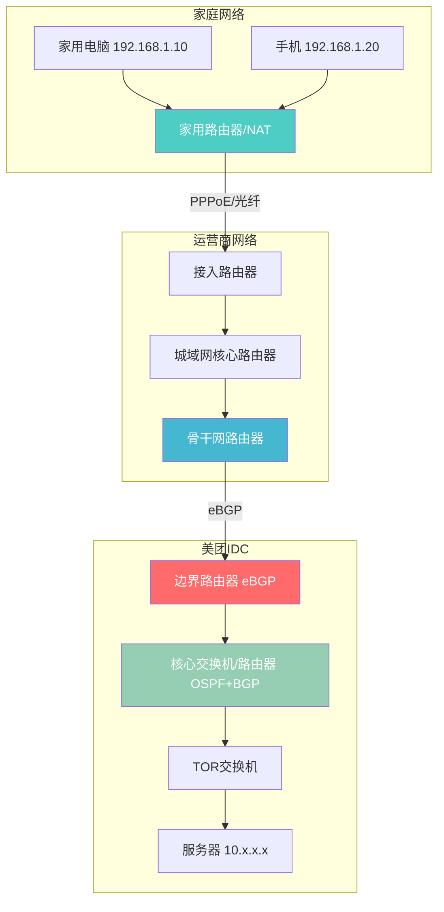

上图展示了从用户家庭到美团 IDC 的完整网络路径。家用路由器把内网流量 NAT 后送到运营商接入网，经过城域网和骨干网传输，最终通过 eBGP 进入美团边界路由器，再由内部 OSPF/BGP 路由到目标服务器。每一个节点都是一次路由转发决策。

---

## 二、路由器的三个平面

### 2.1 控制平面（Control Plane）

控制平面是路由器的"大脑"。它负责运行各种路由协议（OSPF、BGP、IS-IS 等），与邻居交换路由信息，计算出最佳路径，最终生成**路由表（RIB，Routing Information Base）**。控制平面跑在路由器的主控引擎（Route Processor）上，本质上是一套运行在通用 CPU 上的软件进程。

你可以把控制平面理解为一个"导航地图构建系统"——它不断和周围的路由器交流，收集网络拓扑信息，然后在"地图"上计算出从 A 到 B 的最佳路线。这个过程可能需要几秒到几分钟（取决于协议和规模），但对于数据转发来说，只要路由表建好了，转发就是瞬间的事。

控制平面的核心输出是 RIB，它包含路由器知道的所有目的网段及对应的下一跳信息。

### 2.2 转发平面（Data Plane）

转发平面是路由器的"四肢"。它负责接收数据包，根据控制平面生成的 FIB（Forwarding Information Base，转发信息库）查表，然后把包从正确的接口送出去。转发平面的核心要求是**快**——每个包的处理时间必须在微秒甚至纳秒级别。

在高端路由器上，转发平面由专门的硬件芯片（ASIC、NPU）实现，数据包根本不需要经过主控 CPU。这就是为什么一台核心路由器每秒能转发几十亿个包，而它的 CPU 利用率可能只有 5%。

转发平面对每个 IP 包做的事情包括：解封装（去掉二层帧头）→ 查 FIB 表找到下一跳和出接口 → 查 ARP 表获取下一跳 MAC 地址 → 重写帧头（源 MAC 改为本路由器出接口 MAC，目的 MAC 改为下一跳 MAC）→ TTL 减 1 → 重新计算校验和 → 从出接口发送。

### 2.3 管理平面（Management Plane）

管理平面是路由器的"管家"。它负责配置管理、性能监控、故障诊断等。我们通过 CLI（命令行）、SNMP、NETCONF/YANG、Web 界面等方式与路由器交互，这些都是管理平面的功能。

管理平面和控制平面、转发平面之间有明确的隔离。一个设计良好的路由器，即使管理平面出了问题（比如 SSH 进程崩溃），控制平面和转发平面仍然正常工作，数据包照常转发。

### 2.4 为什么控制面和转发面要分离

早期路由器（比如 90 年代的 Cisco 2500）是"单处理器架构"——一个 CPU 既跑路由协议又做包转发。这在流量小的时候没问题，但当网络规模增大，路由协议计算的 CPU 开销和包转发的 CPU 开销互相争抢，导致两个问题：一是路由协议可能因为 CPU 被转发占用而超时，导致邻居断开；二是转发性能受限于 CPU 处理能力。

分离后，控制平面用通用 CPU（擅长复杂逻辑），转发平面用专用芯片（擅长简单但海量的查表操作），各司其职。这就是现代路由器架构的基础。

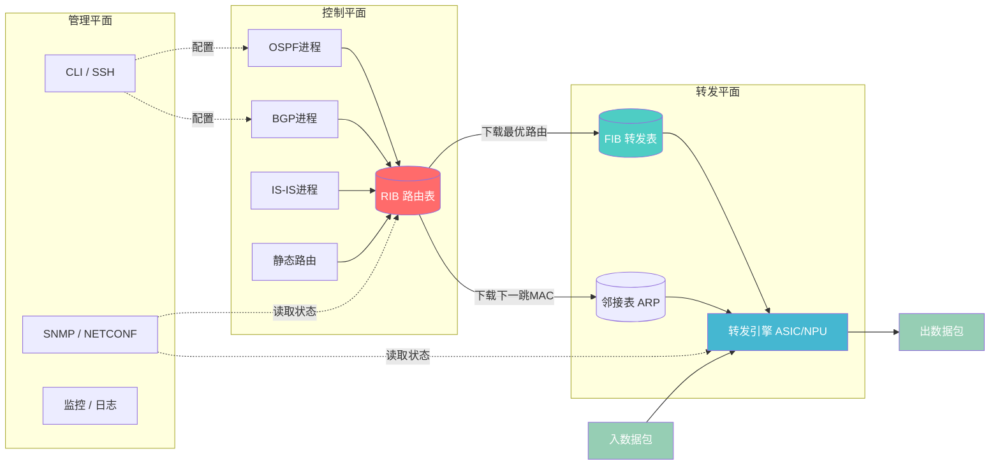

上图清晰地展示了三个平面的关系。控制平面计算 RIB，把最优路由下载到转发平面的 FIB；管理平面通过 CLI/SNMP 对控制和转发平面进行配置和监控；实际数据包只在转发平面流转，不经过控制平面。这种分离架构是理解后面所有高级特性（如 GR、NSR、BFD 联动）的基础。

---

## 三、路由器硬件架构

### 3.1 整体架构

一台高端路由器的内部结构，远比"一个盒子几个网口"复杂得多。它本质上是一个专用的分布式计算系统，由三大部件组成：

**线卡（Line Card）**：负责物理接口的连接和数据包的初步处理。每块线卡上有多个接口（比如 100GE/400GE 光口），以及一个本地转发引擎。数据包从线卡接口进来后，线卡上的芯片就能完成查表和转发决策，不需要送到主控。

**交换网板（Switch Fabric）**：连接所有线卡的"内部高速公路"。当一块线卡收到数据包要送到另一块线卡的接口转发出去时，数据包通过交换网板在内部传输。高端路由器通常有多块交换网板做冗余，交换容量可以达到几十 Tbps。

**主控引擎（Route Processor / RSP）**：路由器的"大脑"，运行操作系统和控制平面软件。负责路由协议计算、RIB 维护、把路由下发到各线卡的 FIB、以及整机管理。

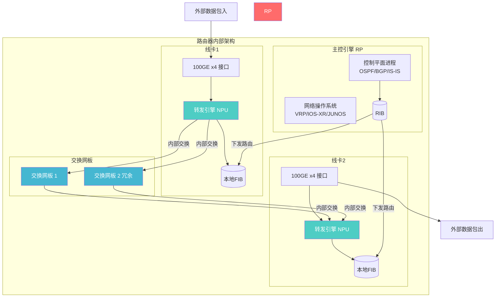

### 3.2 转发引擎类型

转发引擎是转发平面的核心芯片，决定了路由器的转发性能。目前主流的几种类型：

**ASIC（专用集成电路）**：为转发查表量身定制的芯片，性能最高、功耗最低，但灵活性最差——功能在芯片设计时就固化了，想加新特性得重新流片。华为的 Solar 系列芯片就是自研 ASIC，用于其数据中心交换机。ASIC 适合功能相对稳定、追求极致性能的场景。

**NPU（网络处理器）**：介于 ASIC 和通用 CPU 之间。它内部有大量并行处理器（比如思科 LightSpeed 芯片有 672 个并行处理器），可以通过微码编程来支持新协议，同时保持接近 ASIC 的转发性能。NPU 是当前高端路由器的主流选择，兼顾性能和灵活性。

**通用 CPU**：用软件做包转发，灵活性最高（什么协议都能跑），但性能最差。低端路由器和虚拟路由器使用这种方式。优点是成本极低、功能迭代快。

**FPGA（现场可编程门阵列）**：可以通过重新编程改变硬件逻辑，灵活性比 ASIC 好很多，性能比 CPU 好很多。常用于需要快速迭代的新协议验证场景，或者特定功能的硬件加速。在一些白盒交换机和 SmartNIC 中广泛使用。

### 3.3 内存体系

路由器内部不同部件使用不同类型的内存，各有讲究：

**TCAM（三态内容寻址存储器）**：这是转发平面的"神器"。普通内存是"给地址取数据"，TCAM 是"给数据找地址"——你输入一个 IP 地址，TCAM 在一个时钟周期内就能并行匹配所有表项，告诉你最长前缀匹配的结果。这种并行查找能力让它成为 FIB 表存储的首选。但 TCAM 非常昂贵、功耗大、容量有限（通常几兆到几十兆），所以路由器对 TCAM 表项的使用非常吝啬。

**SRAM（静态随机存储器）**：速度比 TCAM 稍慢但仍然很快，用于存储邻接表（ARP 信息）、统计计数器、QoS 队列等转发平面需要频繁访问的数据。

**DRAM（动态随机存储器）**：就是普通的内存，容量大但速度相对慢。用于存储 RIB（路由表）、运行操作系统、缓存数据包等。控制平面的所有数据基本都在 DRAM 里。

### 3.4 高端路由器 vs 低端路由器架构差异

低端路由器（比如华为 AR2200）是"集中式架构"——只有一个 CPU 做所有事情，接口模块通过总线连到 CPU。所有数据包都要经过 CPU 查表转发，性能受限于 CPU。

高端路由器（比如华为 NE9000）是"分布式架构"——每块线卡都有独立的转发芯片和本地 FIB，数据包在本地线卡上就能完成转发决策，只有需要跨线卡转发的包才经过交换网板。主控引擎完全不参与包转发，只负责控制平面。

这种差异就好比"小卖部"和"大型超市"：小卖部一个老板管所有事（集中式），超市每个区域有专门的员工和系统，总部只负责统一调度（分布式）。

### 3.5 典型产品线

| 厂商 | 核心路由器 | 数据中心路由器 | 边界路由器 |
|------|-----------|-------------|-----------|
| 思科 | Cisco 8000（Silicon One芯片） | Nexus 7000/9000 | ASR 9000 |
| 华为 | NE9000（Solar芯片） | CloudEngine 16800 | NE40E/NetEngine 40E |
| Juniper | PTX10000 | QFX10000 | MX480/MX960 |
| 白盒 | - | 基于 Broadcom Tomahawk/Jericho | 基于 Intel/FPGA |

美团的 IDC 网络中，主要使用华为 CloudEngine 系列和部分白盒设备。M-NOS 是美团自研的网络操作系统，运行在白盒交换机上，实现了静态路由、BGP、VRF 等功能的自主管控。

---

## 四、路由表与转发机制

### 4.1 路由表（RIB）结构详解

路由表是路由器的"地图"，每条路由表项至少包含以下字段：

| 字段 | 说明 | 示例 |
|------|------|------|
| 目的网段 | 要到达的目标网络 | 10.20.30.0/24 |
| 下一跳 | 数据包要送到的下一个路由器的 IP | 10.1.1.2 |
| 出接口 | 从本路由器的哪个接口发出 | GE0/0/1 |
| 度量值 | 路由的"代价"，越小越优 | 10 |
| 管理距离 | 路由来源的可信度，越小越优 | 110（OSPF） |
| 路由来源 | 这条路由是怎么来的 | OSPF/Static/BGP |

管理距离（Administrative Distance）是路由器在多个协议都学到了同一个目的网段时，决定信任哪个协议的依据。常见的管理距离值：

| 路由来源 | 管理距离 |
|---------|---------|
| 直连 | 0 |
| 静态路由 | 1 |
| EIGRP内部 | 90 |
| OSPF | 110 |
| IS-IS | 115 |
| RIP | 120 |
| eBGP | 20 |
| iBGP | 200 |

注意 eBGP 的管理距离是 20，比 OSPF 还小——这意味着如果同时从 eBGP 和 OSPF 学到同一条路由，路由器会优先选择 eBGP 的。这在某些场景下需要特别注意。

### 4.2 FIB（转发信息库）与 RIB 的关系

RIB 是控制平面的产物，包含了路由器学到的所有路由。但转发平面不需要知道路由是通过什么协议学来的，也不需要管理距离等信息——它只需要知道"目的网段 → 下一跳 + 出接口"。

FIB 就是 RIB 的"精简版"，由控制平面从 RIB 中提取最优路由后下发给转发平面。在 Cisco 的 CEF（Cisco Express Forwarding）架构中，FIB 表和邻接表（Adjacency Table）配合工作：FIB 表负责"目的网段 → 下一跳"的查找，邻接表负责"下一跳 → 二层封装信息（MAC地址）"的查找。

这种分离的好处是转发时不需要做递归查找（先查路由找到下一跳，再查ARP找到MAC），两步变一步，大大提高转发效率。

### 4.3 最长前缀匹配算法

当路由器的 FIB 表里有 `10.0.0.0/8` 和 `10.20.30.0/24` 两条路由，一个目的地址为 `10.20.30.5` 的数据包进来，路由器应该选哪条？答案是 `10.20.30.0/24`，因为它的前缀更长（/24 > /8），匹配更精确。这就是**最长前缀匹配（Longest Prefix Match, LPM）**原则。

软件实现 LPM 通常用 Trie 树（字典树）或其变种 Patricia Tree。Trie 树按照 IP 地址的每一位逐层展开，查找时沿着树的路径走到底，最后一个匹配的节点就是最长前缀。但软件 Trie 树查找需要多次内存访问，速度有限。

硬件实现 LPM 则使用 TCAM。把 IP 地址的所有位同时和 TCAM 中所有表项进行并行匹配，一个时钟周期就能得到最长前缀匹配结果。这就是 TCAM 贵但不可或缺的原因。

### 4.4 完整转发流程

一个 IP 数据包从进入路由器到出去，经历了以下完整步骤：


整个过程在高端路由器上完全由线卡上的 ASIC/NPU 硬件完成，耗时几十纳秒。其中第 5 步查 FIB 是核心，TCAM 的并行匹配能力让这一步只需一个时钟周期。

值得注意的是第 8 步 TTL 减 1。每个路由器在转发时都会把 IP 包的 TTL 字段减 1，如果 TTL 减到 0 就丢弃包并回送 ICMP Time Exceeded 消息。这就是 traceroute 工具的原理——通过逐步增加 TTL 值，让路径上的每个路由器依次返回超时消息，从而描绘出完整路径。

---

## 五、静态路由

### 5.1 配置方式

静态路由是最简单的路由方式——管理员手动告诉路由器"要到这个网段，从这个接口走"。没有协议开销，没有收敛过程，配上去立即生效。

CLI 配置示例（华为/思科风格）：

```
# 华为 VRP
ip route-static 10.20.30.0 255.255.255.0 10.1.1.2

# 思科 IOS
ip route 10.20.30.0 255.255.255.0 10.1.1.2
```

JSON 配置示例（OpenConfig/YANG 风格，M-NOS 使用）：

```json
{
  "openconfig-network-instance:network-instances": {
    "network-instance": [
      {
        "name": "default",
        "afts": {
          "ipv4-unicast": {
            "ipv4-entry": [
              {
                "prefix": "10.20.30.0/24",
                "next-hop": {
                  "next-hop-list": {
                    "next-hop": [
                      {
                        "index": 1,
                        "next-hop-address": "10.1.1.2"
                      }
                    ]
                  }
                }
              }
            ]
          }
        }
      }
    ]
  }
}
```

### 5.2 浮动静态路由（主备切换）

浮动静态路由是静态路由的一个巧妙用法：配置一条管理距离大于主路由的静态路由作为备份。正常情况下主路由（比如通过 OSPF 学到的）生效，当主路由断了，浮动静态路由自动"浮上来"接管。

```
# 主路由通过OSPF学习，管理距离110
# 浮动静态路由管理距离设为120，比OSPF大，平时不生效
ip route-static 10.20.30.0 255.255.255.0 10.2.2.2 preference 120
```

当 OSPF 邻居断开、OSPF 路由从 RIB 消失后，这条管理距离 120 的静态路由就会成为到达 10.20.30.0/24 的唯一路由，自动生效。主路由恢复后，静态路由又"沉下去"。这在需要简单主备切换的场景中非常实用。

### 5.3 默认路由

默认路由是"兜底路由"，用 `0.0.0.0/0` 表示。当 FIB 中没有任何具体路由匹配一个目的地址时，就走默认路由。家用路由器上就配了一条默认路由指向运营商网关——你家里所有上网流量都走这条路由出去。

在企业网中，默认路由通常从核心层往下逐级配置：接入层默认路由指向汇聚层，汇聚层指向核心层，核心层指向出口路由器。这样设计的好处是下层路由器不需要知道全网路由，只需要知道"不知道的就往上传"。

### 5.4 递归路由查找

有时候静态路由的下一跳不是直连的，比如：

```
ip route-static 10.20.30.0 255.255.255.0 192.168.100.2
ip route-static 192.168.100.0 255.255.255.0 10.1.1.2
```

第一条路由的下一跳是 192.168.100.2，但路由器没有直连这个网段的接口。于是路由器需要再查一次路由表，发现 192.168.100.0/24 通过 10.1.1.2 可达，而 10.1.1.2 是直连的。这就是递归路由查找（Recursive Lookup）。在 CEF 架构中，递归查找在 FIB 表构建时就已完成，转发时不需要做递归。

### 5.5 静态路由 ECMP 负载分担

如果配置多条等价的静态路由（相同目的网段、相同管理距离、相同度量值），路由器会做 ECMP（Equal Cost Multi-Path）负载分担：

```
ip route-static 10.20.30.0 255.255.255.0 10.1.1.2
ip route-static 10.20.30.0 255.255.255.0 10.1.2.2
```

这样到达 10.20.30.0/24 的流量会在这两条路径间分担。美团的 IDC 网络中广泛使用 ECMP，最多支持 32 路等价路径。

### 5.6 优缺点与适用场景

静态路由的优点是简单、可控、不占用额外资源。缺点是不能自动适应网络变化——链路断了你得手动改配置。因此静态路由适合网络拓扑简单、变化少的场景，比如：出口默认路由、点对点专线备份、小型分支网络。

### 5.7 美团 M-NOS 静态路由配置实践

美团自研的网络操作系统 M-NOS 运行在白盒交换机上，支持通过 JSON/REST API 配置静态路由。和传统 CLI 配置方式相比，M-NOS 的优势是可以通过自动化系统批量下发配置，适合 IDC 大规模部署场景。M-NOS 静态路由模块支持 ECMP、浮动路由、VRF 绑定等完整功能，并且和 BGP 模块联动——当 BGP 邻居断开时，可以自动切换到预配置的静态备份路由。

---

## 六、动态路由协议总览

### 6.1 为什么需要动态路由

静态路由在大规模网络中不可行。想象一个有 100 台路由器的网络，每台路由器需要知道其他 99 台身后的网段。用静态路由意味着每台路由器上要手动配置近百条路由，而且任何一条链路断了都需要人工修改。这在运维上是灾难性的。

动态路由协议让路由器自动学习网络拓扑、自动计算最佳路径、自动在链路故障时切换到备用路径。这就是为什么几乎所有中大型网络都使用动态路由协议。

### 6.2 三大类别

动态路由协议按算法原理分为三类：

**距离矢量（Distance Vector）**：路由器只和直接邻居交换"我的路由表"（距离+方向），不知道全网拓扑。好比"问路"——你问下一个人怎么走，他告诉你怎么走，你不知道整条路的样子。代表协议：RIP、EIGRP。优点是简单，缺点是收敛慢、容易环路。

**链路状态（Link State）**：每台路由器向全网广播自己的"链路状态"（和谁相连、代价多少），所有路由器都收集这些信息拼出完整的网络拓扑图，然后各自用 Dijkstra 算法计算最短路径。好比"每个人把自己的位置和周边道路广播给所有人，大家各自画地图"。代表协议：OSPF、IS-IS。优点是收敛快、无环路、可扩展，缺点是协议复杂、资源消耗较大。

**路径向量（Path Vector）**：路由器交换的不是距离或链路状态，而是完整的"路径"（经过哪些 AS）。代表协议：BGP。BGP 不关心链路代价，而是基于丰富的属性（AS_PATH、Local Preference、MED 等）做策略路由。这是互联网域间路由的唯一协议。

### 6.3 各协议适用场景对比

| 协议 | 类型 | 度量值 | 适用场景 | 收敛速度 | 可扩展性 |
|------|------|--------|---------|---------|---------|
| RIP | 距离矢量 | 跳数 | 小型网络/教学 | 慢（分钟级） | 差（15跳限制） |
| EIGRP | 距离矢量(改进) | 复合度量 | Cisco环境中小型网络 | 快 | 中 |
| OSPF | 链路状态 | Cost(带宽) | 企业网/数据中心 | 快（秒级） | 中（区域划分） |
| IS-IS | 链路状态 | Cost | 运营商骨干/超大数据中心 | 快（秒级） | 高 |
| BGP | 路径向量 | 多属性策略 | 域间路由/大规模数据中心 | 中（可优化） | 极高 |

---

## 七、RIP：最简单的路由协议

### 7.1 工作原理

RIP（Routing Information Protocol）是最古老的路由协议之一，也是理解动态路由的最好入门。它的工作原理非常简单：每台路由器每隔 30 秒把自己的完整路由表发给所有邻居。邻居收到后，如果发现新路由或更优路由就更新自己的路由表，跳数加 1。

RIP 的度量值就是"跳数"——经过几个路由器就是几跳。直连网络是 0 跳，经过一个路由器是 1 跳，以此类推。

### 7.2 跳数度量与最大 15 跳限制

RIP 规定最大跳数为 15，第 16 跳被视为"不可达"。这个限制是 RIP 最大的硬伤——它意味着 RIP 只能用在直径不超过 15 个路由器的网络中。对于现代数据中心和运营商网络来说，这个限制完全不可接受。但这个设计是有道理的：RIP 采用"计数到无穷"的环路检测机制，如果没有跳数上限，环路会导致路由度量值无限增长，永远不会收敛。

### 7.3 防环机制

RIP 的环路问题催生了几个经典的防环机制：

**水平分割（Split Horizon）**：从某个接口学到的路由，不再从该接口发回去。这防止了两台路由器互相"回传"路由形成环路。

**毒性逆转（Poison Reverse）**：水平分割的增强版。不仅不从原接口发回路由，还主动从该接口发送该路由的"毒性"版本（跳数设为 16，即不可达），明确告诉邻居"这个目的地从我这边走不通"。

**触发更新（Triggered Update）**：不等 30 秒定期更新，当路由变化时立即发送更新。这加快了收敛速度。

**抑制计时器（Holddown Timer）**：当一条路由被标记为不可达后，在一段时间内（通常 180 秒）不接受关于该目的地的新的可达信息，防止抖动导致的路由环路。

尽管有这些机制，RIP 在现代网络中已经基本被淘汰，只在教学和小型网络中还有使用。但它作为"第一个路由协议"的地位，对理解后续协议的设计思路很有帮助。

---

## 八、OSPF 深度详解

### 8.1 基本特征

OSPF（Open Shortest Path First）是企业网和数据中心中最常用的 IGP（内部网关协议）。它是链路状态协议，使用 Dijkstra 最短路径优先（SPF）算法计算路由。和 RIP 的"听邻居说"不同，OSPF 是"自己看全图算路线"。

OSPF 的核心特征包括：

- **链路状态**：每台路由器描述自己的"链路状态"（和谁相连、代价多少），通过泛洪（Flooding）让整个区域内的所有路由器都知道。每台路由器最终得到一份完整的区域拓扑数据库（LSDB）。
- **SPF 算法**：基于 LSDB，每台路由器以自己为根节点，用 Dijkstra 算法计算到每个目的网段的最短路径。
- **区域划分**：OSPF 通过把网络划分成多个区域（Area），限制链路状态泛洪的范围。Area 0 是骨干区域，所有其他区域必须和 Area 0 相连。这大大降低了大型网络中 LSDB 的规模和 SPF 计算的开销。
- **快速收敛**：链路状态变化时触发更新，收敛通常在秒级完成。

### 8.2 邻居状态机

OSPF 路由器之间建立邻居关系有一个完整的有限状态机。两个路由器从互不相识到交换完整路由，要经历以下状态：

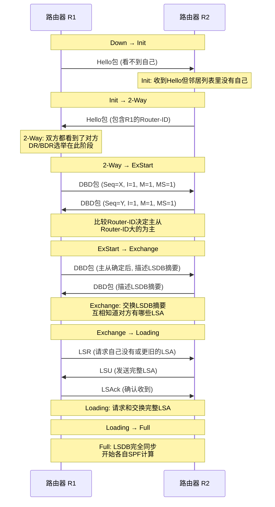

8 个状态分别是：Down → Init → 2-Way → ExStart → Exchange → Loading → Full。其中 2-Way 状态对于广播网络上的非 DR/BDR 邻居就足够了（不需要交换完整 LSDB），只有和 DR/BDR 的邻居关系才会继续到 Full 状态。

### 8.3 五种报文

OSPF 使用 5 种报文来完成邻居建立和路由交换：

| 报文类型 | 作用 | 何时发送 |
|---------|------|---------|
| Type 1: Hello | 发现邻居、维持邻居关系 | 周期发送（默认10秒） |
| Type 2: DBD | 描述 LSDB 摘要 | ExStart/Exchange 阶段 |
| Type 3: LSR | 请求特定 LSA 的完整内容 | Loading 阶段 |
| Type 4: LSU | 发送完整的 LSA | 响应 LSR 或链路变化时 |
| Type 5: LSAck | 确认收到 LSU | 收到 LSU 后 |

Hello 报文是 OSPF 的"心跳"——不仅用来发现邻居，还用来维持邻居关系。如果连续 4 个 Hello 周期（默认 40 秒）没收到邻居的 Hello，就认为邻居断了。这个时间称为 Dead Interval。

### 8.4 LSA 类型详解

LSA（链路状态通告）是 OSPF 链路状态信息的载体。不同类型的 LSA 描述不同范围的信息：

| LSA类型 | 名称 | 产生者 | 泛洪范围 | 内容 |
|---------|------|--------|---------|------|
| Type 1 | Router LSA | 每台路由器 | 区域内 | 路由器的链路和接口信息 |
| Type 2 | Network LSA | DR | 区域内 | 广播网络上的路由器列表 |
| Type 3 | Network Summary LSA | ABR | 整个OSPF域 | 区域间路由汇总 |
| Type 4 | ASBR Summary LSA | ABR | 整个OSPF域 | 到ASBR的路由 |
| Type 5 | AS External LSA | ASBR | 整个OSPF域 | 外部引入的路由 |
| Type 7 | NSSA External LSA | ASBR | NSSA区域内 | NSSA区域引入的外部路由 |

理解 LSA 类型对排查 OSPF 路由问题至关重要。比如，如果你在某个区域看不到外部路由，可能是该区域被配置成了 Stub 或 NSSA；如果看不到其他区域的路由，可能是 ABR 配置有问题。

### 8.5 区域类型

OSPF 的区域类型决定了该区域可以接收哪些 LSA，直接影响路由表的大小和路由器的资源消耗：

**骨干区域（Area 0 / Backbone）**：所有其他区域必须和 Area 0 相连（物理或虚链路）。Area 0 接收所有类型的 LSA。

**标准区域（Standard Area）**：正常接收所有 LSA，包括 Type 5 外部路由。

**Stub 区域**：不接收 Type 5 外部路由，ABR 向该区域下发默认路由。适合不需要访问外部路由的末端区域，减少 LSDB 规模。

**Totally Stubby 区域**：比 Stub 更进一步，连 Type 3 区域间路由都不接收，只有一条默认路由指向 ABR。最大程度减少 LSDB。

**NSSA（Not-So-Stubby Area）**：Stub 区域的增强版。不接收 Type 5，但允许区域内 ASBR 引入外部路由（以 Type 7 LSA 形式），ABR 会把 Type 7 转成 Type 5 传到其他区域。

### 8.6 DR/BDR 选举机制

在广播网络（如以太网）上，如果所有路由器两两建立邻居关系，邻居数量是 O(n²) 增长的。20 台路由器就有 190 对邻居，LSA 泛洪量非常大。OSPF 通过选举 DR（Designated Router）和 BDR（Backup DR）来解决这个问题：

- 所有路由器只和 DR/BDR 建立 Full 邻居关系，与其他路由器只到 2-Way。
- LSA 泛洪通过 DR 中转，避免重复泛洪。
- DR 选举基于接口优先级（默认 1），优先级最高的当选；优先级相同则比较 Router-ID，大的当选。优先级设为 0 表示不参与选举。
- BDR 是 DR 的备份，DR 故障时 BDR 接管。

DR 选举不是抢占式的——即使后来有更高优先级的路由器上线，也不会触发重新选举。这是一个容易被忽略的陷阱。

### 8.7 Cost 计算

OSPF 的度量值称为 Cost，计算公式为：

```
Cost = 参考带宽 / 接口带宽
```

默认参考带宽是 100 Mbps。所以一个 100 Mbps 接口的 Cost 是 1，一个 10 Mbps 接口的 Cost 是 10。到某目的网段的总 Cost 是路径上所有入接口 Cost 之和。

问题在于，当接口带宽超过 100 Mbps（比如 1Gbps 接口）时，Cost = 100/1000 = 0.1，取整后变成 0，OSPF 无法区分千兆和万兆链路。因此现代网络通常需要手动修改参考带宽：

```
auto-cost reference-bandwidth 10000  # 参考带宽改为10Gbps
```

### 8.8 SPF 算法 Dijkstra 过程

每台 OSPF 路由器以自己为根，在 LSDB 构成的有向图上运行 Dijkstra 算法，计算到每个目的网段的最短路径。算法过程简述如下：

1. 把自己加入最短路径树（SPT），Cost 为 0。
2. 查看所有已加入 SPT 的节点的邻居，找到 Cost 最小的未加入节点，加入 SPT。
3. 更新所有未加入节点到根的 Cost（如果新路径更短则更新）。
4. 重复步骤 2-3，直到所有节点都加入 SPT。

SPF 计算完成后，路由器就得到了到每个目的网段的最佳下一跳和 Cost，写入 RIB。当网络拓扑变化（链路断开/恢复）时，触发增量 SPF 或完整 SPF 重新计算。

### 8.9 路由汇总

OSPF 支持在 ABR（区域边界路由器）和 ASBR（自治系统边界路由器）上做路由汇总，减少 LSA 数量和路由表规模：

```
# ABR上的区域间路由汇总
area 1 range 10.20.0.0 255.255.0.0

# ASBR上的外部路由汇总
summary-address 172.16.0.0 255.255.0.0
```

合理规划 IP 地址（连续分配）是路由汇总的前提。美团在 IDC 网络设计中就充分考虑了 IP 地址的连续性，便于在汇聚层和核心层做路由汇总。

### 8.10 OSPF 多区域架构

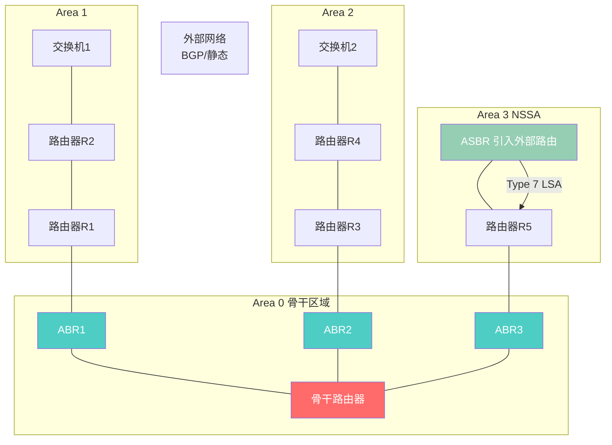

上图中，Area 0 是骨干区域，三个 ABR 分别连接 Area 1（标准区域）、Area 2（标准区域）和 Area 3（NSSA 区域）。Type 1/2 LSA 只在各自区域内泛洪，区域间路由通过 ABR 生成 Type 3 LSA 传递。Area 3 中的 ASBR 引入的外部路由以 Type 7 LSA 形式存在 NSSA 内，ABR3 将其转换为 Type 5 LSA 传到其他区域。

---

## 九、IS-IS：大规模网络的选择

### 9.1 与 OSPF 的对比

IS-IS（Intermediate System to Intermediate System）是另一个链路状态路由协议，和 OSPF 在设计理念上非常相似，但有一些关键差异：

| 特性 | OSPF | IS-IS |
|------|------|-------|
| 封装 | IP 协议号 89 | 直接封装在二层（CLNS） |
| 区域概念 | 基于接口划分区域 | 基于路由器划分层级 |
| 层级 | 两层（Area 0 + 非骨干） | 两层（Level 1 + Level 2） |
| LSA 类型 | 多种（Type 1-7） | 两种（L1 LSP + L2 LSP） |
| 默认度量 | 带宽(Cost) | 默认所有接口Cost=10 |
| 扩展性 | 中（受LSA泛洪限制） | 高（TLV结构易扩展） |
| 典型场景 | 企业网/数据中心 | 运营商骨干/超大数据中心 |

### 9.2 Level 1 / Level 2 层级

IS-IS 的层级概念和 OSPF 不同。在 OSPF 中，区域边界在路由器的接口上——一个路由器的不同接口可以属于不同区域。在 IS-IS 中，路由器本身属于某个层级：

- **Level 1 路由器**：只和同一区域内的 Level 1 路由器交换路由，相当于 OSPF 的区域内路由。
- **Level 2 路由器**：在区域之间交换路由，相当于 OSPF 的骨干。
- **Level 1-2 路由器**：同时参与两个层级，相当于 OSPF 的 ABR。

IS-IS 的骨干是所有 Level 2 路由器的集合，不要求连续的 Area 0，这比 OSPF 的骨干设计更灵活。

### 9.3 为什么超大规模数据中心偏爱 IS-IS

近几年来，超大规模数据中心（如 Facebook、Microsoft 的数据中心）越来越多地选择 IS-IS 而非 OSPF，主要原因：

IS-IS 的 TLV（Type-Length-Value）结构非常容易扩展。要支持新功能只需定义新的 TLV 类型，不需要改变协议基础结构。IPv6 支持就是通过扩展 TLV 实现的，而 OSPF 需要完全重新设计一个 OSPFv3。

IS-IS 直接封装在数据链路层，不依赖 IP，这在某些底层网络架构中是优势。而且 IS-IS 的泛洪范围更容易控制，在超大规模网络中泛洪效率更高。

IS-IS 不像 OSPF 那样有复杂的 LSA 类型和 DR/BDR 选举，在大规模网络中行为更可预测。

### 9.4 NET 地址与 CLNS 编址

IS-IS 使用 CLNS（Connectionless Network Service）编址，每台路由器有一个 NET（Network Entity Title）地址，格式类似 `49.0001.1921.6800.1001.00`。其中 `49` 是私有地址前缀，`0001` 是区域号，中间是系统 ID（通常由 Router-ID 转换而来），最后的 `00` 是 NSEL 选择符（始终为 00）。

虽然 IS-IS 使用 CLNS 地址来建立邻居和交换路由信息，但它完全可以为 IP 路由计算服务——这就是"用 CLNS 跑 IP 路由"的有趣现象。

---

## 十、BGP 深度详解

### 10.1 BGP 是什么

BGP（Border Gateway Protocol）是互联网的"高速公路指示牌"——它是唯一用于 AS（自治系统）之间路由交换的域间路由协议。整个互联网由数万个 AS 组成，AS 之间的路由信息交换全部依赖 BGP。你在家里访问任何网站，数据包经过的跨运营商路径都是 BGP 计算出来的。

BGP 使用 TCP 179 端口建立连接，这和其他 IGP（OSPF 用 IP 协议号 89、IS-IS 用二层封装）不同。用 TCP 的好处是可靠性由 TCP 保证，BGP 本身不需要实现确认和重传机制；坏处是 BGP 邻居关系依赖 TCP 连接，网络抖动可能导致 TCP 断开进而导致 BGP 邻居断开。

BGP 是路径向量协议。它交换的不是"距离"或"链路状态"，而是完整的 AS 路径（AS_PATH）。当你收到一条到达 8.8.8.0/24 的 BGP 路由，AS_PATH 是 `64512 15169`，意味着到达这个网段需要先经过 AS 64512 再到 AS 15169。如果 AS_PATH 中包含自己的 AS 号，说明有环路，丢弃该路由。这就是 BGP 的环路检测机制。

### 10.2 iBGP vs eBGP

BGP 邻居分为两种：

**eBGP（External BGP）**：不同 AS 之间的 BGP 邻居。eBGP 邻居通常是直连的（TTL=1），路由从 eBGP 邻居学到后，AS_PATH 会增加对方 AS 号。eBGP 管理距离为 20。

**iBGP（Internal BGP）**：同一 AS 内的 BGP 邻居。iBGP 邻居不要求直连（TTL=255），路由从 iBGP 邻居学到后，AS_PATH 不变。iBGP 管理距离为 200。

iBGP 有一个核心规则：**从 iBGP 邻居学到的路由不再传给其他 iBGP 邻居**。这是防止环路的需要——因为 iBGP 路由的 AS_PATH 不变，无法通过 AS_PATH 检测环路。这个规则导致 iBGP 邻居必须全互联（Full Mesh），否则某些路由器学不到完整的 BGP 路由。

### 10.3 BGP 选路原则

当 BGP 从多个邻居学到同一目的网段的多条路由时，需要通过一系列属性来决定选哪一条。华为设备的 BGP 选路有 13 条规则（思科设备类似但顺序略有不同），按优先级从高到低：

1. **Next_Hop 可达性**：下一跳不可达的路由不参与选路。这是前提条件。
2. **Preferred-Value**：华为特有属性，本地有效，值越大越优。默认 0。
3. **Local_Preference**：本地优先级，AS 内传递，值越大越优。默认 100。
4. **AS_PATH**：路径越短越优。经过的 AS 越少说明越"直接"。
5. **Origin 属性**：IGP（0）> EGP（1）> Incomplete（2）。表示路由来源。
6. **MED**：Multi-Exit Discriminator，值越小越优。用于影响外部 AS 进入本 AS 的路径选择。
7. **eBGP 优先于 iBGP**：同等条件下，eBGP 学到的路由优于 iBGP。
8. **IGP Cost 到 Next-Hop**：到下一跳的 IGP 度量值越小越优。
9. **Cluster-List 长度**：RR 场景中，经过的 RR 越少越优。
10. **Router-ID**：以上都相同，Router-ID 小的优。
11. **Peer Address**：Router-ID 也相同，邻居 IP 地址小的优。
12. **AS-ID**： Confederation 场景中使用。
13. **EBGP peer 建立时间**：最老的对等体优先。

实际工程中最常用的前几条：Local_Preference（控制出方向选路）、AS_PATH（自然路径长度）、MED（控制入方向选路）。美团的 BGP 路由策略主要也是通过这几个属性来实现。

### 10.4 Route Reflector（路由反射器）

iBGP 全互联在大规模网络中不可行——100 台路由器需要建立 4950 对 iBGP 邻居。Route Reflector（RR，路由反射器）解决了这个问题。

RR 的核心规则是：从 eBGP 邻居学到的路由反射给所有 iBGP 客户端和非客户端；从 iBGP 客户端学到的路由反射给所有非客户端和其他客户端；从 iBGP 非客户端学到的路由只反射给客户端。这样，普通路由器只需要和 RR 建立 iBGP 邻居，不需要和所有其他路由器全互联。

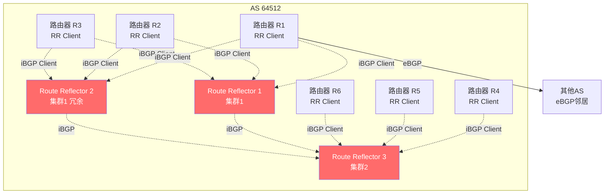

上图展示了典型的 RR 架构。两个 RR 组成一个集群（Cluster）做冗余，客户端只需要和两个 RR 建立邻居。不同集群的 RR 之间通过 iBGP 互联，实现全 AS 的路由传递。美团 IDC 内部的 BGP 也采用 RR 架构来简化 iBGP 全互联问题。

### 10.5 Confederation（联邦）

Confederation 是另一种解决 iBGP 全互联问题的方案。它把一个大 AS 拆分成多个子 AS（Member AS），子 AS 之间使用 eBGP 互联（但行为类似 iBGP——不修改 AS_PATH 的真正内容，只添加本地 Confederation AS 号）。外部看到的仍然是一个大 AS。

Confederation 比 RR 更复杂，实际使用较少。美团网络中使用的是 RR 方案而非 Confederation。

### 10.6 Community 属性

Community 是 BGP 的一个可传递属性，用于给路由打"标签"。它是一个 32 位的值，通常表示为 `AS号:本地标识`，比如 `64512:100`。

常见的 Well-known Community：

- **No-Export**：收到带此标记的路由不传给 eBGP 邻居。
- **No-Advertise**：收到带此标记的路由不传给任何 BGP 邻居。
- **Local-AS**：不传出 Confederation。

在实际工程中，Community 广泛用于路由策略标记。比如企业可以用 Community 来标记某条路由的优先级、来源、用途等，然后在其他路由器上根据 Community 执行不同的策略。

### 10.7 路由策略工具

BGP 拥有丰富的路由策略工具：

**route-map**：最强大的策略工具，可以基于多种条件（前缀、AS_PATH、Community 等）匹配路由，并执行多种动作（修改属性、允许/拒绝等）。

**prefix-list**：精确匹配 IP 前缀，比 ACL 更适合路由过滤场景。

**ACL（Access Control List）**：也可以用于路由过滤，但不如 prefix-list 精确。

**as-path filter**：基于正则表达式匹配 AS_PATH 属性，用于过滤特定 AS 的路由。

```
# 示例：只接受来自AS15169的路由
ip as-path access-list 1 permit _15169_
route-map FILTER-IN permit 10
  match as-path 1
route-map FILTER-IN deny 100
```

### 10.8 BGP 安全：RPKI 路由源验证

BGP 的一个根本性安全问题是：任何 AS 都可以宣告任何 IP 前缀，即使这个前缀不属于它。这就是"BGP 劫持"——2018 年亚马逊 DNS 被劫持事件就是攻击者通过 BGP 宣告了亚马逊的 IP 前缀，把流量引导到自己那里。

RPKI（Resource Public Key Infrastructure）是为了解决这个问题而设计的路由源验证机制。IP 地址分配机构（RIR）通过密码学证书证明某个 IP 前缀属于某个 AS，路由器在收到 BGP 路由时可以验证这个绑定关系，丢弃不合法的路由。RPKI 正在逐步部署，但截至 2025 年覆盖率仍不完整。

### 10.9 美团 BGP 实践

美团在 IDC 4.0 网络架构中大量使用 BGP，以下是关键实践数据：

**IDC 4.0 网络**支持 10 万级服务器接入，单设备 BGP 路由规模达到 400K 条。这是一个相当大的规模——要知道全球 IPv4 BGP 路由表在 2025 年大约是 95 万条，单台设备承载 40 万条说明美团内部路由非常精细。

**M-NOS BGP 收敛优化**：美团自研的 M-NOS 网络操作系统对 BGP 做了多项优化。一是"relax 通告"机制——在 BGP 邻居刚建立时，不完全等待所有路由都收到再开始通告，而是分批快速通告，减少收敛时间。二是"路由下表确认"机制——每条路由写入 FIB 表后确认成功，避免路由"在 RIB 里但没下到 FIB"导致的黑洞。

**GR 配置**：BGP GR（Graceful Restart）配置了 `restart_time 120s`（重启宽限期 120 秒）和 `stalepath_time 240s`（保留旧路由 240 秒）。这意味着当一台路由器重启 BGP 进程时，邻居会在 240 秒内继续使用旧路由转发数据，不中断流量。

**32 路 ECMP**：美团 BGP 支持最多 32 条等价路径负载分担。这意味着到达同一个目的网段可以有 32 条路径同时转发流量，极大提升了带宽利用率和冗余能力。

---

## 十一、路由高级特性

### 11.1 路由重分发

路由重分发（Route Redistribution）是指把一种路由协议学到的路由注入到另一种路由协议中。比如把 OSPF 路由重分发进 BGP，让外部 AS 能通过 BGP 到达内部 OSPF 网段。

路由重分发需要特别注意几个问题：

**度量值转换**：不同协议的度量值含义不同（OSPF 是 Cost，RIP 是跳数，BGP 是多属性），重分发时需要设定种子度量值。

**管理距离冲突**：如果两个协议互相重分发，可能导致路由环路——A 协议的路由被重分发进 B，B 又把它重分发回 A，但管理距离变了导致优选错误的路由。

**路由反馈**：从 A 重分发到 B 的路由，不能再从 B 重分发回 A。通常通过 route-map 和 tag 机制来防止。

### 11.2 路由过滤

路由过滤是在路由协议层面控制哪些路由可以接收或发送。常用工具是 prefix-list 和 route-map。

```
# 只允许10.20.0.0/16及其子网
ip prefix-list ALLOW seq 5 permit 10.20.0.0/16 le 32
# 应用到BGP邻居
neighbor 10.1.1.2 prefix-list ALLOW in
```

路由过滤在网络边界尤其重要——你不应该把内部私有路由（10.x.x.x）泄漏到公网 eBGP 邻居，也不应该接受来自公网的私有路由。

### 11.3 策略路由 PBR

普通路由是"看目的地址转发"，策略路由（Policy-Based Routing, PBR）可以基于源地址、协议类型、端口号等做转发决策。

典型场景：网络有两条出口线路（电信和联通），你希望 HTTP 流量走电信，SSH 流量走联通。用普通路由做不到（因为都是基于目的地址），但 PBR 可以。

```
# 匹配HTTP流量
access-list 100 permit tcp any any eq 80
route-map PBR-HTTP permit 10
  match ip address 100
  set ip next-hop 10.1.1.2  # 电信网关
# 应用到入接口
interface GigabitEthernet0/0/0
  ip policy route-map PBR-HTTP
```

PBR 的代价是它在转发平面上执行，需要硬件支持。不是所有设备都支持 PBR 的硬件转发，低端设备上 PBR 可能导致性能下降。

### 11.4 VRF（虚拟路由转发）

VRF（Virtual Routing and Forwarding）是路由器的"虚拟化"技术。它让一台物理路由器上运行多个独立的路由表实例，彼此隔离，就像多台虚拟路由器一样。

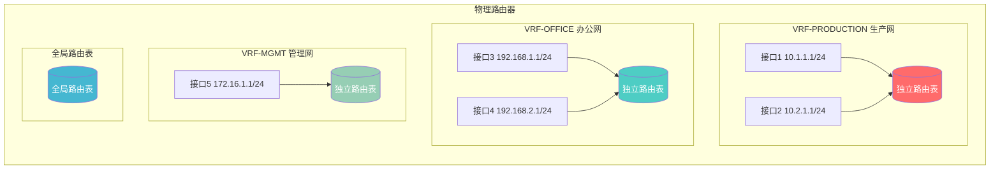

VRF 的核心价值是**网络隔离**。不同 VRF 之间默认不能通信，即使它们的 IP 地址在不同 VRF 中重叠也没关系——因为每个 VRF 有独立的 FIB 表。这在以下场景中非常有用：

- 美团生产网、办公网、管理网隔离
- 多租户云网络
- RoCE（RDMA over Converged Ethernet）场景中存储流量和业务流量隔离

**美团 VRF 实践**：美团在 RoCE 场景中，TH5 交换机使用 VRF 将 RDMA 存储流量和普通业务流量隔离到不同的 VRF 中。这样存储网络的拥塞控制和 QoS 策略不会影响业务网络，反之亦然。VRF 还用于办公网到 IDC 的路径隔离——办公网流量和管理网流量在同一台设备上走不同的 VRF，互不干扰。

VRF 之间如果需要通信，可以通过 VRF Leak（VRF 间路由泄漏）或者通过全局路由表中转。这种跨 VRF 通信需要严格的路由策略控制，确保隔离性不被破坏。

---

## 十二、MPLS与MPLS VPN

### 12.1 MPLS 标签交换原理

MPLS（Multiprotocol Label Switching）是一种介于二层和三层之间的转发技术。传统 IP 转发是"逐跳查路由表"，每个路由器都要做最长前缀匹配，开销大。MPLS 的思路是：在 IP 包前面插入一个固定长度的"标签"，路由器只需要查标签表（定长查找，比最长前缀匹配快得多）就能决定怎么转发。

MPLS 标签长度为 32 位，其中 20 位是标签值，3 位是 EXP（用于 QoS），1 位是 S（栈底标志），8 位是 TTL。

MPLS 的三个基本操作：

- **Push（压入）**：在 IP 包前面加一个标签。由 LER（Label Edge Router，标签边缘路由器）在进入 MPLS 网络时执行。
- **Swap（交换）**：把入标签换成出标签。由 LSR（Label Switching Router，标签交换路由器）在 MPLS 网络内部执行。
- **Pop（弹出）**：去掉标签，恢复纯 IP 包。在离开 MPLS 网络时执行。

### 12.2 LSP/LER/LSR/FEC 概念

- **FEC（Forwarding Equivalence Class）**：转发等价类，一组被同等对待的 IP 包（比如到达同一个网段的包属于一个 FEC）。
- **LSP（Label Switched Path）**：标签交换路径，一个 FEC 在 MPLS 网络中从入到出的路径。
- **LER（Label Edge Router）**：标签边缘路由器，位于 MPLS 网络边缘，负责 Push 和 Pop。
- **LSR（Label Switching Router）**：标签交换路由器，位于 MPLS 网络内部，只做 Swap。

### 12.3 LDP 标签分发

LDP（Label Distribution Protocol）是 MPLS 最常用的标签分发协议。它让相邻的 LSR 互相通告"到这个 FEC 我用这个标签"。LDP 构建 LSP 的过程是"下游自主分配"——每个 LSR 主动告诉上游邻居自己为某个 FEC 分配的标签。

### 12.4 MPLS VPN 架构

MPLS VPN 是 MPLS 最广泛的应用场景。它让运营商在一个物理骨干网上为多个客户构建互相隔离的虚拟专用网。

MPLS VPN 的核心角色：

- **CE（Customer Edge）**：客户边缘路由器，连接到运营商网络。
- **PE（Provider Edge）**：运营商边缘路由器，连接 CE，为每个客户维护独立的 VRF。
- **P（Provider）**：运营商核心路由器，只做标签交换，不知道 VPN 的存在。

MPLS VPN 使用**双层标签**：

- **外层标签（LDP 分配）**：用于在 PE 之间转发，P 路由器只看外层标签。
- **内层标签（BGP VPNv4 分配）**：标识属于哪个 VPN，PE 路由器根据内层标签把包送入对应的 VRF。

VPNv4 地址是 MPLS VPN 的关键创新。普通的 IPv4 地址是 32 位，VPNv4 地址在前面加了 64 位的 RD（Route Distinguisher），变成 96 位。这样不同 VPN 中相同的 IP 地址（比如两个客户都用 10.1.1.0/24）在 VPNv4 中变成不同的地址，不会冲突。

RT（Route Target）是 BGP 的扩展 Community 属性，用于控制 VPN 路由的导入导出。PE 路由器在导出路由时打上 RT，其他 PE 路由器根据配置的 RT import 规则决定是否把路由加入自己的 VRF。

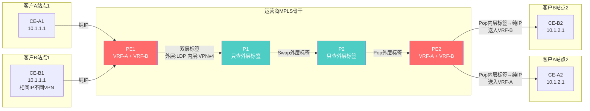

上图展示了客户 A 和客户 B 使用相同 IP 地址段（10.1.1.0/24），但通过 MPLS VPN 的 VRF + RD + RT 机制完全隔离。P 路由器只做外层标签交换，根本不知道有 VPN 的存在。

### 12.5 流量工程（MPLS-TE、RSVP-TE）

MPLS-TE（MPLS Traffic Engineering）允许管理员显式指定 LSP 的路径，而不是让 IGP 按最短路径走。这在以下场景很有用：

- 让流量绕过拥塞链路
- 做带宽预留
- 实现非等价负载分担

RSVP-TE 是 MPLS-TE 的信令协议，用于建立显式路径的 LSP 并预留带宽。RSVP-TE 的复杂性较高，在现代网络中正逐渐被 Segment Routing 替代。

---

## 十三、NAT：地址转换

### 13.1 为什么需要 NAT

NAT（Network Address Translation）的诞生源于 IPv4 地址枯竭。全球 IPv4 地址只有约 43 亿个，而联网设备远超此数。NAT 的解决方案是：内网使用私有 IP 地址（10.x.x.x、172.16.x.x~172.31.x.x、192.168.x.x），在出口处转换成公网 IP 地址。

NAT 还有一个附加的安全好处——隐藏内网结构。外部只能看到 NAT 后的公网 IP，无法直接访问内网私有 IP。

### 13.2 三种 NAT 类型

**静态 NAT**：一对一固定映射。内网 IP A 对应公网 IP B，永远不变。用于需要固定公网 IP 的服务器。

**动态 NAT**：一对多轮换。内网 IP 从一个公网 IP 池中动态选择，用完归还。适合少量公网 IP 服务大量内网用户的场景，但同一时刻一个内网 IP 只能对应一个公网 IP。

**PAT（Port Address Translation）**：也叫 NAPT 或 Overload。多个内网 IP 共用一个公网 IP，通过不同的源端口号区分。这是最常见的 NAT 类型——家用路由器就是 PAT，你的手机和电脑共用一个公网 IP，通过不同的端口区分连接。

### 13.3 SNAT vs DNAT

**SNAT（Source NAT）**：转换源 IP 地址。内网访问外网时，出口路由器把源 IP 从私有地址改成公网地址。这是最常见的 NAT 方向。

**DNAT（Destination NAT）**：转换目的 IP 地址。外部访问公网 IP 时，入口路由器把目的 IP 从公网地址改成内网服务器地址。端口转发（Port Forwarding）就是 DNAT 的一种。

### 13.4 NAT 穿透

NAT 的问题是它破坏了端到端直连能力。两台都在 NAT 后面的设备无法直接通信——它们不知道对方的公网 IP 和端口。这对 P2P 应用（如 VoIP、视频通话）是致命的。

解决方案包括：

**STUN（Session Traversal Utilities for NAT）**：设备通过 STUN 服务器发现自己的公网 IP 和端口映射，然后把这个信息告诉对端。适用于 Cone NAT（对称性较弱的 NAT）。

**TURN（Traversal Using Relays around NAT）**：当 STUN 无法穿透（比如对称 NAT），使用 TURN 服务器做中继。所有流量经过 TURN 服务器转发，代价是增加延迟和服务器成本。

**ICE（Interactive Connectivity Establishment）**：综合框架，先尝试直连，再尝试 STUN，最后回退到 TURN。

### 13.5 大规模 NAT（CGN）

CGN（Carrier-Grade NAT）也叫 NAT444，是运营商级别的大规模 NAT。当运营商的公网 IP 不够分给所有用户时，用户分到的是运营商内部私有 IP（100.64.0.0/10），在运营商出口处再做一次 NAT 转成公网 IP。这意味着用户经历了两层 NAT（家庭 NAT + 运营商 CGN），对某些应用有影响。

### 13.6 NAT64/DNS64

NAT64 是 IPv4 到 IPv6 的过渡技术。它让纯 IPv6 网络中的设备能够访问 IPv4 互联网。DNS64 负责把 IPv4 的 A 记录合成成 IPv6 的 AAAA 记录，NAT64 网关负责在 IPv6 和 IPv4 之间做协议和地址转换。

### 13.7 美团 MGW 的 NAT/FULLNAT 模式

美团自研的 MGW（美团 Gateway）是一个基于 DPDK 的四层负载均衡器。它支持两种工作模式：

**NAT 模式**：标准的 DNAT + SNAT。客户端请求到达 MGW，MGW 把目的 IP 改成后端服务器 IP（DNAT），后端响应时源 IP 是服务器 IP，MGW 再把它改回 VIP（SNAT）。

**FULLNAT 模式**：同时做 DNAT 和 SNAT。客户端请求到达 MGW，MGW 不仅改目的 IP（DNAT），还改源 IP（SNAT）为自己的接口 IP。这样后端服务器看到的源 IP 是 MGW 而非客户端 IP，后端不需要配置 MGW 的 VIP 作为网关。FULLNAT 的优势是部署更灵活（后端服务器不需要特殊路由配置），代价是丢失了客户端真实 IP（需要通过 TOA/Proxy Protocol 传递）。

MGW 的性能是传统 LVS 的 5 倍，外网通过 ECMP + OSPF 实现多活，内网通过 BONDING 实现链路冗余。

---

## 十四、路由器高可用

### 14.1 网关冗余（VRRP/HSRP/GLBP）

当一台路由器作为网关时，如果它宕机了，下挂的所有主机都断网。网关冗余协议通过多台路由器虚拟出一个 IP 来解决这个问题：

**VRRP（Virtual Router Redundancy Protocol）**：IETF 标准（RFC 5798）。多台路由器组成一个虚拟路由器组，共享一个虚拟 IP（VIP）。一台 Master 负责转发，其余 Backup 待命。Master 每秒发送 VRRP 通告，Backup 在 3 倍通告间隔没收到就认为 Master 挂了，选举新 Master。切换时间通常 3 秒。VRRP 优先级可配置，优先级高的优先成为 Master。

**HSRP（Hot Standby Router Protocol）**：思科私有协议，原理和 VRRP 几乎一样，术语不同（Active/Standby vs Master/Backup），报文使用 UDP 1985。

**GLBP（Gateway Load Balancing Protocol）**：思科私有协议，和 VRRP/HSRP 最大的区别是支持负载分担。多台路由器可以同时转发流量，通过虚拟 MAC 地址分配机制让不同主机使用不同的路由器作为网关。

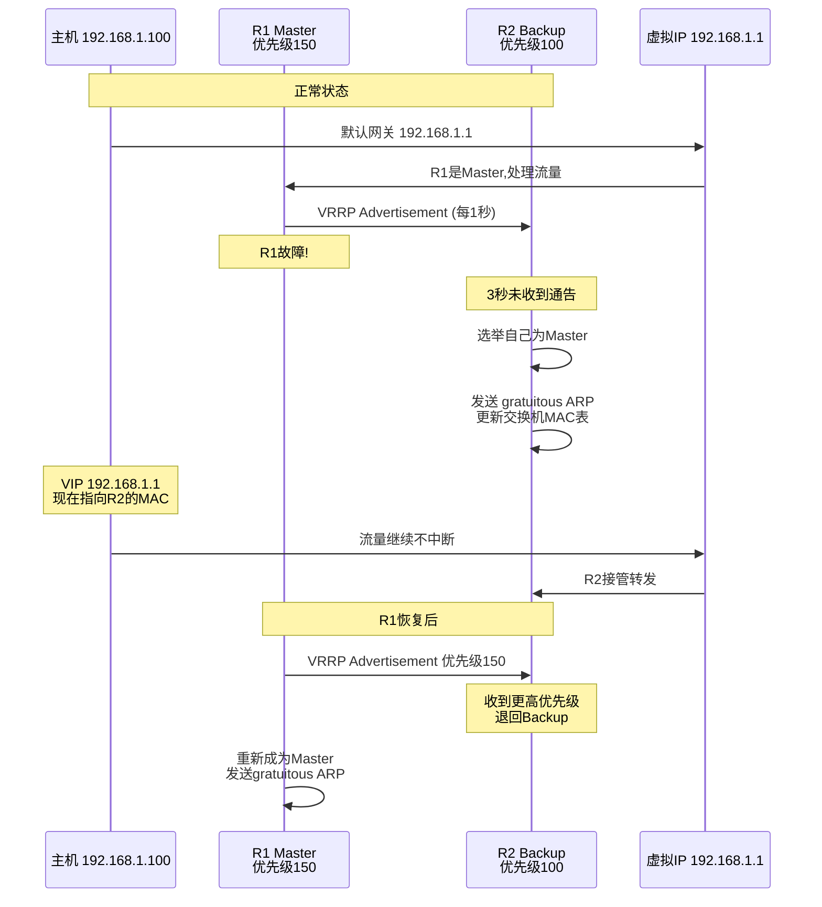

### 14.2 GR 优雅重启

GR（Graceful Restart）解决的是路由器控制平面重启时的流量中断问题。没有 GR 时，路由器重启会导致路由协议邻居断开、路由被撤回、流量黑洞。有了 GR，邻居在一段时间内保留旧路由继续转发，等重启方恢复后再重新同步路由。

GR 依赖于控制平面和转发平面的分离——转发平面在控制平面重启期间仍然保持 FIB 表不变，继续转发数据。

美团 BGP GR 配置了 `restart_time 120s`（邻居等待重启方恢复的最长时间）和 `stalepath_time 240s`（保留旧路由的最长时间）。这意味着 BGP 进程重启后，邻居最多等 120 秒让它恢复，旧路由最多保留 240 秒后如果还没恢复才删除。

### 14.3 NSR/NSF

**NSF（Non-Stop Forwarding）**：和 GR 类似，但更强调转发平面不中断。通常和 GR 配合使用。

**NSR（Non-Stop Routing）**：比 GR 更进一步。GR 依赖邻居的支持（邻居需要保留旧路由），而 NSR 是"本地"的——主控引擎主备切换时，备用主控已经有完整的路由状态，切换后不需要重新建立邻居关系。对外完全无感知。NSR 要求设备有双主控，且主备之间实时同步路由状态。

NSR 是目前最高级别的高可用机制，但实现复杂度也最高，不是所有协议和平台都支持。

### 14.4 BFD 快速故障检测

BFD（Bidirectional Forwarding Detection）是一个轻量级的快速故障检测协议。它通过两个邻居之间周期性发送小的控制包来检测链路连通性，检测速度可以达到 50ms 级别——远快于路由协议自己的检测机制（OSPF Dead Interval 默认 40 秒，BGP Hold Time 默认 180 秒）。

BFD 本身不负责路由计算，它只是告诉路由协议"链路断了"。当 BFD 检测到故障时，立即通知关联的路由协议（OSPF/BGP/静态路由），路由协议立即触发收敛，而不需要等自己的 Hello 超时。

BFD 与 OSPF/BGP 联动是大型网络的标配。美团网络中 BFD 广泛部署在关键链路上，配合路由协议实现秒级收敛。

### 14.5 路由收敛过程与美团 SLA 指标

路由收敛是指从故障发生到网络恢复正常的整个过程。典型的收敛过程：

1. 物理层检测到链路故障（几个毫秒）
2. BFD 检测到故障（50ms）
3. BFD 通知路由协议
4. 路由协议触发路由更新（泛洪 LSA 或发送 BGP Update）
5. 各路由器重新计算路由（SPF 或 BGP 选路）
6. 新路由写入 FIB
7. 流量恢复

美团网络的 SLA 指标非常严格：

- **单端口中断收敛 < 1 秒**：某个端口 down 后，1 秒内流量切换到备用路径。
- **单路光缆中断收敛 < 1 秒**：某条光缆断开后，1 秒内恢复。
- **双路光缆中断收敛 < 40 秒**：同时断两路光缆（极端故障），40 秒内恢复。

这些指标靠 BFD（50ms 检测）+ OSPF/BGP 快速收敛 + ECMP 冗余路径 + GR/NSR 保持转发共同实现。

---

## 十五、路由安全

### 15.1 ACL

ACL（Access Control List）是路由器最基础的安全工具，用于在接口层面过滤数据包。

**标准 ACL**：只匹配源 IP 地址，编号 1-99。

```
access-list 10 permit 192.168.1.0 0.0.0.255
access-list 10 deny any
```

**扩展 ACL**：匹配源 IP、目的 IP、协议、端口等，编号 100-199。

```
access-list 100 permit tcp 192.168.1.0 0.0.0.255 any eq 443
access-list 100 deny ip any any
```

**命名 ACL**：用名称代替编号，更易管理，支持在中间插入规则。

ACL 在路由器安全中的作用包括：过滤管理访问（只允许特定 IP SSH/Telnet）、过滤路由更新、在边界接口过滤非法流量等。

### 15.2 uRPF 单播反向路径转发

uRPF（Unicast Reverse Path Forwarding）是一种防 IP 欺骗的技术。它的原理是：收到一个数据包后，检查其源 IP 地址，反查路由表看到达这个源 IP 应该从哪个接口进来。如果实际收到包的接口和路由表指示的接口不一致，就丢弃这个包——这很可能是伪造源 IP 的攻击包。

uRPF 有两种模式：

- **严格模式（Strict）**：不仅要求源 IP 可路由，还要求必须从同一个接口收到。在非对称路由环境中会误丢正常包。
- **松散模式（Loose）**：只要求源 IP 在路由表中可达（从任何接口都行），不要求接口匹配。适合非对称路由环境。

### 15.3 CoPP 控制平面保护

CoPP（Control Plane Policing）是保护路由器控制平面的机制。路由器的控制平面 CPU 资源有限，如果攻击者发送大量 ICMP、TCP SYN 等需要 CPU 处理的包，可能导致 CPU 满载，路由协议断开，整台路由器瘫痪。

CoPP 在转发平面到控制平面的通道上部署策略，限制各类协议报文上送 CPU 的速率。比如限制 ICMP 上送速率为 100pps，BGP 报文不受限（因为来自可信邻居），SNMP 限制为 50pps 等。

### 15.4 RPKI 路由源验证

前文 BGP 部分已介绍 RPKI 的原理。在路由安全层面，RPKI 是防止 BGP 路由劫持的第一道防线。建议所有运行 eBGP 的边界路由器都启用 RPKI 验证。

### 15.5 路由器 vs 防火墙 vs 安全网关

| 特性 | 路由器 | 防火墙 | 安全网关 |
|------|--------|--------|---------|
| 核心功能 | 路由转发 | 访问控制 | 综合安全 |
| 状态检测 | 不支持 | 支持（状态防火墙） | 支持 |
| 应用层识别 | 不支持 | 部分（NGFW） | 支持（DPI） |
| VPN | 部分 | 支持 | 支持 |
| IPS/IDS | 不支持 | NGFW支持 | 支持 |
| 性能 | 高（硬件转发） | 中 | 中低 |
| 部署位置 | 网络各处 | 网络边界 | 网络边界 |

路由器的主要职责是转发，安全能力是附加的；防火墙的主要职责是安全控制；安全网关是综合安全设备。在实际网络架构中，三者通常配合使用。

### 15.6 美团办公网到 IDC 的安全路径

美团办公网到 IDC 的流量不是直连的，中间经过防火墙白名单过滤。典型路径有两条：

**专线路径**：办公网（如石家庄）→ 防火墙（白名单过滤）→ IDC 核心网络。防火墙只放行预配置的业务端口和 IP 白名单，其他流量全部拒绝。

**VPN 路径**：远程办公 → VPN 网关 → VPN 防火墙 → IDC 核心网络。VPN 防火墙同样做白名单过滤，且 VPN 认证确保只有授权用户可以接入。

这种"路由器负责路由、防火墙负责安全"的分工模式是企业网的标准做法。路由器专注于高效转发，安全策略交给专业的防火墙设备执行。

---

## 十六、现代路由技术

### 16.1 Segment Routing（SR-MPLS、SRv6）

Segment Routing（SR）是近十年来最重要的路由技术革新之一。它的核心理念是"源路由"——由源节点决定数据包经过的路径，中间节点只需按照指令转发。

**SR-MPLS**：使用 MPLS 标签栈来表示路径。源节点在数据包上压入一个标签栈，每个标签代表一个"段"（Segment）。中间节点弹出当前标签，根据标签值转发到下一个段。和传统 MPLS-TE 相比，SR-MPLS 不需要 RSVP-TE/LDP 信令协议，标签由 IGP（OSPF/IS-IS）或 BGP 分发，大幅简化了协议栈。

**SRv6**：使用 IPv6 扩展头来携带段信息。每个段是一个 128 位的 IPv6 地址（称为 Segment Identifier, SID）。SRv6 的优势是原生支持 IPv6，不需要 MPLS 数据平面，编程能力更强。但 128 位 SID 的开销比 20 位 MPLS 标签大很多，对硬件转发性能有影响。

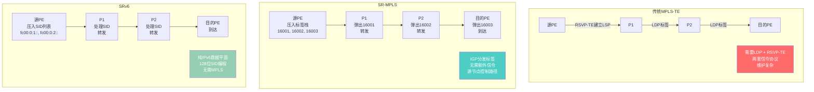

SR 的核心优势是简化——不需要 LDP、不需要 RSVP-TE，标签/SID 由 IGP 或 BGP 统一分发，控制平面大幅简化。这也是为什么大型网络（包括 Google、Microsoft 的骨干网）都在向 SR 迁移。

### 16.2 SD-WAN 原理

SD-WAN（Software-Defined WAN）是企业广域网的革命性技术。传统企业 WAN 使用专线（MPLS VPN）连接各分支机构，成本高、部署慢、灵活性差。SD-WAN 的思路是：用软件定义的方式，混合使用多种链路（专线、互联网、4G/5G），实现智能选路和集中管理。

SD-WAN 的三个核心特征：

**控制面分离**：传统路由器的控制面和转发面在同一设备上，SD-WAN 把控制面抽到集中的控制器（SD-WAN Controller），设备只负责转发。控制器全局视角，可以做出更优的路由决策。

**应用感知**：SD-WAN 能识别应用类型（HTTP、视频会议、ERP 等），根据应用需求选择最佳链路。比如视频会议走低延迟专线，大文件传输走高带宽互联网链路。

**混合 WAN**：同时利用 MPLS 专线、互联网宽带、4G/5G 等多种链路，通过 Overlay 隧道（IPsec/GRE）在 Underlay 之上构建虚拟网络。链路故障时自动切换，用户无感知。

SD-WAN 通常采用 Overlay 模式——在物理网络（Underlay）之上通过隧道构建虚拟网络（Overlay），屏蔽底层链路的差异。

### 16.3 IPv6 路由

IPv6 路由协议和 IPv4 的对应关系：

- **OSPFv3**：OSPF 的 IPv6 版本。不只是支持 IPv6 地址，协议本身也做了改进（如移除了认证字段，改用 IPsec 认证）。
- **BGP4+（MP-BGP）**：BGP-4 通过 MP-BGP 扩展支持 IPv6 地址族（AFI 2）。BGP4+ 可以同时承载 IPv4 和 IPv6 路由。
- **IS-IS for IPv6**：IS-IS 通过 TLV 扩展支持 IPv6，不需要新的协议版本。这是 IS-IS TLV 可扩展性优势的体现。

IPv6 的部署不是一蹴而就的，通常采用双栈（同时运行 IPv4 和 IPv6）或隧道过渡（如 6to4、GRE 隧道）的方式。

### 16.4 虚拟路由器

虚拟路由器是以软件形态运行在通用服务器上的路由器。随着 NFV 的发展，虚拟路由器在企业网和云数据中心中越来越常见。

主流虚拟路由器：

- **VyOS**：基于 Debian Linux 的开源虚拟路由器，支持 BGP/OSPF/静态路由/VRF/IPsec 等。配置方式类似传统路由器 CLI。
- **FRRouting（FRR）**：从 Quagga fork 出来的开源路由协议栈，支持 BGP/OSPF/IS-IS/RIP/EIGRP。可以集成到各种网络平台中。
- **Bird**：轻量级路由守护进程，主要支持 BGP 和 OSPF。广泛用于互联网交换中心（IXP）和大规模 BGP 场景。
- **Quagga**：早期的开源路由软件，功能齐全但社区不如 FRR 活跃。

虚拟路由器的优势是灵活、便宜、可编程。劣势是性能不如硬件路由器——通用 CPU 做包转发的吞吐量远低于 ASIC/NPU。但在不需要极限性能的场景（如控制层面、路由发布、中小流量路由），虚拟路由器完全够用。

### 16.5 美团 内部DNS 通过 quagga 发布 VIP

美团内部的 内部DNS系统使用 quagga 来发布 VIP（Virtual IP）路由。工作原理是：内部DNS 为某个服务分配一个 VIP，然后通过 quagga 配置 OSPF 和 BGP 把这个 VIP 路由发布到网络中。当客户端访问这个 VIP 时，流量被路由到对应的后端服务器。

这种设计的好处是：VIP 路由通过标准的路由协议发布，网络设备不需要特殊配置，流量路径完全由路由协议决定。当后端服务器迁移时，只需要更新 quagga 的路由发布，网络自动收敛。

---

## 十七、路由器在企业网络中的实战

### 17.1 IDC 边界路由器与公网接入

美团每个 IDC 都有边界路由器（Border Router），通过 eBGP 和三大运营商（电信、联通、移动）互联。边界路由器从运营商学到互联网路由（Full Table，约 95 万条 IPv4 路由），同时向运营商宣告美团自己的公网 IP 段。

多运营商接入的好处是冗余和优化：当电信链路故障时，流量自动走联通或移动；BGP 通过 Local_Preference 等属性控制流量从哪个运营商进出。美团还可以通过 BGP Community 和运营商协商做流量工程，比如优先走某个运营商访问特定区域。

### 17.2 多 IDC 互联

美团在全国有多个 IDC，通过专线互联。IDC 之间运行 iBGP 交换路由信息，物理链路使用裸光纤或波分复用（WDM）。

关键的延迟数据：

- 北京-上海：约 30ms（京沪线约 2254km，光纤中光速约 2/3 真空光速）
- 北京-怀来：约 2.7-5ms
- 北京-中卫：约 22-25ms

这些延迟数据对应用架构设计至关重要。比如对延迟敏感的数据库同步通常部署在同城 IDC（北京-怀来 2.7ms），跨城的灾备同步（北京-上海 30ms）只能用于异步复制。

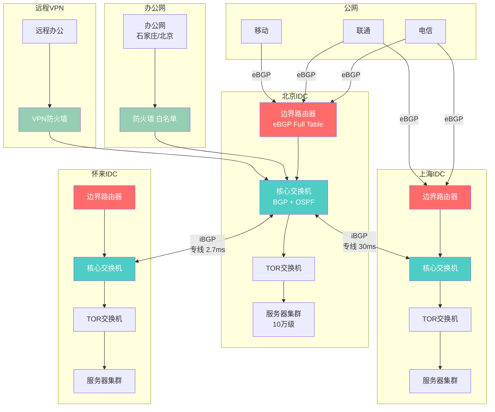

### 17.3 办公网到 IDC 的路由路径

美团办公网到 IDC 的流量需要经过防火墙白名单过滤，不能直连。典型路径：

- **专线路径**：办公网（石家庄/北京）→ 专线 → 防火墙（白名单过滤）→ IDC 核心交换机 → 目标服务器。防火墙只放行预配置的 IP 和端口。
- **VPN 路径**：远程办公人员 → VPN 网关 → VPN 防火墙（白名单过滤）→ IDC 核心交换机 → 目标服务器。

这种架构确保了只有经过授权的流量才能进入 IDC，防火墙做细粒度的访问控制，路由器负责高效路由转发。

### 17.4 MGW 负载均衡与 ECMP/OSPF

美团 MGW 是基于 DPDK 的四层负载均衡器，在网络中的角色类似一台特殊的路由器/L4 交换机：

**外网模式**：MGW 对外通过 VIP 接收公网流量，多个 MGW 实例通过 ECMP + OSPF 实现流量分发。公网流量到达边界路由器后，通过 ECMP 散到多个 MGW 实例，OSPF 负责感知 MGW 的健康状态。如果某个 MGW 实例故障，OSPF 撤回其路由，ECMP 自动把流量转到其他实例。

**内网模式**：MGW 内网侧通过 BONDING（链路聚合）连接到后端服务器网络。BONDING 提供链路级冗余，单条链路故障不影响整体可用性。

MGW 的性能是传统 LVS 的 5 倍，这得益于 DPDK 的用户态转发——绕过内核协议栈，直接从网卡收包处理，避免了内核上下文切换的开销。

### 17.5 网络故障收敛 SLA

美团对网络故障收敛的 SLA 要求：

- **单端口中断**：收敛时间 < 1 秒。靠 BFD 50ms 检测 + OSPF/BGP 快速收敛 + ECMP 冗余路径实现。
- **单路光缆中断**：收敛时间 < 1 秒。通常有备用光缆路由，BFD 检测到故障后立即切换。
- **双路光缆中断**：收敛时间 < 40 秒。这是极端故障（同时断两路），需要更长的收敛时间来重新计算路径和等待上层协议超时。

这些 SLA 指标在业界属于领先水平，背后是 BFD + GR + NSR + ECMP + 快速 SPF 等一系列高可用技术的综合运用。

---

## 十八、EVPN：下一代 VPN 技术

### 18.1 EVPN 是什么

EVPN（Ethernet VPN，RFC 7432）是基于 BGP 的下一代 VPN 技术。传统 VPN 技术各有局限：MPLS VPN（L3VPN）只能做三层 VPN，不能传递 MAC 地址；VPLS（Virtual Private LAN Service）可以做二层 VPN 但信令复杂、扩展性差。EVPN 统一了二层和三层 VPN，用 BGP 作为唯一控制面协议，同时传递 MAC 地址、IP 地址和路由信息。

EVPN 的核心思想是：**用 BGP 的 MP-BGP 多协议扩展来传递二层 MAC 地址信息**。传统 BGP 只传递 IP 前缀路由，EVPN 引入了新的地址族（EVPN NLRI），可以传递 MAC/IP 绑定信息、IMET（Inclusive Multicast Ethernet Tag）路由等。

### 18.2 EVPN 路由类型

EVPN 定义了 5 种路由类型（NLRI），每种有不同的功能：

| 类型 | 名称 | 功能 | 典型产生者 |
|------|------|------|-----------|
| Type 1 | Ethernet Auto-Discovery (A-D) | 快速收敛、MAC 批量撤回 | VTEP/PE |
| Type 2 | MAC/IP Advertisement | 通告 MAC 和 IP 绑定信息 | VTEP/PE |
| Type 3 | Inclusive Multicast Ethernet Tag | 发现远端 VTEP，建立 BUM 流量转发树 | VTEP/PE |
| Type 4 | Ethernet Segment (ES) | 全活冗余、ESI 自动发现 | VTEP/PE |
| Type 5 | IP Prefix | 通告 IP 前缀路由（L3 功能） | VTEP/PE |

**Type 2 路由**是 EVPN 最核心的路由类型。它携带 MAC 地址和可选的 IP 地址信息，类似于传统网络中的"ARP 广播+MAC 学习"，但通过 BGP 控制面完成，不需要泛洪。

**Type 3 路由**解决了 BUM（Broadcast, Unknown Unicast, Multicast）流量的传递问题。每个 VTEP 通过 Type 3 路由向其他 VTEP 宣告自己的存在，建立类似组播树的转发路径，用于 BUM 流量的复制和分发。

**Type 5 路由**让 EVPN 支持纯三层路由——可以直接通告 IP 前缀，不限于同一个子网内的 MAC/IP。这使得 EVPN 可以替代传统的 L3VPN。

### 18.3 EVPN 与 VXLAN 的集成

EVPN 最常见的部署方式是作为 VXLAN 的控制面。传统 VXLAN 依赖"泛洪学习"来发现远端 VTEP 和 MAC 地址——和传统交换机的 MAC 学习类似，但规模一大效率就急剧下降。EVPN 替代了泛洪学习：

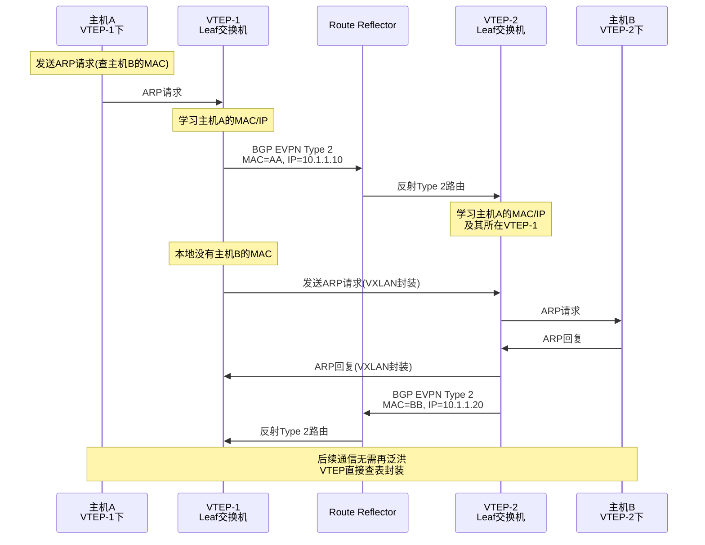

EVPN 的优势：控制面学习替代数据面泛洪学习，大规模网络中 MAC 收敛更快；BGP 的丰富策略可以精细控制路由传播，如用 Route Target 做租户隔离；同时支持二层和三层转发，不需要分开部署 L2VPN 和 L3VPN。

### 18.4 EVPN 与 MPLS VPN 的对比

| 特性 | MPLS L3VPN | MPLS VPLS | EVPN |
|------|-----------|-----------|------|
| 转发类型 | 三层（IP） | 二层（MAC） | 二层+三层 |
| 控制面 | BGP VPNv4 | LDP/RSVP | MP-BGP EVPN |
| MAC 学习 | 不需要 | 数据面泛洪 | 控制面 BGP |
| BUM 流量 | N/A | 泛洪复制 | Type 3 路由树 |
| 多归属 | 不支持 | 有限支持 | 支持（ESI） |
| 扩展性 | 高 | 中 | 高 |
| 部署趋势 | 成熟稳定 | 逐渐被替代 | 快速增长 |

### 18.5 EVPN 多归属（Multi-Homing）

EVPN 的 Multi-Homing 是传统 VPLS 不具备的重要功能。它允许一台主机通过多条链路连接到多台 VTEP/PE，实现冗余和负载均衡。

ESI（Ethernet Segment Identifier）是 Multi-Homing 的核心标识。一组冗余链路共享同一个 ESI，连接到不同 VTEP 的同一 ESI 的链路被视为同一个"以太网段"。Multi-Homing 支持三种模式：全活（All-Active）——所有链路同时转发流量，实现负载均衡；单活（Single-Active）——只有一条链路转发，其他备份；端口列表——基于 VLAN 的负载分担。

### 18.6 美团 EVPN 实践

美团在数据中心网络中逐步引入 EVPN 作为 VXLAN 的控制面：

- Leaf 交换机之间通过 BGP EVPN 交换 Type 2 和 Type 3 路由
- Spine 交换机作为 Route Reflector，减少 iBGP 全互联
- 多归属场景使用 ESI 实现服务器双上联的 All-Active 负载均衡
- 跨数据中心通过 EVPN Type 5 路由实现 L3 互联，替代传统的 VXLAN 泛洪学习

---

## 十九、组播路由：PIM 与 IGMP

### 19.1 组播路由概述

交换机章节介绍了 IGMP Snooping（二层组播），而组播路由是三层（网络层）的组播转发技术。组播路由解决的问题是：当组播源和接收者不在同一个子网时，中间的路由器如何把组播流量从源转发到所有接收者。

组播路由的核心挑战是**构建分发树**——从源到所有接收者的无环路径。有两种分发树模型：

**源树（Source Tree / Shortest Path Tree, SPT）**：以组播源为根，到每个接收者的最短路径。优点是延迟最优，缺点是路由器需要为每个(源, 组)对维护单独的转发表项，表项数量大。

**共享树（Shared Tree / Rendezvous Point Tree, RPT）**：以一个公共的汇聚点（RP）为根，所有组播源先发到 RP，再由 RP 分发到接收者。优点是路由器表项少（每个组只需维护一棵树），缺点是路径可能不是最优的（需要经过 RP 中转）。

### 19.2 PIM（Protocol Independent Multicast）

PIM 是当前最主流的组播路由协议。"Protocol Independent"意味着 PIM 不依赖特定的单播路由协议——它直接使用单播路由表（OSPF/BGP/静态等生成的 RIB）来查找最短路径，而不关心这个路径是怎么算出来的。

**PIM-DM（Dense Mode，密集模式）**：适用于组播组成员密集（大部分子网都有接收者）的场景。工作方式是"泛洪-修剪"：源开始发送组播流量时，PIM-DM 将流量泛洪到所有路由器；没有接收者的路由器发送 Prune 消息，将自己从分发树中剪除；隔一段时间后重新泛洪（周期性刷新）。PIM-DM 使用源树（SPT），简单但泛洪开销大，适合小规模密集环境。现代网络中较少使用。

**PIM-SM（Sparse Mode，稀疏模式）**：适用于组播组成员稀疏（大部分子网没有接收者）的场景。PIM-SM 使用共享树（RPT）作为默认模式，但可以切换到源树（SPT）优化路径。

工作流程：

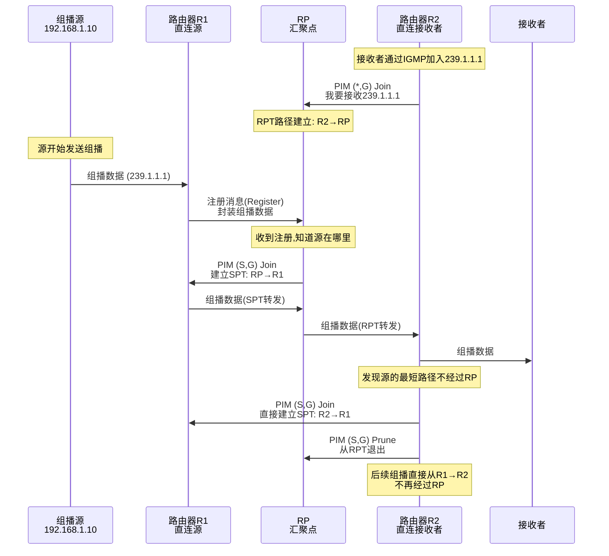

PIM-SM 的关键概念：

- **RP（Rendezvous Point）**：共享树的根节点，所有组播源的注册和接收者的加入都经过 RP。RP 是 PIM-SM 的核心，如果 RP 故障，整个组播系统瘫痪。
- **(*, G) 表项**：共享树表项，`*`表示任意源，`G`表示组播组地址。用于从 RP 到接收者的转发。
- **(S, G) 表项**：源树表项，`S`是源 IP，`G`是组播组地址。用于从源直接到接收者的转发。

**SPT 切换（SPT Switchover）**：PIM-SM 默认使用共享树（RPT），但接收者的 DR（Designated Router）发现到源有更短的路径时，可以直接向源发送(S,G) Join，建立源树。之后组播流量不再经过 RP，直接走最短路径。这个过程称为 SPT 切换。

### 19.3 RP 的选举方式

RP 是 PIM-SM 的关键节点，RP 的选举有三种方式：

**静态 RP**：管理员手动配置每个组播组对应的 RP 地址。简单但不灵活，RP 故障后无法自动切换。

**Auto-RP（Cisco 私有）**：候选 RP（C-RP）向 Auto-RP 映射代理（Mapping Agent）通告自己，映射代理选举出 RP 后向全网通告。支持 RP 冗余，但需要 dense mode 或 sparse-dense 模式来泛洪 Auto-RP 消息。

**BSR（Bootstrap Router，标准）**：IETF 标准。候选 RP（C-RP）向 BSR 路由器通告自己，BSR 收集所有 C-RP 信息后封装在 Bootstrap 消息中泛洪到全网。每台路由器根据相同的算法独立计算出每个组的 RP。BSR 支持 RP 冗余和负载分担。

### 19.4 PIM-SSM（Source-Specific Multicast）

SSM 是 PIM-SM 的一个简化模式。在 SSM 中，接收者必须明确指定要接收哪个源的组播流量——即只需要(S, G)表项，不需要 RP 和共享树。

SSM 的组播地址范围是 `232.0.0.0/8`。当接收者通过 IGMP v3 报告"我要接收来自 192.168.1.10 的 232.1.1.1 组播"时，路由器直接建立从源到接收者的 SPT，不需要 RP。

SSM 的优势：不需要 RP（消除单点故障），不需要源注册过程（延迟更低），安全性更好（接收者明确指定源）。

### 19.5 IGMP 与 PIM 的联动

IGMP 是主机和路由器之间的协议（成员管理），PIM 是路由器之间的协议（路由构建）。两者的配合流程：

1. 主机通过 IGMP Report 告诉直连路由器"我要加入组播组 G"
2. 路由器的 DR（Designated Router，指定路由器）收到 IGMP Report 后，向上游（RP 或源方向）发送 PIM Join
3. PIM Join 逐跳传递，建立分发树
4. 组播源发送的流量沿着分发树到达接收者
5. 主机退出时通过 IGMP Leave 通知路由器，路由器如果没有其他成员了，发送 PIM Prune 退出分发树

### 19.6 组播路由表

路由器的组播路由表和单播路由表是分开维护的。每条组播路由表项包含：

| 字段 | 说明 | 示例 |
|------|------|------|
| (S, G) 或(*, G) | 源和组 | (192.168.1.10, 239.1.1.1) |
| 入接口 | 从哪个接口收到组播流量 | GigabitEthernet0/0/1 |
| 出接口列表 | 从哪些接口转发出去 | GE0/0/2, GE0/0/3 |
| RPF 邻居 | 反向路径检查的下一跳 | 10.1.1.2 |
| 标志 | 表项属性 | SPT, Connected |

**RPF 检查（Reverse Path Forwarding）**：组播路由的核心机制。路由器收到组播包后，检查"如果我要到达源地址 S，应该从哪个接口走"（查单播路由表）。如果实际收到包的接口和单播路由指示的接口一致，RPF 检查通过，接受这个包；否则丢弃。RPF 检查防止了组播流量的环路。

### 19.7 组播在企业网中的应用

| 应用场景 | 组播地址范围 | 典型协议 | 说明 |
|---------|------------|---------|------|
| 视频直播/IPTV | 239.0.0.0/8 | PIM-SM | 企业内部视频分发 |
| 金融行情 | 239.128.0.0/8 | PIM-SSM | 低延迟行情推送 |
| RoCEv2 发现 | 224.0.0.x | IGMP Snooping | RDMA 节点发现 |
| OSPF Hello | 224.0.0.5 | - | 协议自带，不需要 PIM |
| 多媒体会议 | 239.x.x.x | PIM-SM | 视频会议组播 |

### 19.8 美团组播实践

美团网络中的组播应用：

- **MGW 负载均衡**：MGW 使用组播向多个后端服务器分发请求（在特定场景下），通过 PIM-SM 构建分发树
- **容器网络**：部分容器编排场景使用组播进行服务发现，通过 IGMP Snooping 限制组播范围
- **RoCEv2**：RDMA 连接建立使用组播 ARP，交换机配置 IGMP Snooping 精确转发
- **办公网 IPTV**：美团内部视频直播使用 PIM-SM，以核心交换机为 RP

---

## 二十、IPv6 路由深度详解

### 20.1 IPv6 地址结构

IPv6 地址长度为 128 位，是 IPv4（32 位）的 4 倍。地址表示使用冒号分隔的十六进制格式：`2001:0db8:85a3:0000:0000:8a2e:0370:7334`。可以通过省略前导零和连续零块简化为：`2001:db8:85a3::8a2e:370:7334`。

IPv6 地址分为三类：

| 类型 | 前缀 | 说明 | 示例 |
|------|------|------|------|
| 全球单播（GUA） | 2000::/3 | 全球唯一，可路由 | 2001:db8::1 |
| 链路本地（LLA） | fe80::/10 | 仅限同一链路，自动生成 | fe80::1 |
| 唯一本地（ULA） | fc00::/7 | 类似私有 IP，不路由到公网 | fd00::1 |

此外还有组播地址（ff00::/8）和任播地址（使用单播地址空间，但语义是"最近的一台"）。

### 20.2 NDP（Neighbor Discovery Protocol）

IPv6 中没有 ARP 协议——ARP 的功能被 NDP（Neighbor Discovery Protocol，RFC 4861）取代。NDP 使用 ICMPv6 报文，比 ARP 更安全、更高效。

**NDP 的核心功能**：

**地址解析**（替代 ARP）：主机 A 想获取主机 B 的 MAC 地址，发送 ICMPv6 Neighbor Solicitation（NS）到主机 B 的 Solicited-Node 组播地址。主机 B 收到后回复 Neighbor Advertisement（NA），包含自己的 MAC 地址。Solicited-Node 组播地址是从目标 IPv6 地址派生的——取目标地址的最后 24 位，加上 `ff02::1:ff00:0/104` 前缀。这意味着 NS 报文只发送到特定的组播组，而不是像 ARP 那样广播到所有设备。

**DAD（Duplicate Address Detection）**：主机在配置一个新的 IPv6 地址后，先发送 NS 报文检查是否有其他设备使用了相同的地址。如果收到 NA 回复，说明地址冲突，不使用该地址。DAD 是 IPv6 的内置安全机制，IPv4 中没有。

**Router Discovery**：主机发送 Router Solicitation（RS）到 `ff02::2`（所有路由器组播地址）。路由器回复 Router Advertisement（RA），包含网络前缀、默认网关、MTU 等信息。主机根据 RA 信息自动配置 IPv6 地址（SLAAC）。

### 20.3 SLAAC 与 DHCPv6

IPv6 地址配置有两种自动方式：

**SLAAC（Stateless Address Autoconfiguration）**：主机从 RA 中获取网络前缀（如 `2001:db8:1::/64`），主机自己生成接口标识符（EUI-64 或随机生成），拼接成完整 IPv6 地址。不需要 DHCP 服务器，完全无状态。安全性方面，主机可以使用 RFC 7217 地址生成算法（基于网络信息+密钥的哈希），生成不可预测的地址，防止地址扫描攻击。

**DHCPv6**：和 IPv4 的 DHCP 类似，由 DHCPv6 服务器分配地址。支持有状态（DHCPv6 分配完整地址）和无状态（DHCPv6 只提供 DNS 等额外信息，地址通过 SLAAC 获取）两种模式。

RA 消息中的 M 标志（Managed）和 O 标志（Other）决定主机使用哪种方式：M=0, O=0 表示仅 SLAAC；M=0, O=1 表示 SLAAC + DHCPv6（无状态，DHCPv6 提供 DNS 等）；M=1, O=1 表示仅 DHCPv6（有状态）。

### 20.4 MLD（Multicast Listener Discovery）

MLD 是 IPv6 版的 IGMP，功能相同——主机通过 MLD 告诉路由器它要加入哪个组播组。MLD 使用 ICMPv6 报文。

| 版本 | 对应 IGMP 版本 | 新特性 |
|------|------------|--------|
| MLD v1 | IGMP v2 | 基本加入/离开 |
| MLD v2 | IGMP v3 | 源过滤（SSM 支持） |

MLD 使用 IPv6 组播地址（ff02::/16 范围）进行通信。

### 20.5 IPv6 路由协议

**OSPFv3**：OSPFv3 是 OSPF 的 IPv6 版本（RFC 5340），与 OSPFv2 的关键区别：

| 特性 | OSPFv2 | OSPFv3 |
|------|--------|--------|
| 地址族 | IPv4 | IPv6 |
| 协议号 | 89 | 89 |
| 组播地址 | 224.0.0.5/6 | ff02::5/6 |
| 认证 | 协议内置 | 移除，使用 IPsec |
| LSA 类型 | 7 种 | 9 种（增加了 Link LSA 等） |
| 实例 ID | 不支持 | 支持（同链路多实例） |
| 地址语义 | 路由器接口配 IP | 链路本地地址建邻居，全球地址在 LSA 中 |

OSPFv3 的一个有趣特性是**实例 ID**——同一链路上的两台路由器如果配置了不同的实例 ID，它们不会建立邻居关系。这允许在同一物理网络上运行多个独立的 OSPF 实例。OSPFv3 还引入了 AF（Address Family）扩展，可以在同一个 OSPFv3 进程中同时支持 IPv4 和 IPv6（RFC 5838）。

**MP-BGP for IPv6**：BGP-4 本身只支持 IPv4。MP-BGP（Multiprotocol BGP，RFC 4760）通过扩展 MP_REACH_NLRI 和 MP_UNREACH_NLRI 属性支持多协议。IPv6 使用 AFI=2（Address Family Identifier）和 SAFI=1。MP-BGP 可以同时承载 IPv4 和 IPv6 路由，不需要分开运行两个 BGP 实例。

**IS-IS for IPv6**：IS-IS 通过 TLV 扩展支持 IPv6，不需要新版本。IS-IS 的 TLV 236（IPv6 Reachability）携带 IPv6 路由信息。这是 IS-IS TLV 可扩展性优势的典型体现——OSPF 需要全新的 OSPFv3，而 IS-IS 只需要定义新的 TLV。

### 20.6 IPv6 过渡技术

从 IPv4 到 IPv6 的过渡不是一蹴而就的，主流过渡策略：

**双栈（Dual Stack）**：设备同时运行 IPv4 和 IPv6 协议栈，同时分配 IPv4 和 IPv6 地址。DNS 返回 A 记录（IPv4）和 AAAA 记录（IPv6），应用根据结果选择协议。双栈是最简单的过渡方式，但要求网络同时支持两套协议，增加了运维复杂度。

**隧道（Tunneling）**：在 IPv4 网络上封装 IPv6 流量（或反之）。常见的隧道技术：6to4（RFC 3056）——IPv6 包封装在 IPv4 中，使用特定的前缀 `2002::/16`；6rd（IPv6 Rapid Deployment）——6to4 的改进版，使用 ISP 自定义前缀；GRE 隧道——通用的隧道技术，可以封装任何协议。

**NAT64/DNS64**：DNS64——DNS 服务器收到只返回 A 记录（IPv4）的请求时，合成一个 AAAA 记录（IPv6），将 IPv4 地址映射到 IPv6 地址；NAT64——网关在 IPv6 和 IPv4 之间做协议和地址转换。适用于纯 IPv6 网络访问 IPv4 互联网的场景。

### 20.7 美团 IPv6 实践

美团正在推进 IPv6 部署：

- **公网接入**：美团 IDC 边界路由器已与运营商建立 IPv6 BGP 邻居，宣告美团的 IPv6 公网前缀
- **外网服务**：部分面向用户的服务已支持 IPv6 访问，通过双栈方式部署
- **内网过渡**：内网仍以 IPv4 为主，新业务系统在条件允许时优先支持 IPv6
- **MGW 负载均衡**：MGW 支持 IPv6 VIP，可以将 IPv6 用户请求转发到 IPv4 后端服务器（类似 NAT64 功能）

---

## 二十一、路由表规模管理与 TCAM 容量规划

### 21.1 TCAM 容量的限制

前文提到，TCAM（三态内容可寻址存储器）是路由器/三层交换机 FIB 表的存储介质，具有一个时钟周期并行查找的能力。但 TCAM 有致命的缺点：**贵、功耗大、容量有限**。

典型设备的 TCAM 容量：

| 设备类型 | FIB TCAM 容量 | ACL TCAM 容量 | 说明 |
|---------|-------------|-------------|------|
| 数据中心 Leaf 交换机 | 128K-256K 条 | 4K-8K 条 | Broadcom Trident 系列 |
| 数据中心 Spine 交换机 | 256K-512K 条 | 4K-8K 条 | Broadcom Tomahawk 系列 |
| 运营商核心路由器 | 1M-2M 条 | 32K-64K 条 | 华为 NE9000, Cisco 8000 |
| 企业路由器 | 64K-128K 条 | 2K-4K 条 | 中端设备 |

每条 IPv4 路由表项在 TCAM 中占用约 80-120 bit（取决于掩码宽度和附加字段），IPv6 表项占用约 320 bit（128 位地址+掩码+附加字段），是 IPv4 的 3-4 倍。

### 21.2 FIB 表项消耗分析

FIB 表项的消耗来源：

**直连路由**：每个三层接口的子网占用一条 FIB 表项。一台 48 口三层交换机如果有 48 个/30 互联子网，就是 48 条。

**IGP 路由**：OSPF/IS-IS 学到的内部路由。在做了路由汇总的情况下，数量可控（几百到几千条）。不做汇总时，每台路由器需要知道全网所有网段，数量随网络规模线性增长。

**BGP 路由**：Full Table（互联网完整路由表）2025 年约 95 万条 IPv4 路由 + 20 万条 IPv6 路由；IDC 内部 BGP 路由：美团 IDC 4.0 约 40 万条；VPNv4 路由：每条 VPN 路由占用一条 VPNv4 FIB 表项。

**ACL 和 QoS 策略**：ACL 规则和 QoS 策略也占用 TCAM 空间，和 FIB 共享 TCAM 资源（在某些芯片架构中是分离的）。

### 21.3 路由汇总策略

路由汇总是控制 FIB 规模的首要手段。汇总的原理是将多条连续的子网路由合并为一条更大的网络路由。

**OSPF 区域汇总**：

```
# ABR上配置区域间路由汇总
area 1 range 10.20.0.0 255.255.0.0
```

这将 Area 1 中所有 `10.20.x.x/24` 的路由汇总为一条 `10.20.0.0/16`，从 Area 1 传到 Area 0 时只占一条表项。汇总的前提是 IP 地址连续分配——如果 Area 1 的子网是 `10.20.1.0/24`、`10.20.2.0/24`、`10.20.3.0/24`，可以汇总为 `10.20.0.0/16`。但如果混入了 `10.30.1.0/24`，就无法和 `10.20.x.x` 一起汇总。

**BGP 汇总**：

```
# 向eBGP邻居只通告汇总路由
aggregate-address 10.20.0.0 16 summary-only
```

`summary-only` 关键字会抑制所有更具体的子网路由，只发送汇总路由。不加 `summary-only` 则同时发送汇总和具体路由。

**汇总的风险**：汇总会丢失路由粒度——如果 Area 1 中有 `10.20.1.0/24` 和 `10.20.2.0/24` 两个子网，但 `10.20.1.0/24` 断了，汇总路由 `10.20.0.0/16` 仍然存在，流量会被错误地路由到 Area 1。这个问题可以通过路由泄漏（更具体的路由优先）来缓解，但会增加 FIB 表项。

### 21.4 默认路由策略

对于不需要知道全网路由的设备，配置默认路由是最有效的 FIB 缩减手段。接入层交换机只需要一条默认路由指向汇聚层，不需要知道其他接入层的子网。

```
ip route 0.0.0.0 0.0.0.0 10.1.1.1
```

默认路由在 FIB 中只占一条表项（`0.0.0.0/0`），是最节省 TCAM 的路由方式。

### 21.5 美团 IDC 的 TCAM 规划

美团 IDC 4.0 网络中，单设备 BGP 路由规模达到 40 万条。TCAM 规划策略：

- **Leaf 交换机**：只需要知道本 Pod 内的路由和到 Spine 的默认路由，FIB 表项约几千条，TCAM 绰绰有余
- **Spine 交换机**：作为 Route Reflector，需要知道全网路由（40 万条）。选用 FIB TCAM 容量≥512K 的设备
- **边界路由器**：需要同时承载互联网 Full Table（95 万条）和内部路由（40 万条），选用 FIB TCAM 容量≥2M 的高端路由器
- **IPv6 预留**：为 IPv6 路由预留约 30% 的 TCAM 空间，按每条 IPv6 路由占用 3-4 倍 IPv4 空间计算
- **监控**：通过 gRPC Telemetry 每分钟采集 TCAM 利用率，超过 70% 告警，超过 85% 触发路由汇总优化

### 21.6 TCAM 溢出的后果

当 FIB 表项超过 TCAM 容量时，设备的行为取决于芯片架构：直接丢弃新路由——超出 TCAM 容量的路由无法写入 FIB，控制平面 RIB 中有但转发平面没有，导致黑洞；降级为软件转发——超出部分的路由由 CPU 软件处理，性能从线速（Bpps 级）降到 Kpps 级，接近于不可用；部分芯片直接拒绝写入并报错日志。

美团 M-NOS 的"路由下表确认"机制确保每条路由写入 FIB 后确认成功，如果 TCAM 满导致写入失败，会立即告警，避免路由黑洞。

---

## 二十二、BGP 路由策略实战案例

### 22.1 场景：多运营商智能选路

某企业有电信和联通两个出口，BGP 从两个运营商学到互联网路由。需求：访问电信 IP 走电信出口，访问联通 IP 走联通出口，两条线路互为备份。

### 22.2 方案一：Full Table + Local Preference

从两个运营商都学 Full Table（各约 95 万条路由），根据路由来源设置 Local Preference：

```
# 从电信学到的路由，Local Pref设为200
route-map FROM-CT permit 10
  set local-preference 200
neighbor <电信IP> route-map FROM-CT in

# 从联通学到的路由，Local Pref设为150
route-map FROM-CU permit 10
  set local-preference 150
neighbor <联通IP> route-map FROM-CU in
```

这样，如果同一个目的网段从两个运营商都学到了，优先走电信（Local Pref 200 > 150）。当电信断了，电信路由消失，自动走联通。这个方案的问题：需要两套 Full Table，TCAM 压力巨大。而且没有考虑"电信 IP 走电信、联通 IP 走联通"的需求——两个运营商都宣告全量路由，无法区分。

### 22.3 方案二：Community 标记 + 精细策略

更好的方案是利用运营商 BGP Community 标记。电信和联通在宣告路由时会打上自己的 Community（如电信 `4134:1`，联通 `4837:1`），可以根据 Community 设置不同的 Local Preference：

```
# 匹配电信Community的路由
ip community-list standard CT-ROUTES permit 4134:1
# 匹配联通Community的路由
ip community-list standard CU-ROUTES permit 4837:1

# 从电信收到的路由
route-map FROM-CT permit 10
  match community CT-ROUTES
  set local-preference 200    # 电信IP走电信，优先
route-map FROM-CT permit 20
  set local-preference 100    # 非电信IP也走电信，但优先级低

# 从联通收到的路由
route-map FROM-CU permit 10
  match community CU-ROUTES
  set local-preference 200    # 联通IP走联通，优先
route-map FROM-CU permit 20
  set local-preference 100    # 非联通IP也走联通，但优先级低
```

这样，电信的 IP 从电信走（Local Pref 200），联通的 IP 从联通走（Local Pref 200），其他 IP 走默认优先级（100），电信断了自动切到联通。

### 22.4 方案三：部分路由 + 默认路由（最经济）

只从电信接收电信的路由（约 30 万条），只从联通接收联通的路由（约 20 万条），其他流量走默认路由：

```
# 从电信只收电信Community的路由
route-map FROM-CT permit 10
  match community CT-ROUTES
route-map FROM-CT deny 100    # 拒绝其他路由

# 默认路由指向主出口（电信）
ip route 0.0.0.0 0.0.0.0 <电信网关IP> 10
ip route 0.0.0.0 0.0.0.0 <联通网关IP> 20  # 浮动默认路由，备份
```

这个方案 TCAM 消耗最小（约 50 万条 + 1 条默认路由），且实现了智能选路。

### 22.5 入方向流量控制（MED 和 AS_PATH Prepend）

以上方案控制的是出方向（我访问别人走哪条路）。入方向（别人访问我走哪条路）的控制通常使用 MED 和 AS_PATH Prepend。

**MED**：

```
# 向电信宣告路由时MED设为100（低=优先）
route-map TO-CT permit 10
  set metric 100
neighbor <电信IP> route-map TO-CT out

# 向联通宣告路由时MED设为200（高=次选）
route-map TO-CU permit 10
  set metric 200
neighbor <联通IP> route-map TO-CU out
```

MED 只在相邻两个 AS 之间有效，不会被传递给第三方 AS。

**AS_PATH Prepend**：

```
# 向联通宣告路由时，在AS_PATH前面添加多个自己的AS号
route-map TO-CU permit 10
  set as-path prepend 64512 64512 64512
neighbor <联通IP> route-map TO-CU out
```

这样联通收到的 AS_PATH 是 `64512 64512 64512 64512`（原本只有一个），路径变长，优先级降低。其他 AS 如果同时从电信和联通学到我的路由，会优先走电信（AS_PATH 更短）。

### 22.6 验证与排障

**检查路由选路**：

```
# 查看特定目的网段的BGP路由
show bgp ipv4 unicast 8.8.8.0/24

# 输出示例
BGP routing table entry for 8.8.8.0/24
  From <电信IP> (10.1.1.1), AS_PATH: 4134 15169
    Local Pref: 200, MED: 0, Community: 4134:1
  From <联通IP> (10.2.1.1), AS_PATH: 4837 15169
    Local Pref: 150, MED: 0, Community: 4837:1
  Best: from <电信IP>, Local Pref: 200
```

**验证策略效果**：

```
# 清除BGP会话重新学习路由（soft模式不断会话）
clear bgp ipv4 unicast <邻居IP> soft in

# 查看路由策略匹配统计
show route-map FROM-CT
```

### 22.7 美团 BGP 策略实践

美团 IDC 边界路由器与三大运营商（电信、联通、移动）建立 eBGP 邻居。BGP 策略要点：

- 从每个运营商接收该运营商的 Community 标记路由 + 默认路由，不接收 Full Table，节省 TCAM
- 出方向通过 Local Preference 控制不同运营商的优先级
- 入方向通过 AS_PATH Prepend 控制备份运营商的优先级
- 通过 BGP Community 与运营商协商流量工程，如 `4134:666` 表示该路由从电信备份链路接入
- 定期审查 BGP 路由策略，确保策略变更后有充分的测试和回退方案

---

## 二十三、网络自动化与 GitOps 实践

### 23.1 传统网络运维的痛点

传统网络运维依赖 CLI（命令行界面），管理员逐台登录设备敲命令。这种模式在大规模数据中心中暴露了严重问题：效率低——100 台交换机做同样的配置变更，需要逐台登录操作；易出错——手工敲命令容易输错，且不同设备配置可能不一致（配置漂移）；不可追溯——谁在什么时候改了什么配置？没有版本控制，出问题难以回滚；不可审计——变更审批流难以落地，违规操作无法检测。

### 23.2 网络自动化的层次

网络自动化分为几个层次，复杂度递增：

**脚本自动化**：用 Python/Shell 脚本封装 CLI 命令，批量执行。这是最基础的自动化，仍然是"模拟人敲命令"。

**API 自动化**：通过 NETCONF/YANG、REST API、gRPC 等接口操作设备配置。不再依赖 CLI 文本解析，更可靠。M-NOS 的 JSON/gRPC 接口属于这一层。

**声明式自动化**：管理员只描述"想要什么配置"（期望状态），自动化系统负责计算"怎么从当前状态变成期望状态"并执行。Ansible 是典型的声明式工具。

**GitOps**：将网络配置作为代码存储在 Git 仓库中，所有变更通过 Git 提交触发 CI/CD 流水线自动部署。Git 仓库是唯一的"事实来源"（Source of Truth）。

### 23.3 Ansible 网络自动化

Ansible 是最常用的网络自动化工具之一。它的核心概念是"声明式"——你描述期望的配置状态，Ansible 负责让设备达到这个状态。

```yaml
---
- name: Configure VLANs on all leaf switches
  hosts: leaf_switches
  gather_facts: no
  tasks:
    - name: Create production VLAN
      ansible.netcommon.cli_config:
        config: |
          vlan 100
            name production-servers

    - name: Configure access port
      ansible.netcommon.cli_config:
        config: |
          interface Ethernet1
            switchport access vlan 100

    - name: Verify VLAN configuration
      ansible.netcommon.cli_command:
        command: show vlan 100
      register: result

    - name: Display result
      debug:
        var: result.stdout
```

Ansible 的优势：幂等性——同一个 Playbook 执行多次效果一样，如果 VLAN 100 已经存在，不会重复创建；批量执行——通过 Inventory 文件定义所有设备，一次执行覆盖全部；模块化——不同厂商有不同的 Ansible 模块（Cisco ios、华为 vrp、M-NOS 自定义模块）。

### 23.4 GitOps 工作流

GitOps 将网络配置当作软件代码来管理，核心流程：

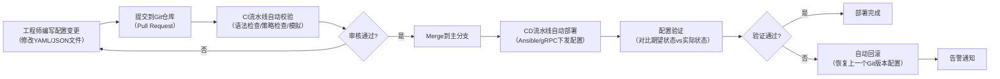

**关键环节**：

**配置即代码（Config as Code）**：所有网络配置以结构化文件（YAML/JSON）存储在 Git 仓库中。设备配置分为"基础配置"（hostname、管理 IP 等）和"业务配置"（VLAN、BGP、ACL 等），分别用不同的仓库或目录管理。

**CI 校验**：Pull Request 提交后，CI 流水线自动执行语法检查（YAML/JSON 格式是否正确）、策略检查（是否符合安全策略，如不允许在 Trunk 口放行所有 VLAN）、Dry-run 模拟（在网络模拟器中部署配置，验证是否正常工作）、差异对比（使用文本 diff 工具对比当前配置和变更后配置的差异）。

**CD 部署**：Merge 到主分支后，CD 流水线自动将配置部署到设备：使用 Ansible Playbook 或 gRPC/REST API 下发配置；部署策略分批次（先部署 5% 的设备，观察无异常后再部署剩余）；部署后验证检查设备实际配置是否与期望一致。**自动回滚**：如果部署后验证失败或触发告警，自动恢复到上一个 Git 版本的配置。

### 23.5 配置漂移检测

配置漂移（Configuration Drift）是指设备的实际配置与期望配置（Git 仓库中的配置）不一致。原因包括：紧急变更时直接登录设备修改但没有更新 Git 仓库；手动调试时临时修改了配置但忘记恢复。

配置漂移检测通过定期（如每小时）从设备拉取实际配置，与 Git 仓库中的期望配置做 diff 对比：

```python
# 伪代码示例
def check_config_drift(device, expected_config):
    actual_config = get_device_config(device)  # 通过gRPC/CLI获取实际配置
    diff = compare_configs(expected_config, actual_config)
    if diff:
        alert(f"配置漂移! 设备{device}的实际配置与期望不一致:\n{diff}")
        # 可以自动纠正或等待人工确认
```

### 23.6 美团网络自动化实践

美团在网络自动化方面已达到较高水平：

- **M-NOS gRPC 批量配置**：通过 gRPC 接口批量下发 JSON 配置，覆盖 1000+ 白盒交换机
- **Ansible 自动化**：使用 Ansible 管理园区网交换机和路由器的配置变更
- **Git 仓库管理**：所有网络配置存储在内部 Git 仓库，变更通过 Pull Request 审核
- **CI/CD 流水线**：配置变更提交后自动执行语法检查、策略校验、模拟部署，审核通过后自动部署
- **配置漂移检测**：每天定时对比设备实际配置与 Git 仓库配置，发现漂移自动告警
- **ZTP 自动化上线**：新交换机上电后自动通过 ZTP 完成配置部署，10-20 分钟内完成上线
- **网络变更窗口**：通过自动化平台管理变更窗口，非窗口时间的变更需要额外审批

---

## 二十四、确定性网络与 TSN

### 24.1 为什么需要确定性网络

传统 IP 网络提供的是"尽力而为"（Best-Effort）服务——网络尽力转发数据包，但不保证延迟、抖动和丢包率。对于大多数应用（Web、文件传输、视频流），这种服务已经够用。但对于某些关键场景，延迟的波动（抖动）比延迟本身更有害：

- **工业自动化**：机器人控制指令必须在固定的周期（如 1ms）内到达，否则机械臂会停机甚至碰撞
- **自动驾驶**：车间通信（V2X）的消息延迟必须可预测，100ms 的抖动可能导致事故
- **5G 前传**：5G 基站的前传网络要求极低且固定的延迟（<100μs）
- **金融高频交易**：微秒级的延迟差异就能决定交易盈亏

确定性网络（Deterministic Network）的目标是：**在网络中保证每个数据包的端到端延迟上限和抖动上限**。

### 24.2 IEEE 1588 PTP（精确时间协议）

确定性网络的基础是精确的时间同步。如果网络中所有设备的时钟不同步，就无法做精确的调度。

PTP（Precision Time Protocol，IEEE 1588）可以实现亚微秒级（甚至纳秒级）的时钟同步，远优于 NTP（毫秒级）。

PTP 的工作原理：Grandmaster（主时钟）发送 Sync 消息（记录发送时间 t1），交换机作为透明时钟（Transparent Clock）记录报文在交换机内部的驻留时间（residenceTime），并将这个时间累加到 Follow_Up 消息中。从时钟设备记录接收时间 t2，然后发送 Delay_Req 消息（记录发送时间 t3），Grandmaster 回复 Delay_Resp（记录接收时间 t4）。从时钟根据公式计算时钟偏差：offset = ((t2-t1) - (t4-t3)) / 2，延迟 = ((t2-t1) + (t4-t3)) / 2，然后调整本地时钟。

交换机在 PTP 中扮演"透明时钟"角色——它不参与时钟同步，但会记录 PTP 报文在交换机内部的驻留时间，并将这个时间累加到 Follow_Up 消息中。这样从时钟可以精确计算端到端延迟，排除交换机内部处理延迟的不确定性。

### 24.3 TAS（Time-Aware Shaper，时间感知整形）

TAS 是 IEEE 802.1Qbv 定义的队列调度机制，是 TSN 的核心。它利用全局时间同步，在精确的时间点打开和关闭特定队列的传输门（Gate）。

工作原理：将时间划分为周期性的"时间窗口"（Time Window），每个窗口只允许特定优先级的队列发送数据。例如：

| 时间窗口 | 持续时间 | 开放的队列 | 用途 |
|---------|---------|-----------|------|
| Window 0 | 100μs | 队列 7（最高优先级） | 控制指令 |
| Window 1 | 200μs | 队列 6 | 实时音视频 |
| Window 2 | 700μs | 队列 0-5 | 普通流量 |
| Window 3 | 100μs | 队列 7（预留） | 备用控制指令 |

在 Window 0 期间，只有队列 7 可以发送数据，其他队列的门关闭。这保证了控制指令在 100μs 内一定能被发送出去，不受其他流量影响。TAS 的关键要求是**全网时间同步**——所有交换机的 Gate 开关时刻必须精确对齐，这依赖 PTP。

### 24.4 CQF（Cyclic Queuing and Forwarding）

CQF 是 IEEE 802.1Qch 定义的另一种确定性调度机制，比 TAS 更简单。它使用两个（或三个）缓冲队列交替工作：偶数周期——队列 A 接收新到达的数据包，队列 B 发送上一周期收到的数据包；奇数周期——队列 B 接收新到达的数据包，队列 A 发送上一周期收到的数据包。

这种"一个收一个发"的交替模式保证了一个数据包最多在一个交换机中等待一个周期（如 1ms）。端到端延迟上限 = 跳数 × 周期时间。CQF 比 TAS 实现简单，但粒度更粗——延迟保证是"周期级"的而非"微秒级"的。

### 24.5 DetNet（Deterministic Networking）

DetNet 是 IETF 制定的确定性网络标准，目标是在 IP/MPLS 网络中提供端到端的确定性延迟保证。DetNet 的核心机制包括：

- **显式路由（Explicit Route）**：通过 SR-MPLS 或 SRv6 预先指定数据包的完整路径，不依赖动态路由
- **资源预留**：沿路径预留带宽和缓冲，确保数据包不会因拥塞被丢弃
- **包复制和消除（PREOF）**：发送端复制数据包走不同路径，接收端消除重复包。如果一条路径丢包，另一条路径的副本保证送达

### 24.6 TSN 标准族

TSN（Time-Sensitive Networking）是 IEEE 802.1 工作组制定的一系列标准，适用于工业自动化、汽车电子等场景：

| 标准 | 内容 | 作用 |
|------|------|------|
| 802.1AS | 时间同步 | 基于 PTP 的精确时间同步 |
| 802.1Qbv | TAS | 时间感知整形 |
| 802.1Qch | CQF | 循环队列转发 |
| 802.1Qbu | 帧抢占 | 高优先级帧可抢占低优先级帧的传输 |
| 802.1CB | FRER | 帧复制和消除（冗余） |

**帧抢占（Frame Preemption）**是一个有趣的功能——当一个高优先级帧到达时，如果交换机正在发送一个低优先级帧，可以"打断"低优先级帧的发送，先发高优先级帧，发完后再"恢复"低优先级帧的发送。帧抢占需要交换机和 MAC 层支持（通过 802.3br），将以太网帧分成可被抢占的"可抢占 MAC"和不可被抢占的"快速 MAC"两类。

### 24.7 美团的确定性网络展望

美团目前在 AI 训练场景中已经部分使用了确定性网络技术：

- **RoCEv2 无损网络**：通过 PFC+ECN 保证 RDMA 流量的零丢包，虽然不是严格的"确定性延迟"，但提供了低延迟的基础
- **时间同步**：数据中心内部署 PTP，为网络遥测（INT）提供精确的时间戳
- **未来方向**：随着美团在自动驾驶配送、无人机配送等领域的拓展，TSN 和 DetNet 技术可能在边缘计算网络中找到应用场景

---

## 二十五、总结与知识图谱

### 25.1 路由器技术知识的完整脉络

从本文的讲解中，我们可以看到路由器技术的完整脉络：

在最底层，路由器硬件由线卡、交换网板和主控引擎组成，转发引擎使用 ASIC/NPU 实现高速转发，TCAM 实现一个周期的最长前缀匹配。这是路由器的物理基础。

在转发机制层面，数据包经过解封装 → 查 FIB → 查邻接表 → 重写帧头 → TTL-1 → 转发的完整流程。CEF 架构通过 FIB + 邻接表分离实现了高效转发。

在路由协议层面，从最简单的 RIP（距离矢量），到 OSPF/IS-IS（链路状态），再到 BGP（路径向量），协议复杂度递增但可扩展性也递增。静态路由在小规模场景仍然有其价值。

在高级特性层面，VRF 实现网络隔离，MPLS 实现标签交换和 VPN，NAT 实现地址转换，PBR 实现策略转发。这些技术让路由器不再只是"查表转发"，而是可以做精细的流量控制。

在高可用层面，VRRP/HSRP 实现网关冗余，GR/NSR 实现不中断重启，BFD 实现快速检测。这些技术让网络在故障时几乎无感知地恢复。

在安全层面，ACL/uRPF/CoPP/RPKI 构成了从数据平面到控制平面的多层防护体系。

在技术演进层面，Segment Routing 简化了 MPLS 的信令复杂度，SD-WAN 革新了广域网架构，虚拟路由器让路由功能从硬件中解耦。EVPN 统一了二层和三层 VPN，组播路由（PIM/IGMP）实现了高效的一对多传输，IPv6 路由正在加速部署，TCAM 容量规划成为大规模网络的关键约束，GitOps 让网络配置管理走向代码化，确定性网络与 TSN 为低延迟场景提供了新的技术路径。这些趋势正在重塑网络的面貌。

### 25.2 从静态路由到 SRv6：路由技术的进化之路

路由技术的发展可以概括为一条主线：**从简单到复杂，从手工到自动，从硬件到软件定义**。

静态路由是最原始的方式——人工配置，简单但不可扩展。RIP 是自动化的第一步，但受限于跳数和收敛速度。OSPF/IS-IS 用链路状态算法实现了快速收敛和大规模网络支持。BGP 用路径向量算法实现了全球互联网的路由。

MPLS 在 IP 转发之上叠加了标签交换，为 VPN 和流量工程提供了基础。Segment Routing 进一步简化了 MPLS，让源路由成为可能。SRv6 把段信息编码在 IPv6 地址中，实现了纯 IPv6 的可编程网络。

SD-WAN 把控制面从设备中抽离到控制器，实现了广域网的集中管理和智能选路。虚拟路由器（FRR/VyOS/Bird）让路由功能可以运行在任何服务器上，为 NFV 和云网络奠定了基础。

每一代技术都在解决前一代的痛点：RIP 解决了静态路由不可扩展的问题，OSPF 解决了 RIP 收敛慢和规模小的问题，BGP 解决了域间路由的策略需求，MPLS 解决了 IP 网络缺乏隧道和流量工程能力的问题，SR 解决了 MPLS 信令复杂的问题，SD-WAN 解决了传统 WAN 不灵活的问题。

### 25.3 路由器知识体系全景图

```mermaid
graph TB
    ROOT[路由器技术体系]

    ROOT --> HW[硬件架构]
    ROOT --> FWD[转发机制]
    ROOT --> ROUTING[路由协议]
    ROOT --> ADV[高级特性]
    ROOT --> HA[高可用]
    ROOT --> SEC[安全]
    ROOT --> MODERN[现代技术]

    HW --> HW1[线卡/交换网板/主控]
    HW --> HW2[ASIC/NPU/CPU/FPGA]
    HW --> HW3[TCAM/SRAM/DRAM]

    FWD --> FWD1[RIB → FIB]
    FWD --> FWD2[最长前缀匹配]
    FWD --> FWD3[CEF: FIB+邻接表]
    FWD --> FWD4[完整转发流程]

    ROUTING --> STATIC[静态路由<br/>浮动/默认/递归/ECMP]
    ROUTING --> RIP[RIP 距离矢量]
    ROUTING --> OSPF[OSPF 链路状态<br/>区域/DR/LSA/SPF]
    ROUTING --> ISIS[IS-IS 链路状态<br/>L1/L2/TLV]
    ROUTING --> BGP[BGP 路径向量<br/>iBGP/eBGP/RR/选路]

    ADV --> REDIS[路由重分发]
    ADV --> FILTER[路由过滤]
    ADV --> PBR[策略路由PBR]
    ADV --> VRF[VRF 虚拟路由转发]
    ADV --> MPLS[MPLS VPN<br/>标签交换/PE-CE-P]
    ADV --> NAT[NAT<br/>静态/动态/PAT/CGN]

    HA --> VRRP[VRRP/HSRP/GLBP]
    HA --> GR[GR 优雅重启]
    HA --> NSR[NSR/NSF 不中断]
    HA --> BFD[BFD 50ms检测]
    HA --> SLA[收敛SLA<br/>单端口<1s/双路<40s]

    SEC --> ACL[ACL 访问控制]
    SEC --> URPF[uRPF 反向路径]
    SEC --> COPP[CoPP 控制面保护]
    SEC --> RPKI[RPKI 路由源验证]

    MODERN --> SR[Segment Routing<br/>SR-MPLS/SRv6]
    MODERN --> SDWAN[SD-WAN<br/>控制面分离/应用感知]
    MODERN --> IPV6[IPv6路由<br/>OSPFv3/BGP4+]
    MODERN --> VIRT[虚拟路由器<br/>VyOS/FRR/Bird/Quagga]

    ROOT --> EVPN[EVPN<br/>Type 1-5路由/Multi-Homing]
    ROOT --> MCAST[组播路由<br/>PIM-SM/SSM/RP/BSR]
    ROOT --> IPV6D[IPv6深度<br/>NDP/SLAAC/MLD/OSPFv3]
    ROOT --> TCAM_P[TCAM规划<br/>汇总/默认路由/容量管理]
    ROOT --> GITOPS[网络自动化<br/>Ansible/GitOps/漂移检测]
    ROOT --> TSN_D[确定性网络<br/>PTP/TAS/CQF/DetNet]

    style ROOT fill:#FF6B6B,color:#fff
    style HW fill:#4ECDC4,color:#fff
    style FWD fill:#4ECDC4,color:#fff
    style ROUTING fill:#45B7D1,color:#fff
    style ADV fill:#96CEB4,color:#fff
    style HA fill:#FFEAA7,color:#333
    style SEC fill:#DDA0DD,color:#fff
    style MODERN fill:#87CEEB,color:#fff
```

以上就是路由器技术的全景图。从一块 TCAM 芯片的并行查找，到全球 BGP 路由的策略博弈，再到 SRv6 的源路由编程，路由器技术是一个既有硬件深度又有协议广度的领域。希望这份文档能帮助你建立完整的知识体系，在实际工作中既能看到细节，也能把握全局。

---

> **文档版本**：v1.0  
> **更新日期**：2026-06-28  
> **作者**：资深网络工程师视角  
> **适用场景**：网络工程师学习笔记、技术面试复习、架构设计参考
