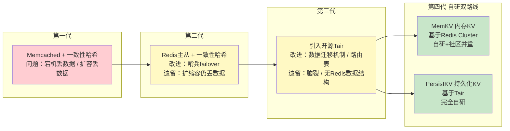
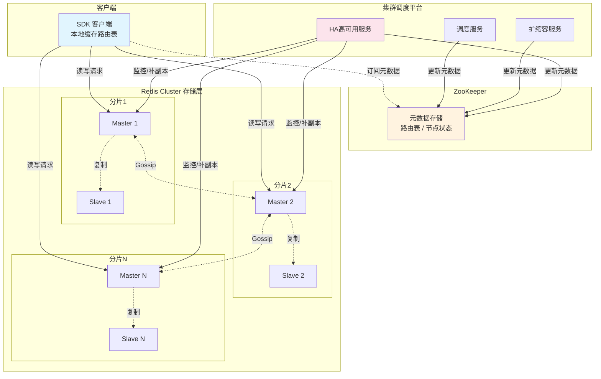
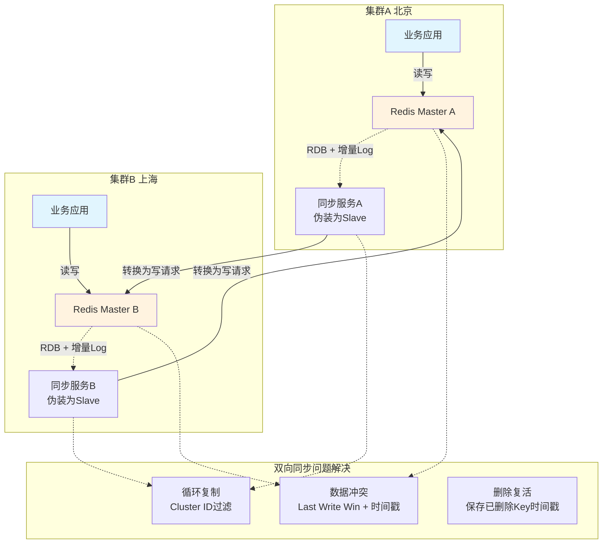
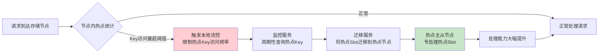
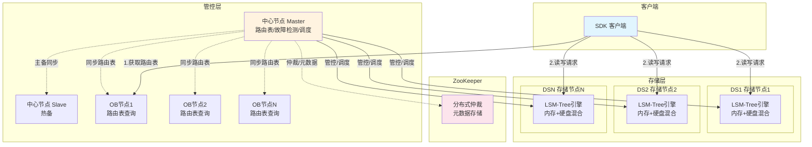
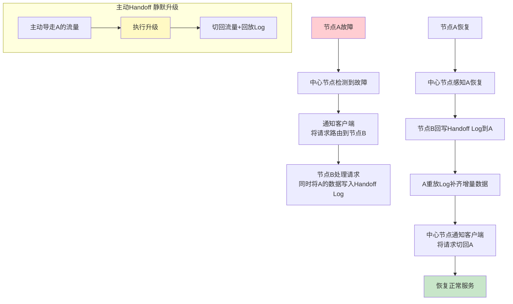
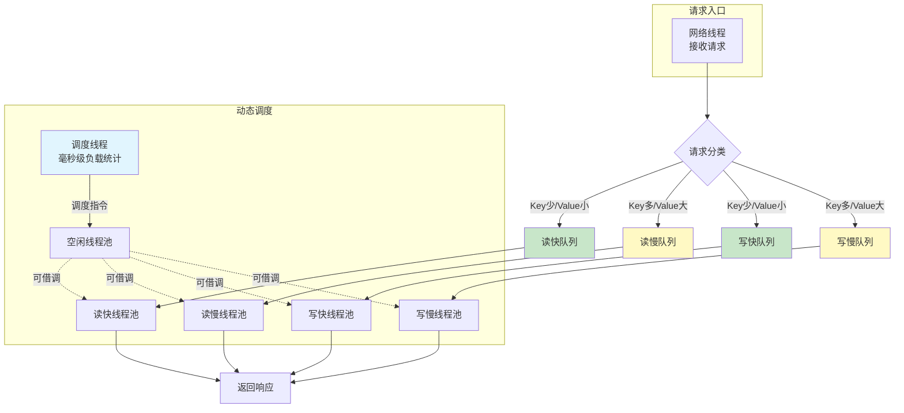
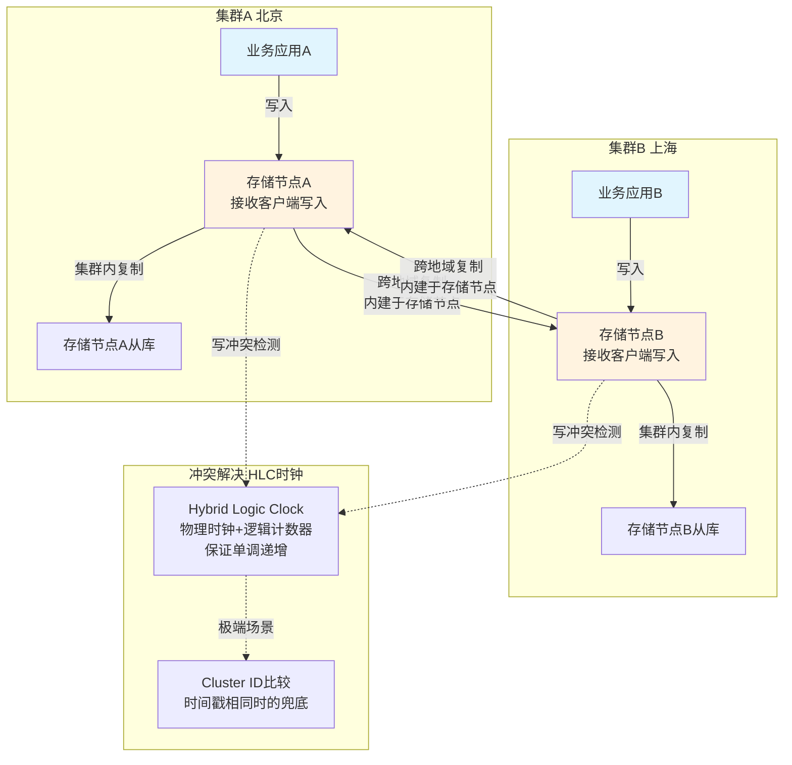

# 某大型互联网公司非关系型数据库分布式架构实践

---

## 一、KV存储发展历程

在大规模互联网业务场景下，KV存储系统承载了海量在线请求的高速读写需求。从最初简单的Memcached缓存到自研的万亿级KV存储平台，该公司的KV存储架构经历了四代演进，每一代都在解决前一代遗留的核心痛点。

### 1.1 第一代：Memcached + 一致性哈希

第一代KV存储系统采用了业界最经典的缓存方案——Memcached配合客户端一致性哈希。在这一架构中，后端部署了若干台独立的Memcached实例，它们之间互不通信、互不感知。所有的路由逻辑都在客户端内部完成：客户端维护一个一致性哈希环，根据Key计算出哈希值后映射到哈希环上的某个Memcached节点，直接向该节点发起读写请求。

这种方案的优点在于架构简洁、部署方便、性能出色——Memcached本身就是为高速缓存场景优化的内存存储系统，协议简单，单节点吞吐极高。然而，随着业务规模的增长，两个核心问题逐渐暴露出来。

第一个问题是节点宕机导致的数据丢失。当某个Memcached节点发生宕机时，运维需要将该节点从一致性哈希环上摘除。摘除操作导致哈希环上的节点分布发生变化，原本映射到该节点的Key会被重新路由到其他节点。由于Memcached没有数据复制机制，这些Key对应的数据实际上已经丢失，客户端会产生大量cache miss，瞬间将压力全部回源到后端数据库，可能引发雪崩效应。

第二个问题是扩容时的数据丢失。当业务增长需要扩容集群时，向哈希环中添加新节点同样会改变Key到节点的映射关系。大量Key被重新路由到新节点，而新节点上没有这些Key的数据，同样产生大量cache miss。虽然一致性哈希相比普通取模哈希在扩缩容时影响的Key比例更小，但在数据量巨大的情况下，即使是少比例的cache miss也会对后端数据库造成巨大压力。

### 1.2 第二代：Redis主从 + 一致性哈希

为了解决第一代架构中节点宕机导致数据丢失的问题，第二代架构引入了Redis替代Memcached，并在服务器端建立了主从复制结构。每个节点由一个Master和若干个Slave组成，Master负责处理写请求并将数据异步复制给Slave，Slave可以分担读请求的压力。

在高可用方面，第二代架构引入了Redis哨兵（Sentinel）机制来完成自动故障转移（failover）。Redis Sentinel是一组独立运行的监控进程，持续监控Master节点的健康状态。当Sentinel检测到Master节点不可达时，会自动从该Master的Slave中选举一个新的Master，完成主从切换，从而保证单个节点故障时服务不中断、数据不丢失。

相比第一代，第二代架构显著提升了数据的可靠性——单节点宕机不再导致数据丢失，因为Slave上保存了完整的数据副本，failover后新Master可以继续提供服务。然而，第二代架构仍然依赖客户端一致性哈希来做数据分片路由，这意味着扩缩容时一致性哈希丢数据的问题依然存在。当需要向集群中增加或减少节点时，Key到节点的映射关系变化仍然会导致部分数据无法被正确访问，虽然数据实际存在于旧节点上，但客户端已经不会再去旧节点查询该Key。

### 1.3 第三代：引入开源Tair

2014年，该公司引入了阿里巴巴开源的分布式KV存储系统Tair，试图从根本上解决扩缩容数据丢失的问题。Tair采用了一种更为成熟的分布式架构，由三个核心组件构成：存储节点（DataServer）、中心节点（ConfigServer）和客户端。

存储节点负责实际的数据存储和读写处理。每个存储节点会周期性地向中心节点上报心跳信息，汇报自身的健康状态、负载情况、存储容量等。中心节点是整个集群的管控核心，负责监控所有存储节点的状态，维护集群的拓扑信息和路由表。当中心节点检测到存储节点故障或需要进行扩缩容时，会触发集群拓扑重建，重新计算数据的分布映射关系，生成新的路由表。客户端从中心节点拉取最新的路由表，根据路由表决定每个Key应该访问哪个存储节点。

Tair架构最关键的改进在于引入了数据迁移机制。在扩缩容过程中，新的路由表生成后，系统不是简单地丢弃旧映射关系上的数据，而是主动将数据从旧节点迁移到新节点。迁移过程中，旧节点上的数据仍然可以被正常访问，只有当数据完整迁移到新节点后，路由才会真正切换。这一机制从根本上保证了扩缩容过程中数据的完整性，解决了前两代架构的核心痛点。

然而，Tair在该公司的实践中也暴露出了几个重要问题。首先，中心节点自身的高可用采用了简单的Master-Slave模式，没有引入分布式仲裁机制。当网络分区发生时，Master和Slave可能同时认为自己是集群的控制者，导致脑裂问题——两个中心节点可能生成不同的路由表，造成数据混乱。其次，数据迁移过程对在线服务的可用性存在影响，迁移期间节点的读写性能会受到干扰。最后，Tair原生的存储引擎不支持Redis丰富的数据结构（如Hash、List、Set、SortedSet等），而该公司大量业务已经深度使用了Redis的数据结构特性，迁移到Tair意味着需要改造业务代码。

### 1.4 第四代：自研双路线

基于前三代架构的经验教训和业务需求的深入分析，该公司最终走上了自研的道路，形成了双路线并行的KV存储体系。

内存KV缓存系统（简称MemKV）基于Redis Cluster架构进行深度定制和优化，采用"自研+社区并重"的策略。Redis Cluster原生提供了去中心化的数据分片、自动故障转移和在线扩缩容能力，MemKV在此基础上针对大规模集群场景进行了大量性能优化和功能增强。选择Redis Cluster作为基础是因为它天然支持Redis全部数据结构，与公司存量业务完全兼容。

持久化KV存储系统（简称PersistKV）基于Tair架构进行深度改造，走完全自研路线。PersistKV重新设计了中心节点的高可用方案，引入ZooKeeper解决脑裂问题，自研了混合存储引擎支持海量数据的高效存取，并在数据复制、迁移、容灾等方面做了全面升级。

截至当前，这两套KV存储系统每天的调用量均已突破万亿次，峰值处理能力达到每秒亿级请求。整体服务可用性稳定在99.995%以上，成为该公司最核心的基础设施之一，支撑着搜索、推荐、交易、配送等几乎所有核心业务线。

---

## 二、内存KV缓存系统（MemKV）架构与实践

### 2.1 架构概述

MemKV基于Redis Cluster架构构建，是一套面向超大规模集群的分布式内存缓存系统。在存储层，MemKV采用经典的主从结构，每个分片由一个Master节点和若干Slave节点组成。Master处理所有写请求，并通过Redis内置的复制协议将数据异步同步给Slave节点。各个Redis实例之间通过Gossip协议进行集群状态信息的交换和传播，实现去中心化的集群元数据管理。

在管控层面，MemKV构建了一套完整的集群调度平台，主要包含三个核心服务：调度服务负责集群拓扑管理和运维操作的编排执行；扩缩容服务负责自动化的容量调整，包括数据迁移、Slot重分配等；高可用服务（HA服务）负责实时监控所有节点的健康状态，在故障发生时快速完成摘除和恢复操作。

元数据的分发和同步通过ZooKeeper实现。集群调度平台在执行拓扑变更操作后，将最新的集群元数据（路由表、节点状态等）更新到ZooKeeper中。客户端通过订阅ZooKeeper上的相应节点，实时感知集群拓扑的变化，获取最新的路由信息。在实际读写操作时，客户端根据本地缓存的路由表直接与对应的Redis集群节点进行通信，不需要经过任何中间代理层，保证了极低的访问延迟。

### 2.2 数据分布机制

MemKV的数据分布采用预分片（Pre-sharding）机制，将数据空间预先划分为固定数量的Slot（共16384个Slot），通过两级映射将Key路由到具体的存储节点。

第一级映射是Key到Slot的映射：对于每个Key，首先通过CRC16等固定哈希算法计算其哈希值，然后对16384取模，得到该Key所属的Slot ID。这一映射关系是固定不变的——一个Key永远属于同一个Slot。

第二级映射是Slot到节点的映射：系统维护一张路由表（Slot Map），记录了每个Slot当前由哪个存储节点负责。当集群进行扩缩容时，只需要修改路由表中Slot到节点的映射关系，并将对应Slot的数据从旧节点迁移到新节点，而Key到Slot的映射始终不变。

这种两级映射的设计解耦了数据分布与集群规模之间的关系。16384个Slot提供了足够的粒度来实现均匀的数据分布和灵活的负载调度，同时扩缩容只需要迁移部分Slot而非重新哈希所有数据，从根本上解决了一致性哈希方案在扩缩容时丢数据的问题。

### 2.3 水平扩展挑战与优化

随着业务规模的持续增长，MemKV集群的规模不断扩大，单集群节点数从数十个增长到数百甚至近千个。大规模集群带来了一系列水平扩展方面的挑战，MemKV团队在多个技术方向上进行了深入的优化。

#### Gossip协议优化

Redis Cluster使用Gossip协议在节点间交换集群状态信息。在Gossip协议中，每个节点会周期性地随机选择若干其他节点交换元数据，通过多轮交换最终使所有节点的元数据达成一致。这种机制在小规模集群中工作良好，但在大规模集群中面临严重的可扩展性问题。

具体而言，Gossip消息中携带了集群中所有节点的状态信息，因此单条Gossip消息的大小与集群节点数成正比。每个节点需要周期性地向多个其他节点发送Gossip消息，整个集群的Gossip消息总量与节点数的平方成正比。在实测中，一个900节点的集群中，Gossip协议的消息处理消耗了高达12%的CPU资源，这对于一个以极致性能为目标的缓存系统而言是完全不可接受的。

MemKV团队通过引入Merkle Tree对Gossip消息进行摘要优化，将通信量减少了90%以上。优化后的方案工作流程如下：发送方不再将完整的集群元数据放入每条Gossip消息中，而是先对本地的元数据构建一棵Merkle Tree，将Merkle Tree的根哈希值作为消息摘要发送给对方。接收方收到摘要后，与自己本地元数据的Merkle Tree根哈希进行比对——如果哈希值相同，说明双方的元数据完全一致，不需要进一步交换；如果哈希值不同，才触发详细的增量同步。

为了处理哈希冲突（极小概率下两个不同的元数据集合产生相同的哈希值），系统设计了周期性的元数据全量同步机制。每隔一定时间，节点间会执行一次完整的元数据对比和同步，确保不会因为哈希冲突而导致元数据不一致。

此外，在实现层面，Gossip消息的处理被从Redis的主工作线程中剥离出来，放到独立的心跳线程中执行。工作线程通过无锁读的方式访问元数据，避免了Gossip处理对正常请求处理的干扰。这种设计保证了即使在大规模集群中，Gossip协议的开销也不会影响到正常的读写请求延迟。

#### forkless RDB

在Redis的主从复制和持久化机制中，生成RDB快照是一个关键操作。传统Redis通过fork系统调用创建一个子进程，子进程继承父进程的内存空间（通过操作系统的Copy-on-Write机制），在子进程中遍历内存数据并序列化为RDB文件。这种方案的优点是子进程工作期间，父进程可以继续处理请求，利用COW机制避免了数据一致性问题。

然而在大内存节点上，fork操作本身会造成严重的阻塞。实测表明，一个8GB内存的Redis节点执行fork操作时，会造成约500毫秒的服务阻塞。这是因为fork需要复制父进程的整个页表，在大内存场景下页表可能非常庞大。500毫秒的阻塞对于缓存服务而言是灾难性的——大量请求会超时，引发上游服务的重试和雪崩。

MemKV团队设计了forkless RDB方案，完全不依赖fork系统调用来生成RDB快照，从而彻底消除了fork带来的阻塞。forkless RDB的核心思路是在主线程中增量式地遍历所有Key，通过精心设计的游标机制保证数据的完整性和一致性。

具体实现步骤如下：首先，暂停Redis的哈希表rehash操作——因为rehash会改变Key在哈希表中的位置，如果在遍历过程中发生rehash，可能导致某些Key被遗漏或重复遍历。然后，从哈希表的头部开始逐个遍历Key，将每个Key-Value对序列化后放入复制队列中。遍历过程中维护一个游标（cursor），记录当前遍历到的位置。

关键的一致性保证在于对遍历过程中数据变更的处理：对于游标之前（已遍历过的区域）的Key，如果发生了写操作（新增、修改、删除），这些变更也会被记录到复制队列中，确保下游能获取到最新的数据状态。对于游标之后（尚未遍历的区域）的Key，在后续迭代时自然会dump其最新值，无需特殊处理。

forkless RDB方案的优点非常显著：完全不会阻塞正常的服务请求处理，消除了fork造成的几百毫秒延迟尖刺；数据以流式方式实时发送到复制队列，相比传统方案先生成完整RDB文件再传输，整体同步速度更快。但该方案也有其代价：遍历和序列化操作占用了工作线程的CPU资源，如果集群中存在特别大的Key-Value对（大KV），序列化这些大KV时可能导致工作线程处理其他请求的耗时上升。

#### 工作多线程

Redis社区版本在6.0中引入了IO多线程特性，将网络数据的读取和写回操作分配给多个IO线程并行执行，而命令的实际处理仍然在主线程中串行完成。这种设计可以提升网络IO密集场景下的吞吐能力，但由于命令处理本身仍然是单线程的，吞吐提升幅度有限——实测表明社区IO多线程大约只能将吞吐提升一倍。

MemKV团队进一步设计了工作多线程方案，将请求的整个处理过程（包括命令解析、数据访问、结果序列化）都实现了多线程化，从而最大化利用多核CPU的处理能力。

MemKV的工作多线程采用了Run-to-Completion（RTC）线程模型。在这种模型中，每个工作线程独立完成一个请求从收包到发包的全部处理流程：接收网络数据、解析命令、访问内存数据、序列化响应、发送网络数据。一个请求从进入系统到离开系统，全程在同一个线程中完成，不需要在不同线程间进行任务传递。

RTC模型相比传统的生产者-消费者模型有显著优势。首先，避免了请求在线程间流转时的上下文切换开销——每次线程切换都会涉及CPU寄存器的保存和恢复、缓存行的失效等，在高吞吐场景下这些开销非常可观。其次，同一个请求的所有处理步骤在同一个线程中连续执行，相关的数据结构和代码路径更容易留在CPU缓存中，提高了缓存命中率。

多线程并发访问共享数据时不可避免地需要处理锁竞争问题。MemKV采用了创新的try lock机制来最小化锁等待的影响。当一个工作线程需要访问某个被其他线程锁定的数据时，它不会阻塞等待锁释放，而是通过try lock尝试获取锁。如果获取失败，线程会注册一个管道通知（当锁可用时通过管道通知该线程），然后转而继续处理队列中其他不涉及该临界区的请求。当锁释放后，管道通知触发线程回来继续处理之前暂停的请求。这种非阻塞的锁策略保证了工作线程不会因为锁竞争而空闲等待，CPU利用率始终保持在较高水平。

此外，一些特定的操作被放到专门的独立线程中处理：新建Socket连接的accept操作由专门的监听线程负责，避免频繁的连接建立影响工作线程的请求处理；数据复制相关的操作由专门的复制线程负责，避免复制流量干扰正常请求的延迟。

性能测试表明，MemKV的工作多线程方案相比社区IO多线程的吞吐提升了约70%，相比原始的单线程Redis提升了3倍多。这一提升使得单个Redis节点能够支撑更大的流量，减少了集群所需的节点数，降低了运维复杂度和硬件成本。

### 2.4 节点容灾机制

在大规模分布式系统中，单节点故障是常态而非异常。MemKV构建了多层次的节点容灾机制，确保任何单点故障都不会影响整体服务的可用性。

HA高可用服务作为集群调度平台的核心组件之一，实时监控着集群中所有节点的健康状态。它通过周期性的心跳检测和主动探测相结合的方式，快速发现节点的网络抖动和宕机情况。

当检测到网络抖动或短暂不可达时，HA服务会立即将该节点的状态更新到ZooKeeper中。客户端通过订阅ZooKeeper的变更通知，实时感知到故障节点的状态变化，并将该节点从本地的可用节点列表中摘除。对于从库（Slave）节点，摘除时间从原来Redis Sentinel方案的30秒大幅降低到了5秒，显著减少了故障期间请求错误的影响范围和持续时间。

当确认某个节点发生了永久性宕机（而非短暂的网络抖动）时，HA服务会触发自动化的节点补充流程：从Kubernetes容器平台申请一个新的容器实例，将其加入到集群中替代故障节点的角色。整个补副本的过程已经实现了分钟级的全自动操作，无需人工干预。新节点加入后，系统自动触发数据同步，将主节点的数据复制到新加入的从节点上，恢复集群的预期副本数。

### 2.5 持久化重构

虽然MemKV定位为内存缓存系统，但持久化能力对于数据恢复和主从同步至关重要。传统Redis的持久化机制存在两个主要问题：RDB持久化通过fork生成快照，在大内存节点上造成秒级阻塞（如前文所述）；AOF持久化通过追加写日志的方式记录每次写操作，但当底层磁盘IO出现抖动时，AOF的fsync操作可能阻塞Redis的主线程，同样造成请求延迟尖刺。

MemKV团队对持久化机制进行了全面重构，设计了一套新的持久化方案，核心思路是将持久化操作从请求处理的关键路径中完全剥离出来。

新方案的工作流程如下：当一个写请求到达时，系统首先将数据写入内存数据库（DB），然后将该写操作记录到内存中的Backlog缓冲区。这两步操作都在内存中完成，延迟极低。随后，一个独立的异步线程负责将内存Backlog中的变更记录刷写到硬盘上的持久化Backlog文件中。由于是异步操作，即使磁盘IO出现抖动，也不会阻塞主工作线程的请求处理。

在低峰时段（如凌晨），系统会主动触发RDB快照的生成。RDB生成完成后，快照时间点之前的Backlog文件可以被安全删除，只需保留快照之后的增量Backlog。这种策略将RDB生成的时机选在业务低峰期，最大限度减少了对在线服务的影响。

主从同步的流程也相应做了优化。当Slave节点需要与Master进行数据同步时，系统按照以下优先级尝试：首先查看内存Backlog中是否包含Slave所需的增量数据，如果包含则直接从内存发送增量数据（最快）；如果内存Backlog已经被覆盖，则查看硬盘上的Backlog文件是否包含所需数据，从磁盘读取发送；只有当硬盘Backlog也无法满足时（例如Slave断开时间过长），才触发全量重传——此时直接使用最近一次低峰期生成的RDB文件，而不需要当场fork生成新的RDB。

这套新方案显著减少了全量重传的频率，同时彻底消除了RDB快照和AOF刷盘造成的请求延迟抖动，使MemKV的延迟表现更加平稳和可预测。

### 2.6 两机房容灾

在传统的分布式存储系统中，为了实现机房级别的容灾能力，通常需要在至少三个机房部署副本。三副本三机房的方案可以在任意一个机房整体故障时，剩余两个机房仍然满足多数派要求，保证系统继续提供服务。然而在实际部署中，三机房的资源配置往往难以凑齐——不是所有业务都能在三个机房中分别获得足够的机器资源。对于一些规模较小或成本敏感的业务，仅部署两副本两机房更为现实，但两副本方案在一个机房故障时无法满足多数派要求，无法自动完成failover。

受Google Spanner论文中Witness机制的启发，MemKV引入了见证者节点（Witness）的概念，巧妙地在几乎只使用两机房资源的条件下实现了机房级别的容灾能力。

见证者节点是一种特殊的轻量级节点，它有如下特征：不存储任何业务数据，因此不需要占用大量内存和磁盘资源；不对外提供任何读写请求处理能力；不主动发起选主投票（不会提名自己为Master）；但可以参与选主投票过程，对其他节点的选主请求投赞成或反对票。见证者节点还可以设置投票权重，在选主决策中发挥调节作用。

具体部署方式是：在机房A和机房B各部署完整的数据节点（Master和Slave），在第三方位置（可以是另一个轻量级机房或云上的低成本实例）部署见证者节点。由于见证者不存储数据也不处理请求，其资源消耗极低，仅需要少量的CPU和网络带宽即可。当任一机房故障时，另一机房的数据节点加上见证者节点可以形成多数派，完成选主和服务切换。这样在几乎只需两机房资源的情况下，就实现了与三机房方案同等的容灾能力。

### 2.7 跨地域容灾

对于业务在多个城市部署的场景（如一线城市用户访问部署在当地的服务），需要在不同地域的数据中心之间同步数据。MemKV通过集群间同步服务实现了跨地域的数据复制。

集群间同步服务的工作原理是：同步服务将自己伪装为上游集群的一个Slave节点，利用Redis的标准复制协议向上游Master请求数据。Master不感知同步服务的特殊身份，正常地将RDB快照和后续的增量变更日志发送给它。同步服务接收到这些数据后，将其解析转换为标准的Redis写请求，发送到下游目标集群执行。这种设计复用了Redis已有的复制协议，无需对Redis本身做特殊修改。

双向同步通过在两个方向上各部署一个同步任务来实现：A集群到B集群一个任务，B集群到A集群一个任务。双向同步使得两个地域的业务都可以在本地执行读写操作，提供了更低的访问延迟。

然而，双向同步引入了循环复制问题：A写入的数据同步到B后，B又会将其同步回A，A再同步到B，形成无限循环。MemKV的解决方案是为每个集群分配一个唯一的Cluster ID，并在每个Key-Value对中记录其初始写入的Cluster ID。当同步服务将数据从一个集群发送到另一个集群时，目标集群检查数据中记录的Cluster ID——如果与自己的Cluster ID相同，说明这条数据原本就是从自己这里写出去的，属于循环复制，直接丢弃不处理。

数据冲突是双向同步中另一个重要挑战。当同一个Key在两个集群中被并发写入不同的值时，需要有一种确定性的冲突解决策略。MemKV采用了Last Write Win（最后写入胜出）策略，并通过以下几个层次的机制确保策略的正确执行：

首先，每次写入操作都会保存一个时间戳，记录写入发生的时刻。当同步到对端集群时，如果发现本地已有该Key且本地时间戳更新，则拒绝覆盖；如果同步过来的时间戳更新，则覆盖本地数据。系统还专门处理了时钟回退的情况（如NTP校时导致系统时钟回跳），确保时间戳单调递增。

其次，当两个写入的时间戳恰好相同时（极小概率但不可忽略），通过比较两个写入的来源Cluster ID来确定性地决定胜者——例如总是让Cluster ID较大的一方胜出。这保证了在时间戳相同的极端情况下，所有集群最终能收敛到一致的状态。

第三，同步传输的是变更后的完整数据，而非操作本身。例如对于INCRBY操作，不是同步"对Key X执行INCRBY 5"这个操作，而是同步"Key X的值变为了100"。这避免了操作语义在并发场景下的歧义——如果两端都执行了INCRBY 5，同步操作本身会导致值翻倍，而同步最终结果则不会。

最后，对于删除操作，系统会在本地保存最近删除的Key及其删除时间戳。这是为了解决一种特殊情况：如果一端删除了Key，而另一端对该Key的旧写入同步过来，没有删除记录的话系统会错误地将该Key"复活"。通过保留删除记录和时间戳，系统可以判断出这个写入发生在删除之前，应当被丢弃。

### 2.8 智能迁移

在集群扩缩容或负载均衡调整时，需要将部分Slot的数据从一个节点迁移到另一个节点。MemKV设计了一套智能迁移系统，在保证数据完整性的前提下最大化迁移效率、最小化对在线服务的影响。

迁移任务的生成遵循就近原则。系统在规划迁移路径时，优先选择物理距离近（同机架、同交换机）的节点对进行迁移，减少网络传输的延迟和对骨干网络带宽的占用。在一个集群有多个节点需要迁出数据时，不同迁出节点之间的迁移任务并发执行，充分利用集群的整体带宽。

在迁移粒度上，每个Migrate命令一次迁移一批Key（而非逐个Key迁移），减少了网络往返次数和命令处理开销。批量迁移的大小经过精心调优，在单次迁移耗时和整体迁移效率之间取得平衡。

迁移速度的自适应调节是MemKV智能迁移的核心特性之一。监控服务实时采集源节点和目标节点的关键指标，包括请求成功率、CPU负载、网络带宽利用率、请求延迟等。系统采用类似TCP慢启动（Slow Start）的算法来动态调整迁移速度：初始以较低速度开始迁移，如果目标节点的各项指标保持健康，则逐步加速；一旦检测到指标劣化（如延迟上升、成功率下降），立即降低迁移速度甚至暂停迁移。这种自适应机制确保迁移操作不会对在线服务造成明显影响。

对于包含大Value的Key（如大List、大Hash等），传统的同步Migrate命令会在迁移期间阻塞主线程，导致该节点上所有请求的延迟急剧上升。MemKV实现了异步Migrate命令来处理大Value：将大Value的序列化和网络传输放到后台线程中异步执行，主线程在发起异步迁移后可以立即继续处理其他请求。这一优化保证了即使集群中存在大Key，迁移操作也不会导致延迟尖刺。

### 2.9 热点Key治理

在互联网业务中，热点Key是一个普遍存在的问题。例如热门商品的库存Key、热门话题的计数器、明星用户的关注列表等，这些Key的访问量可能是普通Key的数百甚至数千倍。由于同一个Key始终被路由到同一个节点，热点Key会导致该节点的负载远高于其他节点，甚至成为整个集群的瓶颈。

MemKV构建了一套完整的热点Key发现和治理体系。在发现层面，每个存储节点内部实时统计各Key的请求频率，当某个Key的请求量达到预设阈值时自动触发本地流控，避免单个热点Key耗尽整个节点的处理能力。同时，监控服务周期性地查询所有节点的热点Key统计信息，汇总得到集群级别的热点Key视图。

在治理层面，MemKV采用热点Slot迁移策略。当识别到某个Slot中包含热点Key时，系统将该Slot迁移到一组专门的热点主从节点上。热点主从节点是预留的高配节点，专门用于处理热点流量。由于热点节点只负责热点Slot的请求处理，没有其他普通Slot的负担，其处理能力可以完全投入到热点Key的服务上，单Key的处理能力相比普通节点大幅提升。

这套机制形成了一个完整的热点治理闭环：自动发现热点Key → 触发流控保护 → 迁移到热点节点 → 集中处理能力服务热点。整个过程对业务透明，无需业务方修改代码或做特殊处理。

### 2.10 性能指标

经过上述一系列的架构设计和优化工作，MemKV在线上环境中展现出了优秀的性能表现。线上平均访问延迟保持在0.7毫秒以下，TP99延迟约为6毫秒，这意味着99%的请求都能在6毫秒内得到响应。单集群最大支持1.5TB的数据空间（受内存容量限制），能够满足绝大多数缓存业务的容量需求。

MemKV最适用的场景包括：对延迟极度敏感的在线业务（要求TP99<10ms）、数据量在500GB以下的中等规模缓存场景、需要使用Redis丰富数据结构（Hash、List、Set、SortedSet等）的业务。对于数据量超大、成本敏感或需要强数据可靠性保证的场景，则更适合使用PersistKV。

---

## 三、持久化KV存储系统（PersistKV）架构与实践

### 3.1 架构概述

PersistKV基于Tair架构深度演进，是一套完全自研的分布式持久化KV存储系统。与MemKV的去中心化架构不同，PersistKV采用了中心化的集群管理方案，由中心节点统一负责集群的拓扑管理、故障检测和数据调度。

PersistKV的整体架构由以下核心组件构成：

中心节点（Master/Slave）是集群的管控大脑，负责维护路由表、监控存储节点健康状态、执行拓扑变更和数据迁移调度等管控操作。中心节点自身采用Master-Slave结构保证高可用。

OB（Observer）节点是路由表的查询服务层，它与Master节点保持实时同步，始终持有最新的路由表信息。客户端从OB节点获取路由信息，而不是直接访问Master节点。OB节点可以水平扩展部署多个实例，起到两个重要作用：一是将路由查询的流量分散到多个OB实例上，避免大量客户端同时访问Master造成的压力；二是隔离了客户端与Master之间的直接通信，Master节点可以专注于集群管控操作，不受客户端流量的干扰。

ZooKeeper在PersistKV架构中承担了分布式仲裁和元数据存储的角色，这是对原始Tair架构的重要改进。原始Tair的中心节点没有分布式仲裁机制，网络分区时可能发生脑裂——Master和Slave同时认为自己是集群的控制者。引入ZooKeeper后，中心节点的Master选举通过ZooKeeper的分布式锁来完成，保证在任何时刻只有一个Master处于活跃状态。集群的核心元数据（路由表版本、节点列表等）也存储在ZooKeeper中，作为权威数据源。

### 3.2 数据分布

PersistKV的数据分布机制与MemKV完全一致，采用同样的两级映射方案。Key首先通过哈希算法计算得到哈希值，然后对16384取模得到所属的Slot ID，最后通过路由表查找该Slot对应的存储节点。16384个Slot提供了足够的分布粒度，支持灵活的扩缩容和负载均衡调整。

### 3.3 存储引擎

PersistKV最核心的技术差异在于其存储引擎的设计。与MemKV的纯内存存储不同，PersistKV采用了内存+硬盘的混合存储引擎，基于LSM-Tree（Log-Structured Merge-Tree）模型构建。

LSM-Tree的核心设计思想是将随机写转化为顺序写，特别适合写入密集的场景。写入请求首先被写入内存中的MemTable（一个有序数据结构，如跳表或红黑树），当MemTable的大小达到阈值后，整个MemTable被冻结并作为一个不可变的SSTable文件刷写到磁盘上。磁盘上的SSTable文件按照层级组织，通过后台的Compaction操作合并和整理数据，维持读取效率。

这种混合存储的设计使得热数据（频繁访问的数据）驻留在内存中提供快速访问，冷数据（不常访问的数据）则下沉到磁盘上节省内存资源。通过合理的内存管理和缓存策略，系统在保持较好读写性能的同时，能够支持远超物理内存容量的数据量——单集群可以支持PB级别的数据存储，这是纯内存系统无法企及的。

### 3.4 垂直扩展挑战与优化

PersistKV面临的挑战与MemKV有所不同。由于引入了磁盘IO和LSM-Tree的Compaction操作，PersistKV需要在保持高吞吐的同时控制尾部延迟，避免后台操作干扰前台请求。以下是几个关键的垂直扩展优化。

#### Bulkload数据导入

在实际业务场景中，经常需要将大量离线计算的结果批量写入KV存储。例如推荐系统每天凌晨计算好所有用户的推荐列表，需要将数亿条推荐结果写入PersistKV供在线服务查询。这种批量写入的数据量可能达到数十TB级别。

如果通过常规的在线写入接口逐条写入，LSM-Tree的写放大问题会成为严重瓶颈。LSM-Tree的写放大来源于Compaction操作——当一层的数据量达到阈值后，需要与下一层的数据合并排序并重写，一条数据可能被Compaction多次重写，实际的磁盘写入量远大于原始数据量。大量批量写入会触发频繁的Compaction，占用大量的磁盘IO和CPU资源，严重影响在线读写请求的性能。

MemKV团队设计了Bulkload方案，从根本上规避了LSM-Tree的写放大问题。Bulkload的核心思路是在客户端侧完成数据的排序和组织，直接生成符合SSTable格式的文件，跳过MemTable和正常的刷盘流程，将预生成的文件直接插入到LSM-Tree的目标层级中。

具体流程如下：客户端首先按照Slot的分布对数据进行分片，保证每个分片的数据都属于同一个存储节点。在每个分片内部，数据按Key排序组织为有序数据文件。排序后的文件被上传到S3对象存储服务中作为中转存储。中心节点协调存储节点从S3下载属于自己的数据文件，存储节点将下载的文件直接作为SSTable插入到LSM-Tree的适当层级中。

这种方案带来了几个重要优势：完全消除了MemTable的内存排序压力和正常刷盘的IO压力；由于文件在客户端已经按Key排序，插入后的SSTable与同层其他SSTable的Key范围重叠较小，大大减少了后续Compaction的压力；数据复制只需要传输文件在S3上的地址，而不是传输完整的文件内容，减少了网络带宽的消耗。

性能对比显示，同样规模的批量数据导入，Bulkload方案将耗时从14小时缩短到3小时，性能提升达5倍。同时由于避免了大量Compaction，在线读写请求在批量导入期间的延迟保持稳定，不受干扰。

#### 线程调度模型优化

PersistKV的初始线程模型比较简单：一个网络线程池负责接收和发送网络数据，一个大的工作线程池负责处理所有请求。所有类型的请求（读快、读慢、写快、写慢）都在同一个线程池中排队执行，线程池中的线程不加区分地从队列中取出请求进行处理。

这种简单模型的问题在于不同类型的请求之间会相互影响。例如一个需要从磁盘读取大量数据的慢读请求可能在工作线程上执行数十毫秒，期间其他已经在队列中等待的快读请求（数据在内存中，本身只需零点几毫秒即可完成）不得不继续等待，导致其延迟被大幅拉高。

第一次改造将请求按类型和速度拆分为4个独立队列和4个独立线程池：读快、读慢、写快、写慢。请求在进入系统时根据其预估的执行时间被分配到对应的队列中。快请求在快队列中处理，不会被慢请求阻塞。各线程池之间可以动态调度——当某个线程池负载较低而另一个线程池负载较高时，系统将空闲线程临时借调给繁忙的线程池使用。

然而第一次改造也带来了新问题：多个线程池之间共享线程时，需要线程去轮询多个队列检查是否有任务可执行，这种轮询操作本身消耗了可观的CPU资源，在空闲时尤为浪费。

第二次改造引入了调度线程+空闲线程池的模型。系统增加了一个专门的调度线程，它实时统计各队列的长度和各线程池的负载情况，以毫秒级的精度做出调度决策。空闲的线程被统一收集到一个空闲线程池中待命。当调度线程判断某个队列需要更多处理能力时，通过调度指令将空闲线程池中的线程分配过去；当该队列处理完成变得空闲时，线程被回收到空闲线程池。线程不再自行轮询多个队列，而是由调度线程统一指挥调配，消除了轮询的CPU浪费。

这套调度模型在高负载场景下，相比初始的单一线程池方案吞吐提升了30%以上，同时显著改善了不同类型请求之间的延迟隔离。

#### 线程RTC模型改造

在原始架构中，一个请求的处理需要在多个线程间流转：网络线程接收数据后将请求放入工作队列，工作线程从队列中取出请求进行处理，处理完成后将响应放入发送队列，网络线程再将响应发出。每次线程间的流转都涉及CPU上下文切换和缓存行失效（cache miss），在高吞吐场景下这些开销累积起来相当可观。

PersistKV借鉴了MemKV的RTC（Run-to-Completion）思路，对读请求路径进行了优化改造。核心观察是：如果一个读请求的数据恰好在内存引擎（MemTable或BlockCache）中命中，那么整个处理过程不涉及任何磁盘IO，可以非常快速地完成。对于这类请求，没有必要在线程间传递，网络线程直接处理即可。

改造后的流程是：网络线程接收到一个读请求后，首先尝试在内存引擎中查找数据。如果命中（即数据在内存中），则直接在网络线程内完成数据的读取、响应的序列化和网络发送，整个请求在同一个线程中闭环处理。如果未命中（需要从磁盘读取），则仍然走原来的路径——将请求转发给工作线程池处理。写请求由于涉及WAL日志写入和复杂的并发控制，始终走工作线程池。

在线上真实负载下，内存命中率通常在80%左右。这意味着约80%的读请求可以在网络线程中直接完成，避免了线程间流转的开销。实测表明，在80%内存命中率的场景下，读请求的吞吐提升了30%以上，延迟也有明显降低。

#### 内存引擎无锁化

在高并发场景下，锁操作成为PersistKV内存引擎性能的重要瓶颈。每次对内存数据结构的访问都需要获取和释放锁，在数十个线程并发操作的情况下，锁竞争消耗了大量的CPU时间。

PersistKV团队对内存引擎进行了全面的无锁化改造。HashMap（内存索引的核心数据结构）被改造为单写多读的无锁链表结构。在这种设计中，写操作（插入、删除）通过原子操作修改链表指针，保证任何时刻读操作看到的都是一个完整的、一致的链表状态。读操作不需要获取任何锁，可以自由地遍历链表查找数据。

内存回收采用了RCU（Read-Copy-Update）机制。当一个节点被从链表中删除时，不能立即释放其内存——因为可能有正在进行的读操作正在访问这个节点。RCU通过维护一个宽限期（Grace Period）的概念来解决这个问题：被删除的节点进入一个延迟回收队列，只有当所有在删除操作之前开始的读操作都完成后，才安全地释放节点的内存。这种异步回收机制在保证正确性的同时完全消除了读操作的锁开销。

SlabManager（内存分配器）的锁粒度也进行了精细化优化。原始设计中，所有尺寸的内存分配请求共享一把大锁。改造后，每个内存尺寸类别（如64B、128B、256B等）各自维护独立的锁。这样不同尺寸的分配请求之间完全不会产生锁竞争，锁冲突的概率大幅降低。

通过上述一系列无锁化改造，PersistKV的内存引擎读处理能力提升了30%以上，写处理能力也有显著改善。更重要的是，延迟的抖动大幅减少——消除了锁竞争导致的偶发性高延迟。

### 3.5 节点容灾：Handoff机制

PersistKV设计了一套独特的Handoff机制来处理节点短时故障，其核心思想是"故障不急于恢复，恢复不全量重传"。

在传统方案中，当一个节点被检测为故障后，系统通常会立即触发数据重新分布——将故障节点负责的数据迁移到其他节点上，以恢复集群的可用性。但如果故障只是短暂的（如节点重启、短时网络中断等），几分钟后节点就能恢复，此时已经完成的数据重分布操作就显得多余且浪费资源。

PersistKV的Handoff机制工作流程如下：当中心节点检测到某个存储节点故障时，不立即将其从集群中永久摘除，而是通知客户端将原本发往故障节点的请求临时路由到该节点的某些副本或邻居节点。这些接收了"额外"请求的节点会将属于故障节点的写入数据记录到本地的一份专门的Handoff Log中，而不是写入自己的正常数据存储。

当故障节点恢复后，中心节点协调其他节点将各自积累的Handoff Log回写给恢复的节点。故障节点通过重放这些Log即可补齐故障期间错过的数据，无需进行耗时的全量数据同步。整个摘除和恢复过程在秒级完成——客户端感知到的只是一个极短暂的路由切换。

Handoff机制还被巧妙地用于实现静默升级（主动Handoff）。当需要对某个节点进行版本升级或维护时，中心节点主动触发Handoff流程——先将该节点的流量导走，然后执行升级操作，升级完成后再将流量切回并通过Handoff Log补齐升级期间的数据。整个升级过程对业务完全透明，无需任何停机窗口。

### 3.6 跨地域容灾

PersistKV的跨地域数据同步方案与MemKV有本质区别。MemKV需要部署独立的集群间同步服务来桥接两个集群，而PersistKV将跨地域复制能力内化到了存储节点本身——不需要任何外部同步服务。

具体实现方式是：每个存储节点在接收到客户端的写入请求后，同时执行两个复制动作。一是集群内复制，将数据按照正常的主从复制协议同步给同集群的Slave节点。二是跨地域复制，将数据通过专门的跨地域复制通道发送到远程集群的对应节点。两个复制动作并行执行，互不阻塞。

为了避免循环复制，PersistKV设计了定制的复制包格式。正常的客户端写入和复制写入使用不同的数据包标识。当一个节点收到来自远程集群的复制写入时，该写入只会执行本地集群内复制，不会再次触发跨地域复制。通过这种方式在数据包层面即可区分"客户端原始写入"和"复制过来的写入"，从而干净地解决循环复制问题。

双向同步使得每个地域的业务都可以在本地读写数据，获得更低的访问延迟和更好的可用性（单地域故障不影响其他地域的读写）。

在冲突解决方面，PersistKV采用了基于HLC（Hybrid Logic Clock，混合逻辑时钟）的Last Write Win策略。HLC是一种结合了物理时钟和逻辑时钟优点的时钟机制，它在物理时钟的基础上叠加了逻辑计数器，保证时钟值严格单调递增——即使物理时钟发生回退，HLC也能保证生成的时间戳持续增长。这解决了单纯依赖物理时钟时NTP校时导致时间戳回退的问题。

当两个写入的HLC时间戳恰好相同时（理论上HLC设计使得这种情况极其罕见），仍然通过比较写入来源的Cluster ID来确定性地决定胜者，确保所有节点最终收敛到一致状态。

### 3.7 强一致复制

对于对数据一致性要求极高的业务场景（如金融、交易等），PersistKV提供了基于Raft协议的强一致复制选项。Raft是一种广泛使用的分布式一致性协议，通过选举Leader并要求多数派确认的方式保证数据在多个副本之间的强一致性。

PersistKV实现了Multi Raft架构。在传统的Raft实现中，每个Raft组（一组参与同一Raft协议的节点）独立维护自己的日志（WAL Log）和复制线程。如果每个Slot对应一个独立的Raft组，每个Raft组都维护自己的日志和复制线程，节点上可能有数百个Raft组同时运行，资源开销巨大。PersistKV的Multi Raft优化方案是：同一个存储节点上的所有Raft组共用一份物理日志文件和一组复制线程。不同Raft组的日志条目被交错写入同一份日志文件中，复制线程在发送数据时批量处理多个Raft组的日志条目。这种设计大大减少了磁盘IO次数和线程数量，使得单节点能够高效地支撑大量Raft组的运行。

中心节点在Multi Raft架构中还承担了Raft组Leader调度的职责。由于Raft协议要求所有写请求都经过Leader节点处理，如果某个节点上的Leader过多，该节点会成为写入热点。中心节点通过全局视角监控各节点上Leader的数量和负载，当发现不均衡时主动触发Leader转移操作（Leadership Transfer），将部分Raft组的Leader角色从负载较重的节点迁移到负载较轻的节点，保证集群整体的Leader分布均衡。

通过Raft强一致复制，PersistKV能够提供高达11个9（99.999999999%）的数据可靠性。任何一次写入只有在多数派节点都确认持久化后才会向客户端返回成功，即使少数派节点发生永久性数据丢失，数据也不会丢失。

### 3.8 智能迁移

PersistKV的数据迁移采用了三状态模型来管理迁移过程中的数据一致性。每个Slot在迁移过程中经历三个状态：

正常状态（Normal）：Slot正常服务于当前节点，所有读写请求由该节点直接处理。

迁移中状态（Migrating）：系统首先生成该Slot数据的快照（Snapshot），开始将快照数据批量传输到目标节点。与此同时，正常的读写请求仍然由源节点处理，迁移期间发生的增量写入会被记录下来。快照传输完成后，开始传输增量数据。增量追赶的速度通常远快于新增数据的速度，很快就能追平。

迁移完成状态（Migrated）：当增量数据追平后，Slot的所有权正式转移到目标节点。路由表更新，后续请求直接发往新节点。

PersistKV的智能迁移系统会根据目标节点的实时状态动态调整迁移速度。系统持续监控目标节点的多个关键指标：LSM-Tree存储引擎的压力（Compaction队列长度、写入停顿次数）、网卡流量利用率、请求处理队列长度等。当检测到目标节点压力较大时，自动降低迁移速率给在线请求让路；当目标节点负载轻松时，加快迁移速度缩短总迁移时间。

在迁移完成后的过渡期内，可能存在客户端路由表尚未更新的情况——客户端仍然将请求发往旧节点。PersistKV通过请求代理机制平滑处理这种情况：旧节点收到属于已迁移Slot的请求后，不是简单地返回错误让客户端重试，而是主动将该请求代理转发到新节点执行。同时，旧节点在响应中携带路由更新通知，告知客户端该Slot的新归属节点。客户端收到通知后更新本地路由表，后续请求直接发往新节点。这种代理+通知的机制避免了路由更新期间的请求失败，实现了真正的无损迁移。

### 3.9 快慢队列

在PersistKV的实际运行中，不同请求的执行时间差异巨大。一个命中内存缓存的简单GET请求可能只需要几十微秒，而一个需要从磁盘读取大量数据的SCAN请求可能耗时数十毫秒。如果所有请求都在同一个队列中排队处理，慢请求会严重阻塞后面的快请求，导致大面积的超时。

为了解决这一问题，PersistKV将请求处理拆分为4个队列和4个对应的线程池：读快队列、读慢队列、写快队列、写慢队列。请求在进入系统时根据以下维度判断其"快慢"属性：操作涉及的Key个数（批量操作更慢）、Value的大小（大Value传输耗时更长）、数据结构的元素数量（如操作一个包含百万元素的Hash结构属于慢请求）。

快请求进入快队列由快线程池处理，慢请求进入慢队列由慢线程池处理，两者互不干扰。同时系统维护一个空闲线程池，当某个线程池特别繁忙而其他线程池相对空闲时，空闲线程池中的线程可以临时帮助繁忙的线程池处理积压的请求，实现动态的资源均衡。

快慢队列方案上线后效果显著，TP999延迟降低了86%。这意味着原来那些被慢请求连累而超时的快请求，现在能够在预期的时间内完成，整体服务质量大幅提升。

### 3.10 热点Key治理

PersistKV的热点Key治理方案与MemKV有所不同，它利用了中心化架构的优势，在中心节点层面实现了更为精细化的热点管理。

中心节点维护了一个专门的热点区域（HotZone）管理模块。当系统识别到某些Key成为热点时，中心节点会在集群中选择若干个节点组成热点区域。热点Key在被正常写入其所属的主节点后，同时通过复制机制将数据同步到热点区域的所有节点上。这样热点Key的数据在多个节点上都有副本。

客户端侧缓存热点Key的信息，包括哪些Key是热点以及热点区域节点的地址。当客户端需要读取一个热点Key时，不再将请求发往该Key所属的唯一主节点（那样会造成单点过载），而是直接访问热点区域中的某个节点，实现读请求的均衡分散。如果将热点区域扩展到所有节点，则热点Key的读请求可以被完全均匀地分散到整个集群，彻底消除热点带来的负载不均。

客户端缓存的一致性问题通过实时热点数据复制来解决。当热点Key发生写入更新时，新数据立即被复制到热点区域的所有节点上。客户端从任何一个热点区域节点读取到的都是最新数据，不会出现因缓存过期而读到旧数据的问题。

### 3.11 性能指标

PersistKV在线上环境中的平均访问延迟维持在1-2毫秒，TP99延迟约为20毫秒。相比MemKV更高的延迟是由磁盘IO的引入所致——当数据不在内存缓存中时需要从SSD磁盘读取，磁盘访问的延迟不可避免地高于纯内存访问。

在容量方面，PersistKV支持PB级别的数据存储，远超MemKV的TB级限制。单位数据的存储成本也远低于纯内存方案——磁盘存储的每GB成本仅为内存的几十分之一。

PersistKV最适用的场景包括：数据量超过100GB的大规模存储需求、对存储成本敏感的业务（存储成本可降低一个数量级）、对数据可靠性要求极高的场景（Raft强一致复制提供11个9的可靠性保证）。对于延迟极度敏感且数据量较小的场景，MemKV仍然是更好的选择。

---

## 四、两套KV系统对比

### 4.1 适用场景对比

MemKV和PersistKV虽然同属KV存储系统，但定位和适用场景有明确的差异化分工。

MemKV作为内存缓存系统，其核心优势在于极低的访问延迟和对Redis丰富数据结构的完整支持。它最适合的场景是对延迟高度敏感的在线业务——那些要求TP99延迟在10毫秒以内的应用，如搜索结果缓存、Session存储、实时计数器等。MemKV也适合数据量在500GB以下的中等规模缓存场景，以及需要深度使用Redis的Hash、List、Set、SortedSet等复杂数据结构的业务。

PersistKV作为持久化存储系统，其核心优势在于海量数据的低成本存储和极高的数据可靠性。它最适合数据量超过100GB（甚至达到PB级）的大规模存储场景，如用户画像存储、推荐特征库、历史订单索引等。PersistKV也适合对存储成本敏感的业务——同样的数据量下，PersistKV的成本可能只有MemKV的十分之一甚至更低。对于金融、交易等对数据可靠性有极致要求的场景，PersistKV通过Raft强一致复制提供了高达11个9的数据可靠性保证。

### 4.2 技术对比

从数据结构支持来看，MemKV完整支持Redis的全部数据结构——String、Hash、List、Set、SortedSet以及Bitmap、HyperLogLog等高级结构。PersistKV支持的数据结构相对精简，主要包括HashMap、List、Set等基础结构，但覆盖了绝大多数业务的实际需求。

在数据可靠性方面，PersistKV由于数据持久化在磁盘上且支持Raft强一致复制，具有天然的高可靠性优势。MemKV作为内存存储，节点重启时内存数据丢失，虽然提供了可选的持久化功能，但其定位仍是缓存而非持久存储。

副本一致性方面，PersistKV提供了灵活的一致性配置——可以选择Raft强一致模式（牺牲部分写入延迟换取数据强一致）或异步复制的弱一致模式（更高的写入性能但存在少量数据丢失风险）。MemKV则固定采用异步复制的弱一致模型，Master写入成功即返回，不等待Slave确认。

在多机房部署方面，两套系统都支持多集群部署和跨地域数据同步，业务可以实现就近读取以降低访问延迟。两者也都支持无损扩容——通过Slot迁移机制，扩缩容过程中不丢失任何数据。

在性能维度上，MemKV凭借纯内存存储提供了极致的性能表现——平均延迟低于0.7毫秒。PersistKV的平均延迟在1-2毫秒，虽然绝对值更高，但对于大多数非延迟极端敏感的业务而言完全可以接受。

在容量维度上，MemKV受限于物理内存的容量，单集群最大支持约1.5TB。PersistKV通过内存+磁盘的混合存储架构，单集群可以支持PB级别的数据，容量扩展能力高出数个数量级。

---

## 五、未来发展规划

### 5.1 服务层演进

在服务层面，KV存储系统的未来演进方向主要包括以下几个方面。

去ZooKeeper依赖是两套系统共同的技术目标。ZooKeeper作为一个外部依赖组件，其自身的可用性和性能瓶颈会影响到整个KV存储系统。MemKV计划将ZooKeeper替换为公司内部的配置中心组件，后者在该公司的基础设施中已经过多年打磨，具有更高的可用性和更好的性能表现。PersistKV则计划用内置的Raft组来替代ZooKeeper的仲裁功能——既然系统内部已经实现了Raft协议，完全可以利用同一套Raft机制来完成中心节点的选举和元数据的一致性存储，无需依赖外部组件。

向量引擎是当前AI浪潮下的重要技术方向。随着大模型技术的快速发展，向量数据的存储和检索需求爆发式增长。向量数据库需要支持高维向量的相似性搜索（如余弦相似度、欧几里得距离等），对存储引擎的索引结构和查询处理提出了全新的要求。KV存储系统计划在现有架构基础上扩展向量引擎能力，支持大模型训练和推理场景中的向量数据存储与检索需求。

云原生是基础设施领域的大趋势。目前两套KV系统已经运行在Kubernetes容器平台上，但在存储与计算分离、弹性伸缩、Serverless化等云原生高级特性方面仍有探索空间。未来将进一步深化云原生部署调度能力，实现更灵活的资源利用和更快速的弹性响应。

### 5.2 系统层优化

在系统层面，Kernel Bypass技术是提升IO性能的关键方向。传统的网络和存储IO需要经过操作系统内核的协议栈和调度，每次IO操作都涉及用户态到内核态的切换，带来不可忽略的延迟开销。

io_uring是Linux内核提供的新一代异步IO接口，通过共享内存环形队列实现了用户态与内核态之间的高效通信，大幅减少了系统调用的次数。DPDK（Data Plane Development Kit）允许网络数据包的处理完全在用户态完成，绕过内核协议栈，通过轮询模式直接从网卡收发数据包，将网络延迟降低到微秒级。SPDK（Storage Performance Development Kit）则将类似的思路应用于存储设备访问，绕过内核的块设备层，直接在用户态通过轮询方式访问NVMe SSD。

这些Kernel Bypass技术的共同思路是绕过内核、直接在用户态轮询访问硬件设备，消除内核态切换和中断处理的开销，从而充分释放现代高速网卡和NVMe SSD的性能潜力。KV存储系统计划逐步引入这些技术，进一步压低IO延迟、提升IO吞吐。

### 5.3 硬件层创新

在硬件层面，多项新兴硬件技术为KV存储系统的性能突破提供了可能。

RDMA（Remote Direct Memory Access）智能网卡允许一台机器直接读写远程机器的内存，无需经过远程机器的CPU处理。传统的网络通信需要经过TCP/IP协议栈、操作系统调度和CPU中断处理，端到端延迟通常在几十到几百微秒。RDMA将网络延迟降低到微秒级甚至亚微秒级，同时完全不消耗远程机器的CPU资源。将RDMA应用于KV存储系统的主从复制和集群间同步，可以显著降低复制延迟、提升复制带宽。

压缩卡SSD是另一个值得关注的方向。数据压缩是提升存储空间利用率的重要手段，但传统的软件压缩消耗大量CPU资源。压缩卡SSD将压缩/解压缩功能集成在SSD控制器中或独立的硬件加速卡上，将CPU从繁重的压缩计算中解放出来。对于PersistKV这样需要处理大量磁盘数据的系统，硬件压缩加速可以在不增加CPU负担的情况下获得更高的有效存储容量和更大的IO带宽。

3D XPoint是Intel开发的一种新型非易失性存储介质（商品名为Optane/傲腾），其性能介于DRAM和NAND Flash之间——读写延迟比SSD低一个数量级，同时具有持久化特性和接近DRAM的带宽。3D XPoint技术模糊了内存与闪存之间的界限，为存储系统的架构设计提供了新的可能。对于KV存储而言，3D XPoint可以作为内存和SSD之间的一个中间缓存层——热数据在DRAM中、温数据在3D XPoint中、冷数据在SSD上，形成三级存储层次结构，在成本和性能之间实现更精细的平衡。

---

## 六、搜索引擎托管服务架构设计

### 6.1 概述

搜索引擎托管服务（简称Search-Svc）是该公司基于开源Elasticsearch构建的高可用、可伸缩的搜索引擎托管平台。这套平台的设计理念可以用一句话概括：**源于开源，不止于开源**。它以社区版Elasticsearch为基座，在此之上做了大量面向企业级场景的增强和定制，包括集群一键部署、弹性伸缩、智能运维、内核引擎优化等方面的能力建设，最终为业务方提供了涵盖数据迁移、跨机房容灾、自动化备份和全方位监控在内的完整解决方案。

从业务视角看，Search-Svc屏蔽了底层Elasticsearch集群管理的复杂性。业务工程师不需要关心集群的节点规划、分片策略、副本管理等底层细节，只需要通过平台化的工单系统提交需求，就能获得一个开箱即用的搜索引擎集群。从运维视角看，平台实现了全流程自动化：集群创建、扩缩容、版本升级、数据迁移等操作全部工单化，大幅降低了人工运维成本和操作风险。

### 6.2 Elasticsearch基础架构

理解Search-Svc的设计，首先需要理解它所依托的Elasticsearch基础架构。Elasticsearch是一个基于Apache Lucene搜索引擎库构建的分布式、高扩展、近实时的搜索与数据分析引擎。Lucene本身是一个功能极其强大的全文检索库，但它只是一个Java类库，不具备分布式能力，也不提供HTTP接口和集群管理功能。Elasticsearch在Lucene之上封装了一层完整的分布式系统框架，使得用户可以通过简单的RESTful API就能使用强大的全文检索和聚合分析能力。

Elasticsearch的核心概念构成了其分布式架构的基石。**集群（Cluster）**是最顶层的概念，一个集群由多个节点（Node）组成。每个集群有一个唯一的名称，节点通过集群名称来判断自己应该加入哪个集群。集群中会通过选举机制产生一个主节点（Master Node），负责管理集群的元数据——包括索引的创建与删除、分片的分配、节点的加入与退出等全局性操作。

**索引（Index）**是Elasticsearch中数据组织的核心单元，可以类比理解为关系型数据库中的"数据库"或"表"。一个索引是具有某些相似特征的文档的集合，每个索引通过一个唯一的名称来标识，这个名称在执行索引、搜索、更新和删除操作时用于定位目标数据。一个索引只能归属于一个集群，不能跨集群存在。

**分片（Shards）**是Elasticsearch实现水平扩展的核心机制。当一个索引的数据量超过单个节点的存储或计算能力时，Elasticsearch允许将索引拆分成多个分片，每个分片分布到集群中的不同节点上，从而形成分布式搜索的能力。需要特别注意的是，**索引的分片数量一旦在创建时确定，就不可更改**。这一设计决策的根本原因在于Elasticsearch的文档路由算法——文档的路由公式为 `shard = hash(routing) % number_of_primary_shards`，如果主分片数量发生变化，所有文档的路由都会失效，必须全量重建索引。因此，在创建索引时合理规划分片数量至关重要。

**副本（Replicas）**是分片的冗余拷贝，其主要目的有二：一是提高系统的容错性，当持有主分片的节点发生故障时，副本分片可以被提升为主分片继续提供服务；二是提高查询效率，搜索请求可以在主分片和副本分片上并行执行，系统会自动进行负载均衡。**主分片（Primary Shard）**存储索引的原始数据，所有的写操作（索引文档、更新文档、删除文档）都首先在主分片上执行，然后再同步到副本分片。

Elasticsearch集群的运行状态通过**健康状态**机制来监控。**Green**表示所有主分片和副本分片都正常运行，数据完好无损；**Yellow**表示所有主分片正常，但部分副本分片缺失——这通常发生在集群节点数少于副本要求时，此时集群仍可正常提供读写服务，但容错能力下降；**Red**表示有主分片丢失，意味着部分数据不可用，这是最严重的状态，需要立即处理。

### 6.3 节点角色与选主机制

Elasticsearch集群中的节点可以承担不同的角色，每种角色负责不同的职责。合理的角色分配是构建高性能、高可用集群的关键。

**Master节点**是具有成为主节点资格的节点。具备master资格并不意味着它一定是主节点，而是说它有参与选举的权利。实际的主节点通过**zen discovery多数选举机制**从所有具备master资格的节点中选出。zen discovery的选主过程类似于Raft算法的领导者选举：每个候选节点广播投票请求，获得多数票（quorum = master_eligible_nodes / 2 + 1）的节点成为主节点。为了防止**脑裂（Split Brain）**——即网络分区导致集群被分成两个独立部分，各自选出自己的主节点——Elasticsearch要求设置 `discovery.zen.minimum_master_nodes` 参数，确保只有获得超过半数master候选节点投票的节点才能成为主节点。在生产环境中，通常建议部署奇数个（至少3个）专用master节点。

**Data节点**负责存储索引数据和执行数据相关的操作，如搜索、聚合等。这类节点是集群中资源消耗最大的节点，需要充足的磁盘空间、内存和CPU资源。在大规模集群中，通常建议将data节点与master节点分离部署——让master节点专注于集群管理，data节点专注于数据存储和检索，避免资源竞争导致的性能下降和稳定性问题。

**Ingest节点**是数据预处理节点，它可以在文档被索引之前对其进行转换和富化操作。例如，可以通过ingest pipeline对日志数据进行Grok解析、日期格式转换、GeoIP查询等预处理操作。在数据量较大时，可以部署专用的ingest节点来承担预处理负载，避免影响data节点的搜索性能。

在实际部署中，master和data角色可以灵活组合。小规模集群中，同一个节点可以同时担任master和data角色；大规模集群中，则建议角色分离以获得更好的稳定性和性能。从外部业务视角看，整个集群是一个**逻辑整体**——这是Elasticsearch去中心化设计的重要特性。客户端可以将请求发送到集群中的任意节点，该节点会自动将请求路由到正确的位置并聚合结果返回，业务方不需要知道数据具体存储在哪个节点上。

### 6.4 集群运维管理

Search-Svc在Elasticsearch之上构建了一整套企业级的运维管理体系，覆盖了集群全生命周期的管理需求。

**工单化管理**是运维体系的基石。所有集群相关的操作——创建集群、扩容节点、缩容分片、版本升级、数据迁移、索引重建等——全部通过工单系统驱动，实现了全流程自动化。工单系统的好处不仅仅是减少人工操作，更重要的是建立了可追溯的操作审计链路。每一次变更都有明确的发起人、审批人、执行时间和执行结果，出现问题时可以快速定位变更原因。

**权限细化管理**是面向多租户场景的重要能力。Search-Svc支持索引级别的读写权限控制，不同业务团队只能访问自己被授权的索引。这种细粒度的权限模型在共享集群中尤为重要——多个业务团队共享同一个物理集群可以提高资源利用率，但必须通过严格的权限隔离来防止数据泄露和误操作。权限系统通常与公司内部的统一认证体系集成，通过RBAC（基于角色的访问控制）模型来管理用户和权限的关系。

**集群组**机制是面向多机房、多链路场景的设计。业务方可以在配置中定义一个集群组，组内包含不同机房或不同链路下的多个物理集群。当业务请求到达时，SDK会根据当前的链路环境（例如调用方所在的机房）自动选择最近的集群进行访问。这种机制在跨机房部署的场景下实现了就近访问和自动容灾——当某个机房的集群出现故障时，请求可以自动切换到其他机房的集群继续服务。

**C端数据服务**是Search-Svc针对面向终端用户的高性能搜索场景提供的定制版本。C端流量的特点是读多写少、延迟要求极高（通常P99要求在50ms以内）、流量波动大。为此，Search-Svc在内核层面做了针对性优化，包括查询编译缓存、分片级别的查询并行化、预热机制、热点分片识别与自动迁移等，确保在高并发场景下依然能提供稳定的低延迟搜索体验。

**插件市场**是Search-Svc开放性设计的体现。Elasticsearch本身具有强大的插件机制，支持通过插件扩展分析器、搜索算法、聚合函数等核心功能。Search-Svc在此基础上构建了美团内部的插件市场，业务方可以开发自定义的Elasticsearch插件（如特定领域的分词器、自定义的相似度算法等），经过审核后上传到插件市场，其他团队可以直接复用。这种机制促进了搜索能力在公司内部的共享和沉淀。

### 6.5 数据恢复与分片均衡

在分布式环境中，节点的加入和退出是常态，Elasticsearch通过一系列内建机制来保证集群在拓扑变化时的数据安全和负载均衡。

**Recovery机制**是集群自我修复的核心能力。当一个新节点加入集群时，主节点会评估当前的分片分布情况，如果发现某些节点的分片数量过多（负载过高），就会触发分片的重新分配——将部分分片从高负载节点迁移到新加入的节点上，实现负载均衡。反过来，当一个节点退出集群时（无论是计划下线还是故障宕机），该节点上的主分片会在其他节点的副本分片中选举新的主分片，同时集群会自动创建缺失的副本分片以恢复到目标副本数。整个过程对业务透明，但需要注意的是，recovery过程会产生大量的网络IO和磁盘IO，可能对集群的搜索性能产生短暂影响。Search-Svc通过限制并发recovery的分片数量和带宽来控制这种影响。

**Discovery.zen**是Elasticsearch的自动发现机制，基于P2P协议实现。在集群启动或节点变化时，zen discovery模块负责节点之间的相互发现和通信建立。它有两个核心组件：Ping——节点通过发送ping请求来发现其他节点，支持组播（multicast）和单播（unicast）两种方式，生产环境中通常使用单播模式以避免不同集群之间的意外合并；以及Elect——在节点发现的基础上执行主节点选举。新版本的Elasticsearch（7.x及以上）已经将zen discovery替换为基于Raft的新选举机制，进一步提高了选举的安全性和效率。

**Transport**是集群内部节点间的通信层。默认使用TCP协议进行高效的二进制通信，也支持HTTP和Thrift等协议。Transport层负责转发集群内部的所有通信——包括索引请求的转发（客户端可以将请求发送到任意节点，接收节点通过transport层将请求转发到持有目标分片的节点）、集群状态同步（主节点通过transport层将最新的集群元数据广播到所有节点）、以及分片间的数据复制等。Transport层的性能和可靠性直接决定了集群的整体表现，因此在网络规划中需要为transport通信预留足够的带宽。

### 6.6 ELK生态

Elasticsearch并不是一个孤立的产品，它是ELK技术栈的核心组成部分。ELK是**Elasticsearch + Logstash + Kibana**三个开源项目的首字母缩写，它们共同构成了一个完整的数据收集、存储、搜索和可视化平台。

**Elasticsearch**在这个生态中扮演全文搜索引擎和存储引擎的角色，负责数据的索引、存储和检索。它的倒排索引结构使得全文搜索的性能极其出色，而其聚合分析能力则支持多维度的数据统计和分析。

**Logstash**是一个服务器端的数据处理管道，负责从多种来源采集数据，将其转换为统一格式后输出到Elasticsearch。Logstash支持丰富的输入插件（文件、Kafka、Redis、数据库等）、过滤插件（Grok解析、Mutate转换、GeoIP查询等）和输出插件（Elasticsearch、文件、Kafka等），可以灵活地构建数据处理流水线。但Logstash本身是基于JVM的重量级应用，在大规模部署时会消耗较多的系统资源。

为了解决Logstash在边缘采集场景下过重的问题，Elastic推出了**Beats系列轻量采集器**。Beats家族包括多个专用采集器：**Filebeat**用于采集日志文件，是使用最广泛的Beats组件，它可以实时监控日志文件的变化并将新增内容发送到Elasticsearch或Logstash；**Metricbeat**用于采集系统和服务的指标数据，如CPU使用率、内存使用量、网络流量等；**Packetbeat**用于采集网络数据包，可以解析HTTP、MySQL、Redis等协议的请求和响应；**Heartbeat**用于监控服务的可用性，通过定期发送ping或HTTP请求来检测服务是否存活。Beats采集器使用Go语言编写，资源占用极低，非常适合在应用服务器上部署。

**Kibana**是ELK生态的可视化层，提供了基于Web的数据分析和可视化界面。用户可以通过Kibana创建各种图表（折线图、柱状图、饼图、热力图等）和仪表盘（Dashboard），实时监控业务指标和系统状态。Kibana还内置了Dev Tools控制台，方便开发人员直接编写和调试Elasticsearch查询语句。

ELK技术栈在该公司内部被广泛应用于三大领域：**日志分析**——收集和分析应用日志、中间件日志、系统日志，支持故障排查和性能优化；**指标监控**——采集和可视化系统和业务指标，构建实时监控大盘；**信息安全**——收集安全事件日志，进行威胁检测和安全审计。

### 6.7 向量检索能力

随着AI技术的快速发展，传统的关键词搜索已经无法满足语义级别的检索需求。Search-Svc与时俱进，在最新版本中支持了基于Elasticsearch 8.x集群的向量检索功能，使得业务方可以在已有的Elasticsearch基础设施上直接使用向量检索能力，无需额外部署专用的向量数据库。

Search-Svc的向量检索基于**HNSW（Hierarchical Navigable Small World）向量索引算法**。HNSW是当前工业界最主流的近似最近邻（ANN）搜索算法之一。它通过构建一个多层的小世界图结构来实现高效的向量检索：底层包含所有向量节点，每个上层只包含下层的部分节点（类似跳表的思想），搜索时从最上层开始，逐层向下定位到最终的近邻结果。HNSW算法在召回率和查询延迟之间取得了很好的平衡，是Elasticsearch原生支持的向量索引算法。

在能力指标方面，Search-Svc的向量检索支持最大**4096维**的向量维度，单个索引可以承载**10亿级**的向量数据量。对于大多数NLP（自然语言处理）场景来说，4096维已经能够覆盖主流的Embedding模型（如OpenAI的text-embedding-ada-002输出1536维，大部分开源模型输出768到2048维）。平台同时支持**存算分离**架构，可以将计算节点和存储节点独立扩展，在大规模向量检索场景下提供更好的弹性伸缩能力。

向量检索能力的引入使得Search-Svc从传统的全文检索引擎升级为"全文检索 + 语义检索"的混合搜索平台。业务方可以在同一个查询中同时使用关键词匹配和向量相似度计算，通过加权融合得到更高质量的搜索结果。这种混合搜索模式在电商搜索、智能客服、内容推荐等场景中展现出了显著的效果提升。

---

## 七、图数据库平台架构设计

### 7.1 业务需求背景

现实世界本质上是一个由实体和关系构成的复杂网络。人与人之间有社交关系，商品与商品之间有关联关系，用户与商品之间有浏览、购买、评价等交互关系。**图数据结构天然能够表征这种现实世界的关系网络**——实体作为图中的点（Vertex），关系作为图中的边（Edge），实体的属性和关系的属性分别作为点和边上的标签（Label）和属性（Property）。

在该公司的业务实践中，图数据库的需求主要来自四大领域。

**第一个领域是图谱挖掘**。该公司在多个垂直领域构建了知识图谱，包括美食图谱（菜品、食材、烹饪方法之间的关系）、商品图谱（商品、品类、品牌、属性之间的关系）、旅游图谱（景点、路线、城市之间的关系）、用户全景图谱（用户的行为偏好、社交关系、消费习惯的全方位画像）等近10个领域的知识图谱。这些图谱的数据量已经达到了**千亿级别**——包括数百亿的实体节点和数千亿的关系边。图谱挖掘的典型操作包括实体关系查询（"这道菜用了哪些食材"）、路径发现（"从用户A到用户B有几度关系"）、社区发现（"哪些用户构成一个紧密的社交圈"）等。

**第二个领域是安全风控**。内容风控和金融风控是互联网公司面临的核心安全挑战。在风控场景中，图数据库的价值在于发现隐藏的关联关系。例如，反欺诈场景中需要判断"某个用户的设备是否与已知的黑产设备有关联"，这需要从用户出发，经过设备、IP地址、手机号等中间节点，进行实时的多跳查询。传统的关系型数据库在执行多表JOIN时性能会随着跳数的增加急剧下降，而图数据库由于其基于指针的邻接遍历特性，可以在毫秒级别完成多跳查询。

**第三个领域是链路分析**。在微服务架构中，服务之间的调用关系构成了复杂的有向图。图数据库可以用于存储和分析这种调用关系图，支持服务依赖分析（"服务A直接或间接依赖了哪些服务"）、影响面评估（"如果服务B宕机，哪些服务会受到影响"）等查询。类似地，在数据领域，数据血缘管理——即追踪一个数据表的数据来源于哪些上游表、又被哪些下游表所使用——也天然适合用图结构来建模。代码分析是另一个典型场景，类之间的继承关系、方法之间的调用关系都可以用图来表示和查询。

**第四个领域是组织架构管理**。大型企业的组织架构本身就是一个复杂的图结构。除了传统的实线汇报关系（直接上下级）外，还有虚线汇报关系（矩阵式管理中的跨部门汇报线）、虚拟组织（项目组、委员会等临时性组织）、以及商家维度的连锁门店管理（总部-区域-门店的层级关系）。图数据库可以自然地建模这种多维度的层级关系，并高效地支持"查找某人的所有直接和间接下属"、"查找两个门店是否属于同一连锁品牌"等查询。

### 7.2 图数据库选型

在引入专用图数据库之前，该公司的图数据存储主要依赖传统关系型数据库和NoSQL数据库。从纯存储的角度来看，关系型数据库和NoSQL都可以存储图数据——关系型数据库通过外键和JOIN操作来表达实体间的关系，NoSQL数据库（如文档数据库、宽列数据库）通过嵌入文档或列族来存储关联数据。但是，**这些通用数据库无法很好地处理多跳查询**，这恰恰是图分析场景的核心需求。

为了直观地说明图数据库在多跳查询上的性能优势，该公司进行了一组对比测试：在一个包含**100万人**的社交网络数据集上，执行"查找某人的5跳朋友"查询。测试结果表明，关系型数据库在2跳以内的查询性能尚可接受，但到了3跳时延迟已经达到秒级，4跳时达到分钟级，5跳时基本不可用。而图数据库即使在5跳查询时，依然能在秒级甚至亚秒级内返回结果。**性能差异的根本原因**在于数据访问模式的不同：关系型数据库的JOIN操作本质上是笛卡尔积 + 过滤，随着跳数增加，中间结果集呈指数级膨胀；而图数据库使用基于指针的索引无关邻接（Index-Free Adjacency），遍历一条边的成本是O(1)，总成本仅与实际遍历的边数成线性关系。

在选型评估中，团队重点考虑了以下几个维度：**高吞吐**——能够支撑大规模并发读写操作；**低查询延时**——尤其是在多跳遍历场景下，P99延迟需要控制在可接受范围内；**海量数据存储**——支持千亿级别的点边数据存储，并且在数据量增长时性能不会出现断崖式下降；**易用性**——提供友好的查询语言和开发工具，降低业务方的学习和使用成本。

### 7.3 平台建设

经过技术选型和评估，该公司最终选择基于开源分布式图数据库构建了统一的图数据库平台。平台的建设目标不仅仅是提供一个可用的图数据库服务，更重要的是**统一管理全公司的图数据**，减少各业务线自行搭建和运维图数据库集群的重复劳动。

平台采用了多租户架构设计。不同的业务方在同一套平台上创建各自的图空间（Graph Space），每个图空间在逻辑上完全隔离，拥有独立的Schema定义、数据存储和权限控制。平台层面统一负责集群的部署、扩缩容、监控、备份等运维工作，业务工程师只需要关注图数据的建模和查询逻辑，无需操心底层基础设施的管理。

在存储层面，平台支持**千亿级别**的图数据存储。底层采用了分布式存储引擎，将图数据分片存储到集群中的多个存储节点上。分片策略通常基于点的哈希分区——即根据点的ID哈希来决定该点及其出边存储在哪个分片上。这种分片策略的优点是数据分布均匀、点的出边与点在同一分片上（利于单跳查询），缺点是跨分片的多跳遍历需要网络通信。为了优化多跳查询的性能，平台在查询引擎层面做了大量的优化工作，包括查询计划的并行化、中间结果的流式传输、以及基于统计信息的查询优化等。

平台还提供了完善的可视化工具。业务方可以通过Web界面直接浏览图数据、编写和执行查询语句、查看查询结果的图形化展示。对于图谱挖掘场景，可视化工具尤其重要——它能让业务分析人员直观地看到实体间的关系网络，发现隐藏的模式和规律。

### 7.4 图数据库 vs 关系型数据库

理解图数据库的核心优势，需要从数据模型和查询性能两个维度来分析它与关系型数据库的本质差异。

在数据模型层面，关系型数据库使用表（Table）来存储数据，实体间的关系通过外键（Foreign Key）和JOIN操作来表达。这种模型在处理固定的、预定义的关系时表现良好，但在面对复杂的、动态变化的关系网络时，往往需要创建大量的关联表和编写复杂的多表JOIN查询。图数据库则直接将"关系"作为一等公民来建模——边（Edge）与点（Vertex）具有同等的数据地位，可以拥有自己的类型和属性。这种模型使得关系密集型数据的建模变得自然而直观。

在查询性能层面，**图遍历在多跳关系查询上具有指数级的性能优势**。在关系型数据库中，每增加一跳就需要增加一个JOIN操作，而JOIN的时间复杂度通常是O(M*N)（M和N是参与JOIN的两个表的行数）。在实际场景中，随着跳数的增加，JOIN产生的中间结果集会呈指数级膨胀，导致查询时间急剧增长。图数据库则采用了完全不同的数据访问模式：每个点直接持有指向其邻接点的指针，遍历一条边只需要一次指针跳转（O(1)），不需要进行全表扫描或索引查找。因此，图遍历的总时间仅与实际访问的数据量成正比，不受总数据量的影响。这一特性在多跳查询场景下带来了质的飞跃——当数据总量是10亿条记录时，一个3跳查询如果实际只涉及1000个节点，图数据库就只访问这1000个节点及其边，而关系型数据库可能需要在10亿条记录中进行多次JOIN。

图数据库的另一个重要优势是**提供可解释、可审计的确定性推理路径**。在风控和合规场景中，仅仅给出一个"高风险"的判断结果是不够的，还需要解释"为什么判定为高风险"。图查询可以返回从源节点到目标节点的完整路径，明确展示推理过程中经过了哪些中间实体和关系。例如，"用户A被判定为高风险，因为其使用的设备B在过去30天内还被用户C使用过，而用户C的银行卡D曾参与过欺诈交易E"——这种清晰的推理链路在关系型数据库的多表JOIN结果中是很难直接获取的。

当然，图数据库并不是万能的。在简单的CRUD操作、事务一致性要求高的场景（如订单系统、支付系统）、以及需要复杂聚合分析的场景中，关系型数据库仍然是更好的选择。图数据库的价值主要体现在"关系密集型"的查询场景中——即查询的核心逻辑是"从一个实体出发，沿着关系遍历到其他实体"的场景。

---

## 八、向量数据库架构设计

### 8.1 背景与需求

2023年以来，随着大语言模型（LLM）和生成式AI技术的爆发式发展，AI大模型在训练和推理场景中对向量数据的存储和检索需求出现了前所未有的增长。在大模型的技术体系中，文本、图像、音频等非结构化数据首先通过Embedding模型被转化为高维向量（通常是数百到数千维的浮点数数组），然后存储在向量数据库中。当需要检索时，将查询内容同样转化为向量，通过计算向量之间的距离（如余弦相似度、欧氏距离）来找到语义上最相似的结果。

这种基于向量的语义检索范式催生了大量新的应用场景。**知识库与检索增强生成（RAG）**是当前最热门的场景：企业将内部文档、FAQ、技术手册等知识资料切分为小段落，通过Embedding模型转化为向量后存入向量数据库。当用户提问时，先从向量数据库中检索出与问题语义最相关的知识片段，然后将这些片段作为上下文注入到大语言模型的Prompt中，从而让模型基于企业专有知识生成准确的回答。**智能诊断**场景同样依赖向量检索——将历史故障案例的描述向量化后存入向量数据库，当新的故障发生时，通过向量相似度匹配找到最相似的历史案例，辅助运维人员快速定位和解决问题。**推荐系统**中的向量检索用于实现"以图搜图"、"相似商品推荐"等功能。**多模态检索**则将文本、图像、音频等不同模态的数据统一映射到同一个向量空间中，实现跨模态的语义搜索。

### 8.2 向量数据库服务

面对日益增长的向量检索需求，该公司基于开源Milvus构建了定制版的向量数据库服务。Milvus是目前最活跃的开源向量数据库项目之一，由Zilliz公司发起并开源，采用Apache 2.0协议，具有成熟的社区生态和活跃的开发迭代。

选择Milvus作为底座的考量因素包括：Milvus原生支持分布式架构，采用存算分离的设计，可以独立扩展计算节点和存储节点；Milvus支持丰富的向量索引算法，可以根据不同场景选择最优的索引类型；Milvus具有良好的云原生特性，支持Kubernetes部署和弹性伸缩；Milvus社区活跃，版本迭代速度快，能够及时跟进AI领域的最新技术发展。

该公司在Milvus的基础上进行了大量的定制化开发，主要体现在以下几个方面：性能优化——针对公司内部的硬件环境和典型查询模式进行了内核级别的性能调优；运维集成——与公司内部的监控系统、告警系统、工单系统进行了深度集成，提供全方位的运维可观测性；安全加固——增加了多租户隔离、访问控制、数据加密等企业级安全特性；以及稳定性增强——在高可用架构、故障自动恢复、数据一致性保证等方面做了额外的工作。

截至目前，向量数据库服务已经接入了多个业务场景：**知识库RAG**——为公司内部的智能客服、技术问答、文档检索等系统提供向量检索能力；**诊断机器人**——用于故障诊断场景的案例匹配；**IoT（物联网）**——用于设备信号的模式匹配和异常检测；**推荐系统**——用于商品、内容的向量召回；**敏感内容过滤**——用于识别和过滤与已知敏感样本语义相似的内容；**多模态检索**——支持文本搜图像、图像搜图像等跨模态检索场景。

### 8.3 核心能力对比

向量数据库服务在核心能力指标上的表现是选型决策的关键依据。

在**向量算法**支持方面，向量数据库服务支持多种索引算法，涵盖了从暴力搜索到近似搜索的完整谱系。**FLAT**是最基础的暴力搜索算法，它不构建任何索引结构，直接对所有向量进行逐一比较，优点是召回率100%（精确搜索），缺点是查询延迟随数据量线性增长，仅适用于小规模数据集或作为精确度基准。**HNSW**是基于分层可导航小世界图的近似搜索算法，在召回率和查询速度之间取得了很好的平衡，是内存模式下的首选算法。**IVF系列**（包括IVF_FLAT、IVF_PQ、IVF_SQ）基于倒排文件索引结构，先将向量空间聚类为多个簇（Cluster），搜索时只在目标簇及其邻近簇中搜索，从而大幅减少搜索范围。IVF_PQ通过乘积量化（Product Quantization）进一步压缩向量存储大小，适合内存受限的大规模场景；IVF_SQ通过标量量化（Scalar Quantization）在保持较高精度的同时减少内存占用。**DISKANN**是微软研究院提出的基于磁盘的ANN搜索算法，它将索引存储在SSD上而非内存中，可以在有限内存下支持超大规模的向量数据集。**AUTOINDEX**是平台提供的自动索引选择功能，根据数据规模、维度、精度要求等因素自动选择最优的索引算法和参数，降低了用户的调参负担。

在**最大向量维度**方面，向量数据库服务支持高达**32768维**的向量。这个维度上限远超大多数Embedding模型的输出维度（主流模型通常在768到4096维之间），为未来更高维度的模型预留了充足的空间。高维向量的支持对于某些特殊场景非常重要，例如分子结构编码、蛋白质序列表示等生物信息学场景，向量维度可能需要达到数千甚至上万维。

**全文索引（标量检索）**的支持使得向量数据库不仅能进行语义级别的向量搜索，还能同时进行传统的关键词搜索和属性过滤。在实际应用中，"混合检索"（Hybrid Search）——即同时结合向量相似度和标量过滤条件的查询——是最常见的使用模式。例如，"在'电子产品'品类中，找到与用户查询语义最相似的10个商品"——这个查询需要先通过标量过滤缩小候选范围（品类='电子产品'），再在候选范围内进行向量近邻搜索。向量数据库服务原生支持这种混合检索模式，并在底层做了专门的优化以保证过滤查询的性能。

在**数据规模**方面，单个索引支持**10亿级**的向量数据量。这个规模可以满足绝大多数业务场景的需求。底层存储默认采用**S3对象存储**，实现了**存算分离**架构——计算节点（查询节点和索引构建节点）可以独立于存储节点进行弹性伸缩。这种架构的优势在于：当查询负载增加时，只需要扩展计算节点，无需迁移数据；当数据量增长时，只需要扩展存储容量，无需调整计算节点。存算分离架构还简化了集群的备份和恢复——只需要备份S3上的数据即可，计算节点是无状态的，可以随时重建。

在**运维管理**方面，向量数据库服务由专业DBA团队负责日常运维，包括集群部署、版本升级、性能调优、故障处理等。业务方通过标准化的API接口使用向量检索能力，无需关心底层的运维细节。

### 8.4 搜索引擎向量检索 vs 专用向量数据库

在上一章中我们介绍了Search-Svc的向量检索能力（基于Elasticsearch 8.x），本章介绍了基于Milvus的专用向量数据库服务。两者都能提供向量检索能力，那么业务方在选型时应该如何抉择？

从**算法丰富度**来看，搜索引擎向量检索仅支持HNSW算法，而专用向量数据库支持HNSW、FLAT、IVF系列、DISKANN、AUTOINDEX等多种算法。更丰富的算法选择意味着更强的场景适应能力——不同的算法在内存占用、查询速度、召回率之间有不同的权衡点，用户可以根据自身场景的具体需求选择最优的算法。

从**向量维度**来看，搜索引擎向量检索最大支持4096维，而专用向量数据库最大支持32768维。对于使用主流Embedding模型（输出维度通常在768到2048之间）的场景，两者都能满足需求。但对于需要超高维向量的特殊场景，只有专用向量数据库能够支持。

从**架构特性**来看，专用向量数据库原生支持存算分离架构，可以将数据存储在S3等对象存储上，计算节点无状态可弹性伸缩。搜索引擎的向量检索依托于Elasticsearch的存储架构，虽然Search-Svc也在向存算分离方向演进，但目前的成熟度不如专用向量数据库。

从**选型策略**来看，业务方需要综合考虑以下因素。**功能需求**——如果业务已经在使用Elasticsearch进行全文搜索，且向量检索只是一个辅助功能（如在全文搜索的基础上增加语义重排），那么直接使用Search-Svc的向量检索能力是最简洁的选择，无需引入额外的系统组件。如果向量检索是核心功能，且需要丰富的索引算法和高级特性，那么专用向量数据库是更好的选择。**性能指标**——在进行选型时需要关注P50、P95、P99延迟、QPS（每秒查询数）和Recall@K（Top-K召回率）等核心指标。对于对延迟极其敏感的在线服务，建议进行实际的基准测试来比较两者在目标数据规模和查询模式下的性能表现。**数据规模适应性**——当数据规模从百万级增长到亿级乃至十亿级时，不同系统的性能退化曲线可能有显著差异。专用向量数据库在设计之初就以大规模场景为目标，通常在数据规模增长时表现更为稳定。**过滤查询性能**——如果查询中需要同时进行向量搜索和标量过滤（例如"在某个品类下找最相似的商品"），那么过滤查询的性能也是选型的重要考量因素，因为过滤操作可能显著影响向量搜索的性能。

---

## 九、分布式锁服务架构设计

### 9.1 背景与定位

在单体应用时代，当多个线程需要访问共享资源时，我们可以使用编程语言提供的本地锁机制——如Java的 `synchronized` 关键字或 `ReentrantLock` 类——来保证互斥访问。但在微服务化和跨平台数据存储日益普及的今天，共享资源的访问已经从单机多线程的场景演变为**横跨多个节点、多个服务**的场景。本地锁只在同一个进程内有效，无法跨进程、跨机器使用。

举个具体例子：一个订单取消操作需要同时更新订单状态（在订单服务的数据库中）、退还库存（在库存服务的数据库中）、退款（在支付服务的数据库中）。这三个操作分布在不同的服务和不同的数据库中，如果不加以协调，可能出现订单已取消但库存未退还的不一致状态。**分布式锁**正是为了解决这类问题而存在的——它提供了一种在分布式环境下串行化访问共享资源的机制，确保在同一时刻，只有一个节点的一个线程能够对特定的共享资源进行操作。

该公司的分布式锁服务（简称DistLock）就是在这一背景下应运而生的。DistLock将分布式锁的获取、释放、续约、监控等复杂逻辑封装为一个简单易用的服务，业务方只需要通过SDK调用几个简单的API就能在分布式环境下实现互斥访问，无需自行实现分布式锁的底层逻辑。

### 9.2 分布式锁特性要求

一个生产级别的分布式锁服务需要满足多项严苛的要求，这些要求远比单机锁的设计复杂得多。

**互斥性**是分布式锁最基本的特性。在分布式环境下，不同节点上的不同进程中的不同线程之间必须实现互斥——在任何时刻，同一把锁只能被一个持有者（通常是某个节点上的某个线程）持有。互斥性是分布式锁存在的根本意义，如果无法保证互斥性，锁就失去了意义。

**可重入性**是指同一个线程在已经持有某把锁的情况下，可以再次获取同一把锁而不会发生死锁。可重入性在实际编程中非常重要——当一个被锁保护的方法A内部调用了另一个同样被锁保护的方法B时，如果锁不支持可重入，线程在执行方法B时会尝试获取自己已经持有的锁，导致永远等待（自己等自己释放锁，形成死锁）。可重入锁通常通过维护一个持有者标识和重入计数器来实现——每次获取锁时，如果发现请求者就是当前持有者，则计数器加1；每次释放锁时，计数器减1，只有当计数器归零时才真正释放锁。

**容错性**是分布式锁面临的核心挑战之一。在分布式环境中，持有锁的服务随时可能崩溃——进程被kill、机器宕机、网络分区等情况都可能导致持有者"消失"。如果锁不能在持有者崩溃后自动释放，就会导致"死锁"——其他所有需要获取该锁的请求都将永远阻塞。因此，分布式锁必须具备自动释放机制，通常通过**过期时间（TTL）**来实现：每把锁在获取时设定一个有效期，超过有效期后锁自动释放，即使持有者没有显式释放。但过期时间的设置本身又带来了新的挑战——后文将详细讨论。

**安全性**要求锁只能被其持有者释放。如果一个线程持有锁A，另一个线程不应该能够释放锁A。这看起来是一个显而易见的要求，但在分布式环境下实现起来并不简单——后文会分析其中的复杂性。

**阻塞与非阻塞访问**是两种不同的锁获取模式。阻塞模式下，如果锁已被持有，请求者会等待直到锁被释放；非阻塞模式下，如果锁已被持有，请求者立即返回失败，不做等待。不同的业务场景需要不同的模式：秒杀场景通常使用非阻塞模式（抢不到直接返回），任务调度场景通常使用阻塞模式（等待前一个任务完成）。

**公平锁与非公平锁**是另一个重要的设计选择。公平锁按照请求到达的顺序依次授予锁，先来先得；非公平锁不保证顺序，所有等待者在锁释放时同时竞争，谁先成功谁就获得锁。公平锁可以避免"饥饿"问题（某个线程永远抢不到锁），但性能通常低于非公平锁（因为需要维护一个有序的等待队列）。

最后，分布式锁服务还需要满足**高性能和高可用**的要求。高性能意味着加锁和解锁操作的延迟要足够低——在高并发场景下，锁操作的延迟直接影响业务的整体响应时间。高可用意味着锁服务本身不能成为单点故障——如果锁服务宕机，所有依赖锁的业务都将受到影响。

### 9.3 典型业务场景

在该公司的业务实践中，分布式锁被广泛应用于以下几类典型场景。

**防止任务抢占执行**是最基础的使用场景。在分布式任务调度系统中，同一个定时任务可能在多个节点上同时被触发。如果不加控制，同一个任务会被多个节点重复执行，导致数据重复处理或其他副作用。通过在任务执行前获取分布式锁，可以保证同一个任务在任何时刻只有一个节点在执行。

**泛商品库存服务的秒杀场景**是对分布式锁性能要求最高的场景之一。在秒杀活动中，大量用户在极短时间内同时发起购买请求，每个请求都需要对同一个商品的库存进行扣减。库存扣减操作必须是原子性的——读取当前库存、判断是否充足、扣减库存这三个步骤必须作为一个不可分割的操作执行。分布式锁在这里的作用是将并发的库存扣减请求串行化，确保每次只有一个请求能够操作库存。但需要注意的是，在超高并发的秒杀场景中，简单的分布式锁可能成为性能瓶颈，实践中通常会结合库存预分配、分段锁等优化策略来提高并发度。

**防止文档并发更新导致数据不一致**是协作编辑场景中的常见需求。当多个用户同时编辑同一份文档时，如果不做并发控制，后提交的用户可能会覆盖先提交用户的修改。分布式锁可以在文档编辑期间锁定文档，阻止其他用户同时修改。当然，对于需要支持实时协作编辑的场景，通常会采用更细粒度的冲突解决方案（如OT算法或CRDT），但在简单的防止并发覆盖场景中，分布式锁依然是最直接有效的方案。

**订单操作的原子性保证**是分布式锁在交易系统中的典型应用。一个订单可能经历创建、支付、发货、完成、取消等多个状态转换，每个状态转换可能涉及多个服务的联动操作。通过对订单ID加锁，可以保证同一个订单在任何时刻只有一个状态转换操作在执行，避免出现"订单正在支付的同时被取消"之类的竞态条件。

### 9.4 基于Redis的分布式锁实现

Redis是实现分布式锁最流行的技术选型之一。基于Redis实现分布式锁的基本思路是利用Redis的原子操作特性：通过 `SETNX`（SET if Not eXists）命令来尝试加锁，如果key不存在则设置成功（获得锁），如果key已存在则设置失败（锁已被持有）；通过 `DEL` 命令来释放锁。

但这个最基础的方案存在一个严重的问题：如果持有锁的进程在释放锁之前崩溃（或网络断开），锁将永远不会被释放，导致所有等待者永远阻塞。为了解决这个问题，加锁时需要同时设置一个过期时间，确保即使持有者崩溃，锁也会在过期后自动释放。为了保证"设置key"和"设置过期时间"这两个操作的原子性（避免在设置key之后、设置过期时间之前进程崩溃的窗口期），Redis提供了原子命令：`SET key value EX seconds NX`，这个命令将设置key值和设置过期时间合并为一个原子操作。

然而，即使使用了原子的SET命令，基于Redis的分布式锁仍然面临多个棘手的问题。

**过期时间设置困境**是最核心的问题之一。过期时间设置太短，业务操作还没执行完锁就自动释放了，其他线程可能抢到锁并同时执行，导致互斥性被破坏。过期时间设置太长，持有者崩溃后需要等待很长时间锁才能释放，影响系统的可用性。实际场景中，业务操作的执行时间可能受网络延迟、数据库慢查询、GC暂停等因素影响，难以准确预估。一种常见的优化方案是"看门狗机制"——获得锁后启动一个后台线程，定期对锁进行续约（延长过期时间），只要持有者进程还存活，锁就不会过期。当持有者进程崩溃时，后台线程也随之终止，锁会在过期后自动释放。

**释放验证**问题是安全性方面的挑战。在释放锁时，必须验证请求释放的线程确实是锁的持有者。考虑以下场景：线程A获得锁后开始执行业务操作，由于执行时间过长，锁在业务操作完成前就过期释放了。此时线程B获得了锁，开始执行自己的业务操作。随后线程A的业务操作执行完毕，线程A执行DEL命令释放锁——但此时它释放的实际上是线程B的锁！为了防止这种误释放，加锁时需要将一个唯一标识（通常是线程ID + 随机值的组合）作为value设置进去，释放锁时先读取value验证是否匹配，只有匹配才执行DEL。为了保证"读取验证"和"删除"两个操作的原子性，通常使用Lua脚本来实现。

**非阻塞获取**问题影响的是使用体验。基础的SETNX命令在锁已被持有时直接返回失败，不提供等待机制。如果业务需要阻塞等待锁释放，就需要在客户端实现轮询——不断重试SETNX直到成功。但简单的轮询会带来大量无效请求，浪费CPU和网络资源。更优雅的方案是结合Redis的Pub/Sub机制或客户端退避算法来减少无效重试。

**锁公平性**问题在高并发场景下尤为突出。当多个线程同时等待同一把锁时，锁释放后所有等待者同时竞争，可能出现某些线程长期抢不到锁的"饥饿"现象。基于Redis的基础方案天然是非公平锁，如果需要公平锁语义，需要在客户端维护一个有序的等待队列，这增加了实现复杂度。

**可重入性**在基础的SETNX方案中无法自动支持。如果同一个线程已经持有锁A，再次尝试获取锁A时，SETNX会返回失败（因为key已经存在），导致线程被自己阻塞。要实现可重入性，需要在业务代码中自行维护一个本地的"锁计数器"——在获取锁之前先检查当前线程是否已经是锁的持有者，如果是则直接增加计数器而不做SETNX操作。这种逻辑如果由每个业务方自行实现，不仅增加了开发负担，还容易出错。

**Redis Cluster主从切换可能导致锁失效**是Redis分布式锁最深层次的安全性问题。Redis Cluster使用异步复制——数据先写入主节点，然后异步同步到从节点。如果一个客户端在主节点上成功获取了锁，但在锁数据同步到从节点之前主节点宕机，Redis Cluster会自动将从节点提升为新的主节点。此时新的主节点上没有锁的数据，另一个客户端可以在新主节点上成功获取同一把锁，导致两个客户端同时持有同一把锁——互斥性被彻底破坏。

为了应对Redis主从切换导致锁失效的问题，Redis的作者Antirez提出了**RedLock算法**。RedLock的核心思想是：部署N个（通常5个）完全独立的Redis主节点（注意不是主从复制关系，而是完全独立的实例），客户端在获取锁时需要向所有N个节点发送加锁请求，只有在多数节点（N/2 + 1，即至少3个）上成功获取锁，并且总耗时小于锁的有效期，才认为加锁成功。这样即使个别节点宕机或重启，只要多数节点上的锁数据完好，分布式锁的互斥性就能得到保证。RedLock算法在安全性上有了显著提升，但代价是更复杂的实现逻辑、更高的延迟（需要与多个节点通信）和更多的资源消耗（需要部署多个独立的Redis实例）。值得一提的是，RedLock算法的安全性在学术界引发了争议——分布式系统专家Martin Kleppmann撰文指出RedLock在某些极端场景下（如客户端GC暂停、时钟跳变）仍然可能失效，Antirez随后撰文回应了这些质疑。这场著名的技术辩论揭示了分布式锁设计的本质困难。

### 9.5 基于ZooKeeper的分布式锁实现

ZooKeeper是另一种常用的分布式锁实现方案，它提供了与Redis截然不同的技术路径。ZooKeeper是Apache基金会下的一个开源分布式协调服务，其核心数据模型是一个类似文件系统的树形命名空间（ZNode树），每个ZNode既可以存储数据，又可以拥有子节点。

基于ZooKeeper实现分布式锁的核心机制是**临时有序节点（Ephemeral Sequential Node）**。临时节点的特性是：当创建该节点的客户端会话（Session）断开时，节点会被ZooKeeper自动删除。有序节点的特性是：ZooKeeper会在节点名称后面自动追加一个单调递增的序号。结合这两个特性，分布式锁的实现流程如下：

第一步，客户端在锁对应的ZNode目录下创建一个临时有序节点，例如 `/locks/my_lock/lock-0000000001`。第二步，客户端获取 `/locks/my_lock` 目录下的所有子节点列表，并按序号排序。第三步，如果自己创建的节点是序号最小的节点，则认为获得了锁。如果不是最小的，则在序号比自己小一位的节点上设置Watcher（监听），等待该节点被删除后重新检查。第四步，当持有锁的客户端释放锁时（显式删除节点或会话断开导致节点自动删除），序号最小的等待者会收到通知，获得锁。

这个方案天然地解决了Redis方案中的几个难题。**容错性**——由于使用的是临时节点，当持有锁的客户端崩溃（会话断开）时，节点会被ZooKeeper自动删除，锁自动释放，不需要依赖过期时间机制。**公平性**——由于使用了有序节点，等待者按照到达顺序依次获得锁，天然实现了公平锁。**等待锁队列**——每个等待者只监听自己前面一个节点的状态，而不是所有等待者都监听锁节点本身。这种设计避免了"惊群效应"（Herd Effect）——当锁释放时，只有序号最小的等待者收到通知并尝试获取锁，其他等待者继续等待，不会产生大量无效的竞争请求，显著提升了抢占效率。

在**高可用**方面，ZooKeeper自身采用集群模式部署，通常由3个或5个节点组成。ZooKeeper集群使用ZAB（ZooKeeper Atomic Broadcast）协议来保证数据的强一致性——所有的写操作都通过Leader节点进行，Leader将写操作广播到所有Follower节点，只有多数节点确认后写操作才算成功。这种强一致性保证意味着，即使部分节点宕机，只要多数节点存活，ZooKeeper集群就能正常提供服务，并且不会出现Redis主从切换导致数据丢失的问题。ZooKeeper方案的不足之处在于性能——由于每次加锁都需要在ZooKeeper集群中进行强一致写操作，加锁延迟通常比Redis方案高一个数量级（Redis方案通常在毫秒以下，ZooKeeper方案通常在几十毫秒级别）。

### 9.6 分布式锁平台设计

了解了基于Redis和ZooKeeper两种分布式锁实现方案的优劣之后，一个自然的问题是：在实际的企业级场景中，应该如何为业务方提供统一的分布式锁服务？DistLock的设计给出了一个优雅的答案——**两套锁引擎并存，按需选择**。

DistLock平台内置了两套锁引擎，分别针对不同的应用场景进行优化。**强一致引擎**基于ZooKeeper（或类似的强一致存储）构建，保证锁的绝对互斥性——在任何情况下（包括节点宕机、网络分区等异常场景），都不会出现两个客户端同时持有同一把锁的情况。强一致引擎适用于对正确性要求极高的场景，如金融交易、账务处理、库存扣减等。代价是相对较高的加锁延迟和相对较低的吞吐量。

**高吞吐引擎**基于Redis（或公司内部的内存KV缓存系统MemKV）构建，提供极高的加锁解锁性能，延迟通常在亚毫秒级别。高吞吐引擎适用于对性能要求极高、对正确性要求可以适度放宽的场景，如防重复提交、分布式限流、缓存击穿保护等。在极端异常场景下（如Redis主从切换），高吞吐引擎存在极小概率的锁失效风险，但在绝大多数正常运行场景下，它能够提供可靠的互斥保证。

两套引擎的并存使得DistLock平台能够**应对不同应用场景的差异化需求**。业务方在接入时只需要根据自身场景的特点选择合适的引擎——如果业务对正确性有"绝对不能出错"的要求，选择强一致引擎；如果业务对性能有极致要求，且能够接受极小概率的锁失效风险（通常通过幂等设计来兜底），选择高吞吐引擎。平台在SDK层面做了统一的接口封装，两种引擎的使用方式完全一致，业务方切换引擎只需要修改配置，不需要改动代码。

在平台运营层面，DistLock已经接入了**160+业务**，涵盖了交易、支付、商品、营销、配送等多个核心业务领域。平台提供了完善的监控和告警能力，包括锁操作的QPS和延迟监控、锁持有时间分布统计、锁竞争热度分析、异常释放告警等。这些运维能力帮助业务方及时发现和解决锁使用中的问题，如锁持有时间过长（可能是业务逻辑性能问题）、锁竞争过于激烈（可能需要优化锁粒度）、频繁的异常释放（可能是服务稳定性问题）等。

---

## 十、跨组件容灾与数据一致性

### 10.1 容灾架构共性

纵观该公司的整个非关系型数据库体系——内存KV缓存系统（MemKV）、持久化KV存储系统（PersistKV）、搜索引擎托管服务（Search-Svc）、图数据库平台、向量数据库服务、分布式锁服务（DistLock）——虽然每个组件的功能定位和技术实现各不相同，但它们在容灾架构设计上呈现出高度一致的共性特征。

**所有非关系型存储组件均支持多集群架构**。无论是Redis类的缓存集群、Elasticsearch类的搜索集群、还是图数据库和向量数据库集群，都不是以单一集群的形式运行，而是在多个物理位置部署多个相互关联的集群。这种多集群架构是容灾能力的基础——当一个集群出现故障时，另一个集群可以接管服务。

**每个地域部署独立集群**是多集群架构的具体实施策略。该公司的基础设施分布在多个地域（如机房A、机房B等），每个地域至少部署一套完整的集群实例。每个地域的集群都具备独立提供完整读写服务的能力，不依赖其他地域的集群。这种部署模式确保了当某个地域发生整体性故障（如机房断电、网络中断）时，其他地域的集群可以完全接管服务。

**集群间数据复制是保证数据一致性的核心机制**。多集群部署解决了"服务可用性"问题，但同时引入了"数据一致性"问题——当用户在集群A写入数据后，集群B如何获知这份数据？答案是集群间的数据复制。所有组件都实现了某种形式的跨集群数据复制机制，确保一个集群的数据变更能够（同步或异步地）传播到其他集群。

**就近机房读取**是多集群架构的性能优化策略。业务服务在读取数据时，优先访问与自身在同一机房或同一地域的集群，从而获得最低的网络延迟。这种就近读取策略通过服务治理框架的路由机制来实现——SDK在初始化时会自动发现本机房的集群地址，并优先将请求路由到本机房集群。

### 10.2 数据复制模式

跨集群数据复制是容灾架构中技术复杂度最高的部分，不同的复制模式在数据一致性、性能和可用性之间做出不同的权衡。

**异步复制**是最简单也是最常用的复制模式。在异步复制模式下，写操作在主集群完成后立即返回成功，数据随后通过后台线程异步同步到从集群。异步复制的优点是写操作的延迟最低（不需要等待从集群确认），吞吐量最高。但缺点是存在**数据丢失的窗口期**——如果主集群在数据同步到从集群之前发生故障，那么尚未同步的数据将会丢失。异步复制适用于对性能要求高、对少量数据丢失可以容忍的场景，如缓存数据、用户行为日志等。

**强一致复制（基于Raft协议）**是保证数据不丢失的复制模式。在Raft复制模式下，写操作需要被集群中的多数节点（Quorum）确认后才返回成功。Raft协议通过Leader选举、日志复制和安全性约束来保证所有节点对数据状态达成一致。强一致复制的优点是**数据绝对不丢失**——只要多数节点存活，已确认的写操作就一定不会丢失。缺点是写操作的延迟较高（需要等待多数节点的确认，包括可能的跨机房网络往返），吞吐量也相对较低。强一致复制适用于对数据可靠性要求极高的场景，如持久化KV存储系统PersistKV中存储的核心业务数据。

**双向同步**是支持异地多活架构的复制模式。在传统的主从复制中，只有一个集群（主集群）接受写操作，其他集群（从集群）只提供读服务。双向同步则允许多个集群同时接受写操作，每个集群的写入都会同步到其他集群。双向同步使得每个地域的集群都是"全功能"的——既可以读也可以写——业务服务可以在本地集群完成所有操作，不需要将写请求路由到远程的主集群。这种模式的优势在于写操作的延迟更低（无需跨地域通信）、单点故障风险更小（任何一个集群故障不影响其他集群的读写能力）。

但双向同步引入了一个棘手的问题——**写冲突**。当两个集群在差不多的时间对同一条数据进行了不同的修改，数据同步到对方集群时就会产生冲突。冲突解决是双向同步方案中最核心的技术挑战。该公司的非关系型数据库组件主要采用了两种冲突解决策略：**基于时间戳的Last Write Win（LWW）**——比较两个冲突写操作的时间戳，保留时间戳较新的那个写入结果。LWW的优点是实现简单、确定性强，缺点是可能丢失"较早"的写入。为了提高LWW的准确性，通常需要保证集群间的时钟同步精度。**基于HLC（Hybrid Logical Clock，混合逻辑时钟）**——HLC结合了物理时钟和逻辑时钟的优点，既能反映事件的物理时间顺序，又能在物理时钟精度不足时通过逻辑计数器来区分因果关系。HLC相比于纯物理时间戳能够提供更准确的事件排序，减少因时钟偏差导致的错误冲突判定。

### 10.3 故障转移机制

容灾架构的最终目标是在故障发生时能够快速、安全地将服务从故障组件切换到正常组件，最大限度地减少故障对业务的影响。故障转移按照影响范围的不同，可以分为三个层次。

**节点级故障转移**是最基础的容灾层次。当集群中的单个节点发生故障（如进程崩溃、磁盘损坏、网络不可达）时，集群管理系统会自动检测到故障节点并将其摘除。对于有副本的数据，系统会从副本中选举新的主节点继续提供服务。同时，系统会在其他健康节点上创建新的副本以恢复到目标副本数。这个过程通常在秒到分钟级别内自动完成，对业务几乎透明。

**机房级故障转移**应对的是整个机房不可用的极端场景（如机房断电、机房网络中断）。由于所有非关系型存储组件都采用了多机房部署策略，当一个机房出现整体性故障时，业务流量可以自动切换到其他机房的集群继续服务。自动切换的实现依赖于服务治理框架的健康检查和路由机制——当SDK检测到本机房集群不可用时（健康检查失败），会自动将请求路由到其他机房的集群。机房级切换需要特别注意的问题是切换过程中的数据一致性——如果采用异步复制模式，切换到从集群后可能会读取到稍旧的数据（因为异步复制存在延迟窗口）。

**地域级故障转移**是最高层次的容灾能力，应对的是整个地域（包含该地域下所有机房）不可用的灾难级场景。这种场景虽然概率极低，但一旦发生影响巨大。地域级故障转移依赖于跨地域的集群间数据同步——只有当数据被成功同步到其他地域的集群后，地域切换才能在不丢失数据的前提下进行。地域级切换通常不是全自动的，而是由运维团队评估确认后手动触发，因为地域切换涉及面广、影响大，需要谨慎操作。切换完成后，还需要进行数据一致性校验，确保切换过程中没有数据丢失或损坏。

---

## 十一、总结与展望

### 11.1 非关系型数据库体系全景

经过上下两篇文章的系统性梳理，该公司的非关系型数据库体系已经形成了一个功能完备、层次分明的技术矩阵。每个组件在这个矩阵中占据明确的生态位，服务于不同的业务场景。

**内存KV缓存系统（MemKV）**定位于低延迟、高吞吐的缓存场景。它基于Redis协议构建，支持丰富的数据结构（String、Hash、List、Set、Sorted Set等），在微秒级别提供数据读写能力。MemKV是整个非关系型数据库体系中访问量最大的组件，几乎所有的在线服务都依赖它来加速热点数据的访问。

**持久化KV存储系统（PersistKV）**定位于大容量、高可靠、低成本的持久化存储场景。它基于LSM-Tree存储引擎构建，通过Raft协议保证数据的强一致性。PersistKV适合存储那些不太"热"但访问量仍然很大的数据，如用户画像、配置信息、元数据等。与MemKV相比，PersistKV的延迟稍高（通常在个位数毫秒级别），但存储成本低得多（数据存储在SSD而非内存中），且数据可靠性更高（Raft强一致复制保证数据不丢失）。

**搜索引擎托管服务（Search-Svc）**定位于全文检索、聚合分析和向量检索场景。它基于Elasticsearch构建，提供了从数据索引、全文搜索、聚合分析到向量近邻检索的全方位搜索能力。Search-Svc的独特价值在于其倒排索引结构和丰富的查询DSL，使得复杂的全文搜索和多维度聚合分析成为可能——这是其他KV类存储无法提供的能力。

**图数据库平台**定位于多跳关系查询和图谱挖掘场景。它基于开源分布式图数据库构建，支持千亿级别的图数据存储和高效的多跳遍历查询。图数据库的核心优势在于其基于指针的邻接遍历特性，使得多跳关系查询的性能不受数据总量的影响，远优于关系型数据库的多表JOIN。

**向量数据库服务**定位于AI场景下的向量存储和语义检索。它基于Milvus构建，支持多种向量索引算法和高达32768维的向量数据。向量数据库是AI大模型时代催生的新型数据库品类，其核心能力是高效地在海量向量中找到与查询向量最相似的结果，支撑RAG、推荐、多模态检索等AI应用场景。

**分布式锁服务（DistLock）**定位于分布式同步原语。它不是一个数据存储系统，而是一个分布式协调服务，为分布式环境下的互斥访问提供保障。DistLock通过内置的双引擎设计（强一致引擎 + 高吞吐引擎），满足了从金融级强一致到互联网级高性能的全谱系需求。

### 11.2 技术趋势

非关系型数据库领域正在经历快速的技术演进，以下几个趋势值得特别关注。

**存算分离**是云原生架构演进的核心方向。传统的数据库架构中，计算和存储紧耦合在同一个节点上，扩展时必须同时扩展计算和存储资源，即使只有一种资源是瓶颈。存算分离架构将计算层和存储层解耦——计算节点变为无状态，可以根据查询负载弹性伸缩；存储节点独立管理数据，可以根据数据量独立扩展。这种架构在向量数据库中已经得到了广泛应用（如Milvus默认将数据存储在S3上），搜索引擎和KV存储也在向这个方向演进。存算分离不仅提高了资源利用效率，还简化了运维复杂度——计算节点的故障恢复变得非常简单（因为它们是无状态的，只需重启即可），数据的备份和恢复也更加方便（只需操作存储层）。

**Kernel Bypass技术**正在重塑数据库的IO性能边界。传统的IO路径需要经过操作系统内核——数据从用户态拷贝到内核态，经过内核的协议栈或文件系统处理后，再写入网卡或磁盘。这个过程涉及多次内存拷贝和上下文切换，在高性能场景下成为瓶颈。Kernel Bypass技术通过绕过内核直接在用户态完成IO操作来消除这些开销。**io_uring**是Linux内核提供的新一代异步IO接口，通过共享内存环形缓冲区实现用户态与内核态的高效通信，大幅减少系统调用次数。**DPDK（Data Plane Development Kit）**允许网卡驱动在用户态运行，网络包直接从网卡DMA到用户态内存，跳过内核网络栈。**SPDK（Storage Performance Development Kit）**以类似的方式绕过内核文件系统，在用户态直接操作NVMe SSD。这些技术的应用可以将数据库的IO延迟降低数倍甚至数十倍。

**智能硬件**的发展为数据库性能提供了新的加速路径。**RDMA（Remote Direct Memory Access）网卡**允许一台机器直接读写另一台机器的内存，绕过双方的CPU和操作系统，实现微秒级的跨机器数据传输。RDMA对于分布式数据库中的数据复制和节点间通信有着巨大的加速效果。**压缩卡SSD**在硬件层面集成了数据压缩和解压缩功能，可以在不消耗CPU资源的情况下实现数据的透明压缩存储，提高存储密度的同时不影响读写性能。**3D XPoint（如Intel Optane）**是一种介于DRAM和NAND Flash之间的新型存储介质，其延迟远低于SSD（接近DRAM），同时具备持久化能力。3D XPoint为数据库提供了一个新的存储层级——可以用于存储WAL（预写日志）、索引等对延迟敏感的数据结构，在不牺牲持久性的前提下获得接近内存的性能。

**AI融合**是非关系型数据库的新兴发展方向。向量引擎的普及使得数据库能够原生支持AI工作负载——存储和检索Embedding向量、支持语义搜索和相似度计算。但AI融合不仅限于向量检索：智能调度——利用机器学习模型预测工作负载特征，自动调整缓存策略、分片策略、资源分配；智能索引——根据查询模式自动选择和调整索引类型和参数；异常检测——利用AI模型实时分析系统指标，提前预警潜在的性能问题或故障。

**多模态融合**代表了数据库引擎的发展趋势——在一个统一的数据库系统中同时支持KV存储、向量检索、全文搜索等多种数据模型和查询模式。传统上，不同的数据模型由不同的数据库系统提供服务，业务方需要同时使用多个系统并自行处理数据同步和查询协调。多模态融合数据库的目标是将这些能力统一在一个系统中，简化业务方的技术栈，同时通过共享存储和统一查询引擎来实现更好的性能和更低的运维成本。

### 11.3 运维自动化

贯穿整个非关系型数据库体系的另一条主线是运维自动化的持续演进。随着集群规模的不断增长和业务对稳定性要求的不断提高，纯人工运维已经不可持续，自动化和智能化是必然的方向。

**集群一键部署**实现了从申请资源到集群投产的全流程自动化。业务方通过平台化的工单系统提交集群需求（包括集群类型、容量规划、机房分布等），系统自动完成资源分配、节点部署、集群初始化、网络配置、监控接入等一系列操作，将原来需要数天的集群交付周期缩短到小时级别。

**弹性伸缩**使集群能够根据实际负载动态调整资源。当监控系统检测到集群的CPU、内存或磁盘使用率超过预设阈值时，自动触发扩容操作——增加节点、扩展分片、调整副本数。反过来，当负载持续处于低水平时，自动触发缩容操作——减少节点、合并分片，释放多余的资源。弹性伸缩的挑战在于缩容过程中的数据迁移——需要在不影响在线服务的前提下将待缩容节点上的数据安全地迁移到其他节点。

**智能运维**在自动化的基础上引入了机器学习和数据分析能力。通过分析历史监控数据、工单数据和故障数据，智能运维系统可以实现容量预测（预估未来的资源需求，提前准备资源）、异常检测（识别偏离正常基线的指标变化，在故障发生前发出预警）、根因分析（当故障发生时，自动关联相关指标和事件，辅助定位根因）。

**自动故障恢复**是运维自动化中最关键的能力。它包括多个层面的自动恢复机制：进程级别的自动重启（watchdog监控进程状态，发现进程退出后自动重启）、节点级别的自动摘除与补副本（检测到节点故障后自动将其从集群中摘除，并在其他节点上创建新副本）、集群级别的自动切换（检测到集群不可用后自动将业务流量切换到备用集群）。

**热点治理自动化**是针对缓存和KV存储场景的专项能力。在互联网业务中，某些数据可能因为突发事件（如热点新闻、秒杀活动）而在短时间内被大量访问，形成"热点"。热点数据可能导致持有该数据的节点负载急剧升高，甚至影响整个集群的稳定性。热点治理自动化系统能够实时检测热点Key，并自动执行缓解措施——如将热点Key的副本复制到多个节点上分散访问压力，或对热点Key的访问进行限流保护。

---

> 本文与上半部分共同构成了该公司非关系型数据库分布式架构实践的完整技术参考。上半部分聚焦于内存KV缓存系统和持久化KV存储系统这两类最基础也最核心的NoSQL组件；下半部分覆盖了搜索引擎、图数据库、向量数据库和分布式锁四个各具特色的组件，并从跨组件容灾和技术演进的视角进行了全局性的总结。希望这份资料能够帮助读者建立对大规模非关系型数据库体系的系统性认知。